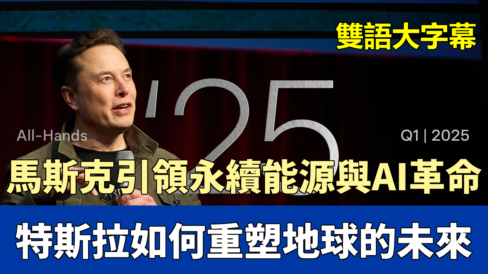

{% video youtube:ZJdSWx-hl9I width:100% autoplay:0 %}
### 【中英文双语脚本】
Our mission is to accelerate the world's transition to sustainable energy.
我们的使命是加速世界向可持续能源的转型。

It's only possible because of the incredible people here at Tesla.
这只有通过特斯拉这里杰出的人们才有可能实现。

They are absolutely committed to the cause of sustainable energy, and that is why we can do what no other company can do.
他们绝对致力于可持续能源的事业，这就是为什么我们可以做到其他公司做不到的事情。

We can make lower-cost products that are still efficient and compelling, and we can make them at scale.
我们可以制造更低成本的产品，同时仍然高效且引人注目，而且我们可以大规模地生产它们。

We're going to build them all in compact and high-output factories that are easy for us to build quickly.
我们将在紧凑且高产的工厂里建造它们，这些工厂对我们来说很容易快速建造。

We work together in a way that allows us to ask the hard questions.
我们以一种允许我们提出难题的方式一起工作。

This is the product that will retire fossil fuels.
这是将淘汰化石燃料的产品。

We're not just creating products, we're creating a movement for sustainable energy for everyone.
我们不仅仅是在创造产品，我们还在为每个人创造一场可持续能源的运动。

What we're trying to convey is a message of hope and optimism.
我们试图传达的是一种希望和乐观的信息。

Optimism that is based on actual physics.
这种乐观是基于实际物理学的。

Earth can and will move to a sustainable energy economy, and will do so in your lifetime.
地球能够并将转向可持续能源经济，并且将在您的有生之年实现。

The solution to scalable FSD is getting the architecture, the data, and the compute just right, and we have assembled a world-class team to execute on this.
可扩展FSD的解决方案是使架构、数据和计算恰到好处，我们已经组建了一个世界一流的团队来执行此任务。

Every truck that we put on the road that replaces a diesel truck makes a huge difference towards driving us towards our total mission of sustainable energy and transportation.
我们投入到道路上的每一辆取代柴油卡车的卡车，都对推动我们实现可持续能源和交通运输的总体使命产生了巨大影响。

You can see and you can feel the collaboration that's happening and the pride that everyone has in working for Tesla.
你可以看到和感受到正在发生的合作，以及每个人在特斯拉工作的自豪感。

All right.
好的。

Well, let me start off first by thanking everyone at Tesla for your incredible hard work.
首先，让我先感谢特斯拉的每一个人，感谢你们令人难以置信的辛勤工作。

I mean, the Tesla team is an incredible team, great human beings.
我的意思是，特斯拉团队是一个令人难以置信的团队，伟大的人类。

I mean, some of the finest people in the world work at Tesla.
我的意思是，世界上最优秀的人才都在特斯拉工作。

Designing and manufacturing are incredible products.
设计和制造都是令人难以置信的产品。

So, my thanks to you for everything you're doing.
所以，我感谢你们所做的一切。

Well done.
做得好。

So, we're going to go through just a list of the incredible achievements of the Tesla team.
所以，我们将快速浏览一下特斯拉团队取得的令人难以置信的成就清单。

We've now produced over 7 million vehicles.
我们现在已经生产了超过700万辆汽车。

7 million!
700万辆！

In our first year of production, we produced just over 20 vehicles.
在我们的第一个生产年度，我们只生产了20多辆汽车。

And I thought, well, maybe we might one day be able to do 10 or 20 a week instead of 10 or 20 a year.
我当时想，嗯，也许有一天我们能够每周生产10或20辆，而不是每年生产10或20辆。

And the way things are tracking right now, we will actually have made over 10 million vehicles next year.
按照目前的发展趋势，我们明年实际上将生产超过1000万辆汽车。

So, we'll pass the 10 million vehicle cumulative.
所以，我们将超过1000万辆汽车的累计产量。

That's a lot of cars, man.
那真是很多车啊，伙计。

That's a lot of cars.
那真是很多车。

So, it's really, and it's incredibly difficult, as you know, to design, to build, to manage the supply chain with thousands of suppliers, make sure everything arrives.
所以，真的，而且非常困难，如您所知，要设计、制造、管理与数千家供应商的供应链，确保一切都到位。

You've got tens of thousands of parts, make sure everything works.
你有成千上万个零件，确保一切正常工作。

Then build the car, service the car, and it's really difficult.
然后制造汽车，维修汽车，这真的很难。

I mean, frankly, the car business is a tough business.
我的意思是，坦率地说，汽车行业是一个艰难的行业。

So, and, you know, there are times when there are rocky moments, like things are, like a little bit of stormy weather.
所以，而且，你知道，有时会有艰难的时刻，比如事情进展不顺，就像遇到一点暴风雨天气。

But what I'm here to tell you is that the future is incredibly bright and exciting.
但我要告诉你们的是，未来无比光明和令人兴奋。

And we're going to do things that no one, I think, has even dreamed of.
我们将要做一些我认为没有人甚至梦想过的事情。

You know, we've said we're going to do it, but I think until we actually do it, people won't believe just how incredible it is.
你知道，我们说过我们要这样做，但我认为在我们真正做到之前，人们不会相信它有多么不可思议。

So, I'm going to go through all of the things that we're accomplishing here.
所以，我将回顾我们在这里正在完成的所有事情。

So, once again, thank you very much.
所以，再次感谢大家。

You know, it's worth noting that Tesla remains the company of choice for people to work for.
你知道，值得注意的是，特斯拉仍然是人们工作的首选公司。

So, we get millions of applications per year for a very small number of spots.
所以，我们每年收到数百万份申请，但只有极少数名额。

And we continue to be the leading organization, along with SpaceX, for engineering talent in the world and also for manufacturing talent.
我们仍然是世界领先的工程人才和制造人才的组织，与SpaceX并驾齐驱。

Really for, it's like it's an awesome place to work, basically.
真的，基本上，这是一个很棒的工作场所。

And because of our growth, there's a lot of opportunity for upward mobility.
而且由于我们的增长，有很多向上流动的机会。

And I'm going to talk you through just, you know, how I see the future unfolding and why I think it is going to be incredible.
我将向您介绍一下，你知道，我如何看待未来的发展，以及为什么我认为它将是令人难以置信的。

So, first of all, as always, we care a lot about safety, so the safety of our cars and the safety of people within the factory.
所以，首先，和往常一样，我们非常关心安全，所以我们汽车的安全和工厂内部人员的安全。

So, you can see that our work-related injuries have declined over time.
所以，你可以看到我们的工伤事故随着时间的推移而减少。

So, thank you for helping make that happen.
所以，感谢你们帮助实现这一点。

That's a collaborative effort.
这是一项协作努力。

So, congratulations to the safety team on continuing to improve workplace safety.
所以，祝贺安全团队继续提高工作场所安全。

So, one of the things that may seem like, how do you pull it all together is, you know, where does AI and robots fit in this sort of sustainable energy picture?
所以，其中一件事可能看起来像，你如何将所有这些结合在一起，你知道，人工智能和机器人如何融入这种可持续能源的蓝图中？

Like, is that just like some weird side project or what, you know?
就像，这只是某种奇怪的副项目还是什么，你知道吗？

But it's because what we're really aiming for here is, maybe a better way to think about it rather than sustainable energy is sustainable abundance for all.
但这因为我们真正追求的是，也许一个更好的思考方式不是可持续能源，而是所有人都可以持续获得丰盈。

So, if you think about, like, what is the future that would, what's the most exciting future that you could possibly imagine?
所以，如果你想想，比如，什么样的未来会，你所能想象的最令人兴奋的未来是什么？

Like, what does that future look like?
就像，那个未来是什么样的？

It's worth thinking about that.
值得思考一下。

Just think, just imagine a future.
想想，想象一下未来。

What does that amazing future look like?
那个令人惊叹的未来是什么样的？

How about a future where you can have any good or service you want, at will?
如果未来你可以随意获得任何你想要的商品或服务呢？

A future of abundance for all, where really anyone can have anything.
一个所有人都可以获得丰盈的未来，在那里，真的每个人都可以拥有任何东西。

It sounds impossible.
这听起来不可能。

It sounds like surely such a thing cannot be the case.
这听起来肯定不会是这样的。

But what I'm here to tell you is that that will indeed be the case.
但我要告诉你们的是，情况确实如此。

That the future we're headed for is one where you can literally just have anything you want.
我们所走向的未来是，你可以真正拥有你想要的任何东西。

Like, if there's a good or service you want, you'll be able to have it, and ultimately everyone in the world will be able to have anything they want.
比如，如果你想要某种商品或服务，你就能得到它，最终世界上每个人都能拥有他们想要的任何东西。

What's key to that is robotics and AI.
其中的关键是机器人技术和人工智能。

So, once you have self-driving cars and you have autonomous humanoid robots, where everyone can have their own personal C3PO and R2D2, but even better than that, that's optimus.
所以，一旦你拥有了自动驾驶汽车，并且拥有了自主的人形机器人，每个人都可以拥有自己的C3PO和R2D2，甚至比那更好，那就是擎天柱。

You can imagine, like, your own personal robot buddy that is a great friend but also takes care of your house.
你可以想象，比如，你自己的私人机器人伙伴，它是一个好朋友，同时也照顾你的房子。

Will clean your house, will mow the lawn, will walk the dog, will teach your kids, will babysit, and will also enable the production of goods and services, basically with no limit.
会打扫你的房子，会修剪草坪，会遛狗，会教你的孩子，会照顾孩子，还会实现商品和服务的生产，基本上没有限制。

And when you combine that with sustainable energy from the sun and batteries, we can at the same time also maintain a great environment.
当你把这与来自太阳和电池的可持续能源结合起来时，我们也可以同时保持一个良好的环境。

So that, I think, is the future that we want.
所以，我认为，这就是我们想要的未来。

A future where nobody's in need.
一个没有人需要的未来。

You can have what you want.
你可以拥有你想要的。

But we still have nature.
但我们仍然拥有大自然。

We still have the beautiful parts of nature that we like.
我们仍然拥有我们喜欢的大自然的美丽部分。

I think that's probably the best future.
我认为这可能是最好的未来。

What other future would you want?
你还想要什么样的未来？

I think that's, like, the cool future.
我认为，那就像，很酷的未来。

Space travel, let's not forget that.
太空旅行，让我们不要忘记这一点。

So if you can have basically anything you want and travel to space and go to Mars, that would be about as good as it gets.
所以，如果你基本上可以拥有你想要的任何东西，并且可以去太空旅行，去火星，那就差不多是最好了。

It's like, that's it.
就像，就是这样。

So what we're trying to do is take the set of actions most likely to lead to a great future for all.
所以我们试图做的是采取最有可能为所有人带来美好未来的行动。

So that's what I mean by sustainable abundance.
所以这就是我所说的可持续丰盈。

And the combination of things that we're making with Optimus and AI Compute will achieve an age of abundance for all.
我们将使用擎天柱和人工智能计算制造的各种东西的结合将实现所有人的丰盈时代。

Like, actually.
真的。

So it's going to be pretty great.
所以它会非常棒。

Model Y became the best-selling vehicle in the world.
Model Y 成为世界上最畅销的汽车。

You know, FYI, we do make the best. How are we doing on popularity?
你知道，顺便说一句，我们确实制造了最好的。我们在受欢迎程度方面做得怎么样？

Well, we actually literally make the best-selling car on Earth of any kind.
嗯，实际上，我们确实制造了地球上任何类型的最畅销汽车。

So that ends for two years in a row.
所以，它连续两年都是这样。

And it's going to be the best-selling car on Earth again this year.
今年它将再次成为地球上最畅销的汽车。

The Cybertruck became the best-selling electric vehicle pickup instantly, because it's awesome.
Cybertruck 立即成为最畅销的电动皮卡，因为它太棒了。

And Tesla was the best-selling electric vehicle in Europe, the fastest growing brand in South Korea.
特斯拉是欧洲最畅销的电动汽车，也是韩国增长最快的品牌。

And we launched in a lot of new markets, including Qatar, Lithuania, Chile, and the Philippines.
我们进入了很多新市场，包括卡塔尔、立陶宛、智利和菲律宾。

And we'll be opening in a whole bunch more markets as well.
我们还将在更多市场开设业务。

So Teslas will be available worldwide.
所以特斯拉将在全球范围内销售。

So overall, you know, it's good.
总的来说，你知道，这很好。

If you read the news, it feels like, you know, Armageddon.
如果你阅读新闻，感觉就像，你知道，世界末日。

So it's like, I can't walk past the TV without seeing a Tesla on fire.
所以就像，我走过电视机前，总是看到一辆特斯拉着火。

You're like, what's going on?
你就会想，发生了什么事？

You know, some people, it's like, listen, I understand if you don't want to buy our product, but you don't have to burn it down, that's a bit unreasonable, you know.
你知道，有些人，就像，听着，我理解如果你不想购买我们的产品，但你不必把它烧掉，这有点不合理，你知道。

Like, this is psycho.
就像，这太疯狂了。

Still being psycho.
还是太疯狂了。

Okay.
好吧。

So, and we launched the new Model Y. Congrats to the team on Tesla.
所以，我们推出了新款Model Y。祝贺特斯拉团队。

That's obviously very tough because we've got factories all across the world.
这显然非常困难，因为我们在世界各地都有工厂。

And we've got a change of a global supply chain on three, basically three supply chains on three continents.
而且我们在三个大陆上改变了全球供应链，基本上是三个供应链。

And I think you did an amazing job of switching over the world's best-selling car globally in a very short period of time.
我认为你们在很短的时间内就在全球范围内完成了世界畅销汽车的转换，做得非常出色。

Well done, guys.
做得好，伙计们。

And this, I'll forget, also we upgraded Model 3 last year.
还有这个，我会忘记的，我们去年也升级了Model 3。

So I would encourage people to also buy the Model 3.
所以我会鼓励人们也购买Model 3。

It's a great car.
这是一辆很棒的汽车。

So, and the Cybertruck has achieved five-star safety.
所以，Cybertruck已经获得了五星级安全评级。

You know, these days, you know, sometimes things get a little dangerous in the neighborhood.
你知道，现在，你知道，有时社区里会发生一些危险的事情。

The Cybertruck, being bulletproof and all, can come in handy.
Cybertruck，由于是防弹的，可能会派上用场。

So, but apart from being bulletproof, it's also very safe in a crash.
所以，但除了防弹之外，它在碰撞中也很安全。

We're also building the Tesla Semi Factory.
我们还在建造特斯拉Semi工厂。

This is a vehicle that some people said was impossible to build, that it defied physics.
这是一款有些人说不可能建造的汽车，它违背了物理学。

Well, not only does it not defy physics, we're going to be making a lot of them.
嗯，它不仅没有违背物理学，我们还将制造很多。

So we're going to make just a, you know, I think ultimately we'll make over a million, millions probably, of the Tesla Semi.
所以我们将制造，你知道，我认为最终我们将制造超过一百万辆，可能数百万辆的特斯拉Semi。

And this is really going to be something that you'll see all over the place.
这真的会是你随处可见的东西。

And it'll also be autonomous or have the ability to go autonomous down the road.
而且它也将是自动的，或者将来具有自动驾驶的能力。

So, really, autonomy is a massive, massive thing.
所以，真的，自主性是一件非常非常重要的事情。

The future is autonomous.
未来是自主的。

So, I always sort of think, like, what will the future look like in five years or ten years, twenty years?
所以，我总是想，比如，五年、十年、二十年后，未来会是什么样？

And five years from now, autonomous cars are going to be everywhere, primarily going to be Teslas, by the way.
五年后，自动驾驶汽车将无处不在，顺便说一句，主要是特斯拉。

But autonomous Teslas will be everywhere.
但自动驾驶特斯拉将无处不在。

And I think in five years, probably we'll have regulatory approval, I think globally.
我认为五年后，我们可能会获得监管部门的批准，我认为在全球范围内。

So you'll have autonomous Teslas on every continent, taking people on trips.
所以你将在每个大陆上都看到自动驾驶特斯拉，带着人们去旅行。

And almost the entire fleet, which will pass ten million vehicles next year, is capable of full autonomy.
几乎整个车队，明年将超过1000万辆汽车，都具有完全自主驾驶的能力。

So even without the cyber cab, we still actually have a gigantic fleet that is capable of being autonomous.
所以即使没有cyber cab，我们实际上仍然拥有一支庞大的车队，能够实现自主驾驶。

And the thing about being an autonomous car is that it can be used much more than a car that is not autonomous.
自动驾驶汽车的特点是，它可以比非自动驾驶汽车使用更多。

A typical passenger vehicle car will be used about ten hours a week.
一辆典型的乘用车每周将被使用大约十个小时。

So people might use it for an hour and a half a day on average for seven days, which is about ten hours a week.
所以人们可能会平均每天使用它一个半小时，持续七天，这大约是一周十个小时。

But there are 168 hours in a week.
但一周有168个小时。

So if you have a car that's a robot car that can drive autonomously, it can now be used potentially for 80, maybe 100 hours a week.
所以如果你有一辆可以自动驾驶的机器人汽车，它现在每周可能会被使用80个小时，甚至100个小时。

So you could have a car that has ten times the usefulness of a non-autonomous car, but it still costs the same.
所以你可以拥有一辆其效用是非自动驾驶汽车十倍的汽车，但它的成本仍然相同。

In fact, the fleet's already built.
事实上，车队已经建成。

So the software update just enables that capability.
所以软件更新只是启用了该功能。

Overnight, you have an increase in usefulness of ten million cars that suddenly become like 50 million cars or maybe 80 or 100 million cars of usefulness overnight.
一夜之间，你有了一千万辆汽车的效用增加，突然变得像五千万辆汽车，甚至八千万或一亿辆汽车的效用一夜之间。

That's a profound thing.
这是一件深刻的事情。

Nothing like that has ever happened before.
以前从未发生过类似的事情。

There is no analogy that there's no, there's never been something where a software update increased the value of a gigantic asset base by a factor of like 500 to 1,000 percent.
没有类比，从来没有任何东西，软件更新将一个巨大的资产基础的价值提高了500%到1000%。

So it's very difficult for people in the stock market, especially those that look in the rear view mirror.
所以对于股市中的人来说，这非常困难，尤其是那些只看后视镜的人。

Which is most people, to imagine a future where suddenly a ten million vehicle fleet has five to ten times the usefulness.
大多数人，难以想象一个未来，突然拥有一千万辆汽车的车队具有五到十倍的效用。

It's so profound and there's no comparison with anything in the past that they just can't, it does not compute.
这是如此深刻，而且与过去没有任何可比性，他们只是无法理解，它无法计算。

But it will compute in the future.
但它会在未来计算出来。

And some people like Kathy Wood at ARK Invest do see the future.
一些像ARK Invest的凯西·伍德这样的人确实看到了未来。

So what I'm saying is hang on to your stock.
所以我想说的是，坚持持有你的股票。

So, yeah, it's really, it's mind blowing.
所以，是的，这真的令人难以置信。

Then I want to give a shout out to service.
然后我想对服务部门表示敬意。

Service is a tough job, an important job, and it's actually what sells cars long term.
服务是一项艰巨的工作，一项重要的工作，它实际上是长期销售汽车的原因。

You know, because the initial car is sold with sales, but all future cars are sold with service.
你知道，因为最初的汽车是通过销售售出的，但所有未来的汽车都是通过服务售出的。

And I always encourage our service team, like, let's try to give people a service experience that they love.
我总是鼓励我们的服务团队，比如，让我们尝试给人们一种他们喜欢的服务体验。

Not merely that they like, but that they love.
不仅仅是他们喜欢，而是他们热爱。

Because people will talk about something that they love that was an amazing experience, but they don't talk that much about things that they like.
因为人们会谈论他们喜欢的东西，那是一种很棒的体验，但他们不会过多地谈论他们喜欢的东西。

You have to really do something amazing.
你必须真正做一些令人惊叹的事情。

And then they'll talk about it and be like, wow, that's incredible.
然后他们会谈论它，然后说，哇，这太不可思议了。

So thank you to the service team for the great job you do.
所以感谢服务团队你们的出色工作。

And you can see sort of, I like this light map of superchargers.
你可以看到，我喜欢这张超级充电站的光照地图。

You can see you can go practically anywhere in the U.S., Mexico, Europe, China.
你可以看到，你几乎可以去美国的任何地方，墨西哥，欧洲，中国。

Well, I guess not the outback of Australia.
嗯，我想不是澳大利亚的内陆地区。

But, you know, most of the places where people live.
但是，你知道，大多数人居住的地方。

So our supercharger network continues to grow significantly.
所以我们的超级充电站网络继续显着增长。

And we keep upgrading our superchargers.
我们不断升级我们的超级充电站。

In fact, I still run into a lot of people who don't realize that you can drive.
事实上，我仍然遇到很多人，他们没有意识到你可以开车。

You can take your Tesla on a road trip anywhere in America or anywhere in Europe, anywhere, pretty much anywhere in China, just using the Tesla supercharger network.
你可以驾驶你的特斯拉去美国或欧洲的任何地方旅行，几乎可以在中国的任何地方旅行，只需使用特斯拉的超级充电站网络。

And it's actually easy and convenient.
而且它实际上很容易和方便。

So people think that whatever the range of the car is, that's as far as they can go.
所以人们认为无论汽车的续航里程是多少，他们只能走那么远。

It's like, no, you just stop at a supercharger network.
就像，不，你只需在超级充电站网络停下来。

The car's battery will last longer than your bladder.
汽车的电池比你的膀胱持续的时间更长。

I'm pretty confident.
我非常有信心。

So that's really the threshold.
所以这才是真正的门槛。

As long as the car battery lasts longer than your bladder and you just plug it in when you go to the restroom and you come back and grab a coffee.
只要汽车电池的持续时间比你的膀胱长，而且你在去洗手间时把它插上，然后你回来喝杯咖啡。

Or whatever and you're back on the road and everything's good.
或者不管什么，你回到路上，一切都很好。

Then that's the range that matters and the supercharging speed that matters.
那么这就是重要的续航里程和重要的超级充电速度。

So, yes, so congrats to the supercharger team on expanding that work.
所以，是的，所以祝贺超级充电站团队扩展了这项工作。

You did great work there.
你们在那里做了很棒的工作。

And then, I mean, the MegaPak and PowerWall team are really knocking it out of the park.
然后，我的意思是，MegaPak和PowerWall团队真的做得非常出色。

The demand for stationary battery storage is gigantic.
对固定电池存储的需求是巨大的。

And I think that is actually only going to increase dramatically over time.
我认为随着时间的推移，这种情况只会大幅增加。

So, and we've got the Shanghai MegaFactory that got started in record time in February.
所以，我们在二月份开设了上海MegaFactory，该工厂在创纪录的时间内启动。

Congrats to the Shanghai factory team there.
祝贺上海工厂团队。

That's awesome.
太棒了。

And the PowerWall 3 is, it usually takes about three major technology iterations for the product to be great.
PowerWall 3通常需要大约三个主要的技术迭代，产品才能变得很棒。

And the PowerWall 3 really is a fantastic home energy product.
PowerWall 3确实是一款出色的家用能源产品。

And it's something that if you want to ensure that your home has uninterrupted power during a power outage, the PowerWall 3 is the way to go.
如果你想确保你的家在停电期间拥有不间断的电力，PowerWall 3是一个不错的选择。

And if you combine that with solar, you can basically be off-grid, which is pretty cool.
如果你把它与太阳能结合起来，你基本上可以脱离电网，这非常酷。

But I think just having energy insurance, like being, or energy assurance, such that if the utility goes down, you don't even notice.
但我认为仅仅拥有能源保险，或者说是能源保障，这样，如果公用事业公司倒闭了，你甚至不会注意到。

Like the lights are on in your house and your neighbors will come to you for help, basically.
就像你家里的灯亮着，你的邻居会来找你帮忙，基本上就是这样。

That's actually what happens when somebody has a Tesla PowerWall and there's a power outage.
当有人拥有特斯拉PowerWall并且停电时，实际上会发生这种情况。

So that's a great product.
所以这是一个很棒的产品。

And then, yeah, MegaPak, especially at the utility scale, is the opportunity there is gigantic because it enables a utility grid to dramatically increase the output of electricity.
然后，是的，MegaPak，尤其是在公用事业规模上，那里的机会是巨大的，因为它使公用事业电网能够显着提高电力输出。

Because you can generate electricity at night and then MegaPak can provide that electricity during the day because normal electricity demand is very uneven.
因为你可以在晚上发电，然后MegaPak可以在白天提供电力，因为正常的电力需求非常不均衡。

There's a lot of electricity usage during the day, but limited at night.
白天有很多电力使用，但在晚上有限制。

So MegaPak actually has the potential to increase the output of an existing electricity grid by more than double.
所以MegaPak实际上有潜力将现有电网的输出增加一倍以上。

So you can actually, without building additional power plants, double the total output of energy in a year.
所以你实际上可以在不建造额外发电厂的情况下，将一年的总能量输出增加一倍。

So that's quite a profound thing.
所以这是一件非常深刻的事情。

Yeah, so MegaPak is also really good at stabilizing the grid.
是的，所以MegaPak也非常擅长稳定电网。

So if there's variations in power in the grid, the MegaPak can absorb.
所以如果电网中的电力有变化，MegaPak可以吸收。

If there's a big power spike, it can absorb and store the power.
如果出现大的电力尖峰，它可以吸收和存储电力。

And then if there's a drop in power, it can fill in the gap.
然后如果电力下降，它可以填补空白。

So MegaPak is excellent for stabilizing the grid and obviously it matches very well with wind and solar.
所以MegaPak非常适合稳定电网，显然它与风能和太阳能非常匹配。

In fact, satellites are just solar panels and a battery.
事实上，卫星只是太阳能电池板和电池。

That's how all satellites work.
所有卫星都是这样工作的。

And with the Starlink satellite network, there's 7,000 satellites orbiting the Earth, and all they use is solar panels and a battery.
使用Starlink卫星网络，有7,000颗卫星绕地球运行，它们使用的只是太阳能电池板和电池。

My prediction is long term, a majority of power on Earth.
我的预测是长期来看，地球上的大部分电力。

In fact, eventually it might be like 90% or more of all power on Earth will be solar panels with batteries.
事实上，最终可能地球上90%甚至更多的电力将是太阳能电池板和电池。

That's my prediction.
这是我的预测。

My predictions have pretty good track record.
我的预测有很好的记录。

So yeah, and the power walls can also act as kind of a virtual grid.
所以是的，电源墙也可以充当一种虚拟电网。

If you have thousands of power walls in a neighborhood, they can actually work in concert to stabilize the grid.
如果你在一个社区里有成千上万个电源墙，它们实际上可以协同工作来稳定电网。

The V4 supercharger is pretty cool.
V4超级充电站非常酷。

It enables charging at 500 kilowatts and the Semi can charge at 1.2 megawatts.
它可以实现500千瓦的充电，Semi可以实现1.2兆瓦的充电。

And it's smaller and lighter.
它更小更轻。

It's a big improvement overall.
总体来说是一个很大的改进。

And we're rolling this out worldwide.
我们正在全球范围内推广它。

So it will increase charging speeds and just enable you to get your car charged really fast.
所以它将提高充电速度，让你能够非常快地为你的汽车充电。

And then with regard to cell manufacturing, at this point we think we're making the most efficient cell in the world.
然后关于电池制造，在这一点上，我们认为我们正在制造世界上效率最高的电池。

Meaning like the lowest cost per kilowatt hour cell, which is really pretty good.
意味着每千瓦时电池的成本最低，这真的非常好。

There are entire companies that all they do is make lithium ion battery cells.
有很多公司，他们所做的就是制造锂离子电池。

And for us that's one of many things that we do.
对我们来说，这是我们所做的许多事情之一。

So congratulations to the cell team on making the best cell.
所以祝贺电池团队制造出最好的电池。

So that's a really big deal.
所以这是一件非常重要的事情。

And then we're also investing in the whole battery supply chain.
然后我们还在投资整个电池供应链。

So we have cathode production, we have lithium refining, and then more.
所以我们有正极生产，我们有锂提炼，然后更多。

Yeah, hopefully.
是的，希望如此。

We're sort of hoping someone else will do the anode.
我们有点希望其他人来做负极。

We might have to do the anode.
我们可能不得不做负极。

I hope someone else does it.
我希望其他人来做。

Why do we have to do all these things?
我们为什么要做到所有这些事情？

A lot of people think we do a lot of these things because we want to, but really it's often just because we didn't have any choice and nobody else was doing it, so we had to do it.
很多人认为我们做很多这些事情是因为我们想这样做，但实际上通常只是因为我们别无选择，而且没有人这样做，所以我们不得不这样做。

So a lot of new factory milestones.
所以很多新的工厂里程碑。

So in Berlin we produced 660,000 drive units.
所以在柏林，我们生产了66万个驱动单元。

In Fremont we built our first Optimus at the Optimus production line in Fremont.
在弗里蒙特，我们在弗里蒙特的擎天柱生产线上建造了我们的第一个擎天柱。

We were preparing for cybercap production here at Gigafactory Austin.
我们正在奥斯汀超级工厂准备进行cybercap的生产。

And Gigafactory Shanghai created its 3 millionth car.
上海超级工厂生产了第300万辆汽车。

We've produced 160,000 Naxx adapters at Gigafactory New York.
我们在纽约超级工厂生产了16万个Naxx适配器。

And we've got record battery pack production at Gigafactory Nevada.
我们在内华达超级工厂实现了创纪录的电池组生产。

So congrats to everyone.
所以祝贺大家。

We also just behind us on the south side of the building we have the Tesla, we call Cortex-1.
我们还在我们身后，建筑南侧，我们拥有特斯拉，我们称之为Cortex-1。

It's basically a giant brain, computer brain, that is used for AI training.
它基本上是一个巨大的大脑，电脑大脑，用于人工智能训练。

So we take the vast amounts of video that we get from all the cars in the fleet, and we use that to train the artificial intelligence to be able to drive the car.
所以我们从车队中的所有汽车中获取大量视频，并使用它来训练人工智能，使其能够驾驶汽车。

And this is one of the most powerful training systems in the world with over 50,000 GPUs active and soon to be 100,000 GPUs.
拥有超过50,000个活跃的GPU，很快将达到100,000个GPU，这是世界上最强大的训练系统之一。

Which will make it I think probably top five in the world in training centers.
我认为这将使其成为世界训练中心的前五名。

We're also continuing to make progress on our Dojo training supercomputer.
我们还在我们的Dojo训练超级计算机上继续取得进展。

So we've got Dojo 1 active now in Gigafactory New York and Palo Alto.
所以我们现在在纽约超级工厂和帕洛阿尔托都启动了Dojo 1。

And it is actively working.
它正在积极工作。

It's actually taking load on, it's doing a meaningful percentage, well, I guess 5% or whatever.
它实际上正在承担负载，它正在做有意义的百分比，好吧，我猜是5%或其他。

But it's still something, 5%, maybe approaching 10% of the training load of the self-driving AI is being done by Dojo.
但这仍然很重要，5%，可能接近自动驾驶人工智能的训练负载的10%是由Dojo完成的。

And then we've got Dojo 2 that's coming down the line.
然后我们还有即将推出的Dojo 2。

That'll be probably 10 times better than Dojo 1.
那可能会比Dojo 1好10倍。

And so it's sort of exciting.
所以这有点令人兴奋。

We're making good progress with Dojo.
我们在Dojo方面取得了良好的进展。

I'm increasingly optimistic about the future of Dojo.
我对Dojo的未来越来越乐观。

I think it's, we've got a real shot here at a breakthrough.
我认为这是，我们在这里有真正的突破机会。

So congrats to the Dojo team.
所以祝贺Dojo团队。

And all Tesla vehicles have now had what we call Autopilot Hardware 4, or really our AI 4 hardware.
现在所有特斯拉汽车都配备了我们所谓的自动驾驶硬件4，或者实际上是我们的AI 4硬件。

And it's really, it's a very powerful AI-inferenced computer, but also operates at very low power.
这确实是一个非常强大的AI推理计算机，但也以非常低的功耗运行。

And even to this day, even though this has been something we designed several years ago, there actually isn't anything on the market that we can buy that is better than AI 4.
即使到了今天，即使这是我们几年前设计的东西，实际上市场上没有任何我们可以购买的东西比AI 4更好。

So, and obviously in the future years we'll have AI 5 and AI 6.
所以，显然在未来的几年里，我们将拥有AI 5和AI 6。

Sometimes people say, "Should I wait?"
有时人们会说，“我应该等待吗？”

I'm like, "Well, we're always going to have another version, so there's no point in waiting because we're always waiting forever."
我就像，“嗯，我们总会有另一个版本，所以没有必要等待，因为我们总是永远在等待。”

So, but we obviously will have an AI 5 and an AI 6 and an AI 7, and we'll keep improving the AI compute.
所以，但我们显然会有AI 5和AI 6和AI 7，我们将继续改进AI计算。

So for those out there that are interested in developing advanced chips, come work at Tesla.
所以对于那些有兴趣开发高级芯片的人，来特斯拉工作吧。

And it is always, I think, profound to watch our cars driving with no one in them.
而且我认为，观看我们的汽车在没有人的情况下驾驶总是令人深刻的。

And we actually have the cars doing useful work for the first time with no one in them, which I think is really, it's a significant milestone.
我们实际上第一次让汽车在没有人的情况下做有用的工作，我认为这真的很重要，这是一个重要的里程碑。

So the cars are driving from end of line in Fremont to park themselves, and I think we've just started doing that here in Austin.
所以汽车从弗里蒙特的生产线下线后自己开到停车位，而且我认为我们刚刚开始在奥斯汀做这件事。

So we'll be, yeah, the car literally goes from end of line in Fremont to its destination parking spot.
所以我们会，是的，汽车确实从弗里蒙特的生产线下线后开到它的目的地停车位。

Where it gets picked up by a truck for delivery to a customer, and it does that with no one in it.
在那里它被卡车接走，运送给客户，而且它在没有人的情况下完成这件事。

And it's not doing that all day every day.
而且它不是每天都这样做。

Like, you know, pretty much like it's just a matter of fact thing.
就像，你知道，几乎就像这是一件理所当然的事情。

Yeah.
是的。

So, let's see.
所以，让我们看看。

Yeah, and obviously for anyone that's using it, you can see the dramatic improvements in the, in full self-driving.
是的，显然对于任何正在使用它的人来说，你可以看到完全自动驾驶方面的巨大改进。

Where it's getting to the point where interventions are extremely rare, and eventually I get to the point where there really is no need to intervene.
它正在达到干预非常罕见的程度，最终我会达到真正不需要干预的程度。

Like, the car is going to be better than human.
就像，汽车将比人类更好。

In fact, maybe it's worth emphasizing that it's not that Tesla full self-driving will be equal to humans in safety.
事实上，也许值得强调的是，特斯拉完全自动驾驶在安全性方面不会等于人类。

It will be ultimately 10 times safer than a human, because it never gets tired.
它最终将比人类安全10倍，因为它永远不会感到疲倦。

It doesn't, you know, like, humans get tired and sometimes get wasted, you know.
它不会，你知道，就像，人类会感到疲倦，有时会浪费时间，你知道。

And we'll have arguments or change the radio or, you know, text.
我们会争论或更换收音机或，你知道，发短信。

I know no one in this audience would ever text while driving.
我知道在座的各位都不会在开车时发短信。

That would be crazy.
那太疯狂了。

But, you know, it does happen.
但是，你知道，它确实会发生。

So, the reality is that the Tesla full self-driving will be vastly safer than humans.
所以，现实情况是特斯拉完全自动驾驶将比人类安全得多。

Not just equivalent, but actually vastly safer.
不仅仅是等同，而是实际上安全得多。

And it means you can do whatever you want while driving.
这意味着你可以在驾驶时做任何你想做的事情。

So, even if you don't, like, rent your car out for usage, you can still, it frees up your time.
所以，即使你不，比如，出租你的汽车供使用，你仍然可以，它释放了你的时间。

So, let's say you're driving 10, 12 hours a week or more, it gives you back 10 to 12 hours of your life, which is extremely cool.
所以，假设你每周驾驶10到12个小时或更多，它会让你找回10到12个小时的生命，这非常酷。

So, well, Optimus sure has come a long way.
所以，擎天柱确实走了很长的路。

So, the new Optimus 22 degree of freedom hand and forearm is now in production.
所以，新的擎天柱22自由度手和前臂现在正在生产中。

And it's learning to walk and catch balls.
它正在学习走路和接球。

It's pretty cool.
这非常酷。

I mean, look, that's where we came from.
我的意思是，看看，那是我们来自的地方。

It's wild.
这太疯狂了。

So, in a very short period of time, Optimus has gone from being an idea to the most sophisticated humanoid robot on Earth.
所以，在很短的时间内，擎天柱已经从一个想法变成了地球上最复杂的人形机器人。

There's nothing even close to the level of sophistication of Optimus.
没有什么能接近擎天柱的复杂程度。

And Tesla has some important missing ingredients that others don't have, which is our robot has a real brain.
特斯拉拥有其他公司没有的一些重要的缺失要素，那就是我们的机器人拥有一个真正的大脑。

It's like Wizard of Oz, Tin Man.
就像绿野仙踪，铁皮人。

Was that a heart or a brain?
那是一个心脏还是一个大脑？

One of the two.
两者之一。

So, it's got the real world AI.
所以，它拥有真实世界的人工智能。

So, Tesla's the leader in real world AI.
所以，特斯拉是真实世界人工智能的领导者。

What we learned from the car, we translate to the Optimus robot.
我们从汽车中学到的东西，我们转化为擎天柱机器人。

We also take our expertise in electric motors, in batteries, power electronics, structural design.
我们还运用我们在电动机、电池、电力电子、结构设计方面的专业知识。

And then another major important thing is that we're very good at manufacturing.
然后另一件主要重要的事情是，我们非常擅长制造。

So, in order for robots to be useful, they have to be intelligent.
所以，为了使机器人有用，它们必须是智能的。

They have to be able to do useful things just by asking.
它们必须能够通过询问来做有用的事情。

And you have to be able to make a large number of them at an affordable price.
你必须能够以合理的价格制造大量它们。

This is what we can do.
这就是我们能做的事情。

The only company with all the ingredients for making intelligent humanoid robots at scale is Tesla.
唯一一家拥有大规模制造智能人形机器人的所有要素的公司是特斯拉。

This is a super big deal.
这是一件非常重要的事情。

My prediction on this front is that Optimus will be the biggest product of all time by far.
我对这方面的预测是，擎天柱将成为有史以来最大的产品。

Nothing will even be close.
没有什么可以接近它。

I think it will be 10 times bigger than the next biggest product ever made.
我认为它将比有史以来第二大的产品大10倍。

Like that level.
就像那个级别。

All right.
好的。

So, with that, anybody have any questions?
所以，有了这些，有人有任何问题吗？

Congratulations.
恭喜。

Thank you.
谢谢。

Cool.
酷。

And we rocket castings.
我们进行火箭铸造。

We do.
我们是的。

Well, we do want to scale up production to new heights.
嗯，我们确实想将生产扩大到新的高度。

Obviously, with the CyberCab, we're going to be.  
显然，有了CyberCab，我们将会这样做。  

The CyberCab is not just revolutionary car design, it's also a revolutionary manufacturing process.  
CyberCab不仅仅是革命性的汽车设计，也是一个革命性的制造过程。  

So, I guess we probably don't talk about that enough.
所以，我想我们可能没有足够地谈论这个。

But if you've seen the design of the CyberCab line, it doesn't look like a normal car manufacturing line.
但是如果你看过CyberCab生产线的设计，它看起来不像普通的汽车生产线。

It looks like a really high speed consumer electronics line.
它看起来像一条非常高速的消费电子产品线。

In fact, the line will move so fast that actually people can't even get close to it.
事实上，这条生产线移动得如此之快，以至于实际上人们甚至无法靠近它。

Like that's. I think it'll be able to produce a car ultimately in less than five seconds.
就像那样。我认为它最终能够在大约不到五秒钟的时间内生产一辆汽车。

Can you imagine a car coming off the line in less than five seconds?
你能想象一辆汽车在不到五秒钟的时间内下线吗？

That's like, whoa.
就像，哇。

Which means casting's got to happen fast.
这意味着铸造必须快速进行。

Yeah, yeah.
是的，是的。

We've got to jam the liquid metal in, cool it down real fast, real fast.
我们必须将液态金属注入，并以非常快的速度冷却它。

And then, I guess maybe we need to just get even bigger casting machines?
然后，我想也许我们只需要获得更大的铸造机？

Sure, why not?
当然，为什么不呢？

Down, yeah, let's. 50,000 tons.
好，是的，让我们。50,000吨。

Because then we can make, in a single casting machine, we could do five at a time or something.
因为这样我们就可以在一台铸造机中一次做五个或其他。

I'm trying to think, how do you scale castings?
我正在想，你如何扩大铸造规模？

Because you've got liquid metal, metal's got to cool.
因为你有液态金属，金属必须冷却。

And then you've got automate, getting all the bits and pieces off the casting so it's usable.
然后你必须自动化，将铸件上的所有碎片都移除，使其可用。

And that's actually kind of how they do it in small volume castings.
这实际上是他们如何在小批量铸造中做到这一点。

They'll have a casting block that'll make 100 Matchbox cars at a time.
他们将有一个铸造块，一次可以制作100辆火柴盒汽车。

Maybe we'll just make that real big.
也许我们只是把它做大。

I mean, we have the Cathedral of Casting back there.
我的意思是，我们后面有铸造大教堂。

So, yeah, let's do that.
所以，是的，让我们这样做。

I mean, let's see, what is the limit of physics of how big can a casting machine be?
我的意思是，让我们看看，物理学对铸造机的尺寸限制是什么？

Let's find out.
让我们找出答案。

I'm down.
我愿意。

Let's have some fun here.
让我们在这里玩得开心。

Limits of technology.
技术的限制。

All right.
好的。

Hi, Elon.
你好，埃隆。

I've been with Tesla for the last eight years.
我已经在特斯拉工作了八年。

It has been the most exhilarating eight years of my career.
这是我职业生涯中最令人振奋的八年。

And truly want to thank you for your leadership.
而且我真心感谢你的领导。

I also have two little, Thank you for your contribution.
我也有两个小，感谢您的贡献。

Thank you.
谢谢。

Thank you for your leadership.
感谢您的领导。

I also have two little girls who spend their weekends cruising around in their very awesome Cybertruck.
我也有两个小女孩，她们在周末驾驶着她们非常棒的Cybertruck四处游玩。

I'd love to know when we can add Optimus to the family.
我很想知道我们什么时候可以把擎天柱加入到家庭中。

Oh, yeah, that's a good question.
哦，是的，这是一个好问题。

So this year we hopefully will be able to make about 5,000 Optimus robots.
所以今年我们有望能够制造大约5,000个擎天柱机器人。

Technically, we're aiming for enough parts to make 10,000, maybe 12,000.
从技术上讲，我们的目标是有足够的零件来制造10,000个，甚至12,000个。

But since it's a totally new product with totally new, like everything is totally new, I'll say like we're succeeding if we get to half of the 10,000.
但由于这是一个全新的产品，拥有全新的，就像一切都是全新的，我会说，如果我们能达到10,000个的一半，我们就成功了。

But even 5,000 robots, that's the size of a Roman legion, FYI.
但即使是5,000个机器人，也相当于一个罗马军团的规模，仅供参考。

Which is like a little scary thought, like a whole legion of robots.
这有点可怕的想法，就像一个完整的机器人军团。

I'd be like, whoa.
我会想，哇。

But I think we'll literally build a legion, at least one legion of robots this year.
但我认为我们今年将真正建造一个军团，至少一个机器人军团。

And then probably 10 legions next year.
然后明年可能会有10个军团。

That's kind of a cool unit, you know.
这是一种很酷的单位，你知道。

Units of legion.
军团单位。

So probably 50,000-ish next year.
所以明年可能大约有50,000个。

And then it's probably ready for, I'm hopefully ready for Optimus to be used outside of Tesla-controlled environment.
然后它可能已经准备好了，我希望已经准备好擎天柱在特斯拉控制环境之外使用。

Maybe around the middle of next year, second half of next year sometime.
可能在明年年中左右，明年下半年某个时候。

So I think that sounds about right.
所以我认为这听起来差不多。

Probably second half of next year is when they'll be available.
可能在明年下半年它们就可以使用了。

And then we will offer Optimus robots first to Tesla employees.
然后我们将首先向特斯拉员工提供擎天柱机器人。

So you guys get priority.
所以你们优先。

There are some pluses and minuses to that, you know.
你知道，这有一些优点和缺点。

Because it's, probably have a few bugs, but it's going to be very cool.
因为，可能有一些错误，但它会非常酷。

You'll definitely want to invite your friends over and say, check this out.
你肯定会想邀请你的朋友过来，然后说，看看这个。

So that's the other questions.
所以这是其他问题。

Hi, Elon.
你好，埃隆。

Hey.
嘿。

My name's Dom.
我叫多姆。

I've been here for a little over a year now.
我在这里工作了一年多。

I work in people development.
我从事人员发展工作。

We try to, we make so many amazing things.
我们试图，我们制造了很多令人惊叹的东西。

Right now it's still the people that do it.
现在仍然是人们在做这件事。

Yes.
是的。

When we think about applying first principles to the relationships and the teams that people have.
当我们考虑将第一性原理应用于人际关系和团队时。

How would you encourage us to think about that and act on those first principles when it comes to relationships and teams?
你将如何鼓励我们思考这个问题，并在人际关系和团队方面按照这些第一性原理行事？

Hmm.
嗯。

Well, I think, you know, there are actually quite a few things I've written over the years that it would be good to compile into like a booklet or something.
嗯，我认为，你知道，实际上我多年来写了很多东西，最好将它们整理成一本小册子之类的东西。

Because I actually have to be reminded of those things myself.
因为实际上我必须自己记住这些事情。

And I'm like, oh, I remember that thing that I thought of after making so many mistakes and trying to make fewer mistakes.
我就像，哦，我记得在犯了这么多错误并试图减少错误之后，我想到的那件事。

So, you know, there's like, for example, a five-step process of like make the requirements less dumb and then try to delete the part and process step.
所以，你知道，例如，有一个五步过程，比如让需求不那么愚蠢，然后尝试删除零件和过程步骤。

Only then optimize, only then speed it up, and only the fifth thing is automate.
只有这样才能优化，只有这样才能加速，只有第五件事是自动化。

I have to repeat that to myself many times because I've made the mistake of doing it backwards so many times.
我必须多次对自己重复这一点，因为我犯了很多次倒着做的错误。

And, you know, I think always operating on the principle that everyone is wrong to some degree and we should aspire to be less wrong over time.
而且，你知道，我认为始终按照每个人在某种程度上都是错误的原则运作，我们应该渴望随着时间的推移变得不那么错误。

Which we will not always succeed in doing.
我们不会总是成功做到这一点。

But if, you know, if two days out of three you're less wrong over time, you're going to be, your batting average is going to be really good.
但是，你知道，如果三天中有两天你随着时间的推移变得不那么错误，你就会，你的击球率会非常好。

So nobody ever bats a thousand, but you can improve your batting average.
所以没有人能达到1000分，但你可以提高你的击球率。

So I think rigorous, you know, you want to critique yourself, you want to internalize responsibility.
所以我认为严格的，你知道，你想批评自己，你想内化责任。

And these are all things I need to remind myself of, you know, just to be clear.
而且这些都是我需要提醒自己的事情，你知道，为了清楚起见。

I don't want to like suggesting I, internalize responsibility.
我不希望像建议我，内化责任。

Be less wrong.
少犯错误。

And we should remember what is our goal as a company.
我们应该记住我们作为公司的目标是什么。

Our goal is to make amazing products that people love and then to take care of those products and service.
我们的目标是制造人们喜爱的惊人产品，然后照顾这些产品和服务。

So we should say what are we doing to make our products better, to make them affordable, to have the customer experience be delightful.
所以我们应该说我们正在做什么来使我们的产品更好，使它们负担得起，使客户体验令人愉快。

Because that's actually the purpose of a company.
因为这实际上是公司的目的。

Sometimes people get why does a company exist?
有时人们会想，公司为什么存在？

A company exists, it's a group of people collected together to produce a compelling product or service that others find useful.
公司的存在，是一群人聚集在一起，生产出引人注目的产品或服务，其他人觉得有用。

And where the value of the product and service is greater than the cost of what it took to make that product or service.
而且产品和服务的价值大于制造该产品或服务所需的成本。

So sometimes weirdly profit is viewed negatively.
所以有时奇怪的是，利润被负面看待。

But really profit is just the difference in value between the output and the input.
但实际上利润只是产出和投入之间的价值差异。

It's like what did it cost you to make it and what did it cost you, and what are people prepared to pay for it?
就像你制造它花了多少钱，它花了你多少钱，以及人们准备为此付出多少钱？

That's the value that you created.
那是你创造的价值。

So it's tough actually even to maintain like a 10% profitability, which is to make the output 10% more valuable than the input.
所以实际上即使要保持像10%的盈利能力也很困难，即要使产出比投入更有价值10%。

It's actually quite hard, especially in the car industry, which is very competitive.
这实际上非常困难，尤其是在竞争激烈的汽车行业。

So we should just not lose sight of like why are we here?
所以我们不应该忘记我们为什么在这里？

We're here to make useful products that people love and take care of them over time.
我们在这里制造人们喜爱的有用产品，并随着时间的推移照顾它们。

So then how are we doing in that respect and how can we do that better?
所以我们在这方面做得怎么样？我们如何才能做得更好？

Sure.
当然。

What advice would you give a young person like getting into the stock market?
你会给一个刚进入股市的年轻人什么建议？

Oh, stock advice.
哦，股票建议。

Wow.
哇。

Yes, sir.
是的，先生。

As I think people can perhaps tell who are watching this, these questions are not prepared in advance.
我认为人们可以告诉那些正在观看的人，这些问题不是事先准备好的。

This is literally random questions from the crowd, which is cool.
这确实是来自人群的随机问题，这很酷。

I actually am fine with that.
我实际上对此很好。

And I think that it's going to sound very straightforward.
我认为这听起来会非常简单。

But you want to really buy stock in companies where you think the products that that company makes will be better in the future.
但是你真的想购买那些你认为该公司制造的产品将来会更好的公司的股票。

Like is that company going to make more and better products?
就像该公司会制造更多更好的产品吗？

Or like do you love the products that that company makes and are they going to keep doing that?
或者你喜欢该公司制造的产品，他们会继续这样做吗？

And like I think Tesla, as I've just gone through, Tesla has a track record of having made many great products.
而且我认为特斯拉，就像我刚才经历的那样，特斯拉有制造许多伟大产品的记录。

And we're going to make many more future great products and we're going to scale up production.
我们将制造更多未来的伟大产品，我们将扩大生产。

And I think we've demonstrated a level of innovation that is extremely rare.
我认为我们已经展示了极其罕见的创新水平。

I mean, certainly by far the most innovative company in the car industry, like not even close type of thing.
我的意思是，当然是迄今为止汽车行业最具创新性的公司，根本没有可比性。

So, you know, I do think Tesla stock actually long I think long term with with Optimus and self driving Tesla will probably be the most valuable company in the world.
所以，你知道，我确实认为特斯拉股票实际上长期来看，我认为长期来看，随着擎天柱和自动驾驶，特斯拉可能会成为世界上最有价值的公司。

But there are also other companies out there that make great products and services.
但是也有其他公司制造出色的产品和服务。

So I think that's the way you want to look at it.
所以我认为这就是你想看待它的方式。

Say like, do you think this product because that's the reason why companies exist is to make great products and services.
说，你认为这个产品，因为这就是公司存在的原因是制造出色的产品和服务。

So if you think that the company is going to improve over time, then buy the stock and if you don't, then don't.
所以如果你认为公司会随着时间的推移而进步，那就购买股票，如果你不这么认为，那就不要购买。

And then the stock market is it's a very strange thing.
然后股市是一个非常奇怪的东西。

It's kind of like, you know, I think it was Warren Buffett sort of metaphor analogy is.
这有点像，你知道，我认为这是沃伦·巴菲特的一种隐喻类比。

You know, stock markets like having someone stand at the edge of your property or your house and yell prices to buy or sell your house every day.
你知道，股市就像有人每天站在你的财产或你房子的边缘，喊叫买卖你的房子的价格。

And like sometimes they take their meds and sometimes they don't, you know.
就像有时他们吃药，有时他们不吃药，你知道。

So sometimes the person yelling the price of your house is having a good day or sometimes having a bad day.
所以有时喊叫你房子价格的人心情很好，有时心情不好。

But it's still the same house.
但它仍然是同一栋房子。

You're like, I'm like literally still the same house.
你会想，我实际上仍然是同一栋房子。

Like, you know, so Tesla stock goes up and it goes down.
就像，你知道，所以特斯拉股票上涨和下跌。

But actually it's still the same company.
但实际上它仍然是同一家公司。

It's just people's perception of the future.
这只是人们对未来的看法。

I don't know.
我不知道。

I guess it's just very emotional, you know.
我猜这只是非常情绪化的，你知道。

So but for me, like while it's difficult to predict how things will be from.
所以但对我来说，虽然很难预测事情会如何发展。

You know, in the next six to 12 months, if you say like where will things be in three years or five years, the future of Tesla is incredibly bright.
你知道，在接下来的六到十二个月里，如果你说三年或五年后会是什么样子，特斯拉的未来将非常光明。

Hello, Eli.
你好，埃莱。

I'm Hi.
我是嗨。

Yes.
是的。

You say will the robot take your job or what?
你说机器人会抢走你的工作吗？

That's a fair question.
这是一个公平的问题。

So yeah, like is the robot going to come steal your job?
所以是的，机器人会来抢走你的工作吗？

A reasonable question.
一个合理的问题。

I think what we'll find with the robots is that there will be a ratio of people to robots.
我认为我们将会发现，机器人会与人形成一种比例。

So you'll effectively end up having managing a group of robots.
所以你最终会有效地管理一组机器人。

So you know, you'll have like basically, I don't know, your flock or your little group of robots that you take care of and you tell them what to do.
所以你知道，你会像基本上，我不知道，你的羊群或你的小群机器人，你照顾它们并告诉它们做什么。

And I don't know, you'll have a pack of robots basically.
而且我不知道，你基本上会有一群机器人。

Yeah, you're promoted to manager.
是的，你被提升为经理。

One way to think of it.
一种思考方式。

I think the same thing will be true of cars.
我认为汽车也会如此。

Like for the self-driving cars is that people that are say Uber drivers today or something like that or taxi drivers today will end up managing a fleet of cars.
就像对于自动驾驶汽车来说，比如今天优步司机或者出租车司机之类的人最终会管理一支车队。

And that will be a much more effective use of their time.
这将更加有效地利用他们的时间。

You know, just taking care of like 10, 20 cars or however many they can take care of.
你知道，只是照顾像10辆，20辆汽车或他们能照顾的任何数量的汽车。

So yeah.
所以是的。

Hello, my name is Adrian.
你好，我叫阿德里安。

You said that your companies are made to make products people love.
你说你的公司是为了制造人们喜爱的产品而设立的。

Yeah.
是的。

Have you ever thought of airplanes or trains?
你有没有想过飞机或火车？

Yeah, I mean, I'd actually love to make airplanes especially, but I'm stretched pretty thin.
是的，我的意思是，我实际上很想制造飞机，但我已经分身乏术了。

So I have like 17 jobs.
所以我身兼17职。

At this point I just go to sleep, work, go to sleep, and then do that seven days a week pretty much.
在这一点上，我只是睡觉，工作，睡觉，然后每周七天都这样做。

People say like where do you go on vacation?
人们会说，比如你去哪里度假？

I'm like what's that?
我就像那是什么？

You know.
你知道。

But I guess I like being productive.
但我猜我喜欢有生产力。

I like getting things done.
我喜欢把事情做完。

So I guess I could choose to be like on an island somewhere, sipping a Mai Tai, you know, with attractive people in bikinis and stuff.
所以我猜我可以选择在某个岛屿上，啜饮一杯Mai Tai，你知道，和穿着比基尼的有魅力的人在一起。

Wait, why am I not doing that?
等等，我为什么不这样做？

What?
什么？

What a fool I've been.
我真是个傻瓜。

So yeah.
所以是的。

I've actually thought about aircraft designs for a long time.
实际上我已经考虑飞机设计很长时间了。

And I think there's an interesting opportunity to make like an electric supersonic VTOL jet.
我认为有一个有趣的机会来制造像电动超音速VTOL喷气机。

You know, the VTOL is like cherry on the cake, but certainly electric, long range fast electric airplane would be very cool.
你知道，VTOL就像锦上添花，但当然电动，远程快速电动飞机会非常酷。

You know, maybe at some point we'll do that.
你知道，也许在某个时候我们会这样做。

Yeah, that would be kind of fun.
是的，这会很有趣。

But we do have the ingredients for it.
但我们确实拥有制造它的要素。

So.
所以。

And then there is the potential for, yeah, we're like thinking like pretty far into the future here of not a conventional train, but that sort of hyperloop.
然后有潜力，是的，我们正在考虑非常遥远的未来，不是传统的火车，而是那种超级高铁。

Essentially vacuum tunnels, like tunnels where you draw a vacuum so there's no air resistance.
基本上是真空隧道，就像你在隧道里抽真空一样，这样就没有空气阻力。

And you have very high speed, autonomous electric pods in a vacuum tube, vacuum tunnel.
而且你在真空管，真空隧道里有非常高速，自主的电动舱。

That would allow you to go from city center to city center much faster than any airplane could possibly go.
这将使你从市中心到市中心的速度比任何飞机都快得多。

Because going into the into the underground vacuum tunnel would be like teleporting to super high altitude effectively, which no plane could do.
因为进入地下真空隧道就像有效地传送到超高海拔，这是任何飞机都做不到的。

And then it could deliver you right to the center of a city.
然后它可以将你送到一个城市的中心。

And that I don't know, maybe that's some future collaboration with the Boeing company and Tesla.
而且我不知道，也许这是未来与波音公司和特斯拉的合作。

I got a million ideas.
我有一百万个想法。

The ideas are I have more ideas than I know what to do with.
我的想法比我知道如何处理的还要多。

Ideas are kind of the easy part.
想法是比较容易的部分。

Execution is the hard part.
执行是困难的部分。

As they say, it's one percent inspiration, 99 percent post-proporation.
正如他们所说，这是百分之一的灵感，百分之九十九的事后努力。

Work in manufacturing engineering.
从事制造工程工作。

Since 2018, I've done a bunch of different things here, kind of like energy products, Model 3, Model Y, cyber.
自2018年以来，我在这里做了很多不同的事情，有点像能源产品，Model 3，Model Y，cyber。

And now we're looking forward to Optimus, maybe the biggest product ever.
现在我们期待着擎天柱，也许是有史以来最大的产品。

Yeah, it will be.
是的，会的。

And I think about the mission statement of the company and its evolved.
我想到了公司的使命宣言及其演变。

It used to be a sustainable transportation, then sustainable energy.
它曾经是可持续交通，然后是可持续能源。

Is it going to evolve again?
它会再次发展吗？

Are we going to reformulate that officially to kind of explain to the world better about how Optimus and AI folds into the rest of the fabric of the company?
我们将正式重新制定它，以更好地向世界解释擎天柱和人工智能如何融入公司的其他结构中吗？

Yeah, I mean, I touched on this briefly earlier, but you're right that I think we do need to articulate it more prominently.
是的，我的意思是，我之前简要地提到了这一点，但你是对的，我认为我们确实需要更突出地表达它。

And maybe more often because it's really about sustainable abundance.
也许更频繁地表达它，因为它实际上是关于可持续的丰盈。

Can we have a future of abundance for all that is also sustainable and compatible with nature?
我们能拥有一个为所有人带来丰盈的未来，同时又是可持续的并且与自然兼容吗？

So we're not destroying nature, but you also get abundance for everyone on Earth.
所以我们没有破坏自然，但你也为地球上的每个人获得了丰盈。

Sounds like the best possible future.
听起来是最好的未来。

That's what we're trying to do.
这就是我们试图做的。

Yeah.
是的。

Yes, sir, my name is Aaron Armstrong.
是的，先生，我叫艾伦·阿姆斯特朗。

Yes, sir, my name is Aaron Armstrong.
是的，先生，我叫艾伦·阿姆斯特朗。

It's not every day that you get to be in the presence of somebody that's accumulated so much wealth and success.
你不是每天都有机会与积累了如此多财富和成功的人在一起。

So I just wanted to take this opportunity to ask for any wisdoms or secrets that you may have to offer about this game of life that we're all trying to play.
所以我想借此机会询问你可能拥有的关于我们都在试图玩的游戏人生的任何智慧或秘密。

Sure.
当然。

I mean, I try to say everything that I know.
我的意思是，我尽量说出我所知道的一切。

Well, admittedly, sometimes I'm, you know, like I posted on X.
嗯，不得不承认，有时我是，你知道，就像我在X上发布的。

I guess I should ask the AI to look through all of my X posts and pick out the ones that are really good because I try to say any good ideas that I have.
我想我应该要求人工智能查看我所有的X帖子，并挑选出真正好的帖子，因为我尽量说出我拥有的任何好主意。

I try to post them.
我尽量发布它们。

Yeah, I think generally it's good to always be curious and to, you know, to read widely.
是的，我认为通常来说，始终保持好奇心并且，你知道，广泛阅读是件好事。

Like, you know, read a lot of interesting books, especially history.
就像，你知道，阅读很多有趣的书籍，尤其是历史。

I find history really interesting.
我发现历史真的很有趣。

And I find like biographies and autobiographies to be also very interesting.
我发现像传记和自传也很有趣。

You know, I think it's good to read especially autobiographies where like, you know, somebody's done something incredible and they wrote the book themselves or mostly themselves.
你知道，我认为阅读自传尤其有好处，因为，你知道，有人做了一些令人难以置信的事情，他们自己或大部分时间自己写了这本书。

That'll give you a lot of ideas.
那会给你很多想法。

And I mean, something that I do is I'll get audio books because I got like so much going on in my mind when it's kind of hard to go to sleep.
我的意思是，我做的一件事是我会买有声读物，因为我的脑子里有很多事情，很难入睡。

Because it's like having a computer browser with like 100 tabs open.
因为它就像有一个打开了100个标签的计算机浏览器。

By the end of the day, I got like 100 tabs open.
到一天结束时，我就像打开了100个标签。

It's like I got to close this browser, you know.
就像我必须关闭这个浏览器，你知道。

That's my brain.
那是我的大脑。

So then I'll listen to an audio book and I'll put it on a timer and it's like 15 minutes.
所以我会听一本有声读物，我会把它放在一个计时器上，它是15分钟。

It's like being read a bedtime story by your phone.
就像你的手机在给你读睡前故事。

So podcasts and audio books, especially at bedtime, I find are great.
所以播客和有声读物，尤其是在睡前，我认为很棒。

Or yeah, sure.
或者，是的，当然。

Sorry, I can't hear you.
对不起，我听不见你。

Oh, there's a city in South Texas which is Starbase.
哦，南德克萨斯州有一座城市，叫做星舰基地。

So it's a city for, it's, cities maybe makes it sound bigger than it is.
所以这是一座城市，城市这个词可能使它听起来比实际更大。

But it is, it's a really a small town plus a giant rocket factory.
但它确实是，它实际上是一个小镇加上一个巨大的火箭工厂。

That's Starbase.
那是星舰基地。

And it's South Texas and Starbase, Texas, right by the Rio Grande.
它位于南德克萨斯州，德克萨斯州星舰基地，就在格兰德河旁边。

And you can just literally drive there because it's on like a state highway.
你可以直接开车去那里，因为它在一条州际公路上。

So you can just drive through it, check it out.
所以你可以开车穿过它，看看它。

So I do own a piece of property that's just across the river.
我确实拥有一块就在河对面的土地。

That's kind of cool.
这有点酷。

It used to be like a horse place, like where they would give horse riding lessons and stuff.
它曾经是一个养马的地方，他们会提供骑马课程之类的。

And at some point I think it would be cool to, I want to do like this gigantic art project there.
在某个时候我认为如果能，我想在那里做一个巨大的艺术项目会很酷。

That's like a, looks like an alien planet, like right across the river.
就像一个看起来像外星行星的东西，就在河对面。

But like that people could visit, you know.
但人们可以参观，你知道。

So then I might like live there occasionally.
所以然后我可能会偶尔住在那里。

But really it's a place to, like I don't know, to envision sort of an alien planet art project across the river.
但实际上这是一个，我不知道，设想在河对岸做一个外星行星艺术项目的地方。

They're kind of cool.
它们有点酷。

Yeah.
是的。

Yeah.
是的。

Do we foresee Tesla making a product that helps how we spend money?
我们是否预见到特斯拉会制造一种产品来帮助我们如何花钱？

Well, I think the AI is going to help us spend money better.
嗯，我认为人工智能将帮助我们更好地花钱。

It's kind of amazing, you know, what AI can do these days.
这有点令人惊叹，你知道，现在人工智能能做什么。

I don't know if anyone here has used Grok, but it's pretty cool.
我不知道这里是否有人使用过Grok，但它非常酷。

Grok voice can be really pretty great too.
Grok语音也可以非常好。

Try Grok unhinged.
试试Grok unhinged。

It's like, it's guaranteed to be entertaining at a party.
就像，保证它在聚会上会很有趣。

I 1000% promise you if you try Grok voice unhinged at a party, this will be a very, it's going to be a big hit.
我1000%保证你如果在聚会上尝试Grok语音unhinged，这将是一个非常，它将会大受欢迎。

So, but you can also ask it any questions.
所以，但你也可以问它任何问题。

So like if you want to ask questions about like, you know, life advice or things that, or anything, like you can really ask, like you can ask it about cryptocurrency if you want.
所以就像如果你想问关于，你知道，人生建议或事情的问题，或者任何问题，就像你可以真的问，就像如果你想问它关于加密货币的问题。

You can ask it about medical advice.
你可以问它关于医疗建议的问题。

You can ask, it's actually, it's very good and it's getting better.
你可以问，它实际上，它非常好而且它变得越来越好。

So, you know, I think more use of, try using Grok.
所以，你知道，我认为更多使用，尝试使用Grok。

It's like, it's really pretty cool.
就像，它真的非常酷。

Yeah, sure.
是的，当然。

Yeah, so we're in phase three of the master plan since master plan one and two have been completed.
是的，所以自从总体规划一和二完成以来，我们现在处于总体规划的第三阶段。

Now, master plan part three is a very long master plan because it's basically making all energy on Earth sustainable.
现在，总体规划第三部分是一个非常长的总体规划，因为它基本上是使地球上的所有能源都可持续。

And I actually need to supplement it with the sort of abundance for all.
而且我实际上需要用为所有人提供丰盈来补充它。

Maybe that's master plan four.
也许那是总体规划四。

I've kind of described master plan four essentially, which is like autonomous cars, autonomous humanoid robots.
我基本上已经描述了总体规划四，就像自动驾驶汽车，自主人形机器人。

You combine that with like solar and battery storage and I think the future is going to be incredible.
你将它与太阳能和电池存储结合起来，我认为未来将是不可思议的。

So I'll take a couple more questions and call it a night.
所以我再回答几个问题就结束了。

Well, if you haven't asked a question before, you can ask a question.
嗯，如果你之前没有问过问题，你可以问一个问题。

Well, there are actually some autonomous robots being built in Fremont right now.
嗯，现在实际上在弗里蒙特正在建造一些自主机器人。

So, I'm not sure what that was.
所以，我不确定那是什么。

So we expect to have an autonomous production line here as well.
所以我们也期望在这里拥有一条自主生产线。

So there will be autonomous production starting in the Bay Area and then we'll have the even bigger autonomous production line here in Austin.
所以将从湾区开始自主生产，然后我们将在奥斯汀拥有更大的自主生产线。

Yeah, there's going to be a lot of robots.
是的，将会有很多机器人。

Ultimately, I mean, I think there will be, we'll be making tens of millions of robots a year type of thing.
最终，我的意思是，我认为将会有，我们将每年制造数千万个机器人。

It's like serious volume.
就像巨大的数量。

Maybe 100 million robots a year.
也许每年1亿个机器人。

It's wild.
这太疯狂了。

Yeah.
是的。

All right.
好的。

Well, last question.
嗯，最后一个问题。

Okay.
好的。

It's about sustainability.
这是关于可持续性的。

Abundance, yes.
丰盈，是的。

Well, yes.
嗯，是的。

I mean, obviously, utopia could be dystopia.
我的意思是，显然，乌托邦可能是反乌托邦。

So we have to, like usually any story about utopia ends up being dystopia.
所以我们必须，就像通常任何关于乌托邦的故事最终都会变成反乌托邦。

We want to avoid that.
我们想避免这种情况。

But nonetheless, I think if you say what future, what's the best future you can think of?
但尽管如此，我认为如果你说什么样的未来，你能想到的最好的未来是什么？

I think a future of sustainable abundance plus space travel, that's pretty great.
我认为一个可持续丰盈加上太空旅行的未来，那非常棒。

Yeah.
是的。

Oh, we need adversity.
哦，我们需要逆境。

Well, I mean, you make a good point.
嗯，我的意思是，你说得对。

Like if things actually get too easy, maybe we get bored and we're not, you kind of want to, to some degree, overcome adversity.
就像如果事情实际上变得太容易，也许我们会感到无聊，我们不，你在某种程度上想克服逆境。

You know, it's like if you play a game of some kind, you want the game to be not too easy and not too hard.
你知道，就像如果你玩某种游戏，你希望游戏不要太容易，也不要太难。

And maybe the future will be too easy, potentially, is what you're saying.
也许未来会太容易，你可能想说的是。

Yeah, it's a high-class problem, you know.
是的，这是一个高阶问题，你知道。

But I think we'll still have human-to-human competitions.
但我认为我们仍然会有人与人之间的竞争。

I mean, if you look at, say, athletics or even mind games like chess, although computers can beat any human at chess, chess is actually at an all-time high in popularity.
我的意思是，如果你看看，比如说，田径运动，甚至是像国际象棋这样的智力游戏，尽管计算机可以在国际象棋方面击败任何人，但国际象棋实际上正处于有史以来最高的受欢迎程度。

And although, you know, cars can go faster than any humans, we still have athletic sports where humans compete against each other.
尽管，你知道，汽车可以比任何人跑得更快，我们仍然有体育运动，人类互相竞争。

So I think we'll still have human versus human competitiveness.
所以我认为我们仍然会有人与人之间的竞争。

I think long-term we'll also have enhancement of humans or optionally if somebody wants to enhance, like have like cybernetic enhancements like with Neuralink.
我认为长期来看，我们也会有对人类的增强，或者如果有人想增强，比如像Neuralink那样的控制论增强。

You know, if you want to go cybernetic and, I don't know, maybe have like superintelligence and be able to see.
你知道，如果你想变成控制论，而且，我不知道，也许拥有超级智能并且能够看到。

You know, in different wavelengths, we could absolutely provide superhuman abilities via Neuralink in the future.
你知道，在不同的波长中，我们将来绝对可以通过Neuralink提供超人的能力。

So one thing's for sure, the future is going to be very interesting.
所以有一件事是肯定的，未来将会非常有趣。

In fact, I think the most, generally I find that the most interesting outcome is the most likely.
事实上，我认为最，通常我发现最有趣的结果是最有可能的结果。

Or to say it another way, maybe the most entertaining outcome, especially if ironic, is the most likely.
或者换句话说，也许最有趣的结果，尤其是如果具有讽刺意味，是最有可能的结果。

It's almost like we're in an alien Netflix series that's trying to have the highest possible ratings.
这几乎就像我们正在观看一个外星Netflix系列剧，该系列剧试图获得尽可能高的收视率。

And like if you think about it, like that's kind of what happens, you know, which it doesn't mean it's always good.
就像如果你想想，就像这就是发生的事情，你知道，但这并不意味着它总是好的。

Because to your point, you wouldn't really want to watch a show where things are great and stay great.
因为正如你所说，你并不真的想观看一个事物美好并且保持美好的节目。

I'm like, oh, that's boring.
我会想，哦，那很无聊。

You want to watch a show where there's like a narrative arc where things go up and they go down, they go back up again.
你想观看一个节目，其中有一个叙事弧，事物上升，然后下降，然后再次上升。

And you don't know exactly what's going to happen next.
你不知道接下来会发生什么。

And I think we might be in an alien Netflix series here.
我认为我们可能正在观看一个外星Netflix系列剧。

So we're just going to keep the ratings up so we don't get canceled.
所以我们将保持收视率，这样我们就不会被取消。

All right.
好的。

Thank you, guys.
谢谢你们，伙计们。

Thank you.
谢谢。

Thank you.
谢谢。

Thank you.
谢谢。

Thank you.
谢谢。

