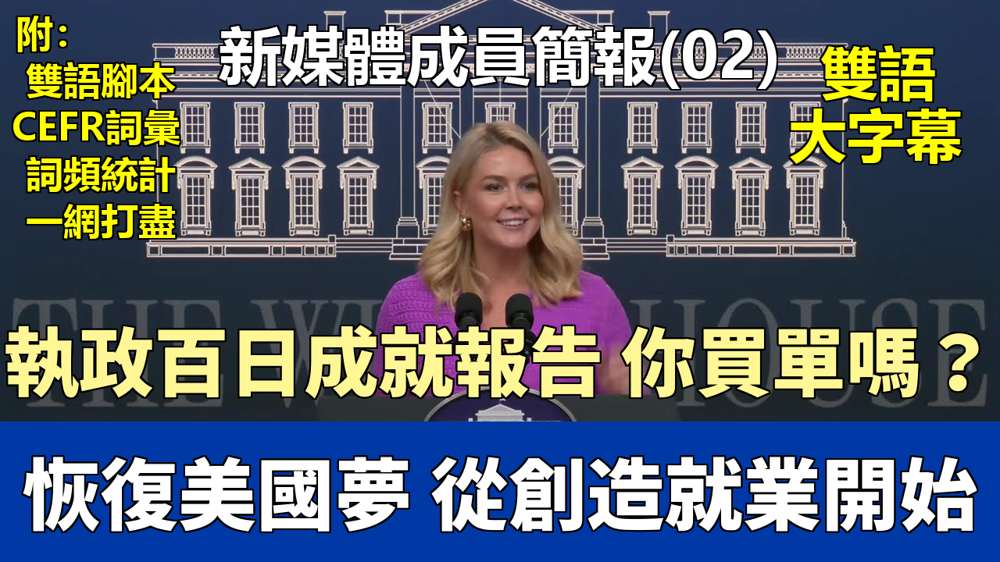

{% video youtube:GgdVkgLCFBc width:100% autoplay:0 %}


### 【中英文双语脚本】

Thank you so much for coming.
非常感謝大家的到來。
This is our second official influencer briefing here at the White House in the beautiful South Court auditorium.
這是我們在白宮美麗的南苑禮堂舉行的第二次官方影響者簡報會。
And as you can tell in the White House, we are fully embracing new media.
正如你在白宮所見，我們正全面擁抱新媒體。
Trust in the mass media has fallen to record lows.
大衆對主流媒體的信任度已降至歷史最低點。
Tens of millions of Americans are turning elsewhere to get their news and their information.
數以千萬計的美國人正在轉向其他地方獲取新聞和信息。
That's why we've welcomed openly independent journalists, podcasters, social media influencers, content creators, and we will continue to do so.
因此，我們公開歡迎獨立記者、播客主、社交媒體影響者、內容創作者，並將繼續這樣做。
President Trump and our White House also believe strongly in the First Amendment,
特朗普總統和我們的白宮也堅信第一修正案，
which is why our team has restored the press passes of hundreds of journalists whose passes were wrongly revoked by the Biden administration.
這就是爲什麼我們的團隊恢復了數百名記者的記者證，他們的證件曾被拜登政府錯誤地吊銷。
So thank you all so much for coming today for your interest in covering the historic achievements of President Trump's first 100 days.
所以，非常感謝大家今天前來，感謝你們有興趣報道特朗普總統執政百日的歷史性成就。
And today officially marks 100 days of promises made and kept by President Trump.
今天正式標誌着特朗普總統兌現承諾的100天。
Our primary focus is how President Trump is in the process of rebuilding the world's greatest economy, just like he did in his first term.
我們的首要關注點是特朗普總統如何像他在第一個任期那樣，正在重建世界上最偉大的經濟。
President Trump has created 345,000 jobs since taking office in January.
自一月份上任以來，特朗普總統已經創造了345,000個就業崗位。
Last month's job report, we saw 100,000 more jobs than economists predicted.
上個月的就業報告顯示，新增就業崗位比經濟學家預測的多出10萬個。
It was the fourth highest month for private payroll growth in the past two years.
這是過去兩年中私營部門薪資增長第四高的月份。
9,000 manufacturing jobs have been created and added to the economy already since January,
自一月份以來，已經創造併爲經濟增加了9,000個製造業就業崗位，
and that's in comparison to the 6,000 manufacturing jobs that were lost per month in the final two years of the Biden administration.
相比之下，在拜登政府最後兩年，每月損失6,000個製造業就業崗位。
So each month we were losing 6,000 manufacturing jobs under President Biden.
所以在拜登總統任內，我們每月損失6000個製造業工作崗位。（注意：原文此處誤作Trump，根據上下文應爲Biden）
In just 100 days, we've added 9,000.
僅僅100天內，我們增加了9,000個。
The U.S. unemployment rate remains at historic lows.
美國失業率保持在歷史低位。
The labor force participation rate for those without a high school diploma is up. Good news for working class American families.
沒有高中文憑者的勞動力參與率上升。這對美國工薪家庭來說是個好消息。
And the veteran unemployment rate is down as well, to 3.8 percent in March. When we came into office, it was 4.2 percent.
退伍軍人失業率也有所下降，三月份降至3.8%。我們上任時是4.2%。
Remote work among federal employees has fallen over 16 percentage points from March last year to March this year,
聯邦僱員的遠程工作比例從去年三月到今年三月下降了超過16個百分點，
showcasing the success of President Trump's initiative to bring federal workers back to the office.
展示了特朗普總統讓聯邦工作人員重返辦公室倡議的成功。
We know middle-class Americans, hardworking people, they have to show up to the office every day.
我們知道中產階級美國人，辛勤工作的人們，他們每天都必須到辦公室上班。
We expect bureaucrats and government workers to do the same, especially when they are living off of the taxpayer's dime.
我們期望官僚和政府工作人員也這樣做，尤其是當他們依賴納稅人的錢生活時。
If you want to work on behalf of the American taxpayer, you should show up to work in person.
如果你想代表美國納稅人工作，你就應該親自到崗工作。
Thanks to President Trump, Americans are seeing the first price relief in years.
感謝特朗普總統，美國人多年來首次看到物價有所緩解。
The last inflation report showed the first consumer price decline in years, a decrease in energy prices and real average hourly wage growth.
最新的通脹報告顯示了多年來首次消費者價格下降，能源價格下跌以及實際平均時薪增長。
President Trump is delivering on his promises to lower costs for American families and businesses, prescription drug prices are down.
特朗普總統正在兌現他爲美國家庭和企業降低成本的承諾，處方藥價格已經下降。
Last month's drop in prescription drugs prices was the largest ever recorded.
上個月處方藥價格的下降是有記錄以來最大的一次。
And thanks to President Trump ending Joe Biden's reckless war on American energy, gasoline prices and energy prices are down as well.
感謝特朗普總統結束了喬·拜登對美國能源的魯莽戰爭，汽油價格和能源價格也下降了。
The cost of wholesale eggs has decreased more than 50 percent.
批發雞蛋的成本下降了超過50%。
President Trump inherited a complete mess from the Biden administration, who totally botched their response to the bird flu.
特朗普總統從拜登政府那裏繼承了一個爛攤子，他們完全搞砸了對禽流感的應對。
They were killing chickens. They were killing our chicken supply in this country, which led to an increase in egg prices.
他們在宰殺雞隻。他們在扼殺我們國家的雞肉供應，導致雞蛋價格上漲。
And the president and Secretary Rollins did an incredible job attacking that on day one.
總統和羅林斯部長從第一天起就着手處理這個問題，做得非常出色。
On the deregulation front, President Trump is launching the largest deregulation campaign in American history.
在放松管制方面，特朗普總統正在發起美國曆史上最大規模的放松管制運動。
He has blocked all of the unfinalized Biden era rules, which has saved us more than 180 billion dollars already.
他阻止了所有未最終確定的拜登時代的規定，這已經爲我們節省了超過1800億美元。
He's launched a bold multi-agency effort to roll back existing federal regulations that drive up the cost of living on hardworking families
他發起了一項大膽的跨部門行動，以廢除那些推高辛勤工作家庭生活成本的現有聯邦法規，
that has yielded more than 755 billion in total savings as well.
這項行動也帶來了超過7550億美元的總節省。
And as you all know, investments from companies around the world continue to pour into this country.
正如大家所知，來自世界各地公司的投資持續涌入這個國家。
Every morning we wake up to a new headline with a new company from a different country announcing major investments in our country.
每天早上我們醒來都會看到新的頭條新聞，來自不同國家的新公司宣佈在我國進行重大投資。
What does that mean for people in your communities across the nation? It means jobs. It means Americans going to work.
這對全國各地社區的人們意味着什麼？這意味着就業機會。意味着美國人去工作。
It means Americans providing for their families, for their children, living the American dream. And that's what those investments will do.
意味着美國人供養他們的家庭、他們的孩子，實現美國夢。這就是這些投資將帶來的。
It's truly the golden age of America.
這真的是美國的黃金時代。
And that's why the president is working so hard to leverage good trade deals around the world.
這就是爲什麼總統如此努力地利用世界各地的良好貿易協議。
He knows America is the best place in the world to do business.
他知道美國是世界上做生意的最佳地點。
He is using our leverage to negotiate good deals with countries around the world, to onshore manufacturing jobs here,
他正在利用我們的影響力與世界各國談判達成良好協議，將製造業工作崗位遷回國內，
to revitalize our middle class and our manufacturing industry, and also to protect our national security.
以振興我們的中產階級和製造業，並保護我們的國家安全。
I don't think any American agrees it's good that China currently supplies and produces our chips, our pharmaceuticals, and our critical industries.
我不認爲有任何美國人會同意，讓中國目前供應和生產我們的芯片、藥品和關鍵產業是件好事。
We want those things built in the United States of America. And President Trump is the first president in modern times to actually do something about that.
我們希望這些東西在美國本土製造。特朗普總統是近代第一位真正爲此採取行動的總統。
So with that said, today is a hundred days. There have been so many achievements, not just on the economic front,
話雖如此，今天是百日。我們取得了如此多的成就，不僅僅是在經濟方面，
and the president continues to work very hard on tax cuts as well and on negotiating those trade deals.
總統也在繼續努力推動減稅和談判那些貿易協議。
But look at the success at the southern border, which we talked a lot about yesterday with our border czar Tom Homan, Secretary Kristi Noem, Stephen Miller here at the White House,
但看看南部邊境的成功，我們昨天與我們的邊境沙皇湯姆·霍曼、克里斯蒂·諾姆部長、斯蒂芬·米勒在白宮談了很多，
all of whom are doing a tremendous job and have created at the president's direction, the most secure border in American history.
他們所有人都做得非常出色，並在總統的指示下，創造了美國曆史上最安全的邊境。
We have a mass deportation campaign of illegal aliens underway.
我們正在進行大規模驅逐非法移民的行動。
We are removing heinous criminals from your communities across the country. Every single day we are making America safe again.
我們正在從全國各地的社區中清除令人髮指的罪犯。我們每天都在讓美國再次安全。
And if you look abroad on the world stage, the president is really using his peace through strength foreign policy approach once again
如果你放眼國際舞臺，總統再次真正運用他那“以實力求和平”的外交政策方針，
so the rest of the world knows that America is back.
讓世界其他國家知道美國回來了。
I know Joe Biden used to say that, but we're stealing it from him because it's actually true now with President Trump in the Oval Office,
我知道喬·拜登過去常這麼說，但我們要從他那裏“偷”過來，因爲現在特朗普總統入主橢圓形辦公室，這確實是真的了，
the world is a safer place and will continue to be.
世界是一個更安全的地方，並將繼續如此。
So thanks for coming to the influencer briefing. I look forward to taking your questions. And Deborah, why don't you kick us off?
感謝大家來參加影響者簡報會。我期待回答你們的問題。黛博拉，你先開始吧？
So congratulations on a hundred incredible days.
那麼，祝賀這令人難以置信的一百天。
And over the first hundred days, the majority of policies that we've seen from the Trump administration have been either targeted at foreign affairs,
在最初的一百天裏，我們看到特朗普政府的大多數政策要麼針對外交事務，
such as bringing the American hostages home or attempting to end the war between Ukraine and Russia,
例如帶回美國人質或試圖結束烏克蘭和俄羅斯之間的戰爭，
or on long-term goals such as cost cutting government spending.
要麼是針對長期目標，例如削減政府開支。
What policies can we expect to see rolled out over the next few months that Americans will directly feel the effects of
未來幾個月我們可以期待推出哪些美國人將直接感受到影響的政策，
in order to secure the 2026 midterms for the Republican Party and keep his approval rating historically high?
以確保共和黨在2026年中期選舉中的勝利，並保持他歷史性的高支持率？
Yeah. The first answer that comes to mind, Deborah, is definitely tax cuts.
是的。黛博拉，首先想到的答案絕對是減稅。
The president is working closely with Congress as we speak. He met with leadership from both chambers.
就在我們談話的時候，總統正在與國會密切合作。他會見了參衆兩院的領導層。
The administration met with leadership from both chambers yesterday to talk about how we can quickly pass the largest tax cuts in American history.
政府昨天與兩院領導層會面，討論如何能迅速通過美國曆史上最大規模的減稅法案。
And the president promised on the campaign trail, he wanted no tax on tips, no tax on social security for our hardworking seniors, no tax on overtime pay.
總統在競選期間承諾，他希望取消小費稅，取消我們辛勤工作的長者的社保稅，取消加班費稅。
He intends to keep those promises and he needs Congress's help to do so. That's why he's working closely with them.
他打算信守這些承諾，並且需要國會的幫助才能做到。這就是他與他們密切合作的原因。
But you look at, again, I talked about the leverage the president uses to negotiate good trade deals around the world,
但是你看，我再次提到，總統利用槓桿來談判世界各地的良好貿易協議，
but he uses that leverage right here in Washington as well on Capitol Hill.
但他也同樣在華盛頓國會山運用這種槓桿。
He has great relationships with leaders in both chambers and we are confident that we can pass a massive tax bill
他與兩院的領導人都保持着良好的關係，我們有信心能夠通過一項大規模的稅收法案，
which will directly lead to more money in people's pockets right away.
這將直接讓人們的口袋裏立刻有更多的錢。
Sure. Go ahead. Yeah.
當然。請講。是的。
So the president has really wanted to end the war in Ukraine for a long time now and has been working on that in the first hundred days.
總統長期以來一直非常希望結束烏克蘭戰爭，並在執政的頭一百天裏爲此努力。
We've seen President Zelensky come here as well as the president meeting with President Zelensky just in the last couple of days.
我們看到澤連斯基總統來到這裏，總統也在過去幾天會見了澤連斯基總統。
I'm wondering where those talks stand and if the president is optimistic that that conflict is going to wrap up shortly.
我想知道這些談判進展如何，總統是否樂觀地認爲這場衝突會很快結束。
The president is optimistic yet realistic about the incredibly complicated and unfortunate situation happening with Ukraine and Russia.
總統對烏克蘭和俄羅斯之間發生的極其複雜和不幸的局勢持樂觀但現實的態度。
First of all, this is Biden's war. It would have never started if President Trump were in office.
首先，這是拜登的戰爭。如果特朗普總統在任，這場戰爭就絕不會開始。
There is a reason that Putin did not invade Ukraine when President Trump was in the Oval Office
普京在特朗普總統任職橢圓形辦公室期間沒有入侵烏克蘭是有原因的，
and it's because, again, President Trump leveraged the power of the United States to warn Putin not to do it.
那是因爲，特朗普總統再次利用美國的力量警告普京不要這樣做。
And the president has spoken about that and those direct warnings to the Kremlin that he gave in his first term.
總統已經談到了這一點，以及他在第一個任期內向克里姆林宮發出的那些直接警告。
Then we had a mentally incompetent president in Joe Biden who didn't even know what day it is, never mind knew how to prevent war.
然後我們有了一個精神上不稱職的總統喬·拜登，他甚至不知道今天是幾號，更不用說知道如何阻止戰爭了。
And the entire world took advantage of that and took advantage of America's lackluster leadership abroad.
整個世界都利用了這一點，利用了美國在海外缺乏領導力的情況。
And so we've had this terrible war. The president talks about it all the time. He's briefed on it constantly.
因此我們經歷了這場可怕的戰爭。總統一直在談論它。他不斷聽取相關簡報。
There are men dying on the front lines of this. An entire generation is being wiped out and enough is enough.
前線上不斷有人犧牲。整整一代人正在被毀滅，這已經夠了。
The president has made it very clear he wants to see this end at the negotiating table, not on the battlefield.
總統已經非常明確地表示，他希望在談判桌上結束這場戰爭，而不是在戰場上。
He has spoken directly to both sides of this war.
他已經直接與戰爭雙方進行了交談。
He most recently met with President Zelensky at the Vatican when he attended the funeral of Pope Francis.
他最近一次是在梵蒂岡參加教皇方濟各的葬禮時會見了澤連斯基總統。
And he remains optimistic that both sides will come together to negotiate peace.
他仍然樂觀地認爲雙方會走到一起談判和平。
There are a lot of complexities on both sides of this war. So he's realistic about that,
這場戰爭的雙方都有很多複雜性。所以他對這一點持現實態度，
but he is optimistic that we are moving in the right direction.
但他樂觀地認爲我們正朝着正確的方向前進。
And if you just take a step back and look at where we are now, where you have concessions from both sides publicly,
如果你退一步看看我們現在的處境，雙方都公開做出了讓步，
where you have ceasefire proposals from both sides, the president's made it clear he wants a permanent ceasefire first,
雙方都提出了停火建議，總統明確表示他首先想要永久停火，
but you actually have the United States talking to Russia. You have the United States talking to the Ukrainians on a daily basis, communicating with both sides.
但實際上美國在與俄羅斯對話。美國每天都在與烏克蘭人對話，與雙方溝通。
Look at that compared to where we were when we came into office, where neither side was talking.
看看這與我們上任時的情況相比，那時雙方都不在對話。
There was just one approach to ending this war. No one was really talking about a peace deal.
結束這場戰爭只有一種方法。沒有人真正談論和平協議。
We were just talking about continuing to send blank checks to continue funding the fighting and the killing.
我們只是在談論繼續開出空白支票來繼續資助戰鬥和殺戮。
This war has been a meat grinder. Young men are dying. Women and children are dying as a collateral result of the military conflict,
這場戰爭就是一個絞肉機。年輕人在死去。婦女和兒童作爲軍事衝突的附帶後果而死亡，
and the president wants to see it end as quickly and soon as possible.
總統希望看到它儘快結束。
And I can tell you, watching firsthand, he has exuded a tremendous amount of effort into this war.
我可以告訴你，親眼所見，他爲這場戰爭付出了巨大的努力。
He's getting frustrated with the amount of effort this has taken, and he's made that clear to both sides,
他對所付出的努力感到沮喪，並且已經向雙方明確表示了這一點，
but he remains optimistic that we can get this done. Brendan?
但他仍然樂觀地認爲我們能夠完成這件事。布蘭登？
I was wondering if you'd indulge me in a quick round of Trump trolling or Trump truthing?
我想知道你是否願意和我玩一輪快速的“特朗普胡扯還是特朗普真相”？
Sure, let's do it. I love it.
當然，來吧。我喜歡這個。
Greenland joining America?
格陵蘭加入美國？
Definitely Trump truthing.
絕對是特朗普真相。
Canada becoming a 51st state?
加拿大成爲第51個州？
Trump truthing all the way. And the Canadians would benefit greatly, let me tell you that.
一路都是特朗普真相。讓我告訴你，加拿大人將大大受益。
Eliminating the IRS?
取消國稅局（IRS）？
I think that is an optimistic goal, and the president, so I would say we're on the side of truthing there for sure,
我認爲這是一個樂觀的目標，總統也是，所以我肯定會說我們站在真相這邊，
and the president again wants to see tax cuts and he wants to see this massive revenue that we can gain from tariffs as well,
總統再次希望看到減稅，他也希望看到我們能從關稅中獲得的鉅額收入，
which will create the external revenue service. So that's a definitive goal for sure.
這將創建外部收入服務。所以這絕對是一個明確的目標。
Most importantly, Trump 2028.
最重要的是，特朗普2028。
Trump trolling, although the hats are flying off the shelves. Lynx, go ahead.
特朗普胡扯，儘管帽子賣得飛快。林克斯，請講。
So one thing I've noticed in the first 100 days is that the White House is crawling with kids.
我注意到在頭100天裏，白宮裏到處都是孩子。
You have a young, beautiful baby boy, there are babies everywhere, there's so many young folks on staff who have kids,
你有一個年幼、漂亮的男嬰，到處都是嬰兒，員工中有很多有孩子的年輕人，
but the last four years under Joe Biden, parents are really stressed and ravaged.
但在喬·拜登執政的過去四年裏，父母們真的壓力重重，備受摧殘。
They had to take on two or three extra jobs, depression rates were up, suicide rates were up.
他們不得不承擔兩到三份額外的工作，抑鬱率上升，自殺率上升。
You're a very high profile young mother who seems to juggle and balance it all beautifully.
你是一位備受矚目的年輕母親，似乎能漂亮地兼顧和平衡一切。
What advice do you have to young parents out there who are starting their careers, having kids, building families, and trying to find that balance so desperately?
對於那些正在開創事業、生兒育女、建立家庭並拼命尋找平衡的年輕父母，你有什麼建議？
Yeah. Well, it's a great question. And first to the heart of your premise, it's true.
是的。嗯，這是一個很好的問題。首先關於你前提的核心，這是真的。
The president has empowered not just me as a young mother in this role, but there are so many new moms and dads on our senior staff in the West Wing,
總統不僅賦予了我這個年輕母親擔任此角色的權力，而且在西翼的高級職員中，以及整個政府中，
but also across the entire administration.
有很多新晉的父母。
There are working moms and dads who are offering our country public service for President Trump while raising young families.
有很多在職的父母在爲特朗普總統提供公共服務的同時撫養年幼的家庭。
And the president really empowers us to do that. And I commend him for that. He doesn't get enough credit for it.
總統確實賦予我們這樣做的能力。我爲此讚揚他。他在這方面沒有得到足夠的認可。
But as for the president is implementing policies every day to uplift young families and young people.
但至於總統每天都在實施政策以提升年輕家庭和年輕人。
He talked so much about young people and talked directly to young people so much on the campaign trail.
他在競選活動中經常談論年輕人，並直接與年輕人對話。
It really, I think, inspires him when he is around young people in a young audience.
我認爲，當他和年輕人在年輕觀衆中在一起時，這真的能激勵他。
And he wants to restore the American dream for the next generation, not just our generation of young folks, but our children and our grandchildren.
他想爲下一代恢復美國夢，不僅僅是我們這一代年輕人，還有我們的子孫後代。
What does that look like? Home ownership, the ability to afford a home, to live and to have a good paying job.
那是什麼樣的？擁有住房，有能力負擔住房、生活並擁有一份高薪工作。
That's part of this effort to onshore jobs because you have an entire generation going to these incredibly expensive and liberal higher education universities
這是將工作崗位遷回國內努力的一部分，因爲整整一代人進入那些極其昂貴和自由派的高等教育大學，
coming out saddled with debt and then unable to get a good paying job.
畢業時揹負債務，然後無法找到一份高薪工作。
The president wants to put an end to that so that young people can provide for their families and truly live the American dream.
總統希望結束這種狀況，以便年輕人能夠供養家庭，真正實現美國夢。
So to young people around the country, the president hears you, he sees you, he loves you, and he wants to uplift you.
所以對全國的年輕人說，總統聽到了你們的聲音，他看到了你們，他愛你們，他想提升你們。
And all of the policies he's implementing every day are to provide a more prosperous and safe and free America for future generations.
他每天實施的所有政策都是爲了給子孫後代提供一個更繁榮、更安全、更自由的美國。
You're welcome. Sure.
不客氣。當然。
Hi, Chris. Hi, you too. Thank you so much for the time.
嗨，克里斯。嗨，你也一樣。非常感謝你抽出時間。
Tacking it off of Lynx's question about young people, one of the most pressing challenges for Gen Z right now is the lack of home ownership.
接着林克斯關於年輕人的問題，Z世代目前最緊迫的挑戰之一是缺乏住房所有權。
As of 2025, I believe the median age is 38 years old for first time home buyers, which is a hindrance to starting families for a lot of people.
截至2025年，我相信首次購房者的中位年齡是38歲，這對很多人來說是組建家庭的障礙。
How does the Trump administration plan on tackling this in the next four years?
特朗普政府計劃在未來四年如何解決這個問題？
It's a major issue. As you mentioned, that's directly impacting young people and young families.
這是一個重大問題。正如你提到的，這直接影響到年輕人和年輕家庭。
And the president is, I think, tackling it head on already.
而且我認爲總統已經在正面解決這個問題了。
The reason that homes have become so unaffordable is because of the massive inflation crisis caused by the previous administration,
住房變得如此難以負擔的原因是前任政府造成的大規模通貨膨脹危機，
not just the cost of a home, but everything that goes into building a new home went up and through the roof.
不僅僅是房屋成本，建造新房所需的一切都飛漲。
We also saw mortgage rates reach incredible highs under the previous administration. So a few things.
我們也看到在前任政府下抵押貸款利率達到了令人難以置信的高點。所以有幾件事。
The president wants to bring down the cost of living, which he is already doing, as I mentioned in my opening remarks,
總統希望降低生活成本，正如我在開場白中提到的，他已經在這樣做了，
which will increase our supply of homes across the country.
這將增加全國房屋的供應量。
But he also wants to bring down mortgage rates and interest rates to make it easier for young people and all people to borrow money to take out those loans,
但他也希望降低抵押貸款利率和利率，讓年輕人和所有人更容易借錢來獲得那些貸款，
to buy your first home.
購買你的第一套房子。
And so we got to increase the supply, bring down costs and bring down interest rates and mortgage rates.
所以我們必須增加供應，降低成本，降低利率和抵押貸款利率。
And by the way, those are all things the president successfully did in his first term.
順便說一下，這些都是總統在他第一個任期內成功做到的事情。
When he left office, inflation was a record low, 1.4%. Interest rates, mortgage rates also hit record lows in his first term.
他離任時，通貨膨脹率創歷史新低，爲1.4%。利率、抵押貸款利率也在他第一個任期內創下歷史新低。
So this is a proven economic formula that works. It takes time to get there.
所以這是一個行之有效的經濟模式。這需要時間來實現。
We are in the process of the golden age. The president and the administration are slashing regulation every day, cutting red tape, cutting costs.
我們正處於黃金時代的過程中。總統和政府每天都在削減法規，減少繁文縟節，降低成本。
And we need, again, Congress to pass those tax cuts to put more money back in people's pockets. So they have greater purchasing power as well.
我們再次需要國會通過那些減稅法案，把更多的錢放回人們的口袋裏。這樣他們也有更強的購買力。
You're welcome. Sure.
不客氣。當然。
Hey, Teresa, I'm with Independent Women and WMAL. Oh, great.
嘿，特蕾莎，我來自獨立女性組織和WMAL電臺。哦，太好了。
We love working with the administration to really tout policies that work for families and work for small businesses in this country.
我們喜歡與政府合作，大力宣傳那些對這個國家的家庭和小型企業有效的政策。
Next week is Small Business Week. And I know that the SBA will be championing all the small businesses, the millions in this country, almost half of which are women owned.
下週是小企業周。我知道小企業管理局（SBA）將會支持所有的小企業，這個國家有數百萬家，其中近一半是女性擁有的。
But I'd love to find out what the president feels about independent contractors who are not typical W2 employees, not nine to five workers, but who hang their own shingle.
但我很想了解總統對獨立承包商的看法，他們不是典型的W2僱員，不是朝九晚五的工人，而是自己創業的人。
They're 1099 workers. We saw the Biden administration really try to crack down on that small business entrepreneurial spirit.
他們是1099工人。我們看到拜登政府確實試圖打壓那種小企業的創業精神。
And we're hopeful that the administration would overturn what the Biden administration did
我們希望本屆政府能夠推翻拜登政府所做的事情，
and maybe even work with Congress to pass some lasting changes, codify some lasting changes that would protect your ability to be self-employed,
甚至可能與國會合作通過一些持久的變革，將一些持久的變革寫入法律，以保護你自僱的能力，
your ability to be a small business owner.
你成爲小企業主的能力。
Well, the president is a businessman at heart himself, right? He's a real estate developer.
嗯，總統本人骨子裏就是個商人，對吧？他是一位房地產開發商。
And I think that's a large reason the American people elected him the first time and the second time, because they trusted him.
我認爲這是美國人民第一次和第二次選舉他的一個重要原因，因爲他們信任他。
And small businesses are the backbone of our American economy. I come from a small business family myself.
小企業是我們美國經濟的支柱。我自己也來自一個小企業家庭。
And the president knows what small business families need and independent contractors need, entrepreneurs need.
總統知道小企業家庭需要什麼，獨立承包商需要什麼，企業家需要什麼。
You need less government in the way. You need less regulation. You need low energy costs, low taxes, a low cost of living, a low cost of goods.
你需要更少的政府幹預。你需要更少的監管。你需要低能源成本、低稅收、低生活成本、低商品成本。
And that's exactly what the president is focused on doing.
這正是總統專注於做的事情。
While simultaneously, effectively leveraging tariffs to protect our middle class and our working class and our manufacturing base.
同時，有效地利用關稅來保護我們的中產階級、工薪階層和製造業基礎。
Look at our auto industry. Think about Michigan. It used to be the heartland of the auto industry of the world. It was the auto capital of the world.
看看我們的汽車工業。想想密歇根。它曾經是世界汽車工業的心臟地帶。它是世界汽車之都。
And unfortunately, so many of those jobs have gone overseas.
不幸的是，很多這些工作崗位已經流向海外。
And so the president wants to protect good paying jobs here at home and unleash the might of our economy for small business owners.
因此，總統希望保護國內的高薪工作崗位，併爲小企業主釋放我們經濟的威力。
And that includes removing red tape and cutting taxes.
這包括消除繁文縟節和減稅。
And as for independent contractors and what the president would hope to do with Congress, we'll definitely check back in on that and get you an answer
至於獨立承包商以及總統希望與國會做些什麼，我們一定會跟進並給你答覆，
because it's an important question. You're welcome. Sure.
因爲這是一個重要的問題。不客氣。當然。
Hi, Willowton, the National Pulse.
嗨，Willowton，《國家脈動》的。
You kind of gave us an overview of negotiations between Ukraine and Russia 100 days in.
你大概給我們介紹了烏克蘭和俄羅斯之間談判進行100天的情況。
What would the next steps look like though, if we don't reach an agreement by say this summer?
但是，如果我們到今年夏天還達不成協議，下一步會是什麼樣子？
And also, can you give us an update on the rare earth minerals deal with Ukraine?
另外，你能給我們介紹一下與烏克蘭的稀土礦產協議的最新情況嗎？
And is there any kind of response from the administration to Greenlandic Foreign Minister Vivian Motzfeld and some of her comments about maybe seeking aid with China?
政府對格陵蘭外交部長維維安·莫茨費爾德以及她可能尋求中國援助的一些言論是否有任何迴應？
Sure. To your first question about the critical minerals deal, the president is confident that will be signed.
當然。關於你第一個關於關鍵礦產協議的問題，總統有信心該協議會簽署。
Ukraine needs to sign it. They should sign it.
烏克蘭需要簽署它。他們應該簽署它。
It's not just good for the United States to recoup the billions of tax dollars we've spent and onshore some of those critical minerals,
這不僅有利於美國收回我們花費的數十億稅款並將一些關鍵礦產遷回國內，
but certainly it's good for the Ukrainian people when this war is over to rebuild their country.
而且當這場戰爭結束後，對烏克蘭人民重建國家肯定是有利的。
It's an economic partnership between the United States and Ukraine. That's what the president envisions.
這是美國和烏克蘭之間的經濟夥伴關係。這就是總統所設想的。
And he wants Ukraine to sign that deal. He's confident that they will.
他希望烏克蘭簽署那份協議。他有信心他們會的。
As for what it would look like later down the road, I don't want to get ahead of the president, obviously,
至於將來會是什麼樣子，我顯然不想搶在總統前面說，
but again, I will reiterate he's increasingly grown frustrated in the amount of time our secretary of state recently said.
但我再次重申，他對我們國務卿最近所說的時間量越來越感到沮喪。
There's not much more time or effort the United States has to give to this effort.
美國沒有更多的時間或精力可以投入到這項努力中了。
And so we need both sides to come to the table to negotiate.
所以我們需要雙方都坐到談判桌前來談判。
As for Greenland, I hadn't seen those comments. If true, I'm sure they are.
至於格陵蘭，我沒有看到那些評論。如果是真的，我相信是真的。
Certainly an interesting strategy to cozy up to communist China. Greenland needs the United States of America.
向共產主義中國示好，這無疑是一個有趣的策略。格陵蘭需要美利堅合衆國。
We subsidize their national security and their defense.
我們補貼他們的國家安全和國防。
And the president has rightfully pointed out the great strategic importance that Greenland serves for not just our national security and economic interests,
總統正確地指出了格陵蘭不僅對我們的國家安全和經濟利益，
but for our country and for the world as a whole.
而且對我們國家乃至整個世界所具有的巨大戰略重要性。
And we can't allow Chinese or Russian influence to continue to infiltrate places like Greenland or the Panama Canal, I may add.
我們不能允許中國或俄羅斯的影響繼續滲透到像格陵蘭或巴拿馬運河這樣的地方，我補充一句。
And to the back.
後面那位。
Can you talk about the importance of a stock market all time high, specifically in relation to the midterms?
你能談談股市創歷史新高的重要性嗎，特別是與中期選舉的關係？
And it seems like a lot of folks, when Trump was elected, they thought that stock market goes up. He really cares about that.
似乎很多人在特朗普當選時認爲股市會上漲。他真的很關心這個。
He uses it as a measurement of the economy. It's gone down, but it's still up over the last 12 months or so.
他用它來衡量經濟。它下跌了，但在過去大約12個月裏仍然是上漲的。
So how much of that is playing into some of the economic policy decisions?
那麼這在多大程度上影響了一些經濟政策的決策？
I think the president has spoken on this. He said the stock market gets yippy, but he doesn't get yippy.
我認爲總統已經談過這個問題。他說股市會變得“yippy”（緊張不安），但他不會。
He trusts in his economic agenda and formula, obviously.
顯然，他信任他的經濟議程和模式。
And Wall Street made out very well in President Trump's first term. President Trump also wants to look out for Main Street and do what's best for both.
華爾街在特朗普總統的第一個任期內表現非常好。特朗普總統也想照顧好普通民衆（Main Street），並做對兩者都有利的事情。
So I think the president right now, his main focus, what drives him to make decisions is what's best for the working class Americans,
所以我認爲總統現在，他的主要關注點，驅動他做決策的是什麼對美國工薪階層最好，
for the American worker, for the small business owner, for American families.
對美國工人最好，對小企業主最好，對美國家庭最好。
And he's trying to correct the wrongs of the last several decades, not just the last four years with the economic and inflation nightmare caused by the Biden administration,
他正試圖糾正過去幾十年的錯誤，不僅僅是過去四年拜登政府造成的經濟和通脹噩夢，
but of the unfair trade practices that have ripped off our country for a very long time.
還有長期以來剝削我們國家的不公平貿易行爲。
So look, the stock market goes up, it goes down, but President Trump has a goal. He has a vision and he's remaining very much committed to that.
所以你看，股市有漲有跌，但特朗普總統有一個目標。他有一個願景，並且他仍然非常致力於此。
Thank you so much everybody for joining today. We're heading off to Michigan tonight for a big rally.
非常感謝大家今天的參與。我們今晚要去密歇根參加一個大型集會。
So I am sure we'll see all of your amazing creative content on social media later.
所以我相信稍後我們會在社交媒體上看到你們所有精彩的創意內容。
It's going to be a great speech and maybe you'll get a Trump dance too. So thank you so much for coming today. It's a pleasure to have you here. Thank you.
這將是一場精彩的演講，也許你還能看到特朗普跳舞。非常感謝大家今天能來。很高興你們能在這裏。謝謝。

### 【核心词汇 - B1_C2】
| 單詞 | 音標 | 詞性 | 釋義 | 等級 | 次數 |
|---|---|---|---|---|---|
| achievement | /əˈtʃiːvmənt/ | noun | 成就，成績 | B1 | 1 |
| administration | /ədˌmɪnɪˈstreɪʃn/ | noun | 管理，行政 | B1 | 1 |
| afford | /əˈfɔːrd/ | verb | 負擔得起 | B1 | 1 |
| agenda | /əˈdʒendə/ | noun | 議程 | B1 | 1 |
| agreement | /əˈɡriːmənt/ | noun | 協議，同意 | B1 | 1 |
| aid | /eɪd/ | noun | 援助，幫助 | B1 | 1 |
| alien | /ˈeɪliən/ | noun | 外星人 | B1 | 1 |
| amazing | /əˈmeɪzɪŋ/ | adjective | adj. 令人驚奇的；極好的 | B1 | 1 |
| amount | /əˈmaʊnt/ | noun | n. 數量；總額 | B1 | 1 |
| announce | /əˈnaʊns/ | verb | v. 宣佈；宣告 | B1 | 1 |
| approach | /əˈproʊtʃ/ | noun | n. 方法；接近；途徑 | B1 | 1 |
| approval | /əˈpruːvl/ | noun | n. 批准；認可 | B1 | 1 |
| attend | /əˈtend/ | verb | 出席，參加 | B1 | 1 |
| balance | /ˈbæləns/ | noun | 平衡，餘額 | B1 | 1 |
| basis | /ˈbeɪsɪs/ | noun | 基礎，根據 | B1 | 1 |
| beautifully | /ˈbjuːtɪfəli/ | adverb | 美麗地，出色地 | B1 | 1 |
| behalf | /bɪˈhæf/ | noun | 代表 | B1 | 1 |
| benefit | /ˈbenɪfɪt/ | noun | 好處 | B1 | 1 |
| bold | /boʊld/ | adjective | 大膽的；勇敢的；醒目的 | B1 | 1 |
| border | /ˈbɔːrdər/ | noun | 邊界；邊境 | B1 | 1 |
| brief | /briːf/ | adjective | 簡短的；簡潔的 | B1 | 1 |
| buyer | /ˈbaɪər/ | noun | 買家；購買者 | B1 | 1 |
| career | /kəˈrɪr/ | noun | 職業；生涯 | B1 | 1 |
| champion | /ˈtʃæmpiən/ | noun | 冠軍，擁護者 | B1 | 1 |
| closely | /ˈkloʊsli/ | adverb | 緊密地，密切地 | B1 | 1 |
| comment | /ˈkɑːment/ | noun | 評論，意見 | B1 | 1 |
| comparison | /kəmˈpærɪsn/ | noun | 比較，對比 | B1 | 1 |
| complicated | /ˈkɑːmplɪkeɪtɪd/ | adjective | 複雜的，難懂的 | B1 | 1 |
| conflict | /ˈkɑːnflɪkt/ | noun | n. 衝突，矛盾 | B1 | 1 |
| congratulation | /kənˌɡrætʃəˈleɪʃn/ | noun | 祝賀 | B1 | 1 |
| constantly | /ˈkɑːnstəntli/ | adverb | adv. 總是，經常地 | B1 | 1 |
| consumer | /kənˈsuːmər/ | noun | n. 消費者 | B1 | 1 |
| content | /kənˈtent/ | noun | n. 內容，目錄 | B1 | 1 |
| creator | /ˈkrieɪtər/ | noun | 創造者，創建者 | B1 | 1 |
| criminal | /ˈkrɪmɪnl/ | noun | 罪犯 | B1 | 1 |
| crisis | /ˈkraɪsɪs/ | noun | 危機 | B1 | 1 |
| critical | /ˈkrɪtɪkl/ | adjective | 關鍵的，批判性的 | B1 | 1 |
| currently | /ˈkɜːrəntli/ | adverb | 目前，現在 | B1 | 1 |
| debt | /det/ | noun | 債務；欠款 | B1 | 1 |
| decision | /dɪˈsɪʒn/ | noun | 決定；決策 | B1 | 1 |
| decline | /dɪˈklaɪn/ | noun | 下降；衰退 | B1 | 1 |
| decrease | /ˈdiːkriːs/ | noun | 減少；降低 | B1 | 2 |
| definitely | /ˈdefɪnətli/ | adverb | 明確地；肯定地 | B1 | 2 |
| deliver | /dɪˈlɪvər/ | verb | 遞送；傳送；發表 | B1 | 1 |
| depression | /dɪˈpreʃn/ | noun | 沮喪，消沉；蕭條，衰退 | B1 | 1 |
| directly | /dəˈrektli/ | adverb | 直接地；立即 | B1 | 1 |
| economic | /ˌekəˈnɑːmɪk/ | adjective | 經濟的 | B1 | 1 |
| economy | /iˈkɑːnəmi/ | noun | 經濟 | B1 | 1 |
| eliminate | /ɪˈlɪmɪneɪt/ | verb | 消除；排除 | B1 | 1 |
| entire | /ɪnˈtaɪər/ | adjective | 整個的；全部的 | B1 | 1 |
| era | /ˈɪrə/ | noun | 時代；紀元 | B1 | 1 |
| fallen | /ˈfɔːlən/ | adjective | 倒下的；掉落的 | B1 | 1 |
| flu | /fluː/ | noun | 流行性感冒 | B1 | 1 |
| folk | /foʊk/ | noun | 人們；(某一羣體的) 人 | B1 | 1 |
| formula | /ˈfɔːrmjələ/ | noun | 公式，配方 | B1 | 1 |
| frustrated | /ˈfrʌstreɪtɪd/ | adjective | 感到沮喪的，灰心的 | B1 | 1 |
| funeral | /ˈfjuːnərəl/ | noun | 葬禮 | B1 | 1 |
| gain | /ɡeɪn/ | noun | 收益，獲得 | B1 | 1 |
| goods | /ɡʊdz/ | noun | 商品，貨物 | B1 | 1 |
| growth | /ɡroʊθ/ | noun | 成長，增長 | B1 | 1 |
| hang | /hæŋ/ | verb | 懸掛，吊 | B1 | 1 |
| hardworking | /ˌhɑːrd ˈwɜːrkɪŋ/ | adjective | 努力工作的 | B1 | 1 |
| headline | /ˈhedlaɪn/ | noun | 標題; 頭條新聞 | B1 | 1 |
| historic | /hɪˈstɔːrɪk/ | adjective | 歷史性的; 具有歷史意義的 | B1 | 1 |
| hopeful | /ˈhoʊpfʊl/ | adjective | 充滿希望的 | B1 | 1 |
| increasingly | /ɪnˈkriːsɪŋli/ | adverb | 越來越多地，日益 | B1 | 1 |
| incredible | /ɪnˈkredəbl/ | adjective | 難以置信的，極好的 | B1 | 1 |
| incredibly | /ɪnˈkredəbli/ | adverb | 難以置信地，非常 | B1 | 1 |
| independent | /ˌɪndɪˈpendənt/ | adjective | 獨立的，自主的 | B1 | 1 |
| industry | /ˈɪndəstri/ | noun | 工業，產業 | B1 | 2 |
| inspire | /ɪnˈspaɪər/ | verb | 激勵，鼓舞 | B1 | 1 |
| intend | /ɪnˈtend/ | verb | 打算，計劃 | B1 | 1 |
| journalist | /ˈdʒɜːrnəlɪst/ | noun | 記者 | B1 | 1 |
| killing | /ˈkɪlɪŋ/ | noun | 殺戮，謀殺 | B1 | 1 |
| launch | /lɔːntʃ/ | verb | 發起，發動，推出；發射，下水 | B1 | 2 |
| leadership | /ˈliːdərʃɪp/ | noun | 領導能力，領導地位；領導階層 | B1 | 1 |
| main | /meɪn/ | adjective | 主要的 | B1 | 1 |
| majority | /məˈdʒɔːrəti/ | noun | 大多數 | B1 | 1 |
| mass | /mæs/ | adjective | 大量的，大規模的 | B1 | 1 |
| massive | /ˈmæsɪv/ | adjective | 巨大的 | B1 | 1 |
| measurement | /ˈmeʒərmənt/ | noun | 測量；尺寸 | B1 | 1 |
| mentally | /ˈmentəli/ | adverb | 精神上地；心理上地 | B1 | 1 |
| mess | /mes/ | noun | 髒亂；混亂 | B1 | 1 |
| mineral | /ˈmɪnərəl/ | noun | 礦物；礦物質 | B1 | 1 |
| negotiate | /nɪˈɡoʊʃieɪt/ | verb | 談判，協商 | B1 | 1 |
| negotiation | /nɪˌɡoʊʃiˈeɪʃn/ | noun | 談判，協商 | B1 | 1 |
| obviously | /ˈɑbviəsli/ | adverb | 顯然地 | B1 | 1 |
| officially | /əˈfɪʃəli/ | adverb | 正式地 | B1 | 1 |
| opening | /ˈoʊpnɪŋ/ | noun | 開口，機會 | B1 | 1 |
| per | /pɜr/ | preposition | 每，每一；按照，根據 | B1 | 1 |
| permanent | /ˈpɜrmənənt/ | adjective | 永久的，永恆的；常設的 | B1 | 1 |
| policy | /ˈpɑləsi/ | noun | 政策，方針；保險單 | B1 | 2 |
| prescription | /prɪˈskrɪpʃn/ | noun | 處方；藥方 | B1 | 1 |
| president | /ˈprezɪdənt/ | noun | 總統；主席；校長 | B1 | 2 |
| press | /pres/ | noun | 報刊；新聞界；出版社；印刷機 | B1 | 2 |
| previous | /ˈpriːviəs/ | adjective | 先前的；以前的 | B1 | 1 |
| process | /ˈprɑːses/ | noun | 過程，程序 | B1 | 1 |
| proposal | /prəˈpoʊzl/ | noun | 提議，建議 | B1 | 1 |
| prosperous | /ˈprɑːspərəs/ | adjective | 繁榮的，興旺的 | B1 | 1 |
| protect | /prəˈtekt/ | verb | 保護 | B1 | 1 |
| publicly | /ˈpʌblɪkli/ | adverb | 公開地 | B1 | 1 |
| rare | /rer/ | adjective | 稀有的，罕見的 | B1 | 1 |
| realistic | /ˌriːəˈlɪstɪk/ | adjective | 現實的，實際的 | B1 | 1 |
| rebuild | /ˌriːˈbɪld/ | verb | 重建，修復 | B1 | 1 |
| regulation | /ˌreɡjuˈleɪʃn/ | noun | 規章，規則 | B1 | 2 |
| relation | /rɪˈleɪʃn/ | noun | 關係，聯繫 | B1 | 1 |
| relationship | /rɪˈleɪʃnʃɪp/ | noun | 關係，聯繫 | B1 | 1 |
| remark | /rɪˈmɑːrk/ | verb | 評論，說 | B1 | 1 |
| remove | /rɪˈmuːv/ | verb | 移除，去掉 | B1 | 1 |
| rest | /rest/ | noun | 休息 | B1 | 1 |
| restore | /rɪˈstɔːr/ | verb | 恢復，修復 | B1 | 2 |
| secure | /sɪˈkjʊr/ | adjective | 安全的；可靠的 | B1 | 1 |
| security | /sɪˈkjʊrəti/ | noun | 安全；保障 | B1 | 1 |
| service | /ˈsɜːrvɪs/ | noun | 服務；服務業 | B1 | 1 |
| shortly | /ˈʃɔːrtli/ | adverb | 不久；很快 | B1 | 1 |
| simultaneously | /ˌsaɪmlˈteɪniəsli/ | adverb | 同時地；同步地 | B1 | 1 |
| southern | /ˈsʌðərn/ | adjective | 南方的，南部的 | B1 | 1 |
| spirit | /ˈspɪrɪt/ | noun | 精神，心靈；情緒，心情；勇氣，魄力；烈酒 | B1 | 1 |
| spoken | /ˈspoʊkən/ | adjective | 口語的，說出口的 | B1 | 1 |
| strategic | /strəˈtiːdʒɪk/ | adjective | 戰略性的 | B1 | 1 |
| stress | /stres/ | noun | 壓力，緊張；強調 | B1 | 1 |
| suicide | /ˈsuːɪsaɪd/ | noun | 自殺 | B1 | 1 |
| supply | /səˈplaɪ/ | noun | 供應，供給；物資 | B1 | 2 |
| tax | /tæks/ | noun | 稅，稅收 | B1 | 2 |
| term | /tɜːrm/ | noun | 術語；學期；條款 | B1 | 1 |
| total | /ˈtoʊtl/ | adjective | 總計的；完全的 | B1 | 1 |
| totally | /ˈtoʊtəli/ | adverb | 完全地，徹底地 | B1 | 1 |
| trail | /treɪl/ | noun | 小路，蹤跡 | B1 | 1 |
| tremendous | /trɪˈmendəs/ | adjective | 巨大的，極好的 | B1 | 1 |
| typical | /ˈtɪpɪkəl/ | adjective | 典型的，有代表性的 | B1 | 1 |
| unable | /ʌnˈeɪbl/ | adjective | 不能的，無法的 | B1 | 1 |
| unemployment | /ˌʌnɪmˈplɔɪmənt/ | noun | 失業 | B1 | 1 |
| unfortunate | /ʌnˈfɔːrtʃənət/ | adjective | 不幸的，倒黴的 | B1 | 1 |
| update | /ʌpˈdeɪt/ | verb | 更新，使現代化 | B1 | 1 |
| vision | /ˈvɪʒən/ | noun | 視力；景象；願景 | B1 | 1 |
| wake | /weɪk/ | verb | 醒來；喚醒；意識到 | B1 | 1 |
| warn | /wɔːrn/ | verb | 警告；提醒 | B1 | 1 |
| warning | /ˈwɔːrnɪŋ/ | noun | 警告；預兆 | B1 | 1 |
| working | /ˈwɜːrkɪŋ/ | adjective | adj. 工作的；有效的 | B1 | 1 |
| wrap | /ræp/ | noun | n. 披肩，圍巾 | B1 | 1 |
| Congress | /ˈkɑːŋɡrəs/ | noun | 國會 | B2 | 2 |
| Republican | /rɪˈpʌblɪkən/ | noun | 共和黨人 | B2 | 1 |
| Secretary | /ˈsekrəteri/ | noun | 祕書，部長 | B2 | 1 |
| battlefield | /ˈbætlfiːld/ | noun | 戰場 | B2 | 1 |
| billion | /ˈbɪljən/ | noun | 十億 | B2 | 2 |
| briefing | /ˈbriːfɪŋ/ | noun | 簡報 | B2 | 1 |
| campaign | /kæmˈpeɪn/ | noun | 運動；活動 | B2 | 1 |
| chip | /tʃɪp/ | noun | 芯片；炸薯條; 碎片 | B2 | 1 |
| committed | /kəˈmɪtɪd/ | adjective | 盡心盡力的，堅定的 | B2 | 1 |
| community | /kəˈmjuːnəti/ | noun | 社區，社羣 | B2 | 1 |
| complexity | /kəmˈpleksəti/ | noun | 複雜性 | B2 | 1 |
| concession | /kənˈseʃən/ | noun | 讓步，妥協 | B2 | 1 |
| crack | /kræk/ | noun | 裂縫；縫隙 | B2 | 1 |
| crawl | /krɔːl/ | verb | 爬行；緩慢移動 | B2 | 1 |
| decade | /ˈdekeɪd/ | noun | 十年 | B2 | 1 |
| defense | /dɪˈfens/ | noun | 防禦，辯護 | B2 | 1 |
| desperately | /ˈdespərətli/ | adverb | 絕望地；拼命地；極度地 | B2 | 1 |
| dime | /daɪm/ | noun | 一角硬幣（美國、加拿大） | B2 | 1 |
| diploma | /dɪˈploʊmə/ | noun | 畢業文憑，學位證書 | B2 | 1 |
| economist | /iˈkɑːnəmɪst/ | noun | 經濟學家 | B2 | 1 |
| effectively | /ɪˈfektɪvli/ | adverb | 有效地；高效地 | B2 | 1 |
| elect | /ɪˈlekt/ | verb | 選舉；推選 | B2 | 1 |
| embrace | /ɪmˈbreɪs/ | noun | 擁抱；接受 | B2 | 1 |
| employee | /ɪmˈplɔɪiː/ | noun | 僱員；員工 | B2 | 1 |
| energy | /ˈenərdʒi/ | noun | 能量；精力 | B2 | 1 |
| entrepreneur | /ˌɑːntrəprəˈnɜːr/ | noun | 企業家 | B2 | 1 |
| estate | /ɪˈsteɪt/ | noun | 房地產；莊園 | B2 | 1 |
| external | /ɪkˈstɜːrnl/ | adjective | 外部的；外面的 | B2 | 1 |
| federal | /ˈfedərəl/ | adjective | 聯邦的，聯邦政府的 | B2 | 1 |
| fighting | /ˈfaɪtɪŋ/ | noun | 戰鬥，鬥爭 | B2 | 1 |
| focused | /ˈfoʊkəst/ | adjective | 集中的 | B2 | 1 |
| hourly | /ˈaʊərli/ | adjective | 每小時的 | B2 | 1 |
| implement | /ˈɪmplɪment/ | noun | n. 工具，器具 | B2 | 1 |
| indulge | /ɪnˈdʌldʒ/ | verb | 沉溺，放縱 | B2 | 1 |
| inflation | /ɪnˈfleɪʃn/ | noun | 通貨膨脹 | B2 | 1 |
| inherit | /ɪnˈherɪt/ | verb | 繼承 | B2 | 1 |
| initiative | /ɪˈnɪʃətɪv/ | noun | 主動性，倡議 | B2 | 1 |
| investment | /ɪnˈvestmənt/ | noun | 投資 | B2 | 1 |
| liberal | /ˈlɪbərəl/ | adjective | 自由的，開明的 | B2 | 1 |
| loan | /loʊn/ | noun | 貸款 | B2 | 1 |
| long-term | /ˌlɔːŋ ˈtɜːrm/ | adjective | 長期的 | B2 | 1 |
| manufacturing | /ˌmænjəˈfæktʃərɪŋ/ | noun | 製造業 | B2 | 1 |
| means | /miːnz/ | noun | 方法，手段，財產 | B2 | 1 |
| media | /ˈmiːdiə/ | noun | 媒體，媒介 | B2 | 1 |
| mortgage | /ˈmɔːrɡɪdʒ/ | noun | 抵押貸款 | B2 | 1 |
| neither | /ˈniːðər/ | adverb | 也不 | B2 | 1 |
| nightmare | /ˈnaɪtmer/ | noun | 噩夢 | B2 | 1 |
| openly | /ˈoʊpənli/ | adverb | 公開地，坦率地 | B2 | 1 |
| optimistic | /ˌɑːptɪˈmɪstɪk/ | adjective | 樂觀的 | B2 | 1 |
| overtime | /ˈoʊvərtaɪm/ | adverb | 加班地 | B2 | 1 |
| overturn | /ˌoʊvərˈtɜːrn/ | verb | 推翻；顛倒 | B2 | 1 |
| participation | /pɑːrˌtɪsɪˈpeɪʃn/ | noun | 參與，參加 | B2 | 1 |
| partnership | /ˈpɑːrtnərʃɪp/ | noun | 夥伴關係，合作關係 | B2 | 1 |
| percentage | /pərˈsentɪdʒ/ | noun | 百分比 | B2 | 1 |
| primary | /ˈpraɪmeri/ | adjective | 主要的，首要的 | B2 | 1 |
| profile | /ˈproʊfaɪl/ | noun | 簡介，輪廓，形象 | B2 | 1 |
| proven | /ˈpruːvn/ | adjective | 證明了的，已證實的 | B2 | 1 |
| purchase | /ˈpɜːrtʃəs/ | noun | 購買，採購 | B2 | 1 |
| rally | /ˈræli/ | noun | 集會；拉力賽 | B2 | 1 |
| ravage | /ˈrævɪdʒ/ | noun | 破壞；蹂躪 | B2 | 1 |
| reckless | /ˈrekləs/ | adjective | 魯莽的，不顧後果的 | B2 | 1 |
| relief | /rɪˈliːf/ | noun | 減輕，解除；救濟，救助；安慰，寬慰 | B2 | 1 |
| remains | /rɪˈmeɪnz/ | noun | 遺骸，殘餘物 | B2 | 1 |
| revenue | /ˈrevənuː/ | noun | 收入；收益 | B2 | 1 |
| rip | /rɪp/ | verb | 撕裂；扯破 | B2 | 1 |
| showcase | /ˈʃoʊkeɪs/ | noun | 展示櫃，展覽；展示會，表演會 | B2 | 1 |
| slash | /slæʃ/ | noun | 砍，劈；大幅削減 | B2 | 1 |
| specifically | /spəˈsɪfɪkli/ | adverb | adv. 特別地，明確地 | B2 | 1 |
| stock | /stɑːk/ | noun | 庫存；股票；家畜 | B2 | 1 |
| tack | /tæk/ | verb | (用平頭釘等)釘住；附加，增補 | B2 | 1 |
| tackle | /ˈtækl/ | verb | 處理，解決 | B2 | 1 |
| tariff | /ˈtærɪf/ | noun | 關稅 | B2 | 1 |
| veteran | /ˈvetərən/ | noun | 老兵，有經驗的人 | B2 | 1 |
| wage | /weɪdʒ/ | noun | 工資；報酬 | B2 | 1 |
| wipe | /waɪp/ | verb | 擦，拭 | B2 | 1 |
| wrongly | /ˈrɔːŋli/ | adverb | 錯誤地，不正當地 | B2 | 1 |
| yield | /jiːld/ | verb | 產生，屈服 | B2 | 1 |
| commend | /kəˈmend/ | verb | 稱讚，表揚；推薦 | C1 | 1 |
| contractor | /ˈkɑːn.træk.tɚ/ | noun | 承包商，立合同者 | C1 | 1 |
| premise | /ˈprem.ɪs/ | noun | 前提，假設 | C1 | 1 |
| exude | /ɪɡˈzuːd/ | verb | 散發，流露 | C2 | 1 |
| hindrance | /ˈhɪndrəns/ | noun | 阻礙；障礙 | C2 | 1 |
| subsidize | /ˈsʌbsɪdaɪz/ | verb | 補貼；資助 | C2 | 1 |

### 【核心词汇 - A2】
| 單詞 | 音標 | 詞性 | 釋義 | 等級 | 次數 |
|---|---|---|---|---|---|
| American | /əˈmer.ɪ.kən/ | adjective | 美國的 | A2 | 2 |
| Business | /ˈbɪz.nɪs/ | noun | 商業，生意 | A2 | 1 |
| Canal | /kəˈnæl/ | noun | 運河 | A2 | 1 |
| Main | /meɪn/ | adjective | 主要的 | A2 | 1 |
| National | /ˈnæʃənəl/ | adjective | 國家的 | A2 | 1 |
| Office | /ˈɔːfɪs/ | noun | 辦公室 | A2 | 1 |
| Russian | /ˈrʌʃən/ | adjective | 俄羅斯的 | A2 | 1 |
| United | /juːˈnaɪ.tɪd/ | adjective | 聯合的，團結的 | A2 | 1 |
| ability | /əˈbɪləti/ | noun | 能力 | A2 | 1 |
| abroad | /əˈbrɔːd/ | adverb | 國外，海外 | A2 | 1 |
| across | /əˈkrɔːs/ | adverb | 橫過，穿過 | A2 | 1 |
| actually | /ˈæktʃuəli/ | adverb | 實際上，事實上 | A2 | 1 |
| advantage | /ədˈvæntɪdʒ/ | noun | 優勢，優點 | A2 | 1 |
| advice | /ədˈvaɪs/ | noun | 建議，勸告 | A2 | 1 |
| affair | /əˈfer/ | noun | 事情，事件；風流韻事 | A2 | 1 |
| ahead | /əˈhed/ | adverb | 在前面，領先 | A2 | 1 |
| allow | /əˈlaʊ/ | verb | 允許 | A2 | 1 |
| although | /ɔːlˈðoʊ/ | conjunction | 雖然，儘管 | A2 | 1 |
| among | /əˈmʌŋ/ | preposition | 在…之中 | A2 | 1 |
| attack | /əˈtæk/ | noun | 攻擊；襲擊 | A2 | 1 |
| attempt | /əˈtempt/ | noun | 嘗試；企圖 | A2 | 1 |
| audience | /ˈɔːdiəns/ | noun | 觀衆；聽衆 | A2 | 1 |
| average | /ˈævərɪdʒ/ | adjective | 平均的；一般的 | A2 | 1 |
| base | /beɪs/ | noun | 基礎；基地 | A2 | 1 |
| being | /ˈbiːɪŋ/ | noun | 存在；生命 | A2 | 1 |
| bill | /bɪl/ | noun | 賬單；法案；（鳥的）喙 | A2 | 1 |
| businessman | /ˈbɪznəsmæn/ | noun | 商人 | A2 | 1 |
| capital | /ˈkæpɪtl/ | noun | 首都；資金 | A2 | 1 |
| cause | /kɔːz/ | verb | 導致；引起 | A2 | 1 |
| certainly | /ˈsɜːrtənli/ | adverb | 當然；肯定地 | A2 | 2 |
| challenge | /ˈtʃælɪndʒ/ | noun | 挑戰 | A2 | 1 |
| clear | /klɪr/ | adjective | 清楚的；清晰的 | A2 | 1 |
| communicate | /kəˈmjuːnɪkeɪt/ | verb | 交流，溝通 | A2 | 1 |
| company | /ˈkʌmpəni/ | noun | 公司，陪伴 | A2 | 2 |
| compare | /kəmˈper/ | verb | 比較，對比 | A2 | 1 |
| complete | /kəmˈpliːt/ | adjective | 完整的，完成的 | A2 | 1 |
| confident | /ˈkɑːnfɪdənt/ | adjective | 自信的，有信心的 | A2 | 1 |
| continue | /kənˈtɪnjuː/ | verb | 繼續 | A2 | 3 |
| cost | /kɔːst/ | noun | 費用，價格；代價，損失 | A2 | 2 |
| country | /ˈkʌntri/ | noun | 國家，國土；鄉村，鄉下 | A2 | 2 |
| couple | /ˈkʌpl/ | noun | 一對，夫婦；幾個，少量 | A2 | 1 |
| create | /kriˈeɪt/ | verb | 創造，創建 | A2 | 2 |
| creative | /kriˈeɪtɪv/ | adjective | 有創造力的，創造性的 | A2 | 1 |
| credit | /ˈkredɪt/ | noun | 信用，信譽；學分 | A2 | 1 |
| daily | /ˈdeɪli/ | adjective | 每日的，日常的 | A2 | 1 |
| deal | /diːl/ | noun | 交易，協議；大量 | A2 | 2 |
| die | /daɪ/ | verb | 死 | A2 | 1 |
| direct | /dəˈrekt/ | adjective | 直接的 | A2 | 1 |
| direction | /dəˈrekʃən/ | noun | 方向，指導 | A2 | 1 |
| drug | /drʌɡ/ | noun | n. 藥物；毒品 | A2 | 2 |
| earth | /ɜːrθ/ | noun | n. 地球；土地 | A2 | 1 |
| education | /ˌedʒuˈkeɪʃən/ | noun | n. 教育 | A2 | 1 |
| effect | /ɪˈfekt/ | noun | n. 影響；效果 | A2 | 1 |
| effort | /ˈefərt/ | noun | n. 努力 | A2 | 1 |
| elsewhere | /ˌelsˈwer/ | adverb | adv. 在別處；到別處 | A2 | 1 |
| ending | /ˈendɪŋ/ | noun | n. 結尾；結局 | A2 | 1 |
| enough | /ɪˈnʌf/ | adverb | adv. 足夠地 | A2 | 1 |
| especially | /ɪˈspeʃəli/ | adverb | 尤其，特別 | A2 | 1 |
| even | /ˈiːvən/ | adverb | 甚至，即使 | A2 | 1 |
| ever | /ˈevər/ | adverb | 曾經；永遠 | A2 | 1 |
| exactly | /ɪɡˈzæktli/ | adverb | 確切地，精確地 | A2 | 1 |
| exist | /ɪɡˈzɪst/ | verb | 存在 | A2 | 1 |
| expect | /ɪkˈspekt/ | verb | 期望，期待 | A2 | 1 |
| extra | /ˈekstrə/ | adjective | 額外的，附加的 | A2 | 1 |
| feel | /fiːl/ | verb | 感覺 | A2 | 2 |
| few | /fjuː/ | determiner | 少數的，幾乎沒有的 | A2 | 1 |
| final | /ˈfaɪnl̩/ | adjective | 最後的，最終的 | A2 | 1 |
| force | /fɔːrs/ | noun | 力量，軍隊 | A2 | 1 |
| forward | /ˈfɔːrwərd/ | adverb | 向前 | A2 | 1 |
| fully | /ˈfʊli/ | adverb | 完全地 | A2 | 1 |
| generation | /ˌdʒenəˈreɪʃən/ | noun | 一代人；產生 | A2 | 2 |
| golden | /ˈɡoʊldən/ | adjective | 金色的；極好的 | A2 | 1 |
| government | /ˈɡʌvərnmənt/ | noun | 政府 | A2 | 1 |
| grandchild | /ˈɡræn(t)ʃaɪld/ | noun | 孫子/孫女；外孫子/外孫女 | A2 | 1 |
| greatly | /ˈɡreɪtli/ | adverb | 非常；大大地 | A2 | 1 |
| himself | /hɪmˈself/ | pronoun | 他自己 | A2 | 1 |
| hit | /hɪt/ | verb | 打，擊；碰撞 | A2 | 1 |
| hundred | /ˈhʌndrəd/ | number | 一百 | A2 | 2 |
| illegal | /ɪˈliːɡəl/ | adjective | 非法的 | A2 | 1 |
| impact | /ˈɪmpækt/ | noun | 影響；衝擊力 | A2 | 1 |
| importance | /ɪmˈpɔːrtns/ | noun | 重要性 | A2 | 1 |
| importantly | /ɪmˈpɔːrtntli/ | adverb | 重要地 | A2 | 1 |
| include | /ɪnˈkluːd/ | verb | 包括，包含 | A2 | 1 |
| increase | /ɪnˈkriːs/ | verb | 增加，增長 | A2 | 1 |
| influence | /ˈɪnfluːəns/ | noun | 影響 | A2 | 1 |
| interest | /ˈɪntrəst/ | noun | 興趣，利益 | A2 | 3 |
| invade | /ɪnˈveɪd/ | verb | 入侵，侵略 | A2 | 1 |
| issue | /ˈɪʃuː/ | noun | 問題，議題 | A2 | 1 |
| lack | /læk/ | noun | 缺乏，不足 | A2 | 1 |
| last | /læst/ | determiner | 最近的；最後的；最不可能的；剛過去的 | A2 | 2 |
| lead | /liːd/ | noun | 鉛；領先 | A2 | 2 |
| less | /les/ | adverb | 更少地 | A2 | 1 |
| lose | /luːz/ | verb | 丟失；失敗 | A2 | 1 |
| lost | /lɔːst/ | adjective | 迷路的；失去的 | A2 | 1 |
| low | /loʊ/ | adjective | 低的 | A2 | 3 |
| major | /ˈmeɪdʒər/ | adjective | 主要的，重要的 | A2 | 1 |
| mark | /mɑːrk/ | noun | 分數，記號 | A2 | 1 |
| market | /ˈmɑːrkɪt/ | noun | 市場 | A2 | 1 |
| mention | /ˈmenʃən/ | noun | 提及 | A2 | 1 |
| might | /maɪt/ | modal auxiliary | 可能 | A2 | 1 |
| military | /ˈmɪləteri/ | adjective | 軍事的 | A2 | 1 |
| million | /ˈmɪljən/ | number | 百萬 | A2 | 1 |
| modern | /ˈmɑːdərn/ | adjective | 現代的 | A2 | 1 |
| myself | /maɪˈself/ | pronoun | 我自己 | A2 | 1 |
| nation | /ˈneɪʃən/ | noun | 國家，民族 | A2 | 1 |
| national | /ˈnæʃənəl/ | adjective | 國家的，民族的 | A2 | 1 |
| next | /nekst/ | adverb | 下一個，然後 | A2 | 1 |
| notice | /ˈnoʊtɪs/ | noun | 注意，通知 | A2 | 1 |
| offer | /ˈɔːfər/ | noun | 提供，提議 | A2 | 1 |
| official | /əˈfɪʃəl/ | adjective | 官方的，正式的 | A2 | 1 |
| overseas | /ˌoʊvərˈsiːz/ | adverb | 在海外，在國外 | A2 | 1 |
| part | /pɑːrt/ | noun | 部分，角色 | A2 | 1 |
| pass | /pæs/ | noun | 通行證，及格 | A2 | 2 |
| percent | /pərˈsent/ | noun | 百分之 | A2 | 1 |
| possible | /ˈpɑːsəbl/ | adjective | 可能的 | A2 | 1 |
| pour | /pɔːr/ | verb | 倒，灌 | A2 | 1 |
| power | /ˈpaʊər/ | noun | 力量，電力 | A2 | 1 |
| predict | /prɪˈdɪkt/ | verb | 預測，預言 | A2 | 1 |
| prevent | /prɪˈvent/ | verb | 阻止，預防 | A2 | 1 |
| private | /ˈpraɪvət/ | adjective | 私人的，私密的 | A2 | 1 |
| produce | /prəˈduːs/ | verb | 生產，製造 | A2 | 1 |
| promise | /ˈprɑːmɪs/ | noun | 承諾，諾言 | A2 | 2 |
| provide | /prəˈvaɪd/ | verb | 提供 | A2 | 2 |
| public | /ˈpʌblɪk/ | noun | 公衆，公共場所 | A2 | 1 |
| quick | /kwɪk/ | adjective | 快的，迅速的 | A2 | 1 |
| raise | /reɪz/ | verb | 舉起，提高 | A2 | 1 |
| rate | /reɪt/ | noun | 比率，速度 | A2 | 2 |
| rating | /ˈreɪtɪŋ/ | noun | 評級，等級 | A2 | 1 |
| reach | /riːtʃ/ | verb | 到達；夠到 | A2 | 1 |
| recently | /ˈriːsntli/ | adverb | 最近地；近來 | A2 | 1 |
| record | /ˈrekərd/ | verb | 記錄；錄製 | A2 | 2 |
| remain | /rɪˈmeɪn/ | verb | 保持；剩餘 | A2 | 1 |
| remote | /rɪˈmoʊt/ | adjective | 遙遠的；偏僻的 | A2 | 1 |
| report | /rɪˈpɔːrt/ | noun | 報告；報道 | A2 | 1 |
| response | /rɪˈspɑːns/ | noun | 迴應；答覆 | A2 | 1 |
| road | /roʊd/ | noun | 路；道路 | A2 | 1 |
| roll | /roʊl/ | noun | 卷，麪包卷 | A2 | 2 |
| roof | /ruːf/ | noun | 屋頂 | A2 | 1 |
| round | /raʊnd/ | adverb | 在周圍，環繞 | A2 | 1 |
| safe | /seɪf/ | adjective | 安全的 | A2 | 2 |
| savings | /ˈseɪ.vɪŋz/ | noun | 儲蓄 | A2 | 1 |
| secretary | /ˈsekrəteri/ | noun | 祕書 | A2 | 1 |
| seek | /siːk/ | verb | 尋找，尋求 | A2 | 1 |
| seem | /siːm/ | verb | 似乎，好像 | A2 | 1 |
| send | /send/ | verb | 發送，寄 | A2 | 1 |
| senior | /ˈsiːniər/ | adjective | 年長的，高級的 | A2 | 2 |
| serve | /sɜːrv/ | verb | 服務，供應 | A2 | 1 |
| several | /ˈsevərəl/ | determiner | 幾個，一些 | A2 | 1 |
| since | /sɪns/ | preposition | 自從 | A2 | 1 |
| single | /ˈsɪŋɡl/ | adjective | 單一的，單身的 | A2 | 1 |
| situation | /ˌsɪtʃuˈeɪʃn/ | noun | 情況，形勢 | A2 | 1 |
| staff | /stæf/ | noun | 員工，全體人員 | A2 | 1 |
| state | /steɪt/ | noun | 狀態，情形，國家 | A2 | 1 |
| steal | /stiːl/ | verb | 偷，竊取 | A2 | 1 |
| strategy | /ˈstrætədʒi/ | noun | 策略，戰略 | A2 | 1 |
| strength | /streŋθ/ | noun | 力量，力氣 | A2 | 1 |
| strongly | /ˈstrɔːŋli/ | adverb | 強烈地，堅決地 | A2 | 1 |
| success | /səkˈses/ | noun | 成功，成就 | A2 | 1 |
| successfully | /səkˈsesfəli/ | adverb | 成功地 | A2 | 1 |
| such | /sʌtʃ/ | determiner | 這樣的，如此的 | A2 | 1 |
| tape | /teɪp/ | noun | 膠帶，磁帶 | A2 | 1 |
| target | /ˈtɑːrɡɪt/ | noun | 目標 | A2 | 1 |
| though | /ðoʊ/ | conjunction | 雖然，儘管 | A2 | 1 |
| thought | /θɔːt/ | noun | 想法，思考 | A2 | 1 |
| tip | /tɪp/ | noun | 小費 | A2 | 1 |
| trade | /treɪd/ | noun | 貿易；行業 | A2 | 1 |
| truly | /ˈtruːli/ | adverb | 真正地；真實地 | A2 | 1 |
| trust | /trʌst/ | verb | 信任 | A2 | 1 |
| try | /traɪ/ | verb | 嘗試 | A2 | 2 |
| unfair | /ʌnˈfer/ | adjective | 不公平的 | A2 | 1 |
| unfortunately | /ʌnˈfɔːrtʃənətli/ | adverb | 不幸地是 | A2 | 1 |
| university | /ˌjuːnɪˈvɜːrsəti/ | noun | 大學 | A2 | 1 |
| used | /juːzd/ | adjective | 用過的，二手的；習慣的，適應的 | A2 | 1 |
| while | /waɪl/ | conjunction | 當…的時候，雖然 | A2 | 2 |
| whole | /hoʊl/ | adjective | 整個的，全部的 | A2 | 1 |
| whom | /huːm/ | pronoun | 誰（賓格） | A2 | 1 |
| without | /wɪˈθaʊt/ | preposition | 沒有；無 | A2 | 1 |
| wonder | /ˈwʌndər/ | verb | 想知道；感到驚訝 | A2 | 1 |
| yeah | /jeə/ | adverb | 是；是的（口語） | A2 | 1 |

### 【核心词汇 - A1】
| 單詞 | 音標 | 詞性 | 釋義 | 等級 | 次數 |
|---|---|---|---|---|---|
| America | /əˈmerɪkə/ | noun | 美國，美洲 | A1 | 2 |
| House | /haʊs/ | noun | 房子，家庭 | A1 | 1 |
| I | /aɪ/ | pronoun | 我 | A1 | 2 |
| January | /ˈdʒænjueri/ | noun | 一月 | A1 | 1 |
| March | /mɑːrtʃ/ | noun | 三月 | A1 | 1 |
| President | /ˈprezɪdənt/ | noun | 總統 | A1 | 1 |
| Street | /striːt/ | noun | 街道 | A1 | 1 |
| Sure | /ʃʊr/ | adjective | 確定的，當然 | A1 | 1 |
| Wall | /wɔːl/ | noun | 牆 | A1 | 1 |
| White | /waɪt/ | adjective | 白色的 | A1 | 1 |
| Women | /ˈwɪm.ɪn/ | noun | 女人（複數） | A1 | 1 |
| a | /ə/ | determiner | 一個，一種 | A1 | 3 |
| about | /əˈbaʊt/ | adverb | 大約，關於 | A1 | 1 |
| add | /æd/ | verb | 添加，增加 | A1 | 2 |
| again | /əˈɡen/ | adverb | 再次，又一次 | A1 | 1 |
| age | /eɪdʒ/ | noun | 年齡，時代 | A1 | 1 |
| agree | /əˈɡriː/ | verb | 同意 | A1 | 1 |
| all | /ɔːl/ | determiner | 所有，全部 | A1 | 1 |
| almost | /ˈɔːlmoʊst/ | adverb | 幾乎，差不多 | A1 | 1 |
| already | /ɔːlˈredi/ | adverb | 已經 | A1 | 1 |
| also | /ˈɔːlsoʊ/ | adverb | 也，還 | A1 | 1 |
| am | /æm/ | be-verb | 是 (be動詞的第一人稱單數) | A1 | 1 |
| and | /ænd/ | conjunction | 和，並且 | A1 | 2 |
| answer | /ˈænsər/ | noun | 答案，回答 | A1 | 1 |
| any | /ˈeni/ | determiner | 任何，一些 | A1 | 1 |
| around | /əˈraʊnd/ | preposition | 在...周圍，大約 | A1 | 1 |
| as | /æz/ | preposition | 作爲，像…一樣 | A1 | 2 |
| at | /æt/ | preposition | 在…（地點/時間） | A1 | 1 |
| away | /əˈweɪ/ | adverb | 離開，遠離 | A1 | 1 |
| baby | /ˈbeɪbi/ | noun | 嬰兒，寶貝 | A1 | 2 |
| back | /bæk/ | adverb | 回到，向後 | A1 | 1 |
| be | /biː/ | be-verb | 是 | A1 | 4 |
| beautiful | /ˈbjuːtɪfl/ | adjective | 美麗的，漂亮的 | A1 | 1 |
| because | /bɪˈkɔːz/ | conjunction | 因爲 | A1 | 1 |
| become | /bɪˈkʌm/ | verb | 變成 | A1 | 2 |
| believe | /bɪˈliːv/ | verb | 相信 | A1 | 1 |
| between | /bɪˈtwiːn/ | preposition | 在...之間 | A1 | 1 |
| big | /bɪɡ/ | adjective | 大的 | A1 | 1 |
| bird | /bɜːrd/ | noun | 鳥 | A1 | 1 |
| blank | /blæŋk/ | adjective | 空白的 | A1 | 1 |
| block | /blɑːk/ | noun | 街區，塊 | A1 | 1 |
| borrow | /ˈbɑːroʊ/ | verb | 借 | A1 | 1 |
| both | /boʊθ/ | adverb | 兩者都 | A1 | 1 |
| boy | /bɔɪ/ | noun | 男孩 | A1 | 1 |
| bring | /brɪŋ/ | verb | 帶來 | A1 | 2 |
| build | /bɪld/ | verb | 建造 | A1 | 1 |
| building | /ˈbɪldɪŋ/ | noun | 建築物 | A1 | 1 |
| business | /ˈbɪznɪs/ | noun | 生意，商業；事務 | A1 | 2 |
| but | /bʌt/ | conjunction | 但是，可是 | A1 | 2 |
| buy | /baɪ/ | verb | 買 | A1 | 1 |
| by | /baɪ/ | preposition | 在...旁邊；通過 | A1 | 1 |
| can | /kæn/ | modal auxiliary | 能，可以 | A1 | 2 |
| cannot | /ˈkænɑːt/ | verb | 不能 | A1 | 1 |
| care | /ker/ | noun | 關心；照顧 | A1 | 1 |
| change | /tʃeɪndʒ/ | noun | 改變；零錢 | A1 | 1 |
| check | /tʃek/ | noun | 檢查；支票 | A1 | 2 |
| chicken | /ˈtʃɪkɪn/ | noun | 雞肉；雞 | A1 | 2 |
| child | /tʃaɪld/ | noun | 孩子 | A1 | 1 |
| class | /klæs/ | noun | 班級；課程 | A1 | 1 |
| come | /kʌm/ | verb | v. 來 | A1 | 4 |
| correct | /kəˈrɛkt/ | adjective | adj. 正確的 | A1 | 1 |
| cut | /kʌt/ | verb | v. 切，剪 | A1 | 1 |
| dad | /dæd/ | noun | 爸爸 | A1 | 1 |
| dance | /dæns/ | noun | 舞蹈，舞會 | A1 | 1 |
| day | /deɪ/ | noun | 天，一天 | A1 | 2 |
| different | /ˈdɪfərənt/ | adjective | 不同的，差異的 | A1 | 1 |
| do | /duː/ | do-verb | 做，幹 | A1 | 5 |
| dollar | /ˈdɑːlər/ | noun | 美元 | A1 | 1 |
| down | /daʊn/ | adverb | 向下，在下面 | A1 | 1 |
| dream | /driːm/ | noun | 夢想，夢 | A1 | 1 |
| drive | /draɪv/ | noun | 駕駛，開車 | A1 | 2 |
| drop | /drɑːp/ | verb | 落下，掉下 | A1 | 1 |
| each | /iːtʃ/ | determiner | 每個，各自 | A1 | 1 |
| easy | /ˈiːzi/ | adjective | 容易的，簡單的 | A1 | 1 |
| egg | /ɛɡ/ | noun | 蛋，雞蛋 | A1 | 2 |
| either | /ˈiːðər/ | adverb | 也(用於否定句)；兩者之中任一 | A1 | 1 |
| end | /ɛnd/ | noun | 結束，結尾 | A1 | 1 |
| every | /ˈɛvri/ | determiner | 每一，每個 | A1 | 1 |
| everybody | /ˈevriˌbɑdi/ | pronoun | 每個人，人人 | A1 | 1 |
| everything | /ˈevriˌθɪŋ/ | pronoun | 每件事，一切 | A1 | 1 |
| everywhere | /ˈevriˌwɛr/ | adverb | 到處，各處 | A1 | 1 |
| expensive | /ɪkˈspɛnsɪv/ | adjective | 昂貴的，花錢的 | A1 | 1 |
| family | /ˈfæməli/ | noun | 家庭，家人 | A1 | 2 |
| find | /faɪnd/ | verb | 發現，找到 | A1 | 1 |
| first | /fɜːrst/ | adjective | 第一的 | A1 | 1 |
| five | /faɪv/ | number | 五 | A1 | 1 |
| fly | /flaɪ/ | noun | 蒼蠅 | A1 | 1 |
| focus | /ˈfoʊkəs/ | verb | 集中，關注 | A1 | 1 |
| for | /fɔːr/ | preposition | 爲了，給，對於 | A1 | 1 |
| foreign | /ˈfɔːrən/ | adjective | 外國的 | A1 | 1 |
| four | /fɔːr/ | number | 四 | A1 | 1 |
| free | /friː/ | adjective | 自由的，免費的 | A1 | 1 |
| from | /frʌm/ | preposition | 從 | A1 | 1 |
| front | /frʌnt/ | adjective | 前面的 | A1 | 1 |
| future | /ˈfjutʃər/ | noun | 將來，未來 | A1 | 1 |
| get | /ɡet/ | verb | 獲得，得到，到達 | A1 | 4 |
| give | /ɡɪv/ | verb | 給，給予 | A1 | 2 |
| go | /ɡoʊ/ | verb | 去，走 | A1 | 6 |
| goal | /ɡoʊl/ | noun | 目標，球門 | A1 | 2 |
| good | /ɡʊd/ | adjective | 好的，優秀的 | A1 | 2 |
| great | /ɡreɪt/ | adjective | 偉大的，極好的 | A1 | 3 |
| grow | /ɡroʊ/ | verb | 生長，種植 | A1 | 1 |
| half | /hæf/ | noun | 一半 | A1 | 1 |
| happen | /ˈhæpən/ | verb | 發生 | A1 | 1 |
| hard | /hɑːrd/ | adjective | 堅硬的，困難的，努力的 | A1 | 1 |
| hat | /hæt/ | noun | 帽子 | A1 | 1 |
| have | /hæv/ | have-verb | 有 | A1 | 4 |
| he | /hiː/ | pronoun | 他 | A1 | 4 |
| head | /hed/ | noun | 頭 | A1 | 2 |
| hear | /hɪr/ | verb | 聽見 | A1 | 1 |
| heart | /hɑːrt/ | noun | 心臟，心 | A1 | 1 |
| help | /help/ | verb | 幫助 | A1 | 1 |
| here | /hɪr/ | adverb | 這裏 | A1 | 1 |
| high | /haɪ/ | adjective | 高的 | A1 | 4 |
| history | /ˈhɪstəri/ | noun | 歷史 | A1 | 1 |
| home | /hoʊm/ | noun | 家 | A1 | 2 |
| hope | /hoʊp/ | noun | 希望 | A1 | 1 |
| how | /haʊ/ | adverb | 如何，怎樣 | A1 | 2 |
| if | /ɪf/ | conjunction | 如果 | A1 | 2 |
| important | /ɪmˈpɔːrtnt/ | adjective | 重要的 | A1 | 1 |
| in | /ɪn/ | preposition | 在...裏面 | A1 | 2 |
| information | /ˌɪnfərˈmeɪʃn/ | noun | 信息 | A1 | 1 |
| interesting | /ˈɪntrəstɪŋ/ | adjective | 有趣的 | A1 | 1 |
| into | /ˈɪntuː/ | preposition | 進入 | A1 | 1 |
| is | /ɪz/ | be-verb | 是 | A1 | 1 |
| it | /ɪt/ | pronoun | 它 | A1 | 2 |
| job | /dʒɑːb/ | noun | 工作 | A1 | 2 |
| join | /dʒɔɪn/ | verb | 加入 | A1 | 1 |
| just | /dʒʌst/ | adverb | 僅僅，剛纔 | A1 | 1 |
| keep | /kiːp/ | verb | 保持，保留 | A1 | 2 |
| kick | /kɪk/ | noun | 踢 | A1 | 1 |
| kid | /kɪd/ | noun | 小孩 | A1 | 1 |
| kind | /kaɪnd/ | noun | 種類 | A1 | 1 |
| know | /noʊ/ | verb | 知道，瞭解 | A1 | 3 |
| large | /lɑːrdʒ/ | adjective | 大的 | A1 | 2 |
| later | /ˈleɪtər/ | adverb | 後來，以後 | A1 | 1 |
| leader | /ˈliːdər/ | noun | 領導者，領袖 | A1 | 1 |
| left | /left/ | adjective | 左邊的 | A1 | 1 |
| let | /let/ | verb | 讓 | A1 | 1 |
| like | /laɪk/ | preposition | 像，如同 | A1 | 1 |
| line | /laɪn/ | noun | 線，排隊 | A1 | 1 |
| live | /lɪv/ | verb | 住，居住 | A1 | 1 |
| living | /ˈlɪvɪŋ/ | adjective | 活着的 | A1 | 1 |
| long | /lɔːŋ/ | adjective | 長的 | A1 | 1 |
| look | /lʊk/ | noun | 看，外表 | A1 | 2 |
| lot | /lɑːt/ | adverb | 非常，很 | A1 | 1 |
| love | /lʌv/ | noun | 愛 | A1 | 2 |
| make | /meɪk/ | verb | 做，製作 | A1 | 3 |
| man | /mæn/ | noun | 男人 | A1 | 1 |
| many | /ˈmɛni/ | determiner | 許多的 | A1 | 1 |
| may | /meɪ/ | modal auxiliary | 可以，可能 | A1 | 1 |
| maybe | /ˈmeɪbi/ | adverb | 也許，可能 | A1 | 1 |
| mean | /miːn/ | verb | 意思是，意味着 | A1 | 1 |
| meat | /miːt/ | noun | 肉 | A1 | 1 |
| meet | /miːt/ | verb | 見面，相遇 | A1 | 1 |
| meeting | /ˈmiːtɪŋ/ | noun | 會議 | A1 | 1 |
| middle | /ˈmɪdl/ | adjective | 中間的 | A1 | 1 |
| mind | /maɪnd/ | noun | 思想，想法，頭腦 | A1 | 1 |
| mom | /mɑːm/ | noun | 媽媽 | A1 | 1 |
| money | /ˈmʌni/ | noun | 錢 | A1 | 1 |
| month | /mʌnθ/ | noun | 月份 | A1 | 3 |
| more | /mɔːr/ | determiner | 更多 | A1 | 1 |
| morning | /ˈmɔːrnɪŋ/ | noun | 早上 | A1 | 1 |
| most | /moʊst/ | determiner | 最多的，大多數 | A1 | 2 |
| mother | /ˈmʌðər/ | noun | 母親 | A1 | 1 |
| move | /muːv/ | noun | 移動，搬家；行動，步驟 | A1 | 1 |
| much | /mʌtʃ/ | adverb | 非常，很，十分 | A1 | 1 |
| my | /maɪ/ | determiner | 我的 | A1 | 1 |
| need | /niːd/ | modal auxiliary | 需要 | A1 | 2 |
| never | /ˈnevər/ | adverb | 從不，永不 | A1 | 1 |
| new | /nuː/ | adjective | 新的 | A1 | 1 |
| news | /nuːz/ | noun | 新聞 | A1 | 1 |
| nine | /naɪn/ | number | 九 | A1 | 1 |
| no | /noʊ/ | adverb | 不 | A1 | 2 |
| not | /nɑːt/ | adverb | 不，沒有 | A1 | 1 |
| now | /naʊ/ | adverb | 現在 | A1 | 1 |
| of | /ʌv/ | preposition | ...的 | A1 | 1 |
| off | /ɔːf/ | adjective | 離開的，停止的 | A1 | 1 |
| office | /ˈɑːfɪs/ | noun | 辦公室 | A1 | 1 |
| old | /oʊld/ | adjective | 老的 | A1 | 1 |
| on | /ɑːn/ | preposition | 在...之上；關於 | A1 | 2 |
| once | /wʌns/ | adverb | 一次；曾經 | A1 | 1 |
| one | /wʌn/ | determiner | 一 (個/件/…) | A1 | 1 |
| or | /ɔːr/ | conjunction | 或者 | A1 | 1 |
| order | /ˈɔːrdər/ | noun | 命令；訂單 | A1 | 1 |
| out | /aʊt/ | adverb | 在外；出去 | A1 | 1 |
| over | /ˈoʊvər/ | preposition | 在...之上；結束 | A1 | 1 |
| own | /oʊn/ | adjective | 自己的 | A1 | 2 |
| owner | /ˈoʊnər/ | noun | 擁有者；所有者 | A1 | 2 |
| parent | /ˈperənt/ | noun | 父母 | A1 | 1 |
| past | /pæst/ | adverb | 過去 | A1 | 1 |
| pay | /peɪ/ | noun | 工資；薪水 | A1 | 2 |
| peace | /piːs/ | noun | 和平 | A1 | 1 |
| person | /ˈpɜːrsn/ | noun | 人 | A1 | 3 |
| place | /pleɪs/ | noun | 地方 | A1 | 2 |
| plan | /plæn/ | noun | 計劃 | A1 | 1 |
| playing | /ˈpleɪ.ɪŋ/ | verb | 玩，演奏 | A1 | 1 |
| pleasure | /ˈplɛʒər/ | noun | 樂趣，榮幸 | A1 | 1 |
| pocket | /ˈpɑːkɪt/ | noun | 口袋 | A1 | 1 |
| point | /pɔɪnt/ | noun | 點，要點 | A1 | 1 |
| practice | /ˈpræktɪs/ | noun | 練習 | A1 | 1 |
| price | /praɪs/ | noun | 價格 | A1 | 2 |
| put | /pʊt/ | verb | 放 | A1 | 1 |
| question | /ˈkwɛstʃən/ | noun | 問題 | A1 | 2 |
| quickly | /ˈkwɪkli/ | adverb | 快速地 | A1 | 1 |
| real | /ˈriːəl/ | adjective | 真實的，真正的 | A1 | 1 |
| really | /ˈriːəli/ | adverb | 真正地，非常 | A1 | 1 |
| reason | /ˈriːzn/ | noun | 原因，理由 | A1 | 1 |
| red | /red/ | adjective | 紅色的 | A1 | 1 |
| result | /rɪˈzʌlt/ | noun | 結果，後果 | A1 | 1 |
| right | /raɪt/ | adjective | 正確的，右邊的 | A1 | 1 |
| role | /roʊl/ | noun | 角色，作用 | A1 | 1 |
| rule | /ruːl/ | noun | 規則，規章 | A1 | 1 |
| same | /seɪm/ | adjective | 同樣的，相同的 | A1 | 1 |
| save | /seɪv/ | verb | 節省，保存 | A1 | 1 |
| saw | /sɔː/ | noun | 鋸子 | A1 | 1 |
| say | /seɪ/ | verb | 說，講 | A1 | 2 |
| school | /skuːl/ | noun | 學校 | A1 | 1 |
| second | /ˈsekənd/ | adjective | 第二 | A1 | 1 |
| see | /siː/ | verb | 看見 | A1 | 4 |
| she | /ʃiː/ | pronoun | 她 | A1 | 1 |
| shelf | /ʃelf/ | noun | 架子 | A1 | 1 |
| should | /ʃʊd/ | modal auxiliary | 應該 | A1 | 1 |
| show | /ʃoʊ/ | verb | 展示 | A1 | 2 |
| side | /saɪd/ | noun | 邊，側面 | A1 | 2 |
| sign | /saɪn/ | noun | 標誌 | A1 | 2 |
| small | /smɔːl/ | adjective | 小的，不重要的 | A1 | 1 |
| so | /soʊ/ | conjunction | 所以，那麼 | A1 | 2 |
| social | /ˈsoʊʃl/ | adjective | 社會的，社交的 | A1 | 1 |
| some | /sʌm/ | determiner | 一些，某些 | A1 | 1 |
| something | /ˈsʌmθɪŋ/ | pronoun | 某事，某物 | A1 | 1 |
| soon | /suːn/ | adverb | 很快，不久 | A1 | 1 |
| speak | /spiːk/ | verb | 說，講話 | A1 | 1 |
| speech | /spiːtʃ/ | noun | 演講，講話 | A1 | 1 |
| spend | /spend/ | verb | 花費，度過 | A1 | 1 |
| stage | /steɪdʒ/ | noun | 舞臺，階段 | A1 | 1 |
| stand | /stænd/ | noun | 站立，立場 | A1 | 1 |
| start | /stɑːrt/ | noun | 開始 | A1 | 2 |
| step | /step/ | verb | 走，踩 | A1 | 2 |
| still | /stɪl/ | adjective | 靜止的，平靜的 | A1 | 1 |
| summer | /ˈsʌmər/ | noun | 夏天 | A1 | 1 |
| sure | /ʃʊr/ | adjective | 確定的，肯定的 | A1 | 1 |
| table | /ˈteɪbl/ | noun | 桌子 | A1 | 1 |
| take | /teɪk/ | verb | 拿，取，帶 | A1 | 4 |
| talk | /tɔːk/ | verb | 談話，說話 | A1 | 3 |
| team | /tiːm/ | noun | 團隊，隊伍 | A1 | 1 |
| tell | /tel/ | verb | 告訴 | A1 | 1 |
| ten | /ten/ | number | 十 | A1 | 1 |
| terrible | /ˈterəbl/ | adjective | 可怕的，糟糕的 | A1 | 1 |
| than | /ðæn/ | conjunction | 比 | A1 | 1 |
| thank | /θæŋk/ | verb | 感謝 | A1 | 2 |
| thanks | /θæŋks/ | noun | 感謝 | A1 | 2 |
| that | /ðæt/ | conjunction | 那，引導從句 | A1 | 2 |
| the | /ðiː/ | determiner | 這；那 | A1 | 2 |
| then | /ðen/ | adverb | 那麼；然後；當時 | A1 | 2 |
| there | /ðer/ | adverb | 那裏；那兒 | A1 | 2 |
| they | /ðeɪ/ | pronoun | 他們；她們；它們 | A1 | 4 |
| thing | /θɪŋ/ | noun | 東西；事情 | A1 | 2 |
| think | /θɪŋk/ | verb | 想；認爲 | A1 | 2 |
| this | /ðɪs/ | determiner | 這；這個 | A1 | 3 |
| three | /θriː/ | number | 三 | A1 | 1 |
| through | /θruː/ | preposition | 通過；穿過 | A1 | 1 |
| time | /taɪm/ | noun | 時間；時刻 | A1 | 2 |
| to | /tuː/ | infinitive-to | （動詞不定式） | A1 | 2 |
| today | /təˈdeɪ/ | adverb | 今天 | A1 | 1 |
| together | /təˈɡeðər/ | adverb | 一起；共同 | A1 | 1 |
| tonight | /təˈnaɪt/ | adverb | 今晚 | A1 | 1 |
| too | /tuː/ | adverb | 也；太 | A1 | 1 |
| true | american_phonetic | adjective | 真的，真實的 | A1 | 1 |
| turn | /tɜːrn/ | noun | 輪流，轉彎 | A1 | 1 |
| two | /tuː/ | number | 二 | A1 | 1 |
| under | /ˈʌndər/ | preposition | 在...下面 | A1 | 1 |
| up | /ʌp/ | preposition | 向上 | A1 | 1 |
| us | /ʌs/ | pronoun | 我們 | A1 | 1 |
| use | /juːz/ | verb | 使用 | A1 | 2 |
| very | /ˈveri/ | adverb | 非常 | A1 | 1 |
| want | /wɑːnt/ | verb | 想要 | A1 | 3 |
| war | /wɔːr/ | noun | 戰爭 | A1 | 1 |
| was | /wʌz/ | be-verb | 是 (過去式) | A1 | 1 |
| watch | /wɑːtʃ/ | noun | 手錶；看守，值班 | A1 | 1 |
| way | /weɪ/ | noun | 方法；道路；方向 | A1 | 1 |
| we | /wiː/ | pronoun | 我們 | A1 | 4 |
| week | /wiːk/ | noun | 星期 | A1 | 1 |
| welcome | /ˈwelkəm/ | interjection | 歡迎 | A1 | 2 |
| well | /wel/ | adjective | 健康的；好的 | A1 | 3 |
| what | /wʌt/ | determiner | 什麼 | A1 | 2 |
| when | /wen/ | adverb | 什麼時候 | A1 | 2 |
| where | /wer/ | adverb | 在哪裏 | A1 | 1 |
| which | /wɪtʃ/ | determiner | 哪一個 | A1 | 1 |
| who | /huː/ | pronoun | 誰 | A1 | 1 |
| whose | /huːz/ | determiner | 誰的 | A1 | 1 |
| why | /waɪ/ | adverb | 爲什麼 | A1 | 1 |
| will | /wɪl/ | modal auxiliary | 將要 | A1 | 1 |
| with | /wɪθ/ | preposition | 和...一起；用 | A1 | 1 |
| woman | /ˈwʊmən/ | noun | 女人 | A1 | 1 |
| work | /wɜːrk/ | noun | 工作 | A1 | 2 |
| worker | /ˈwɜːrkər/ | noun | 工人 | A1 | 2 |
| world | /wɜːrld/ | noun | 世界 | A1 | 2 |
| would | /wʊd/ | modal auxiliary | 將要 (will 的過去式，表示意願或禮貌) | A1 | 1 |
| wrong | /rɔːŋ/ | adjective | 錯誤的 | A1 | 1 |
| year | /jɪr/ | noun | 年 | A1 | 2 |
| yesterday | /ˈjestərdeɪ/ | adverb | 昨天 | A1 | 1 |
| yet | /jet/ | adverb | 還，仍然 | A1 | 1 |
| you | /juː/ | pronoun | 你，你們 | A1 | 2 |
| young | /jʌŋ/ | adjective | 年輕的 | A1 | 1 |
| your | /jʊr/ | determiner | 你的，你們的 | A1 | 1 |

### 【核心词汇 - Others】
| 單詞 | 音標 | 詞性 | 釋義 | 等級 | 次數 |
|---|---|---|---|---|---|
| 51st |  |  |  | UNKNOWN | 1 |
| Amendment |  |  |  | UNKNOWN | 1 |
| Biden | /ˈbaɪdən/ | noun | 拜登（人名） | UNKNOWN | 2 |
| Brendan |  |  |  | UNKNOWN | 1 |
| Canada |  |  |  | UNKNOWN | 1 |
| Canadian |  |  |  | UNKNOWN | 1 |
| Capitol |  |  |  | UNKNOWN | 1 |
| China |  |  |  | UNKNOWN | 1 |
| Chinese |  |  |  | UNKNOWN | 1 |
| Chris |  |  |  | UNKNOWN | 1 |
| Court |  |  |  | UNKNOWN | 1 |
| Deborah |  |  |  | UNKNOWN | 1 |
| Every |  |  |  | UNKNOWN | 1 |
| First |  |  |  | UNKNOWN | 1 |
| Foreign |  |  |  | UNKNOWN | 1 |
| Francis |  |  |  | UNKNOWN | 1 |
| Gen |  |  |  | UNKNOWN | 1 |
| Greenland |  |  |  | UNKNOWN | 1 |
| Greenlandic |  |  |  | UNKNOWN | 1 |
| Hey |  |  |  | UNKNOWN | 1 |
| Hi |  |  |  | UNKNOWN | 1 |
| Hill |  |  |  | UNKNOWN | 1 |
| Homan |  |  |  | UNKNOWN | 1 |
| Home |  |  |  | UNKNOWN | 1 |
| IRS |  |  |  | UNKNOWN | 1 |
| Independent |  |  |  | UNKNOWN | 1 |
| Joe | /dʒoʊ/ | noun | 喬（人名） | UNKNOWN | 1 |
| Kremlin |  |  |  | UNKNOWN | 1 |
| Kristi |  |  |  | UNKNOWN | 1 |
| Last |  |  |  | UNKNOWN | 1 |
| Lynx |  |  |  | UNKNOWN | 2 |
| Michigan |  |  |  | UNKNOWN | 1 |
| Miller |  |  |  | UNKNOWN | 1 |
| Minister |  |  |  | UNKNOWN | 1 |
| Motzfeld |  |  |  | UNKNOWN | 1 |
| Next |  |  |  | UNKNOWN | 1 |
| Noem |  |  |  | UNKNOWN | 1 |
| Oh |  |  |  | UNKNOWN | 1 |
| Oval | /ˈoʊvl/ | adjective | 橢圓形的 | UNKNOWN | 1 |
| Panama |  |  |  | UNKNOWN | 1 |
| Party |  |  |  | UNKNOWN | 1 |
| Pope |  |  |  | UNKNOWN | 1 |
| Pulse |  |  |  | UNKNOWN | 1 |
| Putin | /ˈpuːtɪn/ | noun | 普京（人名） | UNKNOWN | 1 |
| Rollins |  |  |  | UNKNOWN | 1 |
| Russia | /ˈrʌʃə/ | noun | 俄羅斯 | UNKNOWN | 1 |
| SBA |  |  |  | UNKNOWN | 1 |
| Small |  |  |  | UNKNOWN | 1 |
| South |  |  |  | UNKNOWN | 1 |
| States | /steɪts/ | noun | 美國 | UNKNOWN | 1 |
| Stephen |  |  |  | UNKNOWN | 1 |
| Teresa |  |  |  | UNKNOWN | 1 |
| Tom |  |  |  | UNKNOWN | 1 |
| Trump | /trʌmp/ | noun | 特朗普（人名） | UNKNOWN | 2 |
| Trust |  |  |  | UNKNOWN | 1 |
| US | /ˌjuːˈes/ | noun | 美國 | UNKNOWN | 1 |
| Ukraine |  |  |  | UNKNOWN | 1 |
| Ukrainians |  |  |  | UNKNOWN | 1 |
| Vatican |  |  |  | UNKNOWN | 1 |
| Vivian |  |  |  | UNKNOWN | 1 |
| WMAL |  |  |  | UNKNOWN | 1 |
| Washington |  |  |  | UNKNOWN | 1 |
| Week |  |  |  | UNKNOWN | 1 |
| West |  |  |  | UNKNOWN | 1 |
| Willowton |  |  |  | UNKNOWN | 1 |
| Wing |  |  |  | UNKNOWN | 1 |
| Young |  |  |  | UNKNOWN | 1 |
| Zelensky |  |  |  | UNKNOWN | 1 |
| auditorium |  |  |  | UNKNOWN | 1 |
| auto | /ˈɔːtoʊ/ | noun | 汽車（automobile的縮寫） | UNKNOWN | 1 |
| backbone |  |  |  | UNKNOWN | 1 |
| botch | /bɑːtʃ/ | verb | 拙劣地完成，搞砸 | UNKNOWN | 1 |
| bureaucrat |  |  |  | UNKNOWN | 1 |
| ceasefire |  |  |  | UNKNOWN | 1 |
| chamber |  |  |  | UNKNOWN | 1 |
| codify |  |  |  | UNKNOWN | 1 |
| collateral |  |  |  | UNKNOWN | 1 |
| communist |  |  |  | UNKNOWN | 1 |
| covering |  |  |  | UNKNOWN | 1 |
| cozy |  |  |  | UNKNOWN | 1 |
| cutting |  |  |  | UNKNOWN | 1 |
| czar |  |  |  | UNKNOWN | 1 |
| definitive |  |  |  | UNKNOWN | 1 |
| deportation |  |  |  | UNKNOWN | 1 |
| deregulation |  |  |  | UNKNOWN | 1 |
| developer |  |  |  | UNKNOWN | 1 |
| empower |  |  |  | UNKNOWN | 2 |
| entrepreneurial |  |  |  | UNKNOWN | 1 |
| envision | /ɪnˈvɪʒən/ | verb | 設想，展望 | UNKNOWN | 1 |
| firsthand |  |  |  | UNKNOWN | 1 |
| fourth |  |  |  | UNKNOWN | 1 |
| funding |  |  |  | UNKNOWN | 1 |
| gasoline |  |  |  | UNKNOWN | 1 |
| grinder |  |  |  | UNKNOWN | 1 |
| heartland |  |  |  | UNKNOWN | 1 |
| heinous |  |  |  | UNKNOWN | 1 |
| historically |  |  |  | UNKNOWN | 1 |
| hostage |  |  |  | UNKNOWN | 1 |
| incompetent |  |  |  | UNKNOWN | 1 |
| infiltrate |  |  |  | UNKNOWN | 1 |
| influencer |  |  |  | UNKNOWN | 2 |
| juggle |  |  |  | UNKNOWN | 1 |
| labor |  |  |  | UNKNOWN | 1 |
| lackluster |  |  |  | UNKNOWN | 1 |
| leverage |  |  |  | UNKNOWN | 3 |
| median |  |  |  | UNKNOWN | 1 |
| middle-class |  |  |  | UNKNOWN | 1 |
| midterm |  |  |  | UNKNOWN | 1 |
| multi-agency |  |  |  | UNKNOWN | 1 |
| negotiating |  |  |  | UNKNOWN | 1 |
| onshore |  |  |  | UNKNOWN | 1 |
| overview |  |  |  | UNKNOWN | 1 |
| ownership |  |  |  | UNKNOWN | 1 |
| payroll |  |  |  | UNKNOWN | 1 |
| pharmaceutical |  |  |  | UNKNOWN | 1 |
| podcaster |  |  |  | UNKNOWN | 1 |
| pointed |  |  |  | UNKNOWN | 1 |
| rebuilding |  |  |  | UNKNOWN | 1 |
| recoup |  |  |  | UNKNOWN | 1 |
| reiterate |  |  |  | UNKNOWN | 1 |
| revitalize |  |  |  | UNKNOWN | 1 |
| revoke |  |  |  | UNKNOWN | 1 |
| rightfully |  |  |  | UNKNOWN | 1 |
| saddle |  |  |  | UNKNOWN | 1 |
| self-employed |  |  |  | UNKNOWN | 1 |
| shingle |  |  |  | UNKNOWN | 1 |
| spending |  |  |  | UNKNOWN | 1 |
| taking |  |  |  | UNKNOWN | 1 |
| talking |  |  |  | UNKNOWN | 1 |
| taxpayer | /ˈtækspeɪər/ | noun | 納稅人 | UNKNOWN | 2 |
| tout |  |  |  | UNKNOWN | 1 |
| trolling |  |  |  | UNKNOWN | 1 |
| trusted |  |  |  | UNKNOWN | 1 |
| truthing |  |  |  | UNKNOWN | 1 |
| ukrainian |  |  |  | UNKNOWN | 1 |
| unaffordable |  |  |  | UNKNOWN | 1 |
| underway |  |  |  | UNKNOWN | 1 |
| unfinalized |  |  |  | UNKNOWN | 1 |
| unleash |  |  |  | UNKNOWN | 1 |
| uplift |  |  |  | UNKNOWN | 1 |
| w2 |  |  |  | UNKNOWN | 1 |
| wholesale |  |  |  | UNKNOWN | 1 |
| yippy |  |  |  | UNKNOWN | 1 |

