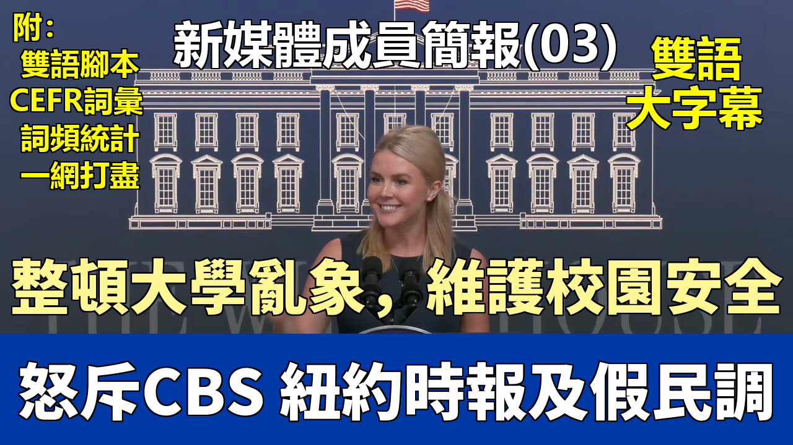

{% video youtube:vk8GkpDIfEo width:100% autoplay:0 %}


### 【中英文双语脚本】

Good afternoon, everybody. Hello. Hello. It's great to see all of you.
大家下午好。你好。你好。很高興見到大家。
Welcome to our third official influencer briefing here at the White House in the beautiful South Court Auditorium,
歡迎來到我們在白宮美麗的南苑禮堂舉行的第三次官方影響者簡報會，
Joe Biden's former office that he pretended was his office.
這裏曾是喬·拜登假裝是他的辦公室的前辦公室。
Now we're using it for its real purposes as an auditorium.
現在我們正將其用於其真正的目的——作爲一個禮堂。
And we are embracing and empowering new media like never before. You are all a testament to that.
我們正以前所未有的方式擁抱並賦能新媒體。你們都是證明。
We're so grateful that you're here today.
我們非常感謝你們今天能來這裏。
President Trump is truly the most transparent and accessible president in American history. And we are just following his example.
特朗普總統確實是美國曆史上最透明、最平易近人的總統。我們只是在效仿他的榜樣。
That's a little bit why this press briefing today is tardy
這也是今天這場新聞簡報會稍有延遲的部分原因，
because the president was hosting a more than two hour long cabinet meeting with his entire cabinet.
因爲總統剛剛主持了一場與他全體內閣成員的長達兩個多小時的內閣會議。
Each secretary went around the room to talk about the promises they are delivering on for the American public
每一位部長都輪流發言，談論他們正在爲美國公衆兌現的承諾，
and the directives they are executing at the behest of the president of the United States.
以及他們正在根據美國總統的指示執行的指令。
Can you ever remember a cabinet meeting in which the media were welcomed into the room to ask questions of the entire federal government?
你還能記得有哪次內閣會議，媒體被歡迎進入房間向整個聯邦政府提問嗎？
No, you can't because it never happened.
不，你記不起來，因爲從未發生過。
Joe Biden was afraid to speak to the press because he was mentally incompetent and driving our country into the ground.
喬·拜登害怕對媒體講話，因爲他精神上不稱職，並且正在把我們的國家推向深淵。
But fortunately, President Trump has been incredibly hard at work cleaning up Joe Biden's messes and making our country great again.
但幸運的是，特朗普總統一直非常努力地在清理喬·拜登留下的爛攤子，讓我們的國家再次偉大。
Yesterday marked the president's official 100th day in office.
昨天是總統正式上任的第100天。
The first 100 days of President Trump's second term can only be summed up as promises made, promises kept.
特朗普總統第二個任期的頭100天只能總結爲：做出承諾，兌現承諾。
He has ushered in the most secure border in modern American history and he didn't need a bill from Congress to do it.
他帶來了美國現代史上最安全的邊境，而且他不需要國會的法案就能做到這一點。
Do you all remember that? They said we needed a bill. We didn't need a bill. We just needed a new president.
你們都還記得嗎？他們說我們需要一個法案。我們不需要法案。我們只需要一位新總統。
The border is now closed and the Biden border invasion has been halted.
邊境現已關閉，拜登的邊境入侵已被阻止。
Illegal border encounters are down by 95%.
非法越境接觸事件下降了95%。
Illegal alien gotaways, one of the top threats to our public safety, are down by an astounding 99.99%.
非法移民“逃脫者”（gotaways），這是對我們公共安全的最大威脅之一，驚人地下降了99.99%。
And Fox News' Bill Melugin, who did exceptional reporting covering the Biden border crisis, was recently quoted saying,
福克斯新聞的比爾·梅盧金，他在報道拜登邊境危機方面做得非常出色，最近被引述說：
"If Fox were to send me down there right now, I would have trouble finding a single migrant on camera."
“如果福克斯現在派我去那裏，我將很難在鏡頭裏找到一個移民。”
That is the Trump effect.
這就是特朗普效應。
President Trump took on the cartels and designated Tren de Aragua, MS-13, and other vicious gangs and cartels as foreign terrorist organizations.
特朗普總統打擊了販毒集團，並將“特倫·德·阿拉瓜”、MS-13以及其他兇殘的幫派和販毒集團指定爲外國恐怖組織。
Under President Trump, it is the policy of the United States to ensure the total elimination of these brutal organizations' presence in our country.
在特朗普總統領導下，美國的政策是確保徹底消除這些殘暴組織在我國的存在。
And we are also beginning stages of carrying out the largest mass deportation in American history.
我們也在開始執行美國曆史上最大規模的集體驅逐出境行動。
We have already arrested more than 150,000 illegal aliens and you can expect those numbers to ratchet up in the months ahead.
我們已經逮捕了超過15萬非法移民，你可以預期這些數字在未來幾個月會急劇增加。
On the economy, President Trump is rebuilding the greatest economy in the world once again.
在經濟方面，特朗普總統再次重建了世界上最偉大的經濟。
Since day one, he has focused on defeating inflation, bringing down the cost of living,
從第一天起，他就專注於戰勝通貨膨脹，降低生活成本，
and making the United States the best place in the world to do business, invest, create jobs and innovate.
並使美國成爲世界上經商、投資、創造就業和創新的最佳地點。
The president later this afternoon in the East Room of the White House will be joined by CEOs from around the world
今天下午晚些時候，總統將在白宮東廳與來自世界各地的CEO們會面，
who have committed trillions of dollars in investments right here in the United States of America.
他們已承諾在美利堅合衆國投資數萬億美元。
I don't think the president is getting enough credit for the massive deregulation campaign that he has launched across the entire federal bureaucracy.
我認爲總統在整個聯邦官僚機構發起的這場大規模放松管制運動沒有得到足夠的讚譽。
He himself has signed a number of executive orders to unleash rapid deregulation and reduce the cost of living for families and for small businesses.
他本人簽署了多項行政命令，以快速放松管制，降低家庭和小企業的生活成本。
And we are seeing a big impact of this already.
我們已經看到了這帶來的巨大影響。
His deregulatory actions thus far will save nearly $11,000 per family of four over the next several years.
他迄今爲止的放松管制行動將在未來幾年爲每個四口之家節省近11,000美元。
And building on this success, the president has encouraged the rapid on-shoring of jobs to restore America as our world's manufacturing superpower.
在此成功的基礎上，總統鼓勵工作崗位快速回流，以恢復美國作爲世界製造業超級大國的地位。
He is effectively utilizing tariffs to bring the entire world to the negotiating table, offering more favorable terms for our country.
他正有效地利用關稅將全世界帶到談判桌前，爲我們的國家爭取更有利的條款。
When all is said and done, America will finally have fair and reciprocal trade, and our country will finally stop being ripped off.
當一切塵埃落定時，美國最終將擁有公平互惠的貿易，我們的國家將最終停止被敲竹槓。
So far, as I mentioned, total investments under this administration are more than $5 trillion.
到目前爲止，正如我提到的，本屆政府下的總投資額超過5萬億美元。
The president has already created 345,000 jobs since taking office in January.
自一月份上任以來，總統已經創造了345,000個就業崗位。
9,000 manufacturing jobs were created compared to the 6,000 manufacturing jobs lost per month in the final two years of the Biden administration.
新增了9,000個製造業崗位，相比之下，拜登政府最後兩年每月損失6,000個製造業崗位。
The labor force participation rate for those without a high school diploma is up. Inflation has dropped.
沒有高中文憑者的勞動力參與率上升。通貨膨脹已經下降。
And the price of prescription drugs last month was the largest drop ever recorded.
上個月處方藥價格的下降是有記錄以來最大的一次。
In little more than three months, President Trump has America headed in the right direction. The good news is we are just getting started.
在短短三個多月的時間裏，特朗普總統已讓美國朝着正確的方向前進。好消息是我們纔剛剛開始。
We are very busy every single day here at the White House, literally working around the clock seven days a week to restore the golden age of America.
我們在白宮每天都非常忙碌，毫不誇張地說，每週七天、夜以繼日地工作，以恢復美國的黃金時代。
Hundreds of promises have been made and kept. There is certainly more work to do. The best is yet to come.
數以百計的承諾已經做出並兌現。當然還有更多工作要做。最好的尚未到來。
But we are very proud of the efforts the president has made to continue the non-traditional media approach that he so beautifully executed on the campaign trail,
但我們爲總統所做的努力感到非常自豪，他延續了在競選活動中出色執行的非傳統媒體策略，
which led him back to this office talking to podcasters, social media content creators, and influencers like yourself.
這使他重返這個辦公室，與播客主、社交媒體內容創作者以及像你們這樣的影響者交談。
And again, we're so proud to welcome you to the White House here today so you can ask questions for the whole world to hear.
再次，我們非常自豪今天歡迎你們來到白宮，這樣你們可以提出問題讓全世界聽到。
So Jack, great to see you. Why don't you kick us off?
那麼，傑克，很高興見到你。你先開始提問吧？
Caroline, thanks so much for having us in today.
卡羅琳，非常感謝今天邀請我們來。
And I appreciate the administration making yourself available and making it available to us and all of our followers.
我感謝政府能抽出時間，並讓我們以及我們所有的關注者有機會參與。
I understand that you're going to be continuing these. I think it's fantastic that we really have everybody come in and be able to do this.
我知道你們將繼續舉辦這樣的活動。我認爲讓大家都能進來參與進來真是太棒了。
One of the things that's been troubling me and has actually been affecting me over the last 24 hours
有一件事一直困擾着我，並且在過去24小時裏確實影響到了我，
is the rise of violence that we've seen from elements of the far left,
那就是我們看到的來自極左翼分子的暴力事件日益增多，
starting with things like Luigi Mangione, the support for these inhuman organizations like MS-13, Tren de Aragua,
從像路易吉·曼吉奧內（Luigi Mangione）這樣的人開始，到對MS-13、特倫·德·阿拉瓜（Tren de Aragua）等非人組織的支​​持，
and even, of course, the assassination attempts on President Trump, Thomas Matthew Crooks, and Ryan Routh,
當然，還有針對特朗普總統的暗殺企圖，如托馬斯·馬修·克魯克斯（Thomas Matthew Crooks）和瑞安·勞斯（Ryan Routh），
as well as numerous incidents against anyone who owns a Tesla, apparently.
以及顯然針對任何擁有特斯拉汽車的人的衆多事件。
You don't really see the Democrats opposing these things.
你並沒有真正看到民主黨人反對這些事情。
You see them in many cases either co-signing it or giving a wink and nod to it
在很多情況下，你要麼看到他們表示贊同，要麼對此使眼色、點頭默許，
at the same time that they will be demanding that we follow due process for anyone who actually is a hardened criminal or some of the worst of the worst.
與此同時，他們卻要求我們對那些真正的慣犯或罪大惡極的人遵循正當程序。
What is the administration doing DOJ-wise or FBI-wise to combat this rise in violence that we're seeing?
政府在司法部（DOJ）或聯邦調查局（FBI）層面正在採取什麼措施來打擊我們所看到的這種暴力事件的上升？
It's a great question, Jack, and I absolutely agree with the premise of your question, which I usually don't when I take questions at a podium.
這是個好問題，傑克，我完全同意你問題的前提，這在我站在講臺上回答問題時通常是不會這樣的。
But certainly you're right. We have seen a rise in political violence that stems from the left,
但你當然是對的。我們確實看到了源於左翼的政治暴力事件有所增加，
dating back to the Black Lives Matter movement, which the left and the Democrats don't want to talk about much, but they burned down American cities.
可以追溯到“黑人的命也是命”運動，左翼和民主黨人不太願意談論這個，但他們燒燬了美國的城市。
The Biden administration did nothing to prosecute those who created that violence,
拜登政府沒有采取任何行動起訴那些製造暴力的人，
oftentimes not just destroying businesses, but also lives and communities as well.
他們往往不僅摧毀了企業，還摧毀了生命和社區。
You look at the rise of violence against the president himself and his supporters.
你看看針對總統本人及其支持者的暴力事件的增加。
You had two heinous assassination attempts from leftist lunatics,
發生了兩起由左翼瘋子發起的令人髮指的暗殺企圖，
and the president is lucky and blessed to be here today because he was able to survive that political violence and those assassination attempts.
總統今天能在這裏是幸運和受祝福的，因爲他得以在那場政治暴力和暗殺企圖中倖存下來。
You look at the recent attacks on Tesla, on Elon Musk's company. It's quite ironic because Democrats and leftists were the greatest fans of Tesla.
你看看最近對特斯拉、對埃隆·馬斯克公司的攻擊。這很諷刺，因爲民主黨人和左翼分子曾是特斯拉的最大粉絲。
Many Democrats drive Teslas to this very day, but then it's their same party who is doing nothing to stop or condemn or discourage this violence from taking place.
許多民主黨人至今仍駕駛特斯拉，但正是他們同一個政黨，卻對阻止、譴責或勸阻這種暴力事件的發生無所作爲。
In many cases, Democrat elected officials are actually inciting it and encouraging it.
在許多情況下，民主黨當選官員實際上在煽動和鼓勵這種暴力。
But that's not going to be allowed to happen anymore.
但這將不再被允許發生。
The attorney general was just in the cabinet room with the president and made it very clear to anyone who is inciting violence or participating in violence,
司法部長剛纔就在內閣會議室與總統在一起，並向任何煽動暴力或參與暴力的人明確表示，
you will be prosecuted to the fullest extent of the law.
你將被依法 maximising 起訴。
No longer do we have a justice department that chooses prosecutions based on one's political affiliation.
我們不再有一個根據政治派別選擇起訴對象的司法部門。
If you break the law, you will be held accountable for that.
如果你違法，你將爲此承擔責任。
I think we are truly restoring a fair and equal justice system in this country.
我認爲我們正在真正恢復這個國家公平公正的司法體系。
The attorney general spoke earlier about how there have been several cases brought against those who have perpetrated this political violence against Tesla,
司法部長早些時候談到，已經有幾起針對那些對特斯拉（一家偉大的美國製造公司）
which is a great American-made company.
實施這種政治暴力的人提起的訴訟。
We need to see more people on the other side of the aisle stepping out to discourage this violence. But I don't think we will hold our breath.
我們需要看到更多對立陣營的人站出來阻止這種暴力。但我認爲我們不會屏息以待。
We won't wait for them. The president is leading by example.
我們不會等他們。總統正以身作則。
I think the restoration of justice we've seen at the DOJ under the leadership of Pam Bondi and Kash Patel,
我認爲我們在司法部看到的，在帕姆·邦迪（Pam Bondi）和卡什·帕特爾（Kash Patel）領導下的司法恢復，
who is doing an incredible job as the FBI director, is a testament to that. Thank you. Don.
卡什·帕特爾作爲聯邦調查局局長工作出色，就是對此的證明。謝謝。唐。
Thank you. Thank you for giving me the honor to be able to ask a question to provide some transparency for the American people.
謝謝。感謝給我這個榮幸能夠提問，爲美國人民提供一些透明度。
Speaking of, I wanted to reference election integrity.
說到這個，我想提及選舉誠信問題。
A lot of people in America are questioning if there's any possibility that we could see further investigations for anyone that could have violated our election integrity rights.
許多美國人質疑是否有可能對任何可能侵犯我們選舉誠信權利的人進行進一步調查。
And more importantly, so is there any possibility for names such as Barack Hussein Obama, Hillary Rodham Clinton to ever just possibly get investigated
更重要的是，那麼有沒有可能像巴拉克·侯賽因·奧巴馬、希拉里·羅德姆·克林頓這樣的名字會被調查，
for any of these questions from the American people, any of the wrongdoings they might have done?
針對美國人民提出的任何這些問題，以及他們可能犯下的任何不當行爲？
It's refreshing to actually hear a question on election integrity because the legacy media would never ask such a question.
能真正聽到關於選舉誠信的問題真是令人耳目一新，因爲傳統媒體絕不會問這樣的問題。
They're so out of touch with where the American people are on this issue.
他們在這個問題上與美國人民的想法完全脫節。
And Americans, you're absolutely right, want to have trust in our electoral system.
美國人，你完全正確，希望信任我們的選舉制度。
Without free and fair elections, you cannot have a free and fair country.
沒有自由公正的選舉，就不可能有自由公正的國家。
And President Trump has absolutely been a leader on this effort, talking about the irregularities we've seen in our elections,
特朗普總統絕對是這項努力的領導者，他談到了我們在選舉中看到的不規範行爲，
holding Democrats accountable for allowing illegal immigrants to participate in our elections.
追究民主黨人允許非法移民參與我們選舉的責任。
And he actually signed a recent executive order to protect the integrity of our elections.
他實際上最近簽署了一項行政命令來保護我們選舉的完整性。
It will strengthen voter citizenship verification laws.
它將加強選民公民身份驗證法律。
It also directs the attorney general to enter information sharing agreements with state election officials to identify cases of election fraud.
它還指示司法部長與州選舉官員簽訂信息共享協議，以識別選舉舞弊案件。
So that correspondence between the federal government and the attorney general with state and local officials has never happened before.
因此，聯邦政府和司法部長與州及地方官員之間的這種協調以前從未發生過。
It will allow the federal government to more easily identify these cases of fraud and then prosecute those who violate our election laws.
這將使聯邦政府更容易識別這些舞弊案件，然後起訴那些違反我們選舉法的人。
And it is, again, appalling that any politician, regardless of party, could be against ensuring only American citizens can vote in American elections.
而且，再次令人震驚的是，任何政客，無論黨派，竟然會反對確保只有美國公民才能在美國選舉中投票。
How could anyone ever be against ensuring Americans need to have proof of identification to participate in our elections?
怎麼會有人反對確保美國人需要身份證明才能參與我們的選舉呢？
You see the Democrats falling over themselves, trying to say, this is somehow voter suppression. Absolutely not.
你看到民主黨人爭先恐後地說，這在某種程度上是選民壓制。絕對不是。
We are trying to ensure that every American citizen, their vote actually counts and is not being outweighed by fraudulent votes and fraudulent ballots
我們正努力確保每一位美國公民的選票真正算數，並且不會被我們知道在以往選舉中
that we know have been cast in previous elections.
投下的欺詐性選票和選票所抵消。
So the president's taking this very seriously.
所以總統非常重視這件事。
He signed an extremely strong executive order directing action from the AG and the Department of Homeland Security as well to clean up our elections.
他簽署了一項極其強有力的行政命令，指示司法部長和國土安全部也採取行動來清理我們的選舉。
And we expect Congress to do more on this front as well. Let's go over here.
我們也期待國會在這方面做得更多。我們到這邊來。
On that question, again, Caroline, thank you so much for hosting this.
關於那個問題，再次，卡羅琳，非常感謝你主持這次活動。
Really appreciate the opportunity to come in here and ask questions of you guys and appreciate the president giving us some time of yours as well.
非常感謝有機會來到這裏向你們提問，也感謝總統能抽出一些時間。
On a follow up on Dom's question, I still have a ton of my audience that is still asking questions about Hillary Rodham Clinton
作爲對多姆問題的跟進，我的觀衆中仍有很多人在問關於希拉里·羅德姆·克林頓的問題，
and the fact that it came out that her and the DNC funded the Steele dossier,
以及事實表明她和民主黨全國委員會（DNC）資助了斯蒂爾檔案，
which then led to a crossfire hurricane and all the FISA abuses that went against President Trump leading up to the 2020 election.
這隨後導致了“交火颶風”調查以及所有在2020年大選前針對特朗普總統的FISA濫用行爲。
Is there, you don't have to spill the beans, but is there something? Is there somebody still looking at it?
是否有，你不必透露內情，但是否有什麼進展？是否還有人在調查這件事？
We just want to know that it's not dead in the water, that Hillary's not just off scot free
我們只想知道這件事沒有石沉大海，希拉里沒有在知道她和民主黨全國委員會
after knowing what her and the DNC did leading up to the 2020 election.
在2020年大選前做了什麼之後就逍遙法外。
It's a great question. I really understand and agree with why you're asking it,
這是個好問題。我非常理解並同意你爲什麼問這個問題，
but I would love to let the president weigh in on that front.
但我很想讓總統在這方面發表意見。
I haven't discussed it with him, to be honest with you, but certainly we can ask him and get back to you. All right.
老實說，我還沒和他討論過這件事，但我們當然可以問他然後回覆你。好的。
So Caroline, Madam Press Secretary, the- You can call me Caroline.
那麼，卡羅琳，新聞祕書女士，——你可以叫我卡羅琳。
Thank you, Caroline. Over the weekend, the White House Correspondents Association had their gala, they had their dinner
謝謝你，卡羅琳。週末，白宮記者協會舉辦了他們的晚會，他們共進晚餐，
and Alex Thompson from now Axios prior to that Politico didn't really apologize, but came forward and said,
現在在Axios、之前在Politico的亞歷克斯·湯普森並沒有真正道歉，但站出來說，
we quote unquote missed the story of Joe Biden's demise, his health demise, his cognitive demise during the four years.
我們（引用原話）錯過了喬·拜登衰落的故事，他四年裏的健康衰落、認知衰落。
Jake Tapper has written the book since President Trump was elected that they missed the demise of Joe Biden as well.
傑克·塔珀自特朗普總統當選以來寫了一本書，說他們也錯過了喬·拜登的衰落。
Fast forward to this lawsuit with CBS, right? So the media, legacy media has not been held accountable.
快進到與哥倫比亞廣播公司（CBS）的這起訴訟，對吧？所以媒體，傳統媒體沒有被追究責任。
Will this lawsuit with CBS go to fruition? In other words, I would love to see it go to trial so that we can see, so they can be held accountable.
這起與CBS的訴訟會成功嗎？換句話說，我希望看到它進入審判，這樣我們就能看到，他們就能被追究責任。
Additionally, will the New York Times be enjoined into that lawsuit because the New York Times has already stated that they agree with CBS.
此外，《紐約時報》會否被捲入那場訴訟，因爲《紐約時報》已經聲明他們同意CBS的觀點。
And Trump has said maybe we're going to sue the New York Times as well.
特朗普也說過也許我們也要起訴《紐約時報》。
And as a follow up to all this, and it really does dovetail because it's not just left leaning media, Fox News, Fox News put out a poll.
作爲這一切的後續，這確實是相關的，因爲不僅僅是左傾媒體，福克斯新聞，福克斯新聞發佈了一項民意調查。
I'm a statistician. The poll they put out was wildly biased against President Trump. Will Trump sue Fox for their methodology in polling?
我是個統計學家。他們發佈的民調對特朗普總統帶有極大的偏見。特朗普會因爲福克斯的民調方法而起訴它嗎？
Two great questions. Let me hit the first one first. As for CBS and the White House Correspondents Association dinner, it was laughable.
兩個好問題。讓我先回答第一個。至於CBS和白宮記者協會晚宴，那真是可笑。
They gave an award to a journalist for talking about Biden's mental incompetence.
他們給一位談論拜登精神不稱職的記者頒獎。
He wrote a story about it years after the American people knew that story to be true.
他在美國人民知道那個故事是真的多年之後才寫了一篇相關報道。
Didn't take much, just two eyes and two ears to realize that Joe Biden was completely inept, was unfit to serve as president of the United States.
不需要太多，只需要兩隻眼睛和兩隻耳朵就能意識到喬·拜登完全無能，不適合擔任美國總統。
And nobody in the legacy media, nobody in this city wanted to talk about it.
而傳統媒體中沒有人，這個城市裏沒有人願意談論這件事。
In fact, I recall being on President Trump's campaign and calling out Joe Biden's cognitive decline. And we were accused of manufacturing deepfakes.
事實上，我記得在特朗普總統競選團隊時，指出了喬·拜登的認知能力下降。而我們被指責製造深度僞造視頻。
My predecessor accused us of manufacturing deepfakes from the White House podium
我的前任在白宮講臺上指責我們製造深度僞造視頻，
when she knew and everybody in this White House knew the true status of Joe Biden's physical and mental fitness.
而她和這個白宮裏的每個人都知道喬·拜登身體和精神健康的真實狀況。
And the mainstream media allowed that cover up to take place because they refused to dig for the truth.
主流媒體允許這種掩蓋行爲發生，因爲他們拒絕挖掘真相。
They tried to get the American people not to believe their own eyes. It is truly one of the greatest cover ups and scandals in American history.
他們試圖讓美國人民不相信自己的眼睛。這確實是美國曆史上最大的掩蓋事件和醜聞之一。
And again, this is why we are welcoming independent journalists and social media influencers and content creators into the White House with open arms
再次強調，這就是爲什麼我們張開雙臂歡迎獨立記者、社交媒體影響者和內容創作者進入白宮，
because all of you in this room and many of your colleagues in independent journalism talked about this online.
因爲在座的各位以及你們在獨立新聞界的許多同事都在網上談論過這件事。
Nobody gave you credence as far as the legacy media is concerned.
就傳統媒體而言，沒有人相信你們。
And now they host cocktail parties where they are applauding each other and patting each other on the back for uncovering the truth.
而現在他們舉辦雞尾酒會，互相稱讚、互相吹捧，因爲揭露了真相。
It was years later. And it's truly sad to see. But again, that's why we're making much needed and long overdue changes.
那是多年以後的事了。看到這種情況真是可悲。但再次強調，這就是爲什麼我們正在做出急需且早該進行的改變。
As for the lawsuit against CBS, the president and his legal team fully intend to carry this lawsuit forward.
至於針對CBS的訴訟，總統和他的法律團隊完全打算將這場訴訟進行到底。
The president put out a very strong statement in regard to that and fake news CBS this morning.
總統今天早上就此事以及虛假新聞CBS發佈了一份非常強硬的聲明。
And then as for the Fox News poll, presidents right, these are fake polls.
然後關於福克斯新聞的民調，總統是對的，這些都是假民調。
They overpoll Democrats, they underpoll President Trump supporters. It's always been the case for media polls.
他們過度抽樣民主黨人，低估了特朗普總統的支持者。媒體民調一直如此。
They consistently underestimate President Trump's support amongst the public.
他們一貫低估特朗普總統在公衆中的支持率。
That's why we don't really blink when we see them. To be honest with you, we're staying focused on the mission and moving forward.
老實說，這就是爲什麼我們看到它們時並不太在意。我們專注於任務並繼續前進。
The president knows everything he's doing is exactly what he promised the American public he would do.
總統知道他所做的一切正是他向美國公衆承諾要做的事情。
And if you look at the key issues in the polling, the president is still ahead because Americans know he is delivering on them on those issues for them.
如果你看看民調中的關鍵問題，總統仍然領先，因爲美國人知道他正在爲他們在這些問題上兌現承諾。
And if you look at the methodology, you're right. They're over polling Democrats under polling Republicans.
如果你看看方法論，你是對的。他們過度抽樣民主黨人，低估了共和黨人。
It's a clear cut case of fake polling, no doubt.
毫無疑問，這是一個明顯的假民調案例。
So misinformation, right, and maybe as detrimental to the presidency as what CBS has done or the New York Times is doing.
所以是錯誤信息，對吧，也許對總統職位的損害程度與CBS或《紐約時報》所做的相當。
Yeah, no doubt about it. The president's spoken quite strongly about it.
是的，毫無疑問。總統對此發表了非常強烈的言論。
And I know he's made some phone calls to express his displeasure with it as well. Carolina, go ahead.
我知道他也打了一些電話來表達對此的不滿。卡羅琳娜，請講。
Thank you so much for having me here, especially as a legal immigrant,
非常感謝邀請我來這裏，尤其我是一名合法移民，
because the overwhelming fake news that Hispanics don't support President Trump, but we do.
因爲鋪天蓋地的假新聞說西班牙裔不支持特朗普總統，但我們支持。
We're very excited to have mass deportations because it affects our communities.
我們對大規模驅逐感到非常興奮，因爲它影響到我們的社區。
My question is about immigration reform and DACA.
我的問題是關於移民改革和“童年抵美者暫緩遣返計劃”（DACA）。
During the first Trump administration, we saw that President Trump, like no other president, wanted to make a deal with the Democrats
在特朗普的第一屆政府期間，我們看到特朗普總統，不像其他任何總統，想要與民主黨人達成協議，
to give a pathway to citizenship to 1.2 million DACA recipients. I don't know.
爲120萬DACA接受者提供公民身份途徑。我不知道。
I haven't really heard anything coming out. Is there going to be is there any policy surrounding that situation?
我沒有真正聽到任何消息出來。是否有圍繞這種情況的政策？
And is there going to be immigration reform?
會有移民改革嗎？
Well, first of all, thanks for sharing your story.
嗯，首先，感謝分享你的故事。
And the president overwhelmingly won the vote of Hispanic Americans in the previous election
總統在上次選舉中以壓倒性優勢贏得了西班牙裔美國人的選票，
and swept counties on the border of Texas that are predominantly Hispanic counties.
並橫掃了德克薩斯州邊境上以西班牙裔爲主的縣。
Because to your very point, Hispanic Americans and legal immigrants to this country from all countries
因爲正如你所指出的，西班牙裔美國人和來自所有國家的合法移民
are so sick and tired of seeing the mass invasion of illegal immigrants that was allowed to occur under the previous administration.
對在前任政府允許下發生的大規模非法移民入侵感到非常厭倦和厭煩。
And it was an issue the president ran on and he delivered on. These mass deportations are underway.
這是總統競選時提出的問題，他也兌現了。這些大規模驅逐正在進行中。
And it is currently the position of this administration. We are focused on removing as many illegal alien criminals from our communities as possible.
這是本屆政府目前的立場。我們專注於盡可能多地從我們的社區中清除非法移民罪犯。
And not only are we doing that for law abiding American citizens, but also legal immigrants, as you said, who are citizens now and came here the right way,
我們不僅是爲了守法的美國公民這樣做，也是爲了像你說的那些現在是公民、通過正確途徑來到這裏、
waited their turn, paid their dues. And we're not going to turn our backs on them.
等待輪候、付出了代價的合法移民。我們不會背棄他們。
And so there's a lot of reforms that need to be made to our legal immigration system. The president has talked about that.
因此，我們的合法移民體系需要進行很多改革。總統已經談到了這一點。
But our initial focus right now and our priority is cleaning up the mess that the previous administration left us.
但我們目前的初步重點和優先事項是清理前任政府留給我們的爛攤子。
And there's more work to do. But a lot of progress has been made thus far. CJ. Yeah.
還有更多工作要做。但到目前爲止已經取得了很大進展。CJ。是的。
You know, also thank you so much, Caroline, for having us here.
你知道，也非常感謝你，卡羅琳，邀請我們來這裏。
Also on the topic of immigration, not only do I think the legal immigrant community welcomes what the president's doing, but also the black community.
同樣關於移民話題，我認爲不僅合法移民社區歡迎總統正在做的事情，黑人社區也是如此。
So I would love to get your reaction to recent comments made by Symone Sanders,
所以我很想聽聽你對西蒙·桑德斯（Symone Sanders）最近評論的反應，
who said that people of color would be next in line for deportation under this president.
她說有色人種將是這位總統任內下一個被驅逐的對象。
Now, that was a revelation to me and probably many others in the black community being a lifelong American.
現在，這對我以及可能許多黑人社區的終身美國人來說都是一個啓示。
I'm not really sure where Tom Homan would send me other than my childhood home in Augusta, Georgia.
我不太確定湯姆·霍曼（Tom Homan）除了把我送到我在佐治亞州奧古斯塔的童年家園之外，還會把我送到哪裏。
But why do you think this fear mongering is being directed at the black community over the issue of immigration?
但是你認爲爲什麼這種恐懼散佈會針對黑人社區的移民問題？
And do you think it's offensive to conflate illegal aliens who are rapists, traffickers, and sexual abusers with law abiding citizens in the black community?
你認爲將強姦犯、販運者和性虐待者等非法移民與黑人社區的守法公民混爲一談是冒犯性的嗎？
It's absolutely insane. And it is racist what she is saying.
這絕對是瘋了。她說的話是種族主義的。
The president intends on deporting illegal alien criminals who broke our nation's laws
總統打算驅逐那些違反了我們國家法律的非法移民罪犯，
and are not only impacting communities across the country, but in particular communities of color in our inner cities.
他們不僅影響着全國各地的社區，尤其影響着我們內城區的有色人種社區。
You remember the story out of New York City where young minority children were kicked out of their public school
你還記得紐約市的那個故事，年輕的少數族裔兒童被趕出他們的公立學校，
to make room for illegal immigrants to sleep on the floor of their cafeteria. That is putting America last.
爲非法移民騰出空間睡在他們自助餐廳的地板上。那是把美國放在最後。
Doesn't matter your race, your religion or creed. If you are a law abiding American citizen, President Trump is going to put you first.
無論你的種族、宗教或信仰如何。如果你是守法的美國公民，特朗普總統會把你放在第一位。
Shame on Symone Sanders for saying that. She knows better, but she's trying to fear people into disliking this president with lies.
西蒙·桑德斯說這話真可恥。她明明知道得更清楚，但她試圖用謊言來恐嚇人們，讓他們不喜歡這位總統。
But I think the American public are much smarter than she believes that they are. And that's why they reelected President Trump. Oh, go ahead.
但我認爲美國公衆比她認爲的要聰明得多。這就是他們再次選舉特朗普總統的原因。哦，請講。
Hi, Caroline. So as the youngest press secretary in history, who is a wife and a mom, you've become widely popular with America First Patriots.
嗨，卡羅琳。作爲歷史上最年輕的新聞祕書，同時也是一位妻子和母親，你在“美國優先”愛國者中廣受歡迎。
As an 18 year old, I can say you're definitely an inspiration to Gen Z.
作爲一個18歲的人，我可以說你絕對是Z世代的榜樣。
What has been the biggest highlight for you in these first 100 historic days?
在這歷史性的頭100天裏，對你來說最大的亮點是什麼？
Thank you for asking that and saying that, Bo. I am Gen Z.
謝謝你問這個問題並這麼說，博。我是Z世代。
I think I heard the term "Zillennial" because I'm right on the cusp of millennial and Gen Z. I'm just fringing at that.
我想我聽過“Z世代千禧一代”（Zillennial）這個詞，因爲我正好處於千禧一代和Z世代的交界處。我剛好沾邊。
But there's been so many highlights. Just being here every day is such a blessing and an honor.
但亮點太多了。每天能在這裏本身就是一種祝福和榮幸。
And I'll share a quick story to that point. The president, I'm only here because the president believed in me and uplifted me
關於這一點，我分享一個小故事。總統，我能在這裏只是因爲總統相信我並提拔了我，
and so many others who are working so hard across this administration.
以及在本屆政府中辛勤工作的許多其他人。
This administration is filled with young, vibrant people who come to work every day hungry and eager to help accomplish the president's goals.
本屆政府充滿了年輕、充滿活力的人，他們每天都懷着渴望和熱情來工作，幫助實現總統的目標。
And I think we're seeing a real reawakening amongst young people across the country.
我認爲我們正在看到全國年輕人真正的重新覺醒。
President spoke directly to young people during his campaign, inspiring confidence in them and restoring hope in the American dream.
總統在競選期間直接與年輕人對話，激發他們的信心，重燃對美國夢的希望。
Basic common sense values of faith and family and freedom that truly do resonate with young people.
信仰、家庭和自由這些基本的常識價值觀確實能引起年輕人的共鳴。
The American dream of home ownership, of being able to afford to raise a family and to have children. It's a beautiful thing.
擁有住房、能夠負擔得起養家餬口和生兒育女的美國夢。這是一件美好的事情。
And I think the president openly talking about it has inspired so many young minds and opened up so many young hearts.
我認爲總統公開談論這件事激勵了許多年輕的頭腦，打開了許多年輕的心扉。
And I'm just so honored to be in this role.
我非常榮幸能擔任這個角色。
The president, he's wrote about it in his books and he's talked about it himself when he was in his 20s. He was building buildings in Manhattan.
總統，他在他的書裏寫過，他自己也談到過，當他20多歲的時候，他正在曼哈頓建造大樓。
So certainly he believes in the strength and the ability of young Americans across the country like yourself here at the White House at just 18 years old.
所以他當然相信全國各地年輕美國人的力量和能力，就像你一樣，年僅18歲就在白宮。
Thanks for being here. Into the back row.
感謝你來到這裏。後排那位。
Thank you so much for having us here, Caroline. It underscores President Trump's transparency,
非常感謝邀請我們來這裏，卡羅琳。這突顯了特朗普總統的透明度，
shifting focus a little bit to what's happening on our universities.
稍微轉移一下焦點，看看我們大學裏正在發生什麼。
President Trump has finally put American students over violent foreign nationals.
特朗普總統終於將美國學生置於暴力外國國民之上。
And right now we're seeing the media whitewash the violence perpetrated on our college campuses.
現在我們看到媒體在粉飾我們大學校園裏發生的暴力行爲。
We see many universities trying to bypass President Trump's executive order.
我們看到許多大學試圖繞過特朗普總統的行政命令。
And my question is how exactly will President Trump make sure that these universities are being properly held accountable
我的問題是，特朗普總統將如何確切地確保這些大學被恰當地追究責任，
and violent foreign nationals who are taking over campus buildings are sent back home?
以及那些佔領校園建築的暴力外國國民被遣返回國？
Yeah. Well, to Jack's earlier question about political violence, this is another form of political violence we've seen stem from the left
是的。嗯，關於傑克早前提到的政治暴力問題，這是我們看到的另一種源於左翼的政治暴力形式，
with the pro-Hamas movement that took place on college campuses and universities.
即在大學校園裏發生的親哈馬斯運動。
In fact, I recall being in Manhattan courtroom during the Alvin Bragg case against President Trump in the midst of the campaign.
事實上，我記得在競選期間，在阿爾文·布拉格（Alvin Bragg）起訴特朗普總統的案件中，我正在曼哈頓的法庭裏，
Witnessing the chaos erupting on the campus of Columbia University.
目睹着哥倫比亞大學校園裏爆發的混亂。
And I remember the president watching the television saying, when we are back, we are going to fix this. This is ridiculous.
我記得總統看着電視說，等我們回來，我們會解決這個問題。這太荒謬了。
And immediately directed his campaign staff at the time to insert it into the speeches
並立即指示他當時的競選團隊將其加入演講稿中，
and to make sure the American public knew he was not going to tolerate violence on our nation's college campuses and the illegal harassment against Jewish American students.
並確保美國公衆知道他不會容忍我們國家大學校園裏的暴力行爲以及對猶太裔美國學生的非法騷擾。
He has taken incredibly strong position on this already.
他已經在這方面採取了極其強硬的立場。
He has brought many of these colleges and universities to their knees by threatening their federal funding and in a few cases, cutting federal funds.
他通過威脅聯邦資助，並在少數情況下削減聯邦資金，讓許多這些學院和大學屈服。
If you violate federal law, you will not receive federal funds under this administration. It's very simple.
如果你違反聯邦法律，在本屆政府下你將不會獲得聯邦資金。就這麼簡單。
If you allow the illegal harassment and violence against students of any race or religion on your campus, you will not receive federal funding.
如果你允許校園內對任何種族或宗教的學生進行非法騷擾和暴力，你將不會獲得聯邦資金。
You are violating Title VI, which is federal law. Presidents made that very clear.
你違反了第六章（Title VI），這是聯邦法律。總統們已經非常明確地指出了這一點。
And you've seen many of these colleges come to the table and admit their wrongdoing and apologize for it because they know they were wrong.
你已經看到許多這些學院坐到談判桌前，承認他們的不當行爲併爲此道歉，因爲他們知道自己錯了。
Unfortunately, we didn't have a president at the time who was holding them accountable, who was completely silent as students were being targeted.
不幸的是，當時我們沒有一位總統追究他們的責任，當學生們成爲目標時，他完全保持沉默。
As for the visas, same is true. The president and the secretary of state Marco Rubio, who's doing a tremendous job,
至於簽證問題，情況也是如此。總統和國務卿馬可·盧比奧（Marco Rubio），他做得非常出色，
have taken incredibly strong action on this as well.
在這方面也採取了極其強有力的行動。
And Marco Rubio, as our secretary of state, reserves the right to rescind visas from foreign nationals
馬可·盧比奧作爲我們的國務卿，保留撤銷那些有幸在我們國家的高校學習的
who have the privilege of studying on our nation's colleges and universities.
外國國民簽證的權利。
And if you engage in illegal behavior, if you're engaging in activity that's contrary to our nation's foreign policy interests,
如果你從事非法行爲，如果你從事的活動違揹我們國家的外交政策利益，
then you will no longer have the privilege of coming and studying here.
那麼你將不再有來這裏學習的特權。
We're going to put American citizens and American students first.
我們將把美國公民和美國學生放在首位。
And only the best and brightest should be allowed to come to our country and study at our nation's colleges and universities.
只有最優秀、最聰明的人才應該被允許來我們國家，在我們的高校學習。
So again, such a pleasure to see all of you here today. Thank you so much for coming to the White House.
再次，今天在這裏見到大家真是非常高興。非常感謝你們來到白宮。
We hope you enjoy the rest of this beautiful day at 1600 Pennsylvania Avenue. And thanks for all that you do. Take care. Thank you.
我們希望你們在賓夕法尼亞大道1600號度過這美好的一天剩下的時光。感謝你們所做的一切。保重。謝謝。

### 【核心词汇 - B1_C2】
| 單詞 | 音標 | 詞性 | 釋義 | 等級 | 次數 |
|---|---|---|---|---|---|
| Department | /dɪˈpɑːrtmənt/ | noun | 部門，部 | B1 | 1 |
| Security | /sɪˈkjʊrəti/ | noun | 安全 | B1 | 1 |
| able | /ˈeɪbl/ | adjective | 能夠；有能力的 | B1 | 1 |
| absolutely | /ˌæbsəˈluːtli/ | adverb | 絕對地；完全地 | B1 | 2 |
| accessible | /ækˈsesəbl/ | adjective | 可進入的；可使用的 | B1 | 1 |
| accomplish | /əˈkɑːmplɪʃ/ | verb | 完成；實現 | B1 | 1 |
| accuse | /əˈkjuːz/ | verb | 指控，控告 | B1 | 1 |
| administration | /ədˌmɪnɪˈstreɪʃn/ | noun | 管理，行政 | B1 | 1 |
| affect | /əˈfekt/ | verb | 影響 | B1 | 2 |
| afford | /əˈfɔːrd/ | verb | 負擔得起 | B1 | 1 |
| agreement | /əˈɡriːmənt/ | noun | 協議，同意 | B1 | 1 |
| alien | /ˈeɪliən/ | noun | 外星人 | B1 | 2 |
| applaud | /əˈplɔːd/ | verb | v. 鼓掌；稱讚 | B1 | 1 |
| approach | /əˈproʊtʃ/ | noun | n. 方法；接近；途徑 | B1 | 1 |
| arrest | /əˈrest/ | noun | 逮捕，拘留 | B1 | 1 |
| available | /əˈveɪləbl/ | adjective | 可用的，有空的 | B1 | 1 |
| beautifully | /ˈbjuːtɪfəli/ | adverb | 美麗地，出色地 | B1 | 1 |
| blessing | /ˈblɛsɪŋ/ | noun | 祝福； благословение; 幸事 | B1 | 1 |
| border | /ˈbɔːrdər/ | noun | 邊界；邊境 | B1 | 1 |
| breath | /brɛθ/ | noun | 呼吸；氣息 | B1 | 1 |
| chaos | /ˈkeɪɑːs/ | noun | 混亂，混沌 | B1 | 1 |
| citizenship | /ˈsɪtɪzənʃɪp/ | noun | 國籍，公民權 | B1 | 1 |
| comment | /ˈkɑːment/ | noun | 評論，意見 | B1 | 1 |
| completely | /kəmˈpliːtli/ | adverb | 完全地，徹底地 | B1 | 1 |
| concerned | /kənˈsɜːrnd/ | adjective | adj. 擔心的，關注的；有關的 | B1 | 1 |
| confidence | /ˈkɑːnfɪdəns/ | noun | n. 信心，信任 | B1 | 1 |
| content | /kənˈtent/ | noun | n. 內容，目錄 | B1 | 1 |
| contrary | /ˈkɑːntreri/ | adjective | adj. 相反的，對立的 | B1 | 1 |
| county | /ˈkaʊnti/ | noun | 縣，郡 | B1 | 1 |
| creator | /ˈkrieɪtər/ | noun | 創造者，創建者 | B1 | 1 |
| criminal | /ˈkrɪmɪnl/ | noun | 罪犯 | B1 | 2 |
| crisis | /ˈkraɪsɪs/ | noun | 危機 | B1 | 1 |
| currently | /ˈkɜːrəntli/ | adverb | 目前，現在 | B1 | 1 |
| decline | /dɪˈklaɪn/ | noun | 下降；衰退 | B1 | 1 |
| defeat | /dɪˈfiːt/ | verb | 擊敗；戰勝 | B1 | 1 |
| definitely | /ˈdefɪnətli/ | adverb | 明確地；肯定地 | B1 | 1 |
| deliver | /dɪˈlɪvər/ | verb | 遞送；傳送；發表 | B1 | 2 |
| demand | /dɪˈmænd/ | noun | 需求；要求 | B1 | 1 |
| department | /dɪˈpɑːrtmənt/ | noun | 部門；系 | B1 | 1 |
| directly | /dəˈrektli/ | adverb | 直接地；立即 | B1 | 1 |
| discourage | /dɪsˈkɜːrɪdʒ/ | verb | 使氣餒，使灰心；阻止，勸阻 | B1 | 1 |
| eager | /ˈiːɡər/ | adjective | 熱切的；渴望的 | B1 | 1 |
| economy | /iˈkɑːnəmi/ | noun | 經濟 | B1 | 1 |
| election | /ɪˈlekʃən/ | noun | 選舉 | B1 | 2 |
| element | /ˈelɪmənt/ | noun | 元素；要素 | B1 | 1 |
| encounter | /ɪnˈkaʊntər/ | noun | 遭遇；相遇 | B1 | 1 |
| encouraging | /ɪnˈkɜːrɪdʒɪŋ/ | adjective | 令人鼓舞的；激勵的 | B1 | 1 |
| engage | /ɪnˈɡeɪdʒ/ | verb | （使）從事；（使）參與；訂婚；吸引 | B1 | 1 |
| ensure | /ɪnˈʃʊr/ | verb | 確保；保證 | B1 | 2 |
| entire | /ɪnˈtaɪər/ | adjective | 整個的；全部的 | B1 | 1 |
| equal | /ˈiːkwəl/ | adjective | 相等的；同樣的 | B1 | 1 |
| extent | /ɪkˈstent/ | noun | 程度；範圍 | B1 | 1 |
| fake | /feɪk/ | adjective | 假的；僞造的 | B1 | 1 |
| finding | /ˈfaɪndɪŋ/ | noun | 發現；發現物；調查結果 | B1 | 1 |
| fitness | /ˈfɪtnəs/ | noun | 健康；健壯 | B1 | 1 |
| former | /ˈfɔːrmər/ | adjective | 之前的，以前的 | B1 | 1 |
| fund | /fʌnd/ | noun | 資金，基金 | B1 | 2 |
| general | /ˈdʒenərəl/ | adjective | 大致的，總體的；普遍的，一般的 | B1 | 1 |
| highlight | /ˈhaɪlaɪt/ | verb | 突出; 強調 | B1 | 2 |
| historic | /hɪˈstɔːrɪk/ | adjective | 歷史性的; 具有歷史意義的 | B1 | 1 |
| honest | /ˈɑːnɪst/ | adjective | 誠實的 | B1 | 1 |
| immediately | /ɪˈmiːdiətli/ | adverb | 立即，馬上 | B1 | 1 |
| immigration | /ˌɪmɪˈɡreɪʃən/ | noun | 移民，移民局 | B1 | 1 |
| incident | /ˈɪnsɪdənt/ | noun | 事件，事故 | B1 | 1 |
| incredible | /ɪnˈkredəbl/ | adjective | 難以置信的，極好的 | B1 | 1 |
| incredibly | /ɪnˈkredəbli/ | adverb | 難以置信地，非常 | B1 | 1 |
| independent | /ˌɪndɪˈpendənt/ | adjective | 獨立的，自主的 | B1 | 1 |
| initial | /ɪˈnɪʃəl/ | noun | 首字母 | B1 | 1 |
| insane | /ɪnˈseɪn/ | adjective | 精神失常的，瘋狂的 | B1 | 1 |
| inspire | /ɪnˈspaɪər/ | verb | 激勵，鼓舞 | B1 | 2 |
| intend | /ɪnˈtend/ | verb | 打算，計劃 | B1 | 2 |
| invasion | /ɪnˈveɪʒən/ | noun | 入侵，侵略 | B1 | 1 |
| invest | /ɪnˈvest/ | verb | 投資 | B1 | 1 |
| investigation | /ɪnˌvestɪˈɡeɪʃən/ | noun | 調查 | B1 | 1 |
| journalist | /ˈdʒɜːrnəlɪst/ | noun | 記者 | B1 | 2 |
| justice | /ˈdʒʌstɪs/ | noun | 正義，公正 | B1 | 1 |
| launch | /lɔːntʃ/ | verb | 發起，發動，推出；發射，下水 | B1 | 1 |
| leadership | /ˈliːdərʃɪp/ | noun | 領導能力，領導地位；領導階層 | B1 | 1 |
| lean | /liːn/ | adjective | 瘦的，精幹的 | B1 | 1 |
| legal | /ˈliːɡəl/ | adjective | 法律的，合法的 | B1 | 1 |
| lifelong | /ˈlaɪflɔːŋ/ | adjective | 終身的，畢生的 | B1 | 1 |
| marked | /mɑːrkt/ | adjective | 顯著的，有標記的 | B1 | 1 |
| mass | /mæs/ | adjective | 大量的，大規模的 | B1 | 1 |
| massive | /ˈmæsɪv/ | adjective | 巨大的 | B1 | 1 |
| mental | /ˈmentl/ | adjective | 精神的；心理的 | B1 | 1 |
| mentally | /ˈmentəli/ | adverb | 精神上地；心理上地 | B1 | 1 |
| mess | /mes/ | noun | 髒亂；混亂 | B1 | 2 |
| minority | /maɪˈnɔːrəti/ | noun | 少數；少數羣體 | B1 | 1 |
| mission | /ˈmɪʃn/ | noun | 任務；使命 | B1 | 1 |
| movement | /ˈmuːvmənt/ | noun | 運動；移動；樂章 | B1 | 1 |
| nod | /nɑd/ | noun | 點頭 | B1 | 1 |
| numerous | /ˈnumərəs/ | adjective | 衆多的，大量的 | B1 | 1 |
| occur | /əˈkɜr/ | verb | 發生 | B1 | 1 |
| offensive | /əˈfɛnsɪv/ | adjective | 冒犯的 | B1 | 1 |
| organization | /ˌɔːrɡənɪˈzeɪʃn/ | noun | 組織 | B1 | 1 |
| outweigh | /ˌaʊtˈweɪ/ | verb | 比...更重要，勝過 | B1 | 1 |
| overwhelming | /ˌoʊvərˈwɛlmɪŋ/ | adjective | 巨大的，壓倒性的 | B1 | 1 |
| participate | /pɑrˈtɪsəˌpeɪt/ | verb | 參與，參加 | B1 | 2 |
| per | /pɜr/ | preposition | 每，每一；按照，根據 | B1 | 1 |
| policy | /ˈpɑləsi/ | noun | 政策，方針；保險單 | B1 | 1 |
| politician | /ˌpɑləˈtɪʃən/ | noun | 政治家；政客 | B1 | 1 |
| possibility | /ˌpɑːsəˈbɪləti/ | noun | 可能性；可能發生的事 | B1 | 1 |
| prescription | /prɪˈskrɪpʃn/ | noun | 處方；藥方 | B1 | 1 |
| presence | /ˈprezns/ | noun | 出席；存在 | B1 | 1 |
| president | /ˈprezɪdənt/ | noun | 總統；主席；校長 | B1 | 3 |
| press | /pres/ | noun | 報刊；新聞界；出版社；印刷機 | B1 | 1 |
| previous | /ˈpriːviəs/ | adjective | 先前的；以前的 | B1 | 1 |
| process | /ˈprɑːses/ | noun | 過程，程序 | B1 | 1 |
| progress | /ˈprɑːɡres/ | noun | 進步，進展 | B1 | 1 |
| proof | /pruːf/ | noun | 證據 | B1 | 1 |
| properly | /ˈprɑːpərli/ | adverb | 適當地，正確地 | B1 | 1 |
| protect | /prəˈtekt/ | verb | 保護 | B1 | 1 |
| proud | /praʊd/ | adjective | 自豪的，驕傲的 | B1 | 1 |
| race | /reɪs/ | noun | 種族；比賽 | B1 | 1 |
| rapid | /ˈræpɪd/ | adjective | 迅速的，快速的 | B1 | 1 |
| realize | /ˈriːəlaɪz/ | verb | 意識到 | B1 | 1 |
| rebuild | /ˌriːˈbɪld/ | verb | 重建，修復 | B1 | 1 |
| recall | /rɪˈkɔːl/ | verb | 回憶，記起 | B1 | 1 |
| reduce | /rɪˈduːs/ | verb | 減少，降低 | B1 | 1 |
| refuse | /rɪˈfjuːz/ | noun | 垃圾，廢物 | B1 | 1 |
| regard | /rɪˈɡɑːrd/ | verb | 認爲，看待，尊重 | B1 | 1 |
| religion | /rɪˈlɪdʒən/ | noun | 宗教 | B1 | 1 |
| remove | /rɪˈmuːv/ | verb | 移除，去掉 | B1 | 1 |
| reserve | /rɪˈzɜːrv/ | noun | 儲備，儲備物 | B1 | 1 |
| rest | /rest/ | noun | 休息 | B1 | 1 |
| restore | /rɪˈstɔːr/ | verb | 恢復，修復 | B1 | 2 |
| ridiculous | /rɪˈdɪkjələs/ | adjective | 荒謬的，可笑的 | B1 | 1 |
| rise | /raɪz/ | noun | 上升，上漲 | B1 | 1 |
| safety | /ˈseɪfti/ | noun | 安全；安全措施 | B1 | 1 |
| secure | /sɪˈkjʊr/ | adjective | 安全的；可靠的 | B1 | 1 |
| shame | /ʃeɪm/ | noun | 羞恥；遺憾 | B1 | 1 |
| shift | /ʃɪft/ | verb | 移動；轉移 | B1 | 1 |
| silent | /ˈsaɪlənt/ | adjective | 沉默的，無聲的；寂靜的 | B1 | 1 |
| somehow | /ˈsʌmhaʊ/ | adverb | 不知怎麼地；以某種方式 | B1 | 1 |
| spoken | /ˈspoʊkən/ | adjective | 口語的，說出口的 | B1 | 1 |
| status | /ˈstætəs/ | noun | 地位，身份；狀況，狀態 | B1 | 1 |
| stem | /stem/ | verb | 阻止，遏制 | B1 | 2 |
| strengthen | /ˈstreŋθən/ | verb | 加強，鞏固 | B1 | 1 |
| supporter | /səˈpɔːrtər/ | noun | 支持者，擁護者 | B1 | 1 |
| surround | /səˈraʊnd/ | verb | 包圍，環繞 | B1 | 1 |
| term | /tɜːrm/ | noun | 術語；學期；條款 | B1 | 2 |
| threat | /θret/ | noun | 威脅；恐嚇 | B1 | 1 |
| thus | /ðʌs/ | adverb | 因此；從而；這樣 | B1 | 1 |
| total | /ˈtoʊtl/ | adjective | 總計的；完全的 | B1 | 1 |
| trail | /treɪl/ | noun | 小路，蹤跡 | B1 | 1 |
| tremendous | /trɪˈmendəs/ | adjective | 巨大的，極好的 | B1 | 1 |
| uncover | /ʌnˈkʌvər/ | verb | 揭露，發現，暴露 | B1 | 1 |
| unfit | /ʌnˈfɪt/ | adjective | 不合適的，不健康的，不勝任的 | B1 | 1 |
| violence | /ˈvaɪələns/ | noun | 暴力 | B1 | 1 |
| visa | /ˈviːzə/ | noun | 簽證 | B1 | 1 |
| wildly | /ˈwaɪldli/ | adverb | 狂野地；瘋狂地 | B1 | 1 |
| working | /ˈwɜːrkɪŋ/ | adjective | adj. 工作的；有效的 | B1 | 1 |
| Congress | /ˈkɑːŋɡrəs/ | noun | 國會 | B2 | 1 |
| Democrat | /ˈdeməkræt/ | noun | 民主黨人 | B2 | 2 |
| Republican | /rɪˈpʌblɪkən/ | noun | 共和黨人 | B2 | 1 |
| Secretary | /ˈsekrəteri/ | noun | 祕書，部長 | B2 | 1 |
| abuse | /əˈbjuːz/ | noun | n. 濫用，虐待 | B2 | 1 |
| accountable | /əˈkaʊntəbl/ | adjective | 負責任的 | B2 | 1 |
| additionally | /əˈdɪʃənəli/ | adverb | adv. 另外，此外 | B2 | 1 |
| amongst | /əˈmʌŋst/ | preposition | 在...之中 | B2 | 1 |
| ballot | /ˈbælət/ | noun | 投票，選票 | B2 | 1 |
| blink | /blɪŋk/ | verb | 眨眼 | B2 | 1 |
| briefing | /ˈbriːfɪŋ/ | noun | 簡報 | B2 | 1 |
| bureaucracy | /bjʊˈrɑːkrəsi/ | noun | 官僚主義；官僚機構 | B2 | 1 |
| cabinet | /ˈkæbɪnət/ | noun | 櫥櫃；內閣 | B2 | 1 |
| campaign | /kæmˈpeɪn/ | noun | 運動；活動 | B2 | 1 |
| cast | /kæst/ | noun | 演員陣容；石膏 | B2 | 1 |
| cocktail | /ˈkɑːkteɪl/ | noun | 雞尾酒 | B2 | 1 |
| colleague | /ˈkɑːliːɡ/ | noun | 同事 | B2 | 1 |
| combat | /ˈkɑːmbæt/ | noun | 戰鬥 | B2 | 1 |
| committed | /kəˈmɪtɪd/ | adjective | 盡心盡力的，堅定的 | B2 | 1 |
| community | /kəˈmjuːnəti/ | noun | 社區，社羣 | B2 | 2 |
| condemn | /kənˈdem/ | verb | 譴責，指責 | B2 | 1 |
| correspondence | /ˌkɔːrəˈspɑːndəns/ | noun | 信件；一致；相似 | B2 | 1 |
| correspondent | /ˌkɔːrəˈspɑːndənt/ | noun | 記者；通訊員 | B2 | 1 |
| deport | /diˈpɔːrt/ | verb | 驅逐出境 | B2 | 1 |
| designate | /ˈdezɪɡneɪt/ | verb | 指定，指派 | B2 | 1 |
| diploma | /dɪˈploʊmə/ | noun | 畢業文憑，學位證書 | B2 | 1 |
| displeasure | /dɪsˈpleʒər/ | noun | 不悅，不滿 | B2 | 1 |
| effectively | /ɪˈfektɪvli/ | adverb | 有效地；高效地 | B2 | 1 |
| elect | /ɪˈlekt/ | verb | 選舉；推選 | B2 | 1 |
| embrace | /ɪmˈbreɪs/ | noun | 擁抱；接受 | B2 | 1 |
| erupt | /ɪˈrʌpt/ | verb | 爆發；噴發 | B2 | 1 |
| exceptional | /ɪkˈsepʃənl/ | adjective | 傑出的；非凡的 | B2 | 1 |
| execute | /ˈeksɪkjuːt/ | verb | 執行；處決；完成 | B2 | 2 |
| executive | /ɪɡˈzekjətɪv/ | adjective | 行政的；決策的；高級的 | B2 | 1 |
| faith | /feɪθ/ | noun | 信仰，信任 | B2 | 1 |
| federal | /ˈfedərəl/ | adjective | 聯邦的，聯邦政府的 | B2 | 1 |
| focused | /ˈfoʊkəst/ | adjective | 集中的 | B2 | 1 |
| follower | /ˈfɑːloʊər/ | noun | 追隨者；信徒 | B2 | 1 |
| fraud | /frɔːd/ | noun | 欺詐；騙局 | B2 | 1 |
| gang | /ɡæŋ/ | noun | 一幫，一夥；團伙 | B2 | 1 |
| honor | /ˈɑːnər/ | verb | 尊敬，給予榮譽 | B2 | 2 |
| identification | /aɪˌdentɪfɪˈkeɪʃn/ | noun | n. 身份證明，識別 | B2 | 1 |
| identify | /aɪˈdentɪfaɪ/ | verb | v. 識別，確認；認同 | B2 | 1 |
| immigrant | /ˈɪmɪɡrənt/ | noun | n. 移民 | B2 | 2 |
| inflation | /ɪnˈfleɪʃn/ | noun | 通貨膨脹 | B2 | 2 |
| integrity | /ɪnˈteɡrəti/ | noun | 正直，完整 | B2 | 1 |
| investigate | /ɪnˈvestɪˌɡeɪt/ | verb | 調查，研究 | B2 | 1 |
| investment | /ɪnˈvestmənt/ | noun | 投資 | B2 | 1 |
| journalism | /ˈdʒɜːrnəlɪzəm/ | noun | 新聞業；新聞工作 | B2 | 1 |
| lawsuit | /ˈlɔːˌsuːt/ | noun | 訴訟 | B2 | 1 |
| literally | /ˈlɪtərəli/ | adverb | 照字面地；簡直地 | B2 | 1 |
| manufacturing | /ˌmænjəˈfæktʃərɪŋ/ | noun | 製造業 | B2 | 1 |
| media | /ˈmiːdiə/ | noun | 媒體，媒介 | B2 | 1 |
| midst | /mɪdst/ | noun | 中間，當中 | B2 | 1 |
| openly | /ˈoʊpənli/ | adverb | 公開地，坦率地 | B2 | 1 |
| participation | /pɑːrˌtɪsɪˈpeɪʃn/ | noun | 參與，參加 | B2 | 1 |
| particular | /pərˈtɪkjələr/ | adjective | 特定的，特別的 | B2 | 1 |
| presidency | /ˈprezɪdənsi/ | noun | 總統職位，總統任期 | B2 | 1 |
| pretend | /prɪˈtend/ | verb | 假裝 | B2 | 1 |
| prior | /ˈpraɪər/ | adjective | 在前的，優先的 | B2 | 1 |
| priority | /praɪˈɔːrəti/ | noun | 優先事項，優先權 | B2 | 1 |
| privilege | /ˈprɪvəlɪdʒ/ | noun | 特權，優惠 | B2 | 1 |
| prosecute | /ˈprɑːsɪkjuːt/ | verb | 起訴，檢舉 | B2 | 2 |
| quote | /kwoʊt/ | noun | 引語，報價 | B2 | 2 |
| racist | /ˈreɪsɪst/ | noun | 種族主義者 | B2 | 1 |
| reaction | /riˈækʃn/ | noun | 反應；迴應 | B2 | 1 |
| reference | /ˈrefrəns/ | noun | 參考；推薦信 | B2 | 1 |
| reform | /rɪˈfɔːrm/ | noun | 改革；改良 | B2 | 2 |
| refresh | /rɪˈfreʃ/ | verb | 刷新；使恢復精神 | B2 | 1 |
| regardless | /rɪˈɡɑːrdləs/ | adverb | 不管，不顧 | B2 | 1 |
| revelation | /ˌrevəˈleɪʃən/ | noun | 揭示；啓示 | B2 | 1 |
| rip | /rɪp/ | verb | 撕裂；扯破 | B2 | 1 |
| scandal | /ˈskændl̩/ | noun | 醜聞； scandal事件 | B2 | 1 |
| sexual | /ˈsekʃuəl/ | adjective | 性的，性別的 | B2 | 1 |
| sue | /suː/ | verb | 起訴 | B2 | 1 |
| sweep | /swiːp/ | verb | 掃，清掃；席捲 | B2 | 1 |
| tariff | /ˈtærɪf/ | noun | 關稅 | B2 | 1 |
| threaten | /ˈθretn/ | verb | 威脅 | B2 | 1 |
| tolerate | /ˈtɑːləreɪt/ | verb | 容忍，忍受 | B2 | 1 |
| ton | /tʌn/ | noun | 噸 | B2 | 1 |
| transparent | /trænsˈperənt/ | adjective | 透明的；公開的 | B2 | 1 |
| trial | /ˈtraɪəl/ | noun | 審判；試驗 | B2 | 1 |
| underestimate | /ˌʌndərˈestɪmeɪt/ | verb | 低估 | B2 | 1 |
| usher | /ˈʌʃər/ | verb | 引領，引導 | B2 | 1 |
| violate | /ˈvaɪəleɪt/ | verb | 違反，侵犯 | B2 | 3 |
| voter | /ˈvoʊtər/ | noun | 投票人；選民 | B2 | 1 |
| wink | /wɪŋk/ | noun | 眨眼 | B2 | 1 |
| appalling | /əˈpɔːlɪŋ/ | adjective | 駭人聽聞的，令人震驚的 | C1 | 1 |
| bypass | /ˈbaɪpæs/ | verb | 繞過，避開 | C1 | 1 |
| demise | /dɪˈmaɪz/ | noun | 死亡，逝世；衰落，倒閉 | C1 | 1 |
| detrimental | /ˌdetrɪˈmentl/ | adjective | 有害的，不利的 | C1 | 1 |
| harassment | /ˈhærəsmənt/ | noun | 騷擾，侵擾 | C1 | 1 |
| innovate | /ˈɪnəveɪt/ | verb | 創新 | C1 | 1 |
| legacy | /ˈleɡəsi/ | noun | 遺產；遺留之物 | C1 | 1 |
| premise | /ˈprem.ɪs/ | noun | 前提，假設 | C1 | 1 |
| resonate | /ˈrezəneɪt/ | verb | 引起共鳴，共振 | C1 | 1 |
| restoration | /ˌrestəˈreɪʃn̩/ | noun | 修復；恢復 | C1 | 1 |
| testament | /ˈtestəmənt/ | noun | 遺囑；證明，證據 | C1 | 1 |
| vicious | /ˈvɪʃəs/ | adjective | 邪惡的，惡毒的 | C1 | 1 |
| behest | /bɪˈhest/ | noun | 命令，指示 | C2 | 1 |
| cognitive | /ˈkɑːɡnətɪv/ | adjective | 認知的，認識的 | C2 | 1 |
| fruition | /fruˈɪʃən/ | noun | 實現，完成 | C2 | 1 |
| ironic | /aɪˈrɑːnɪk/ | adjective | 諷刺的 | C2 | 1 |
| methodology | /ˌmeθəˈdɑːlədʒi/ | noun | 方法論 | C2 | 1 |
| predecessor | /ˈpredəsesər/ | noun | 前任，先輩 | C2 | 1 |
| utilize | /ˈjuːtəˌlaɪz/ | verb | 利用，使用 | C2 | 1 |

### 【核心词汇 - A2】
| 單詞 | 音標 | 詞性 | 釋義 | 等級 | 次數 |
|---|---|---|---|---|---|
| American | /əˈmer.ɪ.kən/ | adjective | 美國的 | A2 | 2 |
| United | /juːˈnaɪ.tɪd/ | adjective | 聯合的，團結的 | A2 | 1 |
| ability | /əˈbɪləti/ | noun | 能力 | A2 | 1 |
| across | /əˈkrɔːs/ | adverb | 橫過，穿過 | A2 | 1 |
| actually | /ˈæktʃuəli/ | adverb | 實際上，事實上 | A2 | 1 |
| admit | /ədˈmɪt/ | verb | 承認，准許進入 | A2 | 1 |
| against | /əˈɡenst/ | preposition | 反對，倚靠，逆着 | A2 | 1 |
| ahead | /əˈhed/ | adverb | 在前面，領先 | A2 | 1 |
| aisle | /aɪl/ | noun | （商店或教堂等的）走道，通道 | A2 | 1 |
| allow | /əˈlaʊ/ | verb | 允許 | A2 | 3 |
| anymore | /ˌeniˈmɔːr/ | adverb | 再也，不再 | A2 | 1 |
| apparently | /əˈpærəntli/ | adverb | 顯然地，似乎 | A2 | 1 |
| appreciate | /əˈpriːʃieɪt/ | verb | 感謝，欣賞 | A2 | 1 |
| attack | /əˈtæk/ | noun | 攻擊；襲擊 | A2 | 1 |
| attempt | /əˈtempt/ | noun | 嘗試；企圖 | A2 | 1 |
| audience | /ˈɔːdiəns/ | noun | 觀衆；聽衆 | A2 | 1 |
| award | /əˈwɔːrd/ | noun | 獎；獎品 | A2 | 1 |
| base | /beɪs/ | noun | 基礎；基地 | A2 | 1 |
| basic | /ˈbeɪsɪk/ | adjective | 基本的；基礎的 | A2 | 1 |
| beginning | /bɪˈɡɪnɪŋ/ | noun | 開始；開端 | A2 | 1 |
| bill | /bɪl/ | noun | 賬單；法案；（鳥的）喙 | A2 | 1 |
| bit | /bɪt/ | noun | 一點；少量；小塊兒 | A2 | 1 |
| burn | /bɜːrn/ | noun | 燒傷；燙傷 | A2 | 1 |
| cafeteria | /ˌkæfəˈtɪriə/ | noun | 自助餐廳；食堂 | A2 | 1 |
| campus | /ˈkæmpəs/ | noun | 校園 | A2 | 2 |
| certainly | /ˈsɜːrtənli/ | adverb | 當然；肯定地 | A2 | 1 |
| childhood | /ˈtʃaɪldhʊd/ | noun | 童年 | A2 | 1 |
| citizen | /ˈsɪtɪzn/ | noun | 公民 | A2 | 2 |
| clear | /klɪr/ | adjective | 清楚的；清晰的 | A2 | 1 |
| common | /ˈkɑːmən/ | adjective | 常見的，普通的 | A2 | 1 |
| company | /ˈkʌmpəni/ | noun | 公司，陪伴 | A2 | 1 |
| compare | /kəmˈper/ | verb | 比較，對比 | A2 | 1 |
| continue | /kənˈtɪnjuː/ | verb | 繼續 | A2 | 2 |
| cost | /kɔːst/ | noun | 費用，價格；代價，損失 | A2 | 1 |
| count | /kaʊnt/ | verb | 數，計數；認爲，算作 | A2 | 1 |
| country | /ˈkʌntri/ | noun | 國家，國土；鄉村，鄉下 | A2 | 2 |
| create | /kriˈeɪt/ | verb | 創造，創建 | A2 | 2 |
| credit | /ˈkredɪt/ | noun | 信用，信譽；學分 | A2 | 1 |
| dead | /ded/ | adjective | 死的，已故的；無生氣的 | A2 | 1 |
| deal | /diːl/ | noun | 交易，協議；大量 | A2 | 1 |
| destroy | /dɪˈstrɔɪ/ | verb | 破壞，摧毀 | A2 | 1 |
| direct | /dəˈrekt/ | adjective | 直接的 | A2 | 3 |
| direction | /dəˈrekʃən/ | noun | 方向，指導 | A2 | 1 |
| director | /dəˈrektər/ | noun | 導演，主管 | A2 | 1 |
| dislike | /dɪsˈlaɪk/ | noun | 不喜歡 | A2 | 1 |
| doubt | /daʊt/ | noun | 懷疑 | A2 | 1 |
| drug | /drʌɡ/ | noun | n. 藥物；毒品 | A2 | 1 |
| during | /ˈdʊrɪŋ/ | preposition | prep. 在...期間 | A2 | 2 |
| easily | /ˈiːzɪli/ | adverb | adv. 容易地 | A2 | 1 |
| effect | /ɪˈfekt/ | noun | n. 影響；效果 | A2 | 1 |
| effort | /ˈefərt/ | noun | n. 努力 | A2 | 2 |
| enough | /ɪˈnʌf/ | adverb | adv. 足夠地 | A2 | 1 |
| enter | /ˈentər/ | verb | v. 進入；輸入 | A2 | 1 |
| especially | /ɪˈspeʃəli/ | adverb | 尤其，特別 | A2 | 1 |
| even | /ˈiːvən/ | adverb | 甚至，即使 | A2 | 1 |
| ever | /ˈevər/ | adverb | 曾經；永遠 | A2 | 1 |
| exactly | /ɪɡˈzæktli/ | adverb | 確切地，精確地 | A2 | 1 |
| expect | /ɪkˈspekt/ | verb | 期望，期待 | A2 | 1 |
| express | /ɪkˈspres/ | noun | 快車；快遞；表達 | A2 | 1 |
| extremely | /ɪkˈstriːmli/ | adverb | 極其，非常 | A2 | 1 |
| fact | /fækt/ | noun | 事實 | A2 | 1 |
| fall | /fɔːl/ | verb | 落下，跌倒 | A2 | 1 |
| fantastic | /fænˈtæstɪk/ | adjective | 極好的，了不起的 | A2 | 1 |
| far | /fɑːr/ | adverb | 遠的 | A2 | 1 |
| fear | /fɪr/ | noun | 害怕，恐懼 | A2 | 1 |
| few | /fjuː/ | determiner | 少數的，幾乎沒有的 | A2 | 1 |
| final | /ˈfaɪnl̩/ | adjective | 最後的，最終的 | A2 | 1 |
| finally | /ˈfaɪnəli/ | adverb | 最後，終於 | A2 | 1 |
| fix | /fɪks/ | noun | 困境，窘境 | A2 | 1 |
| follow | /ˈfɑːloʊ/ | verb | 跟隨，聽從 | A2 | 1 |
| force | /fɔːrs/ | noun | 力量，軍隊 | A2 | 1 |
| fortunately | /ˈfɔːrtʃənətli/ | adverb | 幸運地 | A2 | 1 |
| forward | /ˈfɔːrwərd/ | adverb | 向前 | A2 | 1 |
| freedom | /ˈfriːdəm/ | noun | 自由 | A2 | 1 |
| fully | /ˈfʊli/ | adverb | 完全地 | A2 | 1 |
| further | /ˈfɜːrðər/ | adjective | 更遠的，更多的 | A2 | 1 |
| golden | /ˈɡoʊldən/ | adjective | 金色的；極好的 | A2 | 1 |
| government | /ˈɡʌvərnmənt/ | noun | 政府 | A2 | 1 |
| grateful | /ˈɡreɪtfəl/ | adjective | 感激的；感謝的 | A2 | 1 |
| himself | /hɪmˈself/ | pronoun | 他自己 | A2 | 1 |
| hit | /hɪt/ | verb | 打，擊；碰撞 | A2 | 1 |
| host | /hoʊst/ | noun | 主人；主持人 | A2 | 2 |
| hundred | /ˈhʌndrəd/ | number | 一百 | A2 | 1 |
| illegal | /ɪˈliːɡəl/ | adjective | 非法的 | A2 | 2 |
| impact | /ˈɪmpækt/ | noun | 影響；衝擊力 | A2 | 2 |
| importantly | /ɪmˈpɔːrtntli/ | adverb | 重要地 | A2 | 1 |
| inner | /ˈɪnər/ | adjective | 內部的，內心的 | A2 | 1 |
| inspiration | /ˌɪnspəˈreɪʃən/ | noun | 靈感 | A2 | 1 |
| interest | /ˈɪntrəst/ | noun | 興趣，利益 | A2 | 1 |
| issue | /ˈɪʃuː/ | noun | 問題，議題 | A2 | 2 |
| last | /læst/ | determiner | 最近的；最後的；最不可能的；剛過去的 | A2 | 1 |
| law | /lɔː/ | noun | 法律；規律 | A2 | 2 |
| lead | /liːd/ | noun | 鉛；領先 | A2 | 2 |
| lie | /laɪ/ | verb | 躺；說謊 | A2 | 1 |
| local | /ˈloʊkəl/ | adjective | 當地的 | A2 | 1 |
| lost | /lɔːst/ | adjective | 迷路的；失去的 | A2 | 1 |
| mention | /ˈmenʃən/ | noun | 提及 | A2 | 1 |
| might | /maɪt/ | modal auxiliary | 可能 | A2 | 1 |
| million | /ˈmɪljən/ | number | 百萬 | A2 | 1 |
| modern | /ˈmɑːdərn/ | adjective | 現代的 | A2 | 1 |
| nation | /ˈneɪʃən/ | noun | 國家，民族 | A2 | 1 |
| national | /ˈnæʃənəl/ | adjective | 國家的，民族的 | A2 | 1 |
| nearly | /ˈnɪrli/ | adverb | 幾乎，差不多 | A2 | 1 |
| next | /nekst/ | adverb | 下一個，然後 | A2 | 1 |
| nobody | /ˈnoʊbɑːdi/ | pronoun | 沒有人 | A2 | 2 |
| offer | /ˈɔːfər/ | noun | 提供，提議 | A2 | 1 |
| official | /əˈfɪʃəl/ | adjective | 官方的，正式的 | A2 | 2 |
| online | /ˌɑːnˈlaɪn/ | adjective | 在線的，聯網的 | A2 | 1 |
| opportunity | /ˌɑːpərˈtuːnəti/ | noun | 機會 | A2 | 1 |
| oppose | /əˈpoʊz/ | verb | 反對 | A2 | 1 |
| physical | /ˈfɪzɪkl/ | adjective | 身體的，物理的 | A2 | 1 |
| political | /pəˈlɪtɪkl/ | adjective | 政治的 | A2 | 1 |
| popular | /ˈpɑːpjələr/ | adjective | 受歡迎的 | A2 | 1 |
| position | /pəˈzɪʃn/ | noun | 位置，職位 | A2 | 1 |
| possible | /ˈpɑːsəbl/ | adjective | 可能的 | A2 | 1 |
| possibly | /ˈpɑːsəbli/ | adverb | 可能地 | A2 | 1 |
| probably | /ˈprɑːbəbli/ | adverb | 可能，大概 | A2 | 1 |
| promise | /ˈprɑːmɪs/ | noun | 承諾，諾言 | A2 | 2 |
| provide | /prəˈvaɪd/ | verb | 提供 | A2 | 1 |
| public | /ˈpʌblɪk/ | noun | 公衆，公共場所 | A2 | 1 |
| purpose | /ˈpɜːrpəs/ | noun | 目的，意圖 | A2 | 1 |
| quick | /kwɪk/ | adjective | 快的，迅速的 | A2 | 1 |
| quite | /kwaɪt/ | adverb | 相當，非常 | A2 | 1 |
| raise | /reɪz/ | verb | 舉起，提高 | A2 | 1 |
| rate | /reɪt/ | noun | 比率，速度 | A2 | 1 |
| receive | /rɪˈsiːv/ | verb | 收到；接待 | A2 | 1 |
| recent | /ˈriːsnt/ | adjective | 最近的；近來的 | A2 | 1 |
| recently | /ˈriːsntli/ | adverb | 最近地；近來 | A2 | 1 |
| record | /ˈrekərd/ | verb | 記錄；錄製 | A2 | 1 |
| secretary | /ˈsekrəteri/ | noun | 祕書 | A2 | 1 |
| send | /send/ | verb | 發送，寄 | A2 | 2 |
| sense | /sens/ | noun | 感覺，意識 | A2 | 1 |
| seriously | /ˈsɪriəsli/ | adverb | 嚴肅地，認真地 | A2 | 1 |
| serve | /sɜːrv/ | verb | 服務，供應 | A2 | 1 |
| several | /ˈsevərəl/ | determiner | 幾個，一些 | A2 | 1 |
| simple | /ˈsɪmpl/ | adjective | 簡單的，簡易的 | A2 | 1 |
| since | /sɪns/ | preposition | 自從 | A2 | 2 |
| single | /ˈsɪŋɡl/ | adjective | 單一的，單身的 | A2 | 1 |
| situation | /ˌsɪtʃuˈeɪʃn/ | noun | 情況，形勢 | A2 | 1 |
| somebody | /ˈsʌmbɑːdi/ | pronoun | 某人 | A2 | 1 |
| spill | /spɪl/ | verb | 灑，溢出 | A2 | 1 |
| staff | /stæf/ | noun | 員工，全體人員 | A2 | 1 |
| state | /steɪt/ | noun | 狀態，情形，國家 | A2 | 2 |
| statement | /ˈsteɪtmənt/ | noun | 聲明，陳述 | A2 | 1 |
| strength | /streŋθ/ | noun | 力量，力氣 | A2 | 1 |
| strongly | /ˈstrɔːŋli/ | adverb | 強烈地，堅決地 | A2 | 1 |
| success | /səkˈses/ | noun | 成功，成就 | A2 | 1 |
| such | /sʌtʃ/ | determiner | 這樣的，如此的 | A2 | 1 |
| support | /səˈpɔːrt/ | noun | 支持，支撐 | A2 | 1 |
| survive | /sərˈvaɪv/ | verb | 倖存，生存 | A2 | 1 |
| system | /ˈsɪstəm/ | noun | 系統 | A2 | 1 |
| target | /ˈtɑːrɡɪt/ | noun | 目標 | A2 | 1 |
| terrorist | /ˈterərɪst/ | adjective | 恐怖主義的 | A2 | 1 |
| themselves | /ðəmˈselvz/ | pronoun | 他們自己 | A2 | 1 |
| third | /θɜːrd/ | adjective | 第三 | A2 | 1 |
| title | /ˈtaɪtl/ | noun | 標題，題目 | A2 | 1 |
| trade | /treɪd/ | noun | 貿易；行業 | A2 | 1 |
| trouble | /ˈtrʌbl/ | noun | 麻煩 | A2 | 1 |
| truly | /ˈtruːli/ | adverb | 真正地；真實地 | A2 | 1 |
| trust | /trʌst/ | verb | 信任 | A2 | 1 |
| truth | /truːθ/ | noun | 真相；真理 | A2 | 1 |
| try | /traɪ/ | verb | 嘗試 | A2 | 2 |
| understand | /ˌʌndərˈstænd/ | verb | 理解 | A2 | 1 |
| unfortunately | /ʌnˈfɔːrtʃənətli/ | adverb | 不幸地是 | A2 | 1 |
| university | /ˌjuːnɪˈvɜːrsəti/ | noun | 大學 | A2 | 1 |
| value | /ˈvæljuː/ | noun | 價值，重要性；價值觀 | A2 | 1 |
| violent | /ˈvaɪələnt/ | adjective | 暴力的，強烈的 | A2 | 1 |
| weigh | /weɪ/ | verb | 稱重，衡量 | A2 | 1 |
| whole | /hoʊl/ | adjective | 整個的，全部的 | A2 | 1 |
| widely | /ˈwaɪdli/ | adverb | 廣泛地；普遍地 | A2 | 1 |
| without | /wɪˈθaʊt/ | preposition | 沒有；無 | A2 | 2 |
| yeah | /jeə/ | adverb | 是；是的（口語） | A2 | 1 |

### 【核心词汇 - A1】
| 單詞 | 音標 | 詞性 | 釋義 | 等級 | 次數 |
|---|---|---|---|---|---|
| America | /əˈmerɪkə/ | noun | 美國，美洲 | A1 | 1 |
| House | /haʊs/ | noun | 房子，家庭 | A1 | 1 |
| I | /aɪ/ | pronoun | 我 | A1 | 2 |
| January | /ˈdʒænjueri/ | noun | 一月 | A1 | 1 |
| New | american_phonetic | adjective | 新的 | A1 | 1 |
| President | /ˈprezɪdənt/ | noun | 總統 | A1 | 1 |
| White | /waɪt/ | adjective | 白色的 | A1 | 1 |
| a | /ə/ | determiner | 一個，一種 | A1 | 2 |
| about | /əˈbaʊt/ | adverb | 大約，關於 | A1 | 1 |
| action | /ˈækʃən/ | noun | 行動，行爲 | A1 | 2 |
| activity | /ækˈtɪvɪti/ | noun | 活動，活躍 | A1 | 1 |
| afraid | /əˈfreɪd/ | adjective | 害怕的，擔心的 | A1 | 1 |
| after | /ˈæftər/ | preposition | 在...之後 | A1 | 1 |
| afternoon | /ˌæftərˈnuːn/ | noun | 下午 | A1 | 1 |
| again | /əˈɡen/ | adverb | 再次，又一次 | A1 | 1 |
| age | /eɪdʒ/ | noun | 年齡，時代 | A1 | 1 |
| agree | /əˈɡriː/ | verb | 同意 | A1 | 1 |
| all | /ɔːl/ | determiner | 所有，全部 | A1 | 2 |
| already | /ɔːlˈredi/ | adverb | 已經 | A1 | 1 |
| also | /ˈɔːlsoʊ/ | adverb | 也，還 | A1 | 2 |
| always | /ˈɔːlweɪz/ | adverb | 總是，一直 | A1 | 1 |
| am | /æm/ | be-verb | 是 (be動詞的第一人稱單數) | A1 | 1 |
| and | /ænd/ | conjunction | 和，並且 | A1 | 2 |
| another | /əˈnʌðər/ | determiner | 另一個，又一個 | A1 | 1 |
| any | /ˈeni/ | determiner | 任何，一些 | A1 | 1 |
| anyone | /ˈeniwʌn/ | pronoun | 任何人 | A1 | 1 |
| anything | /ˈeniθɪŋ/ | pronoun | 任何事，任何東西 | A1 | 1 |
| arm | /ɑːrm/ | noun | 手臂 | A1 | 1 |
| around | /əˈraʊnd/ | preposition | 在...周圍，大約 | A1 | 1 |
| as | /æz/ | preposition | 作爲，像…一樣 | A1 | 2 |
| ask | /æsk/ | verb | 問，詢問 | A1 | 2 |
| at | /æt/ | preposition | 在…（地點/時間） | A1 | 1 |
| back | /bæk/ | adverb | 回到，向後 | A1 | 2 |
| bad | /bæd/ | adjective | 壞的，糟糕的 | A1 | 1 |
| be | /biː/ | be-verb | 是 | A1 | 6 |
| bean | /biːn/ | noun | 豆，豆莢 | A1 | 1 |
| beautiful | /ˈbjuːtɪfl/ | adjective | 美麗的，漂亮的 | A1 | 1 |
| because | /bɪˈkɔːz/ | conjunction | 因爲 | A1 | 2 |
| become | /bɪˈkʌm/ | verb | 變成 | A1 | 1 |
| before | /bɪˈfɔːr/ | adverb | 之前，以前 | A1 | 1 |
| believe | /bɪˈliːv/ | verb | 相信 | A1 | 3 |
| better | /ˈbetər/ | adjective | 更好的 | A1 | 1 |
| between | /bɪˈtwiːn/ | preposition | 在...之間 | A1 | 1 |
| big | /bɪɡ/ | adjective | 大的 | A1 | 2 |
| black | /blæk/ | adjective | 黑色的 | A1 | 2 |
| book | /bʊk/ | noun | 書 | A1 | 2 |
| break | /breɪk/ | verb | 打破，休息 | A1 | 1 |
| bright | /braɪt/ | adjective | 明亮的 | A1 | 1 |
| bring | /brɪŋ/ | verb | 帶來 | A1 | 3 |
| building | /ˈbɪldɪŋ/ | noun | 建築物 | A1 | 2 |
| business | /ˈbɪznɪs/ | noun | 生意，商業；事務 | A1 | 2 |
| busy | /ˈbɪzi/ | adjective | 忙碌的；熱鬧的 | A1 | 1 |
| but | /bʌt/ | conjunction | 但是，可是 | A1 | 2 |
| by | /baɪ/ | preposition | 在...旁邊；通過 | A1 | 1 |
| call | /kɔːl/ | noun | 呼叫；電話 | A1 | 3 |
| camera | /ˈkæmərə/ | noun | 照相機 | A1 | 1 |
| can | /kæn/ | modal auxiliary | 能，可以 | A1 | 2 |
| cannot | /ˈkænɑːt/ | verb | 不能 | A1 | 1 |
| care | /ker/ | noun | 關心；照顧 | A1 | 1 |
| carry | /ˈkæri/ | verb | 攜帶；搬運 | A1 | 2 |
| case | /keɪs/ | noun | 案例；情況；盒子 | A1 | 2 |
| change | /tʃeɪndʒ/ | noun | 改變；零錢 | A1 | 1 |
| child | /tʃaɪld/ | noun | 孩子 | A1 | 1 |
| choose | /tʃuːz/ | verb | 選擇 | A1 | 1 |
| city | /ˈsɪti/ | noun | 城市 | A1 | 2 |
| clean | /kliːn/ | adjective | 乾淨的 | A1 | 2 |
| clock | /klɑːk/ | noun | n. 鍾，時鐘 | A1 | 1 |
| closed | /kloʊzd/ | adjective | adj. 關閉的，不營業的 | A1 | 1 |
| college | /ˈkɑːlɪdʒ/ | noun | n. 大學，學院 | A1 | 2 |
| come | /kʌm/ | verb | v. 來 | A1 | 3 |
| could | /kʊd/ | modal auxiliary | modal auxiliary 能，可以 | A1 | 1 |
| course | /kɔːrs/ | noun | n. 課程，過程 | A1 | 1 |
| cover | /ˈkʌvər/ | noun | n. 蓋子，封面；v. 覆蓋 | A1 | 1 |
| cut | /kʌt/ | verb | v. 切，剪 | A1 | 1 |
| date | /deɪt/ | noun | 日期，約會 | A1 | 1 |
| day | /deɪ/ | noun | 天，一天 | A1 | 2 |
| dig | /dɪɡ/ | noun | 挖掘，考古 | A1 | 1 |
| dinner | /ˈdɪnər/ | noun | 晚餐，正餐 | A1 | 1 |
| discuss | /dɪˈskʌs/ | verb | 討論，商議 | A1 | 1 |
| do | /duː/ | do-verb | 做，幹 | A1 | 6 |
| dollar | /ˈdɑːlər/ | noun | 美元 | A1 | 1 |
| down | /daʊn/ | adverb | 向下，在下面 | A1 | 1 |
| dream | /driːm/ | noun | 夢想，夢 | A1 | 1 |
| drive | /draɪv/ | noun | 駕駛，開車 | A1 | 1 |
| drop | /drɑːp/ | verb | 落下，掉下 | A1 | 2 |
| due | /duː/ | adjective | 到期的，預定的 | A1 | 2 |
| each | /iːtʃ/ | determiner | 每個，各自 | A1 | 2 |
| ear | /ɪr/ | noun | 耳朵 | A1 | 1 |
| early | /ˈɜːrli/ | adverb | 早，提早 | A1 | 1 |
| either | /ˈiːðər/ | adverb | 也(用於否定句)；兩者之中任一 | A1 | 1 |
| enjoy | /ɪnˈdʒɔɪ/ | verb | 享受，喜歡 | A1 | 1 |
| every | /ˈɛvri/ | determiner | 每一，每個 | A1 | 1 |
| everybody | /ˈevriˌbɑdi/ | pronoun | 每個人，人人 | A1 | 1 |
| everything | /ˈevriˌθɪŋ/ | pronoun | 每件事，一切 | A1 | 1 |
| example | /ɪɡˈzæmpl/ | noun | 例子，榜樣 | A1 | 1 |
| excited | /ɪkˈsaɪtɪd/ | adjective | 興奮的，激動的 | A1 | 1 |
| eye | /aɪ/ | noun | 眼睛 | A1 | 1 |
| fair | /fer/ | adjective | 公平的，合理的 | A1 | 1 |
| family | /ˈfæməli/ | noun | 家庭，家人 | A1 | 2 |
| fan | /fæn/ | noun | 扇子，風扇；（運動、電影等的）迷 | A1 | 1 |
| fast | /fæst/ | adjective | 快的，迅速的 | A1 | 1 |
| fill | /fɪl/ | verb | 填充，裝滿 | A1 | 1 |
| first | /fɜːrst/ | adjective | 第一的 | A1 | 1 |
| floor | /flɔːr/ | noun | 地板，樓層 | A1 | 1 |
| focus | /ˈfoʊkəs/ | verb | 集中，關注 | A1 | 1 |
| following | /ˈfɑːloʊɪŋ/ | adjective | 下列的，接下來的 | A1 | 1 |
| for | /fɔːr/ | preposition | 爲了，給，對於 | A1 | 1 |
| foreign | /ˈfɔːrən/ | adjective | 外國的 | A1 | 1 |
| form | /fɔːrm/ | noun | 形式，表格 | A1 | 1 |
| four | /fɔːr/ | number | 四 | A1 | 1 |
| free | /friː/ | adjective | 自由的，免費的 | A1 | 1 |
| from | /frʌm/ | preposition | 從 | A1 | 1 |
| front | /frʌnt/ | adjective | 前面的 | A1 | 1 |
| get | /ɡet/ | verb | 獲得，得到，到達 | A1 | 2 |
| give | /ɡɪv/ | verb | 給，給予 | A1 | 3 |
| go | /ɡoʊ/ | verb | 去，走 | A1 | 3 |
| goal | /ɡoʊl/ | noun | 目標，球門 | A1 | 1 |
| good | /ɡʊd/ | adjective | 好的，優秀的 | A1 | 3 |
| great | /ɡreɪt/ | adjective | 偉大的，極好的 | A1 | 2 |
| ground | /ɡraʊnd/ | noun | 地面，土地 | A1 | 1 |
| guy | /ɡaɪ/ | noun | (口語)傢伙，人 | A1 | 1 |
| happen | /ˈhæpən/ | verb | 發生 | A1 | 3 |
| hard | /hɑːrd/ | adjective | 堅硬的，困難的，努力的 | A1 | 1 |
| have | /hæv/ | have-verb | 有 | A1 | 4 |
| he | /hiː/ | pronoun | 他 | A1 | 5 |
| head | /hed/ | noun | 頭 | A1 | 1 |
| health | /helθ/ | noun | 健康 | A1 | 1 |
| hear | /hɪr/ | verb | 聽見 | A1 | 2 |
| heart | /hɑːrt/ | noun | 心臟，心 | A1 | 1 |
| hello | /həˈloʊ/ | noun | 你好 | A1 | 1 |
| help | /help/ | verb | 幫助 | A1 | 1 |
| here | /hɪr/ | adverb | 這裏 | A1 | 1 |
| high | /haɪ/ | adjective | 高的 | A1 | 1 |
| history | /ˈhɪstəri/ | noun | 歷史 | A1 | 1 |
| hold | /hoʊld/ | noun | 抓住，握住 | A1 | 1 |
| home | /hoʊm/ | noun | 家 | A1 | 1 |
| hope | /hoʊp/ | noun | 希望 | A1 | 1 |
| hour | /ˈaʊər/ | noun | 小時 | A1 | 2 |
| how | /haʊ/ | adverb | 如何，怎樣 | A1 | 2 |
| hungry | /ˈhʌŋɡri/ | adjective | 飢餓的 | A1 | 1 |
| if | /ɪf/ | conjunction | 如果 | A1 | 2 |
| in | /ɪn/ | preposition | 在...裏面 | A1 | 2 |
| information | /ˌɪnfərˈmeɪʃn/ | noun | 信息 | A1 | 1 |
| into | /ˈɪntuː/ | preposition | 進入 | A1 | 2 |
| is | /ɪz/ | be-verb | 是 | A1 | 1 |
| it | /ɪt/ | pronoun | 它 | A1 | 2 |
| its | /ɪts/ | determiner | 它的 | A1 | 1 |
| job | /dʒɑːb/ | noun | 工作 | A1 | 2 |
| just | /dʒʌst/ | adverb | 僅僅，剛纔 | A1 | 1 |
| keep | /kiːp/ | verb | 保持，保留 | A1 | 1 |
| key | /kiː/ | adjective | 關鍵的 | A1 | 1 |
| kick | /kɪk/ | noun | 踢 | A1 | 1 |
| kicked | /kɪkt/ | verb | 踢 | A1 | 1 |
| knee | /niː/ | noun | 膝蓋 | A1 | 1 |
| know | /noʊ/ | verb | 知道，瞭解 | A1 | 4 |
| large | /lɑːrdʒ/ | adjective | 大的 | A1 | 1 |
| later | /ˈleɪtər/ | adverb | 後來，以後 | A1 | 1 |
| leader | /ˈliːdər/ | noun | 領導者，領袖 | A1 | 1 |
| left | /left/ | adjective | 左邊的 | A1 | 1 |
| let | /let/ | verb | 讓 | A1 | 2 |
| life | /laɪf/ | noun | 生活，生命 | A1 | 2 |
| like | /laɪk/ | preposition | 像，如同 | A1 | 1 |
| line | /laɪn/ | noun | 線，排隊 | A1 | 1 |
| little | /ˈlɪtl/ | adjective | 小的 | A1 | 1 |
| living | /ˈlɪvɪŋ/ | adjective | 活着的 | A1 | 1 |
| long | /lɔːŋ/ | adjective | 長的 | A1 | 2 |
| look | /lʊk/ | noun | 看，外表 | A1 | 2 |
| lot | /lɑːt/ | adverb | 非常，很 | A1 | 1 |
| love | /lʌv/ | noun | 愛 | A1 | 1 |
| lucky | /ˈlʌki/ | adjective | 幸運的 | A1 | 1 |
| make | /meɪk/ | verb | 做，製作 | A1 | 3 |
| many | /ˈmɛni/ | determiner | 許多的 | A1 | 2 |
| matter | /ˈmætər/ | noun | 問題，事情 | A1 | 1 |
| maybe | /ˈmeɪbi/ | adverb | 也許，可能 | A1 | 1 |
| meeting | /ˈmiːtɪŋ/ | noun | 會議 | A1 | 1 |
| mind | /maɪnd/ | noun | 思想，想法，頭腦 | A1 | 1 |
| miss | /mɪs/ | verb | 想念，錯過 | A1 | 1 |
| mom | /mɑːm/ | noun | 媽媽 | A1 | 1 |
| month | /mʌnθ/ | noun | 月份 | A1 | 2 |
| more | /mɔːr/ | determiner | 更多 | A1 | 1 |
| morning | /ˈmɔːrnɪŋ/ | noun | 早上 | A1 | 1 |
| most | /moʊst/ | determiner | 最多的，大多數 | A1 | 1 |
| move | /muːv/ | noun | 移動，搬家；行動，步驟 | A1 | 1 |
| much | /mʌtʃ/ | adverb | 非常，很，十分 | A1 | 1 |
| my | /maɪ/ | determiner | 我的 | A1 | 2 |
| name | /neɪm/ | noun | 名字 | A1 | 1 |
| need | /niːd/ | modal auxiliary | 需要 | A1 | 2 |
| never | /ˈnevər/ | adverb | 從不，永不 | A1 | 1 |
| new | /nuː/ | adjective | 新的 | A1 | 1 |
| news | /nuːz/ | noun | 新聞 | A1 | 1 |
| no | /noʊ/ | adverb | 不 | A1 | 2 |
| not | /nɑːt/ | adverb | 不，沒有 | A1 | 1 |
| nothing | /ˈnʌθɪŋ/ | pronoun | 沒有什麼 | A1 | 1 |
| now | /naʊ/ | adverb | 現在 | A1 | 2 |
| number | /ˈnʌmbər/ | noun | 數字，號碼 | A1 | 2 |
| of | /ʌv/ | preposition | ...的 | A1 | 1 |
| off | /ɔːf/ | adjective | 離開的，停止的 | A1 | 1 |
| office | /ˈɑːfɪs/ | noun | 辦公室 | A1 | 1 |
| oh | /oʊ/ | interjection | 哦 | A1 | 1 |
| old | /oʊld/ | adjective | 老的 | A1 | 1 |
| on | /ɑːn/ | preposition | 在...之上；關於 | A1 | 2 |
| once | /wʌns/ | adverb | 一次；曾經 | A1 | 1 |
| one | /wʌn/ | determiner | 一 (個/件/…) | A1 | 3 |
| only | /ˈoʊnli/ | adjective | 唯一的；僅有的 | A1 | 1 |
| open | /ˈoʊpən/ | adjective | 開着的；開放的 | A1 | 2 |
| or | /ɔːr/ | conjunction | 或者 | A1 | 1 |
| order | /ˈɔːrdər/ | noun | 命令；訂單 | A1 | 2 |
| other | /ˈʌðər/ | determiner | 其他的 | A1 | 2 |
| out | /aʊt/ | adverb | 在外；出去 | A1 | 1 |
| over | /ˈoʊvər/ | preposition | 在...之上；結束 | A1 | 2 |
| own | /oʊn/ | adjective | 自己的 | A1 | 2 |
| party | /ˈpɑːrti/ | noun | 聚會 | A1 | 2 |
| pay | /peɪ/ | noun | 工資；薪水 | A1 | 1 |
| person | /ˈpɜːrsn/ | noun | 人 | A1 | 1 |
| phone | /foʊn/ | noun | 電話 | A1 | 1 |
| place | /pleɪs/ | noun | 地方 | A1 | 1 |
| pleasure | /ˈplɛʒər/ | noun | 樂趣，榮幸 | A1 | 1 |
| point | /pɔɪnt/ | noun | 點，要點 | A1 | 1 |
| price | /praɪs/ | noun | 價格 | A1 | 1 |
| put | /pʊt/ | verb | 放 | A1 | 2 |
| question | /ˈkwɛstʃən/ | noun | 問題 | A1 | 3 |
| real | /ˈriːəl/ | adjective | 真實的，真正的 | A1 | 1 |
| really | /ˈriːəli/ | adverb | 真正地，非常 | A1 | 2 |
| remember | /rɪˈmembər/ | verb | 記得，記住 | A1 | 1 |
| right | /raɪt/ | adjective | 正確的，右邊的 | A1 | 2 |
| role | /roʊl/ | noun | 角色，作用 | A1 | 1 |
| room | /ruːm/ | noun | 房間，空間 | A1 | 1 |
| row | /raʊ/ | noun | 行，排 | A1 | 1 |
| run | /rʌn/ | noun | 跑，賽跑 | A1 | 1 |
| sad | /sæd/ | adjective | 悲傷的，令人難過的 | A1 | 1 |
| same | /seɪm/ | adjective | 同樣的，相同的 | A1 | 1 |
| save | /seɪv/ | verb | 節省，保存 | A1 | 1 |
| saw | /sɔː/ | noun | 鋸子 | A1 | 1 |
| say | /seɪ/ | verb | 說，講 | A1 | 3 |
| school | /skuːl/ | noun | 學校 | A1 | 1 |
| second | /ˈsekənd/ | adjective | 第二 | A1 | 1 |
| see | /siː/ | verb | 看見 | A1 | 3 |
| seven | /ˈsevn/ | number | 七 | A1 | 1 |
| share | /ʃer/ | verb | 分享 | A1 | 1 |
| sharing | /ˈʃer.ɪŋ/ | verb | 分享 | A1 | 1 |
| she | /ʃiː/ | pronoun | 她 | A1 | 3 |
| should | /ʃʊd/ | modal auxiliary | 應該 | A1 | 1 |
| sick | /sɪk/ | adjective | 生病的 | A1 | 1 |
| side | /saɪd/ | noun | 邊，側面 | A1 | 1 |
| sign | /saɪn/ | noun | 標誌 | A1 | 1 |
| sleep | /sliːp/ | verb | 睡覺 | A1 | 1 |
| small | /smɔːl/ | adjective | 小的，不重要的 | A1 | 1 |
| smart | /smɑːrt/ | adjective | 聰明的，漂亮的 | A1 | 1 |
| so | /soʊ/ | conjunction | 所以，那麼 | A1 | 2 |
| social | /ˈsoʊʃl/ | adjective | 社會的，社交的 | A1 | 1 |
| some | /sʌm/ | determiner | 一些，某些 | A1 | 1 |
| something | /ˈsʌmθɪŋ/ | pronoun | 某事，某物 | A1 | 1 |
| speak | /spiːk/ | verb | 說，講話 | A1 | 3 |
| speech | /spiːtʃ/ | noun | 演講，講話 | A1 | 1 |
| stage | /steɪdʒ/ | noun | 舞臺，階段 | A1 | 1 |
| start | /stɑːrt/ | noun | 開始 | A1 | 2 |
| stay | /steɪ/ | verb | 停留，保持 | A1 | 1 |
| still | /stɪl/ | adjective | 靜止的，平靜的 | A1 | 1 |
| stop | /stɑːp/ | noun | 停止，車站 | A1 | 1 |
| story | /ˈstɔːri/ | noun | 故事 | A1 | 1 |
| strong | /strɔːŋ/ | adjective | 強壯的，強大的 | A1 | 1 |
| student | /ˈstuːdnt/ | noun | 學生 | A1 | 1 |
| study | /ˈstʌdi/ | verb | 學習，研究 | A1 | 2 |
| sum | /sʌm/ | noun | 總數，總和 | A1 | 1 |
| sure | /ʃʊr/ | adjective | 確定的，肯定的 | A1 | 1 |
| table | /ˈteɪbl/ | noun | 桌子 | A1 | 1 |
| take | /teɪk/ | verb | 拿，取，帶 | A1 | 4 |
| talk | /tɔːk/ | verb | 談話，說話 | A1 | 2 |
| team | /tiːm/ | noun | 團隊，隊伍 | A1 | 1 |
| television | /ˈtelɪvɪʒn/ | noun | 電視 | A1 | 1 |
| than | /ðæn/ | conjunction | 比 | A1 | 1 |
| thank | /θæŋk/ | verb | 感謝 | A1 | 2 |
| thanks | /θæŋks/ | noun | 感謝 | A1 | 2 |
| that | /ðæt/ | conjunction | 那，引導從句 | A1 | 3 |
| the | /ðiː/ | determiner | 這；那 | A1 | 2 |
| then | /ðen/ | adverb | 那麼；然後；當時 | A1 | 1 |
| there | /ðer/ | adverb | 那裏；那兒 | A1 | 2 |
| they | /ðeɪ/ | pronoun | 他們；她們；它們 | A1 | 4 |
| thing | /θɪŋ/ | noun | 東西；事情 | A1 | 2 |
| think | /θɪŋk/ | verb | 想；認爲 | A1 | 1 |
| this | /ðɪs/ | determiner | 這；這個 | A1 | 4 |
| three | /θriː/ | number | 三 | A1 | 1 |
| time | /taɪm/ | noun | 時間；時刻 | A1 | 1 |
| tired | /ˈtaɪərd/ | adjective | 累的；疲勞的 | A1 | 1 |
| to | /tuː/ | infinitive-to | （動詞不定式） | A1 | 2 |
| today | /təˈdeɪ/ | adverb | 今天 | A1 | 1 |
| top | /tɑːp/ | noun | 頂部；上衣 | A1 | 1 |
| topic | /ˈtɑːpɪk/ | noun | 話題；主題 | A1 | 1 |
| touch | /tʌtʃ/ | noun | 觸摸；觸覺 | A1 | 1 |
| true | american_phonetic | adjective | 真的，真實的 | A1 | 1 |
| turn | /tɜːrn/ | noun | 輪流，轉彎 | A1 | 1 |
| two | /tuː/ | number | 二 | A1 | 2 |
| under | /ˈʌndər/ | preposition | 在...下面 | A1 | 2 |
| up | /ʌp/ | preposition | 向上 | A1 | 2 |
| us | /ʌs/ | pronoun | 我們 | A1 | 1 |
| use | /juːz/ | verb | 使用 | A1 | 1 |
| usually | /ˈjuːʒuəli/ | adverb | 通常 | A1 | 1 |
| very | /ˈveri/ | adverb | 非常 | A1 | 1 |
| vote | /voʊt/ | noun | 投票 | A1 | 2 |
| wait | /weɪt/ | verb | 等待 | A1 | 2 |
| want | /wɑːnt/ | verb | 想要 | A1 | 2 |
| was | /wʌz/ | be-verb | 是 (過去式) | A1 | 1 |
| watch | /wɑːtʃ/ | noun | 手錶；看守，值班 | A1 | 1 |
| water | /ˈwɔːtər/ | noun | 水 | A1 | 1 |
| way | /weɪ/ | noun | 方法；道路；方向 | A1 | 1 |
| we | /wiː/ | pronoun | 我們 | A1 | 3 |
| week | /wiːk/ | noun | 星期 | A1 | 1 |
| weekend | /ˌwiːkˈend/ | noun | 週末 | A1 | 1 |
| welcome | /ˈwelkəm/ | interjection | 歡迎 | A1 | 4 |
| well | /wel/ | adjective | 健康的；好的 | A1 | 2 |
| what | /wʌt/ | determiner | 什麼 | A1 | 2 |
| when | /wen/ | adverb | 什麼時候 | A1 | 2 |
| where | /wer/ | adverb | 在哪裏 | A1 | 1 |
| which | /wɪtʃ/ | determiner | 哪一個 | A1 | 1 |
| who | /huː/ | pronoun | 誰 | A1 | 1 |
| why | /waɪ/ | adverb | 爲什麼 | A1 | 2 |
| wife | /waɪf/ | noun | 妻子 | A1 | 1 |
| will | /wɪl/ | modal auxiliary | 將要 | A1 | 1 |
| win | /wɪn/ | verb | 贏 | A1 | 1 |
| with | /wɪθ/ | preposition | 和...一起；用 | A1 | 1 |
| word | /wɜːrd/ | noun | 單詞；話語 | A1 | 1 |
| work | /wɜːrk/ | noun | 工作 | A1 | 1 |
| world | /wɜːrld/ | noun | 世界 | A1 | 2 |
| would | /wʊd/ | modal auxiliary | 將要 (will 的過去式，表示意願或禮貌) | A1 | 1 |
| write | /raɪt/ | verb | 寫 | A1 | 2 |
| wrong | /rɔːŋ/ | adjective | 錯誤的 | A1 | 1 |
| year | /jɪr/ | noun | 年 | A1 | 2 |
| yesterday | /ˈjestərdeɪ/ | adverb | 昨天 | A1 | 1 |
| yet | /jet/ | adverb | 還，仍然 | A1 | 1 |
| you | /juː/ | pronoun | 你，你們 | A1 | 2 |
| young | /jʌŋ/ | adjective | 年輕的 | A1 | 2 |
| your | /jʊr/ | determiner | 你的，你們的 | A1 | 1 |
| yours | /jʊrz/ | pronoun | 你的，你們的（所有格） | A1 | 1 |
| yourself | /jʊrˈself/ | pronoun | 你自己，你們自己 | A1 | 1 |

### 【核心词汇 - Others】
| 單詞 | 音標 | 詞性 | 釋義 | 等級 | 次數 |
|---|---|---|---|---|---|
| $11000 |  |  |  | UNKNOWN | 1 |
| $5 |  |  |  | UNKNOWN | 1 |
| 100th |  |  |  | UNKNOWN | 1 |
| 20 |  |  |  | UNKNOWN | 1 |
| AG |  |  |  | UNKNOWN | 1 |
| Alex |  |  |  | UNKNOWN | 1 |
| Alvin |  |  |  | UNKNOWN | 1 |
| American-made |  |  |  | UNKNOWN | 1 |
| Aragua |  |  |  | UNKNOWN | 1 |
| Association |  |  |  | UNKNOWN | 1 |
| Auditorium |  |  |  | UNKNOWN | 1 |
| Augusta |  |  |  | UNKNOWN | 1 |
| Avenue |  |  |  | UNKNOWN | 1 |
| Axios |  |  |  | UNKNOWN | 1 |
| Barack |  |  |  | UNKNOWN | 1 |
| Biden | /ˈbaɪdən/ | noun | 拜登（人名） | UNKNOWN | 2 |
| Bill |  |  |  | UNKNOWN | 1 |
| Bo |  |  |  | UNKNOWN | 1 |
| Bondi |  |  |  | UNKNOWN | 1 |
| Bragg |  |  |  | UNKNOWN | 1 |
| CBS |  |  |  | UNKNOWN | 1 |
| Carolina |  |  |  | UNKNOWN | 1 |
| Caroline | /ˈkærəlaɪn/ | noun | 卡羅琳（人名） | UNKNOWN | 1 |
| City |  |  |  | UNKNOWN | 1 |
| Clinton | /ˈklɪntən/ | noun | 克林頓（人名） | UNKNOWN | 1 |
| Columbia |  |  |  | UNKNOWN | 1 |
| Court |  |  |  | UNKNOWN | 1 |
| Crooks |  |  |  | UNKNOWN | 1 |
| DACA |  |  |  | UNKNOWN | 1 |
| DNC |  |  |  | UNKNOWN | 1 |
| DOJ |  |  |  | UNKNOWN | 1 |
| Dom |  |  |  | UNKNOWN | 1 |
| Don |  |  |  | UNKNOWN | 1 |
| East |  |  |  | UNKNOWN | 1 |
| Elon | /ˈiːlɑːn/ | noun | 埃隆（人名） | UNKNOWN | 1 |
| FBI | /ˌef.biːˈaɪ/ | noun | 聯邦調查局 | UNKNOWN | 1 |
| FISA |  |  |  | UNKNOWN | 1 |
| First |  |  |  | UNKNOWN | 1 |
| Fox |  |  |  | UNKNOWN | 1 |
| Gen |  |  |  | UNKNOWN | 1 |
| Georgia |  |  |  | UNKNOWN | 1 |
| Hi |  |  |  | UNKNOWN | 1 |
| Hillary | /ˈhɪləri/ | noun | 希拉里（人名） | UNKNOWN | 2 |
| Hispanic |  |  |  | UNKNOWN | 2 |
| Homan |  |  |  | UNKNOWN | 1 |
| Homeland | /ˈhoʊmlænd/ | noun | 國土 | UNKNOWN | 1 |
| Hussein |  |  |  | UNKNOWN | 1 |
| Jack |  |  |  | UNKNOWN | 2 |
| Jake |  |  |  | UNKNOWN | 1 |
| Jewish |  |  |  | UNKNOWN | 1 |
| Joe | /dʒoʊ/ | noun | 喬（人名） | UNKNOWN | 1 |
| Just |  |  |  | UNKNOWN | 1 |
| Kash |  |  |  | UNKNOWN | 1 |
| Luigi |  |  |  | UNKNOWN | 1 |
| MS-13 |  |  |  | UNKNOWN | 1 |
| Madam |  |  |  | UNKNOWN | 1 |
| Mangione |  |  |  | UNKNOWN | 1 |
| Manhattan |  |  |  | UNKNOWN | 1 |
| Marco |  |  |  | UNKNOWN | 1 |
| Matter |  |  |  | UNKNOWN | 1 |
| Matthew |  |  |  | UNKNOWN | 1 |
| Melugin |  |  |  | UNKNOWN | 1 |
| News |  |  |  | UNKNOWN | 1 |
| Obama | /oʊˈbɑː.mə/ | noun | 奧巴馬（人名） | UNKNOWN | 1 |
| Pam |  |  |  | UNKNOWN | 1 |
| Patel |  |  |  | UNKNOWN | 1 |
| Patriots |  |  |  | UNKNOWN | 1 |
| Pennsylvania | /ˌpen.sɪlˈveɪ.ni.ə/ | noun | 賓夕法尼亞州 | UNKNOWN | 1 |
| Politico |  |  |  | UNKNOWN | 1 |
| Presidents |  |  |  | UNKNOWN | 1 |
| Press |  |  |  | UNKNOWN | 1 |
| Rodham |  |  |  | UNKNOWN | 1 |
| Room |  |  |  | UNKNOWN | 1 |
| Routh |  |  |  | UNKNOWN | 1 |
| Rubio |  |  |  | UNKNOWN | 1 |
| Ryan |  |  |  | UNKNOWN | 1 |
| Sanders |  |  |  | UNKNOWN | 1 |
| South |  |  |  | UNKNOWN | 1 |
| States | /steɪts/ | noun | 美國 | UNKNOWN | 1 |
| Steele | /stiːl/ | noun | 斯蒂爾（人名） | UNKNOWN | 1 |
| Symone |  |  |  | UNKNOWN | 1 |
| Tapper |  |  |  | UNKNOWN | 1 |
| Tesla |  |  |  | UNKNOWN | 1 |
| Teslas |  |  |  | UNKNOWN | 1 |
| Texas |  |  |  | UNKNOWN | 1 |
| Thomas |  |  |  | UNKNOWN | 1 |
| Thompson |  |  |  | UNKNOWN | 1 |
| Times |  |  |  | UNKNOWN | 1 |
| Tom |  |  |  | UNKNOWN | 1 |
| Tren |  |  |  | UNKNOWN | 1 |
| Trump | /trʌmp/ | noun | 特朗普（人名） | UNKNOWN | 2 |
| University |  |  |  | UNKNOWN | 1 |
| Will |  |  |  | UNKNOWN | 1 |
| Witnessing |  |  |  | UNKNOWN | 1 |
| York |  |  |  | UNKNOWN | 1 |
| Zillennial |  |  |  | UNKNOWN | 1 |
| abide |  |  |  | UNKNOWN | 1 |
| abuser |  |  |  | UNKNOWN | 1 |
| affiliation |  |  |  | UNKNOWN | 1 |
| apologize |  |  |  | UNKNOWN | 1 |
| assassination |  |  |  | UNKNOWN | 1 |
| astounding |  |  |  | UNKNOWN | 1 |
| attorney |  |  |  | UNKNOWN | 1 |
| auditorium |  |  |  | UNKNOWN | 1 |
| behavior |  |  |  | UNKNOWN | 1 |
| biased |  |  |  | UNKNOWN | 1 |
| blessed |  |  |  | UNKNOWN | 1 |
| broke |  |  |  | UNKNOWN | 1 |
| brutal |  |  |  | UNKNOWN | 1 |
| cartel |  |  |  | UNKNOWN | 1 |
| ceo |  |  |  | UNKNOWN | 1 |
| cj |  |  |  | UNKNOWN | 1 |
| co-sign |  |  |  | UNKNOWN | 1 |
| color |  |  |  | UNKNOWN | 1 |
| conflate |  |  |  | UNKNOWN | 1 |
| consistently |  |  |  | UNKNOWN | 1 |
| courtroom |  |  |  | UNKNOWN | 1 |
| covering |  |  |  | UNKNOWN | 1 |
| credence |  |  |  | UNKNOWN | 1 |
| creed |  |  |  | UNKNOWN | 1 |
| crossfire |  |  |  | UNKNOWN | 1 |
| cusp |  |  |  | UNKNOWN | 1 |
| cutting |  |  |  | UNKNOWN | 1 |
| de |  |  |  | UNKNOWN | 1 |
| deepfake |  |  |  | UNKNOWN | 1 |
| deportation |  |  |  | UNKNOWN | 2 |
| deregulation |  |  |  | UNKNOWN | 1 |
| deregulatory |  |  |  | UNKNOWN | 1 |
| directive |  |  |  | UNKNOWN | 1 |
| doj-wise |  |  |  | UNKNOWN | 1 |
| dossier | /ˈdɑːsieɪ/ | noun | 檔案，卷宗 | UNKNOWN | 1 |
| dovetail |  |  |  | UNKNOWN | 1 |
| driving |  |  |  | UNKNOWN | 1 |
| electoral |  |  |  | UNKNOWN | 1 |
| elimination |  |  |  | UNKNOWN | 1 |
| empower |  |  |  | UNKNOWN | 1 |
| encouraged |  |  |  | UNKNOWN | 1 |
| engaging |  |  |  | UNKNOWN | 1 |
| enjoin |  |  |  | UNKNOWN | 1 |
| favorable |  |  |  | UNKNOWN | 1 |
| fbi-wise |  |  |  | UNKNOWN | 1 |
| fraudulent |  |  |  | UNKNOWN | 1 |
| fringing |  |  |  | UNKNOWN | 1 |
| ful |  |  |  | UNKNOWN | 1 |
| funding |  |  |  | UNKNOWN | 1 |
| gala |  |  |  | UNKNOWN | 1 |
| gotaway |  |  |  | UNKNOWN | 1 |
| halt |  |  |  | UNKNOWN | 1 |
| harden |  |  |  | UNKNOWN | 1 |
| heinous |  |  |  | UNKNOWN | 1 |
| held |  |  |  | UNKNOWN | 1 |
| holding |  |  |  | UNKNOWN | 1 |
| hurricane |  |  |  | UNKNOWN | 1 |
| incite |  |  |  | UNKNOWN | 1 |
| incompetence | /ɪnˈkɑːmpɪtəns/ | noun | 無能，不稱職 | UNKNOWN | 1 |
| incompetent |  |  |  | UNKNOWN | 1 |
| inept |  |  |  | UNKNOWN | 1 |
| influencer |  |  |  | UNKNOWN | 2 |
| inhuman |  |  |  | UNKNOWN | 1 |
| insert |  |  |  | UNKNOWN | 1 |
| irregularity |  |  |  | UNKNOWN | 1 |
| joined |  |  |  | UNKNOWN | 1 |
| labor |  |  |  | UNKNOWN | 1 |
| laughable |  |  |  | UNKNOWN | 1 |
| leftist |  |  |  | UNKNOWN | 2 |
| lunatic |  |  |  | UNKNOWN | 1 |
| mainstream | /ˈmeɪnstriːm/ | adjective | 主流的 | UNKNOWN | 1 |
| migrant |  |  |  | UNKNOWN | 1 |
| millennial |  |  |  | UNKNOWN | 1 |
| misinformation | /ˌmɪsɪnfərˈmeɪʃən/ | noun | 虛假信息 | UNKNOWN | 1 |
| monger |  |  |  | UNKNOWN | 1 |
| musk | /mʌsk/ | noun | 馬斯克（人名） | UNKNOWN | 1 |
| negotiating |  |  |  | UNKNOWN | 1 |
| non-traditional |  |  |  | UNKNOWN | 1 |
| oftentimes |  |  |  | UNKNOWN | 1 |
| on-shoring |  |  |  | UNKNOWN | 1 |
| overdue |  |  |  | UNKNOWN | 1 |
| overpoll |  |  |  | UNKNOWN | 1 |
| overwhelmingly |  |  |  | UNKNOWN | 1 |
| ownership |  |  |  | UNKNOWN | 1 |
| pat |  |  |  | UNKNOWN | 1 |
| pathway |  |  |  | UNKNOWN | 1 |
| perpetrate |  |  |  | UNKNOWN | 1 |
| podcaster |  |  |  | UNKNOWN | 1 |
| podium |  |  |  | UNKNOWN | 1 |
| poll |  |  |  | UNKNOWN | 2 |
| polling |  |  |  | UNKNOWN | 1 |
| predominantly |  |  |  | UNKNOWN | 1 |
| pro-hamas |  |  |  | UNKNOWN | 1 |
| prosecution |  |  |  | UNKNOWN | 1 |
| rapist |  |  |  | UNKNOWN | 1 |
| ratchet |  |  |  | UNKNOWN | 1 |
| reawaken |  |  |  | UNKNOWN | 1 |
| recipient |  |  |  | UNKNOWN | 1 |
| reciprocal |  |  |  | UNKNOWN | 1 |
| reelect |  |  |  | UNKNOWN | 1 |
| reporting |  |  |  | UNKNOWN | 1 |
| rescind |  |  |  | UNKNOWN | 1 |
| scot |  |  |  | UNKNOWN | 1 |
| statistician |  |  |  | UNKNOWN | 1 |
| stepping |  |  |  | UNKNOWN | 1 |
| superpower | /ˈsuːpərpaʊər/ | noun | 超級大國 | UNKNOWN | 1 |
| suppression |  |  |  | UNKNOWN | 1 |
| taking |  |  |  | UNKNOWN | 1 |
| talking |  |  |  | UNKNOWN | 1 |
| tardy |  |  |  | UNKNOWN | 1 |
| trafficker |  |  |  | UNKNOWN | 1 |
| transparency |  |  |  | UNKNOWN | 1 |
| trillion | /ˈtrɪljən/ | noun | 萬億 | UNKNOWN | 2 |
| troubling |  |  |  | UNKNOWN | 1 |
| underpoll |  |  |  | UNKNOWN | 1 |
| underscore |  |  |  | UNKNOWN | 1 |
| underway |  |  |  | UNKNOWN | 1 |
| unleash |  |  |  | UNKNOWN | 1 |
| unquote |  |  |  | UNKNOWN | 1 |
| uplift |  |  |  | UNKNOWN | 1 |
| verification | /ˌverɪfɪˈkeɪʃn/ | noun | 驗證 | UNKNOWN | 1 |
| vi |  |  |  | UNKNOWN | 1 |
| vibrant |  |  |  | UNKNOWN | 1 |
| welcoming |  |  |  | UNKNOWN | 1 |
| whitewash |  |  |  | UNKNOWN | 1 |
| wrongdoing |  |  |  | UNKNOWN | 2 |

