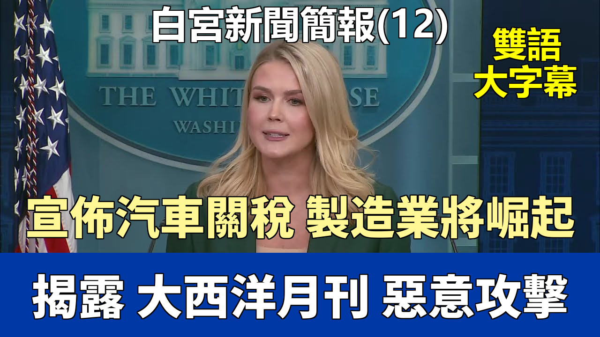

{% video youtube:xjxcC8ClWLs width:100% autoplay:0 %}

### 【中英文双语脚本】
Good afternoon, everybody. Good to see you all.
各位下午好。很高興見到大家。

Since Inauguration Day, President Trump has secured trillions of dollars in private and foreign investments.
自就職日以來，特朗普總統已經獲得了數萬億美元的私人和外國投資。

Every single day, more money is pouring into our country, which will create more jobs for hardworking Americans.
每一天，都有更多的資金涌入我們國家，這將爲辛勤工作的美國人創造更多就業機會。

Today, Schneider Electric pledged to invest more than $700 million in the United States to boost American energy infrastructure and AI.
今天，施耐德電氣承諾在美國投資超過7億美元，以推動美國的能源基礎設施和人工智能發展。

On Monday, Hyundai announced a $20 billion investment in the United States, including $5.8 billion for a new steel plant in Louisiana, which will create nearly 1,500 high-paying jobs.
週一，現代汽車宣佈在美國投資200億美元，其中包括58億美元用於在路易斯安那州新建一座鋼鐵廠，這將創造近1500個高薪工作崗位。

President Trump is truly turning America back into a manufacturing superpower.
特朗普總統正在真正地讓美國重新成爲製造業超級大國。

Yesterday, President Trump marked National Medal of Honor Day by meeting with 21 of our nation's bravest heroes and incredible patriots who have been awarded the highest military honor.
昨天，特朗普總統通過會見21位被授予最高軍事榮譽的我們國家最勇敢的英雄和了不起的愛國者，來紀念國家榮譽勳章日。

Beautiful picture. The President also signed a historic executive order to protect the integrity of American elections.
很美的畫面。總統還簽署了一項歷史性的行政命令，以保護美國選舉的公正性。

By strengthening voter citizenship verification and banning foreign nationals from interfering in U.S. elections.
通過加強選民公民身份驗證和禁止外國公民干預美國選舉。

These are the common-sense solutions that only Democrats could oppose.
這些是隻有民主黨人纔會反對的常識性解決方案。

But voters deserve elections they can trust, and critical confidence is being restored thanks to President Trump's leadership.
但選民應該得到他們可以信任的選舉，並且由於特朗普總統的領導，關鍵的信心正在恢復。

Later this afternoon in the East Room, President Trump will mark Women's History Month by honoring the exceptional women around our country,
今天下午晚些時候在東廳，特朗普總統將通過表彰我們國家各地的傑出女性來紀念婦女歷史月，

including the highly talented women in his administration and his Cabinet.
包括他政府和內閣中才華橫溢的女性。

And on an additional scheduling update, the President will hold a press conference in the Oval Office today at 4 o'clock p.m. to announce tariffs on the auto industry.
另外還有一個日程更新，總統今天下午4點將在橢圓形辦公室舉行新聞發佈會，宣佈對汽車行業徵收關稅。

And I will leave that to him to make that announcement later. Unfortunately, all of this good is happening for our country.
我將把這個宣佈留給他稍後來做。不幸的是，所有這些好事都在爲我們國家發生。 (Note: The "Unfortunately" here seems misplaced or sarcastic in the original context, the translation reflects the literal word.)（注：原文這裏的“不幸的是”似乎用詞不當或帶有諷刺意味，翻譯反映了字面意思。）

This administration is working hard on behalf of the American public every day,
本屆政府每天都在爲美國公衆努力工作，

but the mainstream media continues to be focused on a sensationalized story from the failing Atlantic magazine that is falling apart by the hour.
但主流媒體繼續關注來自瀕臨倒閉的《大西洋月刊》的一篇聳人聽聞的報道，這篇報道正以每小時的速度瓦解。

Here are the facts.
以下是事實。

The National Security Advisor has taken responsibility for this matter, and the National Security Council immediately said,
國家安全顧問已對此事負責，國家安全委員會立即表示，

alongside the White House Counsel's office, that they are looking into how a reporter's number was inadvertently added to this messaging thread.
與白宮法律顧問辦公室一起，他們正在調查一名記者的號碼是如何被無意中添加到這個消息線程中的。

We have said all along that no classified material was sent on this messaging thread.
我們一直說，這個消息線程中沒有發送任何機密材料。

There were no locations, no sources or methods revealed, and there were certainly no war plans discussed.
沒有透露任何地點、來源或方法，當然也沒有討論任何戰爭計劃。

The Atlantic has even admitted this themselves.
《大西洋月刊》自己甚至承認了這一點。

Their release of these internal messages validates the truth, which we have been saying all along.
他們公佈這些內部信息驗證了真相，這也是我們一直所說的。

If this story proves anything, it proves that Democrats and their propagandists in the mainstream media.
如果這個故事證明了什麼，那就是證明了民主黨人及其在主流媒體中的宣傳者。

Know how to fabricate, orchestrate, and disseminate a misinformation campaign quite well.
非常懂得如何捏造、策劃和散佈虛假信息運動。

And there's arguably no one in the media who loves manufacturing and pushing hoaxes more than Jeffrey Goldberg.
可以說，媒體中沒有人比傑弗裏·戈德伯格更喜歡製造和推廣騙局了。

Goldberg is an anti-Trump hater. He is a registered Democrat.
戈德伯格是一個反特朗普的憎恨者。他是一名註冊民主黨人。

Goldberg's wife is also a registered Democrat and a big Democrat donor who used to work under who?
戈德伯格的妻子也是一名註冊民主黨人，並且是一位重要的民主黨捐助者，她曾經在誰手下工作？

Hillary Clinton. This is the same Jeffrey Goldberg who infamously lied about weapons of mass destruction to get us into the Iraq War.
希拉里·克林頓。就是這位傑弗裏·戈德伯格，曾臭名昭著地就大規模殺傷性武器撒謊，將我們拖入伊拉克戰爭。

Which cost trillions of dollars and thousands of American soldiers.
那場戰爭耗費了數萬億美元和數千名美國士兵的生命。

And how else has Goldberg discredited himself?
戈德伯格還通過哪些方式使自己聲名掃地？

By absurdly claiming that President Trump was Vladimir Putin during the 2016 campaign.
通過在2016年競選期間荒謬地聲稱特朗普總統是弗拉基米爾·普京。

By peddling the Russia, Russia, Russia hoax that tried to hijack President Trump's first term.
通過兜售試圖劫持特朗普總統第一個任期的“通俄門、通俄門、通俄門”騙局。

By inventing the suckers and losers hoax to help Joe Biden in the 2020 election.
通過捏造“笨蛋和失敗者”的騙局來幫助喬·拜登贏得2020年大選。

By peddling a hoax about President Trump involving Gold Star families to help Kamala Harris in the 2024 election, which our campaign at the time vigorously denied.
通過兜售一個涉及金星家庭的關於特朗普總統的騙局來幫助卡瑪拉·哈里斯贏得2024年大選，我們當時的競選團隊對此予以強烈否認。

Jeffrey Goldberg didn't care. There's more, but we don't have all day.
傑弗裏·戈德伯格不在乎。還有更多，但我們沒有一整天的時間。

And we can now add this signal hoax to this very long list.
現在我們可以把這個Signal騙局添加到這個很長的列表中了。

The real story here is the overwhelming success of President Trump's decisive military action against Houthi terrorists.
這裏的真實故事是特朗普總統對胡塞恐怖分子採取果斷軍事行動取得的壓倒性成功。

On March 15th, President Trump ordered a series of military operations against the terrorist Houthis to defend US shipping assets in the Red Sea,
3月15日，特朗普總統下令對恐怖組織胡塞武裝採取一系列軍事行動，以保衛美國在紅海的航運資產，

restore freedom of navigation for international shipping, and defend the United States from enemy threats.
恢復國際航運的航行自由，並保衛美國免受敵人威脅。

United States forces successfully struck dozens of targets across Houthi controlled territory.
美國軍隊成功打擊了胡塞武裝控制區內的數十個目標。

And as a result of these actions, several Houthi leaders were killed, including the Houthi drone chief, his deputy, and several of their drone experts and other key leaders.
這些行動的結果是，幾名胡塞領導人被擊斃，包括胡塞組織的無人機負責人、他的副手以及他們的幾名無人機專家和其他關鍵領導人。

We also destroyed command and controlled facilities, weapons manufacturing facilities, and advanced weapon storage locations.
我們還摧毀了指揮和控制設施、武器製造設施以及先進武器儲存地點。

And it's important to remember why this powerful action took place in the first place.
重要的是要記住，爲什麼一開始就採取了這次強有力的行動。

Because of Joe Biden's incompetence and pathetic weakness on the world stage for years, the Houthi terrorists grew emboldened.
因爲喬·拜登多年來在世界舞臺上的無能和可悲的軟弱，胡塞恐怖分子變得更加膽大妄爲。

Immediately after taking office in 2021, Joe Biden removed the Iran-backed Houthis from the foreign terrorist organization in specifically designated global terrorist list.
2021年一上任，喬·拜登就將伊朗支持的胡塞武裝從外國恐怖組織和特別指定的全球恐怖分子名單中移除。

Did anybody in this room ask the Biden administration at the time why they made such a stupid mistake?
當時在座的各位，有誰問過拜登政府，他們爲什麼犯下如此愚蠢的錯誤？

This reckless action undid the designation put in place by President Trump during his first term, and what followed was predictable and devastating.
這一魯莽的行動撤銷了特朗普總統在其第一任期內實施的認定，隨之而來的是可預見的、毀滅性的後果。

The Houthis targeted US military ships and aircraft, hit commercial ships, including US flagged vessels, threatened our personnel overseas and attacked our allies in the region.
胡塞武裝襲擊了美國的軍艦和飛機，襲擊了包括懸掛美國國旗船隻在內的商船，威脅了我們在海外的人員，並襲擊了我們在該地區的盟友。

This resulted in more than a year of US flagged commercial ships being prevented from safely sailing through the Suez Canal, the Red Sea, and the Gulf of Aden.
這導致懸掛美國國旗的商船一年多無法安全通過蘇伊士運河、紅海和亞丁灣。

This had a massive negative impact on global trade of the economic security of the United States.
這對全球貿易和美國的經濟安全造成了巨大的負面影響。

Joe Biden was the commander in chief, and he sat on his hands while the United States of America was bullied and embarrassed by terrorists.
喬·拜登是總司令，但他卻袖手旁觀，任由美利堅合衆國被恐怖分子欺凌和羞辱。

President Trump and his team are putting a stop to these threats in restoring American strength around the world.
特朗普總統及其團隊正在制止這些威脅，恢復美國在世界各地的實力。

The Trump "peace through strength" approach means no terrorist force will stop American commercial and naval vessels from freely sailing the waterways of the world.
特朗普的“以實力求和平”方針意味着，沒有任何恐怖勢力能夠阻止美國的商業和海軍船隻在世界水道上自由航行。

But unfortunately, this is not what the Democrats and the media want to talk about.
但不幸的是，這並不是民主黨和媒體想要談論的。

They are focused on a coordinated campaign to try and sow chaos in this White House.
他們正專注於一場協調一致的運動，試圖在這個白宮製造混亂。

And this has been the most successful first two months of any administration ever, which is exactly why they are doing this.
而這恰恰是有史以來任何一屆政府最成功的頭兩個月，這也正是他們這樣做的原因。

We are not going to bend in the face of this insincere outrage. And here is just one example of how bad faith the Democrats' criticisms are.
我們不會在這種虛僞的憤怒面前屈服。這裏有一個例子說明民主黨人的批評是多麼缺乏誠信。

Democrat Senator Mark Warner is hysterical over the use of Signal, which is an approved decrypted app, and the killing of Houthi terrorists.
民主黨參議員馬克·華納對使用Signal（一款經批准的解密應用程序）以及擊斃胡塞恐怖分子感到歇斯底里。

But Senator Warner himself used Signal to work with a lobbyist for a Russian oligarch to connect the disgraced Steele dossier author who started the Russia hoax,
但華納參議員本人卻使用Signal與一位俄羅斯寡頭的說客合作，聯繫上了聲名狼藉的斯蒂爾檔案的作者，正是他開始了通俄騙局，

which Jeffrey Goldberg later reported on. How ironic.
而傑弗裏·戈德伯格後來對此進行了報道。多麼諷刺。

We're not going to lose focus of the bottom line, which is that Joe Biden's weakness enabled an emboldened Houthi terrorists.
我們不會忽視底線，那就是喬·拜登的軟弱助長了膽大妄爲的胡塞恐怖分子。

And President Trump's strength in resolve eliminated those terrorists. Here in our new media seat today, we have Lindsay Keith.
而特朗普總統的決心和力量消滅了那些恐怖分子。今天在我們新的媒體席位上，我們有林賽·基思。

She is the managing editor for Merit TV and serves as their White House correspondent.
她是 Merit TV 的執行主編，並擔任他們的白宮記者。

Merit TV launched one year ago and creates and distributes content across diverse platforms.
Merit TV 於一年前推出，在各種平臺上創作和分發內容。

We're glad to have you with us, Lindsay. Please kick us off. Thank you, Caroline. I appreciate it and this opportunity for Merit TV.
我們很高興你能和我們在一起，林賽。請你開始吧。謝謝你，卡羅琳。我很感激這次機會以及 Merit TV 的這次機會。

Two questions, if I may. One on Signal, one on the economy. Sure.
如果可以的話，我有兩個問題。一個關於Signal，一個關於經濟。當然。

On Signal, how comfortable is the President with what was shared so far now that the chain has been released?
關於Signal，既然信息鏈已經被公佈，總統對目前爲止分享的內容感覺如何？

The President's view on all of this remains the same today as it did yesterday.
總統對此事的看法今天和昨天一樣。

And I think it speaks volumes about the leadership of this President, that he went directly to all of you, members of the press corps.
我認爲這充分說明了這位總統的領導力，他直接走向了你們各位，記者團的成員們。

He was asked, "Do you want someone else to go out and do a briefing?"
有人問他：“你想讓別人出去做簡報嗎？”

And he said, "No. I will tackle this story. I will discuss it. The people need to hear from me about this situation. "
他說：“不。我將處理這個故事。我將討論它。人民需要聽到我關於這個情況的說明。”

And so his thoughts on this remain the same today. He has placed great trust in his national security team.
因此，他對此事的想法今天仍然保持不變。他對他的國家安全團隊給予了極大的信任。

And as for the usage of Signal, as the President said yesterday, as the CIA director has testified under oath, this is an approved app.
至於Signal的使用，正如總統昨天所說，正如中央情報局局長在宣誓下作證所說，這是一款經過批准的應用程序。

It's an encrypted app. The Department of Defense, the Department of State, the CIA has it loaded onto government phones.
這是一款加密應用程序。國防部、國務院、中央情報局都已將其安裝在政府手機上。

Because it is the most secure and efficient way to communicate.
因爲這是最安全、最高效的溝通方式。

As for, again, the original situation in this messaging thread, the National Security Council,
至於，再次強調，這個消息線程中的最初情況，國家安全委員會，

the White House Counsel's Office continues to look in to how this mistake, which the National Security Advisor has owned, occurred.
白宮法律顧問辦公室正在繼續調查這個錯誤是如何發生的，國家安全顧問已經承認了這一錯誤。

And the President has ensured they are doing that. On the economy, consumer confidence hit a four-year low this month.
總統已確保他們正在這樣做。關於經濟，本月消費者信心指數跌至四年來的最低點。

Can you help explain to the American people how tariffs will help them in the long run? Yeah, absolutely.
你能向美國人民解釋一下關稅從長遠來看將如何幫助他們嗎？是的，當然可以。

And I'm grateful for the question. The American public will hear later this afternoon from the President directly on the topic of tariffs.
我很感謝這個問題。今天下午晚些時候，美國公衆將直接從總統那裏聽到關於關稅問題的講話。

And as you all know, April 2nd, President Trump has proudly dubbed it Liberation Day for our country.
正如大家所知，4月2日，特朗普總統自豪地將其稱爲我們國家的解放日。

What he means by that is it will be a day where the United States of America will no longer be ripped off by nations around this world.
他的意思是，這一天，美利堅合衆國將不再被世界各國敲詐勒索。

It will be a day where Americans finally see free and fair trade practices restored.
這一天，美國人將最終看到自由公平的貿易慣例得以恢復。

We are no longer going to allow our allies, our competitors, and our adversaries to take advantage of American workers.
我們不會再允許我們的盟友、競爭對手和對手佔美國工人的便宜。

And if you think about your hometown in the state that you grew up, Main Street looks a lot different today than it did many years ago.
如果你想想你長大的那個州的家鄉，今天的主街看起來和多年前大不相同了。

And President Trump wants to restore America as a manufacturing superpower around the globe.
特朗普總統希望將美國恢復爲全球製造業超級大國。

He wants products to be made right here in our great country with great, hardworking American hands.
他希望產品就在我們偉大的國家，由偉大的、勤勞的美國人之手製造出來。

That will ultimately result in higher wages and more money in the pockets of the American people.
這最終將導致更高的工資和美國人民口袋裏更多的錢。

And he's also, in addition to tariffs, also determined to pass tax cuts later this year, as he did successfully in his first term,
而且，除了關稅之外，他還決心在今年晚些時候通過減稅法案，就像他在第一個任期內成功做到的那樣，

to put even more money back into the pockets of hardworking Americans.
將更多的錢放回辛勤工作的美國人的口袋裏。

Peter. Caroline, if I can ask you very quickly about the information we've seen, just to set the predicate to all this,
彼得。卡羅琳，如果我可以非常快地問你關於我們所看到的信息，只是爲了給這一切設定前提，

has the President been briefed and physically seen the, he's seen all the details of the chat that is printed by the Atlantic?
總統是否聽取了簡報並親眼看到了，他是否看到了《大西洋月刊》刊登的聊天記錄的所有細節？

I just spoke to the President about it, yes. Then let me ask you if I can very quickly.
我剛和總統談過此事，是的。那麼請允許我很快地問一下。

In the chat, Pete Hex at the Defense Secretary details F-18s, Tomahawks, some of the weapons that were used.
在聊天記錄中，國防部長的皮特·赫克斯詳細描述了F-18、戰斧導彈以及一些使用的武器。 (Note: Assuming "Pete Hex" is a typo for Pete Hegseth, the Defense Secretary mentioned later)（注：假設“Pete Hex”是後面提到的國防部長 Pete Hegseth 的筆誤）

He details the timing involved for this, all of which occurred 31 minutes before, as he says F-18s would launch.
他詳細說明了相關的時間安排，所有這些都發生在他所說的F-18起飛前31分鐘。

The DOD manual details classified information as significant military plans, saying that is secret, that that's classified.
國防部手冊將重大軍事計劃詳細列爲機密信息，稱其爲祕密，即機密。

So what about there are no methods, there are no sources, but that's not what determines what's classified.
那麼，沒有方法，沒有來源，但這並不是決定什麼內容是機密的標準。

So what is it about what Pete Hex at the road that makes you say this is not classified?
那麼，皮特·赫克斯所說的話中到底有什麼讓您說這不是機密呢？ (Note: "at the road" seems like a transcription error, likely meant "wrote")
（注：“at the road”似乎是轉錄錯誤，可能意爲“wrote”）

Well, it's not just me saying that, Peter. It's the Secretary of Defense himself who is saying this as well.
嗯，不只是我這麼說，彼得。國防部長本人也是這麼說的。

And he put out a very strong statement earlier today, listing all of the things that were not included in that message that he sent to the group.
他今天早些時候發表了一份非常強硬的聲明，列出了他發送給小組的那條消息中未包含的所有內容。

And again, this message, there was no classified information transmitted, there were no war plans discussed.
再次強調，這條信息沒有傳輸任何機密信息，也沒有討論任何戰爭計劃。

Why did the Atlantic downgrade their allegation about war plans to attack plans?
爲什麼《大西洋月刊》將其關於戰爭計劃的指控降級爲攻擊計劃？

They're now playing word games because they know this was sensationalist spin from a reporter who is well known for doing this.
他們現在在玩文字遊戲，因爲他們知道這是一個以搞這種事聞名的記者製造的聳人聽聞的歪曲報道。

We have said all along no war plans were discussed, no classified material was sent.
我們一直說沒有討論戰爭計劃，沒有發送機密材料。

You have the Secretary of Defense saying that.
國防部長是這麼說的。

You have the director of the CIA, the director of national intelligence, the FBI director all testifying to that under oath, and they should be trusted with that.
你有中央情報局局長、國家情報總監、聯邦調查局局長都在宣誓下爲此作證，他們應該在這方面被信任。

To be clear, Americans can make the decision for themselves, but whether is the.
需要明確的是，美國人可以自己做決定，但是否是... (Sentence seems incomplete in the original)
（原句似乎不完整）

Sure. You said it's not war plans. Would you characterize these as military plans, military operation plans?
當然。您說這不是戰爭計劃。您會將其描述爲軍事計劃、軍事行動計劃嗎？

I would characterize this messaging thread as a policy discussion, a sensitive policy discussion, surely, amongst high-level cabinet officials and senior staff.
我會將這個消息線程描述爲一次政策討論，當然是一次敏感的政策討論，是在高級內閣官員和高級職員之間進行的。

And I'm so glad, Peter, that you said the American public can decide for themselves, because I think the American public should decide for themselves based on the outcome of this operation.
我很高興，彼得，你說了美國公衆可以自己決定，因爲我認爲美國公衆應該根據這次行動的結果自己決定。

And what happened in this operation, terrorists that were allowed to run wild by the Biden administration were killed because of the direction and the determination of this president and his team.
在這次行動中發生的事情是，那些被拜登政府允許肆意妄爲的恐怖分子，因爲這位總統及其團隊的指揮和決心而被消滅了。

And this message also shows this messaging thread also proved that President Trump has an incredibly dynamic team who is working incredibly hard,
這條信息也表明，這個消息線程也證明了，特朗普總統擁有一支極其充滿活力的團隊，他們正在極其努力地工作，

flying all over the world to secure world peace and to fix up the foreign policy crises that the previous administration left for this team to inherit.
飛往世界各地以確保世界和平，並收拾上一屆政府留給這個團隊繼承的外交政策危機。

So, to be clear, we all in this room and around the country would agree that we're glad no American service members were harmed and we're glad that the mission was a success.
所以，需要明確的是，我們這個房間裏和全國各地的人都會同意，我們很高興沒有美國軍人受傷，我們很高興任務取得了成功。

We'll stipulate that. But the president said that Pete Hegsett said none of this was classified.
我們承認這一點。但是總統說皮特·赫格賽斯說過這些都不是機密。

So, given the president has seen it now and given the president understands that significant military plans are deemed classified as secret,
那麼，鑑於總統現在已經看到了，並且鑑於總統理解重大的軍事計劃被視爲機密，

how does the president view none of this, which details times and weapons and more, as being not classified?
總統是如何看待這些詳細說明了時間、武器等信息的內容爲非機密的？

I've already been asked and answered this question.
我已經問過並回答了這個問題。

The president's thoughts on this remain the same today as they were yesterday, as well as the Secretary of Defense.
總統對此事的想法今天和昨天一樣，國防部長也一樣。

This question has been asked and answered. There was no classified material discussed.
這個問題已經被問過並且回答過了。沒有討論機密材料。

Jackie. On what basis I was asked? Go ahead, Jackie. Thank you, Caroline.
傑基。基於什麼我被問到了？請說，傑基。謝謝你，卡羅琳。

So, why aren't launch times on a mission strike classified?
那麼，爲什麼任務打擊的發射時間不屬於機密？

Again, I would defer you to the Secretary of Defense's statement he put out this morning.
再次，我建議您參考國防部長今天早上發佈的聲明。

There were various reasons he listed things that were not included in that messaging thread that were not classified.
他列舉了各種原因，說明了該消息線程中未包含的、非機密的內容。

And again, going back to the American public, do you trust the Secretary of Defense, who was nominated for this role,
再次回到美國公衆，您是信任這位被提名擔任此職位、

voted by the United States Senate into this role, who has served in combat, honorably served our nation in uniform?
由美國參議院投票選入此職位、曾在戰鬥中服役、光榮地穿着軍裝爲我們國家服務過的國防部長？

Or do you trust Jeffrey Goldberg, who is a registered Democrat and an anti-Trump sensationalist reporter?
還是信任傑弗裏·戈德伯格，一位註冊民主黨人和反特朗普的聳人聽聞的記者？

This president and this national security team are putting our national security and the American people first.
這位總統和這個國家安全團隊將我們的國家安全和美國人民放在首位。

We are restoring American strength around the world, and the results of this operation speak for themselves.
我們正在恢復美國在世界各地的實力，這次行動的結果不言自明。

Putting aside Jeffrey Goldberg, though, just for American service members who are gonna have to carry out these missions in the future,
不過，拋開傑弗裏·戈德伯格不談，僅就未來將不得不執行這些任務的美國軍人而言，

I guess the message that's coming from the response to all this that we're hearing is that, nothing sensitive happened.
我猜我們聽到的對這一切的迴應所傳達的信息是，沒有發生任何敏感的事情。

And I guess the logical conclusion of that is that if these messages had gone out publicly prior to the launch, that that wouldn't have been a risk to service members.
我猜其邏輯結論是，如果這些信息在發射前公開發布，那也不會對軍人構成風險。

I don't know that they're comfortable with that. So, can you explain, you know, had these messages been published, would the plans have moved forward?
我不知道他們是否對此感到安心。所以，你能解釋一下，你知道，如果這些信息被公佈了，計劃還會繼續推進嗎？

Would the launch have still taken off? What I can tell you is that the president, as the commander-in-chief of our United States Armed Forces,
發射還會進行嗎？我能告訴你的是，總統，作爲我們美國武裝部隊的總司令，

and Secretary Pete Hegseth, who is an incredible man and a war fighter himself,
以及皮特·赫格賽斯部長，他本人是一位了不起的人，也是一位戰士，

take the lives of our American service members with the utmost responsibility, and they would never do anything intentionally to put their lives at risk.
以最大的責任感對待我們美國軍人的生命，他們絕不會故意做任何危及他們生命的事情。

And again, they are working hard on that every single day, and we are protecting our service members while also restoring peace throughout this globe.
再次強調，他們每天都在爲此努力工作，我們在保護我們的軍人，同時也在恢復全球的和平。

It's something the previous administration has not done. And I would just add one more point.
這是上一屆政府沒有做到的事情。我只想再補充一點。

We are not going to be lectured about national security and American troops by Democrats in the mainstream media who turned the other cheek when the Biden administration,
我們不會接受主流媒體中的民主黨人就國家安全和美國軍隊問題對我們說教，當拜登政府因爲無能

because of their incompetence, left 13 service members dead in Afghanistan,
導致13名軍人在阿富汗喪生時，他們卻視而不見，

and not a single person in the previous administration was held accountable for that botched withdrawal.
而上一屆政府中沒有一個人爲那次拙劣的撤軍負責。

Joe Biden said, "In fact, it was a great operation."
喬·拜登說：“事實上，那是一次偉大的行動。”

That is despicable. It's unacceptable to this president and this secretary of defense.
那是卑鄙的。這對於這位總統和這位國防部長來說是不可接受的。

The national security advisor has taken responsibility for this inadvertent number being added to the messaging thread,
國家安全顧問已爲這個無意中添加到消息線程的號碼負責，

but above all, we take the lives of our troops, safety, security, prosperity around the globe with the utmost seriousness.
但最重要的是，我們以最嚴肅的態度對待我們軍隊的生命、全球的安全、保障和繁榮。

Karen, do you believe that he would release that to embarrass the administration ahead of the worldwide threats?
凱倫，你相信他會爲了在面臨全球威脅之前讓政府難堪而公佈這些嗎？

Jennifer, go ahead. Given what you've said about the president's trust in his national security team,
詹妮弗，請說。鑑於您所說的總統對他的國家安全團隊的信任，

can you say definitively that no one will lose their jobs, no one will lose their job at all because of this signal situation?
您能明確地說，沒有人會因爲這次Signal事件而丟掉工作，絕對沒有人會丟掉工作嗎？

What I can say definitively is what I just spoke to the president about, and he continues to have confidence in his national security team.
我能明確說的是我剛剛和總統談過的內容，他繼續對他的國家安全團隊充滿信心。

Karen, one more. Can I ask one more, Karen?
凱倫，還有一個。我能再問一個嗎，凱倫？

On the targets in Yemen on March 15th, can you say were 100% of the targets that were planned for March 15th, were they all destroyed?
關於3月15日在也門的目標，您能說計劃於3月15日打擊的目標是否100%都被摧毀了嗎？

Because that would be an indication if some of them were moved.
因爲如果其中一些目標被移動了，這將是一個跡象。

But they were not all hit that maybe perhaps some of the enemies were able to get some of the information in that signal.
但並非所有目標都被擊中，也許可能一些敵人能夠通過那個Signal獲取一些信息。 (Slightly awkward phrasing in original, kept meaning)
（原文措辭略顯笨拙，保留了意思）

What I can say about the operation is what the Department of Defense has put out there.
關於這次行動，我能說的是國防部已經公佈的內容。

I would refer to them for any further operational details, but there have been more than 100 strikes conducted against Houthi targets,
我建議您向他們諮詢任何進一步的行動細節，但已經對胡塞目標進行了100多次打擊，

and they have hit key Houthi leaders, air defense systems, commanding control nodes, headquarters, weapons manufacturing, and storage facilities,
並且打擊了關鍵的胡塞領導人、防空系統、指揮控制節點、總部、武器製造和儲存設施，

and these operations will continue until the freedom of navigation in our seas is restored and US shipping can safely transmit without the fear of attack.
這些行動將繼續進行，直到我們海域的航行自由得到恢復，美國船隻能夠安全通行而不用擔心受到攻擊。

And again, we believe that this has been a very successful operation thus far, and it will continue until this administration feels it no longer has to,
再次強調，我們相信到目前爲止這是一次非常成功的行動，並且將繼續下去，直到本屆政府認爲不再需要爲止，

and these terrorists have been taking out, which again is something previous administration should have done, but they didn't, and now we've inherited this crisis.
並且這些恐怖分子已經被清除，這又是上一屆政府本應做但沒有做的事情，現在我們繼承了這個危機。

Steve. Thank you, Caroline. I'd like to clarify something about the investigation and also ask about some conservative commentary.
史蒂夫。謝謝你，卡羅琳。我想澄清一下關於調查的事情，並問一些關於保守派評論的問題。

On the investigation, Mike Waltz said last night that he had spoken to Elon Musk about figuring out how Jeffrey Goldberg's number got in his phone.
關於調查，邁克·沃爾茲昨晚說，他已經和埃隆·馬斯克談過，要弄清楚傑弗裏·戈德伯格的號碼是怎麼進入他手機的。

You mentioned the NSC and the White House Counsel's Office investigating.
你提到了國家安全委員會和白宮法律顧問辦公室正在調查。

Can you just clarify who is investigating, who's leading that, and also Dave Portnoy, who endorsed President Trump, said today that he thinks that Mike Waltz should leave.
你能否澄清一下是誰在調查，誰在領導調查，另外，支持特朗普總統的戴夫·波特諾伊今天說，他認爲邁克·沃爾茲應該離開。

Could you respond to that? Sure. Great respect for Dave Portnoy, but I just answered that previous question from Jennifer.
你能迴應一下嗎？當然。非常尊重戴夫·波特諾伊，但我剛剛回答了詹妮弗之前的那個問題。

As for your original question about who's leading, looking into the messaging thread, the National Security Council, the White House Counsel's Office.
至於你最初關於誰在領導調查消息線程的問題，是國家安全委員會、白宮法律顧問辦公室。

And also, yes, Elon Musk's team. Elon Musk has offered to put his technical experts on this to figure out how this number was inadvertently added to the chat.
還有，是的，埃隆·馬斯克的團隊。埃隆·馬斯克已經提出讓他的技術專家參與進來，以查明這個號碼是如何被無意中添加到聊天中的。

Again, to take responsibility and ensure this can never happen again.
再次強調，是爲了承擔責任並確保這種情況永遠不會再次發生。

Carol Lynn. Caitlin. I have two questions, one on a follow-up on something you just said.
卡羅爾·林恩。凱特琳。我有兩個問題，一個是關於你剛纔說的話的後續問題。

But since we have these messages released, and you said that the President has now personally reviewed them.
但是既然這些信息已經公佈了，而且您說總統現在已經親自審閱了它們。

At the chat at one point, Pete Hexeth wrote, "1415, strike drones on target." And in all caps, he said, "This is when the first bombs will definitely drop."
在聊天記錄的某個時刻，皮特·赫格賽斯寫道：“1415，打擊無人機命中目標。”他用全大寫字母說：“這是第一批炸彈肯定會投下的時候。”

Does the President feel that he was misled by his national security advisors.
總統是否覺得他被他的國家安全顧問誤導了。

Whoever it was that told him there was no classified information in there now that he's seen these messages?
無論當初是誰告訴他裏面沒有機密信息，既然他現在已經看到了這些信息？

I've now been asked and answered this question three times by the both of you, and I've given you my answer.
你們倆現在已經問了我三次這個問題了，我也給出了我的答案。

The President feels the same today as he did yesterday. Sorry, am I follow-up on what you were just saying?
總統今天的感受和昨天一樣。抱歉，我是不是要跟進你剛纔說的話？

Go ahead, Phillip. Caitlin, I'm not taking your follow-up. I have a follow-up on something you just said, though, Caroline.
請說，菲利普。凱特琳，我不接受你的後續提問。不過，卡羅琳，我有一個關於你剛纔說的話的後續問題。

Caitlin, I'm not taking your follow-up. Phillip, go ahead. I have called on you.
凱特琳，我不接受你的後續提問。菲利普，請說。我已經點到你了。

The Vice President seemed to express some frustration that Europe wasn't doing more police waterways in their backyard,
副總統似乎表達了一些不滿，認爲歐洲沒有在其後院的水道上做更多的警務工作，

noting in that signal thread that 40% of European trade goes through the Suez Canal.
在那個Signal線程中指出，40%的歐洲貿易通過蘇伊士運河。

Does the President share that opinion and frustration?
總統是否持有同樣的觀點和不滿？

And then going forward, should the Europeans be responsible for policing that waterway?
那麼未來，歐洲人是否應該負責管理那條水道？

Well, the President was asked this question yesterday by the pool in the Cabinet Room, and he answered this question.
嗯，總統昨天在內閣會議室被記者團問到了這個問題，他回答了這個問題。

He said yes. He believes that Europe has been, as the Vice President put it.
他說是的。他認爲歐洲一直以來，正如副總統所說的那樣。

Free-loading on the backs of American taxpayers and off the backs of the United States of America,
一直在佔美國納稅人和美利堅合衆國的便宜（搭便車），

and he wants to ensure that Europe pays their fair share.
他希望確保歐洲支付他們公平的份額。

He's always been very honest and upfront about that, and I think the Vice President shares those concerns with him as well.
他對此一直非常誠實和坦率，我認爲副總統也與他有同樣的擔憂。

Sure. Enlisted soldiers, sailors, and Marines would face consequences if they shared this type of information inadvertently with a reporter.
當然。如果士兵、水手和海軍陸戰隊員無意中與記者分享了這類信息，他們將面臨後果。

Can you tell us more why the President is so willing to give Mike Waltz a mulligan here?
您能告訴我們更多關於爲什麼總統如此願意在這裏給邁克·沃爾茲一次“重打”（原諒）的機會嗎？

Again, I have now been asked and answered this same question using different language multiple times.
再次強調，我已經用不同的措辭多次被問及並回答了同一個問題。

If anybody has another question, there's a lot of different things going on in the world.
如果有人有其他問題，世界上正在發生很多不同的事情。

We have tariffs possibly being implemented later today. The President is going to talk about that at 4 o'clock this afternoon.
今天晚些時候可能會實施關稅。總統今天下午4點會談到這個問題。

Sure, go ahead. Okay, thank you for taking my question.
當然，請說。好的，謝謝您接受我的提問。

I wanted to first and foremost thank the administration for the Election Integrity Executive Order.
我首先要感謝本屆政府發佈的選舉誠信行政命令。

Because so many journalists for four years were banned from talking about this very subject,
因爲四年來，許多記者被禁止談論這個話題，

so thank you to the administration for that.
所以爲此感謝本屆政府。

My question is, yesterday, President Trump went on and the order said that there was more to come when it comes to election integrity.
我的問題是，昨天，特朗普總統繼續說，並且該命令表示，在選舉誠信方面還會有更多措施。

Would that include same-day voting and hand-counted paper ballots?
那會包括當日投票和手計紙質選票嗎？

And why are Democrats so against election integrity measures like, obviously, a proof of citizenship when it comes to voting in a United States election?
爲什麼民主黨人如此反對選舉誠信措施，比如，很明顯，在美國大選中投票時需要提供公民身份證明？

Well, it's a very good question. You'll have to ask the Democrats why they're against so many common-sense things, not just mandating voter ID.
嗯，這是個很好的問題。你得問問民主黨人爲什麼他們反對這麼多常識性的事情，不僅僅是強制要求選民身份證明。

Why are they against men and women's sports?
爲什麼他們反對男子和女子體育運動？

Why are they against deporting foreign terrorists from American soil who have been designated a foreign terrorist organization?
爲什麼他們反對將已被指定爲外國恐怖組織的外國恐怖分子驅逐出美國領土？

I'm referring to Trendy Aragwa.
我指的是 Trendy Aragwa。（注：此名字可能爲音譯或轉錄錯誤，未找到明確指代對象）

As for the Election Integrity Executive Order that the President signed yesterday, this is in an effort to restore trust in American elections.
至於總統昨天簽署的選舉誠信行政命令，這是爲了努力恢復對美國選舉的信任。

There were more than 10 steps taken, 10 executive actions taken throughout this one order.
這一個命令中採取了超過10個步驟，10項行政行動。

It directs the Department or the Attorney General, rather, in Homeland Security to prevent non-citizens from any involvement in administering elections.
它指示司法部長，更確切地說，在國土安全部內，阻止非公民參與任何管理選舉的活動。

There's also another host of actions. We can provide the fact sheet for you, but it's a very strong Election Integrity Executive Order.
還有一系列其他行動。我們可以爲您提供情況說明書，但這是一個非常強有力的選舉誠信行政命令。

And the President would also like to see Congress do something about this very important issue. And about Judge Bowie. Sure. Go ahead.
總統也希望看到國會就這個非常重要的問題採取行動。還有關於鮑伊法官的事。當然。請說。

Caroline, the Republicans and Democrats alike have been expressing some concern about the frequency of which senior Trump officials have been using the Signal app.
卡羅琳，共和黨人和民主黨人都對特朗普高級官員使用Signal應用的頻率表示了一些擔憂。

Has there been discussion, or will there be a review, about how often they use Signal?
是否有過討論，或者是否會審查他們使用Signal的頻率？

And if you could explain to us how they might be considering other applications to get away from something like this happening again.
您能否向我們解釋一下，他們可能正在考慮使用哪些其他應用程序，以避免類似情況再次發生。

Sure. Well, again, first of all, Signal has been an approved app for government use. It's an encrypted app.
當然。嗯，再次強調，首先，Signal一直是政府批准使用的應用程序。它是一款加密應用。

And as I said, it's the most safe and efficient way of communicating, especially when people can't be in a skiff or inside a room physically together.
正如我所說，這是最安全、最高效的溝通方式，特別是當人們不能身處安全通訊室（skiff）或物理上共處一室時。

I think, as the President said yesterday, he wishes that everybody could be in the room, and it's our goal to ensure that everybody can be.
我認爲，正如總統昨天所說，他希望每個人都能在房間裏，我們的目標是確保每個人都能在。

But again, no classified information was discussed in this chat.
但再次強調，這次聊天中沒有討論任何機密信息。

And any time classified information is discussed amongst high-level officials across this administration,
在本屆政府中，任何時候高級官員之間討論機密信息時，

secure lines of communication are used, including, by the way, our special envoy, Steve Witkoff,
都會使用安全的通信線路，順便說一句，包括我們的特使史蒂夫·威特科夫，

who I understand the Wall Street Journal erroneously reported that he was on this Signal chat on a personal device while in Moscow.
據我瞭解，《華爾街日報》錯誤地報道說，他在莫斯科時使用個人設備參與了這個Signal聊天。

That is absolutely false. Steve Witkoff did not have his personal device, nor did he have his government device with him.
那絕對是假的。史蒂夫·威特科夫既沒有攜帶他的個人設備，也沒有攜帶他的政府設備。

He was given a classified, protected server by the United States government, and he was very careful about his communications when he was in Russia.
美國政府給了他一個機密的、受保護的服務器，他在俄羅斯期間對自己的通訊非常謹慎。

So rest assured to the American public, this administration is taking every precaution when it comes to protecting our national security.
所以請美國公衆放心，本屆政府在保護我們國家安全方面正在採取一切預防措施。

And that's why the American people re-elected this President, because they know that our national security is in good hands with the President of the United States.
這就是爲什麼美國人民再次選舉這位總統，因爲他們知道我們的國家安全掌握在美利堅合衆國總統手中是安全的。

Speaking of the Vice President, I understand he's going to be speaking any moment now.
說到副總統，我瞭解到他馬上就要講話了。

I would hate to counter-program the Vice President of the United States. You'll also hear from the President at 3 o'clock.
我可不想和美利堅合衆國副總統的節目衝突。你們也會在3點鐘聽到總統的講話。

He will be honoring women's history at the Women's History Month celebration.
他將在婦女歷史月慶祝活動上表彰婦女歷史。

We have a lot of great women across our Cabinet who will be in attendance, so we'll see you all there.
我們內閣中有很多傑出的女性將出席，所以我們到時見。

And then you'll also hear from the President again at 4 o'clock when he talks about tariffs.
然後你們還會在4點鐘再次聽到總統談論關稅問題。

So plenty of time for more questions. Sorry it's a bit shorter today, guys. We'll see you later.
所以還有足夠的時間提更多問題。抱歉今天時間有點短，各位。我們稍後再見。

### 【核心词汇 - B1_C2】
| 單詞 | 音標 | 詞性 | 釋義 | 等級 | 次數 |
|---|---|---|---|---|---|
| Atlantic | /ətˈlæntɪk/ | adjective | 大西洋的 | B1 | 1 |
| Department | /dɪˈpɑːrtmənt/ | noun | 部門，部 | B1 | 1 |
| Election | /ɪˈlekʃn/ | noun | 選舉 | B1 | 1 |
| Electric | /ɪˈlektrɪk/ | adjective | 電動的，電的 | B1 | 1 |
| European | /ˌjʊrəˈpiːən/ | adjective | 歐洲的 | B1 | 2 |
| Forces | /ˈfɔːrsɪz/ | noun | 力量，軍隊 | B1 | 1 |
| General | /ˈdʒenrəl/ | noun | 將軍，一般的 | B1 | 1 |
| Judge | /dʒʌdʒ/ | noun | 法官 | B1 | 1 |
| Security | /sɪˈkjʊrəti/ | noun | 安全 | B1 | 1 |
| able | /ˈeɪbl/ | adjective | 能夠；有能力的 | B1 | 1 |
| absolutely | /ˌæbsəˈluːtli/ | adverb | 絕對地；完全地 | B1 | 1 |
| administration | /ədˌmɪnɪˈstreɪʃn/ | noun | 管理，行政 | B1 | 1 |
| alike | /əˈlaɪk/ | adjective | adj. 相似的；同樣的 | B1 | 1 |
| announce | /əˈnaʊns/ | verb | v. 宣佈；宣告 | B1 | 2 |
| announcement | /əˈnaʊnsmənt/ | noun | n. 聲明；公告 | B1 | 1 |
| application | /ˌæplɪˈkeɪʃn/ | noun | n. 應用；申請 | B1 | 1 |
| approach | /əˈproʊtʃ/ | noun | n. 方法；接近；途徑 | B1 | 1 |
| approve | /əˈpruːv/ | verb | v. 批准；贊成 | B1 | 1 |
| aside | /əˈsaɪd/ | adverb | 在旁邊，到一邊 | B1 | 1 |
| basis | /ˈbeɪsɪs/ | noun | 基礎，根據 | B1 | 1 |
| behalf | /bɪˈhæf/ | noun | 代表 | B1 | 1 |
| bomb | /bɑːm/ | noun | 炸彈 | B1 | 1 |
| brief | /briːf/ | adjective | 簡短的；簡潔的 | B1 | 1 |
| chaos | /ˈkeɪɑːs/ | noun | 混亂，混沌 | B1 | 1 |
| chief | /tʃiːf/ | adjective | 主要的，首要的 | B1 | 1 |
| citizenship | /ˈsɪtɪzənʃɪp/ | noun | 國籍，公民權 | B1 | 1 |
| command | /kəˈmænd/ | noun | 命令，指令 | B1 | 2 |
| commercial | /kəˈmɜːrʃl/ | adjective | 商業的，商務的 | B1 | 1 |
| competitor | /kəmˈpɛtɪtər/ | noun | 競爭者，對手 | B1 | 1 |
| conclusion | /kənˈkluːʒn/ | noun | n. 結論，推斷；結束 | B1 | 1 |
| conduct | /ˈkɑːndʌkt/ | noun | n. 行爲，舉止；v. 指揮，引導 | B1 | 1 |
| confidence | /ˈkɑːnfɪdəns/ | noun | n. 信心，信任 | B1 | 1 |
| connect | /kəˈnekt/ | verb | v. 連接，聯繫 | B1 | 1 |
| conservative | /kənˈsɜːrvətɪv/ | adjective | adj. 保守的，守舊的 | B1 | 1 |
| consumer | /kənˈsuːmər/ | noun | n. 消費者 | B1 | 1 |
| content | /kənˈtent/ | noun | n. 內容，目錄 | B1 | 1 |
| crisis | /ˈkraɪsɪs/ | noun | 危機 | B1 | 2 |
| critical | /ˈkrɪtɪkl/ | adjective | 關鍵的，批判性的 | B1 | 1 |
| decision | /dɪˈsɪʒn/ | noun | 決定；決策 | B1 | 1 |
| defend | /dɪˈfend/ | verb | 保衛；辯護 | B1 | 1 |
| definitely | /ˈdefɪnətli/ | adverb | 明確地；肯定地 | B1 | 1 |
| deny | /dɪˈnaɪ/ | verb | 否認；拒絕 | B1 | 1 |
| deserve | /dɪˈzɜːrv/ | verb | 應得，值得 | B1 | 1 |
| destruction | /dɪˈstrʌkʃn/ | noun | 破壞，毀滅 | B1 | 1 |
| determination | /dɪˌtɜːrmɪˈneɪʃn/ | noun | 決心，果斷 | B1 | 1 |
| determine | /dɪˈtɜːrmɪn/ | verb | 決定，確定；下決心 | B1 | 2 |
| devastating | /ˈdevəsteɪtɪŋ/ | adjective | 毀滅性的，破壞性的；令人震驚的，令人悲痛的 | B1 | 1 |
| device | /dɪˈvaɪs/ | noun | 裝置，設備；手段，策略 | B1 | 1 |
| directly | /dəˈrektli/ | adverb | 直接地；立即 | B1 | 1 |
| distribute | /ˈdɪstrɪˌbjuːt/ | verb | 分發，分配 | B1 | 1 |
| diverse | /daɪˈvɜːrs/ | adjective | 多樣的 | B1 | 1 |
| dozen | /ˈdʌzn/ | determiner | 一打 | B1 | 1 |
| economic | /ˌekəˈnɑːmɪk/ | adjective | 經濟的 | B1 | 1 |
| economy | /iˈkɑːnəmi/ | noun | 經濟 | B1 | 1 |
| efficient | /ɪˈfɪʃənt/ | adjective | 效率高的；有能力的 | B1 | 1 |
| election | /ɪˈlekʃən/ | noun | 選舉 | B1 | 2 |
| eliminate | /ɪˈlɪmɪneɪt/ | verb | 消除；排除 | B1 | 1 |
| embarrass | /ɪmˈbærəs/ | verb | 使尷尬；使難堪 | B1 | 1 |
| embarrassed | /ɪmˈbærəst/ | adjective | 尷尬的；難堪的 | B1 | 1 |
| enable | /ɪˈneɪbəl/ | verb | 使能夠；使可能 | B1 | 1 |
| enemy | /ˈenəmi/ | noun | 敵人；仇敵；敵軍 | B1 | 2 |
| ensure | /ɪnˈʃʊr/ | verb | 確保；保證 | B1 | 2 |
| facility | /fəˈsɪləti/ | noun | 設施；設備 | B1 | 1 |
| false | /fɔːls/ | adjective | 假的，錯誤的 | B1 | 1 |
| freely | /ˈfriːli/ | adverb | 自由地，無拘束地 | B1 | 1 |
| frequency | /ˈfriːkwənsi/ | noun | 頻率，發生率 | B1 | 1 |
| frustration | /frʌˈstreɪʃn/ | noun | 沮喪，挫折 | B1 | 1 |
| global | /ˈɡloʊbl/ | adjective | 全球的，世界的 | B1 | 1 |
| hardworking | /ˌhɑːrd ˈwɜːrkɪŋ/ | adjective | 努力工作的 | B1 | 1 |
| hearing | /ˈhɪrɪŋ/ | noun | 聽力; 聽覺; 聽證會 | B1 | 1 |
| highly | /ˈhaɪli/ | adverb | 高度地; 非常 | B1 | 1 |
| historic | /hɪˈstɔːrɪk/ | adjective | 歷史性的; 具有歷史意義的 | B1 | 1 |
| honest | /ˈɑːnɪst/ | adjective | 誠實的 | B1 | 1 |
| immediately | /ɪˈmiːdiətli/ | adverb | 立即，馬上 | B1 | 2 |
| incredible | /ɪnˈkredəbl/ | adjective | 難以置信的，極好的 | B1 | 1 |
| incredibly | /ɪnˈkredəbli/ | adverb | 難以置信地，非常 | B1 | 1 |
| industry | /ˈɪndəstri/ | noun | 工業，產業 | B1 | 1 |
| intentionally | /ɪnˈtenʃənəli/ | adverb | 故意地，有意地 | B1 | 1 |
| internal | /ɪnˈtɜːrnl/ | adjective | 內部的 | B1 | 1 |
| invest | /ɪnˈvest/ | verb | 投資 | B1 | 1 |
| investigation | /ɪnˌvestɪˈɡeɪʃən/ | noun | 調查 | B1 | 1 |
| involve | /ɪnˈvɑːlv/ | verb | 包含，涉及 | B1 | 1 |
| involved | /ɪnˈvɑːlvd/ | adjective | 參與的，捲入的 | B1 | 1 |
| journalist | /ˈdʒɜːrnəlɪst/ | noun | 記者 | B1 | 1 |
| launch | /lɔːntʃ/ | verb | 發起，發動，推出；發射，下水 | B1 | 2 |
| leadership | /ˈliːdərʃɪp/ | noun | 領導能力，領導地位；領導階層 | B1 | 1 |
| lecture | /ˈlektʃər/ | noun | 講座，演講 | B1 | 1 |
| location | /loʊˈkeɪʃn/ | noun | 地點，位置 | B1 | 1 |
| marked | /mɑːrkt/ | adjective | 顯著的，有標記的 | B1 | 1 |
| mass | /mæs/ | adjective | 大量的，大規模的 | B1 | 1 |
| massive | /ˈmæsɪv/ | adjective | 巨大的 | B1 | 1 |
| measure | /ˈmeʒər/ | noun | 措施，方法；計量單位；程度 | B1 | 1 |
| mislead | /ˌmɪsˈliːd/ | verb | 誤導；欺騙 | B1 | 1 |
| mission | /ˈmɪʃn/ | noun | 任務；使命 | B1 | 2 |
| none | /nʌn/ | pronoun | 沒有一個；毫無 | B1 | 1 |
| nor | /nɔr/ | conjunction | 也不 | B1 | 1 |
| obviously | /ˈɑbviəsli/ | adverb | 顯然地 | B1 | 1 |
| occur | /əˈkɜr/ | verb | 發生 | B1 | 1 |
| operation | /ˌɑpəˈreɪʃən/ | noun | 操作，手術 | B1 | 2 |
| organization | /ˌɔːrɡənɪˈzeɪʃn/ | noun | 組織 | B1 | 1 |
| overwhelming | /ˌoʊvərˈwɛlmɪŋ/ | adjective | 巨大的，壓倒性的 | B1 | 1 |
| pathetic | /pəˈθetɪk/ | adjective | 可憐的，悲慘的 | B1 | 1 |
| personally | /ˈpɜrsənəli/ | adverb | 親自地，就個人而言；私下地 | B1 | 1 |
| planned | /plænd/ | adjective | 計劃好的 | B1 | 1 |
| platform | /ˈplætˌfɔrm/ | noun | 平臺；站臺；講臺 | B1 | 1 |
| policy | /ˈpɑləsi/ | noun | 政策，方針；保險單 | B1 | 1 |
| president | /ˈprezɪdənt/ | noun | 總統；主席；校長 | B1 | 2 |
| press | /pres/ | noun | 報刊；新聞界；出版社；印刷機 | B1 | 1 |
| previous | /ˈpriːviəs/ | adjective | 先前的；以前的 | B1 | 1 |
| proof | /pruːf/ | noun | 證據 | B1 | 1 |
| prosperity | /prɑːˈsperəti/ | noun | 繁榮，興旺 | B1 | 1 |
| protect | /prəˈtekt/ | verb | 保護 | B1 | 2 |
| protected | /prəˈtektɪd/ | adjective | 受保護的 | B1 | 1 |
| prove | /pruːv/ | verb | 證明 | B1 | 2 |
| publicly | /ˈpʌblɪkli/ | adverb | 公開地 | B1 | 1 |
| region | /ˈriːdʒən/ | noun | 地區，區域 | B1 | 1 |
| register | /ˈredʒɪstər/ | noun | 登記簿，註冊表，（教堂）名錄 | B1 | 1 |
| resolve | /rɪˈzɑːlv/ | verb | 解決，決心 | B1 | 1 |
| respect | /rɪˈspekt/ | noun | 尊敬，尊重 | B1 | 1 |
| respond | /rɪˈspɑːnd/ | verb | 回答，迴應 | B1 | 1 |
| responsibility | /rɪˌspɑːnsəˈbɪləti/ | noun | 責任 | B1 | 1 |
| responsible | /rɪˈspɑːnsəbl/ | adjective | 負責任的 | B1 | 1 |
| rest | /rest/ | noun | 休息 | B1 | 1 |
| restore | /rɪˈstɔːr/ | verb | 恢復，修復 | B1 | 3 |
| risk | /rɪsk/ | noun | 風險 | B1 | 1 |
| safely | /ˈseɪfli/ | adverb | 安全地，平安地 | B1 | 1 |
| safety | /ˈseɪfti/ | noun | 安全；安全措施 | B1 | 1 |
| secure | /sɪˈkjʊr/ | adjective | 安全的；可靠的 | B1 | 2 |
| security | /sɪˈkjʊrəti/ | noun | 安全；保障 | B1 | 1 |
| series | /ˈsɪriːz/ | noun | 系列；連續 | B1 | 1 |
| server | /ˈsɜːrvər/ | noun | 服務員；服務器 | B1 | 1 |
| service | /ˈsɜːrvɪs/ | noun | 服務；服務業 | B1 | 1 |
| sheet | /ʃiːt/ | noun | 牀單；紙張 | B1 | 1 |
| signal | /ˈsɪɡnəl/ | noun | 信號；標誌 | B1 | 1 |
| soil | /sɔɪl/ | verb | 弄髒；玷污 | B1 | 1 |
| spoken | /ˈspoʊkən/ | adjective | 口語的，說出口的 | B1 | 1 |
| steel | /stiːl/ | noun | 鋼；鋼鐵製品 | B1 | 1 |
| storage | /ˈstɔːrɪdʒ/ | noun | 存儲，儲藏；倉庫 | B1 | 1 |
| strengthen | /ˈstreŋθən/ | verb | 加強，鞏固 | B1 | 1 |
| stupid | /ˈstuːpɪd/ | adjective | 愚蠢的，笨的 | B1 | 1 |
| surely | /ˈʃʊrli/ | adverb | 肯定地，無疑地 | B1 | 1 |
| talented | /ˈtæləntɪd/ | adjective | 有才能的，有天賦的 | B1 | 1 |
| tax | /tæks/ | noun | 稅，稅收 | B1 | 1 |
| term | /tɜːrm/ | noun | 術語；學期；條款 | B1 | 1 |
| threat | /θret/ | noun | 威脅；恐嚇 | B1 | 1 |
| throughout | /θruːˈaʊt/ | preposition | 遍及；貫穿 | B1 | 1 |
| thus | /ðʌs/ | adverb | 因此；從而；這樣 | B1 | 1 |
| undo | /ʌnˈduː/ | verb | 解開；取消，撤銷 | B1 | 1 |
| update | /ʌpˈdeɪt/ | verb | 更新，使現代化 | B1 | 1 |
| usage | /ˈjuːsɪdʒ/ | noun | 使用；用法 | B1 | 1 |
| various | /ˈveriəs/ | adjective | 各種各樣的；不同的 | B1 | 1 |
| vessel | /ˈvesəl/ | noun | 船隻；容器 | B1 | 1 |
| volume | /ˈvɑːljuːm/ | noun | 音量；體積；量 | B1 | 1 |
| wages | /ˈweɪdʒɪz/ | noun | 工資 | B1 | 1 |
| weakness | /ˈwiːknəs/ | noun | 虛弱；弱點 | B1 | 1 |
| weapon | /ˈwepən/ | noun | 武器 | B1 | 2 |
| whether | /ˈweðər/ | conjunction | 是否 | B1 | 1 |
| whoever | /huːˈevər/ | pronoun | 無論誰 | B1 | 1 |
| working | /ˈwɜːrkɪŋ/ | adjective | adj. 工作的；有效的 | B1 | 1 |
| Advisor | /ədˈvaɪzər/ | noun | 顧問 | B2 | 1 |
| Armed | /ɑːrmd/ | adjective | 武裝的 | B2 | 1 |
| Attorney | /əˈtɜːrni/ | noun | 律師，代理人 | B2 | 1 |
| Cabinet | /ˈkæbɪnət/ | noun | 內閣 | B2 | 1 |
| Congress | /ˈkɑːŋɡrəs/ | noun | 國會 | B2 | 1 |
| Council | /ˈkaʊnsl/ | noun | 委員會，理事會 | B2 | 1 |
| Counsel | /ˈkaʊnsl/ | noun | 法律顧問，律師 | B2 | 1 |
| Defense | /dɪˈfens/ | noun | 防禦，辯護 | B2 | 2 |
| Democrat | /ˈdeməkræt/ | noun | 民主黨人 | B2 | 2 |
| Executive | /ɪɡˈzekjətɪv/ | adjective | 行政的，執行的 | B2 | 1 |
| Honor | /ˈɑːnər/ | noun | 榮譽 | B2 | 1 |
| Integrity | /ɪnˈteɡrəti/ | noun | 正直，完整 | B2 | 1 |
| Journal | /ˈdʒɜːrnl/ | noun | 日報，雜誌 | B2 | 1 |
| Medal | /ˈmedl/ | noun | 獎牌 | B2 | 1 |
| Republican | /rɪˈpʌblɪkən/ | noun | 共和黨人 | B2 | 1 |
| Secretary | /ˈsekrəteri/ | noun | 祕書，部長 | B2 | 1 |
| Senate | /ˈsenət/ | noun | 參議院 | B2 | 1 |
| Senator | /ˈsenətər/ | noun | 參議員 | B2 | 1 |
| accountable | /əˈkaʊntəbl/ | adjective | 負責任的 | B2 | 1 |
| administer | /ədˈmɪnɪstər/ | verb | 管理，執行 | B2 | 1 |
| advisor | /ədˈvaɪzər/ | noun | 顧問 | B2 | 2 |
| aircraft | /ˈerkræft/ | noun | 飛機 | B2 | 1 |
| allegation | /ˌæləˈɡeɪʃn/ | noun | 指控，聲稱 | B2 | 1 |
| ally | /ˈælaɪ/ | noun | 盟友，同盟者 | B2 | 1 |
| alongside | /əˈlɔːŋsaɪd/ | preposition | 在...旁邊，與...一起 | B2 | 1 |
| amongst | /əˈmʌŋst/ | preposition | 在...之中 | B2 | 1 |
| asset | /ˈæset/ | noun | 資產 | B2 | 1 |
| assure | /əˈʃʊr/ | verb | 向…保證；使確信 | B2 | 1 |
| attendance | /əˈtendəns/ | noun | 出席，到場；出席人數 | B2 | 1 |
| backyard | /ˈbækjɑːrd/ | noun | 後院 | B2 | 1 |
| ballot | /ˈbælət/ | noun | 投票，選票 | B2 | 1 |
| ban | /bæn/ | noun | 禁令，禁止 | B2 | 2 |
| billion | /ˈbɪljən/ | noun | 十億 | B2 | 1 |
| boost | /buːst/ | noun | 促進，提高 | B2 | 1 |
| briefing | /ˈbriːfɪŋ/ | noun | 簡報 | B2 | 1 |
| bully | /ˈbʊli/ | verb | 欺負，欺凌 | B2 | 1 |
| cabinet | /ˈkæbɪnət/ | noun | 櫥櫃；內閣 | B2 | 1 |
| campaign | /kæmˈpeɪn/ | noun | 運動；活動 | B2 | 1 |
| characterize | /ˈkærəktəraɪz/ | verb | 描述，刻畫 | B2 | 1 |
| clarify | /ˈklærɪfaɪ/ | verb | 澄清，闡明 | B2 | 1 |
| combat | /ˈkɑːmbæt/ | noun | 戰鬥 | B2 | 1 |
| commander | /kəˈmændər/ | noun | 指揮官 | B2 | 1 |
| commentary | /ˈkɑːmənteri/ | noun | 評論 | B2 | 1 |
| common-sense | /ˌkɑːmən ˈsens/ | adjective | 常識的 | B2 | 1 |
| conference | /ˈkɑːnfərəns/ | noun | 會議，討論會 | B2 | 1 |
| coordinate | /koʊˈɔːrdɪneɪt/ | verb | 協調 | B2 | 1 |
| correspondent | /ˌkɔːrəˈspɑːndənt/ | noun | 記者；通訊員 | B2 | 1 |
| criticism | /ˈkrɪtɪsɪzəm/ | noun | 批評；指責 | B2 | 1 |
| decisive | /dɪˈsaɪsɪv/ | adjective | 果斷的；決定性的；有決定意義的 | B2 | 1 |
| deem | /diːm/ | verb | 認爲；視爲 | B2 | 1 |
| defense | /dɪˈfens/ | noun | 防禦，辯護 | B2 | 1 |
| defer | /dɪˈfɜːr/ | verb | 推遲，順從 | B2 | 1 |
| deport | /diˈpɔːrt/ | verb | 驅逐出境 | B2 | 1 |
| deputy | /ˈdepjəti/ | noun | 副手；代理人；代表 | B2 | 1 |
| designate | /ˈdezɪɡneɪt/ | verb | 指定，指派 | B2 | 1 |
| discredit | /dɪsˈkredɪt/ | verb | 懷疑；敗壞名聲 | B2 | 1 |
| donor | /ˈdoʊnər/ | noun | 捐贈者 | B2 | 1 |
| downgrade | /ˈdaʊnɡreɪd/ | verb | 降級 | B2 | 1 |
| dynamic | /daɪˈnæmɪk/ | adjective | 動態的；有活力的 | B2 | 1 |
| embolden | /ɪmˈboʊldən/ | verb | 使大膽，使有膽量 | B2 | 1 |
| endorse | /ɪnˈdɔːrs/ | verb | 支持；贊同 | B2 | 1 |
| energy | /ˈenərdʒi/ | noun | 能量；精力 | B2 | 1 |
| enlist | /ɪnˈlɪst/ | verb | 徵募，入伍 | B2 | 1 |
| envoy | /ˈɑːnˌvɔɪ/ | noun | 特使 | B2 | 1 |
| exceptional | /ɪkˈsepʃənl/ | adjective | 傑出的；非凡的 | B2 | 1 |
| executive | /ɪɡˈzekjətɪv/ | adjective | 行政的；決策的；高級的 | B2 | 1 |
| faith | /feɪθ/ | noun | 信仰，信任 | B2 | 1 |
| focused | /ˈfoʊkəst/ | adjective | 集中的 | B2 | 1 |
| follow-up | /ˈfɑːloʊ ʌp/ | noun | 後續行動，跟進 | B2 | 1 |
| headquarters | /ˌhedˈkwɔːrtərz/ | noun | 總部，司令部 | B2 | 1 |
| high-level | /ˌhaɪ ˈlevl/ | adjective | 高水平的 | B2 | 1 |
| hijack | /ˈhaɪdʒæk/ | noun | 劫持 | B2 | 1 |
| honor | /ˈɑːnər/ | verb | 尊敬，給予榮譽 | B2 | 2 |
| implement | /ˈɪmplɪment/ | noun | n. 工具，器具 | B2 | 1 |
| indication | /ˌɪndɪˈkeɪʃən/ | noun | 跡象，暗示 | B2 | 1 |
| infrastructure | /ˈɪnfrəstrʌktʃər/ | noun | 基礎設施 | B2 | 1 |
| inherit | /ɪnˈherɪt/ | verb | 繼承 | B2 | 2 |
| integrity | /ɪnˈteɡrəti/ | noun | 正直，完整 | B2 | 1 |
| interfere | /ˌɪntərˈfɪr/ | verb | 干涉，干預 | B2 | 1 |
| investigate | /ɪnˈvestɪˌɡeɪt/ | verb | 調查，研究 | B2 | 1 |
| investment | /ɪnˈvestmənt/ | noun | 投資 | B2 | 2 |
| involvement | /ɪnˈvɑːlvmənt/ | noun | 參與，捲入 | B2 | 1 |
| manual | /ˈmænjuəl/ | adjective | 手動的；人工的 | B2 | 1 |
| manufacturing | /ˌmænjəˈfæktʃərɪŋ/ | noun | 製造業 | B2 | 1 |
| means | /miːnz/ | noun | 方法，手段，財產 | B2 | 1 |
| media | /ˈmiːdiə/ | noun | 媒體，媒介 | B2 | 1 |
| multiple | /ˈmʌltɪpl/ | adjective | 多個的，多樣的 | B2 | 1 |
| naval | /ˈneɪvəl/ | adjective | 海軍的 | B2 | 1 |
| navigation | /ˌnævɪˈɡeɪʃən/ | noun | 航行；導航 | B2 | 1 |
| nominate | /ˈnɑːmɪneɪt/ | verb | 提名 | B2 | 1 |
| oath | /oʊθ/ | noun | 誓言，宣誓 | B2 | 1 |
| operational | /ˌɑːpəˈreɪʃənəl/ | adjective | 操作上的，運作的 | B2 | 1 |
| outcome | /ˈaʊtkʌm/ | noun | 結果，結局 | B2 | 1 |
| outrage | /ˈaʊtreɪdʒ/ | noun | 憤怒；暴行 | B2 | 1 |
| patriot | /ˈpeɪtriət/ | noun | 愛國者 | B2 | 1 |
| personnel | /ˌpɜːrsəˈnel/ | noun | 人員，員工 | B2 | 1 |
| pledge | /pledʒ/ | verb | 保證，承諾 | B2 | 1 |
| precaution | /prɪˈkɔːʃn/ | noun | 預防措施 | B2 | 1 |
| predicate | /ˈpredɪkeɪt/ | verb | 斷言；使基於 | B2 | 1 |
| predictable | /prɪˈdɪktəbl/ | adjective | 可預測的；必然發生的 | B2 | 1 |
| prior | /ˈpraɪər/ | adjective | 在前的，優先的 | B2 | 1 |
| proudly | /ˈpraʊdli/ | adverb | 自豪地，驕傲地 | B2 | 1 |
| reckless | /ˈrekləs/ | adjective | 魯莽的，不顧後果的 | B2 | 1 |
| rip | /rɪp/ | verb | 撕裂；扯破 | B2 | 1 |
| sensitive | /ˈsensətɪv/ | adjective | 敏感的，體貼的 | B2 | 1 |
| shipping | /ˈʃɪpɪŋ/ | noun | 航運，運輸 | B2 | 1 |
| specifically | /spəˈsɪfɪkli/ | adverb | adv. 特別地，明確地 | B2 | 1 |
| spin | /spɪn/ | verb | v. 旋轉，紡紗 | B2 | 1 |
| tackle | /ˈtækl/ | verb | 處理，解決 | B2 | 1 |
| tariff | /ˈtærɪf/ | noun | 關稅 | B2 | 1 |
| technical | /ˈteknɪkl/ | adjective | 技術的，專業的 | B2 | 1 |
| territory | /ˈterəˌtɔːri/ | noun | 領土，領域 | B2 | 1 |
| testify | /ˈtestɪfaɪ/ | verb | 作證，證明 | B2 | 2 |
| thread | /θred/ | noun | 線，線索 | B2 | 1 |
| threaten | /ˈθretn/ | verb | 威脅 | B2 | 1 |
| transmit | /trænzˈmɪt/ | verb | 傳輸；傳播 | B2 | 2 |
| troops | /truːps/ | noun | 軍隊 | B2 | 1 |
| ultimately | /ˈʌltɪmətli/ | adverb | 最終；最後 | B2 | 1 |
| unacceptable | /ˌʌnəkˈseptəbl/ | adjective | 無法接受的 | B2 | 1 |
| upfront | /ˌʌpˈfrʌnt/ | adjective | 坦率的，預付的 | B2 | 1 |
| validate | /ˈvælɪdeɪt/ | verb | 驗證，確認 | B2 | 1 |
| vigorously | /ˈvɪɡərəsli/ | adverb | 充滿活力地，有力地 | B2 | 1 |
| voter | /ˈvoʊtər/ | noun | 投票人；選民 | B2 | 2 |
| willing | /ˈwɪlɪŋ/ | adjective | 樂意的，自願的 | B2 | 1 |
| withdrawal | /wɪθˈdrɔːəl/ | noun | 取款，撤退 | B2 | 1 |
| adversary | /ˈædvərseri/ | noun | 對手，敵手 | C1 | 1 |
| classified | /ˈklæsɪfaɪd/ | adjective | 機密的 | C1 | 1 |
| corps | /kɔːr/ | noun | 兵團，團隊 | C1 | 1 |
| removed | /rɪˈmuːvd/ | adjective | 遠離的，偏遠的；免職的，革職的 | C1 | 1 |
| utmost | /ˈʌtmoʊst/ | adjective | 最大的，極度的 | C1 | 1 |
| disseminate | /dɪˈsemɪneɪt/ | verb | 傳播，散佈 | C2 | 1 |
| fabricate | /ˈfæbrɪkeɪt/ | verb | 捏造，製造 | C2 | 1 |
| hysterical | /hɪˈsterɪkəl/ | adjective | 歇斯底里的 | C2 | 1 |
| ironic | /aɪˈrɑːnɪk/ | adjective | 諷刺的 | C2 | 1 |
| stipulate | /ˈstɪpjəˌleɪt/ | verb | 規定，約定 | C2 | 1 |

### 【核心词汇 - A2】
| 單詞 | 音標 | 詞性 | 釋義 | 等級 | 次數 |
|---|---|---|---|---|---|
| American | /əˈmer.ɪ.kən/ | adjective | 美國的 | A2 | 2 |
| Canal | /kəˈnæl/ | noun | 運河 | A2 | 1 |
| Europe | /ˈjʊrəp/ | noun | 歐洲 | A2 | 1 |
| Gulf | /ɡʌlf/ | noun | 海灣 | A2 | 1 |
| Main | /meɪn/ | adjective | 主要的 | A2 | 1 |
| Month | /mʌnθ/ | noun | 月份 | A2 | 1 |
| National | /ˈnæʃənəl/ | adjective | 國家的 | A2 | 1 |
| Office | /ˈɔːfɪs/ | noun | 辦公室 | A2 | 1 |
| Order | /ˈɔːrdər/ | noun | 命令，秩序 | A2 | 1 |
| Russian | /ˈrʌʃən/ | adjective | 俄羅斯的 | A2 | 1 |
| United | /juːˈnaɪ.tɪd/ | adjective | 聯合的，團結的 | A2 | 1 |
| War | /wɔːr/ | noun | 戰爭 | A2 | 1 |
| across | /əˈkrɔːs/ | adverb | 橫過，穿過 | A2 | 1 |
| addition | /əˈdɪʃn/ | noun | 加，增加；附加物 | A2 | 1 |
| additional | /əˈdɪʃənl/ | adjective | 附加的，額外的 | A2 | 1 |
| admit | /ədˈmɪt/ | verb | 承認，准許進入 | A2 | 1 |
| advanced | /ədˈvænst/ | adjective | 高級的，先進的 | A2 | 1 |
| advantage | /ədˈvæntɪdʒ/ | noun | 優勢，優點 | A2 | 1 |
| against | /əˈɡenst/ | preposition | 反對，倚靠，逆着 | A2 | 1 |
| ahead | /əˈhed/ | adverb | 在前面，領先 | A2 | 1 |
| air | /er/ | noun | 空氣 | A2 | 1 |
| allow | /əˈlaʊ/ | verb | 允許 | A2 | 2 |
| apart | /əˈpɑːrt/ | adverb | 相隔，分開 | A2 | 1 |
| appreciate | /əˈpriːʃieɪt/ | verb | 感謝，欣賞 | A2 | 1 |
| attack | /əˈtæk/ | noun | 攻擊；襲擊 | A2 | 2 |
| author | /ˈɔːθər/ | noun | 作者；作家 | A2 | 1 |
| award | /əˈwɔːrd/ | noun | 獎；獎品 | A2 | 1 |
| base | /beɪs/ | noun | 基礎；基地 | A2 | 1 |
| bend | /bend/ | verb | 彎曲，彎腰；使屈服；（使）彎曲 | A2 | 1 |
| bit | /bɪt/ | noun | 一點；少量；小塊兒 | A2 | 1 |
| brave | /breɪv/ | adjective | 勇敢的；無畏的 | A2 | 1 |
| certainly | /ˈsɜːrtənli/ | adverb | 當然；肯定地 | A2 | 1 |
| chain | /tʃeɪn/ | noun | 鏈條；鎖鏈 | A2 | 1 |
| chat | /tʃæt/ | verb | 聊天 | A2 | 1 |
| cheek | /tʃiːk/ | noun | 面頰；臉蛋 | A2 | 1 |
| claim | /kleɪm/ | verb | 聲稱；宣稱 | A2 | 1 |
| clear | /klɪr/ | adjective | 清楚的；清晰的 | A2 | 1 |
| comfortable | /ˈkʌmftərbl/ | adjective | 舒適的，舒服的 | A2 | 1 |
| communicate | /kəˈmjuːnɪkeɪt/ | verb | 交流，溝通 | A2 | 2 |
| communication | /kəmjuːnɪˈkeɪʃən/ | noun | 交流，溝通，通訊 | A2 | 2 |
| concern | /kənˈsɜːrn/ | noun | 關心，擔憂，關注的事情 | A2 | 2 |
| consequence | /ˈkɑːnsɪkwens/ | noun | 結果，後果 | A2 | 1 |
| consider | /kənˈsɪdər/ | verb | 考慮，認爲 | A2 | 1 |
| continue | /kənˈtɪnjuː/ | verb | 繼續 | A2 | 2 |
| control | /kənˈtroʊl/ | noun | 控制，掌握 | A2 | 2 |
| cost | /kɔːst/ | noun | 費用，價格；代價，損失 | A2 | 1 |
| country | /ˈkʌntri/ | noun | 國家，國土；鄉村，鄉下 | A2 | 1 |
| create | /kriˈeɪt/ | verb | 創造，創建 | A2 | 2 |
| dead | /ded/ | adjective | 死的，已故的；無生氣的 | A2 | 1 |
| decide | /dɪˈsaɪd/ | verb | 決定，下決心 | A2 | 1 |
| destroy | /dɪˈstrɔɪ/ | verb | 破壞，摧毀 | A2 | 1 |
| detail | /dɪˈteɪl/ | noun | 細節，詳情 | A2 | 1 |
| direct | /dəˈrekt/ | adjective | 直接的 | A2 | 1 |
| direction | /dəˈrekʃən/ | noun | 方向，指導 | A2 | 1 |
| director | /dəˈrektər/ | noun | 導演，主管 | A2 | 1 |
| discussion | /dɪˈskʌʃən/ | noun | 討論 | A2 | 1 |
| during | /ˈdʊrɪŋ/ | preposition | prep. 在...期間 | A2 | 1 |
| east | /iːst/ | adjective | adj. 東方的 | A2 | 1 |
| editor | /ˈedɪtər/ | noun | n. 編輯 | A2 | 1 |
| effort | /ˈefərt/ | noun | n. 努力 | A2 | 1 |
| especially | /ɪˈspeʃəli/ | adverb | 尤其，特別 | A2 | 1 |
| even | /ˈiːvən/ | adverb | 甚至，即使 | A2 | 1 |
| ever | /ˈevər/ | adverb | 曾經；永遠 | A2 | 1 |
| exactly | /ɪɡˈzæktli/ | adverb | 確切地，精確地 | A2 | 1 |
| expert | /ˈekspɜːrt/ | noun | 專家 | A2 | 1 |
| explain | /ɪkˈspleɪn/ | verb | 解釋，說明 | A2 | 1 |
| express | /ɪkˈspres/ | noun | 快車；快遞；表達 | A2 | 2 |
| fact | /fækt/ | noun | 事實 | A2 | 2 |
| fail | /feɪl/ | verb | 失敗，不及格 | A2 | 1 |
| fall | /fɔːl/ | verb | 落下，跌倒 | A2 | 1 |
| far | /fɑːr/ | adverb | 遠的 | A2 | 1 |
| fear | /fɪr/ | noun | 害怕，恐懼 | A2 | 1 |
| feel | /fiːl/ | verb | 感覺 | A2 | 2 |
| fighter | /ˈfaɪtər/ | noun | 戰士，鬥士 | A2 | 1 |
| figure | /ˈfɪɡjər/ | noun | 數字，人物，身材 | A2 | 2 |
| finally | /ˈfaɪnəli/ | adverb | 最後，終於 | A2 | 1 |
| fix | /fɪks/ | noun | 困境，窘境 | A2 | 1 |
| follow | /ˈfɑːloʊ/ | verb | 跟隨，聽從 | A2 | 1 |
| force | /fɔːrs/ | noun | 力量，軍隊 | A2 | 2 |
| forward | /ˈfɔːrwərd/ | adverb | 向前 | A2 | 1 |
| freedom | /ˈfriːdəm/ | noun | 自由 | A2 | 1 |
| further | /ˈfɜːrðər/ | adjective | 更遠的，更多的 | A2 | 1 |
| globe | /ɡloʊb/ | noun | 地球；地球儀 | A2 | 1 |
| government | /ˈɡʌvərnmənt/ | noun | 政府 | A2 | 1 |
| grateful | /ˈɡreɪtfəl/ | adjective | 感激的；感謝的 | A2 | 1 |
| harm | /hɑːrm/ | verb | 傷害；危害 | A2 | 1 |
| hate | /heɪt/ | verb | 憎恨，厭惡 | A2 | 1 |
| hero | /ˈhɪroʊ/ | noun | 英雄；男主角 | A2 | 1 |
| himself | /hɪmˈself/ | pronoun | 他自己 | A2 | 1 |
| hit | /hɪt/ | verb | 打，擊；碰撞 | A2 | 1 |
| host | /hoʊst/ | noun | 主人；主持人 | A2 | 1 |
| impact | /ˈɪmpækt/ | noun | 影響；衝擊力 | A2 | 1 |
| include | /ɪnˈkluːd/ | verb | 包括，包含 | A2 | 3 |
| intelligence | /ɪnˈtelɪdʒəns/ | noun | 智力，情報 | A2 | 1 |
| international | /ˌɪntərˈnæʃənəl/ | adjective | 國際的 | A2 | 1 |
| invent | /ɪnˈvent/ | verb | 發明 | A2 | 1 |
| issue | /ˈɪʃuː/ | noun | 問題，議題 | A2 | 1 |
| last | /læst/ | determiner | 最近的；最後的；最不可能的；剛過去的 | A2 | 1 |
| lead | /liːd/ | noun | 鉛；領先 | A2 | 1 |
| lie | /laɪ/ | verb | 躺；說謊 | A2 | 1 |
| load | /loʊd/ | noun | 負荷；裝載量 | A2 | 1 |
| logical | /ˈlɑːdʒɪkəl/ | adjective | 邏輯的 | A2 | 1 |
| lose | /luːz/ | verb | 丟失；失敗 | A2 | 1 |
| low | /loʊ/ | adjective | 低的 | A2 | 1 |
| manage | /ˈmænɪdʒ/ | verb | 管理，設法做到 | A2 | 1 |
| mark | /mɑːrk/ | noun | 分數，記號 | A2 | 1 |
| material | /məˈtɪriəl/ | noun | 材料 | A2 | 1 |
| member | /ˈmembər/ | noun | 成員 | A2 | 1 |
| mention | /ˈmenʃən/ | noun | 提及 | A2 | 1 |
| method | /ˈmeθəd/ | noun | 方法 | A2 | 1 |
| might | /maɪt/ | modal auxiliary | 可能 | A2 | 1 |
| military | /ˈmɪləteri/ | adjective | 軍事的 | A2 | 1 |
| million | /ˈmɪljən/ | number | 百萬 | A2 | 1 |
| mistake | /mɪˈsteɪk/ | noun | 錯誤 | A2 | 1 |
| nation | /ˈneɪʃən/ | noun | 國家，民族 | A2 | 3 |
| national | /ˈnæʃənəl/ | adjective | 國家的，民族的 | A2 | 2 |
| nearly | /ˈnɪrli/ | adverb | 幾乎，差不多 | A2 | 1 |
| negative | /ˈneɡətɪv/ | adjective | 負面的，消極的 | A2 | 1 |
| offer | /ˈɔːfər/ | noun | 提供，提議 | A2 | 1 |
| official | /əˈfɪʃəl/ | adjective | 官方的，正式的 | A2 | 1 |
| opinion | /əˈpɪnjən/ | noun | 意見，看法 | A2 | 1 |
| opportunity | /ˌɑːpərˈtuːnəti/ | noun | 機會 | A2 | 1 |
| oppose | /əˈpoʊz/ | verb | 反對 | A2 | 1 |
| original | /əˈrɪdʒɪnl/ | adjective | 原始的，最初的 | A2 | 1 |
| overseas | /ˌoʊvərˈsiːz/ | adverb | 在海外，在國外 | A2 | 1 |
| pass | /pæs/ | noun | 通行證，及格 | A2 | 1 |
| perhaps | /pərˈhæps/ | adverb | 或許，可能 | A2 | 1 |
| physically | /ˈfɪzɪkli/ | adverb | 身體上地 | A2 | 1 |
| plant | /plænt/ | noun | 植物，工廠 | A2 | 1 |
| plenty | /ˈplenti/ | noun | 大量，充足 | A2 | 1 |
| police | /pəˈliːs/ | noun | 警察 | A2 | 1 |
| possibly | /ˈpɑːsəbli/ | adverb | 可能地 | A2 | 1 |
| pour | /pɔːr/ | verb | 倒，灌 | A2 | 1 |
| powerful | /ˈpaʊərfl/ | adjective | 強大的，有力的 | A2 | 1 |
| prevent | /prɪˈvent/ | verb | 阻止，預防 | A2 | 2 |
| print | /prɪnt/ | verb | 打印，印刷 | A2 | 1 |
| private | /ˈpraɪvət/ | adjective | 私人的，私密的 | A2 | 1 |
| product | /ˈprɑːdʌkt/ | noun | 產品，產物 | A2 | 1 |
| provide | /prəˈvaɪd/ | verb | 提供 | A2 | 1 |
| public | /ˈpʌblɪk/ | noun | 公衆，公共場所 | A2 | 1 |
| publish | /ˈpʌblɪʃ/ | verb | 出版，發行 | A2 | 1 |
| quite | /kwaɪt/ | adverb | 相當，非常 | A2 | 1 |
| rather | /ˈræðər/ | adverb | 相當，寧願 | A2 | 1 |
| refer | /rɪˈfɜːr/ | verb | 提到；參考 | A2 | 2 |
| release | /rɪˈliːs/ | noun | 發佈；發行 | A2 | 2 |
| remain | /rɪˈmeɪn/ | verb | 保持；剩餘 | A2 | 2 |
| report | /rɪˈpɔːrt/ | noun | 報告；報道 | A2 | 1 |
| response | /rɪˈspɑːns/ | noun | 迴應；答覆 | A2 | 1 |
| reveal | /rɪˈviːl/ | verb | 揭示；透露 | A2 | 1 |
| road | /roʊd/ | noun | 路；道路 | A2 | 1 |
| safe | /seɪf/ | adjective | 安全的 | A2 | 1 |
| sailing | /ˈseɪlɪŋ/ | noun | 帆船運動 | A2 | 1 |
| secret | /ˈsiːkrət/ | noun | 祕密 | A2 | 1 |
| secretary | /ˈsekrəteri/ | noun | 祕書 | A2 | 1 |
| seem | /siːm/ | verb | 似乎，好像 | A2 | 1 |
| send | /send/ | verb | 發送，寄 | A2 | 1 |
| senior | /ˈsiːniər/ | adjective | 年長的，高級的 | A2 | 1 |
| serve | /sɜːrv/ | verb | 服務，供應 | A2 | 2 |
| several | /ˈsevərəl/ | determiner | 幾個，一些 | A2 | 1 |
| significant | /sɪɡˈnɪfɪkənt/ | adjective | 重要的，顯著的 | A2 | 1 |
| since | /sɪns/ | preposition | 自從 | A2 | 2 |
| single | /ˈsɪŋɡl/ | adjective | 單一的，單身的 | A2 | 1 |
| situation | /ˌsɪtʃuˈeɪʃn/ | noun | 情況，形勢 | A2 | 1 |
| soldier | /ˈsoʊldʒər/ | noun | 士兵 | A2 | 1 |
| solution | /səˈluːʃn/ | noun | 解決方案，解答 | A2 | 1 |
| source | /sɔːrs/ | noun | 來源，源頭 | A2 | 1 |
| staff | /stæf/ | noun | 員工，全體人員 | A2 | 1 |
| state | /steɪt/ | noun | 狀態，情形，國家 | A2 | 1 |
| statement | /ˈsteɪtmənt/ | noun | 聲明，陳述 | A2 | 1 |
| strength | /streŋθ/ | noun | 力量，力氣 | A2 | 1 |
| strike | /straɪk/ | noun | 罷工，襲擊 | A2 | 3 |
| success | /səkˈses/ | noun | 成功，成就 | A2 | 1 |
| successfully | /səkˈsesfəli/ | adverb | 成功地 | A2 | 1 |
| such | /sʌtʃ/ | determiner | 這樣的，如此的 | A2 | 1 |
| system | /ˈsɪstəm/ | noun | 系統 | A2 | 1 |
| target | /ˈtɑːrɡɪt/ | noun | 目標 | A2 | 3 |
| terrorist | /ˈterərɪst/ | adjective | 恐怖主義的 | A2 | 2 |
| themselves | /ðəmˈselvz/ | pronoun | 他們自己 | A2 | 1 |
| though | /ðoʊ/ | conjunction | 雖然，儘管 | A2 | 1 |
| thought | /θɔːt/ | noun | 想法，思考 | A2 | 1 |
| thousand | /ˈθaʊzənd/ | number | 千 | A2 | 1 |
| trade | /treɪd/ | noun | 貿易；行業 | A2 | 1 |
| truly | /ˈtruːli/ | adverb | 真正地；真實地 | A2 | 1 |
| trust | /trʌst/ | verb | 信任 | A2 | 2 |
| truth | /truːθ/ | noun | 真相；真理 | A2 | 1 |
| try | /traɪ/ | verb | 嘗試 | A2 | 2 |
| understand | /ˌʌndərˈstænd/ | verb | 理解 | A2 | 2 |
| unfortunately | /ʌnˈfɔːrtʃənətli/ | adverb | 不幸地是 | A2 | 2 |
| uniform | /ˈjuːnɪfɔːrm/ | adjective | 統一的；一致的 | A2 | 1 |
| used | /juːzd/ | adjective | 用過的，二手的；習慣的，適應的 | A2 | 1 |
| view | /vjuː/ | noun | 景色，視野；觀點，看法 | A2 | 1 |
| while | /waɪl/ | conjunction | 當…的時候，雖然 | A2 | 1 |
| wild | /waɪld/ | adjective | 野生的；狂野的 | A2 | 1 |
| without | /wɪˈθaʊt/ | preposition | 沒有；無 | A2 | 1 |
| worldwide | /ˌwɜːrldˈwaɪd/ | adverb | 在全世界 | A2 | 1 |
| yeah | /jeə/ | adverb | 是；是的（口語） | A2 | 1 |

### 【核心词汇 - A1】
| 單詞 | 音標 | 詞性 | 釋義 | 等級 | 次數 |
|---|---|---|---|---|---|
| 2nd | /ˈsekənd/ | adjective | 第二 | A1 | 1 |
| America | /əˈmerɪkə/ | noun | 美國，美洲 | A1 | 1 |
| April | /ˈeɪprəl/ | noun | 四月 | A1 | 1 |
| Day | /deɪ/ | noun | 天，日 | A1 | 1 |
| Gold | /ɡoʊld/ | noun | 金子 | A1 | 1 |
| House | /haʊs/ | noun | 房子，家庭 | A1 | 1 |
| I | /aɪ/ | pronoun | 我 | A1 | 2 |
| March | /mɑːrtʃ/ | noun | 三月 | A1 | 1 |
| Monday | /ˈmʌndeɪ/ | noun | 星期一 | A1 | 1 |
| President | /ˈprezɪdənt/ | noun | 總統 | A1 | 2 |
| Red | /red/ | adjective | 紅色的 | A1 | 1 |
| Sea | /siː/ | noun | 海 | A1 | 1 |
| Star | /stɑːr/ | noun | 星星 | A1 | 1 |
| State | /steɪt/ | noun | 州，國家 | A1 | 1 |
| Street | /striːt/ | noun | 街道 | A1 | 1 |
| Sure | /ʃʊr/ | adjective | 確定的，當然 | A1 | 1 |
| TV | /ˌtiː ˈviː/ | noun | 電視 | A1 | 1 |
| Today | /təˈdeɪ/ | adverb | 今天 | A1 | 1 |
| Wall | /wɔːl/ | noun | 牆 | A1 | 1 |
| White | /waɪt/ | adjective | 白色的 | A1 | 1 |
| Women | /ˈwɪm.ɪn/ | noun | 女人（複數） | A1 | 1 |
| a | /ə/ | determiner | 一個，一種 | A1 | 2 |
| about | /əˈbaʊt/ | adverb | 大約，關於 | A1 | 1 |
| above | /əˈbʌv/ | adverb | 在...上面，以上 | A1 | 1 |
| action | /ˈækʃən/ | noun | 行動，行爲 | A1 | 2 |
| add | /æd/ | verb | 添加，增加 | A1 | 2 |
| after | /ˈæftər/ | preposition | 在...之後 | A1 | 1 |
| afternoon | /ˌæftərˈnuːn/ | noun | 下午 | A1 | 1 |
| again | /əˈɡen/ | adverb | 再次，又一次 | A1 | 2 |
| ago | /əˈɡoʊ/ | adverb | 以前，從前 | A1 | 1 |
| agree | /əˈɡriː/ | verb | 同意 | A1 | 1 |
| all | /ɔːl/ | determiner | 所有，全部 | A1 | 1 |
| along | /əˈlɔːŋ/ | adverb | 沿着，順着 | A1 | 1 |
| already | /ɔːlˈredi/ | adverb | 已經 | A1 | 1 |
| also | /ˈɔːlsoʊ/ | adverb | 也，還 | A1 | 1 |
| always | /ˈɔːlweɪz/ | adverb | 總是，一直 | A1 | 1 |
| am | /æm/ | be-verb | 是 (be動詞的第一人稱單數) | A1 | 1 |
| and | /ænd/ | conjunction | 和，並且 | A1 | 2 |
| another | /əˈnʌðər/ | determiner | 另一個，又一個 | A1 | 1 |
| answer | /ˈænsər/ | noun | 答案，回答 | A1 | 2 |
| any | /ˈeni/ | determiner | 任何，一些 | A1 | 1 |
| anybody | /ˈenibɑːdi/ | pronoun | 任何人 | A1 | 1 |
| anything | /ˈeniθɪŋ/ | pronoun | 任何事，任何東西 | A1 | 1 |
| around | /əˈraʊnd/ | preposition | 在...周圍，大約 | A1 | 1 |
| as | /æz/ | preposition | 作爲，像…一樣 | A1 | 2 |
| ask | /æsk/ | verb | 問，詢問 | A1 | 2 |
| at | /æt/ | preposition | 在…（地點/時間） | A1 | 2 |
| away | /əˈweɪ/ | adverb | 離開，遠離 | A1 | 1 |
| back | /bæk/ | adverb | 回到，向後 | A1 | 2 |
| bad | /bæd/ | adjective | 壞的，糟糕的 | A1 | 1 |
| be | /biː/ | be-verb | 是 | A1 | 5 |
| beautiful | /ˈbjuːtɪfl/ | adjective | 美麗的，漂亮的 | A1 | 1 |
| because | /bɪˈkɔːz/ | conjunction | 因爲 | A1 | 2 |
| before | /bɪˈfɔːr/ | adverb | 之前，以前 | A1 | 1 |
| believe | /bɪˈliːv/ | verb | 相信 | A1 | 2 |
| big | /bɪɡ/ | adjective | 大的 | A1 | 1 |
| both | /boʊθ/ | adverb | 兩者都 | A1 | 1 |
| bottom | /ˈbɑːtəm/ | noun | 底部 | A1 | 1 |
| but | /bʌt/ | conjunction | 但是，可是 | A1 | 2 |
| by | /baɪ/ | preposition | 在...旁邊；通過 | A1 | 2 |
| call | /kɔːl/ | noun | 呼叫；電話 | A1 | 1 |
| can | /kæn/ | modal auxiliary | 能，可以 | A1 | 2 |
| cannot | /ˈkænɑːt/ | verb | 不能 | A1 | 1 |
| cap | /kæp/ | noun | 帽子（通常指棒球帽） | A1 | 1 |
| care | /ker/ | noun | 關心；照顧 | A1 | 1 |
| careful | /ˈkerfl/ | adjective | 小心的；仔細的 | A1 | 1 |
| carry | /ˈkæri/ | verb | 攜帶；搬運 | A1 | 1 |
| celebration | /ˌselɪˈbreɪʃn/ | noun | 慶祝；慶典 | A1 | 1 |
| clock | /klɑːk/ | noun | n. 鍾，時鐘 | A1 | 1 |
| come | /kʌm/ | verb | v. 來 | A1 | 3 |
| could | /kʊd/ | modal auxiliary | modal auxiliary 能，可以 | A1 | 2 |
| cut | /kʌt/ | verb | v. 切，剪 | A1 | 1 |
| day | /deɪ/ | noun | 天，一天 | A1 | 1 |
| different | /ˈdɪfərənt/ | adjective | 不同的，差異的 | A1 | 1 |
| discuss | /dɪˈskʌs/ | verb | 討論，商議 | A1 | 2 |
| do | /duː/ | do-verb | 做，幹 | A1 | 8 |
| dollar | /ˈdɑːlər/ | noun | 美元 | A1 | 1 |
| drop | /drɑːp/ | verb | 落下，掉下 | A1 | 1 |
| early | /ˈɜːrli/ | adverb | 早，提早 | A1 | 1 |
| else | /ɛls/ | adverb | 其他，否則 | A1 | 1 |
| every | /ˈɛvri/ | determiner | 每一，每個 | A1 | 2 |
| everybody | /ˈevriˌbɑdi/ | pronoun | 每個人，人人 | A1 | 1 |
| example | /ɪɡˈzæmpl/ | noun | 例子，榜樣 | A1 | 1 |
| face | /feɪs/ | noun | 臉，面孔 | A1 | 1 |
| fair | /fer/ | adjective | 公平的，合理的 | A1 | 1 |
| family | /ˈfæməli/ | noun | 家庭，家人 | A1 | 1 |
| first | /fɜːrst/ | adjective | 第一的 | A1 | 1 |
| flag | /flæɡ/ | noun | 旗幟 | A1 | 1 |
| fly | /flaɪ/ | noun | 蒼蠅 | A1 | 1 |
| focus | /ˈfoʊkəs/ | verb | 集中，關注 | A1 | 1 |
| for | /fɔːr/ | preposition | 爲了，給，對於 | A1 | 1 |
| foreign | /ˈfɔːrən/ | adjective | 外國的 | A1 | 1 |
| four | /fɔːr/ | number | 四 | A1 | 1 |
| free | /friː/ | adjective | 自由的，免費的 | A1 | 1 |
| from | /frʌm/ | preposition | 從 | A1 | 1 |
| future | /ˈfjutʃər/ | noun | 將來，未來 | A1 | 1 |
| game | /ɡeɪm/ | noun | 遊戲，比賽 | A1 | 1 |
| get | /ɡet/ | verb | 獲得，得到，到達 | A1 | 2 |
| give | /ɡɪv/ | verb | 給，給予 | A1 | 3 |
| glad | /ɡlæd/ | adjective | 高興的，樂意的 | A1 | 1 |
| go | /ɡoʊ/ | verb | 去，走 | A1 | 6 |
| goal | /ɡoʊl/ | noun | 目標，球門 | A1 | 1 |
| good | /ɡʊd/ | adjective | 好的，優秀的 | A1 | 2 |
| great | /ɡreɪt/ | adjective | 偉大的，極好的 | A1 | 2 |
| group | /ɡruːp/ | noun | 團體，小組 | A1 | 1 |
| grow | /ɡroʊ/ | verb | 生長，種植 | A1 | 1 |
| guess | /ɡes/ | verb | 猜測，認爲 | A1 | 1 |
| guy | /ɡaɪ/ | noun | (口語)傢伙，人 | A1 | 1 |
| hand | /hænd/ | noun | 手 | A1 | 1 |
| happen | /ˈhæpən/ | verb | 發生 | A1 | 3 |
| hard | /hɑːrd/ | adjective | 堅硬的，困難的，努力的 | A1 | 1 |
| have | /hæv/ | have-verb | 有 | A1 | 4 |
| he | /hiː/ | pronoun | 他 | A1 | 4 |
| hear | /hɪr/ | verb | 聽見 | A1 | 1 |
| help | /help/ | verb | 幫助 | A1 | 1 |
| here | /hɪr/ | adverb | 這裏 | A1 | 2 |
| high | /haɪ/ | adjective | 高的 | A1 | 2 |
| history | /ˈhɪstəri/ | noun | 歷史 | A1 | 2 |
| hold | /hoʊld/ | noun | 抓住，握住 | A1 | 2 |
| hometown | /ˈhoʊmtaʊn/ | noun | 家鄉 | A1 | 1 |
| hour | /ˈaʊər/ | noun | 小時 | A1 | 1 |
| how | /haʊ/ | adverb | 如何，怎樣 | A1 | 2 |
| if | /ɪf/ | conjunction | 如果 | A1 | 2 |
| important | /ɪmˈpɔːrtnt/ | adjective | 重要的 | A1 | 1 |
| in | /ɪn/ | preposition | 在...裏面 | A1 | 2 |
| information | /ˌɪnfərˈmeɪʃn/ | noun | 信息 | A1 | 1 |
| inside | /ɪnˈsaɪd/ | preposition | 在...裏面 | A1 | 1 |
| into | /ˈɪntuː/ | preposition | 進入 | A1 | 1 |
| is | /ɪz/ | be-verb | 是 | A1 | 1 |
| it | /ɪt/ | pronoun | 它 | A1 | 2 |
| job | /dʒɑːb/ | noun | 工作 | A1 | 2 |
| just | /dʒʌst/ | adverb | 僅僅，剛纔 | A1 | 1 |
| key | /kiː/ | adjective | 關鍵的 | A1 | 1 |
| kick | /kɪk/ | noun | 踢 | A1 | 1 |
| kill | /kɪl/ | verb | 殺死 | A1 | 2 |
| know | /noʊ/ | verb | 知道，瞭解 | A1 | 3 |
| language | /ˈlæŋɡwɪdʒ/ | noun | 語言 | A1 | 1 |
| late | /leɪt/ | adjective | 遲的，晚的 | A1 | 1 |
| later | /ˈleɪtər/ | adverb | 後來，以後 | A1 | 1 |
| leader | /ˈliːdər/ | noun | 領導者，領袖 | A1 | 1 |
| leave | /liːv/ | verb | 離開 | A1 | 1 |
| left | /left/ | adjective | 左邊的 | A1 | 1 |
| let | /let/ | verb | 讓 | A1 | 1 |
| life | /laɪf/ | noun | 生活，生命 | A1 | 1 |
| like | /laɪk/ | preposition | 像，如同 | A1 | 1 |
| line | /laɪn/ | noun | 線，排隊 | A1 | 2 |
| list | /lɪst/ | noun | 列表，清單 | A1 | 3 |
| long | /lɔːŋ/ | adjective | 長的 | A1 | 2 |
| look | /lʊk/ | noun | 看，外表 | A1 | 3 |
| lot | /lɑːt/ | adverb | 非常，很 | A1 | 1 |
| love | /lʌv/ | noun | 愛 | A1 | 1 |
| magazine | /ˌmæɡəˈziːn/ | noun | 雜誌 | A1 | 1 |
| make | /meɪk/ | verb | 做，製作 | A1 | 3 |
| man | /mæn/ | noun | 男人 | A1 | 2 |
| many | /ˈmɛni/ | determiner | 許多的 | A1 | 1 |
| matter | /ˈmætər/ | noun | 問題，事情 | A1 | 1 |
| may | /meɪ/ | modal auxiliary | 可以，可能 | A1 | 1 |
| maybe | /ˈmeɪbi/ | adverb | 也許，可能 | A1 | 1 |
| meeting | /ˈmiːtɪŋ/ | noun | 會議 | A1 | 1 |
| message | /ˈmɛsɪdʒ/ | noun | 消息，信息 | A1 | 2 |
| minute | /ˈmɪnət/ | noun | 分鐘 | A1 | 1 |
| moment | /ˈmoʊmənt/ | noun | 片刻，瞬間 | A1 | 1 |
| money | /ˈmʌni/ | noun | 錢 | A1 | 1 |
| month | /mʌnθ/ | noun | 月份 | A1 | 2 |
| more | /mɔːr/ | determiner | 更多 | A1 | 1 |
| morning | /ˈmɔːrnɪŋ/ | noun | 早上 | A1 | 1 |
| most | /moʊst/ | determiner | 最多的，大多數 | A1 | 1 |
| move | /muːv/ | noun | 移動，搬家；行動，步驟 | A1 | 1 |
| my | /maɪ/ | determiner | 我的 | A1 | 2 |
| need | /niːd/ | modal auxiliary | 需要 | A1 | 1 |
| never | /ˈnevər/ | adverb | 從不，永不 | A1 | 1 |
| new | /nuː/ | adjective | 新的 | A1 | 1 |
| night | /naɪt/ | noun | 夜晚 | A1 | 1 |
| no | /noʊ/ | adverb | 不 | A1 | 2 |
| not | /nɑːt/ | adverb | 不，沒有 | A1 | 1 |
| note | /noʊt/ | noun | 筆記，便條，音符，票據 | A1 | 1 |
| nothing | /ˈnʌθɪŋ/ | pronoun | 沒有什麼 | A1 | 1 |
| now | /naʊ/ | adverb | 現在 | A1 | 1 |
| number | /ˈnʌmbər/ | noun | 數字，號碼 | A1 | 1 |
| of | /ʌv/ | preposition | ...的 | A1 | 1 |
| off | /ɔːf/ | adjective | 離開的，停止的 | A1 | 1 |
| office | /ˈɑːfɪs/ | noun | 辦公室 | A1 | 1 |
| often | /ˈɔːftən/ | adverb | 經常 | A1 | 1 |
| okay | /ˌoʊˈkeɪ/ | adjective | 好的 | A1 | 1 |
| on | /ɑːn/ | preposition | 在...之上；關於 | A1 | 2 |
| one | /wʌn/ | determiner | 一 (個/件/…) | A1 | 2 |
| only | /ˈoʊnli/ | adjective | 唯一的；僅有的 | A1 | 1 |
| or | /ɔːr/ | conjunction | 或者 | A1 | 2 |
| order | /ˈɔːrdər/ | noun | 命令；訂單 | A1 | 2 |
| other | /ˈʌðər/ | determiner | 其他的 | A1 | 1 |
| out | /aʊt/ | adverb | 在外；出去 | A1 | 1 |
| over | /ˈoʊvər/ | preposition | 在...之上；結束 | A1 | 1 |
| own | /oʊn/ | adjective | 自己的 | A1 | 1 |
| paper | /ˈpeɪpər/ | noun | 紙 | A1 | 1 |
| pay | /peɪ/ | noun | 工資；薪水 | A1 | 1 |
| peace | /piːs/ | noun | 和平 | A1 | 1 |
| person | /ˈpɜːrsn/ | noun | 人 | A1 | 2 |
| personal | /ˈpɜːrsənl/ | adjective | 個人的；私人的 | A1 | 1 |
| phone | /foʊn/ | noun | 電話 | A1 | 2 |
| picture | /ˈpɪktʃər/ | noun | 圖片，照片 | A1 | 1 |
| place | /pleɪs/ | noun | 地方 | A1 | 2 |
| plan | /plæn/ | noun | 計劃 | A1 | 1 |
| playing | /ˈpleɪ.ɪŋ/ | verb | 玩，演奏 | A1 | 1 |
| please | /pliːz/ | adverb | 請 | A1 | 1 |
| pocket | /ˈpɑːkɪt/ | noun | 口袋 | A1 | 1 |
| point | /pɔɪnt/ | noun | 點，要點 | A1 | 1 |
| pool | /puːl/ | noun | 水池，游泳池 | A1 | 1 |
| practice | /ˈpræktɪs/ | noun | 練習 | A1 | 1 |
| push | /pʊʃ/ | verb | 推 | A1 | 1 |
| put | /pʊt/ | verb | 放 | A1 | 3 |
| question | /ˈkwɛstʃən/ | noun | 問題 | A1 | 2 |
| quickly | /ˈkwɪkli/ | adverb | 快速地 | A1 | 1 |
| real | /ˈriːəl/ | adjective | 真實的，真正的 | A1 | 1 |
| reason | /ˈriːzn/ | noun | 原因，理由 | A1 | 1 |
| remember | /rɪˈmembər/ | verb | 記得，記住 | A1 | 1 |
| reporter | /rɪˈpɔːrtər/ | noun | 記者，報道者 | A1 | 2 |
| result | /rɪˈzʌlt/ | noun | 結果，後果 | A1 | 3 |
| review | /rɪˈvjuː/ | noun | 評論，回顧 | A1 | 2 |
| right | /raɪt/ | adjective | 正確的，右邊的 | A1 | 1 |
| role | /roʊl/ | noun | 角色，作用 | A1 | 1 |
| room | /ruːm/ | noun | 房間，空間 | A1 | 2 |
| run | /rʌn/ | noun | 跑，賽跑 | A1 | 1 |
| sailor | /ˈseɪlər/ | noun | 水手，海員 | A1 | 1 |
| same | /seɪm/ | adjective | 同樣的，相同的 | A1 | 1 |
| say | /seɪ/ | verb | 說，講 | A1 | 4 |
| sea | /siː/ | noun | 海 | A1 | 1 |
| seat | /siːt/ | noun | 座位 | A1 | 1 |
| see | /siː/ | verb | 看見 | A1 | 2 |
| set | /set/ | verb | 設置，放置 | A1 | 1 |
| share | /ʃer/ | verb | 分享 | A1 | 3 |
| she | /ʃiː/ | pronoun | 她 | A1 | 1 |
| ship | /ʃɪp/ | noun | 船 | A1 | 1 |
| short | /ʃɔːrt/ | adjective | 短的 | A1 | 1 |
| should | /ʃʊd/ | modal auxiliary | 應該 | A1 | 1 |
| show | /ʃoʊ/ | verb | 展示 | A1 | 1 |
| sign | /saɪn/ | noun | 標誌 | A1 | 1 |
| sit | /sɪt/ | verb | 坐 | A1 | 1 |
| so | /soʊ/ | conjunction | 所以，那麼 | A1 | 2 |
| some | /sʌm/ | determiner | 一些，某些 | A1 | 1 |
| someone | /ˈsʌmwʌn/ | pronoun | 某人 | A1 | 1 |
| something | /ˈsʌmθɪŋ/ | pronoun | 某事，某物 | A1 | 1 |
| sorry | /ˈsɑːri/ | adjective | 抱歉的，遺憾的 | A1 | 1 |
| speak | /spiːk/ | verb | 說，講話 | A1 | 5 |
| special | /ˈspeʃl/ | adjective | 特別的，特殊的 | A1 | 1 |
| sport | /spɔːrt/ | noun | 運動 | A1 | 1 |
| stage | /steɪdʒ/ | noun | 舞臺，階段 | A1 | 1 |
| start | /stɑːrt/ | noun | 開始 | A1 | 1 |
| step | /step/ | verb | 走，踩 | A1 | 1 |
| still | /stɪl/ | adjective | 靜止的，平靜的 | A1 | 1 |
| stop | /stɑːp/ | noun | 停止，車站 | A1 | 1 |
| story | /ˈstɔːri/ | noun | 故事 | A1 | 1 |
| strong | /strɔːŋ/ | adjective | 強壯的，強大的 | A1 | 1 |
| subject | /ˈsʌbdʒekt/ | noun | 科目，主題 | A1 | 1 |
| successful | /səkˈsesfl/ | adjective | 成功的 | A1 | 1 |
| take | /teɪk/ | verb | 拿，取，帶 | A1 | 4 |
| talk | /tɔːk/ | verb | 談話，說話 | A1 | 3 |
| team | /tiːm/ | noun | 團隊，隊伍 | A1 | 1 |
| tell | /tel/ | verb | 告訴 | A1 | 2 |
| than | /ðæn/ | conjunction | 比 | A1 | 1 |
| thank | /θæŋk/ | verb | 感謝 | A1 | 2 |
| thanks | /θæŋks/ | noun | 感謝 | A1 | 1 |
| that | /ðæt/ | conjunction | 那，引導從句 | A1 | 3 |
| the | /ðiː/ | determiner | 這；那 | A1 | 2 |
| then | /ðen/ | adverb | 那麼；然後；當時 | A1 | 2 |
| there | /ðer/ | adverb | 那裏；那兒 | A1 | 2 |
| they | /ðeɪ/ | pronoun | 他們；她們；它們 | A1 | 5 |
| thing | /θɪŋ/ | noun | 東西；事情 | A1 | 1 |
| think | /θɪŋk/ | verb | 想；認爲 | A1 | 2 |
| this | /ðɪs/ | determiner | 這；這個 | A1 | 4 |
| three | /θriː/ | number | 三 | A1 | 1 |
| through | /θruː/ | preposition | 通過；穿過 | A1 | 1 |
| time | /taɪm/ | noun | 時間；時刻 | A1 | 3 |
| to | /tuː/ | infinitive-to | （動詞不定式） | A1 | 2 |
| today | /təˈdeɪ/ | adverb | 今天 | A1 | 1 |
| together | /təˈɡeðər/ | adverb | 一起；共同 | A1 | 1 |
| topic | /ˈtɑːpɪk/ | noun | 話題；主題 | A1 | 1 |
| turn | /tɜːrn/ | noun | 輪流，轉彎 | A1 | 2 |
| two | /tuː/ | number | 二 | A1 | 2 |
| type | /taɪp/ | noun | 類型，種類 | A1 | 1 |
| under | /ˈʌndər/ | preposition | 在...下面 | A1 | 1 |
| until | /ənˈtɪl/ | preposition | 直到...爲止 | A1 | 1 |
| up | /ʌp/ | preposition | 向上 | A1 | 1 |
| us | /ʌs/ | pronoun | 我們 | A1 | 1 |
| use | /juːz/ | verb | 使用 | A1 | 2 |
| very | /ˈveri/ | adverb | 非常 | A1 | 1 |
| vote | /voʊt/ | noun | 投票 | A1 | 2 |
| want | /wɑːnt/ | verb | 想要 | A1 | 3 |
| war | /wɔːr/ | noun | 戰爭 | A1 | 1 |
| was | /wʌz/ | be-verb | 是 (過去式) | A1 | 1 |
| way | /weɪ/ | noun | 方法；道路；方向 | A1 | 1 |
| we | /wiː/ | pronoun | 我們 | A1 | 3 |
| well | /wel/ | adjective | 健康的；好的 | A1 | 2 |
| what | /wʌt/ | determiner | 什麼 | A1 | 2 |
| when | /wen/ | adverb | 什麼時候 | A1 | 1 |
| where | /wer/ | adverb | 在哪裏 | A1 | 1 |
| which | /wɪtʃ/ | determiner | 哪一個 | A1 | 2 |
| who | /huː/ | pronoun | 誰 | A1 | 1 |
| why | /waɪ/ | adverb | 爲什麼 | A1 | 2 |
| wife | /waɪf/ | noun | 妻子 | A1 | 1 |
| will | /wɪl/ | modal auxiliary | 將要 | A1 | 1 |
| wish | /wɪʃ/ | noun | 願望 | A1 | 1 |
| with | /wɪθ/ | preposition | 和...一起；用 | A1 | 1 |
| woman | /ˈwʊmən/ | noun | 女人 | A1 | 2 |
| word | /wɜːrd/ | noun | 單詞；話語 | A1 | 1 |
| work | /wɜːrk/ | noun | 工作 | A1 | 1 |
| worker | /ˈwɜːrkər/ | noun | 工人 | A1 | 1 |
| world | /wɜːrld/ | noun | 世界 | A1 | 1 |
| would | /wʊd/ | modal auxiliary | 將要 (will 的過去式，表示意願或禮貌) | A1 | 2 |
| write | /raɪt/ | verb | 寫 | A1 | 1 |
| year | /jɪr/ | noun | 年 | A1 | 2 |
| yes | /jes/ | adverb | 是 | A1 | 1 |
| yesterday | /ˈjestərdeɪ/ | adverb | 昨天 | A1 | 2 |
| you | /juː/ | pronoun | 你，你們 | A1 | 2 |
| your | /jʊr/ | determiner | 你的，你們的 | A1 | 1 |

### 【核心词汇 - Others】
| 單詞 | 音標 | 詞性 | 釋義 | 等級 | 次數 |
|---|---|---|---|---|---|
| $20 |  |  |  | UNKNOWN | 1 |
| $58 |  |  |  | UNKNOWN | 1 |
| $700 |  |  |  | UNKNOWN | 1 |
| 15th |  |  |  | UNKNOWN | 1 |
| Aden | /ˈeɪdn/ | noun | 亞丁（地名） | UNKNOWN | 1 |
| Afghanistan | /æfˈɡænɪstæn/ | noun | 阿富汗 | UNKNOWN | 1 |
| Aragwa | /ɑːˈrɑːɡwɑː/ | noun | 阿拉瓜（人名） | UNKNOWN | 1 |
| Biden | /ˈbaɪdən/ | noun | 拜登（人名） | UNKNOWN | 2 |
| Bowie | /ˈboʊi/ | noun | 鮑伊（人名） | UNKNOWN | 1 |
| CIA | /ˌsiː.aɪˈeɪ/ | noun | 中央情報局 | UNKNOWN | 1 |
| Caitlin | /ˈkeɪtlɪn/ | noun | 凱特琳（人名） | UNKNOWN | 1 |
| Carol | /ˈkærəl/ | noun | 卡羅爾（人名） | UNKNOWN | 1 |
| Caroline | /ˈkærəlaɪn/ | noun | 卡羅琳（人名） | UNKNOWN | 1 |
| Clinton | /ˈklɪntən/ | noun | 克林頓（人名） | UNKNOWN | 1 |
| DOD | /ˌdiː.oʊˈdiː/ | noun | 美國國防部 | UNKNOWN | 1 |
| Dave | /deɪv/ | noun | 戴夫（人名） | UNKNOWN | 1 |
| Elon | /ˈiːlɑːn/ | noun | 埃隆（人名） | UNKNOWN | 1 |
| F-18s | /ef ˈeɪˈtiːnz/ | noun | F-18戰鬥機 | UNKNOWN | 1 |
| FBI | /ˌef.biːˈaɪ/ | noun | 聯邦調查局 | UNKNOWN | 1 |
| Free-loading | /ˈfriːˌloʊdɪŋ/ | verb | 免費搭車，佔便宜 | UNKNOWN | 1 |
| Goldberg | /ˈɡoʊldbɜːrɡ/ | noun | 戈德堡（人名） | UNKNOWN | 2 |
| Harris | /ˈhærɪs/ | noun | 哈里斯（人名） | UNKNOWN | 1 |
| Hegseth | /ˈheɡsɛθ/ | noun | 赫格塞斯（人名） | UNKNOWN | 1 |
| Hegsett | /ˈheɡset/ | noun | 赫格塞特（人名） | UNKNOWN | 1 |
| Hex | /heks/ | noun | 赫克斯（人名） | UNKNOWN | 1 |
| Hexeth | /ˈheɡzɛθ/ | noun | 赫格塞斯（人名） | UNKNOWN | 1 |
| Hillary | /ˈhɪləri/ | noun | 希拉里（人名） | UNKNOWN | 1 |
| Homeland | /ˈhoʊmlænd/ | noun | 國土 | UNKNOWN | 1 |
| Houthis | /ˈhuːθiz/ | noun | 胡塞武裝 | UNKNOWN | 1 |
| Hyundai | /ˈhʌndaɪ/ | noun | 現代（公司名） | UNKNOWN | 1 |
| Inauguration | /ɪˌnɔːɡjəˈreɪʃən/ | noun | 就職典禮 | UNKNOWN | 1 |
| Iran-backed | /ɪˈræn bækt/ | adjective | 伊朗支持的 | UNKNOWN | 1 |
| Iraq | /ɪˈræk/ | noun | 伊拉克 | UNKNOWN | 1 |
| Jackie | /ˈdʒæki/ | noun | 傑基（人名） | UNKNOWN | 1 |
| Jeffrey | /ˈdʒefri/ | noun | 傑弗裏（人名） | UNKNOWN | 1 |
| Jennifer | /ˈdʒenɪfər/ | noun | 詹妮弗（人名） | UNKNOWN | 1 |
| Joe | /dʒoʊ/ | noun | 喬（人名） | UNKNOWN | 1 |
| Kamala | /ˈkɑːmələ/ | noun | 卡馬拉（人名） | UNKNOWN | 1 |
| Karen | /ˈkærən/ | noun | 卡倫（人名） | UNKNOWN | 1 |
| Keith | /kiːθ/ | noun | 基思（人名） | UNKNOWN | 1 |
| Liberation | /ˌlɪbəˈreɪʃən/ | noun | 解放 | UNKNOWN | 1 |
| Lindsay | /ˈlɪndzi/ | noun | 林賽（人名） | UNKNOWN | 1 |
| Louisiana | /luːˌiːziˈænə/ | noun | 路易斯安那州 | UNKNOWN | 1 |
| Lynn | /lɪn/ | noun | 林恩（人名） | UNKNOWN | 1 |
| Marines | /məˈriːnz/ | noun | 海軍陸戰隊 | UNKNOWN | 1 |
| Mark | /mɑːrk/ | noun | 馬克（人名） | UNKNOWN | 1 |
| Merit | /ˈmerɪt/ | noun | 優點，價值 | UNKNOWN | 1 |
| Mike | /maɪk/ | noun | 邁克（人名） | UNKNOWN | 1 |
| Moscow | /ˈmɑːskoʊ/ | noun | 莫斯科 | UNKNOWN | 1 |
| NSC | /ˌen.esˈsiː/ | noun | 國家安全委員會 | UNKNOWN | 1 |
| Oval | /ˈoʊvl/ | adjective | 橢圓形的 | UNKNOWN | 1 |
| Pete | /piːt/ | noun | 皮特（人名） | UNKNOWN | 1 |
| Peter | /ˈpiːtər/ | noun | 彼得（人名） | UNKNOWN | 1 |
| Phillip | /ˈfɪlɪp/ | noun | 菲利普（人名） | UNKNOWN | 1 |
| Portnoy | /ˈpɔːrtnɔɪ/ | noun | 波特諾伊（人名） | UNKNOWN | 1 |
| Putin | /ˈpuːtɪn/ | noun | 普京（人名） | UNKNOWN | 1 |
| Russia | /ˈrʌʃə/ | noun | 俄羅斯 | UNKNOWN | 1 |
| Schneider | /ˈʃnaɪdər/ | noun | 施耐德（公司名） | UNKNOWN | 1 |
| Signal | /ˈsɪɡnl/ | noun | Signal（軟件名） | UNKNOWN | 1 |
| States | /steɪts/ | noun | 美國 | UNKNOWN | 1 |
| Steele | /stiːl/ | noun | 斯蒂爾（人名） | UNKNOWN | 1 |
| Steve | /stiːv/ | noun | 史蒂夫（人名） | UNKNOWN | 1 |
| Suez | /ˈsuːez/ | noun | 蘇伊士 | UNKNOWN | 1 |
| Tomahawks | /ˈtɑːməhɔːks/ | noun | 戰斧導彈 | UNKNOWN | 1 |
| Trump | /trʌmp/ | noun | 特朗普（人名） | UNKNOWN | 2 |
| US | /ˌjuːˈes/ | noun | 美國 | UNKNOWN | 1 |
| Vice | /vaɪs/ | noun | 副的 | UNKNOWN | 1 |
| Vladimir | /ˈvlædɪmɪr/ | noun | 弗拉基米爾（人名） | UNKNOWN | 1 |
| Waltz | /wɔːlts/ | noun | 華爾茲（人名） | UNKNOWN | 1 |
| Warner | /ˈwɔːrnər/ | noun | 華納（人名） | UNKNOWN | 1 |
| Witkoff | /ˈwɪtkɔːf/ | noun | 威特科夫（人名） | UNKNOWN | 1 |
| Yemen | /ˈjemən/ | noun | 也門 | UNKNOWN | 1 |
| absurdly | /əbˈsɜːrdli/ | adverb | 荒謬地 | UNKNOWN | 1 |
| ai | /ˌeɪˈaɪ/ | noun | 人工智能（Artificial Intelligence） | UNKNOWN | 1 |
| anti-trump | /ˌænti ˈtrʌmp/ | adjective | 反特朗普的 | UNKNOWN | 1 |
| app | /æp/ | noun | 應用程序（Application） | UNKNOWN | 1 |
| arguably | /ˈɑːrɡjuəbli/ | adverb | 可以說是，大概 | UNKNOWN | 1 |
| auto | /ˈɔːtoʊ/ | noun | 汽車（automobile的縮寫） | UNKNOWN | 1 |
| botch | /bɑːtʃ/ | verb | 拙劣地完成，搞砸 | UNKNOWN | 1 |
| commander-in-chief | /kəˌmændər ɪn ˈtʃiːf/ | noun | 總司令 | UNKNOWN | 1 |
| counter-program | /ˈkaʊntərˌproʊɡræm/ | verb | 反節目，對抗節目 | UNKNOWN | 1 |
| decrypted | /dɪˈkrɪptɪd/ | adjective | 解密的 | UNKNOWN | 1 |
| definitively | /dɪˈfɪnətɪvli/ | adverb | 明確地，肯定地 | UNKNOWN | 1 |
| designation | /ˌdezɪɡˈneɪʃən/ | noun | 指定，稱號 | UNKNOWN | 1 |
| despicable | /dɪˈspɪkəbl/ | adjective | 卑鄙的，可鄙的 | UNKNOWN | 1 |
| disgraced | /dɪsˈɡreɪst/ | adjective | 丟臉的，不光彩的 | UNKNOWN | 1 |
| dossier | /ˈdɑːsieɪ/ | noun | 檔案，卷宗 | UNKNOWN | 1 |
| drone | /droʊn/ | noun | 無人機 | UNKNOWN | 2 |
| dub | /dʌb/ | verb | 稱爲，綽號爲 | UNKNOWN | 1 |
| encrypt | /ɪnˈkrɪpt/ | verb | 加密 | UNKNOWN | 1 |
| erroneously | /ɪˈroʊniəsli/ | adverb | 錯誤地 | UNKNOWN | 1 |
| foremost | /ˈfɔːrmoʊst/ | adverb | 首先，最重要地 | UNKNOWN | 1 |
| four-year | /ˈfɔːr jɪr/ | adjective | 四年的 | UNKNOWN | 1 |
| gonna | /ˈɡɑːnə/ | phrase | 將要，打算 (going to) | UNKNOWN | 1 |
| hand-counted | /ˈhændˌkaʊntɪd/ | adjective | 手工計數的 | UNKNOWN | 1 |
| hater | /ˈheɪtər/ | noun | 仇恨者 | UNKNOWN | 1 |
| high-paying | /ˌhaɪ ˈpeɪɪŋ/ | adjective | 高薪的 | UNKNOWN | 1 |
| hoax | /hoʊks/ | noun | 騙局，惡作劇 | UNKNOWN | 2 |
| honorably | /ˈɑːnərəbli/ | adverb | 光榮地 | UNKNOWN | 1 |
| houthi | /ˈhuːθi/ | adjective | 胡塞（的） | UNKNOWN | 1 |
| id | /ɪd/ | noun | 身份 | UNKNOWN | 1 |
| inadvertent | /ˌɪnədˈvɜːrtnt/ | adjective | 無意的，不經意的 | UNKNOWN | 1 |
| inadvertently | /ˌɪnədˈvɜːrtntli/ | adverb | 不經意地，無意地 | UNKNOWN | 1 |
| incompetence | /ɪnˈkɑːmpɪtəns/ | noun | 無能，不稱職 | UNKNOWN | 1 |
| infamously | /ˈɪnfəməsli/ | adverb | 臭名昭著地 | UNKNOWN | 1 |
| insincere | /ˌɪnsɪnˈsɪr/ | adjective | 不真誠的，虛僞的 | UNKNOWN | 1 |
| lobbyist | /ˈlɑːbɪɪst/ | noun | 遊說者 | UNKNOWN | 1 |
| loser | /ˈluːzər/ | noun | 失敗者 | UNKNOWN | 1 |
| mainstream | /ˈmeɪnstriːm/ | adjective | 主流的 | UNKNOWN | 1 |
| mandate | /ˈmændeɪt/ | verb | 強制執行 | UNKNOWN | 1 |
| messaging | /ˈmesɪdʒɪŋ/ | adjective | 消息傳遞的 | UNKNOWN | 1 |
| misinformation | /ˌmɪsɪnfərˈmeɪʃən/ | noun | 虛假信息 | UNKNOWN | 1 |
| mulligan | /ˈmʌlɪɡən/ | noun | 重新來過的機會 | UNKNOWN | 1 |
| musk | /mʌsk/ | noun | 馬斯克（人名） | UNKNOWN | 2 |
| node | /noʊd/ | noun | 節點 | UNKNOWN | 1 |
| non-citizen | /nɑːnˈsɪtɪzn/ | noun | 非公民 | UNKNOWN | 1 |
| oligarch | /ˈɑːlɪɡɑːrk/ | noun | 寡頭 | UNKNOWN | 1 |
| onto | /ˈɑːnto/ | preposition | 到...之上 | UNKNOWN | 1 |
| orchestrate | /ˈɔːrkɪstreɪt/ | verb | 精心策劃，組織 | UNKNOWN | 1 |
| peddle | /ˈpedl/ | verb | 兜售，散佈 | UNKNOWN | 1 |
| pm | /ˌpiːˈem/ | noun | 下午（post meridiem的縮寫） | UNKNOWN | 1 |
| policing | /pəˈliːsɪŋ/ | verb | 巡邏，維持治安 | UNKNOWN | 1 |
| propagandist | /ˌprɑːpəˈɡændɪst/ | noun | 宣傳員 | UNKNOWN | 1 |
| re-elected | /ˌriː ɪˈlektɪd/ | verb | 再次當選 | UNKNOWN | 1 |
| same-day | /ˈseɪm deɪ/ | adjective | 當日的 | UNKNOWN | 1 |
| scheduling | /ˈskedʒəlɪŋ/ | noun | 安排，排程 | UNKNOWN | 1 |
| sensationalist | /senˈseɪʃənəlɪst/ | adjective | 煽情主義的 | UNKNOWN | 1 |
| sensationalize | /senˈseɪʃənəlaɪz/ | verb | 使聳人聽聞，煽情 | UNKNOWN | 1 |
| seriousness | /ˈsɪriəsnəs/ | noun | 嚴肅性，認真 | UNKNOWN | 1 |
| skiff | /skɪf/ | noun | 小船 | UNKNOWN | 1 |
| sow | /soʊ/ | verb | 播種 | UNKNOWN | 1 |
| sucker | /ˈsʌkər/ | noun | 容易上當受騙的人，吸盤 | UNKNOWN | 1 |
| superpower | /ˈsuːpərpaʊər/ | noun | 超級大國 | UNKNOWN | 1 |
| taxpayer | /ˈtækspeɪər/ | noun | 納稅人 | UNKNOWN | 1 |
| trendy | /ˈtrendi/ | adjective | 時髦的，流行的 | UNKNOWN | 1 |
| trillion | /ˈtrɪljən/ | noun | 萬億 | UNKNOWN | 1 |
| verification | /ˌverɪfɪˈkeɪʃn/ | noun | 驗證 | UNKNOWN | 1 |
| waterway | /ˈwɔːtərweɪ/ | noun | 水道 | UNKNOWN | 2 |

