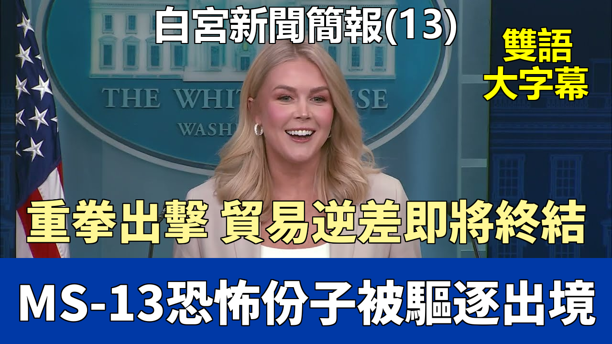

### 音频

### 中英文双语脚本
Hello, everybody. Good afternoon. How are we? Good. Good to see you all.
大家好。下午好。大家都還好嗎？很好。很高興見到大家。

I want to start today by addressing the US Army soldiers.
今天我想首先談談美國陸軍士兵的事情。

Who went missing while conducting a mission to repair and tow an immobilized tactical vehicle in Lithuania in the early hours of March 25.
他們於 3 月 25 日凌晨在立陶宛執行修理和拖曳一輛無法移動的戰術車輛任務時失蹤。

Tragically, three soldiers were found deceased in Lithuania yesterday. And it pains me to confirm that today, the fourth soldier was also found deceased.
不幸的是，昨天在立陶宛發現了三名士兵的遺體。而我沉痛地確認，今天第四名士兵也被發現遇難。

The president, the secretary of defense, and the entire White House are praying for the victims' friends and family during this unimaginable time.
總統、國防部長以及整個白宮都在這個難以想象的時刻爲遇難者的朋友和家人祈禱。

This is another stark reminder of the selfless sacrifice of our brave military men and women who risk their lives around the world every day to keep us safe.
這再次嚴酷地提醒我們，我們勇敢的男女軍人每天在世界各地冒着生命危險保護我們的安全，做出了無私的犧牲。

God bless them. On another note, at our southern border, there is more massive news.
上帝保佑他們。另外，關於我們的南部邊境，有更重大的消息。

Southwest border crossings in March fell to the lowest level in American history.
三月份西南邊境的過境人數降至美國曆史最低水平。

Down 94% from March of last year under President Biden, when 137,000 illegal aliens poured across our wide-open southern border.
與去年拜登總統任期內三月份相比下降了 94%，當時有 137,000 名非法移民涌入我們大開的南部邊境。

Thanks to President Trump's leadership, Border Patrol agents are now back to doing the jobs they signed up for, securing the border.
得益於特朗普總統的領導，邊境巡邏人員現在重新開始從事他們簽約時的工作——保衛邊境。

Rather than serving as travel agents for illegal aliens. The Los Angeles Times captured the Trump effect on the border with a recent article.
而不是充當非法移民的旅行社代理。《洛杉磯時報》最近的一篇文章捕捉到了特朗普對邊境的影響。

Their headline read, "California-Mexico border, once overwhelmed, is now nearly empty."
他們的標題寫道：“曾不堪重負的加州-墨西哥邊境，如今幾乎空無一人。”

With so few migrants coming into the US, they wrote, "Shelters that once served migrants have completely closed."
他們寫道，由於進入美國的移民如此之少，“曾經服務於移民的收容所已經完全關閉。”

Deportations of illegal aliens who threaten the safety of the American people are also continuing at a rapid pace.
威脅美國人民安全的非法移民的驅逐行動也在迅速進行中。

Over the weekend, the United States military transferred a group of 17 violent criminals from the Tren de Aragua and MS-13 terrorist organizations to El Salvador.
上週末，美國軍方將來自“特倫德阿拉瓜”和 MS-13 恐怖組織的 17 名暴力罪犯移交給了薩爾瓦多。

And an illegal alien who was released by the Biden administration into our country was just arrested in Georgia.
一名被拜登政府釋放到我們國家的非法移民剛剛在佐治亞州被捕。

And charged with the horrific killing of Camelia Williams, a mother of five and grandmother.
他被控可怕地殺害了卡米莉亞·威廉姆斯，她是一位五個孩子的母親和祖母。

The suspect has now been indicted on charges of malice murder, felony murder, aggravated assault, rape, aggravated sexual battery, and necrophilia.
該嫌疑人現已被起訴，罪名包括惡意謀殺、重罪謀殺、嚴重攻擊、強姦、嚴重性侵犯和戀屍癖。

Which for those who don't know, necrophilia is a sexual obsession with a corpse.
對於那些不知道的人來說，戀屍癖是對屍體的性迷戀。

This suspect was ordered to be removed in July 2023, but the Biden administration allowed him to stay.
該嫌疑人於 2023 年 7 月被下令驅逐，但拜登政府允許他留下。

This case represents the ruthless murderers, rapists.
這個案件代表了那些無情的殺人犯、強姦犯。

And pedophiles who Joe Biden and Democrats let into our country over the past four years through our southern border.
以及喬·拜登和民主黨人在過去四年裏通過我們的南部邊境放進我們國家的戀童癖者。

They should have never been here in the first place. Keep this in mind the next time you see Democrats protesting future illegal alien removals from our country.
他們一開始就不應該在這裏。下次你看到民主黨人抗議未來將非法移民從我們國家驅逐出去時，請記住這一點。

President Trump is focused on fulfilling his greatest obligation to keep the American people safe and to defend our country from violent invaders.
特朗普總統專注於履行他最大的義務，即保護美國人民的安全，保衛我們的國家免受暴力入侵者的侵害。

Looking ahead to tomorrow, April 2nd, 2025, will go down as one of the most important days in modern American history.
展望明天，2025 年 4 月 2 日，將作爲現代美國曆史上最重要的日子之一載入史冊。

Our country has been one of the most open economies in the world, and we have the consumer base hands down, the best consumer base.
我們的國家一直是世界上最開放的經濟體之一，而且我們擁有無可爭議的最佳消費羣體。

But too many foreign countries have their markets closed to our exports. This is fundamentally unfair.
但太多外國的市場對我們的出口關閉。這根本上是不公平的。

The lack of reciprocity contributes to our large and persistent annual trade deficit that's gutted our industries and hollowed out key workforces.
缺乏互惠導致了我們巨大且持續的年度貿易逆差，這掏空了我們的產業，並導致關鍵勞動力流失。

But those days of America, beginning tomorrow, being ripped off are over.
但是，從明天開始，美國被敲竹槓的日子結束了。

American workers and businesses will be put first under President Trump, just as he promised on the campaign trail.
在特朗普總統的領導下，美國工人和企業將得到優先考慮，正如他在競選期間所承諾的那樣。

The president's historic action tomorrow will improve American competitiveness in every area of industry, reduce our massive trade deficits.
總統明天採取的歷史性行動將提高美國在各個工業領域的競爭力，減少我們巨大的貿易逆差。

And ultimately protect our economic and national security. President Trump's economic vision is rooted in common sense.
並最終保護我們的經濟和國家安全。特朗普總統的經濟願景植根於常識。

America will offer companies the lowest taxes, energy costs, regulations.
美國將爲公司提供最低的稅收、能源成本和法規。

If they make their products right here in the United States and hire American workers for the job.
前提是他們在美國本土生產產品並僱用美國工人。

It's simple. If you make your product in America, you will pay no tariffs.
這很簡單。如果你在美國生產產品，你將無需支付任何關稅。

We have already seen a number of the largest companies in the world respond to this economic approach.
我們已經看到世界上一些最大的公司對這種經濟策略做出了迴應。

For example, Project Stargate, led by Japan-based SoftBank and US-based OpenAI, and Oracle.
例如，由日本軟銀和美國 OpenAI 及甲骨文領導的“星際之門”項目。

Announced a $500 billion private investment in the United States-based artificial intelligence infrastructure.
宣佈在美國本土的人工智能基礎設施上投資 5000 億美元。

Apple announced a $500 billion investment in US manufacturing in training.
蘋果公司宣佈在美國製造業和培訓方面投資 5000 億美元。

Nvidia announced it will invest hundreds of billions of dollars over the next four years in US-based manufacturing.
英偉達宣佈未來四年將在美國本土製造業投資數千億美元。

And the Taiwan semiconductor manufacturing company, TSMC, announced a $100 billion investment in US-based chips in manufacturing.
臺灣半導體制造公司（臺積電）宣佈在美國本土芯片製造領域投資 1000 億美元。

These are just a few of the investment announcements that have already been made.
這些只是已經宣佈的投資中的一小部分。

And it is clear that President Trump's America First approach has already working.
很明顯，特朗普總統的“美國優先”方針已經奏效。

In our new media seat today is Mark Halprith, the co-founder and editor-in-chief of Two-Way.
今天在我們新媒體席位上的是“Two-Way”的聯合創始人兼主編馬克·哈爾普林。

A new live video platform that builds communities around interactive conversations with leaders and content creators from every subject area.
這是一個新的直播視頻平臺，通過與各領域領導者和內容創作者的互動對話來建立社羣。

Mark and his colleagues welcome all voices into discussions that are spirited but respectful.
馬克和他的同事歡迎所有聲音參與到熱烈而相互尊重的討論中。

They have over 37.5 million video views, over 3.6 million watch time hours since the platform began just last year.
自去年平臺啓動以來，他們已擁有超過 3750 萬的視頻觀看次數和超過 360 萬小時的觀看時長。

This is new media in its truest sense, allowing the people to ask questions, make comments.
這是真正意義上的新媒體，允許人們提問、發表評論。

And be an active part of engagement on the most important issues facing the country and our world.
並積極參與到關於國家和世界面臨的最重要問題的互動中來。

With that, Mark, please kick us off, and welcome to the briefing room. Thank you, Caroline. Appreciate it.
那麼，馬克，請你開始提問吧，歡迎來到簡報室。謝謝你，卡羅琳。非常感謝。

I would ask you a question about tariffs and then one from one of the members of our community about education.
我想問你一個關於關稅的問題，然後是一個來自我們社羣成員關於教育的問題。

It's perceived by some that companies or countries, if they change their policies either before tomorrow or after tomorrow.
有些人認爲，如果公司或國家在明天之前或之後改變政策。

Can have the president alter what he's planning for that country or that sector. Is that a possibility?
總統可能會改變他對該國或該行業的計劃。這有可能嗎？

And if so, what factors the president consider in making those changes?
如果可能，總統在做出這些改變時會考慮哪些因素？

Well, the ultimate change for these companies in these countries, Mark, will happen when they decide to do business in the United States of America.
嗯，馬克，對於這些國家的這些公司來說，最終的改變將發生在他們決定在美國做生意的時候。

And as I just laid out, they will face no tariffs at all if these companies choose to invest here in the United States.
正如我剛纔闡述的，如果這些公司選擇在美國投資，它們將完全不會面臨任何關稅。

And to move their production and their manufacturing here to the United States as well.
並將他們的生產和製造也轉移到美國。

As for tomorrow, the president will be addressing the decades of unfair trade practices that have ripped our country off and American workers off.
至於明天，總統將處理幾十年來敲詐我們國家和美國工人的不公平貿易行爲。

It has hollowed out our middle class. It has destroyed our heartland.
它掏空了我們的中產階級。它摧毀了我們的腹地。

And the president is focused on reshifting our global economy to ensure that America is once again the manufacturing superpower of the world.
總統正致力於調整我們的全球經濟，以確保美國再次成爲世界製造業超級大國。

So if they do something today or later in the week that's a pledge for future activity, would that be good enough potentially to alter the policy?
那麼，如果他們今天或本週晚些時候做出未來行動的承諾，這是否可能足以改變政策？

Again, the president has been looking at the very unfair trade practices of the past.
再說一次，總統一直在審視過去非常不公平的貿易行爲。

Certainly, the president is always up to take a phone call, always up for a good negotiation.
當然，總統總是願意接電話，總是樂於進行好的談判。

But he is very much focused on fixing the wrongs of the past and showing that American workers have a fair shake.
但他非常專注於糾正過去的錯誤，並確保美國工人獲得公平的機會。

So if someone calls after tomorrow and says, hey, I'm ready to make a change, he'd be open to that?
那麼，如果有人在明天之後打電話說，嘿，我準備做出改變，他會對此持開放態度嗎？

The president is always open to taking calls. OK. A question from one of our community members, Katie Reeds, is a school teacher in Wisconsin.
總統總是願意接聽電話。好的。一個來自我們社羣成員凱蒂·里茲的問題，她是威斯康星州的一名學校教師。

She's taught K-3 in public, independent private, and private schools. And here's what she wanted me to ask you.
她曾在公立、獨立私立和私立學校教授 K-3 年級。她想讓我問你的是這個。

She says, I see the elimination of the Department of Education as an excellent first step in the improvement of our school system.
她說，“我認爲取消教育部是改善我們學校系統的絕佳第一步。”

Do you see any further role the federal government can take beyond this.
您認爲聯邦政府在此之外還能扮演什麼進一步的角色嗎？

Possibly in promoting the expansion of voucher programs or reducing the influence that teachers' unions hold over our schools?
比如可能在推動教育券計劃的擴展或減少教師工會對我們學校的影響力方面？

Well, first of all, I want to thank Katie for her service to our country and our nation's children.
嗯，首先，我要感謝凱蒂爲我們國家和我們國家的孩子們所做的服務。

Being a teacher is the most noble profession that we believe one can have.
我們認爲，教師是人們可以擁有的最高尚的職業。

And the president said in his remarks when he signed the executive order to dismantle the Department of Education that he loves our teachers.
總統在簽署解散教育部的行政命令時曾表示，他熱愛我們的教師。

And in part, this order is to empower our teachers to have greater decision making in the classroom.
在某種程度上，這項命令是爲了賦予我們的教師在課堂上擁有更大的決策權。

Nobody knows our nation's children and our students better than our teachers who are with them every single day.
沒有人比每天和孩子們在一起的老師更瞭解我們國家的孩子和學生。

As for the federal government's role to get to the heart of Katie's question, the president has made it clear to Lyndon McMahon.
至於聯邦政府的角色，回到凱蒂問題的核心，總統已經向林登·麥克馬洪明確表示。

That we need to find other places within our federal government for critical programs regarding education.
我們需要在聯邦政府內部爲關鍵的教育相關項目尋找其他安置之處。

Pell grants, Title IX, lawsuits, et cetera, civil rights lawsuits.
佩爾助學金、教育法修正案第九條、訴訟等等，公民權利訴訟。

All of that are critical functions, special needs programs, nutrition programs.
所有這些都是關鍵功能，特殊需求項目、營養項目。

But there are other places throughout the federal bureaucracy where those things can happen in work.
但在整個聯邦官僚機構中，還有其他地方可以完成這些工作。

The Department of Education has been a very bloated bureaucracy. We spent trillions of dollars on this department. And for what?
教育部一直是一個非常臃腫的官僚機構。我們在這個部門上花費了數萬億美元。結果呢？

Our children are worse off as far as education goes today than they were when this department originated. And that's very concerning to the president.
就教育而言，我們的孩子今天的情況比這個部門成立時還要糟糕。這讓總統非常擔憂。

On two issues she cited are those of priorities for the president, school education choice vouchers and diminishing the role of teachers.
關於她提到的兩個問題——學校教育選擇券和削弱教師（工會）的作用，這些是總統的優先事項嗎？

The president is very supportive of both of those things, particularly when it comes to school choice.
總統非常支持這兩件事，特別是在學校選擇方面。

He has said that school choice is the civil rights issue of our time. And he wants every child, regardless of zip code, socioeconomic status.
他曾說過，學校選擇是我們這個時代的民權問題。他希望每個孩子，無論其郵政編碼、社會經濟地位如何。

How much money their parents have, to be able to go to the school of their choosing that best suits their educational needs.
無論其父母有多少錢，都能去選擇最適合他們教育需求的學校。

And he is going to empower state and local leaders to make those decisions on behalf of our nation's children. Thanks for being here, Mark.
他將授權州和地方領導人代表我們國家的孩子們做出這些決定。感謝你的到來，馬克。

Jeff. Just changing subjects for one second.
傑夫。稍微換個話題。

The administration has expressed a complete confidence in how all the deportation flights to El Salvador were conducted.
政府已表示對所有飛往薩爾瓦多的驅逐航班的執行方式完全有信心。

But now that the administration has conceded that there was an error of one Salvadorian national, will there be any reviews conducted?
但既然政府承認在一名薩爾瓦多國民的問題上存在錯誤，是否會進行任何審查？

And does the president express any thoughts on the one error that was disclosed in court last night?
總統對昨晚在法庭上披露的這一個錯誤有什麼看法嗎？

Well, first of all, the error that you are referring to was a clerical error. It was an administrative error.
嗯，首先，你提到的錯誤是一個文書錯誤。這是一個行政錯誤。

The administration maintains the position that this individual who was deported to El Salvador.
政府堅持認爲，這名被驅逐到薩爾瓦多的個人。

And will not be returning to our country was a member of the brutal and vicious MS-13 gang. That is fact number one.
並且不會返回我們國家，是殘暴兇狠的 MS-13 黑幫成員。這是事實一。

Fact number two, we also have credible intelligence proving that this individual was involved in human trafficking.
事實二，我們也有可靠的情報證明此人蔘與了人口販賣。

And fact number three, this individual was a member, actually a leader, of the brutal MS-13 gang.
事實三，此人是殘暴的 MS-13 黑幫的成員，實際上是一名頭目。

Which this president has designated as a foreign terrorist organization.
本屆總統已將該組織指定爲外國恐怖組織。

Fact number four is that foreign terrorists do not have legal protections in the United States of America anymore.
事實四是，外國恐怖分子在美國不再享有法律保護。

And it is within the president's executive authority and power to deport these heinous individuals from American communities.
將這些令人髮指的個人從美國社區驅逐出去，屬於總統的行政權力和權限範圍。

It is a promise he campaigned on. It is a promise he is keeping. And every single person in this room should be grateful for that.
這是他在競選時做出的承諾。這是他正在履行的承諾。這個房間裏的每一個人都應該對此心存感激。

Considering especially MS-13 is very prevalent and prominent here in the District of Columbia, in Maryland and in Virginia,
特別是考慮到 MS-13 在哥倫比亞特區、馬里蘭州和弗吉尼亞州非常猖獗和突出，

And the president, the attorney general.
總統、司法部長。

Everyone who has been involved in these operations is focused on eradicating these criminals and terrorists from our communities.
所有參與這些行動的人都致力於從我們的社區中清除這些罪犯和恐怖分子。

The vice president said he was a convicted member of MS-13. What evidence is there to back that up? There's a lot of evidence.
副總統說他是 MS-13 的定罪成員。有什麼證據支持這一點？有很多證據。

In the Department of Homeland Security and ICE have that evidence, and I saw it this morning. Steve.
國土安全部和移民與海關執法局（ICE）掌握着這些證據，我今天早上看到了。史蒂夫。

Has the president fully made up his mind on the level of tariffs to impose tomorrow? We keep hearing about a 20% flat rate.
總統是否已完全決定明天要徵收的關稅水平？我們一直聽說會是 20% 的統一稅率。

The president said last night he has made a decision and a determination.
總統昨晚表示他已經做出了決定和決斷。

I was with him in the Oval Office earlier, and he is going to announce that decision tomorrow. I don't want to get ahead of the president.
我早些時候在橢圓形辦公室和他在一起，他將在明天宣佈這個決定。我不想搶在總統前面宣佈。

This is obviously a very big day.
這顯然是非常重要的一天。

He is with his trade and tariff team right now, perfecting it to make sure this is a perfect deal for the American people and the American worker.
他現在正和他的貿易和關稅團隊在一起，完善方案，以確保這對美國人民和美國工人來說是一個完美的協議。

And you will all find out in about 24 hours from now. And are the car tariffs going to go into effect on April 3rd as scheduled?
大約 24 小時後你們都會知道。汽車關稅會按計劃在 4 月 3 日生效嗎？

Correct. Yes, they will. Okay. And last thing, would you like to respond to the Chinese military drills around Taiwan? Yes, I would.
是的。它們會的。好的。最後一件事，您想回應中國在臺灣周邊的軍事演習嗎？是的，我想回應。

As a matter of fact, the National Security Council briefed me on this this morning.
事實上，國家安全委員會今天早上向我簡報了此事。

And they said that the president is emphasizing the importance of maintaining peace in the Taiwan Strait.
他們說總統正在強調維護臺灣海峽和平的重要性。

Encouraging the peaceful resolution of these cross-strait issues.
鼓勵和平解決這些兩岸問題。

Reiterating our opposition to any unilateral attempts to change the status quo by force or coercion.
重申我們反對任何以武力或脅迫方式單方面改變現狀的企圖。

That is directly from the national security advisor. Just for you, Steve Holland of Reuters.
這是直接來自國家安全顧問的話。專門說給你聽的，路透社的史蒂夫·霍蘭德。

Monica. Thank you so much, Caroline.
莫妮卡。非常感謝，卡羅琳。

Elon Musk this week revealed that Doge found that the Biden administration issued over 2 million Social Security numbers to illegal aliens.
埃隆·馬斯克本週透露，Doge 發現拜登政府向非法移民發放了超過 200 萬個社會保障號碼。

Found 20 million dead people marked as a lot in the Social Security system.
發現社會保障系統中有 2000 萬已故人士被標記爲在世。（注：原文爲 marked as a lot，可能指標記爲“大量存在”或活着，此處按後者理解）

Has the White House confirmed these numbers with Elon, and is the White House looking into correcting this?
白宮是否與埃隆確認了這些數字？白宮是否正在調查並糾正這個問題？

I'm not sure about those specific numbers that Mr. Musk cited. I can tell you what the Social Security administration has said themselves.
我不確定馬斯克先生引用的那些具體數字。我可以告訴你社會保障局自己是怎麼說的。

According to an inspector general's report that was conducted last year showing there was nearly $80 billion worth of fraud in this program.
根據去年進行的一份監察長報告顯示，該計劃中存在近 800 億美元的欺詐。

We know for a fact there are individuals who should not be receiving benefits on the Social Security roles.
我們確切知道，社會保障名單上有一些不應領取福利的個人。

And this administration is focused on cleaning out the waste, fraud, and abuse in every agency, but particularly in Social Security.
本屆政府專注於清理每個機構的浪費、欺詐和濫用，尤其是在社會保障方面。

To make it stronger for our tax-paying, law-abiding citizens who deserve these entitlements and programs.
爲了讓那些應得這些福利和計劃的納稅守法公民的社保體系更加穩固。

Because you did bring up Doge, I do want to tout the incredible efforts that have been made at the Environmental Protection Agency.
因爲你提到了 Doge（可能是指調查或某個人/組織），我確實想宣傳一下環境保護局（EPA）所做的令人難以置信的努力。

Administrator Lee Zeldin is just doing a tremendous job. Just yesterday and today, it will be going into effect.
局長李·澤爾丁的工作做得非常出色。就在昨天和今天，它將開始生效。

He announced that taxpayers will be saved $8 million in annual lease costs by moving staff out of the 323,000 square feet of space.
他宣佈，通過將員工遷出目前環保局佔用的 323,000 平方英尺完全不必要的空間，每年將爲納稅人節省 800 萬美元的租賃成本。

That the EPA currently occupies, which is completely unnecessary. Yesterday, Administrator Zeldin also announced he will be shutting down a museum.
環保局目前佔用的空間是完全不必要的。昨天，澤爾丁局長還宣佈他將關閉一個博物館。

That the Biden administration built to tell a selective story about the EPA's history and climate change.
該博物館是拜登政府建造的，用來講述一個經過挑選的關於環保局歷史和氣候變化的故事。

It was a real pat on the back to President Biden. And guess how much American taxpayers paid for it?
這對拜登總統來說真是一種自我吹捧。猜猜美國納稅人爲它付了多少錢？

$4 million for this museum that I think only 1,000 visitors saw last year alone, and it would cost American taxpayers $600,000 per year to operate this museum.
這個博物館耗資 400 萬美元，據我所知去年一年只有 1000 名遊客參觀，而且每年運營這個博物館要花費美國納稅人 60 萬美元。

Well, it's not going to exist anymore. We're going to save taxpayers those critical funds, and Administrator Zeldin is very proud to announce that.
嗯，它將不復存在了。我們將爲納稅人節省下這些關鍵資金，澤爾丁局長非常自豪地宣佈了這一點。

And just at EPA alone and the cuts that they have made, they've saved taxpayers more than $22 billion in wasteful grants and spending.
僅在環保局，通過他們所做的削減，就爲納稅人節省了超過 220 億美元的浪費性撥款和開支。

Peter. Thank you, Caroline. When the President goes down to Florida on the weekends, does he ever hear from, there are so many retired folks down in Florida.
彼得。謝謝你，卡羅琳。當總統週末去佛羅里達時，他是否曾聽取過，佛羅里達有很多退休人士。

Does he ever hear from any retired Americans who are stressed about these wild swings in the stock market because of the tariff uncertainty.
他是否曾聽取過那些因關稅不確定性而對股市劇烈波動感到壓力的退休美國人的意見？

And they're sitting there on fixed income or living off of 401(k) and they don't know how much money is going to be left?
他們靠固定收入或 401(k) 退休金生活，不知道還剩下多少錢？

Well, certainly, they are legitimate concerns, and the President takes those concerns very seriously, and he's addressing them every single day.
嗯，當然，這些是合理的擔憂，總統非常重視這些擔憂，並且他每天都在處理這些問題。

And tomorrow's announcement is to protect future generations. The senior citizens you mentioned.
明天的宣佈是爲了保護子孫後代。你提到的老年人。

It's for their kids and their grandkids to ensure that there are jobs here in the United States of America for their children to live the American dream.
這是爲了他們的孩子和孫子，確保在美國有工作機會，讓他們的孩子能夠實現美國夢。

Just like they presumably did. And as for their worries about their 401(k)s, their Social Security, I just addressed Social Security.
就像他們（老年人）大概曾經做到的那樣。至於他們對 401(k) 和社會保障的擔憂，我剛剛談到了社會保障。

This President is always going to protect it for our tax-paying senior citizens.
這位總統將始終爲我們納稅的老年公民保護它。

As for their 401(k)s, look at what President Trump did for you in his first term.
至於他們的 401(k)，看看特朗普總統在他的第一個任期內爲你們做了什麼。

He is working on implementing that economic formula every single day by lowering inflation, lowering energy prices, massive deregulatory efforts.
他每天都在努力實施那個經濟方案，通過降低通貨膨脹、降低能源價格、大規模放松管制。

While simultaneously effectively implementing tariffs, and they'll hear more about that announcement tomorrow.
同時有效地實施關稅，他們明天會聽到更多關於這個宣佈的消息。

And you said that the President, right now, is with the trade and tariff team. They are very confident that this is all going to work.
你說總統現在正和貿易和關稅團隊在一起。他們非常有信心這一切都會奏效。

Yes. But what if they're wrong? They're not going to be wrong. It is going to work.
是的。但如果他們錯了怎麼辦？他們不會錯的。它會奏效的。

The President has a brilliant team of advisors who have been studying these issues for decades.
總統擁有一支出色的顧問團隊，他們研究這些問題已有數十年。

And we are focused on restoring the golden age of America and making America a manufacturing superpower.
我們專注於恢復美國的黃金時代，讓美國成爲製造業超級大國。

And again, Peter, I would point you to the investments that have already trickled into this country.
再說一次，彼得，我會讓你看看那些已經涌入這個國家的投資。

And the President hasn't even made his tariff announcement yet tomorrow.
而總統甚至還沒有在明天宣佈他的關稅計劃。

There have been billions of dollars in private investments from around the world pouring into American communities.
已經有來自世界各地的數十億美元私人投資涌入美國社區。

What does that look like for those watching at home, for the people you mentioned, worried about their own economic circumstances?
對於那些在家觀看的人，對於你提到的那些擔心自己經濟狀況的人來說，這意味着什麼？

It means more jobs in your communities, which means more money, more investments, more money in your pocket.
這意味着你們社區有更多的工作崗位，意味着更多的錢，更多的投資，你口袋裏有更多的錢。

That's what the President is committed to.
這就是總統所致力於的。

And I would be remiss if I didn't mention the President's commitment to tax cuts, which we are counting on Congress to do, especially on Social Security.
如果我不提及總統對減稅的承諾，那將是我的疏忽，我們指望國會這樣做，特別是在社會保障方面。

And one more. Sure. Are the special elections today a referendum on the President?
還有一個問題。當然。今天的特別選舉是對總統的全民公投嗎？

I think the, first of all, as you know, I'm a government employee now, so I'm not very much allowed to comment on elections that are taking place.
我認爲，首先，如你所知，我現在是政府僱員，所以我不太被允許評論正在進行的選舉。

That's something to get used to, having just been on the campaign trail for quite some time.
剛在競選活動中待了相當長一段時間，這是需要適應的事情。

But the President is the leader of the America First movement and the MAGA movement.
但總統是“美國優先”運動和“讓美國再次偉大”（MAGA）運動的領導者。

And that was made very clear on November the 5th, when he received nearly 80 million votes.
這一點在 11 月 5 日已經非常清楚了，當時他獲得了近 8000 萬張選票。

I could also say that it is the constitutional right of every law-abiding American in these places where these elections are being held to vote.
我還可以說，在這些舉行選舉的地方，投票是每個守法美國人的憲法權利。

And every American should exercise their constitutional rights. Sure. Thanks, Carolyn. A few questions about this deportation case.
每個美國人都應該行使他們的憲法權利。當然。謝謝，卡羅琳。關於這個驅逐案有幾個問題。

First, I wanted to clarify something that you said to Jeff a few minutes ago. You said you'd seen evidence that this man was a convicted gang member.
首先，我想澄清你幾分鐘前對傑夫說的一些話。你說你看到了證據表明這個人是被定罪的幫派成員。

In what court was he convicted and for what? This individual was an MS-13 ringleader. This individual was also engaged in human trafficking.
他在哪個法庭被定罪？罪名是什麼？這個人是 MS-13 的頭目。這個人也參與了人口販賣。

And I'm glad you brought up this point again, because I would like to point out that if you just saw the headline from the insane.
我很高興你再次提出這一點，因爲我想指出，如果你只看到那個瘋狂的、

Failing Atlantic magazine this morning, you would think this individual was Father of the Year, living in Maryland, living a peaceful life.
失敗的《大西洋月刊》今天早上的標題，你會認爲這個人是年度模範父親，住在馬里蘭州，過着平靜的生活。

When that couldn't be further from the truth. They didn't even mention in the title of that article.
而這與事實相去甚遠。他們甚至在那篇文章的標題中都沒有提到。

Or even in the first paragraph, that this individual is an illegal criminal who broke our nation's immigration laws.
甚至在第一段中也沒有提到，這個人是一個違反了我們國家移民法的非法罪犯。

He is a leader in the brutal MS-13 gang, and he is involved in human trafficking. And now MS-13 is a designated foreign terrorist organization.
他是殘暴的 MS-13 黑幫的頭目，並且參與了人口販賣。現在 MS-13 是一個指定的外國恐怖組織。

Foreign terrorists have no legal protections in the United States of America.
外國恐怖分子在美國沒有法律保護。

And this administration is going to continue to deport foreign terrorists and illegal criminals from our nation's interior.
本屆政府將繼續從我們國家內部驅逐外國恐怖分子和非法罪犯。

But a judge ordered that he should remain in this country. So are you saying that it is okay to ignore a judge's ruling if you don't like it?
但是一位法官命令他應該留在這個國家。所以你的意思是，如果你不喜歡法官的裁決就可以無視它嗎？

Who does that judge work for? It was an immigration judge who works for the Department of Justice at the direction of the Attorney General of the United States.
那位法官爲誰工作？那是一位移民法官，他在美國司法部長的指導下爲司法部工作。

Whose name is Pam Bondi, who has committed to eradicating MS-13 from our nation's interior. And let me tell you why we've made this commitment.
這位司法部長的名字是帕姆·邦迪，她致力於從我們國家內部根除 MS-13。讓我告訴你我們爲什麼做出這個承諾。

MS-13, may I remind each and every one of you, is a brutal and vicious gang. They raped and strangled a 20-year-old autistic woman to death in Maryland.
MS-13，請允許我提醒你們每一個人，是一個殘暴兇狠的幫派。他們在馬里蘭州強姦並勒死了一名 20 歲的自閉症婦女。

They hacked four people to death with machetes in a park on Long Island.
他們在長島的一個公園裏用砍刀砍死了四個人。

They have kidnapped, sexually tortured, and shot a teenage girl in Texas after she insulted them, allegedly.
據稱，他們在德克薩斯州綁架、性虐待並槍殺了一名侮辱他們的少女。

Killed and mutilated a 17-year-old girl in Virginia, stabbing him 16 times and cutting off his hands.
在弗吉尼亞州殺害並肢解了一名 17 歲女孩，刺了他 16 刀並砍掉了他的手。（注：原文此處性別用詞似乎有誤，應爲男孩或女孩其中之一）

They beheaded and cut out the heart of a man in Washington, D.C. They raped and murdered a 13-year-old girl in California.
他們在華盛頓特區將一名男子斬首並挖出心臟。他們在加利福尼亞州強姦並謀殺了一名 13 歲的女孩。

They sex trafficked a slew of young girls, including one who was just 12 years old.
他們性販運了大量年輕女孩，其中包括一名年僅 12 歲的女孩。

Raped an 11-year-old girl in Brooklyn while her brother was in the room.
在布魯克林強姦了一名 11 歲的女孩，當時她的兄弟就在房間裏。

Sex trafficked a 13-year-old in Maryland in Virginia, miles away from this White House, even beating her 26 times on her backside with a baseball bat.
在距離白宮僅幾英里的馬里蘭州和弗吉尼亞州性販運了一名 13 歲的女孩，甚至用棒球棒打了她背部 26 次。

Pressured homeless New Yorkers to undergo unnecessary surgeries such as spinal fusion in order to bolster their fraudulent lawsuits.
迫使紐約無家可歸者接受不必要的手術，如脊柱融合術，以支持他們的欺詐性訴訟。

These are vicious criminals. This is a vicious gang.
這些是兇惡的罪犯。這是一個兇惡的幫派。

And I wish that the media would spend just a second of the same time you have spent trying to litigate each and every individual of this gang.
我希望媒體能花哪怕一秒鐘的時間，就像你們花時間試圖爲這個幫派的每一個成員辯護一樣，

Who has been deported from our country as the innocent Americans whose lives have been lost at the hands of these brutal criminals.
去關注那些因這些殘暴罪犯而喪生的無辜美國人，而這些罪犯已被驅逐出境。

We maintain our position and very strongly so. Jennifer. One more on the tariffs. Can you say what the latest thinking is on the start date?
我們堅持我們的立場，並且非常堅定。詹妮弗。再問一個關於關稅的問題。你能說說關於生效日期的最新想法嗎？

I know you were just in the Oval. Are they all going to take effect this week on the reciprocal tariffs?
我知道你剛在橢圓形辦公室。關於互惠關稅，它們都會在本週生效嗎？

And whenever they start, is that enough time for companies and everyone involved to adjust to that start date?
無論何時開始，這是否足夠讓公司和所有相關方適應那個生效日期？

My understanding is that the tariff announcement will come tomorrow. They will be effective immediately.
我的理解是關稅公告將在明天發佈。它們將立即生效。

And the President has been teasing this for quite some time, as you know. He's talked a lot about April 2nd as Liberation Day in America.
如你所知，總統已經預告這件事有一段時間了。他多次提到 4 月 2 日是美國的解放日。

It would be taking place today, if not for April Fool's Day. But tomorrow will be the day, and he's been talking about it for a while.
如果不是因爲愚人節，它本該在今天發生。但明天就是那一天，他已經談論了一段時間了。

And as a result, you've seen these companies make commitments to investing right here in the United States.
結果是，你已經看到這些公司承諾在美國本土投資。

Jasmine. Thank you so much.
賈斯敏。非常感謝。

I wonder, back on tariffs, what, if any, market indicators is the White House looking for to see if this tariff's plan is successful down the line?
我想知道，回到關稅問題上，白宮正在關注哪些市場指標（如果有的話）來判斷這個關稅計劃未來是否成功？

Well, look, the President has been asked and answered this question about the stock market and whether he's watching it.
嗯，看，總統已經被問到並回答了關於股市以及他是否關注股市的問題。

And I've said and he has said, the market is a snapshot in time.
我和他都說過，市場只是某個時間點的快照。

Yesterday, Dow futures were up, and there's been a lot of talk about the market, and it was up yesterday.
昨天，道瓊斯指數期貨上漲了，關於市場的討論很多，昨天市場是上漲的。

So, look, the President wants to ensure that all Americans make out well, particularly Main Street.
所以，看，總統希望確保所有美國人都能過得好，特別是普通民衆（Main Street）。

That's the focus of these tariffs. But as I've said repeatedly, just like they did in, just like they were in his first term, Wall Street will be just fine.
這就是這些關稅的重點。但正如我反覆說過的，就像在他的第一個任期內一樣，華爾街會沒事的。

Shelby. Thanks. A bipartisan pair of senators sent a letter to the President today.
謝爾比。謝謝。今天，兩位跨黨派參議員致信總統。

Arguing that the recent strikes in Yemen are emboldening the Houthis and saying that Congress has not authorized war against them.
信中認爲最近在也門的打擊行動正在助長鬍塞武裝的氣焰，並指出國會尚未授權對他們開戰。

Is the administration planning to consult with Congress at some point or going forward regarding the strikes and any response on the letter?
政府是否計劃在某個時候或未來就這些打擊行動以及對信件的任何迴應與國會進行磋商？

Well, I would absolutely reject Congress's claims. Who made those claims in Congress? Senator Jeff Merkley and Rand Paul.
嗯，我絕對會駁斥國會的說法。國會中是誰提出的這些主張？參議員傑夫·默克利和蘭德·保羅。

Okay. Well, I would absolutely reject those claims. These Houthi strikes have been incredibly successful.
好的。嗯，我絕對會駁斥那些說法。這些針對胡塞武裝的打擊非常成功。

Last time I was at this podium, there were more than 100 successful strikes. There have now been over 200 successful strikes against the Houthis.
上次我站在這裏時，已經有超過 100 次成功的打擊。現在已經對胡塞武裝進行了超過 200 次成功的打擊。

Iran is incredibly weakened as a result of these attacks, and we have seen they've taken out Houthi leaders.
伊朗因這些襲擊而被極大地削弱了，我們看到他們已經除掉了胡塞武裝的領導人。

They've taken out critical members who were launching strikes on naval ships and on commercial vessels.
他們除掉了那些對海軍艦艇和商業船隻發動襲擊的關鍵成員。

And this operation will not stop until the freedom of navigation in this region is restored.
這項行動將不會停止，直到該地區的航行自由得到恢復。

Which is a critical principle, and this President stands behind our Defense Department, who's doing a tremendous job.
這是一個關鍵原則，本屆總統支持我們做得非常出色的國防部。

And are they going to, is the White House going to confer with Congress going forward on this?
他們是否會，白宮未來是否會就此事與國會協商？

I would have to ask our team here at the White House, but the President is well within his authority, as is the Secretary of Defense.
我得問問我們在白宮的團隊，但總統完全有權這樣做，國防部長也是。

Again, these are defensive strikes. The Houthis have been launching attacks on U.S. naval vessels and commercial ships for quite some time.
再次強調，這些是防禦性打擊。胡塞武裝對美國海軍艦艇和商船發動襲擊已經有相當長一段時間了。

Go ahead. Caroline, this is, the pause on the Canadian and Mexican tariffs, the Fentanyl tariffs, that's set to expire tomorrow.
請講。卡羅琳，這是關於暫停對加拿大和墨西哥徵收的關稅，即芬太尼關稅，該暫停措施定於明天到期。

Is the President considering extending that pause? Look, I will let the President speak on the specifics of the tariffs tomorrow.
總統是否考慮延長暫停期？看，關於關稅的具體細節，我會讓總統明天來講。

But as for Fentanyl, we have seen this has certainly caused a national security crisis here in the United States.
但就芬太尼而言，我們看到這確實在美國引發了一場國家安全危機。

Fentanyl continues to be the number-one killer of young people in this country, and the President is very much focused on that.
芬太尼仍然是這個國家年輕人的頭號殺手，總統對此非常關注。

Deanna. Thank you, Caroline. The President really, absolutely signed an executive order on making D.C. safe and beautiful.
迪安娜。謝謝你，卡羅琳。總統確實簽署了一項關於讓華盛頓特區安全和美麗的行政命令。

On the campaign trail, he talked about making New York great again. Does he have any plans on establishing a similar task force?
在競選期間，他談到要讓紐約再次偉大。他是否有計劃成立類似的工作組？

Has he been pressuring Governor Hockel in any way in his conversations about New York and lowering crime?
在他關於紐約和降低犯罪率的談話中，他是否以任何方式向霍赫爾州長施壓？

Well, he has been in correspondence with Governor Hockel quite a bit on the issue of crime, also on the issue of congestion pricing.
嗯，他在犯罪問題上，以及在擁堵費問題上，與霍赫爾州長有過相當多的通信。

And so many other issues that are facing New Yorkers. He wants New York to clean up their streets, just as he does here in Washington, D.C.
以及紐約人面臨的許多其他問題。他希望紐約清理他們的街道，就像他在華盛頓特區所做的那樣。

He also speaks to Mayor Adams, as well.
他也和亞當斯市長交談。

So he's engaged with state and local leaders across the entire country to ensure they're doing their part to help American citizens in each and every state.
所以他與全國各地的州和地方領導人接觸，確保他們儘自己的一份力量來幫助每個州的美國公民。

Regardless of if it's a red state or a blue state. A question on Russia.
無論那是紅州還是藍州。一個關於俄羅斯的問題。

Yesterday, the Russian government said that their new goal is 160,000 conscripts for the war.
昨天，俄羅斯政府表示他們的新目標是爲戰爭徵召 16 萬名士兵。

Has the President seen that number, and does he have any response given his recent conversations on peace talks?
總統是否看到了這個數字？鑑於他最近關於和平談判的對話，他是否有任何迴應？

Well, I can tell you what the President said last night, and that is he is frustrated with leaders on both sides of this war.
嗯，我可以告訴你總統昨晚說了什麼，那就是他對這場戰爭雙方的領導人都感到沮喪。

He wants this war to end. There are men that are dying on both sides, and it's been going on for far too long.
他希望這場戰爭結束。雙方都有人在死去，而且戰爭持續太久了。

Our team continues to be engaged with the Russians as we are with the Ukrainians.
我們的團隊繼續與俄羅斯人接觸，就像我們與烏克蘭人接觸一樣。

And the President continues to be very, very much engaged on this topic every single day. Caroline. Caroline. Caroline. Sure. Caroline. Sure.
總統每天都持續非常、非常深入地參與這個話題。卡羅琳。卡羅琳。卡羅琳。當然。卡羅琳。當然。

The President said over the weekend that he couldn't care less if prices went up on foreign cars because people buy more American cars.
總統週末表示，他一點也不在乎外國汽車價格上漲，因爲人們會購買更多的美國汽車。

There's been consensus from a lot of economists that these tariffs could raise prices on other goods as well.
許多經濟學家已達成共識，認爲這些關稅也可能提高其他商品的價格。

Is the President comfortable with Americans on Main Street paying more because of these tariffs?
總統是否對普通美國人因這些關稅而支付更多感到安心？

The President is doing everything he can, and this entire administration is doing everything we can to bring down the cost of living in this country.
總統正在盡其所能，本屆政府也在盡一切努力降低這個國家的生活成本。

An inflation mess that was fueled by the previous administration's reckless spending overburdened some regulations.
這是一個由上屆政府魯莽支出和過度監管助長的通脹爛攤子。

That this administration is focused on slashing every single day. I just read you a statistic just from the Environmental Protection Agency alone.
本屆政府正專注於每天削減這些（支出和監管）。我剛纔給你讀了一個僅來自環境保護局的統計數據。

We're saving taxpayers money that's ultimately gonna drive down inflation.
我們正在爲納稅人省錢，這最終將降低通貨膨脹。

And we're unleashing the might of our energy industry, which will bring down prices as well.
我們正在釋放我們能源產業的力量，這也會降低價格。

To the heart of your question, because this is very important to the American people, you should trust what this President did for you in his first term.
回到你問題的核心，因爲這對美國人民非常重要，你應該相信這位總統在他的第一個任期內爲你所做的事情。

He effectively utilized tariffs while driving down inflation. It was a record low, 1.4% when he left office, and he's focused on getting back to that.
他有效地利用了關稅，同時降低了通貨膨脹。他離任時通脹率是創紀錄的低點 1.4%，他正致力於回到那個水平。

It's unfortunate the previous administration left us in this mess. Sure. Last question.
不幸的是，上屆政府給我們留下了這個爛攤子。當然。最後一個問題。

Representative Annapallina Luna left the Freedom Caucus over there.
衆議員安娜保利娜·盧納退出了那邊的自由核心小組。

Lacked support for her bill that would allow new parents to proxy vote around 12 weeks around the birth of their baby. Does the President support that bill?
原因是她提出的允許新生兒父母在嬰兒出生前後約 12 周內進行代理投票的法案缺乏支持。總統支持這項法案嗎？

I'm not sure. I haven't actually talked to the President about that bill, but I certainly can and can get a take on if he supports it or not.
我不確定。我實際上沒有和總統談過那項法案，但我當然可以去問問，瞭解他是否支持。

Thank you. And one more. The D.C. Circuit ruled last week that the President can fire or hold over Biden appointees of independent agencies.
謝謝。還有一個問題。哥倫比亞特區巡迴法院上週裁定，總統可以解僱或留任獨立機構中由拜登任命的人員。

Will this ruling empower President Trump to dismiss more federal employees?
這項裁決是否會賦予特朗普總統解僱更多聯邦僱員的權力？

Well, the President has given the responsibility to his Cabinet Secretaries to hire and fire at their respective agencies, and they reserve that right.
嗯，總統已將人事任免權賦予了他的內閣部長們，在各自的機構內，他們保留這項權利。

You saw the Secretary of Health and Human Services announced more layoffs today.
你看到衛生與公衆服務部部長今天宣佈了更多的裁員。

This is all part of the administration's effort for a mass reduction in force in the federal bureaucracy here in Washington, D.C., to save American taxpayers' money.
這都是政府努力大規模裁減華盛頓特區聯邦官僚機構的一部分，目的是爲美國納稅人省錢。

As for agencies within the President's executive authority, the President retains that right.
至於在總統行政權力範圍內的機構，總統保留這項權利。

And we've seen there have been bureaucrats at some of these agencies that have been trying to act independent.
我們已經看到，在其中一些機構中，有些官僚試圖獨立行事。

They need to remember who they work for. It's the executive of the executive branch. You look at the United States Institute of Peace, for example.
他們需要記住他們爲誰工作。是行政部門的行政首長。比如，看看美國和平研究所。

There was a little bit of a standoff with bureaucrats over there who didn't want to realize who they work for, and that is Donald Trump.
那裏的官僚們有點僵持，他們不想意識到他們爲誰工作，那就是唐納德·特朗普。

And President Trump is focused on streamlining these agencies to save American taxpayers' money, and he has every right to do that.
特朗普總統專注於精簡這些機構以節省美國納稅人的錢，他完全有權這樣做。

Caroline. Caroline. Sure. Go ahead. Thanks, Carmen.
卡羅琳。卡羅琳。當然。請講。謝謝，卡門。

In Gaza, the bodies of 15 rescuers have been found in their sort of ambulances where they were apparently killed by Israeli forces.
在加沙，15 名救援人員的屍體在他們的救護車內被發現，他們顯然是被以色列軍隊殺害的。

Just wondering if the White House is gonna be calling on Israel to investigate that.
只是想知道白宮是否會呼籲以色列對此進行調查。

And to try and avoid similar casualties involving the rest of the workers in the future.
並試圖在未來避免涉及其他救援人員的類似傷亡。

Well, as for the specific situation you just mentioned, I'll talk to the President about it and our national security team.
嗯，關於你剛纔提到的具體情況，我會和總統以及我們的國家安全團隊談談。

What I can tell you is what I've spoken with the President on. He very much remains committed to backing Israel.
我可以告訴你的是我和總統談過的內容。他仍然非常致力於支持以色列。

And it was only because of this President and his team's leadership that we had a temporary ceasefire in Gaza that we were able to bring many hostages home.
正是因爲這位總統和他團隊的領導，我們纔在加沙實現了臨時停火，能夠將許多人質帶回家。

And the President made it very clear to Hamas, "You get the hostages out, all of them, or there will be hell to pay."
總統已經非常明確地告訴哈馬斯：“把人質交出來，全部交出來，否則將付出慘重代價。”

And Hamas is certainly witnessing what it feels like for all hell to be paid, and the President supports Israel's right to defend itself.
哈馬斯肯定正在體會付出慘重代價是什麼感覺，總統支持以色列的自衛權。

So, has he progressed at all on a ceasefire at the moment as far as the President's concerned?
那麼，就總統而言，目前在停火問題上是否有任何進展？

The President and his team continue to be engaged on this every single day.
總統和他的團隊每天都在持續處理這個問題。

Sure. Thank you, Caroline. Go ahead, Tam. So, I'm just wondering, related to that, if you have an approximate date for the President's first foreign trip.
當然。謝謝你，卡羅琳。請講，塔姆。所以，我只是想知道，與此相關，您是否有總統首次出國訪問的大致日期？

I think there was a little confusion yesterday about what month he was talking about, and then, will he need a ceasefire to be in place or closer.
我想昨天關於他談論的是哪個月份有點混亂，然後，他是否需要停火到位或接近停火。

Either in Gaza or in Ukraine, before that takes place? The President will be heading to Saudi Arabia in May.
無論是在加沙還是烏克蘭，在他出訪之前？總統將於五月前往沙特阿拉伯。

As for specific dates and details, we will be reading those out to you as soon as we possibly can.
至於具體日期和細節，我們會盡快向你們公佈。

I know our teams are working on the details of that trip.
我知道我們的團隊正在處理那次訪問的細節。

And then, again, as for a ceasefire, the President's made it clear that's what he wants to see in Russia and Ukraine.
然後，再次強調，關於停火，總統已經明確表示，這是他希望在俄羅斯和烏克蘭看到的。

And his team continues to be engaged on it every day. Kelly. You said case closed yesterday.
他的團隊每天都在繼續處理這個問題。凱利。你昨天說案件結束了。

As that case was closed, do you have anything that you can share about what was learned.
既然那個案件已經結束，你有什麼可以分享的關於從中吸取的教訓嗎？

How this can be avoided in the future, any sort of findings from that investigation?
未來如何避免這種情況，那項調查有任何發現嗎？

The case is closed, and the President continues to have confidence in his national security advisor.
案件已經結束，總統繼續對他的國家安全顧問充滿信心。

Yes, Kelly. Oh, thanks, Caroline. Sorry, Ed. Ed, I'll come to you after. I'm glad you're so eager to ask a question.
是的，凱利。哦，謝謝，卡羅琳。抱歉，埃德。埃德，我稍後會叫你。我很高興你如此渴望提問。

It's Liberation Day. Yes, it is. Caroline, the President has said foreign countries and companies will eat the cost of tariffs.
今天是解放日。是的，沒錯。卡羅琳，總統說過外國和外國公司將承擔關稅成本。

In his speech on Inauguration Day, he said,
在他就職典禮的演講中，他說，

"Instead of taxing our citizens to enrich other countries, we will tariff and tax foreign countries to enrich our citizens."
“我們將對外國徵收關稅和稅收來富裕我們的公民，而不是向我們的公民徵稅來富裕其他國家。”

So then why did he have to tell the domestic automakers not to raise prices? Well, that was a private conversation that was had.
那麼他爲什麼還要告訴國內汽車製造商不要漲價呢？嗯，那是一次私下談話。

I'm not sure if that comment was made or was not made. But as for what the President said in his Inauguration Day speech, he's absolutely correct.
我不確定那個評論是否真的說過。但至於總統在他就職典禮演講中所說的，他絕對是正確的。

A tariff will be a tax on these foreign nations, these foreign companies, and if they want to be absolved of that tariff.
關稅將是對這些外國國家、這些外國公司的稅收，如果他們想免除這項關稅。

Then they can come here to the United States of America to do business, bring their jobs here.
那麼他們可以來美利堅合衆國做生意，把他們的工作帶到這裏。

Edward, go ahead. Thank you. So Canadians have been negotiating with the Commerce Secretary over the tariffs.
愛德華，請講。謝謝。加拿大人一直在就關稅問題與商務部長進行談判。

How many companies are mutually talking with the U.S., or countries are mutually talking with the U.S. to lower tariffs?
有多少公司或國家正在與美國相互協商以降低關稅？

I don't have a specific number.
我沒有具體的數字。

But I can tell you there have been quite a few countries that have called the President and have called his team in discussion about these tariffs.
但我可以告訴你，已經有不少國家給總統和他的團隊打電話討論這些關稅問題。

But again, there's one country the President cares most about, and it's the United States of America.
但再說一次，總統最關心的只有一個國家，那就是美利堅合衆國。

And doing what's best for the people who elected him to this office to restore their jobs, their wealth, and their prosperity.
併爲選舉他擔任此職的人們做最好的事情，恢復他們的工作、財富和繁榮。

I'm looking at the clock. I have a heart out today.
我在看時間。我今天必須準時離開。

Excuse me, I have a heart out today because I'm actually heading over to the State Department with the First Lady of the United States.
抱歉，我今天必須準時離開，因爲我正要和美國第一夫人一起去國務院。

She will be delivering remarks at 1 o'clock this afternoon at the 19th International Women of Courage Award Ceremony.
她將於今天下午 1 點在第 19 屆國際婦女勇氣獎頒獎典禮上致辭。

With our great Secretary of State Marco Rubio that starts at 1.
和我們偉大的國務卿馬可·盧比奧一起，典禮於 1 點開始。

This is the fifth year Mrs. Trump is participating and standing with brave women leaders who embody American values abroad.
這是特朗普夫人第五年參與並支持那些在國外體現美國價值觀的勇敢女性領導人。

And the First Lady and her remarks today will highlight the profound connection between the love and courage that will be shown by this year's honorees.
第一夫人今天的講話將強調今年獲獎者所展現出的愛與勇氣之間的深刻聯繫。

I encourage everybody to tune in at 1 o'clock, and then we'll see you all tomorrow for Liberation Day. Thanks, guys. Thanks, Caroline.
我鼓勵大家在 1 點收看，然後我們明天解放日再見。謝謝大家。謝謝，卡羅琳。

### 【核心词汇 - B1_C2】
| 單詞 | 音標 | 詞性 | 釋義 | 等級 | 次數 |
|---|---|---|---|---|---|
| Atlantic | /ətˈlæntɪk/ | adjective | 大西洋的 | B1 | 1 |
| Department | /dɪˈpɑːrtmənt/ | noun | 部門，部 | B1 | 1 |
| General | /ˈdʒenrəl/ | noun | 將軍，一般的 | B1 | 1 |
| Security | /sɪˈkjʊrəti/ | noun | 安全 | B1 | 1 |
| able | /ˈeɪbl/ | adjective | 能夠；有能力的 | B1 | 1 |
| absolutely | /ˌæbsəˈluːtli/ | adverb | 絕對地；完全地 | B1 | 1 |
| active | /ˈæktɪv/ | adjective | 活躍的，積極的 | B1 | 1 |
| administration | /ədˌmɪnɪˈstreɪʃn/ | noun | 管理，行政 | B1 | 2 |
| alien | /ˈeɪliən/ | noun | 外星人 | B1 | 2 |
| ambulance | /ˈæmbjələns/ | noun | n. 救護車 | B1 | 1 |
| announce | /əˈnaʊns/ | verb | v. 宣佈；宣告 | B1 | 3 |
| announcement | /əˈnaʊnsmənt/ | noun | n. 聲明；公告 | B1 | 2 |
| annual | /ˈænjuəl/ | adjective | adj. 一年一度的；每年的 | B1 | 1 |
| approach | /əˈproʊtʃ/ | noun | n. 方法；接近；途徑 | B1 | 1 |
| arrest | /əˈrest/ | noun | 逮捕，拘留 | B1 | 1 |
| authority | /əˈθɔːrəti/ | noun | 權威，權力 | B1 | 1 |
| beat | /biːt/ | verb | 打敗 | B1 | 1 |
| behalf | /bɪˈhæf/ | noun | 代表 | B1 | 1 |
| benefit | /ˈbenɪfɪt/ | noun | 好處 | B1 | 1 |
| bless | /bles/ | verb | 祝福；保佑；讚美 | B1 | 1 |
| border | /ˈbɔːrdər/ | noun | 邊界；邊境 | B1 | 1 |
| brief | /briːf/ | adjective | 簡短的；簡潔的 | B1 | 1 |
| capture | /ˈkæptʃər/ | noun | 捕獲；俘獲 | B1 | 1 |
| charge | /tʃɑːrdʒ/ | noun | 費用，指控，主管 | B1 | 2 |
| civil | /ˈsɪvl/ | adjective | 文明的，民用的，公民的 | B1 | 1 |
| climate | /ˈklaɪmət/ | noun | 氣候，氣氛 | B1 | 1 |
| comment | /ˈkɑːment/ | noun | 評論，意見 | B1 | 2 |
| commercial | /kəˈmɜːrʃl/ | adjective | 商業的，商務的 | B1 | 1 |
| commit | /kəˈmɪt/ | verb | 犯（錯誤、罪行）；承諾 | B1 | 1 |
| completely | /kəmˈpliːtli/ | adverb | 完全地，徹底地 | B1 | 1 |
| concerned | /kənˈsɜːrnd/ | adjective | adj. 擔心的，關注的；有關的 | B1 | 1 |
| conduct | /ˈkɑːndʌkt/ | noun | n. 行爲，舉止；v. 指揮，引導 | B1 | 2 |
| confidence | /ˈkɑːnfɪdəns/ | noun | n. 信心，信任 | B1 | 1 |
| confirm | /kənˈfɜːrm/ | verb | v. 確認，證實 | B1 | 2 |
| confusion | /kənˈfjuːʒn/ | noun | n. 困惑，混亂 | B1 | 1 |
| consumer | /kənˈsuːmər/ | noun | n. 消費者 | B1 | 1 |
| content | /kənˈtent/ | noun | n. 內容，目錄 | B1 | 1 |
| contribute | /kənˈtrɪbjuːt/ | verb | v. 貢獻，捐獻 | B1 | 1 |
| courage | /ˈkɜːrɪdʒ/ | noun | 勇氣 | B1 | 1 |
| creator | /ˈkrieɪtər/ | noun | 創造者，創建者 | B1 | 1 |
| criminal | /ˈkrɪmɪnl/ | noun | 罪犯 | B1 | 2 |
| crisis | /ˈkraɪsɪs/ | noun | 危機 | B1 | 1 |
| critical | /ˈkrɪtɪkl/ | adjective | 關鍵的，批判性的 | B1 | 1 |
| crossing | /ˈkrɔːsɪŋ/ | noun | 十字路口，橫渡 | B1 | 1 |
| currently | /ˈkɜːrəntli/ | adverb | 目前，現在 | B1 | 1 |
| decision | /dɪˈsɪʒn/ | noun | 決定；決策 | B1 | 2 |
| defend | /dɪˈfend/ | verb | 保衛；辯護 | B1 | 1 |
| deliver | /dɪˈlɪvər/ | verb | 遞送；傳送；發表 | B1 | 1 |
| department | /dɪˈpɑːrtmənt/ | noun | 部門；系 | B1 | 1 |
| deserve | /dɪˈzɜːrv/ | verb | 應得，值得 | B1 | 1 |
| determination | /dɪˌtɜːrmɪˈneɪʃn/ | noun | 決心，果斷 | B1 | 1 |
| directly | /dəˈrektli/ | adverb | 直接地；立即 | B1 | 1 |
| eager | /ˈiːɡər/ | adjective | 熱切的；渴望的 | B1 | 1 |
| economic | /ˌekəˈnɑːmɪk/ | adjective | 經濟的 | B1 | 1 |
| economy | /iˈkɑːnəmi/ | noun | 經濟 | B1 | 2 |
| effective | /ɪˈfektɪv/ | adjective | 有效的；生效的 | B1 | 1 |
| election | /ɪˈlekʃən/ | noun | 選舉 | B1 | 1 |
| engage | /ɪnˈɡeɪdʒ/ | verb | （使）從事；（使）參與；訂婚；吸引 | B1 | 1 |
| enrich | /ɪnˈrɪtʃ/ | verb | 使豐富；使富裕 | B1 | 1 |
| ensure | /ɪnˈʃʊr/ | verb | 確保；保證 | B1 | 1 |
| entire | /ɪnˈtaɪər/ | adjective | 整個的；全部的 | B1 | 1 |
| extend | /ɪkˈstend/ | verb | 延伸；延長 | B1 | 1 |
| fifth | /fɪfθ/ | noun | 第五 | B1 | 1 |
| finding | /ˈfaɪndɪŋ/ | noun | 發現；發現物；調查結果 | B1 | 1 |
| folk | /foʊk/ | noun | 人們；(某一羣體的) 人 | B1 | 1 |
| foot | /fʊt/ | noun | 腳，英尺 | B1 | 1 |
| formula | /ˈfɔːrmjələ/ | noun | 公式，配方 | B1 | 1 |
| frustrated | /ˈfrʌstreɪtɪd/ | adjective | 感到沮喪的，灰心的 | B1 | 1 |
| fuel | /ˈfjuːəl/ | noun | 燃料 | B1 | 1 |
| fund | /fʌnd/ | noun | 資金，基金 | B1 | 1 |
| general | /ˈdʒenərəl/ | adjective | 大致的，總體的；普遍的，一般的 | B1 | 2 |
| global | /ˈɡloʊbl/ | adjective | 全球的，世界的 | B1 | 1 |
| goods | /ɡʊdz/ | noun | 商品，貨物 | B1 | 1 |
| grant | /ɡrænt/ | noun | 撥款，補助金 | B1 | 1 |
| headline | /ˈhedlaɪn/ | noun | 標題; 頭條新聞 | B1 | 1 |
| hearing | /ˈhɪrɪŋ/ | noun | 聽力; 聽覺; 聽證會 | B1 | 1 |
| highlight | /ˈhaɪlaɪt/ | verb | 突出; 強調 | B1 | 1 |
| hire | /ˈhaɪər/ | verb | 僱傭; 租用 | B1 | 1 |
| historic | /hɪˈstɔːrɪk/ | adjective | 歷史性的; 具有歷史意義的 | B1 | 1 |
| homeless | /ˈhoʊmləs/ | adjective | 無家可歸的 | B1 | 1 |
| ignore | /ɪɡˈnɔːr/ | verb | 忽視，忽略 | B1 | 1 |
| immediately | /ɪˈmiːdiətli/ | adverb | 立即，馬上 | B1 | 1 |
| immigration | /ˌɪmɪˈɡreɪʃən/ | noun | 移民，移民局 | B1 | 1 |
| improvement | /ɪmˈpruːvmənt/ | noun | 改進，改善 | B1 | 1 |
| income | /ˈɪnkʌm/ | noun | 收入 | B1 | 1 |
| incredible | /ɪnˈkredəbl/ | adjective | 難以置信的，極好的 | B1 | 1 |
| incredibly | /ɪnˈkredəbli/ | adverb | 難以置信地，非常 | B1 | 1 |
| independent | /ˌɪndɪˈpendənt/ | adjective | 獨立的，自主的 | B1 | 1 |
| individual | /ˌɪndɪˈvɪdʒuəl/ | adjective | 個人的，單獨的 | B1 | 2 |
| industry | /ˈɪndəstri/ | noun | 工業，產業 | B1 | 2 |
| innocent | /ˈɪnəsənt/ | adjective | 無辜的，清白的 | B1 | 1 |
| insane | /ɪnˈseɪn/ | adjective | 精神失常的，瘋狂的 | B1 | 1 |
| invest | /ɪnˈvest/ | verb | 投資 | B1 | 2 |
| investigation | /ɪnˌvestɪˈɡeɪʃən/ | noun | 調查 | B1 | 1 |
| involve | /ɪnˈvɑːlv/ | verb | 包含，涉及 | B1 | 1 |
| involved | /ɪnˈvɑːlvd/ | adjective | 參與的，捲入的 | B1 | 1 |
| killing | /ˈkɪlɪŋ/ | noun | 殺戮，謀殺 | B1 | 1 |
| launch | /lɔːntʃ/ | verb | 發起，發動，推出；發射，下水 | B1 | 1 |
| lay | /leɪ/ | verb | 放置，安放；產（卵）；鋪設 | B1 | 1 |
| leadership | /ˈliːdərʃɪp/ | noun | 領導能力，領導地位；領導階層 | B1 | 1 |
| legal | /ˈliːɡəl/ | adjective | 法律的，合法的 | B1 | 1 |
| maintain | /meɪnˈteɪn/ | verb | 維持，維護 | B1 | 3 |
| marked | /mɑːrkt/ | adjective | 顯著的，有標記的 | B1 | 1 |
| mass | /mæs/ | adjective | 大量的，大規模的 | B1 | 1 |
| massive | /ˈmæsɪv/ | adjective | 巨大的 | B1 | 1 |
| mess | /mes/ | noun | 髒亂；混亂 | B1 | 1 |
| mile | /maɪl/ | noun | 英里 | B1 | 1 |
| mission | /ˈmɪʃn/ | noun | 任務；使命 | B1 | 1 |
| movement | /ˈmuːvmənt/ | noun | 運動；移動；樂章 | B1 | 1 |
| murderer | /ˈmɜːrdərər/ | noun | 殺人犯 | B1 | 1 |
| negotiate | /nɪˈɡoʊʃieɪt/ | verb | 談判，協商 | B1 | 1 |
| negotiation | /nɪˌɡoʊʃiˈeɪʃn/ | noun | 談判，協商 | B1 | 1 |
| nutrition | /nuˈtrɪʃən/ | noun | 營養 | B1 | 1 |
| obviously | /ˈɑbviəsli/ | adverb | 顯然地 | B1 | 1 |
| occupy | /ˈɑkjəˌpaɪ/ | verb | 佔據 | B1 | 1 |
| operation | /ˌɑpəˈreɪʃən/ | noun | 操作，手術 | B1 | 2 |
| opposition | /ˌɑpəˈzɪʃən/ | noun | 反對 | B1 | 1 |
| organization | /ˌɔːrɡənɪˈzeɪʃn/ | noun | 組織 | B1 | 2 |
| overwhelm | /ˌoʊvərˈwɛlm/ | verb | 使不知所措；淹沒 | B1 | 1 |
| pace | /peɪs/ | noun | 速度，步調 | B1 | 1 |
| pain | /peɪn/ | noun | 疼痛，痛苦 | B1 | 1 |
| participate | /pɑrˈtɪsəˌpeɪt/ | verb | 參與，參加 | B1 | 1 |
| particularly | /pərˈtɪkjələrli/ | adverb | 特別地，尤其 | B1 | 1 |
| pause | /pɔz/ | noun | 暫停，停頓 | B1 | 1 |
| per | /pɜr/ | preposition | 每，每一；按照，根據 | B1 | 1 |
| platform | /ˈplætˌfɔrm/ | noun | 平臺；站臺；講臺 | B1 | 1 |
| policy | /ˈpɑləsi/ | noun | 政策，方針；保險單 | B1 | 2 |
| possibility | /ˌpɑːsəˈbɪləti/ | noun | 可能性；可能發生的事 | B1 | 1 |
| president | /ˈprezɪdənt/ | noun | 總統；主席；校長 | B1 | 2 |
| previous | /ˈpriːviəs/ | adjective | 先前的；以前的 | B1 | 1 |
| principle | /ˈprɪnsəpl/ | noun | 原則；原理；準則 | B1 | 1 |
| profession | /prəˈfeʃn/ | noun | 職業 | B1 | 1 |
| progress | /ˈprɑːɡres/ | noun | 進步，進展 | B1 | 1 |
| prominent | /ˈprɑːmɪnənt/ | adjective | 突出的，顯著的 | B1 | 1 |
| promote | /prəˈmoʊt/ | verb | 促進，推廣 | B1 | 1 |
| prosperity | /prɑːˈsperəti/ | noun | 繁榮，興旺 | B1 | 1 |
| protect | /prəˈtekt/ | verb | 保護 | B1 | 1 |
| protection | /prəˈtekʃn/ | noun | 保護 | B1 | 1 |
| protest | /ˈproʊtest/ | noun | 抗議 | B1 | 1 |
| proud | /praʊd/ | adjective | 自豪的，驕傲的 | B1 | 1 |
| prove | /pruːv/ | verb | 證明 | B1 | 1 |
| rapid | /ˈræpɪd/ | adjective | 迅速的，快速的 | B1 | 1 |
| realize | /ˈriːəlaɪz/ | verb | 意識到 | B1 | 1 |
| reduce | /rɪˈduːs/ | verb | 減少，降低 | B1 | 2 |
| reduction | /rɪˈdʌkʃn/ | noun | 減少，降低 | B1 | 1 |
| regard | /rɪˈɡɑːrd/ | verb | 認爲，看待，尊重 | B1 | 1 |
| region | /ˈriːdʒən/ | noun | 地區，區域 | B1 | 1 |
| regulation | /ˌreɡjuˈleɪʃn/ | noun | 規章，規則 | B1 | 1 |
| reject | /rɪˈdʒekt/ | verb | 拒絕，駁回 | B1 | 1 |
| remark | /rɪˈmɑːrk/ | verb | 評論，說 | B1 | 1 |
| repeatedly | /rɪˈpiːtɪdli/ | adverb | 重複地，再三地 | B1 | 1 |
| reserve | /rɪˈzɜːrv/ | noun | 儲備，儲備物 | B1 | 1 |
| respond | /rɪˈspɑːnd/ | verb | 回答，迴應 | B1 | 1 |
| responsibility | /rɪˌspɑːnsəˈbɪləti/ | noun | 責任 | B1 | 1 |
| rest | /rest/ | noun | 休息 | B1 | 1 |
| restore | /rɪˈstɔːr/ | verb | 恢復，修復 | B1 | 3 |
| retain | /rɪˈteɪn/ | verb | 保持，保留 | B1 | 1 |
| risk | /rɪsk/ | noun | 風險 | B1 | 1 |
| safety | /ˈseɪfti/ | noun | 安全；安全措施 | B1 | 1 |
| secure | /sɪˈkjʊr/ | adjective | 安全的；可靠的 | B1 | 1 |
| security | /sɪˈkjʊrəti/ | noun | 安全；保障 | B1 | 1 |
| service | /ˈsɜːrvɪs/ | noun | 服務；服務業 | B1 | 1 |
| sex | /seks/ | noun | 性別 | B1 | 2 |
| simultaneously | /ˌsaɪmlˈteɪniəsli/ | adverb | 同時地；同步地 | B1 | 1 |
| sort | /sɔːrt/ | noun | 種類，類別；品質，品級；方式，方法 | B1 | 1 |
| southern | /ˈsʌðərn/ | adjective | 南方的，南部的 | B1 | 1 |
| spoken | /ˈspoʊkən/ | adjective | 口語的，說出口的 | B1 | 1 |
| status | /ˈstætəs/ | noun | 地位，身份；狀況，狀態 | B1 | 1 |
| stress | /stres/ | noun | 壓力，緊張；強調 | B1 | 1 |
| supportive | /səˈpɔːrtɪv/ | adjective | 支持的，給予支持的 | B1 | 1 |
| surgery | /ˈsɜːrdʒəri/ | noun | 外科手術，手術室 | B1 | 1 |
| suspect | /ˈsʌspekt/ | noun | 嫌疑犯，嫌疑人 | B1 | 1 |
| tax | /tæks/ | noun | 稅，稅收 | B1 | 3 |
| tease | /tiːz/ | noun | 戲弄，取笑 | B1 | 1 |
| temporary | /ˈtempəreri/ | adjective | 臨時的；暫時的 | B1 | 1 |
| term | /tɜːrm/ | noun | 術語；學期；條款 | B1 | 1 |
| throughout | /θruːˈaʊt/ | preposition | 遍及；貫穿 | B1 | 1 |
| trail | /treɪl/ | noun | 小路，蹤跡 | B1 | 1 |
| transfer | /trænsˈfɜːr/ | verb | 轉移；調動 | B1 | 1 |
| tremendous | /trɪˈmendəs/ | adjective | 巨大的，極好的 | B1 | 1 |
| uncertainty | /ʌnˈsɜːrtənti/ | noun | 不確定性，不確定因素 | B1 | 1 |
| undergo | /ˌʌndərˈɡoʊ/ | verb | 經歷，經受 | B1 | 1 |
| unfortunate | /ʌnˈfɔːrtʃənət/ | adjective | 不幸的，倒黴的 | B1 | 1 |
| union | /ˈjuːniən/ | noun | 工會；聯盟，聯合 | B1 | 1 |
| vehicle | /ˈviːɪkl/ | noun | 車輛；交通工具 | B1 | 1 |
| vessel | /ˈvesəl/ | noun | 船隻；容器 | B1 | 1 |
| vice | /vaɪs/ | adjective | 副的；代替的 | B1 | 1 |
| victim | /ˈvɪktɪm/ | noun | 受害者；犧牲品 | B1 | 1 |
| vision | /ˈvɪʒən/ | noun | 視力；景象；願景 | B1 | 1 |
| waste | /weɪst/ | adjective | 廢棄的；無用的 | B1 | 1 |
| wasteful | /ˈweɪstfʊl/ | adjective | 浪費的 | B1 | 1 |
| whenever | /wenˈevər/ | adverb | 每當；無論何時 | B1 | 1 |
| whether | /ˈweðər/ | conjunction | 是否 | B1 | 1 |
| witness | /ˈwɪtnəs/ | verb | 親眼目睹；見證 | B1 | 1 |
| working | /ˈwɜːrkɪŋ/ | adjective | adj. 工作的；有效的 | B1 | 1 |
| worth | /wɜːrθ/ | adjective | adj. 值…的，有…價值的 | B1 | 1 |
| Attorney | /əˈtɜːrni/ | noun | 律師，代理人 | B2 | 1 |
| Cabinet | /ˈkæbɪnət/ | noun | 內閣 | B2 | 1 |
| Congress | /ˈkɑːŋɡrəs/ | noun | 國會 | B2 | 2 |
| Council | /ˈkaʊnsl/ | noun | 委員會，理事會 | B2 | 1 |
| Defense | /dɪˈfens/ | noun | 防禦，辯護 | B2 | 1 |
| Democrat | /ˈdeməkræt/ | noun | 民主黨人 | B2 | 1 |
| Secretary | /ˈsekrəteri/ | noun | 祕書，部長 | B2 | 1 |
| Senator | /ˈsenətər/ | noun | 參議員 | B2 | 1 |
| abuse | /əˈbjuːz/ | noun | n. 濫用，虐待 | B2 | 1 |
| administrative | /ədˈmɪnɪstreɪtɪv/ | adjective | 管理的，行政的 | B2 | 1 |
| advisor | /ədˈvaɪzər/ | noun | 顧問 | B2 | 2 |
| alter | /ˈɔːltər/ | verb | 改變，修改 | B2 | 1 |
| approximate | /əˈprɑːksɪmət/ | adjective | 近似的，大約的 | B2 | 1 |
| assault | /əˈsɔːlt/ | noun | 襲擊，攻擊；侵犯 | B2 | 1 |
| billion | /ˈbɪljən/ | noun | 十億 | B2 | 2 |
| briefing | /ˈbriːfɪŋ/ | noun | 簡報 | B2 | 1 |
| bureaucracy | /bjʊˈrɑːkrəsi/ | noun | 官僚主義；官僚機構 | B2 | 1 |
| campaign | /kæmˈpeɪn/ | noun | 運動；活動 | B2 | 2 |
| chip | /tʃɪp/ | noun | 芯片；炸薯條; 碎片 | B2 | 1 |
| circumstance | /ˈsɜːrkəmˌstæns/ | noun | 情況，境遇 | B2 | 1 |
| clarify | /ˈklærɪfaɪ/ | verb | 澄清，闡明 | B2 | 1 |
| clerical | /ˈklerɪkəl/ | adjective | 辦事員的，文書的 | B2 | 1 |
| colleague | /ˈkɑːliːɡ/ | noun | 同事 | B2 | 1 |
| community | /kəˈmjuːnəti/ | noun | 社區，社羣 | B2 | 2 |
| concede | /kənˈsiːd/ | verb | （不情願地）承認；讓步 | B2 | 1 |
| consensus | /kənˈsensəs/ | noun | 共識，一致意見 | B2 | 1 |
| consult | /kənˈsʌlt/ | verb | 諮詢，請教；查閱 | B2 | 1 |
| correspondence | /ˌkɔːrəˈspɑːndəns/ | noun | 信件；一致；相似 | B2 | 1 |
| decade | /ˈdekeɪd/ | noun | 十年 | B2 | 1 |
| defense | /dɪˈfens/ | noun | 防禦，辯護 | B2 | 1 |
| deficit | /ˈdefəsɪt/ | noun | 赤字；不足 | B2 | 2 |
| deport | /diˈpɔːrt/ | verb | 驅逐出境 | B2 | 2 |
| designate | /ˈdezɪɡneɪt/ | verb | 指定，指派 | B2 | 1 |
| dismiss | /dɪsˈmɪs/ | verb | 解僱，駁回；不予考慮 | B2 | 1 |
| domestic | /dəˈmestɪk/ | adjective | 國內的，家庭的；馴養的 | B2 | 1 |
| economist | /iˈkɑːnəmɪst/ | noun | 經濟學家 | B2 | 1 |
| effectively | /ɪˈfektɪvli/ | adverb | 有效地；高效地 | B2 | 1 |
| elect | /ɪˈlekt/ | verb | 選舉；推選 | B2 | 1 |
| embolden | /ɪmˈboʊldən/ | verb | 使大膽，使有膽量 | B2 | 1 |
| emphasize | /ˈemfəsaɪz/ | verb | 強調 | B2 | 1 |
| employee | /ɪmˈplɔɪiː/ | noun | 僱員；員工 | B2 | 2 |
| energy | /ˈenərdʒi/ | noun | 能量；精力 | B2 | 1 |
| engagement | /ɪnˈɡeɪdʒmənt/ | noun | 訂婚；參與；約定 | B2 | 1 |
| executive | /ɪɡˈzekjətɪv/ | adjective | 行政的；決策的；高級的 | B2 | 1 |
| expansion | /ɪkˈspænʃn/ | noun | 擴張；擴大；發展 | B2 | 1 |
| export | /ɪkˈspɔːrt/ | noun | 出口；出口商品 | B2 | 1 |
| factor | /ˈfæktər/ | noun | 因素；要素 | B2 | 1 |
| federal | /ˈfedərəl/ | adjective | 聯邦的，聯邦政府的 | B2 | 1 |
| fixed | /fɪkst/ | adjective | 固定的，確定的 | B2 | 1 |
| focused | /ˈfoʊkəst/ | adjective | 集中的 | B2 | 1 |
| fraud | /frɔːd/ | noun | 欺詐；騙局 | B2 | 1 |
| gang | /ɡæŋ/ | noun | 一幫，一夥；團伙 | B2 | 1 |
| hell | /hel/ | noun | 地獄；糟糕的境地 | B2 | 1 |
| hollow | /ˈhɑːloʊ/ | adjective | 空的；空洞的 | B2 | 1 |
| implement | /ˈɪmplɪment/ | noun | n. 工具，器具 | B2 | 1 |
| impose | /ɪmˈpoʊz/ | verb | v. 強加，徵收 | B2 | 1 |
| inflation | /ɪnˈfleɪʃn/ | noun | 通貨膨脹 | B2 | 1 |
| infrastructure | /ˈɪnfrəstrʌktʃər/ | noun | 基礎設施 | B2 | 1 |
| inspector | /ɪnˈspektər/ | noun | 檢查員，巡視員 | B2 | 1 |
| insult | /ˈɪnˌsʌlt/ | noun | 侮辱，辱罵 | B2 | 1 |
| interactive | /ˌɪntərˈæktɪv/ | adjective | 互動的，交互式的 | B2 | 1 |
| interior | /ɪnˈtɪriər/ | noun | 內部，內飾 | B2 | 1 |
| investigate | /ɪnˈvestɪˌɡeɪt/ | verb | 調查，研究 | B2 | 1 |
| investment | /ɪnˈvestmənt/ | noun | 投資 | B2 | 2 |
| lawsuit | /ˈlɔːˌsuːt/ | noun | 訴訟 | B2 | 1 |
| lease | /liːs/ | noun | 租約，租賃 | B2 | 1 |
| legitimate | /ləˈdʒɪtəmət/ | adjective | 合法的，正當的 | B2 | 1 |
| lower | /ˈloʊər/ | verb | 降低；放下 | B2 | 1 |
| manufacturing | /ˌmænjəˈfæktʃərɪŋ/ | noun | 製造業 | B2 | 1 |
| means | /miːnz/ | noun | 方法，手段，財產 | B2 | 1 |
| media | /ˈmiːdiə/ | noun | 媒體，媒介 | B2 | 1 |
| naval | /ˈneɪvəl/ | adjective | 海軍的 | B2 | 1 |
| navigation | /ˌnævɪˈɡeɪʃən/ | noun | 航行；導航 | B2 | 1 |
| noble | /ˈnoʊbl/ | adjective | 高尚的；貴族的 | B2 | 1 |
| obligation | /ˌɑːblɪˈɡeɪʃn/ | noun | 義務，責任 | B2 | 1 |
| obsession | /əbˈseʃn/ | noun | 癡迷，迷戀 | B2 | 1 |
| originate | /əˈrɪdʒɪneɪt/ | verb | 起源於，發源於 | B2 | 1 |
| perceive | /pərˈsiːv/ | verb | 察覺，感知 | B2 | 1 |
| persistent | /pərˈsɪstənt/ | adjective | 持續的，頑固的 | B2 | 1 |
| planning | /ˈplænɪŋ/ | noun | 計劃，規劃 | B2 | 1 |
| pledge | /pledʒ/ | verb | 保證，承諾 | B2 | 1 |
| potentially | /pəˈtenʃəli/ | adverb | 潛在地；可能地 | B2 | 1 |
| presumably | /prɪˈzuːməbli/ | adverb | 大概，可能，據推測 | B2 | 1 |
| priority | /praɪˈɔːrəti/ | noun | 優先事項，優先權 | B2 | 1 |
| rape | /reɪp/ | noun | 強姦；強暴 | B2 | 3 |
| reckless | /ˈrekləs/ | adjective | 魯莽的，不顧後果的 | B2 | 1 |
| regardless | /rɪˈɡɑːrdləs/ | adverb | 不管，不顧 | B2 | 2 |
| related | /rɪˈleɪtɪd/ | adjective | 相關的，有關的 | B2 | 1 |
| remains | /rɪˈmeɪnz/ | noun | 遺骸，殘餘物 | B2 | 1 |
| reminder | /rɪˈmaɪndər/ | noun | 提醒物，提示 | B2 | 1 |
| resolution | /ˌrezəˈluːʃən/ | noun | 決心，決議；分辨率 | B2 | 1 |
| rip | /rɪp/ | verb | 撕裂；扯破 | B2 | 1 |
| sector | /ˈsektər/ | noun | 部門，領域 | B2 | 1 |
| selfless | /ˈselfləs/ | adjective | 無私的 | B2 | 1 |
| senator | /ˈsenətər/ | noun | 參議員 | B2 | 1 |
| sexual | /ˈsekʃuəl/ | adjective | 性的，性別的 | B2 | 1 |
| slash | /slæʃ/ | noun | 砍，劈；大幅削減 | B2 | 1 |
| stab | /stæb/ | verb | 刺；戳 | B2 | 1 |
| stock | /stɑːk/ | noun | 庫存；股票；家畜 | B2 | 1 |
| strangle | /ˈstræŋɡl/ | verb | 扼死；壓制 | B2 | 1 |
| swing | /swɪŋ/ | noun | 搖擺，鞦韆；（情緒、觀點等的）轉變 | B2 | 1 |
| tariff | /ˈtærɪf/ | noun | 關稅 | B2 | 3 |
| threaten | /ˈθretn/ | verb | 威脅 | B2 | 1 |
| ultimate | /ˈʌltɪmət/ | adjective | 最終的；極端的 | B2 | 1 |
| ultimately | /ˈʌltɪmətli/ | adverb | 最終；最後 | B2 | 1 |
| understanding | /ˌʌndərˈstændɪŋ/ | adjective | 理解的；諒解的 | B2 | 1 |
| unimaginable | /ˌʌnɪˈmædʒɪnəbl/ | adjective | 難以想象的 | B2 | 1 |
| weaken | /ˈwiːkən/ | verb | 削弱；減弱 | B2 | 1 |
| workforce | /ˈwɝːk.fɔːrs/ | noun | 勞動力，員工 | B2 | 1 |
| zip | /zɪp/ | noun | 拉鍊 | B2 | 1 |
| cite | /saɪt/ | verb | 引用，引證 | C1 | 1 |
| convict | /kənˈvɪkt/ | verb | 證明...有罪；判...有罪 | C1 | 1 |
| credible | /ˈkredəbl̩/ | adjective | 可信的，可靠的 | C1 | 1 |
| expire | /ɪkˈspaɪər/ | verb | 到期，失效 | C1 | 1 |
| fusion | /ˈfjuːʒən/ | noun | 融合，聚變 | C1 | 1 |
| hack | /hæk/ | verb | 亂劈；非法入侵；破解 | C1 | 1 |
| mutually | /ˈmjuːtʃuəli/ | adverb | 互相地；相互地 | C1 | 1 |
| profound | /prəˈfaʊnd/ | adjective | 深刻的，深遠的 | C1 | 1 |
| removed | /rɪˈmuːvd/ | adjective | 遠離的，偏遠的；免職的，革職的 | C1 | 1 |
| ruthless | /ˈruːθləs/ | adjective | 無情的，冷酷的 | C1 | 1 |
| sacrifice | /ˈsækrɪfaɪs/ | noun | 犧牲，祭品 | C1 | 1 |
| vicious | /ˈvɪʃəs/ | adjective | 邪惡的，惡毒的 | C1 | 1 |
| corpse | /kɔːrps/ | noun | 屍體 | C2 | 1 |
| diminish | /dɪˈmɪnɪʃ/ | verb | 減少，減弱 | C2 | 1 |
| embody | /ɪmˈbɑːdi/ | verb | 體現；包括 | C2 | 1 |
| malice | /ˈmælɪs/ | noun | 惡意，怨恨 | C2 | 1 |
| standing | /ˈstændɪŋ/ | noun | 地位，名聲 | C2 | 1 |
| tactical | /ˈtæktɪkəl/ | adjective | 戰術的；策略的 | C2 | 1 |
| utilize | /ˈjuːtəˌlaɪz/ | verb | 利用，使用 | C2 | 1 |

### 【核心词汇 - A2】
| 單詞 | 音標 | 詞性 | 釋義 | 等級 | 次數 |
|---|---|---|---|---|---|
| American | /əˈmer.ɪ.kən/ | adjective | 美國的 | A2 | 2 |
| Main | /meɪn/ | adjective | 主要的 | A2 | 1 |
| National | /ˈnæʃənəl/ | adjective | 國家的 | A2 | 1 |
| Office | /ˈɔːfɪs/ | noun | 辦公室 | A2 | 1 |
| Russian | /ˈrʌʃən/ | adjective | 俄羅斯的 | A2 | 2 |
| United | /juːˈnaɪ.tɪd/ | adjective | 聯合的，團結的 | A2 | 1 |
| abroad | /əˈbrɔːd/ | adverb | 國外，海外 | A2 | 1 |
| across | /əˈkrɔːs/ | adverb | 橫過，穿過 | A2 | 1 |
| act | /ækt/ | noun | 行爲，行動；法案 | A2 | 1 |
| actually | /ˈæktʃuəli/ | adverb | 實際上，事實上 | A2 | 1 |
| adjust | /əˈdʒʌst/ | verb | 調整，調節 | A2 | 1 |
| against | /əˈɡenst/ | preposition | 反對，倚靠，逆着 | A2 | 1 |
| agency | /ˈeɪdʒənsi/ | noun | 代理處，機構 | A2 | 2 |
| agent | /ˈeɪdʒənt/ | noun | 代理人，經紀人 | A2 | 1 |
| ahead | /əˈhed/ | adverb | 在前面，領先 | A2 | 1 |
| allow | /əˈlaʊ/ | verb | 允許 | A2 | 3 |
| anymore | /ˌeniˈmɔːr/ | adverb | 再也，不再 | A2 | 1 |
| apparently | /əˈpærəntli/ | adverb | 顯然地，似乎 | A2 | 1 |
| appreciate | /əˈpriːʃieɪt/ | verb | 感謝，欣賞 | A2 | 1 |
| area | /ˈeriə/ | noun | 區域，面積 | A2 | 1 |
| argue | /ˈɑːrɡjuː/ | verb | 爭論，辯論 | A2 | 1 |
| artificial | /ˌɑːrtɪˈfɪʃəl/ | adjective | 人造的，假的 | A2 | 1 |
| attack | /əˈtæk/ | noun | 攻擊；襲擊 | A2 | 1 |
| attempt | /əˈtempt/ | noun | 嘗試；企圖 | A2 | 1 |
| avoid | /əˈvɔɪd/ | verb | 避免；躲避 | A2 | 2 |
| base | /beɪs/ | noun | 基礎；基地 | A2 | 1 |
| battery | /ˈbætəri/ | noun | 電池 | A2 | 1 |
| beyond | /bɪˈjɑːnd/ | preposition | 超出；超過；在…的那邊 | A2 | 1 |
| bill | /bɪl/ | noun | 賬單；法案；（鳥的）喙 | A2 | 1 |
| bit | /bɪt/ | noun | 一點；少量；小塊兒 | A2 | 1 |
| branch | /bræntʃ/ | noun | 樹枝；分公司；分支機構 | A2 | 1 |
| brave | /breɪv/ | adjective | 勇敢的；無畏的 | A2 | 1 |
| brilliant | /ˈbrɪliənt/ | adjective | 輝煌的；傑出的；聰明的 | A2 | 1 |
| cause | /kɔːz/ | verb | 導致；引起 | A2 | 1 |
| certainly | /ˈsɜːrtənli/ | adverb | 當然；肯定地 | A2 | 2 |
| choice | /tʃɔɪs/ | noun | 選擇 | A2 | 1 |
| citizen | /ˈsɪtɪzn/ | noun | 公民 | A2 | 1 |
| claim | /kleɪm/ | verb | 聲稱；宣稱 | A2 | 1 |
| clear | /klɪr/ | adjective | 清楚的；清晰的 | A2 | 1 |
| comfortable | /ˈkʌmftərbl/ | adjective | 舒適的，舒服的 | A2 | 1 |
| commitment | /kəˈmɪtmənt/ | noun | 承諾，投入，責任感 | A2 | 2 |
| common | /ˈkɑːmən/ | adjective | 常見的，普通的 | A2 | 1 |
| company | /ˈkʌmpəni/ | noun | 公司，陪伴 | A2 | 2 |
| complete | /kəmˈpliːt/ | adjective | 完整的，完成的 | A2 | 1 |
| concern | /kənˈsɜːrn/ | noun | 關心，擔憂，關注的事情 | A2 | 2 |
| confident | /ˈkɑːnfɪdənt/ | adjective | 自信的，有信心的 | A2 | 1 |
| consider | /kənˈsɪdər/ | verb | 考慮，認爲 | A2 | 3 |
| continue | /kənˈtɪnjuː/ | verb | 繼續 | A2 | 3 |
| cost | /kɔːst/ | noun | 費用，價格；代價，損失 | A2 | 2 |
| count | /kaʊnt/ | verb | 數，計數；認爲，算作 | A2 | 1 |
| country | /ˈkʌntri/ | noun | 國家，國土；鄉村，鄉下 | A2 | 2 |
| court | /kɔːrt/ | noun | 法院，法庭；球場，場地 | A2 | 1 |
| crime | /kraɪm/ | noun | 犯罪，罪行 | A2 | 1 |
| dead | /ded/ | adjective | 死的，已故的；無生氣的 | A2 | 1 |
| deal | /diːl/ | noun | 交易，協議；大量 | A2 | 1 |
| death | /deθ/ | noun | 死亡，逝世 | A2 | 1 |
| decide | /dɪˈsaɪd/ | verb | 決定，下決心 | A2 | 1 |
| destroy | /dɪˈstrɔɪ/ | verb | 破壞，摧毀 | A2 | 1 |
| detail | /dɪˈteɪl/ | noun | 細節，詳情 | A2 | 1 |
| die | /daɪ/ | verb | 死 | A2 | 1 |
| direction | /dəˈrekʃən/ | noun | 方向，指導 | A2 | 1 |
| discussion | /dɪˈskʌʃən/ | noun | 討論 | A2 | 2 |
| drill | /drɪl/ | noun | n. 鑽；訓練；v. 鑽孔；訓練 | A2 | 1 |
| during | /ˈdʊrɪŋ/ | preposition | prep. 在...期間 | A2 | 1 |
| education | /ˌedʒuˈkeɪʃən/ | noun | n. 教育 | A2 | 1 |
| educational | /ˌedʒuˈkeɪʃənəl/ | adjective | adj. 教育的 | A2 | 1 |
| effect | /ɪˈfekt/ | noun | n. 影響；效果 | A2 | 1 |
| effort | /ˈefərt/ | noun | n. 努力 | A2 | 2 |
| empty | /ˈempti/ | adjective | adj. 空的 | A2 | 1 |
| encourage | /ɪnˈkɜːrɪdʒ/ | verb | v. 鼓勵 | A2 | 2 |
| enough | /ɪˈnʌf/ | adverb | adv. 足夠地 | A2 | 1 |
| error | /ˈerər/ | noun | n. 錯誤 | A2 | 1 |
| especially | /ɪˈspeʃəli/ | adverb | 尤其，特別 | A2 | 1 |
| establish | /ɪˈstæblɪʃ/ | verb | 建立，設立；確立，確定 | A2 | 1 |
| even | /ˈiːvən/ | adverb | 甚至，即使 | A2 | 1 |
| ever | /ˈevər/ | adverb | 曾經；永遠 | A2 | 1 |
| evidence | /ˈevɪdəns/ | noun | 證據，證明 | A2 | 1 |
| exist | /ɪɡˈzɪst/ | verb | 存在 | A2 | 1 |
| express | /ɪkˈspres/ | noun | 快車；快遞；表達 | A2 | 2 |
| fact | /fækt/ | noun | 事實 | A2 | 1 |
| fail | /feɪl/ | verb | 失敗，不及格 | A2 | 1 |
| fall | /fɔːl/ | verb | 落下，跌倒 | A2 | 1 |
| far | /fɑːr/ | adverb | 遠的 | A2 | 1 |
| feel | /fiːl/ | verb | 感覺 | A2 | 1 |
| few | /fjuː/ | determiner | 少數的，幾乎沒有的 | A2 | 1 |
| fix | /fɪks/ | noun | 困境，窘境 | A2 | 1 |
| flight | /flaɪt/ | noun | 航班，飛行 | A2 | 1 |
| force | /fɔːrs/ | noun | 力量，軍隊 | A2 | 2 |
| forward | /ˈfɔːrwərd/ | adverb | 向前 | A2 | 1 |
| freedom | /ˈfriːdəm/ | noun | 自由 | A2 | 1 |
| fully | /ˈfʊli/ | adverb | 完全地 | A2 | 1 |
| function | /ˈfʌŋkʃən/ | verb | 運作，起作用 | A2 | 1 |
| further | /ˈfɜːrðər/ | adjective | 更遠的，更多的 | A2 | 1 |
| generation | /ˌdʒenəˈreɪʃən/ | noun | 一代人；產生 | A2 | 1 |
| golden | /ˈɡoʊldən/ | adjective | 金色的；極好的 | A2 | 1 |
| government | /ˈɡʌvərnmənt/ | noun | 政府 | A2 | 2 |
| grateful | /ˈɡreɪtfəl/ | adjective | 感激的；感謝的 | A2 | 1 |
| hey | /heɪ/ | interjection | 嘿，喂 | A2 | 1 |
| human | /ˈhjuːmən/ | adjective | 人的，人類的 | A2 | 1 |
| hundred | /ˈhʌndrəd/ | number | 一百 | A2 | 1 |
| illegal | /ɪˈliːɡəl/ | adjective | 非法的 | A2 | 1 |
| importance | /ɪmˈpɔːrtns/ | noun | 重要性 | A2 | 1 |
| improve | /ɪmˈpruːv/ | verb | 改善，提高 | A2 | 1 |
| include | /ɪnˈkluːd/ | verb | 包括，包含 | A2 | 1 |
| influence | /ˈɪnfluːəns/ | noun | 影響 | A2 | 1 |
| instead | /ɪnˈsted/ | adverb | 代替，反而 | A2 | 1 |
| intelligence | /ɪnˈtelɪdʒəns/ | noun | 智力，情報 | A2 | 1 |
| issue | /ˈɪʃuː/ | noun | 問題，議題 | A2 | 3 |
| itself | /ɪtˈself/ | pronoun | 它自己 | A2 | 1 |
| killer | /ˈkɪlər/ | noun | 殺手，兇手 | A2 | 1 |
| lack | /læk/ | noun | 缺乏，不足 | A2 | 2 |
| last | /læst/ | determiner | 最近的；最後的；最不可能的；剛過去的 | A2 | 1 |
| law | /lɔː/ | noun | 法律；規律 | A2 | 1 |
| lead | /liːd/ | noun | 鉛；領先 | A2 | 1 |
| less | /les/ | adverb | 更少地 | A2 | 1 |
| level | /ˈlevəl/ | noun | 水平；等級 | A2 | 1 |
| local | /ˈloʊkəl/ | adjective | 當地的 | A2 | 1 |
| lose | /luːz/ | verb | 丟失；失敗 | A2 | 1 |
| low | /loʊ/ | adjective | 低的 | A2 | 3 |
| market | /ˈmɑːrkɪt/ | noun | 市場 | A2 | 2 |
| member | /ˈmembər/ | noun | 成員 | A2 | 2 |
| mention | /ˈmenʃən/ | noun | 提及 | A2 | 2 |
| might | /maɪt/ | modal auxiliary | 可能 | A2 | 1 |
| military | /ˈmɪləteri/ | adjective | 軍事的 | A2 | 1 |
| million | /ˈmɪljən/ | number | 百萬 | A2 | 1 |
| missing | /ˈmɪsɪŋ/ | adjective | 丟失的，失蹤的 | A2 | 1 |
| modern | /ˈmɑːdərn/ | adjective | 現代的 | A2 | 1 |
| murder | /ˈmɜːrdər/ | noun | 謀殺 | A2 | 2 |
| museum | /mjuˈziːəm/ | noun | 博物館 | A2 | 1 |
| nation | /ˈneɪʃən/ | noun | 國家，民族 | A2 | 2 |
| national | /ˈnæʃənəl/ | adjective | 國家的，民族的 | A2 | 1 |
| nearly | /ˈnɪrli/ | adverb | 幾乎，差不多 | A2 | 1 |
| next | /nekst/ | adverb | 下一個，然後 | A2 | 1 |
| nobody | /ˈnoʊbɑːdi/ | pronoun | 沒有人 | A2 | 1 |
| offer | /ˈɔːfər/ | noun | 提供，提議 | A2 | 1 |
| operate | /ˈɑːpəreɪt/ | verb | 操作，運轉 | A2 | 1 |
| part | /pɑːrt/ | noun | 部分，角色 | A2 | 1 |
| peaceful | /ˈpiːsfl/ | adjective | 和平的，寧靜的 | A2 | 1 |
| perfect | /ˈpɜːrfɪkt/ | adjective | 完美的，理想的 | A2 | 2 |
| position | /pəˈzɪʃn/ | noun | 位置，職位 | A2 | 1 |
| possibly | /ˈpɑːsəbli/ | adverb | 可能地 | A2 | 2 |
| pour | /pɔːr/ | verb | 倒，灌 | A2 | 2 |
| power | /ˈpaʊər/ | noun | 力量，電力 | A2 | 1 |
| pressure | /ˈpreʃər/ | noun | 壓力 | A2 | 2 |
| private | /ˈpraɪvət/ | adjective | 私人的，私密的 | A2 | 1 |
| product | /ˈprɑːdʌkt/ | noun | 產品，產物 | A2 | 2 |
| production | /prəˈdʌkʃn/ | noun | 生產，產量 | A2 | 1 |
| promise | /ˈprɑːmɪs/ | noun | 承諾，諾言 | A2 | 2 |
| public | /ˈpʌblɪk/ | noun | 公衆，公共場所 | A2 | 1 |
| quite | /kwaɪt/ | adverb | 相當，非常 | A2 | 1 |
| raise | /reɪz/ | verb | 舉起，提高 | A2 | 1 |
| rate | /reɪt/ | noun | 比率，速度 | A2 | 1 |
| rather | /ˈræðər/ | adverb | 相當，寧願 | A2 | 1 |
| receive | /rɪˈsiːv/ | verb | 收到；接待 | A2 | 2 |
| recent | /ˈriːsnt/ | adjective | 最近的；近來的 | A2 | 1 |
| record | /ˈrekərd/ | verb | 記錄；錄製 | A2 | 1 |
| refer | /rɪˈfɜːr/ | verb | 提到；參考 | A2 | 1 |
| release | /rɪˈliːs/ | noun | 發佈；發行 | A2 | 1 |
| remain | /rɪˈmeɪn/ | verb | 保持；剩餘 | A2 | 1 |
| remind | /rɪˈmaɪnd/ | verb | 提醒 | A2 | 1 |
| repair | /rɪˈper/ | noun | 修理 | A2 | 1 |
| report | /rɪˈpɔːrt/ | noun | 報告；報道 | A2 | 1 |
| represent | /ˌreprɪˈzent/ | verb | 代表；象徵 | A2 | 1 |
| response | /rɪˈspɑːns/ | noun | 迴應；答覆 | A2 | 1 |
| retire | /rɪˈtaɪər/ | verb | 退休 | A2 | 1 |
| return | /rɪˈtɜːrn/ | noun | 返回；歸來 | A2 | 1 |
| reveal | /rɪˈviːl/ | verb | 揭示；透露 | A2 | 1 |
| root | /ruːt/ | noun | 根，根源 | A2 | 1 |
| safe | /seɪf/ | adjective | 安全的 | A2 | 1 |
| schedule | /ˈskedʒuːl/ | noun | 時間表，日程安排 | A2 | 1 |
| secretary | /ˈsekrəteri/ | noun | 祕書 | A2 | 1 |
| send | /send/ | verb | 發送，寄 | A2 | 1 |
| senior | /ˈsiːniər/ | adjective | 年長的，高級的 | A2 | 1 |
| sense | /sens/ | noun | 感覺，意識 | A2 | 1 |
| seriously | /ˈsɪriəsli/ | adverb | 嚴肅地，認真地 | A2 | 1 |
| serve | /sɜːrv/ | verb | 服務，供應 | A2 | 2 |
| shot | /ʃɑːt/ | noun | 射擊，鏡頭 | A2 | 1 |
| shut | /ʃʌt/ | verb | 關閉 | A2 | 1 |
| similar | /ˈsɪmələr/ | adjective | 相似的，類似的 | A2 | 1 |
| simple | /ˈsɪmpl/ | adjective | 簡單的，簡易的 | A2 | 1 |
| since | /sɪns/ | preposition | 自從 | A2 | 1 |
| single | /ˈsɪŋɡl/ | adjective | 單一的，單身的 | A2 | 1 |
| situation | /ˌsɪtʃuˈeɪʃn/ | noun | 情況，形勢 | A2 | 1 |
| soldier | /ˈsoʊldʒər/ | noun | 士兵 | A2 | 2 |
| space | /speɪs/ | noun | 空間 | A2 | 1 |
| specific | /spəˈsɪfɪk/ | adjective | 特定的 | A2 | 1 |
| square | /skwer/ | adjective | 正方形的，平方的 | A2 | 1 |
| staff | /stæf/ | noun | 員工，全體人員 | A2 | 1 |
| state | /steɪt/ | noun | 狀態，情形，國家 | A2 | 1 |
| strike | /straɪk/ | noun | 罷工，襲擊 | A2 | 1 |
| strongly | /ˈstrɔːŋli/ | adverb | 強烈地，堅決地 | A2 | 1 |
| such | /sʌtʃ/ | determiner | 這樣的，如此的 | A2 | 1 |
| suit | /suːt/ | noun | 西裝，套裝 | A2 | 1 |
| support | /səˈpɔːrt/ | noun | 支持，支撐 | A2 | 2 |
| system | /ˈsɪstəm/ | noun | 系統 | A2 | 1 |
| task | /tæsk/ | noun | 任務 | A2 | 1 |
| teenage | /ˈtiːneɪdʒ/ | adjective | 青少年的 | A2 | 1 |
| terrorist | /ˈterərɪst/ | adjective | 恐怖主義的 | A2 | 2 |
| themselves | /ðəmˈselvz/ | pronoun | 他們自己 | A2 | 1 |
| thought | /θɔːt/ | noun | 想法，思考 | A2 | 1 |
| title | /ˈtaɪtl/ | noun | 標題，題目 | A2 | 2 |
| trade | /treɪd/ | noun | 貿易；行業 | A2 | 1 |
| traffic | /ˈtræfɪk/ | noun | 交通 | A2 | 1 |
| training | /ˈtreɪnɪŋ/ | noun | 培訓 | A2 | 1 |
| trust | /trʌst/ | verb | 信任 | A2 | 1 |
| truth | /truːθ/ | noun | 真相；真理 | A2 | 1 |
| try | /traɪ/ | verb | 嘗試 | A2 | 2 |
| tune | /tuːn/ | noun | 曲調；調諧 | A2 | 1 |
| unfair | /ʌnˈfer/ | adjective | 不公平的 | A2 | 1 |
| unnecessary | /ʌnˈnesəseri/ | adjective | 不必要的 | A2 | 1 |
| used | /juːzd/ | adjective | 用過的，二手的；習慣的，適應的 | A2 | 1 |
| value | /ˈvæljuː/ | noun | 價值，重要性；價值觀 | A2 | 1 |
| view | /vjuː/ | noun | 景色，視野；觀點，看法 | A2 | 1 |
| violent | /ˈvaɪələnt/ | adjective | 暴力的，強烈的 | A2 | 1 |
| visitor | /ˈvɪzɪtər/ | noun | 訪客，參觀者 | A2 | 1 |
| voice | /vɔɪs/ | noun | 聲音，嗓音；發言權 | A2 | 1 |
| wealth | /welθ/ | noun | 財富，財產 | A2 | 1 |
| while | /waɪl/ | conjunction | 當…的時候，雖然 | A2 | 2 |
| wild | /waɪld/ | adjective | 野生的；狂野的 | A2 | 1 |
| within | /wɪˈðɪn/ | preposition | 在…之內；在…裏面 | A2 | 1 |
| wonder | /ˈwʌndər/ | verb | 想知道；感到驚訝 | A2 | 2 |
| worried | /ˈwɜːrid/ | adjective | 擔心的；焦慮的 | A2 | 1 |

### 【核心词汇 - A1】
| 單詞 | 音標 | 詞性 | 釋義 | 等級 | 次數 |
|---|---|---|---|---|---|
| 2nd | /ˈsekənd/ | adjective | 第二 | A1 | 1 |
| America | /əˈmerɪkə/ | noun | 美國，美洲 | A1 | 1 |
| April | /ˈeɪprəl/ | noun | 四月 | A1 | 1 |
| Day | /deɪ/ | noun | 天，日 | A1 | 1 |
| God | /ɡɑːd/ | noun | 上帝，神 | A1 | 1 |
| House | /haʊs/ | noun | 房子，家庭 | A1 | 1 |
| I | /aɪ/ | pronoun | 我 | A1 | 2 |
| July | /dʒuˈlaɪ/ | noun | 七月 | A1 | 1 |
| March | /mɑːrtʃ/ | noun | 三月 | A1 | 1 |
| May | /meɪ/ | noun | 五月 | A1 | 1 |
| New | american_phonetic | adjective | 新的 | A1 | 1 |
| November | /noʊˈvembər/ | noun | 十一月 | A1 | 1 |
| President | /ˈprezɪdənt/ | noun | 總統 | A1 | 2 |
| State | /steɪt/ | noun | 州，國家 | A1 | 1 |
| Street | /striːt/ | noun | 街道 | A1 | 1 |
| Sure | /ʃʊr/ | adjective | 確定的，當然 | A1 | 1 |
| Wall | /wɔːl/ | noun | 牆 | A1 | 1 |
| White | /waɪt/ | adjective | 白色的 | A1 | 1 |
| Women | /ˈwɪm.ɪn/ | noun | 女人（複數） | A1 | 1 |
| a | /ə/ | determiner | 一個，一種 | A1 | 3 |
| about | /əˈbaʊt/ | adverb | 大約，關於 | A1 | 1 |
| action | /ˈækʃən/ | noun | 行動，行爲 | A1 | 1 |
| activity | /ækˈtɪvɪti/ | noun | 活動，活躍 | A1 | 1 |
| address | /əˈdres/ | noun | 地址 | A1 | 2 |
| after | /ˈæftər/ | preposition | 在...之後 | A1 | 1 |
| afternoon | /ˌæftərˈnuːn/ | noun | 下午 | A1 | 1 |
| again | /əˈɡen/ | adverb | 再次，又一次 | A1 | 2 |
| age | /eɪdʒ/ | noun | 年齡，時代 | A1 | 1 |
| ago | /əˈɡoʊ/ | adverb | 以前，從前 | A1 | 1 |
| all | /ɔːl/ | determiner | 所有，全部 | A1 | 2 |
| alone | /əˈloʊn/ | adverb | 單獨地，獨自地 | A1 | 1 |
| already | /ɔːlˈredi/ | adverb | 已經 | A1 | 1 |
| also | /ˈɔːlsoʊ/ | adverb | 也，還 | A1 | 1 |
| always | /ˈɔːlweɪz/ | adverb | 總是，一直 | A1 | 1 |
| am | /æm/ | be-verb | 是 (be動詞的第一人稱單數) | A1 | 1 |
| and | /ænd/ | conjunction | 和，並且 | A1 | 2 |
| another | /əˈnʌðər/ | determiner | 另一個，又一個 | A1 | 1 |
| answer | /ˈænsər/ | noun | 答案，回答 | A1 | 1 |
| any | /ˈeni/ | determiner | 任何，一些 | A1 | 1 |
| anything | /ˈeniθɪŋ/ | pronoun | 任何事，任何東西 | A1 | 1 |
| around | /əˈraʊnd/ | preposition | 在...周圍，大約 | A1 | 1 |
| article | /ˈɑːrtɪkl/ | noun | 文章，物品 | A1 | 1 |
| as | /æz/ | preposition | 作爲，像…一樣 | A1 | 2 |
| ask | /æsk/ | verb | 問，詢問 | A1 | 2 |
| at | /æt/ | preposition | 在…（地點/時間） | A1 | 1 |
| away | /əˈweɪ/ | adverb | 離開，遠離 | A1 | 1 |
| baby | /ˈbeɪbi/ | noun | 嬰兒，寶貝 | A1 | 1 |
| back | /bæk/ | adverb | 回到，向後 | A1 | 1 |
| bad | /bæd/ | adjective | 壞的，糟糕的 | A1 | 1 |
| baseball | /ˈbeɪsbɔːl/ | noun | 棒球 | A1 | 1 |
| bat | /bæt/ | noun | 蝙蝠，球棒 | A1 | 1 |
| be | /biː/ | be-verb | 是 | A1 | 8 |
| beautiful | /ˈbjuːtɪfl/ | adjective | 美麗的，漂亮的 | A1 | 1 |
| because | /bɪˈkɔːz/ | conjunction | 因爲 | A1 | 2 |
| before | /bɪˈfɔːr/ | adverb | 之前，以前 | A1 | 1 |
| begin | /bɪˈɡɪn/ | verb | 開始 | A1 | 2 |
| behind | /bɪˈhaɪnd/ | adverb | 在後面 | A1 | 1 |
| believe | /bɪˈliːv/ | verb | 相信 | A1 | 1 |
| between | /bɪˈtwiːn/ | preposition | 在...之間 | A1 | 1 |
| big | /bɪɡ/ | adjective | 大的 | A1 | 1 |
| birth | /bɜːrθ/ | noun | 出生 | A1 | 1 |
| blue | /bluː/ | adjective | 藍色的 | A1 | 1 |
| body | /ˈbɑːdi/ | noun | 身體 | A1 | 1 |
| both | /boʊθ/ | adverb | 兩者都 | A1 | 1 |
| break | /breɪk/ | verb | 打破，休息 | A1 | 1 |
| bring | /brɪŋ/ | verb | 帶來 | A1 | 2 |
| brother | /ˈbrʌðər/ | noun | 兄弟 | A1 | 1 |
| build | /bɪld/ | verb | 建造 | A1 | 2 |
| business | /ˈbɪznɪs/ | noun | 生意，商業；事務 | A1 | 2 |
| but | /bʌt/ | conjunction | 但是，可是 | A1 | 2 |
| buy | /baɪ/ | verb | 買 | A1 | 1 |
| by | /baɪ/ | preposition | 在...旁邊；通過 | A1 | 1 |
| call | /kɔːl/ | noun | 呼叫；電話 | A1 | 4 |
| can | /kæn/ | modal auxiliary | 能，可以 | A1 | 2 |
| car | /kɑːr/ | noun | 汽車 | A1 | 2 |
| care | /ker/ | noun | 關心；照顧 | A1 | 2 |
| case | /keɪs/ | noun | 案例；情況；盒子 | A1 | 1 |
| change | /tʃeɪndʒ/ | noun | 改變；零錢 | A1 | 3 |
| child | /tʃaɪld/ | noun | 孩子 | A1 | 2 |
| choose | /tʃuːz/ | verb | 選擇 | A1 | 2 |
| class | /klæs/ | noun | 班級；課程 | A1 | 1 |
| classroom | /ˈklæsruːm/ | noun | 教室 | A1 | 1 |
| clean | /kliːn/ | adjective | 乾淨的 | A1 | 2 |
| clock | /klɑːk/ | noun | n. 鍾，時鐘 | A1 | 2 |
| close | /kloʊz/ | adjective | adj. 靠近的，親密的 | A1 | 1 |
| closed | /kloʊzd/ | adjective | adj. 關閉的，不營業的 | A1 | 1 |
| code | /koʊd/ | noun | n. 密碼，代碼 | A1 | 1 |
| come | /kʌm/ | verb | v. 來 | A1 | 3 |
| conversation | /ˌkɑːnvərˈseɪʃn/ | noun | n. 談話，對話 | A1 | 2 |
| correct | /kəˈrɛkt/ | adjective | adj. 正確的 | A1 | 3 |
| could | /kʊd/ | modal auxiliary | modal auxiliary 能，可以 | A1 | 1 |
| cut | /kʌt/ | verb | v. 切，剪 | A1 | 3 |
| date | /deɪt/ | noun | 日期，約會 | A1 | 2 |
| day | /deɪ/ | noun | 天，一天 | A1 | 2 |
| do | /duː/ | do-verb | 做，幹 | A1 | 6 |
| dollar | /ˈdɑːlər/ | noun | 美元 | A1 | 1 |
| down | /daʊn/ | adverb | 向下，在下面 | A1 | 2 |
| dream | /driːm/ | noun | 夢想，夢 | A1 | 1 |
| drive | /draɪv/ | noun | 駕駛，開車 | A1 | 1 |
| each | /iːtʃ/ | determiner | 每個，各自 | A1 | 1 |
| early | /ˈɜːrli/ | adverb | 早，提早 | A1 | 2 |
| eat | /iːt/ | verb | 吃 | A1 | 1 |
| either | /ˈiːðər/ | adverb | 也(用於否定句)；兩者之中任一 | A1 | 2 |
| end | /ɛnd/ | noun | 結束，結尾 | A1 | 1 |
| every | /ˈɛvri/ | determiner | 每一，每個 | A1 | 1 |
| everybody | /ˈevriˌbɑdi/ | pronoun | 每個人，人人 | A1 | 1 |
| everyone | /ˈevriˌwʌn/ | pronoun | 每個人，人人 | A1 | 2 |
| everything | /ˈevriˌθɪŋ/ | pronoun | 每件事，一切 | A1 | 1 |
| example | /ɪɡˈzæmpl/ | noun | 例子，榜樣 | A1 | 1 |
| excellent | /ˈɛksələnt/ | adjective | 極好的，優秀的 | A1 | 1 |
| excuse | /ɪkˈskjus/ | noun | 藉口，理由 | A1 | 1 |
| exercise | /ˈɛksərsaɪz/ | verb | 鍛鍊，運動 | A1 | 1 |
| face | /feɪs/ | noun | 臉，面孔 | A1 | 2 |
| fair | /fer/ | adjective | 公平的，合理的 | A1 | 1 |
| family | /ˈfæməli/ | noun | 家庭，家人 | A1 | 1 |
| find | /faɪnd/ | verb | 發現，找到 | A1 | 3 |
| fine | /faɪn/ | adjective | 好的，晴朗的，罰款 | A1 | 1 |
| fire | /ˈfaɪər/ | noun | 火，火災 | A1 | 1 |
| first | /fɜːrst/ | adjective | 第一的 | A1 | 2 |
| five | /faɪv/ | number | 五 | A1 | 1 |
| flat | /flæt/ | noun | 公寓 | A1 | 1 |
| focus | /ˈfoʊkəs/ | verb | 集中，關注 | A1 | 1 |
| for | /fɔːr/ | preposition | 爲了，給，對於 | A1 | 2 |
| foreign | /ˈfɔːrən/ | adjective | 外國的 | A1 | 1 |
| four | /fɔːr/ | number | 四 | A1 | 1 |
| friend | /frɛnd/ | noun | 朋友 | A1 | 1 |
| from | /frʌm/ | preposition | 從 | A1 | 1 |
| future | /ˈfjutʃər/ | noun | 將來，未來 | A1 | 2 |
| get | /ɡet/ | verb | 獲得，得到，到達 | A1 | 2 |
| girl | /ɡɜːrl/ | noun | 女孩 | A1 | 2 |
| give | /ɡɪv/ | verb | 給，給予 | A1 | 1 |
| glad | /ɡlæd/ | adjective | 高興的，樂意的 | A1 | 1 |
| go | /ɡoʊ/ | verb | 去，走 | A1 | 5 |
| goal | /ɡoʊl/ | noun | 目標，球門 | A1 | 1 |
| good | /ɡʊd/ | adjective | 好的，優秀的 | A1 | 3 |
| grandmother | /ˈɡrænmʌðər/ | noun | 祖母，外祖母 | A1 | 1 |
| great | /ɡreɪt/ | adjective | 偉大的，極好的 | A1 | 3 |
| group | /ɡruːp/ | noun | 團體，小組 | A1 | 1 |
| guess | /ɡes/ | verb | 猜測，認爲 | A1 | 1 |
| guy | /ɡaɪ/ | noun | (口語)傢伙，人 | A1 | 1 |
| hand | /hænd/ | noun | 手 | A1 | 1 |
| happen | /ˈhæpən/ | verb | 發生 | A1 | 1 |
| have | /hæv/ | have-verb | 有 | A1 | 5 |
| he | /hiː/ | pronoun | 他 | A1 | 4 |
| head | /hed/ | noun | 頭 | A1 | 1 |
| hear | /hɪr/ | verb | 聽見 | A1 | 1 |
| heart | /hɑːrt/ | noun | 心臟，心 | A1 | 1 |
| hello | /həˈloʊ/ | noun | 你好 | A1 | 1 |
| help | /help/ | verb | 幫助 | A1 | 1 |
| here | /hɪr/ | adverb | 這裏 | A1 | 1 |
| history | /ˈhɪstəri/ | noun | 歷史 | A1 | 1 |
| hold | /hoʊld/ | noun | 抓住，握住 | A1 | 1 |
| home | /hoʊm/ | noun | 家 | A1 | 1 |
| hour | /ˈaʊər/ | noun | 小時 | A1 | 1 |
| how | /haʊ/ | adverb | 如何，怎樣 | A1 | 2 |
| if | /ɪf/ | conjunction | 如果 | A1 | 2 |
| important | /ɪmˈpɔːrtnt/ | adjective | 重要的 | A1 | 1 |
| in | /ɪn/ | preposition | 在...裏面 | A1 | 2 |
| into | /ˈɪntuː/ | preposition | 進入 | A1 | 1 |
| is | /ɪz/ | be-verb | 是 | A1 | 1 |
| it | /ɪt/ | pronoun | 它 | A1 | 2 |
| its | /ɪts/ | determiner | 它的 | A1 | 1 |
| job | /dʒɑːb/ | noun | 工作 | A1 | 2 |
| judge | /dʒʌdʒ/ | verb | 判斷 | A1 | 2 |
| just | /dʒʌst/ | adverb | 僅僅，剛纔 | A1 | 1 |
| keep | /kiːp/ | verb | 保持，保留 | A1 | 3 |
| key | /kiː/ | adjective | 關鍵的 | A1 | 1 |
| kick | /kɪk/ | noun | 踢 | A1 | 1 |
| kid | /kɪd/ | noun | 小孩 | A1 | 1 |
| kill | /kɪl/ | verb | 殺死 | A1 | 2 |
| know | /noʊ/ | verb | 知道，瞭解 | A1 | 2 |
| large | /lɑːrdʒ/ | adjective | 大的 | A1 | 2 |
| late | /leɪt/ | adjective | 遲的，晚的 | A1 | 1 |
| later | /ˈleɪtər/ | adverb | 後來，以後 | A1 | 1 |
| leader | /ˈliːdər/ | noun | 領導者，領袖 | A1 | 2 |
| learn | /lɜːrn/ | verb | 學習 | A1 | 1 |
| left | /left/ | adjective | 左邊的 | A1 | 1 |
| let | /let/ | verb | 讓 | A1 | 1 |
| letter | /ˈletər/ | noun | 信，字母 | A1 | 1 |
| life | /laɪf/ | noun | 生活，生命 | A1 | 1 |
| like | /laɪk/ | preposition | 像，如同 | A1 | 1 |
| line | /laɪn/ | noun | 線，排隊 | A1 | 1 |
| little | /ˈlɪtl/ | adjective | 小的 | A1 | 1 |
| live | /lɪv/ | verb | 住，居住 | A1 | 3 |
| long | /lɔːŋ/ | adjective | 長的 | A1 | 1 |
| look | /lʊk/ | noun | 看，外表 | A1 | 4 |
| lot | /lɑːt/ | adverb | 非常，很 | A1 | 1 |
| love | /lʌv/ | noun | 愛 | A1 | 2 |
| magazine | /ˌmæɡəˈziːn/ | noun | 雜誌 | A1 | 1 |
| make | /meɪk/ | verb | 做，製作 | A1 | 3 |
| man | /mæn/ | noun | 男人 | A1 | 2 |
| many | /ˈmɛni/ | determiner | 許多的 | A1 | 1 |
| matter | /ˈmætər/ | noun | 問題，事情 | A1 | 1 |
| may | /meɪ/ | modal auxiliary | 可以，可能 | A1 | 1 |
| middle | /ˈmɪdl/ | adjective | 中間的 | A1 | 1 |
| mind | /maɪnd/ | noun | 思想，想法，頭腦 | A1 | 1 |
| minute | /ˈmɪnət/ | noun | 分鐘 | A1 | 1 |
| moment | /ˈmoʊmənt/ | noun | 片刻，瞬間 | A1 | 1 |
| money | /ˈmʌni/ | noun | 錢 | A1 | 1 |
| month | /mʌnθ/ | noun | 月份 | A1 | 1 |
| more | /mɔːr/ | determiner | 更多 | A1 | 1 |
| morning | /ˈmɔːrnɪŋ/ | noun | 早上 | A1 | 1 |
| most | /moʊst/ | determiner | 最多的，大多數 | A1 | 1 |
| mother | /ˈmʌðər/ | noun | 母親 | A1 | 1 |
| move | /muːv/ | noun | 移動，搬家；行動，步驟 | A1 | 2 |
| much | /mʌtʃ/ | adverb | 非常，很，十分 | A1 | 1 |
| my | /maɪ/ | determiner | 我的 | A1 | 1 |
| name | /neɪm/ | noun | 名字 | A1 | 1 |
| need | /niːd/ | modal auxiliary | 需要 | A1 | 2 |
| never | /ˈnevər/ | adverb | 從不，永不 | A1 | 1 |
| new | /nuː/ | adjective | 新的 | A1 | 1 |
| news | /nuːz/ | noun | 新聞 | A1 | 1 |
| night | /naɪt/ | noun | 夜晚 | A1 | 1 |
| no | /noʊ/ | adverb | 不 | A1 | 1 |
| not | /nɑːt/ | adverb | 不，沒有 | A1 | 1 |
| note | /noʊt/ | noun | 筆記，便條，音符，票據 | A1 | 1 |
| now | /naʊ/ | adverb | 現在 | A1 | 1 |
| number | /ˈnʌmbər/ | noun | 數字，號碼 | A1 | 2 |
| of | /ʌv/ | preposition | ...的 | A1 | 1 |
| off | /ɔːf/ | adjective | 離開的，停止的 | A1 | 1 |
| office | /ˈɑːfɪs/ | noun | 辦公室 | A1 | 1 |
| oh | /oʊ/ | interjection | 哦 | A1 | 1 |
| okay | /ˌoʊˈkeɪ/ | adjective | 好的 | A1 | 2 |
| old | /oʊld/ | adjective | 老的 | A1 | 1 |
| on | /ɑːn/ | preposition | 在...之上；關於 | A1 | 2 |
| once | /wʌns/ | adverb | 一次；曾經 | A1 | 1 |
| one | /wʌn/ | determiner | 一 (個/件/…) | A1 | 2 |
| only | /ˈoʊnli/ | adjective | 唯一的；僅有的 | A1 | 1 |
| open | /ˈoʊpən/ | adjective | 開着的；開放的 | A1 | 1 |
| or | /ɔːr/ | conjunction | 或者 | A1 | 2 |
| order | /ˈɔːrdər/ | noun | 命令；訂單 | A1 | 2 |
| other | /ˈʌðər/ | determiner | 其他的 | A1 | 1 |
| out | /aʊt/ | adverb | 在外；出去 | A1 | 1 |
| over | /ˈoʊvər/ | preposition | 在...之上；結束 | A1 | 2 |
| own | /oʊn/ | adjective | 自己的 | A1 | 1 |
| pair | /per/ | noun | 一雙；一對 | A1 | 1 |
| paragraph | /ˈpærəɡræf/ | noun | 段落 | A1 | 1 |
| parent | /ˈperənt/ | noun | 父母 | A1 | 1 |
| park | /pɑːrk/ | noun | 公園 | A1 | 1 |
| past | /pæst/ | adverb | 過去 | A1 | 1 |
| pay | /peɪ/ | noun | 工資；薪水 | A1 | 3 |
| peace | /piːs/ | noun | 和平 | A1 | 1 |
| person | /ˈpɜːrsn/ | noun | 人 | A1 | 2 |
| phone | /foʊn/ | noun | 電話 | A1 | 1 |
| place | /pleɪs/ | noun | 地方 | A1 | 2 |
| plan | /plæn/ | noun | 計劃 | A1 | 2 |
| please | /pliːz/ | adverb | 請 | A1 | 1 |
| pocket | /ˈpɑːkɪt/ | noun | 口袋 | A1 | 1 |
| point | /pɔɪnt/ | noun | 點，要點 | A1 | 1 |
| practice | /ˈpræktɪs/ | noun | 練習 | A1 | 1 |
| pray | /preɪ/ | verb | 祈禱 | A1 | 1 |
| price | /praɪs/ | noun | 價格 | A1 | 1 |
| put | /pʊt/ | verb | 放 | A1 | 1 |
| question | /ˈkwɛstʃən/ | noun | 問題 | A1 | 2 |
| read | /riːd/ | verb | 讀，閱讀 | A1 | 2 |
| ready | /ˈredi/ | adjective | 準備好的，樂意的 | A1 | 1 |
| real | /ˈriːəl/ | adjective | 真實的，真正的 | A1 | 1 |
| really | /ˈriːəli/ | adverb | 真正地，非常 | A1 | 1 |
| red | /red/ | adjective | 紅色的 | A1 | 1 |
| remember | /rɪˈmembər/ | verb | 記得，記住 | A1 | 1 |
| result | /rɪˈzʌlt/ | noun | 結果，後果 | A1 | 1 |
| review | /rɪˈvjuː/ | noun | 評論，回顧 | A1 | 1 |
| right | /raɪt/ | adjective | 正確的，右邊的 | A1 | 2 |
| role | /roʊl/ | noun | 角色，作用 | A1 | 2 |
| room | /ruːm/ | noun | 房間，空間 | A1 | 1 |
| rule | /ruːl/ | noun | 規則，規章 | A1 | 1 |
| same | /seɪm/ | adjective | 同樣的，相同的 | A1 | 1 |
| save | /seɪv/ | verb | 節省，保存 | A1 | 3 |
| say | /seɪ/ | verb | 說，講 | A1 | 4 |
| school | /skuːl/ | noun | 學校 | A1 | 2 |
| seat | /siːt/ | noun | 座位 | A1 | 1 |
| second | /ˈsekənd/ | adjective | 第二 | A1 | 1 |
| see | /siː/ | verb | 看見 | A1 | 3 |
| set | /set/ | verb | 設置，放置 | A1 | 1 |
| shake | /ʃeɪk/ | noun | 搖動，奶昔 | A1 | 1 |
| share | /ʃer/ | verb | 分享 | A1 | 1 |
| she | /ʃiː/ | pronoun | 她 | A1 | 3 |
| ship | /ʃɪp/ | noun | 船 | A1 | 1 |
| should | /ʃʊd/ | modal auxiliary | 應該 | A1 | 1 |
| show | /ʃoʊ/ | verb | 展示 | A1 | 2 |
| side | /saɪd/ | noun | 邊，側面 | A1 | 1 |
| sign | /saɪn/ | noun | 標誌 | A1 | 1 |
| sit | /sɪt/ | verb | 坐 | A1 | 1 |
| so | /soʊ/ | conjunction | 所以，那麼 | A1 | 2 |
| social | /ˈsoʊʃl/ | adjective | 社會的，社交的 | A1 | 1 |
| some | /sʌm/ | determiner | 一些，某些 | A1 | 1 |
| someone | /ˈsʌmwʌn/ | pronoun | 某人 | A1 | 1 |
| something | /ˈsʌmθɪŋ/ | pronoun | 某事，某物 | A1 | 1 |
| soon | /suːn/ | adverb | 很快，不久 | A1 | 1 |
| sorry | /ˈsɑːri/ | adjective | 抱歉的，遺憾的 | A1 | 1 |
| speak | /spiːk/ | verb | 說，講話 | A1 | 2 |
| special | /ˈspeʃl/ | adjective | 特別的，特殊的 | A1 | 1 |
| speech | /spiːtʃ/ | noun | 演講，講話 | A1 | 1 |
| spend | /spend/ | verb | 花費，度過 | A1 | 2 |
| stand | /stænd/ | noun | 站立，立場 | A1 | 1 |
| start | /stɑːrt/ | noun | 開始 | A1 | 2 |
| stay | /steɪ/ | verb | 停留，保持 | A1 | 1 |
| step | /step/ | verb | 走，踩 | A1 | 1 |
| stop | /stɑːp/ | noun | 停止，車站 | A1 | 1 |
| story | /ˈstɔːri/ | noun | 故事 | A1 | 1 |
| street | /striːt/ | noun | 街道 | A1 | 1 |
| strong | /strɔːŋ/ | adjective | 強壯的，強大的 | A1 | 1 |
| student | /ˈstuːdnt/ | noun | 學生 | A1 | 1 |
| study | /ˈstʌdi/ | verb | 學習，研究 | A1 | 1 |
| subject | /ˈsʌbdʒekt/ | noun | 科目，主題 | A1 | 2 |
| successful | /səkˈsesfl/ | adjective | 成功的 | A1 | 1 |
| sure | /ʃʊr/ | adjective | 確定的，肯定的 | A1 | 1 |
| take | /teɪk/ | verb | 拿，取，帶 | A1 | 4 |
| talk | /tɔːk/ | verb | 談話，說話 | A1 | 4 |
| teach | /tiːtʃ/ | verb | 教 | A1 | 1 |
| teacher | /ˈtiːtʃər/ | noun | 老師 | A1 | 2 |
| team | /tiːm/ | noun | 團隊，隊伍 | A1 | 3 |
| tell | /tel/ | verb | 告訴 | A1 | 1 |
| than | /ðæn/ | conjunction | 比 | A1 | 1 |
| thank | /θæŋk/ | verb | 感謝 | A1 | 2 |
| thanks | /θæŋks/ | noun | 感謝 | A1 | 2 |
| that | /ðæt/ | conjunction | 那，引導從句 | A1 | 3 |
| the | /ðiː/ | determiner | 這；那 | A1 | 2 |
| then | /ðen/ | adverb | 那麼；然後；當時 | A1 | 2 |
| there | /ðer/ | adverb | 那裏；那兒 | A1 | 2 |
| they | /ðeɪ/ | pronoun | 他們；她們；它們 | A1 | 5 |
| thing | /θɪŋ/ | noun | 東西；事情 | A1 | 2 |
| think | /θɪŋk/ | verb | 想；認爲 | A1 | 1 |
| this | /ðɪs/ | determiner | 這；這個 | A1 | 4 |
| three | /θriː/ | number | 三 | A1 | 1 |
| through | /θruː/ | preposition | 通過；穿過 | A1 | 1 |
| time | /taɪm/ | noun | 時間；時刻 | A1 | 2 |
| to | /tuː/ | infinitive-to | （動詞不定式） | A1 | 2 |
| today | /təˈdeɪ/ | adverb | 今天 | A1 | 1 |
| tomorrow | /təˈmɑːroʊ/ | adverb | 明天 | A1 | 2 |
| too | /tuː/ | adverb | 也；太 | A1 | 1 |
| topic | /ˈtɑːpɪk/ | noun | 話題；主題 | A1 | 1 |
| travel | /ˈtrævl/ | verb | 旅行，出行 | A1 | 1 |
| trip | /trɪp/ | noun | 旅行，行程 | A1 | 1 |
| true | american_phonetic | adjective | 真的，真實的 | A1 | 1 |
| two | /tuː/ | number | 二 | A1 | 1 |
| under | /ˈʌndər/ | preposition | 在...下面 | A1 | 1 |
| until | /ənˈtɪl/ | preposition | 直到...爲止 | A1 | 1 |
| up | /ʌp/ | preposition | 向上 | A1 | 1 |
| us | /ʌs/ | pronoun | 我們 | A1 | 1 |
| very | /ˈveri/ | adverb | 非常 | A1 | 1 |
| video | /ˈvɪdioʊ/ | noun | 視頻 | A1 | 1 |
| vote | /voʊt/ | noun | 投票 | A1 | 2 |
| want | /wɑːnt/ | verb | 想要 | A1 | 3 |
| war | /wɔːr/ | noun | 戰爭 | A1 | 1 |
| was | /wʌz/ | be-verb | 是 (過去式) | A1 | 1 |
| watch | /wɑːtʃ/ | noun | 手錶；看守，值班 | A1 | 2 |
| way | /weɪ/ | noun | 方法；道路；方向 | A1 | 1 |
| we | /wiː/ | pronoun | 我們 | A1 | 4 |
| week | /wiːk/ | noun | 星期 | A1 | 2 |
| weekend | /ˌwiːkˈend/ | noun | 週末 | A1 | 2 |
| welcome | /ˈwelkəm/ | interjection | 歡迎 | A1 | 1 |
| well | /wel/ | adjective | 健康的；好的 | A1 | 3 |
| what | /wʌt/ | determiner | 什麼 | A1 | 2 |
| when | /wen/ | adverb | 什麼時候 | A1 | 2 |
| where | /wer/ | adverb | 在哪裏 | A1 | 1 |
| which | /wɪtʃ/ | determiner | 哪一個 | A1 | 2 |
| who | /huː/ | pronoun | 誰 | A1 | 2 |
| whose | /huːz/ | determiner | 誰的 | A1 | 2 |
| why | /waɪ/ | adverb | 爲什麼 | A1 | 1 |
| will | /wɪl/ | modal auxiliary | 將要 | A1 | 2 |
| wish | /wɪʃ/ | noun | 願望 | A1 | 1 |
| with | /wɪθ/ | preposition | 和...一起；用 | A1 | 2 |
| woman | /ˈwʊmən/ | noun | 女人 | A1 | 2 |
| work | /wɜːrk/ | noun | 工作 | A1 | 2 |
| worker | /ˈwɜːrkər/ | noun | 工人 | A1 | 2 |
| world | /wɜːrld/ | noun | 世界 | A1 | 1 |
| worry | /ˈwɜːri/ | noun | 擔心；憂慮 | A1 | 1 |
| would | /wʊd/ | modal auxiliary | 將要 (will 的過去式，表示意願或禮貌) | A1 | 1 |
| write | /raɪt/ | verb | 寫 | A1 | 1 |
| wrong | /rɔːŋ/ | adjective | 錯誤的 | A1 | 2 |
| year | /jɪr/ | noun | 年 | A1 | 3 |
| yes | /jes/ | adverb | 是 | A1 | 1 |
| yesterday | /ˈjestərdeɪ/ | adverb | 昨天 | A1 | 2 |
| yet | /jet/ | adverb | 還，仍然 | A1 | 1 |
| you | /juː/ | pronoun | 你，你們 | A1 | 2 |
| young | /jʌŋ/ | adjective | 年輕的 | A1 | 1 |
| your | /jʊr/ | determiner | 你的，你們的 | A1 | 1 |

### 【核心词汇 - Others】
| 單詞 | 音標 | 詞性 | 釋義 | 等級 | 次數 |
|---|---|---|---|---|---|
| $100 |  |  |  | UNKNOWN | 1 |
| $22 |  |  |  | UNKNOWN | 1 |
| $4 |  |  |  | UNKNOWN | 1 |
| $500 |  |  |  | UNKNOWN | 1 |
| $600000 |  |  |  | UNKNOWN | 1 |
| $8 |  |  |  | UNKNOWN | 1 |
| $80 |  |  |  | UNKNOWN | 1 |
| 11-year-old |  |  |  | UNKNOWN | 1 |
| 13-year-old |  |  |  | UNKNOWN | 1 |
| 17-year-old |  |  |  | UNKNOWN | 1 |
| 19th |  |  |  | UNKNOWN | 1 |
| 20-year-old |  |  |  | UNKNOWN | 1 |
| 3rd |  |  |  | UNKNOWN | 1 |
| 401k |  |  |  | UNKNOWN | 1 |
| 401ks |  |  |  | UNKNOWN | 1 |
| 5th |  |  |  | UNKNOWN | 1 |
| Adams |  |  |  | UNKNOWN | 1 |
| Administrator |  |  |  | UNKNOWN | 1 |
| Agency |  |  |  | UNKNOWN | 1 |
| Angeles |  |  |  | UNKNOWN | 1 |
| Annapallina |  |  |  | UNKNOWN | 1 |
| Apple |  |  |  | UNKNOWN | 1 |
| Arabia |  |  |  | UNKNOWN | 1 |
| Aragua |  |  |  | UNKNOWN | 1 |
| Army |  |  |  | UNKNOWN | 1 |
| Award |  |  |  | UNKNOWN | 1 |
| Biden | /ˈbaɪdən/ | noun | 拜登（人名） | UNKNOWN | 1 |
| Bondi |  |  |  | UNKNOWN | 1 |
| Border |  |  |  | UNKNOWN | 1 |
| Brooklyn |  |  |  | UNKNOWN | 1 |
| California |  |  |  | UNKNOWN | 1 |
| California-Mexico |  |  |  | UNKNOWN | 1 |
| Camelia |  |  |  | UNKNOWN | 1 |
| Canadian |  |  |  | UNKNOWN | 2 |
| Carmen |  |  |  | UNKNOWN | 1 |
| Caroline | /ˈkærəlaɪn/ | noun | 卡羅琳（人名） | UNKNOWN | 1 |
| Carolyn |  |  |  | UNKNOWN | 1 |
| Caucus |  |  |  | UNKNOWN | 1 |
| Ceremony |  |  |  | UNKNOWN | 1 |
| Chinese |  |  |  | UNKNOWN | 1 |
| Circuit |  |  |  | UNKNOWN | 1 |
| Columbia |  |  |  | UNKNOWN | 1 |
| Commerce |  |  |  | UNKNOWN | 1 |
| Courage |  |  |  | UNKNOWN | 1 |
| DC | /ˌdiːˈsiː/ | noun | 哥倫比亞特區 | UNKNOWN | 1 |
| Deanna |  |  |  | UNKNOWN | 1 |
| District |  |  |  | UNKNOWN | 1 |
| Doge |  |  |  | UNKNOWN | 1 |
| Donald | /ˈdɑː.nəld/ | noun | 唐納德（人名） | UNKNOWN | 1 |
| Dow |  |  |  | UNKNOWN | 1 |
| EPA |  |  |  | UNKNOWN | 2 |
| Ed |  |  |  | UNKNOWN | 1 |
| Education |  |  |  | UNKNOWN | 1 |
| Edward |  |  |  | UNKNOWN | 1 |
| El |  |  |  | UNKNOWN | 1 |
| Elon | /ˈiːlɑːn/ | noun | 埃隆（人名） | UNKNOWN | 1 |
| Environmental |  |  |  | UNKNOWN | 1 |
| Fact |  |  |  | UNKNOWN | 1 |
| Father |  |  |  | UNKNOWN | 1 |
| Fentanyl |  |  |  | UNKNOWN | 1 |
| Florida |  |  |  | UNKNOWN | 1 |
| Fool |  |  |  | UNKNOWN | 1 |
| Foreign |  |  |  | UNKNOWN | 1 |
| Freedom |  |  |  | UNKNOWN | 1 |
| Gaza |  |  |  | UNKNOWN | 1 |
| Georgia |  |  |  | UNKNOWN | 1 |
| Governor |  |  |  | UNKNOWN | 1 |
| Halprith |  |  |  | UNKNOWN | 1 |
| Hamas |  |  |  | UNKNOWN | 1 |
| Health |  |  |  | UNKNOWN | 1 |
| Hockel |  |  |  | UNKNOWN | 1 |
| Holland |  |  |  | UNKNOWN | 1 |
| Homeland | /ˈhoʊmlænd/ | noun | 國土 | UNKNOWN | 1 |
| Houthi |  |  |  | UNKNOWN | 1 |
| Houthis | /ˈhuːθiz/ | noun | 胡塞武裝 | UNKNOWN | 1 |
| Human |  |  |  | UNKNOWN | 1 |
| ICE |  |  |  | UNKNOWN | 1 |
| Inauguration | /ɪˌnɔːɡjəˈreɪʃən/ | noun | 就職典禮 | UNKNOWN | 1 |
| Institute |  |  |  | UNKNOWN | 1 |
| International |  |  |  | UNKNOWN | 1 |
| Iran |  |  |  | UNKNOWN | 1 |
| Island |  |  |  | UNKNOWN | 1 |
| Israel |  |  |  | UNKNOWN | 2 |
| Israeli |  |  |  | UNKNOWN | 1 |
| Japan-based |  |  |  | UNKNOWN | 1 |
| Jasmine |  |  |  | UNKNOWN | 1 |
| Jeff |  |  |  | UNKNOWN | 1 |
| Jennifer | /ˈdʒenɪfər/ | noun | 詹妮弗（人名） | UNKNOWN | 1 |
| Joe | /dʒoʊ/ | noun | 喬（人名） | UNKNOWN | 1 |
| Just |  |  |  | UNKNOWN | 1 |
| Justice |  |  |  | UNKNOWN | 1 |
| K-3 |  |  |  | UNKNOWN | 1 |
| Katie |  |  |  | UNKNOWN | 2 |
| Kelly |  |  |  | UNKNOWN | 1 |
| Lady |  |  |  | UNKNOWN | 1 |
| Last |  |  |  | UNKNOWN | 1 |
| Lee |  |  |  | UNKNOWN | 1 |
| Liberation | /ˌlɪbəˈreɪʃən/ | noun | 解放 | UNKNOWN | 1 |
| Lithuania |  |  |  | UNKNOWN | 1 |
| Long |  |  |  | UNKNOWN | 1 |
| Los |  |  |  | UNKNOWN | 1 |
| Luna |  |  |  | UNKNOWN | 1 |
| Lyndon |  |  |  | UNKNOWN | 1 |
| MAGA |  |  |  | UNKNOWN | 1 |
| MS-13 |  |  |  | UNKNOWN | 1 |
| Marco |  |  |  | UNKNOWN | 1 |
| Mark | /mɑːrk/ | noun | 馬克（人名） | UNKNOWN | 1 |
| Maryland |  |  |  | UNKNOWN | 1 |
| Mayor |  |  |  | UNKNOWN | 1 |
| McMahon |  |  |  | UNKNOWN | 1 |
| Merkley |  |  |  | UNKNOWN | 1 |
| Mexican |  |  |  | UNKNOWN | 1 |
| Monica |  |  |  | UNKNOWN | 1 |
| Mr |  |  |  | UNKNOWN | 1 |
| Mrs |  |  |  | UNKNOWN | 1 |
| Nvidia |  |  |  | UNKNOWN | 1 |
| OpenAI |  |  |  | UNKNOWN | 1 |
| Oracle |  |  |  | UNKNOWN | 1 |
| Oval | /ˈoʊvl/ | adjective | 橢圓形的 | UNKNOWN | 1 |
| Pam |  |  |  | UNKNOWN | 1 |
| Patrol |  |  |  | UNKNOWN | 1 |
| Paul |  |  |  | UNKNOWN | 1 |
| Peace |  |  |  | UNKNOWN | 1 |
| Pell |  |  |  | UNKNOWN | 1 |
| Peter | /ˈpiːtər/ | noun | 彼得（人名） | UNKNOWN | 1 |
| Project |  |  |  | UNKNOWN | 1 |
| Protection |  |  |  | UNKNOWN | 1 |
| Rand |  |  |  | UNKNOWN | 1 |
| Reeds |  |  |  | UNKNOWN | 1 |
| Representative |  |  |  | UNKNOWN | 1 |
| Reuters |  |  |  | UNKNOWN | 1 |
| Rubio |  |  |  | UNKNOWN | 1 |
| Russia | /ˈrʌʃə/ | noun | 俄羅斯 | UNKNOWN | 1 |
| Salvador |  |  |  | UNKNOWN | 1 |
| Saudi |  |  |  | UNKNOWN | 1 |
| Secretaries |  |  |  | UNKNOWN | 1 |
| Services |  |  |  | UNKNOWN | 1 |
| Shelby |  |  |  | UNKNOWN | 1 |
| Shelters |  |  |  | UNKNOWN | 1 |
| SoftBank |  |  |  | UNKNOWN | 1 |
| Southwest |  |  |  | UNKNOWN | 1 |
| Stargate |  |  |  | UNKNOWN | 1 |
| States | /steɪts/ | noun | 美國 | UNKNOWN | 1 |
| States-based |  |  |  | UNKNOWN | 1 |
| Steve | /stiːv/ | noun | 史蒂夫（人名） | UNKNOWN | 1 |
| Strait |  |  |  | UNKNOWN | 1 |
| TSMC |  |  |  | UNKNOWN | 1 |
| Taiwan |  |  |  | UNKNOWN | 1 |
| Tam |  |  |  | UNKNOWN | 1 |
| Texas |  |  |  | UNKNOWN | 1 |
| Times |  |  |  | UNKNOWN | 1 |
| Tren |  |  |  | UNKNOWN | 1 |
| Trump | /trʌmp/ | noun | 特朗普（人名） | UNKNOWN | 2 |
| Two-Way |  |  |  | UNKNOWN | 1 |
| US | /ˌjuːˈes/ | noun | 美國 | UNKNOWN | 1 |
| US-based |  |  |  | UNKNOWN | 1 |
| Ukraine |  |  |  | UNKNOWN | 1 |
| Ukrainians |  |  |  | UNKNOWN | 1 |
| Virginia |  |  |  | UNKNOWN | 1 |
| Washington |  |  |  | UNKNOWN | 1 |
| Williams |  |  |  | UNKNOWN | 1 |
| Wisconsin |  |  |  | UNKNOWN | 1 |
| Year |  |  |  | UNKNOWN | 1 |
| Yemen | /ˈjemən/ | noun | 也門 | UNKNOWN | 1 |
| Yorkers |  |  |  | UNKNOWN | 1 |
| Zeldin |  |  |  | UNKNOWN | 1 |
| absolve |  |  |  | UNKNOWN | 1 |
| accord |  |  |  | UNKNOWN | 1 |
| aggravate |  |  |  | UNKNOWN | 1 |
| allegedly |  |  |  | UNKNOWN | 1 |
| appointee |  |  |  | UNKNOWN | 1 |
| attorney |  |  |  | UNKNOWN | 1 |
| authorize |  |  |  | UNKNOWN | 1 |
| autistic |  |  |  | UNKNOWN | 1 |
| automaker |  |  |  | UNKNOWN | 1 |
| backing |  |  |  | UNKNOWN | 1 |
| backside |  |  |  | UNKNOWN | 1 |
| behead |  |  |  | UNKNOWN | 1 |
| bipartisan |  |  |  | UNKNOWN | 1 |
| bloated |  |  |  | UNKNOWN | 1 |
| bolster |  |  |  | UNKNOWN | 1 |
| brutal |  |  |  | UNKNOWN | 1 |
| bureaucrat |  |  |  | UNKNOWN | 1 |
| casualty |  |  |  | UNKNOWN | 1 |
| ceasefire |  |  |  | UNKNOWN | 1 |
| cetera |  |  |  | UNKNOWN | 1 |
| co-founder |  |  |  | UNKNOWN | 1 |
| coercion |  |  |  | UNKNOWN | 1 |
| competitiveness | /kəmˈpetətɪvnəs/ | noun | 競爭力 | UNKNOWN | 1 |
| confer |  |  |  | UNKNOWN | 1 |
| congestion |  |  |  | UNKNOWN | 1 |
| connection |  |  |  | UNKNOWN | 1 |
| conscript |  |  |  | UNKNOWN | 1 |
| constitutional |  |  |  | UNKNOWN | 1 |
| cross-strait |  |  |  | UNKNOWN | 1 |
| de |  |  |  | UNKNOWN | 1 |
| deceased |  |  |  | UNKNOWN | 1 |
| defensive |  |  |  | UNKNOWN | 1 |
| deportation |  |  |  | UNKNOWN | 2 |
| deregulatory |  |  |  | UNKNOWN | 1 |
| disclose |  |  |  | UNKNOWN | 1 |
| dismantle |  |  |  | UNKNOWN | 1 |
| driving |  |  |  | UNKNOWN | 1 |
| editor-in-chief |  |  |  | UNKNOWN | 1 |
| elimination |  |  |  | UNKNOWN | 1 |
| empower |  |  |  | UNKNOWN | 1 |
| entitlement |  |  |  | UNKNOWN | 1 |
| eradicate |  |  |  | UNKNOWN | 1 |
| et |  |  |  | UNKNOWN | 1 |
| felony |  |  |  | UNKNOWN | 1 |
| fourth |  |  |  | UNKNOWN | 1 |
| fraudulent |  |  |  | UNKNOWN | 1 |
| fulfil |  |  |  | UNKNOWN | 1 |
| fundamentally |  |  |  | UNKNOWN | 1 |
| gonna | /ˈɡɑːnə/ | phrase | 將要，打算 (going to) | UNKNOWN | 1 |
| grandkid |  |  |  | UNKNOWN | 1 |
| gut |  |  |  | UNKNOWN | 1 |
| heartland |  |  |  | UNKNOWN | 1 |
| heinous |  |  |  | UNKNOWN | 1 |
| held |  |  |  | UNKNOWN | 1 |
| honoree |  |  |  | UNKNOWN | 1 |
| horrific |  |  |  | UNKNOWN | 1 |
| hostage |  |  |  | UNKNOWN | 1 |
| immobilize |  |  |  | UNKNOWN | 1 |
| indicator |  |  |  | UNKNOWN | 1 |
| indict |  |  |  | UNKNOWN | 1 |
| invader |  |  |  | UNKNOWN | 1 |
| ix |  |  |  | UNKNOWN | 1 |
| kidnap |  |  |  | UNKNOWN | 1 |
| law-abiding |  |  |  | UNKNOWN | 1 |
| layoff |  |  |  | UNKNOWN | 1 |
| litigate |  |  |  | UNKNOWN | 1 |
| machete |  |  |  | UNKNOWN | 1 |
| migrant |  |  |  | UNKNOWN | 1 |
| musk | /mʌsk/ | noun | 馬斯克（人名） | UNKNOWN | 1 |
| mutilate |  |  |  | UNKNOWN | 1 |
| necrophilia |  |  |  | UNKNOWN | 1 |
| number-one |  |  |  | UNKNOWN | 1 |
| ok |  |  |  | UNKNOWN | 1 |
| overburdened |  |  |  | UNKNOWN | 1 |
| pat |  |  |  | UNKNOWN | 1 |
| pedophile |  |  |  | UNKNOWN | 1 |
| podium |  |  |  | UNKNOWN | 1 |
| prevalent |  |  |  | UNKNOWN | 1 |
| pricing |  |  |  | UNKNOWN | 1 |
| program |  |  |  | UNKNOWN | 2 |
| proxy |  |  |  | UNKNOWN | 1 |
| quo |  |  |  | UNKNOWN | 1 |
| rapist |  |  |  | UNKNOWN | 1 |
| reciprocal |  |  |  | UNKNOWN | 1 |
| reciprocity |  |  |  | UNKNOWN | 1 |
| referendum |  |  |  | UNKNOWN | 1 |
| reiterate |  |  |  | UNKNOWN | 1 |
| remiss |  |  |  | UNKNOWN | 1 |
| removal |  |  |  | UNKNOWN | 1 |
| rescuer |  |  |  | UNKNOWN | 1 |
| reshift |  |  |  | UNKNOWN | 1 |
| respectful |  |  |  | UNKNOWN | 1 |
| respective |  |  |  | UNKNOWN | 1 |
| ringleader |  |  |  | UNKNOWN | 1 |
| ruling |  |  |  | UNKNOWN | 1 |
| salvadorian |  |  |  | UNKNOWN | 1 |
| selective |  |  |  | UNKNOWN | 1 |
| semiconductor |  |  |  | UNKNOWN | 1 |
| sexually |  |  |  | UNKNOWN | 1 |
| slew |  |  |  | UNKNOWN | 1 |
| snapshot |  |  |  | UNKNOWN | 1 |
| socioeconomic |  |  |  | UNKNOWN | 1 |
| specifics |  |  |  | UNKNOWN | 1 |
| spending |  |  |  | UNKNOWN | 1 |
| spinal |  |  |  | UNKNOWN | 1 |
| spirited |  |  |  | UNKNOWN | 1 |
| standoff |  |  |  | UNKNOWN | 1 |
| stark |  |  |  | UNKNOWN | 1 |
| statistic |  |  |  | UNKNOWN | 1 |
| streamline |  |  |  | UNKNOWN | 1 |
| superpower | /ˈsuːpərpaʊər/ | noun | 超級大國 | UNKNOWN | 1 |
| tax-paying |  |  |  | UNKNOWN | 1 |
| taxpayer | /ˈtækspeɪər/ | noun | 納稅人 | UNKNOWN | 1 |
| thinking |  |  |  | UNKNOWN | 1 |
| tortured |  |  |  | UNKNOWN | 1 |
| tout |  |  |  | UNKNOWN | 1 |
| tow |  |  |  | UNKNOWN | 1 |
| trafficking |  |  |  | UNKNOWN | 1 |
| tragically |  |  |  | UNKNOWN | 1 |
| trickle |  |  |  | UNKNOWN | 1 |
| trillion | /ˈtrɪljən/ | noun | 萬億 | UNKNOWN | 1 |
| unilateral |  |  |  | UNKNOWN | 1 |
| unleash |  |  |  | UNKNOWN | 1 |
| voucher |  |  |  | UNKNOWN | 2 |
| wide-open |  |  |  | UNKNOWN | 1 |
| york | /jɔːrk/ | noun | 約克 (地名) | UNKNOWN | 1 |

