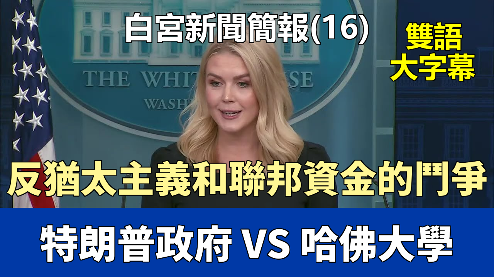

{% video youtube:F-Smx_2zsR8 width:100% autoplay:0 %}


### 【中英文双语脚本】

Good afternoon, everybody.
大家下午好。
I apologize for my tardiness, but I came directly from the Oval.
我爲我的遲到道歉，但我剛從橢圓形辦公室直接過來。
I have some newsy updates to share from the President, which I know you all very much value and appreciate.
我有一些來自總統的新消息要分享，我知道你們都非常重視和欣賞。
So let's get to it.
那麼，我們開始吧。
The President promised millions of Christians across the country on the campaign trail that he would create a White House faith office when he returned to the White House,
總統在競選期間向全國數百萬基督徒承諾，他重返白宮後將設立一個白宮信仰辦公室，
and he has delivered on that promise.
他已經兌現了這一承諾。
The White House faith office has put together an extraordinary week-long celebration currently underway for Holy Week ahead of Easter Sunday.
白宮信仰辦公室組織了一場非凡的爲期一週的慶祝活動，目前正在進行中，以迎接復活節主日之前的聖周。
The President signed a Holy Week proclamation, filmed a special presidential video message,
總統簽署了聖周公告，拍攝了特別的總統視頻信息，
and will be hosting a pre-Easter dinner tomorrow night and a White House staff Easter worship service on Thursday.
並將在明晚舉辦復活節前晚宴，週四舉辦白宮工作人員復活節禮拜儀式。
The President and the First Lady are honored to continue the tradition of the White House Easter egg roll, which will take place on the South Lawn next Monday.
總統和第一夫人很榮幸能延續白宮復活節滾彩蛋的傳統，活動將於下週一在南草坪舉行。
In other news, President Trump is turning America into a manufacturing superpower again.
另外的消息是，特朗普總統正在讓美國再次成爲製造業超級大國。
Yesterday, there was a monumental announcement by Nvidia, one of the largest companies in the world.
昨天，全球最大公司之一的英偉達發佈了一項重大公告。
This is just the latest example.
這只是最新的例子。
For the first time ever, chip-making giant Nvidia will produce AI supercomputers entirely in the United States
芯片製造巨頭英偉達將首次完全在美國生產人工智能超級計算機，
as part of its pledge to produce $50 billion worth of AI infrastructure in our country over the next four years.
這是其承諾未來四年在我國生產價值 500 億美元人工智能基礎設施的一部分。
With their manufacturing partners, they have commissioned more than a million square feet of manufacturing space
他們與其製造夥伴一起，已經委託了超過一百萬平方英尺的製造空間，
to build and test Nvidia Blackwell chips in the great state of Arizona and AI supercomputers in the great state of Texas.
用於在偉大的亞利桑那州建造和測試英偉達 Blackwell 芯片，並在偉大的德克薩斯州建造人工智能超級計算機。
Nvidia's founder and CEO Jensen Huang touted how the engines of the world's AI infrastructure are being built in the United States for the first time.
英偉達創始人兼首席執行官黃仁勳宣揚了世界人工智能基礎設施的引擎如何首次在美國構建。
This is the Trump effect.
這就是特朗普效應。
This follows trillions in other U.S. investments announced already,
在此之前，已經宣佈了數萬億美元的其他美國投資，
including $500 billion from Apple in U.S.-based manufacturing and training, $100 billion from TSMC in U.S.-based chips manufacturing,
包括蘋果在美國的製造業和培訓投資 5000 億美元，臺積電在美國的芯片製造業投資 1000 億美元，
and the $500 billion private investment led by OpenAI, Oracle, and SoftBank in artificial intelligence infrastructure.
以及由 OpenAI、甲骨文和軟銀領投的人工智能基礎設施 5000 億美元私人投資。
Under President Trump, we're going to produce the cars, the ships, the chips, the airplanes, minerals, and medicines that we need right here in America
在特朗普總統領導下，我們將在美國本土，
at the hands of American workers.
由美國工人生產我們需要的汽車、船舶、芯片、飛機、礦產和藥品。
On the border, President Trump continues to break records and protect our homeland.
在邊境問題上，特朗普總統繼續打破記錄並保護我們的家園。
According to CBP, border patrol apprehensions along the southwest border for the entire month of March 2025
根據美國海關和邊境保護局的數據，2025 年 3 月整個月在西南邊境的邊境巡邏逮捕人數
were lower than the first two days of March 2024 under Joe Biden.
低於喬·拜登執政下 2024 年 3 月的前兩天。
Incredible law enforcement officers are arresting violent illegal aliens from American communities every day.
令人難以置信的執法人員每天都在美國社區逮捕暴力的非法外國人。
Here are a few examples from the latest ICE report, which I received this morning.
以下是我今天早上收到的最新 ICE 報告中的幾個例子。
ICE Los Angeles arrested a 54-year-old citizen of Mexico convicted of rape by threat, sodomy with a person under 14 years, and kidnapping in San Jose, California.
洛杉磯移民與海關執法局逮捕了一名 54 歲的墨西哥公民，他在加利福尼亞州聖何塞被判犯有威脅強姦罪、與 14 歲以下人士進行雞姦罪以及綁架罪。
ICE Houston has arrested a 23-year-old citizen of Mexico convicted of predatory criminal sexual assault of a child in Cook County, Illinois.
休斯頓移民與海關執法局逮捕了一名 23 歲的墨西哥公民，他在伊利諾伊州庫克縣被判犯有掠奪性兒童性侵犯罪。
ICE Houston arrested a 64-year-old citizen of Honduras convicted of murder in Los Angeles County, California.
休斯頓移民與海關執法局逮捕了一名 64 歲的洪都拉斯公民，他在加利福尼亞州洛杉磯縣被判犯有謀殺罪。
ICE Chicago arrested a 49-year-old citizen of Guatemala convicted of assault and arson in Prince William County, Virginia, not far from here.
芝加哥移民與海關執法局逮捕了一名 49 歲的危地馬拉公民，他在離此地不遠的弗吉尼亞州威廉王子縣被判犯有襲擊和縱火罪。
ICE Denver arrested a 36-year-old citizen of Mexico who is registered as a sex offender and has been convicted of sexual assault of a child in Lake County, Colorado.
丹佛移民與海關執法局逮捕了一名 36 歲的墨西哥公民，他被登記爲性犯罪者，並在科羅拉多州萊克縣被判犯有兒童性侵犯罪。
ICE Baltimore arrested a 50-year-old citizen of China convicted of sex trafficking in Bel Air, Maryland.
巴爾的摩移民與海關執法局逮捕了一名 50 歲的中國公民，他在馬里蘭州貝爾艾爾被判犯有性販運罪。
ICE Boston arrested a 46-year-old citizen of Jamaica convicted of three counts of rape of a child
波士頓移民與海關執法局逮捕了一名 46 歲的牙買加公民，他被判犯有三項強姦兒童罪
and two counts of indecent assault and battery of a child under 14 in Boston, Massachusetts.
以及兩項在馬薩諸塞州波士頓對 14 歲以下兒童進行猥褻攻擊和毆打的罪名。
President Trump and our administration will not rest until every single violent, illegal alien is removed from our country.
特朗普總統和我們的政府不會休息，直到每一個暴力的非法外國人被驅逐出我們的國家。
The safety of the American people is too important to settle for anything less.
美國人民的安全太重要了，絕不能有任何妥協。
On that note, the Democrat and media outrage over the deportation of Abrego Garcia, an MS-13 El Salvadorian, an illegal alien criminal who is hiding in Maryland,
關於這一點，民主黨和媒體對 Abrego Garcia 被驅逐出境的憤怒，他是一名 MS-13 薩爾瓦多人，一個藏匿在馬里蘭州的非法外籍罪犯，
has been nothing short of despicable.
簡直是卑鄙無恥。
Based on the sensationalism of many of the people in this room, you would think we deported a candidate for Father of the Year.
根據這個房間裏許多人的聳人聽聞的說法，你會以爲我們驅逐了一位年度父親獎的候選人。
That's because, unfortunately, many in this country care more about this quote-unquote Maryland father, an illegal alien MS-13 gang member,
那是因爲，不幸的是，這個國家的許多人更關心這位所謂的“馬里蘭父親”，一個非法的 MS-13 幫派成員，
than a Maryland mother and an American citizen who was brutally murdered at the hands of a different illegal alien.
而不是一位馬里蘭州的母親和美國公民，她被另一名非法外國人殘忍殺害。
Of course, I am referring to Rachel Morin.
當然，我指的是雷切爾·莫林。
And if you didn't see yesterday, a Maryland jury found illegal alien Victor Antonio Martinez Hernandez guilty of murdering Rachel Morin in August of 2023.
如果你昨天沒看到，馬里蘭州的一個陪審團裁定非法外國人維克多·安東尼奧·馬丁內斯·埃爾南德斯於 2023 年 8 月謀殺雷切爾·莫林罪名成立。
She was a 37-year-old mother of five who was jogging in an otherwise safe community northeast of Baltimore
她是一位 37 歲的五個孩子的母親，當時正在巴爾的摩東北部一個原本安全的社區慢跑，
when this monster ambushed, strangled, and beat her to death before stuffing her brutalized body in a tunnel drain.
結果這個怪物伏擊、勒死並將她毆打致死，然後把她飽受摧殘的屍體塞進了一個隧道排水管。
The Morin family finally got justice yesterday, but they will never get Rachel back.
莫林一家昨天終於得到了正義，但他們永遠也無法讓雷切爾回來了。
Our hearts go out to Rachel's family, her five children, and her mother, Patty, who has suffered the unimaginable loss of her daughter.
我們向雷切爾的家人、她的五個孩子以及她的母親帕蒂表示慰問，她承受了失去女兒的難以想象的痛苦。
In case you missed it last week, President Trump signed a National Security Presidential Memorandum
以防你上週錯過了，特朗普總統簽署了一份國家安全總統備忘錄，
directing federal agencies administering federal land on the border to make land available to the Defense Department in a new national defense area.
指示管理邊境聯邦土地的聯邦機構將土地提供給國防部，用於一個新的國防區域。
This followed the President's Day One Executive Order, committing his administration to marshal all available resources and authorities
在此之前，總統發佈了“第一天”行政命令，承諾其政府將調動所有可用資源和權力，
to stop the unprecedented flood of illegal aliens into our country and to obtain complete operational control of the borders of the United States of America.
以阻止前所未有的非法外國人涌入我們國家，並獲得對美利堅合衆國邊境的完全行動控制權。
Once again, the President is fulfilling another key promise.
總統再次履行了另一項關鍵承諾。
This new national defense area spans more than 170 miles across our border in New Mexico,
這個新的國防區域橫跨我們在新墨西哥州的邊境超過 170 英里，
but in the coming weeks, this administration will add more than 90 miles in the state of Texas.
但在未來幾周內，本屆政府將在德克薩斯州增加超過 90 英里。
This national defense area will enhance our ability to detect, interdict, and prosecute the illegal aliens, criminal gangs, and terrorists
這個國防區域將增強我們探測、攔截和起訴非法外國人、犯罪團伙和恐怖分子的能力，
who were able to invade our country without consequence for the past four years under the Biden administration.
這些人在過去四年拜登政府執政期間能夠毫無後果地入侵我們的國家。
It will also bolster our defenses against fentanyl and other dangerous narcotics that have been poisoning our communities.
它還將加強我們對芬太尼和其他一直毒害我們社區的危險麻醉品的防禦。
With all of this work being done to make America great again, we continue to see a positive response from the American public.
隨着所有這些讓美國再次偉大的工作正在進行，我們繼續看到美國公衆的積極反應。
A brand new poll published from the Daily Mail and JL Partners this morning found that President Trump's approval rating is at an all-time high.
今天早上《每日郵報》和 JL Partners 發佈的一項全新民意調查發現，特朗普總統的支持率達到了歷史最高水平。
That's because the President is working tirelessly to keep his promises to the American people, as I just saw him doing today in the Oval Office.
那是因爲總統正在不懈地努力履行他對美國人民的承諾，就像我今天在橢圓形辦公室看到他所做的那樣。
We have a reporter in our new media seat today, Matthew Foldy, who is the editor-in-chief of the Washington Reporter.
今天我們的新媒體席位上有一位記者，馬修·福爾迪，他是《華盛頓報道者》的主編。
I like your boots, Matt.
我喜歡你的靴子，馬特。
Washington Reporter is a new, fast-growing outlet that breaks stories about legislation and interviews leaders in Congress and across the administration.
《華盛頓報道者》是一家新興的、快速發展的媒體機構，報道有關立法的新聞，並採訪國會和整個政府的領導人。
The publication's readership includes the highest levels of business and government.
該刊物的讀者羣包括商界和政界的最高層人士。
And with that, please kick us off, Matt.
那麼，請開始吧，馬特。
And we've interviewed you as well.
我們也採訪過你。
So Caroline, thanks so much for having me here on behalf of our readership and the millions of Americans
卡羅琳，非常感謝你邀請我來到這裏，我代表我們的讀者以及數百萬美國人，
who I think appreciate what you're doing with the new media seat here and making this a more accessible briefing room.
我想他們很欣賞你在這裏設立新媒體席位所做的工作，讓這個簡報室變得更容易進入。
I'm curious, with Harvard, we saw the Trump administration today announce it's cutting around $2 billion in funds from Harvard
我很好奇，關於哈佛大學，我們看到特朗普政府今天宣佈削減哈佛大學約 20 億美元的資金，
because the campus has serious problems with violence and with anti-Semitism.
因爲該校園存在嚴重的暴力和反猶太主義問題。
We saw former President Obama side with Harvard, which rejected the Trump administration's demands.
我們看到前總統奧巴馬站在哈佛一邊，哈佛拒絕了特朗普政府的要求。
I'm curious, where does the administration see this going with Harvard and with other colleges and universities in America
我很好奇，政府認爲哈佛以及美國其他學院和大學的情況會如何發展，
that are refusing to reform in the wake of the sort of craziness that we've seen take over some of them?
這些學校在我們看到的那種瘋狂席捲其中一些之後拒絕改革？
Thank you, Matt, for being here, and thanks for the question.
謝謝你，馬特，感謝你來到這裏，也感謝你的提問。
When it comes to Harvard, the President's position on this is grounded in common sense.
在哈佛問題上，總統的立場是基於常識的。
In the basic principle that Jewish American students or students of any faith should not be illegally harassed and targeted on our nation's college campuses.
基於一個基本原則，即猶太裔美國學生或任何信仰的學生都不應在我國大學校園內受到非法騷擾和針對。
And we unfortunately saw that illegal discrimination take place on the campus of Harvard.
不幸的是，我們看到這種非法歧視發生在哈佛校園。
There are countless examples to prove it, particularly with the stunning confession by then Harvard President Claudine Gay,
有無數的例子可以證明這一點，尤其是當時哈佛校長克勞丁·蓋伊令人震驚的供述，
who said that bullying and harassment depended on the context.
她說欺凌和騷擾取決於具體情況。
The President at that time made it clear to the American public he was not going to tolerate illegal harassment and anti-Semitism taking place in violation of federal law.
當時的總統向美國公衆明確表示，他不會容忍違反聯邦法律的非法騷擾和反猶太主義行爲發生。
So the President made it clear to Harvard, follow federal law, no longer break Title VI,
所以總統向哈佛明確表示，遵守聯邦法律，不再違反第六章，
which was passed by Congress to ensure no student can be discriminated against on the basis of race, and you will receive federal funding.
該法案由國會通過，以確保沒有學生因種族而受到歧視，這樣你們就能獲得聯邦資助。
Unfortunately, Harvard has not taken the President or the administration's demands seriously.
不幸的是，哈佛沒有認真對待總統或政府的要求。
All the President is asking is this: don't break federal law, and then you can have your federal funding.
總統所要求的就是：不要違反聯邦法律，然後你就可以得到你的聯邦資助。
I think the President is also raising a good question.
我認爲總統也提出了一個好問題。
More than $2 billion out the door to Harvard when they have a more than $50 billion endowment.
給哈佛超過 20 億美元，而他們擁有超過 500 億美元的捐贈基金。
Why are the American taxpayers subsidizing a university that has billions of dollars in the bank already?
爲什麼美國納稅人要補貼一所銀行裏已經有數十億美元的大學？
And we certainly should not be funding a place where such grave anti-Semitism exists.
我們當然不應該資助一個存在如此嚴重反猶太主義的地方。
I'm curious, you've just mentioned Rachel Morin.
我很好奇，你剛纔提到了雷切爾·莫林。
I'm a Maryland man and I think most Marylanders appreciate what you were saying today.
我是馬里蘭人，我想大多數馬里蘭人都贊同你今天所說的話。
You've seen Chris Van Hollen, who was Rachel Morin's senator, basically threatening to fly to El Salvador
你看到克里斯·範霍倫，他是雷切爾·莫林的參議員，基本上威脅要飛往薩爾瓦多，
to press for the release of someone who was in America illegally.
爲一個非法在美國的人的釋放施壓。
Not as much from him about Rachel Morin's horrific murder and the verdict that was, I think, rightly reached yesterday.
而關於雷切爾·莫林的可怕謀殺案以及我認爲昨天正確達成的判決，他卻沒怎麼說。
What does the administration think about the priorities we're seeing from Senate Democrats
政府對我們看到的參議院民主黨人的優先事項有何看法，
in terms of illegal immigrants instead of the work that agencies like ICE and DHS are doing with the Trump administration?
他們關注非法移民，而不是像 ICE 和 DHS 這樣的機構與特朗普政府正在做的工作？
It's mind-boggling, the priorities of the modern-day Democrat Party.
現代民主黨的優先事項真是令人難以置信。
I think it's atrocious that you have Democrats in Congress on Capitol Hill who swear an oath to protect their constituents and to serve them in Washington, D.C.,
我認爲這太殘忍了，國會山上的民主黨議員宣誓保護他們的選民並在華盛頓特區爲他們服務，
spending more time defending illegal immigrant gang members than their own constituents and law-abiding American citizens like Rachel Morin.
卻花費更多時間爲非法移民幫派成員辯護，而不是爲他們自己的選民和像雷切爾·莫林這樣守法的美國公民辯護。
I saw the President personally on the campaign trail and I continue to see him in his role as President of the United States put American families first,
我在競選活動中親眼看到總統，並繼續看到他作爲美國總統將美國家庭放在首位，
reach out to the victims, the families of victims at the hands of illegal immigrant crime,
接觸受害者，那些因非法移民犯罪而受害的家庭，
and frankly the actions and the words of the Democrat Party prove they could not care less about the American public.
坦率地說，民主黨的行動和言辭證明他們根本不關心美國公衆。
Maybe if they did, they'd see a bit higher approval ratings right now.
也許如果他們關心的話，他們現在的支持率會高一些。
Thanks for being here with us today. Peter.
感謝你今天和我們在一起。彼得。
Thank you, Caroline.
謝謝你，卡羅琳。
To follow up on something that you just said, why do Ivy League schools get so much federal funding?
接着你剛纔說的話題，爲什麼常春藤盟校能獲得如此多的聯邦資助？
It's a very good question and it's a question the President has obviously raised in his discussions and negotiations
這是一個很好的問題，總統顯然在他與哈佛、哥倫比亞以及許多其他常春藤盟校機構的
with not just Harvard but also Columbia and many other Ivy League institutions.
討論和談判中提出過這個問題。
We have the anti-Semitism task force, which the President promised and delivered on.
我們有反猶太主義特別工作組，這是總統承諾並兌現的。
The anti-Semitism task force is across the government, representatives from various federal agencies who meet on a weekly basis
反猶太主義特別工作組遍佈政府各部門，來自各個聯邦機構的代表每週開會，
to discuss the question that you just raised.
討論你剛纔提出的問題。
I think a lot of Americans are wondering why their tax dollars are going to these universities
我想很多美國人都在想，爲什麼他們的稅款會流向這些大學，
when they are not only indoctrinating our nation's students but also allowing such egregious, illegal behavior to occur.
而這些大學不僅在給我們的學生灌輸思想，還允許如此惡劣、非法的行爲發生。
To follow up on immigration, deporting American citizens to Central American prisons, is it legal or do you need to change the law to do it?
接着談移民問題，將美國公民驅逐到中美洲監獄，這合法嗎？還是需要修改法律才能這樣做？
Well it's another question that the President has raised.
嗯，這是總統提出的另一個問題。
It's a legal question that the President is looking into.
這是一個總統正在研究的法律問題。
He talked about this yesterday with his meeting with President Bukele in the Oval Office.
他昨天在橢圓形辦公室與布克爾總統會面時談到了這個問題。
He would only consider this, if legal, for Americans who are the most violent, egregious, repeat offenders of crime
他只會在合法的情況下考慮對那些最暴力、最惡劣、屢次犯罪的美國人採取這種措施，
who nobody in this room wants living in their communities.
也就是這個房間裏沒人希望他們住在自己社區的人。
Then there's this CHNV thing.
然後是這個 CHNV 的事情。
President Biden let more than 530,000 people from Cuba, Haiti, Nicaragua, Venezuela into the U.S. with this CHNV program.
拜登總統通過這個 CHNV 項目讓超過 53 萬來自古巴、海地、尼加拉瓜、委內瑞拉的人進入美國。
He did it with the stroke of a pen and now a judge will not let President Trump undo it with the stroke of a pen.
他大筆一揮就做到了，現在一個法官卻不允許特朗普總統大筆一揮來撤銷它。
So are you guys going to give all 530,000 plus people individual deportation hearings or are you just going to try to deport them?
那麼你們是打算給所有這 53 萬多人進行單獨的驅逐聽證會，還是就直接嘗試驅逐他們？
I spoke to White House Counsel's Office about this this morning because obviously another rogue district court judge
我今天早上和白宮法律顧問辦公室談了這件事，因爲顯然又有一個流氓地方法院法官
is trying to block the administration's mass deportation efforts with this latest injunction.
正試圖用這個最新的禁令來阻止政府的大規模驅逐行動。
We will fight this in the court of law and we will ensure that every individual who illegally entered our country
我們將在法庭上對此進行抗爭，我們將確保每一個非法進入我們國家的人，
and was really taken advantage of by the previous administration because they abused the parole system in this country
並且確實被前任政府利用的人，因爲他們濫用了這個國家的假釋制度，
to fast-track what they called legal status for these illegal immigrants.
來爲這些非法移民快速辦理他們所謂的合法身份。
And they completely abused our legal system.
他們完全濫用了我們的法律體系。
Many of these paroled individuals were then given temporary protective status,
許多這些被假釋的人隨後獲得了臨時保護身份，
which the intention of that TPS was only supposed to be used in times of war or storm or destruction in the home countries of these migrants.
而臨時保護身份（TPS）的初衷本應只在這些移民的母國發生戰爭、風暴或破壞時使用。
It was completely abused.
它被完全濫用了。
These migrants came here for economic reasons and they illegally entered our country and the President is not going to tolerate that.
這些移民是出於經濟原因來到這裏的，他們非法進入了我們的國家，總統不會容忍這種情況。
And so we will continue to focus on deporting as many individuals as we can. Jennifer.
因此，我們將繼續專注於盡可能多地驅逐個人。詹妮弗。
One on tariffs and one on Russia.
一個關於關稅，一個關於俄羅斯。
Can you give us any sort of an update on which deals are in hand or are close? Which countries are reaching a deal on tariffs?
你能告訴我們哪些協議已經達成或接近達成嗎？哪些國家正在就關稅達成協議？
And then on Russia, can you give us an update on what the agreement was with Russia?
然後關於俄羅斯，你能告訴我們與俄羅斯達成的協議是什麼嗎？
The President yesterday said that he thinks we'll be seeing some very good deals very soon.
總統昨天說他認爲我們很快就會看到一些非常好的協議。
Can you talk a little bit about what Russia agreed to?
你能談談俄羅斯同意了什麼嗎？
Sure.
當然。
I don't want to get ahead of our United States Trade Representative and Secretary of Commerce, and the Secretary of Treasury,
我不想搶在美國貿易代表、商務部長和財政部長，
all the great individuals who are working incredibly hard to cut these good trade deals.
所有這些爲達成這些良好貿易協議而辛勤工作的偉大人物之前（宣佈消息）。
And the President is deeply involved in this as well.
總統也深入參與其中。
He has made it clear to his trade team, he wants to personally sign off on all of these deals too.
他已經向他的貿易團隊明確表示，他也希望親自簽署所有這些協議。
And so I don't want to get ahead of them on announcements.
所以我不想在他們宣佈之前搶先發布消息。
But obviously as you've heard from numerous administration officials, there have been many talks with countries.
但顯然，正如你從許多政府官員那裏聽到的，我們已經與許多國家進行了多次會談。
We've had more than 15 deals, pieces of paper put on the table, proposals that are actively being considered.
我們已經有超過 15 項協議、擺在桌面上的文件、正在積極考慮的提案。
And as we've said consistently, more than 75 countries have reached out. So there's a lot of work to do.
正如我們一直所說，已有超過 75 個國家與我們聯繫。所以還有很多工作要做。
We very much understand that. But we do believe that we can announce some deals very soon.
我們非常理解這一點。但我們確實相信很快就能宣佈一些協議。
And then on Russia, can you say did Russia agree to anything with Special Envoy Steve Witkoff?
然後關於俄羅斯，你能說俄羅斯是否與特使史蒂夫·威特科夫達成了任何協議？
I don't want to get ahead of those negotiations as well.
我也不想在那些談判有結果之前透露信息。
What I can tell you is that a productive conversation was had.
我能告訴你的是進行了一次富有成效的對話。
As the presidential envoy Steve Witkoff said last night, he believes that Russia wants to end this war, and the President believes that as well.
正如總統特使史蒂夫·威特科夫昨晚所說，他相信俄羅斯希望結束這場戰爭，總統也相信這一點。
There is incentive for Russia to end this war.
俄羅斯有結束這場戰爭的動機。
And perhaps that could be economic partnerships with the United States. But we need to see a ceasefire first.
也許這可能是與美國的經濟夥伴關係。但我們首先需要看到停火。
And the President and the presidential envoy Witkoff made that very clear to the Russians. Gabe.
總統和總統特使威特科夫已經非常明確地向俄國人說明了這一點。蓋比。
Thank you, Caroline.
謝謝你，卡羅琳。
And I also want to thank your press office for releasing that information that you cited up there regarding the ICE arrests over the last couple of days.
我還要感謝你的新聞辦公室發佈了你剛纔引用的關於過去幾天 ICE 逮捕行動的信息。
I have them right here, but what I might ask is why not release the same information for those who were deported to El Salvador?
我這裏就有這些信息，但我想問的是，爲什麼不發佈關於那些被驅逐到薩爾瓦多的人的同樣信息呢？
Well first of all, the information was released by the Department of Homeland Security.
嗯，首先，這些信息是由國土安全部發布的。
The individuals on the flights to El Salvador are foreign terrorists, and those are counter-terrorism operations.
飛往薩爾瓦多的航班上的人是外國恐怖分子，那些是反恐行動。
They are much different than the arrests and final orders of removal that you see on a day-to-day basis that law enforcement agents are conducting around the country.
這與你日常看到的執法人員在全國範圍內進行的逮捕和最終驅逐令有很大不同。
That information, to that detail, was not released by DHS?
那些信息，具體到那種程度，不是由國土安全部發布的嗎？
I just told you the reason.
我剛纔告訴過你原因了。
It was a counter-terrorism operation, a deportation of foreign terrorists, not illegal alien criminals who have been convicted of heinous crimes living in our American communities.
這是一次反恐行動，驅逐的是外國恐怖分子，而不是那些在我們美國社區生活、被判犯有滔天罪行的非法外籍罪犯。
Two different things. Foreign terrorists, illegal immigrant criminal.
兩回事。外國恐怖分子，非法移民罪犯。
Two different things, two different definitions. You should look them up. Christian, go ahead.
兩回事，兩種不同的定義。你應該查一下。克里斯蒂安，請講。
Yeah, thanks Caroline.
是的，謝謝卡羅琳。
Does the President support raising the corporate tax rate to pay for all these other tax cuts he wants to see move through Congress?
總統是否支持提高公司稅率來支付他希望在國會通過的所有其他減稅措施？
Look, I've seen this idea proposed. I've heard this idea discussed,
聽着，我看到過這個提議。我聽到過這個想法被討論，
but I don't believe the President has made a determination on whether he supports it or not.
但我不認爲總統已經決定是否支持它。
And then secondly, do you have any information on the status of Eden Alexander?
其次，你是否有關於伊登·亞歷山大狀況的任何信息？
Hamas says they lost contact with the unit guarding him following an Israeli airstrike earlier today.
哈馬斯稱，在今天早些時候以色列的一次空襲之後，他們與看守他的部隊失去了聯繫。
I don't have updates. I have not seen that report, but I can certainly check in with our National Security Council.
我沒有最新消息。我沒有看到那份報告，但我肯定可以向我們的國家安全委員會覈實。
I have spoken to the President about Eden Alexander, and he's made it very clear to our national security team that finding him is a priority,
我已經和總統談過伊登·亞歷山大的事，他已經非常明確地向我們的國家安全團隊表示，找到他是優先事項，
but unfortunately I don't have any updates to share.
但不幸的是，我沒有任何最新消息可以分享。
But it's a very important matter, and certainly we can check in. Sure.
但這是一個非常重要的問題，我們肯定會去核實。當然。
Hi.
嗨。
Hi.
嗨。
How concerned is the President that a federal judge could hold a Trump administration official in contempt of court for defying deportation orders?
總統有多擔心聯邦法官會因藐視驅逐令而判特朗普政府官員藐視法庭罪？
We are complying with all court orders.
我們正在遵守所有法院命令。
So I see what you're trying to do there with that question, but we're very confident that every action taken by this administration is within the confines of the law,
所以我明白你那個問題的意圖，但我們非常有信心，本屆政府採取的每一項行動都在法律允許的範圍內，
and we continue to comply with the court's orders, and you have seen that.
我們繼續遵守法院的命令，這一點你已經看到了。
And the President made that clear yesterday in the Oval Office with President Bukele. Sure.
總統昨天在橢圓形辦公室與布克爾總統會面時也明確了這一點。當然。
Thanks, Caroline.
謝謝，卡羅琳。
Could you, just going back to El Salvador, could you just explain to us a little bit more about the legal basis on which you may be able to send U.S. citizens to prison there?
你能否，回到薩爾瓦多的話題，再向我們解釋一下，你們可能將美國公民送往那裏監獄的法律依據是什麼？
I know you said that President Trump is looking at it, but can you explain to us a little bit more about how that might be possible?
我知道你說過特朗普總統正在研究這個問題，但你能否再向我們解釋一下這怎麼可能實現？
We're looking at it, and when I have more for you to share, I certainly will. Sure.
我們正在研究，當我有了更多可以分享的信息時，我一定會告訴你們。當然。
Hi.
嗨。
Hey.
嘿。
Still going off the El Salvador questions.
還是關於薩爾瓦多的問題。
Yesterday in the Oval Office, administration officials made it very clear that El Salvador is responsible for Mr. Abrego Garcia,
昨天在橢圓形辦公室，政府官員非常明確地表示薩爾瓦多對阿布雷戈·加西亞先生負責，
yet El Salvador's President said we are, we're not going to do anything with him.
但薩爾瓦多總統說我們不會對他採取任何行動。
So my question is, who is responsible for this man and where he's going to end up?
所以我的問題是，誰對這個人負責，他最終會去哪裏？
Well, no. First of all, President Bukele said that he is not going to smuggle a foreign terrorist back into the United States of America,
嗯，不是的。首先，布克爾總統說了，他不會把一個外國恐怖分子偷運回美利堅合衆國，
as many in this room in the Democrat Party seemingly want him to do.
就像這個房間里民主黨的許多人似乎希望他做的那樣。
Abrego Garcia was a foreign terrorist. He is an MS-13 gang member. He was engaged in human trafficking. He illegally came into our country.
阿布雷戈·加西亞是一名外國恐怖分子。他是 MS-13 幫派成員。他參與了人口販賣。他非法進入了我們的國家。
And so deporting him back to El Salvador was always going to be the end result.
所以把他驅逐回薩爾瓦多一直都是最終的結果。
There is never going to be a world in which this is an individual who is going to live a peaceful life in Maryland
永遠不可能存在這樣一個世界：這個人能在馬里蘭州過上平靜的生活，
because he is a foreign terrorist and an MS-13 gang member.
因爲他是一個外國恐怖分子和 MS-13 幫派成員。
Not only have we confirmed that, President Bukele yesterday in the Oval Office confirmed that as well.
不僅我們證實了這一點，布克爾總統昨天在橢圓形辦公室也證實了這一點。
So he went back to his home country where he will face consequences for his gang affiliation and his engagement in human trafficking.
所以他回到了他的祖國，在那裏他將因其幫派關係和參與人口販賣而面臨後果。
I'm not sure what is so difficult about this for everyone in the media to understand.
我不確定爲什麼媒體中的每個人都這麼難理解這一點。
And it's appalling, truly appalling, that there has been so much time covering this alleged human trafficker and this gang member, MS-13 gang member.
而且，花了這麼多時間報道這個所謂的人口販子和這個幫派成員，MS-13 幫派成員，這真是令人震驚，確實令人震驚。
It's truly striking to me. Karen.
這真的讓我感到震驚。凱倫。
Thank you, Caroline. The President was posting on Truth Social today about helping American farmers.
謝謝你，卡羅琳。總統今天在 Truth Social 上發帖談論幫助美國農民。
And last week in his Cabinet meeting he was talking about a plan to work with farmers, to retain workers who are in the U.S. illegally,
上週在他的內閣會議上，他談到了一個與農民合作的計劃，以留住非法在美國的工人，
provided that they leave and then come back through what he said would be a legal process.
條件是他們先離開，然後通過他所說的合法程序回來。
Can you give details on what that would look like, how many workers he's talking about, how long a plan like that would take to implement,
你能提供關於這個計劃具體細節嗎，比如它會是什麼樣子，他指的是多少工人，實施這樣的計劃需要多長時間，
and the timeline for more details on getting this actually to implementation?
以及獲得更多關於實際實施細節的時間表？
I can check in with our immigration and our policy team and get you some more details on that, Karen.
我可以和我們的移民和政策團隊覈實一下，然後給你提供更多細節，凱倫。
And is he, is this something he wants to roll out soon? I mean, he was talking back and forth with Secretary Rawlins. Right.
他是不是想盡快推出這個計劃？我的意思是，他當時在和羅林斯部長來回討論。是的。
This is kind of imminent that he wants to do this.
這看起來像是他馬上就要做的事情。
Yeah, look, the President is in constant communication with all of his Cabinet Secretaries, particularly Secretary Rawlins,
是的，聽着，總統一直與他所有的內閣部長保持溝通，特別是羅林斯部長，
who has the backs of American farmers and ranchers.
她支持美國的農民和牧場主。
It's something that he spoke about with her in the front of all the cameras in the Cabinet Room.
這是他在內閣會議室裏當着所有攝像機和她談論過的事情。
But I'll check in with not only our immigration team, but also with USDA and we'll get you an answer. Jonathan.
但我不僅會和我們的移民團隊覈實，還會和美國農業部覈實，然後給你答覆。喬納森。
Hi, Caroline. Hi. It's good to see you in here. You too.
嗨，卡羅琳。嗨。很高興在這裏見到你。你也是。
The President has long said that it would be an abuse of power for a President to direct prosecutors to investigate him.
總統長期以來一直表示，總統指示檢察官調查自己是濫用權力。
Last week, President Trump explicitly directed the Justice Department to scrutinize Chris Krebs to see if it can find any evidence of criminal wrongdoing.
上週，特朗普總統明確指示司法部審查克里斯·克雷布斯，看是否能找到任何犯罪行爲的證據。
How is that not an abuse of power to direct the Justice Department to look into an individual, a named individual?
指示司法部調查一個具體的、指名道姓的個人，這怎麼不算是濫用權力呢？
Look, the President signed that executive order.
聽着，總統簽署了那項行政命令。
It's the position of the President in this White House that it's well within his authority to do it.
這位總統在這個白宮的立場是，這樣做完全在他的權力範圍之內。
Otherwise, he wouldn't have signed it. And he signed it and that's his policy. Jeff, how are you doing?
否則，他就不會簽署它。他簽署了，這就是他的政策。傑夫，你好嗎？
Fine, thanks. Thanks, Caroline. A follow-up on Harvard.
很好，謝謝。謝謝，卡羅琳。一個關於哈佛的後續問題。
The President floated on Truth Social the possibility of removing tax-exempt status.
總統在 Truth Social 上提出了取消免稅地位的可能性。
How serious is that threat, and are other universities being considered?
這個威脅有多嚴重？是否也在考慮其他大學？
And then a follow-up question on foreign policy.
然後是一個關於外交政策的後續問題。
Can you give us an update on what the President hopes to come from the next round of talks with Iran?
你能告訴我們總統希望下一輪與伊朗的會談能取得什麼成果嗎？
Sure. First, when it comes to Harvard, as I said, the President has been quite clear they must follow federal law.
當然。首先，關於哈佛，正如我所說，總統已經非常明確地表示他們必須遵守聯邦法律。
He also wants to see Harvard apologize, and Harvard should apologize for the egregious anti-Semitism that took place on their college campus against Jewish American students.
他還希望看到哈佛道歉，哈佛應該爲在他們校園內發生的針對猶太裔美國學生的惡劣反猶太主義行爲道歉。
There were reports from professors about discriminatory behavior against Jewish students.
有教授報告稱存在針對猶太學生的歧視行爲。
Of course, you had the former President of the university saying bullying and harassment depends on the context.
當然，你們也聽到了該大學前校長說欺凌和騷擾取決於具體情況。
You also had an encampment on Harvard Yard that we all saw play out before the cameras.
你們還在哈佛園看到了一個營地，我們都在鏡頭前看到了這一切的發生。
The university failed to impose formal discipline on any students for this anti-Semitic conduct,
該大學未能對任何學生的這種反猶太行爲施加正式紀律處分，
including the occupation of a campus building and the disruption of classes with bullhorns.
包括佔領校園建築和用擴音器擾亂課堂。
The President believes Harvard should apologize to its Jewish American students for allowing such egregious behavior.
總統認爲哈佛應該爲其允許如此惡劣的行爲向其猶太裔美國學生道歉。
As for the tax-exempt status, I would defer you to the IRS for any updates.
至於免稅地位，我會建議你向國稅局瞭解最新情況。
I do want to answer your question on Iran, of course.
當然，我確實想回答你關於伊朗的問題。
The maximum pressure campaign on Iran continues, but as you know, the President has made it clear
對伊朗的最大壓力運動仍在繼續，但如你所知，總統已經明確表示，
he wants to see dialogue and discussion with Iran while making his directive about Iran never being able to obtain a nuclear weapon quite clear.
他希望與伊朗進行對話和討論，同時非常明確地指示伊朗永遠不能獲得核武器。
And the President spoke to the Sultan of Oman today, who helped facilitate these talks. I have a readout for all of you.
總統今天與幫助促成這些會談的阿曼蘇丹通了話。我爲你們準備了一份通話紀要。
He held a call with the Sultan of Oman today, and he thanked him for hosting the first direct meeting between the United States and Iran
他今天與阿曼蘇丹通了電話，感謝他主辦了美國和伊朗之間的首次直接會晤，
and emphasized the need for Iran to end its nuclear program through negotiations.
並強調伊朗需要通過談判結束其核計劃。
The two leaders also discussed the United States' ongoing operations against the Houthis
兩國領導人還討論了美國正在進行的針對胡塞武裝的行動，
and emphasized that the Houthis will pay a severe price until they end their attacks on maritime traffic in the Red Sea.
並強調胡塞武裝將付出沉重代價，直到他們停止對紅海海上交通的襲擊。
As you know, an additional negotiation between Steve Witkoff and Iran's representative has been scheduled for Saturday.
如你所知，史蒂夫·威特科夫與伊朗代表的另一場談判已安排在週六。
And since these are ongoing negotiations, I have nothing more to add on that. Can I come on Iran? Sure.
由於這些是正在進行的談判，我沒有更多要補充的了。我可以問關於伊朗的問題嗎？當然。
Thank you, Caroline.
謝謝你，卡羅琳。
When you said that the President said that Iran will never have nuclear weapons,
當你說總統說過伊朗永遠不會擁有核武器時，
is the focus on dismantling the entire nuclear program or just restricting enriched uranium or the missile program?
重點是拆除整個核計劃，還是僅僅限制濃縮鈾或導彈計劃？
The President does not want to see Iran have a nuclear program. He does not want Iran to obtain a nuclear weapon. He's been very clear about this.
總統不希望看到伊朗擁有核計劃。他不希望伊朗獲得核武器。他對此一直非常明確。
Shelby. Shelby, you have a seat today. I know. Stole it. Glad to see it.
謝爾比。謝爾比，你今天有座位了。我知道。偷來的。很高興看到。
Two quick ones on TikTok. First, is the President expecting to extend the TikTok ban that's now June 19th if China doesn't come to the table in time?
兩個關於 TikTok 的快問。首先，如果中國未能及時談判，總統是否期望延長目前定於 6 月 19 日到期的 TikTok 禁令？
Well, June 19th is a long way away, obviously. I think it's two months away. Two months is a long time.
嗯，6 月 19 日顯然還有很長一段時間。我想還有兩個月。兩個月是很長的時間。
And the Trump administration, as you have all seen, we work at Trump speed around here. We get a lot done. So definitely don't want to get ahead.
特朗普政府，正如你們都看到的，我們在這裏以特朗普速度工作。我們完成了很多事情。所以肯定不想操之過急。
The Vice President continues to lead these negotiations and talks. The President is involved and they're ongoing.
副總統繼續領導這些談判和會談。總統也參與其中，並且談判正在進行中。
And then the President previously said he'd consider reducing tariffs on China in order to get a TikTok deal done. Is that option still on the table?
然後，總統先前表示他會考慮降低對中國的關稅以達成 TikTok 協議。這個選項還在考慮之中嗎？
Look, the President has made his position on China quite clear, although I do have an additional statement that he just shared with me in the Oval Office.
聽着，總統已經非常明確地表明瞭他對中國的立場，儘管我確實還有一份他剛剛在橢圓形辦公室與我分享的額外聲明。
The ball is in China's court. China needs to make a deal with us. We don't have to make a deal with them.
球現在在中國那邊。中國需要和我們達成協議。我們不必和他們達成協議。
There's no difference between China and any other country, except they are much larger.
中國和其他任何國家沒有區別，只是他們更大。
And China wants what we have, what every country wants, what we have, the American consumer. Or to put it another way, they need our money.
中國想要我們擁有的東西，每個國家都想要我們擁有的東西，那就是美國消費者。或者換句話說，他們需要我們的錢。
So the President, again, has made it quite clear that he's open to a deal with China, but China needs to make a deal with the United States of America. Sure.
所以，總統再次非常明確地表示，他對與中國達成協議持開放態度，但中國需要與美利堅合衆國達成協議。當然。
On tariffs, yesterday in the Oval Office. Which outlet are you with? The Canadian Public Broadcaster. Oh, nice to see you. Thank you.
關於關稅，昨天在橢圓形辦公室。你是哪個媒體的？加拿大公共廣播公司。哦，很高興見到你。謝謝。
Yesterday in the Oval Office, President Trump suggested that there could be some help for automakers. I'm wondering what that looks like.
昨天在橢圓形辦公室，特朗普總統暗示可能會對汽車製造商提供一些幫助。我想知道那會是什麼樣子。
Is it tariff relief on the 25 percent tariffs that are in place right now or the new tariffs that are coming up in May on auto parts?
是減免目前實施的 25% 關稅，還是減免即將在 5 月份對汽車零部件徵收的新關稅？
And a second on Canada, if I may. Regarding President Trump's tone when it comes to Canada-U.S. relations.
如果可以的話，第二個問題關於加拿大。關於特朗普總統在加美關係上的語氣。
Canadians have noticed it's shifted a bit in the past few weeks.
加拿大人注意到過去幾周他的語氣有所轉變。
Ever since the election campaign started, he's stopped talking about Canada becoming the 51st state, at least publicly. I'm wondering if that's on purpose and why.
自從競選活動開始以來，他至少在公開場合不再談論加拿大成爲第 51 個州。我想知道這是故意的嗎？爲什麼？
I would reject the idea that the President's position on Canada has shifted.
我不同意總統對加拿大的立場已經改變的說法。
Perhaps he just hasn't been asked about Canada by questions from this group in the Oval Office, but they see him almost every day.
也許只是橢圓形辦公室裏的這羣人沒有問他關於加拿大的問題，但他們幾乎每天都見到他。
But the President still maintains his position on Canada.
但總統仍然堅持他對加拿大的立場。
The United States has been subsidizing Canada's national defense, and he believes that Canadians would benefit greatly from becoming the 51st state of the United States of America.
美國一直在補貼加拿大的國防開支，他相信加拿大人如果成爲美利堅合衆國的第 51 個州將大有裨益。
As for autos and auto parts, I don't have anything to read out for you there, but I think the point the President was making is flexibility,
至於汽車和汽車零部件，我沒有什麼可以向你宣讀的，但我認爲總統想要表達的重點是靈活性，
and he has flexibility when it comes to negotiations and talks.
他在談判和會談方面具有靈活性。
But ultimately, his goal in his fair trade deals that he is pursuing with many countries around the world is to put the American worker first.
但最終，他在與世界許多國家尋求的公平貿易協議中的目標是將美國工人放在首位。
And we had automakers and autoworkers here at the White House on Labor Day who believe in this President
我們在勞動節邀請了汽車製造商和汽車工人來到白宮，他們相信這位總統
and his negotiating ability to put them first and to bring those jobs back to the United States of America.
以及他將他們放在首位並將這些工作帶回美利堅合衆國的談判能力。
And the President's been very clear about that in his conversations with the automakers as well. Diana, go ahead.
總統在與汽車製造商的對話中也對此非常明確。戴安娜，請講。
Thanks, Caroline. One on Ukraine and one on China.
謝謝，卡羅琳。一個關於烏克蘭，一個關於中國。
On Ukraine, this past weekend Zelenskyy offered an invitation to President Trump, extending an offer for him to visit Ukraine.
關於烏克蘭，上週末澤連斯基向特朗普總統發出邀請，邀請他訪問烏克蘭。
Just wondering if there's any update on that. Has Trump seen that offer and what he's thinking about?
只是想知道是否有任何最新進展。特朗普看到那個邀請了嗎？他在想什麼？
I don't know. Actually, I haven't talked to the President about that, or if he saw Zelenskyy's offer, I'm sure he did.
我不知道。實際上，我還沒有和總統談論過這件事，或者他是否看到了澤連斯基的邀請，我肯定他看到了。
I haven't spoken to him about it. I can ask him what he thinks.
我還沒和他談過。我可以問問他怎麼想。
I certainly don't have any plans to share on a potential trip to Ukraine, though.
不過，我當然沒有任何關於可能訪問烏克蘭的計劃可以分享。
And then on China, this last week, Chinese officials were posting videos on social media sites depicting Trump, JD Vance, Elon Musk
然後關於中國，上週，中國官員在社交媒體網站上發佈視頻，描繪特朗普、JD 萬斯、埃隆·馬斯克
in AI-generated videos working in factories putting together Nike shoes and iPhones and products like that.
在人工智能生成的視頻中，在工廠裏組裝耐克鞋、iPhone 和類似產品。
Has the White House seen these videos? Do you guys have a response to that?
白宮看到這些視頻了嗎？你們對此有何迴應？
I have seen the videos. I'm not sure who made the videos or if we can verify the authenticity,
我看到了這些視頻。我不確定是誰製作了這些視頻，也不確定我們是否能覈實其真實性，
but whoever made it clearly does not see the potential of the American worker, the American workforce.
但無論誰製作了它，顯然都沒有看到美國工人、美國勞動力的潛力。
The President believes in the American people and he knows that we have the best, not only consumer base in the world, but also the best workforce in the world.
總統相信美國人民，他知道我們擁有世界上最好的，不僅是消費者基礎，也是最好的勞動力。
And that's why he's so focused on bringing investments home and shoring up our critical supply chains and bolstering our manufacturing here as well. Brett.
這就是爲什麼他如此專注於將投資帶回國內，鞏固我們關鍵的供應鏈，並支持我們這裏的製造業。佈雷特。
Thanks, Caroline. Would the President support a ban on members of Congress trading stocks?
謝謝，卡羅琳。總統會支持禁止國會議員交易股票嗎？
I'm certain that's something the President would be interested in looking at and I can ask him if he would support such a bill. Sure. Yes.
我確信這是總統會有興趣研究的事情，我可以問他是否會支持這樣的法案。當然。是的。
I have a question about the President's post from this morning on farmers. He asked farmers to be patient and just hold on.
我有一個關於總統今天早上關於農民的帖子的疑問。他要求農民保持耐心，堅持住。
But a lot of farmers that I've talked to in the last week or so have said, you know, they're in the middle of spring planting season
但我過去一週左右交談過的許多農民都說，你知道，他們正處於春耕季節，
and that a trade war makes everything sort of up in the air. What would his message to them be?
而貿易戰讓一切都懸而未決。他對他們有什麼信息要傳達？
And also, is there anything specifically planned to provide relief like in President Trump's last term? Yes.
另外，是否有什麼具體的計劃來提供像特朗普總統上個任期那樣的救濟？是的。
Well, relief is being considered. The Secretary of Agriculture, I know, has spoken to the President about that and, again, it's being considered.
嗯，正在考慮提供救濟。我知道農業部長已經和總統談過這件事，並且，再次強調，正在考慮中。
And as for the President's message to the farmers, he put it out himself. He could speak for himself much better than I can speak for him.
至於總統給農民的信息，他自己已經發布了。他比我更能爲自己說話。
And so I would just direct you to the statement he had telling the farmers again and reiterating his support for them and that he has their backs, which he certainly does.
所以我只會引導你去看他再次告訴農民並重申他對他們的支持以及他支持他們的聲明，他確實是這樣做的。
Kelly, in the back.
凱利，在後面。
Thanks, Caroline. Two questions.
謝謝，卡羅琳。兩個問題。
The first one, a Georgia man was just arrested over alleged threats to kill Director of National Intelligence Tulsi Gabbard.
第一個，一名佐治亞州男子剛剛因涉嫌威脅殺害國家情報總監圖爾西·加巴德而被捕。
Reportedly, there is now increased security around the FBI Deputy Director.
據報道，聯邦調查局副局長周圍現在的安保有所加強。
Can you talk about the level of threats against various administration officials and then a second one on Biden?
你能談談針對各級政府官員的威脅程度嗎？然後第二個問題關於拜登。
I'm sorry to hear that. I had not seen that report.
聽到這個消息我很難過。我沒有看到那份報告。
It's very unfortunate and obviously the White House, the President, and the entire administration condemn any threats of violence
這非常不幸，顯然白宮、總統以及整個政府譴責任何針對
against any administration officials or public officials on both sides of the aisle here in Washington, D.C.
華盛頓特區兩黨任何政府官員或公職人員的暴力威脅。
It shouldn't be tolerated and we commend the local law enforcement agencies for arresting this individual.
這是不能容忍的，我們讚揚當地執法機構逮捕了這個人。
But former President Biden, he's said to deliver his first major speech since leaving office tonight.
但是前總統拜登，據說他今晚將發表離任以來的首次重要演講。
He plans to talk about what I'm told will be Social Security under the current administration, closing of offices, longer wait times,
他計劃談論我被告知的現任政府下的社會保障問題，辦公室關閉，等待時間更長，
harder for seniors and people with disabilities to access their benefits. This is what Democrats have been saying today.
老年人和殘疾人更難獲得他們的福利。這就是民主黨人今天一直在說的。
I wanted to get the President's response or if he plans to respond to this and get his comments on what Democrats are calling cuts to Social Security.
我想了解總統的迴應，或者他是否計劃對此作出迴應，並聽取他對民主黨人所稱的削減社會保障的評論。
My first reaction when seeing former President Biden was speaking tonight was I'm shocked that he is speaking at nighttime.
當我看到前總統拜登今晚要講話時的第一反應是，我很震驚他竟然在晚上講話。
I thought his bedtime was much earlier than his speech tonight.
我以爲他的就寢時間比他今晚的演講早得多。
I understand the topic of his speech will be Social Security.
我瞭解到他演講的主題將是社會保障。
Let me make it very clear ahead of former President Biden's remarks.
讓我在前總統拜登發表講話之前非常明確地說明。
The President, this President, President Trump, is absolutely certain about protecting Social Security benefits
總統，這位總統，特朗普總統，對於保護守法的、納稅的美國公民和老年人的社會保障福利是絕對確定的，
for law-abiding, taxpaying American citizens and seniors who have paid into this program.
他們已經向這個項目繳費。
He will always protect that program. He campaigned on it. He protected it in his first term and he's back again to continue protecting it.
他將永遠保護那個項目。他以此爲競選綱領。他在第一個任期內保護了它，現在他又回來繼續保護它。
On the topic of Social Security, I have some news before I let you all go.
關於社會保障的話題，在讓大家離開之前我有一些消息。
Later this afternoon, the President will be signing a Presidential Memorandum aimed at stopping illegal aliens and other ineligible people
今天下午晚些時候，總統將簽署一份總統備忘錄，旨在阻止非法外國人和其他不符合資格的人
from obtaining Social Security Act benefits.
獲得社會保障法案的福利。
The Memorandum will direct the administration to ensure ineligible aliens are not receiving funds from the Social Security Act programs.
該備忘錄將指示政府確保不符合資格的外國人不會從社會保障法案項目中獲得資金。
It will expand the Social Security Administration's fraud prosecutor program to at least 50 U.S. Attorney's Offices
它將把社會保障局的欺詐檢察官項目擴大到至少 50 個美國檢察官辦公室，
and establish a Medicare and Medicaid fraud prosecution program in 15 U.S. Attorney's Offices.
並在 15 個美國檢察官辦公室設立醫療保險和醫療補助欺詐起訴項目。
The Memorandum will also require the Social Security Administration Inspector General to investigate earning reports for individuals aged 100 or older
該備忘錄還將要求社會保障局監察長調查年齡在 100 歲或以上、社會保障記錄不匹配的個人的收入報告，
with mismatched Social Security records to combat identity theft.
以打擊身份盜竊。
And the Memorandum will direct the Social Security Administration to consider whether to reinstate the use of civil monetary penalties
該備忘錄還將指示社會保障局考慮是否恢復對參與社會保障欺詐的個人使用民事罰款，
against individuals who engage in Social Security fraud, an effort that has been paused for several years.
這項工作已經暫停了幾年。
These taxpayer-funded benefits should be only for eligible taxpayers,
這些由納稅人資助的福利應該只提供給符合資格的納稅人，
and President Biden should think about what he did in his last term, which is allow tens of millions of illegal people into our country,
而拜登總統應該想想他在上個任期做了什麼，那就是允許數千萬非法人口進入我們的國家，
many of whom were fraudulently receiving these benefits.
其中許多人都在欺詐性地領取這些福利。
So you'll hear from the President on that later, and we will see you later in the East Room.
所以你們稍後會聽到總統關於此事的講話，我們稍後在東廳見。

### 【核心词汇 - B1_C2】
| 單詞 | 音標 | 詞性 | 釋義 | 等級 | 次數 |
|---|---|---|---|---|---|
| Christian | /ˈkrɪstʃən/ | adjective | 基督教的，信基督教的 | B1 | 2 |
| Department | /dɪˈpɑːrtmənt/ | noun | 部門，部 | B1 | 1 |
| General | /ˈdʒenrəl/ | noun | 將軍，一般的 | B1 | 1 |
| Security | /sɪˈkjʊrəti/ | noun | 安全 | B1 | 1 |
| able | /ˈeɪbl/ | adjective | 能夠；有能力的 | B1 | 1 |
| absolutely | /ˌæbsəˈluːtli/ | adverb | 絕對地；完全地 | B1 | 1 |
| access | /ˈækses/ | noun | 進入；通道；使用權 | B1 | 1 |
| accessible | /ækˈsesəbl/ | adjective | 可進入的；可使用的 | B1 | 1 |
| administration | /ədˌmɪnɪˈstreɪʃn/ | noun | 管理，行政 | B1 | 2 |
| agreement | /əˈɡriːmənt/ | noun | 協議，同意 | B1 | 1 |
| aim | /eɪm/ | noun | 目標，目的 | B1 | 1 |
| alien | /ˈeɪliən/ | noun | 外星人 | B1 | 2 |
| announce | /əˈnaʊns/ | verb | v. 宣佈；宣告 | B1 | 2 |
| announcement | /əˈnaʊnsmənt/ | noun | n. 聲明；公告 | B1 | 2 |
| approval | /əˈpruːvl/ | noun | n. 批准；認可 | B1 | 1 |
| arrest | /əˈrest/ | noun | 逮捕，拘留 | B1 | 3 |
| authority | /əˈθɔːrəti/ | noun | 權威，權力 | B1 | 2 |
| available | /əˈveɪləbl/ | adjective | 可用的，有空的 | B1 | 1 |
| basis | /ˈbeɪsɪs/ | noun | 基礎，根據 | B1 | 1 |
| beat | /biːt/ | verb | 打敗 | B1 | 1 |
| behalf | /bɪˈhæf/ | noun | 代表 | B1 | 1 |
| benefit | /ˈbenɪfɪt/ | noun | 好處 | B1 | 2 |
| boot | /buːt/ | noun | 靴子 | B1 | 1 |
| border | /ˈbɔːrdər/ | noun | 邊界；邊境 | B1 | 2 |
| central | /ˈsɛntrəl/ | adjective | 中心的，主要的，中央的 | B1 | 1 |
| civil | /ˈsɪvl/ | adjective | 文明的，民用的，公民的 | B1 | 1 |
| comment | /ˈkɑːment/ | noun | 評論，意見 | B1 | 1 |
| commit | /kəˈmɪt/ | verb | 犯（錯誤、罪行）；承諾 | B1 | 1 |
| completely | /kəmˈpliːtli/ | adverb | 完全地，徹底地 | B1 | 1 |
| concerned | /kənˈsɜːrnd/ | adjective | adj. 擔心的，關注的；有關的 | B1 | 1 |
| conduct | /ˈkɑːndʌkt/ | noun | n. 行爲，舉止；v. 指揮，引導 | B1 | 2 |
| confirm | /kənˈfɜːrm/ | verb | v. 確認，證實 | B1 | 1 |
| consumer | /kənˈsuːmər/ | noun | n. 消費者 | B1 | 1 |
| countless | /ˈkaʊntləs/ | adjective | 無數的，數不清的 | B1 | 1 |
| criminal | /ˈkrɪmɪnl/ | noun | 罪犯 | B1 | 2 |
| critical | /ˈkrɪtɪkl/ | adjective | 關鍵的，批判性的 | B1 | 1 |
| curious | /ˈkjʊriəs/ | adjective | 好奇的 | B1 | 1 |
| current | /ˈkɜːrənt/ | adjective | 當前的，現在的 | B1 | 1 |
| currently | /ˈkɜːrəntli/ | adverb | 目前，現在 | B1 | 1 |
| defend | /dɪˈfend/ | verb | 保衛；辯護 | B1 | 1 |
| definitely | /ˈdefɪnətli/ | adverb | 明確地；肯定地 | B1 | 1 |
| definition | /ˌdefɪˈnɪʃn/ | noun | 定義 | B1 | 1 |
| deliver | /dɪˈlɪvər/ | verb | 遞送；傳送；發表 | B1 | 2 |
| demand | /dɪˈmænd/ | noun | 需求；要求 | B1 | 1 |
| destruction | /dɪˈstrʌkʃn/ | noun | 破壞，毀滅 | B1 | 1 |
| determination | /dɪˌtɜːrmɪˈneɪʃn/ | noun | 決心，果斷 | B1 | 1 |
| directly | /dəˈrektli/ | adverb | 直接地；立即 | B1 | 1 |
| disability | /ˌdɪsəˈbɪləti/ | noun | 殘疾，缺陷 | B1 | 1 |
| discrimination | /dɪˌskrɪmɪˈneɪʃn/ | noun | 歧視 | B1 | 1 |
| district | /ˈdɪstrɪkt/ | noun | 地區，區域 | B1 | 1 |
| economic | /ˌekəˈnɑːmɪk/ | adjective | 經濟的 | B1 | 1 |
| election | /ɪˈlekʃən/ | noun | 選舉 | B1 | 1 |
| engage | /ɪnˈɡeɪdʒ/ | verb | （使）從事；（使）參與；訂婚；吸引 | B1 | 2 |
| engine | /ˈendʒɪn/ | noun | 發動機；引擎 | B1 | 1 |
| ensure | /ɪnˈʃʊr/ | verb | 確保；保證 | B1 | 1 |
| entire | /ɪnˈtaɪər/ | adjective | 整個的；全部的 | B1 | 1 |
| entirely | /ɪnˈtaɪərli/ | adverb | 完全地；徹底地 | B1 | 1 |
| expand | /ɪkˈspænd/ | verb | 擴張；擴大 | B1 | 1 |
| extend | /ɪkˈstend/ | verb | 延伸；延長 | B1 | 2 |
| extraordinary | /ɪkˌstrɔːrdɪneri/ | adjective | 非凡的；特別的 | B1 | 1 |
| foot | /fʊt/ | noun | 腳，英尺 | B1 | 1 |
| formal | /ˈfɔːrml/ | adjective | 正式的，禮儀的 | B1 | 1 |
| former | /ˈfɔːrmər/ | adjective | 之前的，以前的 | B1 | 1 |
| forth | /fɔːrθ/ | adverb | 向前，向外 | B1 | 1 |
| fund | /fʌnd/ | noun | 資金，基金 | B1 | 2 |
| giant | /ˈdʒaɪənt/ | adjective | 巨大的，龐大的 | B1 | 1 |
| grave | /ɡreɪv/ | noun | 墳墓 | B1 | 1 |
| guilty | /ˈɡɪlti/ | adjective | 有罪的，內疚的 | B1 | 1 |
| hearing | /ˈhɪrɪŋ/ | noun | 聽力; 聽覺; 聽證會 | B1 | 1 |
| identity | /aɪˈdentəti/ | noun | 身份，同一性 | B1 | 1 |
| illegally | /ɪˈliːɡəli/ | adverb | 非法地 | B1 | 1 |
| immigration | /ˌɪmɪˈɡreɪʃən/ | noun | 移民，移民局 | B1 | 1 |
| incredible | /ɪnˈkredəbl/ | adjective | 難以置信的，極好的 | B1 | 1 |
| incredibly | /ɪnˈkredəbli/ | adverb | 難以置信地，非常 | B1 | 1 |
| individual | /ˌɪndɪˈvɪdʒuəl/ | adjective | 個人的，單獨的 | B1 | 2 |
| intention | /ɪnˈtenʃən/ | noun | 意圖，目的 | B1 | 1 |
| invitation | /ˌɪnvɪˈteɪʃən/ | noun | 邀請 | B1 | 1 |
| involved | /ɪnˈvɑːlvd/ | adjective | 參與的，捲入的 | B1 | 1 |
| jogging | /ˈdʒɑːɡɪŋ/ | noun | 慢跑 | B1 | 1 |
| justice | /ˈdʒʌstɪs/ | noun | 正義，公正 | B1 | 1 |
| legal | /ˈliːɡəl/ | adjective | 法律的，合法的 | B1 | 1 |
| loss | /lɔːs/ | noun | 損失，遺失 | B1 | 1 |
| maintain | /meɪnˈteɪn/ | verb | 維持，維護 | B1 | 1 |
| mass | /mæs/ | adjective | 大量的，大規模的 | B1 | 1 |
| maximum | /ˈmæksɪməm/ | adjective | 最大的，最高的；最大限度的 | B1 | 1 |
| mile | /maɪl/ | noun | 英里 | B1 | 1 |
| mineral | /ˈmɪnərəl/ | noun | 礦物；礦物質 | B1 | 1 |
| monster | /ˈmɑːnstər/ | noun | 怪物 | B1 | 1 |
| negotiate | /nɪˈɡoʊʃieɪt/ | verb | 談判，協商 | B1 | 1 |
| negotiation | /nɪˌɡoʊʃiˈeɪʃn/ | noun | 談判，協商 | B1 | 2 |
| northeast | /ˌnɔrˈθist/ | adjective | 東北的 | B1 | 1 |
| nuclear | /ˈnukliər/ | adjective | 核的，核能的 | B1 | 1 |
| numerous | /ˈnumərəs/ | adjective | 衆多的，大量的 | B1 | 1 |
| obtain | /əbˈteɪn/ | verb | 獲得 | B1 | 2 |
| obviously | /ˈɑbviəsli/ | adverb | 顯然地 | B1 | 1 |
| occur | /əˈkɜr/ | verb | 發生 | B1 | 1 |
| operation | /ˌɑpəˈreɪʃən/ | noun | 操作，手術 | B1 | 2 |
| option | /ˈɑpʃən/ | noun | 選擇 | B1 | 1 |
| otherwise | /ˈʌðərˌwaɪz/ | adverb | 否則 | B1 | 2 |
| particularly | /pərˈtɪkjələrli/ | adverb | 特別地，尤其 | B1 | 1 |
| patrol | /pəˈtroʊl/ | noun | 巡邏 | B1 | 1 |
| pause | /pɔz/ | noun | 暫停，停頓 | B1 | 1 |
| personally | /ˈpɜrsənəli/ | adverb | 親自地，就個人而言；私下地 | B1 | 1 |
| planned | /plænd/ | adjective | 計劃好的 | B1 | 1 |
| policy | /ˈpɑləsi/ | noun | 政策，方針；保險單 | B1 | 1 |
| positive | /ˈpɑːzətɪv/ | adjective | 積極的；肯定的；樂觀的；有益的；確定的；陽性的 | B1 | 1 |
| possibility | /ˌpɑːsəˈbɪləti/ | noun | 可能性；可能發生的事 | B1 | 1 |
| potential | /pəˈtenʃl/ | noun | 潛力；可能性 | B1 | 1 |
| press | /pres/ | noun | 報刊；新聞界；出版社；印刷機 | B1 | 1 |
| previous | /ˈpriːviəs/ | adjective | 先前的；以前的 | B1 | 1 |
| principle | /ˈprɪnsəpl/ | noun | 原則；原理；準則 | B1 | 1 |
| prison | /ˈprɪzn/ | noun | 監獄 | B1 | 2 |
| process | /ˈprɑːses/ | noun | 過程，程序 | B1 | 1 |
| productive | /prəˈdʌktɪv/ | adjective | 富有成效的 | B1 | 1 |
| professor | /prəˈfesər/ | noun | 教授 | B1 | 1 |
| proposal | /prəˈpoʊzl/ | noun | 提議，建議 | B1 | 1 |
| propose | /prəˈpoʊz/ | verb | 提議，建議，求婚 | B1 | 1 |
| protect | /prəˈtekt/ | verb | 保護 | B1 | 2 |
| protected | /prəˈtektɪd/ | adjective | 受保護的 | B1 | 1 |
| protective | /prəˈtektɪv/ | adjective | 保護性的 | B1 | 1 |
| prove | /pruːv/ | verb | 證明 | B1 | 1 |
| publicly | /ˈpʌblɪkli/ | adverb | 公開地 | B1 | 1 |
| race | /reɪs/ | noun | 種族；比賽 | B1 | 1 |
| reduce | /rɪˈduːs/ | verb | 減少，降低 | B1 | 1 |
| refuse | /rɪˈfjuːz/ | noun | 垃圾，廢物 | B1 | 1 |
| regard | /rɪˈɡɑːrd/ | verb | 認爲，看待，尊重 | B1 | 2 |
| register | /ˈredʒɪstər/ | noun | 登記簿，註冊表，（教堂）名錄 | B1 | 1 |
| reject | /rɪˈdʒekt/ | verb | 拒絕，駁回 | B1 | 2 |
| relation | /rɪˈleɪʃn/ | noun | 關係，聯繫 | B1 | 1 |
| remark | /rɪˈmɑːrk/ | verb | 評論，說 | B1 | 1 |
| remove | /rɪˈmuːv/ | verb | 移除，去掉 | B1 | 1 |
| representative | /ˌreprɪˈzentətɪv/ | noun | 代表，代理人 | B1 | 2 |
| require | /rɪˈkwaɪər/ | verb | 需要，要求 | B1 | 1 |
| resource | /ˈriːsɔːrs/ | noun | 資源 | B1 | 1 |
| respond | /rɪˈspɑːnd/ | verb | 回答，迴應 | B1 | 1 |
| responsible | /rɪˈspɑːnsəbl/ | adjective | 負責任的 | B1 | 1 |
| rest | /rest/ | noun | 休息 | B1 | 1 |
| restrict | /rɪˈstrɪkt/ | verb | 限制，約束 | B1 | 1 |
| retain | /rɪˈteɪn/ | verb | 保持，保留 | B1 | 1 |
| safety | /ˈseɪfti/ | noun | 安全；安全措施 | B1 | 1 |
| season | /ˈsiːzn/ | noun | 季節，季 | B1 | 1 |
| security | /sɪˈkjʊrəti/ | noun | 安全；保障 | B1 | 1 |
| serious | /ˈsɪriəs/ | adjective | 嚴肅的；嚴重的 | B1 | 1 |
| service | /ˈsɜːrvɪs/ | noun | 服務；服務業 | B1 | 1 |
| settle | /ˈsetl/ | verb | 解決；安頓 | B1 | 1 |
| severe | /sɪˈvɪr/ | adjective | 嚴重的；嚴厲的 | B1 | 1 |
| sex | /seks/ | noun | 性別 | B1 | 1 |
| shift | /ʃɪft/ | verb | 移動；轉移 | B1 | 1 |
| shocked | /ʃɑːkt/ | adjective | 震驚的；驚愕的 | B1 | 1 |
| sort | /sɔːrt/ | noun | 種類，類別；品質，品級；方式，方法 | B1 | 1 |
| southwest | /ˌsaʊθˈwest/ | adjective | 西南的，位於西南部的 | B1 | 1 |
| spoken | /ˈspoʊkən/ | adjective | 口語的，說出口的 | B1 | 1 |
| status | /ˈstætəs/ | noun | 地位，身份；狀況，狀態 | B1 | 1 |
| stunning | /ˈstʌnɪŋ/ | adjective | 令人震驚的；極好的，絕妙的 | B1 | 1 |
| suffer | /ˈsʌfər/ | verb | 遭受，忍受；患病 | B1 | 1 |
| supply | /səˈplaɪ/ | noun | 供應，供給；物資 | B1 | 1 |
| suppose | /səˈpoʊz/ | verb | 假設，認爲 | B1 | 1 |
| swear | /swer/ | verb | 宣誓，發誓，咒罵 | B1 | 1 |
| tax | /tæks/ | noun | 稅，稅收 | B1 | 1 |
| temporary | /ˈtempəreri/ | adjective | 臨時的；暫時的 | B1 | 1 |
| term | /tɜːrm/ | noun | 術語；學期；條款 | B1 | 2 |
| theft | /θeft/ | noun | 盜竊；偷竊行爲 | B1 | 1 |
| threat | /θret/ | noun | 威脅；恐嚇 | B1 | 2 |
| trail | /treɪl/ | noun | 小路，蹤跡 | B1 | 1 |
| undo | /ʌnˈduː/ | verb | 解開；取消，撤銷 | B1 | 1 |
| unfortunate | /ʌnˈfɔːrtʃənət/ | adjective | 不幸的，倒黴的 | B1 | 1 |
| update | /ʌpˈdeɪt/ | verb | 更新，使現代化 | B1 | 2 |
| various | /ˈveriəs/ | adjective | 各種各樣的；不同的 | B1 | 1 |
| victim | /ˈvɪktɪm/ | noun | 受害者；犧牲品 | B1 | 1 |
| violence | /ˈvaɪələns/ | noun | 暴力 | B1 | 1 |
| wake | /weɪk/ | verb | 醒來；喚醒；意識到 | B1 | 1 |
| weapon | /ˈwepən/ | noun | 武器 | B1 | 2 |
| whether | /ˈweðər/ | conjunction | 是否 | B1 | 1 |
| whoever | /huːˈevər/ | pronoun | 無論誰 | B1 | 1 |
| working | /ˈwɜːrkɪŋ/ | adjective | adj. 工作的；有效的 | B1 | 1 |
| worth | /wɜːrθ/ | adjective | adj. 值…的，有…價值的 | B1 | 1 |
| Attorney | /əˈtɜːrni/ | noun | 律師，代理人 | B2 | 1 |
| Cabinet | /ˈkæbɪnət/ | noun | 內閣 | B2 | 1 |
| Congress | /ˈkɑːŋɡrəs/ | noun | 國會 | B2 | 1 |
| Council | /ˈkaʊnsl/ | noun | 委員會，理事會 | B2 | 1 |
| Counsel | /ˈkaʊnsl/ | noun | 法律顧問，律師 | B2 | 1 |
| Defense | /dɪˈfens/ | noun | 防禦，辯護 | B2 | 1 |
| Democrat | /ˈdeməkræt/ | noun | 民主黨人 | B2 | 2 |
| Executive | /ɪɡˈzekjətɪv/ | adjective | 行政的，執行的 | B2 | 1 |
| Secretary | /ˈsekrəteri/ | noun | 祕書，部長 | B2 | 1 |
| Senate | /ˈsenət/ | noun | 參議院 | B2 | 1 |
| abuse | /əˈbjuːz/ | noun | n. 濫用，虐待 | B2 | 2 |
| actively | /ˈæktɪvli/ | adverb | adv. 積極地，主動地 | B2 | 1 |
| administer | /ədˈmɪnɪstər/ | verb | 管理，執行 | B2 | 1 |
| assault | /əˈsɔːlt/ | noun | 襲擊，攻擊；侵犯 | B2 | 1 |
| ban | /bæn/ | noun | 禁令，禁止 | B2 | 1 |
| billion | /ˈbɪljən/ | noun | 十億 | B2 | 2 |
| briefing | /ˈbriːfɪŋ/ | noun | 簡報 | B2 | 1 |
| broadcaster | /ˈbrɔːdkæstər/ | noun | 廣播員 | B2 | 1 |
| bully | /ˈbʊli/ | verb | 欺負，欺凌 | B2 | 1 |
| campaign | /kæmˈpeɪn/ | noun | 運動；活動 | B2 | 2 |
| candidate | /ˈkændɪdeɪt/ | noun | 候選人 | B2 | 1 |
| chip | /tʃɪp/ | noun | 芯片；炸薯條; 碎片 | B2 | 1 |
| combat | /ˈkɑːmbæt/ | noun | 戰鬥 | B2 | 1 |
| commission | /kəˈmɪʃən/ | noun | 佣金，委員會 | B2 | 1 |
| community | /kəˈmjuːnəti/ | noun | 社區，社羣 | B2 | 2 |
| condemn | /kənˈdem/ | verb | 譴責，指責 | B2 | 1 |
| confession | /kənˈfeʃən/ | noun | 坦白，供認；懺悔 | B2 | 1 |
| constant | /ˈkɑːnstənt/ | adjective | 持續的，不變的 | B2 | 1 |
| contempt | /kənˈtempt/ | noun | 蔑視，鄙視 | B2 | 1 |
| corporate | /ˈkɔːrpərət/ | adjective | 公司的；社團的 | B2 | 1 |
| defense | /dɪˈfens/ | noun | 防禦，辯護 | B2 | 1 |
| defer | /dɪˈfɜːr/ | verb | 推遲，順從 | B2 | 1 |
| defy | /dɪˈfaɪ/ | verb | 違抗；反抗；藐視 | B2 | 1 |
| deport | /diˈpɔːrt/ | verb | 驅逐出境 | B2 | 3 |
| detect | /dɪˈtekt/ | verb | 察覺，發現；偵查 | B2 | 1 |
| discipline | /ˈdɪsəplɪn/ | noun | 紀律，訓練；學科 | B2 | 1 |
| discriminate | /dɪˈskrɪməˌneɪt/ | verb | 歧視，區別對待 | B2 | 1 |
| drain | /dreɪn/ | noun | 排水溝，下水道；消耗 | B2 | 1 |
| eligible | /ˈelɪdʒəbl/ | adjective | 有資格的；合格的 | B2 | 1 |
| emphasize | /ˈemfəsaɪz/ | verb | 強調 | B2 | 1 |
| engagement | /ɪnˈɡeɪdʒmənt/ | noun | 訂婚；參與；約定 | B2 | 1 |
| enhance | /ɪnˈhæns/ | verb | 提高；增強 | B2 | 1 |
| envoy | /ˈɑːnˌvɔɪ/ | noun | 特使 | B2 | 2 |
| executive | /ɪɡˈzekjətɪv/ | adjective | 行政的；決策的；高級的 | B2 | 1 |
| facilitate | /fəˈsɪlɪteɪt/ | verb | 促進；使便利 | B2 | 1 |
| faith | /feɪθ/ | noun | 信仰，信任 | B2 | 1 |
| federal | /ˈfedərəl/ | adjective | 聯邦的，聯邦政府的 | B2 | 1 |
| flexibility | /ˌfleksəˈbɪləti/ | noun | 靈活性；彈性 | B2 | 1 |
| focused | /ˈfoʊkəst/ | adjective | 集中的 | B2 | 1 |
| follow-up | /ˈfɑːloʊ ʌp/ | noun | 後續行動，跟進 | B2 | 1 |
| frankly | /ˈfræŋkli/ | adverb | 坦率地；直率地 | B2 | 1 |
| fraud | /frɔːd/ | noun | 欺詐；騙局 | B2 | 1 |
| gang | /ɡæŋ/ | noun | 一幫，一夥；團伙 | B2 | 2 |
| honor | /ˈɑːnər/ | verb | 尊敬，給予榮譽 | B2 | 1 |
| immigrant | /ˈɪmɪɡrənt/ | noun | n. 移民 | B2 | 2 |
| implement | /ˈɪmplɪment/ | noun | n. 工具，器具 | B2 | 1 |
| impose | /ɪmˈpoʊz/ | verb | v. 強加，徵收 | B2 | 1 |
| incentive | /ɪnˈsentɪv/ | noun | 激勵，動力 | B2 | 1 |
| infrastructure | /ˈɪnfrəstrʌktʃər/ | noun | 基礎設施 | B2 | 1 |
| institution | /ˌɪnstɪˈtuːʃn/ | noun | 機構，制度 | B2 | 1 |
| investigate | /ɪnˈvestɪˌɡeɪt/ | verb | 調查，研究 | B2 | 1 |
| investment | /ɪnˈvestmənt/ | noun | 投資 | B2 | 2 |
| jury | /ˈdʒʊri/ | noun | 陪審團 | B2 | 1 |
| lawn | /lɔːn/ | noun | 草坪，草地 | B2 | 1 |
| legislation | /ˌledʒɪsˈleɪʃn/ | noun | 法律，法規 | B2 | 1 |
| manufacturing | /ˌmænjəˈfæktʃərɪŋ/ | noun | 製造業 | B2 | 1 |
| media | /ˈmiːdiə/ | noun | 媒體，媒介 | B2 | 1 |
| missile | /ˈmɪsl/ | noun | 導彈，發射物 | B2 | 1 |
| oath | /oʊθ/ | noun | 誓言，宣誓 | B2 | 1 |
| offender | /əˈfendər/ | noun | 罪犯，冒犯者 | B2 | 2 |
| operational | /ˌɑːpəˈreɪʃənəl/ | adjective | 操作上的，運作的 | B2 | 1 |
| outlet | /ˈaʊtlet/ | noun | 出口；經銷店；發泄途徑 | B2 | 1 |
| outrage | /ˈaʊtreɪdʒ/ | noun | 憤怒；暴行 | B2 | 1 |
| partnership | /ˈpɑːrtnərʃɪp/ | noun | 夥伴關係，合作關係 | B2 | 1 |
| penalty | /ˈpenəlti/ | noun | 罰款，懲罰 | B2 | 1 |
| pledge | /pledʒ/ | verb | 保證，承諾 | B2 | 1 |
| presidential | /ˌprezɪˈdenʃl/ | adjective | 總統的，總統制的 | B2 | 1 |
| previously | /ˈpriːviəsli/ | adverb | 以前，先前地 | B2 | 1 |
| priority | /praɪˈɔːrəti/ | noun | 優先事項，優先權 | B2 | 2 |
| prosecute | /ˈprɑːsɪkjuːt/ | verb | 起訴，檢舉 | B2 | 1 |
| publication | /ˌpʌblɪˈkeɪʃn/ | noun | 出版物，發表 | B2 | 1 |
| rape | /reɪp/ | noun | 強姦；強暴 | B2 | 1 |
| reaction | /riˈækʃn/ | noun | 反應；迴應 | B2 | 1 |
| reform | /rɪˈfɔːrm/ | noun | 改革；改良 | B2 | 1 |
| relief | /rɪˈliːf/ | noun | 減輕，解除；救濟，救助；安慰，寬慰 | B2 | 1 |
| rightly | /ˈraɪtli/ | adverb | 正確地；恰當地 | B2 | 1 |
| secondly | /ˈsekəndli/ | adverb | 第二 | B2 | 1 |
| senator | /ˈsenətər/ | noun | 參議員 | B2 | 1 |
| sexual | /ˈsekʃuəl/ | adjective | 性的，性別的 | B2 | 1 |
| span | /spæn/ | verb | v. 跨越，持續 | B2 | 1 |
| specifically | /spəˈsɪfɪkli/ | adverb | adv. 特別地，明確地 | B2 | 1 |
| stock | /stɑːk/ | noun | 庫存；股票；家畜 | B2 | 1 |
| strangle | /ˈstræŋɡl/ | verb | 扼死；壓制 | B2 | 1 |
| stroke | /stroʊk/ | noun | 中風；筆畫；撫摸 | B2 | 1 |
| tariff | /ˈtærɪf/ | noun | 關稅 | B2 | 2 |
| threaten | /ˈθretn/ | verb | 威脅 | B2 | 1 |
| tolerate | /ˈtɑːləreɪt/ | verb | 容忍，忍受 | B2 | 2 |
| tunnel | /ˈtʌnl/ | noun | 隧道 | B2 | 1 |
| ultimately | /ˈʌltɪmətli/ | adverb | 最終；最後 | B2 | 1 |
| unimaginable | /ˌʌnɪˈmædʒɪnəbl/ | adjective | 難以想象的 | B2 | 1 |
| workforce | /ˈwɝːk.fɔːrs/ | noun | 勞動力，員工 | B2 | 1 |
| worship | /ˈwɜːrʃɪp/ | noun | 崇拜，敬拜 | B2 | 1 |
| allege | /əˈledʒ/ | verb | 聲稱，斷言 | C1 | 1 |
| appalling | /əˈpɔːlɪŋ/ | adjective | 駭人聽聞的，令人震驚的 | C1 | 1 |
| cite | /saɪt/ | verb | 引用，引證 | C1 | 1 |
| commend | /kəˈmend/ | verb | 稱讚，表揚；推薦 | C1 | 1 |
| comply | /kəmˈplaɪ/ | verb | 服從；遵守 | C1 | 2 |
| convict | /kənˈvɪkt/ | verb | 證明...有罪；判...有罪 | C1 | 1 |
| depict | /dɪˈpɪkt/ | verb | 描繪，描述 | C1 | 1 |
| harass | /ˈhærəs/ | verb | 騷擾，侵擾 | C1 | 1 |
| harassment | /ˈhærəsmənt/ | noun | 騷擾，侵擾 | C1 | 1 |
| removed | /rɪˈmuːvd/ | adjective | 遠離的，偏遠的；免職的，革職的 | C1 | 1 |
| verdict | /ˈvɜːrdɪkt/ | noun | 裁決，判決 | C1 | 1 |
| authenticity | /ˌɔːθenˈtɪsəti/ | noun | 真實性，可靠性 | C2 | 1 |
| subsidize | /ˈsʌbsɪdaɪz/ | verb | 補貼；資助 | C2 | 1 |

### 【核心词汇 - A2】
| 單詞 | 音標 | 詞性 | 釋義 | 等級 | 次數 |
|---|---|---|---|---|---|
| American | /əˈmer.ɪ.kən/ | adjective | 美國的 | A2 | 2 |
| National | /ˈnæʃənəl/ | adjective | 國家的 | A2 | 1 |
| Office | /ˈɔːfɪs/ | noun | 辦公室 | A2 | 1 |
| Order | /ˈɔːrdər/ | noun | 命令，秩序 | A2 | 1 |
| Russian | /ˈrʌʃən/ | adjective | 俄羅斯的 | A2 | 1 |
| United | /juːˈnaɪ.tɪd/ | adjective | 聯合的，團結的 | A2 | 1 |
| ability | /əˈbɪləti/ | noun | 能力 | A2 | 1 |
| across | /əˈkrɔːs/ | adverb | 橫過，穿過 | A2 | 1 |
| actually | /ˈæktʃuəli/ | adverb | 實際上，事實上 | A2 | 2 |
| additional | /əˈdɪʃənl/ | adjective | 附加的，額外的 | A2 | 1 |
| advantage | /ədˈvæntɪdʒ/ | noun | 優勢，優點 | A2 | 1 |
| against | /əˈɡenst/ | preposition | 反對，倚靠，逆着 | A2 | 1 |
| agency | /ˈeɪdʒənsi/ | noun | 代理處，機構 | A2 | 1 |
| agent | /ˈeɪdʒənt/ | noun | 代理人，經紀人 | A2 | 1 |
| ahead | /əˈhed/ | adverb | 在前面，領先 | A2 | 1 |
| air | /er/ | noun | 空氣 | A2 | 1 |
| airplane | /ˈerpleɪn/ | noun | 飛機 | A2 | 1 |
| aisle | /aɪl/ | noun | （商店或教堂等的）走道，通道 | A2 | 1 |
| allow | /əˈlaʊ/ | verb | 允許 | A2 | 2 |
| although | /ɔːlˈðoʊ/ | conjunction | 雖然，儘管 | A2 | 1 |
| appreciate | /əˈpriːʃieɪt/ | verb | 感謝，欣賞 | A2 | 1 |
| area | /ˈeriə/ | noun | 區域，面積 | A2 | 1 |
| artificial | /ˌɑːrtɪˈfɪʃəl/ | adjective | 人造的，假的 | A2 | 1 |
| attack | /əˈtæk/ | noun | 攻擊；襲擊 | A2 | 1 |
| base | /beɪs/ | noun | 基礎；基地 | A2 | 2 |
| basic | /ˈbeɪsɪk/ | adjective | 基本的；基礎的 | A2 | 1 |
| basically | /ˈbeɪsɪkli/ | adverb | 基本上；主要地 | A2 | 1 |
| battery | /ˈbætəri/ | noun | 電池 | A2 | 1 |
| bedtime | /ˈbedtaɪm/ | noun | 睡覺時間 | A2 | 1 |
| bill | /bɪl/ | noun | 賬單；法案；（鳥的）喙 | A2 | 1 |
| bit | /bɪt/ | noun | 一點；少量；小塊兒 | A2 | 1 |
| brand | /brænd/ | noun | 品牌；商標 | A2 | 1 |
| campus | /ˈkæmpəs/ | noun | 校園 | A2 | 2 |
| certain | /ˈsɜːrtn/ | adjective | 確定的；肯定的 | A2 | 1 |
| certainly | /ˈsɜːrtənli/ | adverb | 當然；肯定地 | A2 | 1 |
| chain | /tʃeɪn/ | noun | 鏈條；鎖鏈 | A2 | 1 |
| citizen | /ˈsɪtɪzn/ | noun | 公民 | A2 | 2 |
| clear | /klɪr/ | adjective | 清楚的；清晰的 | A2 | 1 |
| clearly | /ˈklɪrli/ | adverb | 清楚地，明顯地，無疑地 | A2 | 1 |
| common | /ˈkɑːmən/ | adjective | 常見的，普通的 | A2 | 1 |
| communication | /kəmjuːnɪˈkeɪʃən/ | noun | 交流，溝通，通訊 | A2 | 1 |
| company | /ˈkʌmpəni/ | noun | 公司，陪伴 | A2 | 1 |
| complete | /kəmˈpliːt/ | adjective | 完整的，完成的 | A2 | 1 |
| confident | /ˈkɑːnfɪdənt/ | adjective | 自信的，有信心的 | A2 | 1 |
| consequence | /ˈkɑːnsɪkwens/ | noun | 結果，後果 | A2 | 2 |
| consider | /kənˈsɪdər/ | verb | 考慮，認爲 | A2 | 2 |
| contact | /ˈkɑːntækt/ | noun | 聯繫，聯絡，熟人 | A2 | 1 |
| context | /ˈkɑːntekst/ | noun | 上下文，語境 | A2 | 1 |
| continue | /kənˈtɪnjuː/ | verb | 繼續 | A2 | 2 |
| control | /kənˈtroʊl/ | noun | 控制，掌握 | A2 | 1 |
| count | /kaʊnt/ | verb | 數，計數；認爲，算作 | A2 | 1 |
| country | /ˈkʌntri/ | noun | 國家，國土；鄉村，鄉下 | A2 | 2 |
| couple | /ˈkʌpl/ | noun | 一對，夫婦；幾個，少量 | A2 | 1 |
| court | /kɔːrt/ | noun | 法院，法庭；球場，場地 | A2 | 2 |
| create | /kriˈeɪt/ | verb | 創造，創建 | A2 | 1 |
| crime | /kraɪm/ | noun | 犯罪，罪行 | A2 | 2 |
| dangerous | /ˈdeɪndʒərəs/ | adjective | 危險的，不安全的 | A2 | 1 |
| deal | /diːl/ | noun | 交易，協議；大量 | A2 | 2 |
| death | /deθ/ | noun | 死亡，逝世 | A2 | 1 |
| deeply | /ˈdiːpli/ | adverb | 深深地，深刻地 | A2 | 1 |
| depend | /dɪˈpend/ | verb | 依賴，取決於 | A2 | 2 |
| detail | /dɪˈteɪl/ | noun | 細節，詳情 | A2 | 2 |
| direct | /dəˈrekt/ | adjective | 直接的 | A2 | 3 |
| discussion | /dɪˈskʌʃən/ | noun | 討論 | A2 | 2 |
| earn | /ɜːrn/ | verb | v. 掙；賺 | A2 | 1 |
| effect | /ɪˈfekt/ | noun | n. 影響；效果 | A2 | 1 |
| effort | /ˈefərt/ | noun | n. 努力 | A2 | 2 |
| enter | /ˈentər/ | verb | v. 進入；輸入 | A2 | 1 |
| establish | /ɪˈstæblɪʃ/ | verb | 建立，設立；確立，確定 | A2 | 1 |
| ever | /ˈevər/ | adverb | 曾經；永遠 | A2 | 2 |
| evidence | /ˈevɪdəns/ | noun | 證據，證明 | A2 | 1 |
| except | /ɪkˈsept/ | conjunction | 除了 | A2 | 1 |
| exist | /ɪɡˈzɪst/ | verb | 存在 | A2 | 1 |
| expect | /ɪkˈspekt/ | verb | 期望，期待 | A2 | 1 |
| explain | /ɪkˈspleɪn/ | verb | 解釋，說明 | A2 | 1 |
| fail | /feɪl/ | verb | 失敗，不及格 | A2 | 1 |
| far | /fɑːr/ | adverb | 遠的 | A2 | 1 |
| few | /fjuː/ | determiner | 少數的，幾乎沒有的 | A2 | 1 |
| film | /fɪlm/ | noun | 電影 | A2 | 1 |
| final | /ˈfaɪnl̩/ | adjective | 最後的，最終的 | A2 | 1 |
| finally | /ˈfaɪnəli/ | adverb | 最後，終於 | A2 | 1 |
| flight | /flaɪt/ | noun | 航班，飛行 | A2 | 1 |
| float | /floʊt/ | noun | 漂浮物 | A2 | 1 |
| flood | /flʌd/ | noun | 洪水 | A2 | 1 |
| follow | /ˈfɑːloʊ/ | verb | 跟隨，聽從 | A2 | 4 |
| force | /fɔːrs/ | noun | 力量，軍隊 | A2 | 1 |
| government | /ˈɡʌvərnmənt/ | noun | 政府 | A2 | 1 |
| greatly | /ˈɡreɪtli/ | adverb | 非常；大大地 | A2 | 1 |
| guard | /ɡɑːrd/ | noun | 守衛；警衛 | A2 | 1 |
| hey | /heɪ/ | interjection | 嘿，喂 | A2 | 1 |
| himself | /hɪmˈself/ | pronoun | 他自己 | A2 | 1 |
| host | /hoʊst/ | noun | 主人；主持人 | A2 | 1 |
| human | /ˈhjuːmən/ | adjective | 人的，人類的 | A2 | 1 |
| illegal | /ɪˈliːɡəl/ | adjective | 非法的 | A2 | 1 |
| include | /ɪnˈkluːd/ | verb | 包括，包含 | A2 | 2 |
| increase | /ɪnˈkriːs/ | verb | 增加，增長 | A2 | 1 |
| instead | /ɪnˈsted/ | adverb | 代替，反而 | A2 | 1 |
| intelligence | /ɪnˈtelɪdʒəns/ | noun | 智力，情報 | A2 | 1 |
| invade | /ɪnˈveɪd/ | verb | 入侵，侵略 | A2 | 1 |
| land | /lænd/ | verb | 降落 | A2 | 1 |
| last | /læst/ | determiner | 最近的；最後的；最不可能的；剛過去的 | A2 | 1 |
| law | /lɔː/ | noun | 法律；規律 | A2 | 1 |
| lead | /liːd/ | noun | 鉛；領先 | A2 | 2 |
| least | /liːst/ | determiner | 最小的；最少的 | A2 | 1 |
| less | /les/ | adverb | 更少地 | A2 | 1 |
| level | /ˈlevəl/ | noun | 水平；等級 | A2 | 2 |
| local | /ˈloʊkəl/ | adjective | 當地的 | A2 | 1 |
| lose | /luːz/ | verb | 丟失；失敗 | A2 | 1 |
| low | /loʊ/ | adjective | 低的 | A2 | 1 |
| major | /ˈmeɪdʒər/ | adjective | 主要的，重要的 | A2 | 1 |
| member | /ˈmembər/ | noun | 成員 | A2 | 2 |
| mention | /ˈmenʃən/ | noun | 提及 | A2 | 1 |
| might | /maɪt/ | modal auxiliary | 可能 | A2 | 1 |
| million | /ˈmɪljən/ | number | 百萬 | A2 | 2 |
| murder | /ˈmɜːrdər/ | noun | 謀殺 | A2 | 2 |
| nation | /ˈneɪʃən/ | noun | 國家，民族 | A2 | 1 |
| national | /ˈnæʃənəl/ | adjective | 國家的，民族的 | A2 | 1 |
| next | /nekst/ | adverb | 下一個，然後 | A2 | 1 |
| nobody | /ˈnoʊbɑːdi/ | pronoun | 沒有人 | A2 | 1 |
| notice | /ˈnoʊtɪs/ | noun | 注意，通知 | A2 | 1 |
| occupation | /ˌɑːkjəˈpeɪʃən/ | noun | 職業，佔據 | A2 | 1 |
| offer | /ˈɔːfər/ | noun | 提供，提議 | A2 | 2 |
| official | /əˈfɪʃəl/ | adjective | 官方的，正式的 | A2 | 2 |
| part | /pɑːrt/ | noun | 部分，角色 | A2 | 2 |
| pass | /pæs/ | noun | 通行證，及格 | A2 | 1 |
| patient | /ˈpeɪʃnt/ | noun | 病人 | A2 | 1 |
| peaceful | /ˈpiːsfl/ | adjective | 和平的，寧靜的 | A2 | 1 |
| percent | /pərˈsent/ | noun | 百分之 | A2 | 1 |
| perhaps | /pərˈhæps/ | adverb | 或許，可能 | A2 | 2 |
| plus | /plʌs/ | preposition | 加，加上 | A2 | 1 |
| position | /pəˈzɪʃn/ | noun | 位置，職位 | A2 | 1 |
| possible | /ˈpɑːsəbl/ | adjective | 可能的 | A2 | 1 |
| power | /ˈpaʊər/ | noun | 力量，電力 | A2 | 1 |
| pressure | /ˈpreʃər/ | noun | 壓力 | A2 | 1 |
| private | /ˈpraɪvət/ | adjective | 私人的，私密的 | A2 | 1 |
| produce | /prəˈduːs/ | verb | 生產，製造 | A2 | 1 |
| product | /ˈprɑːdʌkt/ | noun | 產品，產物 | A2 | 1 |
| promise | /ˈprɑːmɪs/ | noun | 承諾，諾言 | A2 | 3 |
| provide | /prəˈvaɪd/ | verb | 提供 | A2 | 2 |
| public | /ˈpʌblɪk/ | noun | 公衆，公共場所 | A2 | 2 |
| publish | /ˈpʌblɪʃ/ | verb | 出版，發行 | A2 | 1 |
| purpose | /ˈpɜːrpəs/ | noun | 目的，意圖 | A2 | 1 |
| pursue | /pərˈsuː/ | verb | 追求，從事 | A2 | 1 |
| quick | /kwɪk/ | adjective | 快的，迅速的 | A2 | 1 |
| quite | /kwaɪt/ | adverb | 相當，非常 | A2 | 1 |
| raise | /reɪz/ | verb | 舉起，提高 | A2 | 2 |
| rate | /reɪt/ | noun | 比率，速度 | A2 | 1 |
| rating | /ˈreɪtɪŋ/ | noun | 評級，等級 | A2 | 2 |
| reach | /riːtʃ/ | verb | 到達；夠到 | A2 | 3 |
| receive | /rɪˈsiːv/ | verb | 收到；接待 | A2 | 3 |
| record | /ˈrekərd/ | verb | 記錄；錄製 | A2 | 1 |
| refer | /rɪˈfɜːr/ | verb | 提到；參考 | A2 | 1 |
| release | /rɪˈliːs/ | noun | 發佈；發行 | A2 | 3 |
| report | /rɪˈpɔːrt/ | noun | 報告；報道 | A2 | 2 |
| response | /rɪˈspɑːns/ | noun | 迴應；答覆 | A2 | 1 |
| return | /rɪˈtɜːrn/ | noun | 返回；歸來 | A2 | 1 |
| roll | /roʊl/ | noun | 卷，麪包卷 | A2 | 1 |
| round | /raʊnd/ | adverb | 在周圍，環繞 | A2 | 1 |
| safe | /seɪf/ | adjective | 安全的 | A2 | 1 |
| schedule | /ˈskedʒuːl/ | noun | 時間表，日程安排 | A2 | 1 |
| send | /send/ | verb | 發送，寄 | A2 | 1 |
| senior | /ˈsiːniər/ | adjective | 年長的，高級的 | A2 | 1 |
| sense | /sens/ | noun | 感覺，意識 | A2 | 1 |
| seriously | /ˈsɪriəsli/ | adverb | 嚴肅地，認真地 | A2 | 1 |
| serve | /sɜːrv/ | verb | 服務，供應 | A2 | 1 |
| several | /ˈsevərəl/ | determiner | 幾個，一些 | A2 | 1 |
| shore | /ʃɔːr/ | noun | 海岸，岸邊 | A2 | 1 |
| since | /sɪns/ | preposition | 自從 | A2 | 1 |
| single | /ˈsɪŋɡl/ | adjective | 單一的，單身的 | A2 | 1 |
| space | /speɪs/ | noun | 空間 | A2 | 1 |
| speed | /spiːd/ | noun | 速度 | A2 | 1 |
| square | /skwer/ | adjective | 正方形的，平方的 | A2 | 1 |
| staff | /stæf/ | noun | 員工，全體人員 | A2 | 1 |
| state | /steɪt/ | noun | 狀態，情形，國家 | A2 | 1 |
| statement | /ˈsteɪtmənt/ | noun | 聲明，陳述 | A2 | 1 |
| steal | /stiːl/ | verb | 偷，竊取 | A2 | 1 |
| storm | /stɔːrm/ | noun | 暴風雨，風暴 | A2 | 1 |
| strike | /straɪk/ | noun | 罷工，襲擊 | A2 | 1 |
| such | /sʌtʃ/ | determiner | 這樣的，如此的 | A2 | 1 |
| suggest | /səˈdʒest/ | verb | 建議，提議 | A2 | 1 |
| support | /səˈpɔːrt/ | noun | 支持，支撐 | A2 | 2 |
| system | /ˈsɪstəm/ | noun | 系統 | A2 | 1 |
| target | /ˈtɑːrɡɪt/ | noun | 目標 | A2 | 1 |
| task | /tæsk/ | noun | 任務 | A2 | 1 |
| terrorist | /ˈterərɪst/ | adjective | 恐怖主義的 | A2 | 2 |
| though | /ðoʊ/ | conjunction | 雖然，儘管 | A2 | 1 |
| thought | /θɔːt/ | noun | 想法，思考 | A2 | 1 |
| title | /ˈtaɪtl/ | noun | 標題，題目 | A2 | 1 |
| tone | /toʊn/ | noun | 音調；語氣 | A2 | 1 |
| trade | /treɪd/ | noun | 貿易；行業 | A2 | 1 |
| tradition | /trəˈdɪʃn/ | noun | 傳統 | A2 | 1 |
| traffic | /ˈtræfɪk/ | noun | 交通 | A2 | 1 |
| training | /ˈtreɪnɪŋ/ | noun | 培訓 | A2 | 1 |
| truly | /ˈtruːli/ | adverb | 真正地；真實地 | A2 | 1 |
| try | /traɪ/ | verb | 嘗試 | A2 | 2 |
| understand | /ˌʌndərˈstænd/ | verb | 理解 | A2 | 1 |
| unfortunately | /ʌnˈfɔːrtʃənətli/ | adverb | 不幸地是 | A2 | 2 |
| unit | /ˈjuːnɪt/ | noun | 單元；單位 | A2 | 1 |
| university | /ˌjuːnɪˈvɜːrsəti/ | noun | 大學 | A2 | 2 |
| used | /juːzd/ | adjective | 用過的，二手的；習慣的，適應的 | A2 | 1 |
| value | /ˈvæljuː/ | noun | 價值，重要性；價值觀 | A2 | 1 |
| violent | /ˈvaɪələnt/ | adjective | 暴力的，強烈的 | A2 | 1 |
| weekly | /ˈwiːkli/ | adjective | 每週的，一週一次的 | A2 | 1 |
| while | /waɪl/ | conjunction | 當…的時候，雖然 | A2 | 1 |
| whom | /huːm/ | pronoun | 誰（賓格） | A2 | 1 |
| within | /wɪˈðɪn/ | preposition | 在…之內；在…裏面 | A2 | 1 |
| without | /wɪˈθaʊt/ | preposition | 沒有；無 | A2 | 1 |
| wonder | /ˈwʌndər/ | verb | 想知道；感到驚訝 | A2 | 1 |
| yeah | /jeə/ | adverb | 是；是的（口語） | A2 | 1 |

### 【核心词汇 - A1】
| 單詞 | 音標 | 詞性 | 釋義 | 等級 | 次數 |
|---|---|---|---|---|---|
| America | /əˈmerɪkə/ | noun | 美國，美洲 | A1 | 1 |
| August | /ɔːˈɡʌst/ | noun | 八月 | A1 | 1 |
| Day | /deɪ/ | noun | 天，日 | A1 | 1 |
| House | /haʊs/ | noun | 房子，家庭 | A1 | 1 |
| I | /aɪ/ | pronoun | 我 | A1 | 2 |
| June | /dʒuːn/ | noun | 六月 | A1 | 1 |
| March | /mɑːrtʃ/ | noun | 三月 | A1 | 1 |
| May | /meɪ/ | noun | 五月 | A1 | 1 |
| Monday | /ˈmʌndeɪ/ | noun | 星期一 | A1 | 1 |
| New | american_phonetic | adjective | 新的 | A1 | 1 |
| President | /ˈprezɪdənt/ | noun | 總統 | A1 | 2 |
| Red | /red/ | adjective | 紅色的 | A1 | 1 |
| Saturday | /ˈsætərdeɪ/ | noun | 星期六 | A1 | 1 |
| Sea | /siː/ | noun | 海 | A1 | 1 |
| Sunday | /ˈsʌndeɪ/ | noun | 星期日 | A1 | 1 |
| Sure | /ʃʊr/ | adjective | 確定的，當然 | A1 | 1 |
| Thursday | /ˈθɜːrzdeɪ/ | noun | 星期四 | A1 | 1 |
| White | /waɪt/ | adjective | 白色的 | A1 | 1 |
| a | /ə/ | determiner | 一個，一種 | A1 | 2 |
| about | /əˈbaʊt/ | adverb | 大約，關於 | A1 | 1 |
| action | /ˈækʃən/ | noun | 行動，行爲 | A1 | 2 |
| add | /æd/ | verb | 添加，增加 | A1 | 1 |
| afternoon | /ˌæftərˈnuːn/ | noun | 下午 | A1 | 1 |
| again | /əˈɡen/ | adverb | 再次，又一次 | A1 | 1 |
| age | /eɪdʒ/ | noun | 年齡，時代 | A1 | 1 |
| agree | /əˈɡriː/ | verb | 同意 | A1 | 2 |
| all | /ɔːl/ | determiner | 所有，全部 | A1 | 2 |
| almost | /ˈɔːlmoʊst/ | adverb | 幾乎，差不多 | A1 | 1 |
| along | /əˈlɔːŋ/ | adverb | 沿着，順着 | A1 | 1 |
| already | /ɔːlˈredi/ | adverb | 已經 | A1 | 1 |
| also | /ˈɔːlsoʊ/ | adverb | 也，還 | A1 | 1 |
| always | /ˈɔːlweɪz/ | adverb | 總是，一直 | A1 | 1 |
| am | /æm/ | be-verb | 是 (be動詞的第一人稱單數) | A1 | 1 |
| and | /ænd/ | conjunction | 和，並且 | A1 | 2 |
| another | /əˈnʌðər/ | determiner | 另一個，又一個 | A1 | 1 |
| answer | /ˈænsər/ | noun | 答案，回答 | A1 | 1 |
| any | /ˈeni/ | determiner | 任何，一些 | A1 | 1 |
| anything | /ˈeniθɪŋ/ | pronoun | 任何事，任何東西 | A1 | 1 |
| around | /əˈraʊnd/ | preposition | 在...周圍，大約 | A1 | 1 |
| as | /æz/ | preposition | 作爲，像…一樣 | A1 | 2 |
| ask | /æsk/ | verb | 問，詢問 | A1 | 3 |
| at | /æt/ | preposition | 在…（地點/時間） | A1 | 1 |
| away | /əˈweɪ/ | adverb | 離開，遠離 | A1 | 1 |
| back | /bæk/ | adverb | 回到，向後 | A1 | 2 |
| ball | /bɔːl/ | noun | 球 | A1 | 1 |
| bank | /bæŋk/ | noun | 銀行 | A1 | 1 |
| be | /biː/ | be-verb | 是 | A1 | 6 |
| because | /bɪˈkɔːz/ | conjunction | 因爲 | A1 | 1 |
| become | /bɪˈkʌm/ | verb | 變成 | A1 | 1 |
| before | /bɪˈfɔːr/ | adverb | 之前，以前 | A1 | 1 |
| believe | /bɪˈliːv/ | verb | 相信 | A1 | 2 |
| between | /bɪˈtwiːn/ | preposition | 在...之間 | A1 | 1 |
| block | /blɑːk/ | noun | 街區，塊 | A1 | 1 |
| body | /ˈbɑːdi/ | noun | 身體 | A1 | 1 |
| both | /boʊθ/ | adverb | 兩者都 | A1 | 1 |
| break | /breɪk/ | verb | 打破，休息 | A1 | 2 |
| bring | /brɪŋ/ | verb | 帶來 | A1 | 2 |
| build | /bɪld/ | verb | 建造 | A1 | 2 |
| building | /ˈbɪldɪŋ/ | noun | 建築物 | A1 | 1 |
| business | /ˈbɪznɪs/ | noun | 生意，商業；事務 | A1 | 1 |
| but | /bʌt/ | conjunction | 但是，可是 | A1 | 2 |
| by | /baɪ/ | preposition | 在...旁邊；通過 | A1 | 1 |
| call | /kɔːl/ | noun | 呼叫；電話 | A1 | 3 |
| camera | /ˈkæmərə/ | noun | 照相機 | A1 | 1 |
| can | /kæn/ | modal auxiliary | 能，可以 | A1 | 2 |
| car | /kɑːr/ | noun | 汽車 | A1 | 1 |
| care | /ker/ | noun | 關心；照顧 | A1 | 1 |
| case | /keɪs/ | noun | 案例；情況；盒子 | A1 | 1 |
| celebration | /ˌselɪˈbreɪʃn/ | noun | 慶祝；慶典 | A1 | 1 |
| change | /tʃeɪndʒ/ | noun | 改變；零錢 | A1 | 1 |
| check | /tʃek/ | noun | 檢查；支票 | A1 | 1 |
| child | /tʃaɪld/ | noun | 孩子 | A1 | 2 |
| class | /klæs/ | noun | 班級；課程 | A1 | 1 |
| close | /kloʊz/ | adjective | adj. 靠近的，親密的 | A1 | 1 |
| college | /ˈkɑːlɪdʒ/ | noun | n. 大學，學院 | A1 | 2 |
| come | /kʌm/ | verb | v. 來 | A1 | 4 |
| conversation | /ˌkɑːnvərˈseɪʃn/ | noun | n. 談話，對話 | A1 | 2 |
| could | /kʊd/ | modal auxiliary | modal auxiliary 能，可以 | A1 | 2 |
| course | /kɔːrs/ | noun | n. 課程，過程 | A1 | 1 |
| cut | /kʌt/ | verb | v. 切，剪 | A1 | 3 |
| daughter | /ˈdɔːtər/ | noun | 女兒 | A1 | 1 |
| day | /deɪ/ | noun | 天，一天 | A1 | 2 |
| difference | /ˈdɪfərəns/ | noun | 區別，差異 | A1 | 1 |
| different | /ˈdɪfərənt/ | adjective | 不同的，差異的 | A1 | 1 |
| difficult | /ˈdɪfɪˌkʌlt/ | adjective | 困難的，艱難的 | A1 | 1 |
| dinner | /ˈdɪnər/ | noun | 晚餐，正餐 | A1 | 1 |
| discuss | /dɪˈskʌs/ | verb | 討論，商議 | A1 | 2 |
| do | /duː/ | do-verb | 做，幹 | A1 | 7 |
| dollar | /ˈdɑːlər/ | noun | 美元 | A1 | 1 |
| door | /dɔːr/ | noun | 門 | A1 | 1 |
| early | /ˈɜːrli/ | adverb | 早，提早 | A1 | 1 |
| egg | /ɛɡ/ | noun | 蛋，雞蛋 | A1 | 1 |
| end | /ɛnd/ | noun | 結束，結尾 | A1 | 1 |
| every | /ˈɛvri/ | determiner | 每一，每個 | A1 | 1 |
| everybody | /ˈevriˌbɑdi/ | pronoun | 每個人，人人 | A1 | 1 |
| everyone | /ˈevriˌwʌn/ | pronoun | 每個人，人人 | A1 | 1 |
| everything | /ˈevriˌθɪŋ/ | pronoun | 每件事，一切 | A1 | 1 |
| example | /ɪɡˈzæmpl/ | noun | 例子，榜樣 | A1 | 2 |
| face | /feɪs/ | noun | 臉，面孔 | A1 | 1 |
| factory | /ˈfæktəri/ | noun | 工廠 | A1 | 1 |
| fair | /fer/ | adjective | 公平的，合理的 | A1 | 1 |
| family | /ˈfæməli/ | noun | 家庭，家人 | A1 | 2 |
| farmer | /ˈfɑːrmər/ | noun | 農民，農場主 | A1 | 1 |
| father | /ˈfɑːðər/ | noun | 父親，爸爸 | A1 | 1 |
| fight | /faɪt/ | noun | 打架，戰鬥 | A1 | 1 |
| find | /faɪnd/ | verb | 發現，找到 | A1 | 3 |
| first | /fɜːrst/ | adjective | 第一的 | A1 | 1 |
| five | /faɪv/ | number | 五 | A1 | 1 |
| fly | /flaɪ/ | noun | 蒼蠅 | A1 | 1 |
| focus | /ˈfoʊkəs/ | verb | 集中，關注 | A1 | 1 |
| for | /fɔːr/ | preposition | 爲了，給，對於 | A1 | 2 |
| foreign | /ˈfɔːrən/ | adjective | 外國的 | A1 | 1 |
| four | /fɔːr/ | number | 四 | A1 | 1 |
| from | /frʌm/ | preposition | 從 | A1 | 1 |
| front | /frʌnt/ | adjective | 前面的 | A1 | 1 |
| get | /ɡet/ | verb | 獲得，得到，到達 | A1 | 3 |
| give | /ɡɪv/ | verb | 給，給予 | A1 | 2 |
| glad | /ɡlæd/ | adjective | 高興的，樂意的 | A1 | 1 |
| go | /ɡoʊ/ | verb | 去，走 | A1 | 3 |
| goal | /ɡoʊl/ | noun | 目標，球門 | A1 | 1 |
| good | /ɡʊd/ | adjective | 好的，優秀的 | A1 | 3 |
| great | /ɡreɪt/ | adjective | 偉大的，極好的 | A1 | 1 |
| ground | /ɡraʊnd/ | noun | 地面，土地 | A1 | 1 |
| group | /ɡruːp/ | noun | 團體，小組 | A1 | 1 |
| guy | /ɡaɪ/ | noun | (口語)傢伙，人 | A1 | 1 |
| hand | /hænd/ | noun | 手 | A1 | 2 |
| hard | /hɑːrd/ | adjective | 堅硬的，困難的，努力的 | A1 | 2 |
| have | /hæv/ | have-verb | 有 | A1 | 5 |
| he | /hiː/ | pronoun | 他 | A1 | 4 |
| hear | /hɪr/ | verb | 聽見 | A1 | 2 |
| heart | /hɑːrt/ | noun | 心臟，心 | A1 | 1 |
| help | /help/ | verb | 幫助 | A1 | 3 |
| here | /hɪr/ | adverb | 這裏 | A1 | 2 |
| hi | /haɪ/ | interjection | 嗨 | A1 | 1 |
| high | /haɪ/ | adjective | 高的 | A1 | 3 |
| hold | /hoʊld/ | noun | 抓住，握住 | A1 | 1 |
| home | /hoʊm/ | noun | 家 | A1 | 1 |
| hope | /hoʊp/ | noun | 希望 | A1 | 1 |
| how | /haʊ/ | adverb | 如何，怎樣 | A1 | 2 |
| idea | /aɪˈdiːə/ | noun | 想法，主意 | A1 | 1 |
| if | /ɪf/ | conjunction | 如果 | A1 | 1 |
| important | /ɪmˈpɔːrtnt/ | adjective | 重要的 | A1 | 1 |
| in | /ɪn/ | preposition | 在...裏面 | A1 | 2 |
| information | /ˌɪnfərˈmeɪʃn/ | noun | 信息 | A1 | 1 |
| interested | /ˈɪntrəstɪd/ | adjective | 感興趣的 | A1 | 1 |
| interview | /ˈɪntərvjuː/ | noun | 面試 | A1 | 2 |
| into | /ˈɪntuː/ | preposition | 進入 | A1 | 1 |
| is | /ɪz/ | be-verb | 是 | A1 | 1 |
| it | /ɪt/ | pronoun | 它 | A1 | 2 |
| its | /ɪts/ | determiner | 它的 | A1 | 1 |
| job | /dʒɑːb/ | noun | 工作 | A1 | 1 |
| judge | /dʒʌdʒ/ | verb | 判斷 | A1 | 1 |
| just | /dʒʌst/ | adverb | 僅僅，剛纔 | A1 | 1 |
| keep | /kiːp/ | verb | 保持，保留 | A1 | 1 |
| key | /kiː/ | adjective | 關鍵的 | A1 | 1 |
| kick | /kɪk/ | noun | 踢 | A1 | 1 |
| kill | /kɪl/ | verb | 殺死 | A1 | 1 |
| kind | /kaɪnd/ | noun | 種類 | A1 | 1 |
| know | /noʊ/ | verb | 知道，瞭解 | A1 | 2 |
| large | /lɑːrdʒ/ | adjective | 大的 | A1 | 2 |
| late | /leɪt/ | adjective | 遲的，晚的 | A1 | 2 |
| later | /ˈleɪtər/ | adverb | 後來，以後 | A1 | 1 |
| leader | /ˈliːdər/ | noun | 領導者，領袖 | A1 | 1 |
| leave | /liːv/ | verb | 離開 | A1 | 2 |
| let | /let/ | verb | 讓 | A1 | 2 |
| life | /laɪf/ | noun | 生活，生命 | A1 | 1 |
| like | /laɪk/ | preposition | 像，如同 | A1 | 1 |
| little | /ˈlɪtl/ | adjective | 小的 | A1 | 1 |
| live | /lɪv/ | verb | 住，居住 | A1 | 2 |
| long | /lɔːŋ/ | adjective | 長的 | A1 | 2 |
| look | /lʊk/ | noun | 看，外表 | A1 | 4 |
| lot | /lɑːt/ | adverb | 非常，很 | A1 | 1 |
| make | /meɪk/ | verb | 做，製作 | A1 | 4 |
| man | /mæn/ | noun | 男人 | A1 | 1 |
| many | /ˈmɛni/ | determiner | 許多的 | A1 | 2 |
| matter | /ˈmætər/ | noun | 問題，事情 | A1 | 1 |
| may | /meɪ/ | modal auxiliary | 可以，可能 | A1 | 1 |
| maybe | /ˈmeɪbi/ | adverb | 也許，可能 | A1 | 1 |
| mean | /miːn/ | verb | 意思是，意味着 | A1 | 1 |
| medicine | /ˈmɛdəsən/ | noun | 藥，醫學 | A1 | 1 |
| meet | /miːt/ | verb | 見面，相遇 | A1 | 1 |
| meeting | /ˈmiːtɪŋ/ | noun | 會議 | A1 | 1 |
| message | /ˈmɛsɪdʒ/ | noun | 消息，信息 | A1 | 1 |
| middle | /ˈmɪdl/ | adjective | 中間的 | A1 | 1 |
| miss | /mɪs/ | verb | 想念，錯過 | A1 | 1 |
| money | /ˈmʌni/ | noun | 錢 | A1 | 1 |
| month | /mʌnθ/ | noun | 月份 | A1 | 2 |
| more | /mɔːr/ | determiner | 更多 | A1 | 2 |
| morning | /ˈmɔːrnɪŋ/ | noun | 早上 | A1 | 1 |
| most | /moʊst/ | determiner | 最多的，大多數 | A1 | 1 |
| mother | /ˈmʌðər/ | noun | 母親 | A1 | 1 |
| move | /muːv/ | noun | 移動，搬家；行動，步驟 | A1 | 1 |
| much | /mʌtʃ/ | adverb | 非常，很，十分 | A1 | 1 |
| must | /mʌst/ | modal auxiliary | 必須，一定 | A1 | 1 |
| my | /maɪ/ | determiner | 我的 | A1 | 2 |
| name | /neɪm/ | noun | 名字 | A1 | 1 |
| need | /niːd/ | modal auxiliary | 需要 | A1 | 2 |
| never | /ˈnevər/ | adverb | 從不，永不 | A1 | 1 |
| new | /nuː/ | adjective | 新的 | A1 | 1 |
| news | /nuːz/ | noun | 新聞 | A1 | 1 |
| nice | /naɪs/ | adjective | 好的，令人愉快的，友善的 | A1 | 1 |
| night | /naɪt/ | noun | 夜晚 | A1 | 1 |
| no | /noʊ/ | adverb | 不 | A1 | 1 |
| not | /nɑːt/ | adverb | 不，沒有 | A1 | 2 |
| note | /noʊt/ | noun | 筆記，便條，音符，票據 | A1 | 1 |
| nothing | /ˈnʌθɪŋ/ | pronoun | 沒有什麼 | A1 | 1 |
| now | /naʊ/ | adverb | 現在 | A1 | 1 |
| of | /ʌv/ | preposition | ...的 | A1 | 2 |
| off | /ɔːf/ | adjective | 離開的，停止的 | A1 | 1 |
| office | /ˈɑːfɪs/ | noun | 辦公室 | A1 | 3 |
| officer | /ˈɑːfɪsər/ | noun | 官員，軍官，警官 | A1 | 1 |
| oh | /oʊ/ | interjection | 哦 | A1 | 1 |
| old | /oʊld/ | adjective | 老的 | A1 | 1 |
| on | /ɑːn/ | preposition | 在...之上；關於 | A1 | 2 |
| once | /wʌns/ | adverb | 一次；曾經 | A1 | 1 |
| one | /wʌn/ | determiner | 一 (個/件/…) | A1 | 3 |
| only | /ˈoʊnli/ | adjective | 唯一的；僅有的 | A1 | 1 |
| open | /ˈoʊpən/ | adjective | 開着的；開放的 | A1 | 1 |
| or | /ɔːr/ | conjunction | 或者 | A1 | 2 |
| order | /ˈɔːrdər/ | noun | 命令；訂單 | A1 | 2 |
| other | /ˈʌðər/ | determiner | 其他的 | A1 | 1 |
| out | /aʊt/ | adverb | 在外；出去 | A1 | 1 |
| over | /ˈoʊvər/ | preposition | 在...之上；結束 | A1 | 1 |
| own | /oʊn/ | adjective | 自己的 | A1 | 1 |
| paper | /ˈpeɪpər/ | noun | 紙 | A1 | 1 |
| partner | /ˈpɑːrtnər/ | noun | 夥伴；搭檔 | A1 | 1 |
| past | /pæst/ | adverb | 過去 | A1 | 1 |
| pay | /peɪ/ | noun | 工資；薪水 | A1 | 2 |
| pen | /pen/ | noun | 鋼筆 | A1 | 1 |
| person | /ˈpɜːrsn/ | noun | 人 | A1 | 2 |
| piece | /piːs/ | noun | 一塊，一片 | A1 | 1 |
| place | /pleɪs/ | noun | 地方 | A1 | 1 |
| plan | /plæn/ | noun | 計劃 | A1 | 2 |
| play | /pleɪ/ | noun | 玩耍，遊戲 | A1 | 1 |
| please | /pliːz/ | adverb | 請 | A1 | 1 |
| point | /pɔɪnt/ | noun | 點，要點 | A1 | 1 |
| post | /poʊst/ | noun | 郵件，郵局 | A1 | 2 |
| price | /praɪs/ | noun | 價格 | A1 | 1 |
| problem | /ˈprɑːbləm/ | noun | 問題 | A1 | 1 |
| put | /pʊt/ | verb | 放 | A1 | 2 |
| question | /ˈkwɛstʃən/ | noun | 問題 | A1 | 2 |
| read | /riːd/ | verb | 讀，閱讀 | A1 | 1 |
| really | /ˈriːəli/ | adverb | 真正地，非常 | A1 | 1 |
| reason | /ˈriːzn/ | noun | 原因，理由 | A1 | 2 |
| repeat | /rɪˈpiːt/ | verb | 重複，複述 | A1 | 1 |
| reporter | /rɪˈpɔːrtər/ | noun | 記者，報道者 | A1 | 2 |
| result | /rɪˈzʌlt/ | noun | 結果，後果 | A1 | 1 |
| right | /raɪt/ | adjective | 正確的，右邊的 | A1 | 1 |
| role | /roʊl/ | noun | 角色，作用 | A1 | 1 |
| room | /ruːm/ | noun | 房間，空間 | A1 | 1 |
| same | /seɪm/ | adjective | 同樣的，相同的 | A1 | 1 |
| saw | /sɔː/ | noun | 鋸子 | A1 | 1 |
| say | /seɪ/ | verb | 說，講 | A1 | 4 |
| school | /skuːl/ | noun | 學校 | A1 | 1 |
| seat | /siːt/ | noun | 座位 | A1 | 1 |
| second | /ˈsekənd/ | adjective | 第二 | A1 | 1 |
| see | /siː/ | verb | 看見 | A1 | 3 |
| share | /ʃer/ | verb | 分享 | A1 | 2 |
| she | /ʃiː/ | pronoun | 她 | A1 | 2 |
| ship | /ʃɪp/ | noun | 船 | A1 | 1 |
| shoe | /ʃuː/ | noun | 鞋 | A1 | 1 |
| short | /ʃɔːrt/ | adjective | 短的 | A1 | 1 |
| should | /ʃʊd/ | modal auxiliary | 應該 | A1 | 1 |
| side | /saɪd/ | noun | 邊，側面 | A1 | 2 |
| sign | /saɪn/ | noun | 標誌 | A1 | 3 |
| site | /saɪt/ | noun | 地點，位置 | A1 | 1 |
| so | /soʊ/ | conjunction | 所以，那麼 | A1 | 2 |
| social | /ˈsoʊʃl/ | adjective | 社會的，社交的 | A1 | 1 |
| some | /sʌm/ | determiner | 一些，某些 | A1 | 1 |
| someone | /ˈsʌmwʌn/ | pronoun | 某人 | A1 | 1 |
| something | /ˈsʌmθɪŋ/ | pronoun | 某事，某物 | A1 | 1 |
| soon | /suːn/ | adverb | 很快，不久 | A1 | 1 |
| sorry | /ˈsɑːri/ | adjective | 抱歉的，遺憾的 | A1 | 1 |
| speak | /spiːk/ | verb | 說，講話 | A1 | 3 |
| special | /ˈspeʃl/ | adjective | 特別的，特殊的 | A1 | 2 |
| speech | /spiːtʃ/ | noun | 演講，講話 | A1 | 1 |
| spring | /sprɪŋ/ | noun | 春天，泉水 | A1 | 1 |
| start | /stɑːrt/ | noun | 開始 | A1 | 1 |
| still | /stɪl/ | adjective | 靜止的，平靜的 | A1 | 2 |
| stop | /stɑːp/ | noun | 停止，車站 | A1 | 3 |
| story | /ˈstɔːri/ | noun | 故事 | A1 | 1 |
| student | /ˈstuːdnt/ | noun | 學生 | A1 | 2 |
| sure | /ʃʊr/ | adjective | 確定的，肯定的 | A1 | 1 |
| table | /ˈteɪbl/ | noun | 桌子 | A1 | 1 |
| take | /teɪk/ | verb | 拿，取，帶 | A1 | 4 |
| talk | /tɔːk/ | verb | 談話，說話 | A1 | 3 |
| team | /tiːm/ | noun | 團隊，隊伍 | A1 | 1 |
| tell | /tel/ | verb | 告訴 | A1 | 3 |
| ten | /ten/ | number | 十 | A1 | 1 |
| test | /test/ | noun | 考試，測試 | A1 | 1 |
| than | /ðæn/ | conjunction | 比 | A1 | 1 |
| thank | /θæŋk/ | verb | 感謝 | A1 | 3 |
| thanks | /θæŋks/ | noun | 感謝 | A1 | 2 |
| that | /ðæt/ | conjunction | 那，引導從句 | A1 | 3 |
| the | /ðiː/ | determiner | 這；那 | A1 | 2 |
| then | /ðen/ | adverb | 那麼；然後；當時 | A1 | 2 |
| there | /ðer/ | adverb | 那裏；那兒 | A1 | 2 |
| they | /ðeɪ/ | pronoun | 他們；她們；它們 | A1 | 4 |
| thing | /θɪŋ/ | noun | 東西；事情 | A1 | 2 |
| think | /θɪŋk/ | verb | 想；認爲 | A1 | 2 |
| this | /ðɪs/ | determiner | 這；這個 | A1 | 4 |
| three | /θriː/ | number | 三 | A1 | 1 |
| through | /θruː/ | preposition | 通過；穿過 | A1 | 1 |
| time | /taɪm/ | noun | 時間；時刻 | A1 | 2 |
| to | /tuː/ | infinitive-to | （動詞不定式） | A1 | 2 |
| today | /təˈdeɪ/ | adverb | 今天 | A1 | 1 |
| together | /təˈɡeðər/ | adverb | 一起；共同 | A1 | 1 |
| tomorrow | /təˈmɑːroʊ/ | adverb | 明天 | A1 | 1 |
| tonight | /təˈnaɪt/ | adverb | 今晚 | A1 | 1 |
| too | /tuː/ | adverb | 也；太 | A1 | 1 |
| topic | /ˈtɑːpɪk/ | noun | 話題；主題 | A1 | 1 |
| trip | /trɪp/ | noun | 旅行，行程 | A1 | 1 |
| turn | /tɜːrn/ | noun | 輪流，轉彎 | A1 | 1 |
| two | /tuː/ | number | 二 | A1 | 2 |
| under | /ˈʌndər/ | preposition | 在...下面 | A1 | 2 |
| until | /ənˈtɪl/ | preposition | 直到...爲止 | A1 | 1 |
| up | /ʌp/ | preposition | 向上 | A1 | 1 |
| us | /ʌs/ | pronoun | 我們 | A1 | 1 |
| use | /juːz/ | verb | 使用 | A1 | 1 |
| very | /ˈveri/ | adverb | 非常 | A1 | 1 |
| video | /ˈvɪdioʊ/ | noun | 視頻 | A1 | 2 |
| visit | /ˈvɪzɪt/ | noun | 拜訪，參觀 | A1 | 1 |
| wait | /weɪt/ | verb | 等待 | A1 | 1 |
| want | /wɑːnt/ | verb | 想要 | A1 | 3 |
| war | /wɔːr/ | noun | 戰爭 | A1 | 1 |
| was | /wʌz/ | be-verb | 是 (過去式) | A1 | 1 |
| way | /weɪ/ | noun | 方法；道路；方向 | A1 | 1 |
| we | /wiː/ | pronoun | 我們 | A1 | 4 |
| week | /wiːk/ | noun | 星期 | A1 | 2 |
| weekend | /ˌwiːkˈend/ | noun | 週末 | A1 | 1 |
| well | /wel/ | adjective | 健康的；好的 | A1 | 3 |
| what | /wʌt/ | determiner | 什麼 | A1 | 2 |
| when | /wen/ | adverb | 什麼時候 | A1 | 2 |
| where | /wer/ | adverb | 在哪裏 | A1 | 1 |
| which | /wɪtʃ/ | determiner | 哪一個 | A1 | 2 |
| who | /huː/ | pronoun | 誰 | A1 | 1 |
| why | /waɪ/ | adverb | 爲什麼 | A1 | 2 |
| will | /wɪl/ | modal auxiliary | 將要 | A1 | 1 |
| with | /wɪθ/ | preposition | 和...一起；用 | A1 | 2 |
| word | /wɜːrd/ | noun | 單詞；話語 | A1 | 1 |
| work | /wɜːrk/ | noun | 工作 | A1 | 1 |
| worker | /ˈwɜːrkər/ | noun | 工人 | A1 | 2 |
| world | /wɜːrld/ | noun | 世界 | A1 | 2 |
| would | /wʊd/ | modal auxiliary | 將要 (will 的過去式，表示意願或禮貌) | A1 | 2 |
| year | /jɪr/ | noun | 年 | A1 | 1 |
| yesterday | /ˈjestərdeɪ/ | adverb | 昨天 | A1 | 2 |
| yet | /jet/ | adverb | 還，仍然 | A1 | 1 |
| you | /juː/ | pronoun | 你，你們 | A1 | 2 |
| your | /jʊr/ | determiner | 你的，你們的 | A1 | 1 |

### 【核心词汇 - Others】
| 單詞 | 音標 | 詞性 | 釋義 | 等級 | 次數 |
|---|---|---|---|---|---|
| $100 |  |  |  | UNKNOWN | 1 |
| $2 |  |  |  | UNKNOWN | 1 |
| $50 |  |  |  | UNKNOWN | 1 |
| $500 |  |  |  | UNKNOWN | 1 |
| 19th |  |  |  | UNKNOWN | 1 |
| 23-year-old |  |  |  | UNKNOWN | 1 |
| 36-year-old |  |  |  | UNKNOWN | 1 |
| 37-year-old |  |  |  | UNKNOWN | 1 |
| 46-year-old |  |  |  | UNKNOWN | 1 |
| 49-year-old |  |  |  | UNKNOWN | 1 |
| 50-year-old |  |  |  | UNKNOWN | 1 |
| 51st |  |  |  | UNKNOWN | 1 |
| 54-year-old |  |  |  | UNKNOWN | 1 |
| 64-year-old |  |  |  | UNKNOWN | 1 |
| AI-generated |  |  |  | UNKNOWN | 1 |
| Abrego |  |  |  | UNKNOWN | 1 |
| Act |  |  |  | UNKNOWN | 1 |
| Administration |  |  |  | UNKNOWN | 2 |
| Agriculture |  |  |  | UNKNOWN | 1 |
| Air |  |  |  | UNKNOWN | 1 |
| Alexander |  |  |  | UNKNOWN | 1 |
| Angeles |  |  |  | UNKNOWN | 1 |
| Antonio |  |  |  | UNKNOWN | 1 |
| Apple |  |  |  | UNKNOWN | 1 |
| Arizona |  |  |  | UNKNOWN | 1 |
| Baltimore |  |  |  | UNKNOWN | 1 |
| Bel |  |  |  | UNKNOWN | 1 |
| Biden | /ˈbaɪdən/ | noun | 拜登（人名） | UNKNOWN | 2 |
| Boston |  |  |  | UNKNOWN | 1 |
| Brett |  |  |  | UNKNOWN | 1 |
| Bukele |  |  |  | UNKNOWN | 1 |
| CBP |  |  |  | UNKNOWN | 1 |
| CEO |  |  |  | UNKNOWN | 1 |
| CHNV |  |  |  | UNKNOWN | 1 |
| California |  |  |  | UNKNOWN | 1 |
| Canada |  |  |  | UNKNOWN | 2 |
| Canada-US |  |  |  | UNKNOWN | 1 |
| Canadian |  |  |  | UNKNOWN | 2 |
| Capitol |  |  |  | UNKNOWN | 1 |
| Caroline | /ˈkærəlaɪn/ | noun | 卡羅琳（人名） | UNKNOWN | 1 |
| Chicago |  |  |  | UNKNOWN | 1 |
| China |  |  |  | UNKNOWN | 2 |
| Chinese |  |  |  | UNKNOWN | 1 |
| Chris |  |  |  | UNKNOWN | 1 |
| Claudine |  |  |  | UNKNOWN | 1 |
| Colorado |  |  |  | UNKNOWN | 1 |
| Columbia |  |  |  | UNKNOWN | 1 |
| Commerce |  |  |  | UNKNOWN | 1 |
| Cook |  |  |  | UNKNOWN | 1 |
| County |  |  |  | UNKNOWN | 1 |
| Cuba |  |  |  | UNKNOWN | 1 |
| DC | /ˌdiːˈsiː/ | noun | 哥倫比亞特區 | UNKNOWN | 1 |
| DHS |  |  |  | UNKNOWN | 1 |
| Daily |  |  |  | UNKNOWN | 1 |
| Denver |  |  |  | UNKNOWN | 1 |
| Deputy |  |  |  | UNKNOWN | 1 |
| Diana |  |  |  | UNKNOWN | 1 |
| Director |  |  |  | UNKNOWN | 1 |
| East |  |  |  | UNKNOWN | 1 |
| Easter |  |  |  | UNKNOWN | 1 |
| Eden |  |  |  | UNKNOWN | 1 |
| El |  |  |  | UNKNOWN | 1 |
| Elon | /ˈiːlɑːn/ | noun | 埃隆（人名） | UNKNOWN | 1 |
| FBI | /ˌef.biːˈaɪ/ | noun | 聯邦調查局 | UNKNOWN | 1 |
| Father |  |  |  | UNKNOWN | 1 |
| Fine |  |  |  | UNKNOWN | 1 |
| First |  |  |  | UNKNOWN | 1 |
| Foldy |  |  |  | UNKNOWN | 1 |
| Foreign |  |  |  | UNKNOWN | 1 |
| Gabbard |  |  |  | UNKNOWN | 1 |
| Gabe |  |  |  | UNKNOWN | 1 |
| Garcia |  |  |  | UNKNOWN | 1 |
| Gay |  |  |  | UNKNOWN | 1 |
| Georgia |  |  |  | UNKNOWN | 1 |
| Guatemala |  |  |  | UNKNOWN | 1 |
| Haiti |  |  |  | UNKNOWN | 1 |
| Hamas |  |  |  | UNKNOWN | 1 |
| Harvard |  |  |  | UNKNOWN | 1 |
| Hernandez |  |  |  | UNKNOWN | 1 |
| Hill |  |  |  | UNKNOWN | 1 |
| Hollen |  |  |  | UNKNOWN | 1 |
| Holy |  |  |  | UNKNOWN | 1 |
| Homeland | /ˈhoʊmlænd/ | noun | 國土 | UNKNOWN | 1 |
| Honduras |  |  |  | UNKNOWN | 1 |
| Houston |  |  |  | UNKNOWN | 1 |
| Houthis | /ˈhuːθiz/ | noun | 胡塞武裝 | UNKNOWN | 1 |
| Huang |  |  |  | UNKNOWN | 1 |
| ICE |  |  |  | UNKNOWN | 1 |
| IRS |  |  |  | UNKNOWN | 1 |
| Illinois |  |  |  | UNKNOWN | 1 |
| Inspector |  |  |  | UNKNOWN | 1 |
| Intelligence |  |  |  | UNKNOWN | 1 |
| Iran |  |  |  | UNKNOWN | 2 |
| Israeli |  |  |  | UNKNOWN | 1 |
| Ivy |  |  |  | UNKNOWN | 1 |
| JD |  |  |  | UNKNOWN | 1 |
| JL |  |  |  | UNKNOWN | 1 |
| Jamaica |  |  |  | UNKNOWN | 1 |
| Jeff |  |  |  | UNKNOWN | 1 |
| Jennifer | /ˈdʒenɪfər/ | noun | 詹妮弗（人名） | UNKNOWN | 1 |
| Jensen |  |  |  | UNKNOWN | 1 |
| Jewish |  |  |  | UNKNOWN | 1 |
| Joe | /dʒoʊ/ | noun | 喬（人名） | UNKNOWN | 1 |
| Jonathan |  |  |  | UNKNOWN | 1 |
| Jose |  |  |  | UNKNOWN | 1 |
| Just |  |  |  | UNKNOWN | 1 |
| Justice |  |  |  | UNKNOWN | 1 |
| Karen | /ˈkærən/ | noun | 卡倫（人名） | UNKNOWN | 1 |
| Kelly |  |  |  | UNKNOWN | 1 |
| Labor |  |  |  | UNKNOWN | 1 |
| Lady |  |  |  | UNKNOWN | 1 |
| Lake |  |  |  | UNKNOWN | 1 |
| Last |  |  |  | UNKNOWN | 1 |
| League |  |  |  | UNKNOWN | 1 |
| Los |  |  |  | UNKNOWN | 1 |
| MS-13 |  |  |  | UNKNOWN | 1 |
| Mail |  |  |  | UNKNOWN | 1 |
| Martinez |  |  |  | UNKNOWN | 1 |
| Maryland |  |  |  | UNKNOWN | 1 |
| Marylanders |  |  |  | UNKNOWN | 1 |
| Massachusetts |  |  |  | UNKNOWN | 1 |
| Matt |  |  |  | UNKNOWN | 1 |
| Matthew |  |  |  | UNKNOWN | 1 |
| Medicaid |  |  |  | UNKNOWN | 1 |
| Medicare | /ˈmedɪker/ | noun | 醫療保險（美國） | UNKNOWN | 1 |
| Memorandum |  |  |  | UNKNOWN | 1 |
| Mexico |  |  |  | UNKNOWN | 1 |
| Morin |  |  |  | UNKNOWN | 2 |
| Mr |  |  |  | UNKNOWN | 1 |
| Nicaragua |  |  |  | UNKNOWN | 1 |
| Nike |  |  |  | UNKNOWN | 1 |
| Nvidia |  |  |  | UNKNOWN | 2 |
| Obama | /oʊˈbɑː.mə/ | noun | 奧巴馬（人名） | UNKNOWN | 1 |
| Oman |  |  |  | UNKNOWN | 1 |
| OpenAI |  |  |  | UNKNOWN | 1 |
| Oracle |  |  |  | UNKNOWN | 1 |
| Oval | /ˈoʊvl/ | adjective | 橢圓形的 | UNKNOWN | 1 |
| Partners |  |  |  | UNKNOWN | 1 |
| Party |  |  |  | UNKNOWN | 1 |
| Patty |  |  |  | UNKNOWN | 1 |
| Peter | /ˈpiːtər/ | noun | 彼得（人名） | UNKNOWN | 1 |
| Presidential |  |  |  | UNKNOWN | 1 |
| Prince |  |  |  | UNKNOWN | 1 |
| Rachel |  |  |  | UNKNOWN | 2 |
| Rawlins |  |  |  | UNKNOWN | 1 |
| Representative |  |  |  | UNKNOWN | 1 |
| Right |  |  |  | UNKNOWN | 1 |
| Room |  |  |  | UNKNOWN | 1 |
| Russia | /ˈrʌʃə/ | noun | 俄羅斯 | UNKNOWN | 1 |
| Salvador |  |  |  | UNKNOWN | 2 |
| San |  |  |  | UNKNOWN | 1 |
| Secretaries |  |  |  | UNKNOWN | 1 |
| Shelby |  |  |  | UNKNOWN | 1 |
| Social |  |  |  | UNKNOWN | 1 |
| SoftBank |  |  |  | UNKNOWN | 1 |
| South |  |  |  | UNKNOWN | 1 |
| States | /steɪts/ | noun | 美國 | UNKNOWN | 1 |
| Steve | /stiːv/ | noun | 史蒂夫（人名） | UNKNOWN | 1 |
| Sultan |  |  |  | UNKNOWN | 1 |
| TSMC |  |  |  | UNKNOWN | 1 |
| Texas |  |  |  | UNKNOWN | 1 |
| TikTok |  |  |  | UNKNOWN | 1 |
| Trade |  |  |  | UNKNOWN | 1 |
| Treasury |  |  |  | UNKNOWN | 1 |
| Trump | /trʌmp/ | noun | 特朗普（人名） | UNKNOWN | 2 |
| Truth |  |  |  | UNKNOWN | 1 |
| Tulsi |  |  |  | UNKNOWN | 1 |
| US | /ˌjuːˈes/ | noun | 美國 | UNKNOWN | 1 |
| US-based |  |  |  | UNKNOWN | 1 |
| USDA |  |  |  | UNKNOWN | 1 |
| Ukraine |  |  |  | UNKNOWN | 1 |
| Van |  |  |  | UNKNOWN | 1 |
| Vance |  |  |  | UNKNOWN | 1 |
| Venezuela |  |  |  | UNKNOWN | 1 |
| Vice | /vaɪs/ | noun | 副的 | UNKNOWN | 1 |
| Victor |  |  |  | UNKNOWN | 1 |
| Virginia |  |  |  | UNKNOWN | 1 |
| Washington |  |  |  | UNKNOWN | 1 |
| Week |  |  |  | UNKNOWN | 1 |
| William |  |  |  | UNKNOWN | 1 |
| Witkoff | /ˈwɪtkɔːf/ | noun | 威特科夫（人名） | UNKNOWN | 1 |
| Yard |  |  |  | UNKNOWN | 1 |
| Year |  |  |  | UNKNOWN | 1 |
| Yes |  |  |  | UNKNOWN | 1 |
| accord |  |  |  | UNKNOWN | 1 |
| affiliation |  |  |  | UNKNOWN | 1 |
| ai | /ˌeɪˈaɪ/ | noun | 人工智能（Artificial Intelligence） | UNKNOWN | 1 |
| airstrike |  |  |  | UNKNOWN | 1 |
| all-time | /ˈɔːl taɪm/ | adjective | 史無前例的，歷史性的 | UNKNOWN | 1 |
| ambush |  |  |  | UNKNOWN | 1 |
| anti-Semitism |  |  |  | UNKNOWN | 1 |
| anti-semitic |  |  |  | UNKNOWN | 1 |
| apologize |  |  |  | UNKNOWN | 1 |
| apprehension |  |  |  | UNKNOWN | 1 |
| arson |  |  |  | UNKNOWN | 1 |
| atrocious |  |  |  | UNKNOWN | 1 |
| auto | /ˈɔːtoʊ/ | noun | 汽車（automobile的縮寫） | UNKNOWN | 2 |
| automaker |  |  |  | UNKNOWN | 1 |
| autoworker |  |  |  | UNKNOWN | 1 |
| behavior |  |  |  | UNKNOWN | 1 |
| blackwell |  |  |  | UNKNOWN | 1 |
| bolster |  |  |  | UNKNOWN | 2 |
| brutalize |  |  |  | UNKNOWN | 1 |
| brutally |  |  |  | UNKNOWN | 1 |
| bullhorn |  |  |  | UNKNOWN | 1 |
| ceasefire |  |  |  | UNKNOWN | 1 |
| chip-making |  |  |  | UNKNOWN | 1 |
| closing |  |  |  | UNKNOWN | 1 |
| confines |  |  |  | UNKNOWN | 1 |
| consistently |  |  |  | UNKNOWN | 1 |
| constituent |  |  |  | UNKNOWN | 1 |
| counter-terrorism |  |  |  | UNKNOWN | 1 |
| covering |  |  |  | UNKNOWN | 1 |
| craziness |  |  |  | UNKNOWN | 1 |
| day-to-day |  |  |  | UNKNOWN | 1 |
| defens |  |  |  | UNKNOWN | 1 |
| deportation |  |  |  | UNKNOWN | 1 |
| despicable | /dɪˈspɪkəbl/ | adjective | 卑鄙的，可鄙的 | UNKNOWN | 1 |
| dialogue |  |  |  | UNKNOWN | 1 |
| directive |  |  |  | UNKNOWN | 1 |
| discriminatory |  |  |  | UNKNOWN | 1 |
| dismantle |  |  |  | UNKNOWN | 1 |
| disruption |  |  |  | UNKNOWN | 1 |
| editor-in-chief |  |  |  | UNKNOWN | 1 |
| egregious |  |  |  | UNKNOWN | 1 |
| encampment |  |  |  | UNKNOWN | 1 |
| endowment |  |  |  | UNKNOWN | 1 |
| enforcement |  |  |  | UNKNOWN | 1 |
| enriched |  |  |  | UNKNOWN | 1 |
| explicitly |  |  |  | UNKNOWN | 1 |
| fast-growing |  |  |  | UNKNOWN | 1 |
| fast-track |  |  |  | UNKNOWN | 1 |
| fentanyl |  |  |  | UNKNOWN | 1 |
| founder |  |  |  | UNKNOWN | 1 |
| fraudulently |  |  |  | UNKNOWN | 1 |
| fulfil |  |  |  | UNKNOWN | 1 |
| heinous |  |  |  | UNKNOWN | 1 |
| held |  |  |  | UNKNOWN | 1 |
| hiding |  |  |  | UNKNOWN | 1 |
| homeland |  |  |  | UNKNOWN | 1 |
| horrific |  |  |  | UNKNOWN | 1 |
| imminent |  |  |  | UNKNOWN | 1 |
| implementation |  |  |  | UNKNOWN | 1 |
| indecent |  |  |  | UNKNOWN | 1 |
| indoctrinate |  |  |  | UNKNOWN | 1 |
| ineligible |  |  |  | UNKNOWN | 1 |
| injunction |  |  |  | UNKNOWN | 1 |
| interdict |  |  |  | UNKNOWN | 1 |
| iphone |  |  |  | UNKNOWN | 1 |
| kidnapping |  |  |  | UNKNOWN | 1 |
| krebs |  |  |  | UNKNOWN | 1 |
| law-abiding |  |  |  | UNKNOWN | 1 |
| maritime |  |  |  | UNKNOWN | 1 |
| marshal |  |  |  | UNKNOWN | 1 |
| migrant |  |  |  | UNKNOWN | 1 |
| mind-boggling |  |  |  | UNKNOWN | 1 |
| mismatch |  |  |  | UNKNOWN | 1 |
| modern-day |  |  |  | UNKNOWN | 1 |
| monetary |  |  |  | UNKNOWN | 1 |
| monumental |  |  |  | UNKNOWN | 1 |
| murdering |  |  |  | UNKNOWN | 1 |
| musk | /mʌsk/ | noun | 馬斯克（人名） | UNKNOWN | 1 |
| narcotic |  |  |  | UNKNOWN | 1 |
| newsy |  |  |  | UNKNOWN | 1 |
| nighttime |  |  |  | UNKNOWN | 1 |
| ongoing |  |  |  | UNKNOWN | 1 |
| parole |  |  |  | UNKNOWN | 2 |
| planting |  |  |  | UNKNOWN | 1 |
| poisoning |  |  |  | UNKNOWN | 1 |
| poll |  |  |  | UNKNOWN | 1 |
| pre-easter |  |  |  | UNKNOWN | 1 |
| predatory |  |  |  | UNKNOWN | 1 |
| proclamation |  |  |  | UNKNOWN | 1 |
| program |  |  |  | UNKNOWN | 2 |
| prosecution |  |  |  | UNKNOWN | 1 |
| prosecutor |  |  |  | UNKNOWN | 2 |
| quote-unquote |  |  |  | UNKNOWN | 1 |
| rancher |  |  |  | UNKNOWN | 1 |
| readership |  |  |  | UNKNOWN | 1 |
| readout |  |  |  | UNKNOWN | 1 |
| reinstate |  |  |  | UNKNOWN | 1 |
| reiterate |  |  |  | UNKNOWN | 1 |
| removal |  |  |  | UNKNOWN | 1 |
| reportedly |  |  |  | UNKNOWN | 1 |
| rogue |  |  |  | UNKNOWN | 1 |
| salvadorian |  |  |  | UNKNOWN | 1 |
| scrutinize |  |  |  | UNKNOWN | 1 |
| seemingly |  |  |  | UNKNOWN | 1 |
| sensationalism |  |  |  | UNKNOWN | 1 |
| smuggle |  |  |  | UNKNOWN | 1 |
| sodomy |  |  |  | UNKNOWN | 1 |
| spending |  |  |  | UNKNOWN | 1 |
| stuffing |  |  |  | UNKNOWN | 1 |
| supercomputer | /ˌsuːpərkəmˈpjuːtər/ | noun | 超級計算機 | UNKNOWN | 1 |
| superpower | /ˈsuːpərpaʊər/ | noun | 超級大國 | UNKNOWN | 1 |
| talking |  |  |  | UNKNOWN | 1 |
| tardiness |  |  |  | UNKNOWN | 1 |
| tax-exempt |  |  |  | UNKNOWN | 1 |
| taxpay |  |  |  | UNKNOWN | 1 |
| taxpayer | /ˈtækspeɪər/ | noun | 納稅人 | UNKNOWN | 1 |
| taxpayer-funded |  |  |  | UNKNOWN | 1 |
| thinking |  |  |  | UNKNOWN | 1 |
| timeline |  |  |  | UNKNOWN | 1 |
| tirelessly |  |  |  | UNKNOWN | 1 |
| tout |  |  |  | UNKNOWN | 1 |
| tps |  |  |  | UNKNOWN | 1 |
| trading |  |  |  | UNKNOWN | 1 |
| trafficker |  |  |  | UNKNOWN | 1 |
| trafficking |  |  |  | UNKNOWN | 1 |
| trillion | /ˈtrɪljən/ | noun | 萬億 | UNKNOWN | 1 |
| underway |  |  |  | UNKNOWN | 1 |
| unprecedented |  |  |  | UNKNOWN | 1 |
| uranium |  |  |  | UNKNOWN | 1 |
| verify |  |  |  | UNKNOWN | 1 |
| vi |  |  |  | UNKNOWN | 1 |
| violation |  |  |  | UNKNOWN | 1 |
| week-long |  |  |  | UNKNOWN | 1 |
| wrongdoing |  |  |  | UNKNOWN | 1 |
| zelenskyy |  |  |  | UNKNOWN | 2 |

