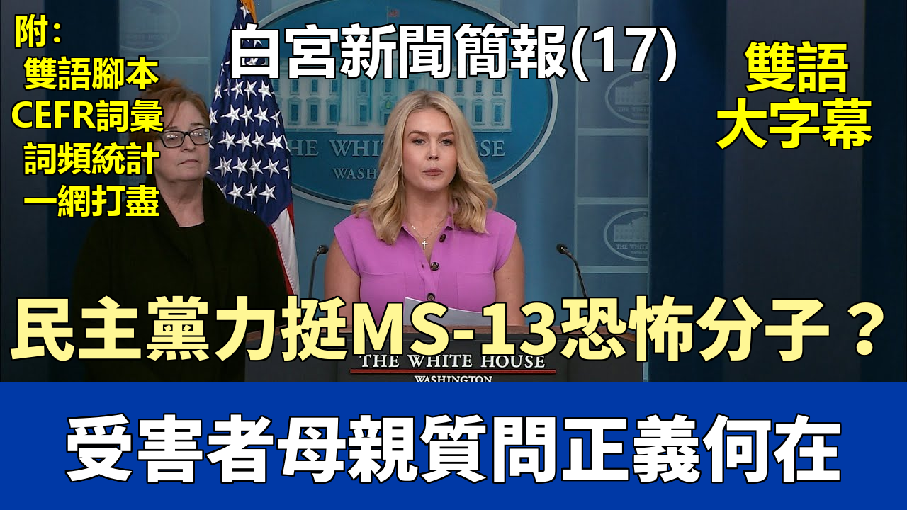

{% video youtube:fZXZuhqfACE width:100% autoplay:0 %}


### 【中英文双语脚本】

Good afternoon, everybody.
下午好，各位。
President Trump campaigned on the promise to secure our homeland
特朗普總統競選時承諾要保護我們的國土安全，
and deport violent alien criminals from our communities.
並將暴力外籍罪犯驅逐出我們的社區。
That is why the American people overwhelmingly reelected him back to this office,
這就是爲什麼美國人民以壓倒性優勢再次選舉他回到這個職位，
and it's why the American people defeated the Democrat Party in devastating fashion.
也是爲什麼美國人民以毀滅性的方式擊敗了民主黨。
Today we have officially learned Democrat officials still refuse to accept
今天我們正式獲悉，民主黨官員仍然拒絕接受
the will of the American people.
美國人民的意願。
Maryland Democrat Senator Chris Van Hollen rushed to Dulles Airport this morning
馬里蘭州民主黨參議員克里斯·範·霍倫今天早上趕往杜勒斯機場，
to fly to El Salvador, potentially using taxpayer dollars
飛往薩爾瓦多，可能會使用納稅人的錢，
to demand the release of deported, illegal alien MS-13 terrorists.
要求釋放被驅逐的非法外籍MS-13恐怖分子。
The Democrats and the media in this room have continually and wrongly labeled
在場的民主黨人和媒體一直錯誤地稱
Kilmar Ebrego Garcia as a Maryland father.
基爾馬·埃佈雷戈·加西亞爲馬里蘭州父親。
There is no Maryland father.
沒有馬里蘭州父親。
Let me reiterate, Kilmar Ebrego Garcia is an illegal alien, MS-13 gang member,
讓我重申，基爾馬·埃佈雷戈·加西亞是一個非法外籍、MS-13幫派成員，
and foreign terrorist who was deported back to his home country.
以及被驅逐回其祖國的外國恐怖分子。
And when Kilmar Ebrego Garcia was originally arrested,
當基爾馬·埃佈雷戈·加西亞最初被逮捕時，
he was wearing a sweatshirt with rolls of money covering the ears, mouth, and eyes
他穿着一件毛衫，上面有成卷的錢覆蓋着耳朵、嘴巴和眼睛，
of presidents on various currency denominations.
這些是各種貨幣面額上的總統頭像。
This is a known MS-13 gang symbol of hear no evil, speak no evil, see no evil.
這是MS-13幫派的已知標誌，象徵不聽惡、不言惡、不見惡。
Ebrego Garcia was also arrested with two other well-known members
埃佈雷戈·加西亞還與另外兩名臭名昭著的
of the vicious MS-13 gang.
惡毒MS-13幫派成員一起被逮捕。
And two separate judges found that Ebrego Garcia was a member of MS-13,
兩名不同的法官認定埃佈雷戈·加西亞是MS-13的成員，
and that finding has never been disputed.
這一認定從未被爭議。
And just this morning, it was revealed through Maryland court documents
今天早上，通過馬里蘭州法院文件披露，
that Ebrego Garcia's wife petitioned for an order of protection against him
埃佈雷戈·加西亞的妻子曾申請對他的人身保護令，
for two instances of domestic violence in May of 2021.
因2021年5月的兩起家庭暴力事件。
And here is the order right here.
這裏就是那份保護令。
The court ordered that the respondent committed the following acts of abuse.
法院裁定被告實施了以下虐待行爲。
Once in May of 2021, assaults in any degree.
2021年5月一次，任何程度的襲擊。
And on May 4th of 2021, he punched and scratched his wife,
2021年5月4日，他拳打併抓傷了他的妻子，
ripped off her shirt, and grabbed and bruised her.
撕下她的襯衫，抓住並使她瘀傷。
This is from a court in Maryland.
這是來自馬里蘭州法院的記錄。
So not only are Democrats rushing to defend an illegal criminal foreign terrorist gang member,
因此，民主黨人不僅急於爲一個非法的外國恐怖幫派成員辯護，
but also an apparent woman beater.
而且顯然還是一個虐待女性的傢伙。
To set all of that aside, the basic fact that he was illegally inside our country
撇開這一切，基本事實是他非法進入我們的國家，
and had a lawful deportation order made him subject to removal
並且有合法的驅逐令，使他必須被驅逐
back to his home country of El Salvador.
回到他的祖國薩爾瓦多。
And if he ever ends up back in the United States,
如果他再次回到美國，
he would immediately be deported again.
他將立即再次被驅逐。
Nothing will change the fact that Ebrego Garcia will never be a Maryland father.
沒有什麼能改變埃佈雷戈·加西亞永遠不會是馬里蘭州父親的事實。
He will never live in the United States of America again.
他將永遠不會再次在美國生活。
And the United States Supreme Court ruled unanimously
美國最高法院一致裁定，
that the president of the United States and the secretary of state
美國總統和國務卿
could not be compelled to forcibly retrieve this citizen of El Salvador,
不能被強迫強行接回這個薩爾瓦多公民，
who is currently locked up in a maximum security prison in his home country
他目前被關押在祖國的最高安全級別監獄中，
due to his MS-13 membership.
因爲他是MS-13的成員。
To remind the media and the Democrat Party,
提醒媒體和民主黨，
MS-13 are among the most vicious and dangerous individuals in this world.
MS-13是這個世界上最爲惡毒和危險的個體之一。
They pose a direct threat to the United States, El Salvador,
他們對美國、薩爾瓦多
and any other country who maintains basic law and order.
以及任何維持基本法律和秩序的國家構成直接威脅。
MS-13 rapes innocent girls and women, runs sex trafficking operations,
MS-13強姦無辜的女孩和婦女，經營性交易，
murders for sport, and terrorizes law-abiding people.
爲娛樂而謀殺，恐嚇守法的人。
That's why El Salvador President Bukele made it clear this week
這就是爲什麼薩爾瓦多總統布克爾本週明確表示
that he will not be releasing this MS-13 gang member from his prison.
他不會從監獄中釋放這個MS-13幫派成員。
But that is not enough.
但這還不夠。
All of that is not enough to stop the Democrat Party from their lies.
這一切不足以阻止民主黨散佈謊言。
The number one issue they are focused on right now
他們目前關注的首要問題
is bringing back this illegal alien terrorist to America.
是將這個非法外籍恐怖分子帶回美國。
But where are the Democrats applauding the fact
但民主黨人在哪裏爲這一事實鼓掌，
that southern border crossings just hit a historic low?
南部邊境過境人數剛剛達到歷史最低點？
Where are the Democrats supporting our brave men and women of law enforcement
民主黨人在哪裏支持我們勇敢的執法人員，
who are putting their lives on the line every single day
他們每天都在冒着生命危險
to arrest the violent illegal alien invaders
逮捕暴力的非法外籍入侵者，
that the previous administration allowed into our country?
這些是前任政府允許進入我們國家的人？
And where are the Democrats when innocent Americans
民主黨人在哪裏，當無辜的美國人
are victimized by illegal criminals that Joe Biden let in?
被喬·拜登放進來的非法罪犯傷害時？
It's appalling and sad that Senator Van Hollen and the Democrats
令人震驚和悲哀的是，參議員範·霍倫和民主黨人
applauding his trip to El Salvador today
今天爲他前往薩爾瓦多的行程鼓掌，
are incapable of having any shred of common sense or empathy
無法擁有任何常識或同情心
for their own constituents and our citizens.
對他們自己的選民和我們的公民。
Nobody knows this more than the woman standing to my right, Patty Morin,
沒有人比站在我右邊的女人帕蒂·莫林更清楚這一點，
whose beautiful daughter Rachel was brutally maimed and murdered
她美麗的女兒雷切爾在2023年8月被殘忍地傷害和謀殺，
at the hands of an illegal alien.
被一個非法外籍人所殺。
Patty no longer has her daughter because of the failed Democrat Party's open border.
帕蒂失去了她的女兒，因爲民主黨失敗的開放邊境政策。
And these are policies that President Trump is bringing an end to.
這些是特朗普總統正在終止的政策。
Patty should not have to be here today, but she is.
帕蒂今天不應該站在這裏，但她來了。
And we are grateful and we are honored for her willingness
我們非常感激並感到榮幸，因爲她願意
and her request to share her powerful story with the world.
並請求與世界分享她震撼人心的故事。
Thank you, Patty, for being here. Thank you.
謝謝你，帕蒂，謝謝你來到這裏。
A lot of you don't know the whole story about Rachel
你們很多人不知道雷切爾的完整故事，
and about the crime that was committed against her.
也不知道對她犯下的罪行。
Even us, her family, we didn't know all the details.
即使是我們，她的家人，也不知道所有細節。
They kept most of it close to their chest, the detectives,
偵探們把大部分信息都保密，
because they didn't want to do anything to hurt the case.
因爲他們不想做任何可能損害案件的事情。
They wanted to keep the integrity of the case, so they kept everything close.
他們想保持案件的完整性，所以一切都保密。
I sat for the last two weeks in her trial
過去兩週我參加了她的審判，
and we saw layer upon layer upon layer of evidence
我們看到了層層疊疊的證據，
against the accused, an illegal immigrant from El Salvador.
針對被告，一個來自薩爾瓦多的非法移民。
The things that we thought, well maybe this might have happened, we didn't know.
我們以爲可能發生的事情，我們並不知道。
But when we were at the trial, we got all the puzzle pieces.
但在審判時，我們拿到了所有拼圖的碎片。
And I want to share some of those things with you.
我想和你們分享一些事情。
You know that Rachel is a 37-year-old mother.
你們知道雷切爾是一個37歲的母親。
She has five children.
她有五個孩子。
We've walked the trail for the last 25 years that we've lived in Maryland.
過去25年我們住在馬里蘭州時一直在這條小路上散步。
It's a safe place for our family.
這是我們家庭的安全之地。
It's where we go to get a little bit of New England,
我們去那裏感受一點新英格蘭的氛圍，
because that's where we're from, New England.
因爲我們來自新英格蘭。
When she went on that trail that day, she was not planning on dying.
那天她走上那條小路時，並沒有計劃死亡。
She wasn't planning on walking to her death.
她沒有計劃走向死亡。
She was planning on going to the grocery store with her girls afterwards.
她計劃之後和她的女孩們去雜貨店。
Victor Martinez, he waited for her.
維克托·馬丁內斯，他等着她。
He waited for her to come closer.
他等着她靠近。
He saw her.
他看見了她。
He saw that there was nobody around.
他看到周圍沒有人。
He attacked her.
他襲擊了她。
He dragged her 150 feet, blood gushing from her head.
他拖着她150英尺，血從她頭上涌出。
It left a 150-foot trail of her blood to the culverts
留下了一條150英尺的血跡，通向涵洞，
where he took, he picked her up.
他把她抱起來。
He threw her against the wall of the tunnel and he raped her.
他把她扔到隧道的牆上，然後強姦了她。
But before he did that, he stopped on that trail
但在此之前，他在小路上停下來，
and rocks, still stained with her blood,
用沾滿她鮮血的石頭，
he used them to hammer her head against those rocks.
他用這些石頭砸她的頭。
They say 20, at least 20 times they could count the cuts in her head.
他們說至少有20次，他們能數出她頭上的傷口。
They said that when they did the autopsy, and I've seen the pictures,
他們說在屍檢時，我見過那些照片，
there's a six-inch square in the back of her head
她後腦有一個六英寸見方的區域，
where the skull is shattered the way that you would crush an eggshell in pieces.
頭骨碎裂，就像你把蛋殼碾碎成碎片。
Three-fourths of her brain hemorrhaged.
她四分之三的腦部出血。
Her right and left side of her face bashed in.
她臉的左右兩側都被砸爛。
Her beautiful face bashed in.
她美麗的臉被砸爛。
Her head bashed in.
她的頭被砸爛。
Broken bones fractures.
骨頭斷裂。
He takes and he drags her some more.
他繼續拖着她。
He drags her through the thorn bushes.
他拖着她穿過荊棘叢。
She has all the scrapes and cuts on her body.
她身上全是刮痕和傷口。
There wasn't one inch of her body that didn't have some kind of injury,
她身上沒有一寸地方沒有某種傷害，
whether it's bruising, broken bones, contusions, the scratches.
無論是瘀傷、骨折、挫傷還是刮痕。
She had a fractured rib, fractured nose, fractured skull.
她有肋骨骨折、鼻骨骨折、顱骨骨折。
And then he takes her into the tunnel and he picks her up.
然後他把她帶進隧道，抱起她。
He throws her against the wall.
他把她扔到牆上。
Blood is gushing from her head.
血從她頭上涌出。
Her hair is soaked in blood and they showed us pictures
她的頭髮浸滿了血，他們給我們看了照片，
of her body against 0 against the wall outline.
她身體靠着牆的輪廓。
The blood outlined her body and you could see where the blood ran down
血勾勒出她的身體，你可以看到血流下的地方，
around her as he was raping her.
在她被強姦時。
And then he threw her down and raped her some more.
然後他把她扔下來，繼續強姦她。
And then he strangled her because he didn't want her to be able to live
然後他掐死她，因爲他不想讓她活下來
to tell the story.
來講述這個故事。
They said that when they did the autopsy on her neck
他們說在對她脖子進行屍檢時，
that one of the things they do is they open up the neck
他們做的一件事是打開脖子，
and they look to see how far the injury is.
看看傷害有多深。
And it went all the way down as far as an injury is possible,
傷害一直深入到可能的最深處，
hemorrhaging in the muscles because of how strong and violent
肌肉出血，因爲抓握是如此強烈和暴力。
These are the kind of people that have no compulsion.
這些人是毫無顧忌的。
To them this is nothing.
對他們來說這不算什麼。
And when he was sitting in the courtroom
當他坐在法庭上時，
he actually looked like he thought he was going to be set free.
他實際上看起來像是以爲自己會被釋放。
There was no remorse on his face at all.
他臉上完全沒有悔意。
This person took my daughter so violently and so gruesomely
這個人如此暴力、如此殘忍地帶走了我的女兒，
and so graphically that they sealed the pictures
如此生動以至於他們封存了照片，
because I don't want my granddaughters to see these pictures.
因爲我不想讓我的孫女們看到這些照片。
These are the kind of criminals President Trump wants to remove from our country.
這些是特朗普總統想從我們國家驅逐的罪犯。
These are the kind of criminals that we need to remove from our country.
這些是我們需要從國家驅逐的罪犯。
We are American citizens.
我們是美國公民。
Why should we allow people like this, violent criminals
我們爲什麼要允許這樣的人，暴力罪犯，
that have no conscience at all, to murder our mothers, our sisters, our daughters?
完全沒有良心，謀殺我們的母親、姐妹、女兒？
I don't understand why there's even any kind of problem with this.
我不明白爲什麼這會有任何問題。
And it's not that it's political, like the left or the right,
這不是政治問題，像左派或右派，
although I understand different parties have used it in the past.
儘管我知道過去不同的黨派使用過這個問題。
But we have to look at it as we are American citizens.
但我們必須將其視爲我們是美國公民。
We need to protect our families, our borders, our children.
我們需要保護我們的家庭、我們的邊境、我們的孩子。
I don't care about politics, well I do, but I want to preserve life.
我不在乎政治，嗯，我在乎，但我想保護生命。
And that's the only reason why I have taken and spoken about Rachel all this time.
這就是我一直談論雷切爾的唯一原因。
If you're a mother here in the room, can you imagine standing there alive,
如果你是房間裏的母親，你能想象站在那裏活着，
you're alive, as someone comes and puts their hands into your chest
你活着，有人走過來把手伸進你的胸膛
and rips out your heart?
撕裂你的心？
That's what it feels like.
這就是感覺。
It feels like a part of you is being ripped out of you.
感覺像是你的一部分被撕裂。
You can't even describe the pain,
你甚至無法描述那種痛苦，
just like you can't describe to your husband what it feels like
就像你無法向你的丈夫描述
to carry a baby in your womb, or to feel those first kicks,
在子宮裏懷孕的感覺，或是第一次胎動的感覺，
or to know just intuitively if it's a boy or a girl.
或者只是憑直覺知道是男孩還是女孩。
It's only a thing that a mother knows.
這是隻有母親才知道的事情。
Why are we not protecting the American citizens?
爲什麼我們不保護美國公民？
It's just common sense.
這只是常識。
Why are we not protecting our children?
爲什麼我們不保護我們的孩子？
And to have a senator from Maryland who didn't even acknowledge
還有一位來自馬里蘭州的參議員甚至沒有承認
or barely acknowledged my daughter and the brutal death that she endured,
或幾乎沒有承認我的女兒和她所遭受的殘忍死亡，
leaving her five children without a mother
讓她的五個孩子失去了母親，
and now a grandbaby without a grandmother,
現在一個孫子沒有了祖母，
so that he can use my taxpayer money to fly to El Salvador
以便他可以用我的納稅錢飛往薩爾瓦多，
to bring back someone that's not even an American citizen.
帶回一個甚至不是美國公民的人。
Why does that person have more right than I do, or my daughter, or my grandchildren?
爲什麼那個人比我、我的女兒或我的孫子有更多權利？
I don't understand this.
我不明白這一點。
Thank you. Thank you. Thank you.
謝謝。謝謝。謝謝。
I just want to say that as a mother and as an American citizen,
我只想說，作爲一個母親和美國公民，
the President and our entire team, and I hope people in this room
總統和我們的整個團隊，我希望這個房間裏的人
are grateful for your willingness to come here
感激你願意來到這裏
and your request to share your daughter's story.
並請求分享你女兒的故事。
And I think the country hears you loud and clear.
我想全國都清楚地聽到了你的聲音。
So thank you.
所以謝謝你。
Does anyone have any questions for Patty or for me?
有人對帕蒂或我有任何問題嗎？
No? I have a question. No? Anybody? Okay.
沒有？我有一個問題。沒有？有人嗎？好的。
We'll see you all later.
我們稍後見。
The President will be at his dinner later this evening. Thank you.
總統今晚將在他的晚宴上。謝謝。

### 【核心词汇 - B1_C2】
| 單詞 | 音標 | 詞性 | 釋義 | 等級 | 次數 |
|---|---|---|---|---|---|
| able | /ˈeɪbl/ | adjective | 能夠；有能力的 | B1 | 1 |
| accuse | /əˈkjuːz/ | verb | 指控，控告 | B1 | 1 |
| acknowledge | /əkˈnɑːlɪdʒ/ | verb | 承認，確認 | B1 | 2 |
| administration | /ədˌmɪnɪˈstreɪʃn/ | noun | 管理，行政 | B1 | 1 |
| afterwards | /ˈæftərwərdz/ | adverb | 之後，後來 | B1 | 1 |
| alien | /ˈeɪliən/ | noun | 外星人 | B1 | 1 |
| apparent | /əˈpærənt/ | adjective | adj. 明顯的；顯而易見的 | B1 | 1 |
| applaud | /əˈplɔːd/ | verb | v. 鼓掌；稱讚 | B1 | 1 |
| arrest | /əˈrest/ | noun | 逮捕，拘留 | B1 | 2 |
| aside | /əˈsaɪd/ | adverb | 在旁邊，到一邊 | B1 | 1 |
| barely | /ˈberli/ | adverb | 勉強，幾乎不 | B1 | 1 |
| border | /ˈbɔːrdər/ | noun | 邊界；邊境 | B1 | 2 |
| continually | /kənˈtɪnjʊəli/ | adverb | adv. 不斷地，頻繁地 | B1 | 1 |
| criminal | /ˈkrɪmɪnl/ | noun | 罪犯 | B1 | 2 |
| crossing | /ˈkrɔːsɪŋ/ | noun | 十字路口，橫渡 | B1 | 1 |
| crush | /krʌʃ/ | noun | 迷戀，擁擠 | B1 | 1 |
| currency | /ˈkɜːrəntsi/ | noun | 貨幣 | B1 | 1 |
| currently | /ˈkɜːrəntli/ | adverb | 目前，現在 | B1 | 1 |
| defeat | /dɪˈfiːt/ | verb | 擊敗；戰勝 | B1 | 1 |
| defend | /dɪˈfend/ | verb | 保衛；辯護 | B1 | 1 |
| demand | /dɪˈmænd/ | noun | 需求；要求 | B1 | 1 |
| detective | /dɪˈtektɪv/ | noun | 偵探 | B1 | 1 |
| devastating | /ˈdevəsteɪtɪŋ/ | adjective | 毀滅性的，破壞性的；令人震驚的，令人悲痛的 | B1 | 1 |
| document | /ˈdɑːkjumənt/ | noun | 文件，文檔 | B1 | 1 |
| drag | /dræɡ/ | verb | 拖，拉 | B1 | 2 |
| endure | /ɪnˈdʊr/ | verb | 忍受；容忍；持久；持續 | B1 | 1 |
| entire | /ɪnˈtaɪər/ | adjective | 整個的；全部的 | B1 | 1 |
| finding | /ˈfaɪndɪŋ/ | noun | 發現；發現物；調查結果 | B1 | 1 |
| foot | /fʊt/ | noun | 腳，英尺 | B1 | 1 |
| grab | /ɡræb/ | verb | 抓住，攫取 | B1 | 1 |
| hammer | /ˈhæmər/ | noun | 錘子 | B1 | 1 |
| historic | /hɪˈstɔːrɪk/ | adjective | 歷史性的; 具有歷史意義的 | B1 | 1 |
| illegally | /ɪˈliːɡəli/ | adverb | 非法地 | B1 | 1 |
| immediately | /ɪˈmiːdiətli/ | adverb | 立即，馬上 | B1 | 1 |
| individual | /ˌɪndɪˈvɪdʒuəl/ | adjective | 個人的，單獨的 | B1 | 1 |
| injury | /ˈɪndʒəri/ | noun | 傷害，損傷 | B1 | 1 |
| innocent | /ˈɪnəsənt/ | adjective | 無辜的，清白的 | B1 | 1 |
| instance | /ˈɪnstəns/ | noun | 例子，事例 | B1 | 1 |
| lawful | /ˈlɔːfəl/ | adjective | 合法的，法定的 | B1 | 1 |
| layer | /ˈler/ | noun | 層，層次 | B1 | 1 |
| loud | /laʊd/ | adjective | 大聲的 | B1 | 1 |
| maintain | /meɪnˈteɪn/ | verb | 維持，維護 | B1 | 1 |
| maximum | /ˈmæksɪməm/ | adjective | 最大的，最高的；最大限度的 | B1 | 1 |
| membership | /ˈmembərʃɪp/ | noun | 會員資格；會員身份 | B1 | 1 |
| muscle | /ˈmʌsl/ | noun | 肌肉 | B1 | 1 |
| officially | /əˈfɪʃəli/ | adverb | 正式地 | B1 | 1 |
| operation | /ˌɑpəˈreɪʃən/ | noun | 操作，手術 | B1 | 1 |
| outline | /ˈaʊtˌlaɪn/ | verb | 概述，概括；描繪輪廓 | B1 | 2 |
| pain | /peɪn/ | noun | 疼痛，痛苦 | B1 | 1 |
| policy | /ˈpɑləsi/ | noun | 政策，方針；保險單 | B1 | 1 |
| politics | /ˈpɑləˌtɪks/ | noun | 政治；政治學；政治活動；政事 | B1 | 1 |
| preserve | /prɪˈzɜːrv/ | verb | 保護；保存；維護 | B1 | 1 |
| president | /ˈprezɪdənt/ | noun | 總統；主席；校長 | B1 | 2 |
| previous | /ˈpriːviəs/ | adjective | 先前的；以前的 | B1 | 1 |
| prison | /ˈprɪzn/ | noun | 監獄 | B1 | 1 |
| protect | /prəˈtekt/ | verb | 保護 | B1 | 2 |
| protection | /prəˈtekʃn/ | noun | 保護 | B1 | 1 |
| puzzle | /ˈpʌzl/ | noun | 難題，謎 | B1 | 1 |
| refuse | /rɪˈfjuːz/ | noun | 垃圾，廢物 | B1 | 1 |
| remove | /rɪˈmuːv/ | verb | 移除，去掉 | B1 | 1 |
| scratch | /skrætʃ/ | noun | 刮痕，劃痕 | B1 | 2 |
| secure | /sɪˈkjʊr/ | adjective | 安全的；可靠的 | B1 | 1 |
| security | /sɪˈkjʊrəti/ | noun | 安全；保障 | B1 | 1 |
| sex | /seks/ | noun | 性別 | B1 | 1 |
| southern | /ˈsʌðərn/ | adjective | 南方的，南部的 | B1 | 1 |
| spoken | /ˈspoʊkən/ | adjective | 口語的，說出口的 | B1 | 1 |
| sweatshirt | /ˈswetʃɜːrt/ | noun | 運動衫，套頭衫 | B1 | 1 |
| threat | /θret/ | noun | 威脅；恐嚇 | B1 | 1 |
| trail | /treɪl/ | noun | 小路，蹤跡 | B1 | 1 |
| various | /ˈveriəs/ | adjective | 各種各樣的；不同的 | B1 | 1 |
| violence | /ˈvaɪələns/ | noun | 暴力 | B1 | 1 |
| violently | /ˈvaɪələntli/ | adverb | 暴力地；猛烈地 | B1 | 1 |
| whether | /ˈweðər/ | conjunction | 是否 | B1 | 1 |
| willingness | /ˈwɪlɪŋnəs/ | noun | 願意；樂意 | B1 | 1 |
| Democrat | /ˈdeməkræt/ | noun | 民主黨人 | B2 | 2 |
| Senator | /ˈsenətər/ | noun | 參議員 | B2 | 1 |
| abuse | /əˈbjuːz/ | noun | n. 濫用，虐待 | B2 | 1 |
| assault | /əˈsɔːlt/ | noun | 襲擊，攻擊；侵犯 | B2 | 1 |
| bruise | /bruːz/ | noun | 瘀傷 | B2 | 2 |
| campaign | /kæmˈpeɪn/ | noun | 運動；活動 | B2 | 1 |
| committed | /kəˈmɪtɪd/ | adjective | 盡心盡力的，堅定的 | B2 | 1 |
| community | /kəˈmjuːnəti/ | noun | 社區，社羣 | B2 | 1 |
| conscience | /ˈkɑːnʃəns/ | noun | 良心，良知 | B2 | 1 |
| deport | /diˈpɔːrt/ | verb | 驅逐出境 | B2 | 2 |
| dispute | /dɪˈspjuːt/ | noun | 爭論，糾紛 | B2 | 1 |
| domestic | /dəˈmestɪk/ | adjective | 國內的，家庭的；馴養的 | B2 | 1 |
| evil | /ˈiːvl/ | adjective | 邪惡的；罪惡的 | B2 | 1 |
| focused | /ˈfoʊkəst/ | adjective | 集中的 | B2 | 1 |
| gang | /ɡæŋ/ | noun | 一幫，一夥；團伙 | B2 | 1 |
| graphically | /ˈɡræfɪkli/ | adverb | 生動地，形象地 | B2 | 1 |
| honor | /ˈɑːnər/ | verb | 尊敬，給予榮譽 | B2 | 1 |
| immigrant | /ˈɪmɪɡrənt/ | noun | n. 移民 | B2 | 1 |
| integrity | /ɪnˈteɡrəti/ | noun | 正直，完整 | B2 | 1 |
| label | /ˈleɪbl/ | noun | 標籤 | B2 | 1 |
| media | /ˈmiːdiə/ | noun | 媒體，媒介 | B2 | 1 |
| originally | /əˈrɪdʒənəli/ | adverb | 最初，起初 | B2 | 1 |
| planning | /ˈplænɪŋ/ | noun | 計劃，規劃 | B2 | 1 |
| pose | /poʊz/ | noun | 姿勢；姿態 | B2 | 1 |
| potentially | /pəˈtenʃəli/ | adverb | 潛在地；可能地 | B2 | 1 |
| punch | /pʌntʃ/ | noun | 拳打，衝壓 | B2 | 1 |
| rape | /reɪp/ | noun | 強姦；強暴 | B2 | 3 |
| retrieve | /rɪˈtriːv/ | verb | 取回；找回 | B2 | 1 |
| rib | /rɪb/ | noun | 肋骨 | B2 | 1 |
| rip | /rɪp/ | verb | 撕裂；扯破 | B2 | 2 |
| seal | /siːl/ | noun | 海豹；印章；封條 | B2 | 1 |
| senator | /ˈsenətər/ | noun | 參議員 | B2 | 1 |
| shatter | /ˈʃætər/ | verb | （使）破碎，粉碎 | B2 | 1 |
| soak | /soʊk/ | noun | n. 浸泡 | B2 | 1 |
| stain | /steɪn/ | noun | 污漬；污點 | B2 | 1 |
| strangle | /ˈstræŋɡl/ | verb | 扼死；壓制 | B2 | 1 |
| trial | /ˈtraɪəl/ | noun | 審判；試驗 | B2 | 1 |
| tunnel | /ˈtʌnl/ | noun | 隧道 | B2 | 1 |
| wrongly | /ˈrɔːŋli/ | adverb | 錯誤地，不正當地 | B2 | 1 |
| appalling | /əˈpɔːlɪŋ/ | adjective | 駭人聽聞的，令人震驚的 | C1 | 1 |
| compulsion | /kəmˈpʌlʃən/ | noun | 強迫症，難以抗拒的衝動 | C1 | 1 |
| gruesomely | /ˈɡruːsəmli/ | adverb | 可怕地，令人毛骨悚然地 | C1 | 1 |
| gush | /ɡʌʃ/ | verb | 涌出；滔滔不絕地說 | C1 | 1 |
| intuitively | /ɪnˈtuːɪtɪvli/ | adverb | adv. 憑直覺地 | C1 | 1 |
| remorse | /rɪˈmɔːrs/ | noun | 懊悔，悔恨 | C1 | 1 |
| vicious | /ˈvɪʃəs/ | adjective | 邪惡的，惡毒的 | C1 | 1 |
| standing | /ˈstændɪŋ/ | noun | 地位，名聲 | C2 | 1 |

### 【核心词汇 - A2】
| 單詞 | 音標 | 詞性 | 釋義 | 等級 | 次數 |
|---|---|---|---|---|---|
| American | /əˈmer.ɪ.kən/ | adjective | 美國的 | A2 | 2 |
| United | /juːˈnaɪ.tɪd/ | adjective | 聯合的，團結的 | A2 | 1 |
| accept | /əkˈsept/ | verb | 接受，同意 | A2 | 1 |
| act | /ækt/ | noun | 行爲，行動；法案 | A2 | 1 |
| actually | /ˈæktʃuəli/ | adverb | 實際上，事實上 | A2 | 1 |
| against | /əˈɡenst/ | preposition | 反對，倚靠，逆着 | A2 | 1 |
| alive | /əˈlaɪv/ | adjective | 活着的 | A2 | 1 |
| allow | /əˈlaʊ/ | verb | 允許 | A2 | 2 |
| although | /ɔːlˈðoʊ/ | conjunction | 雖然，儘管 | A2 | 1 |
| among | /əˈmʌŋ/ | preposition | 在…之中 | A2 | 1 |
| attack | /əˈtæk/ | noun | 攻擊；襲擊 | A2 | 1 |
| basic | /ˈbeɪsɪk/ | adjective | 基本的；基礎的 | A2 | 1 |
| bit | /bɪt/ | noun | 一點；少量；小塊兒 | A2 | 1 |
| blood | /blʌd/ | noun | 血液 | A2 | 2 |
| brave | /breɪv/ | adjective | 勇敢的；無畏的 | A2 | 1 |
| bush | /bʊʃ/ | noun | 灌木；灌木叢 | A2 | 1 |
| chest | /tʃest/ | noun | 胸部；胸膛 | A2 | 1 |
| citizen | /ˈsɪtɪzn/ | noun | 公民 | A2 | 2 |
| clear | /klɪr/ | adjective | 清楚的；清晰的 | A2 | 1 |
| common | /ˈkɑːmən/ | adjective | 常見的，普通的 | A2 | 1 |
| count | /kaʊnt/ | verb | 數，計數；認爲，算作 | A2 | 1 |
| country | /ˈkʌntri/ | noun | 國家，國土；鄉村，鄉下 | A2 | 1 |
| court | /kɔːrt/ | noun | 法院，法庭；球場，場地 | A2 | 1 |
| crime | /kraɪm/ | noun | 犯罪，罪行 | A2 | 1 |
| dangerous | /ˈdeɪndʒərəs/ | adjective | 危險的，不安全的 | A2 | 1 |
| death | /deθ/ | noun | 死亡，逝世 | A2 | 1 |
| degree | /dɪˈɡriː/ | noun | 程度，度數；學位 | A2 | 1 |
| detail | /dɪˈteɪl/ | noun | 細節，詳情 | A2 | 1 |
| die | /daɪ/ | verb | 死 | A2 | 1 |
| direct | /dəˈrekt/ | adjective | 直接的 | A2 | 1 |
| enough | /ɪˈnʌf/ | adverb | adv. 足夠地 | A2 | 1 |
| even | /ˈiːvən/ | adverb | 甚至，即使 | A2 | 2 |
| ever | /ˈevər/ | adverb | 曾經；永遠 | A2 | 1 |
| evidence | /ˈevɪdəns/ | noun | 證據，證明 | A2 | 1 |
| fact | /fækt/ | noun | 事實 | A2 | 1 |
| fail | /feɪl/ | verb | 失敗，不及格 | A2 | 1 |
| far | /fɑːr/ | adverb | 遠的 | A2 | 1 |
| fashion | /ˈfæʃən/ | noun | 時尚，流行 | A2 | 1 |
| feel | /fiːl/ | verb | 感覺 | A2 | 2 |
| follow | /ˈfɑːloʊ/ | verb | 跟隨，聽從 | A2 | 1 |
| grandchild | /ˈɡræn(t)ʃaɪld/ | noun | 孫子/孫女；外孫子/外孫女 | A2 | 1 |
| granddaughter | /ˈɡrændɔːtər/ | noun | 孫女；外孫女 | A2 | 1 |
| grateful | /ˈɡreɪtfəl/ | adjective | 感激的；感謝的 | A2 | 1 |
| hit | /hɪt/ | verb | 打，擊；碰撞 | A2 | 1 |
| illegal | /ɪˈliːɡəl/ | adjective | 非法的 | A2 | 1 |
| inch | /ɪntʃ/ | noun | 英寸 | A2 | 1 |
| issue | /ˈɪʃuː/ | noun | 問題，議題 | A2 | 1 |
| last | /læst/ | determiner | 最近的；最後的；最不可能的；剛過去的 | A2 | 1 |
| law | /lɔː/ | noun | 法律；規律 | A2 | 1 |
| least | /liːst/ | determiner | 最小的；最少的 | A2 | 1 |
| lie | /laɪ/ | verb | 躺；說謊 | A2 | 1 |
| lock | /lɑːk/ | noun | 鎖 | A2 | 1 |
| low | /loʊ/ | adjective | 低的 | A2 | 1 |
| member | /ˈmembər/ | noun | 成員 | A2 | 2 |
| might | /maɪt/ | modal auxiliary | 可能 | A2 | 1 |
| murder | /ˈmɜːrdər/ | noun | 謀殺 | A2 | 3 |
| nobody | /ˈnoʊbɑːdi/ | pronoun | 沒有人 | A2 | 2 |
| official | /əˈfɪʃəl/ | adjective | 官方的，正式的 | A2 | 1 |
| part | /pɑːrt/ | noun | 部分，角色 | A2 | 1 |
| political | /pəˈlɪtɪkl/ | adjective | 政治的 | A2 | 1 |
| possible | /ˈpɑːsəbl/ | adjective | 可能的 | A2 | 1 |
| powerful | /ˈpaʊərfl/ | adjective | 強大的，有力的 | A2 | 1 |
| promise | /ˈprɑːmɪs/ | noun | 承諾，諾言 | A2 | 1 |
| release | /rɪˈliːs/ | noun | 發佈；發行 | A2 | 2 |
| remind | /rɪˈmaɪnd/ | verb | 提醒 | A2 | 1 |
| request | /rɪˈkwest/ | noun | 請求；要求 | A2 | 1 |
| reveal | /rɪˈviːl/ | verb | 揭示；透露 | A2 | 1 |
| rock | /rɑːk/ | noun | 岩石，搖滾樂 | A2 | 1 |
| roll | /roʊl/ | noun | 卷，麪包卷 | A2 | 1 |
| rush | /rʌʃ/ | noun | 匆忙，趕緊 | A2 | 2 |
| safe | /seɪf/ | adjective | 安全的 | A2 | 1 |
| secretary | /ˈsekrəteri/ | noun | 祕書 | A2 | 1 |
| sense | /sens/ | noun | 感覺，意識 | A2 | 1 |
| separate | /ˈsepəreɪt/ | adjective | 分開的，不同的 | A2 | 1 |
| single | /ˈsɪŋɡl/ | adjective | 單一的，單身的 | A2 | 1 |
| square | /skwer/ | adjective | 正方形的，平方的 | A2 | 1 |
| state | /steɪt/ | noun | 狀態，情形，國家 | A2 | 1 |
| support | /səˈpɔːrt/ | noun | 支持，支撐 | A2 | 1 |
| symbol | /ˈsɪmbl/ | noun | 符號，象徵 | A2 | 1 |
| terrorist | /ˈterərɪst/ | adjective | 恐怖主義的 | A2 | 2 |
| thought | /θɔːt/ | noun | 想法，思考 | A2 | 1 |
| understand | /ˌʌndərˈstænd/ | verb | 理解 | A2 | 1 |
| upon | /əˈpɑːn/ | preposition | 在…之上，在…上，緊接着 | A2 | 1 |
| used | /juːzd/ | adjective | 用過的，二手的；習慣的，適應的 | A2 | 1 |
| violent | /ˈvaɪələnt/ | adjective | 暴力的，強烈的 | A2 | 1 |
| well-known | /ˌwel ˈnoʊn/ | adjective | 著名的，衆所周知的 | A2 | 1 |
| whole | /hoʊl/ | adjective | 整個的，全部的 | A2 | 1 |
| without | /wɪˈθaʊt/ | preposition | 沒有；無 | A2 | 1 |

### 【核心词汇 - A1】
| 單詞 | 音標 | 詞性 | 釋義 | 等級 | 次數 |
|---|---|---|---|---|---|
| America | /əˈmerɪkə/ | noun | 美國，美洲 | A1 | 1 |
| I | /aɪ/ | pronoun | 我 | A1 | 2 |
| May | /meɪ/ | noun | 五月 | A1 | 1 |
| New | american_phonetic | adjective | 新的 | A1 | 1 |
| President | /ˈprezɪdənt/ | noun | 總統 | A1 | 1 |
| Today | /təˈdeɪ/ | adverb | 今天 | A1 | 1 |
| a | /ə/ | determiner | 一個，一種 | A1 | 2 |
| about | /əˈbaʊt/ | adverb | 大約，關於 | A1 | 1 |
| afternoon | /ˌæftərˈnuːn/ | noun | 下午 | A1 | 1 |
| again | /əˈɡen/ | adverb | 再次，又一次 | A1 | 1 |
| all | /ɔːl/ | determiner | 所有，全部 | A1 | 2 |
| also | /ˈɔːlsoʊ/ | adverb | 也，還 | A1 | 1 |
| and | /ænd/ | conjunction | 和，並且 | A1 | 2 |
| any | /ˈeni/ | determiner | 任何，一些 | A1 | 1 |
| anybody | /ˈenibɑːdi/ | pronoun | 任何人 | A1 | 1 |
| anyone | /ˈeniwʌn/ | pronoun | 任何人 | A1 | 1 |
| anything | /ˈeniθɪŋ/ | pronoun | 任何事，任何東西 | A1 | 1 |
| around | /əˈraʊnd/ | preposition | 在...周圍，大約 | A1 | 1 |
| as | /æz/ | preposition | 作爲，像…一樣 | A1 | 1 |
| at | /æt/ | preposition | 在…（地點/時間） | A1 | 1 |
| baby | /ˈbeɪbi/ | noun | 嬰兒，寶貝 | A1 | 1 |
| back | /bæk/ | adverb | 回到，向後 | A1 | 1 |
| be | /biː/ | be-verb | 是 | A1 | 5 |
| beautiful | /ˈbjuːtɪfl/ | adjective | 美麗的，漂亮的 | A1 | 1 |
| because | /bɪˈkɔːz/ | conjunction | 因爲 | A1 | 1 |
| before | /bɪˈfɔːr/ | adverb | 之前，以前 | A1 | 1 |
| body | /ˈbɑːdi/ | noun | 身體 | A1 | 1 |
| bone | /boʊn/ | noun | 骨頭 | A1 | 1 |
| boy | /bɔɪ/ | noun | 男孩 | A1 | 1 |
| brain | /breɪn/ | noun | 大腦 | A1 | 1 |
| break | /breɪk/ | verb | 打破，休息 | A1 | 1 |
| bring | /brɪŋ/ | verb | 帶來 | A1 | 2 |
| broken | /ˈbroʊkən/ | adjective | 壞的，破碎的 | A1 | 1 |
| but | /bʌt/ | conjunction | 但是，可是 | A1 | 2 |
| by | /baɪ/ | preposition | 在...旁邊；通過 | A1 | 1 |
| can | /kæn/ | modal auxiliary | 能，可以 | A1 | 1 |
| cannot | /ˈkænɑːt/ | verb | 不能 | A1 | 1 |
| care | /ker/ | noun | 關心；照顧 | A1 | 1 |
| carry | /ˈkæri/ | verb | 攜帶；搬運 | A1 | 1 |
| case | /keɪs/ | noun | 案例；情況；盒子 | A1 | 1 |
| change | /tʃeɪndʒ/ | noun | 改變；零錢 | A1 | 1 |
| child | /tʃaɪld/ | noun | 孩子 | A1 | 1 |
| close | /kloʊz/ | adjective | adj. 靠近的，親密的 | A1 | 2 |
| come | /kʌm/ | verb | v. 來 | A1 | 2 |
| could | /kʊd/ | modal auxiliary | modal auxiliary 能，可以 | A1 | 1 |
| cut | /kʌt/ | verb | v. 切，剪 | A1 | 1 |
| daughter | /ˈdɔːtər/ | noun | 女兒 | A1 | 3 |
| day | /deɪ/ | noun | 天，一天 | A1 | 1 |
| describe | /dɪˈskraɪb/ | verb | 描述，形容 | A1 | 1 |
| different | /ˈdɪfərənt/ | adjective | 不同的，差異的 | A1 | 1 |
| dinner | /ˈdɪnər/ | noun | 晚餐，正餐 | A1 | 1 |
| do | /duː/ | do-verb | 做，幹 | A1 | 4 |
| dollar | /ˈdɑːlər/ | noun | 美元 | A1 | 1 |
| down | /daʊn/ | adverb | 向下，在下面 | A1 | 1 |
| due | /duː/ | adjective | 到期的，預定的 | A1 | 1 |
| ear | /ɪr/ | noun | 耳朵 | A1 | 1 |
| end | /ɛnd/ | noun | 結束，結尾 | A1 | 2 |
| evening | /ˈiːvnɪŋ/ | noun | 晚上，傍晚 | A1 | 1 |
| every | /ˈɛvri/ | determiner | 每一，每個 | A1 | 1 |
| everybody | /ˈevriˌbɑdi/ | pronoun | 每個人，人人 | A1 | 1 |
| everything | /ˈevriˌθɪŋ/ | pronoun | 每件事，一切 | A1 | 1 |
| eye | /aɪ/ | noun | 眼睛 | A1 | 1 |
| face | /feɪs/ | noun | 臉，面孔 | A1 | 1 |
| family | /ˈfæməli/ | noun | 家庭，家人 | A1 | 2 |
| father | /ˈfɑːðər/ | noun | 父親，爸爸 | A1 | 1 |
| find | /faɪnd/ | verb | 發現，找到 | A1 | 1 |
| first | /fɜːrst/ | adjective | 第一的 | A1 | 1 |
| five | /faɪv/ | number | 五 | A1 | 1 |
| fly | /flaɪ/ | noun | 蒼蠅 | A1 | 1 |
| for | /fɔːr/ | preposition | 爲了，給，對於 | A1 | 1 |
| foreign | /ˈfɔːrən/ | adjective | 外國的 | A1 | 1 |
| free | /friː/ | adjective | 自由的，免費的 | A1 | 1 |
| from | /frʌm/ | preposition | 從 | A1 | 1 |
| get | /ɡet/ | verb | 獲得，得到，到達 | A1 | 2 |
| girl | /ɡɜːrl/ | noun | 女孩 | A1 | 2 |
| go | /ɡoʊ/ | verb | 去，走 | A1 | 3 |
| good | /ɡʊd/ | adjective | 好的，優秀的 | A1 | 1 |
| grandmother | /ˈɡrænmʌðər/ | noun | 祖母，外祖母 | A1 | 1 |
| hair | /her/ | noun | 頭髮 | A1 | 1 |
| hand | /hænd/ | noun | 手 | A1 | 1 |
| happen | /ˈhæpən/ | verb | 發生 | A1 | 1 |
| have | /hæv/ | have-verb | 有 | A1 | 4 |
| he | /hiː/ | pronoun | 他 | A1 | 4 |
| head | /hed/ | noun | 頭 | A1 | 1 |
| hear | /hɪr/ | verb | 聽見 | A1 | 2 |
| heart | /hɑːrt/ | noun | 心臟，心 | A1 | 1 |
| here | /hɪr/ | adverb | 這裏 | A1 | 1 |
| home | /hoʊm/ | noun | 家 | A1 | 1 |
| hope | /hoʊp/ | noun | 希望 | A1 | 1 |
| how | /haʊ/ | adverb | 如何，怎樣 | A1 | 1 |
| hurt | /hɜːrt/ | verb | 傷害，疼痛 | A1 | 1 |
| husband | /ˈhʌzbənd/ | noun | 丈夫 | A1 | 1 |
| if | /ɪf/ | conjunction | 如果 | A1 | 2 |
| imagine | /ɪˈmædʒɪn/ | verb | 想象 | A1 | 1 |
| in | /ɪn/ | preposition | 在...裏面 | A1 | 1 |
| inside | /ɪnˈsaɪd/ | preposition | 在...裏面 | A1 | 1 |
| into | /ˈɪntuː/ | preposition | 進入 | A1 | 1 |
| is | /ɪz/ | be-verb | 是 | A1 | 1 |
| it | /ɪt/ | pronoun | 它 | A1 | 2 |
| judge | /dʒʌdʒ/ | verb | 判斷 | A1 | 1 |
| just | /dʒʌst/ | adverb | 僅僅，剛纔 | A1 | 1 |
| keep | /kiːp/ | verb | 保持，保留 | A1 | 2 |
| kick | /kɪk/ | noun | 踢 | A1 | 1 |
| kind | /kaɪnd/ | noun | 種類 | A1 | 1 |
| know | /noʊ/ | verb | 知道，瞭解 | A1 | 3 |
| later | /ˈleɪtər/ | adverb | 後來，以後 | A1 | 1 |
| learn | /lɜːrn/ | verb | 學習 | A1 | 1 |
| leave | /liːv/ | verb | 離開 | A1 | 1 |
| left | /left/ | adjective | 左邊的 | A1 | 1 |
| let | /let/ | verb | 讓 | A1 | 2 |
| life | /laɪf/ | noun | 生活，生命 | A1 | 2 |
| like | /laɪk/ | preposition | 像，如同 | A1 | 1 |
| line | /laɪn/ | noun | 線，排隊 | A1 | 1 |
| little | /ˈlɪtl/ | adjective | 小的 | A1 | 1 |
| live | /lɪv/ | verb | 住，居住 | A1 | 2 |
| long | /lɔːŋ/ | adjective | 長的 | A1 | 1 |
| look | /lʊk/ | noun | 看，外表 | A1 | 2 |
| lot | /lɑːt/ | adverb | 非常，很 | A1 | 1 |
| make | /meɪk/ | verb | 做，製作 | A1 | 1 |
| man | /mæn/ | noun | 男人 | A1 | 1 |
| maybe | /ˈmeɪbi/ | adverb | 也許，可能 | A1 | 1 |
| money | /ˈmʌni/ | noun | 錢 | A1 | 1 |
| more | /mɔːr/ | determiner | 更多 | A1 | 1 |
| morning | /ˈmɔːrnɪŋ/ | noun | 早上 | A1 | 1 |
| most | /moʊst/ | determiner | 最多的，大多數 | A1 | 1 |
| mother | /ˈmʌðər/ | noun | 母親 | A1 | 2 |
| mouth | /maʊθ/ | noun | 嘴 | A1 | 1 |
| my | /maɪ/ | determiner | 我的 | A1 | 1 |
| neck | /nek/ | noun | 脖子 | A1 | 1 |
| need | /niːd/ | modal auxiliary | 需要 | A1 | 1 |
| never | /ˈnevər/ | adverb | 從不，永不 | A1 | 1 |
| no | /noʊ/ | adverb | 不 | A1 | 2 |
| nose | /noʊz/ | noun | 鼻子 | A1 | 1 |
| not | /nɑːt/ | adverb | 不，沒有 | A1 | 1 |
| nothing | /ˈnʌθɪŋ/ | pronoun | 沒有什麼 | A1 | 2 |
| now | /naʊ/ | adverb | 現在 | A1 | 1 |
| number | /ˈnʌmbər/ | noun | 數字，號碼 | A1 | 1 |
| of | /ʌv/ | preposition | ...的 | A1 | 1 |
| off | /ɔːf/ | adjective | 離開的，停止的 | A1 | 1 |
| office | /ˈɑːfɪs/ | noun | 辦公室 | A1 | 1 |
| okay | /ˌoʊˈkeɪ/ | adjective | 好的 | A1 | 1 |
| on | /ɑːn/ | preposition | 在...之上；關於 | A1 | 1 |
| once | /wʌns/ | adverb | 一次；曾經 | A1 | 1 |
| one | /wʌn/ | determiner | 一 (個/件/…) | A1 | 1 |
| only | /ˈoʊnli/ | adjective | 唯一的；僅有的 | A1 | 1 |
| open | /ˈoʊpən/ | adjective | 開着的；開放的 | A1 | 1 |
| or | /ɔːr/ | conjunction | 或者 | A1 | 1 |
| order | /ˈɔːrdər/ | noun | 命令；訂單 | A1 | 2 |
| other | /ˈʌðər/ | determiner | 其他的 | A1 | 1 |
| out | /aʊt/ | adverb | 在外；出去 | A1 | 1 |
| own | /oʊn/ | adjective | 自己的 | A1 | 1 |
| party | /ˈpɑːrti/ | noun | 聚會 | A1 | 1 |
| past | /pæst/ | adverb | 過去 | A1 | 1 |
| person | /ˈpɜːrsn/ | noun | 人 | A1 | 2 |
| pick | /pɪk/ | verb | 採摘，挑選 | A1 | 2 |
| picture | /ˈpɪktʃər/ | noun | 圖片，照片 | A1 | 1 |
| piece | /piːs/ | noun | 一塊，一片 | A1 | 1 |
| place | /pleɪs/ | noun | 地方 | A1 | 1 |
| problem | /ˈprɑːbləm/ | noun | 問題 | A1 | 1 |
| put | /pʊt/ | verb | 放 | A1 | 2 |
| question | /ˈkwɛstʃən/ | noun | 問題 | A1 | 2 |
| reason | /ˈriːzn/ | noun | 原因，理由 | A1 | 1 |
| right | /raɪt/ | adjective | 正確的，右邊的 | A1 | 1 |
| room | /ruːm/ | noun | 房間，空間 | A1 | 1 |
| rule | /ruːl/ | noun | 規則，規章 | A1 | 1 |
| run | /rʌn/ | noun | 跑，賽跑 | A1 | 2 |
| sad | /sæd/ | adjective | 悲傷的，令人難過的 | A1 | 1 |
| saw | /sɔː/ | noun | 鋸子 | A1 | 1 |
| say | /seɪ/ | verb | 說，講 | A1 | 2 |
| see | /siː/ | verb | 看見 | A1 | 2 |
| set | /set/ | verb | 設置，放置 | A1 | 1 |
| share | /ʃer/ | verb | 分享 | A1 | 1 |
| she | /ʃiː/ | pronoun | 她 | A1 | 4 |
| shirt | /ʃɜːrt/ | noun | 襯衫 | A1 | 1 |
| should | /ʃʊd/ | modal auxiliary | 應該 | A1 | 1 |
| show | /ʃoʊ/ | verb | 展示 | A1 | 1 |
| side | /saɪd/ | noun | 邊，側面 | A1 | 1 |
| sister | /ˈsɪstər/ | noun | 姐妹 | A1 | 1 |
| sit | /sɪt/ | verb | 坐 | A1 | 2 |
| so | /soʊ/ | conjunction | 所以，那麼 | A1 | 2 |
| some | /sʌm/ | determiner | 一些，某些 | A1 | 1 |
| someone | /ˈsʌmwʌn/ | pronoun | 某人 | A1 | 1 |
| speak | /spiːk/ | verb | 說，講話 | A1 | 1 |
| sport | /spɔːrt/ | noun | 運動 | A1 | 1 |
| still | /stɪl/ | adjective | 靜止的，平靜的 | A1 | 1 |
| stop | /stɑːp/ | noun | 停止，車站 | A1 | 2 |
| store | /stɔːr/ | noun | 商店 | A1 | 1 |
| story | /ˈstɔːri/ | noun | 故事 | A1 | 1 |
| strong | /strɔːŋ/ | adjective | 強壯的，強大的 | A1 | 1 |
| subject | /ˈsʌbdʒekt/ | noun | 科目，主題 | A1 | 1 |
| take | /teɪk/ | verb | 拿，取，帶 | A1 | 3 |
| team | /tiːm/ | noun | 團隊，隊伍 | A1 | 1 |
| tell | /tel/ | verb | 告訴 | A1 | 1 |
| than | /ðæn/ | conjunction | 比 | A1 | 1 |
| thank | /θæŋk/ | verb | 感謝 | A1 | 2 |
| that | /ðæt/ | conjunction | 那，引導從句 | A1 | 3 |
| the | /ðiː/ | determiner | 這；那 | A1 | 2 |
| then | /ðen/ | adverb | 那麼；然後；當時 | A1 | 1 |
| there | /ðer/ | adverb | 那裏；那兒 | A1 | 2 |
| they | /ðeɪ/ | pronoun | 他們；她們；它們 | A1 | 4 |
| thing | /θɪŋ/ | noun | 東西；事情 | A1 | 2 |
| think | /θɪŋk/ | verb | 想；認爲 | A1 | 1 |
| this | /ðɪs/ | determiner | 這；這個 | A1 | 4 |
| through | /θruː/ | preposition | 通過；穿過 | A1 | 1 |
| throw | /θroʊ/ | noun | 投擲；拋 | A1 | 2 |
| time | /taɪm/ | noun | 時間；時刻 | A1 | 2 |
| to | /tuː/ | infinitive-to | （動詞不定式） | A1 | 2 |
| today | /təˈdeɪ/ | adverb | 今天 | A1 | 1 |
| trip | /trɪp/ | noun | 旅行，行程 | A1 | 1 |
| two | /tuː/ | number | 二 | A1 | 1 |
| up | /ʌp/ | preposition | 向上 | A1 | 1 |
| us | /ʌs/ | pronoun | 我們 | A1 | 1 |
| use | /juːz/ | verb | 使用 | A1 | 2 |
| wait | /weɪt/ | verb | 等待 | A1 | 1 |
| walk | /wɔːk/ | noun | 步行，散步 | A1 | 2 |
| wall | /wɔːl/ | noun | 牆 | A1 | 1 |
| want | /wɑːnt/ | verb | 想要 | A1 | 3 |
| was | /wʌz/ | be-verb | 是 (過去式) | A1 | 1 |
| way | /weɪ/ | noun | 方法；道路；方向 | A1 | 1 |
| we | /wiː/ | pronoun | 我們 | A1 | 3 |
| wear | /wer/ | verb | 穿；戴 | A1 | 1 |
| week | /wiːk/ | noun | 星期 | A1 | 2 |
| well | /wel/ | adjective | 健康的；好的 | A1 | 1 |
| what | /wʌt/ | determiner | 什麼 | A1 | 1 |
| when | /wen/ | adverb | 什麼時候 | A1 | 2 |
| where | /wer/ | adverb | 在哪裏 | A1 | 2 |
| who | /huː/ | pronoun | 誰 | A1 | 1 |
| whose | /huːz/ | determiner | 誰的 | A1 | 1 |
| why | /waɪ/ | adverb | 爲什麼 | A1 | 2 |
| wife | /waɪf/ | noun | 妻子 | A1 | 1 |
| will | /wɪl/ | modal auxiliary | 將要 | A1 | 1 |
| with | /wɪθ/ | preposition | 和...一起；用 | A1 | 1 |
| woman | /ˈwʊmən/ | noun | 女人 | A1 | 2 |
| world | /wɜːrld/ | noun | 世界 | A1 | 1 |
| would | /wʊd/ | modal auxiliary | 將要 (will 的過去式，表示意願或禮貌) | A1 | 1 |
| year | /jɪr/ | noun | 年 | A1 | 1 |
| you | /juː/ | pronoun | 你，你們 | A1 | 2 |
| your | /jʊr/ | determiner | 你的，你們的 | A1 | 1 |

### 【核心词汇 - Others】
| 單詞 | 音標 | 詞性 | 釋義 | 等級 | 次數 |
|---|---|---|---|---|---|
| 150-foot |  |  |  | UNKNOWN | 1 |
| 37-year-old |  |  |  | UNKNOWN | 1 |
| 4th |  |  |  | UNKNOWN | 1 |
| Airport |  |  |  | UNKNOWN | 1 |
| Biden | /ˈbaɪdən/ | noun | 拜登（人名） | UNKNOWN | 1 |
| Bukele |  |  |  | UNKNOWN | 1 |
| Chris |  |  |  | UNKNOWN | 1 |
| Court |  |  |  | UNKNOWN | 1 |
| Dulles |  |  |  | UNKNOWN | 1 |
| Ebrego |  |  |  | UNKNOWN | 1 |
| El |  |  |  | UNKNOWN | 1 |
| England |  |  |  | UNKNOWN | 1 |
| Garcia |  |  |  | UNKNOWN | 2 |
| Hollen |  |  |  | UNKNOWN | 1 |
| Joe | /dʒoʊ/ | noun | 喬（人名） | UNKNOWN | 1 |
| Kilmar |  |  |  | UNKNOWN | 1 |
| MS-13 |  |  |  | UNKNOWN | 1 |
| Martinez |  |  |  | UNKNOWN | 1 |
| Maryland |  |  |  | UNKNOWN | 1 |
| Morin |  |  |  | UNKNOWN | 1 |
| Party |  |  |  | UNKNOWN | 2 |
| Patty |  |  |  | UNKNOWN | 1 |
| Rachel |  |  |  | UNKNOWN | 1 |
| Salvador |  |  |  | UNKNOWN | 1 |
| States | /steɪts/ | noun | 美國 | UNKNOWN | 1 |
| Supreme |  |  |  | UNKNOWN | 1 |
| Three-fourths |  |  |  | UNKNOWN | 1 |
| Trump | /trʌmp/ | noun | 特朗普（人名） | UNKNOWN | 1 |
| Van |  |  |  | UNKNOWN | 1 |
| Victor |  |  |  | UNKNOWN | 1 |
| autopsy |  |  |  | UNKNOWN | 1 |
| bashed |  |  |  | UNKNOWN | 1 |
| beater |  |  |  | UNKNOWN | 1 |
| brutal |  |  |  | UNKNOWN | 1 |
| brutally |  |  |  | UNKNOWN | 1 |
| compelled |  |  |  | UNKNOWN | 1 |
| constituent |  |  |  | UNKNOWN | 1 |
| contusion |  |  |  | UNKNOWN | 1 |
| courtroom |  |  |  | UNKNOWN | 1 |
| covering |  |  |  | UNKNOWN | 1 |
| culvert |  |  |  | UNKNOWN | 1 |
| denomination |  |  |  | UNKNOWN | 1 |
| deportation |  |  |  | UNKNOWN | 1 |
| eggshell |  |  |  | UNKNOWN | 1 |
| empathy |  |  |  | UNKNOWN | 1 |
| enforcement |  |  |  | UNKNOWN | 1 |
| forcibly |  |  |  | UNKNOWN | 1 |
| fracture |  |  |  | UNKNOWN | 2 |
| grandbaby |  |  |  | UNKNOWN | 1 |
| grocery |  |  |  | UNKNOWN | 1 |
| hemorrhage |  |  |  | UNKNOWN | 1 |
| hemorrhaging |  |  |  | UNKNOWN | 1 |
| homeland |  |  |  | UNKNOWN | 1 |
| incapable |  |  |  | UNKNOWN | 1 |
| invader |  |  |  | UNKNOWN | 1 |
| law-abiding |  |  |  | UNKNOWN | 1 |
| maim |  |  |  | UNKNOWN | 1 |
| overwhelmingly |  |  |  | UNKNOWN | 1 |
| petition |  |  |  | UNKNOWN | 1 |
| reelect |  |  |  | UNKNOWN | 1 |
| reiterate |  |  |  | UNKNOWN | 1 |
| removal |  |  |  | UNKNOWN | 1 |
| respondent |  |  |  | UNKNOWN | 1 |
| scrape |  |  |  | UNKNOWN | 1 |
| shred |  |  |  | UNKNOWN | 1 |
| six-inch |  |  |  | UNKNOWN | 1 |
| skull |  |  |  | UNKNOWN | 1 |
| taxpayer | /ˈtækspeɪər/ | noun | 納稅人 | UNKNOWN | 1 |
| terrorize |  |  |  | UNKNOWN | 1 |
| thorn |  |  |  | UNKNOWN | 1 |
| trafficking |  |  |  | UNKNOWN | 1 |
| unanimously |  |  |  | UNKNOWN | 1 |
| victimize |  |  |  | UNKNOWN | 1 |
| womb |  |  |  | UNKNOWN | 1 |

