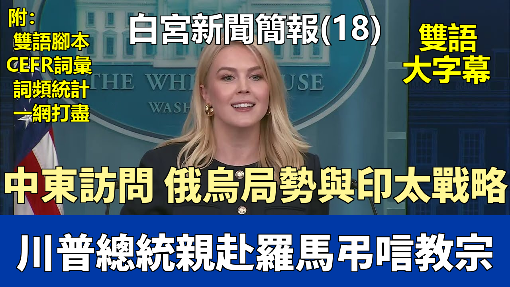

{% video youtube:KbLRCE0qHl4 width:100% autoplay:0 %}


### 【中英文双语脚本】

Good afternoon everybody. Good to see you all.
大家下午好。很高興見到大家。
The thoughts and prayers of the entire White House remain with all of the Catholics around the world
整個白宮的思想和祈禱與全世界所有天主教徒同在，
who are mourning the death of Pope Francis.
他們正在哀悼教皇方濟各的逝世。
Pope Francis touched millions of lives and dedicated his life to serving the Catholic Church.
教皇方濟各觸動了數百萬人的生命，並將自己的一生奉獻給天主教會。
As a mark of respect for his memory, President Trump ordered flags to be flown at half-staff
爲了表達對他的敬意，特朗普總統下令降半旗致哀，
and he will be traveling to attend his funeral in Rome.
他將前往羅馬參加他的葬禮。
The President will depart from Washington on Friday morning and return to the United States on Saturday evening following the funeral service.
總統將於週五早上離開華盛頓，並在葬禮儀式結束後於週六晚上返回美國。
I can also confirm the dates of the President's trip to the Middle East.
我也可以確認總統中東之行的日期。
He will travel to Saudi Arabia, Qatar, and the United Arab Emirates from May 13th until May 16th.
他將於5月13日至5月16日訪問沙特阿拉伯、卡塔爾和阿拉伯聯合酋長國。
And on Thursday of this week, President Trump will welcome the Norwegian Prime Minister at the White House for a working visit.
本週四，特朗普總統將在白宮歡迎挪威首相進行工作訪問。
The two leaders will discuss trade and regional security.
兩位領導人將討論貿易和地區安全問題。
This will be the 13th head of state visit of President Trump's term already.
這將已經是特朗普總統任期內的第13次國家元首訪問。
At the border, President Trump continues to deliver on his promise to make America safe again.
在邊境問題上，特朗普總統繼續兌現他讓美國再次安全的承諾。
The Wall Street Journal captured the Trump effect in a recent article.
《華爾街日報》在最近的一篇文章中捕捉到了特朗普效應。
"Border crossings grind to a halt as Trump's tough policies take hold."
“隨着特朗普強硬政策的實施，邊境過境活動陷於停頓。”
U.S. Customs and Border Protection recorded its lowest southwest border crossings in history in March,
美國海關和邊境保護局記錄到三月份西南邊境過境人數創歷史新低，
and we're seeing the same successes at our northern border.
我們在北部邊境也看到了同樣的成功。
Here's how the New York Post put it.
《紐約郵報》是這樣報道的。
"Northern border sector previously overrun by illegal migrants sees dramatic drop in crossings. We haven't seen anyone since November."
“先前被非法移民淹沒的北部邊境地區過境人數急劇下降。自十一月以來我們沒見過任何人。”
According to U.S. Customs and Border Protection, just 54 illegal aliens were apprehended in the Swanton sector of our northern border,
根據美國海關和邊境保護局的數據，
which stretches more than 300 miles in March.
三月份在我們北部邊境綿延超過300英里的斯旺頓地區僅逮捕了54名非法外國人。
This is a drastic 95 percent drop from the more than a thousand border crossings that were caught in March 2024.
這與2024年3月被捕的超過一千次邊境穿越相比，急劇下降了95%。
This was a main hotspot area that recorded more than 80 percent of all apprehensions along the northern border during the 2024 fiscal year.
在2024財年，這裏是一個主要熱點地區，記錄了北部邊境所有逮捕人數的80%以上。
A new report from the Washington Times fully highlights the difference
《華盛頓時報》的一篇新報道充分強調了
in Joe Biden's disgraceful approach to the border compared to President Trump's.
喬·拜登在邊境問題上可恥的做法與特朗普總統做法的不同之處。
Under Trump, border catch and release has dropped 99.99% from the worst Biden month.
在特朗普治下，邊境抓捕和釋放比拜登最糟糕的月份下降了99.99%。
You can't get much better than that. This statistic in particular is astounding.
你不可能做得比這更好了。這個統計數據尤其驚人。
Border Patrol agents caught and immediately released 189,604 illegal aliens into the United States in December 2023 at the height of the Biden border crisis.
邊境巡邏人員在2023年12月，即拜登邊境危機最嚴重的時候，抓獲並立即釋放了189,604名非法外國人進入美國。
But under President Trump, Border Patrol agents caught and released only 20 illegal aliens into the U.S. in the month of February.
但在特朗普總統治下，邊境巡邏人員在二月份僅抓獲並釋放了20名非法外國人進入美國。
Thanks to President Trump, operational control of the border is becoming a reality
感謝特朗普總統，對邊境的有效控制正在成爲現實，
and the administration's historic enforcement measures are yielding huge results.
並且本屆政府歷史性的執法措施正在產生巨大成果。
Illegal aliens are finally getting the blunt message.
非法外國人終於得到了明確的信息。
If you cross the border illegally, you will be swiftly deported and never return to the United States of America.
如果你非法越境，你將被迅速驅逐出境，並且永遠不得返回美利堅合衆國。
Efforts to arrest the criminal illegal alien invaders are continuing to ramp up.
逮捕犯罪的非法外來入侵者的努力正在繼續加強。
ICE Chicago arrested a Mexican national convicted of predatory sexual assault of a child in Cook County, Illinois.
芝加哥移民及海關執法局（ICE）逮捕了一名在伊利諾伊州庫克縣被判對兒童進行掠奪性性侵的墨西哥國民。
This week, ICE Denver arrested a Mexican national convicted of sexual assault of a child in Houston County, Texas.
本週，丹佛ICE逮捕了一名在德克薩斯州休斯頓縣被判對兒童進行性侵的墨西哥國民。
ICE Miami arrested a Nicaraguan convicted of aggravated battery in Hillsborough County, Florida.
邁阿密ICE逮捕了一名在佛羅里達州希爾斯伯勒縣被判嚴重毆擊罪的尼加拉瓜人。
ICE Houston arrested a Salvadorian national convicted of attempted sexual assault of a child and escape in Dallas County, Texas.
休斯頓ICE逮捕了一名在德克薩斯州達拉斯縣被判企圖性侵兒童和越獄罪的薩爾瓦多國民。
And ICE Chicago arrested a Mexican national convicted of aggravated sexual abuse of a minor in Illinois.
芝加哥ICE逮捕了一名在伊利諾伊州被判嚴重性虐待未成年人的墨西哥國民。
Despite the Democrats' insane objections, President Trump will continue to embolden law enforcement officers
儘管民主黨人瘋狂反對，特朗普總統將繼續鼓勵執法人員
to arrest dangerous illegal alien criminals and keep our communities safe.
逮捕危險的非法外來罪犯並保障我們社區的安全。
And also thanks to President Trump's America First economic approach, investments continue to pour into our country.
同樣，得益於特朗普總統的“美國優先”經濟方針，投資繼續涌入我們的國家。
A Swiss Pharmaceuticals Company announced it will be investing $50 billion in the United States over the next five years, creating 12,000 new quality jobs.
一家瑞士製藥公司宣佈將在未來五年內在美國投資500億美元，創造12,000個新的優質工作崗位。
Regeneron Pharmaceuticals also agreed to pay Fujifilm Technologies more than $3 billion over the next decade
再生元製藥公司也同意在未來十年內向富士膠片技術公司支付超過30億美元，
to help manufacture its medicines in the United States.
以幫助在美國生產其藥品。
It's a top priority for President Trump to ensure we are producing critical medicines and pharmaceutical drugs right here in America.
確保我們在美國本土生產關鍵藥品和藥物是特朗普總統的首要任務。
And that is exactly what we continue to see happen every day.
而這正是我們每天繼續看到發生的事情。
In other news, the Trump administration has announced we will put an end to Joe Biden's illegal student loan bailout attempts.
另外，特朗普政府已宣佈，我們將終止喬·拜登非法的學生貸款救助嘗試。
No student loan has been referred to collections since March of 2020. That comes to an end.
自2020年3月以來，沒有任何學生貸款被提交催收。這種情況即將結束。
On May 5th, the Department of Education will resume involuntary collections for borrowers with defaulted federal student loans.
5月5日，教育部將對拖欠聯邦學生貸款的借款人恢復強制催收。
The student loan portfolio controlled by the federal government is nearly $1.6 trillion.
聯邦政府控制的學生貸款組合接近1.6萬億美元。
But fewer than four out of 10 borrowers are in repayment.
但只有不到十分之四的借款人在還款。
This is unsustainable, unfair, and a huge liability for American taxpayers.
這是不可持續的、不公平的，對美國納稅人來說是一個巨大的負擔。
Debt cannot be wiped away. It just ends up getting transferred to others.
債務無法被抹去。它最終只是轉移給了其他人。
So why should Americans who didn't go to college or went to college and responsibly paid back their loans
那麼，爲什麼沒有上大學，或者上了大學並負責任地償還了貸款的美國人，
pay for the student loans of other Americans?
要爲其他美國人的學生貸款買單呢？
The Trump administration will never force taxpayers to pay student loan debts that don't belong to them.
特朗普政府絕不會強迫納稅人支付不屬於他們的學生貸款債務。
Student loan borrowers need clarity, and we're finally giving it to them.
學生貸款借款人需要明確性，我們終於給予了他們。
Borrowers will now be clearly expected to repay their loans,
現在將明確要求借款人償還貸款，
and those who default on their loan obligations will face involuntary collections.
而那些拖欠貸款義務的人將面臨強制催收。
The government can and will collect defaulted federal student loan debt by withholding money from borrowers' tax refunds, federal pensions, and even their wages.
政府能夠並且將會通過扣留借款人的退稅、聯邦養老金甚至工資來收回拖欠的聯邦學生貸款債務。
America is $36 trillion in debt. We must get our fiscal house in order and restore common sense to our country.
美國負債高達36萬億美元。我們必須整頓財政秩序，恢復國家的常識。
If you take out a loan, you have to pay it back. It's very simple.
如果你借了貸款，你就必須償還。就這麼簡單。
President Trump will not kick the can down the road anymore.
特朗普總統不會再拖延問題。
Before we open it up to questions today, I want to commend our pool photographer who is in the room with us today.
在今天開始提問之前，我想表揚一下今天和我們一起在場的我們的攝影記者。
ABC News photojournalist Melissa Young is retiring after 44 incredible years on the job, covering the White House.
美國廣播公司新聞部的攝影記者梅麗莎·楊在工作了令人難以置信的44年後即將退休，她一直負責報道白宮。
Melissa, congratulations. That's the largest round of applause I've ever heard in this room.
梅麗莎，恭喜你。這是我在這間屋子裏聽到的最熱烈的掌聲。
So there's something we can all agree on, and it's that you've had an incredible career here covering the White House.
所以，有一點我們都能達成共識，那就是你在這裏報道白宮的職業生涯非常精彩。
So congratulations to you, and we hope you enjoy retirement. Sure you will.
再次恭喜你，我們希望你享受退休生活。相信你會的。
And everybody else in the room will be very jealous of you as you're enjoying your rest.
當你享受休息時，房間裏的其他人都會非常嫉妒你。
All right, let's get to it. We have an individual in our new media seat today. His name is Tim Pool.
好了，我們開始吧。今天我們的新媒體席位上有位人士。他叫蒂姆·普爾。
He's a political commentator and a media entrepreneur with millions of followers, a very big platform.
他是一位政治評論員和媒體企業家，擁有數百萬粉絲，平臺影響力很大。
He currently hosts Timcast IRL, a daily news and discussions show,
他目前主持每日新聞和討論節目 Timcast IRL，
and The Culture War, a weekly podcast exploring cultural and political issues.
以及每週探討文化和政治問題的播客 The Culture War。
His programs feature in-depth conversations on topics such as free speech, censorship, identity politics, and societal change,
他的節目就言論自由、審查制度、身份政治和社會變革等話題進行深入對話，
often engaging with a diverse range of guests.
經常與各種各樣的嘉賓互動。
He's in Washington today because we are also hosting a local media row across the street in the Eisenhower building,
他今天在華盛頓，因爲我們也在街對面的艾森豪威爾大廈舉辦地方媒體活動，
which is a testament to our commitment to bringing new voices into the White House to cover the President and this administration.
這證明了我們致力於將新聲音引入白宮來報道總統和本屆政府。
So Tim, why don't you kick us off today?
那麼，蒂姆，你今天來開個頭怎麼樣？
Yes, many of these organizations that are represented in this room have marched in lockstep on false narratives
是的，這個房間裏代表的許多組織都在虛假敘事上步調一致，
such as the Very Fine People hoax, the Covington smear, and now what's being called the Maryland Man hoax,
例如“非常好的人”騙局、科溫頓誹謗案，以及現在被稱爲“馬里蘭男子”騙局的事件，
where an MS-13 gang member adjudicated by two different judges, I believe, is just simply being referred to as a Maryland man over and over again.
據我所知，一名經兩名不同法官裁定的MS-13幫派成員，卻被一再地簡稱爲馬里蘭男子。
Now in an effort from the White House to expand access to new companies, you've created this new media seat,
現在，白宮爲了擴大新公司的參與機會，設立了這個新媒體席位，
so I'm wondering if you can comment on the fact that following this expansion, numerous outlets have disparaged the companies that you've had sit here as well as the reporters.
所以我想知道，您能否評論一下，在這次擴展之後，許多媒體機構貶低了曾坐在這裏的公司及其記者這一事實。
I'm wondering if you can comment on the unprofessional behavior as well as elaborate on whether there are any plans to expand access to new companies.
我想知道您能否評論這種不專業的行爲，並詳細說明是否有任何計劃來擴大新公司的參與機會。
Sure, well we certainly welcome diverse viewpoints in this room, which is one of the reasons we have you in here,
當然，我們當然歡迎這個房間裏的不同觀點，這也是我們邀請你來的原因之一，
and there are many new faces in this room in comparison to the previous administrations.
與前幾屆政府相比，這個房間裏有很多新面孔。
We want to welcome all viewpoints into this room.
我們希望歡迎所有觀點進入這個房間。
We welcome unbiased journalists who really care about the truth and the facts and the accuracy,
我們歡迎那些真正關心真相、事實和準確性的、不偏不倚的記者，
and you rightfully pointed out the Maryland man story,
你正確地指出了“馬里蘭男子”的故事，
which, when the Atlantic published it, I addressed from this podium on the very first day, saying, "This is wrong."
當《大西洋月刊》發表它時，我第一天就在這個講臺上指出，“這是錯誤的。”
The press in this room has this story wrong,
這個房間裏的媒體搞錯了這個故事，
and we have seen more and more evidence come to light that we have had all along.
我們已經看到越來越多我們一直掌握的證據浮出水面。
We were always right, the president was always on the right side of this issue, to deport this illegal criminal from our community,
我們一直是對的，總統在這個問題上一直站在正確的一邊，即把這個非法罪犯驅逐出我們的社區，
and it is despicable to see the media continue to refer to this individual as someone who is just a peaceful man living his life in Maryland.
看到媒體繼續將此人稱爲只是在馬里蘭過着平靜生活的人，這是卑鄙的。
This was and always has been an illegal criminal, an MS-13 gang member, and a designated foreign terrorist,
這個人過去是，而且一直是一個非法罪犯、一名MS-13幫派成員和一名指定的外國恐怖分子，
and the administration maintains our position to deport these individuals from our community.
本屆政府堅持將這些人驅逐出我們社區的立場。
So thank you for being here, Tim. It's great to see you. Thank you. Dasha, why don't you kick us off?
所以謝謝你來到這裏，蒂姆。很高興見到你。謝謝。達莎，你來開始吧？
Thank you, Caroline. You're welcome. I really appreciate it.
謝謝你，卡羅琳。不客氣。我真的很感激。
I have two questions, one on the Pentagon and another on the economy.
我有兩個問題，一個關於五角大樓，另一個關於經濟。
You said on Fox News that the entire Pentagon is working against Secretary Hegseth,
你在福克斯新聞上說整個五角大樓都在反對赫格塞斯部長，
but the people who were fired were Hegseth's own guys, so how do you square that and what do you say to concerns that that's bad management?
但被解僱的人是赫格塞斯自己的人，那麼你如何解釋這一點？對於認爲這是管理不善的擔憂，你作何評論？
They were Pentagon employees who leaked against their boss to news agencies in this room,
他們是五角大樓的僱員，向這個房間裏的新聞機構泄露了對他們老闆不利的信息，
and it's been clear since day one from this administration that we are not going to tolerate individuals who leak to the mainstream media,
本屆政府從第一天起就明確表示，我們不會容忍向主流媒體泄密的人，
particularly when it comes to sensitive information,
尤其是在涉及敏感信息的情況下，
and the Secretary of Defense is doing a tremendous job, and he is bringing monumental change to the Pentagon,
國防部長做得非常出色，他正在給五角大樓帶來巨大的變革，
and there are a lot of people in this city who reject monumental change,
這個城市裏有很多人拒絕巨大的變革，
and I think, frankly, that's why we've seen a smear campaign against the Secretary of Defense
坦率地說，我認爲這就是爲什麼我們看到針對國防部長的抹黑運動，
since the moment that President Trump announced his nomination before the United States Senate.
自從特朗普總統在美國參議院宣佈他的提名那一刻起。
Let me reiterate, the President stands strongly behind Secretary Hegseth
讓我重申，總統堅定地支持赫格塞斯部長
in the change that he is bringing to the Pentagon and the results that he's achieved thus far speak for themselves.
以及他爲五角大樓帶來的變革，他迄今取得的成果不言自明。
Is there an FBI investigation into the leaks? The Secretary said that these people would be prosecuted, so is the FBI investigating?
聯邦調查局是否對泄密事件展開了調查？部長說這些人將被起訴，那麼聯邦調查局正在調查嗎？
You have to ask the FBI, you have to ask the Department of Justice on what they plan to do,
你得去問聯邦調查局，你得去問司法部他們計劃怎麼做，
but certainly we take leaks with the utmost seriousness across this administration.
但可以肯定的是，本屆政府上下都極其嚴肅地對待泄密事件。
You've seen people fired from the Department of Homeland Security. The President has made it clear it's an unacceptable behavior.
你已經看到有人被國土安全部解僱了。總統已經明確表示這是不可接受的行爲。
On the economy, Caroline, Peter Navarro said that it's perfectly possible to do 90 deals in 90 days.
關於經濟問題，卡羅琳，彼得·納瓦羅說在90天內達成90項交易是完全可能的。
We haven't seen one just yet. How soon might we see a deal,
我們至今還沒有看到一項交易。我們可能多快看到一項交易，
and what evidence can you share that progress is being made in these trade negotiations?
你有什麼證據可以分享，表明這些貿易談判正在取得進展？
Sure. Well, I spoke to our entire trade team this morning. There is a lot of progress being made.
當然。嗯，我今天早上和我們整個貿易團隊談過了。進展很大。
We now have 18 proposals on paper that have been brought to the trade team.
我們現在有18份書面提案已經提交給貿易團隊。
Again, these are proposals on paper that countries have proposed to the Trump administration and to our government.
再次強調，這些是各國向特朗普政府和我國政府提出的書面提案。
You have Secretary Besant, Secretary Lutnick, Ambassador Greer, NEC Director Hassett, and Peter Navarro, the entire trade team,
你有貝桑特部長、盧特尼克部長、格里爾大使、國家經濟委員會主任哈塞特和彼得·納瓦羅，整個貿易團隊，
meeting with 34 countries this week alone.
僅本週就會見了34個國家。
We are moving at Trump speed to ensure these deals are made on behalf of the American worker and the American people.
我們正以特朗普速度前進，以確保代表美國工人和美國人民達成這些協議。
And just yesterday, it seemed to get a little bit lost in the news, and I think it's a disservice to the American public that it did.
就在昨天，這件事似乎在新聞中有點被忽略了，我認爲這對美國公衆是不公平的。
The Vice President announced terms of reference for a trade deal with India. That is a big deal.
副總統宣佈了與印度達成貿易協議的職權範圍。這是一件大事。
We know when we look at the numbers, the monetary trade barriers and the non-monetary trade barriers from India,
我們知道，當我們查看數據時，印度的貨幣貿易壁壘和非貨幣貿易壁壘，
they have been ripping off the United States and American workers for a very long time.
長期以來一直在敲詐美國和美國工人。
So the fact that the Vice President with Prime Minister Modi on that trip in India announced these terms of reference,
因此，副總統在那次印度之行中與莫迪總理一起宣佈了這些職權範圍，
which is essentially a framework to move the ball forward to sign a good trade deal between our two nations,
這實質上是推動我們兩國簽署良好貿易協議的框架，
is great progress and it speaks to the work ethic and the real labor that's being put into this effort by the President's trade team.
是巨大的進步，也體現了總統貿易團隊在此項工作中付出的職業道德和辛勤勞動。
Sure. Go ahead.
當然。請講。
Do the proposals that you talk about, is that enough to extend the pauses on these reciprocal tariffs,
你談到的那些提案，是否足以延長對這些互惠關稅的暫停，
or does the President need to see, you know, these deals inked and signed to offer any sort of additional extension beyond the 90 days?
或者總統是否需要看到這些協議正式簽署才能提供超過90天的任何額外延期？
Well, look, ask me in July when the deadline hits. I know I'll be answering those questions from all of you in this room.
嗯，這樣吧，等到七月份截止日期到了再問我。我知道我會回答這個房間裏你們所有人的這些問題。
There's a lot of time left, and the President's trade team is working again at Trump speed, as quickly as they can, to ensure that these deals can be made.
還有很多時間，總統的貿易團隊再次以特朗普速度工作，盡其所能，確保這些協議能夠達成。
Are any of those conversations yet with China happening?
這些對話中有沒有與中國進行的？
I actually do have something to share on that.
關於這個我確實有信息可以分享。
I asked the President about this before coming out here, and he wanted me to share with all of you
我出來之前問過總統這個問題，他想讓我告訴大家，
that we're doing very well with respect to a potential trade deal with China.
我們在與中國達成潛在貿易協議方面進展順利。
As I mentioned, 18 proposals have now been received, and more than 100 countries around the world want to make a deal with the United States of America,
正如我提到的，現已收到18份提案，全世界有100多個國家希望與美利堅合衆國達成協議，
and the President and the administration are setting the stage for a deal with China.
總統和本屆政府正在爲與中國達成協議奠定基礎。
So we feel everyone involved wants to see a trade deal happen, and the ball is moving in the right direction. Sure.
所以我們覺得所有相關方都希望看到貿易協議達成，並且事情正朝着正確的方向發展。當然。
Setting the stage for a deal with China, what does that mean? Has the President spoken directly with Xi?
爲與中國達成協議奠定基礎，這是什麼意思？總統是否直接與習近平通話了？
I don't have anything to read out on a direct talk between the President and President Xi, but we will continue to keep you updated.
關於總統與習主席之間的直接通話，我沒有任何信息可以公佈，但我們會繼續向你們提供最新情況。
And Secretary Besant reportedly today told investors that this trade standoff with China that he expects will be de-escalating soon,
據報道，貝桑特部長今天告訴投資者，他預計與中國的貿易僵局將很快緩和，
because as he described it, reportedly the situation is unsustainable.
因爲據他所說，據報道，目前的局勢是不可持續的。
Is the President considering taking steps to de-escalate the situation?
總統是否正在考慮採取措施緩和局勢？
Again, I just read you words directly from the President of the United States. Those were moments ago. That's where his head is at right now. Sure.
再說一遍，我剛剛讀給你的是美國總統的原話。那是剛纔說的。這就是他現在的想法。當然。
Caroline, I have two questions, one on immigration and one on China. First on immigration.
卡羅琳，我有兩個問題，一個關於移民，一個關於中國。首先是移民問題。
Roughly, how many illegal immigrants and aliens do we have in our country, and how many does the administration plan on deporting?
粗略地說，我們國家有多少非法移民和外國人？政府計劃驅逐多少人？
Sure. Well, you'd have to ask the Department of Homeland Security for a specific number,
當然。嗯，具體的數字你得問國土安全部，
but we suspect it's definitely in the millions, perhaps upwards of 20 million people
但我們懷疑肯定有數百萬，可能高達2000萬人，
that were allowed into the country illegally by the previous administration.
是前任政府允許非法進入這個國家的。
And the President and his team are focused on deporting as many as we possibly can, and they are moving as quickly as possible.
總統和他的團隊正集中精力盡可能多地驅逐出境，並且他們正在儘快行動。
The President's team has made it clear we need more funding from Congress to do more.
總統的團隊已經明確表示我們需要國會提供更多資金來做更多工作。
We need more ICE agents out on the ground doing this very important work.
我們需要更多的ICE探員在實地執行這項非常重要的工作。
And we also need rogue district court judges to stop acting as judicial activists
我們還需要流氓地方法院法官停止扮演司法活動家的角色，
trying to block the administration from deporting illegal criminals from our nation's interior.
試圖阻止政府從我們國家內部驅逐非法罪犯。
The American public elected the President to do this, and he's following through with that promise.
美國公衆選舉總統來做這件事，他正在履行這一承諾。
We have over a quarter million Chinese nationals in our country right now on student visas.
我們國家現在有超過25萬持有學生簽證的中國公民。
Does the administration believe there's any national security concern
政府是否認爲這超過25萬在我們國家的中國公民
when it comes to those over a quarter million Chinese nationals in our country?
會帶來任何國家安全方面的擔憂？
Well, as you know, when it comes to foreign visas, the Secretary of State has the right to revoke visas
嗯，如你所知，在外國簽證方面，國務卿有權撤銷
of those who we feel are acting in an adversarial way to our foreign policy interests here in the United States.
那些我們認爲其行爲對我們在美國的國家利益構成敵對的人的簽證。
He has that authority according to the Immigration and Nationality Act.
根據《移民和國籍法》，他擁有這項權力。
So I would defer you to the State Department for any individual case.
所以我建議你就任何個案去諮詢國務院。
But they are looking at individuals who are given the privilege of being on a visa in our country.
但他們正在審查那些獲得特權持有我國簽證的個人。
And if they are acting, again, adversarially to our foreign policy interests, their visa can be revoked, and they should be aware of that.
如果他們的行爲，再次強調，對我們的外交政策利益具有敵意，他們的簽證可能會被吊銷，他們應該意識到這一點。
Sure. Go ahead. Yes, I'm calling on you. Thank you, Caroline.
當然。請講。是的，我叫你了。謝謝你，卡羅琳。
Over the last few weeks, several countries have warned their citizens about travel to the U.S.
過去幾周，一些國家警告其公民謹慎前往美國旅行。
and the Department of Commerce's own stats show that from a lot of countries the number of visitors is falling.
商務部自己的統計數據也顯示，來自許多國家的訪客數量正在下降。
Is there any message for people that might be reconsidering business or tourism travel to the U.S.?
對於那些可能重新考慮來美國進行商務或旅遊旅行的人，有什麼信息要傳達嗎？
Where did you see that report? It, it's just coming from the Department of Commerce.
你在哪裏看到那份報告的？它，它就是來自商務部。
Said what? It's hard to hear you. Sorry. That visitors from a lot of countries have fallen in the last three months.
說什麼？聽不太清。抱歉。是說過去三個月來自很多國家的訪客數量下降了。
I'd have to look at that report to comment on the merits of it.
我得看看那份報告才能評論其內容。
I think most people around the world recognize the United States of America is a great place to do business. It's a beautiful place to visit.
我認爲世界上大多數人都認識到美利堅合衆國是做生意的好地方。也是旅遊的好去處。
And they should certainly come here because it's a much safer country than it was four years ago under the previous president. Libby, good to see you.
他們當然應該來這裏，因爲現在的美國比四年前前任總統時期安全多了。利比，很高興見到你。
Caroline, a question about this upcoming announcement from HHS to ban food dyes.
卡羅琳，一個關於衛生與公衆服務部（HHS）即將宣佈禁止食用色素的問題。
During the first week of the administration, the FDA announced that it's pulling its plan to ban menthol cigarettes.
在本屆政府第一週，食品藥品監督管理局（FDA）宣佈撤銷其禁止薄荷醇香菸的計劃。
So two questions for you. How do you square a ban on menthol cigarettes being pulled and then announcing this ban on food dyes?
所以問你兩個問題。你怎麼解釋撤銷薄荷醇香菸禁令，然後又宣佈這項食用色素禁令？
And then how does the President feel about this upcoming ban that RFK is going to announce?
然後總統對小羅伯特·肯尼迪（RFK）即將宣佈的這項禁令感覺如何？
Sure. Well, look, the Secretary of Health and Human Services, the President nominated him because he trusts him to make this country healthy again.
當然。嗯，你看，衛生與公衆服務部部長，總統提名他，是因爲信任他能讓這個國家再次健康起來。
It's not just a slogan. It really is a movement that has broken ground across the country.
這不僅僅是一個口號。這確實是一場在全國範圍內取得突破的運動。
There are millions of people who believe in RFK Jr., Secretary Kennedy, and what he's doing.
有數百萬人民相信小羅伯特·肯尼迪，肯尼迪部長，以及他正在做的事情。
I don't want to get ahead of HHS with this historic announcement later and the details of it.
我不想在HHS稍後發佈這個歷史性公告及其細節之前搶先發言。
But obviously the Secretary feels that he has reason and evidence to announce the ban on artificial dyes later,
但顯然，部長認爲他有理由和證據在稍後宣佈禁止人工色素，
and I'll let him speak to that this afternoon. Phil.
我會讓他在今天下午對此發言。菲爾。
The President started the process of reclassifying more than 50,000 federal employees as Schedule F.
總統啓動了將超過5萬名聯邦僱員重新歸類爲F類的程序。
We've already seen this process move through a number of government agencies.
我們已經看到這個程序在多個政府機構中推進。
I'm curious, should we expect mass firings or is this a case-by-case approach, a scalpel or a sledgehammer?
我很好奇，我們應該預期大規模解僱嗎？還是這是一個逐案處理的方法，是手術刀還是大錘？
Well, look, as you saw on Friday, the President put out a statement about it.
嗯，你看，正如你週五看到的，總統就此發表了一份聲明。
The Office of Personnel Management reclassified workers. They're now called Schedule Policy/Career.
人事管理辦公室對工作人員進行了重新分類。他們現在被稱爲政策/職業類（Schedule Policy/Career）。
And all the President is trying to do is ensure that federal workers are being held accountable for corrupt behavior.
總統所做的一切是爲了確保聯邦工作人員對其腐敗行爲負責。
If they are engaging in corruption as a government worker, they should no longer have their job. I think that's pretty common sense.
如果他們作爲政府工作人員從事腐敗活動，他們就不應該再擁有這份工作。我認爲這是很基本的常識。
He also believes that bureaucrats should be acting in accordance with the will of the American public,
他還認爲，官僚們應該按照美國公衆的意願行事，
who duly elected this President, not just this President, but all future Presidents.
是美國公衆正式選舉了這位總統，不僅僅是這位總統，也包括所有未來的總統。
If you work for the government, you should be adhering to the will of the American public and advancing the administration's goals and interests.
如果你爲政府工作，你應該遵守美國公衆的意願，並推進政府的目標和利益。
And if you are not doing that, then you should go find another job whose interests you align with.
如果你沒有這樣做，那麼你應該去找另一份符合你利益的工作。
So as for specific firings, I would defer you to the specific agencies.
因此，關於具體的解僱情況，我會建議你諮詢具體的機構。
But the President, in this move by the Office of Personnel Management, it will make it easier to get rid of rogue bureaucrats who are engaging in corruption.
但是，總統通過人事管理辦公室的這一舉措，將更容易清除那些從事腐敗活動的流氓官僚。
And then another quick question about Google. Real quick.
然後還有一個關於谷歌的快速問題。很快。
A federal court ruled last Thursday that Google's dominance of online advertising and tech markets violated U.S. antitrust laws.
一家聯邦法院上週四裁定，谷歌在在線廣告和技術市場的主導地位違反了美國反壟斷法。
I know the President has spoken to a number of folks in big tech, and Google's CEO was even at his inauguration.
我知道總統與科技巨頭的一些人士談過話，谷歌的CEO甚至出席了他的就職典禮。
I'm curious, what is the President's reaction to that court ruling?
我很好奇，總統對那項法院裁決有何反應？
I'll have to ask him, and I'll get back to you, Phil. You're welcome. John.
我得問問他，然後回覆你，菲爾。不客氣。約翰。
Thanks a lot, Caroline. Some economic questions for you.
非常感謝，卡羅琳。有幾個經濟問題問你。
Kevin Hassett has been a key economic advisor to the President in both of his terms. In 2022, he said that the independence of the Fed is super important.
凱文·哈塞特在總統兩屆任期內都是關鍵的經濟顧問。2022年，他說美聯儲的獨立性極其重要。
That's a direct quote. Is that something that the President subscribes to? Does he still believe in the independence of the Federal Reserve?
這是原話。總統是否認同這一點？他是否仍然相信美聯儲的獨立性？
Look, I think the President has made his position on the Fed and on Powell quite clear.
聽着，我認爲總統在美聯儲和鮑威爾問題上的立場已經相當明確。
The President believes that they have been making moves and taking action in the name of politics, rather than in the name of what's right for the American economy.
總統認爲，他們一直在以政治的名義而不是以對美國經濟有利的名義採取行動。
The President has the right to express his displeasure with the Fed, and he has the right to say he believes interest rates should be lower.
總統有權表達他對美聯儲的不滿，他有權說他認爲利率應該更低。
He believes Americans should be able to borrow money cheaper than they currently are right now.
他認爲美國人應該能夠以比現在更便宜的價格借到錢。
And I also spoke to Kevin Hassett about the Fed as well, and he has called into question the Fed's independence
我也和凱文·哈塞特談過美聯儲的問題，他質疑了美聯儲的獨立性，
and whether they are actually doing things, again, in the best interest of the economy, or are they doing it for partisan reasons?
以及他們是否真的是再次爲了經濟的最佳利益行事，還是出於黨派原因？
The President wants to see interest rates lower. He has made that quite clear.
總統希望看到利率降低。他已經說得很清楚了。
We've also seen the dollar at multi-year lows versus the euro and other currencies around the world.
我們也看到美元兌歐元和世界其他貨幣處於多年低點。
Is it the administration's policy for a strong dollar? How does it view the dollar versus other currencies around the world?
政府的政策是支持強勢美元嗎？它如何看待美元相對於世界其他貨幣的地位？
The President wants to see the dollar remain as the world's reserve currency for our long-term fiscal stability and our economic growth. He's been quite clear about that.
總統希望看到美元爲了我們長期的財政穩定和經濟增長而繼續保持世界儲備貨幣的地位。他對此一直很明確。
Sure. And then to the woman behind you, who I haven't seen before, welcome. Go ahead, Mary.
當然。然後請你後面的那位女士提問，我以前沒見過你，歡迎。請講，瑪麗。
Earth Day and then the Supreme Court, if that's okay. That's right. It's Earth Day. Yes. Happy Earth Day, everyone.
地球日，然後是最高法院，如果可以的話。是的。今天是地球日。是的。大家地球日快樂。
I saw the President truthing about the garbage pileup from China and the Pacific,
我看到總統在Truth Social上發帖談論來自中國和太平洋的垃圾堆積問題，
and then I believe Lee Zeldin is headed to San Diego to investigate the pile of sewage from Mexico.
然後我相信李·澤爾丁正前往聖地亞哥調查來自墨西哥的污水堆積問題。
Can you speak to what the White House has planned for Earth Day and anything in that arena?
你能談談白宮爲地球日計劃了什麼以及在該領域有什麼安排嗎？
Sure. I do have points from the EPA. Administrator Zeldin is doing a fantastic job,
當然。我確實有環保局（EPA）提供的信息。澤爾丁局長工作做得非常出色，
and they are always sharing their accomplishments with the White House, which we very much appreciate.
他們總是與白宮分享他們的成就，對此我們非常感激。
He will be traveling, I believe he's in California today, for the sewage situation. Here you go.
他將出行，我相信他今天在加利福尼亞，處理污水問題。給你信息。
Administrator Zeldin met with his Mexican counterpart to discuss steps Mexico needs to take to ensure the water entering the United States is clean and safe,
澤爾丁局長會見了他的墨西哥同行，討論墨西哥需要採取哪些步驟來確保進入美國的水是乾淨和安全的，
and he's holding a press conference in San Diego today with elected officials and local stakeholders on the Tijuana River sewage crisis.
他今天正在聖地亞哥與當選官員和當地利益相關者就蒂華納河污水危機舉行新聞發佈會。
I would also add from the President himself, he has always maintained he wants America to have the cleanest air and the cleanest water,
我還要補充一點來自總統本人的信息，他一直堅持希望美國擁有最清潔的空氣和最清潔的水，
and we want to do what's right for our environment and for our Earth,
我們希望爲我們的環境和地球做正確的事情，
and a lot of that is making sure that we have clean and sustainable energy,
其中很大一部分是確保我們擁有清潔和可持續的能源，
and we know that we produce natural gas cleaner and more efficiently than any country in this world, and the President wants to see that continue.
我們知道我們生產天然氣比世界上任何國家都更清潔、更高效，總統希望這種情況繼續下去。
Thank you. And then on the Supreme Court, I know the Court is hearing a case dealing with parents
謝謝。然後關於最高法院，我知道法院正在審理一個涉及家長的案件，
who don't want their kids having to read gender ideology books in schools.
這些家長不希望他們的孩子在學校裏必須閱讀涉及性別意識形態的書籍。
Can you comment on that case and what the Trump administration hopes to see come from that? Sure.
你能評論一下這個案件以及特朗普政府希望從中看到什麼結果嗎？當然。
We hope the Supreme Court will do the right thing, and the President has been very clear.
我們希望最高法院會做正確的事情，總統已經非常明確。
He stands on the side of parental rights, and he believes strongly that parents should have a greater say in their children's education
他站在家長權利一邊，他堅信家長應該在子女的教育中有更大的發言權，
and the content, if you will, that children are being exposed to in our public school system.
以及孩子們在我們公立學校系統中接觸到的內容（如果你願意這麼說的話）。
Sure. Go ahead. Hi. I'm Carolina Lumetta with World News Group.
當然。請講。你好。我是世界新聞集團的卡羅萊娜·盧梅塔。
The administration ended some temporary protections for Afghans, including several hundred Christians who have been punished by the Taliban.
政府終止了對阿富汗人的一些臨時保護措施，其中包括數百名受到塔利班懲罰的基督徒。
Is the President considering any exceptions for Afghans who could face death or torture if they return to their home country?
總統是否正在考慮爲那些返回祖國可能面臨死亡或酷刑的阿富汗人提供任何例外？
So let's just be clear about one thing. We didn't end that proactively. It expired,
那麼，我們先明確一點。我們並非主動結束該計劃。它到期了，
and it's because the previous administration illegally paroled hundreds of thousands of people into the country
這是因爲前任政府非法地將數十萬人假釋進入這個國家，
and then gave them temporary protective status, which again is a temporary status. It's not a permanent status in this country.
然後給予他們臨時保護身份，這再次強調，是一個臨時身份。這不是在這個國家的永久身份。
And if there are individuals here who came in through the Biden administration who want to claim asylum, there is a legal process to do that.
如果這裏有通過拜登政府進來並想申請庇護的人，有合法的程序可以做到這一點。
Those cases will be adjudicated by a judge on a case-by-case basis.
這些案件將由法官逐案裁決。
We have a legal immigration process in this country for a reason, and all this administration is trying to do is effectuate that. Reagan.
我們國家設立合法的移民程序是有原因的，本屆政府所做的就是執行它。里根。
Thank you, Caroline. I have two questions for you on immigration.
謝謝你，卡羅琳。我有兩個關於移民的問題問你。
March deportation numbers were down slightly from the same time period last year.
三月份的驅逐出境人數與去年同期相比略有下降。
SCOTUS recently ordered a pause on deporting Chaldean Iraqi members with the Alien Enemies Act.
最高法院（SCOTUS）最近下令暫停使用《外僑敵人法》驅逐迦勒底伊拉克成員。
I'm curious what other tools the administration is looking at to boost those deportation numbers. Sure.
我很好奇政府正在考慮使用哪些其他工具來提高驅逐人數。當然。
Well, we are obviously complying with the court's order. However, it was a temporary pause.
嗯，我們顯然在遵守法院的命令。然而，那只是一個暫時的暫停。
The Supreme Court basically said sit tight and they will follow up with an order,
最高法院基本上是說原地待命，他們會隨後發佈命令，
and we're confident that the Supreme Court will rule on the side of law
我們相信最高法院將依法裁決，
and recognize the President absolutely has the executive authority to deport foreign terrorists from our nation's interior under the Alien Enemies Act.
並承認總統絕對擁有根據《外僑敵人法》從我們國家內部驅逐外國恐怖分子的行政權力。
We feel very strongly about that, and we're confident the courts will side with the President and his executive authority.
我們對此感覺非常強烈，並且相信法院會支持總統及其行政權力。
As for deportations, we continue to deport illegal criminals under Title 8,
至於驅逐出境，我們繼續根據《美國法典》第8條驅逐非法罪犯，
which is an immigration authority given to our Border Patrol agents and the Department of Homeland Security to deport illegal criminals from this country,
這是賦予我們邊境巡邏人員和國土安全部從這個國家驅逐非法罪犯的移民權力，
and the administration continues to do that at record speed as quickly as they can with the resources that they have.
本屆政府繼續以創紀錄的速度，利用現有資源儘快地這樣做。
The DOJ recently dropped charges against the MS-13 leader in Woodbridge, Virginia with the idea that this will expedite the deportation process.
司法部（DOJ）最近撤銷了對弗吉尼亞州伍德布里奇一名MS-13頭目的指控，意在加快驅逐程序。
Does the administration plan to drop charges against other criminal illegals to speed along the deportation process?
政府是否計劃撤銷對其他犯罪非法移民的指控以加快驅逐進程？
You'd have to ask the Department of Justice. Obviously, that's within their purview and I can't speak for them.
你得去問司法部。顯然，這在他們的職權範圍內，我不能替他們發言。
However, it is our goal to deport as many illegal criminals and aliens from our country as we possibly can as quickly as we can. Jackie.
然而，我們的目標是儘可能快地、儘可能多地將非法罪犯和外國人驅逐出我們的國家。傑基。
Thank you, Caroline. We've heard so much about this Saudi trip planning and the President's mentioned it himself before,
謝謝你，卡羅琳。我們聽到了很多關於這次沙特之行計劃的消息，總統本人之前也提到過，
but I don't think we've ever heard on the record what he hopes to achieve in Saudi Arabia and what the purpose of the trip is. Sure.
但我認爲我們從未公開聽說過他希望在沙特阿拉伯實現什麼目標以及這次訪問的目的是什麼。當然。
Well, the President looks forward to this. It was supposed to be his first foreign visit,
嗯，總統對此很期待。這本應是他的首次外訪，
but of course now he is going to Rome this weekend to honor the Pope and attend the funeral.
但當然，他現在本週末要去羅馬向教皇致敬並參加葬禮。
The President looks to strengthen the ties between the United States and these countries that he will be visiting.
總統希望加強美國與他將要訪問的這些國家之間的聯繫。
He'll be having many bilateral meetings and talks, and we look forward to the trip and hope to see many of you there.
他將舉行許多雙邊會談和討論，我們期待這次訪問，並希望在那裏見到你們中的許多人。
And the meetings in London this week, do they have any nexus with the plans in Saudi Arabia?
本週在倫敦的會議是否與沙特阿拉伯的計劃有任何聯繫？
I can't speak to that. However, I do have an update on meetings when it comes to the Russia-Ukraine war.
我不能對此發表評論。然而，關於俄烏戰爭的會議，我確實有最新消息。
I was just in the Oval Office with the President and Steve Witkoff, and they wanted everybody to know that the negotiations continue.
我剛纔在橢圓形辦公室和總統以及史蒂夫·威特科夫在一起，他們希望大家知道談判仍在繼續。
We feel, again, we're hopefully moving in the right direction,
我們再次感到，我們有希望朝着正確的方向前進，
and the Special Envoy Steve Witkoff will be heading to Russia again later this week to continue talks with Vladimir Putin.
特使史蒂夫·威特科夫將於本週晚些時候再次前往俄羅斯，繼續與弗拉基米爾·普京會談。
Is that why Rubio is not heading to London? Is he accompanying Witkoff to Moscow?
這就是盧比奧不去倫敦的原因嗎？他是否陪同威特科夫去莫斯科？
I can't speak for the Secretary of State's travel schedule. I'd defer you to the Department of State.
我無法評論國務卿的旅行日程。我建議你諮詢國務院。
And more broadly, just about the peace agreement, the talks that are ongoing, Secretary Rubio had said
更廣泛地說，關於和平協議，正在進行的談判，盧比奧部長曾說過，
that if things don't go the right way, that the U.S. might need to take a step back.
如果事情進展不順利，美國可能需要退後一步。
What does stepping back look like? Does that mean a step back from brokering peace,
退後一步是什麼樣子？是指退出斡旋和平嗎？
or would that imply a broader withdrawal from U.S. support for Ukraine?
還是意味着更廣泛地撤回美國對烏克蘭的支持？
Look, I think it would be unwise for me to broadcast that from this podium.
聽着，我認爲從這個講臺上公佈這一點是不明智的。
Ultimately, that's a decision for the President to make, but he's made it very clear he wants to see peace,
最終，這是總統要做的決定，但他已經非常明確地表示他希望看到和平，
he wants to see this war end, and he wants to stop the killing on both sides of this war.
他希望這場戰爭結束，他希望停止戰爭雙方的殺戮。
And he's been very clear about that for quite some time, and he has grown frustrated with both sides of this war, and he's made that well known. Caroline. Thank you.
他對此已經明確表示了相當長一段時間，他對戰爭雙方都感到越來越沮喪，並且他已廣爲人知這一點。卡羅琳。謝謝。
Last week, the President talked about non-profit groups, specifically taking on CREW,
上週，總統談到了非營利組織，特別是針對CREW（華盛頓責任與道德公民組織），
and he hinted that there could be further actions taken against non-profits.
他暗示可能會對非營利組織採取進一步行動。
Does the White House have any plans for any sort of actions against NGOs, non-profits, or other similar groups?
白宮是否有任何針對非政府組織（NGOs）、非營利組織或其他類似團體的行動計劃？
Is any of that coming up? Is that being worked on at this time?
這些計劃即將出臺嗎？目前正在進行中嗎？
I'll have to check in with our policy team and get back to you. Sure.
我得和我們的政策團隊覈實一下再回復你。當然。
Thank you, Caroline. Travis Gilmore with the Epoch Times.
謝謝你，卡羅琳。《大紀元時報》的特拉維斯·吉爾摩。
Are some colleges using taxpayer funds to further political agendas, and what is the administration's response to Harvard's lawsuit? Sure.
是否有部分大學利用納稅人資金推進政治議程？政府對哈佛大學的訴訟有何迴應？當然。
Well, the President has made it quite clear that it's Harvard who has put themselves in the position to lose their own funding by not obeying federal law,
嗯，總統已經非常明確地表示，是哈佛大學自己不遵守聯邦法律，才使自己處於失去資金的境地，
and we expect all colleges and universities who are receiving taxpayer funds to abide by federal law.
我們期望所有接受納稅人資金的高校都遵守聯邦法律。
It's quite simple, and the President made it clear he's not going to tolerate violations of federal law.
這很簡單，總統明確表示他不會容忍違反聯邦法律的行爲。
He's not going to tolerate illegal harassment and violence towards Jewish American students or students of any faith on our campuses across the country.
他不會容忍在我們全國各地的校園裏針對猶太裔美國學生或任何信仰的學生的非法騷擾和暴力。
And so we will be responding to the lawsuit in court, and again, it's quite simple. If you want federal dollars, obey federal law.
因此我們將在法庭上回應這起訴訟，再說一遍，這很簡單。如果你想要聯邦資金，就遵守聯邦法律。
And just to quickly follow up on China, any response to reports that China is targeting U.S. trade allies
快速跟進一下中國問題，對於有報道稱中國正在針對支持美國議程的美國貿易盟友
with potential retaliatory measures for supporting U.S. agendas?
採取潛在報復措施，有何迴應？
I think the numbers and the sheer number of countries that have reached out to the United States
我認爲那些聯繫美國、聯繫本屆政府
and reached out to this administration to cut good trade deals speak for themselves.
以達成良好貿易協議的國家數量本身就說明了問題。
The entire world knows that they need the United States of America, and they want to do business here.
全世界都知道他們需要美利堅合衆國，他們想在這裏做生意。
And so we'll stay focused on cutting good trade deals on behalf of the American worker. Stephanie. Thank you, Caroline.
因此，我們將繼續專注於代表美國工人達成良好的貿易協議。斯蒂芬妮。謝謝你，卡羅琳。
Can you give us any additional details from the President's call with Netanyahu today?
你能提供更多關於總統今天與內塔尼亞胡通話的細節嗎？
Oh, I did speak to the President about it. It was a good call.
哦，我確實和總統談過這件事了。這是一次很好的通話。
They spoke particularly about Iran and the negotiations that are underway with Iran and the United States.
他們特別談到了伊朗以及正在進行的與伊朗和美國的談判。
And the President has made it very clear repeatedly, but I'll reiterate,
總統已經反覆明確表示，但我還是要重申，
there is no daylight between the United States of America and the state of Israel. He stands strongly behind our ally.
美利堅合衆國和以色列國之間沒有任何分歧。他堅定地支持我們的盟友。
He's made it quite clear when it comes to Iran that we want to see a deal, and Iran has a choice to make.
在伊朗問題上，他已經非常明確地表示我們希望達成協議，伊朗需要做出選擇。
But the President has also made it very clear, and he reiterated that in his call with Prime Minister Netanyahu today
但總統也已經非常明確，並且在今天與內塔尼亞胡總理的通話中重申了這一點，
about the need for Iran to never obtain a nuclear weapon.
即伊朗絕不能獲得核武器的必要性。
I do have one more bit of news that I would like to share with all of you. Just give me one second to find it.
我還有一條消息想和大家分享。請給我一秒鐘找一下。
And it's in regards to the terrorist attack that took place in India earlier today.
這是關於今天早些時候在印度發生的恐怖襲擊事件。
The President has been briefed by the National Security Advisor, and he's being kept up to speed as more facts are learned.
總統已聽取國家安全顧問的簡報，並且隨着更多事實的瞭解，他會持續跟進最新情況。
What we know already is dozens were killed and even more were injured in a brutal terrorist attack in a popular tourist location in South Kashmir.
我們已經知道的是，在南克什米爾一個熱門旅遊地點發生了一起殘酷的恐怖襲擊，造成數十人死亡，更多人受傷。
President Trump will be speaking with Prime Minister Modi as soon as he possibly can to express his heartfelt condolences for those lost.
特朗普總統將盡快與莫迪總理通話，對遇難者表示誠摯的哀悼。
And our prayers are with those injured and our nation's support for our ally India.
我們的祈禱與傷者同在，我們國家支持我們的盟友印度。
These types of horrific events by terrorists are why those of us who work for peace and stability in the world continue our mission.
恐怖分子製造的這類可怕事件正是我們這些爲世界和平與穩定而努力的人繼續我們使命的原因。
So we'll give you a readout of that call later this afternoon. There's a lot of work to be had.
所以我們會在今天下午晚些時候向你們通報那次通話的內容。還有很多工作要做。
You may hear from the President later this afternoon as well, and we'll see you all later.
今天下午晚些時候你們可能也會聽到總統的消息，我們稍後再見。

### 【核心词汇 - B1_C2】
| 單詞 | 音標 | 詞性 | 釋義 | 等級 | 次數 |
|---|---|---|---|---|---|
| Atlantic | /ətˈlæntɪk/ | adjective | 大西洋的 | B1 | 1 |
| Christian | /ˈkrɪstʃən/ | adjective | 基督教的，信基督教的 | B1 | 1 |
| Department | /dɪˈpɑːrtmənt/ | noun | 部門，部 | B1 | 1 |
| Security | /sɪˈkjʊrəti/ | noun | 安全 | B1 | 1 |
| able | /ˈeɪbl/ | adjective | 能夠；有能力的 | B1 | 1 |
| absolutely | /ˌæbsəˈluːtli/ | adverb | 絕對地；完全地 | B1 | 1 |
| access | /ˈækses/ | noun | 進入；通道；使用權 | B1 | 1 |
| accompany | /əˈkʌmpəni/ | verb | 陪伴；伴隨 | B1 | 1 |
| accuracy | /ˈækjərəsi/ | noun | 準確性，精確性 | B1 | 1 |
| administration | /ədˌmɪnɪˈstreɪʃn/ | noun | 管理，行政 | B1 | 3 |
| advance | /ədˈvæns/ | verb | 前進，進步 | B1 | 1 |
| agenda | /əˈdʒendə/ | noun | 議程 | B1 | 1 |
| agreement | /əˈɡriːmənt/ | noun | 協議，同意 | B1 | 1 |
| alien | /ˈeɪliən/ | noun | 外星人 | B1 | 3 |
| announce | /əˈnaʊns/ | verb | v. 宣佈；宣告 | B1 | 3 |
| announcement | /əˈnaʊnsmənt/ | noun | n. 聲明；公告 | B1 | 1 |
| applause | /əˈplɔːz/ | noun | n. 掌聲 | B1 | 1 |
| approach | /əˈproʊtʃ/ | noun | n. 方法；接近；途徑 | B1 | 1 |
| arrest | /əˈrest/ | noun | 逮捕，拘留 | B1 | 2 |
| attend | /əˈtend/ | verb | 出席，參加 | B1 | 1 |
| authority | /əˈθɔːrəti/ | noun | 權威，權力 | B1 | 1 |
| aware | /əˈwer/ | adjective | 知道的，意識到的 | B1 | 1 |
| basis | /ˈbeɪsɪs/ | noun | 基礎，根據 | B1 | 1 |
| behalf | /bɪˈhæf/ | noun | 代表 | B1 | 1 |
| border | /ˈbɔːrdər/ | noun | 邊界；邊境 | B1 | 1 |
| brief | /briːf/ | adjective | 簡短的；簡潔的 | B1 | 1 |
| broad | /brɔːd/ | adjective | 寬闊的；廣泛的 | B1 | 1 |
| broadcast | /ˈbrɔːdkæst/ | noun | 廣播節目；廣播 | B1 | 1 |
| capture | /ˈkæptʃər/ | noun | 捕獲；俘獲 | B1 | 1 |
| career | /kəˈrɪr/ | noun | 職業；生涯 | B1 | 1 |
| charge | /tʃɑːrdʒ/ | noun | 費用，指控，主管 | B1 | 1 |
| comment | /ˈkɑːment/ | noun | 評論，意見 | B1 | 1 |
| comparison | /kəmˈpærɪsn/ | noun | 比較，對比 | B1 | 1 |
| confirm | /kənˈfɜːrm/ | verb | v. 確認，證實 | B1 | 1 |
| congratulation | /kənˌɡrætʃəˈleɪʃn/ | noun | 祝賀 | B1 | 1 |
| content | /kənˈtent/ | noun | n. 內容，目錄 | B1 | 1 |
| criminal | /ˈkrɪmɪnl/ | noun | 罪犯 | B1 | 2 |
| crisis | /ˈkraɪsɪs/ | noun | 危機 | B1 | 1 |
| critical | /ˈkrɪtɪkl/ | adjective | 關鍵的，批判性的 | B1 | 1 |
| crossing | /ˈkrɔːsɪŋ/ | noun | 十字路口，橫渡 | B1 | 1 |
| cultural | /ˈkʌltʃərəl/ | adjective | 文化的 | B1 | 1 |
| curious | /ˈkjʊriəs/ | adjective | 好奇的 | B1 | 1 |
| currency | /ˈkɜːrəntsi/ | noun | 貨幣 | B1 | 2 |
| currently | /ˈkɜːrəntli/ | adverb | 目前，現在 | B1 | 1 |
| deadline | /ˈdedlaɪn/ | noun | 截止日期；最後期限 | B1 | 1 |
| debt | /det/ | noun | 債務；欠款 | B1 | 3 |
| decision | /dɪˈsɪʒn/ | noun | 決定；決策 | B1 | 1 |
| definitely | /ˈdefɪnətli/ | adverb | 明確地；肯定地 | B1 | 1 |
| deliver | /dɪˈlɪvər/ | verb | 遞送；傳送；發表 | B1 | 1 |
| depart | /dɪˈpɑːrt/ | verb | 離開；出發 | B1 | 1 |
| despite | /dɪˈspaɪt/ | preposition | 儘管，雖然 | B1 | 1 |
| directly | /dəˈrektli/ | adverb | 直接地；立即 | B1 | 1 |
| district | /ˈdɪstrɪkt/ | noun | 地區，區域 | B1 | 1 |
| diverse | /daɪˈvɜːrs/ | adjective | 多樣的 | B1 | 1 |
| dozen | /ˈdʌzn/ | determiner | 一打 | B1 | 1 |
| dramatic | /drəˈmætɪk/ | adjective | 戲劇性的，引人注目的 | B1 | 1 |
| economic | /ˌekəˈnɑːmɪk/ | adjective | 經濟的 | B1 | 1 |
| economy | /iˈkɑːnəmi/ | noun | 經濟 | B1 | 1 |
| enemy | /ˈenəmi/ | noun | 敵人；仇敵；敵軍 | B1 | 1 |
| ensure | /ɪnˈʃʊr/ | verb | 確保；保證 | B1 | 1 |
| entire | /ɪnˈtaɪər/ | adjective | 整個的；全部的 | B1 | 1 |
| expand | /ɪkˈspænd/ | verb | 擴張；擴大 | B1 | 1 |
| expose | /ɪkˈspoʊz/ | verb | 暴露；揭露 | B1 | 1 |
| extend | /ɪkˈstend/ | verb | 延伸；延長 | B1 | 1 |
| fallen | /ˈfɔːlən/ | adjective | 倒下的；掉落的 | B1 | 1 |
| false | /fɔːls/ | adjective | 假的，錯誤的 | B1 | 1 |
| folk | /foʊk/ | noun | 人們；(某一羣體的) 人 | B1 | 1 |
| frustrated | /ˈfrʌstreɪtɪd/ | adjective | 感到沮喪的，灰心的 | B1 | 1 |
| fund | /fʌnd/ | noun | 資金，基金 | B1 | 1 |
| funeral | /ˈfjuːnərəl/ | noun | 葬禮 | B1 | 1 |
| growth | /ɡroʊθ/ | noun | 成長，增長 | B1 | 1 |
| hearing | /ˈhɪrɪŋ/ | noun | 聽力; 聽覺; 聽證會 | B1 | 1 |
| height | /haɪt/ | noun | 高度 | B1 | 1 |
| highlight | /ˈhaɪlaɪt/ | verb | 突出; 強調 | B1 | 1 |
| historic | /hɪˈstɔːrɪk/ | adjective | 歷史性的; 具有歷史意義的 | B1 | 1 |
| hopefully | /ˈhoʊpfəli/ | adverb | 但願; 希望如此 | B1 | 1 |
| huge | /hjuːdʒ/ | adjective | 巨大的 | B1 | 1 |
| identity | /aɪˈdentəti/ | noun | 身份，同一性 | B1 | 1 |
| illegally | /ɪˈliːɡəli/ | adverb | 非法地 | B1 | 1 |
| immediately | /ɪˈmiːdiətli/ | adverb | 立即，馬上 | B1 | 1 |
| immigration | /ˌɪmɪˈɡreɪʃən/ | noun | 移民，移民局 | B1 | 1 |
| incredible | /ɪnˈkredəbl/ | adjective | 難以置信的，極好的 | B1 | 1 |
| individual | /ˌɪndɪˈvɪdʒuəl/ | adjective | 個人的，單獨的 | B1 | 2 |
| ink | /ɪŋk/ | noun | 墨水 | B1 | 1 |
| insane | /ɪnˈseɪn/ | adjective | 精神失常的，瘋狂的 | B1 | 1 |
| invest | /ɪnˈvest/ | verb | 投資 | B1 | 1 |
| investigation | /ɪnˌvestɪˈɡeɪʃən/ | noun | 調查 | B1 | 1 |
| involved | /ɪnˈvɑːlvd/ | adjective | 參與的，捲入的 | B1 | 1 |
| jealous | /ˈdʒeləs/ | adjective | 嫉妒的，羨慕的 | B1 | 1 |
| journalist | /ˈdʒɜːrnəlɪst/ | noun | 記者 | B1 | 1 |
| killing | /ˈkɪlɪŋ/ | noun | 殺戮，謀殺 | B1 | 1 |
| legal | /ˈliːɡəl/ | adjective | 法律的，合法的 | B1 | 1 |
| location | /loʊˈkeɪʃn/ | noun | 地點，位置 | B1 | 1 |
| main | /meɪn/ | adjective | 主要的 | B1 | 1 |
| maintain | /meɪnˈteɪn/ | verb | 維持，維護 | B1 | 2 |
| management | /ˈmænɪdʒmənt/ | noun | 管理，經營 | B1 | 1 |
| march | /mɑːrtʃ/ | noun | 三月，行軍 | B1 | 1 |
| mass | /mæs/ | adjective | 大量的，大規模的 | B1 | 1 |
| measure | /ˈmeʒər/ | noun | 措施，方法；計量單位；程度 | B1 | 1 |
| mile | /maɪl/ | noun | 英里 | B1 | 1 |
| minor | /ˈmaɪnər/ | adjective | 較小的；次要的 | B1 | 1 |
| mission | /ˈmɪʃn/ | noun | 任務；使命 | B1 | 1 |
| mourn | /mɔːrn/ | verb | 哀悼；哀傷 | B1 | 1 |
| movement | /ˈmuːvmənt/ | noun | 運動；移動；樂章 | B1 | 1 |
| narrative | /ˈnærətɪv/ | adjective | 敘述的；敘事的 | B1 | 1 |
| negotiation | /nɪˌɡoʊʃiˈeɪʃn/ | noun | 談判，協商 | B1 | 1 |
| northern | /ˈnɔrðərn/ | adjective | 北方的 | B1 | 1 |
| nuclear | /ˈnukliər/ | adjective | 核的，核能的 | B1 | 1 |
| numerous | /ˈnumərəs/ | adjective | 衆多的，大量的 | B1 | 1 |
| objection | /əbˈdʒɛkʃən/ | noun | 反對 | B1 | 1 |
| obtain | /əbˈteɪn/ | verb | 獲得 | B1 | 1 |
| obviously | /ˈɑbviəsli/ | adverb | 顯然地 | B1 | 2 |
| organization | /ˌɔːrɡənɪˈzeɪʃn/ | noun | 組織 | B1 | 1 |
| parental | /pəˈrɛntl/ | adjective | 父母的 | B1 | 1 |
| particularly | /pərˈtɪkjələrli/ | adverb | 特別地，尤其 | B1 | 1 |
| pause | /pɔz/ | noun | 暫停，停頓 | B1 | 2 |
| permanent | /ˈpɜrmənənt/ | adjective | 永久的，永恆的；常設的 | B1 | 1 |
| planned | /plænd/ | adjective | 計劃好的 | B1 | 1 |
| platform | /ˈplætˌfɔrm/ | noun | 平臺；站臺；講臺 | B1 | 1 |
| policy | /ˈpɑləsi/ | noun | 政策，方針；保險單 | B1 | 2 |
| politics | /ˈpɑləˌtɪks/ | noun | 政治；政治學；政治活動；政事 | B1 | 1 |
| potential | /pəˈtenʃl/ | noun | 潛力；可能性 | B1 | 1 |
| prayer | /prer/ | noun | 祈禱；禱告 | B1 | 1 |
| president | /ˈprezɪdənt/ | noun | 總統；主席；校長 | B1 | 1 |
| press | /pres/ | noun | 報刊；新聞界；出版社；印刷機 | B1 | 1 |
| previous | /ˈpriːviəs/ | adjective | 先前的；以前的 | B1 | 1 |
| process | /ˈprɑːses/ | noun | 過程，程序 | B1 | 1 |
| progress | /ˈprɑːɡres/ | noun | 進步，進展 | B1 | 1 |
| proposal | /prəˈpoʊzl/ | noun | 提議，建議 | B1 | 1 |
| propose | /prəˈpoʊz/ | verb | 提議，建議，求婚 | B1 | 1 |
| protection | /prəˈtekʃn/ | noun | 保護 | B1 | 1 |
| protective | /prəˈtektɪv/ | adjective | 保護性的 | B1 | 1 |
| punish | /ˈpʌnɪʃ/ | verb | 懲罰 | B1 | 1 |
| reality | /riˈæləti/ | noun | 現實，實際 | B1 | 1 |
| refund | /ˈriːfʌnd/ | noun | 退款 | B1 | 1 |
| regional | /ˈriːdʒənəl/ | adjective | 地區的，區域的 | B1 | 1 |
| reject | /rɪˈdʒekt/ | verb | 拒絕，駁回 | B1 | 1 |
| repay | /rɪˈpeɪ/ | verb | 償還，報答 | B1 | 1 |
| repeatedly | /rɪˈpiːtɪdli/ | adverb | 重複地，再三地 | B1 | 1 |
| reserve | /rɪˈzɜːrv/ | noun | 儲備，儲備物 | B1 | 1 |
| resource | /ˈriːsɔːrs/ | noun | 資源 | B1 | 1 |
| respect | /rɪˈspekt/ | noun | 尊敬，尊重 | B1 | 1 |
| respond | /rɪˈspɑːnd/ | verb | 回答，迴應 | B1 | 1 |
| rest | /rest/ | noun | 休息 | B1 | 1 |
| restore | /rɪˈstɔːr/ | verb | 恢復，修復 | B1 | 1 |
| rid | /rɪd/ | verb | 使擺脫，使除去 | B1 | 1 |
| security | /sɪˈkjʊrəti/ | noun | 安全；保障 | B1 | 1 |
| service | /ˈsɜːrvɪs/ | noun | 服務；服務業 | B1 | 1 |
| sheer | /ʃɪr/ | adjective | 純粹的；陡峭的 | B1 | 1 |
| slightly | /ˈslaɪtli/ | adverb | 稍微地；略微地 | B1 | 1 |
| slogan | /ˈsloʊɡən/ | noun | 標語；口號 | B1 | 1 |
| sort | /sɔːrt/ | noun | 種類，類別；品質，品級；方式，方法 | B1 | 1 |
| southwest | /ˌsaʊθˈwest/ | adjective | 西南的，位於西南部的 | B1 | 1 |
| spoken | /ˈspoʊkən/ | adjective | 口語的，說出口的 | B1 | 1 |
| status | /ˈstætəs/ | noun | 地位，身份；狀況，狀態 | B1 | 1 |
| strengthen | /ˈstreŋθən/ | verb | 加強，鞏固 | B1 | 1 |
| stretch | /stretʃ/ | verb | 伸展，延伸；拉伸 | B1 | 1 |
| suppose | /səˈpoʊz/ | verb | 假設，認爲 | B1 | 1 |
| suspect | /ˈsʌspekt/ | noun | 嫌疑犯，嫌疑人 | B1 | 1 |
| tax | /tæks/ | noun | 稅，稅收 | B1 | 1 |
| temporary | /ˈtempəreri/ | adjective | 臨時的；暫時的 | B1 | 1 |
| term | /tɜːrm/ | noun | 術語；學期；條款 | B1 | 2 |
| thus | /ðʌs/ | adverb | 因此；從而；這樣 | B1 | 1 |
| tourism | /ˈtʊrɪzəm/ | noun | 旅遊業 | B1 | 1 |
| transfer | /trænsˈfɜːr/ | verb | 轉移；調動 | B1 | 1 |
| tremendous | /trɪˈmendəs/ | adjective | 巨大的，極好的 | B1 | 1 |
| update | /ʌpˈdeɪt/ | verb | 更新，使現代化 | B1 | 2 |
| viewpoint | /ˈvjuːpɔɪnt/ | noun | 觀點；視角 | B1 | 1 |
| violence | /ˈvaɪələns/ | noun | 暴力 | B1 | 1 |
| visa | /ˈviːzə/ | noun | 簽證 | B1 | 2 |
| wages | /ˈweɪdʒɪz/ | noun | 工資 | B1 | 1 |
| warn | /wɔːrn/ | verb | 警告；提醒 | B1 | 1 |
| weapon | /ˈwepən/ | noun | 武器 | B1 | 1 |
| whether | /ˈweðər/ | conjunction | 是否 | B1 | 1 |
| working | /ˈwɜːrkɪŋ/ | adjective | adj. 工作的；有效的 | B1 | 1 |
| Advisor | /ədˈvaɪzər/ | noun | 顧問 | B2 | 1 |
| Congress | /ˈkɑːŋɡrəs/ | noun | 國會 | B2 | 1 |
| Defense | /dɪˈfens/ | noun | 防禦，辯護 | B2 | 1 |
| Democrat | /ˈdeməkræt/ | noun | 民主黨人 | B2 | 1 |
| Journal | /ˈdʒɜːrnl/ | noun | 日報，雜誌 | B2 | 1 |
| Secretary | /ˈsekrəteri/ | noun | 祕書，部長 | B2 | 1 |
| Senate | /ˈsenət/ | noun | 參議院 | B2 | 1 |
| abuse | /əˈbjuːz/ | noun | n. 濫用，虐待 | B2 | 1 |
| accountable | /əˈkaʊntəbl/ | adjective | 負責任的 | B2 | 1 |
| advisor | /ədˈvaɪzər/ | noun | 顧問 | B2 | 1 |
| ally | /ˈælaɪ/ | noun | 盟友，同盟者 | B2 | 2 |
| arena | /əˈriːnə/ | noun | 競技場；活動場所 | B2 | 1 |
| assault | /əˈsɔːlt/ | noun | 襲擊，攻擊；侵犯 | B2 | 1 |
| ban | /bæn/ | noun | 禁令，禁止 | B2 | 1 |
| barrier | /ˈbæriər/ | noun | 障礙物，柵欄；障礙，隔閡 | B2 | 1 |
| billion | /ˈbɪljən/ | noun | 十億 | B2 | 1 |
| boost | /buːst/ | noun | 促進，提高 | B2 | 1 |
| broadly | /ˈbrɔːdli/ | adverb | 概括地，大致地 | B2 | 1 |
| campaign | /kæmˈpeɪn/ | noun | 運動；活動 | B2 | 1 |
| community | /kəˈmjuːnəti/ | noun | 社區，社羣 | B2 | 2 |
| conference | /ˈkɑːnfərəns/ | noun | 會議，討論會 | B2 | 1 |
| corrupt | /kəˈrʌpt/ | adjective | 腐敗的；墮落的 | B2 | 1 |
| corruption | /kəˈrʌpʃən/ | noun | 腐敗；墮落 | B2 | 1 |
| decade | /ˈdekeɪd/ | noun | 十年 | B2 | 1 |
| defer | /dɪˈfɜːr/ | verb | 推遲，順從 | B2 | 1 |
| deport | /diˈpɔːrt/ | verb | 驅逐出境 | B2 | 3 |
| designate | /ˈdezɪɡneɪt/ | verb | 指定，指派 | B2 | 1 |
| displeasure | /dɪsˈpleʒər/ | noun | 不悅，不滿 | B2 | 1 |
| dye | /daɪ/ | noun | 染料 | B2 | 1 |
| elect | /ɪˈlekt/ | verb | 選舉；推選 | B2 | 1 |
| embolden | /ɪmˈboʊldən/ | verb | 使大膽，使有膽量 | B2 | 1 |
| employee | /ɪmˈplɔɪiː/ | noun | 僱員；員工 | B2 | 1 |
| energy | /ˈenərdʒi/ | noun | 能量；精力 | B2 | 1 |
| entrepreneur | /ˌɑːntrəprəˈnɜːr/ | noun | 企業家 | B2 | 1 |
| environment | /ɪnˈvaɪrənmənt/ | noun | 環境 | B2 | 1 |
| essentially | /ɪˈsenʃəli/ | adverb | 本質上；根本上 | B2 | 1 |
| ethic | /ˈeθɪk/ | noun | 倫理；道德準則 | B2 | 1 |
| exception | /ɪkˈsepʃn/ | noun | 例外；例外情況 | B2 | 1 |
| executive | /ɪɡˈzekjətɪv/ | adjective | 行政的；決策的；高級的 | B2 | 1 |
| expansion | /ɪkˈspænʃn/ | noun | 擴張；擴大；發展 | B2 | 1 |
| extension | /ɪkˈstenʃn/ | noun | 延伸；擴展；分機號碼 | B2 | 1 |
| faith | /feɪθ/ | noun | 信仰，信任 | B2 | 1 |
| federal | /ˈfedərəl/ | adjective | 聯邦的，聯邦政府的 | B2 | 1 |
| fiscal | /ˈfɪskl/ | adjective | 財政的，金融的 | B2 | 1 |
| focused | /ˈfoʊkəst/ | adjective | 集中的 | B2 | 1 |
| follower | /ˈfɑːloʊər/ | noun | 追隨者；信徒 | B2 | 1 |
| frankly | /ˈfræŋkli/ | adverb | 坦率地；直率地 | B2 | 1 |
| gang | /ɡæŋ/ | noun | 一幫，一夥；團伙 | B2 | 1 |
| hint | /hɪnt/ | noun | 暗示；提示 | B2 | 1 |
| honor | /ˈɑːnər/ | verb | 尊敬，給予榮譽 | B2 | 1 |
| ideology | /ˌaɪdiˈɑːlədʒi/ | noun | n. 意識形態，思想體系 | B2 | 1 |
| immigrant | /ˈɪmɪɡrənt/ | noun | n. 移民 | B2 | 1 |
| imply | /ɪmˈplaɪ/ | verb | v. 暗示，暗指 | B2 | 1 |
| interior | /ɪnˈtɪriər/ | noun | 內部，內飾 | B2 | 1 |
| investigate | /ɪnˈvestɪˌɡeɪt/ | verb | 調查，研究 | B2 | 2 |
| investment | /ɪnˈvestmənt/ | noun | 投資 | B2 | 1 |
| investor | /ɪnˈvestər/ | noun | 投資者 | B2 | 1 |
| lawsuit | /ˈlɔːˌsuːt/ | noun | 訴訟 | B2 | 1 |
| leak | /liːk/ | noun | 泄漏，漏洞 | B2 | 3 |
| loan | /loʊn/ | noun | 貸款 | B2 | 2 |
| long-term | /ˌlɔːŋ ˈtɜːrm/ | adjective | 長期的 | B2 | 1 |
| manufacture | /ˌmænjəˈfæktʃər/ | noun | 製造；生產 | B2 | 1 |
| media | /ˈmiːdiə/ | noun | 媒體，媒介 | B2 | 1 |
| nominate | /ˈnɑːmɪneɪt/ | verb | 提名 | B2 | 1 |
| nomination | /ˌnɑːmɪˈneɪʃən/ | noun | 提名；任命 | B2 | 1 |
| obey | /əˈbeɪ/ | verb | 服從，聽從 | B2 | 2 |
| obligation | /ˌɑːblɪˈɡeɪʃn/ | noun | 義務，責任 | B2 | 1 |
| operational | /ˌɑːpəˈreɪʃənəl/ | adjective | 操作上的，運作的 | B2 | 1 |
| outlet | /ˈaʊtlet/ | noun | 出口；經銷店；發泄途徑 | B2 | 1 |
| particular | /pərˈtɪkjələr/ | adjective | 特定的，特別的 | B2 | 1 |
| partisan | /ˈpɑːrtɪzən/ | noun | 黨派支持者，黨徒 | B2 | 1 |
| pension | /ˈpenʃən/ | noun | 養老金，退休金 | B2 | 1 |
| planning | /ˈplænɪŋ/ | noun | 計劃，規劃 | B2 | 1 |
| previously | /ˈpriːviəsli/ | adverb | 以前，先前地 | B2 | 1 |
| priority | /praɪˈɔːrəti/ | noun | 優先事項，優先權 | B2 | 1 |
| privilege | /ˈprɪvəlɪdʒ/ | noun | 特權，優惠 | B2 | 1 |
| prosecute | /ˈprɑːsɪkjuːt/ | verb | 起訴，檢舉 | B2 | 1 |
| quote | /kwoʊt/ | noun | 引語，報價 | B2 | 1 |
| ramp | /ræmp/ | noun | 斜坡；匝道 | B2 | 1 |
| reaction | /riˈækʃn/ | noun | 反應；迴應 | B2 | 1 |
| reconsider | /ˌriːkənˈsɪdər/ | verb | 重新考慮 | B2 | 1 |
| reference | /ˈrefrəns/ | noun | 參考；推薦信 | B2 | 1 |
| resume | /rɪˈzuːm/ | verb | 重新開始；恢復 | B2 | 1 |
| retirement | /rɪˈtaɪərmənt/ | noun | 退休 | B2 | 1 |
| rip | /rɪp/ | verb | 撕裂；扯破 | B2 | 1 |
| sector | /ˈsektər/ | noun | 部門，領域 | B2 | 1 |
| sensitive | /ˈsensətɪv/ | adjective | 敏感的，體貼的 | B2 | 1 |
| sexual | /ˈsekʃuəl/ | adjective | 性的，性別的 | B2 | 1 |
| specifically | /spəˈsɪfɪkli/ | adverb | adv. 特別地，明確地 | B2 | 1 |
| stability | /stəˈbɪləti/ | noun | 穩定；穩固 | B2 | 1 |
| tariff | /ˈtærɪf/ | noun | 關稅 | B2 | 1 |
| tolerate | /ˈtɑːləreɪt/ | verb | 容忍，忍受 | B2 | 1 |
| torture | /ˈtɔːrtʃər/ | verb | 拷打，折磨 | B2 | 1 |
| tough | /tʌf/ | adjective | 堅韌的；困難的 | B2 | 1 |
| ultimately | /ˈʌltɪmətli/ | adverb | 最終；最後 | B2 | 1 |
| unacceptable | /ˌʌnəkˈseptəbl/ | adjective | 無法接受的 | B2 | 1 |
| unwise | /ʌnˈwaɪz/ | adjective | 不明智的，不智的 | B2 | 1 |
| versus | /ˈvɜːrsəs/ | preposition | 對，對抗 | B2 | 1 |
| violate | /ˈvaɪəleɪt/ | verb | 違反，侵犯 | B2 | 1 |
| wipe | /waɪp/ | verb | 擦，拭 | B2 | 1 |
| withdrawal | /wɪθˈdrɔːəl/ | noun | 取款，撤退 | B2 | 1 |
| yield | /jiːld/ | verb | 產生，屈服 | B2 | 1 |
| align | /əˈlaɪn/ | verb | 使成一條直線；使一致；與...結盟 | C1 | 1 |
| commend | /kəˈmend/ | verb | 稱讚，表揚；推薦 | C1 | 1 |
| comply | /kəmˈplaɪ/ | verb | 服從；遵守 | C1 | 1 |
| convict | /kənˈvɪkt/ | verb | 證明...有罪；判...有罪 | C1 | 1 |
| elaborate | /ɪˈlæbərət/ | adjective | 精心製作的，複雜的 | C1 | 1 |
| expedite | /ˈekspɪdaɪt/ | verb | 加快，加速 | C1 | 1 |
| expire | /ɪkˈspaɪər/ | verb | 到期，失效 | C1 | 1 |
| harassment | /ˈhærəsmənt/ | noun | 騷擾，侵擾 | C1 | 1 |
| sustainable | /səˈsteɪnəbl/ | adjective | 可持續的，能維持的 | C1 | 1 |
| testament | /ˈtestəmənt/ | noun | 遺囑；證明，證據 | C1 | 1 |
| unsustainable | /ˌʌnsəˈsteɪnəbl/ | adjective | 無法維持的，不可持續的 | C1 | 1 |
| utmost | /ˈʌtmoʊst/ | adjective | 最大的，極度的 | C1 | 1 |
| adhere | /ədˈhɪr/ | verb | 堅持，遵守 | C2 | 1 |
| apprehend | /ˌæprɪˈhend/ | verb | 理解，逮捕 | C2 | 1 |
| disparage | /dɪˈspærɪdʒ/ | verb | 貶低，輕視 | C2 | 1 |
| merit | /ˈmerɪt/ | noun | 優點，價值 | C2 | 1 |

### 【核心词汇 - A2】
| 單詞 | 音標 | 詞性 | 釋義 | 等級 | 次數 |
|---|---|---|---|---|---|
| American | /əˈmer.ɪ.kən/ | adjective | 美國的 | A2 | 2 |
| National | /ˈnæʃənəl/ | adjective | 國家的 | A2 | 1 |
| Office | /ˈɔːfɪs/ | noun | 辦公室 | A2 | 1 |
| United | /juːˈnaɪ.tɪd/ | adjective | 聯合的，團結的 | A2 | 1 |
| War | /wɔːr/ | noun | 戰爭 | A2 | 1 |
| achieve | /əˈtʃiːv/ | verb | 達到，完成 | A2 | 2 |
| across | /əˈkrɔːs/ | adverb | 橫過，穿過 | A2 | 1 |
| act | /ækt/ | noun | 行爲，行動；法案 | A2 | 1 |
| actually | /ˈæktʃuəli/ | adverb | 實際上，事實上 | A2 | 1 |
| additional | /əˈdɪʃənl/ | adjective | 附加的，額外的 | A2 | 1 |
| advertising | /ˈædvərtaɪzɪŋ/ | noun | 廣告業，廣告活動 | A2 | 1 |
| against | /əˈɡenst/ | preposition | 反對，倚靠，逆着 | A2 | 1 |
| agency | /ˈeɪdʒənsi/ | noun | 代理處，機構 | A2 | 1 |
| agent | /ˈeɪdʒənt/ | noun | 代理人，經紀人 | A2 | 1 |
| ahead | /əˈhed/ | adverb | 在前面，領先 | A2 | 1 |
| air | /er/ | noun | 空氣 | A2 | 1 |
| allow | /əˈlaʊ/ | verb | 允許 | A2 | 1 |
| anymore | /ˌeniˈmɔːr/ | adverb | 再也，不再 | A2 | 1 |
| appreciate | /əˈpriːʃieɪt/ | verb | 感謝，欣賞 | A2 | 1 |
| area | /ˈeriə/ | noun | 區域，面積 | A2 | 1 |
| artificial | /ˌɑːrtɪˈfɪʃəl/ | adjective | 人造的，假的 | A2 | 1 |
| attack | /əˈtæk/ | noun | 攻擊；襲擊 | A2 | 1 |
| attempt | /əˈtempt/ | noun | 嘗試；企圖 | A2 | 2 |
| basically | /ˈbeɪsɪkli/ | adverb | 基本上；主要地 | A2 | 1 |
| battery | /ˈbætəri/ | noun | 電池 | A2 | 1 |
| belong | /bɪˈlɔːŋ/ | verb | 屬於 | A2 | 1 |
| beyond | /bɪˈjɑːnd/ | preposition | 超出；超過；在…的那邊 | A2 | 1 |
| bit | /bɪt/ | noun | 一點；少量；小塊兒 | A2 | 1 |
| boss | /bɔːs/ | noun | 老闆；上司 | A2 | 1 |
| campus | /ˈkæmpəs/ | noun | 校園 | A2 | 1 |
| certainly | /ˈsɜːrtənli/ | adverb | 當然；肯定地 | A2 | 1 |
| cheap | /tʃiːp/ | adjective | 便宜的 | A2 | 1 |
| choice | /tʃɔɪs/ | noun | 選擇 | A2 | 1 |
| cigarette | /ˌsɪɡəˈret/ | noun | 香菸 | A2 | 1 |
| citizen | /ˈsɪtɪzn/ | noun | 公民 | A2 | 1 |
| claim | /kleɪm/ | verb | 聲稱；宣稱 | A2 | 1 |
| cleaner | /ˈkliːnər/ | noun | 清潔工；清潔劑 | A2 | 1 |
| clear | /klɪr/ | adjective | 清楚的；清晰的 | A2 | 1 |
| clearly | /ˈklɪrli/ | adverb | 清楚地，明顯地，無疑地 | A2 | 1 |
| commitment | /kəˈmɪtmənt/ | noun | 承諾，投入，責任感 | A2 | 1 |
| common | /ˈkɑːmən/ | adjective | 常見的，普通的 | A2 | 1 |
| company | /ˈkʌmpəni/ | noun | 公司，陪伴 | A2 | 1 |
| compare | /kəmˈper/ | verb | 比較，對比 | A2 | 1 |
| concern | /kənˈsɜːrn/ | noun | 關心，擔憂，關注的事情 | A2 | 2 |
| confident | /ˈkɑːnfɪdənt/ | adjective | 自信的，有信心的 | A2 | 1 |
| consider | /kənˈsɪdər/ | verb | 考慮，認爲 | A2 | 1 |
| continue | /kənˈtɪnjuː/ | verb | 繼續 | A2 | 3 |
| control | /kənˈtroʊl/ | noun | 控制，掌握 | A2 | 2 |
| country | /ˈkʌntri/ | noun | 國家，國土；鄉村，鄉下 | A2 | 2 |
| court | /kɔːrt/ | noun | 法院，法庭；球場，場地 | A2 | 3 |
| create | /kriˈeɪt/ | verb | 創造，創建 | A2 | 2 |
| cross | /krɔːs/ | noun | 十字，十字架；雜交品種 | A2 | 1 |
| daily | /ˈdeɪli/ | adjective | 每日的，日常的 | A2 | 1 |
| dangerous | /ˈdeɪndʒərəs/ | adjective | 危險的，不安全的 | A2 | 1 |
| daylight | /ˈdeɪlaɪt/ | noun | 日光，白晝 | A2 | 1 |
| deal | /diːl/ | noun | 交易，協議；大量 | A2 | 3 |
| death | /deθ/ | noun | 死亡，逝世 | A2 | 1 |
| detail | /dɪˈteɪl/ | noun | 細節，詳情 | A2 | 1 |
| direct | /dəˈrekt/ | adjective | 直接的 | A2 | 1 |
| direction | /dəˈrekʃən/ | noun | 方向，指導 | A2 | 1 |
| discussion | /dɪˈskʌʃən/ | noun | 討論 | A2 | 1 |
| drug | /drʌɡ/ | noun | n. 藥物；毒品 | A2 | 1 |
| during | /ˈdʊrɪŋ/ | preposition | prep. 在...期間 | A2 | 2 |
| education | /ˌedʒuˈkeɪʃən/ | noun | n. 教育 | A2 | 1 |
| effect | /ɪˈfekt/ | noun | n. 影響；效果 | A2 | 1 |
| effort | /ˈefərt/ | noun | n. 努力 | A2 | 2 |
| enough | /ɪˈnʌf/ | adverb | adv. 足夠地 | A2 | 1 |
| enter | /ˈentər/ | verb | v. 進入；輸入 | A2 | 1 |
| escape | /ɪˈskeɪp/ | noun | 逃跑，逃脫；出口 | A2 | 1 |
| euro | /ˈjʊroʊ/ | noun | 歐元 | A2 | 1 |
| even | /ˈiːvən/ | adverb | 甚至，即使 | A2 | 1 |
| ever | /ˈevər/ | adverb | 曾經；永遠 | A2 | 1 |
| evidence | /ˈevɪdəns/ | noun | 證據，證明 | A2 | 1 |
| exactly | /ɪɡˈzæktli/ | adverb | 確切地，精確地 | A2 | 1 |
| expect | /ɪkˈspekt/ | verb | 期望，期待 | A2 | 3 |
| explore | /ɪkˈsplɔːr/ | verb | 探索，探險 | A2 | 1 |
| express | /ɪkˈspres/ | noun | 快車；快遞；表達 | A2 | 1 |
| fact | /fækt/ | noun | 事實 | A2 | 2 |
| fall | /fɔːl/ | verb | 落下，跌倒 | A2 | 1 |
| fantastic | /fænˈtæstɪk/ | adjective | 極好的，了不起的 | A2 | 1 |
| far | /fɑːr/ | adverb | 遠的 | A2 | 1 |
| feature | /ˈfiːtʃər/ | noun | 特徵，特點 | A2 | 1 |
| feel | /fiːl/ | verb | 感覺 | A2 | 2 |
| few | /fjuː/ | determiner | 少數的，幾乎沒有的 | A2 | 2 |
| finally | /ˈfaɪnəli/ | adverb | 最後，終於 | A2 | 1 |
| follow | /ˈfɑːloʊ/ | verb | 跟隨，聽從 | A2 | 2 |
| force | /fɔːrs/ | noun | 力量，軍隊 | A2 | 1 |
| forward | /ˈfɔːrwərd/ | adverb | 向前 | A2 | 1 |
| fully | /ˈfʊli/ | adverb | 完全地 | A2 | 1 |
| further | /ˈfɜːrðər/ | adjective | 更遠的，更多的 | A2 | 1 |
| gas | /ɡæs/ | noun | 氣體；汽油 | A2 | 1 |
| gender | /ˈdʒendər/ | noun | 性別 | A2 | 1 |
| government | /ˈɡʌvərnmənt/ | noun | 政府 | A2 | 1 |
| himself | /hɪmˈself/ | pronoun | 他自己 | A2 | 1 |
| hit | /hɪt/ | verb | 打，擊；碰撞 | A2 | 1 |
| host | /hoʊst/ | noun | 主人；主持人 | A2 | 2 |
| however | /haʊˈevər/ | adverb | 然而，不過 | A2 | 1 |
| hundred | /ˈhʌndrəd/ | number | 一百 | A2 | 2 |
| illegal | /ɪˈliːɡəl/ | adjective | 非法的 | A2 | 3 |
| include | /ɪnˈkluːd/ | verb | 包括，包含 | A2 | 1 |
| independence | /ˌɪndɪˈpendəns/ | noun | 獨立 | A2 | 1 |
| injure | /ˈɪndʒər/ | verb | 傷害，使受傷 | A2 | 1 |
| interest | /ˈɪntrəst/ | noun | 興趣，利益 | A2 | 2 |
| issue | /ˈɪʃuː/ | noun | 問題，議題 | A2 | 2 |
| last | /læst/ | determiner | 最近的；最後的；最不可能的；剛過去的 | A2 | 1 |
| law | /lɔː/ | noun | 法律；規律 | A2 | 2 |
| local | /ˈloʊkəl/ | adjective | 當地的 | A2 | 1 |
| lose | /luːz/ | verb | 丟失；失敗 | A2 | 1 |
| lost | /lɔːst/ | adjective | 迷路的；失去的 | A2 | 1 |
| low | /loʊ/ | adjective | 低的 | A2 | 3 |
| mark | /mɑːrk/ | noun | 分數，記號 | A2 | 1 |
| market | /ˈmɑːrkɪt/ | noun | 市場 | A2 | 1 |
| member | /ˈmembər/ | noun | 成員 | A2 | 2 |
| mention | /ˈmenʃən/ | noun | 提及 | A2 | 1 |
| might | /maɪt/ | modal auxiliary | 可能 | A2 | 1 |
| million | /ˈmɪljən/ | number | 百萬 | A2 | 2 |
| nation | /ˈneɪʃən/ | noun | 國家，民族 | A2 | 2 |
| national | /ˈnæʃənəl/ | adjective | 國家的，民族的 | A2 | 2 |
| natural | /ˈnætʃərəl/ | adjective | 自然的，天然的 | A2 | 1 |
| nearly | /ˈnɪrli/ | adverb | 幾乎，差不多 | A2 | 1 |
| next | /nekst/ | adverb | 下一個，然後 | A2 | 1 |
| offer | /ˈɔːfər/ | noun | 提供，提議 | A2 | 1 |
| official | /əˈfɪʃəl/ | adjective | 官方的，正式的 | A2 | 1 |
| online | /ˌɑːnˈlaɪn/ | adjective | 在線的，聯網的 | A2 | 1 |
| peaceful | /ˈpiːsfl/ | adjective | 和平的，寧靜的 | A2 | 1 |
| percent | /pərˈsent/ | noun | 百分之 | A2 | 1 |
| perfectly | /ˈpɜːrfɪktli/ | adverb | 完美地，完全地 | A2 | 1 |
| perhaps | /pərˈhæps/ | adverb | 或許，可能 | A2 | 1 |
| photographer | /fəˈtɑːɡrəfər/ | noun | 攝影師 | A2 | 1 |
| pile | /paɪl/ | noun | 堆，疊 | A2 | 1 |
| political | /pəˈlɪtɪkl/ | adjective | 政治的 | A2 | 1 |
| popular | /ˈpɑːpjələr/ | adjective | 受歡迎的 | A2 | 1 |
| position | /pəˈzɪʃn/ | noun | 位置，職位 | A2 | 1 |
| possible | /ˈpɑːsəbl/ | adjective | 可能的 | A2 | 1 |
| possibly | /ˈpɑːsəbli/ | adverb | 可能地 | A2 | 1 |
| pour | /pɔːr/ | verb | 倒，灌 | A2 | 1 |
| produce | /prəˈduːs/ | verb | 生產，製造 | A2 | 2 |
| promise | /ˈprɑːmɪs/ | noun | 承諾，諾言 | A2 | 1 |
| public | /ˈpʌblɪk/ | noun | 公衆，公共場所 | A2 | 1 |
| publish | /ˈpʌblɪʃ/ | verb | 出版，發行 | A2 | 1 |
| pull | /pʊl/ | verb | 拉，拽 | A2 | 2 |
| purpose | /ˈpɜːrpəs/ | noun | 目的，意圖 | A2 | 1 |
| quality | /ˈkwɑːləti/ | noun | 質量，品質 | A2 | 1 |
| quick | /kwɪk/ | adjective | 快的，迅速的 | A2 | 1 |
| quite | /kwaɪt/ | adverb | 相當，非常 | A2 | 1 |
| range | /reɪndʒ/ | noun | 範圍，幅度 | A2 | 1 |
| rate | /reɪt/ | noun | 比率，速度 | A2 | 1 |
| rather | /ˈræðər/ | adverb | 相當，寧願 | A2 | 1 |
| reach | /riːtʃ/ | verb | 到達；夠到 | A2 | 1 |
| receive | /rɪˈsiːv/ | verb | 收到；接待 | A2 | 2 |
| recent | /ˈriːsnt/ | adjective | 最近的；近來的 | A2 | 1 |
| recently | /ˈriːsntli/ | adverb | 最近地；近來 | A2 | 1 |
| record | /ˈrekərd/ | verb | 記錄；錄製 | A2 | 2 |
| refer | /rɪˈfɜːr/ | verb | 提到；參考 | A2 | 2 |
| release | /rɪˈliːs/ | noun | 發佈；發行 | A2 | 2 |
| remain | /rɪˈmeɪn/ | verb | 保持；剩餘 | A2 | 1 |
| report | /rɪˈpɔːrt/ | noun | 報告；報道 | A2 | 2 |
| represent | /ˌreprɪˈzent/ | verb | 代表；象徵 | A2 | 1 |
| response | /rɪˈspɑːns/ | noun | 迴應；答覆 | A2 | 1 |
| retire | /rɪˈtaɪər/ | verb | 退休 | A2 | 1 |
| return | /rɪˈtɜːrn/ | noun | 返回；歸來 | A2 | 1 |
| road | /roʊd/ | noun | 路；道路 | A2 | 1 |
| roughly | /ˈrʌf li/ | adverb | 大約，粗略地 | A2 | 1 |
| round | /raʊnd/ | adverb | 在周圍，環繞 | A2 | 1 |
| safe | /seɪf/ | adjective | 安全的 | A2 | 2 |
| schedule | /ˈskedʒuːl/ | noun | 時間表，日程安排 | A2 | 2 |
| seem | /siːm/ | verb | 似乎，好像 | A2 | 1 |
| sense | /sens/ | noun | 感覺，意識 | A2 | 1 |
| serve | /sɜːrv/ | verb | 服務，供應 | A2 | 1 |
| several | /ˈsevərəl/ | determiner | 幾個，一些 | A2 | 1 |
| similar | /ˈsɪmələr/ | adjective | 相似的，類似的 | A2 | 1 |
| simple | /ˈsɪmpl/ | adjective | 簡單的，簡易的 | A2 | 1 |
| simply | /ˈsɪmpli/ | adverb | 簡單地，僅僅 | A2 | 1 |
| since | /sɪns/ | preposition | 自從 | A2 | 1 |
| situation | /ˌsɪtʃuˈeɪʃn/ | noun | 情況，形勢 | A2 | 1 |
| specific | /spəˈsɪfɪk/ | adjective | 特定的 | A2 | 1 |
| speed | /spiːd/ | noun | 速度 | A2 | 1 |
| square | /skwer/ | adjective | 正方形的，平方的 | A2 | 1 |
| state | /steɪt/ | noun | 狀態，情形，國家 | A2 | 1 |
| statement | /ˈsteɪtmənt/ | noun | 聲明，陳述 | A2 | 1 |
| strongly | /ˈstrɔːŋli/ | adverb | 強烈地，堅決地 | A2 | 1 |
| success | /səkˈses/ | noun | 成功，成就 | A2 | 1 |
| such | /sʌtʃ/ | determiner | 這樣的，如此的 | A2 | 1 |
| support | /səˈpɔːrt/ | noun | 支持，支撐 | A2 | 2 |
| system | /ˈsɪstəm/ | noun | 系統 | A2 | 1 |
| target | /ˈtɑːrɡɪt/ | noun | 目標 | A2 | 1 |
| terrorist | /ˈterərɪst/ | adjective | 恐怖主義的 | A2 | 2 |
| themselves | /ðəmˈselvz/ | pronoun | 他們自己 | A2 | 1 |
| thought | /θɔːt/ | noun | 想法，思考 | A2 | 1 |
| thousand | /ˈθaʊzənd/ | number | 千 | A2 | 2 |
| tie | /taɪ/ | noun | 領帶 | A2 | 1 |
| title | /ˈtaɪtl/ | noun | 標題，題目 | A2 | 1 |
| tourist | /ˈtʊrɪst/ | noun | 遊客 | A2 | 1 |
| towards | /tʊˈwɔːrdz/ | preposition | 朝向 | A2 | 1 |
| trade | /treɪd/ | noun | 貿易；行業 | A2 | 1 |
| trust | /trʌst/ | verb | 信任 | A2 | 1 |
| truth | /truːθ/ | noun | 真相；真理 | A2 | 1 |
| try | /traɪ/ | verb | 嘗試 | A2 | 1 |
| unfair | /ʌnˈfer/ | adjective | 不公平的 | A2 | 1 |
| university | /ˌjuːnɪˈvɜːrsəti/ | noun | 大學 | A2 | 1 |
| view | /vjuː/ | noun | 景色，視野；觀點，看法 | A2 | 1 |
| visitor | /ˈvɪzɪtər/ | noun | 訪客，參觀者 | A2 | 1 |
| voice | /vɔɪs/ | noun | 聲音，嗓音；發言權 | A2 | 1 |
| weekly | /ˈwiːkli/ | adjective | 每週的，一週一次的 | A2 | 1 |
| within | /wɪˈðɪn/ | preposition | 在…之內；在…裏面 | A2 | 1 |
| wonder | /ˈwʌndər/ | verb | 想知道；感到驚訝 | A2 | 1 |

### 【核心词汇 - A1】
| 單詞 | 音標 | 詞性 | 釋義 | 等級 | 次數 |
|---|---|---|---|---|---|
| America | /əˈmerɪkə/ | noun | 美國，美洲 | A1 | 1 |
| Day | /deɪ/ | noun | 天，日 | A1 | 1 |
| December | /dɪˈsɛmbər/ | noun | 十二月 | A1 | 1 |
| February | /ˈfɛbruˌɛri/ | noun | 二月 | A1 | 1 |
| Friday | /ˈfraɪˌde/ | noun | 星期五 | A1 | 1 |
| House | /haʊs/ | noun | 房子，家庭 | A1 | 1 |
| I | /aɪ/ | pronoun | 我 | A1 | 2 |
| July | /dʒuˈlaɪ/ | noun | 七月 | A1 | 1 |
| March | /mɑːrtʃ/ | noun | 三月 | A1 | 1 |
| May | /meɪ/ | noun | 五月 | A1 | 1 |
| New | american_phonetic | adjective | 新的 | A1 | 1 |
| November | /noʊˈvembər/ | noun | 十一月 | A1 | 1 |
| President | /ˈprezɪdənt/ | noun | 總統 | A1 | 2 |
| Saturday | /ˈsætərdeɪ/ | noun | 星期六 | A1 | 1 |
| State | /steɪt/ | noun | 州，國家 | A1 | 2 |
| Street | /striːt/ | noun | 街道 | A1 | 1 |
| Sure | /ʃʊr/ | adjective | 確定的，當然 | A1 | 1 |
| Thursday | /ˈθɜːrzdeɪ/ | noun | 星期四 | A1 | 1 |
| Wall | /wɔːl/ | noun | 牆 | A1 | 1 |
| White | /waɪt/ | adjective | 白色的 | A1 | 1 |
| a | /ə/ | determiner | 一個，一種 | A1 | 2 |
| about | /əˈbaʊt/ | adverb | 大約，關於 | A1 | 1 |
| action | /ˈækʃən/ | noun | 行動，行爲 | A1 | 2 |
| add | /æd/ | verb | 添加，增加 | A1 | 1 |
| address | /əˈdres/ | noun | 地址 | A1 | 1 |
| after | /ˈæftər/ | preposition | 在...之後 | A1 | 1 |
| afternoon | /ˌæftərˈnuːn/ | noun | 下午 | A1 | 1 |
| again | /əˈɡen/ | adverb | 再次，又一次 | A1 | 2 |
| ago | /əˈɡoʊ/ | adverb | 以前，從前 | A1 | 1 |
| agree | /əˈɡriː/ | verb | 同意 | A1 | 2 |
| all | /ɔːl/ | determiner | 所有，全部 | A1 | 2 |
| alone | /əˈloʊn/ | adverb | 單獨地，獨自地 | A1 | 1 |
| along | /əˈlɔːŋ/ | adverb | 沿着，順着 | A1 | 1 |
| already | /ɔːlˈredi/ | adverb | 已經 | A1 | 1 |
| also | /ˈɔːlsoʊ/ | adverb | 也，還 | A1 | 1 |
| always | /ˈɔːlweɪz/ | adverb | 總是，一直 | A1 | 1 |
| am | /æm/ | be-verb | 是 (be動詞的第一人稱單數) | A1 | 1 |
| and | /ænd/ | conjunction | 和，並且 | A1 | 2 |
| another | /əˈnʌðər/ | determiner | 另一個，又一個 | A1 | 1 |
| answer | /ˈænsər/ | noun | 答案，回答 | A1 | 1 |
| any | /ˈeni/ | determiner | 任何，一些 | A1 | 1 |
| anyone | /ˈeniwʌn/ | pronoun | 任何人 | A1 | 1 |
| anything | /ˈeniθɪŋ/ | pronoun | 任何事，任何東西 | A1 | 1 |
| around | /əˈraʊnd/ | preposition | 在...周圍，大約 | A1 | 1 |
| article | /ˈɑːrtɪkl/ | noun | 文章，物品 | A1 | 1 |
| as | /æz/ | preposition | 作爲，像…一樣 | A1 | 2 |
| ask | /æsk/ | verb | 問，詢問 | A1 | 2 |
| at | /æt/ | preposition | 在…（地點/時間） | A1 | 2 |
| away | /əˈweɪ/ | adverb | 離開，遠離 | A1 | 1 |
| back | /bæk/ | adverb | 回到，向後 | A1 | 1 |
| bad | /bæd/ | adjective | 壞的，糟糕的 | A1 | 2 |
| ball | /bɔːl/ | noun | 球 | A1 | 1 |
| be | /biː/ | be-verb | 是 | A1 | 7 |
| beautiful | /ˈbjuːtɪfl/ | adjective | 美麗的，漂亮的 | A1 | 1 |
| because | /bɪˈkɔːz/ | conjunction | 因爲 | A1 | 1 |
| become | /bɪˈkʌm/ | verb | 變成 | A1 | 1 |
| before | /bɪˈfɔːr/ | adverb | 之前，以前 | A1 | 2 |
| behind | /bɪˈhaɪnd/ | adverb | 在後面 | A1 | 1 |
| believe | /bɪˈliːv/ | verb | 相信 | A1 | 2 |
| better | /ˈbetər/ | adjective | 更好的 | A1 | 1 |
| between | /bɪˈtwiːn/ | preposition | 在...之間 | A1 | 1 |
| big | /bɪɡ/ | adjective | 大的 | A1 | 1 |
| block | /blɑːk/ | noun | 街區，塊 | A1 | 1 |
| book | /bʊk/ | noun | 書 | A1 | 1 |
| borrow | /ˈbɑːroʊ/ | verb | 借 | A1 | 1 |
| both | /boʊθ/ | adverb | 兩者都 | A1 | 1 |
| break | /breɪk/ | verb | 打破，休息 | A1 | 1 |
| bring | /brɪŋ/ | verb | 帶來 | A1 | 2 |
| building | /ˈbɪldɪŋ/ | noun | 建築物 | A1 | 1 |
| business | /ˈbɪznɪs/ | noun | 生意，商業；事務 | A1 | 1 |
| but | /bʌt/ | conjunction | 但是，可是 | A1 | 2 |
| by | /baɪ/ | preposition | 在...旁邊；通過 | A1 | 1 |
| call | /kɔːl/ | noun | 呼叫；電話 | A1 | 3 |
| can | /kæn/ | modal auxiliary | 能，可以 | A1 | 2 |
| cannot | /ˈkænɑːt/ | verb | 不能 | A1 | 1 |
| care | /ker/ | noun | 關心；照顧 | A1 | 1 |
| case | /keɪs/ | noun | 案例；情況；盒子 | A1 | 2 |
| catch | /kætʃ/ | noun | 捕捉；抓住 | A1 | 2 |
| change | /tʃeɪndʒ/ | noun | 改變；零錢 | A1 | 1 |
| check | /tʃek/ | noun | 檢查；支票 | A1 | 1 |
| child | /tʃaɪld/ | noun | 孩子 | A1 | 3 |
| city | /ˈsɪti/ | noun | 城市 | A1 | 1 |
| clean | /kliːn/ | adjective | 乾淨的 | A1 | 2 |
| collect | /kəˈlɛkt/ | verb | v. 收集，領取 | A1 | 1 |
| collection | /kəˈlɛkʃən/ | noun | n. 收藏，收集品 | A1 | 1 |
| college | /ˈkɑːlɪdʒ/ | noun | n. 大學，學院 | A1 | 2 |
| come | /kʌm/ | verb | v. 來 | A1 | 4 |
| conversation | /ˌkɑːnvərˈseɪʃn/ | noun | n. 談話，對話 | A1 | 1 |
| could | /kʊd/ | modal auxiliary | modal auxiliary 能，可以 | A1 | 1 |
| course | /kɔːrs/ | noun | n. 課程，過程 | A1 | 1 |
| cover | /ˈkʌvər/ | noun | n. 蓋子，封面；v. 覆蓋 | A1 | 1 |
| culture | /ˈkʌltʃər/ | noun | n. 文化 | A1 | 1 |
| cut | /kʌt/ | verb | v. 切，剪 | A1 | 1 |
| date | /deɪt/ | noun | 日期，約會 | A1 | 1 |
| day | /deɪ/ | noun | 天，一天 | A1 | 2 |
| describe | /dɪˈskraɪb/ | verb | 描述，形容 | A1 | 1 |
| difference | /ˈdɪfərəns/ | noun | 區別，差異 | A1 | 1 |
| different | /ˈdɪfərənt/ | adjective | 不同的，差異的 | A1 | 1 |
| discuss | /dɪˈskʌs/ | verb | 討論，商議 | A1 | 1 |
| do | /duː/ | do-verb | 做，幹 | A1 | 6 |
| dollar | /ˈdɑːlər/ | noun | 美元 | A1 | 2 |
| down | /daʊn/ | adverb | 向下，在下面 | A1 | 1 |
| drop | /drɑːp/ | verb | 落下，掉下 | A1 | 2 |
| early | /ˈɜːrli/ | adverb | 早，提早 | A1 | 1 |
| easy | /ˈiːzi/ | adjective | 容易的，簡單的 | A1 | 1 |
| else | /ɛls/ | adverb | 其他，否則 | A1 | 1 |
| end | /ɛnd/ | noun | 結束，結尾 | A1 | 3 |
| enjoy | /ɪnˈdʒɔɪ/ | verb | 享受，喜歡 | A1 | 2 |
| evening | /ˈiːvnɪŋ/ | noun | 晚上，傍晚 | A1 | 1 |
| event | /ɪˈvɛnt/ | noun | 事件，活動 | A1 | 1 |
| every | /ˈɛvri/ | determiner | 每一，每個 | A1 | 1 |
| everybody | /ˈevriˌbɑdi/ | pronoun | 每個人，人人 | A1 | 1 |
| everyone | /ˈevriˌwʌn/ | pronoun | 每個人，人人 | A1 | 1 |
| face | /feɪs/ | noun | 臉，面孔 | A1 | 2 |
| find | /faɪnd/ | verb | 發現，找到 | A1 | 1 |
| fire | /ˈfaɪər/ | noun | 火，火災 | A1 | 1 |
| first | /fɜːrst/ | adjective | 第一的 | A1 | 1 |
| five | /faɪv/ | number | 五 | A1 | 1 |
| flag | /flæɡ/ | noun | 旗幟 | A1 | 1 |
| fly | /flaɪ/ | noun | 蒼蠅 | A1 | 1 |
| food | /fud/ | noun | 食物 | A1 | 1 |
| for | /fɔːr/ | preposition | 爲了，給，對於 | A1 | 1 |
| foreign | /ˈfɔːrən/ | adjective | 外國的 | A1 | 1 |
| four | /fɔːr/ | number | 四 | A1 | 1 |
| free | /friː/ | adjective | 自由的，免費的 | A1 | 1 |
| from | /frʌm/ | preposition | 從 | A1 | 1 |
| future | /ˈfjutʃər/ | noun | 將來，未來 | A1 | 1 |
| garbage | /ˈɡɑːrbɪdʒ/ | noun | 垃圾 | A1 | 1 |
| get | /ɡet/ | verb | 獲得，得到，到達 | A1 | 2 |
| give | /ɡɪv/ | verb | 給，給予 | A1 | 4 |
| go | /ɡoʊ/ | verb | 去，走 | A1 | 4 |
| goal | /ɡoʊl/ | noun | 目標，球門 | A1 | 2 |
| good | /ɡʊd/ | adjective | 好的，優秀的 | A1 | 3 |
| great | /ɡreɪt/ | adjective | 偉大的，極好的 | A1 | 2 |
| ground | /ɡraʊnd/ | noun | 地面，土地 | A1 | 1 |
| group | /ɡruːp/ | noun | 團體，小組 | A1 | 1 |
| grow | /ɡroʊ/ | verb | 生長，種植 | A1 | 1 |
| guest | /ɡest/ | noun | 客人 | A1 | 1 |
| guy | /ɡaɪ/ | noun | (口語)傢伙，人 | A1 | 1 |
| happen | /ˈhæpən/ | verb | 發生 | A1 | 2 |
| hard | /hɑːrd/ | adjective | 堅硬的，困難的，努力的 | A1 | 1 |
| have | /hæv/ | have-verb | 有 | A1 | 5 |
| he | /hiː/ | pronoun | 他 | A1 | 5 |
| head | /hed/ | noun | 頭 | A1 | 3 |
| healthy | /ˈhelθi/ | adjective | 健康的 | A1 | 1 |
| hear | /hɪr/ | verb | 聽見 | A1 | 2 |
| help | /help/ | verb | 幫助 | A1 | 1 |
| here | /hɪr/ | adverb | 這裏 | A1 | 2 |
| history | /ˈhɪstəri/ | noun | 歷史 | A1 | 1 |
| hold | /hoʊld/ | noun | 抓住，握住 | A1 | 1 |
| home | /hoʊm/ | noun | 家 | A1 | 1 |
| hope | /hoʊp/ | noun | 希望 | A1 | 2 |
| house | /haʊs/ | noun | 房子 | A1 | 1 |
| how | /haʊ/ | adverb | 如何，怎樣 | A1 | 2 |
| idea | /aɪˈdiːə/ | noun | 想法，主意 | A1 | 1 |
| if | /ɪf/ | conjunction | 如果 | A1 | 2 |
| important | /ɪmˈpɔːrtnt/ | adjective | 重要的 | A1 | 1 |
| in | /ɪn/ | preposition | 在...裏面 | A1 | 2 |
| information | /ˌɪnfərˈmeɪʃn/ | noun | 信息 | A1 | 1 |
| into | /ˈɪntuː/ | preposition | 進入 | A1 | 1 |
| is | /ɪz/ | be-verb | 是 | A1 | 1 |
| it | /ɪt/ | pronoun | 它 | A1 | 2 |
| its | /ɪts/ | determiner | 它的 | A1 | 1 |
| job | /dʒɑːb/ | noun | 工作 | A1 | 2 |
| judge | /dʒʌdʒ/ | verb | 判斷 | A1 | 2 |
| just | /dʒʌst/ | adverb | 僅僅，剛纔 | A1 | 1 |
| keep | /kiːp/ | verb | 保持，保留 | A1 | 2 |
| key | /kiː/ | adjective | 關鍵的 | A1 | 1 |
| kick | /kɪk/ | noun | 踢 | A1 | 1 |
| kid | /kɪd/ | noun | 小孩 | A1 | 1 |
| kill | /kɪl/ | verb | 殺死 | A1 | 1 |
| know | /noʊ/ | verb | 知道，瞭解 | A1 | 3 |
| large | /lɑːrdʒ/ | adjective | 大的 | A1 | 1 |
| later | /ˈleɪtər/ | adverb | 後來，以後 | A1 | 1 |
| leader | /ˈliːdər/ | noun | 領導者，領袖 | A1 | 2 |
| learn | /lɜːrn/ | verb | 學習 | A1 | 1 |
| left | /left/ | adjective | 左邊的 | A1 | 1 |
| let | /let/ | verb | 讓 | A1 | 2 |
| life | /laɪf/ | noun | 生活，生命 | A1 | 1 |
| light | /laɪt/ | adjective | 輕的 | A1 | 1 |
| like | /laɪk/ | preposition | 像，如同 | A1 | 1 |
| little | /ˈlɪtl/ | adjective | 小的 | A1 | 1 |
| live | /lɪv/ | verb | 住，居住 | A1 | 1 |
| living | /ˈlɪvɪŋ/ | adjective | 活着的 | A1 | 1 |
| long | /lɔːŋ/ | adjective | 長的 | A1 | 2 |
| look | /lʊk/ | noun | 看，外表 | A1 | 4 |
| lot | /lɑːt/ | adverb | 非常，很 | A1 | 1 |
| make | /meɪk/ | verb | 做，製作 | A1 | 3 |
| man | /mæn/ | noun | 男人 | A1 | 1 |
| many | /ˈmɛni/ | determiner | 許多的 | A1 | 1 |
| may | /meɪ/ | modal auxiliary | 可以，可能 | A1 | 1 |
| mean | /miːn/ | verb | 意思是，意味着 | A1 | 1 |
| medicine | /ˈmɛdəsən/ | noun | 藥，醫學 | A1 | 1 |
| meet | /miːt/ | verb | 見面，相遇 | A1 | 1 |
| meeting | /ˈmiːtɪŋ/ | noun | 會議 | A1 | 2 |
| memory | /ˈmɛməri/ | noun | 記憶 | A1 | 1 |
| message | /ˈmɛsɪdʒ/ | noun | 消息，信息 | A1 | 1 |
| moment | /ˈmoʊmənt/ | noun | 片刻，瞬間 | A1 | 2 |
| money | /ˈmʌni/ | noun | 錢 | A1 | 1 |
| month | /mʌnθ/ | noun | 月份 | A1 | 2 |
| more | /mɔːr/ | determiner | 更多 | A1 | 1 |
| morning | /ˈmɔːrnɪŋ/ | noun | 早上 | A1 | 1 |
| most | /moʊst/ | determiner | 最多的，大多數 | A1 | 1 |
| move | /muːv/ | noun | 移動，搬家；行動，步驟 | A1 | 3 |
| much | /mʌtʃ/ | adverb | 非常，很，十分 | A1 | 1 |
| must | /mʌst/ | modal auxiliary | 必須，一定 | A1 | 1 |
| name | /neɪm/ | noun | 名字 | A1 | 1 |
| need | /niːd/ | modal auxiliary | 需要 | A1 | 2 |
| never | /ˈnevər/ | adverb | 從不，永不 | A1 | 1 |
| new | /nuː/ | adjective | 新的 | A1 | 1 |
| news | /nuːz/ | noun | 新聞 | A1 | 1 |
| no | /noʊ/ | adverb | 不 | A1 | 2 |
| not | /nɑːt/ | adverb | 不，沒有 | A1 | 1 |
| now | /naʊ/ | adverb | 現在 | A1 | 2 |
| number | /ˈnʌmbər/ | noun | 數字，號碼 | A1 | 2 |
| of | /ʌv/ | preposition | ...的 | A1 | 1 |
| off | /ɔːf/ | adjective | 離開的，停止的 | A1 | 1 |
| officer | /ˈɑːfɪsər/ | noun | 官員，軍官，警官 | A1 | 1 |
| often | /ˈɔːftən/ | adverb | 經常 | A1 | 1 |
| oh | /oʊ/ | interjection | 哦 | A1 | 1 |
| okay | /ˌoʊˈkeɪ/ | adjective | 好的 | A1 | 1 |
| on | /ɑːn/ | preposition | 在...之上；關於 | A1 | 2 |
| one | /wʌn/ | determiner | 一 (個/件/…) | A1 | 1 |
| only | /ˈoʊnli/ | adjective | 唯一的；僅有的 | A1 | 1 |
| open | /ˈoʊpən/ | adjective | 開着的；開放的 | A1 | 1 |
| or | /ɔːr/ | conjunction | 或者 | A1 | 1 |
| order | /ˈɔːrdər/ | noun | 命令；訂單 | A1 | 2 |
| other | /ˈʌðər/ | determiner | 其他的 | A1 | 2 |
| out | /aʊt/ | adverb | 在外；出去 | A1 | 1 |
| over | /ˈoʊvər/ | preposition | 在...之上；結束 | A1 | 2 |
| own | /oʊn/ | adjective | 自己的 | A1 | 1 |
| paper | /ˈpeɪpər/ | noun | 紙 | A1 | 1 |
| parent | /ˈperənt/ | noun | 父母 | A1 | 1 |
| pay | /peɪ/ | noun | 工資；薪水 | A1 | 2 |
| peace | /piːs/ | noun | 和平 | A1 | 1 |
| period | /ˈpɪriəd/ | noun | 時期；句號 | A1 | 1 |
| person | /ˈpɜːrsn/ | noun | 人 | A1 | 1 |
| place | /pleɪs/ | noun | 地方 | A1 | 1 |
| plan | /plæn/ | noun | 計劃 | A1 | 2 |
| point | /pɔɪnt/ | noun | 點，要點 | A1 | 2 |
| pool | /puːl/ | noun | 水池，游泳池 | A1 | 1 |
| pretty | /ˈprɪti/ | adjective | 漂亮的，美麗的 | A1 | 1 |
| put | /pʊt/ | verb | 放 | A1 | 1 |
| quarter | /ˈkwɔːrtər/ | noun | 四分之一，一刻鐘 | A1 | 1 |
| question | /ˈkwɛstʃən/ | noun | 問題 | A1 | 2 |
| quickly | /ˈkwɪkli/ | adverb | 快速地 | A1 | 1 |
| read | /riːd/ | verb | 讀，閱讀 | A1 | 1 |
| real | /ˈriːəl/ | adjective | 真實的，真正的 | A1 | 1 |
| really | /ˈriːəli/ | adverb | 真正地，非常 | A1 | 1 |
| reason | /ˈriːzn/ | noun | 原因，理由 | A1 | 2 |
| reporter | /rɪˈpɔːrtər/ | noun | 記者，報道者 | A1 | 1 |
| result | /rɪˈzʌlt/ | noun | 結果，後果 | A1 | 1 |
| right | /raɪt/ | adjective | 正確的，右邊的 | A1 | 2 |
| room | /ruːm/ | noun | 房間，空間 | A1 | 1 |
| row | /raʊ/ | noun | 行，排 | A1 | 1 |
| rule | /ruːl/ | noun | 規則，規章 | A1 | 2 |
| same | /seɪm/ | adjective | 同樣的，相同的 | A1 | 1 |
| saw | /sɔː/ | noun | 鋸子 | A1 | 1 |
| say | /seɪ/ | verb | 說，講 | A1 | 4 |
| school | /skuːl/ | noun | 學校 | A1 | 2 |
| seat | /siːt/ | noun | 座位 | A1 | 1 |
| second | /ˈsekənd/ | adjective | 第二 | A1 | 1 |
| see | /siː/ | verb | 看見 | A1 | 4 |
| set | /set/ | verb | 設置，放置 | A1 | 2 |
| share | /ʃer/ | verb | 分享 | A1 | 1 |
| sharing | /ˈʃer.ɪŋ/ | verb | 分享 | A1 | 1 |
| should | /ʃʊd/ | modal auxiliary | 應該 | A1 | 1 |
| show | /ʃoʊ/ | verb | 展示 | A1 | 1 |
| side | /saɪd/ | noun | 邊，側面 | A1 | 2 |
| sign | /saɪn/ | noun | 標誌 | A1 | 2 |
| sit | /sɪt/ | verb | 坐 | A1 | 1 |
| so | /soʊ/ | conjunction | 所以，那麼 | A1 | 2 |
| some | /sʌm/ | determiner | 一些，某些 | A1 | 2 |
| someone | /ˈsʌmwʌn/ | pronoun | 某人 | A1 | 1 |
| something | /ˈsʌmθɪŋ/ | pronoun | 某事，某物 | A1 | 1 |
| soon | /suːn/ | adverb | 很快，不久 | A1 | 1 |
| sorry | /ˈsɑːri/ | adjective | 抱歉的，遺憾的 | A1 | 1 |
| speak | /spiːk/ | verb | 說，講話 | A1 | 4 |
| speech | /spiːtʃ/ | noun | 演講，講話 | A1 | 1 |
| stage | /steɪdʒ/ | noun | 舞臺，階段 | A1 | 1 |
| stand | /stænd/ | noun | 站立，立場 | A1 | 1 |
| start | /stɑːrt/ | noun | 開始 | A1 | 1 |
| stay | /steɪ/ | verb | 停留，保持 | A1 | 1 |
| step | /step/ | verb | 走，踩 | A1 | 2 |
| still | /stɪl/ | adjective | 靜止的，平靜的 | A1 | 1 |
| stop | /stɑːp/ | noun | 停止，車站 | A1 | 1 |
| story | /ˈstɔːri/ | noun | 故事 | A1 | 1 |
| street | /striːt/ | noun | 街道 | A1 | 1 |
| strong | /strɔːŋ/ | adjective | 強壯的，強大的 | A1 | 1 |
| student | /ˈstuːdnt/ | noun | 學生 | A1 | 3 |
| super | /ˈsuːpər/ | adjective | 超級的，極好的 | A1 | 1 |
| sure | /ʃʊr/ | adjective | 確定的，肯定的 | A1 | 1 |
| take | /teɪk/ | verb | 拿，取，帶 | A1 | 4 |
| talk | /tɔːk/ | verb | 談話，說話 | A1 | 3 |
| team | /tiːm/ | noun | 團隊，隊伍 | A1 | 1 |
| tell | /tel/ | verb | 告訴 | A1 | 1 |
| than | /ðæn/ | conjunction | 比 | A1 | 1 |
| thank | /θæŋk/ | verb | 感謝 | A1 | 2 |
| thanks | /θæŋks/ | noun | 感謝 | A1 | 2 |
| that | /ðæt/ | conjunction | 那，引導從句 | A1 | 4 |
| the | /ðiː/ | determiner | 這；那 | A1 | 2 |
| then | /ðen/ | adverb | 那麼；然後；當時 | A1 | 1 |
| there | /ðer/ | adverb | 那裏；那兒 | A1 | 2 |
| they | /ðeɪ/ | pronoun | 他們；她們；它們 | A1 | 4 |
| thing | /θɪŋ/ | noun | 東西；事情 | A1 | 2 |
| think | /θɪŋk/ | verb | 想；認爲 | A1 | 1 |
| this | /ðɪs/ | determiner | 這；這個 | A1 | 4 |
| three | /θriː/ | number | 三 | A1 | 1 |
| through | /θruː/ | preposition | 通過；穿過 | A1 | 1 |
| tight | /taɪt/ | adjective | 緊的；牢固的 | A1 | 1 |
| time | /taɪm/ | noun | 時間；時刻 | A1 | 1 |
| to | /tuː/ | infinitive-to | （動詞不定式） | A1 | 1 |
| today | /təˈdeɪ/ | adverb | 今天 | A1 | 1 |
| tool | /tuːl/ | noun | 工具 | A1 | 1 |
| top | /tɑːp/ | noun | 頂部；上衣 | A1 | 1 |
| topic | /ˈtɑːpɪk/ | noun | 話題；主題 | A1 | 1 |
| touch | /tʌtʃ/ | noun | 觸摸；觸覺 | A1 | 1 |
| travel | /ˈtrævl/ | verb | 旅行，出行 | A1 | 2 |
| trip | /trɪp/ | noun | 旅行，行程 | A1 | 1 |
| two | /tuː/ | number | 二 | A1 | 1 |
| type | /taɪp/ | noun | 類型，種類 | A1 | 1 |
| under | /ˈʌndər/ | preposition | 在...下面 | A1 | 2 |
| until | /ənˈtɪl/ | preposition | 直到...爲止 | A1 | 1 |
| up | /ʌp/ | preposition | 向上 | A1 | 1 |
| us | /ʌs/ | pronoun | 我們 | A1 | 1 |
| use | /juːz/ | verb | 使用 | A1 | 1 |
| very | /ˈveri/ | adverb | 非常 | A1 | 2 |
| visit | /ˈvɪzɪt/ | noun | 拜訪，參觀 | A1 | 2 |
| want | /wɑːnt/ | verb | 想要 | A1 | 3 |
| war | /wɔːr/ | noun | 戰爭 | A1 | 1 |
| was | /wʌz/ | be-verb | 是 (過去式) | A1 | 1 |
| water | /ˈwɔːtər/ | noun | 水 | A1 | 1 |
| way | /weɪ/ | noun | 方法；道路；方向 | A1 | 1 |
| we | /wiː/ | pronoun | 我們 | A1 | 3 |
| week | /wiːk/ | noun | 星期 | A1 | 2 |
| weekend | /ˌwiːkˈend/ | noun | 週末 | A1 | 1 |
| welcome | /ˈwelkəm/ | interjection | 歡迎 | A1 | 1 |
| well | /wel/ | adjective | 健康的；好的 | A1 | 2 |
| what | /wʌt/ | determiner | 什麼 | A1 | 2 |
| when | /wen/ | adverb | 什麼時候 | A1 | 1 |
| where | /wer/ | adverb | 在哪裏 | A1 | 2 |
| which | /wɪtʃ/ | determiner | 哪一個 | A1 | 1 |
| who | /huː/ | pronoun | 誰 | A1 | 1 |
| whose | /huːz/ | determiner | 誰的 | A1 | 1 |
| why | /waɪ/ | adverb | 爲什麼 | A1 | 1 |
| will | /wɪl/ | modal auxiliary | 將要 | A1 | 1 |
| with | /wɪθ/ | preposition | 和...一起；用 | A1 | 1 |
| woman | /ˈwʊmən/ | noun | 女人 | A1 | 1 |
| word | /wɜːrd/ | noun | 單詞；話語 | A1 | 1 |
| work | /wɜːrk/ | noun | 工作 | A1 | 2 |
| worker | /ˈwɜːrkər/ | noun | 工人 | A1 | 2 |
| world | /wɜːrld/ | noun | 世界 | A1 | 2 |
| would | /wʊd/ | modal auxiliary | 將要 (will 的過去式，表示意願或禮貌) | A1 | 1 |
| wrong | /rɔːŋ/ | adjective | 錯誤的 | A1 | 1 |
| year | /jɪr/ | noun | 年 | A1 | 2 |
| yesterday | /ˈjestərdeɪ/ | adverb | 昨天 | A1 | 1 |
| yet | /jet/ | adverb | 還，仍然 | A1 | 1 |
| you | /juː/ | pronoun | 你，你們 | A1 | 2 |
| your | /jʊr/ | determiner | 你的，你們的 | A1 | 1 |

### 【核心词汇 - Others】
| 單詞 | 音標 | 詞性 | 釋義 | 等級 | 次數 |
|---|---|---|---|---|---|
| $16 |  |  |  | UNKNOWN | 1 |
| $3 |  |  |  | UNKNOWN | 1 |
| $36 |  |  |  | UNKNOWN | 1 |
| $50 |  |  |  | UNKNOWN | 1 |
| 13th |  |  |  | UNKNOWN | 1 |
| 16th |  |  |  | UNKNOWN | 1 |
| 5th |  |  |  | UNKNOWN | 1 |
| ABC | /ˌeɪ.biːˈsiː/ | noun | 美國廣播公司 | UNKNOWN | 1 |
| Act |  |  |  | UNKNOWN | 1 |
| Administrator |  |  |  | UNKNOWN | 1 |
| Afghan |  |  |  | UNKNOWN | 1 |
| Ambassador |  |  |  | UNKNOWN | 1 |
| Arab |  |  |  | UNKNOWN | 1 |
| Arabia |  |  |  | UNKNOWN | 1 |
| Besant |  |  |  | UNKNOWN | 1 |
| Biden | /ˈbaɪdən/ | noun | 拜登（人名） | UNKNOWN | 2 |
| Border |  |  |  | UNKNOWN | 1 |
| CEO |  |  |  | UNKNOWN | 1 |
| CREW |  |  |  | UNKNOWN | 1 |
| California |  |  |  | UNKNOWN | 1 |
| Carolina |  |  |  | UNKNOWN | 1 |
| Caroline | /ˈkærəlaɪn/ | noun | 卡羅琳（人名） | UNKNOWN | 1 |
| Catholic |  |  |  | UNKNOWN | 1 |
| Catholics |  |  |  | UNKNOWN | 1 |
| Chaldean |  |  |  | UNKNOWN | 1 |
| Chicago |  |  |  | UNKNOWN | 1 |
| China |  |  |  | UNKNOWN | 1 |
| Chinese |  |  |  | UNKNOWN | 1 |
| Church |  |  |  | UNKNOWN | 1 |
| Commerce |  |  |  | UNKNOWN | 2 |
| Company |  |  |  | UNKNOWN | 1 |
| Cook |  |  |  | UNKNOWN | 1 |
| County |  |  |  | UNKNOWN | 1 |
| Court |  |  |  | UNKNOWN | 1 |
| Covington |  |  |  | UNKNOWN | 1 |
| Customs |  |  |  | UNKNOWN | 1 |
| DOJ |  |  |  | UNKNOWN | 1 |
| Dallas |  |  |  | UNKNOWN | 1 |
| Dasha |  |  |  | UNKNOWN | 1 |
| Denver |  |  |  | UNKNOWN | 1 |
| Diego |  |  |  | UNKNOWN | 1 |
| Director |  |  |  | UNKNOWN | 1 |
| EPA |  |  |  | UNKNOWN | 1 |
| Earth |  |  |  | UNKNOWN | 1 |
| East |  |  |  | UNKNOWN | 1 |
| Education |  |  |  | UNKNOWN | 1 |
| Eisenhower |  |  |  | UNKNOWN | 1 |
| Emirates |  |  |  | UNKNOWN | 1 |
| Envoy |  |  |  | UNKNOWN | 1 |
| Epoch |  |  |  | UNKNOWN | 1 |
| FBI | /ˌef.biːˈaɪ/ | noun | 聯邦調查局 | UNKNOWN | 1 |
| FDA |  |  |  | UNKNOWN | 1 |
| Fed |  |  |  | UNKNOWN | 2 |
| Federal |  |  |  | UNKNOWN | 1 |
| Fine |  |  |  | UNKNOWN | 1 |
| First |  |  |  | UNKNOWN | 1 |
| Florida |  |  |  | UNKNOWN | 1 |
| Fox |  |  |  | UNKNOWN | 1 |
| Francis |  |  |  | UNKNOWN | 1 |
| Fujifilm |  |  |  | UNKNOWN | 1 |
| Gilmore |  |  |  | UNKNOWN | 1 |
| Google |  |  |  | UNKNOWN | 2 |
| Greer |  |  |  | UNKNOWN | 1 |
| Group |  |  |  | UNKNOWN | 1 |
| HHS |  |  |  | UNKNOWN | 1 |
| Happy |  |  |  | UNKNOWN | 1 |
| Harvard |  |  |  | UNKNOWN | 2 |
| Hassett |  |  |  | UNKNOWN | 1 |
| Health |  |  |  | UNKNOWN | 1 |
| Hegseth | /ˈheɡsɛθ/ | noun | 赫格塞斯（人名） | UNKNOWN | 2 |
| Hi |  |  |  | UNKNOWN | 1 |
| Hillsborough |  |  |  | UNKNOWN | 1 |
| Homeland | /ˈhoʊmlænd/ | noun | 國土 | UNKNOWN | 1 |
| Houston |  |  |  | UNKNOWN | 1 |
| Human |  |  |  | UNKNOWN | 1 |
| ICE |  |  |  | UNKNOWN | 1 |
| IRL |  |  |  | UNKNOWN | 1 |
| Illinois |  |  |  | UNKNOWN | 1 |
| Immigration |  |  |  | UNKNOWN | 1 |
| India |  |  |  | UNKNOWN | 1 |
| Iran |  |  |  | UNKNOWN | 1 |
| Iraqi |  |  |  | UNKNOWN | 1 |
| Israel |  |  |  | UNKNOWN | 1 |
| Jackie | /ˈdʒæki/ | noun | 傑基（人名） | UNKNOWN | 1 |
| Jewish |  |  |  | UNKNOWN | 1 |
| Joe | /dʒoʊ/ | noun | 喬（人名） | UNKNOWN | 1 |
| John |  |  |  | UNKNOWN | 1 |
| Jr | /ˌdʒuːnɪˈɔːr/ | noun | 小（用於人名後） | UNKNOWN | 1 |
| Just |  |  |  | UNKNOWN | 1 |
| Justice |  |  |  | UNKNOWN | 1 |
| Kashmir |  |  |  | UNKNOWN | 1 |
| Kennedy |  |  |  | UNKNOWN | 1 |
| Kevin |  |  |  | UNKNOWN | 1 |
| Last |  |  |  | UNKNOWN | 1 |
| Lee |  |  |  | UNKNOWN | 1 |
| Libby |  |  |  | UNKNOWN | 1 |
| London |  |  |  | UNKNOWN | 1 |
| Lumetta |  |  |  | UNKNOWN | 1 |
| Lutnick |  |  |  | UNKNOWN | 1 |
| MS-13 |  |  |  | UNKNOWN | 1 |
| Man |  |  |  | UNKNOWN | 1 |
| Management |  |  |  | UNKNOWN | 1 |
| Mary |  |  |  | UNKNOWN | 1 |
| Maryland |  |  |  | UNKNOWN | 1 |
| Melissa |  |  |  | UNKNOWN | 1 |
| Mexican |  |  |  | UNKNOWN | 1 |
| Mexico |  |  |  | UNKNOWN | 1 |
| Miami |  |  |  | UNKNOWN | 1 |
| Middle |  |  |  | UNKNOWN | 1 |
| Minister |  |  |  | UNKNOWN | 1 |
| Modi |  |  |  | UNKNOWN | 1 |
| Moscow | /ˈmɑːskoʊ/ | noun | 莫斯科 | UNKNOWN | 1 |
| NEC |  |  |  | UNKNOWN | 1 |
| NGOs |  |  |  | UNKNOWN | 1 |
| Nationality |  |  |  | UNKNOWN | 1 |
| Navarro |  |  |  | UNKNOWN | 1 |
| Netanyahu |  |  |  | UNKNOWN | 1 |
| News |  |  |  | UNKNOWN | 1 |
| Nicaraguan |  |  |  | UNKNOWN | 1 |
| Northern |  |  |  | UNKNOWN | 1 |
| Norwegian |  |  |  | UNKNOWN | 1 |
| Oval | /ˈoʊvl/ | adjective | 橢圓形的 | UNKNOWN | 1 |
| Pacific |  |  |  | UNKNOWN | 1 |
| Patrol |  |  |  | UNKNOWN | 1 |
| Pentagon |  |  |  | UNKNOWN | 1 |
| People |  |  |  | UNKNOWN | 1 |
| Personnel |  |  |  | UNKNOWN | 1 |
| Peter | /ˈpiːtər/ | noun | 彼得（人名） | UNKNOWN | 1 |
| Pharmaceuticals |  |  |  | UNKNOWN | 1 |
| Phil |  |  |  | UNKNOWN | 1 |
| Policy/Career |  |  |  | UNKNOWN | 1 |
| Pool |  |  |  | UNKNOWN | 1 |
| Pope |  |  |  | UNKNOWN | 1 |
| Post |  |  |  | UNKNOWN | 1 |
| Powell |  |  |  | UNKNOWN | 1 |
| Presidents |  |  |  | UNKNOWN | 1 |
| Prime |  |  |  | UNKNOWN | 1 |
| Protection |  |  |  | UNKNOWN | 1 |
| Putin | /ˈpuːtɪn/ | noun | 普京（人名） | UNKNOWN | 1 |
| Qatar |  |  |  | UNKNOWN | 1 |
| RFK |  |  |  | UNKNOWN | 1 |
| Reagan |  |  |  | UNKNOWN | 1 |
| Real |  |  |  | UNKNOWN | 1 |
| Regeneron |  |  |  | UNKNOWN | 1 |
| Reserve |  |  |  | UNKNOWN | 1 |
| River |  |  |  | UNKNOWN | 1 |
| Rome |  |  |  | UNKNOWN | 1 |
| Rubio |  |  |  | UNKNOWN | 1 |
| Russia | /ˈrʌʃə/ | noun | 俄羅斯 | UNKNOWN | 1 |
| Russia-Ukraine |  |  |  | UNKNOWN | 1 |
| SCOTUS |  |  |  | UNKNOWN | 1 |
| San |  |  |  | UNKNOWN | 1 |
| Saudi |  |  |  | UNKNOWN | 1 |
| Services |  |  |  | UNKNOWN | 1 |
| South |  |  |  | UNKNOWN | 1 |
| Special |  |  |  | UNKNOWN | 1 |
| States | /steɪts/ | noun | 美國 | UNKNOWN | 1 |
| Stephanie |  |  |  | UNKNOWN | 1 |
| Steve | /stiːv/ | noun | 史蒂夫（人名） | UNKNOWN | 1 |
| Supreme |  |  |  | UNKNOWN | 1 |
| Swanton |  |  |  | UNKNOWN | 1 |
| Swiss |  |  |  | UNKNOWN | 1 |
| Taliban |  |  |  | UNKNOWN | 1 |
| Technologies |  |  |  | UNKNOWN | 1 |
| Texas |  |  |  | UNKNOWN | 1 |
| Tijuana |  |  |  | UNKNOWN | 1 |
| Tim |  |  |  | UNKNOWN | 1 |
| Timcast |  |  |  | UNKNOWN | 1 |
| Times |  |  |  | UNKNOWN | 1 |
| Travis |  |  |  | UNKNOWN | 1 |
| Trump | /trʌmp/ | noun | 特朗普（人名） | UNKNOWN | 2 |
| US | /ˌjuːˈes/ | noun | 美國 | UNKNOWN | 1 |
| Ukraine |  |  |  | UNKNOWN | 1 |
| Vice | /vaɪs/ | noun | 副的 | UNKNOWN | 1 |
| Virginia |  |  |  | UNKNOWN | 1 |
| Vladimir | /ˈvlædɪmɪr/ | noun | 弗拉基米爾（人名） | UNKNOWN | 1 |
| Washington |  |  |  | UNKNOWN | 1 |
| Witkoff | /ˈwɪtkɔːf/ | noun | 威特科夫（人名） | UNKNOWN | 1 |
| Woodbridge |  |  |  | UNKNOWN | 1 |
| World |  |  |  | UNKNOWN | 1 |
| Xi |  |  |  | UNKNOWN | 1 |
| Yes |  |  |  | UNKNOWN | 1 |
| York |  |  |  | UNKNOWN | 1 |
| Young |  |  |  | UNKNOWN | 1 |
| Zeldin |  |  |  | UNKNOWN | 1 |
| abide |  |  |  | UNKNOWN | 1 |
| accomplishment |  |  |  | UNKNOWN | 1 |
| accord |  |  |  | UNKNOWN | 2 |
| accordance |  |  |  | UNKNOWN | 1 |
| activist |  |  |  | UNKNOWN | 1 |
| adjudicate |  |  |  | UNKNOWN | 1 |
| adversarial |  |  |  | UNKNOWN | 1 |
| adversarially |  |  |  | UNKNOWN | 1 |
| aggravate |  |  |  | UNKNOWN | 1 |
| antitrust |  |  |  | UNKNOWN | 1 |
| apprehension |  |  |  | UNKNOWN | 1 |
| astounding |  |  |  | UNKNOWN | 1 |
| asylum |  |  |  | UNKNOWN | 1 |
| bailout |  |  |  | UNKNOWN | 1 |
| behavior |  |  |  | UNKNOWN | 1 |
| bilateral |  |  |  | UNKNOWN | 1 |
| blunt |  |  |  | UNKNOWN | 1 |
| borrower |  |  |  | UNKNOWN | 2 |
| brokering |  |  |  | UNKNOWN | 1 |
| brutal |  |  |  | UNKNOWN | 1 |
| bureaucrat |  |  |  | UNKNOWN | 1 |
| case-by-case |  |  |  | UNKNOWN | 1 |
| censorship |  |  |  | UNKNOWN | 1 |
| clarity |  |  |  | UNKNOWN | 1 |
| commentator |  |  |  | UNKNOWN | 1 |
| condolence |  |  |  | UNKNOWN | 1 |
| counterpart |  |  |  | UNKNOWN | 1 |
| covering |  |  |  | UNKNOWN | 1 |
| cutting |  |  |  | UNKNOWN | 1 |
| de-escalate |  |  |  | UNKNOWN | 2 |
| dedicated |  |  |  | UNKNOWN | 1 |
| default |  |  |  | UNKNOWN | 2 |
| deportation |  |  |  | UNKNOWN | 2 |
| despicable | /dɪˈspɪkəbl/ | adjective | 卑鄙的，可鄙的 | UNKNOWN | 1 |
| disgraceful |  |  |  | UNKNOWN | 1 |
| disservice |  |  |  | UNKNOWN | 1 |
| dominance |  |  |  | UNKNOWN | 1 |
| drastic |  |  |  | UNKNOWN | 1 |
| duly |  |  |  | UNKNOWN | 1 |
| effectuate |  |  |  | UNKNOWN | 1 |
| efficiently |  |  |  | UNKNOWN | 1 |
| enforcement |  |  |  | UNKNOWN | 1 |
| engaging |  |  |  | UNKNOWN | 1 |
| firing |  |  |  | UNKNOWN | 1 |
| framework |  |  |  | UNKNOWN | 1 |
| funding |  |  |  | UNKNOWN | 1 |
| grind |  |  |  | UNKNOWN | 1 |
| half-staff |  |  |  | UNKNOWN | 1 |
| halt |  |  |  | UNKNOWN | 1 |
| heartfelt |  |  |  | UNKNOWN | 1 |
| held |  |  |  | UNKNOWN | 1 |
| hoax | /hoʊks/ | noun | 騙局，惡作劇 | UNKNOWN | 1 |
| holding |  |  |  | UNKNOWN | 1 |
| horrific |  |  |  | UNKNOWN | 1 |
| hotspot |  |  |  | UNKNOWN | 1 |
| in-depth |  |  |  | UNKNOWN | 1 |
| inauguration |  |  |  | UNKNOWN | 1 |
| invader |  |  |  | UNKNOWN | 1 |
| involuntary |  |  |  | UNKNOWN | 1 |
| judicial |  |  |  | UNKNOWN | 1 |
| labor |  |  |  | UNKNOWN | 1 |
| liability |  |  |  | UNKNOWN | 1 |
| lockstep |  |  |  | UNKNOWN | 1 |
| mainstream | /ˈmeɪnstriːm/ | adjective | 主流的 | UNKNOWN | 1 |
| menthol |  |  |  | UNKNOWN | 1 |
| migrant |  |  |  | UNKNOWN | 1 |
| monetary |  |  |  | UNKNOWN | 1 |
| monumental |  |  |  | UNKNOWN | 1 |
| multi-year |  |  |  | UNKNOWN | 1 |
| nexus |  |  |  | UNKNOWN | 1 |
| non-monetary |  |  |  | UNKNOWN | 1 |
| non-profit |  |  |  | UNKNOWN | 2 |
| ongoing |  |  |  | UNKNOWN | 1 |
| overrun |  |  |  | UNKNOWN | 1 |
| parole |  |  |  | UNKNOWN | 1 |
| pharmaceutical |  |  |  | UNKNOWN | 1 |
| photojournalist |  |  |  | UNKNOWN | 1 |
| pileup |  |  |  | UNKNOWN | 1 |
| podcast | /ˈpɑːdkæst/ | noun | 播客 | UNKNOWN | 1 |
| podium |  |  |  | UNKNOWN | 1 |
| portfolio |  |  |  | UNKNOWN | 1 |
| predatory |  |  |  | UNKNOWN | 1 |
| proactively |  |  |  | UNKNOWN | 1 |
| program |  |  |  | UNKNOWN | 1 |
| purview |  |  |  | UNKNOWN | 1 |
| readout |  |  |  | UNKNOWN | 1 |
| reciprocal |  |  |  | UNKNOWN | 1 |
| reclassify |  |  |  | UNKNOWN | 2 |
| recognize |  |  |  | UNKNOWN | 1 |
| regards |  |  |  | UNKNOWN | 1 |
| reiterate |  |  |  | UNKNOWN | 2 |
| repayment |  |  |  | UNKNOWN | 1 |
| reportedly |  |  |  | UNKNOWN | 1 |
| responsibly |  |  |  | UNKNOWN | 1 |
| retaliatory |  |  |  | UNKNOWN | 1 |
| revoke |  |  |  | UNKNOWN | 2 |
| rightfully |  |  |  | UNKNOWN | 1 |
| rogue |  |  |  | UNKNOWN | 1 |
| ruling |  |  |  | UNKNOWN | 1 |
| salvadorian |  |  |  | UNKNOWN | 1 |
| scalpel |  |  |  | UNKNOWN | 1 |
| seriousness | /ˈsɪriəsnəs/ | noun | 嚴肅性，認真 | UNKNOWN | 1 |
| sewage |  |  |  | UNKNOWN | 1 |
| sledgehammer |  |  |  | UNKNOWN | 1 |
| smear |  |  |  | UNKNOWN | 1 |
| societal |  |  |  | UNKNOWN | 1 |
| stakeholder |  |  |  | UNKNOWN | 1 |
| standoff |  |  |  | UNKNOWN | 1 |
| statistic |  |  |  | UNKNOWN | 1 |
| stats |  |  |  | UNKNOWN | 1 |
| stepping |  |  |  | UNKNOWN | 1 |
| subscribe |  |  |  | UNKNOWN | 1 |
| swiftly |  |  |  | UNKNOWN | 1 |
| taxpayer | /ˈtækspeɪər/ | noun | 納稅人 | UNKNOWN | 2 |
| tech |  |  |  | UNKNOWN | 1 |
| trillion | /ˈtrɪljən/ | noun | 萬億 | UNKNOWN | 1 |
| truthe |  |  |  | UNKNOWN | 1 |
| unbiased |  |  |  | UNKNOWN | 1 |
| underway |  |  |  | UNKNOWN | 1 |
| unprofessional |  |  |  | UNKNOWN | 1 |
| upcoming |  |  |  | UNKNOWN | 1 |
| upwards |  |  |  | UNKNOWN | 1 |
| violation |  |  |  | UNKNOWN | 1 |
| withhold |  |  |  | UNKNOWN | 1 |

