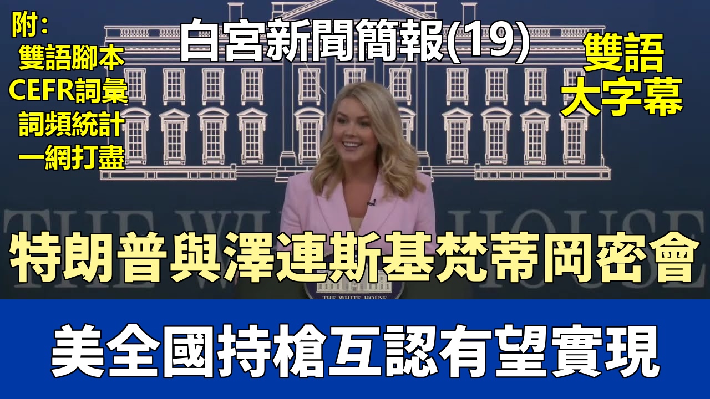

{% video youtube:VI_iIXjw4XU width:100% autoplay:0 %}


### 【中英文双语脚本】

Good afternoon, everybody.
大家下午好。
Thank you for coming today. It's great to be with you.
感謝大家今天能來。很高興和大家在一起。
This is our first official influencer briefing here at the White House.
這是我們在白宮舉行的首次官方影響者簡報會。
I want to thank you all so much for joining us on what is day 99 of the Trump administration.
我非常感謝大家在我們特朗普政府第99天的時候加入我們。
And as I promised at my first briefing as press secretary back in January,
正如我在一月份作爲新聞祕書的第一次簡報會上所承諾的那樣，
the Trump White House will speak to all media outlets and personalities,
特朗普白宮將與所有媒體機構和人士對話，
not just the legacy media which has traditionally covered this institution.
而不僅僅是那些傳統上報道本機構的傳統媒體。
Tens of millions of Americans are now turning to social media and independent media outlets to consume their news.
數千萬美國人現在轉向社交媒體和獨立媒體獲取新聞。
And we are embracing that change, not ignoring it.
我們正在擁抱這一變化，而不是忽視它。
It's well past time that the White House press operation reflected the media habits of the American people in 2025, not 1925.
白宮的新聞運作早該反映 2025 年美國人民的媒體習慣，而不是 1925 年的。
And thanks to President Trump, a select group of D.C.-based journalists no longer have a monopoly over press access here at the White House.
感謝特朗普總統，一小部分駐華盛頓特區的記者不再壟斷白宮的新聞採訪權。
All journalists, outlets, and voices have a seat at the table now.
現在，所有記者、媒體和聲音都在這裏擁有一席之地。
And you being here today for this briefing proves that.
而你們今天能在這裏參加這次簡報會就證明了這一點。
Today officially marks the 99th day of promises made and kept by President Trump.
今天正式標誌着特朗普總統做出並遵守承諾的第99天。
Our primary focus today is how President Trump has fulfilled one of his central campaign promises to the American people in record time,
我們今天的主要焦點是特朗普總統如何在創紀錄的時間內，履行了他對美國人民的核心競選承諾之一，
ending the massive illegal invasion and securing our nation's southern and northern borders.
即結束大規模非法入侵併確保我們國家南部和北部邊境的安全。
As we know, Joe Biden allowed millions of criminal illegal aliens to pour into our country over the past four years.
衆所周知，喬·拜登在過去四年裏允許數百萬犯罪非法移民涌入我們的國家。
And as we all know, a significant number of those aliens have been vicious gang members, murderers, rapists, and pedophiles.
而且我們都知道，這些移民中有相當一部分是惡毒的幫派成員、殺人犯、強姦犯和戀童癖者。
Innocent Americans like Laken Riley, Jocelyn Nungaray, Rachel Morin, and many others have been murdered because of Joe Biden's open border.
像萊肯·萊利、喬斯林·農加雷、雷切爾·莫林等許多無辜的美國人，都因爲喬·拜登的開放邊境政策而被謀殺。
President Trump made a promise to the American people, to all of you, and your audiences, to end the carnage and keep our country safe.
特朗普總統向美國人民、向你們所有人以及你們的受衆承諾，要結束這場屠殺，保衛我們國家的安全。
And he has overwhelmingly delivered on that promise.
他已經壓倒性地兌現了這一承諾。
He immediately declared a national emergency on the southern border,
他立即宣佈南部邊境進入國家緊急狀態，
deployed the U.S. military and border patrol to repel the invasion, and ended reckless catch-and-release policies.
部署了美國軍隊和邊境巡邏隊以擊退入侵，並結束了魯莽的“抓了就放”政策。
And as a result, between the inauguration and April 1st of this month, only nine illegal aliens were released into the United States of America.
結果是，從就職典禮到本月4月1日期間，只有九名非法移民被釋放到美國境內。
This is a staggering 99.99% decrease from the more than 184,000 illegal aliens who were released into the country under Joe Biden during that same period last year.
與去年同期喬·拜登執政下超過18.4萬名非法移民被釋放到境內相比，這一下降幅度達到了驚人的99.99%。
You can't get much better than a 99.99% decrease.
你很難做到比減少99.99%更好的結果了。
Total attempted illegal crossings at the southwest border hit a record low in February, only to fall to another record low again last month in March.
西南邊境嘗試非法越境的總人數在二月份創下歷史新低，而上個月三月份再次降至另一個歷史新低。
President Trump signed the Laken Riley Act into law, requiring illegal aliens arrested or charged with theft or violence to be detained.
特朗普總統簽署了《萊肯·萊利法案》成爲法律，要求因盜竊或暴力行爲被捕或被起訴的非法移民必須被拘留。
And he reestablished the successful Remain in Mexico policy from his first term.
他還重新確立了他第一個任期內成功的“留在墨西哥”政策。
The president has also restarted construction of his signature border wall.
總統還重新啓動了他標誌性的邊境牆建設。
More than 85 miles have been built and are in various stages of construction and planning.
超過85英里的牆體已經建成，並且還有更多處於不同的建設和規劃階段。
He designated cartels as foreign terrorist organizations and invoked the Alien Enemies Act to apprehend, detain, and remove these massive threats
他將販毒集團指定爲外國恐怖組織，並援引《外國敵人法》來逮捕、拘留和清除這些
who have flooded our country.
已經涌入我們國家的巨大威脅。
And the Trump administration, as you heard from our border czar Tom Homan earlier today,
並且特朗普政府，正如你們今天早些時候從我們的邊境事務主管湯姆·霍曼那裏聽到的，
is working literally 24/7 around the clock to successfully arrest and deport illegal criminals and foreign terrorists from our communities, your communities.
正在真正全天候地工作，以成功逮捕並將非法罪犯和外國恐怖分子從我們的社區、你們的社區驅逐出去。
We're in the beginning stages of carrying out the largest deportation campaign in American history.
我們正處於執行美國曆史上最大規模驅逐行動的初期階段。
And despite the legacy media's fear mongering and lies about this, we will continue with these successful operations
儘管傳統媒體對此進行恐嚇宣傳和撒謊，我們仍將繼續這些成功的行動，
because we know that's what the American people are expecting from this president and that's why they overwhelmingly reelected him to this office.
因爲我們知道這正是美國人民對這位總統的期望，也是他們壓倒性地再次選舉他擔任此職位的原因。
Over the past weekend, it was announced Operation Tidal Wave was a joint effort involving ICE Miami and Florida law enforcement agencies.
上週末宣佈的“潮汐行動”是涉及美國移民與海關執法局（ICE）邁阿密分部和佛羅里達州執法機構的一項聯合行動。
Nearly 800 illegal aliens were arrested during the first four days alone.
僅在頭四天內，就有近800名非法移民被捕。
I don't know if we have any Floridians in here, but you're welcome.
我不知道這裏有沒有佛羅里達人，但不用謝。
Operation Tidal Wave is a preview of what is to come around the country.
“潮汐行動”預示着全國範圍內即將發生的事情。
Large scale operations employing our state and local law enforcement partners to get criminal aliens off our streets.
我們將與州和地方執法夥伴合作開展大規模行動，將犯罪的外國人從我們的街道上清除。
And we will not apologize for this.
我們不會爲此道歉。
This is the first of its kind multi-agency immigration enforcement operation coordinated by ICE with federal partners.
這是首次由ICE與聯邦夥伴協調進行的多機構移民執法行動。
And this multi-day operation has so far resulted in nearly 800 illegal aliens apprehended in four days,
這項爲期多天的行動迄今已在四天內逮捕了近800名非法移民，
including MS-13 murderers, rapists, drug traffickers, and human rights abusers.
其中包括MS-13的殺人犯、強姦犯、毒販和侵犯人權者。
So safe to say, President Trump made a promise to all of you, your audiences, and the American public to secure our nation's borders.
所以可以肯定地說，特朗普總統向你們所有人、你們的受衆以及美國公衆承諾要確保我們國家的邊境安全。
He has overwhelmingly delivered on that promise.
他已經壓倒性地兌現了這一承諾。
And you will see that legacy media has nitpicked stories to try to drum up sympathy for people who broke our nation's laws.
你會看到傳統媒體一直在挑剔故事，試圖爲那些違反我們國家法律的人博取同情。
This White House has sympathy for American citizens, for law-abiding families who are doing what's right, who came here the right way.
本屆白宮同情的是美國公民，是那些遵紀守法、做正確的事、通過合法途徑來到這裏的家庭。
That includes legal immigrants who have come to this country, paid their dues, waited their turn,
這包括那些來到這個國家、付出了代價、等待了機會的合法移民，
and are now being cheated and ripped off by the previous administration.
而現在他們卻被上屆政府欺騙和剝削。
We are putting Americans first every day, and we applaud the ICE agents and Border Patrol agents who are on the ground doing this important work.
我們每天都將美國人放在首位，我們爲在一線從事這項重要工作的ICE探員和邊境巡邏隊探員喝彩。
That's just the border.
這僅僅是邊境方面。
Of course, the president has been working incredibly hard to unleash the might of our economy here at home.
當然，總統一直非常努力地在國內釋放我們經濟的潛力。
He's in the process of negotiating fair trade deals abroad with many countries around the world
他正在與世界上許多國家談判公平的對外貿易協議，
who have come to the table because the president is using the leverage of this office of the United States of America
這些國家願意談判是因爲總統正在利用美國這個職位的槓桿作用，
to leverage our economic might and to cut good trade deals.
利用我們的經濟實力來達成有利的貿易協議。
You also look at what's happening on the foreign, on the world stage when it comes to foreign policy.
你再看看在外交政策方面，國際舞臺上正在發生什麼。
The president has put the world on notice.
總統已經向全世界發出了警告。
They all understand that we have a commander in chief in the Oval Office who is going to put America and our troops first,
他們都明白，我們在橢圓形辦公室有一位將美國和我們的軍隊置於首位的總司令，
who's going to do what's right for our country, our nation, our people, even if that means making tough decisions.
他將爲我們的國家、民族和人民做正確的事情，即使這意味着做出艱難的決定。
And we are closer today to a peace deal in Russia and Ukraine certainly than we were when we took office on January 20th.
當然，今天我們比1月20日上任時更接近於達成俄羅斯和烏克蘭的和平協議。
If you look at the situation in the Middle East, Israel has never had a stronger friend than they do right now in the Oval Office with President Trump.
如果你看看中東的局勢，以色列從未有過比特朗普總統在橢圓形辦公室時更強大的朋友了。
We've had more than 75 hostages who have returned home from around the world or wrongfully detained individuals.
我們已經讓超過75名來自世界各地的人質或被錯誤拘留的人員回家。
You can only do that if you have a president who's unafraid to use the leverage of the United States.
只有當你有這樣一位不懼怕使用美國影響力的總統時，才能做到這一點。
So there are many accomplishments to talk about this week.
所以這周有很多成就值得討論。
I haven't even mentioned the restoring common sense effort of this administration
我甚至還沒有提到本屆政府恢復常識的努力，
to get men out of women's sports, to root out DEI and waste, fraud, and abuse from our federal bureaucracy.
比如讓男性退出女子體育項目，根除聯邦官僚機構中的DEI（多元化、公平性和包容性）以及浪費、欺詐和濫用。
The president has done so much in such a little time and we're working very hard here every day.
總統在如此短的時間內做了這麼多事情，我們每天都在這裏非常努力地工作。
We appreciate all that you do on social media to push what the president is saying, but also sometimes question it.
我們感謝你們在社交媒體上所做的一切，推廣總統所說的內容，但有時也提出質疑。
And we relish independent journalism.
我們樂見獨立的新聞報道。
And I hope you all have seen the president, myself, anybody in this administration. We are unafraid to take questions.
我希望大家都看到了總統、我本人以及本屆政府的任何人。我們不害怕接受提問。
This has truly been the most transparent and accessible presidency in American history.
這確實是美國曆史上最透明、最容易接觸到的總統任期。
So with that, let's kick it off and I'm happy to take your question first, Erin.
那麼，我們就開始吧，很高興先回答你的問題，艾琳。
Thanks so much, Caroline, both for having us and for granting me the first question here.
非常感謝，卡羅琳，感謝邀請我們，也感謝讓我提第一個問題。
Sure.
當然。
And I can attest to the deportations in Florida. My Uber drivers finally speak English again, so thank you for that.
我可以證明佛羅里達的驅逐行動。我的優步司機終於又開始說英語了，所以爲此感謝你。
My question for you is, what are the administration's plans for those who continue to defy the executive orders,
我的問題是，對於那些繼續違抗行政命令的人，政府有什麼計劃，
most notably on my mind, are the ones related to what some would call trans women,
我首先想到的是那些與所謂的跨性別女性有關的命令，
which are men masquerading as girls in girls' sports.
也就是那些在女子體育項目中僞裝成女孩的男性。
Sure. Obey federal law or you will be prosecuted.
當然。遵守聯邦法律，否則你將被起訴。
Obey federal law and you could see your federal funding cut, whether you are a college or university.
遵守聯邦法律，否則你的聯邦資金可能會被削減，無論你是學院還是大學。
We have seen the president, again, using the leverage of this administration
我們再次看到總統利用本屆政府的影響力，
and to negotiate deals with some of the biggest colleges and universities in this country.
與這個國家一些最大的學院和大學進行談判。
And if they don't want to come to the negotiating table to apologize for the federal laws they have broken,
如果他們不想坐到談判桌前，爲他們違反的聯邦法律道歉，
to apologize for allowing Jewish American students on our nation's campuses to be unlawfully bullied and harassed,
爲允許美國猶太學生在我國校園內受到非法欺凌和騷擾而道歉，
then there's going to be consequences for that illegal behavior.
那麼這種非法行爲將會帶來後果。
Same thing with men and women's sports.
男子和女子體育項目也是如此。
The president signed a very strong executive order, making it the policy of the United States federal government that there are only two sexes, male and female,
總統簽署了一項非常強硬的行政命令，規定美國聯邦政府的政策是隻有兩種性別，男性和女性，
and we are not going to tolerate biological men competing in sports or competing in private spaces for women like myself or you.
我們不會容忍生理上的男性參與體育比賽，或進入像你我這樣的女性的私人空間。
And we've seen states defy this federal order.
我們已經看到有些州公然違抗這項聯邦命令。
You've seen the state of Maine unfortunately because of their liberal governor who, I will add, nobody in that state agrees with.
不幸的是，你看到了緬因州，因爲他們那位自由派州長——我補充一句，該州沒人同意她的做法。
People are incredibly fed up with her trying to oppose this common sense message.
人們對她試圖反對這種常識性的信息感到極其厭煩。
You've seen young women who have had to go on television to plead with their governor,
你看到年輕女性不得不上電視懇求她們的州長，
"Please stop letting men play against me in sports. We shouldn't live in a country where that even has to happen."
“請不要再讓男性和我一起參加體育比賽了。我們不應該生活在甚至會發生這種事情的國家。”
The president deeply understands that, that's why he signed that EO.
總統對此深有體會，這就是他簽署那項行政命令的原因。
And when Maine decided not to follow it, the Department of Justice sued them.
當緬因州決定不遵守時，司法部起訴了他們。
So anyone who disobeys federal law will be either prosecuted, sued, or say goodbye to your federal funding.
所以，任何不遵守聯邦法律的人，要麼被起訴，要麼被控告，要麼就告別你的聯邦資金。
Sure. How about to the back in the red tie?
當然。後面那位戴紅領帶的先生怎麼樣？
Hi, one of my main questions is when will the border wall be completed
你好，我的主要問題之一是邊境牆何時能完工？
because it's been talked about for a very long time and a lot of people want to know when can we expect that to be done.
因爲這件事已經被談論了很長時間，很多人想知道我們什麼時候可以期待它完成。
Sure. I don't have an official timeline for you, but certainly it's a priority of the administration.
當然。我沒有一個確切的時間表可以給你，但它肯定是本屆政府的優先事項。
The president has talked about this for years, right? It was his signature campaign promise dating back to 2016.
總統已經談論這個好幾年了，對吧？這是他早在2016年就提出的標誌性競選承諾。
People laughed at him when he originally brought this idea up, but now the whole world recognizes a border wall is effective.
當他最初提出這個想法時，人們嘲笑他，但現在全世界都認識到邊境牆是有效的。
It's a necessary means to secure your nation's territorial borders.
這是確保國家領土邊界安全的必要手段。
Democrats like to have borders outside of their homes, or walls outside of their homes for a reason because they know it repels invaders.
民主黨人喜歡在自家外面設邊界，或者說設圍牆，是有原因的，因爲他們知道這能驅逐入侵者。
And that's why the president wants to do that at the southern border.
這就是爲什麼總統想在南部邊境也這樣做。
There has been more than 85 miles built just since January 20th.
僅僅自1月20日以來，就已經修建了超過85英里。
It's obviously the goal of this administration to build as much border wall as we possibly can.
顯然，本屆政府的目標是儘可能多地修建邊境牆。
And we need Congress's help to do that. We need more federal funding.
我們需要國會的幫助來實現這一目標。我們需要更多的聯邦資金。
The president's working closely with Speaker Johnson and Senate Majority Leader Thune to pass a solid reconciliation package
總統正與議長約翰遜和參議院多數黨領袖圖恩密切合作，以通過一項可靠的預算和解方案，
that not only provides more funding for our ICE agents and border patrol agents on the ground,
該方案不僅爲我們在一線的ICE探員和邊境巡邏隊探員提供更多資金，
but to continue construction of that border wall.
而且還要繼續修建那道邊境牆。
Sure. Go ahead.
當然。請講。
Madam, congratulations on this endeavor to bring in new media. And can I start by thanking you for including the British?
女士，祝賀您這項引入新媒體的努力。我可以先感謝您邀請了英國人嗎？
I'm deeply proud to be the only British representative here. I hope future events you might include more. Thank you.
作爲這裏唯一的英國代表，我深感自豪。我希望未來的活動您能邀請更多英國代表。謝謝。
I've got two questions, if I may be so bold, regarding my little country across the pond.
如果我可以冒昧的話，我有兩個關於我們池塘對岸那個小國家的問題。
First and foremost, it's regarding trade deals, so your Vice President Vance said no free speech, no deal.
首先，是關於貿易協議的，你們的副總統萬斯曾說沒有言論自由，就沒有協議。
The British business secretary, whose name is Jonathan Reynolds, has said that in the trade talks with the Commerce Department, the US Commerce Department,
英國的商務大臣，喬納森·雷諾茲表示，在與美國商務部的貿易談判中，
free speech has not been a material factor in negotiations.
言論自由並不是談判中的一個實質性因素。
So my first question is, is it the case that free speech is no longer part of negotiations?
所以我的第一個問題是，言論自由真的不再是談判的一部分了嗎？
And my second question, if I may, is in Britain, we have had a quarter of a million people issued non-crime hate incidents.
我的第二個問題，如果可以的話，是在英國，我們有25萬人收到了非犯罪仇恨事件記錄。
As we speak, there are people in prison for quite literally reposting memes.
就在我們說話的時候，有人因爲轉發表情包而入獄。
We have extensive prison sentences for tweets, social media posts, and general free speech issues.
我們對推文、社交媒體帖子和一般的言論自由問題判處長期監禁。
Would the Trump administration consider political asylum for British citizens in such a situation?
在這種情況下，特朗普政府會考慮爲英國公民提供政治庇護嗎？
Well, to your latter question, it's a very good one.
嗯，關於你後面的問題，這是一個非常好的問題。
I have not heard that proposed to the President, nor have I spoken to him about that idea,
我沒有聽說有人向總統提出這個建議，我也沒有和他談過這個想法，
but I certainly can and talk to our national security team and see if it's something the administration would entertain.
但我肯定可以和我們的國家安全團隊談談，看看政府是否會考慮這件事。
To your first question about free speech in the United Kingdom, the Vice President has been incredibly outspoken about this for good reason,
關於你第一個關於英國言論自由的問題，副總統對此直言不諱是有充分理由的，
and the President has spoken about this as well, directly with your Prime Minister when he was here for a visit to the White House.
總統也談到了這一點，當你們首相訪問白宮時，總統直接和他談過。
So it remains a critical endeavor of ours to show the Brits and your country, which we love and admire,
因此，向英國人民和你們這個我們熱愛和欽佩的國家展示第一修正案以及
about the First Amendment and the importance of free speech in a sovereign nation.
在一個主權國家中言論自由的重要性，仍然是我們的關鍵努力方向。
As for the trade talks, I understand they are moving in a very positive way with the United Kingdom.
至於貿易談判，我瞭解到與英國的談判進展非常積極。
I don't want to get ahead of the President or our trade team and how those negotiations are going,
我不想在總統或我們的貿易團隊之前透露談判的進展情況，
but I have heard they've been very positive and productive with the United Kingdom.
但我聽說與英國的談判一直非常積極和富有成效。
And I will say the President always, both publicly and privately, speaks incredibly highly of your country.
我要說的是，總統總是在公開和私下場合都對你們國家評價極高。
He has a good relationship with your Prime Minister, though they disagree on domestic policy issues.
他與你們首相關係良好，儘管他們在國內政策問題上存在分歧。
I've witnessed the camaraderie between them firsthand in the Oval Office,
我在橢圓形辦公室親眼見證了他們之間的同志情誼，
and there is a deep mutual respect between our two countries that certainly the President upholds.
我們兩國之間有着深厚的相互尊重，總統當然也維護着這一點。
Thank you. You're welcome.
謝謝你。不客氣。
Mr. Spicer, it's good to see you here. My predecessor.
斯派塞先生，很高興在這裏見到你。我的前任。
Well, you know, I had to swing by. Thank you for doing this.
嗯，你知道，我得過來看看。謝謝你這樣做。
I think it's marvelous what you guys have done to bring in new voices, and it shows, it reflects the President's commitment to transparency and to bring this in.
我認爲你們引入新聲音的做法非常了不起，這顯示並反映了總統對透明度和引入新聲音的承諾。
So I've got two quick ones for you. The first, as you mentioned, reconciliation.
所以我有兩個簡短的問題給你。第一個，正如你提到的，預算和解。
Beyond that and what he hopes to get out of that, considering how slim the House majority is,
除此之外，考慮到衆議院多數席位如此微弱，他還希望從中得到什麼，
what other legislative priorities does he want to see codified in law before this Congress adjourns?
在本屆國會休會之前，他還希望看到哪些其他立法優先事項被編纂成法律？
It's a really good question, Sean. I think reconciliation is the first and foremost question on the President's mind right now.
這是一個非常好的問題，肖恩。我認爲預算和解是總統目前首先考慮的問題。
It's a huge deal. We have to get it done. He's working closely with Congress.
這是一件大事。我們必須完成它。他正在與國會密切合作。
In fact, he's meeting with Speaker Johnson, I think, in a few minutes today in the Oval Office to discuss this very bill and measure.
事實上，我想他今天幾分鐘後就要在橢圓形辦公室與約翰遜議長會面，討論這項法案和措施。
Aside from reconciliation, which we hope includes funding for border wall construction and mass deportations, as I mentioned earlier,
除了預算和解（我們希望其中包含邊境牆建設和大規模驅逐的資金，如我之前提到的），
but it's also very important that we get tax cuts passed. That is the second step in the Trump economic agenda.
通過減稅法案也非常重要。這是特朗普經濟議程的第二步。
The President has used every executive lever he can to slash burdensome regulation,
總統已經動用了他能使用的所有行政槓桿來削減繁重的法規，
and we continue to do that every day across every agency.
我們每天都在各個機構繼續這樣做。
Administrator Zeldin is doing a fantastic job at the EPA, I might add,
我補充一句，澤爾丁署長在環保局做得非常出色，
but every Cabinet Secretary is taking getting rid of regulation very seriously.
但每位內閣部長都在非常嚴肅地對待廢除法規的問題。
The President is certainly working on unleashing American energy to drive down costs,
總統當然正在努力釋放美國能源以降低成本，
but tax cuts are a critical component of really seeing the Trump economic formula be put together.
但減稅是真正實現特朗普經濟方案的關鍵組成部分。
So he wants to see tax cuts passed in this reconciliation package that includes no tax on tips, no tax on Social Security,
所以他希望看到在這個預算和解方案中通過減稅措施，包括取消小費稅、社保稅、
no tax on overtime, no tax on Social Security for our seniors, of course, too.
加班費稅，當然還有我們老年人的社保稅。
As for other measures that would be codified into law,
至於其他將被編纂成法律的措施，
certainly we've seen the President put forth common sense executive orders and take really common sense executive action
當然，我們看到總統提出了一些常識性的行政命令，並採取了真正常識性的行政行動，
that we would love Congress to take further action on to ensure that the President's executive actions can remain long after his tenure,
我們希望國會能就此採取進一步行動，以確保總統的行政行動在其任期結束後很久仍能保持效力，
so you don't have another President come in here in eight years and undo some of the executive work the President has worked so hard on.
這樣就不會有另一位總統在八年後上任，撤銷總統辛辛苦苦完成的一些行政工作。
So we want Congress to continue getting to work, but we got to get this reconciliation bill passed first.
所以我們希望國會繼續努力工作，但我們必須先通過這項預算和解法案。
Thank you. The second thing I have is just a question I get a lot and I figure I'd best address to you.
謝謝你。我還有第二個問題，這是一個我經常被問到的問題，我想最好向你請教。
You've done a phenomenal job opening up the briefing room, bringing in new voices.
你在開放簡報室、引入新聲音方面做得非常出色。
The President's commitment during the campaign to do long-form podcasts was, I think, extremely helpful to this new media environment that we live in.
我認爲，總統在競選期間承諾做長篇播客，對我們所處的這個新媒體環境非常有幫助。
But a lot of conservatives will ask me, why does he sit down with people like Terry Moran of ABC or Jeffrey Goldberg of The Atlantic?
但很多保守派人士會問我，他爲什麼會和像美國廣播公司的特里·莫蘭或《大西洋月刊》的傑弗裏·戈德堡這樣的人坐下來談話？
What is the rationale behind rewarding people who have very vehemently expressed disdain for him personally?
獎勵那些曾非常強烈地表達過對總統個人鄙視的人，其背後的理由是什麼？
Because the President is unafraid and he is inspired by competition and he likes to talk to people face to face.
因爲總統無所畏懼，他受到競爭的激勵，他喜歡與人面對面交談。
And I think that's one of his best attributes and qualities.
我認爲這是他最好的特質和品質之一。
We live in an incredibly divisive country, unfortunately, that has been really the result and consequence, frankly,
不幸的是，我們生活在一個極其分裂的國家，坦率地說，這確實是
of the fake news and the hoaxes and lies they have driven at this President for the better part of the last decade now.
過去十年中大部分時間裏，假新聞、騙局和謊言針對這位總統所造成的後果。
But the fact that we still have a President who has been a victim of these hoaxes, these lies, these smears by so many legacy media outlets and reporters,
但事實是，我們仍然有一位總統，他是如此多傳統媒體和記者製造的這些騙局、謊言、抹黑的受害者，
yet he's still willing to sit down with them, look them in the eye, look them face to face,
但他仍然願意與他們坐下來，直視他們的眼睛，與他們面對面，
and take them to task and share the truth with them and his perspective, I think, is what the American people deserve in a President.
並且質問他們，與他們分享真相和他的觀點，我認爲這正是美國人民在總統身上應得的品質。
And it's certainly a stark contrast to what we had in the previous administration, a President who was hiding,
這當然與我們在上屆政府看到的情況形成鮮明對比，那位總統躲躲藏藏，
who actually used this beautiful South Court auditorium, which we're happy to be in today, but he used this like it was a fake Oval Office, weirdly, oddly.
他實際上把這個我們今天很高興身處其中的漂亮的南苑禮堂，當作一個假的橢圓形辦公室來使用，很奇怪，很反常。
He was missing in action. He called lids at two o'clock in the afternoon.
他玩忽職守。他下午兩點就宣佈記者可以下班了（call lids）。
For those who don't know, a lid is when we tell the press to go home for the night. And he was doing that midday.
對於那些不知道的人，“lid”是指我們通知媒體當晚可以回家了。而他中午就這麼做了。
That is not acceptable around here, I will tell you. We're working very early through the very late hours of the night.
我告訴你，這在這裏是不可接受的。我們從清晨一直工作到深夜。
And the President's willing to talk to anyone, not just journalists who have really been posing as journalists but are actually left-wing activists,
總統願意與任何人交談，不僅僅是那些實際上是左翼活動家卻僞裝成記者的人，
but also if you look at our adversaries and our competition abroad on a foreign policy scale, you know well in the first term.
而且如果你看看我們在外交政策層面上的對手和國外的競爭者，你在第一任期就很清楚。
He went to North Korea. He talked to Putin directly. He talked to President Xi directly.
他去了朝鮮。他直接與普京對話。他直接與習主席對話。
The President believes in direct diplomacy, whether it is our adversaries and competitors around the world or left-wing activists like Jeffrey Goldberg.
總統相信直接外交，無論是面對世界各地的對手和競爭者，還是像傑弗裏·戈德堡這樣的左翼活動家。
Sure. First of all, thank you for having us today. It's a pleasure to be here.
當然。首先，感謝您今天邀請我們。很高興來到這裏。
You mentioned, obviously, it's no secret, America has been Israel's strongest friend, greatest ally.
您提到，顯然，這不是什麼祕密，美國一直是 以色列最堅定的朋友、最偉大的盟友。
Unfortunately, as you know, Edan Alexander is still being held in Gaza. He's both an American and an Israeli citizen.
不幸的是，如您所知，伊丹·亞歷山大仍被扣押在加沙。他是美國和以色列雙重國籍公民。
Last we heard, allegedly, Hamas has lost all communication with him.
我們最後聽到的消息是，據稱哈馬斯已經與他失去了所有聯繫。
I was wondering if there's been any update in terms of getting Edan home.
我想知道在讓伊丹回家方面是否有任何最新進展。
Sure. First of all, the reports last week were from Hamas media. And so we always take that, of course, with a grain of salt.
當然。首先，上週的報道來自哈馬斯媒體。所以我們當然總是對此持保留態度。
We do our own verification on those reports.
我們對這些報道進行我們自己的核實。
I talked to the National Security Council about Edan Alexander last week, as this is obviously a priority for the administration.
上週我與國家安全委員會談論了伊丹·亞歷山大的事，因爲這顯然是政府的優先事項。
And all I can tell you is that I can assure you that the Special Envoy Wittkopf, Adam Bowler, who's been leading some of our hostage negotiations,
我能告訴你的就是，我可以向你保證，特使維特科普夫、領導我們一些人質談判的亞當·鮑勒、
Mike Waltz, the entire National Security team, finding him and bringing him home is a priority for this administration,
邁克·華爾茲，以及整個國家安全團隊，找到他並將他帶回家是本屆政府的優先事項，
and they continue to work very hard on that every day.
他們每天都在爲此非常努力地工作。
Thank you. You're welcome.
謝謝。不客氣。
Chad. First of all, thank you for the hospitality. Always open and welcome and thank you for the access.
查德。首先，感謝您的款待。總是開放和歡迎，感謝您給予的採訪機會。
And I'll say to you again for everyone what I said to you a few weeks ago when we were here.
我將再次向大家重申幾周前我們在這裏時我對你說過的話。
I said it's so refreshing to have a press secretary after the last few years who's both intelligent and articulate. So thank you for that.
我說，在過去幾年之後，能有一位既聰明又口才好的新聞祕書，真是令人耳目一新。所以爲此感謝你。
I think a lot of people would be curious to know if we have any details of what the private conversation between Volodymyr Zelenskyy and the President was there at the Vatican.
我想很多人會好奇，我們是否知道弗拉基米爾·澤連斯基總統和總統在梵蒂岡的私人談話細節。
I imagine that we don't know at this stage of the game, but more specifically, back to the border issue,
我猜想在這個階段我們還不知道，但更具體地說，回到邊境問題，
the DOJ stated on Friday that they were floating the idea of potentially subpoenaing journalists to get access to whistleblowers.
司法部週五表示，他們正在考慮可能傳喚記者以接觸舉報人的想法。
We know the last administration did not treat whistleblowers very well.
我們知道上屆政府對待舉報人並不好。
There's numerous ones who, although still employed by the FBI or the DHS, have not received back pay and haven't truly,
有很多人，雖然仍受僱於聯邦調查局或國土安全部，但沒有收到欠薪，也沒有真正地...
they've been employed but they're not reinstated.
他們被僱用了，但沒有復職。
So I'm wondering, does this administration have, do they believe that we should reinstate the whistleblower,
所以我想知道，本屆政府是否認爲我們應該讓舉報人復職，
like agents Garrett or O'Boyle or Friend or Stevenson with DHS who blew the whistle on the child trafficking involving the cartels under Joe Biden?
比如國土安全部的特工加勒特、奧博伊爾、弗蘭德或史蒂文森，他們揭露了喬·拜登時期涉及卡特爾的兒童販賣活動？
He too has yet to be brought back. Do we have a position on that?
他也尚未被召回。我們對此有立場嗎？
Sure. For each individual agency, the secretaries of those agencies obviously have deference over who they hire, who they fire, who they promote.
當然。對於每個具體機構，該機構的部長顯然對他們僱傭誰、解僱誰、提拔誰擁有決定權。
I can tell you, certainly the President commends anyone who steps out and speaks the truth,
我可以告訴你，總統當然讚揚任何挺身而出說出真相的人，
especially against the malpractice that we saw over the last four years under the previous administration.
尤其是反對我們在過去四年上屆政府期間看到的不當行爲。
I can speak to the two cases at the Treasury Department.
我可以談談財政部的兩個案例。
The two whistleblowers there who blew the whistle on the Hunter Biden tax fraud case have been promoted by Secretary Becent.
在那裏揭露亨特·拜登稅務欺詐案的兩名舉報人已被貝森特部長提拔。
So certainly we commend anyone who has the courage to step up and speak the truth.
所以我們當然讚揚任何有勇氣站出來說出真相的人。
And as for those who unfortunately try to leak especially classified information to the legacy media to put our troops in harm's way,
至於那些不幸地試圖向傳統媒體泄露特別是機密信息，從而將我們的軍隊置於危險境地的人，
our law enforcement officials at harm's way, leaks like that will not be tolerated.
將我們的執法官員置於危險境地，那樣的泄密行爲是不會被容忍的。
But those who are seeking to protect the truth will certainly be commended and applauded for that.
但那些尋求保護真相的人肯定會因此受到讚揚和掌聲。
Rogan, go ahead. Hi Caroline. Good to see you again.
羅根，請講。嗨，卡羅琳。很高興再次見到你。
Great to see you as well. Great job this morning and as always you're really crushing it.
也很高興見到你。今天早上幹得不錯，而且你一如既往地表現出色。
My question is about the Epstein files.
我的問題是關於愛潑斯坦文件的。
And a couple months ago the DOJ released what they called phase one of the Epstein files
幾個月前，司法部發布了他們所謂的愛潑斯坦文件第一階段，
and they announced that a lot of those files, the remaining files, probably the bulk of the files were actually in the New York field office.
並宣佈其中許多文件，即剩餘的文件，可能大部分實際上在紐約外地辦事處。
They requested that they be returned the day after.
他們要求第二天歸還這些文件。
And some legacy media reports show that not only were those files returned to the DOJ
一些傳統媒體報道顯示，這些文件不僅被歸還給了司法部，
but that hundreds of FBI agents are going through them day after day and getting them ready for public release.
而且數百名FBI探員日復一日地審查這些文件，準備將其公之於衆。
Do you have any updates from the DOJ or the FBI on when those files are expected to be released
你有沒有從司法部或聯邦調查局得到關於這些文件預計何時發佈的消息？
and also when we might start seeing some arrests of the client list?
以及我們何時可能開始看到客戶名單上的一些人被捕？
Sure. I can assure you that the Attorney General and her team at the Department of Justice are working on this diligently.
當然。我可以向你保證，司法部長和她在司法部的團隊正在努力處理此事。
For a specific timeline I'd have to check in with them. And we can certainly do that for you Rogan in the effort of transparency.
關於具體的時間表，我得和他們確認一下。爲了透明起見，羅根，我們當然可以爲你做這件事。
But I will tell you the Attorney General is a bulldog. She is someone you want on your team.
但我告訴你，司法部長是條鬥牛犬。她是你想納入團隊的人。
And when she wants to get something done, she gets it done.
當她想完成某件事時，她就能完成它。
I've seen her do it in various instances already in her time as Attorney General and when she makes a promise she keeps it.
在她擔任司法部長的這段時間裏，我已經在各種情況下看到她做到了這一點，而且她信守承諾。
So I think I don't have a specific timeline on you for that but I do know that they're working on it over there.
所以我想我沒有具體的時間表可以告訴你，但我確實知道他們正在那邊處理這件事。
Sure. Go ahead. Thank you for having us here.
當然。請講。謝謝你邀請我們來這裏。
I've noticed this is kind of like a repeat of 2016. The legacy media has gone back to not reporting anything on President Trump.
我注意到這有點像2016年的重演。傳統媒體又開始不報道任何關於特朗普總統的事情了。
In the beginning we had them reporting everything that he was doing.
一開始，他們報道他所做的一切。
Now they're kind of going back again to not reporting everything that he is actually doing.
現在他們又有點回到不報道他實際所做的一切了。
I'm kind of the nerd when it comes to reporting. I'm not the headline news girl. I'm the nuts and bolts. I'm the policy type nerd.
在報道方面，我有點像書呆子。我不是那種追逐頭條新聞的人。我關注的是具體細節。我是政策型的書呆子。
So what direction do you advise kind of me to go into like the White House files that y'all send out every single day?
那麼，對於像你們每天發出的白宮文件這類內容，你建議我朝哪個方向深入研究？
Because that's what people are used to when they want to ask me questions they want to know kind of like the nuts and bolts of everything.
因爲當人們向我提問時，他們習慣於想了解事情的具體細節。
Secondly, I know going into the first 100 days, Johnson's meeting with President Trump today.
其次，我知道在（執政）頭100天之際，約翰遜議長今天將與特朗普總統會面。
President Trump has issued a lot of executive orders. What about codifying?
特朗普總統已經發布了很多行政命令。那麼法典化呢？
Is that going to be a conversation President Trump is going to have with him about possibly a timeline
特朗普總統是否會和他討論可能的時間表，
of just taking them from EOs into codifying them and making them permanent
將這些行政命令（EOs）法典化並使其永久化，
so we don't have another president that comes in possibly a Democrat that completely overturns everything that President Trump has done?
這樣我們就不會有另一位總統，可能是民主黨人，上臺後完全推翻特朗普總統所做的一切？
Yes, as I spoke to Sean's question earlier, absolutely. We want Congress to get to work.
是的，正如我早些時候回答肖恩的問題時所說，絕對是的。我們希望國會開始工作。
First thing is the reconciliation package, like I said, border and tax cuts. That's on the President's mind.
首先是預算和解方案，就像我說的，邊境和減稅。這是總統關心的。
But of course he wants to see Congress move to codify all of the incredible things and work that he's done via executive order.
但當然，他希望看到國會採取行動，將他通過行政命令完成的所有令人難以置信的事情和工作法典化。
To your first question about the nuts and bolts, I wish more people in the legacy media were like you and didn't focus on the sensationalist headlines but actually cared about the facts.
關於你第一個關於具體細節的問題，我希望傳統媒體中有更多像你一樣的人，不關注聳人聽聞的頭條新聞，而是真正關心事實。
The President is doing so many phenomenal things every day that will never be mentioned on cable news at night.
總統每天都在做許多非凡的事情，這些事情永遠不會在晚間有線電視新聞中被提及。
Signing executive orders. We do our absolute best to message that,
簽署行政命令。我們盡最大努力傳達這些信息，
which is again why we're welcoming independent voices like yours with following on social media
這也是爲什麼我們歡迎像你這樣在社交媒體上有關注者的獨立聲音，
because that's the best way to get those truths and those facts out there.
因爲這是將那些真相和事實傳播出去的最佳方式。
We put out fact sheets on the daily about what the President is signing.
我們每天都會發布關於總統簽署內容的簡報。
And they do get into the nuts and bolts of each and every policy and each and every executive action that he's taking.
這些簡報確實深入到了他所採取的每一項政策和每一項行政行動的具體細節。
He's signing three phenomenal executive orders today. I will share a preview with you on those.
他今天將簽署三項非凡的行政命令。我將與你分享一些預覽信息。
One of them is an executive order focused on sanctuary cities.
其中一項是針對庇護城市的行政命令。
It will direct the Attorney General, Pam Bondi, to provide a list of sanctuary cities back to the administration.
它將指示司法部長帕姆·邦迪向政府提供一份庇護城市名單。
We will review those. If those sanctuary cities are breaking federal law,
我們將審查這些城市。如果這些庇護城市違反了聯邦法律，
well then the Office of Management and Budget is going to look at their federal spending.
那麼管理和預算辦公室將審查它們的聯邦支出。
Again, if you're defying federal law, you are threatening your own federal spending by doing that.
再次強調，如果你藐視聯邦法律，你這樣做就是在威脅你自己的聯邦開支。
There is another executive order the President will sign tonight. We can provide the fact sheet for you
總統今晚將簽署另一項行政命令。我們可以爲你提供相關簡報，
on ensuring law and order and ensuring that federal law enforcement and local law enforcement can work together and communicate more easily.
內容是關於確保法律和秩序，並確保聯邦執法部門和地方執法部門能夠更輕鬆地合作與溝通。
And then the third executive order, which actually speaks to the heart of your question earlier about the Uber drivers,
然後是第三項行政命令，這實際上觸及了你早先關於優步司機問題的核心，
will be an order directing the Department of Transportation to include English literacy tests for our truckers.
該命令將指示交通部對我們的卡車司機進行英語讀寫能力測試。
This is a big problem in the trucking community that unless you're in that community you might not know,
這是卡車運輸行業的一個大問題，除非你身處其中否則可能不知道，
but there's a lot of communication problems between truckers on the road with federal officials and local officials as well,
但在路上行駛的卡車司機與聯邦官員以及地方官員之間存在很多溝通問題，
which obviously is a public safety risk.
這顯然是一個公共安全風險。
So we're going to ensure that our truckers who are the backbone of our economy are all able to speak English.
因此，我們將確保作爲我們經濟支柱的卡車司機都能夠說英語。
That's a very common sense policy in the United States of America, so the President will be signing that later this afternoon.
這在美國是一項非常符合常識的政策，所以總統將在今天下午晚些時候簽署這項命令。
Yeah, you're welcome. To the back in the yellow tie.
是的，不客氣。後面那位戴黃領帶的先生。
Thank you, Caroline. President Trump has recently made statements about eliminating the federal income tax and creating the external revenue service.
謝謝你，卡羅琳。特朗普總統最近發表聲明，要取消聯邦所得稅並設立外部稅務局。
When could we see that start to play out?
我們什麼時候能看到這項計劃開始實施？
Well, I will tell you this is something the Secretary of Commerce and the Secretary of Treasury are both equally as excited about as is the President.
嗯，我告訴你，商務部長和財政部長對此都和總統一們興奮。
And you know, part of, there's many reasons for the tariffs the President has implemented and the trade deals that he is currently negotiating.
你知道，總統實施關稅和他目前正在談判的貿易協議有很多原因。
Number one, we need to shore up our critical supply chains here at home.
第一，我們需要鞏固國內的關鍵供應鏈。
Number two, we need to increase our revenue here in the United States. We are running trillions of dollars of deficits.
第二，我們需要增加美國的財政收入。我們正面臨數萬億美元的赤字。
Our country will cripple if we continue down this path.
如果我們繼續沿着這條路走下去，我們的國家將會癱瘓。
And so how great it would be for the external revenue to completely replace the internal revenue service.
所以，如果外部收入能完全取代國內收入署（IRS），那該有多好。
So I know the administration is focused on the external revenue service, getting that up and running.
所以我知道政府正專注於外部稅務局，讓它建立並運行起來。
And as you know, Customs and Border Protection is charged with bringing in the money from tariffs every day,
如你所知，海關和邊境保護局負責每天收取關稅收入，
and they are bringing in billions and billions of dollars per day with the current tariff rates and where they are at.
以目前的關稅稅率，他們每天都在帶來數十億美元的收入。
So we will continue with that effort. I think I went around the room. Oh, no, one more in the back.
所以我們將繼續這項努力。我想我已經問遍全場了。哦，不，後面還有一位。
All good. So we know President Trump has been a champion for the 2A ever since he got into office, both times.
沒關係。我們知道特朗普總統自從上任以來，兩次都是第二修正案（持槍權）的捍衛者。
My question is, do we see anything, is there any ongoing efforts for national reciprocity so we can carry in all 50 beautiful states?
我的問題是，我們是否看到任何進展，是否有正在進行的努力以實現全國範圍內的持槍許可互認，這樣我們就可以在所有50個美麗的州攜帶槍支？
This is something the President talked about on the campaign trail for sure.
這確實是總統在競選活動中談到過的事情。
We need Congress to do it, but the President will always support our law-abiding gun owners
我們需要國會來做這件事，但總統將永遠支持我們遵紀守法的槍支擁有者，
and as you mentioned, is an ardent supporter of the Second Amendment.
正如你提到的，他是第二修正案的堅定支持者。
It's more important now than ever as we see violent crime rates in our inner cities.
現在比以往任何時候都更重要，因爲我們看到內城區的暴力犯罪率正在上升。
I've said this repeatedly over the past four years, the Second Amendment was never more important
我在過去四年裏反覆說過，第二修正案從未如此重要，
than when we had an illegal immigrant crime epidemic spiking in this country.
尤其是在我們國家非法移民犯罪激增的時候。
Law-abiding Americans have a constitutional right to defend themselves and the President absolutely supports that,
遵紀守法的美國人擁有憲法賦予的自衛權，總統絕對支持這一點，
but for national reciprocity, we do need Congress's help on that one.
但對於全國互認，我們確實需要國會的幫助。
Thank you, guys. It's so good to see you.
謝謝大家。很高興見到你們。
I could go around the room all day, but unfortunately there's work to be done.
我可以在這裏待上一整天，但不幸的是還有工作要做。
Thank you for coming to our very first influencer briefing to kick off the first 100 days of the Trump White House.
感謝大家來參加我們首次影響者簡報會，以啓動特朗普白宮的頭100天。
It's great to see you all here and thanks for what you do. Thank you.
很高興看到大家在這裏，感謝你們所做的工作。謝謝。
I'm going to walk off now.
我現在要離開了。

### 【核心词汇 - B1_C2】
| 單詞 | 音標 | 詞性 | 釋義 | 等級 | 次數 |
|---|---|---|---|---|---|
| Atlantic | /ətˈlæntɪk/ | adjective | 大西洋的 | B1 | 1 |
| Department | /dɪˈpɑːrtmənt/ | noun | 部門，部 | B1 | 1 |
| General | /ˈdʒenrəl/ | noun | 將軍，一般的 | B1 | 1 |
| Security | /sɪˈkjʊrəti/ | noun | 安全 | B1 | 1 |
| able | /ˈeɪbl/ | adjective | 能夠；有能力的 | B1 | 1 |
| absolute | /ˈæbsəluːt/ | adjective | 絕對的；完全的 | B1 | 1 |
| absolutely | /ˌæbsəˈluːtli/ | adverb | 絕對地；完全地 | B1 | 1 |
| access | /ˈækses/ | noun | 進入；通道；使用權 | B1 | 1 |
| accessible | /ækˈsesəbl/ | adjective | 可進入的；可使用的 | B1 | 1 |
| administration | /ədˌmɪnɪˈstreɪʃn/ | noun | 管理，行政 | B1 | 2 |
| agenda | /əˈdʒendə/ | noun | 議程 | B1 | 1 |
| alien | /ˈeɪliən/ | noun | 外星人 | B1 | 2 |
| announce | /əˈnaʊns/ | verb | v. 宣佈；宣告 | B1 | 1 |
| applaud | /əˈplɔːd/ | verb | v. 鼓掌；稱讚 | B1 | 2 |
| arrest | /əˈrest/ | noun | 逮捕，拘留 | B1 | 3 |
| aside | /əˈsaɪd/ | adverb | 在旁邊，到一邊 | B1 | 1 |
| bold | /boʊld/ | adjective | 大膽的；勇敢的；醒目的 | B1 | 1 |
| border | /ˈbɔːrdər/ | noun | 邊界；邊境 | B1 | 2 |
| central | /ˈsɛntrəl/ | adjective | 中心的，主要的，中央的 | B1 | 1 |
| champion | /ˈtʃæmpiən/ | noun | 冠軍，擁護者 | B1 | 1 |
| charge | /tʃɑːrdʒ/ | noun | 費用，指控，主管 | B1 | 1 |
| chief | /tʃiːf/ | adjective | 主要的，首要的 | B1 | 1 |
| closely | /ˈkloʊsli/ | adverb | 緊密地，密切地 | B1 | 1 |
| compete | /kəmˈpiːt/ | verb | 競爭，比賽 | B1 | 1 |
| competitor | /kəmˈpɛtɪtər/ | noun | 競爭者，對手 | B1 | 1 |
| completely | /kəmˈpliːtli/ | adverb | 完全地，徹底地 | B1 | 1 |
| congratulation | /kənˌɡrætʃəˈleɪʃn/ | noun | 祝賀 | B1 | 1 |
| conservative | /kənˈsɜːrvətɪv/ | adjective | adj. 保守的，守舊的 | B1 | 1 |
| construction | /kənˈstrʌkʃn/ | noun | n. 建造，建設；建築物 | B1 | 1 |
| consume | /kənˈsuːm/ | verb | v. 消耗，消費 | B1 | 1 |
| courage | /ˈkɜːrɪdʒ/ | noun | 勇氣 | B1 | 1 |
| criminal | /ˈkrɪmɪnl/ | noun | 罪犯 | B1 | 2 |
| critical | /ˈkrɪtɪkl/ | adjective | 關鍵的，批判性的 | B1 | 1 |
| crossing | /ˈkrɔːsɪŋ/ | noun | 十字路口，橫渡 | B1 | 1 |
| crush | /krʌʃ/ | noun | 迷戀，擁擠 | B1 | 1 |
| curious | /ˈkjʊriəs/ | adjective | 好奇的 | B1 | 1 |
| current | /ˈkɜːrənt/ | adjective | 當前的，現在的 | B1 | 1 |
| currently | /ˈkɜːrəntli/ | adverb | 目前，現在 | B1 | 1 |
| decision | /dɪˈsɪʒn/ | noun | 決定；決策 | B1 | 1 |
| declare | /dɪˈkler/ | verb | 宣佈；聲明；申報 | B1 | 1 |
| decrease | /ˈdiːkriːs/ | noun | 減少；降低 | B1 | 1 |
| defend | /dɪˈfend/ | verb | 保衛；辯護 | B1 | 1 |
| deliver | /dɪˈlɪvər/ | verb | 遞送；傳送；發表 | B1 | 1 |
| deserve | /dɪˈzɜːrv/ | verb | 應得，值得 | B1 | 1 |
| despite | /dɪˈspaɪt/ | preposition | 儘管，雖然 | B1 | 1 |
| directly | /dəˈrektli/ | adverb | 直接地；立即 | B1 | 1 |
| economic | /ˌekəˈnɑːmɪk/ | adjective | 經濟的 | B1 | 1 |
| economy | /iˈkɑːnəmi/ | noun | 經濟 | B1 | 1 |
| effective | /ɪˈfektɪv/ | adjective | 有效的；生效的 | B1 | 1 |
| eliminate | /ɪˈlɪmɪneɪt/ | verb | 消除；排除 | B1 | 1 |
| enemy | /ˈenəmi/ | noun | 敵人；仇敵；敵軍 | B1 | 1 |
| ensure | /ɪnˈʃʊr/ | verb | 確保；保證 | B1 | 2 |
| entertain | /ˌentərˈteɪn/ | verb | 招待；款待；使有興趣；使快樂 | B1 | 1 |
| entire | /ɪnˈtaɪər/ | adjective | 整個的；全部的 | B1 | 1 |
| equally | /ˈiːkwəli/ | adverb | 相等地；同樣地 | B1 | 1 |
| fake | /feɪk/ | adjective | 假的；僞造的 | B1 | 1 |
| finding | /ˈfaɪndɪŋ/ | noun | 發現；發現物；調查結果 | B1 | 1 |
| formula | /ˈfɔːrmjələ/ | noun | 公式，配方 | B1 | 1 |
| forth | /fɔːrθ/ | adverb | 向前，向外 | B1 | 1 |
| general | /ˈdʒenərəl/ | adjective | 大致的，總體的；普遍的，一般的 | B1 | 1 |
| governor | /ˈɡʌvərnər/ | noun | 州長；主管人員，理事 | B1 | 1 |
| grant | /ɡrænt/ | noun | 撥款，補助金 | B1 | 1 |
| headline | /ˈhedlaɪn/ | noun | 標題; 頭條新聞 | B1 | 2 |
| highly | /ˈhaɪli/ | adverb | 高度地; 非常 | B1 | 1 |
| hire | /ˈhaɪər/ | verb | 僱傭; 租用 | B1 | 1 |
| huge | /hjuːdʒ/ | adjective | 巨大的 | B1 | 1 |
| ignore | /ɪɡˈnɔːr/ | verb | 忽視，忽略 | B1 | 1 |
| immediately | /ɪˈmiːdiətli/ | adverb | 立即，馬上 | B1 | 1 |
| immigration | /ˌɪmɪˈɡreɪʃən/ | noun | 移民，移民局 | B1 | 1 |
| incident | /ˈɪnsɪdənt/ | noun | 事件，事故 | B1 | 1 |
| income | /ˈɪnkʌm/ | noun | 收入 | B1 | 1 |
| incredible | /ɪnˈkredəbl/ | adjective | 難以置信的，極好的 | B1 | 1 |
| incredibly | /ɪnˈkredəbli/ | adverb | 難以置信地，非常 | B1 | 1 |
| independent | /ˌɪndɪˈpendənt/ | adjective | 獨立的，自主的 | B1 | 1 |
| individual | /ˌɪndɪˈvɪdʒuəl/ | adjective | 個人的，單獨的 | B1 | 2 |
| innocent | /ˈɪnəsənt/ | adjective | 無辜的，清白的 | B1 | 1 |
| inspire | /ɪnˈspaɪər/ | verb | 激勵，鼓舞 | B1 | 1 |
| instance | /ˈɪnstəns/ | noun | 例子，事例 | B1 | 1 |
| internal | /ɪnˈtɜːrnl/ | adjective | 內部的 | B1 | 1 |
| invasion | /ɪnˈveɪʒən/ | noun | 入侵，侵略 | B1 | 1 |
| involve | /ɪnˈvɑːlv/ | verb | 包含，涉及 | B1 | 1 |
| joint | /dʒɔɪnt/ | adjective | 共同的，聯合的 | B1 | 1 |
| journalist | /ˈdʒɜːrnəlɪst/ | noun | 記者 | B1 | 1 |
| legal | /ˈliːɡəl/ | adjective | 法律的，合法的 | B1 | 1 |
| main | /meɪn/ | adjective | 主要的 | B1 | 1 |
| majority | /məˈdʒɔːrəti/ | noun | 大多數 | B1 | 1 |
| mass | /mæs/ | adjective | 大量的，大規模的 | B1 | 1 |
| massive | /ˈmæsɪv/ | adjective | 巨大的 | B1 | 1 |
| measure | /ˈmeʒər/ | noun | 措施，方法；計量單位；程度 | B1 | 2 |
| mile | /maɪl/ | noun | 英里 | B1 | 1 |
| murderer | /ˈmɜːrdərər/ | noun | 殺人犯 | B1 | 1 |
| mutual | /ˈmjuːtʃuəl/ | adjective | 相互的；共同的 | B1 | 1 |
| negotiate | /nɪˈɡoʊʃieɪt/ | verb | 談判，協商 | B1 | 2 |
| negotiation | /nɪˌɡoʊʃiˈeɪʃn/ | noun | 談判，協商 | B1 | 1 |
| nor | /nɔr/ | conjunction | 也不 | B1 | 1 |
| northern | /ˈnɔrðərn/ | adjective | 北方的 | B1 | 1 |
| numerous | /ˈnumərəs/ | adjective | 衆多的，大量的 | B1 | 1 |
| obviously | /ˈɑbviəsli/ | adverb | 顯然地 | B1 | 1 |
| officially | /əˈfɪʃəli/ | adverb | 正式地 | B1 | 1 |
| opening | /ˈoʊpnɪŋ/ | noun | 開口，機會 | B1 | 1 |
| operation | /ˌɑpəˈreɪʃən/ | noun | 操作，手術 | B1 | 3 |
| organization | /ˌɔːrɡənɪˈzeɪʃn/ | noun | 組織 | B1 | 1 |
| package | /ˈpækədʒ/ | noun | 包裹，包裝 | B1 | 1 |
| patrol | /pəˈtroʊl/ | noun | 巡邏 | B1 | 1 |
| per | /pɜr/ | preposition | 每，每一；按照，根據 | B1 | 1 |
| permanent | /ˈpɜrmənənt/ | adjective | 永久的，永恆的；常設的 | B1 | 1 |
| personally | /ˈpɜrsənəli/ | adverb | 親自地，就個人而言；私下地 | B1 | 1 |
| policy | /ˈpɑləsi/ | noun | 政策，方針；保險單 | B1 | 2 |
| pond | /pɑnd/ | noun | 池塘 | B1 | 1 |
| positive | /ˈpɑːzətɪv/ | adjective | 積極的；肯定的；樂觀的；有益的；確定的；陽性的 | B1 | 1 |
| president | /ˈprezɪdənt/ | noun | 總統；主席；校長 | B1 | 2 |
| press | /pres/ | noun | 報刊；新聞界；出版社；印刷機 | B1 | 1 |
| previous | /ˈpriːviəs/ | adjective | 先前的；以前的 | B1 | 1 |
| prison | /ˈprɪzn/ | noun | 監獄 | B1 | 1 |
| process | /ˈprɑːses/ | noun | 過程，程序 | B1 | 1 |
| productive | /prəˈdʌktɪv/ | adjective | 富有成效的 | B1 | 1 |
| promote | /prəˈmoʊt/ | verb | 促進，推廣 | B1 | 2 |
| propose | /prəˈpoʊz/ | verb | 提議，建議，求婚 | B1 | 1 |
| protect | /prəˈtekt/ | verb | 保護 | B1 | 1 |
| proud | /praʊd/ | adjective | 自豪的，驕傲的 | B1 | 1 |
| prove | /pruːv/ | verb | 證明 | B1 | 1 |
| publicly | /ˈpʌblɪkli/ | adverb | 公開地 | B1 | 1 |
| regard | /rɪˈɡɑːrd/ | verb | 認爲，看待，尊重 | B1 | 1 |
| regulation | /ˌreɡjuˈleɪʃn/ | noun | 規章，規則 | B1 | 1 |
| relationship | /rɪˈleɪʃnʃɪp/ | noun | 關係，聯繫 | B1 | 1 |
| remove | /rɪˈmuːv/ | verb | 移除，去掉 | B1 | 1 |
| repeatedly | /rɪˈpiːtɪdli/ | adverb | 重複地，再三地 | B1 | 1 |
| representative | /ˌreprɪˈzentətɪv/ | noun | 代表，代理人 | B1 | 1 |
| require | /rɪˈkwaɪər/ | verb | 需要，要求 | B1 | 1 |
| respect | /rɪˈspekt/ | noun | 尊敬，尊重 | B1 | 1 |
| restore | /rɪˈstɔːr/ | verb | 恢復，修復 | B1 | 1 |
| rid | /rɪd/ | verb | 使擺脫，使除去 | B1 | 1 |
| risk | /rɪsk/ | noun | 風險 | B1 | 1 |
| safety | /ˈseɪfti/ | noun | 安全；安全措施 | B1 | 1 |
| secure | /sɪˈkjʊr/ | adjective | 安全的；可靠的 | B1 | 2 |
| security | /sɪˈkjʊrəti/ | noun | 安全；保障 | B1 | 1 |
| select | /sɪˈlekt/ | adjective | 精選的；優等的 | B1 | 1 |
| service | /ˈsɜːrvɪs/ | noun | 服務；服務業 | B1 | 1 |
| sex | /seks/ | noun | 性別 | B1 | 1 |
| sheet | /ʃiːt/ | noun | 牀單；紙張 | B1 | 2 |
| signature | /ˈsɪɡnətʃər/ | noun | 簽名；署名 | B1 | 1 |
| solid | /ˈsɑːlɪd/ | adjective | 固體的；堅固的 | B1 | 1 |
| sometimes | /ˈsʌmtaɪmz/ | adverb | 有時；間或 | B1 | 1 |
| southern | /ˈsʌðərn/ | adjective | 南方的，南部的 | B1 | 1 |
| southwest | /ˌsaʊθˈwest/ | adjective | 西南的，位於西南部的 | B1 | 1 |
| spoken | /ˈspoʊkən/ | adjective | 口語的，說出口的 | B1 | 1 |
| supply | /səˈplaɪ/ | noun | 供應，供給；物資 | B1 | 1 |
| supporter | /səˈpɔːrtər/ | noun | 支持者，擁護者 | B1 | 1 |
| sympathy | /ˈsɪmpəθi/ | noun | 同情，同情心 | B1 | 1 |
| tax | /tæks/ | noun | 稅，稅收 | B1 | 1 |
| term | /tɜːrm/ | noun | 術語；學期；條款 | B1 | 2 |
| theft | /θeft/ | noun | 盜竊；偷竊行爲 | B1 | 1 |
| threat | /θret/ | noun | 威脅；恐嚇 | B1 | 1 |
| total | /ˈtoʊtl/ | adjective | 總計的；完全的 | B1 | 1 |
| traditionally | /trəˈdɪʃənəli/ | adverb | 傳統上地 | B1 | 1 |
| trail | /treɪl/ | noun | 小路，蹤跡 | B1 | 1 |
| transportation | /ˌtrænspɔːrˈteɪʃən/ | noun | 運輸，交通 | B1 | 1 |
| treat | /triːt/ | noun | 款待，請客；樂趣 | B1 | 1 |
| unafraid | /ˌʌnəˈfreɪd/ | adjective | 不害怕的，無畏的 | B1 | 1 |
| undo | /ʌnˈduː/ | verb | 解開；取消，撤銷 | B1 | 1 |
| unless | /ənˈles/ | conjunction | 除非，如果不 | B1 | 1 |
| update | /ʌpˈdeɪt/ | verb | 更新，使現代化 | B1 | 2 |
| various | /ˈveriəs/ | adjective | 各種各樣的；不同的 | B1 | 1 |
| via | /ˈvaɪə/ | preposition | 經由；通過 | B1 | 1 |
| victim | /ˈvɪktɪm/ | noun | 受害者；犧牲品 | B1 | 1 |
| violence | /ˈvaɪələns/ | noun | 暴力 | B1 | 1 |
| waste | /weɪst/ | adjective | 廢棄的；無用的 | B1 | 1 |
| whether | /ˈweðər/ | conjunction | 是否 | B1 | 1 |
| whistle | /ˈwɪsl/ | noun | 口哨；哨子 | B1 | 1 |
| witness | /ˈwɪtnəs/ | verb | 親眼目睹；見證 | B1 | 1 |
| working | /ˈwɜːrkɪŋ/ | adjective | adj. 工作的；有效的 | B1 | 1 |
| Attorney | /əˈtɜːrni/ | noun | 律師，代理人 | B2 | 1 |
| Cabinet | /ˈkæbɪnət/ | noun | 內閣 | B2 | 1 |
| Congress | /ˈkɑːŋɡrəs/ | noun | 國會 | B2 | 2 |
| Council | /ˈkaʊnsl/ | noun | 委員會，理事會 | B2 | 1 |
| Democrat | /ˈdeməkræt/ | noun | 民主黨人 | B2 | 2 |
| Secretary | /ˈsekrəteri/ | noun | 祕書，部長 | B2 | 1 |
| Senate | /ˈsenət/ | noun | 參議院 | B2 | 1 |
| abuse | /əˈbjuːz/ | noun | n. 濫用，虐待 | B2 | 1 |
| ally | /ˈælaɪ/ | noun | 盟友，同盟者 | B2 | 1 |
| articulate | /ɑːrˈtɪkjələt/ | verb | 清晰地表達；發音清晰 | B2 | 1 |
| assure | /əˈʃʊr/ | verb | 向…保證；使確信 | B2 | 1 |
| attribute | /ˈætrɪbjuːt/ | noun | 屬性，特質 | B2 | 1 |
| billion | /ˈbɪljən/ | noun | 十億 | B2 | 1 |
| biological | /ˌbaɪəˈlɑːdʒɪkəl/ | adjective | 生物的，生物學的 | B2 | 1 |
| bolt | /boʊlt/ | noun | 螺栓，閃電 | B2 | 1 |
| breaking | /ˈbreɪ.kɪŋ/ | adjective | 突破性的，最新的 | B2 | 1 |
| briefing | /ˈbriːfɪŋ/ | noun | 簡報 | B2 | 1 |
| bully | /ˈbʊli/ | verb | 欺負，欺凌 | B2 | 1 |
| burdensome | /ˈbɜːrdənsəm/ | adjective | 繁重的；沉重的 | B2 | 1 |
| bureaucracy | /bjʊˈrɑːkrəsi/ | noun | 官僚主義；官僚機構 | B2 | 1 |
| cable | /ˈkeɪbl/ | noun | 電纜；纜繩 | B2 | 1 |
| campaign | /kæmˈpeɪn/ | noun | 運動；活動 | B2 | 1 |
| cheat | /tʃiːt/ | verb | 欺騙，作弊 | B2 | 1 |
| client | /ˈklaɪənt/ | noun | 客戶，顧客 | B2 | 1 |
| commander | /kəˈmændər/ | noun | 指揮官 | B2 | 1 |
| community | /kəˈmjuːnəti/ | noun | 社區，社羣 | B2 | 2 |
| component | /kəmˈpoʊnənt/ | noun | 組件，成分 | B2 | 1 |
| coordinate | /koʊˈɔːrdɪneɪt/ | verb | 協調 | B2 | 1 |
| cripple | /ˈkrɪpl/ | noun | 殘疾人；跛子 | B2 | 1 |
| decade | /ˈdekeɪd/ | noun | 十年 | B2 | 1 |
| deficit | /ˈdefəsɪt/ | noun | 赤字；不足 | B2 | 1 |
| defy | /dɪˈfaɪ/ | verb | 違抗；反抗；藐視 | B2 | 2 |
| deport | /diˈpɔːrt/ | verb | 驅逐出境 | B2 | 1 |
| designate | /ˈdezɪɡneɪt/ | verb | 指定，指派 | B2 | 1 |
| domestic | /dəˈmestɪk/ | adjective | 國內的，家庭的；馴養的 | B2 | 1 |
| embrace | /ɪmˈbreɪs/ | noun | 擁抱；接受 | B2 | 1 |
| employ | /ɪmˈplɔɪ/ | verb | 僱用；使用 | B2 | 2 |
| energy | /ˈenərdʒi/ | noun | 能量；精力 | B2 | 1 |
| environment | /ɪnˈvaɪrənmənt/ | noun | 環境 | B2 | 1 |
| executive | /ɪɡˈzekjətɪv/ | adjective | 行政的；決策的；高級的 | B2 | 1 |
| extensive | /ɪkˈstensɪv/ | adjective | 廣泛的；大量的；大規模的 | B2 | 1 |
| external | /ɪkˈstɜːrnl/ | adjective | 外部的；外面的 | B2 | 1 |
| factor | /ˈfæktər/ | noun | 因素；要素 | B2 | 1 |
| federal | /ˈfedərəl/ | adjective | 聯邦的，聯邦政府的 | B2 | 1 |
| focused | /ˈfoʊkəst/ | adjective | 集中的 | B2 | 1 |
| frankly | /ˈfræŋkli/ | adverb | 坦率地；直率地 | B2 | 1 |
| fraud | /frɔːd/ | noun | 欺詐；騙局 | B2 | 1 |
| gang | /ɡæŋ/ | noun | 一幫，一夥；團伙 | B2 | 1 |
| grain | /ɡreɪn/ | noun | 穀物；顆粒 | B2 | 1 |
| hospitality | /ˌhɑːspɪˈtæləti/ | noun | 好客；殷勤 | B2 | 1 |
| immigrant | /ˈɪmɪɡrənt/ | noun | n. 移民 | B2 | 2 |
| implement | /ˈɪmplɪment/ | noun | n. 工具，器具 | B2 | 1 |
| institution | /ˌɪnstɪˈtuːʃn/ | noun | 機構，制度 | B2 | 1 |
| invoke | /ɪnˈvoʊk/ | verb | 援引，求助；喚起 | B2 | 1 |
| journalism | /ˈdʒɜːrnəlɪzəm/ | noun | 新聞業；新聞工作 | B2 | 1 |
| leak | /liːk/ | noun | 泄漏，漏洞 | B2 | 2 |
| legislative | /ˈledʒɪˌsleɪtɪv/ | adjective | 立法的，立法機關的 | B2 | 1 |
| liberal | /ˈlɪbərəl/ | adjective | 自由的，開明的 | B2 | 1 |
| lid | /lɪd/ | noun | 蓋子，眼瞼 | B2 | 2 |
| literally | /ˈlɪtərəli/ | adverb | 照字面地；簡直地 | B2 | 1 |
| means | /miːnz/ | noun | 方法，手段，財產 | B2 | 1 |
| media | /ˈmiːdiə/ | noun | 媒體，媒介 | B2 | 2 |
| obey | /əˈbeɪ/ | verb | 服從，聽從 | B2 | 1 |
| originally | /əˈrɪdʒənəli/ | adverb | 最初，起初 | B2 | 1 |
| outlet | /ˈaʊtlet/ | noun | 出口；經銷店；發泄途徑 | B2 | 1 |
| overtime | /ˈoʊvərtaɪm/ | adverb | 加班地 | B2 | 1 |
| overturn | /ˌoʊvərˈtɜːrn/ | verb | 推翻；顛倒 | B2 | 1 |
| perspective | /pərˈspektɪv/ | noun | 觀點，視角 | B2 | 1 |
| phase | /feɪz/ | noun | 階段，時期 | B2 | 1 |
| planning | /ˈplænɪŋ/ | noun | 計劃，規劃 | B2 | 1 |
| plead | /pliːd/ | verb | 懇求，辯護 | B2 | 1 |
| pose | /poʊz/ | noun | 姿勢；姿態 | B2 | 1 |
| potentially | /pəˈtenʃəli/ | adverb | 潛在地；可能地 | B2 | 1 |
| presidency | /ˈprezɪdənsi/ | noun | 總統職位，總統任期 | B2 | 1 |
| primary | /ˈpraɪmeri/ | adjective | 主要的，首要的 | B2 | 1 |
| priority | /praɪˈɔːrəti/ | noun | 優先事項，優先權 | B2 | 2 |
| privately | /ˈpraɪvətli/ | adverb | 私下地，祕密地 | B2 | 1 |
| prosecute | /ˈprɑːsɪkjuːt/ | verb | 起訴，檢舉 | B2 | 1 |
| reckless | /ˈrekləs/ | adjective | 魯莽的，不顧後果的 | B2 | 1 |
| refresh | /rɪˈfreʃ/ | verb | 刷新；使恢復精神 | B2 | 1 |
| related | /rɪˈleɪtɪd/ | adjective | 相關的，有關的 | B2 | 1 |
| remains | /rɪˈmeɪnz/ | noun | 遺骸，殘餘物 | B2 | 1 |
| revenue | /ˈrevənuː/ | noun | 收入；收益 | B2 | 1 |
| rip | /rɪp/ | verb | 撕裂；扯破 | B2 | 1 |
| secondly | /ˈsekəndli/ | adverb | 第二 | B2 | 1 |
| slash | /slæʃ/ | noun | 砍，劈；大幅削減 | B2 | 1 |
| specifically | /spəˈsɪfɪkli/ | adverb | adv. 特別地，明確地 | B2 | 1 |
| sue | /suː/ | verb | 起訴 | B2 | 1 |
| swing | /swɪŋ/ | noun | 搖擺，鞦韆；（情緒、觀點等的）轉變 | B2 | 1 |
| tariff | /ˈtærɪf/ | noun | 關稅 | B2 | 2 |
| threaten | /ˈθretn/ | verb | 威脅 | B2 | 1 |
| tolerate | /ˈtɑːləreɪt/ | verb | 容忍，忍受 | B2 | 2 |
| tough | /tʌf/ | adjective | 堅韌的；困難的 | B2 | 1 |
| transparent | /trænsˈperənt/ | adjective | 透明的；公開的 | B2 | 1 |
| troops | /truːps/ | noun | 軍隊 | B2 | 1 |
| willing | /ˈwɪlɪŋ/ | adjective | 樂意的，自願的 | B2 | 1 |
| adversary | /ˈædvərseri/ | noun | 對手，敵手 | C1 | 1 |
| bulk | /bʌlk/ | noun | 大塊；大量 | C1 | 1 |
| classified | /ˈklæsɪfaɪd/ | adjective | 機密的 | C1 | 1 |
| commend | /kəˈmend/ | verb | 稱讚，表揚；推薦 | C1 | 3 |
| disdain | /dɪsˈdeɪn/ | noun | 鄙視，蔑視 | C1 | 1 |
| harass | /ˈhærəs/ | verb | 騷擾，侵擾 | C1 | 1 |
| legacy | /ˈleɡəsi/ | noun | 遺產；遺留之物 | C1 | 1 |
| phenomenal | /fəˈnɑːmɪnl̩/ | adjective | 非凡的；驚人的 | C1 | 1 |
| repel | /rɪˈpel/ | verb | 擊退；使厭惡，使反感 | C1 | 2 |
| staggering | /ˈstæɡ.ɚ.ɪŋ/ | adjective | 驚人的，難以置信的 | C1 | 1 |
| vicious | /ˈvɪʃəs/ | adjective | 邪惡的，惡毒的 | C1 | 1 |
| apprehend | /ˌæprɪˈhend/ | verb | 理解，逮捕 | C2 | 2 |
| diligently | /ˈdɪlədʒəntli/ | adverb | 勤奮地，刻苦地 | C2 | 1 |
| predecessor | /ˈpredəsesər/ | noun | 前任，先輩 | C2 | 1 |
| reconciliation | /ˌrɛkənˌsɪliˈeɪʃən/ | noun | 和解，調和 | C2 | 1 |

### 【核心词汇 - A2】
| 單詞 | 音標 | 詞性 | 釋義 | 等級 | 次數 |
|---|---|---|---|---|---|
| American | /əˈmer.ɪ.kən/ | adjective | 美國的 | A2 | 2 |
| National | /ˈnæʃənəl/ | adjective | 國家的 | A2 | 1 |
| Office | /ˈɔːfɪs/ | noun | 辦公室 | A2 | 1 |
| United | /juːˈnaɪ.tɪd/ | adjective | 聯合的，團結的 | A2 | 1 |
| abroad | /əˈbrɔːd/ | adverb | 國外，海外 | A2 | 1 |
| acceptable | /əkˈseptəbl/ | adjective | 可接受的，合意的 | A2 | 1 |
| across | /əˈkrɔːs/ | adverb | 橫過，穿過 | A2 | 1 |
| actually | /ˈæktʃuəli/ | adverb | 實際上，事實上 | A2 | 1 |
| admire | /ədˈmaɪər/ | verb | 欽佩，羨慕 | A2 | 1 |
| advise | /ədˈvaɪz/ | verb | 建議，勸告 | A2 | 1 |
| against | /əˈɡenst/ | preposition | 反對，倚靠，逆着 | A2 | 1 |
| agency | /ˈeɪdʒənsi/ | noun | 代理處，機構 | A2 | 2 |
| agent | /ˈeɪdʒənt/ | noun | 代理人，經紀人 | A2 | 1 |
| ahead | /əˈhed/ | adverb | 在前面，領先 | A2 | 1 |
| allow | /əˈlaʊ/ | verb | 允許 | A2 | 2 |
| although | /ɔːlˈðoʊ/ | conjunction | 雖然，儘管 | A2 | 1 |
| appreciate | /əˈpriːʃieɪt/ | verb | 感謝，欣賞 | A2 | 1 |
| attempt | /əˈtempt/ | noun | 嘗試；企圖 | A2 | 1 |
| audience | /ˈɔːdiəns/ | noun | 觀衆；聽衆 | A2 | 1 |
| beyond | /bɪˈjɑːnd/ | preposition | 超出；超過；在…的那邊 | A2 | 1 |
| bill | /bɪl/ | noun | 賬單；法案；（鳥的）喙 | A2 | 1 |
| campus | /ˈkæmpəs/ | noun | 校園 | A2 | 1 |
| certainly | /ˈsɜːrtənli/ | adverb | 當然；肯定地 | A2 | 1 |
| chain | /tʃeɪn/ | noun | 鏈條；鎖鏈 | A2 | 1 |
| citizen | /ˈsɪtɪzn/ | noun | 公民 | A2 | 2 |
| commitment | /kəˈmɪtmənt/ | noun | 承諾，投入，責任感 | A2 | 1 |
| common | /ˈkɑːmən/ | adjective | 常見的，普通的 | A2 | 1 |
| communicate | /kəˈmjuːnɪkeɪt/ | verb | 交流，溝通 | A2 | 1 |
| communication | /kəmjuːnɪˈkeɪʃən/ | noun | 交流，溝通，通訊 | A2 | 1 |
| competition | /ˌkɑːmpəˈtɪʃən/ | noun | 競爭，比賽 | A2 | 1 |
| complete | /kəmˈpliːt/ | adjective | 完整的，完成的 | A2 | 1 |
| consequence | /ˈkɑːnsɪkwens/ | noun | 結果，後果 | A2 | 2 |
| consider | /kənˈsɪdər/ | verb | 考慮，認爲 | A2 | 2 |
| continue | /kənˈtɪnjuː/ | verb | 繼續 | A2 | 1 |
| contrast | /ˈkɑːntræst/ | noun | 對比，對照 | A2 | 1 |
| cost | /kɔːst/ | noun | 費用，價格；代價，損失 | A2 | 1 |
| country | /ˈkʌntri/ | noun | 國家，國土；鄉村，鄉下 | A2 | 2 |
| couple | /ˈkʌpl/ | noun | 一對，夫婦；幾個，少量 | A2 | 1 |
| create | /kriˈeɪt/ | verb | 創造，創建 | A2 | 1 |
| crime | /kraɪm/ | noun | 犯罪，罪行 | A2 | 1 |
| daily | /ˈdeɪli/ | adjective | 每日的，日常的 | A2 | 1 |
| deal | /diːl/ | noun | 交易，協議；大量 | A2 | 2 |
| decide | /dɪˈsaɪd/ | verb | 決定，下決心 | A2 | 1 |
| deep | /diːp/ | adverb | 深深地，深切地 | A2 | 1 |
| deeply | /ˈdiːpli/ | adverb | 深深地，深刻地 | A2 | 1 |
| detail | /dɪˈteɪl/ | noun | 細節，詳情 | A2 | 1 |
| direct | /dəˈrekt/ | adjective | 直接的 | A2 | 2 |
| direction | /dəˈrekʃən/ | noun | 方向，指導 | A2 | 1 |
| disagree | /ˌdɪsəˈɡriː/ | verb | 不同意 | A2 | 1 |
| drug | /drʌɡ/ | noun | n. 藥物；毒品 | A2 | 1 |
| during | /ˈdʊrɪŋ/ | preposition | prep. 在...期間 | A2 | 1 |
| easily | /ˈiːzɪli/ | adverb | adv. 容易地 | A2 | 1 |
| effort | /ˈefərt/ | noun | n. 努力 | A2 | 2 |
| emergency | /ɪˈmɜːrdʒənsi/ | noun | n. 緊急情況 | A2 | 1 |
| especially | /ɪˈspeʃəli/ | adverb | 尤其，特別 | A2 | 1 |
| even | /ˈiːvən/ | adverb | 甚至，即使 | A2 | 1 |
| ever | /ˈevər/ | adverb | 曾經；永遠 | A2 | 1 |
| expect | /ɪkˈspekt/ | verb | 期望，期待 | A2 | 3 |
| express | /ɪkˈspres/ | noun | 快車；快遞；表達 | A2 | 1 |
| extremely | /ɪkˈstriːmli/ | adverb | 極其，非常 | A2 | 1 |
| fact | /fækt/ | noun | 事實 | A2 | 2 |
| fall | /fɔːl/ | verb | 落下，跌倒 | A2 | 1 |
| fantastic | /fænˈtæstɪk/ | adjective | 極好的，了不起的 | A2 | 1 |
| far | /fɑːr/ | adverb | 遠的 | A2 | 1 |
| fear | /fɪr/ | noun | 害怕，恐懼 | A2 | 1 |
| female | /ˈfiːmeɪl/ | adjective | 女性的，女的 | A2 | 1 |
| few | /fjuː/ | determiner | 少數的，幾乎沒有的 | A2 | 1 |
| figure | /ˈfɪɡjər/ | noun | 數字，人物，身材 | A2 | 1 |
| finally | /ˈfaɪnəli/ | adverb | 最後，終於 | A2 | 1 |
| float | /floʊt/ | noun | 漂浮物 | A2 | 1 |
| flood | /flʌd/ | noun | 洪水 | A2 | 1 |
| follow | /ˈfɑːloʊ/ | verb | 跟隨，聽從 | A2 | 1 |
| further | /ˈfɜːrðər/ | adjective | 更遠的，更多的 | A2 | 1 |
| government | /ˈɡʌvərnmənt/ | noun | 政府 | A2 | 1 |
| gun | /ɡʌn/ | noun | 槍 | A2 | 1 |
| harm | /hɑːrm/ | verb | 傷害；危害 | A2 | 1 |
| hate | /heɪt/ | verb | 憎恨，厭惡 | A2 | 1 |
| helpful | /ˈhelpfəl/ | adjective | 有幫助的，有用的；樂於助人的 | A2 | 1 |
| hit | /hɪt/ | verb | 打，擊；碰撞 | A2 | 1 |
| human | /ˈhjuːmən/ | adjective | 人的，人類的 | A2 | 1 |
| hundred | /ˈhʌndrəd/ | number | 一百 | A2 | 1 |
| illegal | /ɪˈliːɡəl/ | adjective | 非法的 | A2 | 1 |
| importance | /ɪmˈpɔːrtns/ | noun | 重要性 | A2 | 1 |
| include | /ɪnˈkluːd/ | verb | 包括，包含 | A2 | 3 |
| increase | /ɪnˈkriːs/ | verb | 增加，增長 | A2 | 1 |
| inner | /ˈɪnər/ | adjective | 內部的，內心的 | A2 | 1 |
| intelligent | /ɪnˈtelɪdʒənt/ | adjective | 聰明的 | A2 | 1 |
| issue | /ˈɪʃuː/ | noun | 問題，議題 | A2 | 3 |
| last | /læst/ | determiner | 最近的；最後的；最不可能的；剛過去的 | A2 | 1 |
| latter | /ˈlætər/ | adverb | 後面地，較後地 | A2 | 1 |
| law | /lɔː/ | noun | 法律；規律 | A2 | 2 |
| lead | /liːd/ | noun | 鉛；領先 | A2 | 1 |
| lie | /laɪ/ | verb | 躺；說謊 | A2 | 1 |
| local | /ˈloʊkəl/ | adjective | 當地的 | A2 | 1 |
| lost | /lɔːst/ | adjective | 迷路的；失去的 | A2 | 1 |
| low | /loʊ/ | adjective | 低的 | A2 | 1 |
| male | /meɪl/ | noun | 男性，男子 | A2 | 1 |
| mark | /mɑːrk/ | noun | 分數，記號 | A2 | 1 |
| material | /məˈtɪriəl/ | noun | 材料 | A2 | 1 |
| member | /ˈmembər/ | noun | 成員 | A2 | 1 |
| mention | /ˈmenʃən/ | noun | 提及 | A2 | 1 |
| midday | /ˌmɪdˈdeɪ/ | noun | 中午 | A2 | 1 |
| might | /maɪt/ | modal auxiliary | 可能 | A2 | 1 |
| military | /ˈmɪləteri/ | adjective | 軍事的 | A2 | 1 |
| million | /ˈmɪljən/ | number | 百萬 | A2 | 2 |
| missing | /ˈmɪsɪŋ/ | adjective | 丟失的，失蹤的 | A2 | 1 |
| murder | /ˈmɜːrdər/ | noun | 謀殺 | A2 | 1 |
| myself | /maɪˈself/ | pronoun | 我自己 | A2 | 1 |
| nation | /ˈneɪʃən/ | noun | 國家，民族 | A2 | 2 |
| national | /ˈnæʃənəl/ | adjective | 國家的，民族的 | A2 | 1 |
| nearly | /ˈnɪrli/ | adverb | 幾乎，差不多 | A2 | 2 |
| necessary | /ˈnesəseri/ | adjective | 必要的，必需的 | A2 | 1 |
| nobody | /ˈnoʊbɑːdi/ | pronoun | 沒有人 | A2 | 1 |
| notice | /ˈnoʊtɪs/ | noun | 注意，通知 | A2 | 2 |
| official | /əˈfɪʃəl/ | adjective | 官方的，正式的 | A2 | 2 |
| oppose | /əˈpoʊz/ | verb | 反對 | A2 | 1 |
| part | /pɑːrt/ | noun | 部分，角色 | A2 | 1 |
| pass | /pæs/ | noun | 通行證，及格 | A2 | 2 |
| path | /pæθ/ | noun | 小路，道路 | A2 | 1 |
| personality | /ˌpɜːrsəˈnæləti/ | noun | 個性，人格 | A2 | 1 |
| political | /pəˈlɪtɪkl/ | adjective | 政治的 | A2 | 1 |
| position | /pəˈzɪʃn/ | noun | 位置，職位 | A2 | 1 |
| possibly | /ˈpɑːsəbli/ | adverb | 可能地 | A2 | 1 |
| pour | /pɔːr/ | verb | 倒，灌 | A2 | 1 |
| private | /ˈpraɪvət/ | adjective | 私人的，私密的 | A2 | 1 |
| probably | /ˈprɑːbəbli/ | adverb | 可能，大概 | A2 | 1 |
| promise | /ˈprɑːmɪs/ | noun | 承諾，諾言 | A2 | 3 |
| provide | /prəˈvaɪd/ | verb | 提供 | A2 | 2 |
| public | /ˈpʌblɪk/ | noun | 公衆，公共場所 | A2 | 1 |
| quality | /ˈkwɑːləti/ | noun | 質量，品質 | A2 | 1 |
| quick | /kwɪk/ | adjective | 快的，迅速的 | A2 | 1 |
| quite | /kwaɪt/ | adverb | 相當，非常 | A2 | 1 |
| rate | /reɪt/ | noun | 比率，速度 | A2 | 1 |
| receive | /rɪˈsiːv/ | verb | 收到；接待 | A2 | 1 |
| recently | /ˈriːsntli/ | adverb | 最近地；近來 | A2 | 1 |
| record | /ˈrekərd/ | verb | 記錄；錄製 | A2 | 1 |
| reflect | /rɪˈflekt/ | verb | 反射；反映 | A2 | 2 |
| release | /rɪˈliːs/ | noun | 發佈；發行 | A2 | 2 |
| remain | /rɪˈmeɪn/ | verb | 保持；剩餘 | A2 | 3 |
| replace | /rɪˈpleɪs/ | verb | 替換；代替 | A2 | 1 |
| report | /rɪˈpɔːrt/ | noun | 報告；報道 | A2 | 2 |
| request | /rɪˈkwest/ | noun | 請求；要求 | A2 | 1 |
| return | /rɪˈtɜːrn/ | noun | 返回；歸來 | A2 | 1 |
| road | /roʊd/ | noun | 路；道路 | A2 | 1 |
| root | /ruːt/ | noun | 根，根源 | A2 | 1 |
| safe | /seɪf/ | adjective | 安全的 | A2 | 1 |
| salt | /sɔːlt/ | noun | 鹽 | A2 | 1 |
| scale | /skeɪl/ | noun | 規模，刻度 | A2 | 1 |
| secret | /ˈsiːkrət/ | noun | 祕密 | A2 | 1 |
| secretary | /ˈsekrəteri/ | noun | 祕書 | A2 | 2 |
| seek | /siːk/ | verb | 尋找，尋求 | A2 | 1 |
| send | /send/ | verb | 發送，寄 | A2 | 1 |
| senior | /ˈsiːniər/ | adjective | 年長的，高級的 | A2 | 1 |
| sense | /sens/ | noun | 感覺，意識 | A2 | 1 |
| seriously | /ˈsɪriəsli/ | adverb | 嚴肅地，認真地 | A2 | 1 |
| shore | /ʃɔːr/ | noun | 海岸，岸邊 | A2 | 1 |
| significant | /sɪɡˈnɪfɪkənt/ | adjective | 重要的，顯著的 | A2 | 1 |
| since | /sɪns/ | preposition | 自從 | A2 | 1 |
| single | /ˈsɪŋɡl/ | adjective | 單一的，單身的 | A2 | 1 |
| situation | /ˌsɪtʃuˈeɪʃn/ | noun | 情況，形勢 | A2 | 1 |
| slim | /slɪm/ | adjective | 苗條的，纖細的 | A2 | 1 |
| space | /speɪs/ | noun | 空間 | A2 | 1 |
| specific | /spəˈsɪfɪk/ | adjective | 特定的 | A2 | 1 |
| state | /steɪt/ | noun | 狀態，情形，國家 | A2 | 3 |
| statement | /ˈsteɪtmənt/ | noun | 聲明，陳述 | A2 | 1 |
| successfully | /səkˈsesfəli/ | adverb | 成功地 | A2 | 1 |
| such | /sʌtʃ/ | determiner | 這樣的，如此的 | A2 | 1 |
| support | /səˈpɔːrt/ | noun | 支持，支撐 | A2 | 2 |
| task | /tæsk/ | noun | 任務 | A2 | 1 |
| terrorist | /ˈterərɪst/ | adjective | 恐怖主義的 | A2 | 2 |
| themselves | /ðəmˈselvz/ | pronoun | 他們自己 | A2 | 1 |
| third | /θɜːrd/ | adjective | 第三 | A2 | 1 |
| though | /ðoʊ/ | conjunction | 雖然，儘管 | A2 | 1 |
| tie | /taɪ/ | noun | 領帶 | A2 | 1 |
| tip | /tɪp/ | noun | 小費 | A2 | 1 |
| trade | /treɪd/ | noun | 貿易；行業 | A2 | 1 |
| truly | /ˈtruːli/ | adverb | 真正地；真實地 | A2 | 1 |
| truth | /truːθ/ | noun | 真相；真理 | A2 | 2 |
| try | /traɪ/ | verb | 嘗試 | A2 | 2 |
| understand | /ˌʌndərˈstænd/ | verb | 理解 | A2 | 2 |
| unfortunately | /ʌnˈfɔːrtʃənətli/ | adverb | 不幸地是 | A2 | 2 |
| university | /ˌjuːnɪˈvɜːrsəti/ | noun | 大學 | A2 | 2 |
| used | /juːzd/ | adjective | 用過的，二手的；習慣的，適應的 | A2 | 1 |
| violent | /ˈvaɪələnt/ | adjective | 暴力的，強烈的 | A2 | 1 |
| voice | /vɔɪs/ | noun | 聲音，嗓音；發言權 | A2 | 1 |
| whole | /hoʊl/ | adjective | 整個的，全部的 | A2 | 1 |
| wonder | /ˈwʌndər/ | verb | 想知道；感到驚訝 | A2 | 1 |
| yeah | /jeə/ | adverb | 是；是的（口語） | A2 | 1 |

### 【核心词汇 - A1】
| 單詞 | 音標 | 詞性 | 釋義 | 等級 | 次數 |
|---|---|---|---|---|---|
| America | /əˈmerɪkə/ | noun | 美國，美洲 | A1 | 1 |
| April | /ˈeɪprəl/ | noun | 四月 | A1 | 1 |
| February | /ˈfɛbruˌɛri/ | noun | 二月 | A1 | 1 |
| Friday | /ˈfraɪˌde/ | noun | 星期五 | A1 | 1 |
| House | /haʊs/ | noun | 房子，家庭 | A1 | 1 |
| I | /aɪ/ | pronoun | 我 | A1 | 2 |
| January | /ˈdʒænjueri/ | noun | 一月 | A1 | 1 |
| March | /mɑːrtʃ/ | noun | 三月 | A1 | 1 |
| New | american_phonetic | adjective | 新的 | A1 | 1 |
| President | /ˈprezɪdənt/ | noun | 總統 | A1 | 2 |
| Sure | /ʃʊr/ | adjective | 確定的，當然 | A1 | 1 |
| Today | /təˈdeɪ/ | adverb | 今天 | A1 | 1 |
| White | /waɪt/ | adjective | 白色的 | A1 | 1 |
| a | /ə/ | determiner | 一個，一種 | A1 | 2 |
| about | /əˈbaʊt/ | adverb | 大約，關於 | A1 | 1 |
| action | /ˈækʃən/ | noun | 行動，行爲 | A1 | 2 |
| add | /æd/ | verb | 添加，增加 | A1 | 1 |
| address | /əˈdres/ | noun | 地址 | A1 | 1 |
| after | /ˈæftər/ | preposition | 在...之後 | A1 | 1 |
| afternoon | /ˌæftərˈnuːn/ | noun | 下午 | A1 | 1 |
| again | /əˈɡen/ | adverb | 再次，又一次 | A1 | 2 |
| ago | /əˈɡoʊ/ | adverb | 以前，從前 | A1 | 1 |
| agree | /əˈɡriː/ | verb | 同意 | A1 | 1 |
| all | /ɔːl/ | determiner | 所有，全部 | A1 | 3 |
| alone | /əˈloʊn/ | adverb | 單獨地，獨自地 | A1 | 1 |
| already | /ɔːlˈredi/ | adverb | 已經 | A1 | 1 |
| also | /ˈɔːlsoʊ/ | adverb | 也，還 | A1 | 1 |
| always | /ˈɔːlweɪz/ | adverb | 總是，一直 | A1 | 1 |
| am | /æm/ | be-verb | 是 (be動詞的第一人稱單數) | A1 | 1 |
| and | /ænd/ | conjunction | 和，並且 | A1 | 2 |
| another | /əˈnʌðər/ | determiner | 另一個，又一個 | A1 | 1 |
| any | /ˈeni/ | determiner | 任何，一些 | A1 | 1 |
| anybody | /ˈenibɑːdi/ | pronoun | 任何人 | A1 | 1 |
| anyone | /ˈeniwʌn/ | pronoun | 任何人 | A1 | 1 |
| anything | /ˈeniθɪŋ/ | pronoun | 任何事，任何東西 | A1 | 1 |
| around | /əˈraʊnd/ | preposition | 在...周圍，大約 | A1 | 1 |
| as | /æz/ | preposition | 作爲，像…一樣 | A1 | 2 |
| ask | /æsk/ | verb | 問，詢問 | A1 | 1 |
| at | /æt/ | preposition | 在…（地點/時間） | A1 | 1 |
| back | /bæk/ | adverb | 回到，向後 | A1 | 1 |
| be | /biː/ | be-verb | 是 | A1 | 6 |
| beautiful | /ˈbjuːtɪfl/ | adjective | 美麗的，漂亮的 | A1 | 1 |
| because | /bɪˈkɔːz/ | conjunction | 因爲 | A1 | 2 |
| before | /bɪˈfɔːr/ | adverb | 之前，以前 | A1 | 1 |
| begin | /bɪˈɡɪn/ | verb | 開始 | A1 | 1 |
| behind | /bɪˈhaɪnd/ | adverb | 在後面 | A1 | 1 |
| believe | /bɪˈliːv/ | verb | 相信 | A1 | 2 |
| better | /ˈbetər/ | adjective | 更好的 | A1 | 1 |
| between | /bɪˈtwiːn/ | preposition | 在...之間 | A1 | 1 |
| big | /bɪɡ/ | adjective | 大的 | A1 | 2 |
| blow | /bloʊ/ | verb | 吹 | A1 | 1 |
| both | /boʊθ/ | adverb | 兩者都 | A1 | 1 |
| bring | /brɪŋ/ | verb | 帶來 | A1 | 3 |
| broken | /ˈbroʊkən/ | adjective | 壞的，破碎的 | A1 | 1 |
| build | /bɪld/ | verb | 建造 | A1 | 2 |
| business | /ˈbɪznɪs/ | noun | 生意，商業；事務 | A1 | 1 |
| but | /bʌt/ | conjunction | 但是，可是 | A1 | 2 |
| by | /baɪ/ | preposition | 在...旁邊；通過 | A1 | 1 |
| call | /kɔːl/ | noun | 呼叫；電話 | A1 | 2 |
| can | /kæn/ | modal auxiliary | 能，可以 | A1 | 1 |
| cannot | /ˈkænɑːt/ | verb | 不能 | A1 | 1 |
| care | /ker/ | noun | 關心；照顧 | A1 | 1 |
| carry | /ˈkæri/ | verb | 攜帶；搬運 | A1 | 2 |
| case | /keɪs/ | noun | 案例；情況；盒子 | A1 | 2 |
| change | /tʃeɪndʒ/ | noun | 改變；零錢 | A1 | 1 |
| check | /tʃek/ | noun | 檢查；支票 | A1 | 1 |
| child | /tʃaɪld/ | noun | 孩子 | A1 | 1 |
| city | /ˈsɪti/ | noun | 城市 | A1 | 1 |
| clock | /klɑːk/ | noun | n. 鍾，時鐘 | A1 | 2 |
| close | /kloʊz/ | adjective | adj. 靠近的，親密的 | A1 | 1 |
| college | /ˈkɑːlɪdʒ/ | noun | n. 大學，學院 | A1 | 2 |
| come | /kʌm/ | verb | v. 來 | A1 | 4 |
| conversation | /ˌkɑːnvərˈseɪʃn/ | noun | n. 談話，對話 | A1 | 1 |
| could | /kʊd/ | modal auxiliary | modal auxiliary 能，可以 | A1 | 1 |
| course | /kɔːrs/ | noun | n. 課程，過程 | A1 | 1 |
| cover | /ˈkʌvər/ | noun | n. 蓋子，封面；v. 覆蓋 | A1 | 1 |
| cut | /kʌt/ | verb | v. 切，剪 | A1 | 2 |
| date | /deɪt/ | noun | 日期，約會 | A1 | 1 |
| day | /deɪ/ | noun | 天，一天 | A1 | 2 |
| discuss | /dɪˈskʌs/ | verb | 討論，商議 | A1 | 1 |
| do | /duː/ | do-verb | 做，幹 | A1 | 6 |
| dollar | /ˈdɑːlər/ | noun | 美元 | A1 | 1 |
| down | /daʊn/ | adverb | 向下，在下面 | A1 | 1 |
| drive | /draɪv/ | noun | 駕駛，開車 | A1 | 2 |
| driver | /ˈdraɪvər/ | noun | 司機，駕駛員 | A1 | 1 |
| drum | /drʌm/ | noun | 鼓 | A1 | 1 |
| due | /duː/ | adjective | 到期的，預定的 | A1 | 1 |
| each | /iːtʃ/ | determiner | 每個，各自 | A1 | 1 |
| early | /ˈɜːrli/ | adverb | 早，提早 | A1 | 2 |
| eight | /eɪt/ | number | 八 | A1 | 1 |
| either | /ˈiːðər/ | adverb | 也(用於否定句)；兩者之中任一 | A1 | 1 |
| end | /ɛnd/ | noun | 結束，結尾 | A1 | 3 |
| event | /ɪˈvɛnt/ | noun | 事件，活動 | A1 | 1 |
| every | /ˈɛvri/ | determiner | 每一，每個 | A1 | 1 |
| everybody | /ˈevriˌbɑdi/ | pronoun | 每個人，人人 | A1 | 1 |
| everyone | /ˈevriˌwʌn/ | pronoun | 每個人，人人 | A1 | 1 |
| everything | /ˈevriˌθɪŋ/ | pronoun | 每件事，一切 | A1 | 1 |
| excited | /ɪkˈsaɪtɪd/ | adjective | 興奮的，激動的 | A1 | 1 |
| eye | /aɪ/ | noun | 眼睛 | A1 | 1 |
| face | /feɪs/ | noun | 臉，面孔 | A1 | 1 |
| fair | /fer/ | adjective | 公平的，合理的 | A1 | 1 |
| family | /ˈfæməli/ | noun | 家庭，家人 | A1 | 1 |
| feed | /fid/ | noun | 飼料，餵養 | A1 | 1 |
| field | /fild/ | noun | 田地，領域 | A1 | 1 |
| file | /faɪl/ | noun | 文件，檔案 | A1 | 1 |
| fire | /ˈfaɪər/ | noun | 火，火災 | A1 | 1 |
| first | /fɜːrst/ | adjective | 第一的 | A1 | 1 |
| focus | /ˈfoʊkəs/ | verb | 集中，關注 | A1 | 1 |
| following | /ˈfɑːloʊɪŋ/ | adjective | 下列的，接下來的 | A1 | 1 |
| for | /fɔːr/ | preposition | 爲了，給，對於 | A1 | 2 |
| foreign | /ˈfɔːrən/ | adjective | 外國的 | A1 | 1 |
| four | /fɔːr/ | number | 四 | A1 | 1 |
| free | /friː/ | adjective | 自由的，免費的 | A1 | 1 |
| friend | /frɛnd/ | noun | 朋友 | A1 | 1 |
| from | /frʌm/ | preposition | 從 | A1 | 1 |
| future | /ˈfjutʃər/ | noun | 將來，未來 | A1 | 1 |
| game | /ɡeɪm/ | noun | 遊戲，比賽 | A1 | 1 |
| get | /ɡet/ | verb | 獲得，得到，到達 | A1 | 4 |
| girl | /ɡɜːrl/ | noun | 女孩 | A1 | 2 |
| go | /ɡoʊ/ | verb | 去，走 | A1 | 5 |
| goal | /ɡoʊl/ | noun | 目標，球門 | A1 | 1 |
| good | /ɡʊd/ | adjective | 好的，優秀的 | A1 | 3 |
| great | /ɡreɪt/ | adjective | 偉大的，極好的 | A1 | 2 |
| ground | /ɡraʊnd/ | noun | 地面，土地 | A1 | 1 |
| group | /ɡruːp/ | noun | 團體，小組 | A1 | 1 |
| guy | /ɡaɪ/ | noun | (口語)傢伙，人 | A1 | 1 |
| habit | /ˈhæbɪt/ | noun | 習慣 | A1 | 1 |
| happen | /ˈhæpən/ | verb | 發生 | A1 | 2 |
| happy | /ˈhæpi/ | adjective | 快樂的，幸福的 | A1 | 1 |
| hard | /hɑːrd/ | adjective | 堅硬的，困難的，努力的 | A1 | 1 |
| have | /hæv/ | have-verb | 有 | A1 | 4 |
| he | /hiː/ | pronoun | 他 | A1 | 4 |
| hear | /hɪr/ | verb | 聽見 | A1 | 1 |
| heart | /hɑːrt/ | noun | 心臟，心 | A1 | 1 |
| help | /help/ | verb | 幫助 | A1 | 1 |
| here | /hɪr/ | adverb | 這裏 | A1 | 1 |
| history | /ˈhɪstəri/ | noun | 歷史 | A1 | 1 |
| home | /hoʊm/ | noun | 家 | A1 | 2 |
| hope | /hoʊp/ | noun | 希望 | A1 | 2 |
| hour | /ˈaʊər/ | noun | 小時 | A1 | 1 |
| how | /haʊ/ | adverb | 如何，怎樣 | A1 | 2 |
| idea | /aɪˈdiːə/ | noun | 想法，主意 | A1 | 1 |
| if | /ɪf/ | conjunction | 如果 | A1 | 2 |
| imagine | /ɪˈmædʒɪn/ | verb | 想象 | A1 | 1 |
| important | /ɪmˈpɔːrtnt/ | adjective | 重要的 | A1 | 1 |
| in | /ɪn/ | preposition | 在...裏面 | A1 | 2 |
| information | /ˌɪnfərˈmeɪʃn/ | noun | 信息 | A1 | 1 |
| into | /ˈɪntuː/ | preposition | 進入 | A1 | 1 |
| is | /ɪz/ | be-verb | 是 | A1 | 1 |
| it | /ɪt/ | pronoun | 它 | A1 | 2 |
| its | /ɪts/ | determiner | 它的 | A1 | 1 |
| job | /dʒɑːb/ | noun | 工作 | A1 | 1 |
| join | /dʒɔɪn/ | verb | 加入 | A1 | 1 |
| just | /dʒʌst/ | adverb | 僅僅，剛纔 | A1 | 1 |
| keep | /kiːp/ | verb | 保持，保留 | A1 | 3 |
| kick | /kɪk/ | noun | 踢 | A1 | 1 |
| kind | /kaɪnd/ | noun | 種類 | A1 | 1 |
| know | /noʊ/ | verb | 知道，瞭解 | A1 | 1 |
| large | /lɑːrdʒ/ | adjective | 大的 | A1 | 2 |
| late | /leɪt/ | adjective | 遲的，晚的 | A1 | 1 |
| later | /ˈleɪtər/ | adverb | 後來，以後 | A1 | 1 |
| laugh | /læf/ | verb | 笑 | A1 | 1 |
| let | /let/ | verb | 讓 | A1 | 2 |
| like | /laɪk/ | preposition | 像，如同 | A1 | 1 |
| list | /lɪst/ | noun | 列表，清單 | A1 | 1 |
| little | /ˈlɪtl/ | adjective | 小的 | A1 | 1 |
| live | /lɪv/ | verb | 住，居住 | A1 | 1 |
| long | /lɔːŋ/ | adjective | 長的 | A1 | 2 |
| look | /lʊk/ | noun | 看，外表 | A1 | 1 |
| lot | /lɑːt/ | adverb | 非常，很 | A1 | 1 |
| love | /lʌv/ | noun | 愛 | A1 | 1 |
| make | /meɪk/ | verb | 做，製作 | A1 | 3 |
| man | /mæn/ | noun | 男人 | A1 | 1 |
| many | /ˈmɛni/ | determiner | 許多的 | A1 | 1 |
| may | /meɪ/ | modal auxiliary | 可以，可能 | A1 | 1 |
| meeting | /ˈmiːtɪŋ/ | noun | 會議 | A1 | 1 |
| message | /ˈmɛsɪdʒ/ | noun | 消息，信息 | A1 | 1 |
| mind | /maɪnd/ | noun | 思想，想法，頭腦 | A1 | 1 |
| minute | /ˈmɪnət/ | noun | 分鐘 | A1 | 1 |
| money | /ˈmʌni/ | noun | 錢 | A1 | 1 |
| month | /mʌnθ/ | noun | 月份 | A1 | 2 |
| more | /mɔːr/ | determiner | 更多 | A1 | 2 |
| morning | /ˈmɔːrnɪŋ/ | noun | 早上 | A1 | 1 |
| most | /moʊst/ | determiner | 最多的，大多數 | A1 | 1 |
| move | /muːv/ | noun | 移動，搬家；行動，步驟 | A1 | 2 |
| much | /mʌtʃ/ | adverb | 非常，很，十分 | A1 | 1 |
| my | /maɪ/ | determiner | 我的 | A1 | 2 |
| name | /neɪm/ | noun | 名字 | A1 | 1 |
| need | /niːd/ | modal auxiliary | 需要 | A1 | 1 |
| never | /ˈnevər/ | adverb | 從不，永不 | A1 | 1 |
| new | /nuː/ | adjective | 新的 | A1 | 1 |
| news | /nuːz/ | noun | 新聞 | A1 | 1 |
| night | /naɪt/ | noun | 夜晚 | A1 | 1 |
| nine | /naɪn/ | number | 九 | A1 | 1 |
| no | /noʊ/ | adverb | 不 | A1 | 1 |
| not | /nɑːt/ | adverb | 不，沒有 | A1 | 1 |
| now | /naʊ/ | adverb | 現在 | A1 | 2 |
| number | /ˈnʌmbər/ | noun | 數字，號碼 | A1 | 2 |
| of | /ʌv/ | preposition | ...的 | A1 | 2 |
| off | /ɔːf/ | adjective | 離開的，停止的 | A1 | 1 |
| office | /ˈɑːfɪs/ | noun | 辦公室 | A1 | 1 |
| oh | /oʊ/ | interjection | 哦 | A1 | 1 |
| on | /ɑːn/ | preposition | 在...之上；關於 | A1 | 1 |
| one | /wʌn/ | determiner | 一 (個/件/…) | A1 | 3 |
| only | /ˈoʊnli/ | adjective | 唯一的；僅有的 | A1 | 1 |
| open | /ˈoʊpən/ | adjective | 開着的；開放的 | A1 | 1 |
| or | /ɔːr/ | conjunction | 或者 | A1 | 1 |
| order | /ˈɔːrdər/ | noun | 命令；訂單 | A1 | 2 |
| other | /ˈʌðər/ | determiner | 其他的 | A1 | 2 |
| ours | /ˈaʊərz/ | pronoun | 我們的（東西） | A1 | 1 |
| out | /aʊt/ | adverb | 在外；出去 | A1 | 1 |
| outside | /ˌaʊtˈsaɪd/ | adverb | 在外面 | A1 | 1 |
| over | /ˈoʊvər/ | preposition | 在...之上；結束 | A1 | 2 |
| own | /oʊn/ | adjective | 自己的 | A1 | 1 |
| owner | /ˈoʊnər/ | noun | 擁有者；所有者 | A1 | 1 |
| partner | /ˈpɑːrtnər/ | noun | 夥伴；搭檔 | A1 | 1 |
| past | /pæst/ | adverb | 過去 | A1 | 1 |
| pay | /peɪ/ | noun | 工資；薪水 | A1 | 2 |
| peace | /piːs/ | noun | 和平 | A1 | 1 |
| period | /ˈpɪriəd/ | noun | 時期；句號 | A1 | 1 |
| person | /ˈpɜːrsn/ | noun | 人 | A1 | 1 |
| plan | /plæn/ | noun | 計劃 | A1 | 1 |
| play | /pleɪ/ | noun | 玩耍，遊戲 | A1 | 1 |
| please | /pliːz/ | adverb | 請 | A1 | 1 |
| pleasure | /ˈplɛʒər/ | noun | 樂趣，榮幸 | A1 | 1 |
| post | /poʊst/ | noun | 郵件，郵局 | A1 | 1 |
| problem | /ˈprɑːbləm/ | noun | 問題 | A1 | 2 |
| push | /pʊʃ/ | verb | 推 | A1 | 1 |
| put | /pʊt/ | verb | 放 | A1 | 2 |
| quarter | /ˈkwɔːrtər/ | noun | 四分之一，一刻鐘 | A1 | 1 |
| question | /ˈkwɛstʃən/ | noun | 問題 | A1 | 2 |
| ready | /ˈredi/ | adjective | 準備好的，樂意的 | A1 | 1 |
| really | /ˈriːəli/ | adverb | 真正地，非常 | A1 | 1 |
| reason | /ˈriːzn/ | noun | 原因，理由 | A1 | 2 |
| red | /red/ | adjective | 紅色的 | A1 | 1 |
| repeat | /rɪˈpiːt/ | verb | 重複，複述 | A1 | 1 |
| reporter | /rɪˈpɔːrtər/ | noun | 記者，報道者 | A1 | 1 |
| result | /rɪˈzʌlt/ | noun | 結果，後果 | A1 | 2 |
| review | /rɪˈvjuː/ | noun | 評論，回顧 | A1 | 1 |
| right | /raɪt/ | adjective | 正確的，右邊的 | A1 | 2 |
| room | /ruːm/ | noun | 房間，空間 | A1 | 1 |
| run | /rʌn/ | noun | 跑，賽跑 | A1 | 1 |
| same | /seɪm/ | adjective | 同樣的，相同的 | A1 | 2 |
| saw | /sɔː/ | noun | 鋸子 | A1 | 1 |
| say | /seɪ/ | verb | 說，講 | A1 | 3 |
| seat | /siːt/ | noun | 座位 | A1 | 1 |
| second | /ˈsekənd/ | adjective | 第二 | A1 | 2 |
| see | /siː/ | verb | 看見 | A1 | 3 |
| sentence | /ˈsentəns/ | noun | 句子 | A1 | 1 |
| share | /ʃer/ | verb | 分享 | A1 | 1 |
| she | /ʃiː/ | pronoun | 她 | A1 | 3 |
| should | /ʃʊd/ | modal auxiliary | 應該 | A1 | 1 |
| show | /ʃoʊ/ | verb | 展示 | A1 | 2 |
| sign | /saɪn/ | noun | 標誌 | A1 | 4 |
| sit | /sɪt/ | verb | 坐 | A1 | 1 |
| so | /soʊ/ | conjunction | 所以，那麼 | A1 | 2 |
| social | /ˈsoʊʃl/ | adjective | 社會的，社交的 | A1 | 1 |
| some | /sʌm/ | determiner | 一些，某些 | A1 | 1 |
| someone | /ˈsʌmwʌn/ | pronoun | 某人 | A1 | 1 |
| something | /ˈsʌmθɪŋ/ | pronoun | 某事，某物 | A1 | 1 |
| speak | /spiːk/ | verb | 說，講話 | A1 | 3 |
| speech | /spiːtʃ/ | noun | 演講，講話 | A1 | 1 |
| sport | /spɔːrt/ | noun | 運動 | A1 | 1 |
| stage | /steɪdʒ/ | noun | 舞臺，階段 | A1 | 2 |
| start | /stɑːrt/ | noun | 開始 | A1 | 1 |
| step | /step/ | verb | 走，踩 | A1 | 2 |
| still | /stɪl/ | adjective | 靜止的，平靜的 | A1 | 1 |
| stop | /stɑːp/ | noun | 停止，車站 | A1 | 1 |
| story | /ˈstɔːri/ | noun | 故事 | A1 | 1 |
| street | /striːt/ | noun | 街道 | A1 | 1 |
| strong | /strɔːŋ/ | adjective | 強壯的，強大的 | A1 | 3 |
| student | /ˈstuːdnt/ | noun | 學生 | A1 | 1 |
| successful | /səkˈsesfl/ | adjective | 成功的 | A1 | 1 |
| sure | /ʃʊr/ | adjective | 確定的，肯定的 | A1 | 1 |
| table | /ˈteɪbl/ | noun | 桌子 | A1 | 1 |
| take | /teɪk/ | verb | 拿，取，帶 | A1 | 3 |
| talk | /tɔːk/ | verb | 談話，說話 | A1 | 3 |
| team | /tiːm/ | noun | 團隊，隊伍 | A1 | 1 |
| television | /ˈtelɪvɪʒn/ | noun | 電視 | A1 | 1 |
| tell | /tel/ | verb | 告訴 | A1 | 1 |
| ten | /ten/ | number | 十 | A1 | 1 |
| test | /test/ | noun | 考試，測試 | A1 | 1 |
| than | /ðæn/ | conjunction | 比 | A1 | 1 |
| thank | /θæŋk/ | verb | 感謝 | A1 | 3 |
| thanks | /θæŋks/ | noun | 感謝 | A1 | 2 |
| that | /ðæt/ | conjunction | 那，引導從句 | A1 | 3 |
| the | /ðiː/ | determiner | 這；那 | A1 | 2 |
| then | /ðen/ | adverb | 那麼；然後；當時 | A1 | 1 |
| there | /ðer/ | adverb | 那裏；那兒 | A1 | 2 |
| they | /ðeɪ/ | pronoun | 他們；她們；它們 | A1 | 4 |
| thing | /θɪŋ/ | noun | 東西；事情 | A1 | 2 |
| think | /θɪŋk/ | verb | 想；認爲 | A1 | 1 |
| this | /ðɪs/ | determiner | 這；這個 | A1 | 3 |
| three | /θriː/ | number | 三 | A1 | 1 |
| through | /θruː/ | preposition | 通過；穿過 | A1 | 1 |
| time | /taɪm/ | noun | 時間；時刻 | A1 | 2 |
| to | /tuː/ | infinitive-to | （動詞不定式） | A1 | 2 |
| today | /təˈdeɪ/ | adverb | 今天 | A1 | 1 |
| together | /təˈɡeðər/ | adverb | 一起；共同 | A1 | 1 |
| tonight | /təˈnaɪt/ | adverb | 今晚 | A1 | 1 |
| too | /tuː/ | adverb | 也；太 | A1 | 1 |
| turn | /tɜːrn/ | noun | 輪流，轉彎 | A1 | 2 |
| two | /tuː/ | number | 二 | A1 | 1 |
| type | /taɪp/ | noun | 類型，種類 | A1 | 1 |
| under | /ˈʌndər/ | preposition | 在...下面 | A1 | 1 |
| up | /ʌp/ | preposition | 向上 | A1 | 1 |
| us | /ʌs/ | pronoun | 我們 | A1 | 1 |
| use | /juːz/ | verb | 使用 | A1 | 2 |
| very | /ˈveri/ | adverb | 非常 | A1 | 1 |
| visit | /ˈvɪzɪt/ | noun | 拜訪，參觀 | A1 | 1 |
| wait | /weɪt/ | verb | 等待 | A1 | 1 |
| walk | /wɔːk/ | noun | 步行，散步 | A1 | 1 |
| wall | /wɔːl/ | noun | 牆 | A1 | 2 |
| want | /wɑːnt/ | verb | 想要 | A1 | 2 |
| was | /wʌz/ | be-verb | 是 (過去式) | A1 | 1 |
| way | /weɪ/ | noun | 方法；道路；方向 | A1 | 1 |
| we | /wiː/ | pronoun | 我們 | A1 | 4 |
| week | /wiːk/ | noun | 星期 | A1 | 2 |
| weekend | /ˌwiːkˈend/ | noun | 週末 | A1 | 1 |
| welcome | /ˈwelkəm/ | interjection | 歡迎 | A1 | 2 |
| well | /wel/ | adjective | 健康的；好的 | A1 | 2 |
| what | /wʌt/ | determiner | 什麼 | A1 | 2 |
| when | /wen/ | adverb | 什麼時候 | A1 | 2 |
| where | /wer/ | adverb | 在哪裏 | A1 | 1 |
| which | /wɪtʃ/ | determiner | 哪一個 | A1 | 1 |
| who | /huː/ | pronoun | 誰 | A1 | 1 |
| whose | /huːz/ | determiner | 誰的 | A1 | 1 |
| why | /waɪ/ | adverb | 爲什麼 | A1 | 1 |
| will | /wɪl/ | modal auxiliary | 將要 | A1 | 1 |
| wish | /wɪʃ/ | noun | 願望 | A1 | 1 |
| with | /wɪθ/ | preposition | 和...一起；用 | A1 | 1 |
| woman | /ˈwʊmən/ | noun | 女人 | A1 | 2 |
| work | /wɜːrk/ | noun | 工作 | A1 | 2 |
| world | /wɜːrld/ | noun | 世界 | A1 | 1 |
| would | /wʊd/ | modal auxiliary | 將要 (will 的過去式，表示意願或禮貌) | A1 | 2 |
| year | /jɪr/ | noun | 年 | A1 | 2 |
| yellow | /ˈjeloʊ/ | adjective | 黃色的 | A1 | 1 |
| yet | /jet/ | adverb | 還，仍然 | A1 | 1 |
| you | /juː/ | pronoun | 你，你們 | A1 | 2 |
| young | /jʌŋ/ | adjective | 年輕的 | A1 | 1 |
| your | /jʊr/ | determiner | 你的，你們的 | A1 | 1 |
| yours | /jʊrz/ | pronoun | 你的，你們的（所有格） | A1 | 1 |

### 【核心词汇 - Others】
| 單詞 | 音標 | 詞性 | 釋義 | 等級 | 次數 |
|---|---|---|---|---|---|
| 1st |  |  |  | UNKNOWN | 1 |
| 20th |  |  |  | UNKNOWN | 1 |
| 24/7 |  |  |  | UNKNOWN | 1 |
| 2a |  |  |  | UNKNOWN | 1 |
| 99th |  |  |  | UNKNOWN | 1 |
| ABC | /ˌeɪ.biːˈsiː/ | noun | 美國廣播公司 | UNKNOWN | 1 |
| Act |  |  |  | UNKNOWN | 1 |
| Adam |  |  |  | UNKNOWN | 1 |
| Administrator |  |  |  | UNKNOWN | 1 |
| Alexander |  |  |  | UNKNOWN | 1 |
| Always |  |  |  | UNKNOWN | 1 |
| Becent |  |  |  | UNKNOWN | 1 |
| Biden | /ˈbaɪdən/ | noun | 拜登（人名） | UNKNOWN | 2 |
| Bondi |  |  |  | UNKNOWN | 1 |
| Border |  |  |  | UNKNOWN | 1 |
| Bowler |  |  |  | UNKNOWN | 1 |
| Boyle |  |  |  | UNKNOWN | 1 |
| Britain |  |  |  | UNKNOWN | 1 |
| British |  |  |  | UNKNOWN | 1 |
| Brits |  |  |  | UNKNOWN | 1 |
| Budget |  |  |  | UNKNOWN | 1 |
| Caroline | /ˈkærəlaɪn/ | noun | 卡羅琳（人名） | UNKNOWN | 1 |
| Chad |  |  |  | UNKNOWN | 1 |
| Commerce |  |  |  | UNKNOWN | 1 |
| Court |  |  |  | UNKNOWN | 1 |
| Customs |  |  |  | UNKNOWN | 1 |
| DC-based |  |  |  | UNKNOWN | 1 |
| DHS |  |  |  | UNKNOWN | 1 |
| DOJ |  |  |  | UNKNOWN | 1 |
| EO |  |  |  | UNKNOWN | 1 |
| EPA |  |  |  | UNKNOWN | 1 |
| East |  |  |  | UNKNOWN | 1 |
| Edan |  |  |  | UNKNOWN | 1 |
| English |  |  |  | UNKNOWN | 1 |
| Envoy |  |  |  | UNKNOWN | 1 |
| Epstein |  |  |  | UNKNOWN | 1 |
| Erin |  |  |  | UNKNOWN | 1 |
| FBI | /ˌef.biːˈaɪ/ | noun | 聯邦調查局 | UNKNOWN | 1 |
| First |  |  |  | UNKNOWN | 1 |
| Florida |  |  |  | UNKNOWN | 1 |
| Floridians |  |  |  | UNKNOWN | 1 |
| Friend |  |  |  | UNKNOWN | 1 |
| Garrett |  |  |  | UNKNOWN | 1 |
| Gaza |  |  |  | UNKNOWN | 1 |
| Goldberg | /ˈɡoʊldbɜːrɡ/ | noun | 戈德堡（人名） | UNKNOWN | 1 |
| Great |  |  |  | UNKNOWN | 1 |
| Hamas |  |  |  | UNKNOWN | 1 |
| Hi |  |  |  | UNKNOWN | 1 |
| Homan |  |  |  | UNKNOWN | 1 |
| Hunter |  |  |  | UNKNOWN | 1 |
| ICE |  |  |  | UNKNOWN | 1 |
| Israel |  |  |  | UNKNOWN | 2 |
| Israeli |  |  |  | UNKNOWN | 1 |
| Jeffrey | /ˈdʒefri/ | noun | 傑弗裏（人名） | UNKNOWN | 1 |
| Jewish |  |  |  | UNKNOWN | 1 |
| Jocelyn |  |  |  | UNKNOWN | 1 |
| Joe | /dʒoʊ/ | noun | 喬（人名） | UNKNOWN | 1 |
| Johnson |  |  |  | UNKNOWN | 2 |
| Jonathan |  |  |  | UNKNOWN | 1 |
| Justice |  |  |  | UNKNOWN | 1 |
| Kingdom |  |  |  | UNKNOWN | 1 |
| Korea |  |  |  | UNKNOWN | 1 |
| Laken |  |  |  | UNKNOWN | 1 |
| Last |  |  |  | UNKNOWN | 1 |
| Law-abiding |  |  |  | UNKNOWN | 1 |
| Leader |  |  |  | UNKNOWN | 1 |
| MS-13 |  |  |  | UNKNOWN | 1 |
| Madam |  |  |  | UNKNOWN | 1 |
| Maine |  |  |  | UNKNOWN | 1 |
| Majority |  |  |  | UNKNOWN | 1 |
| Management |  |  |  | UNKNOWN | 1 |
| Mexico |  |  |  | UNKNOWN | 1 |
| Miami |  |  |  | UNKNOWN | 1 |
| Middle |  |  |  | UNKNOWN | 1 |
| Mike | /maɪk/ | noun | 邁克（人名） | UNKNOWN | 1 |
| Minister |  |  |  | UNKNOWN | 1 |
| Moran |  |  |  | UNKNOWN | 1 |
| Morin |  |  |  | UNKNOWN | 1 |
| Mr |  |  |  | UNKNOWN | 1 |
| North |  |  |  | UNKNOWN | 1 |
| Nungaray |  |  |  | UNKNOWN | 1 |
| Oval | /ˈoʊvl/ | adjective | 橢圓形的 | UNKNOWN | 1 |
| Pam |  |  |  | UNKNOWN | 1 |
| Patrol |  |  |  | UNKNOWN | 1 |
| People |  |  |  | UNKNOWN | 1 |
| Prime |  |  |  | UNKNOWN | 1 |
| Protection |  |  |  | UNKNOWN | 1 |
| Putin | /ˈpuːtɪn/ | noun | 普京（人名） | UNKNOWN | 1 |
| Rachel |  |  |  | UNKNOWN | 1 |
| Reynolds |  |  |  | UNKNOWN | 1 |
| Riley |  |  |  | UNKNOWN | 1 |
| Rogan |  |  |  | UNKNOWN | 1 |
| Russia | /ˈrʌʃə/ | noun | 俄羅斯 | UNKNOWN | 1 |
| Sean |  |  |  | UNKNOWN | 2 |
| Social |  |  |  | UNKNOWN | 1 |
| South |  |  |  | UNKNOWN | 1 |
| Speaker |  |  |  | UNKNOWN | 1 |
| Special |  |  |  | UNKNOWN | 1 |
| Spicer |  |  |  | UNKNOWN | 1 |
| States | /steɪts/ | noun | 美國 | UNKNOWN | 1 |
| Stevenson |  |  |  | UNKNOWN | 1 |
| Terry |  |  |  | UNKNOWN | 1 |
| Thune |  |  |  | UNKNOWN | 1 |
| Tidal |  |  |  | UNKNOWN | 1 |
| Tom |  |  |  | UNKNOWN | 1 |
| Treasury |  |  |  | UNKNOWN | 1 |
| Trump | /trʌmp/ | noun | 特朗普（人名） | UNKNOWN | 1 |
| US | /ˌjuːˈes/ | noun | 美國 | UNKNOWN | 1 |
| Uber |  |  |  | UNKNOWN | 1 |
| Ukraine |  |  |  | UNKNOWN | 1 |
| Vance |  |  |  | UNKNOWN | 1 |
| Vatican |  |  |  | UNKNOWN | 1 |
| Vice | /vaɪs/ | noun | 副的 | UNKNOWN | 1 |
| Volodymyr |  |  |  | UNKNOWN | 1 |
| Waltz | /wɔːlts/ | noun | 華爾茲（人名） | UNKNOWN | 1 |
| Wave |  |  |  | UNKNOWN | 1 |
| Wittkopf |  |  |  | UNKNOWN | 1 |
| Xi |  |  |  | UNKNOWN | 1 |
| Yes |  |  |  | UNKNOWN | 1 |
| York |  |  |  | UNKNOWN | 1 |
| Zeldin |  |  |  | UNKNOWN | 1 |
| Zelenskyy |  |  |  | UNKNOWN | 1 |
| abuser |  |  |  | UNKNOWN | 1 |
| accomplishment |  |  |  | UNKNOWN | 1 |
| activist |  |  |  | UNKNOWN | 1 |
| adjourn |  |  |  | UNKNOWN | 1 |
| allegedly |  |  |  | UNKNOWN | 1 |
| amendment |  |  |  | UNKNOWN | 1 |
| apologize |  |  |  | UNKNOWN | 1 |
| ardent |  |  |  | UNKNOWN | 1 |
| asylum |  |  |  | UNKNOWN | 1 |
| attest |  |  |  | UNKNOWN | 1 |
| auditorium |  |  |  | UNKNOWN | 1 |
| backbone |  |  |  | UNKNOWN | 1 |
| behavior |  |  |  | UNKNOWN | 1 |
| broke |  |  |  | UNKNOWN | 1 |
| bulldog |  |  |  | UNKNOWN | 1 |
| camaraderie |  |  |  | UNKNOWN | 1 |
| carnage |  |  |  | UNKNOWN | 1 |
| cartel |  |  |  | UNKNOWN | 1 |
| catch-and-release |  |  |  | UNKNOWN | 1 |
| codify |  |  |  | UNKNOWN | 3 |
| constitutional |  |  |  | UNKNOWN | 1 |
| czar |  |  |  | UNKNOWN | 1 |
| deference |  |  |  | UNKNOWN | 1 |
| dei |  |  |  | UNKNOWN | 1 |
| deploy |  |  |  | UNKNOWN | 1 |
| deportation |  |  |  | UNKNOWN | 2 |
| detain |  |  |  | UNKNOWN | 2 |
| diplomacy |  |  |  | UNKNOWN | 1 |
| disobey |  |  |  | UNKNOWN | 1 |
| divisive |  |  |  | UNKNOWN | 1 |
| endeavor |  |  |  | UNKNOWN | 1 |
| enforcement |  |  |  | UNKNOWN | 1 |
| eos |  |  |  | UNKNOWN | 1 |
| epidemic |  |  |  | UNKNOWN | 1 |
| firsthand |  |  |  | UNKNOWN | 1 |
| foremost | /ˈfɔːrmoʊst/ | adverb | 首先，最重要地 | UNKNOWN | 1 |
| fulfil |  |  |  | UNKNOWN | 1 |
| funding |  |  |  | UNKNOWN | 1 |
| goodbye |  |  |  | UNKNOWN | 1 |
| held |  |  |  | UNKNOWN | 1 |
| hiding |  |  |  | UNKNOWN | 1 |
| hoax | /hoʊks/ | noun | 騙局，惡作劇 | UNKNOWN | 1 |
| hostage |  |  |  | UNKNOWN | 2 |
| inauguration |  |  |  | UNKNOWN | 1 |
| influencer |  |  |  | UNKNOWN | 1 |
| invader |  |  |  | UNKNOWN | 1 |
| law-abiding |  |  |  | UNKNOWN | 1 |
| left-wing |  |  |  | UNKNOWN | 1 |
| lever |  |  |  | UNKNOWN | 1 |
| leverage |  |  |  | UNKNOWN | 1 |
| likes |  |  |  | UNKNOWN | 1 |
| literacy |  |  |  | UNKNOWN | 1 |
| long-form |  |  |  | UNKNOWN | 1 |
| malpractice |  |  |  | UNKNOWN | 1 |
| marvelous |  |  |  | UNKNOWN | 1 |
| masquerade |  |  |  | UNKNOWN | 1 |
| meme |  |  |  | UNKNOWN | 1 |
| monger |  |  |  | UNKNOWN | 1 |
| monopoly |  |  |  | UNKNOWN | 1 |
| multi-agency |  |  |  | UNKNOWN | 1 |
| multi-day |  |  |  | UNKNOWN | 1 |
| nerd |  |  |  | UNKNOWN | 1 |
| nitpicked |  |  |  | UNKNOWN | 1 |
| non-crime |  |  |  | UNKNOWN | 1 |
| notably |  |  |  | UNKNOWN | 1 |
| nuts |  |  |  | UNKNOWN | 1 |
| oddly |  |  |  | UNKNOWN | 1 |
| ongoing |  |  |  | UNKNOWN | 1 |
| outspoken |  |  |  | UNKNOWN | 1 |
| overwhelmingly |  |  |  | UNKNOWN | 1 |
| pedophile |  |  |  | UNKNOWN | 1 |
| podcast | /ˈpɑːdkæst/ | noun | 播客 | UNKNOWN | 1 |
| preview |  |  |  | UNKNOWN | 1 |
| rapist |  |  |  | UNKNOWN | 1 |
| rationale |  |  |  | UNKNOWN | 1 |
| reciprocity |  |  |  | UNKNOWN | 1 |
| recognize |  |  |  | UNKNOWN | 1 |
| reelect |  |  |  | UNKNOWN | 1 |
| reestablish |  |  |  | UNKNOWN | 1 |
| reinstate |  |  |  | UNKNOWN | 2 |
| relish |  |  |  | UNKNOWN | 1 |
| repost |  |  |  | UNKNOWN | 1 |
| restart |  |  |  | UNKNOWN | 1 |
| rewarding |  |  |  | UNKNOWN | 1 |
| sanctuary |  |  |  | UNKNOWN | 1 |
| sensationalist | /senˈseɪʃənəlɪst/ | adjective | 煽情主義的 | UNKNOWN | 1 |
| smear |  |  |  | UNKNOWN | 1 |
| sovereign |  |  |  | UNKNOWN | 1 |
| spending |  |  |  | UNKNOWN | 1 |
| spike | /spaɪk/ | noun | 尖峯，突增 | UNKNOWN | 1 |
| stark |  |  |  | UNKNOWN | 1 |
| subpoena |  |  |  | UNKNOWN | 1 |
| tenure |  |  |  | UNKNOWN | 1 |
| territorial |  |  |  | UNKNOWN | 1 |
| timeline |  |  |  | UNKNOWN | 1 |
| trafficker |  |  |  | UNKNOWN | 1 |
| trafficking |  |  |  | UNKNOWN | 1 |
| trans |  |  |  | UNKNOWN | 1 |
| transparency |  |  |  | UNKNOWN | 1 |
| trillion | /ˈtrɪljən/ | noun | 萬億 | UNKNOWN | 1 |
| trucker |  |  |  | UNKNOWN | 1 |
| trucking |  |  |  | UNKNOWN | 1 |
| tweet |  |  |  | UNKNOWN | 1 |
| unlawfully |  |  |  | UNKNOWN | 1 |
| unleash |  |  |  | UNKNOWN | 2 |
| uphold |  |  |  | UNKNOWN | 1 |
| vehemently |  |  |  | UNKNOWN | 1 |
| verification | /ˌverɪfɪˈkeɪʃn/ | noun | 驗證 | UNKNOWN | 1 |
| weirdly | /ˈwɪrdli/ | adverb | 奇怪地 | UNKNOWN | 1 |
| whistleblower |  |  |  | UNKNOWN | 2 |
| wrongfully |  |  |  | UNKNOWN | 1 |

