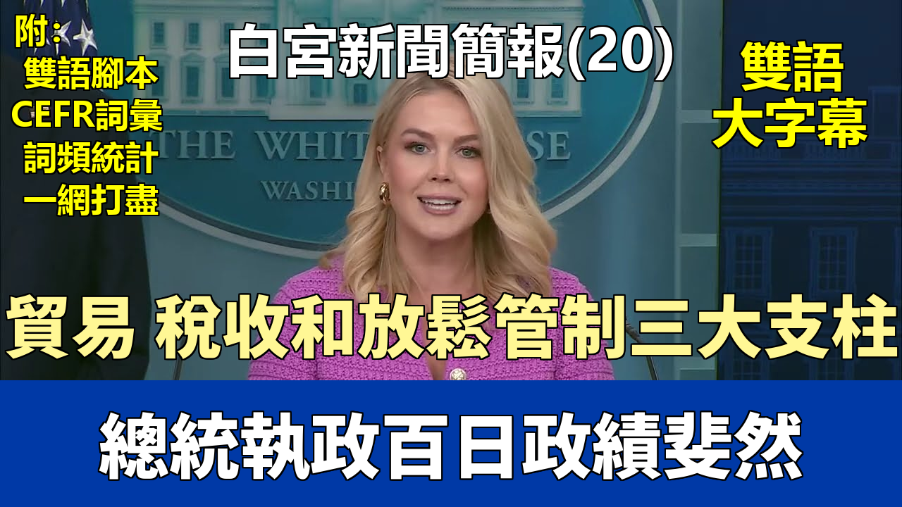

{% video youtube:WRlvLGhNakw width:100% autoplay:0 %}


### 【中英文双语脚本】

Good morning, everybody.
大家早上好。
Good morning. Happy first 100 days.
早上好。頭100天快樂。
Before we begin, I want to acknowledge that the bipartisan Take It Down Act passed the House last night.
在我們開始之前，我想告知大家，兩黨支持的《下架法案》昨晚在衆議院獲得通過。
This important legislation was championed and guided through Congress by our wonderful First Lady, Melania Trump,
這項重要的立法是由我們出色的第一夫人梅拉尼婭·特朗普倡導並推動通過國會的，
including through her direct advocacy on behalf of survivors during its passage efforts.
包括在法案通過過程中，她代表倖存者進行的直接倡導。
The Take It Down Act criminalizes the publication of non-consensual intimate imagery,
《下架法案》將發佈非自願性私密影像定爲刑事犯罪，
and requires social media and similar websites to remove such content within 48 hours of notice from a victim.
並要求社交媒體及類似網站在收到受害者通知後 48 小時內刪除此類內容。
The First Lady thanks all those who voted in favor of this important legislation, and the President looks forward to signing it when it arrives on his desk.
第一夫人感謝所有投票支持這項重要立法的人，總統期待着在該法案送達他的辦公桌時簽署它。
Today officially marks 100 days of promises made and promises kept by President Trump.
今天正式標誌着特朗普總統兌現承諾的100天。
This has truly been the most historic start to a presidency in American history.
這確實是美國曆史上最具歷史意義的總統任期開端。
After building the greatest economy in the world in his first term as President, President Trump is in the process of doing that all over again.
在第一個總統任期內建立了世界上最偉大的經濟之後，特朗普總統正在重新做一遍。
The American people trust in President Trump.
美國人民信任特朗普總統。
Since his first day in office, President Trump has focused on defeating the Biden inflation crisis, bringing down the cost of living,
自上任第一天起，特朗普總統就專注於解決拜登的通脹危機，降低生活成本，
and making the United States the best place in the world to do business, invest, create jobs, and innovate.
並使美國成爲世界上最適合經商、投資、創造就業和創新的地方。
And President Trump's efforts are working.
特朗普總統的努力正在奏效。
345,000 jobs have already been added since the start of President Trump's term.
自特朗普總統任期開始以來，已經增加了 345,000 個就業崗位。
Last month's jobs report saw nearly 100,000 more jobs than economists predicted,
上個月的就業報告顯示，新增就業崗位比經濟學家的預測多出近 100,000 個，
and it was the fourth highest month for private payroll growth in the past two years.
並且這是過去兩年中私營部門薪資增長第四高的月份。
9,000 manufacturing jobs have been added to the economy already.
經濟中已經增加了 9,000 個製造業就業崗位。
This is a sharp contrast to the 6,000 manufacturing jobs lost each month in the final two years of the Biden administration.
這與拜登政府最後兩年每月失去 6,000 個製造業崗位的狀況形成了鮮明對比。
The U.S. employment rate remains at historic lows.
美國的失業率仍然處於歷史低位。
And thanks to President Trump, Americans are seeing price relief for the first time in years.
感謝特朗普總統，美國人多年來首次看到了物價緩解。
The last inflation report showed the first consumer price decline since the COVID pandemic, a decrease in energy prices, and real average hourly wage growth.
最新的通脹報告顯示，自新冠疫情以來首次出現消費價格下降、能源價格下降以及實際平均時薪增長。
President Trump is delivering on his promises to lower costs for American families and businesses.
特朗普總統正在履行他爲美國家庭和企業降低成本的承諾。
Prices across the board for everyday goods have seen decline since this President was inaugurated.
自本屆總統就職以來，日用商品價格全面下降。
From airfare to used motor vehicles to prescription drugs, prices are dropping.
從機票到二手車再到處方藥，價格都在下降。
In fact, last month's drop in the price of prescription drugs was the largest ever recorded.
事實上，上個月處方藥價格的降幅是有記錄以來最大的。
And after Joe Biden botched the response to the bird flu, President Trump and Secretary Rowland's aggressive plan have brought down wholesale egg prices
在喬·拜登搞砸了對禽流感的應對之後，特朗普總統和羅蘭部長的積極計劃已使批發雞蛋價格
more than 50 percent from Inauguration Day.
從就職日以來下降了超過 50%。
President Trump ended Joe Biden's reckless war on American energy and fossil fuels and has restored American energy dominance.
特朗普總統結束了喬·拜登對美國能源和化石燃料的魯莽戰爭，並恢復了美國的能源主導地位。
And Secretary Wright and Secretary Doug Burgum are working hard on that effort every single day.
賴特部長和道格·伯格姆部長每天都在爲此努力工作。
Oil and gas prices are now way down because of this bold approach. Gasoline prices are down 7 percent. Energy prices are also down as well.
由於這一大膽的方針，石油和天然氣價格現在大幅下降。汽油價格下降了 7%。能源價格也同樣下降了。
The Department of Interior just announced a new offshore drilling policy that will boost oil production in the Gulf of Mexico by 100,000 barrels per day.
內政部剛剛宣佈了一項新的海上鑽探政策，將使墨西哥灣的石油產量每天增加 10 萬桶。
On the deregulation front, President Trump is committed to cutting senseless red tape,
在放松管制方面，特朗普總統致力於削減毫無意義的繁文縟節，
especially for America's small business owners who are the backbone of our economy. We know cutting regulation leads to lower costs and higher growth.
特別是爲作爲我們經濟支柱的美國小企業主。我們知道削減管制會帶來更低的成本和更高的增長。
The mass deregulation effort by this administration will help usher in the Golden Age of America, which is underway.
本屆政府大規模放松管制的努力將有助於開啓美國的黃金時代，而這正在進行中。
Immediately upon taking office, President Trump blocked all of the unfinalized Biden era rules,
一上任，特朗普總統就阻止了所有未最終確定的拜登時代的規定，
saving America more than $100 billion or $2,100 per family of four over the next decade.
在未來十年爲美國節省超過 1000 億美元，相當於每戶四口之家節省 2100 美元。
And the President also launched a bold multi-agency effort to roll back existing federal regulations that drive up the cost of living for hardworking families.
總統還發起了一項大膽的多機構努力，以廢除那些擡高辛勤工作家庭生活成本的現有聯邦法規。
This effort is projected to yield significant cost savings in the coming months,
這項努力預計將在未來幾個月產生顯著的成本節約，
including the EPA's rollback of tailpipe emission rules for light-duty and medium-duty vehicles,
包括環保署取消輕型和中型車輛的尾氣排放規定，
and the Department of Transportation's latest corporate average fuel economy standards.
以及交通部最新的企業平均燃油經濟性標準。
These two efforts alone yield $755 billion in total savings, or more than $8,800 per family of four over the next decade.
僅這兩項努力就節省了總計 7550 億美元，相當於未來十年每戶四口之家節省超過 8800 美元。
In total, the combined savings from all these actions equal just over $935 billion, or nearly $11,000 in real savings per family of four over the coming decade.
總的來說，所有這些行動的總節省額略超 9350 億美元，相當於未來十年每戶四口之家實際節省近 11000 美元。
The press is not talking nearly enough about the positive impact of President Trump's deregulation campaign,
媒體對特朗普總統放松管制運動的積極影響談論得遠遠不夠，
and investments from the biggest companies and countries in the world are pouring in under this President.
在這位總統的領導下，來自世界上最大的公司和國家的投資正涌入美國。
So far, total investment commitments under the Trump administration have reached more than $5 trillion,
到目前爲止，特朗普政府領導下的總投資承諾已超過 5 萬億美元，
including $500 billion from Apple in U.S.-based manufacturing and training, $500 billion from Nvidia in AI infrastructure,
其中包括蘋果公司在美國本土製造和培訓方面的 5000 億美元，英偉達在人工智能基礎設施方面的 5000 億美元，
$100 billion from TSMC in U.S.-based chips manufacturing, and $500 billion private investment by OpenAI, Oracle, and SoftBank in AI infrastructure as well.
臺積電在美國本土芯片製造方面的 1000 億美元，以及 OpenAI、甲骨文和軟銀在人工智能基礎設施方面的 5000 億美元私人投資。
All these investment commitments are estimated to generate at least 451,000 new high-paying jobs for American workers and families.
所有這些投資承諾預計將爲美國工人和家庭創造至少 451,000 個新的高薪工作崗位。
At this point, President Trump has secured more investments in the United States of America in 100 days than Joe Biden did in four years.
截至目前，特朗普總統在 100 天內爲美國爭取到的投資比喬·拜登在四年內做的還要多。
President Trump is America's businessman-in-chief, and that's why these trillions of dollars in investments are flooding into our country.
特朗普總統是美國的總商人，這就是爲什麼數萬億美元的投資正涌入我們國家。
The business community is bullish on America because President Trump is back in charge.
商界看好美國，因爲特朗普總統回來了。
Tomorrow, the President will host CEOs and leaders from several companies that have made these investments
明天，總統將接待來自幾家進行了這些投資的公司的首席執行官和領導人，
to tout their historic commitments to our country and encourage others to follow suit.
以宣傳他們對我們國家的歷史性承諾，並鼓勵其他人效仿。
Under President Trump, there has never been a better time to invest in America.
在特朗普總統的領導下，現在是投資美國的最佳時機。
And the President finally said, "Enough is enough," and refused to allow America and our workers to be ripped off any longer on trade.
總統終於說，“夠了就是夠了”，並拒絕再讓美國和我們的工人在貿易上被佔便宜。
President Trump implemented powerful tariffs to end the era of economic surrender and to rebalance America's trading agreements.
特朗普總統實施了強有力的關稅，以結束經濟投降的時代，並重新平衡美國的貿易協定。
More than 100 countries have already come to the table looking to offer more favorable terms for America and our people.
已經有超過100個國家來到談判桌前，尋求爲美國和我們的人民提供更有利的條件。
There has never been a President who has created his own leverage like this President, and we are just getting started.
從未有過一位總統像這位總統一樣創造了自己的籌碼，而我們纔剛剛開始。
Plans in Congress are getting very close to passing President Trump's one big, beautiful bill,
國會的計劃已非常接近通過特朗普總統那個宏偉、美好的法案，
which will include the largest tax cuts in American history, strong border security measures, major military advancements, dramatic deregulation,
其中將包括美國曆史上最大規模的減稅、強有力的邊境安全措施、重大的軍事進步、大幅度的放松管制，
and common-sense spending reforms. As President Trump has said before, the best is yet to come.
以及常識性的支出改革。正如特朗普總統之前所說，最好的還在後頭。
For more on President Trump's economic successes so far and the plans ahead, I want to pass it off to our incredible Treasury Secretary, Scott Bessent,
關於特朗普總統迄今爲止的經濟成就和未來的計劃，我想交給我們的傑出財政部長斯科特·貝森特，
who is here today, and we will open it up to questions.
他今天也在這裏，然後我們將開放提問。
In our new media seat, we have Brendan Pearson, the Financial Services Reporter for Punch Bowl News.
在我們的新媒體席位上，是來自 Punch Bowl News 的金融服務記者布倫丹·皮爾森。
Punch Bowl News covers power, people, and politics based in Washington, D.C. Laser focus on Capitol Hill, the politics of legislating, founded in 2021,
Punch Bowl News 報道總部位於華盛頓特區的權力、人物和政治。它高度關注國會山、立法政治，成立於 2021 年，
and it is the first newsletter that Capitol Hill and the White House read every morning, in the middle of the day, and throughout the evening.
並且是國會山和白宮每天早上、中午以及整個晚上閱讀的第一份時事通訊。
Thanks for being here with us, and we'll start with you today.
感謝你今天和我們在一起，我們今天將從你開始提問。
Thanks so much for being here. I have a question for Secretary Bessent.
非常感謝來到這裏。我有一個問題想問貝森特部長。
On tariffs, the President said over the weekend that we are hoping that maybe tariff revenues could replace income tax,
關於關稅，總統週末表示，我們希望關稅收入或許可以取代所得稅，
but we also keep hearing about the deals that the administration is pursuing.
但我們也一直聽說政府正在尋求達成協議。
So my question is, what is the White House's ultimate objective here? Do you want long-term tariff revenue or deals that might reduce those tariffs?
所以我的問題是，白宮的最終目標是什麼？你們是想要長期的關稅收入，還是想要可能降低這些關稅的協議？
I think it's a combination of both. So we're going to take in long-term tariff revenue. We put a process in place.
我認爲是兩者的結合。所以我們將獲得長期的關稅收入。我們已經建立了一個流程。
We have 18 important trading relationships. We will be speaking to all of those partners, or at least 17 of them, over the next few weeks.
我們有 18 個重要的貿易關係。我們將在未來幾周內與所有這些夥伴，或者至少是其中的 17 個進行對話。
Many of them have already come to Washington. What President Trump is referring to is the ability for tariff revenue to give income tax relief.
他們中的許多人已經來到了華盛頓。特朗普總統指的是關稅收入可以用來減免所得稅的能力。
And I think there's a very good chance that we will see this in the upcoming tax bill.
而且我認爲很有可能我們會在即將到來的稅收法案中看到這一點。
The President campaigned on no tax on tips, no tax on Social Security, no tax on overtime, and restoring interest deductibility for American-made autos.
總統競選時承諾不對小費徵稅、不對社保徵稅、不對加班費徵稅，並恢復美國製造汽車的利息抵扣。
So tariff income could be used for tax relief on all of those immediately.
因此，關稅收入可以立即用於所有這些方面的稅收減免。
So you think that there is a role for significant tariff revenue in U.S. fiscal policy?
所以您認爲鉅額關稅收入在美國財政政策中可以扮演一個角色？
I think that it is something that got put away a long time ago, and tariffs will bring back American manufacturing and generate substantial revenues.
我認爲這是很久以前就被擱置的事情，關稅將帶回美國的製造業併產生可觀的收入。
On manufacturing, we've seen some pretty grisly surveys this month from the Philly Fed, which saw the biggest drop since May 2020,
關於製造業，我們本月看到費城聯儲一些相當糟糕的調查，其降幅是自 2020 年 5 月以來最大的，
and the Dallas Fed, similar plunging outlook, poor shipping orders. What are American manufacturers not understanding about your push for onshoring in the U.S.?
達拉斯聯儲也有類似的前景暴跌、運輸訂單不佳。美國製造商對你們推動在美製造迴流有什麼不理解的地方嗎？
Well, I think I was in the investment business for 35 years, and I learned to ignore the surveys, look at the actual data, and the actual data has been quite good.
嗯，我想我在投資行業待了 35 年，我學會了忽略調查，看實際數據，而實際數據一直相當不錯。
The job data is good. Americans keep spending. And as Caroline said, we have these incredible commitments to bring manufacturing back onshore
就業數據很好。美國人持續消費。正如卡羅琳所說，我們有這些令人難以置信的承諾，將製造業帶回國內，
with record investment by domestic corporations and foreigners who want to come into the U.S. Thank you so much, Caroline. Thank you, Mr. Secretary.
包括國內公司和希望進入美國的外國人創紀錄的投資。非常感謝，卡羅琳。謝謝您，部長先生。
The Chinese continue to say that the U.S. and China are not engaged in any consultation or negotiation on tariffs.
中方持續表示，中美之間沒有就關稅問題進行任何磋商或談判。
You recently said you've talked to your counterpart more about "traditional things" like financial stability.
您最近表示，您與中方對等官員更多地談論了像金融穩定這樣的“傳統事務”。
So can you clarify, is the administration talking to Beijing specifically about tariffs or not?
那麼您能澄清一下，政府是否在與北京具體討論關稅問題？
Well, we're not going to talk about who's talking to whom, but I think that over time we will see that the Chinese tariffs are unsustainable for China.
嗯，我們不會談論誰在和誰談話，但我認爲隨着時間的推移，我們會看到中國的關稅對中國來說是不可持續的。
I've seen some very large numbers over the past few days that show if these tariffs stay on, China could lose 10 million jobs very quickly,
過去幾天我看到一些非常大的數字顯示，如果這些關稅繼續存在，中國可能很快會失去 1000 萬個工作崗位，
and even if there is a drop in the tariffs, they could lose 5 million jobs.
即使關稅有所下降，他們也可能失去 500 萬個工作崗位。
So remember that we are the deficit country. They sell almost five times more goods to us than we sell to them, so the onus will be on them to remove these tariffs.
所以請記住，我們是逆差國。他們賣給我們的商品幾乎是我們賣給他們的五倍，所以取消這些關稅的責任在他們身上。
They're unsustainable for them.
這些關稅對他們來說是不可持續的。
And they are saying you guys are not talking about it. So is that true?
但他們說你們沒有在談論這個問題。這是真的嗎？
They have a different form of government. They're playing to a different audience. So I'm not going to get into the nitty-gritty again of who's talking to whom.
他們有不同的政府形式。他們在對不同的受衆說話。所以我不會再糾纏於誰在和誰談話的細節。
But as I said, I believe for the Chinese, these tariffs are unsustainable.
但正如我所說，我相信對中國而言，這些關稅是不可持續的。
And very quickly, two days ago you said you didn't know if President Trump had spoken to Xi Jinping. Do you know now?
很快地問一下，兩天前您說不知道特朗普總統是否與習近平通過話。您現在知道了嗎？
Again, I would say Caroline and I have a lot of jobs around the White House; running the switchboard isn't one of them.
再說一次，我想說卡羅琳和我在白宮有很多工作；接轉電話總機不是其中之一。
Secretary Bessent, thank you so much for being here this morning.
貝森特部長，非常感謝您今天早上來到這裏。
You've talked about the importance of giving investors certainty when it comes to the market, because the Trump administration is continuing to negotiate
您談到過在市場方面給予投資者確定性的重要性，因爲特朗普政府正在繼續談判
several complex trade deals in a very compressed timeframe. When do you expect you'll be able to give the markets certainty around those deals?
幾個複雜的貿易協議，而且時間框架非常緊湊。您預計何時能夠就這些協議給市場帶來確定性？
Do you have a deadline? Is it the 90-day pause? What are we looking at here?
您有最後期限嗎？是 90 天的暫停期嗎？我們在這裏關注的是什麼？
Good question. And I think one thing that has been a little disconcerting for the markets is, President Trump creates what I would call strategic uncertainty
好問題。我認爲讓市場有點不安的一件事是，特朗普總統制造了我稱之爲戰略不確定性的東西
in the negotiations. So he is more concerned about getting the best possible trade deals for the American people.
在談判中。所以他更關心的是爲美國人民爭取到儘可能最好的貿易協議。
You know, we had decades of bad deals, decades of unfair trading, and we are going to unwind those and make them fair.
你知道，我們經歷了數十年的糟糕協議，數十年的不公平貿易，我們將要解除這些並使它們變得公平。
What we are doing is we've created a process. I think the aperture of uncertainty will be narrowing, and as we start moving forward, announcing deals,
我們正在做的是我們已經創建了一個流程。我認爲不確定性的範圍將會縮小，隨着我們開始前進，宣佈協議，
then there will be certainty. But you know, certainty is not necessarily a good thing in negotiating.
然後就會有確定性。但你知道，在談判中，確定性不一定是好事。
Mr. Secretary, last night there were reports on the administration sort of walking back a little bit on the auto tariffs.
部長先生，昨晚有報道稱政府在汽車關稅問題上有所退讓。
Can you elaborate on that decision and what we can expect going forward and why the shift in those auto tariffs?
您能詳細說明一下這個決定嗎？我們對接下來的情況有何期待？以及爲什麼汽車關稅會有這種轉變？
President Trump has had meetings with both domestic and foreign auto producers, and he's committed to bringing back auto production to the U.S.
特朗普總統已經與國內外汽車生產商舉行了會議，他致力於將汽車生產帶回美國。
So we want to give the automakers a path to do that quickly, efficiently, and create as many jobs as possible. Chasm.
所以我們想給汽車製造商一條途徑，讓他們能夠快速、高效地做到這一點，並創造儘可能多的就業機會。下一位，查斯姆。
Thank you so much, Caroline. Thank you, Secretary. Back on China, does the administration anticipate supply chain shocks or supply shocks
非常感謝，卡羅琳。謝謝您，部長。回到中國問題，政府是否預料到由於來自中國的貨物運輸量大幅下降，
coming now that cargo shipments from China are significantly down? And if so, are there plans in process on how to address that?
會出現供應鏈衝擊或供應衝擊？如果是這樣，是否有正在制定的計劃來應對？
I wouldn't think that we would have supply chain shocks, and I think retailers have managed their inventory in advance of this.
我不認爲我們會遇到供應鏈衝擊，我認爲零售商已經提前管理好了他們的庫存。
I speak to dozens of companies, sometimes daily, but definitely weekly, and they know President Trump is committed to fair trade and have planned accordingly.
我與數十家公司交談，有時是每天，但肯定是每週，他們知道特朗普總統致力於公平貿易，並已據此做出計劃。
And then second question, can you outline the timeline for when you think some of these deals, particularly with Asian countries like India, Japan, South Korea,
然後是第二個問題，您能否概述一下您認爲其中一些協議，特別是與印度、日本、韓國等亞洲國家的協議，
you may have an announcement?
可能會有公告的時間表？
I'm glad you brought up our Asian trading partners and allies. They have been the most forthcoming in terms of making the deals.
我很高興你提到了我們的亞洲貿易伙伴和盟友。他們在達成協議方面一直是最積極主動的。
As I mentioned, Vice President Vance was in India last week. I think that he and Modi made some very good progress.
正如我提到的，副總統萬斯上週在印度。我認爲他和莫迪取得了一些非常好的進展。
So I could see some announcements on India. I could see the contours of a deal with the Republic of Korea coming together.
所以我可以看到一些關於印度的公告。我可以看到與大韓民國達成協議的輪廓正在形成。
And then we've had substantial talks with the Japanese. Andrew?
然後我們與日本人進行了實質性的會談。安德魯？
Secretary Bessent, just continuing on the path of progress. You said yesterday, I think, it could happen as early as this week or possibly next week.
貝森特部長，繼續沿着進展的路徑談。您昨天好像說過，最早可能在本週或下週發生。
Can you give us a bit of a timetable? And then I wanted to ask about South Korea specifically. They've said they probably won't be able to make
您能給我們一個大致的時間表嗎？然後我想具體問一下韓國。他們說過，由於選舉的原因，他們可能要到七月初
a comprehensive deal until early July because of their elections. Japan also has elections. To what extent are domestic factors complicating your efforts?
才能達成全面協議。日本也有選舉。國內因素在多大程度上使您的努力複雜化？
Canada just had an election. Are you seeing that you might have to think about delaying the 90 days?
加拿大剛剛舉行了選舉。您是否認爲可能需要考慮推遲 90 天的期限？
Yeah, I would actually take the opposite tack. I think from our talks that these governments actually want to have the framework of a trade deal done
是的，我實際上會採取相反的策略。我認爲從我們的會談來看，這些政府實際上希望在選舉前完成貿易協議的框架，
before they go into elections to show that they have successfully negotiated with the United States.
以表明他們已經成功地與美國進行了談判。
So we are finding that they are actually much more keen to come to the table, get this done and then go home and campaign on it. Sean?
所以我們發現他們實際上更熱衷於坐到談判桌前，完成這件事，然後回家以此進行競選宣傳。肖恩？
I'm sorry, did you have a comment on whether something could happen this week or next week? Regarding a deal. You mentioned it yesterday.
對不起，您對本週或下週是否會有事情發生（指達成協議）有評論嗎？您昨天提到過。
Again, I think that we are very close on India. And in India, just a little inside baseball, it's easier to negotiate with in a funny way,
再說一次，我認爲我們在印度問題上非常接近了。而且在印度，說點內幕消息，說來有趣，與印度談判更容易，
than many other countries because they have very high tariffs and lots of tariffs. So it's much easier to confront the direct tariffs,
比起許多其他國家，因爲他們有非常高的關稅和種類繁多的關稅。所以直接面對關稅要容易得多，
whereas, as we go through these unfair trade deals put in over decades, the non-tariff barriers can be much more insidious and harder to detect.
而在我們處理這些幾十年來形成的不公平貿易協議時，非關稅壁壘可能更隱蔽，也更難發現。
So a country like India, which has posted tariffs, it's much easier to negotiate with them. So I think the Indian negotiations are moving well. Sean?
所以像印度這樣一個有關稅公示的國家，與他們談判要容易得多。所以我認爲印度的談判進展順利。肖恩？
Hi Mr. Secretary. So it was reported this morning that Amazon will soon display a little number next to the price of each product
部長先生您好。今天早上有報道稱，亞馬遜很快將在每件商品的價格旁邊顯示一個小數字，
that shows how much the Trump tariffs are adding to the cost of each product. So isn't that a perfect, crystal clear demonstration
顯示特朗普關稅爲每件商品的成本增加了多少。那麼，這難道不是一個完美、清晰的證明，
that it's the American consumer and not China who is going to have to pay for these policies?
表明是美國消費者而不是中國將不得不爲這些政策買單嗎？
I will take this, since I just got off the phone with the President about Amazon's announcement. This is a hostile and political act by Amazon.
這個問題我來回答，因爲我剛和總統就亞馬遜的聲明通完電話。這是亞馬遜的一種敵對和政治行爲。
Why didn't Amazon do this when the Biden administration hiked inflation to the highest level in 40 years?
爲什麼在拜登政府將通貨膨脹推高到 40 年來最高水平時，亞馬遜沒有這樣做？
And I would also add that it's not a surprise because as Reuters recently wrote, Amazon has partnered with a Chinese propaganda arm.
我還要補充一點，這並不奇怪，因爲正如路透社最近報道的那樣，亞馬遜與中國的宣傳機構合作。
So this is another reason why Americans should buy American. It's another reason why we are onshoring critical supply chains here at home
所以這是美國人應該購買美國貨的另一個原因。這也是我們爲什麼要把關鍵供應鏈移回國內，
to shore up our own critical supply chain and boost our own manufacturing here. Is Jeff Bezos still a Trump supporter?
以鞏固我們自己的關鍵供應鏈並促進我們本土製造業的另一個原因。傑夫·貝索斯還是特朗普的支持者嗎？
Look, I will not speak to the President's relationship with Jeff Bezos, but I will tell you that this is certainly a hostile and political action by Amazon.
聽着，我不會評論總統與傑夫·貝索斯的關係，但我可以告訴你，這肯定是亞馬遜的一種敵對和政治行爲。
Secretary, if you have anything to add.
部長，如果您有什麼要補充的。
Yeah, I would also add that bringing down the terrible Biden inflation has been a priority for the first hundred days of the Trump administration.
是的，我還要補充一點，降低可怕的拜登通脹一直是特朗普政府頭一百天的優先事項。
And President Trump has done a great job of leading that since January 20th. Tax rates, mortgage rates are down; gasoline and energy prices are down.
自 1 月 20 日以來，特朗普總統在領導這項工作方面做得非常出色。稅率、抵押貸款利率下降了；汽油和能源價格也下降了。
We're expecting further decreases. And as Caroline said, the big tax on consumers that goes unnoticed is regulation. We are deregulating and bringing that down.
我們預計還會進一步下降。正如卡羅琳所說，消費者身上未被注意到的巨大稅負是監管。我們正在放松管制並降低它。
So from a household income point of view, we would expect real purchasing power increases. We've seen them over the first hundred days and expect that to accelerate.
因此，從家庭收入的角度來看，我們預計實際購買力會增加。我們在頭一百天已經看到了這一點，並預計會加速。
We are doing peace deals, trade deals, tax deals and deregulating. Deregulation has a longer lead time, but I think by the third and fourth quarters,
我們正在達成和平協議、貿易協議、稅收協議並放松管制。放松管制需要更長的時間，但我認爲到第三和第四季度，
that's really going to kick in. Thank you, Caroline.
它會真正開始生效。謝謝你，卡羅琳。
A question for you and Secretary Bessent. We talk a lot about volatility and uncertainty in the marketplace.
一個問題問您和貝森特部長。我們經常談論市場的波動性和不確定性。
And the President has stated all along that he's more concerned about mainstream America, the American worker.
總統一直表示，他更關心美國主流社會，關心美國工人。
You just talked about deregulation and this entire fair trade and reciprocal trade. What is your message to the American people
您剛剛談到了放松管制以及這整個公平貿易和互惠貿易。您想對美國人民傳達什麼信息，
in terms of letting them get through this disturbance and the outcome being a greater good for the American worker, people, and families?
告訴他們如何度過這個動盪時期，並相信結果將爲美國工人、美國人民、美國家庭帶來更大的福祉？
I would say trust in President Trump. There's a reason he was reelected to this office. It's because of the historic success of his economic formula in the first term.
我想說，請信任特朗普總統。他再次當選這個職位是有原因的。這是因爲他在第一任期內經濟方案取得了歷史性的成功。
And as I laid out at the beginning of the briefing and the Secretary has talked about and the President talks about every day, there's a proven formula that works.
正如我在簡報開始時所闡述的，以及部長已經談到的和總統每天都在談論的，有一個行之有效的可靠方案。
Massive deregulation, energy independence, and tax cuts which are coming. The Secretary is working very hard on that with our counterparts on Capitol Hill.
大規模放松管制、能源獨立以及即將到來的減稅。部長正與我們在國會山的同僚就此非常努力地工作。
If you want to talk about that, that's a huge deal to put more money back into the pockets of hardworking Americans.
如果你想談論這個，這是把更多錢放回辛勤工作的美國人口袋裏的一件大事。
As for the fair trade deals the President is trying to negotiate, he's not just righting the wrong of the mess he inherited from the past four years
至於總統試圖談判的公平貿易協議，他不僅僅是在糾正他從過去四年繼承下來的爛攤子所犯的錯誤，
of the Biden administration. This is a mess created over the past four decades that has sold out the middle class and moved jobs overseas.
即拜登政府時期。這是一個過去四十年來造成的爛攤子，它出賣了中產階級，並將工作崗位轉移到了海外。
Think about our heartland, middle America, what towns used to look like, what they look like today. President Trump wants to restore the golden age
想想我們的腹地，美國中部，城鎮過去是什麼樣子，現在是什麼樣子。特朗普總統想要恢復黃金時代，
and it's a process to do that. That process is underway but he's put together a fantastic trade team: Secretary Bessent, Secretary Lutnick, Jameson Greer,
這是一個過程。這個過程正在進行中，但他組建了一支優秀的貿易團隊：貝森特部長、盧特尼克部長、詹姆森·格里爾，
all working incredibly hard on this effort 24/7. But tax cuts are coming and that's key. Mr. Secretary, why don't you talk a little bit about that?
他們都在夜以繼日地爲這項工作付出難以置信的努力。但減稅即將到來，這很關鍵。部長先生，您爲什麼不稍微談談這個？
So it's really a three-legged stool in economic policy: trade, tax, and deregulation.
所以經濟政策實際上是一個三腳凳：貿易、稅收和放松管制。
So we are in the midst of addressing, as Caroline said, these long-term trade imbalances.
因此，正如卡羅琳所說，我們正在着手解決這些長期的貿易不平衡問題。
The tax bill is going much better than I would have thought when I took office on January 20th. And that's through President Trump's leadership
稅收法案的進展比我 1 月 20 日上任時想象的要好得多。這要歸功於特朗普總統的領導，
that Speaker Johnson and Leader Thune are united. We had a very good meeting yesterday with the group called the Big Six: NEC Director Kevin Hassett,
約翰遜議長和領袖圖恩是團結一致的。我們昨天與所謂的“六巨頭”舉行了一次非常好的會議：國家經濟委員會主任凱文·哈塞特、
myself, Speaker Johnson, Leader Thune, Committee Chairman Jason Smith, and Senator Crapo. And the tax bill is moving forward.
我本人、約翰遜議長、圖恩領袖、委員會主席傑森·史密斯和參議員克拉波。稅收法案正在向前推進。
It is going to give permanence to the 2017 Tax Cuts and Jobs Act, which will go back to the question on certainty.
它將使 2017 年的《減稅與就業法案》永久化，這將回到確定性的問題上。
It will give American businesses certainty, it will give the American people certainty.
它將給美國企業帶來確定性，給美國人民帶來確定性。
And President Trump is also adding the things for working Americans I talked about earlier: no tax on tips, no tax on overtime,
然後特朗普總統還在增加我之前提到的爲工薪美國人準備的東西：不向小費徵稅、不向加班費徵稅、
no tax on Social Security, making auto loan interest deductible. So that will substantially address the affordability crisis.
不向社保徵稅，使汽車貸款利息可抵扣。這將大大緩解負擔能力危機。
And the other thing I would note, back to data, is that Vanguard, one of the largest money management firms in America, said that over the past 100 days,
我還要指出的另一件事，回到數據上，美國最大的資金管理公司之一先鋒集團表示，在過去 100 天裏，
97 percent of Americans haven't made a trade, and in fact, individual investors have held tight while institutional investors have panicked.
97% 的美國人沒有進行交易，事實上，散戶投資者一直持穩，而機構投資者卻在恐慌。
So individual investors trust, individual investors trust President Trump. Megan, in the back.
所以散戶投資者信任，散戶投資者信任特朗普總統。梅根，在後面。
Thank you. Can you detail for us exactly what we should expect as far as relief on the auto tariffs front?
謝謝。您能爲我們詳細說明一下，在汽車關稅減免方面，我們具體應該期待什麼嗎？
And further, Mr. Secretary, should we expect other industries to also get relief the way we've now seen for auto and tech?
此外，部長先生，我們是否應該期待其他行業也能像我們現在看到的汽車和科技行業那樣獲得減免？
I'm not going to go into the details of the auto tariff relief, but I can tell you it will go substantially toward reshoring American auto manufacturing.
我不會詳細說明汽車關稅減免的細節，但我可以告訴您，這將大大有助於美國汽車製造業的迴流。
And again, the goal here is to bring back high-quality industrial jobs to the U.S. President Trump is interested in the jobs of the future, not the past.
再說一次，這裏的目標是把高質量的工業工作帶回美國。特朗普總統對未來的工作感興趣，而不是過去的工作。
We don't necessarily need a booming textile industry like where I grew up again, but we do want to have precision manufacturing and bring that back.
我們不一定需要像我成長的地方那樣再次擁有蓬勃發展的紡織業，但我們確實希望擁有精密製造業並將其帶回來。
And another important, very important function of this that does not get talked about enough is national security.
此外，這一點另一個重要、非常重要但談論不夠的功能是國家安全。
President Trump's overriding concern and belief is that economic security is national security, and national security is economic security.
特朗普總統最關切和堅信的是，經濟安全就是國家安全，國家安全就是經濟安全。
And we saw during COVID that our supply chains got cut off and we need to bring back many of those supply chains, whether in semiconductors, medicines,
我們在新冠疫情期間看到，我們的供應鏈被切斷了，我們需要帶回許多這些供應鏈，無論是在半導體、藥品、
or steel, and we have to onshore those. So it's a combination of making trade free and fair and remedying this gaping national security hole he was left with.
還是鋼鐵領域，我們必須將它們移回國內。因此，這是使貿易自由公平與彌補他遺留下來的巨大國家安全漏洞的結合。
I would just add, Megan, the President will sign the executive order on auto tariffs later today and we will release it as we always do. Go ahead.
我只想補充一點，梅根，總統今天晚些時候將簽署關於汽車關稅的行政命令，我們會像往常一樣發佈它。請繼續。
Secretary, any updates on the negotiation with the European Union? And is it hard to negotiate with the European Union? Pardon?
部長，與歐盟的談判有什麼最新進展嗎？與歐盟談判困難嗎？抱歉，什麼？
Do you have any updates on the negotiation with the European Union?
您有關於與歐盟談判的任何最新消息嗎？
I'm more involved in the Asian negotiations. My observation goes back to Henry Kissinger's statement, "When I call Europe, who do I call?"
我更多地參與亞洲的談判。我的觀察可以追溯到亨利·基辛格的說法：“當我打電話給歐洲時，我該打給誰？”
So we're negotiating with a lot of different interests. Some European countries have put an unfair digital service tax on our big internet providers,
所以我們正在與許多不同的利益方進行談判。一些歐洲國家對我們的大型互聯網提供商徵收了不公平的數字服務稅，
France and Italy. Other countries, like Germany and Poland, don't have that. So we want to see that unfair tax on one of America's great industries removed.
比如法國和意大利。其他國家，如德國和波蘭，則沒有。所以我們希望看到對美國一個偉大行業徵收的不公平稅收被取消。
So it's going to be a give and take. They have some internal matters to decide before they can engage in external negotiation. Edward.
所以這將是一個有來有往的過程。他們在能夠進行外部談判之前，需要先決定一些內部事務。愛德華。
Thanks, Caroline. Mr. Secretary, the contacts I have in the business community say they're basically frozen for long-term investment
謝謝，卡羅琳。部長先生，我在商界的聯繫人說，由於關稅的不確定性，他們基本上凍結了長期投資。
because of the uncertainty around tariffs. How long do you think President Trump has to make a deal before there's damage to the economy?
您認爲特朗普總統有多長時間必須達成協議，以免對經濟造成損害？
Look, I think what we're seeing is that business leaders have paused. I think we're going to give them great certainty with this tax bill.
聽着，我認爲我們看到的是商界領袖們已經暫停了腳步。我認爲我們將通過這項稅收法案給他們帶來巨大的確定性。
And I think over the next couple of weeks, as I said, we have 18 important trading relationships. Put China aside, 17. They are in motion.
我認爲在接下來的幾周內，正如我所說，我們有 18 個重要的貿易關係。把中國放在一邊，還有 17 個。它們都在進行中。
And then, as I said yesterday, I think there's a very good chance we're going to get this tax bill done. It will be very powerful for domestic U.S. investment.
然後，正如我昨天所說，我認爲我們很有可能完成這項稅收法案。它將對美國國內投資產生非常強大的推動力。
So what we are going to do... one of the most powerful parts of President Trump's 2017 tax bill was full expensing of equipment.
所以我們要做的是……特朗普總統 2017 年稅法中最有力的部分之一是設備的完全費用化。
We are going to make that retroactive to January 20th, as President Trump said in his speech to Congress.
正如特朗普總統在國會演講中所說，我們將使其追溯至 1 月 20 日生效。
The other thing we are looking to add is full expensing for factories. So bring your factory back. You can fully expense the equipment and the building.
我們希望增加的另一項是工廠的完全費用化。所以把你的工廠帶回來。你可以將設備和建築完全費用化。
We will couple that with deregulation, cheap energy, and regulatory certainty, making the U.S. the greatest destination for domestic and foreign investment.
我們將把它與放松管制、廉價能源和監管確定性結合起來，使美國繼續成爲國內外投資的最佳目的地。
The President said world leaders would like to meet with him in Vatican City, I'm sorry, about trade.
總統說世界領導人想在梵蒂岡城，抱歉，與他會面討論貿易問題。
Other than President Zelensky, who did the President meet with about trade and when could we get some of those deals?
除了澤連斯基總統，總統還會見了誰討論貿易問題？我們何時能達成其中一些協議？
The President met with President Zelensky, as you know, which we talked about. The President continues to be engaged with his fellow foreign leaders,
如你所知，總統會見了澤連斯基總統，我們談到過。總統繼續與世界各國的領導人保持接觸，
fellow leaders around the world and in the European Union. You've seen many of them visit the White House.
包括歐盟的領導人。你已經看到他們中的許多人訪問了白宮。
I want to harp on in closing the point the Secretary just made. On the campaign trail, the President promised the American public
在結束時，我想強調一下部長剛纔提出的觀點。在競選期間，總統向美國公衆承諾，
he was going to make America the best country in the world to do business again: the lowest taxes, fewest regulations, lowest energy costs anywhere.
他將再次使美國成爲世界上最適合經商的國家：最低的稅收、最少的法規、全球最低的能源成本。
And if you do business in the United States, you won't face tariffs. That's not just good for companies worldwide, but it's good for the American worker.
如果你在美國做生意，你將不會面臨關稅。這不僅對世界各地的公司有利，也對美國工人有利。
That's what this team is focused so hard on every day. We have work to do. The golden age of America is underway.
這就是這個團隊每天如此努力關注的事情。我們還有工作要做。美國的黃金時代正在進行中。
But as I pointed out in the beginning, there's a lot of reason for the American consumer, CEO, and small business owner
但正如我一開始指出的，美國的消費者、首席執行官和小型企業主有充分的理由
to be confident and optimistic about this President and where we're headed. You will hear more from the President himself later this evening.
對這位總統以及我們前進的方向充滿信心和樂觀。今天晚些時候你們會聽到總統本人的更多講話。
He is traveling to Michigan, as you all know. He'll make a stop at the Air Force Base with Governor Whitmer.
衆所周知，他正在前往密歇根州。他將在空軍基地與惠特默州長會面停留。
And then we will head to a rally tonight where you'll hear more from him directly. So we'll see you in Michigan.
然後我們今晚將前往一個集會，在那裏你將直接聽到他的更多講話。那麼，我們在密歇根見。

### 【核心词汇 - B1_C2】
| 單詞 | 音標 | 詞性 | 釋義 | 等級 | 次數 |
|---|---|---|---|---|---|
| Department | /dɪˈpɑːrtmənt/ | noun | 部門，部 | B1 | 1 |
| European | /ˌjʊrəˈpiːən/ | adjective | 歐洲的 | B1 | 1 |
| Security | /sɪˈkjʊrəti/ | noun | 安全 | B1 | 1 |
| able | /ˈeɪbl/ | adjective | 能夠；有能力的 | B1 | 1 |
| acknowledge | /əkˈnɑːlɪdʒ/ | verb | 承認，確認 | B1 | 1 |
| administration | /ədˌmɪnɪˈstreɪʃn/ | noun | 管理，行政 | B1 | 1 |
| advance | /ədˈvæns/ | verb | 前進，進步 | B1 | 1 |
| aggressive | /əˈɡresɪv/ | adjective | 好鬥的，侵略性的 | B1 | 1 |
| agreement | /əˈɡriːmənt/ | noun | 協議，同意 | B1 | 1 |
| announce | /əˈnaʊns/ | verb | v. 宣佈；宣告 | B1 | 2 |
| announcement | /əˈnaʊnsmənt/ | noun | n. 聲明；公告 | B1 | 2 |
| approach | /əˈproʊtʃ/ | noun | n. 方法；接近；途徑 | B1 | 1 |
| aside | /əˈsaɪd/ | adverb | 在旁邊，到一邊 | B1 | 1 |
| barrel | /ˈbærəl/ | noun | 桶 | B1 | 1 |
| behalf | /bɪˈhæf/ | noun | 代表 | B1 | 1 |
| belief | /bɪˈliːf/ | noun | 信仰 | B1 | 1 |
| bold | /boʊld/ | adjective | 大膽的；勇敢的；醒目的 | B1 | 1 |
| boom | /buːm/ | noun | 繁榮；迅速發展 | B1 | 1 |
| border | /ˈbɔːrdər/ | noun | 邊界；邊境 | B1 | 1 |
| certainty | /ˈsɜːrtnti/ | noun | 確定，肯定 | B1 | 1 |
| champion | /ˈtʃæmpiən/ | noun | 冠軍，擁護者 | B1 | 1 |
| charge | /tʃɑːrdʒ/ | noun | 費用，指控，主管 | B1 | 1 |
| combination | /ˌkɑːmbɪˈneɪʃn/ | noun | 結合，組合 | B1 | 1 |
| combine | /kəmˈbaɪn/ | verb | 結合，合併 | B1 | 1 |
| comment | /ˈkɑːment/ | noun | 評論，意見 | B1 | 1 |
| complex | /kɑːmˈplɛks/ | adjective | 複雜的，難懂的 | B1 | 1 |
| complicate | /ˈkɑːmplɪkeɪt/ | verb | 使複雜，使混亂 | B1 | 1 |
| concerned | /kənˈsɜːrnd/ | adjective | adj. 擔心的，關注的；有關的 | B1 | 1 |
| consumer | /kənˈsuːmər/ | noun | n. 消費者 | B1 | 2 |
| content | /kənˈtent/ | noun | n. 內容，目錄 | B1 | 1 |
| crisis | /ˈkraɪsɪs/ | noun | 危機 | B1 | 1 |
| critical | /ˈkrɪtɪkl/ | adjective | 關鍵的，批判性的 | B1 | 1 |
| damage | /ˈdæmɪdʒ/ | noun | 損壞，損失 | B1 | 1 |
| deadline | /ˈdedlaɪn/ | noun | 截止日期；最後期限 | B1 | 1 |
| decision | /dɪˈsɪʒn/ | noun | 決定；決策 | B1 | 1 |
| decline | /dɪˈklaɪn/ | noun | 下降；衰退 | B1 | 1 |
| decrease | /ˈdiːkriːs/ | noun | 減少；降低 | B1 | 2 |
| defeat | /dɪˈfiːt/ | verb | 擊敗；戰勝 | B1 | 1 |
| definitely | /ˈdefɪnətli/ | adverb | 明確地；肯定地 | B1 | 1 |
| deliver | /dɪˈlɪvər/ | verb | 遞送；傳送；發表 | B1 | 1 |
| demonstration | /ˌdemənˈstreɪʃn/ | noun | 論證；證明；示威遊行 | B1 | 1 |
| destination | /ˌdestɪˈneɪʃn/ | noun | 目的地 | B1 | 1 |
| digital | /ˈdɪdʒɪtl/ | adjective | 數字的，數碼的 | B1 | 1 |
| directly | /dəˈrektli/ | adverb | 直接地；立即 | B1 | 1 |
| disturbance | /dɪˈstɜːrbəns/ | noun | 干擾，擾亂 | B1 | 1 |
| dozen | /ˈdʌzn/ | determiner | 一打 | B1 | 1 |
| dramatic | /drəˈmætɪk/ | adjective | 戲劇性的，引人注目的 | B1 | 1 |
| economic | /ˌekəˈnɑːmɪk/ | adjective | 經濟的 | B1 | 1 |
| economy | /iˈkɑːnəmi/ | noun | 經濟 | B1 | 1 |
| election | /ɪˈlekʃən/ | noun | 選舉 | B1 | 2 |
| employment | /ɪmˈplɔɪmənt/ | noun | 就業；工作 | B1 | 1 |
| engage | /ɪnˈɡeɪdʒ/ | verb | （使）從事；（使）參與；訂婚；吸引 | B1 | 1 |
| engaged | /ɪnˈɡeɪdʒd/ | adjective | 已訂婚的；已婚的；使用中的；忙碌的 | B1 | 1 |
| entire | /ɪnˈtaɪər/ | adjective | 整個的；全部的 | B1 | 1 |
| equal | /ˈiːkwəl/ | adjective | 相等的；同樣的 | B1 | 1 |
| equipment | /ɪˈkwɪpmənt/ | noun | 設備；裝備 | B1 | 1 |
| era | /ˈɪrə/ | noun | 時代；紀元 | B1 | 1 |
| estimate | /ˈestɪmeɪt/ | verb | 估計；估算 | B1 | 1 |
| expense | /ɪkˈspens/ | noun | 花費；費用 | B1 | 2 |
| extent | /ɪkˈstent/ | noun | 程度；範圍 | B1 | 1 |
| fellow | /ˈfeloʊ/ | noun | 同伴；同事；夥伴 | B1 | 1 |
| financial | /faɪˈnænʃl/ | adjective | 財政的；金融的 | B1 | 1 |
| finding | /ˈfaɪndɪŋ/ | noun | 發現；發現物；調查結果 | B1 | 1 |
| firm | /fɜːrm/ | adjective | 堅固的；結實的；堅定的 | B1 | 1 |
| flu | /fluː/ | noun | 流行性感冒 | B1 | 1 |
| formula | /ˈfɔːrmjələ/ | noun | 公式，配方 | B1 | 1 |
| fuel | /ˈfjuːəl/ | noun | 燃料 | B1 | 2 |
| generate | /ˈdʒenəreɪt/ | verb | 產生，發生；生成，產生（能量等） | B1 | 1 |
| goods | /ɡʊdz/ | noun | 商品，貨物 | B1 | 1 |
| growth | /ɡroʊθ/ | noun | 成長，增長 | B1 | 1 |
| guide | /ɡaɪd/ | noun | 嚮導，指南 | B1 | 1 |
| hardworking | /ˌhɑːrd ˈwɜːrkɪŋ/ | adjective | 努力工作的 | B1 | 1 |
| hearing | /ˈhɪrɪŋ/ | noun | 聽力; 聽覺; 聽證會 | B1 | 1 |
| historic | /hɪˈstɔːrɪk/ | adjective | 歷史性的; 具有歷史意義的 | B1 | 1 |
| household | /ˈhaʊshoʊld/ | noun | 家庭; 一家人 | B1 | 1 |
| huge | /hjuːdʒ/ | adjective | 巨大的 | B1 | 1 |
| ignore | /ɪɡˈnɔːr/ | verb | 忽視，忽略 | B1 | 1 |
| immediately | /ɪˈmiːdiətli/ | adverb | 立即，馬上 | B1 | 2 |
| income | /ˈɪnkʌm/ | noun | 收入 | B1 | 1 |
| incredible | /ɪnˈkredəbl/ | adjective | 難以置信的，極好的 | B1 | 1 |
| incredibly | /ɪnˈkredəbli/ | adverb | 難以置信地，非常 | B1 | 1 |
| individual | /ˌɪndɪˈvɪdʒuəl/ | adjective | 個人的，單獨的 | B1 | 1 |
| industrial | /ɪnˈdʌstriəl/ | adjective | 工業的 | B1 | 1 |
| industry | /ˈɪndəstri/ | noun | 工業，產業 | B1 | 2 |
| internal | /ɪnˈtɜːrnl/ | adjective | 內部的 | B1 | 1 |
| invest | /ɪnˈvest/ | verb | 投資 | B1 | 1 |
| involved | /ɪnˈvɑːlvd/ | adjective | 參與的，捲入的 | B1 | 1 |
| launch | /lɔːntʃ/ | verb | 發起，發動，推出；發射，下水 | B1 | 1 |
| lay | /leɪ/ | verb | 放置，安放；產（卵）；鋪設 | B1 | 1 |
| leadership | /ˈliːdərʃɪp/ | noun | 領導能力，領導地位；領導階層 | B1 | 1 |
| management | /ˈmænɪdʒmənt/ | noun | 管理，經營 | B1 | 1 |
| mass | /mæs/ | adjective | 大量的，大規模的 | B1 | 1 |
| massive | /ˈmæsɪv/ | adjective | 巨大的 | B1 | 1 |
| measure | /ˈmeʒər/ | noun | 措施，方法；計量單位；程度 | B1 | 1 |
| mess | /mes/ | noun | 髒亂；混亂 | B1 | 1 |
| motor | /ˈmoʊtər/ | noun | 馬達；發動機 | B1 | 1 |
| narrow | /ˈnæroʊ/ | adjective | 狹窄的 | B1 | 1 |
| negotiate | /nɪˈɡoʊʃieɪt/ | verb | 談判，協商 | B1 | 2 |
| negotiation | /nɪˌɡoʊʃiˈeɪʃn/ | noun | 談判，協商 | B1 | 2 |
| objective | /əbˈdʒɛktɪv/ | noun | 目標 | B1 | 1 |
| observation | /ˌɑbzərˈveɪʃən/ | noun | 觀察 | B1 | 1 |
| officially | /əˈfɪʃəli/ | adverb | 正式地 | B1 | 1 |
| outline | /ˈaʊtˌlaɪn/ | verb | 概述，概括；描繪輪廓 | B1 | 1 |
| particularly | /pərˈtɪkjələrli/ | adverb | 特別地，尤其 | B1 | 1 |
| pause | /pɔz/ | noun | 暫停，停頓 | B1 | 2 |
| per | /pɜr/ | preposition | 每，每一；按照，根據 | B1 | 1 |
| planned | /plænd/ | adjective | 計劃好的 | B1 | 1 |
| policy | /ˈpɑləsi/ | noun | 政策，方針；保險單 | B1 | 2 |
| politics | /ˈpɑləˌtɪks/ | noun | 政治；政治學；政治活動；政事 | B1 | 1 |
| positive | /ˈpɑːzətɪv/ | adjective | 積極的；肯定的；樂觀的；有益的；確定的；陽性的 | B1 | 1 |
| prescription | /prɪˈskrɪpʃn/ | noun | 處方；藥方 | B1 | 1 |
| press | /pres/ | noun | 報刊；新聞界；出版社；印刷機 | B1 | 1 |
| process | /ˈprɑːses/ | noun | 過程，程序 | B1 | 1 |
| producer | /prəˈduːsər/ | noun | 生產者，製片人 | B1 | 1 |
| progress | /ˈprɑːɡres/ | noun | 進步，進展 | B1 | 1 |
| reduce | /rɪˈduːs/ | verb | 減少，降低 | B1 | 1 |
| refuse | /rɪˈfjuːz/ | noun | 垃圾，廢物 | B1 | 1 |
| regard | /rɪˈɡɑːrd/ | verb | 認爲，看待，尊重 | B1 | 1 |
| regulation | /ˌreɡjuˈleɪʃn/ | noun | 規章，規則 | B1 | 2 |
| relationship | /rɪˈleɪʃnʃɪp/ | noun | 關係，聯繫 | B1 | 2 |
| remedy | /ˈremədi/ | noun | 療法，補救辦法 | B1 | 1 |
| remove | /rɪˈmuːv/ | verb | 移除，去掉 | B1 | 1 |
| require | /rɪˈkwaɪər/ | verb | 需要，要求 | B1 | 1 |
| restore | /rɪˈstɔːr/ | verb | 恢復，修復 | B1 | 3 |
| secure | /sɪˈkjʊr/ | adjective | 安全的；可靠的 | B1 | 1 |
| security | /sɪˈkjʊrəti/ | noun | 安全；保障 | B1 | 1 |
| service | /ˈsɜːrvɪs/ | noun | 服務；服務業 | B1 | 1 |
| sharp | /ʃɑːrp/ | adjective | 鋒利的；敏銳的 | B1 | 1 |
| shift | /ʃɪft/ | verb | 移動；轉移 | B1 | 1 |
| sometimes | /ˈsʌmtaɪmz/ | adverb | 有時；間或 | B1 | 1 |
| sort | /sɔːrt/ | noun | 種類，類別；品質，品級；方式，方法 | B1 | 1 |
| spoken | /ˈspoʊkən/ | adjective | 口語的，說出口的 | B1 | 1 |
| standard | /ˈstændərd/ | noun | 標準，規格；水平，水準；規範，準則 | B1 | 1 |
| steel | /stiːl/ | noun | 鋼；鋼鐵製品 | B1 | 1 |
| strategic | /strəˈtiːdʒɪk/ | adjective | 戰略性的 | B1 | 1 |
| substantial | /səbˈstænʃəl/ | adjective | 大量的，可觀的；重大的，實質性的 | B1 | 1 |
| supply | /səˈplaɪ/ | noun | 供應，供給；物資 | B1 | 1 |
| supporter | /səˈpɔːrtər/ | noun | 支持者，擁護者 | B1 | 1 |
| survivor | /sərˈvaɪvər/ | noun | 倖存者，生還者 | B1 | 1 |
| tax | /tæks/ | noun | 稅，稅收 | B1 | 3 |
| term | /tɜːrm/ | noun | 術語；學期；條款 | B1 | 2 |
| throughout | /θruːˈaʊt/ | preposition | 遍及；貫穿 | B1 | 1 |
| total | /ˈtoʊtl/ | adjective | 總計的；完全的 | B1 | 1 |
| trail | /treɪl/ | noun | 小路，蹤跡 | B1 | 1 |
| transportation | /ˌtrænspɔːrˈteɪʃən/ | noun | 運輸，交通 | B1 | 1 |
| uncertainty | /ʌnˈsɜːrtənti/ | noun | 不確定性，不確定因素 | B1 | 1 |
| update | /ʌpˈdeɪt/ | verb | 更新，使現代化 | B1 | 1 |
| vehicle | /ˈviːɪkl/ | noun | 車輛；交通工具 | B1 | 1 |
| victim | /ˈvɪktɪm/ | noun | 受害者；犧牲品 | B1 | 1 |
| whether | /ˈweðər/ | conjunction | 是否 | B1 | 1 |
| working | /ˈwɜːrkɪŋ/ | adjective | adj. 工作的；有效的 | B1 | 1 |
| Congress | /ˈkɑːŋɡrəs/ | noun | 國會 | B2 | 1 |
| Secretary | /ˈsekrəteri/ | noun | 祕書，部長 | B2 | 1 |
| Senator | /ˈsenətər/ | noun | 參議員 | B2 | 1 |
| accelerate | /əkˈseləreɪt/ | verb | 加速 | B2 | 1 |
| accordingly | /əˈkɔːrdɪŋli/ | adverb | adv. 因此，相應地 | B2 | 1 |
| actual | /ˈæktʃuəl/ | adjective | adj. 實際的，真實的 | B2 | 1 |
| advancement | /ədˈvænsmənt/ | noun | 進步，晉升 | B2 | 1 |
| ally | /ˈælaɪ/ | noun | 盟友，同盟者 | B2 | 1 |
| anticipate | /ænˈtɪsɪpeɪt/ | verb | 預期，期望；預料，預測 | B2 | 1 |
| barrier | /ˈbæriər/ | noun | 障礙物，柵欄；障礙，隔閡 | B2 | 1 |
| billion | /ˈbɪljən/ | noun | 十億 | B2 | 1 |
| boost | /buːst/ | noun | 促進，提高 | B2 | 1 |
| briefing | /ˈbriːfɪŋ/ | noun | 簡報 | B2 | 1 |
| campaign | /kæmˈpeɪn/ | noun | 運動；活動 | B2 | 2 |
| chip | /tʃɪp/ | noun | 芯片；炸薯條; 碎片 | B2 | 1 |
| clarify | /ˈklærɪfaɪ/ | verb | 澄清，闡明 | B2 | 1 |
| committed | /kəˈmɪtɪd/ | adjective | 盡心盡力的，堅定的 | B2 | 1 |
| common-sense | /ˌkɑːmən ˈsens/ | adjective | 常識的 | B2 | 1 |
| community | /kəˈmjuːnəti/ | noun | 社區，社羣 | B2 | 1 |
| comprehensive | /ˌkɑːmprɪˈhensɪv/ | adjective | 綜合的，全面的 | B2 | 1 |
| confront | /kənˈfrʌnt/ | verb | 面對，對抗 | B2 | 1 |
| corporate | /ˈkɔːrpərət/ | adjective | 公司的；社團的 | B2 | 1 |
| corporation | /ˌkɔːrpəˈreɪʃən/ | noun | 公司；社團 | B2 | 1 |
| decade | /ˈdekeɪd/ | noun | 十年 | B2 | 2 |
| deficit | /ˈdefəsɪt/ | noun | 赤字；不足 | B2 | 1 |
| detect | /dɪˈtekt/ | verb | 察覺，發現；偵查 | B2 | 1 |
| domestic | /dəˈmestɪk/ | adjective | 國內的，家庭的；馴養的 | B2 | 1 |
| economist | /iˈkɑːnəmɪst/ | noun | 經濟學家 | B2 | 1 |
| energy | /ˈenərdʒi/ | noun | 能量；精力 | B2 | 1 |
| executive | /ɪɡˈzekjətɪv/ | adjective | 行政的；決策的；高級的 | B2 | 1 |
| external | /ɪkˈstɜːrnl/ | adjective | 外部的；外面的 | B2 | 1 |
| factor | /ˈfæktər/ | noun | 因素；要素 | B2 | 1 |
| federal | /ˈfedərəl/ | adjective | 聯邦的，聯邦政府的 | B2 | 1 |
| fiscal | /ˈfɪskl/ | adjective | 財政的，金融的 | B2 | 1 |
| focused | /ˈfoʊkəst/ | adjective | 集中的 | B2 | 1 |
| forthcoming | /ˌfɔːrθˈkʌmɪŋ/ | adjective | 即將到來的；樂於助人的；坦率的 | B2 | 1 |
| found | /faʊnd/ | verb | 創立；建立 | B2 | 1 |
| hourly | /ˈaʊərli/ | adjective | 每小時的 | B2 | 1 |
| imagery | /ˈɪmɪdʒri/ | noun | n. 意象，比喻 | B2 | 1 |
| implement | /ˈɪmplɪment/ | noun | n. 工具，器具 | B2 | 1 |
| inflation | /ɪnˈfleɪʃn/ | noun | 通貨膨脹 | B2 | 1 |
| infrastructure | /ˈɪnfrəstrʌktʃər/ | noun | 基礎設施 | B2 | 1 |
| inherit | /ɪnˈherɪt/ | verb | 繼承 | B2 | 1 |
| intimate | /ˈɪntəmət/ | adjective | 親密的，密切的 | B2 | 1 |
| investment | /ɪnˈvestmənt/ | noun | 投資 | B2 | 2 |
| investor | /ɪnˈvestər/ | noun | 投資者 | B2 | 1 |
| keen | /kiːn/ | adjective | 熱衷的；渴望的；敏銳的 | B2 | 1 |
| laser | /ˈleɪzər/ | noun | 激光 | B2 | 1 |
| legislation | /ˌledʒɪsˈleɪʃn/ | noun | 法律，法規 | B2 | 1 |
| loan | /loʊn/ | noun | 貸款 | B2 | 1 |
| long-term | /ˌlɔːŋ ˈtɜːrm/ | adjective | 長期的 | B2 | 1 |
| manufacturer | /ˌmænjəˈfæktʃərər/ | noun | 製造商；廠商 | B2 | 1 |
| manufacturing | /ˌmænjəˈfæktʃərɪŋ/ | noun | 製造業 | B2 | 1 |
| media | /ˈmiːdiə/ | noun | 媒體，媒介 | B2 | 1 |
| midst | /mɪdst/ | noun | 中間，當中 | B2 | 1 |
| mortgage | /ˈmɔːrɡɪdʒ/ | noun | 抵押貸款 | B2 | 1 |
| motion | /ˈmoʊʃən/ | noun | 運動，動作 | B2 | 1 |
| necessarily | /ˌnesəˈserɪli/ | adverb | 必然地；必須地 | B2 | 1 |
| offshore | /ˈɔːfʃɔːr/ | adjective | 近海的，離岸的 | B2 | 1 |
| optimistic | /ˌɑːptɪˈmɪstɪk/ | adjective | 樂觀的 | B2 | 1 |
| outcome | /ˈaʊtkʌm/ | noun | 結果，結局 | B2 | 1 |
| outlook | /ˈaʊtlʊk/ | noun | 展望；前景；觀點 | B2 | 1 |
| overtime | /ˈoʊvərtaɪm/ | adverb | 加班地 | B2 | 1 |
| pandemic | /pænˈdemɪk/ | adjective | 大流行的，廣泛流行的 | B2 | 1 |
| permanence | /ˈpɜːrmənəns/ | noun | 永久，永恆 | B2 | 1 |
| presidency | /ˈprezɪdənsi/ | noun | 總統職位，總統任期 | B2 | 1 |
| priority | /praɪˈɔːrəti/ | noun | 優先事項，優先權 | B2 | 1 |
| project | /ˈprɑːdʒekt/ | noun | 項目，工程 | B2 | 1 |
| proven | /ˈpruːvn/ | adjective | 證明了的，已證實的 | B2 | 1 |
| publication | /ˌpʌblɪˈkeɪʃn/ | noun | 出版物，發表 | B2 | 1 |
| purchase | /ˈpɜːrtʃəs/ | noun | 購買，採購 | B2 | 1 |
| rally | /ˈræli/ | noun | 集會；拉力賽 | B2 | 1 |
| reckless | /ˈrekləs/ | adjective | 魯莽的，不顧後果的 | B2 | 1 |
| reform | /rɪˈfɔːrm/ | noun | 改革；改良 | B2 | 1 |
| relief | /rɪˈliːf/ | noun | 減輕，解除；救濟，救助；安慰，寬慰 | B2 | 1 |
| remains | /rɪˈmeɪnz/ | noun | 遺骸，殘餘物 | B2 | 1 |
| retailer | /ˈriːteɪlər/ | noun | 零售商 | B2 | 1 |
| revenue | /ˈrevənuː/ | noun | 收入；收益 | B2 | 2 |
| rip | /rɪp/ | verb | 撕裂；扯破 | B2 | 1 |
| shipping | /ˈʃɪpɪŋ/ | noun | 航運，運輸 | B2 | 1 |
| significantly | /sɪɡˈnɪfɪkəntli/ | adverb | 顯著地，重要地，意味深長地 | B2 | 1 |
| specifically | /spəˈsɪfɪkli/ | adverb | adv. 特別地，明確地 | B2 | 1 |
| stability | /stəˈbɪləti/ | noun | 穩定；穩固 | B2 | 1 |
| stool | /stuːl/ | noun | 凳子；（排泄出的）糞便 | B2 | 1 |
| surrender | /səˈrendər/ | verb | 投降，放棄 | B2 | 1 |
| tack | /tæk/ | verb | (用平頭釘等)釘住；附加，增補 | B2 | 1 |
| tariff | /ˈtærɪf/ | noun | 關稅 | B2 | 2 |
| ultimate | /ˈʌltɪmət/ | adjective | 最終的；極端的 | B2 | 1 |
| understanding | /ˌʌndərˈstændɪŋ/ | adjective | 理解的；諒解的 | B2 | 1 |
| united | /juːˈnaɪtɪd/ | adjective | 團結的；聯合的 | B2 | 1 |
| usher | /ˈʌʃər/ | verb | 引領，引導 | B2 | 1 |
| wage | /weɪdʒ/ | noun | 工資；報酬 | B2 | 1 |
| whereas | /ˌwerˈæz/ | conjunction | 然而；鑑於 | B2 | 1 |
| yield | /jiːld/ | verb | 產生，屈服 | B2 | 1 |
| consultation | /ˌkɑːn.sʌlˈteɪ.ʃən/ | noun | 諮詢，商議 | C1 | 1 |
| elaborate | /ɪˈlæbərət/ | adjective | 精心製作的，複雜的 | C1 | 1 |
| fossil | /ˈfɑːsl/ | noun | 化石 | C1 | 1 |
| gape | /ɡeɪp/ | verb | （張口）露出 | C1 | 1 |
| hostile | /ˈhɑːstl/ | adjective | 敵對的；不友好的 | C1 | 1 |
| innovate | /ˈɪnəveɪt/ | verb | 創新 | C1 | 1 |
| plunge | /plʌndʒ/ | verb | 驟然下降；暴跌；跳入；投入 | C1 | 1 |
| precision | /prɪˈsɪʒn/ | noun | 精確，精準 | C1 | 1 |
| removed | /rɪˈmuːvd/ | adjective | 遠離的，偏遠的；免職的，革職的 | C1 | 1 |
| substantially | /səbˈstænʃəli/ | adverb | 相當大地，在很大程度上 | C1 | 1 |
| unsustainable | /ˌʌnsəˈsteɪnəbl/ | adjective | 無法維持的，不可持續的 | C1 | 1 |
| regulatory | /ˈreɡjəleɪtɔːri/ | adjective | 監管的，管理的 | C2 | 1 |

### 【核心词汇 - A2】
| 單詞 | 音標 | 詞性 | 釋義 | 等級 | 次數 |
|---|---|---|---|---|---|
| American | /əˈmer.ɪ.kən/ | adjective | 美國的 | A2 | 2 |
| Bowl | /boʊl/ | noun | 碗 | A2 | 1 |
| Europe | /ˈjʊrəp/ | noun | 歐洲 | A2 | 1 |
| Gulf | /ɡʌlf/ | noun | 海灣 | A2 | 1 |
| United | /juːˈnaɪ.tɪd/ | adjective | 聯合的，團結的 | A2 | 1 |
| ability | /əˈbɪləti/ | noun | 能力 | A2 | 1 |
| across | /əˈkrɔːs/ | adverb | 橫過，穿過 | A2 | 1 |
| act | /ækt/ | noun | 行爲，行動；法案 | A2 | 1 |
| actually | /ˈæktʃuəli/ | adverb | 實際上，事實上 | A2 | 1 |
| ahead | /əˈhed/ | adverb | 在前面，領先 | A2 | 1 |
| allow | /əˈlaʊ/ | verb | 允許 | A2 | 1 |
| anywhere | /ˈeniwer/ | adverb | 任何地方 | A2 | 1 |
| audience | /ˈɔːdiəns/ | noun | 觀衆；聽衆 | A2 | 1 |
| average | /ˈævərɪdʒ/ | adjective | 平均的；一般的 | A2 | 1 |
| base | /beɪs/ | noun | 基礎；基地 | A2 | 1 |
| basically | /ˈbeɪsɪkli/ | adverb | 基本上；主要地 | A2 | 1 |
| bill | /bɪl/ | noun | 賬單；法案；（鳥的）喙 | A2 | 1 |
| bit | /bɪt/ | noun | 一點；少量；小塊兒 | A2 | 1 |
| certainly | /ˈsɜːrtənli/ | adverb | 當然；肯定地 | A2 | 1 |
| chain | /tʃeɪn/ | noun | 鏈條；鎖鏈 | A2 | 2 |
| chance | /tʃæns/ | noun | 機會；可能性 | A2 | 1 |
| cheap | /tʃiːp/ | adjective | 便宜的 | A2 | 1 |
| clear | /klɪr/ | adjective | 清楚的；清晰的 | A2 | 1 |
| commitment | /kəˈmɪtmənt/ | noun | 承諾，投入，責任感 | A2 | 1 |
| company | /ˈkʌmpəni/ | noun | 公司，陪伴 | A2 | 1 |
| concern | /kənˈsɜːrn/ | noun | 關心，擔憂，關注的事情 | A2 | 1 |
| confident | /ˈkɑːnfɪdənt/ | adjective | 自信的，有信心的 | A2 | 1 |
| contact | /ˈkɑːntækt/ | noun | 聯繫，聯絡，熟人 | A2 | 1 |
| continue | /kənˈtɪnjuː/ | verb | 繼續 | A2 | 3 |
| contrast | /ˈkɑːntræst/ | noun | 對比，對照 | A2 | 1 |
| cost | /kɔːst/ | noun | 費用，價格；代價，損失 | A2 | 2 |
| country | /ˈkʌntri/ | noun | 國家，國土；鄉村，鄉下 | A2 | 2 |
| couple | /ˈkʌpl/ | noun | 一對，夫婦；幾個，少量 | A2 | 1 |
| create | /kriˈeɪt/ | verb | 創造，創建 | A2 | 3 |
| daily | /ˈdeɪli/ | adjective | 每日的，日常的 | A2 | 1 |
| deal | /diːl/ | noun | 交易，協議；大量 | A2 | 2 |
| decide | /dɪˈsaɪd/ | verb | 決定，下決心 | A2 | 1 |
| delay | /dɪˈleɪ/ | noun | 延遲，耽擱 | A2 | 1 |
| detail | /dɪˈteɪl/ | noun | 細節，詳情 | A2 | 2 |
| direct | /dəˈrekt/ | adjective | 直接的 | A2 | 1 |
| display | /dɪˈspleɪ/ | noun | 展示，陳列 | A2 | 1 |
| drug | /drʌɡ/ | noun | n. 藥物；毒品 | A2 | 1 |
| during | /ˈdʊrɪŋ/ | preposition | prep. 在...期間 | A2 | 1 |
| effort | /ˈefərt/ | noun | n. 努力 | A2 | 2 |
| encourage | /ɪnˈkɜːrɪdʒ/ | verb | v. 鼓勵 | A2 | 1 |
| enough | /ɪˈnʌf/ | adverb | adv. 足夠地 | A2 | 2 |
| especially | /ɪˈspeʃəli/ | adverb | 尤其，特別 | A2 | 1 |
| even | /ˈiːvən/ | adverb | 甚至，即使 | A2 | 1 |
| ever | /ˈevər/ | adverb | 曾經；永遠 | A2 | 1 |
| exactly | /ɪɡˈzæktli/ | adverb | 確切地，精確地 | A2 | 1 |
| exist | /ɪɡˈzɪst/ | verb | 存在 | A2 | 1 |
| expect | /ɪkˈspekt/ | verb | 期望，期待 | A2 | 2 |
| fact | /fækt/ | noun | 事實 | A2 | 1 |
| fantastic | /fænˈtæstɪk/ | adjective | 極好的，了不起的 | A2 | 1 |
| far | /fɑːr/ | adverb | 遠的 | A2 | 1 |
| few | /fjuː/ | determiner | 少數的，幾乎沒有的 | A2 | 2 |
| final | /ˈfaɪnl̩/ | adjective | 最後的，最終的 | A2 | 1 |
| finally | /ˈfaɪnəli/ | adverb | 最後，終於 | A2 | 1 |
| flood | /flʌd/ | noun | 洪水 | A2 | 1 |
| follow | /ˈfɑːloʊ/ | verb | 跟隨，聽從 | A2 | 1 |
| forward | /ˈfɔːrwərd/ | adverb | 向前 | A2 | 1 |
| freeze | /friːz/ | verb | 凍結 | A2 | 1 |
| fully | /ˈfʊli/ | adverb | 完全地 | A2 | 1 |
| function | /ˈfʌŋkʃən/ | verb | 運作，起作用 | A2 | 1 |
| further | /ˈfɜːrðər/ | adjective | 更遠的，更多的 | A2 | 1 |
| gas | /ɡæs/ | noun | 氣體；汽油 | A2 | 1 |
| golden | /ˈɡoʊldən/ | adjective | 金色的；極好的 | A2 | 1 |
| government | /ˈɡʌvərnmənt/ | noun | 政府 | A2 | 2 |
| hike | /haɪk/ | noun | 徒步旅行 | A2 | 1 |
| himself | /hɪmˈself/ | pronoun | 他自己 | A2 | 1 |
| host | /hoʊst/ | noun | 主人；主持人 | A2 | 1 |
| hundred | /ˈhʌndrəd/ | number | 一百 | A2 | 1 |
| impact | /ˈɪmpækt/ | noun | 影響；衝擊力 | A2 | 1 |
| importance | /ɪmˈpɔːrtns/ | noun | 重要性 | A2 | 1 |
| include | /ɪnˈkluːd/ | verb | 包括，包含 | A2 | 2 |
| increase | /ɪnˈkriːs/ | verb | 增加，增長 | A2 | 1 |
| independence | /ˌɪndɪˈpendəns/ | noun | 獨立 | A2 | 1 |
| interest | /ˈɪntrəst/ | noun | 興趣，利益 | A2 | 2 |
| last | /læst/ | determiner | 最近的；最後的；最不可能的；剛過去的 | A2 | 1 |
| lead | /liːd/ | noun | 鉛；領先 | A2 | 3 |
| least | /liːst/ | determiner | 最小的；最少的 | A2 | 1 |
| level | /ˈlevəl/ | noun | 水平；等級 | A2 | 1 |
| lose | /luːz/ | verb | 丟失；失敗 | A2 | 1 |
| lost | /lɔːst/ | adjective | 迷路的；失去的 | A2 | 1 |
| low | /loʊ/ | adjective | 低的 | A2 | 3 |
| major | /ˈmeɪdʒər/ | adjective | 主要的，重要的 | A2 | 1 |
| manage | /ˈmænɪdʒ/ | verb | 管理，設法做到 | A2 | 1 |
| mark | /mɑːrk/ | noun | 分數，記號 | A2 | 1 |
| market | /ˈmɑːrkɪt/ | noun | 市場 | A2 | 2 |
| mention | /ˈmenʃən/ | noun | 提及 | A2 | 1 |
| might | /maɪt/ | modal auxiliary | 可能 | A2 | 1 |
| military | /ˈmɪləteri/ | adjective | 軍事的 | A2 | 1 |
| million | /ˈmɪljən/ | number | 百萬 | A2 | 1 |
| myself | /maɪˈself/ | pronoun | 我自己 | A2 | 1 |
| national | /ˈnæʃənəl/ | adjective | 國家的，民族的 | A2 | 1 |
| nearly | /ˈnɪrli/ | adverb | 幾乎，差不多 | A2 | 1 |
| next | /nekst/ | adverb | 下一個，然後 | A2 | 1 |
| notice | /ˈnoʊtɪs/ | noun | 注意，通知 | A2 | 1 |
| offer | /ˈɔːfər/ | noun | 提供，提議 | A2 | 1 |
| oil | /ɔɪl/ | noun | 油 | A2 | 2 |
| opposite | /ˈɑːpəzɪt/ | adjective | 相反的，對面的 | A2 | 1 |
| overseas | /ˌoʊvərˈsiːz/ | adverb | 在海外，在國外 | A2 | 1 |
| part | /pɑːrt/ | noun | 部分，角色 | A2 | 1 |
| pass | /pæs/ | noun | 通行證，及格 | A2 | 3 |
| passage | /ˈpæsɪdʒ/ | noun | 一段（文章），通道 | A2 | 1 |
| path | /pæθ/ | noun | 小路，道路 | A2 | 1 |
| percent | /pərˈsent/ | noun | 百分之 | A2 | 1 |
| perfect | /ˈpɜːrfɪkt/ | adjective | 完美的，理想的 | A2 | 1 |
| political | /pəˈlɪtɪkl/ | adjective | 政治的 | A2 | 1 |
| possible | /ˈpɑːsəbl/ | adjective | 可能的 | A2 | 1 |
| possibly | /ˈpɑːsəbli/ | adverb | 可能地 | A2 | 1 |
| pour | /pɔːr/ | verb | 倒，灌 | A2 | 1 |
| power | /ˈpaʊər/ | noun | 力量，電力 | A2 | 1 |
| powerful | /ˈpaʊərfl/ | adjective | 強大的，有力的 | A2 | 1 |
| predict | /prɪˈdɪkt/ | verb | 預測，預言 | A2 | 1 |
| private | /ˈpraɪvət/ | adjective | 私人的，私密的 | A2 | 1 |
| probably | /ˈprɑːbəbli/ | adverb | 可能，大概 | A2 | 1 |
| product | /ˈprɑːdʌkt/ | noun | 產品，產物 | A2 | 1 |
| production | /prəˈdʌkʃn/ | noun | 生產，產量 | A2 | 1 |
| promise | /ˈprɑːmɪs/ | noun | 承諾，諾言 | A2 | 2 |
| public | /ˈpʌblɪk/ | noun | 公衆，公共場所 | A2 | 1 |
| pursue | /pərˈsuː/ | verb | 追求，從事 | A2 | 1 |
| quite | /kwaɪt/ | adverb | 相當，非常 | A2 | 1 |
| rate | /reɪt/ | noun | 比率，速度 | A2 | 2 |
| reach | /riːtʃ/ | verb | 到達；夠到 | A2 | 1 |
| recently | /ˈriːsntli/ | adverb | 最近地；近來 | A2 | 1 |
| record | /ˈrekərd/ | verb | 記錄；錄製 | A2 | 2 |
| refer | /rɪˈfɜːr/ | verb | 提到；參考 | A2 | 1 |
| release | /rɪˈliːs/ | noun | 發佈；發行 | A2 | 1 |
| replace | /rɪˈpleɪs/ | verb | 替換；代替 | A2 | 1 |
| report | /rɪˈpɔːrt/ | noun | 報告；報道 | A2 | 3 |
| response | /rɪˈspɑːns/ | noun | 迴應；答覆 | A2 | 1 |
| roll | /roʊl/ | noun | 卷，麪包卷 | A2 | 1 |
| savings | /ˈseɪ.vɪŋz/ | noun | 儲蓄 | A2 | 1 |
| several | /ˈsevərəl/ | determiner | 幾個，一些 | A2 | 1 |
| shock | /ʃɑːk/ | noun | 震驚，休克 | A2 | 1 |
| shore | /ʃɔːr/ | noun | 海岸，岸邊 | A2 | 1 |
| significant | /sɪɡˈnɪfɪkənt/ | adjective | 重要的，顯著的 | A2 | 1 |
| similar | /ˈsɪmələr/ | adjective | 相似的，類似的 | A2 | 1 |
| since | /sɪns/ | preposition | 自從 | A2 | 2 |
| single | /ˈsɪŋɡl/ | adjective | 單一的，單身的 | A2 | 1 |
| state | /steɪt/ | noun | 狀態，情形，國家 | A2 | 1 |
| statement | /ˈsteɪtmənt/ | noun | 聲明，陳述 | A2 | 1 |
| success | /səkˈses/ | noun | 成功，成就 | A2 | 2 |
| successfully | /səkˈsesfəli/ | adverb | 成功地 | A2 | 1 |
| such | /sʌtʃ/ | determiner | 這樣的，如此的 | A2 | 1 |
| suit | /suːt/ | noun | 西裝，套裝 | A2 | 1 |
| tape | /teɪp/ | noun | 膠帶，磁帶 | A2 | 1 |
| third | /θɜːrd/ | adjective | 第三 | A2 | 1 |
| thought | /θɔːt/ | noun | 想法，思考 | A2 | 1 |
| timetable | /ˈtaɪmteɪbl/ | noun | 時間表，課程表 | A2 | 1 |
| tip | /tɪp/ | noun | 小費 | A2 | 1 |
| trade | /treɪd/ | noun | 貿易；行業 | A2 | 1 |
| traditional | /trəˈdɪʃənl/ | adjective | 傳統的 | A2 | 1 |
| training | /ˈtreɪnɪŋ/ | noun | 培訓 | A2 | 1 |
| truly | /ˈtruːli/ | adverb | 真正地；真實地 | A2 | 1 |
| trust | /trʌst/ | verb | 信任 | A2 | 1 |
| try | /traɪ/ | verb | 嘗試 | A2 | 1 |
| unfair | /ʌnˈfer/ | adjective | 不公平的 | A2 | 1 |
| upon | /əˈpɑːn/ | preposition | 在…之上，在…上，緊接着 | A2 | 1 |
| used | /juːzd/ | adjective | 用過的，二手的；習慣的，適應的 | A2 | 1 |
| view | /vjuː/ | noun | 景色，視野；觀點，看法 | A2 | 1 |
| website | /ˈwebsaɪt/ | noun | 網站 | A2 | 1 |
| weekly | /ˈwiːkli/ | adjective | 每週的，一週一次的 | A2 | 1 |
| while | /waɪl/ | conjunction | 當…的時候，雖然 | A2 | 1 |
| whom | /huːm/ | pronoun | 誰（賓格） | A2 | 1 |
| within | /wɪˈðɪn/ | preposition | 在…之內；在…裏面 | A2 | 1 |
| worldwide | /ˌwɜːrldˈwaɪd/ | adverb | 在全世界 | A2 | 1 |
| yeah | /jeə/ | adverb | 是；是的（口語） | A2 | 1 |

### 【核心词汇 - A1】
| 單詞 | 音標 | 詞性 | 釋義 | 等級 | 次數 |
|---|---|---|---|---|---|
| America | /əˈmerɪkə/ | noun | 美國，美洲 | A1 | 2 |
| Day | /deɪ/ | noun | 天，日 | A1 | 1 |
| House | /haʊs/ | noun | 房子，家庭 | A1 | 2 |
| I | /aɪ/ | pronoun | 我 | A1 | 1 |
| January | /ˈdʒænjueri/ | noun | 一月 | A1 | 1 |
| July | /dʒuˈlaɪ/ | noun | 七月 | A1 | 1 |
| May | /meɪ/ | noun | 五月 | A1 | 1 |
| President | /ˈprezɪdənt/ | noun | 總統 | A1 | 2 |
| Today | /təˈdeɪ/ | adverb | 今天 | A1 | 1 |
| White | /waɪt/ | adjective | 白色的 | A1 | 1 |
| a | /ə/ | determiner | 一個，一種 | A1 | 2 |
| about | /əˈbaʊt/ | adverb | 大約，關於 | A1 | 1 |
| action | /ˈækʃən/ | noun | 行動，行爲 | A1 | 2 |
| add | /æd/ | verb | 添加，增加 | A1 | 3 |
| address | /əˈdres/ | noun | 地址 | A1 | 2 |
| after | /ˈæftər/ | preposition | 在...之後 | A1 | 2 |
| again | /əˈɡen/ | adverb | 再次，又一次 | A1 | 2 |
| age | /eɪdʒ/ | noun | 年齡，時代 | A1 | 1 |
| ago | /əˈɡoʊ/ | adverb | 以前，從前 | A1 | 1 |
| all | /ɔːl/ | determiner | 所有，全部 | A1 | 2 |
| almost | /ˈɔːlmoʊst/ | adverb | 幾乎，差不多 | A1 | 1 |
| alone | /əˈloʊn/ | adverb | 單獨地，獨自地 | A1 | 1 |
| along | /əˈlɔːŋ/ | adverb | 沿着，順着 | A1 | 1 |
| already | /ɔːlˈredi/ | adverb | 已經 | A1 | 1 |
| also | /ˈɔːlsoʊ/ | adverb | 也，還 | A1 | 1 |
| always | /ˈɔːlweɪz/ | adverb | 總是，一直 | A1 | 1 |
| am | /æm/ | be-verb | 是 (be動詞的第一人稱單數) | A1 | 1 |
| and | /ænd/ | conjunction | 和，並且 | A1 | 2 |
| another | /əˈnʌðər/ | determiner | 另一個，又一個 | A1 | 1 |
| any | /ˈeni/ | determiner | 任何，一些 | A1 | 1 |
| anything | /ˈeniθɪŋ/ | pronoun | 任何事，任何東西 | A1 | 1 |
| arm | /ɑːrm/ | noun | 手臂 | A1 | 1 |
| around | /əˈraʊnd/ | preposition | 在...周圍，大約 | A1 | 1 |
| arrive | /əˈraɪv/ | verb | 到達，抵達 | A1 | 1 |
| as | /æz/ | preposition | 作爲，像…一樣 | A1 | 2 |
| ask | /æsk/ | verb | 問，詢問 | A1 | 1 |
| at | /æt/ | preposition | 在…（地點/時間） | A1 | 2 |
| away | /əˈweɪ/ | adverb | 離開，遠離 | A1 | 1 |
| back | /bæk/ | adverb | 回到，向後 | A1 | 2 |
| bad | /bæd/ | adjective | 壞的，糟糕的 | A1 | 1 |
| baseball | /ˈbeɪsbɔːl/ | noun | 棒球 | A1 | 1 |
| be | /biː/ | be-verb | 是 | A1 | 7 |
| beautiful | /ˈbjuːtɪfl/ | adjective | 美麗的，漂亮的 | A1 | 1 |
| because | /bɪˈkɔːz/ | conjunction | 因爲 | A1 | 1 |
| before | /bɪˈfɔːr/ | adverb | 之前，以前 | A1 | 2 |
| begin | /bɪˈɡɪn/ | verb | 開始 | A1 | 2 |
| believe | /bɪˈliːv/ | verb | 相信 | A1 | 1 |
| better | /ˈbetər/ | adjective | 更好的 | A1 | 1 |
| big | /bɪɡ/ | adjective | 大的 | A1 | 3 |
| bird | /bɜːrd/ | noun | 鳥 | A1 | 1 |
| block | /blɑːk/ | noun | 街區，塊 | A1 | 1 |
| board | /bɔːrd/ | noun | 板，董事會 | A1 | 1 |
| both | /boʊθ/ | adverb | 兩者都 | A1 | 1 |
| bring | /brɪŋ/ | verb | 帶來 | A1 | 3 |
| building | /ˈbɪldɪŋ/ | noun | 建築物 | A1 | 1 |
| business | /ˈbɪznɪs/ | noun | 生意，商業；事務 | A1 | 2 |
| but | /bʌt/ | conjunction | 但是，可是 | A1 | 2 |
| buy | /baɪ/ | verb | 買 | A1 | 1 |
| by | /baɪ/ | preposition | 在...旁邊；通過 | A1 | 1 |
| call | /kɔːl/ | noun | 呼叫；電話 | A1 | 2 |
| can | /kæn/ | modal auxiliary | 能，可以 | A1 | 2 |
| class | /klæs/ | noun | 班級；課程 | A1 | 1 |
| close | /kloʊz/ | adjective | adj. 靠近的，親密的 | A1 | 1 |
| come | /kʌm/ | verb | v. 來 | A1 | 3 |
| could | /kʊd/ | modal auxiliary | modal auxiliary 能，可以 | A1 | 1 |
| cover | /ˈkʌvər/ | noun | n. 蓋子，封面；v. 覆蓋 | A1 | 1 |
| cut | /kʌt/ | verb | v. 切，剪 | A1 | 3 |
| day | /deɪ/ | noun | 天，一天 | A1 | 2 |
| desk | /desk/ | noun | 書桌，辦公桌 | A1 | 1 |
| different | /ˈdɪfərənt/ | adjective | 不同的，差異的 | A1 | 1 |
| do | /duː/ | do-verb | 做，幹 | A1 | 6 |
| dollar | /ˈdɑːlər/ | noun | 美元 | A1 | 1 |
| down | /daʊn/ | adverb | 向下，在下面 | A1 | 2 |
| drive | /draɪv/ | noun | 駕駛，開車 | A1 | 1 |
| drop | /drɑːp/ | verb | 落下，掉下 | A1 | 2 |
| each | /iːtʃ/ | determiner | 每個，各自 | A1 | 1 |
| early | /ˈɜːrli/ | adverb | 早，提早 | A1 | 2 |
| easy | /ˈiːzi/ | adjective | 容易的，簡單的 | A1 | 1 |
| egg | /ɛɡ/ | noun | 蛋，雞蛋 | A1 | 1 |
| end | /ɛnd/ | noun | 結束，結尾 | A1 | 2 |
| evening | /ˈiːvnɪŋ/ | noun | 晚上，傍晚 | A1 | 1 |
| every | /ˈɛvri/ | determiner | 每一，每個 | A1 | 1 |
| everybody | /ˈevriˌbɑdi/ | pronoun | 每個人，人人 | A1 | 1 |
| everyday | /ˈevriˌdeɪ/ | adjective | 每天的，日常的 | A1 | 1 |
| face | /feɪs/ | noun | 臉，面孔 | A1 | 1 |
| factory | /ˈfæktəri/ | noun | 工廠 | A1 | 2 |
| fair | /fer/ | adjective | 公平的，合理的 | A1 | 1 |
| family | /ˈfæməli/ | noun | 家庭，家人 | A1 | 2 |
| first | /fɜːrst/ | adjective | 第一的 | A1 | 1 |
| five | /faɪv/ | number | 五 | A1 | 1 |
| focus | /ˈfoʊkəs/ | verb | 集中，關注 | A1 | 1 |
| for | /fɔːr/ | preposition | 爲了，給，對於 | A1 | 2 |
| foreign | /ˈfɔːrən/ | adjective | 外國的 | A1 | 1 |
| foreigner | /ˈfɔːrənər/ | noun | 外國人 | A1 | 1 |
| form | /fɔːrm/ | noun | 形式，表格 | A1 | 1 |
| four | /fɔːr/ | number | 四 | A1 | 1 |
| free | /friː/ | adjective | 自由的，免費的 | A1 | 1 |
| from | /frʌm/ | preposition | 從 | A1 | 2 |
| front | /frʌnt/ | adjective | 前面的 | A1 | 1 |
| full | /fʊl/ | adjective | 滿的，飽的 | A1 | 1 |
| funny | /ˈfʌni/ | adjective | 滑稽的，可笑的 | A1 | 1 |
| future | /ˈfjutʃər/ | noun | 將來，未來 | A1 | 1 |
| get | /ɡet/ | verb | 獲得，得到，到達 | A1 | 3 |
| give | /ɡɪv/ | verb | 給，給予 | A1 | 2 |
| glad | /ɡlæd/ | adjective | 高興的，樂意的 | A1 | 1 |
| go | /ɡoʊ/ | verb | 去，走 | A1 | 4 |
| goal | /ɡoʊl/ | noun | 目標，球門 | A1 | 1 |
| good | /ɡʊd/ | adjective | 好的，優秀的 | A1 | 3 |
| great | /ɡreɪt/ | adjective | 偉大的，極好的 | A1 | 3 |
| group | /ɡruːp/ | noun | 團體，小組 | A1 | 1 |
| grow | /ɡroʊ/ | verb | 生長，種植 | A1 | 1 |
| guy | /ɡaɪ/ | noun | (口語)傢伙，人 | A1 | 1 |
| happen | /ˈhæpən/ | verb | 發生 | A1 | 1 |
| hard | /hɑːrd/ | adjective | 堅硬的，困難的，努力的 | A1 | 2 |
| have | /hæv/ | have-verb | 有 | A1 | 3 |
| he | /hiː/ | pronoun | 他 | A1 | 4 |
| head | /hed/ | noun | 頭 | A1 | 2 |
| hear | /hɪr/ | verb | 聽見 | A1 | 1 |
| help | /help/ | verb | 幫助 | A1 | 1 |
| here | /hɪr/ | adverb | 這裏 | A1 | 1 |
| high | /haɪ/ | adjective | 高的 | A1 | 3 |
| history | /ˈhɪstəri/ | noun | 歷史 | A1 | 1 |
| hole | /hoʊl/ | noun | 洞 | A1 | 1 |
| home | /hoʊm/ | noun | 家 | A1 | 1 |
| hope | /hoʊp/ | noun | 希望 | A1 | 1 |
| hour | /ˈaʊər/ | noun | 小時 | A1 | 1 |
| how | /haʊ/ | adverb | 如何，怎樣 | A1 | 2 |
| if | /ɪf/ | conjunction | 如果 | A1 | 2 |
| important | /ɪmˈpɔːrtnt/ | adjective | 重要的 | A1 | 1 |
| in | /ɪn/ | preposition | 在...裏面 | A1 | 2 |
| inside | /ɪnˈsaɪd/ | preposition | 在...裏面 | A1 | 1 |
| interested | /ˈɪntrəstɪd/ | adjective | 感興趣的 | A1 | 1 |
| into | /ˈɪntuː/ | preposition | 進入 | A1 | 1 |
| is | /ɪz/ | be-verb | 是 | A1 | 1 |
| it | /ɪt/ | pronoun | 它 | A1 | 2 |
| its | /ɪts/ | determiner | 它的 | A1 | 1 |
| job | /dʒɑːb/ | noun | 工作 | A1 | 2 |
| just | /dʒʌst/ | adverb | 僅僅，剛纔 | A1 | 1 |
| keep | /kiːp/ | verb | 保持，保留 | A1 | 2 |
| key | /kiː/ | adjective | 關鍵的 | A1 | 1 |
| kick | /kɪk/ | noun | 踢 | A1 | 1 |
| know | /noʊ/ | verb | 知道，瞭解 | A1 | 1 |
| large | /lɑːrdʒ/ | adjective | 大的 | A1 | 2 |
| late | /leɪt/ | adjective | 遲的，晚的 | A1 | 1 |
| later | /ˈleɪtər/ | adverb | 後來，以後 | A1 | 1 |
| leader | /ˈliːdər/ | noun | 領導者，領袖 | A1 | 1 |
| learn | /lɜːrn/ | verb | 學習 | A1 | 1 |
| left | /left/ | adjective | 左邊的 | A1 | 1 |
| let | /let/ | verb | 讓 | A1 | 1 |
| like | /laɪk/ | preposition | 像，如同 | A1 | 1 |
| little | /ˈlɪtl/ | adjective | 小的 | A1 | 1 |
| living | /ˈlɪvɪŋ/ | adjective | 活着的 | A1 | 1 |
| long | /lɔːŋ/ | adjective | 長的 | A1 | 2 |
| look | /lʊk/ | noun | 看，外表 | A1 | 4 |
| lot | /lɑːt/ | adverb | 非常，很 | A1 | 2 |
| make | /meɪk/ | verb | 做，製作 | A1 | 3 |
| many | /ˈmɛni/ | determiner | 許多的 | A1 | 2 |
| matter | /ˈmætər/ | noun | 問題，事情 | A1 | 1 |
| may | /meɪ/ | modal auxiliary | 可以，可能 | A1 | 1 |
| maybe | /ˈmeɪbi/ | adverb | 也許，可能 | A1 | 1 |
| medicine | /ˈmɛdəsən/ | noun | 藥，醫學 | A1 | 1 |
| meet | /miːt/ | verb | 見面，相遇 | A1 | 2 |
| meeting | /ˈmiːtɪŋ/ | noun | 會議 | A1 | 2 |
| message | /ˈmɛsɪdʒ/ | noun | 消息，信息 | A1 | 1 |
| middle | /ˈmɪdl/ | adjective | 中間的 | A1 | 1 |
| money | /ˈmʌni/ | noun | 錢 | A1 | 1 |
| month | /mʌnθ/ | noun | 月份 | A1 | 3 |
| more | /mɔːr/ | determiner | 更多 | A1 | 2 |
| morning | /ˈmɔːrnɪŋ/ | noun | 早上 | A1 | 1 |
| most | /moʊst/ | determiner | 最多的，大多數 | A1 | 1 |
| move | /muːv/ | noun | 移動，搬家；行動，步驟 | A1 | 2 |
| much | /mʌtʃ/ | adverb | 非常，很，十分 | A1 | 1 |
| my | /maɪ/ | determiner | 我的 | A1 | 2 |
| need | /niːd/ | modal auxiliary | 需要 | A1 | 1 |
| never | /ˈnevər/ | adverb | 從不，永不 | A1 | 1 |
| new | /nuː/ | adjective | 新的 | A1 | 1 |
| night | /naɪt/ | noun | 夜晚 | A1 | 1 |
| no | /noʊ/ | adverb | 不 | A1 | 1 |
| not | /nɑːt/ | adverb | 不，沒有 | A1 | 1 |
| note | /noʊt/ | noun | 筆記，便條，音符，票據 | A1 | 1 |
| now | /naʊ/ | adverb | 現在 | A1 | 1 |
| number | /ˈnʌmbər/ | noun | 數字，號碼 | A1 | 2 |
| of | /ʌv/ | preposition | ...的 | A1 | 1 |
| off | /ɔːf/ | adjective | 離開的，停止的 | A1 | 1 |
| office | /ˈɑːfɪs/ | noun | 辦公室 | A1 | 1 |
| on | /ɑːn/ | preposition | 在...之上；關於 | A1 | 2 |
| one | /wʌn/ | determiner | 一 (個/件/…) | A1 | 1 |
| open | /ˈoʊpən/ | adjective | 開着的；開放的 | A1 | 1 |
| or | /ɔːr/ | conjunction | 或者 | A1 | 1 |
| order | /ˈɔːrdər/ | noun | 命令；訂單 | A1 | 2 |
| other | /ˈʌðər/ | determiner | 其他的 | A1 | 2 |
| out | /aʊt/ | adverb | 在外；出去 | A1 | 1 |
| over | /ˈoʊvər/ | preposition | 在...之上；結束 | A1 | 1 |
| own | /oʊn/ | adjective | 自己的 | A1 | 1 |
| owner | /ˈoʊnər/ | noun | 擁有者；所有者 | A1 | 2 |
| partner | /ˈpɑːrtnər/ | noun | 夥伴；搭檔 | A1 | 1 |
| past | /pæst/ | adverb | 過去 | A1 | 1 |
| pay | /peɪ/ | noun | 工資；薪水 | A1 | 1 |
| peace | /piːs/ | noun | 和平 | A1 | 1 |
| person | /ˈpɜːrsn/ | noun | 人 | A1 | 1 |
| phone | /foʊn/ | noun | 電話 | A1 | 1 |
| place | /pleɪs/ | noun | 地方 | A1 | 1 |
| plan | /plæn/ | noun | 計劃 | A1 | 3 |
| playing | /ˈpleɪ.ɪŋ/ | verb | 玩，演奏 | A1 | 1 |
| pocket | /ˈpɑːkɪt/ | noun | 口袋 | A1 | 1 |
| point | /pɔɪnt/ | noun | 點，要點 | A1 | 1 |
| poor | /pʊr/ | adjective | 貧窮的，可憐的 | A1 | 1 |
| post | /poʊst/ | noun | 郵件，郵局 | A1 | 1 |
| pretty | /ˈprɪti/ | adjective | 漂亮的，美麗的 | A1 | 1 |
| price | /praɪs/ | noun | 價格 | A1 | 3 |
| push | /pʊʃ/ | verb | 推 | A1 | 1 |
| put | /pʊt/ | verb | 放 | A1 | 2 |
| quarter | /ˈkwɔːrtər/ | noun | 四分之一，一刻鐘 | A1 | 1 |
| question | /ˈkwɛstʃən/ | noun | 問題 | A1 | 2 |
| quickly | /ˈkwɪkli/ | adverb | 快速地 | A1 | 1 |
| read | /riːd/ | verb | 讀，閱讀 | A1 | 1 |
| real | /ˈriːəl/ | adjective | 真實的，真正的 | A1 | 1 |
| really | /ˈriːəli/ | adverb | 真正地，非常 | A1 | 1 |
| reason | /ˈriːzn/ | noun | 原因，理由 | A1 | 1 |
| red | /red/ | adjective | 紅色的 | A1 | 1 |
| remember | /rɪˈmembər/ | verb | 記得，記住 | A1 | 1 |
| right | /raɪt/ | adjective | 正確的，右邊的 | A1 | 1 |
| role | /roʊl/ | noun | 角色，作用 | A1 | 1 |
| rule | /ruːl/ | noun | 規則，規章 | A1 | 1 |
| run | /rʌn/ | noun | 跑，賽跑 | A1 | 1 |
| save | /seɪv/ | verb | 節省，保存 | A1 | 1 |
| saw | /sɔː/ | noun | 鋸子 | A1 | 1 |
| say | /seɪ/ | verb | 說，講 | A1 | 3 |
| seat | /siːt/ | noun | 座位 | A1 | 1 |
| second | /ˈsekənd/ | adjective | 第二 | A1 | 1 |
| see | /siː/ | verb | 看見 | A1 | 3 |
| sell | /sel/ | verb | 賣 | A1 | 2 |
| she | /ʃiː/ | pronoun | 她 | A1 | 1 |
| should | /ʃʊd/ | modal auxiliary | 應該 | A1 | 1 |
| show | /ʃoʊ/ | verb | 展示 | A1 | 3 |
| sign | /saɪn/ | noun | 標誌 | A1 | 2 |
| small | /smɔːl/ | adjective | 小的，不重要的 | A1 | 1 |
| so | /soʊ/ | conjunction | 所以，那麼 | A1 | 2 |
| social | /ˈsoʊʃl/ | adjective | 社會的，社交的 | A1 | 1 |
| some | /sʌm/ | determiner | 一些，某些 | A1 | 2 |
| something | /ˈsʌmθɪŋ/ | pronoun | 某事，某物 | A1 | 1 |
| soon | /suːn/ | adverb | 很快，不久 | A1 | 1 |
| sorry | /ˈsɑːri/ | adjective | 抱歉的，遺憾的 | A1 | 1 |
| speak | /spiːk/ | verb | 說，講話 | A1 | 2 |
| speech | /spiːtʃ/ | noun | 演講，講話 | A1 | 1 |
| start | /stɑːrt/ | noun | 開始 | A1 | 2 |
| stay | /steɪ/ | verb | 停留，保持 | A1 | 1 |
| still | /stɪl/ | adjective | 靜止的，平靜的 | A1 | 1 |
| stop | /stɑːp/ | noun | 停止，車站 | A1 | 1 |
| strong | /strɔːŋ/ | adjective | 強壯的，強大的 | A1 | 1 |
| surprise | /sərˈpraɪz/ | noun | 驚喜 | A1 | 1 |
| survey | /sərˈveɪ/ | noun | 調查 | A1 | 1 |
| table | /ˈteɪbl/ | noun | 桌子 | A1 | 1 |
| take | /teɪk/ | verb | 拿，取，帶 | A1 | 4 |
| talk | /tɔːk/ | verb | 談話，說話 | A1 | 3 |
| team | /tiːm/ | noun | 團隊，隊伍 | A1 | 1 |
| tell | /tel/ | verb | 告訴 | A1 | 1 |
| terrible | /ˈterəbl/ | adjective | 可怕的，糟糕的 | A1 | 1 |
| than | /ðæn/ | conjunction | 比 | A1 | 1 |
| thank | /θæŋk/ | verb | 感謝 | A1 | 2 |
| thanks | /θæŋks/ | noun | 感謝 | A1 | 2 |
| that | /ðæt/ | conjunction | 那，引導從句 | A1 | 3 |
| the | /ðiː/ | determiner | 這；那 | A1 | 2 |
| then | /ðen/ | adverb | 那麼；然後；當時 | A1 | 1 |
| there | /ðer/ | adverb | 那裏；那兒 | A1 | 2 |
| they | /ðeɪ/ | pronoun | 他們；她們；它們 | A1 | 4 |
| thing | /θɪŋ/ | noun | 東西；事情 | A1 | 2 |
| think | /θɪŋk/ | verb | 想；認爲 | A1 | 2 |
| this | /ðɪs/ | determiner | 這；這個 | A1 | 4 |
| through | /θruː/ | preposition | 通過；穿過 | A1 | 1 |
| tight | /taɪt/ | adjective | 緊的；牢固的 | A1 | 1 |
| time | /taɪm/ | noun | 時間；時刻 | A1 | 2 |
| to | /tuː/ | infinitive-to | （動詞不定式） | A1 | 2 |
| today | /təˈdeɪ/ | adverb | 今天 | A1 | 1 |
| together | /təˈɡeðər/ | adverb | 一起；共同 | A1 | 1 |
| tomorrow | /təˈmɑːroʊ/ | adverb | 明天 | A1 | 1 |
| tonight | /təˈnaɪt/ | adverb | 今晚 | A1 | 1 |
| town | /taʊn/ | noun | 城鎮 | A1 | 1 |
| true | american_phonetic | adjective | 真的，真實的 | A1 | 1 |
| two | /tuː/ | number | 二 | A1 | 1 |
| under | /ˈʌndər/ | preposition | 在...下面 | A1 | 2 |
| until | /ənˈtɪl/ | preposition | 直到...爲止 | A1 | 1 |
| up | /ʌp/ | preposition | 向上 | A1 | 1 |
| us | /ʌs/ | pronoun | 我們 | A1 | 1 |
| very | /ˈveri/ | adverb | 非常 | A1 | 1 |
| visit | /ˈvɪzɪt/ | noun | 拜訪，參觀 | A1 | 1 |
| vote | /voʊt/ | noun | 投票 | A1 | 1 |
| walk | /wɔːk/ | noun | 步行，散步 | A1 | 1 |
| want | /wɑːnt/ | verb | 想要 | A1 | 3 |
| war | /wɔːr/ | noun | 戰爭 | A1 | 1 |
| was | /wʌz/ | be-verb | 是 (過去式) | A1 | 1 |
| way | /weɪ/ | noun | 方法；道路；方向 | A1 | 1 |
| we | /wiː/ | pronoun | 我們 | A1 | 3 |
| week | /wiːk/ | noun | 星期 | A1 | 2 |
| weekend | /ˌwiːkˈend/ | noun | 週末 | A1 | 1 |
| well | /wel/ | adjective | 健康的；好的 | A1 | 2 |
| what | /wʌt/ | determiner | 什麼 | A1 | 2 |
| when | /wen/ | adverb | 什麼時候 | A1 | 2 |
| where | /wer/ | adverb | 在哪裏 | A1 | 1 |
| which | /wɪtʃ/ | determiner | 哪一個 | A1 | 1 |
| who | /huː/ | pronoun | 誰 | A1 | 1 |
| why | /waɪ/ | adverb | 爲什麼 | A1 | 2 |
| will | /wɪl/ | modal auxiliary | 將要 | A1 | 1 |
| with | /wɪθ/ | preposition | 和...一起；用 | A1 | 1 |
| wonderful | /ˈwʌndərfl/ | adjective | 極好的 | A1 | 1 |
| work | /wɜːrk/ | noun | 工作 | A1 | 2 |
| worker | /ˈwɜːrkər/ | noun | 工人 | A1 | 2 |
| world | /wɜːrld/ | noun | 世界 | A1 | 1 |
| would | /wʊd/ | modal auxiliary | 將要 (will 的過去式，表示意願或禮貌) | A1 | 1 |
| write | /raɪt/ | verb | 寫 | A1 | 1 |
| wrong | /rɔːŋ/ | adjective | 錯誤的 | A1 | 1 |
| year | /jɪr/ | noun | 年 | A1 | 1 |
| yesterday | /ˈjestərdeɪ/ | adverb | 昨天 | A1 | 1 |
| yet | /jet/ | adverb | 還，仍然 | A1 | 1 |
| you | /juː/ | pronoun | 你，你們 | A1 | 2 |
| your | /jʊr/ | determiner | 你的，你們的 | A1 | 1 |

### 【核心词汇 - Others】
| 單詞 | 音標 | 詞性 | 釋義 | 等級 | 次數 |
|---|---|---|---|---|---|
| $100 |  |  |  | UNKNOWN | 1 |
| $11000 |  |  |  | UNKNOWN | 1 |
| $2100 |  |  |  | UNKNOWN | 1 |
| $5 |  |  |  | UNKNOWN | 1 |
| $500 |  |  |  | UNKNOWN | 1 |
| $755 |  |  |  | UNKNOWN | 1 |
| $8800 |  |  |  | UNKNOWN | 1 |
| $935 |  |  |  | UNKNOWN | 1 |
| 20th |  |  |  | UNKNOWN | 1 |
| 24/7 |  |  |  | UNKNOWN | 1 |
| 90-day |  |  |  | UNKNOWN | 1 |
| Act |  |  |  | UNKNOWN | 1 |
| Age |  |  |  | UNKNOWN | 1 |
| Air |  |  |  | UNKNOWN | 1 |
| Amazon |  |  |  | UNKNOWN | 2 |
| American-made |  |  |  | UNKNOWN | 1 |
| Andrew |  |  |  | UNKNOWN | 1 |
| Apple |  |  |  | UNKNOWN | 1 |
| Asian |  |  |  | UNKNOWN | 1 |
| Base |  |  |  | UNKNOWN | 1 |
| Beijing |  |  |  | UNKNOWN | 1 |
| Bessent |  |  |  | UNKNOWN | 1 |
| Bezos |  |  |  | UNKNOWN | 1 |
| Biden | /ˈbaɪdən/ | noun | 拜登（人名） | UNKNOWN | 2 |
| Brendan |  |  |  | UNKNOWN | 1 |
| Burgum |  |  |  | UNKNOWN | 1 |
| CEO |  |  |  | UNKNOWN | 1 |
| COVID |  |  |  | UNKNOWN | 1 |
| Canada |  |  |  | UNKNOWN | 1 |
| Capitol |  |  |  | UNKNOWN | 1 |
| Caroline | /ˈkærəlaɪn/ | noun | 卡羅琳（人名） | UNKNOWN | 1 |
| Chairman |  |  |  | UNKNOWN | 1 |
| Chasm |  |  |  | UNKNOWN | 1 |
| China |  |  |  | UNKNOWN | 1 |
| Chinese |  |  |  | UNKNOWN | 1 |
| City |  |  |  | UNKNOWN | 1 |
| Committee |  |  |  | UNKNOWN | 1 |
| Crapo |  |  |  | UNKNOWN | 1 |
| DC | /ˌdiːˈsiː/ | noun | 哥倫比亞特區 | UNKNOWN | 1 |
| Dallas |  |  |  | UNKNOWN | 1 |
| Deregulation |  |  |  | UNKNOWN | 1 |
| Director |  |  |  | UNKNOWN | 1 |
| Doug |  |  |  | UNKNOWN | 1 |
| EPA |  |  |  | UNKNOWN | 1 |
| Edward |  |  |  | UNKNOWN | 1 |
| Energy |  |  |  | UNKNOWN | 1 |
| Fed |  |  |  | UNKNOWN | 1 |
| Financial |  |  |  | UNKNOWN | 1 |
| First |  |  |  | UNKNOWN | 1 |
| Force |  |  |  | UNKNOWN | 1 |
| France |  |  |  | UNKNOWN | 1 |
| Germany |  |  |  | UNKNOWN | 1 |
| Golden |  |  |  | UNKNOWN | 1 |
| Governor |  |  |  | UNKNOWN | 1 |
| Greer |  |  |  | UNKNOWN | 1 |
| Happy |  |  |  | UNKNOWN | 1 |
| Hassett |  |  |  | UNKNOWN | 1 |
| Henry |  |  |  | UNKNOWN | 1 |
| Hi |  |  |  | UNKNOWN | 1 |
| Hill |  |  |  | UNKNOWN | 1 |
| Inauguration | /ɪˌnɔːɡjəˈreɪʃən/ | noun | 就職典禮 | UNKNOWN | 1 |
| India |  |  |  | UNKNOWN | 1 |
| Indian |  |  |  | UNKNOWN | 1 |
| Interior |  |  |  | UNKNOWN | 1 |
| Italy |  |  |  | UNKNOWN | 1 |
| Jameson |  |  |  | UNKNOWN | 1 |
| Japan |  |  |  | UNKNOWN | 1 |
| Japanese |  |  |  | UNKNOWN | 1 |
| Jason |  |  |  | UNKNOWN | 1 |
| Jeff |  |  |  | UNKNOWN | 1 |
| Jinping |  |  |  | UNKNOWN | 1 |
| Jobs |  |  |  | UNKNOWN | 1 |
| Joe | /dʒoʊ/ | noun | 喬（人名） | UNKNOWN | 1 |
| Johnson |  |  |  | UNKNOWN | 1 |
| Kevin |  |  |  | UNKNOWN | 1 |
| Kissinger |  |  |  | UNKNOWN | 1 |
| Korea |  |  |  | UNKNOWN | 1 |
| Lady |  |  |  | UNKNOWN | 1 |
| Last |  |  |  | UNKNOWN | 1 |
| Leader |  |  |  | UNKNOWN | 1 |
| Lutnick |  |  |  | UNKNOWN | 1 |
| Megan |  |  |  | UNKNOWN | 1 |
| Melania |  |  |  | UNKNOWN | 1 |
| Mexico |  |  |  | UNKNOWN | 1 |
| Michigan |  |  |  | UNKNOWN | 1 |
| Modi |  |  |  | UNKNOWN | 1 |
| Mr |  |  |  | UNKNOWN | 1 |
| NEC |  |  |  | UNKNOWN | 1 |
| News |  |  |  | UNKNOWN | 1 |
| Nvidia |  |  |  | UNKNOWN | 1 |
| OpenAI |  |  |  | UNKNOWN | 1 |
| Oracle |  |  |  | UNKNOWN | 1 |
| Other |  |  |  | UNKNOWN | 1 |
| Pardon |  |  |  | UNKNOWN | 1 |
| Pearson |  |  |  | UNKNOWN | 1 |
| Philly |  |  |  | UNKNOWN | 1 |
| Poland |  |  |  | UNKNOWN | 1 |
| Punch |  |  |  | UNKNOWN | 1 |
| Reporter |  |  |  | UNKNOWN | 1 |
| Republic |  |  |  | UNKNOWN | 1 |
| Reuters |  |  |  | UNKNOWN | 1 |
| Rowland |  |  |  | UNKNOWN | 1 |
| Scott |  |  |  | UNKNOWN | 1 |
| Sean |  |  |  | UNKNOWN | 1 |
| Services |  |  |  | UNKNOWN | 1 |
| Six |  |  |  | UNKNOWN | 1 |
| Smith |  |  |  | UNKNOWN | 1 |
| Social |  |  |  | UNKNOWN | 1 |
| SoftBank |  |  |  | UNKNOWN | 1 |
| South |  |  |  | UNKNOWN | 1 |
| Speaker |  |  |  | UNKNOWN | 1 |
| States | /steɪts/ | noun | 美國 | UNKNOWN | 1 |
| TSMC |  |  |  | UNKNOWN | 1 |
| Thune |  |  |  | UNKNOWN | 1 |
| Treasury |  |  |  | UNKNOWN | 1 |
| Trump | /trʌmp/ | noun | 特朗普（人名） | UNKNOWN | 2 |
| US | /ˌjuːˈes/ | noun | 美國 | UNKNOWN | 1 |
| US-based |  |  |  | UNKNOWN | 1 |
| Union |  |  |  | UNKNOWN | 1 |
| Vance |  |  |  | UNKNOWN | 1 |
| Vanguard |  |  |  | UNKNOWN | 1 |
| Vatican |  |  |  | UNKNOWN | 1 |
| Vice | /vaɪs/ | noun | 副的 | UNKNOWN | 1 |
| Washington |  |  |  | UNKNOWN | 1 |
| Whitmer |  |  |  | UNKNOWN | 1 |
| Wright |  |  |  | UNKNOWN | 1 |
| Xi |  |  |  | UNKNOWN | 1 |
| Zelensky |  |  |  | UNKNOWN | 1 |
| advocacy |  |  |  | UNKNOWN | 1 |
| affordability |  |  |  | UNKNOWN | 1 |
| ai | /ˌeɪˈaɪ/ | noun | 人工智能（Artificial Intelligence） | UNKNOWN | 1 |
| airfare |  |  |  | UNKNOWN | 1 |
| aperture |  |  |  | UNKNOWN | 1 |
| auto | /ˈɔːtoʊ/ | noun | 汽車（automobile的縮寫） | UNKNOWN | 2 |
| automaker |  |  |  | UNKNOWN | 1 |
| backbone |  |  |  | UNKNOWN | 1 |
| bipartisan |  |  |  | UNKNOWN | 1 |
| botch | /bɑːtʃ/ | verb | 拙劣地完成，搞砸 | UNKNOWN | 1 |
| bullish |  |  |  | UNKNOWN | 1 |
| businessman-in-chief |  |  |  | UNKNOWN | 1 |
| cargo |  |  |  | UNKNOWN | 1 |
| ceo |  |  |  | UNKNOWN | 1 |
| closing |  |  |  | UNKNOWN | 1 |
| compressed |  |  |  | UNKNOWN | 1 |
| contour |  |  |  | UNKNOWN | 1 |
| counterpart |  |  |  | UNKNOWN | 2 |
| criminalize |  |  |  | UNKNOWN | 1 |
| crystal |  |  |  | UNKNOWN | 1 |
| cutting |  |  |  | UNKNOWN | 1 |
| datum | /ˈdeɪtəm/ | noun | 數據 | UNKNOWN | 1 |
| deductibility |  |  |  | UNKNOWN | 1 |
| deductible |  |  |  | UNKNOWN | 1 |
| deregulate |  |  |  | UNKNOWN | 1 |
| deregulation |  |  |  | UNKNOWN | 1 |
| disconcerting |  |  |  | UNKNOWN | 1 |
| dominance |  |  |  | UNKNOWN | 1 |
| drilling |  |  |  | UNKNOWN | 1 |
| efficiently |  |  |  | UNKNOWN | 1 |
| emission |  |  |  | UNKNOWN | 1 |
| favor |  |  |  | UNKNOWN | 1 |
| favorable |  |  |  | UNKNOWN | 1 |
| fourth |  |  |  | UNKNOWN | 1 |
| framework |  |  |  | UNKNOWN | 1 |
| gasoline |  |  |  | UNKNOWN | 2 |
| grisly |  |  |  | UNKNOWN | 1 |
| harp |  |  |  | UNKNOWN | 1 |
| heartland |  |  |  | UNKNOWN | 1 |
| held |  |  |  | UNKNOWN | 1 |
| high-paying | /ˌhaɪ ˈpeɪɪŋ/ | adjective | 高薪的 | UNKNOWN | 1 |
| high-quality |  |  |  | UNKNOWN | 1 |
| imbalance |  |  |  | UNKNOWN | 1 |
| inaugurate |  |  |  | UNKNOWN | 1 |
| insidious |  |  |  | UNKNOWN | 1 |
| institutional |  |  |  | UNKNOWN | 1 |
| internet |  |  |  | UNKNOWN | 1 |
| inventory |  |  |  | UNKNOWN | 1 |
| legislating |  |  |  | UNKNOWN | 1 |
| leverage |  |  |  | UNKNOWN | 1 |
| light-duty |  |  |  | UNKNOWN | 1 |
| mainstream | /ˈmeɪnstriːm/ | adjective | 主流的 | UNKNOWN | 1 |
| marketplace |  |  |  | UNKNOWN | 1 |
| medium-duty |  |  |  | UNKNOWN | 1 |
| multi-agency |  |  |  | UNKNOWN | 1 |
| negotiating |  |  |  | UNKNOWN | 1 |
| newsletter |  |  |  | UNKNOWN | 1 |
| nitty-gritty |  |  |  | UNKNOWN | 1 |
| non-consensual |  |  |  | UNKNOWN | 1 |
| non-tariff |  |  |  | UNKNOWN | 1 |
| onshor |  |  |  | UNKNOWN | 1 |
| onshore |  |  |  | UNKNOWN | 1 |
| onus |  |  |  | UNKNOWN | 1 |
| override |  |  |  | UNKNOWN | 1 |
| panicked |  |  |  | UNKNOWN | 1 |
| partnered |  |  |  | UNKNOWN | 1 |
| payroll |  |  |  | UNKNOWN | 1 |
| pointed |  |  |  | UNKNOWN | 1 |
| propaganda |  |  |  | UNKNOWN | 1 |
| provider |  |  |  | UNKNOWN | 1 |
| rebalance |  |  |  | UNKNOWN | 1 |
| reciprocal |  |  |  | UNKNOWN | 1 |
| reelect |  |  |  | UNKNOWN | 1 |
| reshore |  |  |  | UNKNOWN | 1 |
| retroactive |  |  |  | UNKNOWN | 1 |
| rollback |  |  |  | UNKNOWN | 1 |
| semiconductor |  |  |  | UNKNOWN | 1 |
| senseless |  |  |  | UNKNOWN | 1 |
| shipment |  |  |  | UNKNOWN | 1 |
| spending |  |  |  | UNKNOWN | 1 |
| switchboard |  |  |  | UNKNOWN | 1 |
| tailpipe |  |  |  | UNKNOWN | 1 |
| talking |  |  |  | UNKNOWN | 1 |
| tech |  |  |  | UNKNOWN | 1 |
| textile |  |  |  | UNKNOWN | 1 |
| three-legged | american_phonetic | adjective | 三條腿的 | UNKNOWN | 1 |
| timeframe |  |  |  | UNKNOWN | 1 |
| timeline |  |  |  | UNKNOWN | 1 |
| tout |  |  |  | UNKNOWN | 1 |
| toward |  |  |  | UNKNOWN | 1 |
| trading |  |  |  | UNKNOWN | 1 |
| traveling |  |  |  | UNKNOWN | 1 |
| trillion | /ˈtrɪljən/ | noun | 萬億 | UNKNOWN | 2 |
| underway |  |  |  | UNKNOWN | 1 |
| unfinalized |  |  |  | UNKNOWN | 1 |
| unnoticed |  |  |  | UNKNOWN | 1 |
| unwind |  |  |  | UNKNOWN | 1 |
| upcoming |  |  |  | UNKNOWN | 1 |
| volatility |  |  |  | UNKNOWN | 1 |
| wholesale |  |  |  | UNKNOWN | 1 |

