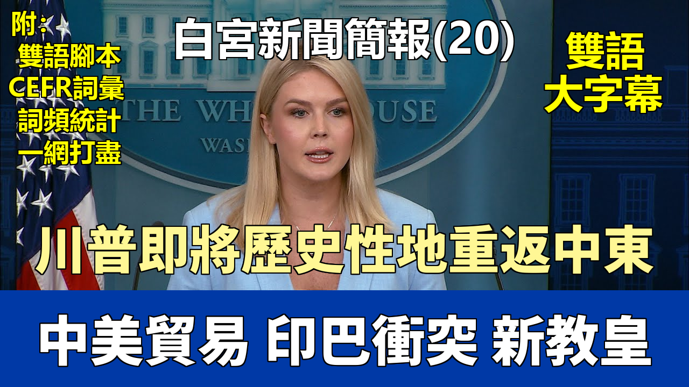

{% video youtube:z0hc8gTLZvU width:100% autoplay:0 %}


### 【中英文双语脚本】

Good afternoon, everybody. Good afternoon. Good to see all of you. Happy Friday.
各位下午好。下午好。很高興見到大家。週五愉快。
The President looks forward to embarking on his historic return to the Middle East, visiting Saudi Arabia, Qatar, and the United Arab Emirates next week,
總統期待着下週開啓他歷史性的中東之行，訪問沙特阿拉伯、卡塔爾和阿拉伯聯合酋長國，
where he will focus on strengthening ties between our nations.
他此行的重點將是加強我們各國之間的聯繫。
Eight years ago, President Trump's first trip was to this same region of the world,
八年前，特朗普總統的首次出訪就是前往世界上這同一地區，
where he introduced his bold peace-through-strength foreign policy strategy.
在那裏他提出了他大膽的“以實力求和平”的外交政策戰略。
On that trip, the President laid out his goal of eradicating terrorism and extremism in the region,
在那次訪問中，總統闡述了他在該地區根除恐怖主義和極端主義的目標，
which he successfully accomplished over the course of his administration
他在其執政期間成功地實現了這一目標，
with the total defeat of ISIS and the historic signing of the Abraham Accords.
徹底擊敗了ISIS並歷史性地簽署了《亞伯拉罕協議》。
Now, eight years later, President Trump will return to re-emphasize his continued vision for a proud, prosperous, and successful Middle East,
現在，八年後，特朗普總統將重返中東，再次強調他對於一個自豪、繁榮和成功的中東的持續願景，
where the United States and Middle Eastern nations are in cooperative relationships
在這個願景中，美國與中東國家建立合作關係，
and where extremism is defeated in place of commerce and cultural exchanges.
極端主義被商業和文化交流所取代並被擊敗。
This trip ultimately highlights how we stand on the brink of the golden age for both America and the Middle East,
這次訪問最終凸顯了我們正站在美國和中東黃金時代的邊緣，
united by a shared vision of stability, opportunity, and mutual respect.
因對穩定、機遇和相互尊重的共同願景而團結在一起。
The President greatly looks forward to visiting with our brave men and women in uniform at our U.S. Air Base in Qatar throughout this trip.
總統非常期待在這次訪問期間，前往我們位於卡塔爾的美國空軍基地看望我們英勇的男女軍人。
Yesterday, President Trump demonstrated the art of the deal and secured a historic trade agreement,
昨天，特朗普總統展示了他的交易藝術，達成了一項歷史性的貿易協定，
despite all of the naysayers who said no deals were coming. That, of course, turned out to be untrue.
儘管所有的反對者都說不會有任何協議達成。當然，這被證明是錯誤的。
On the 80th anniversary of Victory Day for World War II, President Trump announced a great deal
在第二次世界大戰勝利日80週年之際，特朗普總統宣佈了一項重大協議，
that provides American companies unprecedented access to the U.K. markets while bolstering U.S. national security.
該協議爲美國公司提供了前所未有的進入英國市場的機會，同時加強了美國的國家安全。
This trade deal will massively expand U.S. market access in the United Kingdom,
這項貿易協議將大規模擴大美國在英國的市場準入，
creating a $5 billion opportunity for new exports for U.S. farmers, ranchers, and producers.
爲美國農民、牧場主和生產商創造了50億美元的新出口機會。
This includes more than $700 billion in ethanol exports and $250 million in other agricultural products like good old American beef.
其中包括超過7000億美元的乙醇出口和2.5億美元的其他農產品出口，例如優質的美國牛肉。
The deal commits the United States and United Kingdom to work together
該協議承諾美國和英國共同努力，
to enhance industrial and agricultural market access and strengthens American competitiveness.
以加強工業和農業市場準入，並增強美國的競爭力。
Importantly, the deal also ensures streamlined customs procedures for U.S. exports.
重要的是，該協議還確保了美國出口的簡化海關程序。
The U.K. will also be purchasing $10 billion of American-made Boeing planes as part of the deal.
作爲協議的一部分，英國還將購買價值100億美元的美國製造的波音飛機。
A trade agreement like this between the United States and the United Kingdom was being worked on for many years but continued to prove elusive.
美國和英國之間的此類貿易協定已經醞釀多年，但一直難以達成。
But because of President Trump's bold negotiating approach, he got it done.
但由於特朗普總統大膽的談判方式，他成功了。
All of this happened because of President Trump's implementation of powerful tariffs
所有這一切的發生，都是因爲特朗普總統實施了強有力的關稅政策，
to end the era of economic surrender and rebalance America's trading agreements.
結束了經濟投降的時代，並重新平衡了美國的貿易協定。
American workers and companies are the best in the world,
美國工人和公司是世界上最優秀的，
and they finally have a President who has their backs, fights for them, and delivers good deals that puts them first.
他們終於有了一位支持他們、爲他們而戰、併爲他們帶來優先考慮他們利益的良好協議的總統。
This is just the first of many trade deals to come. Get ready for more historic deals in our country to boom like never before.
這僅僅是未來衆多貿易協議中的第一個。準備好迎接更多歷史性的協議，讓我們的國家以前所未有的方式蓬勃發展。
On that note, Treasury Secretary Scott Bessent and Ambassador Jameson Greer will meet
關於這一點，財政部長斯科特·貝森特和詹姆森·格里爾大使將會晤
with the lead representatives on economic matters from the People's Republic of China over the weekend in Switzerland.
中華人民共和國經濟事務的主要代表，會談將於本週末在瑞士舉行。
As President Trump has said, the United States and China have been talking for some time over the course of the administration,
正如特朗普總統所說，在本屆政府執政期間，美國和中國已經進行了一段時間的對話，
and now teams from both countries will meet in person to continue discussions.
現在兩國團隊將親自會面以繼續討論。
You can be certain that President Trump and his trade team will ensure we work to achieve the best deal possible for America.
你可以肯定，特朗普總統和他的貿易團隊將確保我們努力爲美國爭取到儘可能最好的協議。
In other news, the Trump administration just announced a new incentive for illegal aliens living in the United States to self-deport.
另外，特朗普政府剛剛宣佈了一項新措施，鼓勵居住在美國的非法移民自行離境。
Eligible illegal aliens who now use the CBP Home app to self-deport will receive a clear, safe way to leave the United States.
現在使用CBP Home應用程序自行離境的符合條件的非法移民，將獲得一個清晰、安全的離開美國的方式。
Their plane tickets home may be paid for, and they will receive a $1,000 stipend once we have confirmation that they have left our country.
他們的返程機票可能會得到支付，一旦我們確認他們已經離開我國，他們將獲得1000美元的津貼。
This new feature will allow illegal aliens to have a planned departure out of the country and to leave as soon as possible in a dignified way.
這項新功能將允許非法移民有計劃地離開美國，並儘快以有尊嚴的方式離開。
If illegal aliens make the right decision here and submit their intent to depart through the CBP Home app and pass extensive vetting,
如果非法移民在此做出正確決定，通過CBP Home應用程序提交離境意向並通過廣泛審查，
they will be temporarily deprioritized for ICE detention and enforcement action before their scheduled departure.
在他們預定離境日期之前，他們將暫時被降低ICE拘留和執法行動的優先等級。
And leaving voluntarily in this matter may improve their legal immigration options in the future.
並且，以此方式自願離開可能會改善他們未來的合法移民選擇。
This initiative will also save massive amounts of money for American taxpayers.
這項舉措還將爲美國納稅人節省大量資金。
Voluntary departures are much more cost-effective than traditional removals.
自願離境比傳統的驅逐出境更具成本效益。
By deploying the CBP Home app in this new way, President Trump is aiming to reduce the need for costly arrest, detentions, and court proceedings.
通過以這種新方式部署CBP Home應用程序，特朗普總統旨在減少代價高昂的逮捕、拘留和法庭訴訟的需要。
Currently, the average cost of traditional removal is more than $17,000 per illegal alien.
目前，傳統驅逐每名非法移民的平均成本超過17,000美元。
Our projections estimate that the use of the CBP Home app will massively reduce that financial burden by approximately 70 percent
我們的預測估計，使用CBP Home應用程序將大幅減少約70%的財政負擔，
so taxpayer dollars can be redirected and our brave immigration law enforcement officers can focus
這樣納稅人的錢就可以被重新分配，我們勇敢的移民執法官員也可以集中精力
on removing the most violent illegal aliens hiding in our communities.
清除藏匿在我們社區中最暴力的非法移民。
Finally, it was announced this morning that First Lady Melania Trump secured a $25 million investment in President Trump's budget
最後，今天上午宣佈，第一夫人梅拉尼婭·特朗普在特朗普總統的預算中獲得了2500萬美元的投資，
to provide housing and support for youth transitioning out of foster care.
用於爲從寄養家庭過渡出來的年輕人提供住房和支持。
And in recognition of the seventh anniversary of Mrs. Trump's Be Best initiative,
並且，爲紀念特朗普夫人的“力求最佳”倡議七週年，
the U.S. Department of Housing and Urban Development allocated funds toward the agency Foster Youth to Independence Program.
美國住房和城市發展部向該機構的“寄養青年獨立計劃”撥款。
Yesterday, Mrs. Trump hosted a special celebration of military mothers with the President,
昨天，特朗普夫人與總統共同爲軍人母親們舉辦了一場特別的慶祝活動，
bringing together 150 military moms from around the country to recognize their service not just in their home but for our country.
邀請了來自全國各地的150位軍人母親，以表彰她們不僅爲家庭也爲國家所做的服務。
For those of you who were there at the events yesterday, as I was, I have no doubt you will join me in recognizing how truly special those moments were.
對於那些像我一樣昨天在活動現場的人來說，我毫不懷疑你們會和我一同認識到那些時刻是多麼的特別。
So let's get to questions. Here in our new media seat today is Andrew Egger, the White House correspondent for The Bulwark.
那麼，讓我們開始提問吧。今天在我們新媒體席位的是安德魯·埃格，《堡壘》雜誌的白宮記者。
The Bulwark is a new media company launched in 2019 with hundreds of thousands of readers on Substack and more than a million subscribers on YouTube.
《堡壘》是一家2019年成立的新媒體公司，在Substack上擁有數十萬讀者，在YouTube上擁有一百多萬訂閱者。
Andrew, please kick us off. Thanks for being here.
安德魯，請你開始吧。謝謝你來到這裏。
Thank you for having me, Caroline.
謝謝你邀請我，卡羅琳。
The President posted another ad this week for his Trump meme coin.
總統本週又爲他的特朗普Meme幣發佈了一則廣告。
The group that's running that coin is encouraging people to buy in order to win a dinner this month with the President.
運營該Meme幣的團體正在鼓勵人們購買，以便贏得本月與總統共進晚餐的機會。
Why is the President planning to attend a dinner for the top investors in his coin?
總統爲何計劃出席爲其Meme幣頂級投資者舉辦的晚宴？
Look, the President is abiding by all conflict of interest laws.
聽着，總統遵守所有利益衝突法。
The President has been incredibly transparent with his own personal financial obligations throughout the years.
多年來，總統在個人財務義務方面一直非常透明。
The President is a successful businessman and I think, frankly, it's one of the many reasons that people re-elected him back to this office.
總統是一位成功的商人，坦率地說，我認爲這是人們再次選舉他擔任此職位的原因之一。
There are at least some people who are buying this coin who seem to view it as an opportunity to influence the President's views.
至少有一些購買這種Meme幣的人，似乎將其視爲影響總統觀點的一個機會。
There was a logistics company this week that said they would buy $20 million in the coin in order to advocate for free trade between the U.S. and Mexico.
本週有一家物流公司表示，他們將購買價值2000萬美元的該Meme幣，以倡導美國和墨西哥之間的自由貿易。
If buyers are buying for that reason, are they wasting their money?
如果買家是出於這個原因購買，他們是在浪費錢嗎？
Look, I can assure you the President acts with only the interests of the American public in mind,
聽着，我可以向你保證，總統的行爲完全以美國公衆的利益爲出發點，
putting our country first and doing what's best for our country full stop.
把我們的國家放在首位，做對我們國家最有利的事情，僅此而已。
That's his intention and that's what he's focused on.
這是他的意圖，也是他關注的重點。
Christine, good to see you here today. Welcome back.
克里斯汀，很高興今天見到你。歡迎回來。
Thank you. Glad to be back.
謝謝。很高興回來。
So on those China talks, what does President Trump expect to come out of those talks?
那麼關於那些與中國的會談，特朗普總統期望從中得到什麼結果？
And is he going to be disappointed if his team can't secure a deal?
如果他的團隊不能達成協議，他會失望嗎？
Well, look, the President is very confident in his Secretary of Treasury, Scott Bessent, and of course, Ambassador Jameson Greer,
嗯，聽着，總統對他的財政部長斯科特·貝森特，當然還有詹姆森·格里爾大使非常有信心，
who has played an instrumental role in all of these trade negotiations as well.
後者在所有這些貿易談判中也發揮了重要作用。
I think yesterday's success, the announcement of a trade deal with the United Kingdom, is a great first step.
我認爲昨天的成功，即宣佈與英國達成貿易協議，是一個很好的第一步。
Again, many said in this room it couldn't be done. Now we are moving forward with many other countries.
再次強調，這個會議室裏的許多人曾說這是不可能完成的。現在我們正在與許多其他國家向前邁進。
We're talking to dozens of our trading partners around the world. But of course, China is a major country, a major player in this space.
我們正在與世界各地數十個貿易伙伴進行談判。但當然，中國是一個主要國家，是這個領域的主要參與者。
And the President has said, and he's right, that China needs the United States of America. They need our markets. They need our consumer base.
總統說過，而且他是對的，中國需要美利堅合衆國。他們需要我們的市場。他們需要我們的消費羣體。
And Secretary Bessent knows that he's going to Switzerland this weekend with the full support and confidence and trust of the President here at home.
貝森特部長知道，他本週末前往瑞士時，擁有國內總統的全力支持、信心和信任。
Jack. Thanks very much, Caroline. Two questions.
傑克。非常感謝，卡羅琳。兩個問題。
First, can you give us an update on U.S. efforts to mediate or have an impact on the conflict between India and Pakistan?
首先，你能否介紹一下美國在調解或影響印度與巴基斯坦衝突方面的最新努力？
Sure, I absolutely can.
當然，我完全可以。
This is something that the Secretary of State and, of course, now our national security advisor as well, Marco Rubio, has been very much involved in.
國務卿，當然還有我們現在的國家安全顧問馬可·盧比奧，都深度參與了此事。
The President has expressed he wants to see this deescalate as quickly as possible.
總統已表示，他希望看到局勢儘快降溫。
He understands these are two countries that have been at odds with one another for decades, long before President Trump was here in the Oval Office.
他明白這兩個國家幾十年來一直不和，遠在特朗普總統入主橢圓形辦公室之前就是如此。
However, he has good relationships with the leaders of both countries.
然而，他與兩國領導人都保持着良好關係。
And the Secretary of State, Marco Rubio, I spoke to him just yesterday,
國務卿馬可·盧比奧，我昨天剛和他談過，
he has been in constant communication with the leaders of both countries trying to bring this conflict to an end.
他一直與兩國領導人保持密切溝通，試圖結束這場衝突。
Just one other question. Yesterday we saw the news of the new Pope.
還有一個問題。昨天我們看到了關於新教皇的消息。
Before Pope Leo became Pope Leo, there were some critical comments that he made
在利奧教皇成爲利奧教皇之前，他曾發表過一些批評性言論，
about President Trump and about Vice President Vance on his X account (then Twitter).
內容涉及特朗普總統和彭斯副總統，發表在他的X賬戶（當時的推特）上。
Does the White House have any reaction to those comments?
白宮對這些評論有何迴應？
The President made his reaction to Pope Leo's announcement yesterday very clear. He is very proud to have an American Pope.
總統昨天對利奧教皇的宣佈做出了非常明確的反應。他爲有一位美國教皇感到非常自豪。
I think it was a surprise to everyone. I saw the news media was surprised to report on that yesterday,
我想這對所有人來說都是一個驚喜。我看到新聞媒體昨天報道此事時也很驚訝，
but it's a great thing for the United States of America and for the world, and we are praying for him.
但這對於美利堅合衆國和全世界來說都是一件好事，我們爲他祈禱。
Great. Thanks, Caroline.
太好了。謝謝，卡羅琳。
The President has been pretty firm on keeping these 145 percent tariffs in place on Chinese imports.
總統在維持對中國進口商品徵收145%關稅方面一直相當堅定。
Today, via Truth Social, he said that he'd be possibly open to lowering those to 80 percent.
今天，他通過Truth Social表示，他可能願意將關稅降至80%。
Why the change, and how did the President land on 80?
爲何會有這樣的改變？總統是如何決定80這個數字的？
The President still remains with his position that he is not going to unilaterally bring down tariffs on China.
總統仍然堅持他的立場，即他不會單方面降低對中國的關稅。
We need to see concessions from them as well.
我們也需要看到他們的讓步。
And again, that's part of the reason that Secretary Bessent is going to talk to his Chinese counterparts this weekend
此外，這也是財政部長貝森特本週末將與中方同行會談的原因之一，
to start those discussions in person.
以便親自啓動這些討論。
As for the 80 percent number, that was a number the President threw out there, and we'll see what happens this weekend.
至於80%這個數字，那是總統提出的一個數字，我們將看看本週末會發生什麼。
And always in the effort of transparency, I'm sure you'll hear directly from the Treasury Secretary or the President after those negotiations conclude.
並且，爲了保持透明度，我相信在這些談判結束後，你們會直接從財政部長或總統那裏聽到消息。
Jackie. Thank you, Caroline.
傑基。謝謝你，卡羅琳。
Why did the White House announce this deal with the UK before all of the details were finished?
爲什麼白宮在所有細節敲定之前就宣佈了與英國的這項協議？
That's not true, actually. I saw the fact sheet.
那其實不是真的。我看到了簡報。
I saw the deal as well before the President brought all of you in the Oval Office in the effort of transparency.
在總統爲了透明起見把你們都請進橢圓形辦公室之前，我也看到了那份協議。
You had the President and the Prime Minister on the phone talking to all of you directly about how this was a great deal, a phenomenal deal.
總統和首相通過電話直接告訴你們所有人，這是一項偉大的、非凡的協議。
And discussions will continue, but as I spoke to our Ambassador Greer yesterday, this is how trade deals work.
討論將會繼續，但正如我昨天與我們的格里爾大使交談時所說，貿易協議就是這樣運作的。
You set an initial agreement, you set the framework, you set up the deal, and then, of course, you know, T's have to be crossed and I's have to be dotted.
你先達成初步協議，設定框架，確立交易，然後，當然，你知道，細節還需要敲定。
But this deal is a good deal, and the numbers are determined, and all of the market access that I just discussed will remain.
但這項協議是一項好協議，數字已經確定，我剛纔討論的所有市場準入都將保留。
Does that mean that the 10 percent baseline is going to still be there at the end when all of the other details are ironed out?
這是否意味着，當所有其他細節都敲定後，10%的基準線最終仍會存在？
The President is committed to the 10 percent baseline tariff, not just for the United Kingdom, but for his trade negotiations with all other countries as well.
總統致力於推行10%的基準關稅，不僅針對英國，也針對他與其他所有國家的貿易談判。
The Press: Permanently, even after the deals are done? Like, that is going to remain?
記者：永久性的嗎，即使在協議達成之後？比如，那會保留下來嗎？
Ms. McEnany: The President is determined to continue with that 10 percent baseline tariff. I just spoke to him about it earlier.
麥克納尼女士：總統決心繼續實行10%的基準關稅。我早些時候剛和他談過這件事。
Stephen.
斯蒂芬。
The Press: Thank you, Caroline. I'd like to ask about New York and about personnel matter.
記者：謝謝你，卡羅琳。我想問一下關於紐約以及人事方面的問題。
On New York, the Mayor, Eric Adams, is here today. Can you tell us anything more about the visit?
關於紐約，市長埃裏克·亞當斯今天在這裏。你能告訴我們更多關於這次訪問的情況嗎？
Who initiated it? What they're talking about?
是誰發起的？他們在談論什麼？
And also, is there any comment from the White House on the air traffic control issues in New York?
另外，白宮對紐約的空中交通管制問題有何評論？
Ms. McEnany: All I will say on Mayor Eric Adams is that he requested a meeting with the President, and the President was willing to take it.
麥克納尼女士：關於埃裏克·亞當斯市長，我能說的就是他請求與總統會面，總統也願意接受。
If the President wishes to discuss his private meeting afterwards, I will let him do that himself.
如果總統希望稍後討論他的私人會議，我會讓他自己來做。
Yes, I'm glad you asked about the FAA. There was a glitch in the system this morning, especially at New York Airport, as you all know.
是的，我很高興你問到聯邦航空局。今天早上系統出了點小故障，尤其是在紐約機場，你們都知道。
I spoke to the Department of Transportation. That glitch was caused by the same telecoms and software issues that were raised last week.
我與交通部談過了。那個故障是由上週提出的同樣的電信和軟件問題引起的。
Everyone, everything went back online after the brief outage, and there was no operational impact.
在短暫的故障之後，所有設備都恢復了在線狀態，沒有造成運營影響。
The DOT and the FAA are working to address this technical issue tonight to prevent further outages,
交通部和聯邦航空局正在今晚處理這個技術問題，以防止進一步的故障，
as well as install new fiber from New York Airport to Philadelphia.
並計劃從紐約機場到費城鋪設新的光纖。
And the goal is to have the totality of this work done by the end of the summer.
目標是在夏季結束前完成所有這些工作。
I want to add that this outage at New York Airport speaks to why the Secretary of Transportation yesterday made a massive announcement
我想補充的是，紐約機場的這次故障說明了爲什麼交通部長昨天做出了一項重大宣佈，
in investing in our aviation safety and our telecom system.
即投資於我們的航空安全和電信系統。
There is a four-part infrastructure plan that was released by the Secretary of Transportation yesterday
交通部長昨天發佈了一項包含四個部分的基礎設施計劃，
to improve communication, surveillance, automation, and their facilities.
旨在改善通訊、監控、自動化及其設施。
They want to replace the antiquated telecom systems with new fiber, wireless, and satellite technologies,
他們希望用新的光纖、無線和衛星技術取代陳舊的電信系統，
replace more than 600 radars, which have gone way past their life cycle, and address runway safety.
更換超過600個早已超過使用壽命的雷達，並解決跑道安全問題。
They want to build six new air traffic control centers for the first time since the 1960s, and replace towers, as well.
他們希望自1960年代以來首次建造六個新的空中交通管制中心，並更換塔臺。
They want to implement, excuse me, new modern hardware and software for all traffic facilities to create a common platform system throughout the towers.
他們希望爲所有交通設施配備，請原諒，新的現代化硬件和軟件，以便在所有塔臺創建一個通用平臺系統。
These are much-needed changes. This is a very bold plan by the Department of Transportation.
這些都是非常需要的改變。這是交通部一個非常大膽的計劃。
I think it's unfortunate that the previous administration sat on their hands and did nothing,
我認爲不幸的是，前任政府袖手旁觀，無所作爲，
but how grateful we are that we have a Department of Transportation and a Secretary and a President who's willing to take bold action and change.
但我們多麼慶幸我們擁有一個願意採取大膽行動並進行變革的交通部、一位部長和一位總統。
Go ahead.
請講。
The Press: Thanks, Caroline. Just going back to India, Pakistan,
記者：謝謝，卡羅琳。回到印度和巴基斯坦的問題，
can we expect President Trump to get in touch personally with the leaders of those countries to try and de-escalate this situation?
我們是否可以期待特朗普總統親自與這些國家的領導人聯繫，試圖緩和這一局勢？
Ms. McEnany: If and when that happens, we will certainly let you know. Natalie.
麥克納尼女士：如果發生這種情況，我們一定會通知你。娜塔莉。
The Press: Thanks, Caroline. I have a question about the Middle East trip.
記者：謝謝，卡羅琳。我有一個關於中東之行的問題。
Will any of the President's family members, including Don Jr., Eric, or Jared Kushner, be joining him on the trip?
總統的任何家庭成員，包括小唐、埃裏克或賈裏德·庫什納，會陪同他參加這次訪問嗎？
Ms. McEnany: I am not tracking any of the President's family members joining us at this time,
麥克納尼女士：目前我沒有追蹤到任何總統家庭成員加入我們的行程，
but, of course, the first family is welcome to come.
但是，當然，第一家庭是受歡迎的。
I hope they would. They're great people, great to be around, but I'm not tracking them on the manifesto.
我希望他們會來。他們都是很棒的人，和他們在一起很愉快，但我沒有在名單上追蹤到他們。
The Press: Given that you noted he is a successful businessman,
記者：鑑於您提到他是一位成功的商人，
do you know if the President has any plans to meet with any of the folks involved with any of the family businesses over there
您是否知道總統是否有計劃會見任何參與其家族在那邊業務的人員，
or see any of the sites that are going to be neutral?
或者參觀任何將保持中立的地點？
Ms. McEnany: Not to my knowledge, and let me just get to the premise of your question that both of you have raised.
麥克納尼女士：據我所知沒有，讓我先談談你們兩位提出的問題的前提。
I think it's frankly ridiculous that anyone in this room would even suggest that President Trump is doing anything for his own benefit.
我認爲，這個房間裏任何人暗示特朗普總統爲自身利益做任何事情，坦率地說是荒謬的。
He left a life of luxury and a life of running a very successful real estate empire for public service not just once, but twice.
他放棄了奢華的生活和經營一個非常成功的房地產帝國的生活，不止一次，而是兩次投身公共服務。
And, again, the American public re-elected him back to this White House
而且，美國公衆再次選舉他回到白宮，
because they trust he acts in the best interests of our country in putting the American public first.
因爲他們相信他的行爲符合我們國家的最大利益，將美國公衆放在首位。
This is a President who has actually lost money for being President of the United States.
這位總統實際上因爲擔任美國總統而虧了錢。
I don't remember these same type of questions being asked of my predecessor about a career politician who was clearly profiting off of this office.
我不記得我的前任曾被問及這類關於一位明顯從這個職位中獲利的職業政客的問題。
That is not what President Trump does, and this White House holds ourselves to the highest of ethical standards.
特朗普總統不會那樣做，本屆白宮以最高的道德標準要求自己。
Phil.
菲爾。
The Press: Thank you. There's this Reuters report that the U.S. is in talks with Israel about an American-led post-war administration in Gaza.
記者：謝謝。路透社有報道稱，美國正在與以色列就美國領導的加沙戰後管理問題進行談判。
Is that accurate? Are these talks ongoing?
這準確嗎？這些談判正在進行嗎？
Ms. McEnany: We are in constant communication and dialogue with our counterparts and our allies and friends in Israel.
麥克納尼女士：我們與以色列的同行、盟友和朋友保持着持續的溝通和對話。
Ron Dermer was here at the White House yesterday meeting with members of President Trump's team.
羅恩·德默昨天在白宮與特朗普總統團隊的成員會面。
As for the situation in Gaza, the President and his entire national security team have made it very clear we want to see the hostages released from Gaza.
至於加沙局勢，總統及其整個國家安全團隊已明確表示，我們希望看到人質從加沙獲釋。
That is a priority for this administration.
這是本屆政府的優先事項。
As for what that looks like and even moving beyond that,
至於那會是什麼樣子，甚至更進一步，
I'm not going to get into the details of plans that, frankly, may or may not have even been proposed.
我不會深入討論那些坦率地說，可能甚至還沒有被提出來的計劃細節。
But I can emphasize what the President holds closest in his heart right now, and that's the release of all of the hostages in Gaza.
但我可以強調總統目前心中最牽掛的是什麼，那就是釋放加沙的所有人質。
The Press: And then there's been some conservative pushback to some of these SALT tax, the SALT tax cap.
記者：然後，對於州和地方稅收抵免上限（SALT tax cap）的一些內容，出現了一些保守派的反對意見。
For instance, Majority Leader Steve Scalise said that bringing back the state and local tax deduction would essentially mean
例如，多數黨領袖史蒂夫·斯卡利斯表示，恢復州和地方稅收抵免實際上意味着
"'45 states are subsidizing five states that have very high taxes imposed by leftist governors.'"
“‘45個州在補貼5個由左翼州長征收高額稅收的州。’”
Is he wrong? Is it fair to ask Red, Indiana to bail out Blue, New York?
他錯了嗎？要求紅色的印第安納州去救助藍色的紐約州公平嗎？
Ms. McEnany: Well, look, this is an ongoing discussion on the Hill.
麥克納尼女士：嗯，聽着，這是國會山正在進行的討論。
There's a lot of disagreement on Capitol Hill right now about the SALT tax proposal, and we will let them work it out.
目前國會山對州和地方稅收抵免提案存在很多分歧，我們會讓他們自行解決。
As for the tax provisions and the reconciliation bill, the priorities of this President, he has made them incredibly clear.
至於稅收條款和和解法案，本屆總統的優先事項，他已經闡述得非常清楚了。
No tax on tips for our hardworking service workers.
不向我們辛勤工作的服務人員的小費徵稅。
No tax on Social Security for our well-deserving seniors who have worked their whole lives to pay into this system.
不向我們理應受惠的、一生爲這個體系繳費的老年人的社會保障金徵稅。
No tax on overtime for hardworking Americans as well.
也不向辛勤工作的美國人的加班費徵稅。
And there's a plethora of other priorities the President wants to see in this bill.
總統還希望在這項法案中看到許多其他優先事項。
Anyone who opposes this bill will be opposing the largest tax cut in American history.
任何反對這項法案的人都將是在反對美國曆史上最大規模的減稅。
They will be voting to raise taxes by the tune of $4 trillion on the middle class of this country.
他們將投票贊成向這個國家的中產階級增稅高達4萬億美元。
And we look forward to holding him accountable for that.
我們期待着追究他的責任。
Everyone on Capitol Hill on both sides of the aisle should be supportive of the President's tax priorities.
國會山兩黨所有人都應該支持總統的稅收優先事項。
The Press: Can I follow up on that?
記者：我可以跟進一下嗎？
Ms. McEnany: Go ahead. Sure, go ahead, and then I'll let you follow up.
麥克納尼女士：請講。當然，請講，然後我再讓你跟進。
The Press: Thanks, Caroline. So I want to follow up on a Truth Social post.
記者：謝謝，卡羅琳。所以我想跟進一個Truth Social上的帖子。
So the President is saying 80 percent tariffs could come down.
那麼總統是說80%的關稅可能會下調。
Just an announcement would be enough to lower those tariffs? Is that what he's looking for from the Chinese concessions?
僅僅一個聲明就足以降低那些關稅嗎？這就是他期望從中國讓步中得到的嗎？
Ms. McEnany: That's not what the President said.
麥克納尼女士：總統不是那麼說的。
He said that an 80 percent number may sound good to him, but again, he's in constant contact with our Secretary of Treasury,
他說80%這個數字對他來說可能聽起來不錯，但再次強調，他與我們的財政部長保持着持續聯繫，
who will be leading his negotiations this weekend.
後者將負責本週末的談判。
The Press: And historically, the Chinese have made the meeting itself a win.
記者：從歷史上看，中國人已經把會議本身變成了一場勝利。
What does a win look like out of these meetings for the President this weekend?
對總統來說，本週末這些會議的勝利是什麼樣的？
Ms. McEnany: A good deal for the American worker and the American people.
麥克納尼女士：對美國工人和美國人民有利的協議。
Go ahead.
請講。
The Press: Thanks, Caroline. Get back to the reconciliation bill.
記者：謝謝，卡羅琳。回到和解法案上來。
Can you just clarify the President's position a little bit specifically on the tax issue?
你能否稍微具體地澄清一下總統在稅收問題上的立場？
Because in his Truth Social post, he said this morning that he would accept even a tiny tax increase for the rich,
因爲在他的Truth Social帖子裏，他今天早上說他願意接受對富人哪怕是微小的增稅，
but then says Republicans probably shouldn't do it, but I'm okay if they do it.
但接着又說共和黨人可能不應該這樣做，但如果他們做了我也沒關係。
So what is it that he wants? Does he want them to increase the tax rates?
那麼他到底想要什麼？他希望他們提高稅率嗎？
Ms. McEnany: The President wants tax cuts, the largest tax cuts in history. He wants to extend his historic tax cuts from 2017,
麥克納尼女士：總統想要減稅，歷史上最大規模的減稅。他希望延長他2017年的歷史性減稅政策，
and he wants to see all of the other tax priorities that I just laid out for you included in this bill as well.
並且他希望看到我剛纔向你們闡述的所有其他稅收優先事項也包含在這項法案中。
As for the policy proposal you're talking about, the President has said he himself personally would not mind paying a little bit more
至於你提到的政策提議，總統曾表示他個人不介意多付一點錢，
to help the poor and the middle class and the working class in this country.
以幫助這個國家的窮人、中產階級和工薪階層。
I think, frankly, that's a very honorable position.
坦率地說，我認爲這是一個非常值得尊敬的立場。
But again, these negotiations are ongoing on Capitol Hill, and the President will weigh in when he feels necessary.
但再次強調，這些談判正在國會山進行，總統會在他認爲必要的時候介入。
The Press: Who has encouraged them to have a higher bracket for top earners?
記者：是誰鼓勵他們爲高收入者設立更高的稅級？
Ms. McEnany: The President has made his personal position on this matter clear. Michael.
麥克納尼女士：總統已明確表達了他個人在這個問題上的立場。邁克爾。
The Press: Is he speaking with chairs and ministers? Mr. Speaker, is the President,
記者：他是在和主席們和部長們談話嗎？議長先生，總統是，
Ms. McEnany: The President is in constant communication with leaders on the Hill. Go ahead.
麥克納尼女士：總統與國會山的領導人保持着持續溝通。請講。
The Press: Ahead of the President's trip to the Middle East, he's mentioned he wants to rename the Persian Gulf the Gulf of Arabia.
記者：在總統中東之行前，他提到想將波斯灣改名爲阿拉伯灣。
Iran is now saying that doing so will bring the wrath of all Iranians.
伊朗現在表示，這樣做將激起所有伊朗人的憤怒。
Can you talk about the support that the Gulf of Arabia has in the region and why this is important to the President?
你能談談阿拉伯灣在該地區獲得的支持以及爲何這對總統很重要嗎？
Ms. McEnany: Well, first of all, the President has said he hasn't made a determination yet.
麥克納尼女士：嗯，首先，總統說過他還沒有做出決定。
That was in the news that you guys all asked him about it, and he said he wasn't quite sure.
那是新聞裏你們都問過他的事情，他說他不太確定。
So he hasn't made a definitive decision on that yet.
所以他對此還沒有做出明確的決定。
The Press: And then, secondly, Caroline, the President has shown support for South African refugees that are coming to the United States next week.
記者：其次，卡羅琳，總統已表示支持下週將來到美國的南非難民。
Can you talk about what these refugees are fleeing and why this is a priority for the administration?
你能談談這些難民在逃離什麼，以及爲什麼這是本屆政府的優先事項嗎？
Ms. McEnany: Well, the President has actually signed an executive order on that matter. My office can get back to you on that, Michael.
麥克納尼女士：嗯，總統實際上已經就此事簽署了一項行政命令。我的辦公室可以就此回覆你，邁克爾。
But this group in South Africa has faced racial persecution. In fact, the government there has vowed to take away their farmland that they own.
但是這個南非的團體遭受了種族迫害。事實上，那裏的政府已經發誓要奪走他們擁有的農田。
And so the President has talked significantly about this.
因此總統已經就此進行了重要談話。
As for further details on refugee claims and asylum claims, I would defer you to the State Department.
至於有關難民申請和庇護申請的進一步細節，我會請你諮詢國務院。
The Press: Can I follow up on that?
記者：我可以跟進一下嗎？
Ms. McEnany: Go ahead. No, in front of you.
麥克納尼女士：請講。不，在你前面那位。
The Press: Thanks, Caroline.
記者：謝謝，卡羅琳。
Does the administration have any response to the news today that a federal judge has ordered the immediate release of Remeisa Ozturk from detention,
政府對今天一名聯邦法官下令立即釋放雷梅薩·厄茲蒂爾克的消息有何迴應，
and particularly his comments that the government submitted no evidence other than an op-ed that Ozturk wrote last year?
特別是法官評論說政府除了厄茲蒂爾克去年寫的一篇評論文章外沒有提交任何證據？
Ms. McEnany: I will have to check in with the Department of Homeland Security on that particular case.
麥克納尼女士：關於那個具體案件，我需要向國土安全部覈實一下。
But I think our overall feeling we've made quite clear that lower-level judges should not be dictating the foreign policy of the United States,
但我認爲我們已經非常清楚地表明瞭我們的總體感受，即下級法官不應該主導美國的外交政策，
and we absolutely believe that the President and the Department of Homeland Security are well within their legal rights to deport illegal immigrants.
我們絕對相信總統和國土安全部完全有合法權利驅逐非法移民。
As for visa revocations, the Secretary of State has the right to do that as well.
至於吊銷簽證，國務卿也有權這樣做。
It is a privilege, not a right, to come to this country on a visa.
持簽證來到這個國家是一種特權，而不是權利。
But I'll check in on the specific case. My office will get you details. Sure.
但我會覈實一下具體案件。我的辦公室會向你提供細節。當然。
The Press: Caroline, yesterday the administration appears to have started dismantling the Consumer Product Safety Commission.
記者：卡羅琳，昨天政府似乎已經開始着手解散消費品安全委員會。
This is the federal agency, an independent one that does recalls and is responsible for product safety.
這是一個聯邦機構，一個獨立的機構，負責產品召回和產品安全。
Does the administration not believe that it's important to keep toys and cribs, I mean, you're a young mom, off of the market?
政府難道不認爲將玩具和嬰兒牀——我的意思是，你是一位年輕的母親——下架很重要嗎？
Ms. McEnany: It's a federal agency within which branch? It's the executive branch.
麥克納尼女士：它是哪個分支機構的聯邦機構？是行政部門。
Who's the head of the executive branch? The President of the United States.
誰是行政部門的負責人？美國總統。
The Press: Created by Congress.
記者：由國會設立。
Ms. McEnany: The President has the right to fire people within the executive branch. It's a pretty simple answer. Francesca.
麥克納尼女士：總統有權解僱行政部門的人員。這是一個非常簡單的答案。弗朗西斯卡。
The Press: Thanks. One foreign policy, one domestic policy, I think, if I could.
記者：謝謝。如果可以的話，我想問一個外交政策問題，一個國內政策問題。
As far as the President's trip goes next week, is he planning to meet with the FIFA President in either Saudi Arabia or Qatar?
關於總統下週的行程，他是否計劃在沙特阿拉伯或卡塔爾會見國際足聯主席？
If so, could you give us some more details about that?
如果是這樣，您能提供更多相關細節嗎？
Ms. McEnany: The President has quite a few meetings with many people.
麥克納尼女士：總統與許多人有很多會面。
When he is there, we can certainly check the itinerary and let you know if the FIFA President will be there next week.
當他在那裏時，我們當然可以查看行程，並告知您國際足聯主席下週是否會在場。
Frankly, I'm not quite sure, but we can certainly get you an answer.
坦率地說，我不太確定，但我們當然可以給你一個答覆。
As you know, the President attended a FIFA Task Force meeting at the White House this week.
如你所知，總統本週在白宮出席了國際足聯特別工作組會議。
The Press: And on the domestic front, could you explain why the FEMA Administrator was removed from his position this week?
記者：在國內方面，您能解釋一下爲什麼聯邦緊急事務管理局局長本週被免職嗎？
Ms. McEnany: This is a personnel matter in regards to the Department of Homeland Security.
麥克納尼女士：這是國土安全部的人事問題。
But my understanding is that this individual testified saying something that was contrary to what the President believes
但我的理解是，這個人作證時說了一些與總統的信念相悖的話，
in the goals of this administration in regards to FEMA policy.
也與本屆政府在聯邦應急管理署政策方面的目標相悖。
And so, of course, we want to make sure that people in every position are advancing the administration's goals.
因此，我們當然希望確保每個職位上的人都在推進本屆政府的目標。
But as for specifics, I'd defer you to the Department of Homeland Security.
但具體情況，我建議你諮詢國土安全部。
We leave it up to our great Cabinet Secretaries when it comes to personnel matters.
在人事問題上，我們交由我們偉大的內閣部長們處理。
Sure, in the back.
當然，後排那位。
The Press: Thank you. Aid hasn't gone into Gaza in 10 weeks.
記者：謝謝。援助物資已有10周未能進入加沙。
Israel says that this is a policy to pressure Hamas in the negotiations, the ceasefire negotiations.
以色列稱這是一項在停火談判中向哈馬斯施壓的政策。
Is this a policy that this administration supports?
這是本屆政府支持的政策嗎？
Ms. McEnany: The President answered this this week.
麥克納尼女士：總統本週回答了這個問題。
He said that he wants to ensure that aid can get into Gaza, but we have to do it in a responsible way to ensure it doesn't end up in the hands of terrorists.
他說他希望確保援助能夠進入加沙，但我們必須以負責任的方式進行，以確保援助不會落入恐怖分子手中。
So this is something the administration is actively working on.
所以這是政府正在積極處理的事情。
And when we have a policy to announce on this definitively, we can certainly let you know.
當我們對此有明確的政策宣佈時，我們一定會通知你。
The Press: Can you talk about this effort for the U.S. to take over the distribution of aid in Gaza to exclude Israel?
記者：你能談談美國試圖接管加沙援助物資分配以排除以色列的努力嗎？
But also, international organizations said this effort militarizes aid.
但同時，國際組織稱這種努力使援助軍事化。
Ms. McEnany: I would reject that characterization by whatever groups you are citing. Kelly.
麥克納尼女士：我會駁斥你所引用的任何團體所做的這種定性。凱利。
The Press: Caroline, thank you. I want to get back to the First Lady Melania Trump dealing with foster children.
記者：卡羅琳，謝謝你。我想回到第一夫人梅拉尼婭·特朗普處理寄養兒童的問題上來。
That's an important component in American life to see what happens to the future of our children, particularly in foster care.
這是美國生活中的一個重要組成部分，關係到我們孩子未來的發展，尤其是在寄養系統中的孩子。
Can you explain the significance of this development between the First Lady and the housing and urban development?
您能解釋一下第一夫人與住房和城市發展部之間這一進展的重要性嗎？
Ms. McEnany: Yes, absolutely.
麥克納尼女士：是的，當然。
It's millions of dollars that will go into a program that helps these children transition out of foster care to have productive and positive lives.
這將是數百萬美元投入到一個項目中，幫助這些孩子從寄養家庭過渡出來，過上富有成效和積極的生活。
And I'd like to share a personal story, since you asked if I may, I hope the First Lady won't mind.
既然你問了，如果可以的話，我想分享一個個人故事，希望第一夫人不會介意。
I was at an event in Florida last year, and I was approached by a gentleman who was a foster dad.
我去年在佛羅里達參加一個活動時，一位寄養父親走近我。
And he had taken in, I think it was six or seven foster children. And he spoke to me.
他收養了，我想是六七個寄養兒童。他和我說話。
He had recognized me in my work for President Trump's campaign at the time.
他認出我當時曾爲特朗普總統的競選工作。
And the little boy who was with him talked about the personal relationship that he had with First Lady Melania Trump
和他在一起的小男孩談到了他與第一夫人梅拉尼婭·特朗普的私人關係，
and the conversation she had had with him
以及她與他進行的對話，
and how she really encouraged him to be the best that he could be during her first term here at the White House,
以及在她白宮第一任期內，她是如何真正鼓勵他做到最好的，
and how even after she and President Trump left the White House, she kept in very close touch with this young foster child.
以及即使在她和特朗普總統離開白宮後，她仍然與這個年輕的寄養孩子保持着非常密切的聯繫。
It was a touching moment that I will never forget, and it speaks to the heart of this First Lady and the great work that she is doing for foster children.
那是一個我永生難忘的感人時刻，它體現了這位第一夫人的愛心以及她爲寄養兒童所做的偉大工作。
And this is certainly a very big announcement that I know our Secretary of Housing and Urban Development is in particular very excited about,
這無疑是一個非常重大的宣佈，我知道我們的住房和城市發展部長對此尤其興奮，
and we can certainly get you all the details on that program.
我們當然可以向你們提供該計劃的所有細節。
John.
約翰。
Thanks a lot, Caroline. I want to ask you about the trade deal that the President announced yesterday with the UK as it relates to the auto sector.
非常感謝，卡羅琳。我想問您關於總統昨天宣佈的與英國達成的貿易協議中涉及汽車行業的部分。
The trade group that represents the big three here in the U.S. believes that it may put the big three automakers at a competitive disadvantage.
代表美國三大汽車製造商的貿易團體認爲，這可能會使三大汽車製造商處於競爭劣勢。
What the trade group says is that it will now be cheaper to import a UK vehicle with very little American content
該貿易團體表示，現在進口一輛幾乎不含美國零部件的英國汽車，
than an USMCA-compliant vehicle imported from Mexico or Canada with just 50 percent American content.
將比從墨西哥或加拿大進口一輛僅含50%美國零部件且符合美墨加協定(USMCA)的汽車更便宜。
What's your response to that criticism coming from this trade group?
您對這個貿易團體的批評有何迴應？
Well, first of all, let's be clear about what the deal does.
嗯，首先，讓我們明確這項協議的作用。
It sets a 10 percent rate on auto imports for the first 100,000 cars that are imported into the United States.
它對首批進口到美國的10萬輛汽車設定了10%的汽車進口稅率。
Thank you.
謝謝。
That would be very little, very few cars -- 100,000 cars imported from the United Kingdom.
那將是非常少的，很少的車——從英國進口10萬輛汽車。
After 100,000 vehicles, it goes back up to a 25 percent tariff.
超過10萬輛後，關稅將回升至25%。
And as for our U.S. auto manufacturers, our auto industry, the President wants to put them on the best pedestal to compete.
至於我們的美國汽車製造商，我們的汽車工業，總統希望將他們置於最佳的競爭平臺上。
And by the way, if they produce vehicles right here in the United States of America, they will face no tariff at all.
順便說一句，如果他們在美利堅合衆國本土生產汽車，他們將根本不會面臨任何關稅。
I would argue of any industry the President has spent more time talking to and listening to the concerns of our auto industry here at home.
我認爲，總統與國內汽車行業的溝通和傾聽他們擔憂的時間，比任何其他行業都多。
He hears them. He believes in them.
他聽取他們的意見。他相信他們。
He wants to see them produce their vehicles here in the United States of America.
他希望看到他們在美國本土生產汽車。
This is a good deal for them, too. And, Kayla?
這對他們來說也是一筆好交易。還有，凱拉？
Is this a model for European and Asian vehicles as well, what we see coming out of the U.K. trade deal with the U.S.?
我們從英美貿易協議中看到的情況，是否也適用於歐洲和亞洲的汽車？
Look, all of these deals are going to be tailor-made. The President has said that from the beginning.
聽着，所有這些協議都將是量身定製的。總統從一開始就這樣說過。
It's very apropos that the first trade deal was announced between the United States and the United Kingdom, one of our oldest and greatest allies.
第一份貿易協議是在美國和英國之間宣佈的，這是非常恰當的，英國是我們最古老和最偉大的盟友之一。
But each country has unique concerns and challenges in terms of American industry. We need to open up markets in every single country.
但就美國工業而言，每個國家都有其獨特的關切和挑戰。我們需要在每個國家都打開市場。
And obviously, the needs are unique.
顯然，需求是獨特的。
So our trade team is looking at each country and the advantages that we can pursue for American industries and American workers.
因此，我們的貿易團隊正在研究每個國家，以及我們可以爲美國工業和美國工人尋求的優勢。
Sure.
當然。
Happy Early Mother's Day.
提前祝母親節快樂。
Oh, thank you.
哦，謝謝你。
The President said yesterday that he would be speaking with Zelensky shortly.
總統昨天說他很快會和澤連斯基通話。
Did that call happen yesterday, or do we expect that to happen in the near term?
那個電話昨天打了嗎，還是我們預計近期會打？
The call happened yesterday. President Zelensky called the President to tell him that the critical minerals deal had passed the Parliament in Ukraine.
通話昨天進行了。澤連斯基總統打電話給總統，告訴他關鍵礦產協議已在烏克蘭議會通過。
I talked to the President about that call. He said it was very good and productive.
我和總統談了那次通話。他說非常好，富有成效。
And, of course, the critical minerals deal is great for Ukraine, but also, of course, for the United States of America and our taxpayers here.
當然，關鍵礦產協議對烏克蘭非常有利，當然，對美利堅合衆國和我們這裏的納稅人也非常有利。
It was a good call.
那是一次很好的通話。
And they also spoke about, of course, the ceasefire that the President proposed, the 30-day ceasefire between Russia and Ukraine,
當然，他們還談到了總統提議的停火，即俄羅斯和烏克蘭之間爲期30天的停火，
which we know Europe is on board with and we hope both countries will agree to.
我們知道歐洲對此表示支持，我們也希望兩國都能同意。
Just on next week, do we expect President Putin, is there any chance that he could meet with Trump while he's in the region?
就下週而言，我們是否預期普京總統，他有沒有可能在該地區與特朗普會面？
The President answered this yesterday. Not going to happen.
總統昨天回答了這個問題。不會發生。
Question on the ceasefire.
關於停火的問題。
Has he gotten a reaction from Zelensky or Putin on the proposal for a ceasefire?
他就停火提議從澤連斯基或普京那裏得到迴應了嗎？
Is he satisfied by the reaction to that proposal?
他對該提議得到的迴應滿意嗎？
Not to my knowledge, but certainly if there is reaction and updates, I'm sure you'll hear directly from the President.
據我所知沒有，但如果確實有反應和更新，我相信你會直接從總統那裏聽到。
Question, the President fired the Librarian of Congress. Why did he choose to do that?
問題，總統解僱了國會圖書館館長。他爲什麼選擇這樣做？
We felt she did not fit the needs of the American people. There were quite concerning things that she had done at the Library of Congress
我們覺得她不符合美國人民的需求。她在國會圖書館做了一些相當令人擔憂的事情，
in the pursuit of DEI and putting inappropriate books in the library for children.
在推行多元化、公平和包容（DEI）以及在圖書館爲兒童放置不當書籍方面。
And we don't believe that she was serving the interests of the American taxpayer well.
我們認爲她沒有很好地服務於美國納稅人的利益。
So she has been removed from her position, and the President is well within his rights to do that.
所以她已被免職，總統完全有權這樣做。
John.
約翰。
Thank you, Caroline. Happy Mother's Day as well.
謝謝你，卡羅琳。也祝你母親節快樂。
President Trump ran on delivering the biggest tax cut in history. He got over 7 million votes.
特朗普總統競選時承諾實現歷史上最大規模的減稅。他獲得了超過700萬張選票。
Right now, you've got a handful of obstructionists in the Republican conference that are saying they're not going to go along with his tax cut package.
現在，共和黨會議中有少數阻撓者表示他們不會支持他的減稅方案。
You just said those that don't will be held accountable. What is your description of being held accountable?
你剛纔說那些不支持的人將被追究責任。你對追究責任的描述是什麼？
Well, look, I think they'll be held accountable by the voters in their respective districts
嗯，聽着，我認爲如果他們選擇投票支持一項高達4萬億美元的增稅計劃，
if they choose to vote for a tax hike to the tune of $4 trillion,
他們將在各自選區受到選民的追究，
which would raise taxes to thousands of dollars per household in this country.
這將使這個國家每戶家庭的稅收增加數千美元。
The President has great political instincts. That's why he's back in the Oval Office, and Capitol Hill should follow his lead.
總統擁有出色的政治直覺。這就是他重返橢圓形辦公室的原因，國會山應該跟隨他的領導。
As for the President, speaking of him, he will be signing executive orders later this afternoon.
至於總統，說到他，他今天下午晚些時候將簽署行政命令。
We are happy to provide more information on those executive orders if you wish.
如果您願意，我們很樂意提供有關這些行政命令的更多信息。
Thank you for the Mother's Day wishes, and Happy Mother's Day to all of the moms in the room.
感謝您的母親節祝福，並祝在座的所有母親母親節快樂。
And don't forget to call your mom this Sunday.
別忘了這個週日給你的媽媽打電話。
We'll see you guys later.
我們稍後見。

### 【核心词汇 - B1_C2】
| 單詞 | 音標 | 詞性 | 釋義 | 等級 | 次數 |
|---|---|---|---|---|---|
| Department | /dɪˈpɑːrtmənt/ | noun | 部門，部 | B1 | 1 |
| European | /ˌjʊrəˈpiːən/ | adjective | 歐洲的 | B1 | 1 |
| Security | /sɪˈkjʊrəti/ | noun | 安全 | B1 | 1 |
| absolutely | /ˌæbsəˈluːtli/ | adverb | 絕對地；完全地 | B1 | 1 |
| access | /ˈækses/ | noun | 進入；通道；使用權 | B1 | 1 |
| accomplish | /əˈkɑːmplɪʃ/ | verb | 完成；實現 | B1 | 1 |
| accurate | /ˈækjərət/ | adjective | 準確的，精確的 | B1 | 1 |
| ad | /æd/ | noun | 廣告 | B1 | 1 |
| administration | /ədˌmɪnɪˈstreɪʃn/ | noun | 管理，行政 | B1 | 2 |
| advance | /ədˈvæns/ | verb | 前進，進步 | B1 | 1 |
| afterwards | /ˈæftərwərdz/ | adverb | 之後，後來 | B1 | 1 |
| agreement | /əˈɡriːmənt/ | noun | 協議，同意 | B1 | 2 |
| agricultural | /ˌæɡrɪˈkʌltʃərəl/ | adjective | 農業的 | B1 | 1 |
| aid | /eɪd/ | noun | 援助，幫助 | B1 | 1 |
| aim | /eɪm/ | noun | 目標，目的 | B1 | 1 |
| alien | /ˈeɪliən/ | noun | 外星人 | B1 | 2 |
| amount | /əˈmaʊnt/ | noun | n. 數量；總額 | B1 | 1 |
| announce | /əˈnaʊns/ | verb | v. 宣佈；宣告 | B1 | 2 |
| announcement | /əˈnaʊnsmənt/ | noun | n. 聲明；公告 | B1 | 1 |
| approach | /əˈproʊtʃ/ | noun | n. 方法；接近；途徑 | B1 | 2 |
| approximately | /əˈprɑːksɪmətli/ | adverb | 大約，近似地 | B1 | 1 |
| arrest | /əˈrest/ | noun | 逮捕，拘留 | B1 | 1 |
| attend | /əˈtend/ | verb | 出席，參加 | B1 | 2 |
| benefit | /ˈbenɪfɪt/ | noun | 好處 | B1 | 1 |
| bold | /boʊld/ | adjective | 大膽的；勇敢的；醒目的 | B1 | 1 |
| boom | /buːm/ | noun | 繁榮；迅速發展 | B1 | 1 |
| brief | /briːf/ | adjective | 簡短的；簡潔的 | B1 | 1 |
| burden | /ˈbɜːrdn/ | noun | 負擔；重擔 | B1 | 1 |
| buyer | /ˈbaɪər/ | noun | 買家；購買者 | B1 | 1 |
| career | /kəˈrɪr/ | noun | 職業；生涯 | B1 | 1 |
| comment | /ˈkɑːment/ | noun | 評論，意見 | B1 | 2 |
| commit | /kəˈmɪt/ | verb | 犯（錯誤、罪行）；承諾 | B1 | 1 |
| compete | /kəmˈpiːt/ | verb | 競爭，比賽 | B1 | 1 |
| competitive | /kəmˈpɛtɪtɪv/ | adjective | 有競爭力的，競爭的 | B1 | 1 |
| conclude | /kənˈkluːd/ | verb | v. 結束，完成；得出結論 | B1 | 1 |
| confidence | /ˈkɑːnfɪdəns/ | noun | n. 信心，信任 | B1 | 1 |
| confirmation | /ˌkɑːnfərˈmeɪʃn/ | noun | n. 確認，證實 | B1 | 1 |
| conflict | /ˈkɑːnflɪkt/ | noun | n. 衝突，矛盾 | B1 | 1 |
| conservative | /kənˈsɜːrvətɪv/ | adjective | adj. 保守的，守舊的 | B1 | 1 |
| consumer | /kənˈsuːmər/ | noun | n. 消費者 | B1 | 2 |
| content | /kənˈtent/ | noun | n. 內容，目錄 | B1 | 1 |
| contrary | /ˈkɑːntreri/ | adjective | adj. 相反的，對立的 | B1 | 1 |
| critical | /ˈkrɪtɪkl/ | adjective | 關鍵的，批判性的 | B1 | 1 |
| cultural | /ˈkʌltʃərəl/ | adjective | 文化的 | B1 | 1 |
| currently | /ˈkɜːrəntli/ | adverb | 目前，現在 | B1 | 1 |
| cycle | /ˈsaɪkl/ | noun | 循環，週期 | B1 | 1 |
| decision | /dɪˈsɪʒn/ | noun | 決定；決策 | B1 | 1 |
| defeat | /dɪˈfiːt/ | verb | 擊敗；戰勝 | B1 | 2 |
| deliver | /dɪˈlɪvər/ | verb | 遞送；傳送；發表 | B1 | 2 |
| demonstrate | /ˈdemənstreɪt/ | verb | 論證；證明；示威 | B1 | 1 |
| depart | /dɪˈpɑːrt/ | verb | 離開；出發 | B1 | 1 |
| departure | /dɪˈpɑːrtʃər/ | noun | 離開；出發 | B1 | 2 |
| despite | /dɪˈspaɪt/ | preposition | 儘管，雖然 | B1 | 1 |
| determination | /dɪˌtɜːrmɪˈneɪʃn/ | noun | 決心，果斷 | B1 | 1 |
| development | /dɪˈveləpmənt/ | noun | 發展；開發；事態發展 | B1 | 1 |
| directly | /dəˈrektli/ | adverb | 直接地；立即 | B1 | 1 |
| disagreement | /ˌdɪsəˈɡriːmənt/ | noun | 不同意，分歧 | B1 | 1 |
| distribution | /ˌdɪstrɪˈbjuːʃən/ | noun | 分配，分佈 | B1 | 1 |
| district | /ˈdɪstrɪkt/ | noun | 地區，區域 | B1 | 1 |
| dozen | /ˈdʌzn/ | determiner | 一打 | B1 | 1 |
| economic | /ˌekəˈnɑːmɪk/ | adjective | 經濟的 | B1 | 1 |
| empire | /ˈempaɪər/ | noun | 帝國 | B1 | 1 |
| encouraging | /ɪnˈkɜːrɪdʒɪŋ/ | adjective | 令人鼓舞的；激勵的 | B1 | 1 |
| ensure | /ɪnˈʃʊr/ | verb | 確保；保證 | B1 | 2 |
| entire | /ɪnˈtaɪər/ | adjective | 整個的；全部的 | B1 | 1 |
| era | /ˈɪrə/ | noun | 時代；紀元 | B1 | 1 |
| estimate | /ˈestɪmeɪt/ | verb | 估計；估算 | B1 | 1 |
| expand | /ɪkˈspænd/ | verb | 擴張；擴大 | B1 | 1 |
| extend | /ɪkˈstend/ | verb | 延伸；延長 | B1 | 1 |
| facility | /fəˈsɪləti/ | noun | 設施；設備 | B1 | 1 |
| farmland | /ˈfɑːrmlænd/ | noun | 農田；耕地 | B1 | 1 |
| financial | /faɪˈnænʃl/ | adjective | 財政的；金融的 | B1 | 1 |
| firm | /fɜːrm/ | adjective | 堅固的；結實的；堅定的 | B1 | 1 |
| folk | /foʊk/ | noun | 人們；(某一羣體的) 人 | B1 | 1 |
| fund | /fʌnd/ | noun | 資金，基金 | B1 | 1 |
| gentleman | /ˈdʒentlmən/ | noun | 紳士 | B1 | 1 |
| governor | /ˈɡʌvərnər/ | noun | 州長；主管人員，理事 | B1 | 1 |
| hardworking | /ˌhɑːrd ˈwɜːrkɪŋ/ | adjective | 努力工作的 | B1 | 1 |
| highlight | /ˈhaɪlaɪt/ | verb | 突出; 強調 | B1 | 1 |
| historic | /hɪˈstɔːrɪk/ | adjective | 歷史性的; 具有歷史意義的 | B1 | 1 |
| household | /ˈhaʊshoʊld/ | noun | 家庭; 一家人 | B1 | 1 |
| immediate | /ɪˈmiːdiət/ | adjective | 立即的，直接的 | B1 | 1 |
| immigration | /ˌɪmɪˈɡreɪʃən/ | noun | 移民，移民局 | B1 | 1 |
| incredibly | /ɪnˈkredəbli/ | adverb | 難以置信地，非常 | B1 | 1 |
| independent | /ˌɪndɪˈpendənt/ | adjective | 獨立的，自主的 | B1 | 1 |
| individual | /ˌɪndɪˈvɪdʒuəl/ | adjective | 個人的，單獨的 | B1 | 1 |
| industrial | /ɪnˈdʌstriəl/ | adjective | 工業的 | B1 | 1 |
| industry | /ˈɪndəstri/ | noun | 工業，產業 | B1 | 2 |
| initial | /ɪˈnɪʃəl/ | noun | 首字母 | B1 | 1 |
| instance | /ˈɪnstəns/ | noun | 例子，事例 | B1 | 1 |
| intention | /ɪnˈtenʃən/ | noun | 意圖，目的 | B1 | 1 |
| invest | /ɪnˈvest/ | verb | 投資 | B1 | 1 |
| involved | /ɪnˈvɑːlvd/ | adjective | 參與的，捲入的 | B1 | 1 |
| iron | /ˈaɪərn/ | noun | 鐵，熨斗 | B1 | 1 |
| launch | /lɔːntʃ/ | verb | 發起，發動，推出；發射，下水 | B1 | 1 |
| lay | /leɪ/ | verb | 放置，安放；產（卵）；鋪設 | B1 | 1 |
| legal | /ˈliːɡəl/ | adjective | 法律的，合法的 | B1 | 1 |
| massive | /ˈmæsɪv/ | adjective | 巨大的 | B1 | 1 |
| mineral | /ˈmɪnərəl/ | noun | 礦物；礦物質 | B1 | 1 |
| mutual | /ˈmjuːtʃuəl/ | adjective | 相互的；共同的 | B1 | 1 |
| negotiation | /nɪˌɡoʊʃiˈeɪʃn/ | noun | 談判，協商 | B1 | 1 |
| neutral | /ˈnutrəl/ | adjective | 中立的；公正的 | B1 | 1 |
| obviously | /ˈɑbviəsli/ | adverb | 顯然地 | B1 | 1 |
| option | /ˈɑpʃən/ | noun | 選擇 | B1 | 1 |
| organization | /ˌɔːrɡənɪˈzeɪʃn/ | noun | 組織 | B1 | 1 |
| package | /ˈpækədʒ/ | noun | 包裹，包裝 | B1 | 1 |
| particularly | /pərˈtɪkjələrli/ | adverb | 特別地，尤其 | B1 | 1 |
| per | /pɜr/ | preposition | 每，每一；按照，根據 | B1 | 1 |
| permanently | /ˈpɜrmənəntli/ | adverb | 永久地，永恆地；長期地 | B1 | 1 |
| personally | /ˈpɜrsənəli/ | adverb | 親自地，就個人而言；私下地 | B1 | 1 |
| planned | /plænd/ | adjective | 計劃好的 | B1 | 1 |
| platform | /ˈplætˌfɔrm/ | noun | 平臺；站臺；講臺 | B1 | 1 |
| policy | /ˈpɑləsi/ | noun | 政策，方針；保險單 | B1 | 1 |
| politician | /ˌpɑləˈtɪʃən/ | noun | 政治家；政客 | B1 | 1 |
| positive | /ˈpɑːzətɪv/ | adjective | 積極的；肯定的；樂觀的；有益的；確定的；陽性的 | B1 | 1 |
| previous | /ˈpriːviəs/ | adjective | 先前的；以前的 | B1 | 1 |
| producer | /prəˈduːsər/ | noun | 生產者，製片人 | B1 | 1 |
| productive | /prəˈdʌktɪv/ | adjective | 富有成效的 | B1 | 1 |
| proposal | /prəˈpoʊzl/ | noun | 提議，建議 | B1 | 1 |
| propose | /prəˈpoʊz/ | verb | 提議，建議，求婚 | B1 | 1 |
| prosperous | /ˈprɑːspərəs/ | adjective | 繁榮的，興旺的 | B1 | 1 |
| proud | /praʊd/ | adjective | 自豪的，驕傲的 | B1 | 1 |
| prove | /pruːv/ | verb | 證明 | B1 | 1 |
| racial | /ˈreɪʃl/ | adjective | 種族的，人種的 | B1 | 1 |
| recall | /rɪˈkɔːl/ | verb | 回憶，記起 | B1 | 1 |
| reduce | /rɪˈduːs/ | verb | 減少，降低 | B1 | 1 |
| region | /ˈriːdʒən/ | noun | 地區，區域 | B1 | 1 |
| reject | /rɪˈdʒekt/ | verb | 拒絕，駁回 | B1 | 1 |
| relate | /rɪˈleɪt/ | verb | 有關聯，敘述 | B1 | 1 |
| relationship | /rɪˈleɪʃnʃɪp/ | noun | 關係，聯繫 | B1 | 2 |
| remove | /rɪˈmuːv/ | verb | 移除，去掉 | B1 | 1 |
| representative | /ˌreprɪˈzentətɪv/ | noun | 代表，代理人 | B1 | 1 |
| respect | /rɪˈspekt/ | noun | 尊敬，尊重 | B1 | 1 |
| responsible | /rɪˈspɑːnsəbl/ | adjective | 負責任的 | B1 | 1 |
| ridiculous | /rɪˈdɪkjələs/ | adjective | 荒謬的，可笑的 | B1 | 1 |
| runway | /ˈrʌnweɪ/ | noun | 跑道 | B1 | 1 |
| safety | /ˈseɪfti/ | noun | 安全；安全措施 | B1 | 1 |
| satellite | /ˈsætəlaɪt/ | noun | 衛星 | B1 | 1 |
| satisfied | /ˈsætɪsfaɪd/ | adjective | 感到滿意的，感到滿足的 | B1 | 1 |
| secure | /sɪˈkjʊr/ | adjective | 安全的；可靠的 | B1 | 2 |
| security | /sɪˈkjʊrəti/ | noun | 安全；保障 | B1 | 1 |
| service | /ˈsɜːrvɪs/ | noun | 服務；服務業 | B1 | 1 |
| sheet | /ʃiːt/ | noun | 牀單；紙張 | B1 | 1 |
| shortly | /ˈʃɔːrtli/ | adverb | 不久；很快 | B1 | 1 |
| significance | /sɪɡˈnɪfɪkəns/ | noun | 重要性；意義 | B1 | 1 |
| standard | /ˈstændərd/ | noun | 標準，規格；水平，水準；規範，準則 | B1 | 1 |
| strengthen | /ˈstreŋθən/ | verb | 加強，鞏固 | B1 | 1 |
| supportive | /səˈpɔːrtɪv/ | adjective | 支持的，給予支持的 | B1 | 1 |
| tax | /tæks/ | noun | 稅，稅收 | B1 | 2 |
| term | /tɜːrm/ | noun | 術語；學期；條款 | B1 | 2 |
| terrorism | /ˈterərɪzəm/ | noun | 恐怖主義 | B1 | 1 |
| throughout | /θruːˈaʊt/ | preposition | 遍及；貫穿 | B1 | 1 |
| tiny | /ˈtaɪni/ | adjective | 極小的；微小的 | B1 | 1 |
| total | /ˈtoʊtl/ | adjective | 總計的；完全的 | B1 | 1 |
| transportation | /ˌtrænspɔːrˈteɪʃən/ | noun | 運輸，交通 | B1 | 1 |
| unfortunate | /ʌnˈfɔːrtʃənət/ | adjective | 不幸的，倒黴的 | B1 | 1 |
| unique | /juːˈniːk/ | adjective | 獨特的，獨一無二的 | B1 | 1 |
| update | /ʌpˈdeɪt/ | verb | 更新，使現代化 | B1 | 2 |
| vehicle | /ˈviːɪkl/ | noun | 車輛；交通工具 | B1 | 2 |
| via | /ˈvaɪə/ | preposition | 經由；通過 | B1 | 1 |
| victory | /ˈvɪktəri/ | noun | 勝利；戰勝 | B1 | 1 |
| visa | /ˈviːzə/ | noun | 簽證 | B1 | 1 |
| vision | /ˈvɪʒən/ | noun | 視力；景象；願景 | B1 | 1 |
| waste | /weɪst/ | adjective | 廢棄的；無用的 | B1 | 1 |
| working | /ˈwɜːrkɪŋ/ | adjective | adj. 工作的；有效的 | B1 | 1 |
| Cabinet | /ˈkæbɪnət/ | noun | 內閣 | B2 | 1 |
| Congress | /ˈkɑːŋɡrəs/ | noun | 國會 | B2 | 1 |
| Republican | /rɪˈpʌblɪkən/ | noun | 共和黨人 | B2 | 2 |
| Secretary | /ˈsekrəteri/ | noun | 祕書，部長 | B2 | 1 |
| accountable | /əˈkaʊntəbl/ | adjective | 負責任的 | B2 | 1 |
| actively | /ˈæktɪvli/ | adverb | adv. 積極地，主動地 | B2 | 1 |
| advisor | /ədˈvaɪzər/ | noun | 顧問 | B2 | 1 |
| ally | /ˈælaɪ/ | noun | 盟友，同盟者 | B2 | 1 |
| assure | /əˈʃʊr/ | verb | 向…保證；使確信 | B2 | 1 |
| billion | /ˈbɪljən/ | noun | 十億 | B2 | 1 |
| bracket | /ˈbrækɪt/ | noun | 括號 | B2 | 1 |
| campaign | /kæmˈpeɪn/ | noun | 運動；活動 | B2 | 1 |
| clarify | /ˈklærɪfaɪ/ | verb | 澄清，闡明 | B2 | 1 |
| commerce | /ˈkɑːmɜːrs/ | noun | 商業，貿易 | B2 | 1 |
| committed | /kəˈmɪtɪd/ | adjective | 盡心盡力的，堅定的 | B2 | 1 |
| community | /kəˈmjuːnəti/ | noun | 社區，社羣 | B2 | 1 |
| component | /kəmˈpoʊnənt/ | noun | 組件，成分 | B2 | 1 |
| concession | /kənˈseʃən/ | noun | 讓步，妥協 | B2 | 1 |
| conference | /ˈkɑːnfərəns/ | noun | 會議，討論會 | B2 | 1 |
| constant | /ˈkɑːnstənt/ | adjective | 持續的，不變的 | B2 | 1 |
| cooperative | /koʊˈɑːpərətɪv/ | adjective | 合作的；合作社的 | B2 | 1 |
| correspondent | /ˌkɔːrəˈspɑːndənt/ | noun | 記者；通訊員 | B2 | 1 |
| costly | /ˈkɔːstli/ | adjective | 昂貴的；代價高的 | B2 | 1 |
| criticism | /ˈkrɪtɪsɪzəm/ | noun | 批評；指責 | B2 | 1 |
| decade | /ˈdekeɪd/ | noun | 十年 | B2 | 1 |
| deduction | /dɪˈdʌkʃən/ | noun | 扣除；推論；演繹 | B2 | 1 |
| defer | /dɪˈfɜːr/ | verb | 推遲，順從 | B2 | 1 |
| deport | /diˈpɔːrt/ | verb | 驅逐出境 | B2 | 1 |
| determined | /dɪˈtɜːrmɪnd/ | adjective | 堅決的，下定決心的 | B2 | 1 |
| domestic | /dəˈmestɪk/ | adjective | 國內的，家庭的；馴養的 | B2 | 1 |
| emphasize | /ˈemfəsaɪz/ | verb | 強調 | B2 | 1 |
| enhance | /ɪnˈhæns/ | verb | 提高；增強 | B2 | 1 |
| essentially | /ɪˈsenʃəli/ | adverb | 本質上；根本上 | B2 | 1 |
| estate | /ɪˈsteɪt/ | noun | 房地產；莊園 | B2 | 1 |
| exclude | /ɪkˈskluːd/ | verb | 排除；不包括；驅逐 | B2 | 1 |
| executive | /ɪɡˈzekjətɪv/ | adjective | 行政的；決策的；高級的 | B2 | 1 |
| export | /ɪkˈspɔːrt/ | noun | 出口；出口商品 | B2 | 1 |
| extensive | /ɪkˈstensɪv/ | adjective | 廣泛的；大量的；大規模的 | B2 | 1 |
| federal | /ˈfedərəl/ | adjective | 聯邦的，聯邦政府的 | B2 | 1 |
| flee | /fliː/ | verb | 逃離；逃避 | B2 | 1 |
| focused | /ˈfoʊkəst/ | adjective | 集中的 | B2 | 1 |
| frankly | /ˈfræŋkli/ | adverb | 坦率地；直率地 | B2 | 2 |
| hardware | /ˈhɑːrdwer/ | noun | 硬件 | B2 | 1 |
| immigrant | /ˈɪmɪɡrənt/ | noun | n. 移民 | B2 | 1 |
| implement | /ˈɪmplɪment/ | noun | n. 工具，器具 | B2 | 1 |
| import | /ˈɪmpɔːrt/ | verb | v. 進口，輸入 | B2 | 3 |
| impose | /ɪmˈpoʊz/ | verb | v. 強加，徵收 | B2 | 1 |
| incentive | /ɪnˈsentɪv/ | noun | 激勵，動力 | B2 | 1 |
| infrastructure | /ˈɪnfrəstrʌktʃər/ | noun | 基礎設施 | B2 | 1 |
| initiative | /ɪˈnɪʃətɪv/ | noun | 主動性，倡議 | B2 | 1 |
| instinct | /ˈɪnstɪŋkt/ | noun | 本能，直覺 | B2 | 1 |
| intent | /ɪnˈtent/ | adjective | 專心的，決意的 | B2 | 1 |
| investment | /ɪnˈvestmənt/ | noun | 投資 | B2 | 1 |
| investor | /ɪnˈvestər/ | noun | 投資者 | B2 | 1 |
| lower | /ˈloʊər/ | verb | 降低；放下 | B2 | 1 |
| luxury | /ˈlʌkʃəri/ | noun | 奢侈；奢侈品 | B2 | 1 |
| manufacturer | /ˌmænjəˈfæktʃərər/ | noun | 製造商；廠商 | B2 | 1 |
| media | /ˈmiːdiə/ | noun | 媒體，媒介 | B2 | 1 |
| minister | /ˈmɪnɪstər/ | noun | 部長，大臣，牧師 | B2 | 1 |
| obligation | /ˌɑːblɪˈɡeɪʃn/ | noun | 義務，責任 | B2 | 1 |
| operational | /ˌɑːpəˈreɪʃənəl/ | adjective | 操作上的，運作的 | B2 | 1 |
| overall | /ˌoʊvərˈɔːl/ | adjective | 總體的；全面的 | B2 | 1 |
| overtime | /ˈoʊvərtaɪm/ | adverb | 加班地 | B2 | 1 |
| particular | /pərˈtɪkjələr/ | adjective | 特定的，特別的 | B2 | 1 |
| personnel | /ˌpɜːrsəˈnel/ | noun | 人員，員工 | B2 | 1 |
| planning | /ˈplænɪŋ/ | noun | 計劃，規劃 | B2 | 1 |
| priority | /praɪˈɔːrəti/ | noun | 優先事項，優先權 | B2 | 2 |
| privilege | /ˈprɪvəlɪdʒ/ | noun | 特權，優惠 | B2 | 1 |
| procedure | /prəˈsiːdʒər/ | noun | 程序，步驟 | B2 | 1 |
| profit | /ˈprɑːfɪt/ | noun | 利潤，收益 | B2 | 1 |
| projection | /prəˈdʒekʃn/ | noun | 預測，投射，放映 | B2 | 1 |
| provision | /prəˈvɪʒn/ | noun | 供應，條款 | B2 | 1 |
| pursuit | /pərˈsuːt/ | noun | 追求，追趕 | B2 | 1 |
| radar | /ˈreɪdɑːr/ | noun | 雷達 | B2 | 1 |
| reaction | /riˈækʃn/ | noun | 反應；迴應 | B2 | 1 |
| recognition | /ˌrekəɡˈnɪʃn/ | noun | 認出；認可；表彰 | B2 | 1 |
| refugee | /ˌrefjuːˈdʒiː/ | noun | 難民，避難者 | B2 | 2 |
| remains | /rɪˈmeɪnz/ | noun | 遺骸，殘餘物 | B2 | 1 |
| secondly | /ˈsekəndli/ | adverb | 第二 | B2 | 1 |
| sector | /ˈsektər/ | noun | 部門，領域 | B2 | 1 |
| significantly | /sɪɡˈnɪfɪkəntli/ | adverb | 顯著地，重要地，意味深長地 | B2 | 1 |
| specifically | /spəˈsɪfɪkli/ | adverb | adv. 特別地，明確地 | B2 | 1 |
| stability | /stəˈbɪləti/ | noun | 穩定；穩固 | B2 | 1 |
| submit | /səbˈmɪt/ | verb | 提交；屈服 | B2 | 2 |
| surrender | /səˈrendər/ | verb | 投降，放棄 | B2 | 1 |
| surveillance | /sərˈveɪləns/ | noun | 監視，監控 | B2 | 1 |
| tariff | /ˈtærɪf/ | noun | 關稅 | B2 | 2 |
| technical | /ˈteknɪkl/ | adjective | 技術的，專業的 | B2 | 1 |
| temporarily | /ˌtempəˈrerɪli/ | adverb | 暫時地，臨時地 | B2 | 1 |
| testify | /ˈtestɪfaɪ/ | verb | 作證，證明 | B2 | 1 |
| transition | /trænˈzɪʃn/ | noun | 過渡；轉變 | B2 | 2 |
| transparent | /trænsˈperənt/ | adjective | 透明的；公開的 | B2 | 1 |
| ultimately | /ˈʌltɪmətli/ | adverb | 最終；最後 | B2 | 1 |
| understanding | /ˌʌndərˈstændɪŋ/ | adjective | 理解的；諒解的 | B2 | 1 |
| united | /juːˈnaɪtɪd/ | adjective | 團結的；聯合的 | B2 | 1 |
| urban | /ˈɜːrbən/ | adjective | 城市的，都市的 | B2 | 1 |
| voter | /ˈvoʊtər/ | noun | 投票人；選民 | B2 | 1 |
| vow | /vaʊ/ | noun | 誓言；承諾 | B2 | 1 |
| willing | /ˈwɪlɪŋ/ | adjective | 樂意的，自願的 | B2 | 1 |
| antiquated | /ˈæntɪkweɪtɪd/ | adjective | 過時的；陳舊的 | C1 | 1 |
| cite | /saɪt/ | verb | 引用，引證 | C1 | 1 |
| cost-effective | /ˌkɔːst ɪˈfektɪv/ | adjective | 划算的，有成本效益的 | C1 | 1 |
| elusive | /iˈluːsɪv/ | adjective | 難以捉摸的；難懂的；逃避的 | C1 | 1 |
| embark | /ɪmˈbɑːrk/ | verb | 開始，着手，上船 | C1 | 1 |
| ethical | /ˈeθɪkl/ | adjective | 道德的，倫理的 | C1 | 1 |
| itinerary | /aɪˈtɪnəreri/ | noun | 行程；旅行計劃 | C1 | 1 |
| persecution | /ˌpɜːrsɪˈkjuːʃən/ | noun | 迫害，殘害 | C1 | 1 |
| phenomenal | /fəˈnɑːmɪnl̩/ | adjective | 非凡的；驚人的 | C1 | 1 |
| premise | /ˈprem.ɪs/ | noun | 前提，假設 | C1 | 1 |
| removed | /rɪˈmuːvd/ | adjective | 遠離的，偏遠的；免職的，革職的 | C1 | 1 |
| voluntarily | /ˌvɑːlənˈterəli/ | adverb | 自願地，志願地 | C1 | 1 |
| brink | /brɪŋk/ | noun | 邊緣，懸崖邊 | C2 | 1 |
| mediate | /ˈmiːdieɪt/ | verb | v. 調解，斡旋 | C2 | 1 |
| pedestal | /ˈpɛdɪˌstɔl/ | noun | 底座；基座；基礎 | C2 | 1 |
| predecessor | /ˈpredəsesər/ | noun | 前任，先輩 | C2 | 1 |
| reconciliation | /ˌrɛkənˌsɪliˈeɪʃən/ | noun | 和解，調和 | C2 | 1 |
| subsidize | /ˈsʌbsɪdaɪz/ | verb | 補貼；資助 | C2 | 1 |

### 【核心词汇 - A2】
| 單詞 | 音標 | 詞性 | 釋義 | 等級 | 次數 |
|---|---|---|---|---|---|
| American | /əˈmer.ɪ.kən/ | adjective | 美國的 | A2 | 2 |
| Europe | /ˈjʊrəp/ | noun | 歐洲 | A2 | 1 |
| Gulf | /ɡʌlf/ | noun | 海灣 | A2 | 1 |
| Office | /ˈɔːfɪs/ | noun | 辦公室 | A2 | 1 |
| United | /juːˈnaɪ.tɪd/ | adjective | 聯合的，團結的 | A2 | 1 |
| War | /wɔːr/ | noun | 戰爭 | A2 | 1 |
| accept | /əkˈsept/ | verb | 接受，同意 | A2 | 1 |
| account | /əˈkaʊnt/ | noun | 賬戶，敘述，解釋 | A2 | 1 |
| achieve | /əˈtʃiːv/ | verb | 達到，完成 | A2 | 1 |
| act | /ækt/ | noun | 行爲，行動；法案 | A2 | 1 |
| actually | /ˈæktʃuəli/ | adverb | 實際上，事實上 | A2 | 1 |
| advantage | /ədˈvæntɪdʒ/ | noun | 優勢，優點 | A2 | 1 |
| agency | /ˈeɪdʒənsi/ | noun | 代理處，機構 | A2 | 1 |
| ahead | /əˈhed/ | adverb | 在前面，領先 | A2 | 2 |
| air | /er/ | noun | 空氣 | A2 | 1 |
| aisle | /aɪl/ | noun | （商店或教堂等的）走道，通道 | A2 | 1 |
| allow | /əˈlaʊ/ | verb | 允許 | A2 | 1 |
| anniversary | /ˌænɪˈvɜːrsəri/ | noun | 週年紀念日 | A2 | 1 |
| appear | /əˈpɪr/ | verb | 出現 | A2 | 1 |
| argue | /ˈɑːrɡjuː/ | verb | 爭論，辯論 | A2 | 1 |
| average | /ˈævərɪdʒ/ | adjective | 平均的；一般的 | A2 | 1 |
| base | /beɪs/ | noun | 基礎；基地 | A2 | 1 |
| beginning | /bɪˈɡɪnɪŋ/ | noun | 開始；開端 | A2 | 1 |
| being | /ˈbiːɪŋ/ | noun | 存在；生命 | A2 | 1 |
| beyond | /bɪˈjɑːnd/ | preposition | 超出；超過；在…的那邊 | A2 | 1 |
| bill | /bɪl/ | noun | 賬單；法案；（鳥的）喙 | A2 | 1 |
| bit | /bɪt/ | noun | 一點；少量；小塊兒 | A2 | 1 |
| branch | /bræntʃ/ | noun | 樹枝；分公司；分支機構 | A2 | 1 |
| brave | /breɪv/ | adjective | 勇敢的；無畏的 | A2 | 1 |
| budget | /ˈbʌdʒɪt/ | noun | 預算 | A2 | 1 |
| businessman | /ˈbɪznəsmæn/ | noun | 商人 | A2 | 1 |
| cause | /kɔːz/ | verb | 導致；引起 | A2 | 1 |
| center | /ˈsentər/ | noun | 中心 | A2 | 1 |
| certain | /ˈsɜːrtn/ | adjective | 確定的；肯定的 | A2 | 1 |
| certainly | /ˈsɜːrtənli/ | adverb | 當然；肯定地 | A2 | 1 |
| challenge | /ˈtʃælɪndʒ/ | noun | 挑戰 | A2 | 1 |
| chance | /tʃæns/ | noun | 機會；可能性 | A2 | 1 |
| cheap | /tʃiːp/ | adjective | 便宜的 | A2 | 1 |
| claim | /kleɪm/ | verb | 聲稱；宣稱 | A2 | 1 |
| clear | /klɪr/ | adjective | 清楚的；清晰的 | A2 | 1 |
| clearly | /ˈklɪrli/ | adverb | 清楚地，明顯地，無疑地 | A2 | 1 |
| coin | /kɔɪn/ | noun | 硬幣 | A2 | 1 |
| common | /ˈkɑːmən/ | adjective | 常見的，普通的 | A2 | 1 |
| communication | /kəmjuːnɪˈkeɪʃən/ | noun | 交流，溝通，通訊 | A2 | 1 |
| company | /ˈkʌmpəni/ | noun | 公司，陪伴 | A2 | 2 |
| concern | /kənˈsɜːrn/ | noun | 關心，擔憂，關注的事情 | A2 | 2 |
| confident | /ˈkɑːnfɪdənt/ | adjective | 自信的，有信心的 | A2 | 1 |
| contact | /ˈkɑːntækt/ | noun | 聯繫，聯絡，熟人 | A2 | 1 |
| continue | /kənˈtɪnjuː/ | verb | 繼續 | A2 | 1 |
| control | /kənˈtroʊl/ | noun | 控制，掌握 | A2 | 1 |
| cost | /kɔːst/ | noun | 費用，價格；代價，損失 | A2 | 1 |
| country | /ˈkʌntri/ | noun | 國家，國土；鄉村，鄉下 | A2 | 2 |
| court | /kɔːrt/ | noun | 法院，法庭；球場，場地 | A2 | 1 |
| create | /kriˈeɪt/ | verb | 創造，創建 | A2 | 3 |
| cross | /krɔːs/ | noun | 十字，十字架；雜交品種 | A2 | 1 |
| custom | /ˈkʌstəm/ | noun | 習俗，風俗；習慣 | A2 | 1 |
| deal | /diːl/ | noun | 交易，協議；大量 | A2 | 3 |
| description | /dɪˈskrɪpʃən/ | noun | 描述，形容 | A2 | 1 |
| detail | /dɪˈteɪl/ | noun | 細節，詳情 | A2 | 1 |
| disadvantage | /ˌdɪsədˈvæntɪdʒ/ | noun | 缺點，劣勢 | A2 | 1 |
| disappointed | /ˌdɪsəˈpɔɪntɪd/ | adjective | 失望的 | A2 | 1 |
| discussion | /dɪˈskʌʃən/ | noun | 討論 | A2 | 2 |
| doubt | /daʊt/ | noun | 懷疑 | A2 | 1 |
| during | /ˈdʊrɪŋ/ | preposition | prep. 在...期間 | A2 | 1 |
| effort | /ˈefərt/ | noun | n. 努力 | A2 | 2 |
| enough | /ɪˈnʌf/ | adverb | adv. 足夠地 | A2 | 1 |
| especially | /ɪˈspeʃəli/ | adverb | 尤其，特別 | A2 | 1 |
| even | /ˈiːvən/ | adverb | 甚至，即使 | A2 | 1 |
| evidence | /ˈevɪdəns/ | noun | 證據，證明 | A2 | 1 |
| exchange | /ɪksˈtʃeɪndʒ/ | noun | 交換；交流 | A2 | 1 |
| expect | /ɪkˈspekt/ | verb | 期望，期待 | A2 | 1 |
| explain | /ɪkˈspleɪn/ | verb | 解釋，說明 | A2 | 1 |
| express | /ɪkˈspres/ | noun | 快車；快遞；表達 | A2 | 1 |
| fact | /fækt/ | noun | 事實 | A2 | 1 |
| far | /fɑːr/ | adverb | 遠的 | A2 | 1 |
| feature | /ˈfiːtʃər/ | noun | 特徵，特點 | A2 | 1 |
| feel | /fiːl/ | verb | 感覺 | A2 | 2 |
| few | /fjuː/ | determiner | 少數的，幾乎沒有的 | A2 | 1 |
| finally | /ˈfaɪnəli/ | adverb | 最後，終於 | A2 | 2 |
| fit | /fɪt/ | adjective | 健康的，適合的 | A2 | 1 |
| follow | /ˈfɑːloʊ/ | verb | 跟隨，聽從 | A2 | 1 |
| forward | /ˈfɔːrwərd/ | adverb | 向前 | A2 | 1 |
| further | /ˈfɜːrðər/ | adjective | 更遠的，更多的 | A2 | 1 |
| golden | /ˈɡoʊldən/ | adjective | 金色的；極好的 | A2 | 1 |
| government | /ˈɡʌvərnmənt/ | noun | 政府 | A2 | 1 |
| grateful | /ˈɡreɪtfəl/ | adjective | 感激的；感謝的 | A2 | 1 |
| greatly | /ˈɡreɪtli/ | adverb | 非常；大大地 | A2 | 1 |
| hike | /haɪk/ | noun | 徒步旅行 | A2 | 1 |
| himself | /hɪmˈself/ | pronoun | 他自己 | A2 | 1 |
| host | /hoʊst/ | noun | 主人；主持人 | A2 | 1 |
| however | /haʊˈevər/ | adverb | 然而，不過 | A2 | 1 |
| hundred | /ˈhʌndrəd/ | number | 一百 | A2 | 1 |
| illegal | /ɪˈliːɡəl/ | adjective | 非法的 | A2 | 1 |
| impact | /ˈɪmpækt/ | noun | 影響；衝擊力 | A2 | 1 |
| importantly | /ɪmˈpɔːrtntli/ | adverb | 重要地 | A2 | 1 |
| improve | /ɪmˈpruːv/ | verb | 改善，提高 | A2 | 1 |
| include | /ɪnˈkluːd/ | verb | 包括，包含 | A2 | 3 |
| increase | /ɪnˈkriːs/ | verb | 增加，增長 | A2 | 1 |
| influence | /ˈɪnfluːəns/ | noun | 影響 | A2 | 1 |
| interest | /ˈɪntrəst/ | noun | 興趣，利益 | A2 | 2 |
| international | /ˌɪntərˈnæʃənəl/ | adjective | 國際的 | A2 | 1 |
| issue | /ˈɪʃuː/ | noun | 問題，議題 | A2 | 2 |
| itself | /ɪtˈself/ | pronoun | 它自己 | A2 | 1 |
| knowledge | /ˈnɑːlɪdʒ/ | noun | 知識 | A2 | 1 |
| land | /lænd/ | verb | 降落 | A2 | 1 |
| last | /læst/ | determiner | 最近的；最後的；最不可能的；剛過去的 | A2 | 1 |
| law | /lɔː/ | noun | 法律；規律 | A2 | 2 |
| lead | /liːd/ | noun | 鉛；領先 | A2 | 2 |
| least | /liːst/ | determiner | 最小的；最少的 | A2 | 1 |
| local | /ˈloʊkəl/ | adjective | 當地的 | A2 | 1 |
| lost | /lɔːst/ | adjective | 迷路的；失去的 | A2 | 1 |
| low | /loʊ/ | adjective | 低的 | A2 | 1 |
| major | /ˈmeɪdʒər/ | adjective | 主要的，重要的 | A2 | 1 |
| market | /ˈmɑːrkɪt/ | noun | 市場 | A2 | 2 |
| member | /ˈmembər/ | noun | 成員 | A2 | 1 |
| mention | /ˈmenʃən/ | noun | 提及 | A2 | 1 |
| military | /ˈmɪləteri/ | adjective | 軍事的 | A2 | 1 |
| million | /ˈmɪljən/ | number | 百萬 | A2 | 2 |
| model | /ˈmɑːdl/ | noun | 模型，模特 | A2 | 1 |
| modern | /ˈmɑːdərn/ | adjective | 現代的 | A2 | 1 |
| nation | /ˈneɪʃən/ | noun | 國家，民族 | A2 | 1 |
| national | /ˈnæʃənəl/ | adjective | 國家的，民族的 | A2 | 1 |
| necessary | /ˈnesəseri/ | adjective | 必要的，必需的 | A2 | 1 |
| next | /nekst/ | adverb | 下一個，然後 | A2 | 1 |
| online | /ˌɑːnˈlaɪn/ | adjective | 在線的，聯網的 | A2 | 1 |
| opportunity | /ˌɑːpərˈtuːnəti/ | noun | 機會 | A2 | 1 |
| oppose | /əˈpoʊz/ | verb | 反對 | A2 | 2 |
| ourselves | /aʊərˈselvz/ | pronoun | 我們自己 | A2 | 1 |
| part | /pɑːrt/ | noun | 部分，角色 | A2 | 1 |
| pass | /pæs/ | noun | 通行證，及格 | A2 | 2 |
| percent | /pərˈsent/ | noun | 百分之 | A2 | 1 |
| political | /pəˈlɪtɪkl/ | adjective | 政治的 | A2 | 1 |
| position | /pəˈzɪʃn/ | noun | 位置，職位 | A2 | 1 |
| possible | /ˈpɑːsəbl/ | adjective | 可能的 | A2 | 1 |
| possibly | /ˈpɑːsəbli/ | adverb | 可能地 | A2 | 1 |
| powerful | /ˈpaʊərfl/ | adjective | 強大的，有力的 | A2 | 1 |
| pressure | /ˈpreʃər/ | noun | 壓力 | A2 | 1 |
| prevent | /prɪˈvent/ | verb | 阻止，預防 | A2 | 1 |
| private | /ˈpraɪvət/ | adjective | 私人的，私密的 | A2 | 1 |
| probably | /ˈprɑːbəbli/ | adverb | 可能，大概 | A2 | 1 |
| produce | /prəˈduːs/ | verb | 生產，製造 | A2 | 1 |
| product | /ˈprɑːdʌkt/ | noun | 產品，產物 | A2 | 3 |
| provide | /prəˈvaɪd/ | verb | 提供 | A2 | 2 |
| public | /ˈpʌblɪk/ | noun | 公衆，公共場所 | A2 | 1 |
| pursue | /pərˈsuː/ | verb | 追求，從事 | A2 | 1 |
| quite | /kwaɪt/ | adverb | 相當，非常 | A2 | 1 |
| raise | /reɪz/ | verb | 舉起，提高 | A2 | 2 |
| rate | /reɪt/ | noun | 比率，速度 | A2 | 2 |
| receive | /rɪˈsiːv/ | verb | 收到；接待 | A2 | 1 |
| release | /rɪˈliːs/ | noun | 發佈；發行 | A2 | 2 |
| remain | /rɪˈmeɪn/ | verb | 保持；剩餘 | A2 | 1 |
| replace | /rɪˈpleɪs/ | verb | 替換；代替 | A2 | 1 |
| report | /rɪˈpɔːrt/ | noun | 報告；報道 | A2 | 1 |
| represent | /ˌreprɪˈzent/ | verb | 代表；象徵 | A2 | 1 |
| request | /rɪˈkwest/ | noun | 請求；要求 | A2 | 1 |
| response | /rɪˈspɑːns/ | noun | 迴應；答覆 | A2 | 1 |
| return | /rɪˈtɜːrn/ | noun | 返回；歸來 | A2 | 1 |
| running | /ˈrʌnɪŋ/ | noun | 跑步 | A2 | 1 |
| safe | /seɪf/ | adjective | 安全的 | A2 | 1 |
| salt | /sɔːlt/ | noun | 鹽 | A2 | 1 |
| schedule | /ˈskedʒuːl/ | noun | 時間表，日程安排 | A2 | 1 |
| seem | /siːm/ | verb | 似乎，好像 | A2 | 1 |
| senior | /ˈsiːniər/ | adjective | 年長的，高級的 | A2 | 1 |
| serve | /sɜːrv/ | verb | 服務，供應 | A2 | 1 |
| simple | /ˈsɪmpl/ | adjective | 簡單的，簡易的 | A2 | 1 |
| since | /sɪns/ | preposition | 自從 | A2 | 1 |
| single | /ˈsɪŋɡl/ | adjective | 單一的，單身的 | A2 | 1 |
| situation | /ˌsɪtʃuˈeɪʃn/ | noun | 情況，形勢 | A2 | 1 |
| software | /ˈsɔːftwer/ | noun | 軟件 | A2 | 1 |
| sound | /saʊnd/ | noun | 聲音 | A2 | 1 |
| space | /speɪs/ | noun | 空間 | A2 | 1 |
| specific | /spəˈsɪfɪk/ | adjective | 特定的 | A2 | 1 |
| state | /steɪt/ | noun | 狀態，情形，國家 | A2 | 2 |
| strategy | /ˈstrætədʒi/ | noun | 策略，戰略 | A2 | 1 |
| success | /səkˈses/ | noun | 成功，成就 | A2 | 1 |
| successfully | /səkˈsesfəli/ | adverb | 成功地 | A2 | 1 |
| suggest | /səˈdʒest/ | verb | 建議，提議 | A2 | 1 |
| support | /səˈpɔːrt/ | noun | 支持，支撐 | A2 | 2 |
| surprised | /sərˈpraɪzd/ | adjective | 吃驚的，感到驚訝的 | A2 | 1 |
| system | /ˈsɪstəm/ | noun | 系統 | A2 | 2 |
| terrorist | /ˈterərɪst/ | adjective | 恐怖主義的 | A2 | 1 |
| thousand | /ˈθaʊzənd/ | number | 千 | A2 | 1 |
| tie | /taɪ/ | noun | 領帶 | A2 | 1 |
| tip | /tɪp/ | noun | 小費 | A2 | 1 |
| trade | /treɪd/ | noun | 貿易；行業 | A2 | 1 |
| traditional | /trəˈdɪʃənl/ | adjective | 傳統的 | A2 | 1 |
| traffic | /ˈtræfɪk/ | noun | 交通 | A2 | 1 |
| truly | /ˈtruːli/ | adverb | 真正地；真實地 | A2 | 1 |
| trust | /trʌst/ | verb | 信任 | A2 | 1 |
| try | /traɪ/ | verb | 嘗試 | A2 | 2 |
| tune | /tuːn/ | noun | 曲調；調諧 | A2 | 1 |
| twice | /twaɪs/ | adverb | 兩次 | A2 | 1 |
| understand | /ˌʌndərˈstænd/ | verb | 理解 | A2 | 1 |
| uniform | /ˈjuːnɪfɔːrm/ | adjective | 統一的；一致的 | A2 | 1 |
| view | /vjuː/ | noun | 景色，視野；觀點，看法 | A2 | 2 |
| violent | /ˈvaɪələnt/ | adjective | 暴力的，強烈的 | A2 | 1 |
| weigh | /weɪ/ | verb | 稱重，衡量 | A2 | 1 |
| whatever | /wətˈevər/ | determiner | 無論什麼，任何 | A2 | 1 |
| while | /waɪl/ | conjunction | 當…的時候，雖然 | A2 | 1 |
| whole | /hoʊl/ | adjective | 整個的，全部的 | A2 | 1 |
| within | /wɪˈðɪn/ | preposition | 在…之內；在…裏面 | A2 | 1 |
| youth | /juːθ/ | noun | 青年；青春 | A2 | 1 |

### 【核心词汇 - A1】
| 單詞 | 音標 | 詞性 | 釋義 | 等級 | 次數 |
|---|---|---|---|---|---|
| America | /əˈmerɪkə/ | noun | 美國，美洲 | A1 | 2 |
| Blue | /bluː/ | adjective | 藍色的，憂鬱的 | A1 | 1 |
| Day | /deɪ/ | noun | 天，日 | A1 | 1 |
| Friday | /ˈfraɪˌde/ | noun | 星期五 | A1 | 1 |
| House | /haʊs/ | noun | 房子，家庭 | A1 | 1 |
| I | /aɪ/ | pronoun | 我 | A1 | 3 |
| New | american_phonetic | adjective | 新的 | A1 | 1 |
| President | /ˈprezɪdənt/ | noun | 總統 | A1 | 2 |
| Red | /red/ | adjective | 紅色的 | A1 | 1 |
| State | /steɪt/ | noun | 州，國家 | A1 | 1 |
| Sunday | /ˈsʌndeɪ/ | noun | 星期日 | A1 | 1 |
| Sure | /ʃʊr/ | adjective | 確定的，當然 | A1 | 1 |
| Today | /təˈdeɪ/ | adverb | 今天 | A1 | 1 |
| White | /waɪt/ | adjective | 白色的 | A1 | 1 |
| a | /ə/ | determiner | 一個，一種 | A1 | 2 |
| about | /əˈbaʊt/ | adverb | 大約，關於 | A1 | 1 |
| action | /ˈækʃən/ | noun | 行動，行爲 | A1 | 1 |
| add | /æd/ | verb | 添加，增加 | A1 | 1 |
| address | /əˈdres/ | noun | 地址 | A1 | 1 |
| after | /ˈæftər/ | preposition | 在...之後 | A1 | 2 |
| afternoon | /ˌæftərˈnuːn/ | noun | 下午 | A1 | 1 |
| again | /əˈɡen/ | adverb | 再次，又一次 | A1 | 2 |
| age | /eɪdʒ/ | noun | 年齡，時代 | A1 | 1 |
| ago | /əˈɡoʊ/ | adverb | 以前，從前 | A1 | 1 |
| agree | /əˈɡriː/ | verb | 同意 | A1 | 1 |
| all | /ɔːl/ | determiner | 所有，全部 | A1 | 2 |
| along | /əˈlɔːŋ/ | adverb | 沿着，順着 | A1 | 1 |
| also | /ˈɔːlsoʊ/ | adverb | 也，還 | A1 | 1 |
| always | /ˈɔːlweɪz/ | adverb | 總是，一直 | A1 | 1 |
| am | /æm/ | be-verb | 是 (be動詞的第一人稱單數) | A1 | 1 |
| and | /ænd/ | conjunction | 和，並且 | A1 | 2 |
| another | /əˈnʌðər/ | determiner | 另一個，又一個 | A1 | 1 |
| answer | /ˈænsər/ | noun | 答案，回答 | A1 | 2 |
| any | /ˈeni/ | determiner | 任何，一些 | A1 | 1 |
| anyone | /ˈeniwʌn/ | pronoun | 任何人 | A1 | 2 |
| anything | /ˈeniθɪŋ/ | pronoun | 任何事，任何東西 | A1 | 1 |
| around | /əˈraʊnd/ | preposition | 在...周圍，大約 | A1 | 1 |
| art | /ɑːrt/ | noun | 藝術，美術 | A1 | 1 |
| as | /æz/ | preposition | 作爲，像…一樣 | A1 | 2 |
| ask | /æsk/ | verb | 問，詢問 | A1 | 2 |
| at | /æt/ | preposition | 在…（地點/時間） | A1 | 1 |
| away | /əˈweɪ/ | adverb | 離開，遠離 | A1 | 1 |
| back | /bæk/ | adverb | 回到，向後 | A1 | 2 |
| be | /biː/ | be-verb | 是 | A1 | 7 |
| because | /bɪˈkɔːz/ | conjunction | 因爲 | A1 | 2 |
| become | /bɪˈkʌm/ | verb | 變成 | A1 | 1 |
| beef | /biːf/ | noun | 牛肉 | A1 | 1 |
| before | /bɪˈfɔːr/ | adverb | 之前，以前 | A1 | 2 |
| believe | /bɪˈliːv/ | verb | 相信 | A1 | 2 |
| between | /bɪˈtwiːn/ | preposition | 在...之間 | A1 | 1 |
| big | /bɪɡ/ | adjective | 大的 | A1 | 2 |
| board | /bɔːrd/ | noun | 板，董事會 | A1 | 1 |
| book | /bʊk/ | noun | 書 | A1 | 1 |
| both | /boʊθ/ | adverb | 兩者都 | A1 | 1 |
| boy | /bɔɪ/ | noun | 男孩 | A1 | 1 |
| bring | /brɪŋ/ | verb | 帶來 | A1 | 3 |
| build | /bɪld/ | verb | 建造 | A1 | 1 |
| business | /ˈbɪznɪs/ | noun | 生意，商業；事務 | A1 | 1 |
| but | /bʌt/ | conjunction | 但是，可是 | A1 | 2 |
| buy | /baɪ/ | verb | 買 | A1 | 1 |
| by | /baɪ/ | preposition | 在...旁邊；通過 | A1 | 2 |
| call | /kɔːl/ | noun | 呼叫；電話 | A1 | 2 |
| can | /kæn/ | modal auxiliary | 能，可以 | A1 | 2 |
| cannot | /ˈkænɑːt/ | verb | 不能 | A1 | 1 |
| cap | /kæp/ | noun | 帽子（通常指棒球帽） | A1 | 1 |
| car | /kɑːr/ | noun | 汽車 | A1 | 1 |
| care | /ker/ | noun | 關心；照顧 | A1 | 1 |
| case | /keɪs/ | noun | 案例；情況；盒子 | A1 | 1 |
| celebration | /ˌselɪˈbreɪʃn/ | noun | 慶祝；慶典 | A1 | 1 |
| chair | /tʃer/ | noun | 椅子 | A1 | 1 |
| change | /tʃeɪndʒ/ | noun | 改變；零錢 | A1 | 2 |
| check | /tʃek/ | noun | 檢查；支票 | A1 | 1 |
| child | /tʃaɪld/ | noun | 孩子 | A1 | 2 |
| choose | /tʃuːz/ | verb | 選擇 | A1 | 1 |
| class | /klæs/ | noun | 班級；課程 | A1 | 1 |
| close | /kloʊz/ | adjective | adj. 靠近的，親密的 | A1 | 2 |
| come | /kʌm/ | verb | v. 來 | A1 | 3 |
| conversation | /ˌkɑːnvərˈseɪʃn/ | noun | n. 談話，對話 | A1 | 1 |
| could | /kʊd/ | modal auxiliary | modal auxiliary 能，可以 | A1 | 1 |
| course | /kɔːrs/ | noun | n. 課程，過程 | A1 | 1 |
| cut | /kʌt/ | verb | v. 切，剪 | A1 | 2 |
| dad | /dæd/ | noun | 爸爸 | A1 | 1 |
| dinner | /ˈdɪnər/ | noun | 晚餐，正餐 | A1 | 1 |
| discuss | /dɪˈskʌs/ | verb | 討論，商議 | A1 | 2 |
| do | /duː/ | do-verb | 做，幹 | A1 | 7 |
| dollar | /ˈdɑːlər/ | noun | 美元 | A1 | 1 |
| down | /daʊn/ | adverb | 向下，在下面 | A1 | 1 |
| each | /iːtʃ/ | determiner | 每個，各自 | A1 | 1 |
| early | /ˈɜːrli/ | adverb | 早，提早 | A1 | 2 |
| eight | /eɪt/ | number | 八 | A1 | 2 |
| either | /ˈiːðər/ | adverb | 也(用於否定句)；兩者之中任一 | A1 | 1 |
| end | /ɛnd/ | noun | 結束，結尾 | A1 | 1 |
| event | /ɪˈvɛnt/ | noun | 事件，活動 | A1 | 2 |
| every | /ˈɛvri/ | determiner | 每一，每個 | A1 | 1 |
| everybody | /ˈevriˌbɑdi/ | pronoun | 每個人，人人 | A1 | 1 |
| everyone | /ˈevriˌwʌn/ | pronoun | 每個人，人人 | A1 | 2 |
| everything | /ˈevriˌθɪŋ/ | pronoun | 每件事，一切 | A1 | 1 |
| excited | /ɪkˈsaɪtɪd/ | adjective | 興奮的，激動的 | A1 | 1 |
| excuse | /ɪkˈskjus/ | noun | 藉口，理由 | A1 | 1 |
| face | /feɪs/ | noun | 臉，面孔 | A1 | 2 |
| fair | /fer/ | adjective | 公平的，合理的 | A1 | 1 |
| family | /ˈfæməli/ | noun | 家庭，家人 | A1 | 1 |
| farmer | /ˈfɑːrmər/ | noun | 農民，農場主 | A1 | 1 |
| feeling | /ˈfilɪŋ/ | noun | 感覺，感情 | A1 | 1 |
| fight | /faɪt/ | noun | 打架，戰鬥 | A1 | 1 |
| fire | /ˈfaɪər/ | noun | 火，火災 | A1 | 2 |
| first | /fɜːrst/ | adjective | 第一的 | A1 | 1 |
| five | /faɪv/ | number | 五 | A1 | 1 |
| focus | /ˈfoʊkəs/ | verb | 集中，關注 | A1 | 1 |
| for | /fɔːr/ | preposition | 爲了，給，對於 | A1 | 2 |
| foreign | /ˈfɔːrən/ | adjective | 外國的 | A1 | 1 |
| forget | /fərˈɡɛt/ | verb | 忘記 | A1 | 1 |
| free | /friː/ | adjective | 自由的，免費的 | A1 | 1 |
| friend | /frɛnd/ | noun | 朋友 | A1 | 1 |
| from | /frʌm/ | preposition | 從 | A1 | 1 |
| front | /frʌnt/ | adjective | 前面的 | A1 | 1 |
| full | /fʊl/ | adjective | 滿的，飽的 | A1 | 1 |
| future | /ˈfjutʃər/ | noun | 將來，未來 | A1 | 1 |
| get | /ɡet/ | verb | 獲得，得到，到達 | A1 | 4 |
| give | /ɡɪv/ | verb | 給，給予 | A1 | 2 |
| glad | /ɡlæd/ | adjective | 高興的，樂意的 | A1 | 2 |
| go | /ɡoʊ/ | verb | 去，走 | A1 | 6 |
| goal | /ɡoʊl/ | noun | 目標，球門 | A1 | 2 |
| good | /ɡʊd/ | adjective | 好的，優秀的 | A1 | 4 |
| great | /ɡreɪt/ | adjective | 偉大的，極好的 | A1 | 2 |
| group | /ɡruːp/ | noun | 團體，小組 | A1 | 2 |
| guy | /ɡaɪ/ | noun | (口語)傢伙，人 | A1 | 1 |
| hand | /hænd/ | noun | 手 | A1 | 1 |
| happen | /ˈhæpən/ | verb | 發生 | A1 | 3 |
| happy | /ˈhæpi/ | adjective | 快樂的，幸福的 | A1 | 1 |
| have | /hæv/ | have-verb | 有 | A1 | 5 |
| he | /hiː/ | pronoun | 他 | A1 | 4 |
| head | /hed/ | noun | 頭 | A1 | 1 |
| hear | /hɪr/ | verb | 聽見 | A1 | 2 |
| heart | /hɑːrt/ | noun | 心臟，心 | A1 | 1 |
| help | /help/ | verb | 幫助 | A1 | 2 |
| here | /hɪr/ | adverb | 這裏 | A1 | 2 |
| high | /haɪ/ | adjective | 高的 | A1 | 3 |
| history | /ˈhɪstəri/ | noun | 歷史 | A1 | 1 |
| hold | /hoʊld/ | noun | 抓住，握住 | A1 | 1 |
| home | /hoʊm/ | noun | 家 | A1 | 1 |
| hope | /hoʊp/ | noun | 希望 | A1 | 1 |
| how | /haʊ/ | adverb | 如何，怎樣 | A1 | 1 |
| if | /ɪf/ | conjunction | 如果 | A1 | 2 |
| important | /ɪmˈpɔːrtnt/ | adjective | 重要的 | A1 | 1 |
| in | /ɪn/ | preposition | 在...裏面 | A1 | 2 |
| information | /ˌɪnfərˈmeɪʃn/ | noun | 信息 | A1 | 1 |
| into | /ˈɪntuː/ | preposition | 進入 | A1 | 1 |
| introduce | /ˌɪntrəˈduːs/ | verb | 介紹 | A1 | 1 |
| is | /ɪz/ | be-verb | 是 | A1 | 1 |
| it | /ɪt/ | pronoun | 它 | A1 | 2 |
| join | /dʒɔɪn/ | verb | 加入 | A1 | 2 |
| judge | /dʒʌdʒ/ | verb | 判斷 | A1 | 2 |
| just | /dʒʌst/ | adverb | 僅僅，剛纔 | A1 | 1 |
| keep | /kiːp/ | verb | 保持，保留 | A1 | 2 |
| kick | /kɪk/ | noun | 踢 | A1 | 1 |
| know | /noʊ/ | verb | 知道，瞭解 | A1 | 2 |
| large | /lɑːrdʒ/ | adjective | 大的 | A1 | 1 |
| later | /ˈleɪtər/ | adverb | 後來，以後 | A1 | 1 |
| leader | /ˈliːdər/ | noun | 領導者，領袖 | A1 | 1 |
| leave | /liːv/ | verb | 離開 | A1 | 2 |
| left | /left/ | adjective | 左邊的 | A1 | 1 |
| let | /let/ | verb | 讓 | A1 | 1 |
| library | /ˈlaɪbreri/ | noun | 圖書館 | A1 | 1 |
| life | /laɪf/ | noun | 生活，生命 | A1 | 1 |
| like | /laɪk/ | preposition | 像，如同 | A1 | 2 |
| listen | /ˈlɪsn/ | verb | 聽 | A1 | 1 |
| little | /ˈlɪtl/ | adjective | 小的 | A1 | 1 |
| live | /lɪv/ | verb | 住，居住 | A1 | 1 |
| living | /ˈlɪvɪŋ/ | adjective | 活着的 | A1 | 1 |
| long | /lɔːŋ/ | adjective | 長的 | A1 | 1 |
| look | /lʊk/ | noun | 看，外表 | A1 | 4 |
| lot | /lɑːt/ | adverb | 非常，很 | A1 | 1 |
| make | /meɪk/ | verb | 做，製作 | A1 | 2 |
| man | /mæn/ | noun | 男人 | A1 | 1 |
| many | /ˈmɛni/ | determiner | 許多的 | A1 | 1 |
| matter | /ˈmætər/ | noun | 問題，事情 | A1 | 2 |
| may | /meɪ/ | modal auxiliary | 可以，可能 | A1 | 1 |
| mean | /miːn/ | verb | 意思是，意味着 | A1 | 1 |
| meet | /miːt/ | verb | 見面，相遇 | A1 | 1 |
| meeting | /ˈmiːtɪŋ/ | noun | 會議 | A1 | 2 |
| middle | /ˈmɪdl/ | adjective | 中間的 | A1 | 1 |
| mind | /maɪnd/ | noun | 思想，想法，頭腦 | A1 | 1 |
| mom | /mɑːm/ | noun | 媽媽 | A1 | 2 |
| moment | /ˈmoʊmənt/ | noun | 片刻，瞬間 | A1 | 2 |
| money | /ˈmʌni/ | noun | 錢 | A1 | 1 |
| month | /mʌnθ/ | noun | 月份 | A1 | 1 |
| more | /mɔːr/ | determiner | 更多 | A1 | 1 |
| morning | /ˈmɔːrnɪŋ/ | noun | 早上 | A1 | 1 |
| most | /moʊst/ | determiner | 最多的，大多數 | A1 | 1 |
| mother | /ˈmʌðər/ | noun | 母親 | A1 | 2 |
| move | /muːv/ | noun | 移動，搬家；行動，步驟 | A1 | 1 |
| much | /mʌtʃ/ | adverb | 非常，很，十分 | A1 | 1 |
| my | /maɪ/ | determiner | 我的 | A1 | 2 |
| near | /nɪr/ | preposition | 在...附近，靠近 | A1 | 1 |
| need | /niːd/ | modal auxiliary | 需要 | A1 | 2 |
| never | /ˈnevər/ | adverb | 從不，永不 | A1 | 1 |
| new | /nuː/ | adjective | 新的 | A1 | 1 |
| news | /nuːz/ | noun | 新聞 | A1 | 1 |
| no | /noʊ/ | adverb | 不 | A1 | 2 |
| not | /nɑːt/ | adverb | 不，沒有 | A1 | 2 |
| note | /noʊt/ | noun | 筆記，便條，音符，票據 | A1 | 2 |
| nothing | /ˈnʌθɪŋ/ | pronoun | 沒有什麼 | A1 | 1 |
| now | /naʊ/ | adverb | 現在 | A1 | 2 |
| number | /ˈnʌmbər/ | noun | 數字，號碼 | A1 | 2 |
| of | /ʌv/ | preposition | ...的 | A1 | 1 |
| off | /ɔːf/ | adjective | 離開的，停止的 | A1 | 1 |
| office | /ˈɑːfɪs/ | noun | 辦公室 | A1 | 1 |
| officer | /ˈɑːfɪsər/ | noun | 官員，軍官，警官 | A1 | 1 |
| okay | /ˌoʊˈkeɪ/ | adjective | 好的 | A1 | 1 |
| old | /oʊld/ | adjective | 老的 | A1 | 2 |
| on | /ɑːn/ | preposition | 在...之上；關於 | A1 | 2 |
| once | /wʌns/ | adverb | 一次；曾經 | A1 | 1 |
| one | /wʌn/ | determiner | 一 (個/件/…) | A1 | 2 |
| only | /ˈoʊnli/ | adjective | 唯一的；僅有的 | A1 | 1 |
| open | /ˈoʊpən/ | adjective | 開着的；開放的 | A1 | 1 |
| or | /ɔːr/ | conjunction | 或者 | A1 | 1 |
| order | /ˈɔːrdər/ | noun | 命令；訂單 | A1 | 3 |
| other | /ˈʌðər/ | determiner | 其他的 | A1 | 1 |
| out | /aʊt/ | adverb | 在外；出去 | A1 | 1 |
| over | /ˈoʊvər/ | preposition | 在...之上；結束 | A1 | 1 |
| own | /oʊn/ | adjective | 自己的 | A1 | 1 |
| partner | /ˈpɑːrtnər/ | noun | 夥伴；搭檔 | A1 | 1 |
| past | /pæst/ | adverb | 過去 | A1 | 1 |
| pay | /peɪ/ | noun | 工資；薪水 | A1 | 3 |
| person | /ˈpɜːrsn/ | noun | 人 | A1 | 2 |
| personal | /ˈpɜːrsənl/ | adjective | 個人的；私人的 | A1 | 1 |
| phone | /foʊn/ | noun | 電話 | A1 | 1 |
| place | /pleɪs/ | noun | 地方 | A1 | 1 |
| plan | /plæn/ | noun | 計劃 | A1 | 2 |
| plane | /pleɪn/ | noun | 飛機 | A1 | 2 |
| play | /pleɪ/ | noun | 玩耍，遊戲 | A1 | 1 |
| player | /ˈpleɪər/ | noun | 運動員，演奏者 | A1 | 1 |
| please | /pliːz/ | adverb | 請 | A1 | 1 |
| poor | /pʊr/ | adjective | 貧窮的，可憐的 | A1 | 1 |
| post | /poʊst/ | noun | 郵件，郵局 | A1 | 2 |
| pray | /preɪ/ | verb | 祈禱 | A1 | 1 |
| pretty | /ˈprɪti/ | adjective | 漂亮的，美麗的 | A1 | 1 |
| put | /pʊt/ | verb | 放 | A1 | 3 |
| question | /ˈkwɛstʃən/ | noun | 問題 | A1 | 3 |
| quickly | /ˈkwɪkli/ | adverb | 快速地 | A1 | 1 |
| reader | /ˈriːdər/ | noun | 讀者，閱讀器 | A1 | 1 |
| ready | /ˈredi/ | adjective | 準備好的，樂意的 | A1 | 1 |
| real | /ˈriːəl/ | adjective | 真實的，真正的 | A1 | 1 |
| really | /ˈriːəli/ | adverb | 真正地，非常 | A1 | 1 |
| reason | /ˈriːzn/ | noun | 原因，理由 | A1 | 2 |
| remember | /rɪˈmembər/ | verb | 記得，記住 | A1 | 1 |
| rich | /rɪtʃ/ | adjective | 富有的，豐富的 | A1 | 1 |
| right | /raɪt/ | adjective | 正確的，右邊的 | A1 | 2 |
| role | /roʊl/ | noun | 角色，作用 | A1 | 1 |
| room | /ruːm/ | noun | 房間，空間 | A1 | 1 |
| run | /rʌn/ | noun | 跑，賽跑 | A1 | 1 |
| same | /seɪm/ | adjective | 同樣的，相同的 | A1 | 1 |
| save | /seɪv/ | verb | 節省，保存 | A1 | 1 |
| saw | /sɔː/ | noun | 鋸子 | A1 | 1 |
| say | /seɪ/ | verb | 說，講 | A1 | 4 |
| seat | /siːt/ | noun | 座位 | A1 | 1 |
| see | /siː/ | verb | 看見 | A1 | 1 |
| set | /set/ | verb | 設置，放置 | A1 | 2 |
| seven | /ˈsevn/ | number | 七 | A1 | 1 |
| share | /ʃer/ | verb | 分享 | A1 | 2 |
| she | /ʃiː/ | pronoun | 她 | A1 | 2 |
| should | /ʃʊd/ | modal auxiliary | 應該 | A1 | 1 |
| show | /ʃoʊ/ | verb | 展示 | A1 | 1 |
| side | /saɪd/ | noun | 邊，側面 | A1 | 1 |
| sign | /saɪn/ | noun | 標誌 | A1 | 2 |
| sit | /sɪt/ | verb | 坐 | A1 | 1 |
| site | /saɪt/ | noun | 地點，位置 | A1 | 1 |
| six | /sɪks/ | number | 六 | A1 | 1 |
| so | /soʊ/ | conjunction | 所以，那麼 | A1 | 2 |
| some | /sʌm/ | determiner | 一些，某些 | A1 | 1 |
| something | /ˈsʌmθɪŋ/ | pronoun | 某事，某物 | A1 | 1 |
| soon | /suːn/ | adverb | 很快，不久 | A1 | 1 |
| speak | /spiːk/ | verb | 說，講話 | A1 | 3 |
| special | /ˈspeʃl/ | adjective | 特別的，特殊的 | A1 | 1 |
| spend | /spend/ | verb | 花費，度過 | A1 | 1 |
| stand | /stænd/ | noun | 站立，立場 | A1 | 1 |
| start | /stɑːrt/ | noun | 開始 | A1 | 2 |
| step | /step/ | verb | 走，踩 | A1 | 1 |
| still | /stɪl/ | adjective | 靜止的，平靜的 | A1 | 1 |
| stop | /stɑːp/ | noun | 停止，車站 | A1 | 1 |
| story | /ˈstɔːri/ | noun | 故事 | A1 | 1 |
| successful | /səkˈsesfl/ | adjective | 成功的 | A1 | 1 |
| summer | /ˈsʌmər/ | noun | 夏天 | A1 | 1 |
| sure | /ʃʊr/ | adjective | 確定的，肯定的 | A1 | 1 |
| surprise | /sərˈpraɪz/ | noun | 驚喜 | A1 | 1 |
| take | /teɪk/ | verb | 拿，取，帶 | A1 | 2 |
| talk | /tɔːk/ | verb | 談話，說話 | A1 | 3 |
| team | /tiːm/ | noun | 團隊，隊伍 | A1 | 2 |
| technology | /tekˈnɑːlədʒi/ | noun | 科技，技術 | A1 | 1 |
| tell | /tel/ | verb | 告訴 | A1 | 1 |
| than | /ðæn/ | conjunction | 比 | A1 | 1 |
| thank | /θæŋk/ | verb | 感謝 | A1 | 2 |
| thanks | /θæŋks/ | noun | 感謝 | A1 | 1 |
| that | /ðæt/ | conjunction | 那，引導從句 | A1 | 3 |
| the | /ðiː/ | determiner | 這；那 | A1 | 2 |
| then | /ðen/ | adverb | 那麼；然後；當時 | A1 | 1 |
| there | /ðer/ | adverb | 那裏；那兒 | A1 | 2 |
| they | /ðeɪ/ | pronoun | 他們；她們；它們 | A1 | 5 |
| thing | /θɪŋ/ | noun | 東西；事情 | A1 | 2 |
| think | /θɪŋk/ | verb | 想；認爲 | A1 | 1 |
| this | /ðɪs/ | determiner | 這；這個 | A1 | 4 |
| three | /θriː/ | number | 三 | A1 | 1 |
| through | /θruː/ | preposition | 通過；穿過 | A1 | 1 |
| throw | /θroʊ/ | noun | 投擲；拋 | A1 | 1 |
| ticket | /ˈtɪkɪt/ | noun | 票 | A1 | 1 |
| time | /taɪm/ | noun | 時間；時刻 | A1 | 1 |
| to | /tuː/ | infinitive-to | （動詞不定式） | A1 | 1 |
| today | /təˈdeɪ/ | adverb | 今天 | A1 | 1 |
| together | /təˈɡeðər/ | adverb | 一起；共同 | A1 | 1 |
| tonight | /təˈnaɪt/ | adverb | 今晚 | A1 | 1 |
| too | /tuː/ | adverb | 也；太 | A1 | 1 |
| top | /tɑːp/ | noun | 頂部；上衣 | A1 | 1 |
| touch | /tʌtʃ/ | noun | 觸摸；觸覺 | A1 | 1 |
| tower | /ˈtaʊər/ | noun | 塔 | A1 | 1 |
| toy | /tɔɪ/ | noun | 玩具 | A1 | 1 |
| trip | /trɪp/ | noun | 旅行，行程 | A1 | 1 |
| true | american_phonetic | adjective | 真的，真實的 | A1 | 1 |
| turn | /tɜːrn/ | noun | 輪流，轉彎 | A1 | 1 |
| two | /tuː/ | number | 二 | A1 | 2 |
| type | /taɪp/ | noun | 類型，種類 | A1 | 1 |
| up | /ʌp/ | preposition | 向上 | A1 | 1 |
| us | /ʌs/ | pronoun | 我們 | A1 | 1 |
| use | /juːz/ | verb | 使用 | A1 | 1 |
| very | /ˈveri/ | adverb | 非常 | A1 | 1 |
| visit | /ˈvɪzɪt/ | noun | 拜訪，參觀 | A1 | 2 |
| vote | /voʊt/ | noun | 投票 | A1 | 2 |
| want | /wɑːnt/ | verb | 想要 | A1 | 2 |
| was | /wʌz/ | be-verb | 是 (過去式) | A1 | 1 |
| way | /weɪ/ | noun | 方法；道路；方向 | A1 | 1 |
| we | /wiː/ | pronoun | 我們 | A1 | 4 |
| week | /wiːk/ | noun | 星期 | A1 | 2 |
| weekend | /ˌwiːkˈend/ | noun | 週末 | A1 | 1 |
| welcome | /ˈwelkəm/ | interjection | 歡迎 | A1 | 2 |
| well | /wel/ | adjective | 健康的；好的 | A1 | 2 |
| what | /wʌt/ | determiner | 什麼 | A1 | 2 |
| when | /wen/ | adverb | 什麼時候 | A1 | 2 |
| where | /wer/ | adverb | 在哪裏 | A1 | 1 |
| which | /wɪtʃ/ | determiner | 哪一個 | A1 | 1 |
| who | /huː/ | pronoun | 誰 | A1 | 2 |
| why | /waɪ/ | adverb | 爲什麼 | A1 | 2 |
| will | /wɪl/ | modal auxiliary | 將要 | A1 | 1 |
| win | /wɪn/ | verb | 贏 | A1 | 1 |
| wish | /wɪʃ/ | noun | 願望 | A1 | 2 |
| with | /wɪθ/ | preposition | 和...一起；用 | A1 | 1 |
| woman | /ˈwʊmən/ | noun | 女人 | A1 | 1 |
| work | /wɜːrk/ | noun | 工作 | A1 | 2 |
| worker | /ˈwɜːrkər/ | noun | 工人 | A1 | 2 |
| world | /wɜːrld/ | noun | 世界 | A1 | 1 |
| would | /wʊd/ | modal auxiliary | 將要 (will 的過去式，表示意願或禮貌) | A1 | 1 |
| write | /raɪt/ | verb | 寫 | A1 | 1 |
| wrong | /rɔːŋ/ | adjective | 錯誤的 | A1 | 1 |
| year | /jɪr/ | noun | 年 | A1 | 2 |
| yesterday | /ˈjestərdeɪ/ | adverb | 昨天 | A1 | 3 |
| yet | /jet/ | adverb | 還，仍然 | A1 | 1 |
| you | /juː/ | pronoun | 你，你們 | A1 | 2 |
| young | /jʌŋ/ | adjective | 年輕的 | A1 | 1 |
| your | /jʊr/ | determiner | 你的，你們的 | A1 | 1 |

### 【核心词汇 - Others】
| 單詞 | 音標 | 詞性 | 釋義 | 等級 | 次數 |
|---|---|---|---|---|---|
| $10 |  |  |  | UNKNOWN | 1 |
| $1000 |  |  |  | UNKNOWN | 1 |
| $17000 |  |  |  | UNKNOWN | 1 |
| $20 |  |  |  | UNKNOWN | 1 |
| $25 |  |  |  | UNKNOWN | 1 |
| $250 |  |  |  | UNKNOWN | 1 |
| $4 |  |  |  | UNKNOWN | 1 |
| $5 |  |  |  | UNKNOWN | 1 |
| $700 |  |  |  | UNKNOWN | 1 |
| 1960 |  |  |  | UNKNOWN | 1 |
| 30-day |  |  |  | UNKNOWN | 1 |
| 80th |  |  |  | UNKNOWN | 1 |
| Abraham |  |  |  | UNKNOWN | 1 |
| Accords |  |  |  | UNKNOWN | 1 |
| Adams |  |  |  | UNKNOWN | 1 |
| Administrator |  |  |  | UNKNOWN | 1 |
| Africa |  |  |  | UNKNOWN | 1 |
| African |  |  |  | UNKNOWN | 1 |
| Aid |  |  |  | UNKNOWN | 1 |
| Air |  |  |  | UNKNOWN | 1 |
| Airport |  |  |  | UNKNOWN | 1 |
| Ambassador |  |  |  | UNKNOWN | 1 |
| American-led |  |  |  | UNKNOWN | 1 |
| American-made |  |  |  | UNKNOWN | 1 |
| Andrew |  |  |  | UNKNOWN | 1 |
| Arab |  |  |  | UNKNOWN | 1 |
| Arabia |  |  |  | UNKNOWN | 1 |
| Asian |  |  |  | UNKNOWN | 1 |
| Base |  |  |  | UNKNOWN | 1 |
| Bessent |  |  |  | UNKNOWN | 1 |
| Boeing |  |  |  | UNKNOWN | 1 |
| Bulwark |  |  |  | UNKNOWN | 1 |
| CBP |  |  |  | UNKNOWN | 1 |
| Canada |  |  |  | UNKNOWN | 1 |
| Capitol |  |  |  | UNKNOWN | 1 |
| Caroline | /ˈkærəlaɪn/ | noun | 卡羅琳（人名） | UNKNOWN | 1 |
| China |  |  |  | UNKNOWN | 1 |
| Chinese |  |  |  | UNKNOWN | 1 |
| Christine |  |  |  | UNKNOWN | 1 |
| Commission |  |  |  | UNKNOWN | 1 |
| DEI |  |  |  | UNKNOWN | 1 |
| DOT |  |  |  | UNKNOWN | 1 |
| Dermer |  |  |  | UNKNOWN | 1 |
| Development |  |  |  | UNKNOWN | 1 |
| Don |  |  |  | UNKNOWN | 1 |
| East |  |  |  | UNKNOWN | 1 |
| Eastern |  |  |  | UNKNOWN | 1 |
| Egger |  |  |  | UNKNOWN | 1 |
| Eligible |  |  |  | UNKNOWN | 1 |
| Emirates |  |  |  | UNKNOWN | 1 |
| Eric |  |  |  | UNKNOWN | 1 |
| FAA |  |  |  | UNKNOWN | 1 |
| FEMA |  |  |  | UNKNOWN | 1 |
| FIFA |  |  |  | UNKNOWN | 1 |
| First |  |  |  | UNKNOWN | 1 |
| Florida |  |  |  | UNKNOWN | 1 |
| Force |  |  |  | UNKNOWN | 1 |
| Foster |  |  |  | UNKNOWN | 1 |
| Francesca |  |  |  | UNKNOWN | 1 |
| Gaza |  |  |  | UNKNOWN | 1 |
| Great |  |  |  | UNKNOWN | 1 |
| Greer |  |  |  | UNKNOWN | 1 |
| Hamas |  |  |  | UNKNOWN | 1 |
| Happy |  |  |  | UNKNOWN | 1 |
| Hill |  |  |  | UNKNOWN | 1 |
| Home |  |  |  | UNKNOWN | 1 |
| Homeland | /ˈhoʊmlænd/ | noun | 國土 | UNKNOWN | 1 |
| ICE |  |  |  | UNKNOWN | 1 |
| ISIS |  |  |  | UNKNOWN | 1 |
| Independence |  |  |  | UNKNOWN | 1 |
| India |  |  |  | UNKNOWN | 1 |
| Indiana |  |  |  | UNKNOWN | 1 |
| Iran |  |  |  | UNKNOWN | 1 |
| Iranian |  |  |  | UNKNOWN | 1 |
| Israel |  |  |  | UNKNOWN | 1 |
| Jack |  |  |  | UNKNOWN | 1 |
| Jackie | /ˈdʒæki/ | noun | 傑基（人名） | UNKNOWN | 1 |
| Jameson |  |  |  | UNKNOWN | 1 |
| Jared |  |  |  | UNKNOWN | 1 |
| John |  |  |  | UNKNOWN | 1 |
| Jr | /ˌdʒuːnɪˈɔːr/ | noun | 小（用於人名後） | UNKNOWN | 1 |
| Just |  |  |  | UNKNOWN | 1 |
| Kayla |  |  |  | UNKNOWN | 1 |
| Kelly |  |  |  | UNKNOWN | 1 |
| Kingdom |  |  |  | UNKNOWN | 1 |
| Kushner |  |  |  | UNKNOWN | 1 |
| Lady |  |  |  | UNKNOWN | 1 |
| Leader |  |  |  | UNKNOWN | 1 |
| Leo |  |  |  | UNKNOWN | 2 |
| Librarian |  |  |  | UNKNOWN | 1 |
| Library |  |  |  | UNKNOWN | 1 |
| Majority |  |  |  | UNKNOWN | 1 |
| Marco |  |  |  | UNKNOWN | 1 |
| Mayor |  |  |  | UNKNOWN | 1 |
| McEnany | /ˌmækˈenəni/ | noun | 麥克納尼（人名） | UNKNOWN | 1 |
| Melania |  |  |  | UNKNOWN | 1 |
| Mexico |  |  |  | UNKNOWN | 1 |
| Michael |  |  |  | UNKNOWN | 1 |
| Middle |  |  |  | UNKNOWN | 1 |
| Minister |  |  |  | UNKNOWN | 1 |
| Mr |  |  |  | UNKNOWN | 1 |
| Mrs |  |  |  | UNKNOWN | 1 |
| Ms |  |  |  | UNKNOWN | 1 |
| Natalie |  |  |  | UNKNOWN | 1 |
| Oh |  |  |  | UNKNOWN | 1 |
| Oval | /ˈoʊvl/ | adjective | 橢圓形的 | UNKNOWN | 1 |
| Ozturk |  |  |  | UNKNOWN | 1 |
| Pakistan |  |  |  | UNKNOWN | 1 |
| Parliament |  |  |  | UNKNOWN | 1 |
| People |  |  |  | UNKNOWN | 1 |
| Persian |  |  |  | UNKNOWN | 1 |
| Phil |  |  |  | UNKNOWN | 1 |
| Philadelphia |  |  |  | UNKNOWN | 1 |
| Pope |  |  |  | UNKNOWN | 1 |
| Press |  |  |  | UNKNOWN | 1 |
| Prime |  |  |  | UNKNOWN | 1 |
| Program |  |  |  | UNKNOWN | 1 |
| Putin | /ˈpuːtɪn/ | noun | 普京（人名） | UNKNOWN | 1 |
| Qatar |  |  |  | UNKNOWN | 1 |
| Remeisa |  |  |  | UNKNOWN | 1 |
| Republic |  |  |  | UNKNOWN | 1 |
| Reuters |  |  |  | UNKNOWN | 1 |
| Right |  |  |  | UNKNOWN | 1 |
| Ron |  |  |  | UNKNOWN | 1 |
| Rubio |  |  |  | UNKNOWN | 1 |
| Russia | /ˈrʌʃə/ | noun | 俄羅斯 | UNKNOWN | 1 |
| Safety |  |  |  | UNKNOWN | 1 |
| Saudi |  |  |  | UNKNOWN | 1 |
| Scalise |  |  |  | UNKNOWN | 1 |
| Scott |  |  |  | UNKNOWN | 1 |
| Secretaries |  |  |  | UNKNOWN | 1 |
| Social |  |  |  | UNKNOWN | 1 |
| South |  |  |  | UNKNOWN | 1 |
| Speaker |  |  |  | UNKNOWN | 1 |
| States | /steɪts/ | noun | 美國 | UNKNOWN | 1 |
| Stephen |  |  |  | UNKNOWN | 1 |
| Steve | /stiːv/ | noun | 史蒂夫（人名） | UNKNOWN | 1 |
| Substack |  |  |  | UNKNOWN | 1 |
| Switzerland |  |  |  | UNKNOWN | 1 |
| Task |  |  |  | UNKNOWN | 1 |
| Treasury |  |  |  | UNKNOWN | 1 |
| Trump | /trʌmp/ | noun | 特朗普（人名） | UNKNOWN | 2 |
| Truth |  |  |  | UNKNOWN | 1 |
| Twitter |  |  |  | UNKNOWN | 1 |
| UK |  |  |  | UNKNOWN | 1 |
| US | /ˌjuːˈes/ | noun | 美國 | UNKNOWN | 1 |
| USMCA-compliant |  |  |  | UNKNOWN | 1 |
| Ukraine |  |  |  | UNKNOWN | 1 |
| Urban |  |  |  | UNKNOWN | 1 |
| Vance |  |  |  | UNKNOWN | 1 |
| Vice | /vaɪs/ | noun | 副的 | UNKNOWN | 1 |
| Voluntary |  |  |  | UNKNOWN | 1 |
| Will |  |  |  | UNKNOWN | 1 |
| World |  |  |  | UNKNOWN | 1 |
| Yes |  |  |  | UNKNOWN | 1 |
| York |  |  |  | UNKNOWN | 1 |
| YouTube |  |  |  | UNKNOWN | 1 |
| Youth |  |  |  | UNKNOWN | 1 |
| Zelensky |  |  |  | UNKNOWN | 1 |
| abide |  |  |  | UNKNOWN | 1 |
| advocate |  |  |  | UNKNOWN | 1 |
| allocate |  |  |  | UNKNOWN | 1 |
| app | /æp/ | noun | 應用程序（Application） | UNKNOWN | 1 |
| apropos |  |  |  | UNKNOWN | 1 |
| asylum |  |  |  | UNKNOWN | 1 |
| auto | /ˈɔːtoʊ/ | noun | 汽車（automobile的縮寫） | UNKNOWN | 1 |
| automaker |  |  |  | UNKNOWN | 1 |
| automation |  |  |  | UNKNOWN | 1 |
| aviation |  |  |  | UNKNOWN | 1 |
| bail |  |  |  | UNKNOWN | 1 |
| baseline |  |  |  | UNKNOWN | 1 |
| bolster |  |  |  | UNKNOWN | 1 |
| buying |  |  |  | UNKNOWN | 1 |
| ceasefire |  |  |  | UNKNOWN | 1 |
| characterization |  |  |  | UNKNOWN | 1 |
| competitiveness | /kəmˈpetətɪvnəs/ | noun | 競爭力 | UNKNOWN | 1 |
| continued |  |  |  | UNKNOWN | 1 |
| counterpart |  |  |  | UNKNOWN | 1 |
| crib |  |  |  | UNKNOWN | 1 |
| de-escalate |  |  |  | UNKNOWN | 1 |
| deescalate |  |  |  | UNKNOWN | 1 |
| definitive |  |  |  | UNKNOWN | 1 |
| definitively | /dɪˈfɪnətɪvli/ | adverb | 明確地，肯定地 | UNKNOWN | 1 |
| deploy |  |  |  | UNKNOWN | 1 |
| deprioritize |  |  |  | UNKNOWN | 1 |
| detention |  |  |  | UNKNOWN | 2 |
| dialogue |  |  |  | UNKNOWN | 1 |
| dictate |  |  |  | UNKNOWN | 1 |
| dignified |  |  |  | UNKNOWN | 1 |
| dismantle |  |  |  | UNKNOWN | 1 |
| dotted |  |  |  | UNKNOWN | 1 |
| earner |  |  |  | UNKNOWN | 1 |
| encouraged |  |  |  | UNKNOWN | 1 |
| enforcement |  |  |  | UNKNOWN | 1 |
| eradicate |  |  |  | UNKNOWN | 1 |
| ethanol |  |  |  | UNKNOWN | 1 |
| extremism |  |  |  | UNKNOWN | 1 |
| fiber |  |  |  | UNKNOWN | 1 |
| finished |  |  |  | UNKNOWN | 1 |
| foster |  |  |  | UNKNOWN | 1 |
| four-part |  |  |  | UNKNOWN | 1 |
| framework |  |  |  | UNKNOWN | 1 |
| glitch |  |  |  | UNKNOWN | 1 |
| handful |  |  |  | UNKNOWN | 1 |
| held |  |  |  | UNKNOWN | 1 |
| hiding |  |  |  | UNKNOWN | 1 |
| historically |  |  |  | UNKNOWN | 1 |
| holding |  |  |  | UNKNOWN | 1 |
| honorable |  |  |  | UNKNOWN | 1 |
| hostage |  |  |  | UNKNOWN | 1 |
| housing |  |  |  | UNKNOWN | 2 |
| ii |  |  |  | UNKNOWN | 1 |
| implementation |  |  |  | UNKNOWN | 1 |
| inappropriate |  |  |  | UNKNOWN | 1 |
| initiate |  |  |  | UNKNOWN | 1 |
| install |  |  |  | UNKNOWN | 1 |
| instrumental |  |  |  | UNKNOWN | 1 |
| keeping |  |  |  | UNKNOWN | 1 |
| leftist |  |  |  | UNKNOWN | 1 |
| logistics |  |  |  | UNKNOWN | 1 |
| lower-level |  |  |  | UNKNOWN | 1 |
| manifesto |  |  |  | UNKNOWN | 1 |
| massively |  |  |  | UNKNOWN | 1 |
| meme |  |  |  | UNKNOWN | 1 |
| militarize |  |  |  | UNKNOWN | 1 |
| much-needed |  |  |  | UNKNOWN | 1 |
| naysayer |  |  |  | UNKNOWN | 1 |
| negotiating |  |  |  | UNKNOWN | 1 |
| obstructionist |  |  |  | UNKNOWN | 1 |
| odds |  |  |  | UNKNOWN | 1 |
| ongoing |  |  |  | UNKNOWN | 1 |
| op-ed |  |  |  | UNKNOWN | 1 |
| outage | /ˈaʊteɪdʒ/ | noun | 中斷，停電 | UNKNOWN | 2 |
| peace-through-strength |  |  |  | UNKNOWN | 1 |
| plethora |  |  |  | UNKNOWN | 1 |
| post-war |  |  |  | UNKNOWN | 1 |
| proceedings |  |  |  | UNKNOWN | 1 |
| program |  |  |  | UNKNOWN | 1 |
| purchasing |  |  |  | UNKNOWN | 1 |
| pushback |  |  |  | UNKNOWN | 1 |
| rancher |  |  |  | UNKNOWN | 1 |
| re-elected | /ˌriː ɪˈlektɪd/ | verb | 再次當選 | UNKNOWN | 1 |
| re-emphasize |  |  |  | UNKNOWN | 1 |
| rebalance |  |  |  | UNKNOWN | 1 |
| recognize |  |  |  | UNKNOWN | 3 |
| redirect |  |  |  | UNKNOWN | 1 |
| regards |  |  |  | UNKNOWN | 1 |
| removal |  |  |  | UNKNOWN | 2 |
| rename |  |  |  | UNKNOWN | 1 |
| respective |  |  |  | UNKNOWN | 1 |
| revocation |  |  |  | UNKNOWN | 1 |
| self-deport |  |  |  | UNKNOWN | 1 |
| seventh |  |  |  | UNKNOWN | 1 |
| specifics |  |  |  | UNKNOWN | 1 |
| stipend |  |  |  | UNKNOWN | 1 |
| streamlined |  |  |  | UNKNOWN | 1 |
| strengthening |  |  |  | UNKNOWN | 1 |
| subscriber |  |  |  | UNKNOWN | 1 |
| tailor-made |  |  |  | UNKNOWN | 1 |
| talking |  |  |  | UNKNOWN | 1 |
| taxpayer | /ˈtækspeɪər/ | noun | 納稅人 | UNKNOWN | 2 |
| telecom |  |  |  | UNKNOWN | 2 |
| totality |  |  |  | UNKNOWN | 1 |
| touching |  |  |  | UNKNOWN | 1 |
| toward |  |  |  | UNKNOWN | 1 |
| tracking |  |  |  | UNKNOWN | 1 |
| trading |  |  |  | UNKNOWN | 1 |
| transparency |  |  |  | UNKNOWN | 1 |
| trillion | /ˈtrɪljən/ | noun | 萬億 | UNKNOWN | 1 |
| unilaterally |  |  |  | UNKNOWN | 1 |
| unprecedented |  |  |  | UNKNOWN | 1 |
| untrue |  |  |  | UNKNOWN | 1 |
| vetting |  |  |  | UNKNOWN | 1 |
| voting |  |  |  | UNKNOWN | 1 |
| well-deserving |  |  |  | UNKNOWN | 1 |
| wireless |  |  |  | UNKNOWN | 1 |
| wrath |  |  |  | UNKNOWN | 1 |

