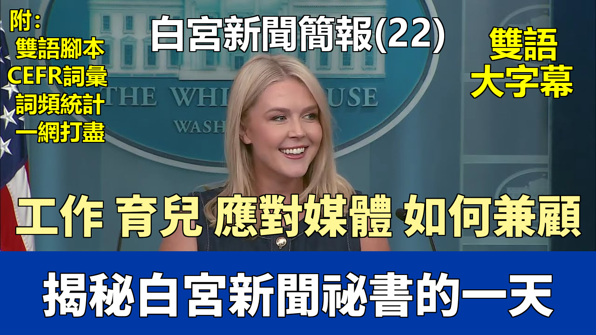

{% video youtube:omYKBUTtSHY width:100% autoplay:0 %}


### 【中英文双语脚本】

Hello everybody. Hi everybody. Hi guys. Good afternoon everyone.
大家好。大家好。大家好。各位下午好。
It is such a pleasure to see so many beautiful faces in this room and so many future leaders.
非常高興在這個房間裏看到這麼多美麗的面孔和這麼多未來的領導者。
Hi, Eloise. You look so cute back there.
嗨，埃洛伊絲。你在後面看起來真可愛。
I'm so excited to host this briefing today in honor of National Bring Your Kids to Work Day.
我非常激動今天能主持這場爲慶祝“全國帶孩子上班日”而舉行的簡報會。
And it's great to see so many future leaders here. Welcome to the James S. Brady briefing room.
很高興在這裏看到這麼多未來的領導者。歡迎來到詹姆斯·S·布雷迪簡報室。
My name is Caroline Levitt and I am the White House Press Secretary for President Donald J. Trump.
我叫卡羅琳·萊維特，是唐納德·J·特朗普總統的白宮新聞祕書。
He is the 45th and now the 47th President of the United States.
他是美國第45任，如今也是第47任總統。
My job at the White House is to communicate the President's message to the American people
我在白宮的工作是向美國人民傳達總統的信息，
and to answer questions from journalists who work in this building every day, many of whom are your moms and your dads.
並回答每天在這棟樓裏工作的記者們的提問，他們中的許多人是你們的媽媽和爸爸。
Now, they ask me some pretty good questions, but I'm sure you will all have excellent questions to ask me yourselves.
他們會問我一些很好的問題，但我相信你們自己也會有出色的問題要問我。
So before we open it up to questions today, I will give you a very short update on what the President is working on today.
所以在今天我們開始提問之前，我會給你們一個關於總統今天工作內容的簡短更新。
Earlier this morning, President Trump traveled to Capitol Hill to meet with members of the House of Representatives
今天一早，特朗普總統前往國會山，
to talk about the one big, beautiful bill that we are trying to pass through Congress.
與衆議院議員們討論我們正努力在國會通過的一項重大而美好的法案。
The President is now back at the White House where he is taking meetings.
總統現在已經回到白宮，正在參加會議。
And later this afternoon, he will be making an announcement from the Oval Office with our Secretary of Defense.
今天下午晚些時候，他將與我們的國防部長在橢圓形辦公室發表一項聲明。
He's in charge of our military, Pete Hegseth.
他負責我們的軍隊，皮特·赫格賽斯。
So I want to thank all of you for coming today. It's great to have you here at the People's House.
所以我要感謝大家今天的到來。很高興你們來到人民之家。
And you have some very special parents who perform a very special job.
你們擁有非常特別的父母，他們從事着非常特別的工作。
And we are here to make America great again. And we live in the best country in the history of the world.
我們在這裏是爲了讓美國再次偉大。我們生活在世界歷史上最好的國家。
And we are all very blessed to be here. So with that, thank you.
我們都非常幸運能來到這裏。因此，謝謝大家。
I am happy to take some of your questions. And why don't you start us off, beautiful little girl? Go ahead.
我很高興回答你們的一些問題。美麗的小女孩，你爲什麼不先開始呢？請講。
She's thinking very hard about it. You can ask it.
她正在努力思考。你可以問。
She wants to know if Donald Trump likes to give hugs.
她想知道唐納德·特朗普是否喜歡擁抱。
Oh, does he like to give hugs? You know, I think he does.
哦，他喜歡擁抱嗎？你知道，我想他是喜歡的。
I have seen him give many hugs to children and his family and our beautiful First Lady.
我見過他給孩子們、他的家人和我們美麗的第一夫人很多擁抱。
So, yes, I do think he likes to give hugs. You're welcome.
所以，是的，我確實認爲他喜歡擁抱。不客氣。
Emily, would you like to ask a question? Yes.
艾米麗，你想問個問題嗎？是的。
What is the funnest part about your job and the hardest part about your job?
你工作中最好玩的部分是什麼？最難的部分又是什麼？
Wow. Well, that is definitely a very good question.
哇。嗯，這絕對是個非常好的問題。
I think the most fun part about my job is doing things like this with all of you in the briefing room and answering so many great questions.
我認爲我工作中最有趣的部分就是和大家一起在簡報室裏做這樣的事情，並回答這麼多很棒的問題。
I think the hardest part of my job is also doing things like this in the briefing room and answering all of these questions.
我認爲我工作中最困難的部分也是在簡報室裏做這樣的事情，並回答所有這些問題。
And reading the news is a big part of my job every day.
每天閱讀新聞是我工作的重要組成部分。
I wake up and read the newspaper and watch the news and listen to all of the things that your parents are reporting on in the news.
我醒來後會讀報紙、看新聞，並聽取你們父母在新聞中報道的所有事情。
And that's a big part of my job every day. Frankie, go ahead.
那是我每天工作的重要組成部分。弗蘭基，請講。
What is President Trump's favorite food?
特朗普總統最喜歡的食物是什麼？
Well, President Trump loves a lot of different foods, but I think his favorite is probably steak.
嗯，特朗普總統喜歡很多不同的食物，但我想他最喜歡的可能是牛排。
I've had steak with him on many occasions, and he likes to eat a big, beautiful steak.
我曾多次和他一起吃牛排，他喜歡吃又大又美味的牛排。
Do you like steak, Frankie? Yes? Okay.
弗蘭基，你喜歡牛排嗎？喜歡？好的。
Jack, nice to see you. I like your hat. You're welcome.
傑克，很高興見到你。我喜歡你的帽子。不客氣。
Would you like to ask a question?
你想問個問題嗎？
What's the state of the border?
邊境情況如何？
I can assure you the border is the most secure it has ever been in the history of our country.
我可以向你保證，邊境是我們國家歷史上最安全的時期。
And I think your dad works for the Homeland Security Council, so that's a very apropos question.
而且我想你爸爸在國土安全委員會工作，所以這是個非常恰當的問題。
And your dad's doing a great job securing the border.
你爸爸在保衛邊境方面做得非常出色。
Hazel Jane, what a beautiful name. Would you like to ask a question?
黑茲爾·簡，多美的名字。你想問個問題嗎？
Okay. Actually, can you come back to me? Sure, I can come back to you. I'd be happy to.
好的。其實，你能待會兒再問我嗎？當然，我可以待會兒再叫你。我很樂意。
Bobbi Lynn?
博比·林恩？
How many people has he fired?
他解僱了多少人？
Thus far, actually, we have not had anyone fired, with the exception of one individual who did leave their job.
到目前爲止，實際上，我們還沒有解僱任何人，只有一個人離職了。
But we have a great team here so far, so good. Thank you for the question.
但到目前爲止，我們這裏有一個很棒的團隊，一切都很好。謝謝你的問題。
Yes, little man? Is that your mommy? Your mommy is a great journalist. What's your question?
是的，小傢伙？那是你媽媽嗎？你媽媽是一位很棒的記者。你的問題是什麼？
What's Donald Trump's favorite ice cream?
唐納德·特朗普最喜歡的冰淇淋是什麼？
I have seen the President eat ice cream sundaes before, with chocolate sauce and some toppings, too.
我以前見過總統吃冰淇淋聖代，加了巧克力醬和一些配料。
Raise your hand if you like ice cream sundaes.
喜歡冰淇淋聖代的人請舉手。
It's a very popular policy position to have. Yes, very good.
這是一個非常受歡迎的政策立場。是的，非常好。
Dario, would you like to go?
達里奧，你想問嗎？
If the President had a superpower, what would it be?
如果總統有超能力，那會是什麼？
Wow. If the President could have a superpower, what would it be? That is a very good question.
哇。如果總統能有超能力，那會是什麼？這是個非常好的問題。
I think if he had a superpower, it would be to just snap his fingers and solve all of our country's problems just like that,
我想如果他有超能力，他會希望只要打個響指就能解決我們國家所有的問題，
because he likes to get things done very quickly, but sometimes it takes a little bit longer.
因爲他喜歡快速完成事情，但有時需要更長一點的時間。
Like today he had to go to Capitol Hill to convince people to vote for his one big beautiful bill.
比如今天他必須去國會山說服人們投票支持他那項重大而美好的法案。
I bet if he had a superpower, he would snap his fingers and get it passed immediately.
我敢打賭，如果他有超能力，他會打個響指讓它立即通過。
But life doesn't work that way, unfortunately. Go ahead, buddy.
但不幸的是，生活並非如此。請講，小傢伙。
What is Donald Trump's favorite soccer player?
唐納德·特朗普最喜歡的足球運動員是誰？
Favorite soccer player? Hmm, you know, I don't know the answer to that.
最喜歡的足球運動員？嗯，你知道，我不知道答案。
It's a very good question. I will check in with the President and get back to you. How does that sound?
這是個非常好的問題。我會和總統確認一下再回復你。怎麼樣？
But I know he likes soccer and he likes all sports. Go ahead.
但我知道他喜歡足球，也喜歡所有運動。請講。
Does he leave the country each week?
他每週都出國嗎？
No, he doesn't. We left the country last week and we went on a long trip to the Middle East, very far away,
不，他沒有。我們上週離開了國家，去中東進行了一次長途旅行，非常遙遠，
but we have some plans to leave the country later this year, but most weeks he's right here at the White House working very hard.
但我們計劃今年晚些時候出國，不過大多數星期他都在白宮這裏辛勤工作。
Nora, go ahead.
諾拉，請講。
Which is Donald Trump's favorite president besides himself?
除了他自己，唐納德·特朗普最喜歡的總統是哪一位？
It's a good question because it would be probably himself.
這是個好問題，因爲答案可能就是他自己。
No, I think that perhaps he would say George Washington.
不，我想他可能會說是喬治·華盛頓。
I know he speaks very highly of George Washington, who was of course the first president of our great country,
我知道他高度評價喬治·華盛頓，他當然是我們偉大國家的第一任總統，
and he has his big beautiful portrait hanging in the Oval Office above the fireplace. Good question.
他的巨幅精美畫像就掛在橢圓形辦公室壁爐的上方。好問題。
Go ahead. You look very professional and beautiful.
請講。你看起來非常專業和漂亮。
Thank you so much. You're welcome.
非常感謝。不客氣。
I have a question for you: What is it like balancing a baby and your job as the press secretary?
我有一個問題想問你：作爲新聞祕書，同時還要照顧寶寶，是什麼樣的體驗？
Sure. It's a very good question, and my baby is here with my mother.
當然。這是個非常好的問題，我的寶寶和我媽媽在這裏。
As you can see, he does not know what's going on.
如你所見，他還不知道發生了什麼。
But it is a challenge every day, but it's also a blessing to have this opportunity and to be a mom.
但這每天都是一個挑戰，同時能有這個機會併成爲一名母親也是一種幸福。
So you have to learn to prioritize your time and lean on your support system, which is my mother and my husband and my family and friends.
所以你必須學會優先安排你的時間，並依靠你的支持系統，那就是我的母親、我的丈夫以及我的家人和朋友。
And you can do it. You just have to work very hard. Yes?
而且你能做到。你只需要非常努力地工作。是的？
Hi, my name is Arcella Victoria. My mom is Ariana Baris. Nice to meet you.
嗨，我叫阿塞拉·維多利亞。我媽媽是阿里安娜·巴里斯。很高興認識你。
My question is, as press secretary, as a young press secretary, what advice would you give to young girls like me who want to achieve their dreams?
我的問題是，作爲新聞祕書，作爲一位年輕的新聞祕書，您會給像我這樣想要實現夢想的年輕女孩什麼建議？
It's a great question, and you're so beautiful.
這是個很棒的問題，而且你真漂亮。
My best advice would be to work as hard as you possibly can and just pursue every opportunity that opens up and is given to you,
我最好的建議是盡你所能努力工作，抓住每一個向你敞開並給予你的機會，
and just work, work, work as hard as you can. Thank you so much. You're welcome.
並且努力、努力、再努力地工作。非常感謝。不客氣。
Behind you. Yeah?
你後面那位。是的？
What is Donald Trump going to do about climate change?
唐納德·特朗普將如何應對氣候變化？
Well, that is a very good question. The president cares very much about our environment.
嗯，這是個非常好的問題。總統非常關心我們的環境。
He says all the time he wants to have the cleanest air, the cleanest water, the cleanest environment for the world.
他總是說他希望爲世界提供最清潔的空氣、最清潔的水和最清潔的環境。
He also cares very much about our energy independence and ensuring that we can keep the lights on in our homes at a very cheap rate.
他也非常關心我們的能源獨立，並確保我們能以非常便宜的價格讓我們家裏的燈保持亮着。
So we want to make energy here in the United States because we do it cleaner and better than everyone.
所以我們希望在美國生產能源，因爲我們做得比任何人都更清潔、更好。
So I think that's how the president would answer that question. You're welcome.
所以我想總統會這樣回答那個問題。不客氣。
Go ahead.
請講。
What is your favorite country that you've been to before?
你以前去過的國家中，最喜歡哪一個？
What is my favorite country I've been to before? Oh, wow. That's a very good question.
我以前去過的國家中最喜歡哪一個？哦，哇。這是個非常好的問題。
Well, I've been to many countries. I lived in Italy for a few months to study,
嗯，我去過很多國家。我曾在意大利生活了幾個月學習，
but I very much enjoyed our trip last week to the Middle East where the president went to Qatar, Saudi Arabia, and the United Arab Emirates,
但我非常喜歡上週我們去中東的旅行，總統去了卡塔爾、沙特阿拉伯和阿拉伯聯合酋長國，
and they were three beautiful countries.
那三個都是美麗的國家。
We'll take a couple more questions. To the back, with that beautiful hand raised high. Go ahead.
我們再回答幾個問題。後面那位，手舉得很高很漂亮的那位。請講。
What pets did Donald Trump have when he grew up and also right now?
唐納德·特朗普小時候養過什麼寵物？現在呢？
What was that, buddy? What pets did Donald Trump have when he grew up and also right now?
那是什麼，小傢伙？唐納德·特朗普小時候養過什麼寵物？現在呢？
Well, he doesn't have any pets right now.
嗯，他現在沒有任何寵物。
I don't know if he had any pets when he was growing up. I'll have to check with him and ask,
我不知道他小時候是否養過寵物。我得和他確認一下問問，
but there's no pets at the White House right now except for our great canine Secret Service dog friends that are here to protect us.
但白宮現在除了我們偉大的特勤局警犬朋友們在這裏保護我們之外，沒有其他寵物。
Hazel Jane, did you remember your question? Yeah. Okay, let's hear it.
黑茲爾·簡，你記起你的問題了嗎？是的。好的，我們聽聽。
What's the president's religion?
總統的宗教信仰是什麼？
The president is a Christian, and he believes in Jesus. Yes?
總統是基督徒，他信仰耶穌。是的？
In the back?
後面那位？
What did the president do today?
總統今天做了什麼？
The president was very busy today. He went to Capitol Hill earlier today, and then he's here back at the White House,
總統今天非常忙。他今天早些時候去了國會山，然後他回到白宮這裏，
and he's doing meetings, and then he's going to do a big announcement at 3 o'clock
他正在開會，然後他將在3點鐘發表一個重要聲明，
where all of your moms and dads will be able to ask him questions directly.
屆時你們所有的爸爸媽媽都可以直接向他提問。
Go ahead, buddy.
請講，小傢伙。
How much candy does he eat a day?
他一天吃多少糖果？
What was that, buddy? How much candy does he eat a day?
那是什麼，小傢伙？他一天吃多少糖果？
A good amount. A good amount of candy, yes. He likes pink Starburst and Tootsie Rolls.
相當多。是的，相當多的糖果。他喜歡粉色的Starburst和Tootsie Rolls。
Yes, buddy, go ahead. We'll take two more.
是的，小傢伙，請講。我們再回答兩個問題。
What's the president's favorite order at McDonald's?
總統在麥當勞最喜歡點什麼？
The president's favorite order at McDonald's. He loves McDonald's hamburgers and french fries.
總統在麥當勞最喜歡點的。他喜歡麥當勞的漢堡包和炸薯條。
Who doesn't? They're good. In the back. Go ahead, bud.
誰不喜歡呢？它們很好吃。後面那位。請講，小夥子。
What's your least favorite news outlet?
你最不喜歡的媒體是哪家？
My least favorite what? News outlet.
我最不喜歡的什麼？新聞媒體。
I can tell you're a staff kid, not a journalist. Did someone say ABC?
我能看出來你是個員工的孩子，不是記者。有人說ABC嗎？
Honestly, it depends on the day. Go ahead, honey.
老實說，這要看情況。請講，親愛的。
What is President Trump's favorite room in the White House?
特朗普總統在白宮最喜歡的房間是哪個？
Favorite room in the White House? I think his favorite room in the White House is definitely the Oval Office because it's so beautiful,
在白宮最喜歡的房間？我想他在白宮最喜歡的房間絕對是橢圓形辦公室，因爲它太漂亮了，
and he has decked it out in gold. It's now MAGA Gold in there.
而且他用金色裝飾了它。現在那裏是“讓美國再次偉大”的金。
Yes, go ahead, one more.
是的，請講，最後一個。
What's his favorite child?
他最喜歡的孩子是哪個？
That is a very controversial question and I am not going to answer it.
這是個非常有爭議的問題，我不會回答。
I know he loves all of his children very much and they're all great kids. Some of them were here yesterday.
我知道他非常愛他所有的孩子，他們都是很棒的孩子。他們中的一些人昨天也在這裏。
We'll do one more to the little girl in the back behind you.
我們再回答一個問題，問你後面那個小女孩。
Who's your favorite president?
你最喜歡的總統是誰？
Who's my favorite president? Well, that's a good question to answer, Donald Trump.
我最喜歡的總統是誰？嗯，這是個好回答的問題，唐納德·特朗普。
Thank you guys so very much. It's good to see all of you. Thank you for coming.
非常感謝大家。很高興見到你們。謝謝你們的到來。
We'll see you later. You're welcome. Happy National Bring Your Kids to Work Day.
我們待會兒見。不客氣。全國帶孩子上班日快樂。

### 【核心词汇 - B1_C2】
| 單詞 | 音標 | 詞性 | 釋義 | 等級 | 次數 |
|---|---|---|---|---|---|
| Christian | /ˈkrɪstʃən/ | adjective | 基督教的，信基督教的 | B1 | 1 |
| Security | /sɪˈkjʊrəti/ | noun | 安全 | B1 | 1 |
| able | /ˈeɪbl/ | adjective | 能夠；有能力的 | B1 | 1 |
| amount | /əˈmaʊnt/ | noun | n. 數量；總額 | B1 | 1 |
| announcement | /əˈnaʊnsmənt/ | noun | n. 聲明；公告 | B1 | 1 |
| balance | /ˈbæləns/ | noun | 平衡，餘額 | B1 | 1 |
| bet | /bet/ | verb | 打賭 | B1 | 1 |
| blessing | /ˈblɛsɪŋ/ | noun | 祝福； благословение; 幸事 | B1 | 1 |
| border | /ˈbɔːrdər/ | noun | 邊界；邊境 | B1 | 1 |
| buddy | /ˈbʌdi/ | noun | 夥伴；老兄 | B1 | 1 |
| charge | /tʃɑːrdʒ/ | noun | 費用，指控，主管 | B1 | 1 |
| climate | /ˈklaɪmət/ | noun | 氣候，氣氛 | B1 | 1 |
| controversial | /ˌkɑːntrəˈvɜːrʃl/ | adjective | adj. 有爭議的，引起爭論的 | B1 | 1 |
| convince | /kənˈvɪns/ | verb | v. 使確信，說服 | B1 | 1 |
| definitely | /ˈdefɪnətli/ | adverb | 明確地；肯定地 | B1 | 1 |
| directly | /dəˈrektli/ | adverb | 直接地；立即 | B1 | 1 |
| ensure | /ɪnˈʃʊr/ | verb | 確保；保證 | B1 | 1 |
| finger | /ˈfɪŋɡər/ | noun | 手指 | B1 | 1 |
| hang | /hæŋ/ | verb | 懸掛，吊 | B1 | 1 |
| highly | /ˈhaɪli/ | adverb | 高度地; 非常 | B1 | 1 |
| honestly | /ˈɑːnɪstli/ | adverb | 誠實地; 坦率地 | B1 | 1 |
| immediately | /ɪˈmiːdiətli/ | adverb | 立即，馬上 | B1 | 1 |
| individual | /ˌɪndɪˈvɪdʒuəl/ | adjective | 個人的，單獨的 | B1 | 1 |
| journalist | /ˈdʒɜːrnəlɪst/ | noun | 記者 | B1 | 2 |
| lean | /liːn/ | adjective | 瘦的，精幹的 | B1 | 1 |
| occasion | /əˈkeɪʒən/ | noun | 場合，機會 | B1 | 1 |
| policy | /ˈpɑləsi/ | noun | 政策，方針；保險單 | B1 | 1 |
| president | /ˈprezɪdənt/ | noun | 總統；主席；校長 | B1 | 2 |
| press | /pres/ | noun | 報刊；新聞界；出版社；印刷機 | B1 | 1 |
| protect | /prəˈtekt/ | verb | 保護 | B1 | 1 |
| religion | /rɪˈlɪdʒən/ | noun | 宗教 | B1 | 1 |
| representative | /ˌreprɪˈzentətɪv/ | noun | 代表，代理人 | B1 | 1 |
| secure | /sɪˈkjʊr/ | adjective | 安全的；可靠的 | B1 | 2 |
| sometimes | /ˈsʌmtaɪmz/ | adverb | 有時；間或 | B1 | 1 |
| thus | /ðʌs/ | adverb | 因此；從而；這樣 | B1 | 1 |
| update | /ʌpˈdeɪt/ | verb | 更新，使現代化 | B1 | 1 |
| wake | /weɪk/ | verb | 醒來；喚醒；意識到 | B1 | 1 |
| working | /ˈwɜːrkɪŋ/ | adjective | adj. 工作的；有效的 | B1 | 1 |
| Congress | /ˈkɑːŋɡrəs/ | noun | 國會 | B2 | 1 |
| Council | /ˈkaʊnsl/ | noun | 委員會，理事會 | B2 | 1 |
| Defense | /dɪˈfens/ | noun | 防禦，辯護 | B2 | 1 |
| Secretary | /ˈsekrəteri/ | noun | 祕書，部長 | B2 | 1 |
| assure | /əˈʃʊr/ | verb | 向…保證；使確信 | B2 | 1 |
| briefing | /ˈbriːfɪŋ/ | noun | 簡報 | B2 | 1 |
| bud | /bʌd/ | noun | 花蕾，芽 | B2 | 1 |
| deck | /dek/ | noun | 甲板；層面；平臺 | B2 | 1 |
| energy | /ˈenərdʒi/ | noun | 能量；精力 | B2 | 1 |
| environment | /ɪnˈvaɪrənmənt/ | noun | 環境 | B2 | 1 |
| exception | /ɪkˈsepʃn/ | noun | 例外；例外情況 | B2 | 1 |
| fireplace | /ˈfaɪərpleɪs/ | noun | 壁爐，火爐 | B2 | 1 |
| honor | /ˈɑːnər/ | verb | 尊敬，給予榮譽 | B2 | 1 |
| outlet | /ˈaʊtlet/ | noun | 出口；經銷店；發泄途徑 | B2 | 1 |
| prioritize | /praɪˈɔːr.ɪ.taɪz/ | verb | 優先考慮 | B2 | 1 |
| snap | /snæp/ | verb | 猛咬，突然折斷；拍攝 | B2 | 1 |

### 【核心词汇 - A2】
| 單詞 | 音標 | 詞性 | 釋義 | 等級 | 次數 |
|---|---|---|---|---|---|
| American | /əˈmer.ɪ.kən/ | adjective | 美國的 | A2 | 1 |
| National | /ˈnæʃənəl/ | adjective | 國家的 | A2 | 1 |
| Office | /ˈɔːfɪs/ | noun | 辦公室 | A2 | 1 |
| United | /juːˈnaɪ.tɪd/ | adjective | 聯合的，團結的 | A2 | 1 |
| achieve | /əˈtʃiːv/ | verb | 達到，完成 | A2 | 1 |
| actually | /ˈæktʃuəli/ | adverb | 實際上，事實上 | A2 | 2 |
| advice | /ədˈvaɪs/ | noun | 建議，勸告 | A2 | 1 |
| ahead | /əˈhed/ | adverb | 在前面，領先 | A2 | 1 |
| air | /er/ | noun | 空氣 | A2 | 1 |
| besides | /bɪˈsaɪdz/ | adverb | 此外；而且；還有；另外 | A2 | 1 |
| bill | /bɪl/ | noun | 賬單；法案；（鳥的）喙 | A2 | 1 |
| bit | /bɪt/ | noun | 一點；少量；小塊兒 | A2 | 1 |
| challenge | /ˈtʃælɪndʒ/ | noun | 挑戰 | A2 | 1 |
| cheap | /tʃiːp/ | adjective | 便宜的 | A2 | 1 |
| cleaner | /ˈkliːnər/ | noun | 清潔工；清潔劑 | A2 | 1 |
| communicate | /kəˈmjuːnɪkeɪt/ | verb | 交流，溝通 | A2 | 1 |
| country | /ˈkʌntri/ | noun | 國家，國土；鄉村，鄉下 | A2 | 3 |
| couple | /ˈkʌpl/ | noun | 一對，夫婦；幾個，少量 | A2 | 1 |
| depend | /dɪˈpend/ | verb | 依賴，取決於 | A2 | 1 |
| ever | /ˈevər/ | adverb | 曾經；永遠 | A2 | 1 |
| except | /ɪkˈsept/ | conjunction | 除了 | A2 | 1 |
| far | /fɑːr/ | adverb | 遠的 | A2 | 1 |
| few | /fjuː/ | determiner | 少數的，幾乎沒有的 | A2 | 1 |
| himself | /hɪmˈself/ | pronoun | 他自己 | A2 | 1 |
| honey | /ˈhʌni/ | noun | 蜂蜜；親愛的 | A2 | 1 |
| host | /hoʊst/ | noun | 主人；主持人 | A2 | 1 |
| hug | /hʌɡ/ | verb | 擁抱 | A2 | 1 |
| independence | /ˌɪndɪˈpendəns/ | noun | 獨立 | A2 | 1 |
| last | /læst/ | determiner | 最近的；最後的；最不可能的；剛過去的 | A2 | 1 |
| least | /liːst/ | determiner | 最小的；最少的 | A2 | 1 |
| member | /ˈmembər/ | noun | 成員 | A2 | 1 |
| military | /ˈmɪləteri/ | adjective | 軍事的 | A2 | 1 |
| opportunity | /ˌɑːpərˈtuːnəti/ | noun | 機會 | A2 | 1 |
| part | /pɑːrt/ | noun | 部分，角色 | A2 | 1 |
| pass | /pæs/ | noun | 通行證，及格 | A2 | 2 |
| perform | /pərˈfɔːrm/ | verb | 表演，執行，表現 | A2 | 1 |
| perhaps | /pərˈhæps/ | adverb | 或許，可能 | A2 | 1 |
| popular | /ˈpɑːpjələr/ | adjective | 受歡迎的 | A2 | 1 |
| portrait | /ˈpɔːrtrət/ | noun | 肖像，畫像 | A2 | 1 |
| position | /pəˈzɪʃn/ | noun | 位置，職位 | A2 | 1 |
| possibly | /ˈpɑːsəbli/ | adverb | 可能地 | A2 | 1 |
| probably | /ˈprɑːbəbli/ | adverb | 可能，大概 | A2 | 1 |
| professional | /prəˈfeʃənl/ | adjective | 專業的，職業的 | A2 | 1 |
| pursue | /pərˈsuː/ | verb | 追求，從事 | A2 | 1 |
| raise | /reɪz/ | verb | 舉起，提高 | A2 | 2 |
| rate | /reɪt/ | noun | 比率，速度 | A2 | 1 |
| sauce | /sɔːs/ | noun | 醬汁，調味汁 | A2 | 1 |
| secretary | /ˈsekrəteri/ | noun | 祕書 | A2 | 1 |
| sound | /saʊnd/ | noun | 聲音 | A2 | 1 |
| staff | /stæf/ | noun | 員工，全體人員 | A2 | 1 |
| state | /steɪt/ | noun | 狀態，情形，國家 | A2 | 1 |
| steak | /steɪk/ | noun | 牛排 | A2 | 1 |
| such | /sʌtʃ/ | determiner | 這樣的，如此的 | A2 | 1 |
| support | /səˈpɔːrt/ | noun | 支持，支撐 | A2 | 1 |
| system | /ˈsɪstəm/ | noun | 系統 | A2 | 1 |
| try | /traɪ/ | verb | 嘗試 | A2 | 1 |
| unfortunately | /ʌnˈfɔːrtʃənətli/ | adverb | 不幸地是 | A2 | 1 |
| whom | /huːm/ | pronoun | 誰（賓格） | A2 | 1 |
| yeah | /jeə/ | adverb | 是；是的（口語） | A2 | 1 |

### 【核心词汇 - A1】
| 單詞 | 音標 | 詞性 | 釋義 | 等級 | 次數 |
|---|---|---|---|---|---|
| America | /əˈmerɪkə/ | noun | 美國，美洲 | A1 | 1 |
| Day | /deɪ/ | noun | 天，日 | A1 | 1 |
| Gold | /ɡoʊld/ | noun | 金子 | A1 | 1 |
| House | /haʊs/ | noun | 房子，家庭 | A1 | 1 |
| I | /aɪ/ | pronoun | 我 | A1 | 2 |
| President | /ˈprezɪdənt/ | noun | 總統 | A1 | 2 |
| Sure | /ʃʊr/ | adjective | 確定的，當然 | A1 | 1 |
| White | /waɪt/ | adjective | 白色的 | A1 | 1 |
| a | /ə/ | determiner | 一個，一種 | A1 | 2 |
| about | /əˈbaʊt/ | adverb | 大約，關於 | A1 | 1 |
| above | /əˈbʌv/ | adverb | 在...上面，以上 | A1 | 1 |
| afternoon | /ˌæftərˈnuːn/ | noun | 下午 | A1 | 1 |
| again | /əˈɡen/ | adverb | 再次，又一次 | A1 | 1 |
| all | /ɔːl/ | determiner | 所有，全部 | A1 | 1 |
| also | /ˈɔːlsoʊ/ | adverb | 也，還 | A1 | 1 |
| am | /æm/ | be-verb | 是 (be動詞的第一人稱單數) | A1 | 1 |
| and | /ænd/ | conjunction | 和，並且 | A1 | 2 |
| answer | /ˈænsər/ | noun | 答案，回答 | A1 | 2 |
| any | /ˈeni/ | determiner | 任何，一些 | A1 | 1 |
| anyone | /ˈeniwʌn/ | pronoun | 任何人 | A1 | 1 |
| as | /æz/ | preposition | 作爲，像…一樣 | A1 | 2 |
| ask | /æsk/ | verb | 問，詢問 | A1 | 1 |
| at | /æt/ | preposition | 在…（地點/時間） | A1 | 1 |
| away | /əˈweɪ/ | adverb | 離開，遠離 | A1 | 1 |
| baby | /ˈbeɪbi/ | noun | 嬰兒，寶貝 | A1 | 1 |
| back | /bæk/ | adverb | 回到，向後 | A1 | 1 |
| be | /biː/ | be-verb | 是 | A1 | 5 |
| beautiful | /ˈbjuːtɪfl/ | adjective | 美麗的，漂亮的 | A1 | 1 |
| because | /bɪˈkɔːz/ | conjunction | 因爲 | A1 | 1 |
| before | /bɪˈfɔːr/ | adverb | 之前，以前 | A1 | 1 |
| behind | /bɪˈhaɪnd/ | adverb | 在後面 | A1 | 2 |
| believe | /bɪˈliːv/ | verb | 相信 | A1 | 1 |
| better | /ˈbetər/ | adjective | 更好的 | A1 | 1 |
| big | /bɪɡ/ | adjective | 大的 | A1 | 1 |
| bring | /brɪŋ/ | verb | 帶來 | A1 | 1 |
| building | /ˈbɪldɪŋ/ | noun | 建築物 | A1 | 1 |
| busy | /ˈbɪzi/ | adjective | 忙碌的；熱鬧的 | A1 | 1 |
| but | /bʌt/ | conjunction | 但是，可是 | A1 | 2 |
| can | /kæn/ | modal auxiliary | 能，可以 | A1 | 1 |
| candy | /ˈkændi/ | noun | 糖果 | A1 | 1 |
| care | /ker/ | noun | 關心；照顧 | A1 | 1 |
| change | /tʃeɪndʒ/ | noun | 改變；零錢 | A1 | 1 |
| check | /tʃek/ | noun | 檢查；支票 | A1 | 1 |
| child | /tʃaɪld/ | noun | 孩子 | A1 | 2 |
| chocolate | /ˈtʃɑːklət/ | noun | 巧克力 | A1 | 1 |
| clean | /kliːn/ | adjective | 乾淨的 | A1 | 1 |
| clock | /klɑːk/ | noun | n. 鍾，時鐘 | A1 | 1 |
| come | /kʌm/ | verb | v. 來 | A1 | 2 |
| could | /kʊd/ | modal auxiliary | modal auxiliary 能，可以 | A1 | 1 |
| course | /kɔːrs/ | noun | n. 課程，過程 | A1 | 1 |
| cream | /kriːm/ | noun | n. 奶油，乳霜 | A1 | 1 |
| cute | /kjuːt/ | adjective | 可愛的；漂亮的 | A1 | 1 |
| dad | /dæd/ | noun | 爸爸 | A1 | 3 |
| day | /deɪ/ | noun | 天，一天 | A1 | 1 |
| different | /ˈdɪfərənt/ | adjective | 不同的，差異的 | A1 | 1 |
| do | /duː/ | do-verb | 做，幹 | A1 | 8 |
| dog | /dɔːɡ/ | noun | 狗 | A1 | 1 |
| dream | /driːm/ | noun | 夢想，夢 | A1 | 1 |
| each | /iːtʃ/ | determiner | 每個，各自 | A1 | 1 |
| early | /ˈɜːrli/ | adverb | 早，提早 | A1 | 2 |
| eat | /iːt/ | verb | 吃 | A1 | 1 |
| enjoy | /ɪnˈdʒɔɪ/ | verb | 享受，喜歡 | A1 | 1 |
| every | /ˈɛvri/ | determiner | 每一，每個 | A1 | 1 |
| everybody | /ˈevriˌbɑdi/ | pronoun | 每個人，人人 | A1 | 1 |
| everyone | /ˈevriˌwʌn/ | pronoun | 每個人，人人 | A1 | 1 |
| excellent | /ˈɛksələnt/ | adjective | 極好的，優秀的 | A1 | 1 |
| excited | /ɪkˈsaɪtɪd/ | adjective | 興奮的，激動的 | A1 | 1 |
| face | /feɪs/ | noun | 臉，面孔 | A1 | 1 |
| family | /ˈfæməli/ | noun | 家庭，家人 | A1 | 1 |
| fire | /ˈfaɪər/ | noun | 火，火災 | A1 | 1 |
| first | /fɜːrst/ | adjective | 第一的 | A1 | 1 |
| food | /fud/ | noun | 食物 | A1 | 2 |
| for | /fɔːr/ | preposition | 爲了，給，對於 | A1 | 1 |
| friend | /frɛnd/ | noun | 朋友 | A1 | 1 |
| from | /frʌm/ | preposition | 從 | A1 | 1 |
| fun | /fʌn/ | adjective | 有趣的 | A1 | 1 |
| future | /ˈfjutʃər/ | noun | 將來，未來 | A1 | 1 |
| get | /ɡet/ | verb | 獲得，得到，到達 | A1 | 1 |
| girl | /ɡɜːrl/ | noun | 女孩 | A1 | 2 |
| give | /ɡɪv/ | verb | 給，給予 | A1 | 2 |
| go | /ɡoʊ/ | verb | 去，走 | A1 | 4 |
| gold | /ɡoʊld/ | adjective | 金色的，金制的 | A1 | 1 |
| good | /ɡʊd/ | adjective | 好的，優秀的 | A1 | 3 |
| great | /ɡreɪt/ | adjective | 偉大的，極好的 | A1 | 1 |
| grow | /ɡroʊ/ | verb | 生長，種植 | A1 | 2 |
| guy | /ɡaɪ/ | noun | (口語)傢伙，人 | A1 | 1 |
| hamburger | /ˈhæmbɜːrɡər/ | noun | 漢堡包 | A1 | 1 |
| hand | /hænd/ | noun | 手 | A1 | 1 |
| happy | /ˈhæpi/ | adjective | 快樂的，幸福的 | A1 | 1 |
| hard | /hɑːrd/ | adjective | 堅硬的，困難的，努力的 | A1 | 2 |
| hat | /hæt/ | noun | 帽子 | A1 | 1 |
| have | /hæv/ | have-verb | 有 | A1 | 3 |
| he | /hiː/ | pronoun | 他 | A1 | 4 |
| hear | /hɪr/ | verb | 聽見 | A1 | 1 |
| hello | /həˈloʊ/ | noun | 你好 | A1 | 1 |
| here | /hɪr/ | adverb | 這裏 | A1 | 1 |
| high | /haɪ/ | adjective | 高的 | A1 | 1 |
| history | /ˈhɪstəri/ | noun | 歷史 | A1 | 1 |
| home | /hoʊm/ | noun | 家 | A1 | 1 |
| how | /haʊ/ | adverb | 如何，怎樣 | A1 | 2 |
| husband | /ˈhʌzbənd/ | noun | 丈夫 | A1 | 1 |
| ice | /aɪs/ | noun | 冰 | A1 | 1 |
| if | /ɪf/ | conjunction | 如果 | A1 | 2 |
| in | /ɪn/ | preposition | 在...裏面 | A1 | 2 |
| is | /ɪz/ | be-verb | 是 | A1 | 1 |
| it | /ɪt/ | pronoun | 它 | A1 | 2 |
| job | /dʒɑːb/ | noun | 工作 | A1 | 1 |
| just | /dʒʌst/ | adverb | 僅僅，剛纔 | A1 | 1 |
| keep | /kiːp/ | verb | 保持，保留 | A1 | 1 |
| kid | /kɪd/ | noun | 小孩 | A1 | 3 |
| know | /noʊ/ | verb | 知道，瞭解 | A1 | 1 |
| later | /ˈleɪtər/ | adverb | 後來，以後 | A1 | 1 |
| leader | /ˈliːdər/ | noun | 領導者，領袖 | A1 | 1 |
| learn | /lɜːrn/ | verb | 學習 | A1 | 1 |
| leave | /liːv/ | verb | 離開 | A1 | 1 |
| left | /left/ | adjective | 左邊的 | A1 | 1 |
| let | /let/ | verb | 讓 | A1 | 1 |
| life | /laɪf/ | noun | 生活，生命 | A1 | 1 |
| light | /laɪt/ | adjective | 輕的 | A1 | 1 |
| like | /laɪk/ | preposition | 像，如同 | A1 | 2 |
| listen | /ˈlɪsn/ | verb | 聽 | A1 | 1 |
| little | /ˈlɪtl/ | adjective | 小的 | A1 | 1 |
| live | /lɪv/ | verb | 住，居住 | A1 | 2 |
| long | /lɔːŋ/ | adjective | 長的 | A1 | 1 |
| longer | american_phonetic | adjective | 更長的 | A1 | 1 |
| look | /lʊk/ | noun | 看，外表 | A1 | 1 |
| lot | /lɑːt/ | adverb | 非常，很 | A1 | 1 |
| love | /lʌv/ | noun | 愛 | A1 | 1 |
| make | /meɪk/ | verb | 做，製作 | A1 | 2 |
| man | /mæn/ | noun | 男人 | A1 | 1 |
| many | /ˈmɛni/ | determiner | 許多的 | A1 | 1 |
| meet | /miːt/ | verb | 見面，相遇 | A1 | 1 |
| meeting | /ˈmiːtɪŋ/ | noun | 會議 | A1 | 1 |
| message | /ˈmɛsɪdʒ/ | noun | 消息，信息 | A1 | 1 |
| mom | /mɑːm/ | noun | 媽媽 | A1 | 2 |
| month | /mʌnθ/ | noun | 月份 | A1 | 1 |
| more | /mɔːr/ | determiner | 更多 | A1 | 1 |
| morning | /ˈmɔːrnɪŋ/ | noun | 早上 | A1 | 1 |
| most | /moʊst/ | determiner | 最多的，大多數 | A1 | 1 |
| mother | /ˈmʌðər/ | noun | 母親 | A1 | 1 |
| much | /mʌtʃ/ | adverb | 非常，很，十分 | A1 | 1 |
| my | /maɪ/ | determiner | 我的 | A1 | 2 |
| name | /neɪm/ | noun | 名字 | A1 | 1 |
| news | /nuːz/ | noun | 新聞 | A1 | 1 |
| newspaper | /ˈnuːzpeɪpər/ | noun | 報紙 | A1 | 1 |
| nice | /naɪs/ | adjective | 好的，令人愉快的，友善的 | A1 | 1 |
| no | /noʊ/ | adverb | 不 | A1 | 2 |
| not | /nɑːt/ | adverb | 不，沒有 | A1 | 1 |
| now | /naʊ/ | adverb | 現在 | A1 | 2 |
| of | /ʌv/ | preposition | ...的 | A1 | 1 |
| off | /ɔːf/ | adjective | 離開的，停止的 | A1 | 1 |
| okay | /ˌoʊˈkeɪ/ | adjective | 好的 | A1 | 1 |
| on | /ɑːn/ | preposition | 在...之上；關於 | A1 | 1 |
| one | /wʌn/ | determiner | 一 (個/件/…) | A1 | 1 |
| open | /ˈoʊpən/ | adjective | 開着的；開放的 | A1 | 2 |
| order | /ˈɔːrdər/ | noun | 命令；訂單 | A1 | 1 |
| out | /aʊt/ | adverb | 在外；出去 | A1 | 1 |
| parent | /ˈperənt/ | noun | 父母 | A1 | 1 |
| person | /ˈpɜːrsn/ | noun | 人 | A1 | 1 |
| pet | /pet/ | noun | 寵物 | A1 | 1 |
| pink | /pɪŋk/ | adjective | 粉色的 | A1 | 1 |
| plan | /plæn/ | noun | 計劃 | A1 | 1 |
| player | /ˈpleɪər/ | noun | 運動員，演奏者 | A1 | 1 |
| pleasure | /ˈplɛʒər/ | noun | 樂趣，榮幸 | A1 | 1 |
| pretty | /ˈprɪti/ | adjective | 漂亮的，美麗的 | A1 | 1 |
| problem | /ˈprɑːbləm/ | noun | 問題 | A1 | 1 |
| question | /ˈkwɛstʃən/ | noun | 問題 | A1 | 2 |
| quickly | /ˈkwɪkli/ | adverb | 快速地 | A1 | 1 |
| read | /riːd/ | verb | 讀，閱讀 | A1 | 1 |
| reading | /ˈriːdɪŋ/ | noun | 閱讀，讀物 | A1 | 1 |
| remember | /rɪˈmembər/ | verb | 記得，記住 | A1 | 1 |
| right | /raɪt/ | adjective | 正確的，右邊的 | A1 | 1 |
| room | /ruːm/ | noun | 房間，空間 | A1 | 1 |
| say | /seɪ/ | verb | 說，講 | A1 | 2 |
| see | /siː/ | verb | 看見 | A1 | 2 |
| she | /ʃiː/ | pronoun | 她 | A1 | 2 |
| short | /ʃɔːrt/ | adjective | 短的 | A1 | 1 |
| so | /soʊ/ | conjunction | 所以，那麼 | A1 | 2 |
| soccer | /ˈsɑːkər/ | noun | 足球 | A1 | 1 |
| solve | /sɑːlv/ | verb | 解決 | A1 | 1 |
| some | /sʌm/ | determiner | 一些，某些 | A1 | 2 |
| someone | /ˈsʌmwʌn/ | pronoun | 某人 | A1 | 1 |
| speak | /spiːk/ | verb | 說，講話 | A1 | 1 |
| special | /ˈspeʃl/ | adjective | 特別的，特殊的 | A1 | 1 |
| sport | /spɔːrt/ | noun | 運動 | A1 | 1 |
| start | /stɑːrt/ | noun | 開始 | A1 | 1 |
| study | /ˈstʌdi/ | verb | 學習，研究 | A1 | 1 |
| sure | /ʃʊr/ | adjective | 確定的，肯定的 | A1 | 1 |
| take | /teɪk/ | verb | 拿，取，帶 | A1 | 2 |
| talk | /tɔːk/ | verb | 談話，說話 | A1 | 1 |
| team | /tiːm/ | noun | 團隊，隊伍 | A1 | 1 |
| tell | /tel/ | verb | 告訴 | A1 | 1 |
| than | /ðæn/ | conjunction | 比 | A1 | 1 |
| thank | /θæŋk/ | verb | 感謝 | A1 | 2 |
| that | /ðæt/ | conjunction | 那，引導從句 | A1 | 2 |
| the | /ðiː/ | determiner | 這；那 | A1 | 2 |
| then | /ðen/ | adverb | 那麼；然後；當時 | A1 | 1 |
| there | /ðer/ | adverb | 那裏；那兒 | A1 | 1 |
| they | /ðeɪ/ | pronoun | 他們；她們；它們 | A1 | 3 |
| thing | /θɪŋ/ | noun | 東西；事情 | A1 | 1 |
| think | /θɪŋk/ | verb | 想；認爲 | A1 | 1 |
| this | /ðɪs/ | determiner | 這；這個 | A1 | 2 |
| three | /θriː/ | number | 三 | A1 | 1 |
| through | /θruː/ | preposition | 通過；穿過 | A1 | 1 |
| time | /taɪm/ | noun | 時間；時刻 | A1 | 1 |
| to | /tuː/ | infinitive-to | （動詞不定式） | A1 | 2 |
| today | /təˈdeɪ/ | adverb | 今天 | A1 | 1 |
| too | /tuː/ | adverb | 也；太 | A1 | 1 |
| travel | /ˈtrævl/ | verb | 旅行，出行 | A1 | 1 |
| trip | /trɪp/ | noun | 旅行，行程 | A1 | 1 |
| two | /tuː/ | number | 二 | A1 | 1 |
| up | /ʌp/ | preposition | 向上 | A1 | 1 |
| us | /ʌs/ | pronoun | 我們 | A1 | 1 |
| very | /ˈveri/ | adverb | 非常 | A1 | 1 |
| vote | /voʊt/ | noun | 投票 | A1 | 1 |
| want | /wɑːnt/ | verb | 想要 | A1 | 2 |
| was | /wʌz/ | be-verb | 是 (過去式) | A1 | 1 |
| watch | /wɑːtʃ/ | noun | 手錶；看守，值班 | A1 | 1 |
| water | /ˈwɔːtər/ | noun | 水 | A1 | 1 |
| way | /weɪ/ | noun | 方法；道路；方向 | A1 | 1 |
| we | /wiː/ | pronoun | 我們 | A1 | 3 |
| week | /wiːk/ | noun | 星期 | A1 | 2 |
| welcome | /ˈwelkəm/ | interjection | 歡迎 | A1 | 2 |
| well | /wel/ | adjective | 健康的；好的 | A1 | 1 |
| what | /wʌt/ | determiner | 什麼 | A1 | 2 |
| when | /wen/ | adverb | 什麼時候 | A1 | 1 |
| where | /wer/ | adverb | 在哪裏 | A1 | 1 |
| which | /wɪtʃ/ | determiner | 哪一個 | A1 | 2 |
| who | /huː/ | pronoun | 誰 | A1 | 2 |
| why | /waɪ/ | adverb | 爲什麼 | A1 | 1 |
| will | /wɪl/ | modal auxiliary | 將要 | A1 | 1 |
| with | /wɪθ/ | preposition | 和...一起；用 | A1 | 1 |
| work | /wɜːrk/ | noun | 工作 | A1 | 3 |
| world | /wɜːrld/ | noun | 世界 | A1 | 1 |
| would | /wʊd/ | modal auxiliary | 將要 (will 的過去式，表示意願或禮貌) | A1 | 2 |
| wow | /waʊ/ | interjection | 哇 | A1 | 2 |
| year | /jɪr/ | noun | 年 | A1 | 1 |
| yes | /jes/ | adverb | 是 | A1 | 1 |
| yesterday | /ˈjestərdeɪ/ | adverb | 昨天 | A1 | 1 |
| you | /juː/ | pronoun | 你，你們 | A1 | 3 |
| young | /jʌŋ/ | adjective | 年輕的 | A1 | 1 |
| your | /jʊr/ | determiner | 你的，你們的 | A1 | 1 |

### 【核心词汇 - Others】
| 單詞 | 音標 | 詞性 | 釋義 | 等級 | 次數 |
|---|---|---|---|---|---|
| 45th |  |  |  | UNKNOWN | 1 |
| 47th |  |  |  | UNKNOWN | 1 |
| ABC | /ˌeɪ.biːˈsiː/ | noun | 美國廣播公司 | UNKNOWN | 1 |
| Arab |  |  |  | UNKNOWN | 1 |
| Arabia |  |  |  | UNKNOWN | 1 |
| Arcella |  |  |  | UNKNOWN | 1 |
| Ariana |  |  |  | UNKNOWN | 1 |
| Baris |  |  |  | UNKNOWN | 1 |
| Bobbi |  |  |  | UNKNOWN | 1 |
| Brady |  |  |  | UNKNOWN | 1 |
| Capitol |  |  |  | UNKNOWN | 1 |
| Caroline | /ˈkærəlaɪn/ | noun | 卡羅琳（人名） | UNKNOWN | 1 |
| Dario |  |  |  | UNKNOWN | 1 |
| Donald | /ˈdɑː.nəld/ | noun | 唐納德（人名） | UNKNOWN | 1 |
| East |  |  |  | UNKNOWN | 1 |
| Eloise |  |  |  | UNKNOWN | 1 |
| Emily |  |  |  | UNKNOWN | 1 |
| Emirates |  |  |  | UNKNOWN | 1 |
| First |  |  |  | UNKNOWN | 1 |
| Frankie |  |  |  | UNKNOWN | 1 |
| French |  |  |  | UNKNOWN | 1 |
| George |  |  |  | UNKNOWN | 1 |
| Happy |  |  |  | UNKNOWN | 1 |
| Hazel |  |  |  | UNKNOWN | 1 |
| Hegseth | /ˈheɡsɛθ/ | noun | 赫格塞斯（人名） | UNKNOWN | 1 |
| Hi |  |  |  | UNKNOWN | 1 |
| Hill |  |  |  | UNKNOWN | 1 |
| Homeland | /ˈhoʊmlænd/ | noun | 國土 | UNKNOWN | 1 |
| Italy |  |  |  | UNKNOWN | 1 |
| Jack |  |  |  | UNKNOWN | 1 |
| James |  |  |  | UNKNOWN | 1 |
| Jane |  |  |  | UNKNOWN | 1 |
| Jesus |  |  |  | UNKNOWN | 1 |
| Lady |  |  |  | UNKNOWN | 1 |
| Levitt |  |  |  | UNKNOWN | 1 |
| Lynn | /lɪn/ | noun | 林恩（人名） | UNKNOWN | 1 |
| MAGA |  |  |  | UNKNOWN | 1 |
| McDonald |  |  |  | UNKNOWN | 1 |
| Middle |  |  |  | UNKNOWN | 1 |
| News |  |  |  | UNKNOWN | 1 |
| Nice |  |  |  | UNKNOWN | 1 |
| Nora |  |  |  | UNKNOWN | 1 |
| Oh |  |  |  | UNKNOWN | 1 |
| Oval | /ˈoʊvl/ | adjective | 橢圓形的 | UNKNOWN | 1 |
| People |  |  |  | UNKNOWN | 1 |
| Pete | /piːt/ | noun | 皮特（人名） | UNKNOWN | 1 |
| Press |  |  |  | UNKNOWN | 1 |
| Qatar |  |  |  | UNKNOWN | 1 |
| Rolls |  |  |  | UNKNOWN | 1 |
| Saudi |  |  |  | UNKNOWN | 1 |
| Secret |  |  |  | UNKNOWN | 1 |
| Service |  |  |  | UNKNOWN | 1 |
| States | /steɪts/ | noun | 美國 | UNKNOWN | 1 |
| Tootsie |  |  |  | UNKNOWN | 1 |
| Trump | /trʌmp/ | noun | 特朗普（人名） | UNKNOWN | 2 |
| Victoria |  |  |  | UNKNOWN | 1 |
| Washington |  |  |  | UNKNOWN | 1 |
| Yes |  |  |  | UNKNOWN | 1 |
| apropos |  |  |  | UNKNOWN | 1 |
| blessed |  |  |  | UNKNOWN | 1 |
| canine |  |  |  | UNKNOWN | 1 |
| favorite |  |  |  | UNKNOWN | 2 |
| fries |  |  |  | UNKNOWN | 1 |
| funn |  |  |  | UNKNOWN | 1 |
| hmm | /hʌm/ | interjection | 嗯 (表示思考) | UNKNOWN | 1 |
| likes |  |  |  | UNKNOWN | 1 |
| mommy |  |  |  | UNKNOWN | 1 |
| reporting |  |  |  | UNKNOWN | 1 |
| starburst |  |  |  | UNKNOWN | 1 |
| sundaes |  |  |  | UNKNOWN | 1 |
| superpower | /ˈsuːpərpaʊər/ | noun | 超級大國 | UNKNOWN | 1 |
| taking |  |  |  | UNKNOWN | 1 |
| thinking |  |  |  | UNKNOWN | 1 |
| topping |  |  |  | UNKNOWN | 1 |
| yourselve |  |  |  | UNKNOWN | 1 |

