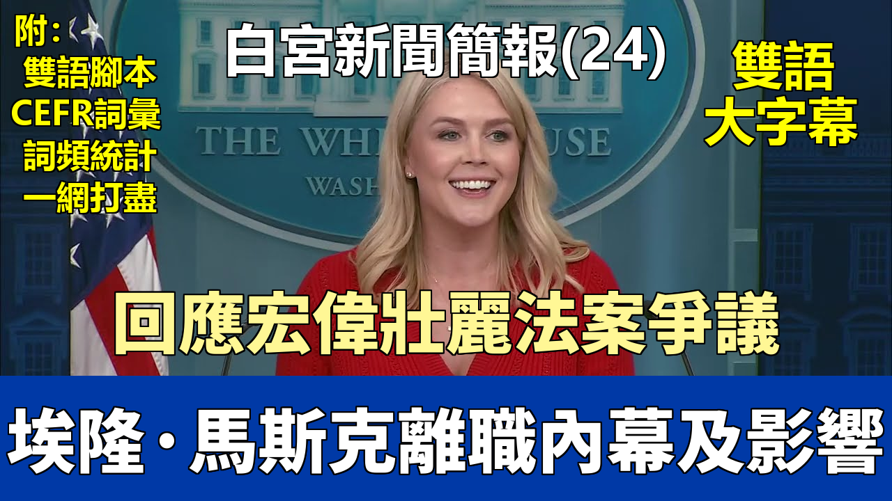

{% video youtube:-8tKKyrCmSY width:100% autoplay:0 %}


### 【中英文双语脚本】

Hello, everybody. How are you? Wow, a packed room today.
大家好。你們好嗎？哇，今天真是座無虛席。
Last night, the Trump administration faced another example of judicial overreach.
昨晚，特朗普政府面臨了又一個司法越權的例子。
Using his full and proper legal authority, President Trump imposed universal tariffs and reciprocal tariffs on Liberation Day
特朗普總統運用其全面且正當的法律授權，在解放日徵收了普遍關稅和對等關稅，
to address the extraordinary threat to our national security and economy posed by large and persistent annual U.S. goods trade deficits.
以應對美國常年鉅額商品貿易逆差對我國國家安全和經濟構成的非凡威脅。
The United States has run a trade deficit of goods every year since 1975. In 2024, our trade deficit in goods exceeded $1 trillion.
自1975年以來，美國每年都存在商品貿易逆差。2024年，我們的商品貿易逆差超過了1萬億美元。
Everybody agrees this is unacceptable. President Trump is delivering on his promise to fix this problem,
所有人都認爲這是不可接受的。特朗普總統正在兌現他解決這個問題的承諾，
and he has taken a long overdue and much needed bold stance for American workers after decades of our manufacturing base being hollowed out.
在我們的製造業基礎被掏空數十年之後，他爲美國工人採取了早就應該採取的、非常必要的大膽立場。
The President's rationale for imposing these powerful tariffs was legally sound and grounded in common sense.
總統徵收這些強力關稅的理由在法律上是健全的，並且基於常識。
President Trump correctly believes that America cannot function safely long term if we are unable to scale advanced domestic manufacturing capacity,
特朗普總統正確地認爲，如果我們無法擴大先進的國內製造能力，美國將無法長期安全運作，
have our own secure critical supply chains, and our defense industrial base is dependent on foreign adversaries.
如果我們沒有自己安全的、關鍵的供應鏈，並且我們的國防工業基礎依賴於外國對手。
Three judges of the U.S. Court of International Trade disagreed and brazenly abused their judicial power
美國國際貿易法院的三名法官不同意，並悍然濫用其司法權力，
to usurp the authority of President Trump to stop him from carrying out the mandate that the American people gave him.
篡奪了特朗普總統的權力，阻止他執行美國人民賦予他的使命。
These judges failed to acknowledge that the President of the United States has core foreign affairs powers
這些法官未能承認美國總統擁有核心的外交權力，
and authority given to him by Congress to protect the United States economy and national security.
以及國會授予他保護美國經濟和國家安全的權力。
Congress had created the National Emergency Act to provide the Congressional framework to strike down improper IEPA use.
國會已經制定了《國家緊急狀態法》，以提供國會框架來否決不當使用《國際緊急經濟權力法》的行爲。
Any questions over whether President Trump improperly imposed these IEPA tariffs were already adjudicated in Congress following Liberation Day.
而關於特朗普總統是否不當徵收這些《國際緊急經濟權力法》關稅的任何問題，在解放日之後都已在國會進行了裁決。
Congress firmly rejected an effort led by Senator Rand Paul and Democrats to terminate the President's reciprocal tariffs.
國會堅決拒絕了由參議員蘭德·保羅和民主黨人領導的旨在終止總統對等關稅的努力。
The courts should have no role here. There is a troubling and dangerous trend of unelected judges inserting themselves into the presidential decision-making process.
法院在這裏本不應扮演任何角色。存在一種令人不安且危險的趨勢，即未經選舉的法官將自己介入總統的決策過程。
America cannot function if President Trump, or any other President for that matter, has their sensitive diplomatic or trade negotiations railroaded by activist judges.
如果特朗普總統，或任何其他總統，他們敏感的外交或貿易談判被激進派法官強行干預，美國將無法運作。
President Trump is in the process of rebalancing America's trading agreements with the entire world,
特朗普總統正在重新平衡美國與全世界的貿易協定，
bringing tens of billions of dollars in tariff revenues to our country, and finally ending the United States of America from being ripped off.
爲我們的國家帶來數百億美元的關稅收入，並最終結束美利堅合衆國被敲竹槓的局面。
These judges are threatening to undermine the credibility of the United States on the world stage.
這些法官正在威脅損害美國在世界舞臺上的信譽。
The administration has already filed an emergency motion for a stay pending appeal and an immediate administrative stay to strike down this egregious decision.
政府已經提交了一項緊急動議，要求在上訴期間暫停執行，並立即進行行政暫緩，以推翻這一駭人聽聞的裁決。
But ultimately, the Supreme Court must put an end to this for the sake of our Constitution and our country.
但最終，爲了我們的憲法和我們的國家，最高法院必須制止這種行爲。
With Congress returning next week, it's critical that Senate Republicans maintain the momentum and quickly pass the One Big Beautiful bill.
隨着國會下週復會，參議院共和黨人必須保持勢頭，迅速通過“宏偉壯麗法案”。
The One Big Beautiful bill will truly make America safe and prosperous. It includes the largest border security investment ever.
“宏偉壯麗法案”將真正使美國安全繁榮。它包含了有史以來最大規模的邊境安全投資。
That's why the law enforcement groups are lining up to encourage its swift passage.
這就是爲什麼執法團體紛紛站出來鼓勵其迅速通過。
The National Fraternal Order of Police, the largest police union in the country, just endorsed key provisions of the bill.
全國警察兄弟會，這個國家最大的警察工會，剛剛支持了該法案的關鍵條款。
The FOP President announced their strong support, saying the One Big Beautiful bill is more than legislation.
警察兄弟會主席宣佈了他們的強烈支持，稱“宏偉壯麗法案”不僅僅是立法。
It is a promise kept to the public safety officers across the country
這是對全國公共安全官員信守的承諾，
and a bold step toward an economy that respects, rewards, and uplifts the people who keep it safe.
是邁向一個尊重、獎勵並提升那些維護其安全的人們的經濟的大膽一步。
And the National Border Patrol Council, which represents nearly 20,000 border patrol agents, hailed the legislation as well.
代表近20,000名邊境巡邏人員的全國邊境巡邏委員會也對該立法表示歡迎。
The group's president said this legislation provides a once-in-a-generation investment in the border security of our great country
該組織主席說，這項立法爲我們偉大國家的邊境安全提供了一代人一遇的投資，
and will make America safer.
並將使美國更安全。
The One Big Beautiful bill will guarantee we can permanently have the safest, strongest, and most secure immigration system in American history.
“宏偉壯麗法案”將保證我們能夠永久擁有美國曆史上最安全、最強大、最可靠的移民體系。
I also want to take the opportunity to debunk some false claims that have been circulating in the press about this bill.
我也想借此機會揭穿一些在媒體上流傳的關於這項法案的虛假說法。
The blatantly wrong claim that the One Big Beautiful bill increases the deficit is based on the Congressional Budget Office and other scorekeepers
聲稱“宏偉壯麗法案”會增加赤字的公然錯誤說法，是基於國會預算辦公室和其他評分機構，
who use shoddy assumptions and have historically been terrible at forecasting across Democrat and Republican administrations alike.
這些機構使用劣質的假設，並且歷史上在民主黨和共和黨政府期間的預測都非常糟糕。
For example, just before Congress enacted the original Trump tax cuts at the end of 2017,
例如，就在2017年底國會頒佈最初的特朗普減稅政策之前，
the same CBO projected that growth would average a mere 1.9 percent over the next 10 years.
同一個國會預算辦公室預測未來10年的平均增長率僅爲1.9%。
However, by 2019, actual growth had surged to 3.4 percent once the Trump tax cuts went into effect,
然而，到了2019年，一旦特朗普減稅政策生效，實際增長率飆升至3.4%，
exceeding the CBO forecast by nearly two full percentage points.
比國會預算辦公室的預測高出近兩個百分點。
The CBO's latest forecast makes the same anemic growth assumptions as they did in 2017, missing the impact of the One Big Beautiful bill.
國會預算辦公室的最新預測做出了與2017年相同的疲軟增長假設，忽略了“宏偉壯麗法案”的影響。
The CBO assumes long-term GDP growth of an anemic 1.8 percent, and that is absurd.
國會預算辦公室假設長期GDP增長率爲疲軟的1.8%，這很荒謬。
The American economy is going to boom like never before after the One Big Beautiful bill is passed.
“宏偉壯麗法案”通過後，美國經濟將以前所未有的方式蓬勃發展。
The largest middle-class tax cut in history, massive deregulation, and the most aggressive domestic energy exploration ever will fuel small businesses,
史上最大規模的中產階級減稅、大規模的放松管制以及有史以來最積極的國內能源勘探將爲小企業提供動力，
further boost private investment, increase workers' wages, and supercharge economic growth.
進一步促進私人投資，提高工人工資，並極大地推動經濟增長。
The Council of Economic Advisers has factored in the effects of all these pro-growth policies
經濟顧問委員會已將所有這些促進增長的政策的影響考慮在內，
and estimated in their own analysis that growth will average 3 percent in the long run after the One Big Beautiful bill is passed,
並在他們自己的分析中估計，“宏偉壯麗法案”通過後，長期平均增長率將達到3%，
which is nearly double the ridiculous CBO projection.
這幾乎是國會預算辦公室荒謬預測的兩倍。
This higher growth would result in $4.1 trillion in additional revenue over the next 10 years.
這種更高的增長將在未來10年帶來4.1萬億美元的額外收入。
Between the common-sense spending reforms in the bill and the robust economic growth that will be generated as a result of it, there will be no increase to the deficit.
憑藉該法案中包含的常識性支出改革及其將產生的強勁經濟增長，赤字將不會增加。
The same analysis from the CEA shows just how this historic package will unleash prosperity and ignite a blue-collar boom across America.
經濟顧問委員會的同樣分析顯示了這個歷史性的一攬子計劃將如何在美國釋放繁榮並點燃藍領階層的繁榮。
But if the radical Democrats get their way and the One Big Beautiful bill does not pass, Americans will face a whopping $4 trillion tax hike.
但如果激進的民主黨人得逞，而“宏偉壯麗法案”沒有通過，美國人將面臨高達4萬億美元的增稅。
This is unacceptable to President Trump. President Trump will not allow Democrats to massively raise Americans' taxes.
這對特朗普總統來說是不可接受的。特朗普總統不會允許民主黨人大幅提高美國人的稅收。
Senate Republicans must get this bill passed. Failure is not an option. The American people are counting on us, on Republicans, to deliver.
參議院共和黨人必須通過這項法案。失敗不是一個選項。美國人民指望着我們，指望着共和黨人，來兌現承諾。
In other news, despite all the doomcasting from the media, Americans are growing more and more optimistic about the economy under this President.
另外，儘管媒體一片悲觀預測，但在本屆總統的領導下，美國人對經濟越來越樂觀。
Consumer confidence surged in May, with the biggest monthly jump in four years smashing expectations.
五月份消費者信心飆升，創下四年來最大的月度增幅，遠超預期。
According to the release from the Consumer Confidence Index, the increase in confidence was broad-based across all age groups, income groups, and political affiliations.
根據消費者信心指數發佈的數據，信心的增長是廣泛的，涵蓋了所有年齡段、收入羣體和政治派別。
Our country is clearly heading in the right direction under President Trump's bold leadership.
在特朗普總統的大膽領導下，我們的國家顯然正朝着正確的方向前進。
For the first time in the history of Rasmussen polling, a majority of Americans believe the country is on the right track.
在拉斯穆森民意調查的歷史上，第一次有大多數美國人認爲國家正走在正確的軌道上。
It's unsurprising because the President is fulfilling the promises he made to the American people.
這不足爲奇，因爲總統正在履行他對美國人民做出的承諾。
Here in our new media seat today, we have the editor-in-chief of The Federalist, Molly Hemingway.
今天在我們的新媒體席位上，我們請來了《聯邦黨人》雜誌的主編，莫莉·海明威。
The Federalist is led by Molly and Sean Davis and provides fearless journalism and coverage of politics and culture to millions of readers all over the world.
《聯邦黨人》由莫莉和肖恩·戴維斯領導，爲全球數百萬讀者提供無畏的新聞報道以及政治和文化報道。
Thank you for being here, Molly, and why don't you please kick us off.
謝謝你來到這裏，莫莉，請你來開個頭吧。
Thank you, Caroline. Thank you.
謝謝你，卡羅琳。謝謝。
In the first Trump administration, there was an effort to stymie the agenda of Trump through the Russia collusion hoax
在第一屆特朗普政府期間，有人試圖通過俄羅斯通同謀的騙局來阻撓特朗普的議程，
perpetuated by many people in the media, including some people seated here or the media outlets they represent, and other Democrats as well.
這個騙局由許多媒體人士，包括在座的一些人或他們所代表的媒體機構，以及其他民主黨人所 perpetuating。
The second Trump administration, to reference what you said at the beginning, seems to be subject to an effort to stymie the agenda using rogue lower court judges.
第二屆特朗普政府，引用你開頭所說的話，似乎正遭受利用流氓下級法院法官來阻撓議程的企圖。
You mentioned that the Supreme Court could and should do something to rein in these lower court judges.
你提到最高法院可以也應該採取措施來約束這些下級法院法官。
Also, Congress could do something about it, but they don't seem terribly interested in it.
此外，國會也可以對此採取行動，但他們似乎對此不怎麼感興趣。
It also seems there's not much of an actual coordinated effort from this White House
而且，白宮似乎也沒有采取什麼實際的協調行動，
to take and tackle this effort from Democrats and other people using these judges to stymie the agenda.
來應對民主黨和其他人利用這些法官來阻撓議程所做的努力。
Is there an actual effort by this White House to tackle this issue in a comprehensive way, and if so, what is it?
本屆白宮是否有實際的努力來全面解決這個問題？如果有，具體是什麼？
There is an effort by this administration to tackle these rogue judges and the injunctions and the blockades that we have faced in our broken judicial system.
本屆政府在努力應對這些流氓法官以及我們在破碎的司法系統中所面臨的禁令和封鎖。
We have seen time and time again these lower district court judges ruling against this administration in the President's basic executive authority and powers,
我們一次又一次地看到這些下級地方法院的法官在總統的基本行政權力和職權上做出對本屆政府不利的裁決，
and this administration is fighting every single one of those battles in court, including the block that came down from the tariff court last night.
而本屆政府正在法庭上打每一場這樣的仗，包括昨晚來自關稅法庭的阻撓。
As I was on my way out here to the briefing room, I understand that another district court judge right here in Washington, D.C. ruled against the President's tariff power.
在我來新聞發佈室的路上，我瞭解到華盛頓特區這裏又有另一位地方法院法官做出了不利於總統關稅權力的裁決。
And I will get to the heart of your question, and I'm glad that we are addressing this in the room today,
我會觸及你問題的核心，我很高興我們今天在房間裏討論這個問題，
because nationwide injunctions ordered against the first Trump administration, Trump 1.0, account for more than half of the injunctions issued in this country since 1963.
因爲針對第一屆特朗普政府（特朗普1.0）下達的全國性禁令佔了自1963年以來這個國家發佈的所有禁令的一半以上。
President Trump had more injunctions in one full month of office in February than Joe Biden had in three years.
而且特朗普總統在二月份一個月內收到的禁令比喬·拜登在三年內收到的還要多。
And let me roll through some of these radical injunctions to paint the picture for the American people at home.
讓我來列舉一些這些激進的禁令，爲在家的美國人民描繪出一幅圖景。
These are not just talking points. These are real judges in the court of law who are trying to block the President's power and the policies he was elected to enact.
這些不僅僅是談話要點。這些是法庭上真正的法官，他們試圖阻止總統的權力和他被選舉來實施的政策。
For example, a court ordered the Trump administration to return already deported terrorist aliens back to the United States.
例如，一個法院命令特朗普政府將已經被驅逐出境的恐怖分子外國人送回美國。
A court has ruled the Trump administration can't even temporarily pause our refugee programs.
一個法院裁定特朗普政府甚至不能暫時中止我們的難民計劃。
Courts prohibited the Trump administration from eliminating federal funding for child transgender surgery and mutilation,
法院禁止特朗普政府取消對兒童變性手術和殘害身體的聯邦資助，
a practice that the American people overwhelmingly reject.
而這種做法是美國人民絕大多數都拒絕的。
A court also held that the Trump administration could not ban people experiencing gender dysphoria or mental health issues from serving in the military. Ridiculous.
一個法院還裁定，特朗普政府不能禁止有性別焦慮或心理健康問題的人在軍隊服役。荒謬。
Courts prohibited the removal of transgender women from women's prisons, despite potential physical harm to biological women in those prisons.
法院禁止將變性女性從女子監獄中移走，儘管這可能對那些監獄中的生理女性造成身體傷害。
A Northern District of California judge issued an absurd ruling that the President cannot fire people within the executive branch without Congress passing a bill,
加州北區的一名法官發佈了一項荒謬的裁決，即在國會沒有通過法案的情況下，總統不能解僱行政部門內的人員，
even though Congress has expressly authorized the President through the Office of Personnel Management to authorize reductions in force across agencies.
儘管國會已明確授權總統通過人事管理辦公室授權各機構進行裁員。
A court also ordered the Trump administration to rehire thousands of already fired employees in several cases.
一個法院還在幾個案例中命令特朗普政府重新僱用數千名已被解僱的員工。
A federal judge blocked the Trump administration from defunding the Department of Education, another signature campaign promise that this President has the power to implement.
一位聯邦法官阻止了特朗普政府削減教育部資金，這是本屆總統有權實施的另一項標誌性競選承諾。
Courts ordered the Trump administration could not eliminate funding for illegal DEI programs, hence the word "illegal."
法院命令特朗普政府不得取消對非法DEI（多元化、公平性和包容性）項目的資助，因此才用了“非法”這個詞。
These are illegal programs to begin with, and now the courts are trying to say this President can't roll them back.
這些項目本身就是非法的，而現在法院卻試圖說總統不能撤銷它們。
And a District Court judge prohibited the President from issuing any categorical funding freezes.
一位地方法院法官禁止總統發佈任何類別性的資金凍結。
And then another court ordered on top of that the administration makes $2 billion of payments in 36 hours.
然後另一個法院在此之上命令政府在36小時內支付20億美元。
These are just a few of the ridiculous orders that we have seen from lower District Court judges every day,
這些只是我們每天從下級地方法院法官那裏看到的荒謬命令中的一小部分，
and we hope that the Supreme Court will weigh in and rein them in.
我們希望最高法院能夠介入並加以約束。
White House advisor Stephen Miller says it's judicial tyranny. Some people are calling it a judicial coup.
白宮顧問斯蒂芬·米勒說這是司法暴政。有些人稱之爲司法政變。
You're saying you're responding to each and every one of these actions, efforts by these judges to delay or thwart the implementation of the agenda.
你是說你們正在迴應這些法官的每一項行動和努力，這些行動旨在延遲或阻撓議程的實施。
But is there going to be anything more than that, or is it just going to let this operation continue,
但除了這些還會有別的行動嗎？還是說就任由這種操作繼續下去，
even though it could delay everything for years until the presidency is over?
即使這可能會將所有事情拖延數年，直到總統任期結束？
The administration is operating under the directive given from the President that we need to comply with the court's orders.
本屆政府正在根據總統的指示運作，即我們需要遵守法院的命令。
He's made that very clear, but we're going to fight them in court, and we're going to win on the merits of these cases
他已經非常明確地表示了這一點，但我們將在法庭上與他們抗爭，並且我們將在這些案件的是非曲直上獲勝，
because we know we are acting within the President's legal and executive authorities. And thanks for being here.
因爲我們知道我們的行爲在總統的法律和行政授權範圍之內。感謝你來到這裏。
Thank you, Caroline. Question on tariffs, but first actually some foreign policy news, some breaking news. Sure.
謝謝你，卡羅琳。關於關稅的問題，但首先實際上是一些外交政策新聞，一些突發新聞。當然。
Some local Israeli media is reporting that Prime Minister Netanyahu told hostage families that he's accepted a 60-day truce offer.
一些以色列地方媒體報道說，內塔尼亞胡總理告訴人質家屬，他已經接受了一個爲期60天的休戰提議。
So can you confirm? Have Israel and Hamas agreed to a truce?
那麼你能確認嗎？以色列和哈馬斯是否已經同意休戰？
I can confirm that Special Envoy Witkoff and the President submitted a cease-fire proposal to Hamas that Israel backed and supported.
我可以確認，特使威特科夫和總統向哈馬斯提交了一份停火提議，該提議得到了以色列的支持。
Israel signed off on this proposal before it was sent to Hamas.
以色列在將此提議送交哈馬斯之前已經批准了。
I can also confirm that those discussions are continuing, and we hope that a ceasefire in Gaza will take place so we can return all of the hostages home.
我也可以確認，這些討論正在繼續，我們希望加沙能夠實現停火，以便我們能讓所有人質回家。
And that's been a priority from this administration from the beginning. I won't comment further as we are in the midst of this right now.
這從一開始就是本屆政府的優先事項。由於我們目前正處於此事之中，我不會進一步評論。
So to be clear, you don't know if Hamas has accepted it yet?
所以說清楚，你還不知道哈馬斯是否已經接受了？
Not to my knowledge, but certainly if that becomes case and this ceasefire goes into effect, you'll hear it directly from myself, the President, or Special Envoy Witkoff.
據我所知還沒有，但如果情況屬實並且停火生效，你肯定會直接從我、總統或特使威特科夫那裏聽到消息。
On tariffs, Kevin Hassett earlier this morning brushed off the legal ruling and called it a hiccup. He said that trade deal negotiations would continue.
關於關稅，凱文·哈塞特今天早上對法律裁決不以爲然，稱其爲一個小插曲。他說貿易協議談判將繼續進行。
Why would other countries continue these trade deal negotiations given the ruling?
鑑於這項裁決，爲什麼其他國家還會繼續這些貿易協議談判呢？
Because other countries around the world have faith in the negotiator-in-chief, President Donald J. Trump.
因爲世界其他國家對總談判長唐納德·J·特朗普總統有信心。
And they also probably see how ridiculous this ruling is, and they understand that the administration is going to win, and we intend to win.
而且他們可能也看到了這個裁決有多荒謬，他們明白政府將會獲勝，而且我們打算獲勝。
We already filed an emergency appeal; we expect to fight this battle all the way to the Supreme Court.
我們已經提起了緊急上訴；我們期望將這場鬥爭一直打到最高法院。
These other countries should also know, and they do know, that the President reserves other tariff authorities, Section 232, for example,
這些其他國家也應該知道，而且他們確實知道，總統保留了其他的關稅授權，例如第232條款，
to ensure that America's interests are being restored around the world.
以確保美國的利益在世界範圍內得到恢復。
But I can confirm that our Ambassador for Trade, James Ingrier, already heard from countries around the world this morning.
但我可以確認，我們的貿易大使詹姆斯·英格里爾今天早上已經收到了世界各國的消息。
He said they intend to continue with these negotiations. Peter.
他說他們打算繼續這些談判。彼得。
Thank you, Caroline. So many of the President's plans right now are being blocked by courts.
謝謝你，卡羅琳。總統的許多計劃現在正被法院阻止。
If the courts are going to be the ones who are shaping policy, does the President wish he would have just become a judge instead?
如果將由法院來制定政策，總統是否希望自己當初乾脆成爲一名法官？
I think the President would take this job over being a judge, and certainly the President is acting within his authority. He wishes judges would do the same.
我認爲總統會選擇這份工作而不是當法官，當然，總統是在他的職權範圍內行事。他希望法官也能這樣做。
So the courts are basically telling you guys, they think that the White House's policies, the President's policies, are in some way against the law.
所以法院基本上是在告訴你們，他們認爲白宮的政策，總統的政策，在某些方面是違法的。
So why can't President Trump ask the Republicans that control the House and the Senate just to make a new law?
那麼，爲什麼特朗普總統不能要求控制衆議院和參議院的共和黨人直接制定一項新法律呢？
Well, these laws have already been granted to the President by the Constitution and by laws that have been previously passed.
嗯，這些權力已經由憲法和先前通過的法律授予了總統。
I'll give you another example. For instance, we've been blocked in court for the revocation of visas from individuals who have the privilege of studying in the United States.
我再給你舉個例子。比如，我們因撤銷那些有幸在美國學習的個人的簽證而在法庭上受阻。
Secretary of State Rubio has simply used his authority to revoke those visas, to revoke that privilege, and we've seen the courts try to block that.
國務卿盧比奧只是運用他的權力來撤銷那些簽證，撤銷那種特權，而我們看到法院試圖阻止這一點。
So if these judges want to be the Secretary of State or they want to be the President, they can run for office themselves. It should be the other way around.
所以如果這些法官想當國務卿或者想當總統，他們可以自己去競選公職。情況應該是反過來的。
But all of the actions the President has taken rely on legal authorities that have already been granted to him by our nation's existing laws.
但總統所採取的所有行動都依賴於我們國家現有法律已經授予他的法律授權。
And on a different topic, there are some folks in President Biden's inner circle who are now in talks with Republicans in Congress
換個話題，拜登總統核心圈子的一些人現在正與國會共和黨人進行會談，
to give interviews about how they may have handled President Biden's decline.
準備就他們可能如何處理拜登總統的衰退狀況接受採訪。
Is the President satisfied with aides only sitting for these transcribed interviews, or would he also like to see some kind of testimony from the former First Lady, Dr. Biden?
總統是否對助手們只進行這些有記錄的採訪感到滿意，還是他也希望看到前第一夫人拜登博士提供某種形式的證詞？
I think, frankly, the former First Lady should certainly speak up about what she saw in regards to her husband and when she saw it and what she knew,
坦率地說，我認爲前第一夫人當然應該就她所看到的關於她丈夫的情況、她何時看到的以及她知道什麼發表意見，
because I think anybody looking at the videos and photo evidence of Joe Biden with your own eyes and a little bit of common sense can see this was a clear cover-up.
因爲我認爲任何人只要用自己的眼睛和一點常識看看喬·拜登的視頻和照片證據，就能看出這完全是一次掩蓋。
And Jill Biden was certainly complicit in that cover-up. There's video evidence of her clearly shielding her husband away from the cameras.
而吉爾·拜登無疑是那次掩蓋的同謀。有視頻證據顯示她明顯地將丈夫從鏡頭前擋開。
They were just on The View last week. She was saying everything is fine. She's still lying to the American people.
他們上週才上過《觀點》節目。她說一切都很好。她還在對美國人民撒謊。
She still thinks the American public are so stupid that they're going to believe her lies. And frankly, it's insulting and she needs to answer for it.
她仍然認爲美國公衆愚蠢到會相信她的謊言。坦白說，這是一種侮辱，她需要爲此負責。
Thank you, Caroline.
謝謝你，卡羅琳。
President Trump was asked what he thought about Elon Musk's claim that the One Big Beautiful bill increases the budget deficit and undermines the work of Doge.
有人問特朗普總統，他對埃隆·馬斯克聲稱“宏偉壯麗法案”增加預算赤字並破壞Doge工作有何看法。
And the President didn't actually comment on those remarks. He just talked about the need to support the bill.
而總統實際上並沒有對這些言論發表評論。他只是談到了支持該法案的必要性。
So what does the President think about what Elon Musk said?
那麼總統對埃隆·馬斯克所說的話究竟是怎麼想的？
Well, the President is very proud of the One Big Beautiful bill and he wants to see it pass.
嗯，總統對“宏偉壯麗法案”感到非常自豪，他希望看到它獲得通過。
He wants the Senate to get to work on it and send it to his desk as quickly as possible.
他希望參議院能着手處理，並儘快送到他的辦公桌上。
Of course, as you know, Elon Musk announced last night his departure as an official special government employee from the Trump administration.
當然，如你所知，埃隆·馬斯克昨晚宣佈他將辭去在特朗普政府中擔任的官方特別政府僱員的職務。
So he doesn't have any comment about Musk saying it adds to the deficit and it undermines all his work?
所以對於馬斯克說這會增加赤字並破壞他所有工作的說法，他沒有任何評論嗎？
The President commented on this. I commented on it. I told you that this bill saves $1.6 trillion, according to the Council of Economic Advisers.
總統評論了此事。我也評論了。我告訴過你，根據經濟顧問委員會的說法，這項法案節省了1.6萬億美元。
So he gave a comment, I gave a comment. Just because you don't like that comment doesn't mean it's not a comment. Rachel.
所以他發表了評論，我也發表了評論。僅僅因爲你不喜歡那個評論，不代表它不是一個評論。瑞秋。
Thanks, Caroline. Back on trade. I know you said the White House is going to fight this ruling in court.
謝謝，卡羅琳。回到貿易問題上。我知道你說過白宮將在法庭上對這項裁決進行抗爭。
Is the administration actively reviewing other avenues, other options to carry out the President's trade policy?
政府是否正在積極審查其他途徑、其他選擇來執行總統的貿易政策？
The President's trade policy will continue. We will comply with the court orders.
總統的貿易政策將繼續。我們將遵守法院的命令。
But yes, the President has other legal authorities where he can implement tariffs.
但是，是的，總統擁有可以實施關稅的其他法律授權。
However, it does not dispute the fact that the President was right to declare a national emergency when it came to fentanyl,
然而，這並不否認總統在芬太尼問題上宣佈國家緊急狀態是正確的，
our crippling deficits and the lack of critical supply chains here at home.
以及在涉及我們嚴重的赤字和國內關鍵供應鏈缺乏時也是如此。
That is the reasoning for the President's tariffs. And the court didn't dispute those facts, by the way.
這就是總統徵收關稅的理由。順便說一句，法院並未對這些事實提出異議。
And there have been other courts that have reaffirmed the President's position. The White House shows that the administration is in the right.
而且還有其他法院重申了總統的立場。白宮表示政府是正確的。
A federal district judge in Florida ruled that IEPA in fact does grant the President the authority to unilaterally impose tariffs.
佛羅里達州的一位聯邦地區法官裁定，《國際緊急經濟權力法》實際上確實授予了總統單方面徵收關稅的權力。
And 20 years ago, I will add, The New York Times editorial board responded to the January 2005 trade deficit of $58.3 billion by writing an editorial entitled "Dangerous Deficits."
我要補充一點，20年前，《紐約時報》編輯委員會對2005年1月583億美元的貿易逆差做出了迴應，撰寫了一篇題爲“危險的逆差”的社論。
And since then, our trade deficit has more than doubled. The U.S. trade deficit in January totaled a whopping $131.4 billion.
從那時起，我們的貿易逆差增加了一倍多。美國一月份的貿易逆差總額高達1314億美元。
So people on both sides of the aisle, pundits, lawyers, legal scholars, politicians have all agreed that it is a national emergency,
所以兩黨人士、專家、律師、法律學者、政治家都一致認爲這是國家緊急狀態，
our trade deficits and our lack of critical supply chains here at home.
即我們的貿易逆差和國內關鍵供應鏈的缺乏。
It's just President Trump was the first President to actually act on it to restore that wealth and that prosperity to the United States of America.
只是特朗普總統是第一位真正採取行動，將財富和繁榮帶回美利堅合衆國的總統。
And it's very unfortunate that the courts are now blocking his attempts to do that.
非常不幸的是，法院現在正在阻止他這樣做的嘗試。
Does the administration then reach the point where you are actually asking your economic advisors to start reviewing other avenues to implement the President's trade policy?
那麼，政府是否已經到了這樣一個地步，即你們實際上在要求經濟顧問開始審查其他途徑來實施總統的貿易政策？
We can walk and chew gum at the same time. We are doing both. Josh.
我們可以一心二用。我們兩方面都在做。喬希。
The Fed says the President met with the Fed chair earlier this morning. If you can give us any readout of that meeting. The Fed also says that they discussed the economy.
美聯儲表示總統今天早上早些時候會見了美聯儲主席。如果你能給我們任何關於那次會議的簡報。美聯儲還說他們討論了經濟。
I imagine the President might have shared views on rates as well. What can you share with us?
我想總統可能也分享了對利率的看法。你能和我們分享些什麼？
I can share with you that we saw, the President and I both saw the statement that the Fed put out after the meeting. That statement is correct.
我可以告訴你，我們看到了，總統和我都看到了美聯儲在會議後發佈的聲明。那份聲明是正確的。
However, the President did say that he believes the Fed chair is making a mistake by not lowering interest rates,
然而，總統確實說過，他認爲美聯儲主席不降低利率是錯誤的，
which is putting us at an economic disadvantage to China and other countries.
這使我們在經濟上與中國和其他國家相比處於劣勢。
And the President has been very vocal about that, both publicly and now I can reveal privately as well.
總統對此一直非常直言不諱，無論是在公開場合，現在我也可以透露，在私下裏也是如此。
Did he speak at all about his plans for that position, about whether he would seek to remove Jay Powell out of that position or keep him in until his term ends?
他是否談到了他對那個職位的計劃，比如他是否會尋求將傑伊·鮑威爾從那個位置上撤下，還是讓他留任直到任期結束？
No. Can I ask very quickly on the tariff question? You mentioned Section 232 earlier.
沒有。我能很快地問一下關稅問題嗎？你之前提到了第232條款。
Are you suggesting that you might sort of speed up some of the existing 232 investigations?
你是在暗示你們可能會加快一些現有的232條款調查嗎？
No. Or are you talking potentially using 232 as a replacement power? If this ruling doesn't go your way, of course you hope it does.
不是。或者你是在說可能使用232條款作爲替代權力？當然，如果這個裁決對你們不利，儘管你們希望它有利。
I'm not suggesting that. I'm just simply stating the fact that the President has other legal authorities he can use to implement tariffs,
我不是在暗示那個。我只是在陳述一個事實，即總統擁有他可以用來實施關稅的其他法律授權，
and the administration is willing to use those. As you know, we already have applied Section 232 tariffs on specific industries. Thank you.
並且政府願意使用這些授權。如你所知，我們已經對特定行業實施了232條款關稅。謝謝。
President Krumpe says that he needed one and a half to two weeks to determine whether or not he believed Vladimir Putin wanted peace.
克魯普總統說，他需要一個半到兩週的時間來確定他是否相信弗拉基米爾·普京想要和平。
He has been in office now for four months. What does he believe is going to happen in the next one and a half to two weeks that would change his opinion?
他現在已經上任四個月了。他認爲在接下來的一週半到兩週內會發生什麼事情來改變他的看法？
Well, it is my understanding and it is our hope that Russia and Ukraine will engage in direct talks and negotiations next week in Istanbul.
嗯，據我瞭解，我們希望俄羅斯和烏克蘭下週能在伊斯坦布爾進行直接會談和談判。
And we believe that meeting is going to take place. And that is a meeting the President encouraged and urged for these two sides to come together and negotiate directly.
我們相信那次會議將會舉行。那是總統鼓勵和敦促雙方走到一起直接談判的會議。
The President has been clear from the very beginning of this conflict that he wants to see this conflict solved on the negotiating table, not on the battlefield.
總統從衝突一開始就明確表示，他希望在談判桌上解決這場衝突，而不是在戰場上。
And he's told that to both leaders, again, both publicly and privately. So hopefully next week it will move the ball forward in this effort.
他已經對兩位領導人都這樣說了，再次強調，無論是公開還是私下。所以希望下週能在這方面取得進展。
Is the United States going to participate in those conversations?
美國會參加那些對話嗎？
We will let you know if the President plans to send a representative. I'm not tracking that at this time. Kelly, in the back.
如果總統計劃派代表，我們會通知你。我目前沒有追蹤到這個情況。凱莉，在後面。
Thanks, Caroline. Sure. I wanted to just clarify once and for all, the Qatari jet, the sale, or the gift,
謝謝，卡羅琳。當然。我想澄清一下，關於卡塔爾的飛機，到底是出售還是贈送，
because the Qatari government is asking the U.S. to clarify that the jet's pending transfer was initiated by the Trump administration.
因爲卡塔爾政府要求美國澄清，這架飛機的待轉交是由特朗普政府發起的。
So is this something that the White House is going to do?
那麼這是白宮將要做的事情嗎？
The amount of questions we've received, and we've been incredibly clear, and I have answered this, the President has answered this,
我們收到了很多問題，而且我們已經說得非常清楚了，我也回答了，總統也回答了，
this is a government-to-government gift transfer from the Qataris to the Department of Defense, to the United States Air Force.
這是一項從卡塔爾政府到國防部，再到美國空軍的政府間禮物轉讓。
It is now in their hands. For further details, I would defer you to the Department of Defense and the United States Air Force.
現在它在他們手中。關於進一步詳情，我建議你向國防部和美國空軍諮詢。
I have nothing more for you on that. Deanna.
關於那件事我沒有更多信息了。迪安娜。
Thanks, Caroline. Two questions, one on the One Big Beautiful bill, one on immigration. Sure.
謝謝，卡羅琳。兩個問題，一個關於“宏偉壯麗法案”，一個關於移民。當然。
Yesterday, Trump said, "We will be negotiating that bill, and I'm not happy about certain aspects of it, but I'm thrilled by other aspects of it."
昨天，特朗普說：“我們將就那項法案進行談判，我對其中某些方面不滿意，但對其他方面感到興奮。”
Wondering if you could share any specifics on that. And on immigration, do you know how many illegal migrants have taken Trump's voucher program so far?
想知道你是否能分享一些具體細節。關於移民，你知道到目前爲止有多少非法移民參加了特朗普的代金券計劃嗎？
I believe it's in the thousands of those who have chosen the easier route of self-deportation,
我相信有數千人選擇了自行離境這條更容易的途徑，
and we certainly encourage all illegal aliens who are present within our homeland to take that option.
我們當然鼓勵所有在我們國土上的非法外國人選擇這個選項。
It's a much more pleasant option than being deported, and we will deport you if you're here illegally. That's our intention.
這是一個比被驅逐出境愉快得多的選擇，如果你非法居留，我們將會驅逐你。這是我們的意圖。
As for the first question the President was speaking about, this is a great bill. However, it has come as a result of a hard negotiation.
至於第一個問題，總統當時說的是這是一個偉大的法案。然而，這是艱苦談判的結果。
It's difficult to get things done on Capitol Hill, but thanks to President Trump, this bill is moving in the right direction.
在國會山辦成事很難，但多虧了特朗普總統，這項法案正朝着正確的方向發展。
Thanks to House Republicans and the leadership over there as well who did a great job mediating both sides of the caucus to move this bill to the Senate.
還要感謝衆議院的共和黨人以及那裏的領導層，他們在調解黨團會議雙方以將此法案提交參議院方面做得非常出色。
The President, again, has told his friends on the Senate side and has already engaged in those conversations to get that bill back to his desk as soon as possible.
總統再次告訴了他在參議院的朋友，並已經參與了那些對話，以便儘快讓該法案回到他的辦公桌上。
Sure. Thank you. Has this administration been briefed about the incident that happened in Gaza on Tuesday during the rollout of the aid distribution?
當然。謝謝。本屆政府是否聽取了關於週二在加沙分發援助物資期間發生的事件的簡報？
And should there be a ceasefire, will this administration continue to rely on this foundation for the distribution of aid to civilians?
如果實現停火，本屆政府是否會繼續依賴該基金會向平民分發援助？
Are you referring, what incident are you referring to? When the aid was rolled out to Gaza for the first time in many months,
你是指，你指的是什麼事件？當援助物資在多個月後首次運抵加沙，
and meals and food was given to hungry people thanks to President Trump.
並且 благодаря 特朗普總統，飢餓的人們得到了餐食和食物。
Yes, we were briefed on that plan. The President was the reason that that aid went into Gaza and he got the Israelis to support that plan.
是的，我們聽取了那個計劃的簡報。總統是那批援助物資進入加沙的原因，他讓以色列人支持了那個計劃。
And I would add that the previous administration rejected such a plan to ensure that these starving and devastated people in the Gaza Strip were given humanitarian aid.
我還要補充一點，前一屆政府拒絕了這樣一個確保加沙地帶這些飢餓和受盡苦難的人們獲得人道主義援助的計劃。
And it was the previous administration that tried to build this pier, if you all remember it. It was brought to my attention this morning.
而且是前一屆政府試圖建造這個碼頭，如果你們都還記得的話。今天早上有人提醒我這件事。
Because there's been so much criticism about the President having a humanitarian heart and giving people badly needed food and supplies.
因爲有太多的批評，說總統有人道主義之心，給人們提供急需的食物和補給。
Nobody wanted to talk about how the previous administration failed in that endeavor. They built this pier that cost $230 million.
沒人願意談論前一屆政府在那次努力中是如何失敗的。他們建造了這個耗資2.3億美元的碼頭。
It lasted about 20 days and U.S. service members were injured as a part of this floating aid pier that did nothing for the people of Gaza.
它大約持續了20天，美國軍人因爲這個對加沙人民毫無幫助的浮動援助碼頭而受傷。
The President is opening up his humanitarian heart to get aid into the region while his team simultaneously negotiates a ceasefire and the return of all hostages.
總統正在敞開他的人道主義胸懷，讓援助進入該地區，同時他的團隊正在談判停火和所有 人質的返回。
We are moving the ball forward in a positive direction for all people. The President wants to see peace for all people. Jasmine.
我們正在爲所有人朝着積極的方向推動事態發展。總統希望看到所有人的和平。賈斯敏。
Thanks so much, Caroline. An investigation found that the Maha Commission report that was released last week cited studies that appear to not exist.
非常感謝，卡羅琳。一項調查發現，上週發佈的馬哈委員會報告引用的研究似乎並不存在。
We know that because in part we reached out to some of the listed authors who said that they didn't write the studies cited.
我們知道這一點，部分原因是我們聯繫了一些列出的作者，他們說他們沒有寫被引用的研究。
So I want to ask, does the White House have confidence that the information coming from HHS can be trusted?
所以我想問，白宮是否對來自衛生與公衆服務部的信息有信心，認爲可以信賴？
Yes, we have complete confidence in Secretary Kennedy and his team at HHS.
是的，我們對肯尼迪部長和他衛生與公衆服務部的團隊有完全的信心。
I understand there were some formatting issues with the Maha report that are being addressed and the report will be updated,
我瞭解到馬哈報告存在一些格式問題，正在得到解決，報告將會更新，
but it does not negate the substance of the report, which is one of the most transformative health reports ever released by the federal government.
但這並不否定報告的實質內容，這是聯邦政府有史以來發布的最具變革性的健康報告之一。
Can you talk about what tools or research goes into production of these kinds of reports? For instance, is it AI that's used to put together these reports now?
你能談談製作這類報告時會使用哪些工具或研究嗎？例如，現在是使用人工智能來撰寫這些報告嗎？
I can't speak to that. I would defer you to the Department of Health and Human Services. What I know is just what I told you. Lindsay.
我無法對此發表評論。我建議您諮詢衛生與公衆服務部。我所知道的只是我告訴您的。林賽。
Thank you, Caroline. Many small businesses that we've talked to have said what would really help them is a long-term plan so that they can catch up.
謝謝你，卡羅琳。我們交談過的許多小企業都表示，一個長期的計劃才能真正幫助他們迎頭趕上。
In light of what's happened now, this trade war with the courts, how will that impact this 90-day window?
鑑於現在發生的情況，這場與法院的貿易戰，將如何影響這90天的窗口期？
Will you guys be adjusting that and how can you help relieve some of these small businesses?
你們會對此進行調整嗎？你們如何幫助緩解一些小企業的困境？
Well, I would say nobody understands the needs of business owners and has the backs of our small business community more than President Donald J. Trump.
嗯，我想說沒有人比唐納德·J·特朗普總統更瞭解企業主的需求，也沒有人比他更支持我們的小企業社區。
He believes that small businesses are truly the backbone of our American economy. And that's why the President is supporting the One Big Beautiful bill.
他相信小企業確實是我們美國經濟的支柱。這就是爲什麼總統支持“宏偉壯麗法案”。
So for those you spoke to who are asking for a long-term plan, big tax cuts are coming their way. No tax on tips, no tax on overtime for their workers.
所以，對於你提到的那些要求長期計劃的人來說，大規模的減稅即將到來。小費不徵稅，工人的加班費不徵稅。
Their bottom lines will be larger. They can pay their people more. Wages are going to go up. Inflation will continue to come down.
他們的利潤會更高。他們可以給員工付更多錢。工資會上漲。通貨膨脹將繼續下降。
We've already seen energy prices plummeting as a result of this President's economic and energy agenda that he has been implementing.
我們已經看到，由於本屆總統實施的經濟和能源議程，能源價格大幅下跌。
Reducing burdensome regulation. All of that is good news for small business owners across the country. That's why they strongly support the President.
減少繁重的監管。所有這些對全國的小企業主來說都是好消息。這就是爲什麼他們強烈支持總統。
And that's the Trump economic plan that is underway. You're emphasizing the need to pass the One Big Beautiful bill, and the President wants to see that happen.
這就是正在進行的特朗普經濟計劃。你強調了通過“宏偉壯麗法案”的必要性，總統也希望看到這一點。
Will you still work within that 90-day window for these trade negotiations?
你們還會在這90天的窗口期內進行這些貿易談判嗎？
Again, as far as we're concerned, our trade agenda is moving forward, and we've already heard from countries around the world today
再次強調，就我們而言，我們的貿易議程正在向前推進，今天我們已經聽到世界各國的消息，
who will continue to negotiate in good faith with the United States so we can cut good trade deals on behalf of the American people.
他們將繼續與美國進行真誠的談判，以便我們能夠代表美國人民達成好的貿易協議。
On Golden Dome, the President put out this number of $61 billion. How did he arrive at that? Is that the number it will cost to protect Canada?
關於“金色穹頂”，總統提出了610億美元這個數字。他是怎麼得出這個數字的？這是保護加拿大的成本嗎？
I can certainly ask the President, and I can check in with our research team, and we'll get you the facts on that number.
我當然可以問總統，我也可以和我們的研究團隊覈實，我們會給你關於那個數字的事實。
But the Golden Dome is certainly a significant investment in our nation's national security and homeland security to protect Americans from future threats.
但“金色穹頂”無疑是對我們國家安全和國土安全的一項重大投資，以保護美國人免受未來威脅。
And have the Canadians been talking in good faith about paying to be in it? I know they expressed some interest.
加拿大人有沒有真誠地討論過付費參與的問題？我知道他們表達了一些興趣。
Well, the President has certainly expressed to the Canadians how we are essentially subsidizing their national defense.
嗯，總統確實向加拿大人表達了我們基本上是在補貼他們的國防。
He brought it up in his meeting with their new leader here, and as you know, we'll be traveling to Canada next month for the G7.
他在與他們新領導人在這裏的會議上提到了這一點，如你所知，我們下個月將前往加拿大參加G7峯會。
I expect that topic of discussion to come up on that trip as well. Sure.
我預計那個話題也會在那次訪問中被討論。當然。
Hi, thanks, Caroline. There was a Mayday USA rally in Seattle over the weekend that devolved into some protests and riots.
嗨，謝謝，卡羅琳。上週末在西雅圖舉行了一場“五一美國”集會，後來演變成了一些抗議和騷亂。
The Seattle Mayor, Harrell, said that it was a far-right rally held here to provoke a reaction by promoting beliefs that are inherently opposed to our city's values.
西雅圖市長哈雷爾說，那是一場在此舉行的極右翼集會，旨在通過宣傳與我們城市價值觀內在對立的信念來激起反應。
I know the FBI is looking into this, but has the President reached out to the Mayor at all, asking to apologize for this?
我知道聯邦調查局正在調查此事，但總統是否聯繫過市長，要求爲此道歉？
And is this something that the administration would consider an example of anti-Christian bias?
政府是否會認爲這是反基督教偏見的一個例子？
I'm not aware of that case. I know the FBI is looking into it, but I'm not aware of any phone calls the President may have made to the Mayor of that city.
我不瞭解那個案件。我知道聯邦調查局正在調查，但我不知道總統是否給那個城市的市長打過電話。
And then on Doge, we know that Elon Musk is leaving. Do you have an updated leadership structure for who is leading the group?
然後關於Doge，我們知道埃隆·馬斯克要離開了。你們有關於該團隊領導者的最新領導結構嗎？
Is RestVote involved, and what is its new mission now, if any?
RestVote是否參與其中？如果它有新的使命，那又是什麼？
Well, the entire Cabinet is involved, and the entire Cabinet understands the need to cut government waste, fraud, and abuse.
嗯，整個內閣都參與其中，整個內閣都明白削減政府浪費、欺詐和濫用職權的必要性。
Each Cabinet Secretary at their respective agencies is committed to that. That's why they were working hand-in-hand with Elon Musk.
每位內閣部長在他們各自的機構都致力於此。這就是爲什麼他們與埃隆·馬斯克攜手合作。
They'll continue to work with their respective Doge employees who have onboarded as political appointees at all of these agencies.
他們將繼續與各自的Doge員工合作，這些員工已經作爲政治任命人員在所有這些機構入職。
So, surely the mission of Doge will continue, and many Doge employees are now political appointees and employees of our government.
所以，Doge的使命肯定會繼續，許多Doge員工現在是政治任命者和我們政府的僱員。
And to the best of my knowledge, all of them intend to stay and continue this important work.
據我所知，他們所有人都打算留下來繼續這項重要的工作。
Is there a Doge leader taking the place of Mr. Musk?
有Doge的領導者接替馬斯克先生的位置嗎？
Well, again, the Doge leaders are each and every member of the President's Cabinet and the President himself,
嗯，再說一次，Doge的領導者是總統內閣的每一位成員以及總統本人，
who is wholeheartedly committed to cutting waste, fraud, and abuse from our government. Michael.
他全心全意地致力於削減我們政府的浪費、欺詐和濫用職權。邁克爾。
Thank you, Caroline. Now, there's conflicting reports out in the Middle East right now.
謝謝你，卡羅琳。現在，中東地區出現了相互矛盾的報道。
Saudi Television Network, Al Arabiya, is saying that Israel and Hamas have agreed to a 60-day ceasefire. Sources with Hamas are saying that has not been agreed to.
沙特電視網絡阿拉比亞電視臺稱，以色列和哈馬斯已同意停火60天。哈馬斯方面的消息人士稱尚未達成協議。
If and when that does happen, will we expect to hear something from President Trump announcing that?
如果此事真的發生，我們是否會聽到特朗普總統宣佈此消息？
As I said earlier, yes, indeed. If there is an announcement to be made, it will come from the White House, the President, myself, or Special Envoy Witkoff.
正如我早些時候所說，是的，確實如此。如果要宣佈什麼，將由白宮、總統、我本人或特使威特科夫發佈。
Finally, Caroline, One Big Beautiful bill. The President says he's not happy with all aspects of it. What changes would he like to see be made?
最後，卡羅琳，“宏偉壯麗法案”。總統說他對法案的並非所有方面都滿意。他希望看到哪些改變？
It is a one big, beautiful bill, as the name rings true.
這是一個宏偉壯麗的法案，名副其實。
The President, as I said, is currently working with his friends in the Senate who have some recommendations for the bill.
正如我所說，總統目前正在與參議院的朋友們合作，他們對該法案有一些建議。
Those negotiations and discussions are continuing, but the President's ultimate priority is to get this bill back to his desk for signature.
那些談判和討論正在繼續，但總統的最終優先事項是讓這項法案回到他的辦公桌上籤署。
The President's priorities in this bill are non-negotiable in terms of the tax priorities he wants to see,
總統在此法案中的優先事項是不可談判的，這指的是他希望看到的稅收優先事項，
the large tax cuts, and the border investments that are currently in this bill. He is not going to allow them to go away for the American people.
大規模的減稅，以及目前法案中的邊境投資。他不會讓這些爲美國人民爭取來的利益消失。
Sure. Go ahead. Yes, I wanted to ask you, has the President spoken to any of these foreign leaders about these agreements that have been reached?
當然。請講。是的，我想問你，總統是否與這些外國領導人談論過已經達成的這些協議？
Specifically in the case of the United Kingdom that already has an agreement in place after this decision of the Court of New York?
特別是在紐約法院做出此裁決後，英國已經有協議在案的情況下？
Has the President talked to foreign leaders about what? About the Court decision in New York. Which Court decision? The Trade Court.
總統和外國領導人談了什麼？關於紐約法院的裁決。哪個法院的裁決？貿易法院。
Oh, the Trade Court decision. He did speak to the leader of Japan this morning, and he said that was a very good call and a good discussion.
哦，貿易法院的裁決。他今天早上確實和日本領導人通了話，他說那是一次非常好的通話和一次很好的討論。
As I said, the President's Cabinet and Ambassador have all been in touch with their counterparts in countries around the world
正如我所說，總統的內閣成員和大使都已與世界各國的同行聯繫，
to let them know the United States will still be at the negotiating table. We still expect countries around the world to treat us fairly.
讓他們知道美國仍將在談判桌上。我們仍然期望世界各國公平對待我們。
Again, I will just close by saying how ridiculous it is that we have been ripped off, our middle class has been hollowed out,
最後，我只想說，我們被敲詐勒索，我們的中產階級被掏空，這是多麼荒謬。
our manufacturing base has left and gone overseas, jobs have been offshored. And no court did anything about that.
我們的製造業基地已經離開並轉移到海外，工作崗位被外包。而沒有法院對此採取任何行動。
No court did anything about hundreds of thousands of people being put out of work, about thousands of factories being closed down,
沒有法院對數十萬人失業、數千家工廠倒閉採取任何行動，
about our deficits going to dangerous levels, as the New York Times has said.
也沒有法院對我們的赤字達到《紐約時報》所說的危險水平採取任何行動。
But now a court is trying to stop a President from trying to correct those wrongs of the past. And this administration will continue to do that.
但現在一個法院卻試圖阻止一位總統糾正過去的這些錯誤。而本屆政府將繼續這樣做。
It's a promise the President made to the American people, and it's a promise they elected him on. We will win this battle in court.
這是總統對美國人民的承諾，也是他們選舉他時所基於的承諾。我們將在法庭上贏得這場戰鬥。
The President will implement his America First trade policies. Thank you, everyone.
總統將實施他的“美國優先”貿易政策。謝謝大家。
Is the President still on for the trip tomorrow?
總統明天的行程還照常進行嗎？
I can tell you the President greatly looks forward to going to Pittsburgh, Pennsylvania, where he will discuss this historic deal, American jobs and American steel.
我可以告訴你，總統非常期待前往賓夕法尼亞州的匹茲堡，他將在那裏討論這項歷史性的協議，以及美國的就業和美國的鋼鐵。
And we hope to see you all there. Thanks, guys.
我們希望能在那裏見到大家。謝謝各位。

### 【核心词汇 - B1_C2】
| 單詞 | 音標 | 詞性 | 釋義 | 等級 | 次數 |
|---|---|---|---|---|---|
| Department | /dɪˈpɑːrtmənt/ | noun | 部門，部 | B1 | 1 |
| acknowledge | /əkˈnɑːlɪdʒ/ | verb | 承認，確認 | B1 | 1 |
| administration | /ədˌmɪnɪˈstreɪʃn/ | noun | 管理，行政 | B1 | 2 |
| agenda | /əˈdʒendə/ | noun | 議程 | B1 | 1 |
| aggressive | /əˈɡresɪv/ | adjective | 好鬥的，侵略性的 | B1 | 1 |
| agreement | /əˈɡriːmənt/ | noun | 協議，同意 | B1 | 2 |
| aid | /eɪd/ | noun | 援助，幫助 | B1 | 1 |
| alien | /ˈeɪliən/ | noun | 外星人 | B1 | 1 |
| alike | /əˈlaɪk/ | adjective | adj. 相似的；同樣的 | B1 | 1 |
| amount | /əˈmaʊnt/ | noun | n. 數量；總額 | B1 | 1 |
| analysis | /əˈnæləsɪs/ | noun | n. 分析；解析 | B1 | 1 |
| announce | /əˈnaʊns/ | verb | v. 宣佈；宣告 | B1 | 2 |
| announcement | /əˈnaʊnsmənt/ | noun | n. 聲明；公告 | B1 | 1 |
| annual | /ˈænjuəl/ | adjective | adj. 一年一度的；每年的 | B1 | 1 |
| appeal | /əˈpiːl/ | noun | n. 呼籲；吸引力 | B1 | 1 |
| aspect | /ˈæspekt/ | noun | 方面，層面 | B1 | 1 |
| assume | /əˈsuːm/ | verb | 假設，認爲 | B1 | 1 |
| authority | /əˈθɔːrəti/ | noun | 權威，權力 | B1 | 2 |
| avenue | /ˈævənuː/ | noun | 大道，途徑 | B1 | 1 |
| aware | /əˈwer/ | adjective | 知道的，意識到的 | B1 | 1 |
| battle | /ˈbætl/ | noun | 戰鬥 | B1 | 2 |
| behalf | /bɪˈhæf/ | noun | 代表 | B1 | 1 |
| belief | /bɪˈliːf/ | noun | 信仰 | B1 | 1 |
| bold | /boʊld/ | adjective | 大膽的；勇敢的；醒目的 | B1 | 1 |
| boom | /buːm/ | noun | 繁榮；迅速發展 | B1 | 1 |
| border | /ˈbɔːrdər/ | noun | 邊界；邊境 | B1 | 1 |
| brief | /briːf/ | adjective | 簡短的；簡潔的 | B1 | 1 |
| capacity | /kəˈpæsəti/ | noun | 容量；能力 | B1 | 1 |
| comment | /ˈkɑːment/ | noun | 評論，意見 | B1 | 2 |
| concerned | /kənˈsɜːrnd/ | adjective | adj. 擔心的，關注的；有關的 | B1 | 1 |
| confidence | /ˈkɑːnfɪdəns/ | noun | n. 信心，信任 | B1 | 2 |
| confirm | /kənˈfɜːrm/ | verb | v. 確認，證實 | B1 | 1 |
| conflict | /ˈkɑːnflɪkt/ | noun | n. 衝突，矛盾 | B1 | 2 |
| consumer | /kənˈsuːmər/ | noun | n. 消費者 | B1 | 1 |
| critical | /ˈkrɪtɪkl/ | adjective | 關鍵的，批判性的 | B1 | 1 |
| currently | /ˈkɜːrəntli/ | adverb | 目前，現在 | B1 | 1 |
| decision | /dɪˈsɪʒn/ | noun | 決定；決策 | B1 | 1 |
| declare | /dɪˈkler/ | verb | 宣佈；聲明；申報 | B1 | 1 |
| decline | /dɪˈklaɪn/ | noun | 下降；衰退 | B1 | 1 |
| deliver | /dɪˈlɪvər/ | verb | 遞送；傳送；發表 | B1 | 2 |
| departure | /dɪˈpɑːrtʃər/ | noun | 離開；出發 | B1 | 1 |
| dependent | /dɪˈpendənt/ | adjective | 依賴的；依靠的 | B1 | 1 |
| despite | /dɪˈspaɪt/ | preposition | 儘管，雖然 | B1 | 1 |
| determine | /dɪˈtɜːrmɪn/ | verb | 決定，確定；下決心 | B1 | 1 |
| devastate | /ˈdevəsteɪt/ | verb | 摧毀，破壞；使震驚，使悲痛欲絕 | B1 | 1 |
| directly | /dəˈrektli/ | adverb | 直接地；立即 | B1 | 1 |
| distribution | /ˌdɪstrɪˈbjuːʃən/ | noun | 分配，分佈 | B1 | 1 |
| district | /ˈdɪstrɪkt/ | noun | 地區，區域 | B1 | 1 |
| economic | /ˌekəˈnɑːmɪk/ | adjective | 經濟的 | B1 | 2 |
| economy | /iˈkɑːnəmi/ | noun | 經濟 | B1 | 1 |
| eliminate | /ɪˈlɪmɪneɪt/ | verb | 消除；排除 | B1 | 2 |
| engage | /ɪnˈɡeɪdʒ/ | verb | （使）從事；（使）參與；訂婚；吸引 | B1 | 1 |
| engaged | /ɪnˈɡeɪdʒd/ | adjective | 已訂婚的；已婚的；使用中的；忙碌的 | B1 | 1 |
| ensure | /ɪnˈʃʊr/ | verb | 確保；保證 | B1 | 1 |
| entire | /ɪnˈtaɪər/ | adjective | 整個的；全部的 | B1 | 1 |
| estimate | /ˈestɪmeɪt/ | verb | 估計；估算 | B1 | 1 |
| exploration | /ˌekspləˈreɪʃən/ | noun | 探索；勘探 | B1 | 1 |
| extraordinary | /ɪkˌstrɔːrdɪneri/ | adjective | 非凡的；特別的 | B1 | 1 |
| failure | /ˈfeɪljər/ | noun | 失敗；失敗的事 | B1 | 1 |
| false | /fɔːls/ | adjective | 假的，錯誤的 | B1 | 1 |
| firmly | /ˈfɜːrmli/ | adverb | 堅固地；堅定地；穩固地 | B1 | 1 |
| folk | /foʊk/ | noun | 人們；(某一羣體的) 人 | B1 | 1 |
| forecast | /ˈfɔːrkæst/ | noun | 預報，預測 | B1 | 2 |
| format | /ˈfɔːrmæt/ | noun | 格式，版式 | B1 | 1 |
| former | /ˈfɔːrmər/ | adjective | 之前的，以前的 | B1 | 1 |
| foundation | /faʊnˈdeɪʃn/ | noun | 基礎，地基，基金會 | B1 | 1 |
| fuel | /ˈfjuːəl/ | noun | 燃料 | B1 | 1 |
| generate | /ˈdʒenəreɪt/ | verb | 產生，發生；生成，產生（能量等） | B1 | 1 |
| goods | /ɡʊdz/ | noun | 商品，貨物 | B1 | 1 |
| grant | /ɡrænt/ | noun | 撥款，補助金 | B1 | 2 |
| growth | /ɡroʊθ/ | noun | 成長，增長 | B1 | 1 |
| guarantee | /ˌɡærənˈtiː/ | noun | 保證，擔保 | B1 | 1 |
| historic | /hɪˈstɔːrɪk/ | adjective | 歷史性的; 具有歷史意義的 | B1 | 1 |
| hopefully | /ˈhoʊpfəli/ | adverb | 但願; 希望如此 | B1 | 1 |
| illegally | /ɪˈliːɡəli/ | adverb | 非法地 | B1 | 1 |
| immediate | /ɪˈmiːdiət/ | adjective | 立即的，直接的 | B1 | 1 |
| immigration | /ˌɪmɪˈɡreɪʃən/ | noun | 移民，移民局 | B1 | 1 |
| improper | /ɪmˈprɑːpər/ | adjective | 不適當的，不正確的 | B1 | 1 |
| incident | /ˈɪnsɪdənt/ | noun | 事件，事故 | B1 | 1 |
| income | /ˈɪnkʌm/ | noun | 收入 | B1 | 1 |
| incredibly | /ɪnˈkredəbli/ | adverb | 難以置信地，非常 | B1 | 1 |
| individual | /ˌɪndɪˈvɪdʒuəl/ | adjective | 個人的，單獨的 | B1 | 1 |
| industrial | /ɪnˈdʌstriəl/ | adjective | 工業的 | B1 | 1 |
| industry | /ˈɪndəstri/ | noun | 工業，產業 | B1 | 1 |
| instance | /ˈɪnstəns/ | noun | 例子，事例 | B1 | 1 |
| intend | /ɪnˈtend/ | verb | 打算，計劃 | B1 | 1 |
| intention | /ɪnˈtenʃən/ | noun | 意圖，目的 | B1 | 1 |
| investigation | /ɪnˌvestɪˈɡeɪʃən/ | noun | 調查 | B1 | 2 |
| involved | /ɪnˈvɑːlvd/ | adjective | 參與的，捲入的 | B1 | 1 |
| leadership | /ˈliːdərʃɪp/ | noun | 領導能力，領導地位；領導階層 | B1 | 1 |
| legal | /ˈliːɡəl/ | adjective | 法律的，合法的 | B1 | 1 |
| legally | /ˈliːɡəli/ | adverb | 在法律上，合法地 | B1 | 1 |
| maintain | /meɪnˈteɪn/ | verb | 維持，維護 | B1 | 1 |
| majority | /məˈdʒɔːrəti/ | noun | 大多數 | B1 | 1 |
| massive | /ˈmæsɪv/ | adjective | 巨大的 | B1 | 1 |
| mental | /ˈmentl/ | adjective | 精神的；心理的 | B1 | 1 |
| mere | /mɪr/ | adjective | 僅僅的；只不過是 | B1 | 1 |
| mission | /ˈmɪʃn/ | noun | 任務；使命 | B1 | 1 |
| monthly | /ˈmʌnθli/ | adjective | 每月的 | B1 | 1 |
| negotiate | /nɪˈɡoʊʃieɪt/ | verb | 談判，協商 | B1 | 2 |
| negotiation | /nɪˌɡoʊʃiˈeɪʃn/ | noun | 談判，協商 | B1 | 2 |
| opening | /ˈoʊpnɪŋ/ | noun | 開口，機會 | B1 | 1 |
| operation | /ˌɑpəˈreɪʃən/ | noun | 操作，手術 | B1 | 1 |
| option | /ˈɑpʃən/ | noun | 選擇 | B1 | 2 |
| package | /ˈpækədʒ/ | noun | 包裹，包裝 | B1 | 1 |
| participate | /pɑrˈtɪsəˌpeɪt/ | verb | 參與，參加 | B1 | 1 |
| patrol | /pəˈtroʊl/ | noun | 巡邏 | B1 | 1 |
| pause | /pɔz/ | noun | 暫停，停頓 | B1 | 1 |
| permanently | /ˈpɜrmənəntli/ | adverb | 永久地，永恆地；長期地 | B1 | 1 |
| policy | /ˈpɑləsi/ | noun | 政策，方針；保險單 | B1 | 2 |
| politician | /ˌpɑləˈtɪʃən/ | noun | 政治家；政客 | B1 | 1 |
| politics | /ˈpɑləˌtɪks/ | noun | 政治；政治學；政治活動；政事 | B1 | 1 |
| positive | /ˈpɑːzətɪv/ | adjective | 積極的；肯定的；樂觀的；有益的；確定的；陽性的 | B1 | 1 |
| potential | /pəˈtenʃl/ | noun | 潛力；可能性 | B1 | 1 |
| president | /ˈprezɪdənt/ | noun | 總統；主席；校長 | B1 | 1 |
| press | /pres/ | noun | 報刊；新聞界；出版社；印刷機 | B1 | 1 |
| previous | /ˈpriːviəs/ | adjective | 先前的；以前的 | B1 | 1 |
| prison | /ˈprɪzn/ | noun | 監獄 | B1 | 1 |
| process | /ˈprɑːses/ | noun | 過程，程序 | B1 | 1 |
| promote | /prəˈmoʊt/ | verb | 促進，推廣 | B1 | 1 |
| proposal | /prəˈpoʊzl/ | noun | 提議，建議 | B1 | 1 |
| prosperity | /prɑːˈsperəti/ | noun | 繁榮，興旺 | B1 | 1 |
| prosperous | /ˈprɑːspərəs/ | adjective | 繁榮的，興旺的 | B1 | 1 |
| protect | /prəˈtekt/ | verb | 保護 | B1 | 1 |
| protest | /ˈproʊtest/ | noun | 抗議 | B1 | 1 |
| proud | /praʊd/ | adjective | 自豪的，驕傲的 | B1 | 1 |
| publicly | /ˈpʌblɪkli/ | adverb | 公開地 | B1 | 1 |
| railroad | /ˈreɪlroʊd/ | noun | 鐵路 | B1 | 1 |
| reduce | /rɪˈduːs/ | verb | 減少，降低 | B1 | 1 |
| reduction | /rɪˈdʌkʃn/ | noun | 減少，降低 | B1 | 1 |
| region | /ˈriːdʒən/ | noun | 地區，區域 | B1 | 1 |
| regulation | /ˌreɡjuˈleɪʃn/ | noun | 規章，規則 | B1 | 1 |
| reject | /rɪˈdʒekt/ | verb | 拒絕，駁回 | B1 | 2 |
| rely | /rɪˈlaɪ/ | verb | 依靠，依賴 | B1 | 1 |
| remark | /rɪˈmɑːrk/ | verb | 評論，說 | B1 | 1 |
| remove | /rɪˈmuːv/ | verb | 移除，去掉 | B1 | 1 |
| representative | /ˌreprɪˈzentətɪv/ | noun | 代表，代理人 | B1 | 1 |
| reserve | /rɪˈzɜːrv/ | noun | 儲備，儲備物 | B1 | 1 |
| respond | /rɪˈspɑːnd/ | verb | 回答，迴應 | B1 | 2 |
| restore | /rɪˈstɔːr/ | verb | 恢復，修復 | B1 | 2 |
| reward | /rɪˈwɔːrd/ | noun | 獎勵，報酬 | B1 | 1 |
| ridiculous | /rɪˈdɪkjələs/ | adjective | 荒謬的，可笑的 | B1 | 2 |
| safely | /ˈseɪfli/ | adverb | 安全地，平安地 | B1 | 1 |
| safety | /ˈseɪfti/ | noun | 安全；安全措施 | B1 | 1 |
| satisfied | /ˈsætɪsfaɪd/ | adjective | 感到滿意的，感到滿足的 | B1 | 1 |
| scholar | /ˈskɑːlər/ | noun | 學者，有學問的人 | B1 | 1 |
| secure | /sɪˈkjʊr/ | adjective | 安全的；可靠的 | B1 | 1 |
| security | /sɪˈkjʊrəti/ | noun | 安全；保障 | B1 | 1 |
| service | /ˈsɜːrvɪs/ | noun | 服務；服務業 | B1 | 1 |
| signature | /ˈsɪɡnətʃər/ | noun | 簽名；署名 | B1 | 1 |
| simultaneously | /ˌsaɪmlˈteɪniəsli/ | adverb | 同時地；同步地 | B1 | 1 |
| sort | /sɔːrt/ | noun | 種類，類別；品質，品級；方式，方法 | B1 | 1 |
| spoken | /ˈspoʊkən/ | adjective | 口語的，說出口的 | B1 | 1 |
| steel | /stiːl/ | noun | 鋼；鋼鐵製品 | B1 | 1 |
| stupid | /ˈstuːpɪd/ | adjective | 愚蠢的，笨的 | B1 | 1 |
| supply | /səˈplaɪ/ | noun | 供應，供給；物資 | B1 | 2 |
| surely | /ˈʃʊrli/ | adverb | 肯定地，無疑地 | B1 | 1 |
| surgery | /ˈsɜːrdʒəri/ | noun | 外科手術，手術室 | B1 | 1 |
| tax | /tæks/ | noun | 稅，稅收 | B1 | 2 |
| term | /tɜːrm/ | noun | 術語；學期；條款 | B1 | 2 |
| terribly | /ˈterəbli/ | adverb | 非常；糟糕地 | B1 | 1 |
| threat | /θret/ | noun | 威脅；恐嚇 | B1 | 2 |
| total | /ˈtoʊtl/ | adjective | 總計的；完全的 | B1 | 1 |
| transfer | /trænsˈfɜːr/ | verb | 轉移；調動 | B1 | 1 |
| treat | /triːt/ | noun | 款待，請客；樂趣 | B1 | 1 |
| trend | /trend/ | noun | 趨勢，潮流 | B1 | 1 |
| unable | /ʌnˈeɪbl/ | adjective | 不能的，無法的 | B1 | 1 |
| unfortunate | /ʌnˈfɔːrtʃənət/ | adjective | 不幸的，倒黴的 | B1 | 1 |
| union | /ˈjuːniən/ | noun | 工會；聯盟，聯合 | B1 | 1 |
| update | /ʌpˈdeɪt/ | verb | 更新，使現代化 | B1 | 1 |
| urge | /ɜːrdʒ/ | noun | 衝動；強烈的慾望 | B1 | 1 |
| visa | /ˈviːzə/ | noun | 簽證 | B1 | 1 |
| wages | /ˈweɪdʒɪz/ | noun | 工資 | B1 | 2 |
| waste | /weɪst/ | adjective | 廢棄的；無用的 | B1 | 1 |
| whether | /ˈweðər/ | conjunction | 是否 | B1 | 1 |
| working | /ˈwɜːrkɪŋ/ | adjective | adj. 工作的；有效的 | B1 | 1 |
| Cabinet | /ˈkæbɪnət/ | noun | 內閣 | B2 | 1 |
| Congress | /ˈkɑːŋɡrəs/ | noun | 國會 | B2 | 1 |
| Council | /ˈkaʊnsl/ | noun | 委員會，理事會 | B2 | 1 |
| Defense | /dɪˈfens/ | noun | 防禦，辯護 | B2 | 1 |
| Democrat | /ˈdeməkræt/ | noun | 民主黨人 | B2 | 2 |
| Republican | /rɪˈpʌblɪkən/ | noun | 共和黨人 | B2 | 2 |
| Secretary | /ˈsekrəteri/ | noun | 祕書，部長 | B2 | 1 |
| Senate | /ˈsenət/ | noun | 參議院 | B2 | 1 |
| Senator | /ˈsenətər/ | noun | 參議員 | B2 | 1 |
| absurd | /əbˈsɜːrd/ | adjective | adj. 荒謬的，可笑的 | B2 | 1 |
| abuse | /əˈbjuːz/ | noun | n. 濫用，虐待 | B2 | 2 |
| actively | /ˈæktɪvli/ | adverb | adv. 積極地，主動地 | B2 | 1 |
| actual | /ˈæktʃuəl/ | adjective | adj. 實際的，真實的 | B2 | 1 |
| administrative | /ədˈmɪnɪstreɪtɪv/ | adjective | 管理的，行政的 | B2 | 1 |
| advisor | /ədˈvaɪzər/ | noun | 顧問 | B2 | 2 |
| applied | /əˈplaɪd/ | adjective | 應用的，實用的 | B2 | 1 |
| assumption | /əˈsʌmpʃn/ | noun | 假設，設想 | B2 | 1 |
| ban | /bæn/ | noun | 禁令，禁止 | B2 | 1 |
| battlefield | /ˈbætlfiːld/ | noun | 戰場 | B2 | 1 |
| billion | /ˈbɪljən/ | noun | 十億 | B2 | 2 |
| biological | /ˌbaɪəˈlɑːdʒɪkəl/ | adjective | 生物的，生物學的 | B2 | 1 |
| boost | /buːst/ | noun | 促進，提高 | B2 | 1 |
| breaking | /ˈbreɪ.kɪŋ/ | adjective | 突破性的，最新的 | B2 | 1 |
| briefing | /ˈbriːfɪŋ/ | noun | 簡報 | B2 | 1 |
| burdensome | /ˈbɜːrdənsəm/ | adjective | 繁重的；沉重的 | B2 | 1 |
| campaign | /kæmˈpeɪn/ | noun | 運動；活動 | B2 | 1 |
| chew | /tʃuː/ | verb | 咀嚼 | B2 | 1 |
| clarify | /ˈklærɪfaɪ/ | verb | 澄清，闡明 | B2 | 1 |
| committed | /kəˈmɪtɪd/ | adjective | 盡心盡力的，堅定的 | B2 | 1 |
| common-sense | /ˌkɑːmən ˈsens/ | adjective | 常識的 | B2 | 1 |
| community | /kəˈmjuːnəti/ | noun | 社區，社羣 | B2 | 1 |
| comprehensive | /ˌkɑːmprɪˈhensɪv/ | adjective | 綜合的，全面的 | B2 | 1 |
| coordinate | /koʊˈɔːrdɪneɪt/ | verb | 協調 | B2 | 1 |
| core | /kɔːr/ | noun | 核心；要點 | B2 | 1 |
| criticism | /ˈkrɪtɪsɪzəm/ | noun | 批評；指責 | B2 | 1 |
| decade | /ˈdekeɪd/ | noun | 十年 | B2 | 1 |
| defense | /dɪˈfens/ | noun | 防禦，辯護 | B2 | 1 |
| defer | /dɪˈfɜːr/ | verb | 推遲，順從 | B2 | 1 |
| deficit | /ˈdefəsɪt/ | noun | 赤字；不足 | B2 | 3 |
| deport | /diˈpɔːrt/ | verb | 驅逐出境 | B2 | 2 |
| dispute | /dɪˈspjuːt/ | noun | 爭論，糾紛 | B2 | 1 |
| domestic | /dəˈmestɪk/ | adjective | 國內的，家庭的；馴養的 | B2 | 1 |
| editorial | /ˌedɪˈtɔːriəl/ | noun | 社論 | B2 | 1 |
| elect | /ɪˈlekt/ | verb | 選舉；推選 | B2 | 1 |
| emphasize | /ˈemfəsaɪz/ | verb | 強調 | B2 | 1 |
| employee | /ɪmˈplɔɪiː/ | noun | 僱員；員工 | B2 | 2 |
| endorse | /ɪnˈdɔːrs/ | verb | 支持；贊同 | B2 | 1 |
| energy | /ˈenərdʒi/ | noun | 能量；精力 | B2 | 1 |
| entitle | /ɪnˈtaɪtl/ | verb | 使有資格；給...命名 | B2 | 1 |
| essentially | /ɪˈsenʃəli/ | adverb | 本質上；根本上 | B2 | 1 |
| exceed | /ɪkˈsiːd/ | verb | 超過；超出 | B2 | 2 |
| executive | /ɪɡˈzekjətɪv/ | adjective | 行政的；決策的；高級的 | B2 | 1 |
| expectation | /ˌekspekˈteɪʃn/ | noun | 期望；期望值 | B2 | 1 |
| factor | /ˈfæktər/ | noun | 因素；要素 | B2 | 1 |
| faith | /feɪθ/ | noun | 信仰，信任 | B2 | 1 |
| federal | /ˈfedərəl/ | adjective | 聯邦的，聯邦政府的 | B2 | 1 |
| fighting | /ˈfaɪtɪŋ/ | noun | 戰鬥，鬥爭 | B2 | 1 |
| frankly | /ˈfræŋkli/ | adverb | 坦率地；直率地 | B2 | 1 |
| fraud | /frɔːd/ | noun | 欺詐；騙局 | B2 | 1 |
| gum | /ɡʌm/ | noun | 牙齦；口香糖 | B2 | 1 |
| hail | /heɪl/ | verb | 歡呼；招呼 | B2 | 1 |
| hollow | /ˈhɑːloʊ/ | adjective | 空的；空洞的 | B2 | 1 |
| implement | /ˈɪmplɪment/ | noun | n. 工具，器具 | B2 | 2 |
| impose | /ɪmˈpoʊz/ | verb | v. 強加，徵收 | B2 | 2 |
| improperly | /ɪmˈprɑːpərli/ | adverb | adv. 不適當地，錯誤地 | B2 | 1 |
| inflation | /ɪnˈfleɪʃn/ | noun | 通貨膨脹 | B2 | 1 |
| insult | /ˈɪnˌsʌlt/ | noun | 侮辱，辱罵 | B2 | 1 |
| investment | /ɪnˈvestmənt/ | noun | 投資 | B2 | 2 |
| journalism | /ˈdʒɜːrnəlɪzəm/ | noun | 新聞業；新聞工作 | B2 | 1 |
| legislation | /ˌledʒɪsˈleɪʃn/ | noun | 法律，法規 | B2 | 1 |
| long-term | /ˌlɔːŋ ˈtɜːrm/ | adjective | 長期的 | B2 | 1 |
| lower | /ˈloʊər/ | verb | 降低；放下 | B2 | 1 |
| manufacturing | /ˌmænjəˈfæktʃərɪŋ/ | noun | 製造業 | B2 | 1 |
| media | /ˈmiːdiə/ | noun | 媒體，媒介 | B2 | 1 |
| midst | /mɪdst/ | noun | 中間，當中 | B2 | 1 |
| motion | /ˈmoʊʃən/ | noun | 運動，動作 | B2 | 1 |
| nationwide | /ˌneɪʃənˈwaɪd/ | adjective | 全國性的 | B2 | 1 |
| optimistic | /ˌɑːptɪˈmɪstɪk/ | adjective | 樂觀的 | B2 | 1 |
| outlet | /ˈaʊtlet/ | noun | 出口；經銷店；發泄途徑 | B2 | 1 |
| overtime | /ˈoʊvərtaɪm/ | adverb | 加班地 | B2 | 1 |
| payment | /ˈpeɪmənt/ | noun | 支付，付款 | B2 | 1 |
| percentage | /pərˈsentɪdʒ/ | noun | 百分比 | B2 | 1 |
| persistent | /pərˈsɪstənt/ | adjective | 持續的，頑固的 | B2 | 1 |
| pose | /poʊz/ | noun | 姿勢；姿態 | B2 | 1 |
| potentially | /pəˈtenʃəli/ | adverb | 潛在地；可能地 | B2 | 1 |
| presidency | /ˈprezɪdənsi/ | noun | 總統職位，總統任期 | B2 | 1 |
| presidential | /ˌprezɪˈdenʃl/ | adjective | 總統的，總統制的 | B2 | 1 |
| previously | /ˈpriːviəsli/ | adverb | 以前，先前地 | B2 | 1 |
| priority | /praɪˈɔːrəti/ | noun | 優先事項，優先權 | B2 | 2 |
| privately | /ˈpraɪvətli/ | adverb | 私下地，祕密地 | B2 | 1 |
| privilege | /ˈprɪvəlɪdʒ/ | noun | 特權，優惠 | B2 | 1 |
| prohibit | /proʊˈhɪbɪt/ | verb | 禁止，阻止 | B2 | 1 |
| project | /ˈprɑːdʒekt/ | noun | 項目，工程 | B2 | 1 |
| projection | /prəˈdʒekʃn/ | noun | 預測，投射，放映 | B2 | 1 |
| provision | /prəˈvɪʒn/ | noun | 供應，條款 | B2 | 1 |
| radical | /ˈrædɪkl/ | noun | 激進分子；根；[數學]根號 | B2 | 1 |
| rally | /ˈræli/ | noun | 集會；拉力賽 | B2 | 1 |
| reaction | /riˈækʃn/ | noun | 反應；迴應 | B2 | 1 |
| recommendation | /ˌrekəmenˈdeɪʃn/ | noun | 推薦；建議 | B2 | 1 |
| reference | /ˈrefrəns/ | noun | 參考；推薦信 | B2 | 1 |
| reform | /rɪˈfɔːrm/ | noun | 改革；改良 | B2 | 1 |
| refugee | /ˌrefjuːˈdʒiː/ | noun | 難民，避難者 | B2 | 1 |
| relieve | /rɪˈliːv/ | verb | 減輕，解除；緩解；解救，使解脫；接替 | B2 | 1 |
| replacement | /rɪˈpleɪsmənt/ | noun | 替代品，替換物 | B2 | 1 |
| revenue | /ˈrevənuː/ | noun | 收入；收益 | B2 | 2 |
| rip | /rɪp/ | verb | 撕裂；扯破 | B2 | 1 |
| route | /raʊt/ | noun | 路線；航線；途徑 | B2 | 1 |
| sensitive | /ˈsensətɪv/ | adjective | 敏感的，體貼的 | B2 | 1 |
| shield | /ʃiːld/ | noun | 盾牌；保護 | B2 | 1 |
| smash | /smæʃ/ | verb | 打碎，粉碎；猛撞 | B2 | 1 |
| specifically | /spəˈsɪfɪkli/ | adverb | adv. 特別地，明確地 | B2 | 1 |
| starve | /stɑːrv/ | verb | 捱餓；餓死 | B2 | 1 |
| submit | /səbˈmɪt/ | verb | 提交；屈服 | B2 | 1 |
| substance | /ˈsʌbstəns/ | noun | 物質；實質 | B2 | 1 |
| surge | /sɜːrdʒ/ | noun | 激增，猛漲；洶涌 | B2 | 1 |
| swift | /swɪft/ | adjective | 迅速的，敏捷的 | B2 | 1 |
| tackle | /ˈtækl/ | verb | 處理，解決 | B2 | 1 |
| tariff | /ˈtærɪf/ | noun | 關稅 | B2 | 2 |
| temporarily | /ˌtempəˈrerɪli/ | adverb | 暫時地，臨時地 | B2 | 1 |
| testimony | /ˈtestɪmoʊni/ | noun | 證詞，證據 | B2 | 1 |
| threaten | /ˈθretn/ | verb | 威脅 | B2 | 1 |
| thrilled | /θrɪld/ | adjective | 非常興奮的，激動的 | B2 | 1 |
| tyranny | /ˈtɪrəni/ | noun | 暴政；專制 | B2 | 1 |
| ultimate | /ˈʌltɪmət/ | adjective | 最終的；極端的 | B2 | 1 |
| ultimately | /ˈʌltɪmətli/ | adverb | 最終；最後 | B2 | 1 |
| unacceptable | /ˌʌnəkˈseptəbl/ | adjective | 無法接受的 | B2 | 1 |
| understanding | /ˌʌndərˈstændɪŋ/ | adjective | 理解的；諒解的 | B2 | 1 |
| universal | /ˌjuːnɪˈvɜːrsl/ | adjective | 普遍的；通用的 | B2 | 1 |
| willing | /ˈwɪlɪŋ/ | adjective | 樂意的，自願的 | B2 | 1 |
| adversary | /ˈædvərseri/ | noun | 對手，敵手 | C1 | 1 |
| circulate | /ˈsɜːrkjəleɪt/ | verb | 流通；傳播；散佈 | C1 | 1 |
| cite | /saɪt/ | verb | 引用，引證 | C1 | 1 |
| comply | /kəmˈplaɪ/ | verb | 服從；遵守 | C1 | 1 |
| coverage | /ˈkʌvərɪdʒ/ | noun | 覆蓋範圍，新聞報道 | C1 | 1 |
| credibility | /ˌkredəˈbɪləti/ | noun | 可信性，可靠性 | C1 | 1 |
| hence | /hens/ | adverb | 因此，所以 | C1 | 1 |
| inherently | /ɪnˈhɪrəntli/ | adverb | 內在地；固有地 | C1 | 1 |
| perpetuate | /pərˈpetʃueɪt/ | verb | 使永存，使持續 | C1 | 1 |
| plummet | /ˈplʌmɪt/ | verb | 暴跌；驟降；垂直落下 | C1 | 1 |
| provoke | /prəˈvoʊk/ | verb | 挑釁，激怒 | C1 | 1 |
| robust | /roʊˈbʌst/ | adjective | 健壯的，強壯的；（制度或組織）健全的，堅固的 | C1 | 1 |
| crippling | /ˈkrɪplɪŋ/ | adjective | 嚴重的；令人震驚的；致殘的 | C2 | 1 |
| mediate | /ˈmiːdieɪt/ | verb | v. 調解，斡旋 | C2 | 1 |
| merit | /ˈmerɪt/ | noun | 優點，價值 | C2 | 1 |
| subsidize | /ˈsʌbsɪdaɪz/ | verb | 補貼；資助 | C2 | 1 |

### 【核心词汇 - A2】
| 單詞 | 音標 | 詞性 | 釋義 | 等級 | 次數 |
|---|---|---|---|---|---|
| American | /əˈmer.ɪ.kən/ | adjective | 美國的 | A2 | 2 |
| National | /ˈnæʃənəl/ | adjective | 國家的 | A2 | 1 |
| Office | /ˈɔːfɪs/ | noun | 辦公室 | A2 | 1 |
| Order | /ˈɔːrdər/ | noun | 命令，秩序 | A2 | 1 |
| United | /juːˈnaɪ.tɪd/ | adjective | 聯合的，團結的 | A2 | 1 |
| accept | /əkˈsept/ | verb | 接受，同意 | A2 | 1 |
| account | /əˈkaʊnt/ | noun | 賬戶，敘述，解釋 | A2 | 1 |
| across | /əˈkrɔːs/ | adverb | 橫過，穿過 | A2 | 1 |
| act | /ækt/ | noun | 行爲，行動；法案 | A2 | 2 |
| actually | /ˈæktʃuəli/ | adverb | 實際上，事實上 | A2 | 1 |
| additional | /əˈdɪʃənl/ | adjective | 附加的，額外的 | A2 | 1 |
| adjust | /əˈdʒʌst/ | verb | 調整，調節 | A2 | 1 |
| advanced | /ədˈvænst/ | adjective | 高級的，先進的 | A2 | 1 |
| affair | /əˈfer/ | noun | 事情，事件；風流韻事 | A2 | 1 |
| against | /əˈɡenst/ | preposition | 反對，倚靠，逆着 | A2 | 1 |
| agency | /ˈeɪdʒənsi/ | noun | 代理處，機構 | A2 | 1 |
| agent | /ˈeɪdʒənt/ | noun | 代理人，經紀人 | A2 | 1 |
| ahead | /əˈhed/ | adverb | 在前面，領先 | A2 | 1 |
| aisle | /aɪl/ | noun | （商店或教堂等的）走道，通道 | A2 | 1 |
| allow | /əˈlaʊ/ | verb | 允許 | A2 | 1 |
| appear | /əˈpɪr/ | verb | 出現 | A2 | 1 |
| attempt | /əˈtempt/ | noun | 嘗試；企圖 | A2 | 1 |
| attention | /əˈtenʃn/ | noun | 注意；注意力 | A2 | 1 |
| author | /ˈɔːθər/ | noun | 作者；作家 | A2 | 1 |
| average | /ˈævərɪdʒ/ | adjective | 平均的；一般的 | A2 | 1 |
| badly | /ˈbædli/ | adverb | 嚴重地；糟糕地 | A2 | 1 |
| base | /beɪs/ | noun | 基礎；基地 | A2 | 2 |
| basic | /ˈbeɪsɪk/ | adjective | 基本的；基礎的 | A2 | 1 |
| basically | /ˈbeɪsɪkli/ | adverb | 基本上；主要地 | A2 | 1 |
| beginning | /bɪˈɡɪnɪŋ/ | noun | 開始；開端 | A2 | 1 |
| being | /ˈbiːɪŋ/ | noun | 存在；生命 | A2 | 1 |
| bill | /bɪl/ | noun | 賬單；法案；（鳥的）喙 | A2 | 1 |
| bit | /bɪt/ | noun | 一點；少量；小塊兒 | A2 | 1 |
| branch | /bræntʃ/ | noun | 樹枝；分公司；分支機構 | A2 | 1 |
| budget | /ˈbʌdʒɪt/ | noun | 預算 | A2 | 1 |
| certain | /ˈsɜːrtn/ | adjective | 確定的；肯定的 | A2 | 1 |
| certainly | /ˈsɜːrtənli/ | adverb | 當然；肯定地 | A2 | 1 |
| chain | /tʃeɪn/ | noun | 鏈條；鎖鏈 | A2 | 1 |
| claim | /kleɪm/ | verb | 聲稱；宣稱 | A2 | 2 |
| clear | /klɪr/ | adjective | 清楚的；清晰的 | A2 | 1 |
| clearly | /ˈklɪrli/ | adverb | 清楚地，明顯地，無疑地 | A2 | 1 |
| common | /ˈkɑːmən/ | adjective | 常見的，普通的 | A2 | 1 |
| complete | /kəmˈpliːt/ | adjective | 完整的，完成的 | A2 | 1 |
| consider | /kənˈsɪdər/ | verb | 考慮，認爲 | A2 | 1 |
| continue | /kənˈtɪnjuː/ | verb | 繼續 | A2 | 2 |
| control | /kənˈtroʊl/ | noun | 控制，掌握 | A2 | 1 |
| correctly | /kəˈrektli/ | adverb | 正確地，恰當地 | A2 | 1 |
| cost | /kɔːst/ | noun | 費用，價格；代價，損失 | A2 | 1 |
| count | /kaʊnt/ | verb | 數，計數；認爲，算作 | A2 | 1 |
| country | /ˈkʌntri/ | noun | 國家，國土；鄉村，鄉下 | A2 | 2 |
| court | /kɔːrt/ | noun | 法院，法庭；球場，場地 | A2 | 4 |
| create | /kriˈeɪt/ | verb | 創造，創建 | A2 | 1 |
| dangerous | /ˈdeɪndʒərəs/ | adjective | 危險的，不安全的 | A2 | 2 |
| deal | /diːl/ | noun | 交易，協議；大量 | A2 | 2 |
| delay | /dɪˈleɪ/ | noun | 延遲，耽擱 | A2 | 1 |
| detail | /dɪˈteɪl/ | noun | 細節，詳情 | A2 | 1 |
| direct | /dəˈrekt/ | adjective | 直接的 | A2 | 1 |
| direction | /dəˈrekʃən/ | noun | 方向，指導 | A2 | 1 |
| disadvantage | /ˌdɪsədˈvæntɪdʒ/ | noun | 缺點，劣勢 | A2 | 1 |
| disagree | /ˌdɪsəˈɡriː/ | verb | 不同意 | A2 | 1 |
| discussion | /dɪˈskʌʃən/ | noun | 討論 | A2 | 2 |
| double | /ˈdʌbl/ | adjective | 雙倍的 | A2 | 2 |
| during | /ˈdʊrɪŋ/ | preposition | prep. 在...期間 | A2 | 1 |
| effect | /ɪˈfekt/ | noun | n. 影響；效果 | A2 | 2 |
| effort | /ˈefərt/ | noun | n. 努力 | A2 | 2 |
| emergency | /ɪˈmɜːrdʒənsi/ | noun | n. 緊急情況 | A2 | 2 |
| encourage | /ɪnˈkɜːrɪdʒ/ | verb | v. 鼓勵 | A2 | 1 |
| ending | /ˈendɪŋ/ | noun | n. 結尾；結局 | A2 | 1 |
| even | /ˈiːvən/ | adverb | 甚至，即使 | A2 | 1 |
| ever | /ˈevər/ | adverb | 曾經；永遠 | A2 | 1 |
| evidence | /ˈevɪdəns/ | noun | 證據，證明 | A2 | 1 |
| exist | /ɪɡˈzɪst/ | verb | 存在 | A2 | 2 |
| expect | /ɪkˈspekt/ | verb | 期望，期待 | A2 | 1 |
| experience | /ɪkˈspɪriəns/ | noun | 經驗，經歷 | A2 | 1 |
| express | /ɪkˈspres/ | noun | 快車；快遞；表達 | A2 | 1 |
| fact | /fækt/ | noun | 事實 | A2 | 2 |
| fail | /feɪl/ | verb | 失敗，不及格 | A2 | 1 |
| fairly | /ˈferli/ | adverb | 相當地，還算 | A2 | 1 |
| far | /fɑːr/ | adverb | 遠的 | A2 | 1 |
| few | /fjuː/ | determiner | 少數的，幾乎沒有的 | A2 | 1 |
| finally | /ˈfaɪnəli/ | adverb | 最後，終於 | A2 | 2 |
| fix | /fɪks/ | noun | 困境，窘境 | A2 | 1 |
| float | /floʊt/ | noun | 漂浮物 | A2 | 1 |
| force | /fɔːrs/ | noun | 力量，軍隊 | A2 | 1 |
| forward | /ˈfɔːrwərd/ | adverb | 向前 | A2 | 1 |
| freeze | /friːz/ | verb | 凍結 | A2 | 1 |
| function | /ˈfʌŋkʃən/ | verb | 運作，起作用 | A2 | 1 |
| further | /ˈfɜːrðər/ | adjective | 更遠的，更多的 | A2 | 1 |
| gender | /ˈdʒendər/ | noun | 性別 | A2 | 1 |
| government | /ˈɡʌvərnmənt/ | noun | 政府 | A2 | 1 |
| greatly | /ˈɡreɪtli/ | adverb | 非常；大大地 | A2 | 1 |
| handle | /ˈhændl̩/ | noun | 把手；柄 | A2 | 1 |
| harm | /hɑːrm/ | verb | 傷害；危害 | A2 | 1 |
| hike | /haɪk/ | noun | 徒步旅行 | A2 | 1 |
| himself | /hɪmˈself/ | pronoun | 他自己 | A2 | 1 |
| however | /haʊˈevər/ | adverb | 然而，不過 | A2 | 1 |
| hundred | /ˈhʌndrəd/ | number | 一百 | A2 | 1 |
| illegal | /ɪˈliːɡəl/ | adjective | 非法的 | A2 | 1 |
| impact | /ˈɪmpækt/ | noun | 影響；衝擊力 | A2 | 1 |
| include | /ɪnˈkluːd/ | verb | 包括，包含 | A2 | 2 |
| increase | /ɪnˈkriːs/ | verb | 增加，增長 | A2 | 2 |
| indeed | /ɪnˈdiːd/ | adverb | 的確，實際上 | A2 | 1 |
| injure | /ˈɪndʒər/ | verb | 傷害，使受傷 | A2 | 1 |
| inner | /ˈɪnər/ | adjective | 內部的，內心的 | A2 | 1 |
| instead | /ɪnˈsted/ | adverb | 代替，反而 | A2 | 1 |
| interest | /ˈɪntrəst/ | noun | 興趣，利益 | A2 | 2 |
| issue | /ˈɪʃuː/ | noun | 問題，議題 | A2 | 4 |
| knowledge | /ˈnɑːlɪdʒ/ | noun | 知識 | A2 | 1 |
| lack | /læk/ | noun | 缺乏，不足 | A2 | 1 |
| last | /læst/ | determiner | 最近的；最後的；最不可能的；剛過去的 | A2 | 2 |
| law | /lɔː/ | noun | 法律；規律 | A2 | 2 |
| lawyer | /ˈlɔːjər/ | noun | 律師 | A2 | 1 |
| lead | /liːd/ | noun | 鉛；領先 | A2 | 2 |
| level | /ˈlevəl/ | noun | 水平；等級 | A2 | 1 |
| lie | /laɪ/ | verb | 躺；說謊 | A2 | 2 |
| local | /ˈloʊkəl/ | adjective | 當地的 | A2 | 1 |
| low | /loʊ/ | adjective | 低的 | A2 | 1 |
| member | /ˈmembər/ | noun | 成員 | A2 | 2 |
| mention | /ˈmenʃən/ | noun | 提及 | A2 | 1 |
| might | /maɪt/ | modal auxiliary | 可能 | A2 | 1 |
| military | /ˈmɪləteri/ | adjective | 軍事的 | A2 | 1 |
| million | /ˈmɪljən/ | number | 百萬 | A2 | 2 |
| missing | /ˈmɪsɪŋ/ | adjective | 丟失的，失蹤的 | A2 | 1 |
| mistake | /mɪˈsteɪk/ | noun | 錯誤 | A2 | 1 |
| myself | /maɪˈself/ | pronoun | 我自己 | A2 | 1 |
| nation | /ˈneɪʃən/ | noun | 國家，民族 | A2 | 1 |
| national | /ˈnæʃənəl/ | adjective | 國家的，民族的 | A2 | 1 |
| nearly | /ˈnɪrli/ | adverb | 幾乎，差不多 | A2 | 1 |
| next | /nekst/ | adverb | 下一個，然後 | A2 | 1 |
| nobody | /ˈnoʊbɑːdi/ | pronoun | 沒有人 | A2 | 2 |
| offer | /ˈɔːfər/ | noun | 提供，提議 | A2 | 1 |
| official | /əˈfɪʃəl/ | adjective | 官方的，正式的 | A2 | 1 |
| opinion | /əˈpɪnjən/ | noun | 意見，看法 | A2 | 1 |
| opportunity | /ˌɑːpərˈtuːnəti/ | noun | 機會 | A2 | 1 |
| oppose | /əˈpoʊz/ | verb | 反對 | A2 | 1 |
| original | /əˈrɪdʒɪnl/ | adjective | 原始的，最初的 | A2 | 1 |
| overseas | /ˌoʊvərˈsiːz/ | adverb | 在海外，在國外 | A2 | 1 |
| pack | /pæk/ | noun | 包，揹包 | A2 | 1 |
| part | /pɑːrt/ | noun | 部分，角色 | A2 | 1 |
| pass | /pæs/ | noun | 通行證，及格 | A2 | 3 |
| passage | /ˈpæsɪdʒ/ | noun | 一段（文章），通道 | A2 | 1 |
| percent | /pərˈsent/ | noun | 百分之 | A2 | 1 |
| physical | /ˈfɪzɪkl/ | adjective | 身體的，物理的 | A2 | 1 |
| pleasant | /ˈpleznt/ | adjective | 令人愉快的，舒適的 | A2 | 1 |
| police | /pəˈliːs/ | noun | 警察 | A2 | 2 |
| political | /pəˈlɪtɪkl/ | adjective | 政治的 | A2 | 1 |
| position | /pəˈzɪʃn/ | noun | 位置，職位 | A2 | 1 |
| possible | /ˈpɑːsəbl/ | adjective | 可能的 | A2 | 1 |
| power | /ˈpaʊər/ | noun | 力量，電力 | A2 | 2 |
| powerful | /ˈpaʊərfl/ | adjective | 強大的，有力的 | A2 | 1 |
| private | /ˈpraɪvət/ | adjective | 私人的，私密的 | A2 | 1 |
| probably | /ˈprɑːbəbli/ | adverb | 可能，大概 | A2 | 1 |
| production | /prəˈdʌkʃn/ | noun | 生產，產量 | A2 | 1 |
| promise | /ˈprɑːmɪs/ | noun | 承諾，諾言 | A2 | 2 |
| proper | /ˈprɑːpər/ | adjective | 恰當的，合適的 | A2 | 1 |
| provide | /prəˈvaɪd/ | verb | 提供 | A2 | 2 |
| public | /ˈpʌblɪk/ | noun | 公衆，公共場所 | A2 | 1 |
| raise | /reɪz/ | verb | 舉起，提高 | A2 | 1 |
| rate | /reɪt/ | noun | 比率，速度 | A2 | 1 |
| reach | /riːtʃ/ | verb | 到達；夠到 | A2 | 2 |
| receive | /rɪˈsiːv/ | verb | 收到；接待 | A2 | 1 |
| refer | /rɪˈfɜːr/ | verb | 提到；參考 | A2 | 1 |
| release | /rɪˈliːs/ | noun | 發佈；發行 | A2 | 2 |
| report | /rɪˈpɔːrt/ | noun | 報告；報道 | A2 | 2 |
| represent | /ˌreprɪˈzent/ | verb | 代表；象徵 | A2 | 2 |
| research | /rɪˈsɜːrtʃ/ | noun | 研究 | A2 | 1 |
| return | /rɪˈtɜːrn/ | noun | 返回；歸來 | A2 | 2 |
| reveal | /rɪˈviːl/ | verb | 揭示；透露 | A2 | 1 |
| roll | /roʊl/ | noun | 卷，麪包卷 | A2 | 2 |
| safe | /seɪf/ | adjective | 安全的 | A2 | 3 |
| sake | /seɪk/ | noun | 緣故，目的 | A2 | 1 |
| scale | /skeɪl/ | noun | 規模，刻度 | A2 | 1 |
| seek | /siːk/ | verb | 尋找，尋求 | A2 | 1 |
| seem | /siːm/ | verb | 似乎，好像 | A2 | 2 |
| send | /send/ | verb | 發送，寄 | A2 | 2 |
| sense | /sens/ | noun | 感覺，意識 | A2 | 1 |
| serve | /sɜːrv/ | verb | 服務，供應 | A2 | 1 |
| several | /ˈsevərəl/ | determiner | 幾個，一些 | A2 | 1 |
| shape | /ʃeɪp/ | noun | 形狀，外形 | A2 | 1 |
| significant | /sɪɡˈnɪfɪkənt/ | adjective | 重要的，顯著的 | A2 | 1 |
| simply | /ˈsɪmpli/ | adverb | 簡單地，僅僅 | A2 | 1 |
| since | /sɪns/ | preposition | 自從 | A2 | 1 |
| single | /ˈsɪŋɡl/ | adjective | 單一的，單身的 | A2 | 1 |
| sound | /saʊnd/ | noun | 聲音 | A2 | 1 |
| source | /sɔːrs/ | noun | 來源，源頭 | A2 | 1 |
| specific | /spəˈsɪfɪk/ | adjective | 特定的 | A2 | 1 |
| speed | /spiːd/ | noun | 速度 | A2 | 1 |
| state | /steɪt/ | noun | 狀態，情形，國家 | A2 | 1 |
| statement | /ˈsteɪtmənt/ | noun | 聲明，陳述 | A2 | 1 |
| strike | /straɪk/ | noun | 罷工，襲擊 | A2 | 1 |
| strongly | /ˈstrɔːŋli/ | adverb | 強烈地，堅決地 | A2 | 1 |
| structure | /ˈstrʌktʃər/ | noun | 結構，構造 | A2 | 1 |
| such | /sʌtʃ/ | determiner | 這樣的，如此的 | A2 | 1 |
| suggest | /səˈdʒest/ | verb | 建議，提議 | A2 | 1 |
| support | /səˈpɔːrt/ | noun | 支持，支撐 | A2 | 3 |
| system | /ˈsɪstəm/ | noun | 系統 | A2 | 1 |
| terrorist | /ˈterərɪst/ | adjective | 恐怖主義的 | A2 | 1 |
| themselves | /ðəmˈselvz/ | pronoun | 他們自己 | A2 | 1 |
| though | /ðoʊ/ | conjunction | 雖然，儘管 | A2 | 1 |
| thought | /θɔːt/ | noun | 想法，思考 | A2 | 1 |
| thousand | /ˈθaʊzənd/ | number | 千 | A2 | 1 |
| tip | /tɪp/ | noun | 小費 | A2 | 1 |
| track | /træk/ | noun | 軌道；足跡 | A2 | 1 |
| trade | /treɪd/ | noun | 貿易；行業 | A2 | 1 |
| truly | /ˈtruːli/ | adverb | 真正地；真實地 | A2 | 1 |
| try | /traɪ/ | verb | 嘗試 | A2 | 3 |
| understand | /ˌʌndərˈstænd/ | verb | 理解 | A2 | 2 |
| used | /juːzd/ | adjective | 用過的，二手的；習慣的，適應的 | A2 | 1 |
| value | /ˈvæljuː/ | noun | 價值，重要性；價值觀 | A2 | 1 |
| view | /vjuː/ | noun | 景色，視野；觀點，看法 | A2 | 1 |
| wealth | /welθ/ | noun | 財富，財產 | A2 | 1 |
| weigh | /weɪ/ | verb | 稱重，衡量 | A2 | 1 |
| while | /waɪl/ | conjunction | 當…的時候，雖然 | A2 | 1 |
| within | /wɪˈðɪn/ | preposition | 在…之內；在…裏面 | A2 | 1 |
| without | /wɪˈθaʊt/ | preposition | 沒有；無 | A2 | 1 |
| wonder | /ˈwʌndər/ | verb | 想知道；感到驚訝 | A2 | 1 |

### 【核心词汇 - A1】
| 單詞 | 音標 | 詞性 | 釋義 | 等級 | 次數 |
|---|---|---|---|---|---|
| America | /əˈmerɪkə/ | noun | 美國，美洲 | A1 | 2 |
| Day | /deɪ/ | noun | 天，日 | A1 | 1 |
| February | /ˈfɛbruˌɛri/ | noun | 二月 | A1 | 1 |
| House | /haʊs/ | noun | 房子，家庭 | A1 | 2 |
| I | /aɪ/ | pronoun | 我 | A1 | 2 |
| January | /ˈdʒænjueri/ | noun | 一月 | A1 | 1 |
| May | /meɪ/ | noun | 五月 | A1 | 1 |
| New | american_phonetic | adjective | 新的 | A1 | 1 |
| President | /ˈprezɪdənt/ | noun | 總統 | A1 | 2 |
| State | /steɪt/ | noun | 州，國家 | A1 | 1 |
| Sure | /ʃʊr/ | adjective | 確定的，當然 | A1 | 1 |
| Tuesday | /ˈtuːzdeɪ/ | noun | 星期二 | A1 | 1 |
| White | /waɪt/ | adjective | 白色的 | A1 | 1 |
| a | /ə/ | determiner | 一個，一種 | A1 | 3 |
| about | /əˈbaʊt/ | adverb | 大約，關於 | A1 | 2 |
| action | /ˈækʃən/ | noun | 行動，行爲 | A1 | 1 |
| add | /æd/ | verb | 添加，增加 | A1 | 2 |
| address | /əˈdres/ | noun | 地址 | A1 | 3 |
| after | /ˈæftər/ | preposition | 在...之後 | A1 | 1 |
| again | /əˈɡen/ | adverb | 再次，又一次 | A1 | 2 |
| age | /eɪdʒ/ | noun | 年齡，時代 | A1 | 1 |
| ago | /əˈɡoʊ/ | adverb | 以前，從前 | A1 | 1 |
| agree | /əˈɡriː/ | verb | 同意 | A1 | 2 |
| all | /ɔːl/ | determiner | 所有，全部 | A1 | 2 |
| already | /ɔːlˈredi/ | adverb | 已經 | A1 | 1 |
| also | /ˈɔːlsoʊ/ | adverb | 也，還 | A1 | 2 |
| am | /æm/ | be-verb | 是 (be動詞的第一人稱單數) | A1 | 1 |
| and | /ænd/ | conjunction | 和，並且 | A1 | 2 |
| another | /əˈnʌðər/ | determiner | 另一個，又一個 | A1 | 1 |
| answer | /ˈænsər/ | noun | 答案，回答 | A1 | 2 |
| any | /ˈeni/ | determiner | 任何，一些 | A1 | 2 |
| anybody | /ˈenibɑːdi/ | pronoun | 任何人 | A1 | 1 |
| anything | /ˈeniθɪŋ/ | pronoun | 任何事，任何東西 | A1 | 1 |
| around | /əˈraʊnd/ | preposition | 在...周圍，大約 | A1 | 1 |
| arrive | /əˈraɪv/ | verb | 到達，抵達 | A1 | 1 |
| as | /æz/ | preposition | 作爲，像…一樣 | A1 | 2 |
| ask | /æsk/ | verb | 問，詢問 | A1 | 3 |
| at | /æt/ | preposition | 在…（地點/時間） | A1 | 1 |
| away | /əˈweɪ/ | adverb | 離開，遠離 | A1 | 1 |
| back | /bæk/ | adverb | 回到，向後 | A1 | 4 |
| ball | /bɔːl/ | noun | 球 | A1 | 1 |
| be | /biː/ | be-verb | 是 | A1 | 6 |
| beautiful | /ˈbjuːtɪfl/ | adjective | 美麗的，漂亮的 | A1 | 2 |
| because | /bɪˈkɔːz/ | conjunction | 因爲 | A1 | 2 |
| become | /bɪˈkʌm/ | verb | 變成 | A1 | 2 |
| before | /bɪˈfɔːr/ | adverb | 之前，以前 | A1 | 1 |
| begin | /bɪˈɡɪn/ | verb | 開始 | A1 | 1 |
| believe | /bɪˈliːv/ | verb | 相信 | A1 | 3 |
| between | /bɪˈtwiːn/ | preposition | 在...之間 | A1 | 1 |
| big | /bɪɡ/ | adjective | 大的 | A1 | 2 |
| block | /blɑːk/ | noun | 街區，塊 | A1 | 3 |
| board | /bɔːrd/ | noun | 板，董事會 | A1 | 1 |
| both | /boʊθ/ | adverb | 兩者都 | A1 | 1 |
| bottom | /ˈbɑːtəm/ | noun | 底部 | A1 | 1 |
| bring | /brɪŋ/ | verb | 帶來 | A1 | 2 |
| broken | /ˈbroʊkən/ | adjective | 壞的，破碎的 | A1 | 1 |
| brush | /brʌʃ/ | noun | 刷子 | A1 | 1 |
| build | /bɪld/ | verb | 建造 | A1 | 2 |
| business | /ˈbɪznɪs/ | noun | 生意，商業；事務 | A1 | 2 |
| but | /bʌt/ | conjunction | 但是，可是 | A1 | 2 |
| by | /baɪ/ | preposition | 在...旁邊；通過 | A1 | 1 |
| call | /kɔːl/ | noun | 呼叫；電話 | A1 | 4 |
| camera | /ˈkæmərə/ | noun | 照相機 | A1 | 1 |
| can | /kæn/ | modal auxiliary | 能，可以 | A1 | 2 |
| cannot | /ˈkænɑːt/ | verb | 不能 | A1 | 1 |
| carry | /ˈkæri/ | verb | 攜帶；搬運 | A1 | 2 |
| case | /keɪs/ | noun | 案例；情況；盒子 | A1 | 2 |
| catch | /kætʃ/ | noun | 捕捉；抓住 | A1 | 1 |
| chair | /tʃer/ | noun | 椅子 | A1 | 1 |
| change | /tʃeɪndʒ/ | noun | 改變；零錢 | A1 | 2 |
| check | /tʃek/ | noun | 檢查；支票 | A1 | 1 |
| child | /tʃaɪld/ | noun | 孩子 | A1 | 1 |
| choose | /tʃuːz/ | verb | 選擇 | A1 | 1 |
| circle | /ˈsɜːrkl/ | noun | 圓圈 | A1 | 1 |
| city | /ˈsɪti/ | noun | 城市 | A1 | 2 |
| class | /klæs/ | noun | 班級；課程 | A1 | 1 |
| close | /kloʊz/ | adjective | adj. 靠近的，親密的 | A1 | 1 |
| closed | /kloʊzd/ | adjective | adj. 關閉的，不營業的 | A1 | 1 |
| come | /kʌm/ | verb | v. 來 | A1 | 3 |
| conversation | /ˌkɑːnvərˈseɪʃn/ | noun | n. 談話，對話 | A1 | 1 |
| correct | /kəˈrɛkt/ | adjective | adj. 正確的 | A1 | 1 |
| could | /kʊd/ | modal auxiliary | modal auxiliary 能，可以 | A1 | 1 |
| course | /kɔːrs/ | noun | n. 課程，過程 | A1 | 1 |
| culture | /ˈkʌltʃər/ | noun | n. 文化 | A1 | 1 |
| cut | /kʌt/ | verb | v. 切，剪 | A1 | 2 |
| day | /deɪ/ | noun | 天，一天 | A1 | 2 |
| desk | /desk/ | noun | 書桌，辦公桌 | A1 | 1 |
| different | /ˈdɪfərənt/ | adjective | 不同的，差異的 | A1 | 1 |
| difficult | /ˈdɪfɪˌkʌlt/ | adjective | 困難的，艱難的 | A1 | 1 |
| discuss | /dɪˈskʌs/ | verb | 討論，商議 | A1 | 2 |
| do | /duː/ | do-verb | 做，幹 | A1 | 8 |
| dollar | /ˈdɑːlər/ | noun | 美元 | A1 | 1 |
| down | /daʊn/ | adverb | 向下，在下面 | A1 | 1 |
| each | /iːtʃ/ | determiner | 每個，各自 | A1 | 2 |
| early | /ˈɜːrli/ | adverb | 早，提早 | A1 | 1 |
| easy | /ˈiːzi/ | adjective | 容易的，簡單的 | A1 | 1 |
| end | /ɛnd/ | noun | 結束，結尾 | A1 | 2 |
| every | /ˈɛvri/ | determiner | 每一，每個 | A1 | 1 |
| everybody | /ˈevriˌbɑdi/ | pronoun | 每個人，人人 | A1 | 2 |
| everyone | /ˈevriˌwʌn/ | pronoun | 每個人，人人 | A1 | 1 |
| everything | /ˈevriˌθɪŋ/ | pronoun | 每件事，一切 | A1 | 1 |
| example | /ɪɡˈzæmpl/ | noun | 例子，榜樣 | A1 | 1 |
| eye | /aɪ/ | noun | 眼睛 | A1 | 1 |
| face | /feɪs/ | noun | 臉，面孔 | A1 | 2 |
| factory | /ˈfæktəri/ | noun | 工廠 | A1 | 1 |
| family | /ˈfæməli/ | noun | 家庭，家人 | A1 | 1 |
| fight | /faɪt/ | noun | 打架，戰鬥 | A1 | 1 |
| file | /faɪl/ | noun | 文件，檔案 | A1 | 1 |
| find | /faɪnd/ | verb | 發現，找到 | A1 | 1 |
| fine | /faɪn/ | adjective | 好的，晴朗的，罰款 | A1 | 1 |
| fire | /ˈfaɪər/ | noun | 火，火災 | A1 | 2 |
| first | /fɜːrst/ | adjective | 第一的 | A1 | 1 |
| following | /ˈfɑːloʊɪŋ/ | adjective | 下列的，接下來的 | A1 | 1 |
| food | /fud/ | noun | 食物 | A1 | 1 |
| for | /fɔːr/ | preposition | 爲了，給，對於 | A1 | 2 |
| foreign | /ˈfɔːrən/ | adjective | 外國的 | A1 | 1 |
| four | /fɔːr/ | number | 四 | A1 | 1 |
| friend | /frɛnd/ | noun | 朋友 | A1 | 1 |
| from | /frʌm/ | preposition | 從 | A1 | 1 |
| full | /fʊl/ | adjective | 滿的，飽的 | A1 | 1 |
| future | /ˈfjutʃər/ | noun | 將來，未來 | A1 | 1 |
| get | /ɡet/ | verb | 獲得，得到，到達 | A1 | 2 |
| gift | /ɡɪft/ | noun | 禮物，天賦 | A1 | 1 |
| give | /ɡɪv/ | verb | 給，給予 | A1 | 4 |
| glad | /ɡlæd/ | adjective | 高興的，樂意的 | A1 | 1 |
| go | /ɡoʊ/ | verb | 去，走 | A1 | 6 |
| good | /ɡʊd/ | adjective | 好的，優秀的 | A1 | 2 |
| great | /ɡreɪt/ | adjective | 偉大的，極好的 | A1 | 1 |
| ground | /ɡraʊnd/ | noun | 地面，土地 | A1 | 1 |
| group | /ɡruːp/ | noun | 團體，小組 | A1 | 3 |
| grow | /ɡroʊ/ | verb | 生長，種植 | A1 | 1 |
| guy | /ɡaɪ/ | noun | (口語)傢伙，人 | A1 | 1 |
| half | /hæf/ | noun | 一半 | A1 | 1 |
| hand | /hænd/ | noun | 手 | A1 | 1 |
| happen | /ˈhæpən/ | verb | 發生 | A1 | 2 |
| happy | /ˈhæpi/ | adjective | 快樂的，幸福的 | A1 | 1 |
| hard | /hɑːrd/ | adjective | 堅硬的，困難的，努力的 | A1 | 1 |
| have | /hæv/ | have-verb | 有 | A1 | 6 |
| he | /hiː/ | pronoun | 他 | A1 | 4 |
| head | /hed/ | noun | 頭 | A1 | 1 |
| health | /helθ/ | noun | 健康 | A1 | 1 |
| hear | /hɪr/ | verb | 聽見 | A1 | 2 |
| heart | /hɑːrt/ | noun | 心臟，心 | A1 | 1 |
| hello | /həˈloʊ/ | noun | 你好 | A1 | 1 |
| help | /help/ | verb | 幫助 | A1 | 1 |
| here | /hɪr/ | adverb | 這裏 | A1 | 2 |
| high | /haɪ/ | adjective | 高的 | A1 | 1 |
| history | /ˈhɪstəri/ | noun | 歷史 | A1 | 1 |
| home | /hoʊm/ | noun | 家 | A1 | 1 |
| hope | /hoʊp/ | noun | 希望 | A1 | 1 |
| hour | /ˈaʊər/ | noun | 小時 | A1 | 1 |
| how | /haʊ/ | adverb | 如何，怎樣 | A1 | 2 |
| hungry | /ˈhʌŋɡri/ | adjective | 飢餓的 | A1 | 1 |
| husband | /ˈhʌzbənd/ | noun | 丈夫 | A1 | 1 |
| if | /ɪf/ | conjunction | 如果 | A1 | 2 |
| imagine | /ɪˈmædʒɪn/ | verb | 想象 | A1 | 1 |
| important | /ɪmˈpɔːrtnt/ | adjective | 重要的 | A1 | 1 |
| in | /ɪn/ | preposition | 在...裏面 | A1 | 2 |
| information | /ˌɪnfərˈmeɪʃn/ | noun | 信息 | A1 | 1 |
| interested | /ˈɪntrəstɪd/ | adjective | 感興趣的 | A1 | 1 |
| interview | /ˈɪntərvjuː/ | noun | 面試 | A1 | 1 |
| into | /ˈɪntuː/ | preposition | 進入 | A1 | 1 |
| is | /ɪz/ | be-verb | 是 | A1 | 1 |
| it | /ɪt/ | pronoun | 它 | A1 | 2 |
| its | /ɪts/ | determiner | 它的 | A1 | 1 |
| jet | /dʒet/ | noun | 噴氣式飛機 | A1 | 2 |
| job | /dʒɑːb/ | noun | 工作 | A1 | 2 |
| judge | /dʒʌdʒ/ | verb | 判斷 | A1 | 2 |
| jump | /dʒʌmp/ | verb | 跳躍 | A1 | 1 |
| just | /dʒʌst/ | adverb | 僅僅，剛纔 | A1 | 1 |
| keep | /kiːp/ | verb | 保持，保留 | A1 | 2 |
| key | /kiː/ | adjective | 關鍵的 | A1 | 1 |
| kick | /kɪk/ | noun | 踢 | A1 | 1 |
| kind | /kaɪnd/ | noun | 種類 | A1 | 2 |
| know | /noʊ/ | verb | 知道，瞭解 | A1 | 2 |
| large | /lɑːrdʒ/ | adjective | 大的 | A1 | 3 |
| late | /leɪt/ | adjective | 遲的，晚的 | A1 | 1 |
| leader | /ˈliːdər/ | noun | 領導者，領袖 | A1 | 2 |
| leave | /liːv/ | verb | 離開 | A1 | 1 |
| left | /left/ | adjective | 左邊的 | A1 | 1 |
| let | /let/ | verb | 讓 | A1 | 1 |
| light | /laɪt/ | adjective | 輕的 | A1 | 1 |
| like | /laɪk/ | preposition | 像，如同 | A1 | 1 |
| line | /laɪn/ | noun | 線，排隊 | A1 | 2 |
| list | /lɪst/ | noun | 列表，清單 | A1 | 1 |
| little | /ˈlɪtl/ | adjective | 小的 | A1 | 1 |
| long | /lɔːŋ/ | adjective | 長的 | A1 | 1 |
| look | /lʊk/ | noun | 看，外表 | A1 | 2 |
| make | /meɪk/ | verb | 做，製作 | A1 | 4 |
| many | /ˈmɛni/ | determiner | 許多的 | A1 | 2 |
| matter | /ˈmætər/ | noun | 問題，事情 | A1 | 1 |
| may | /meɪ/ | modal auxiliary | 可以，可能 | A1 | 1 |
| meal | /miːl/ | noun | 餐，飯 | A1 | 1 |
| mean | /miːn/ | verb | 意思是，意味着 | A1 | 1 |
| meet | /miːt/ | verb | 見面，相遇 | A1 | 1 |
| meeting | /ˈmiːtɪŋ/ | noun | 會議 | A1 | 1 |
| middle | /ˈmɪdl/ | adjective | 中間的 | A1 | 1 |
| month | /mʌnθ/ | noun | 月份 | A1 | 2 |
| more | /mɔːr/ | determiner | 更多 | A1 | 1 |
| morning | /ˈmɔːrnɪŋ/ | noun | 早上 | A1 | 1 |
| most | /moʊst/ | determiner | 最多的，大多數 | A1 | 1 |
| move | /muːv/ | noun | 移動，搬家；行動，步驟 | A1 | 2 |
| much | /mʌtʃ/ | adverb | 非常，很，十分 | A1 | 1 |
| must | /mʌst/ | modal auxiliary | 必須，一定 | A1 | 1 |
| my | /maɪ/ | determiner | 我的 | A1 | 1 |
| name | /neɪm/ | noun | 名字 | A1 | 1 |
| need | /niːd/ | modal auxiliary | 需要 | A1 | 3 |
| never | /ˈnevər/ | adverb | 從不，永不 | A1 | 1 |
| new | /nuː/ | adjective | 新的 | A1 | 1 |
| news | /nuːz/ | noun | 新聞 | A1 | 1 |
| night | /naɪt/ | noun | 夜晚 | A1 | 1 |
| no | /noʊ/ | adverb | 不 | A1 | 2 |
| not | /nɑːt/ | adverb | 不，沒有 | A1 | 2 |
| nothing | /ˈnʌθɪŋ/ | pronoun | 沒有什麼 | A1 | 1 |
| now | /naʊ/ | adverb | 現在 | A1 | 2 |
| number | /ˈnʌmbər/ | noun | 數字，號碼 | A1 | 1 |
| of | /ʌv/ | preposition | ...的 | A1 | 2 |
| off | /ɔːf/ | adjective | 離開的，停止的 | A1 | 1 |
| office | /ˈɑːfɪs/ | noun | 辦公室 | A1 | 1 |
| officer | /ˈɑːfɪsər/ | noun | 官員，軍官，警官 | A1 | 1 |
| on | /ɑːn/ | preposition | 在...之上；關於 | A1 | 2 |
| once | /wʌns/ | adverb | 一次；曾經 | A1 | 1 |
| one | /wʌn/ | determiner | 一 (個/件/…) | A1 | 3 |
| only | /ˈoʊnli/ | adjective | 唯一的；僅有的 | A1 | 1 |
| or | /ɔːr/ | conjunction | 或者 | A1 | 2 |
| order | /ˈɔːrdər/ | noun | 命令；訂單 | A1 | 2 |
| other | /ˈʌðər/ | determiner | 其他的 | A1 | 1 |
| out | /aʊt/ | adverb | 在外；出去 | A1 | 1 |
| over | /ˈoʊvər/ | preposition | 在...之上；結束 | A1 | 1 |
| own | /oʊn/ | adjective | 自己的 | A1 | 1 |
| owner | /ˈoʊnər/ | noun | 擁有者；所有者 | A1 | 1 |
| paint | /peɪnt/ | noun | 油漆；顏料 | A1 | 1 |
| past | /pæst/ | adverb | 過去 | A1 | 1 |
| pay | /peɪ/ | noun | 工資；薪水 | A1 | 2 |
| peace | /piːs/ | noun | 和平 | A1 | 1 |
| person | /ˈpɜːrsn/ | noun | 人 | A1 | 1 |
| phone | /foʊn/ | noun | 電話 | A1 | 1 |
| photo | /ˈfoʊtoʊ/ | noun | 照片 | A1 | 1 |
| picture | /ˈpɪktʃər/ | noun | 圖片，照片 | A1 | 1 |
| place | /pleɪs/ | noun | 地方 | A1 | 1 |
| plan | /plæn/ | noun | 計劃 | A1 | 2 |
| please | /pliːz/ | adverb | 請 | A1 | 1 |
| point | /pɔɪnt/ | noun | 點，要點 | A1 | 2 |
| practice | /ˈpræktɪs/ | noun | 練習 | A1 | 1 |
| present | /ˈprɛzənt/ | noun | 禮物 | A1 | 1 |
| price | /praɪs/ | noun | 價格 | A1 | 1 |
| problem | /ˈprɑːbləm/ | noun | 問題 | A1 | 1 |
| put | /pʊt/ | verb | 放 | A1 | 2 |
| question | /ˈkwɛstʃən/ | noun | 問題 | A1 | 3 |
| quickly | /ˈkwɪkli/ | adverb | 快速地 | A1 | 1 |
| reader | /ˈriːdər/ | noun | 讀者，閱讀器 | A1 | 1 |
| real | /ˈriːəl/ | adjective | 真實的，真正的 | A1 | 1 |
| really | /ˈriːəli/ | adverb | 真正地，非常 | A1 | 1 |
| reason | /ˈriːzn/ | noun | 原因，理由 | A1 | 1 |
| remember | /rɪˈmembər/ | verb | 記得，記住 | A1 | 1 |
| result | /rɪˈzʌlt/ | noun | 結果，後果 | A1 | 1 |
| review | /rɪˈvjuː/ | noun | 評論，回顧 | A1 | 1 |
| right | /raɪt/ | adjective | 正確的，右邊的 | A1 | 1 |
| ring | /rɪŋ/ | verb | （鍾）響，打電話 | A1 | 1 |
| role | /roʊl/ | noun | 角色，作用 | A1 | 1 |
| room | /ruːm/ | noun | 房間，空間 | A1 | 1 |
| rule | /ruːl/ | noun | 規則，規章 | A1 | 1 |
| run | /rʌn/ | noun | 跑，賽跑 | A1 | 1 |
| sale | /seɪl/ | noun | 銷售，出售 | A1 | 1 |
| same | /seɪm/ | adjective | 同樣的，相同的 | A1 | 1 |
| save | /seɪv/ | verb | 節省，保存 | A1 | 1 |
| saw | /sɔː/ | noun | 鋸子 | A1 | 1 |
| say | /seɪ/ | verb | 說，講 | A1 | 4 |
| seat | /siːt/ | noun | 座位 | A1 | 2 |
| second | /ˈsekənd/ | adjective | 第二 | A1 | 1 |
| section | /ˈsekʃn/ | noun | 部分，章節 | A1 | 1 |
| see | /siː/ | verb | 看見 | A1 | 2 |
| share | /ʃer/ | verb | 分享 | A1 | 2 |
| she | /ʃiː/ | pronoun | 她 | A1 | 3 |
| should | /ʃʊd/ | modal auxiliary | 應該 | A1 | 1 |
| show | /ʃoʊ/ | verb | 展示 | A1 | 1 |
| side | /saɪd/ | noun | 邊，側面 | A1 | 2 |
| sign | /saɪn/ | noun | 標誌 | A1 | 1 |
| sit | /sɪt/ | verb | 坐 | A1 | 1 |
| small | /smɔːl/ | adjective | 小的，不重要的 | A1 | 1 |
| so | /soʊ/ | conjunction | 所以，那麼 | A1 | 2 |
| solve | /sɑːlv/ | verb | 解決 | A1 | 1 |
| some | /sʌm/ | determiner | 一些，某些 | A1 | 2 |
| something | /ˈsʌmθɪŋ/ | pronoun | 某事，某物 | A1 | 1 |
| soon | /suːn/ | adverb | 很快，不久 | A1 | 1 |
| speak | /spiːk/ | verb | 說，講話 | A1 | 3 |
| special | /ˈspeʃl/ | adjective | 特別的，特殊的 | A1 | 1 |
| stage | /steɪdʒ/ | noun | 舞臺，階段 | A1 | 1 |
| start | /stɑːrt/ | noun | 開始 | A1 | 1 |
| stay | /steɪ/ | verb | 停留，保持 | A1 | 1 |
| step | /step/ | verb | 走，踩 | A1 | 1 |
| still | /stɪl/ | adjective | 靜止的，平靜的 | A1 | 1 |
| stop | /stɑːp/ | noun | 停止，車站 | A1 | 1 |
| strong | /strɔːŋ/ | adjective | 強壯的，強大的 | A1 | 2 |
| study | /ˈstʌdi/ | verb | 學習，研究 | A1 | 2 |
| subject | /ˈsʌbdʒekt/ | noun | 科目，主題 | A1 | 1 |
| table | /ˈteɪbl/ | noun | 桌子 | A1 | 1 |
| take | /teɪk/ | verb | 拿，取，帶 | A1 | 2 |
| talk | /tɔːk/ | verb | 談話，說話 | A1 | 3 |
| team | /tiːm/ | noun | 團隊，隊伍 | A1 | 1 |
| tell | /tel/ | verb | 告訴 | A1 | 3 |
| ten | /ten/ | number | 十 | A1 | 1 |
| terrible | /ˈterəbl/ | adjective | 可怕的，糟糕的 | A1 | 1 |
| than | /ðæn/ | conjunction | 比 | A1 | 1 |
| thank | /θæŋk/ | verb | 感謝 | A1 | 1 |
| thanks | /θæŋks/ | noun | 感謝 | A1 | 2 |
| that | /ðæt/ | conjunction | 那，引導從句 | A1 | 4 |
| the | /ðiː/ | determiner | 這；那 | A1 | 2 |
| then | /ðen/ | adverb | 那麼；然後；當時 | A1 | 1 |
| there | /ðer/ | adverb | 那裏；那兒 | A1 | 2 |
| they | /ðeɪ/ | pronoun | 他們；她們；它們 | A1 | 5 |
| thing | /θɪŋ/ | noun | 東西；事情 | A1 | 1 |
| think | /θɪŋk/ | verb | 想；認爲 | A1 | 2 |
| this | /ðɪs/ | determiner | 這；這個 | A1 | 4 |
| three | /θriː/ | number | 三 | A1 | 2 |
| through | /θruː/ | preposition | 通過；穿過 | A1 | 1 |
| time | /taɪm/ | noun | 時間；時刻 | A1 | 1 |
| to | /tuː/ | infinitive-to | （動詞不定式） | A1 | 1 |
| today | /təˈdeɪ/ | adverb | 今天 | A1 | 1 |
| together | /təˈɡeðər/ | adverb | 一起；共同 | A1 | 1 |
| tomorrow | /təˈmɑːroʊ/ | adverb | 明天 | A1 | 1 |
| tool | /tuːl/ | noun | 工具 | A1 | 1 |
| top | /tɑːp/ | noun | 頂部；上衣 | A1 | 1 |
| topic | /ˈtɑːpɪk/ | noun | 話題；主題 | A1 | 1 |
| touch | /tʌtʃ/ | noun | 觸摸；觸覺 | A1 | 1 |
| trip | /trɪp/ | noun | 旅行，行程 | A1 | 1 |
| true | american_phonetic | adjective | 真的，真實的 | A1 | 1 |
| two | /tuː/ | number | 二 | A1 | 2 |
| under | /ˈʌndər/ | preposition | 在...下面 | A1 | 1 |
| until | /ənˈtɪl/ | preposition | 直到...爲止 | A1 | 1 |
| up | /ʌp/ | preposition | 向上 | A1 | 1 |
| us | /ʌs/ | pronoun | 我們 | A1 | 1 |
| use | /juːz/ | verb | 使用 | A1 | 3 |
| very | /ˈveri/ | adverb | 非常 | A1 | 1 |
| video | /ˈvɪdioʊ/ | noun | 視頻 | A1 | 2 |
| walk | /wɔːk/ | noun | 步行，散步 | A1 | 1 |
| want | /wɑːnt/ | verb | 想要 | A1 | 3 |
| war | /wɔːr/ | noun | 戰爭 | A1 | 1 |
| was | /wʌz/ | be-verb | 是 (過去式) | A1 | 1 |
| way | /weɪ/ | noun | 方法；道路；方向 | A1 | 1 |
| we | /wiː/ | pronoun | 我們 | A1 | 4 |
| week | /wiːk/ | noun | 星期 | A1 | 2 |
| weekend | /ˌwiːkˈend/ | noun | 週末 | A1 | 1 |
| well | /wel/ | adjective | 健康的；好的 | A1 | 2 |
| what | /wʌt/ | determiner | 什麼 | A1 | 2 |
| when | /wen/ | adverb | 什麼時候 | A1 | 2 |
| where | /wer/ | adverb | 在哪裏 | A1 | 1 |
| which | /wɪtʃ/ | determiner | 哪一個 | A1 | 2 |
| who | /huː/ | pronoun | 誰 | A1 | 1 |
| why | /waɪ/ | adverb | 爲什麼 | A1 | 2 |
| will | /wɪl/ | modal auxiliary | 將要 | A1 | 1 |
| win | /wɪn/ | verb | 贏 | A1 | 1 |
| window | /ˈwɪndoʊ/ | noun | 窗戶 | A1 | 1 |
| wish | /wɪʃ/ | noun | 願望 | A1 | 2 |
| with | /wɪθ/ | preposition | 和...一起；用 | A1 | 2 |
| woman | /ˈwʊmən/ | noun | 女人 | A1 | 2 |
| word | /wɜːrd/ | noun | 單詞；話語 | A1 | 1 |
| work | /wɜːrk/ | noun | 工作 | A1 | 1 |
| worker | /ˈwɜːrkər/ | noun | 工人 | A1 | 1 |
| world | /wɜːrld/ | noun | 世界 | A1 | 1 |
| would | /wʊd/ | modal auxiliary | 將要 (will 的過去式，表示意願或禮貌) | A1 | 1 |
| wow | /waʊ/ | interjection | 哇 | A1 | 1 |
| write | /raɪt/ | verb | 寫 | A1 | 2 |
| wrong | /rɔːŋ/ | adjective | 錯誤的 | A1 | 2 |
| year | /jɪr/ | noun | 年 | A1 | 2 |
| yes | /jes/ | adverb | 是 | A1 | 1 |
| yesterday | /ˈjestərdeɪ/ | adverb | 昨天 | A1 | 1 |
| yet | /jet/ | adverb | 還，仍然 | A1 | 1 |
| you | /juː/ | pronoun | 你，你們 | A1 | 2 |
| your | /jʊr/ | determiner | 你的，你們的 | A1 | 1 |

### 【核心词汇 - Others】
| 單詞 | 音標 | 詞性 | 釋義 | 等級 | 次數 |
|---|---|---|---|---|---|
| $1 |  |  |  | UNKNOWN | 1 |
| $1314 |  |  |  | UNKNOWN | 1 |
| $16 |  |  |  | UNKNOWN | 1 |
| $2 |  |  |  | UNKNOWN | 1 |
| $230 |  |  |  | UNKNOWN | 1 |
| $4 |  |  |  | UNKNOWN | 1 |
| $41 |  |  |  | UNKNOWN | 1 |
| $583 |  |  |  | UNKNOWN | 1 |
| $61 |  |  |  | UNKNOWN | 1 |
| 60-day |  |  |  | UNKNOWN | 1 |
| 90-day |  |  |  | UNKNOWN | 1 |
| Act |  |  |  | UNKNOWN | 1 |
| Advisers |  |  |  | UNKNOWN | 1 |
| Air |  |  |  | UNKNOWN | 1 |
| Al |  |  |  | UNKNOWN | 1 |
| Ambassador |  |  |  | UNKNOWN | 1 |
| Arabiya |  |  |  | UNKNOWN | 1 |
| Biden | /ˈbaɪdən/ | noun | 拜登（人名） | UNKNOWN | 2 |
| Big |  |  |  | UNKNOWN | 1 |
| Border |  |  |  | UNKNOWN | 1 |
| Budget |  |  |  | UNKNOWN | 1 |
| CBO |  |  |  | UNKNOWN | 2 |
| California |  |  |  | UNKNOWN | 1 |
| Canada |  |  |  | UNKNOWN | 1 |
| Canadian |  |  |  | UNKNOWN | 1 |
| Capitol |  |  |  | UNKNOWN | 1 |
| Caroline | /ˈkærəlaɪn/ | noun | 卡羅琳（人名） | UNKNOWN | 1 |
| China |  |  |  | UNKNOWN | 1 |
| Commission |  |  |  | UNKNOWN | 1 |
| Constitution |  |  |  | UNKNOWN | 1 |
| Court |  |  |  | UNKNOWN | 1 |
| DC | /ˌdiːˈsiː/ | noun | 哥倫比亞特區 | UNKNOWN | 1 |
| DEI |  |  |  | UNKNOWN | 1 |
| Davis |  |  |  | UNKNOWN | 1 |
| Deanna |  |  |  | UNKNOWN | 1 |
| District |  |  |  | UNKNOWN | 1 |
| Doge |  |  |  | UNKNOWN | 1 |
| Dome |  |  |  | UNKNOWN | 1 |
| Donald | /ˈdɑː.nəld/ | noun | 唐納德（人名） | UNKNOWN | 1 |
| Dr |  |  |  | UNKNOWN | 1 |
| East |  |  |  | UNKNOWN | 1 |
| Education |  |  |  | UNKNOWN | 1 |
| Elon | /ˈiːlɑːn/ | noun | 埃隆（人名） | UNKNOWN | 1 |
| Envoy |  |  |  | UNKNOWN | 1 |
| FBI | /ˌef.biːˈaɪ/ | noun | 聯邦調查局 | UNKNOWN | 1 |
| FOP |  |  |  | UNKNOWN | 1 |
| Fed |  |  |  | UNKNOWN | 1 |
| Federalist |  |  |  | UNKNOWN | 1 |
| First |  |  |  | UNKNOWN | 1 |
| Florida |  |  |  | UNKNOWN | 1 |
| Force |  |  |  | UNKNOWN | 1 |
| GDP |  |  |  | UNKNOWN | 1 |
| Gaza |  |  |  | UNKNOWN | 1 |
| Golden |  |  |  | UNKNOWN | 1 |
| HHS |  |  |  | UNKNOWN | 1 |
| Hamas |  |  |  | UNKNOWN | 1 |
| Harrell |  |  |  | UNKNOWN | 1 |
| Hassett |  |  |  | UNKNOWN | 1 |
| Health |  |  |  | UNKNOWN | 1 |
| Hemingway |  |  |  | UNKNOWN | 1 |
| Hi |  |  |  | UNKNOWN | 1 |
| Hill |  |  |  | UNKNOWN | 1 |
| Human |  |  |  | UNKNOWN | 1 |
| IEPA |  |  |  | UNKNOWN | 1 |
| Index |  |  |  | UNKNOWN | 1 |
| Ingrier |  |  |  | UNKNOWN | 1 |
| International |  |  |  | UNKNOWN | 1 |
| Israel |  |  |  | UNKNOWN | 1 |
| Israeli |  |  |  | UNKNOWN | 2 |
| Istanbul |  |  |  | UNKNOWN | 1 |
| James |  |  |  | UNKNOWN | 1 |
| Japan |  |  |  | UNKNOWN | 1 |
| Jasmine |  |  |  | UNKNOWN | 1 |
| Jay |  |  |  | UNKNOWN | 1 |
| Jill |  |  |  | UNKNOWN | 1 |
| Joe | /dʒoʊ/ | noun | 喬（人名） | UNKNOWN | 1 |
| Josh |  |  |  | UNKNOWN | 1 |
| Just |  |  |  | UNKNOWN | 1 |
| Kelly |  |  |  | UNKNOWN | 1 |
| Kennedy |  |  |  | UNKNOWN | 1 |
| Kevin |  |  |  | UNKNOWN | 1 |
| Kingdom |  |  |  | UNKNOWN | 1 |
| Krumpe |  |  |  | UNKNOWN | 1 |
| Lady |  |  |  | UNKNOWN | 1 |
| Last |  |  |  | UNKNOWN | 1 |
| Liberation | /ˌlɪbəˈreɪʃən/ | noun | 解放 | UNKNOWN | 1 |
| Lindsay | /ˈlɪndzi/ | noun | 林賽（人名） | UNKNOWN | 1 |
| Maha |  |  |  | UNKNOWN | 1 |
| Management |  |  |  | UNKNOWN | 1 |
| Mayor |  |  |  | UNKNOWN | 1 |
| Michael |  |  |  | UNKNOWN | 1 |
| Middle |  |  |  | UNKNOWN | 1 |
| Miller |  |  |  | UNKNOWN | 1 |
| Minister |  |  |  | UNKNOWN | 1 |
| Molly |  |  |  | UNKNOWN | 1 |
| Mr |  |  |  | UNKNOWN | 1 |
| Netanyahu |  |  |  | UNKNOWN | 1 |
| Network |  |  |  | UNKNOWN | 1 |
| Northern |  |  |  | UNKNOWN | 1 |
| Oh |  |  |  | UNKNOWN | 1 |
| Patrol |  |  |  | UNKNOWN | 1 |
| Paul |  |  |  | UNKNOWN | 1 |
| Pennsylvania | /ˌpen.sɪlˈveɪ.ni.ə/ | noun | 賓夕法尼亞州 | UNKNOWN | 1 |
| Personnel |  |  |  | UNKNOWN | 1 |
| Peter | /ˈpiːtər/ | noun | 彼得（人名） | UNKNOWN | 1 |
| Pittsburgh |  |  |  | UNKNOWN | 1 |
| Powell |  |  |  | UNKNOWN | 1 |
| Prime |  |  |  | UNKNOWN | 1 |
| Putin | /ˈpuːtɪn/ | noun | 普京（人名） | UNKNOWN | 1 |
| Qataris |  |  |  | UNKNOWN | 1 |
| Rachel |  |  |  | UNKNOWN | 1 |
| Rand |  |  |  | UNKNOWN | 1 |
| Rasmussen |  |  |  | UNKNOWN | 1 |
| RestVote |  |  |  | UNKNOWN | 1 |
| Rubio |  |  |  | UNKNOWN | 1 |
| Russia | /ˈrʌʃə/ | noun | 俄羅斯 | UNKNOWN | 1 |
| Saudi |  |  |  | UNKNOWN | 1 |
| Sean |  |  |  | UNKNOWN | 1 |
| Seattle |  |  |  | UNKNOWN | 1 |
| Services |  |  |  | UNKNOWN | 1 |
| Special |  |  |  | UNKNOWN | 1 |
| States | /steɪts/ | noun | 美國 | UNKNOWN | 1 |
| Stephen |  |  |  | UNKNOWN | 1 |
| Strip |  |  |  | UNKNOWN | 1 |
| Supreme |  |  |  | UNKNOWN | 1 |
| Television |  |  |  | UNKNOWN | 1 |
| Times |  |  |  | UNKNOWN | 1 |
| Trade |  |  |  | UNKNOWN | 1 |
| Trump | /trʌmp/ | noun | 特朗普（人名） | UNKNOWN | 2 |
| US | /ˌjuːˈes/ | noun | 美國 | UNKNOWN | 1 |
| USA |  |  |  | UNKNOWN | 1 |
| Ukraine |  |  |  | UNKNOWN | 1 |
| View |  |  |  | UNKNOWN | 1 |
| Vladimir | /ˈvlædɪmɪr/ | noun | 弗拉基米爾（人名） | UNKNOWN | 1 |
| Washington |  |  |  | UNKNOWN | 1 |
| Will |  |  |  | UNKNOWN | 1 |
| Witkoff | /ˈwɪtkɔːf/ | noun | 威特科夫（人名） | UNKNOWN | 1 |
| Yes |  |  |  | UNKNOWN | 1 |
| York |  |  |  | UNKNOWN | 1 |
| accord |  |  |  | UNKNOWN | 2 |
| activist |  |  |  | UNKNOWN | 1 |
| adjudicate |  |  |  | UNKNOWN | 1 |
| affiliation |  |  |  | UNKNOWN | 1 |
| ai | /ˌeɪˈaɪ/ | noun | 人工智能（Artificial Intelligence） | UNKNOWN | 1 |
| aide |  |  |  | UNKNOWN | 1 |
| anemic |  |  |  | UNKNOWN | 1 |
| anti-christian |  |  |  | UNKNOWN | 1 |
| apologize |  |  |  | UNKNOWN | 1 |
| appointee |  |  |  | UNKNOWN | 1 |
| authorize |  |  |  | UNKNOWN | 2 |
| backbone |  |  |  | UNKNOWN | 1 |
| bias |  |  |  | UNKNOWN | 1 |
| blatantly |  |  |  | UNKNOWN | 1 |
| blockade |  |  |  | UNKNOWN | 1 |
| blue-collar |  |  |  | UNKNOWN | 1 |
| brazenly |  |  |  | UNKNOWN | 1 |
| broad-based |  |  |  | UNKNOWN | 1 |
| categorical |  |  |  | UNKNOWN | 1 |
| caucus |  |  |  | UNKNOWN | 1 |
| cea |  |  |  | UNKNOWN | 1 |
| cease-fire |  |  |  | UNKNOWN | 1 |
| ceasefire |  |  |  | UNKNOWN | 1 |
| civilian |  |  |  | UNKNOWN | 1 |
| collusion |  |  |  | UNKNOWN | 1 |
| complicit |  |  |  | UNKNOWN | 1 |
| congressional | /kənˈɡreʃənəl/ | adjective | 國會的 | UNKNOWN | 1 |
| counterpart |  |  |  | UNKNOWN | 1 |
| coup |  |  |  | UNKNOWN | 1 |
| cover-up |  |  |  | UNKNOWN | 1 |
| cutting |  |  |  | UNKNOWN | 1 |
| debunk |  |  |  | UNKNOWN | 1 |
| decision-making |  |  |  | UNKNOWN | 1 |
| defund |  |  |  | UNKNOWN | 1 |
| deregulation |  |  |  | UNKNOWN | 1 |
| devolve |  |  |  | UNKNOWN | 1 |
| diplomatic |  |  |  | UNKNOWN | 1 |
| directive |  |  |  | UNKNOWN | 1 |
| doomcast |  |  |  | UNKNOWN | 1 |
| dysphoria |  |  |  | UNKNOWN | 1 |
| editor-in-chief |  |  |  | UNKNOWN | 1 |
| egregious |  |  |  | UNKNOWN | 1 |
| enact |  |  |  | UNKNOWN | 2 |
| encouraged |  |  |  | UNKNOWN | 1 |
| endeavor |  |  |  | UNKNOWN | 1 |
| enforcement |  |  |  | UNKNOWN | 1 |
| expressly |  |  |  | UNKNOWN | 1 |
| far-right |  |  |  | UNKNOWN | 1 |
| fearless |  |  |  | UNKNOWN | 1 |
| fentanyl |  |  |  | UNKNOWN | 1 |
| framework |  |  |  | UNKNOWN | 1 |
| fraternal |  |  |  | UNKNOWN | 1 |
| fulfil |  |  |  | UNKNOWN | 1 |
| funding |  |  |  | UNKNOWN | 1 |
| g7 |  |  |  | UNKNOWN | 1 |
| government-to-government |  |  |  | UNKNOWN | 1 |
| hand-in-hand |  |  |  | UNKNOWN | 1 |
| held |  |  |  | UNKNOWN | 1 |
| hiccup |  |  |  | UNKNOWN | 1 |
| historically |  |  |  | UNKNOWN | 1 |
| hoax | /hoʊks/ | noun | 騙局，惡作劇 | UNKNOWN | 1 |
| homeland |  |  |  | UNKNOWN | 1 |
| hostage |  |  |  | UNKNOWN | 2 |
| humanitarian |  |  |  | UNKNOWN | 1 |
| ignite |  |  |  | UNKNOWN | 1 |
| implementation |  |  |  | UNKNOWN | 1 |
| imposing |  |  |  | UNKNOWN | 1 |
| initiate |  |  |  | UNKNOWN | 1 |
| injunction |  |  |  | UNKNOWN | 1 |
| insert |  |  |  | UNKNOWN | 1 |
| judicial |  |  |  | UNKNOWN | 1 |
| mandate | /ˈmændeɪt/ | verb | 強制執行 | UNKNOWN | 1 |
| massively |  |  |  | UNKNOWN | 1 |
| mayday |  |  |  | UNKNOWN | 1 |
| middle-class |  |  |  | UNKNOWN | 1 |
| migrant |  |  |  | UNKNOWN | 1 |
| momentum |  |  |  | UNKNOWN | 1 |
| musk | /mʌsk/ | noun | 馬斯克（人名） | UNKNOWN | 2 |
| mutilation |  |  |  | UNKNOWN | 1 |
| negate |  |  |  | UNKNOWN | 1 |
| negotiating |  |  |  | UNKNOWN | 1 |
| negotiator-in-chief |  |  |  | UNKNOWN | 1 |
| non-negotiable |  |  |  | UNKNOWN | 1 |
| offshor |  |  |  | UNKNOWN | 1 |
| onboard |  |  |  | UNKNOWN | 1 |
| once-in-a-generation |  |  |  | UNKNOWN | 1 |
| operating |  |  |  | UNKNOWN | 1 |
| overdue |  |  |  | UNKNOWN | 1 |
| overreach |  |  |  | UNKNOWN | 1 |
| overwhelmingly |  |  |  | UNKNOWN | 1 |
| pend |  |  |  | UNKNOWN | 1 |
| pier |  |  |  | UNKNOWN | 1 |
| polling |  |  |  | UNKNOWN | 1 |
| pro-growth |  |  |  | UNKNOWN | 1 |
| program |  |  |  | UNKNOWN | 2 |
| pundit |  |  |  | UNKNOWN | 1 |
| qatari |  |  |  | UNKNOWN | 1 |
| rationale |  |  |  | UNKNOWN | 1 |
| readout |  |  |  | UNKNOWN | 1 |
| reaffirm |  |  |  | UNKNOWN | 1 |
| reasoning |  |  |  | UNKNOWN | 1 |
| rebalancing |  |  |  | UNKNOWN | 1 |
| reciprocal |  |  |  | UNKNOWN | 1 |
| regards |  |  |  | UNKNOWN | 1 |
| rehire |  |  |  | UNKNOWN | 1 |
| rein |  |  |  | UNKNOWN | 1 |
| removal |  |  |  | UNKNOWN | 1 |
| reporting |  |  |  | UNKNOWN | 1 |
| respective |  |  |  | UNKNOWN | 1 |
| respects |  |  |  | UNKNOWN | 1 |
| revocation |  |  |  | UNKNOWN | 1 |
| revoke |  |  |  | UNKNOWN | 1 |
| riot |  |  |  | UNKNOWN | 1 |
| rogue |  |  |  | UNKNOWN | 1 |
| rollout |  |  |  | UNKNOWN | 1 |
| ruling |  |  |  | UNKNOWN | 1 |
| scorekeeper |  |  |  | UNKNOWN | 1 |
| self-deportation |  |  |  | UNKNOWN | 1 |
| shoddy |  |  |  | UNKNOWN | 1 |
| specifics |  |  |  | UNKNOWN | 1 |
| spending |  |  |  | UNKNOWN | 1 |
| stance |  |  |  | UNKNOWN | 1 |
| stymie |  |  |  | UNKNOWN | 1 |
| supercharge | /ˈsuːpərtʃɑːrdʒ/ | verb | 增壓，加速 | UNKNOWN | 1 |
| taking |  |  |  | UNKNOWN | 1 |
| talking |  |  |  | UNKNOWN | 1 |
| terminate |  |  |  | UNKNOWN | 1 |
| thwart |  |  |  | UNKNOWN | 1 |
| toward |  |  |  | UNKNOWN | 1 |
| tracking |  |  |  | UNKNOWN | 1 |
| trading |  |  |  | UNKNOWN | 1 |
| transcribe |  |  |  | UNKNOWN | 1 |
| transformative |  |  |  | UNKNOWN | 1 |
| transgender |  |  |  | UNKNOWN | 1 |
| traveling |  |  |  | UNKNOWN | 1 |
| trillion | /ˈtrɪljən/ | noun | 萬億 | UNKNOWN | 1 |
| troubling |  |  |  | UNKNOWN | 1 |
| truce |  |  |  | UNKNOWN | 1 |
| trusted |  |  |  | UNKNOWN | 1 |
| undermine |  |  |  | UNKNOWN | 2 |
| underway |  |  |  | UNKNOWN | 1 |
| unelected |  |  |  | UNKNOWN | 1 |
| unilaterally |  |  |  | UNKNOWN | 1 |
| unleash |  |  |  | UNKNOWN | 1 |
| unsurprising |  |  |  | UNKNOWN | 1 |
| uplift |  |  |  | UNKNOWN | 1 |
| usurp |  |  |  | UNKNOWN | 1 |
| vocal |  |  |  | UNKNOWN | 1 |
| voucher |  |  |  | UNKNOWN | 1 |
| wholeheartedly |  |  |  | UNKNOWN | 1 |
| whopping |  |  |  | UNKNOWN | 1 |

