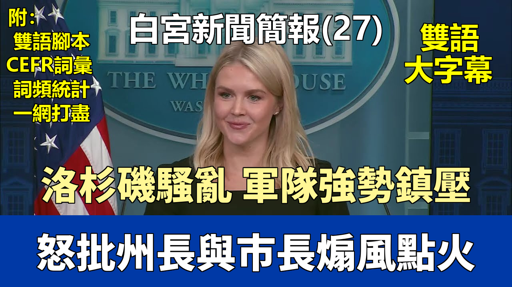

{% video youtube:3MYm2XzvrM4 width:100% autoplay:0 %}


### 【中英文双语脚本】

Good afternoon, everyone.
大家下午好。
President Trump's powerful efforts to secure our homeland are working.
特朗普總統爲保衛我們國土所做的強有力努力正在奏效。
According to newly released numbers, last month Border Patrol saw a 93% decrease of illegal aliens crossing the southwest border between ports of entry
根據最新公佈的數字，上個月邊境巡邏隊在入境口岸之間發現的穿越西南邊境的非法外國人數量減少了93%，
from May 2024 under Joe Biden, when they encountered more than 117,000 illegal aliens.
相比於喬·拜登執政下的2024年5月，當時他們遇到了超過117,000名非法外國人。
And this particular statistic is absolutely astounding.
這個數據絕對是驚人的。
In the month of May, under the Trump administration, zero illegal aliens were released into our country by Border Patrol.
在5月份，特朗普政府治下，邊境巡邏隊沒有釋放任何一名非法外國人進入我們的國家。
Let me say that again. Not a single illegal alien was released into the interior of the United States of America last month under this administration.
我再說一遍。上個月，在本屆政府的領導下，沒有一個非法外國人被釋放到美利堅合衆國的內陸。
Let's contrast that to Joe Biden's failed leadership,
讓我們將其與喬·拜登的失敗領導進行對比，
where immigration officers were wasting their finite time and resources processing dangerous illegal aliens for release into the United States.
當時移民官員正浪費着他們有限的時間和資源，處理危險的非法外國人並將其釋放到美國。
President Trump immediately terminated that reckless Biden-era practice that undermined the rule of law, jeopardized public safety and our national security,
特朗普總統立即終止了拜登時代的魯莽做法，這種做法破壞了法治，危害了公共安全和我們的國家安全，
and diverted critical resources away from stopping deadly drugs and violent criminals from entering our country.
並且將關鍵資源從阻止致命毒品和暴力罪犯進入我們國家上移開。
That's the reason why not a single illegal alien was released into the interior of the United States in the month of May.
這就是爲什麼5月份沒有一個非法外國人被釋放到美國內陸的原因。
And as a result, we now have a border that is reaching unprecedented levels of operational success.
結果是，我們現在的邊境行動成功達到了前所未有的水平。
The efforts by President Trump to stop the illegal immigrant invasion and secure the border in this short amount of time
特朗普總統在如此短的時間內爲阻止非法移民入侵和確保邊境安全所做的努力，
represent one of the greatest achievements by a presidential administration in the history of our great country.
代表了我們偉大國家歷史上總統政府最偉大的成就之一。
With illegal entries being overwhelmingly halted,
隨着非法入境被絕大多數地制止，
the Trump administration is dramatically ramping up efforts to arrest and deport all of the millions of criminal illegal aliens
特朗普政府正大力加強努力，逮捕並驅逐所有數百萬
that Joe Biden let into our country over the past four years.
喬·拜登在過去四年裏放進我們國家的犯罪非法外國人。
President Trump has directed all of our ICE officers to do everything in their power to carry out the single largest mass deportation operation in history.
特朗普總統已指示我們所有的移民及海關執法局（ICE）官員，盡其所能執行歷史上最大規模的集體驅逐行動。
Illegal criminals who are hiding in America's largest so-called sanctuary cities will be increasingly targeted for removal.
藏匿於美國最大的所謂“庇護城市”的非法罪犯將越來越多地成爲被清除的目標。
Radical Democrats will no longer be allowed to shelter illegals who threaten public safety as part of their cynical efforts to expand political power,
激進的民主黨人將不再被允許庇護威脅公共安全的非法移民，這曾是他們擴大政治權力、
drain the American taxpayer, and artificially lower wages and steal American jobs.
耗盡美國納稅人錢財、人爲壓低工資和竊取美國人就業機會的犬儒主義手段的一部分。
ICE officers are courageous heroes, upholding the rule of law and keeping our citizens safe.
ICE官員是勇敢的英雄，他們維護法治，保護我們公民的安全。
And they have the full and unwavering support of this president.
他們得到了這位總統的全力和堅定不移的支持。
In economic news, President Trump's pro-growth agenda is delivering for the American worker.
在經濟新聞方面，特朗普總統的促增長議程正在爲美國工人帶來成果。
Through the first five months of the Trump administration, real blue-collar wages are up nearly 2%.
在特朗普政府執政的頭五個月裏，藍領工人的實際工資上漲了近2%。
It's the strongest growth in nearly 60 years and a stark contrast from the negative wage growth seen during the first five months of the Biden administration.
這是近60年來最強勁的增長，與拜登政府執政頭五個月出現的負工資增長形成鮮明對比。
America is quickly returning to the successful formula of the first Trump administration: low inflation and rising wages.
美國正在迅速回歸首次特朗普政府的成功模式：低通脹和上漲的工資。
Once the big, big, beautiful bill is passed, this positive trend will only accelerate.
一旦這項偉大、巨大、美好的法案通過，這種積極趨勢只會加速。
Senate Republicans are continuing to push this critical legislation forward.
參議院共和黨人正在繼續推動這項關鍵立法。
The one big, beautiful bill will drive growth and supercharge the American economy.
這項偉大、美好的法案將推動增長，爲美國經濟注入強大動力。
The Council of Economic Advisers found that the one big, beautiful bill will raise take-home pay by nearly $14,000 per year for the average family of four.
經濟顧問委員會發現，這項偉大、美好的法案將使一個普通四口之家的年實得工資增加近14000美元。
The CEA also found that the one big, beautiful bill will increase wages as much as $11,000 for the average worker in America.
經濟顧問委員會還發現，這項偉大、美好的法案將爲美國普通工人增加高達11000美元的工資。
The one big, beautiful bill expands the child tax credit and makes it permanent for more than 40 million families with children.
這項偉大、美好的法案擴大了兒童稅收抵免，並使其對超過4000萬有子女的家庭永久有效。
And the bill will deliver no tax on tips, no tax on overtime and substantial tax cuts for our incredible seniors.
該法案還將實現小費免稅、加班費免稅，併爲我們了不起的老年人提供大幅減稅。
Simply put, the one big, beautiful bill is a massive win for middle-class Americans.
簡而言之，這項偉大、美好的法案對美國中產階級來說是一個巨大的勝利。
When nearly 80 million Americans sent President Trump back to this White House, they were doing so expecting these popular policies to be enacted.
當近8000萬美國人將特朗普總統送回白宮時，他們期望這些受歡迎的政策能夠得以實施。
Republicans in Congress have a mandate to deliver, and President Trump demands they send this historic bill to his desk for signature by Independence Day, July 4th.
國會中的共和黨人有責任實現這一目標，特朗普總統要求他們在這項歷史性法案在獨立日（7月4日）前送到他的辦公桌上籤署。
The American people are fully behind President Trump. According to brand new polling from Insider Advantage, a clear 54% majority of Americans approve of the job President Trump is doing.
美國人民完全支持特朗普總統。根據Insider Advantage的全新民調，高達54%的美國人明確認可特朗普總統的工作表現。
That's because this President is keeping his promises and taking action every day to improve their lives.
那是因爲這位總統信守承諾，每天都採取行動改善他們的生活。
And passing this bill will help fulfill a number of President Trump's core campaign promises.
通過這項法案將有助於實現特朗普總統多項核心競選承諾。
Now, regarding the ongoing situation in Iran, I know there has been a lot of speculation amongst all of you in the media
現在，關於伊朗的當前局勢，我知道媒體界的各位有很多猜測，
regarding the President's decision making and whether or not the United States will be directly involved.
關於總統的決策以及美國是否會直接介入。
In light of that news, I have a message directly from the President, and I quote,
鑑於這一消息，我有一條直接來自總統的信息，我引用如下：
"Based on the fact that there's a substantial chance of negotiations that may or may not take place with Iran in the near future,
“基於在不久的將來與伊朗可能或不可能進行談判的可能性很大這一事實，
I will make my decision whether or not to go within the next two weeks."
我將在未來兩週內決定是否採取行動。”
That's a quote directly from the President for all of you today.
這是今天總統直接給你們大家的一段話。
So we'll kick it off for questions here in our new media seat.
那麼我們就在我們的新媒體席位開始提問環節。
We have Eli Lake from the Free Press. Eli, go ahead.
我們有來自《自由報》的伊萊·萊克。伊萊，請講。
Thanks so much for having us.
非常感謝邀請我們。
Thank you.
謝謝你。
I have a question about the decision to extend the, I guess, delay in enforcing the TikTok ban.
我有一個關於決定延長，我猜是，推遲執行TikTok禁令的問題。
Sure.
當然。
Can you talk about how the White House understands its constitutional authority in light of the Supreme Court's decision in January that said that the President had to enforce the ban?
您能談談在最高法院一月份裁定總統必須執行該禁令的背景下，白宮如何理解其憲法權力嗎？
Sure. Well, as all of you know, because the President put it out on his Truth Social today,
當然。嗯，正如你們都知道的，因爲總統今天在他的“真實社交”上發佈了消息，
he did sign an executive order to extend the TikTok ban for 90 days, in the effort to make a deal.
他確實簽署了一項行政命令，將TikTok禁令延長90天，以努力達成一項協議。
And the White House counsel and the Department of Justice have reviewed this executive order, and I can get it for you.
白宮法律顧問和司法部已經審查了這項行政命令，我可以拿給你們。
I think it's on our website by now. If it's not, my team will now put it up immediately.
我想現在它應該在我們的網站上了。如果還沒有，我的團隊會立即把它放上去。
And you can read the language in that executive order.
你們可以閱讀該行政命令中的措辭。
And the White House counsel's office and the Department of Justice strongly believe in the legal rationale for this executive order.
白宮法律顧問辦公室和司法部堅信這項行政命令的法律依據。
They wouldn't have the President's pen hit it if they didn't.
如果他們不相信，就不會讓總統簽署。
And the political reasoning for this, of course, is because the President made a promise to keep TikTok on.
當然，這背後的政治原因是總統曾承諾讓TikTok繼續運營。
There are 100 million Americans who use this app. It's wildly popular.
有1億美國人使用這個應用程序。它非常受歡迎。
He also wants to protect Americans' data and privacy concerns on this app, and he believes we can do both things at the same time.
他還想保護美國人在這個應用上的數據和隱私問題，他相信我們可以同時做到這兩件事。
So he's making an extension so we can get this deal done.
所以他正在進行延期，以便我們能完成這筆交易。
Can I get a follow-up?
我可以追問一個問題嗎？
Sure.
當然。
A few weeks ago, Tucker Carlson reported on a meeting between the President, Mark Levin, and others at the White House.
幾周前，塔克·卡爾森報道了總統、馬克·萊文和白宮其他一些人之間的一次會議。
Is there a leak investigation? Can you say who else was in that meeting?
是否有泄密調查？您能說出會議中還有誰嗎？
I'm not aware of a leak investigation at this time.
我目前不知道有任何泄密調查。
I, for one, do not reveal details about the President's private meetings without his permission to do so.
就我個人而言，未經總統許可，我不會透露他私人會議的細節。
But certainly the President does not like when people leak. He takes that very seriously.
但總統當然不喜歡有人泄密。他對此非常重視。
This entire administration takes that seriously.
整個政府都非常重視這件事。
And that's why you've seen at agencies some of the Cabinet secretaries have been given the authority by the President to let go of staff who are engaged in such leaks,
這就是爲什麼你會看到，在一些機構，一些內閣部長已被總統授權解僱參與此類泄密的員工，
especially those that risk American national security.
特別是那些危及美國國家安全的泄密行爲。
Sure. Go ahead.
當然。請講。
Caroline, thank you. So, RINO war-monger Lindsey Graham, who recently called on the U.S. to go all in.
卡羅琳，謝謝你。那麼，關於名義上的共和黨人、戰爭販子林賽·格雷厄姆，他最近呼籲美國全力以赴。
That's quite the lead to a question.
這真是一個不同尋常的提問前奏。
What's your message to everyday Trump supporters?
你對普通的特朗普支持者有什麼信息？
Not the Tucker Carlsons or other big names, but everyday Trump supporters, grassroots,
不是塔克·卡爾森或其他大人物，而是普通的、草根的特朗普支持者，
who voted for President Trump to stop the wars, rejected this in the primary by voting against Nikki Haley, and want to see non-U.S. involvement in this war.
他們投票給特朗普總統是爲了停止戰爭，在初選中投票反對妮基·黑利以拒絕這種做法，並希望看到美國不介入這場戰爭。
What's your message?
你有什麼信息要傳達？
Trust in President Trump.
相信特朗普總統。
President Trump has incredible instincts, and President Trump kept America and the world safe in his first term as president
特朗普總統有令人難以置信的直覺，並且在他作爲總統的第一個任期內，
by implementing a peace-through-strength foreign policy agenda.
通過實施“以實力求和平”的外交政策議程，確保了美國和世界的安全。
And with respect to Iran, nobody should be surprised by the president's position that Iran absolutely cannot obtain a nuclear weapon.
關於伊朗問題，任何人都不應對總統關於伊朗絕對不能獲得核武器的立場感到驚訝。
He's been unequivocally clear about this for decades, not just as president, not just as a presidential candidate, but also as a private citizen.
幾十年來，他對此的立場都毫不含糊，不僅僅是作爲總統、總統候選人，也作爲一名普通公民。
In fact, I have some quotes for you. In 2011, President Trump said America's primary goal with Iran must be to destroy its nuclear ambitions.
事實上，我有一些引述給你。2011年，特朗普總統說，美國對伊朗的首要目標必須是摧毀其核野心。
We cannot allow this radical regime to acquire a nuclear weapon that they will either use or hand off to terrorists.
我們不能允許這個激進政權獲得核武器，他們要麼會使用，要麼會交給恐怖分子。
In 2015, the president said the problem is that Iran poses an existential threat to Israel, our Middle Eastern allies, and the United States.
2015年，總統說，問題在於伊朗對以色列、我們的中東盟友和美國構成了生存威脅。
And of course, the president has repeated that in his first term as president and his second term as president as well.
當然，總統在他的第一個和第二個總統任期內都重申了這一點。
That's why he was adamantly opposed to the disastrous Iranian nuclear agreement that was implemented by President Obama.
這就是爲什麼他堅決反對奧巴馬總統實施的災難性的伊朗核協議。
And it's why he has given great latitude and given a lot of effort to achieving a diplomatic solution.
這也是爲什麼他給予了極大的自主權並付出了大量努力以達成外交解決方案。
But he's been very clear. Iran went for 60 days when he gave them that 60-day warning without coming to the table.
但他一直非常明確。當他給伊朗60天警告時，伊朗在那60天裏沒有回到談判桌前。
On day 61, Israel took action against Iran. And as I just told you from the president directly, he will make a decision within two weeks.
第61天，以色列對伊朗採取了行動。正如我剛纔直接從總統那裏告訴你們的，他將在兩週內做出決定。
A follow-up?
要追問嗎？
Sure. Go ahead, Natalie.
當然。請講，娜塔莉。
Thanks, Caroline. Can you confirm whether Steve Witkoff has been in touch with the Iranian foreign minister?
謝謝，卡羅琳。你能否確認史蒂夫·威特科夫是否與伊朗外交部長有過接觸？
And does Witkoff plan to go to Geneva tomorrow for talks?
威特科夫計劃明天去日內瓦會談嗎？
I am not tracking that on Mr. Witkoff's travel schedule, but I can certainly check in with him to be sure.
我沒有追蹤威特科夫先生的旅行日程，但我肯定會向他覈實以確認。
As for correspondence between the United States and the Iranians, I can confirm that correspondence has continued.
至於美國和伊朗人之間的信函往來，我可以確認信函往來仍在繼續。
As you know, we were engaged with six rounds of negotiations with them in both indirect and direct ways.
如你所知，我們以間接和直接的方式與他們進行了六輪談判。
Thanks, Caroline. Just to clarify the president's statement just now, when he says that he'll make a decision in the next two weeks,
謝謝，卡羅琳。只是爲了澄清一下總統剛纔的聲明，當他說他將在未來兩週內做出決定時，
is he saying that if Iran does not come back to the negotiating table within the next two weeks that the president will strike?
他是否是說如果伊朗在未來兩週內不回到談判桌前，總統就會發動攻擊？
The president is saying that he will make a decision whether or not to go within the next two weeks. It's very clear and direct.
總統是說他將在未來兩週內決定是否採取行動。這非常清晰和直接。
And is he seeing any signs of progress? He obviously is holding out hope for negotiations,
他看到任何進展的跡象了嗎？他顯然對談判抱有希望，
but is he seeing any inklings of progress that give him that hope that talks are still possible?
但他是否看到任何一絲進展的跡象，讓他抱有談判仍有可能的希望？
Well, that's why he said in the statement that I just read for all of you,
嗯，這就是爲什麼他在我剛纔爲你們大家宣讀的聲明中說，
"based on the fact that there's a substantial chance of negotiations that may or may not take place with Iran in the near future,"
“基於在不久的將來與伊朗可能或不可能進行談判的可能性很大這一事實，”
he will make that decision within the next two weeks.
他將在未來兩週內做出那個決定。
What makes him think there's still a substantial chance, is my question.
我的問題是，是什麼讓他認爲仍然有很大的機會。
I'm not going to get into the reasoning and the rationale. The president believes that, but that's his position, and he will make a decision within the next two weeks.
我不會深入探討其推理和理據。總統相信這一點，但那是他的立場，他將在未來兩週內做出決定。
Caroline. Thanks, Caroline. President Trump has said previously in regard to Russia, he's used this phrase about two weeks several times,
卡羅琳。謝謝，卡羅琳。特朗普總統之前在談到俄羅斯時，曾多次使用“大約兩週”這個說法，
in terms of, "we expect a two week deadline," and then you give another two week deadline.
比如“我們預計有兩週的最後期限”，然後你又給出了另一個兩週的期限。
How can we be sure that he's going to stick to this one on making a decision on Iran?
我們如何能確定他在伊朗問題上會遵守這次的決定？
Well, in those deadlines, as you've seen in respect to Russia-Ukraine, might I add, these are two very different complicated global conflicts,
嗯，在那些最後期限裏，正如你在俄羅斯-烏克蘭問題上所看到的，我補充一句，這是兩個非常不同且複雜的全球衝突，
as you know, that the president inherited from our previous incompetent president and the weakness of the previous administration.
如你所知，這是總統從我們無能的前任總統和前屆政府的軟弱中繼承下來的。
And the president has spent a tremendous amount of time and effort cleaning up these crises
總統花費了大量的時間和精力來清理這些危機，
that were caused by the last administration's just complete dereliction of duty on the world stage and American weakness.
這些危機是上屆政府在世界舞臺上完全失職和美國軟弱所造成的。
Now we have American strength again with respect to Russia and Ukraine because of that American strength and the president's leadership.
現在，由於美國的實力和總統的領導，我們在俄羅斯和烏克蘭問題上再次擁有了美國的力量。
We have seen these two sides engage in direct negotiations.
我們已經看到雙方進行了直接談判。
And the last time the president said two weeks, you saw Russia and Ukraine have direct negotiations for the first time in years.
而上一次總統說兩週時，你看到俄羅斯和烏克蘭進行了多年來的首次直接談判。
And so the president is always interested in a diplomatic solution to the problems in the global conflicts in this world.
因此，總統總是對通過外交途徑解決這個世界上的全球衝突問題感興趣。
Again, he is a peacemaker in chief. He is the peace through strength president.
再次強調，他是首席和平締造者。他是以實力求和平的總統。
And so if there's a chance for diplomacy, the president's always going to grab it, but he's not afraid to use strength as well.
所以，如果有外交的機會，總統總會抓住它，但他也不怕使用武力。
Francesca.
弗朗西斯卡。
Thanks, Caroline. What exactly would a deal with Iran need to entail?
謝謝，卡羅琳。與伊朗的協議具體需要包含什麼？
No enrichment of uranium. Iran is absolutely not able to achieve a nuclear weapon.
不進行鈾濃縮。伊朗絕對不能獲得核武器。
The president has been very clear about that.
總統對此已經說得非常清楚了。
And by the way, the deal that Special Envoy Witkoff proposed to the Iranians was both realistic and acceptable within its terms.
順便說一句，特使威特科夫向伊朗人提議的協議在其條款上既現實又可接受。
And that's why the president has sent that deal to them.
這就是爲什麼總統把那份協議發給了他們。
To follow up on what you told Natalie, are the talks that the United States is currently having with Iran direct or are those through intermediaries?
接着你對娜塔莉說的話追問一下，美國目前與伊朗的會談是直接的還是通過中介進行的？
And if so, which countries are acting as the intermediary right now?
如果是的話，現在是哪些國家在充當中介？
Out of respect for the ongoing discussions and negotiations, I'm not going to get into the details of them. We've provided you confirmation for now.
出於對正在進行的討論和談判的尊重，我不會透露細節。我們目前已向您提供了確認信息。
Go ahead.
請講。
Sure. And then behind you, too.
好的。然後是你後面的那位。
Thanks. Sorry.
謝謝。抱歉。
On the topic of negotiations and talks, does the president have any hopes or specific expectations for the talks tomorrow between European foreign secretaries and their Iranian counterpart?
關於談判和會談的話題，總統對明天歐洲各國外交部長與他們的伊朗同行之間的會談有任何希望或具體期望嗎？
Well, certainly the entire world is on the president's side when it comes to the fact that Iran cannot obtain a nuclear weapon.
當然，在伊朗不能獲得核武器這一事實上，全世界都站在總統這一邊。
This is something that pretty much all of humanity, except for the Iranian terrorist regime themselves, agree upon.
除了伊朗恐怖政權自己，幾乎全人類都同意這一點。
And so the president expects that Europe will deliver that message directly to the Iranians.
因此，總統期望歐洲會直接向伊朗人傳達這一信息。
Why does President Trump believe that this 90-day extension on TikTok will provide more runway, perhaps than the previous extensions that haven't led to a divestment deal?
爲什麼特朗普總統相信這次對TikTok的90天延期會提供更多的運作空間，或許比以往那些未能達成剝離協議的延期更有效果？
Because it's more time, more time to make a good deal.
因爲時間更充裕，有更多時間來達成一個好交易。
Dasha.
達莎。
Thank you so much. I know things are going day by day right now. The president wants maximum optionality.
非常感謝。我知道現在情況瞬息萬變。總統希望擁有最大的選擇權。
Is the possibility of the U.S. getting involved in regime change in Iran at all on the table at this point?
目前，美國介入伊朗政權更迭的可能性是否在討論之列？
Sure. The president's top priority right now is ensuring that Iran cannot obtain a nuclear weapon and providing peace and stability in the Middle East.
當然。總統目前的首要任務是確保伊朗無法獲得核武器，並在中東地區實現和平與穩定。
And on Medicaid, Caroline, the Senate put forward Medicaid provisions, particularly a lower cap on state provider taxes
關於醫療補助計劃（Medicaid），卡羅琳，參議院提出了相關條款，特別是降低了州級提供商稅的上限，
that hospitals have said would lead to mass closures, particularly in rural communities.
醫院方面表示這將導致大規模倒閉，尤其是在農村社區。
Is the president willing to sign a bill that includes those provisions that Republicans, senators like Josh Hawley say will lead to hospital closures?
總統是否願意簽署一項包含共和黨人、像喬什·霍利這樣的參議員所說的將導致醫院倒閉的條款的法案？
Out of respect for the ongoing discussions that the White House is very much actively involved in with our friends in the United States Senate, I won't comment on that specific provision.
出於對白宮正與我們在美國參議院的朋友們積極進行的討論的尊重，我不會對該具體條款發表評論。
Look, the bill hasn't been sent to the president's desk yet. There's more room for change.
看，法案還沒有送到總統的辦公桌上。還有改變的空間。
The president, for one, I will reiterate, has been very clear on his priorities with respect to Medicaid.
首先，我重申，總統在醫療補助計劃方面的優先事項非常明確。
He wants to see waste, fraud and abuse ridded from the system to protect it for taxpaying citizens who deserve those much needed benefits.
他希望看到系統中的浪費、欺詐和濫用被清除，以保護那些應得這些急需福利的納稅公民。
He wants to prioritize the sick, the needy, the poor in this country who deserve those benefits, not the 1.4 million illegal aliens who are receiving them.
他想優先考慮這個國家中那些應得福利的病人、窮人和有需要的人，而不是那140萬正在領取福利的非法外國人。
And he wants to make sure this one big, beautiful bill kicks those illegal aliens off of this program to preserve it and protect it and strengthen it for the American people.
他希望確保這項偉大、美好的法案將那些非法外國人從這個項目中剔除，從而爲美國人民保留、保護並加強它。
And the president has been very clear in that message to his friends in the Senate. Jackie.
總統在給參議院朋友們的信息中已經非常清楚地表達了這一點。傑基。
Thank you, Caroline. Logistically, if the Iranians are getting to Geneva, does that mean they've found a way to get to the White House?
謝謝你，卡羅琳。從邏輯上講，如果伊朗人能到日內瓦，這是否意味着他們已經找到了去白宮的途徑？
I am not going to get into hypotheticals, but as you heard from the president yesterday, they have expressed interest in doing so.
我不會進行假設，但正如你昨天從總統那裏聽到的，他們已經表示有興趣這樣做。
There's a lot of pressure on the president to come to the aid of Israel. There's a lot of pressure on him to finish the job with force.
總統面臨着巨大的壓力，要求他援助以色列。他面臨着巨大的壓力，要求他用武力完成任務。
How is he balancing the concern that if he doesn't choose to do that, that it would send a message to Xi Jinping about the U.S. commitment to Taiwan?
他如何平衡這種擔憂：如果他不選擇那樣做，可能會向習近平傳遞關於美國對臺灣承諾的信號？
Well, the president enjoys a very respectful and cordial relationship with China's president. He has long maintained that, even in his first term.
嗯，總統與中國主席保持着非常尊重和友好的關係。他長期以來一直保持着這種關係，甚至在他的第一個任期內也是如此。
And China and the United States share many strategic interests, both in terms of economics and also, of course, global affairs and foreign policy as well.
中國和美國在經濟、當然還有全球事務和外交政策方面，都有許多共同的戰略利益。
However, when it comes to balancing these different viewpoints, the president is balancing a lot of viewpoints.
然而，在平衡這些不同觀點時，總統正在平衡許多觀點。
And he is listening not just to other world leaders, but to his advisors and to people here in the country and the American people, too.
他不僅在傾聽其他世界領導人的意見，也在傾聽他的顧問、國內民衆以及美國人民的意見。
And I think that's what makes this president such a great leader is his ability to listen and make a good decision on behalf of the American public
我認爲，正是這種傾聽並基於其直覺和經驗代表美國公衆做出正確決策的能力，
based on his instincts and his experience.
使這位總統成爲如此偉大的領導者。
Don't forget, this is a president who was here before and the world was a much more peaceful and stable place when he left office
別忘了，這位總統以前就在這裏，他離任時世界比他經過過去四年
than when he came back in after the past four years of complete incompetence by the previous president.
前任總統完全無能之後回來時要和平穩定得多。
Philip, go ahead.
菲利普，請講。
Thank you, Caroline. Two quick questions. The president says Iran is very close to a nuclear weapon.
謝謝你，卡羅琳。兩個簡單的問題。總統說伊朗非常接近擁有核武器。
Is he relying on U.S. intelligence or intelligence sharing from an ally to make that assessment?
他做出這一評估是依賴於美國情報還是盟友的情報共享？
It is a fact, and the United States government maintains this fact, that Iran has never been closer to obtaining a nuclear weapon.
這是一個事實，美國政府也堅持這一事實，即伊朗從未如此接近獲得核武器。
And then if the U.S. were to take some type of military action, would the president go to Congress to seek a war authorization?
那麼，如果美國採取某種軍事行動，總統會去國會尋求戰爭授權嗎？
I'm not going to engage in hypotheticals. I gave you the statement from the president. He'll make a decision within two weeks.
我不會進行假設。我給了你們總統的聲明。他將在兩週內做出決定。
Thank you, Caroline.
謝謝你，卡羅琳。
Sure. Go ahead. Mary and then Elizabeth.
當然。請講。瑪麗，然後是伊麗莎白。
Two questions, one on Iran and then the second on something Jasmine Crockett said this morning.
兩個問題，一個關於伊朗，第二個關於賈斯敏·克羅克特今天早上說的一些話。
So given that we know the Iranian government did order an operative to assassinate the president, is there concern that Iran might respond with non-traditional military ways to some kind of strike on Iran, such as another assassination attempt?
既然我們知道伊朗政府確實下令一名特工暗殺總統，那麼是否擔心伊朗可能會以非傳統軍事方式迴應某種對伊朗的打擊，例如再次嘗試暗殺？
And has the Department of Justice looked into this last attempt on the president's life?
司法部是否調查了最近這次對總統生命的企圖？
I believe Secret Service and the FBI have looked into the two assassination attempts that took place against the president, both of which were sad days in our nation's history.
我相信特勤局和聯邦調查局已經調查了針對總統的兩起暗殺企圖，這兩起事件都是我們國家歷史上的悲傷日子。
So I would defer you to the Department of Justice on where those investigations stand.
所以關於那些調查的進展，我會請你向司法部諮詢。
But as for your question regarding Iranian retaliation, I'm not going to engage in hypotheticals again,
但至於你關於伊朗報復的問題，我不會再進行假設，
but I can assure the American public and the world that this administration is prepared and ready to defend American interests and assets, not just in the region, but here on our homeland as well.
但我可以向美國公衆和全世界保證，本屆政府已準備就緒，隨時捍衛美國的利益和資產，不僅在該地區，也在我們的本土。
Thank you. Elizabeth.
謝謝。伊麗莎白。
And then really quick on Jasmine Crockett. She said that Trump supporters are mentally ill before calling for bipartisan support against the president.
然後很快地談談賈斯敏·克羅克特。她說特朗普的支持者有精神病，之後又呼籲兩黨合作反對總統。
Can you respond to that, especially considering she's a rising star in the Democrat Party right now?
你能迴應一下嗎，特別是考慮到她現在是民主黨的一顆新星？
She is a rising star. It's quite something to behold, actually.
她確實是一顆新星。說實話，這真是難得一見。
I hope that she continues to be a rising star for the Republican Party, at least.
我希望她至少能繼續成爲共和黨的新星。
I think it's incredibly derogatory to accuse nearly 80 million Americans of mental illness.
我認爲指控近8000萬美國人有精神病是極其貶損的。
The last time I checked, Jasmine Crockett couldn't dream of winning such a majority of the public as President Trump did.
我上次查的時候，賈斯敏·克羅克特做夢也想不到能像特朗普總統那樣贏得如此多的公衆支持。
And the America First movement, which President Trump has built, is filled with hardworking patriots, the forgotten men and women, business owners, law enforcement officers, nurses and teachers,
而特朗普總統建立的“美國優先”運動，充滿了辛勤工作的愛國者、被遺忘的男男女女、企業主、執法人員、護士和教師，
and middle America, as we all know, from where you all grew up outside of this beltway.
以及我們都知道的中部美國，也就是你們大家在這個“環城公路”之外長大的地方。
That's who makes up this president's movement. And Jasmine Crockett should go to a Trump rally sometime and she can see it for herself.
這些人構成了這位總統的運動。賈斯敏·克羅克特應該什麼時候去一次特朗普的集會，親眼看看。
Jennifer. One on North Korea and one on China.
詹妮弗。一個關於朝鮮，一個關於中國。
On North Korea, they launched some rockets into the ocean today. What does the White House make of that? Do you read any meaning into the timing of that launch?
關於朝鮮，他們今天向海裏發射了一些火箭。白宮對此有何看法？你認爲這次發射的時機有什麼特殊含義嗎？
And then on China, do you have any reaction to Xi Jinping's offer of intervening in Iran diplomatically?
然後關於中國，你對習近平提出在伊朗問題上進行外交干預的提議有何反應？
And are you seeing any signs that China would get involved militarily to support Iran?
你看到任何跡象表明中國會軍事介入以支持伊朗嗎？
I don't believe we're seeing any signs of that at this moment in time.
我認爲我們目前沒有看到任何這樣的跡象。
As for Xi Jinping's offer, I will leave it to the President to respond to that himself.
至於習近平的提議，我將留給總統親自迴應。
As for your question about North Korea, we are monitoring the situation.
至於你關於朝鮮的問題，我們正在監控局勢。
The Trump administration is in close contact with our new South Korean counterparts as we work together to deter our adversaries and preserve a free and open Indo-Pacific.
特朗普政府正與我們新的韓國同行保持密切聯繫，共同努力威懾我們的對手，維護一個自由開放的印度-太平洋地區。
And no matter where, our adversaries and our allies alike know that President Trump will not tolerate threats against our interests on his watch, even as he works to resolve the wars that he inherited.
無論在哪裏，我們的對手和盟友都清楚，特朗普總統在他任內絕不容忍對我們利益的威脅，即便他正在努力解決他所繼承的戰爭。
Alex, go ahead and then I'll come to you.
亞歷克斯，請講，然後我再叫你。
Thank you. Is the President concerned about the economy if farms and hotels, et cetera, struggle to find workers?
謝謝。如果農場、酒店等行業難以找到工人，總統是否會擔心經濟？
The President is always concerned about the economy. That's on his mind every day.
總統總是關心經濟。這是他每天都在想的事情。
He wakes up, he checks the markets, he checks wage growth, as I pointed out.
他醒來後會查看市場，查看工資增長，正如我所指出的。
It's a record high today for middle-class and American workers.
今天，中產階級和美國工人的（工資增長）創下了歷史新高。
So the President is always wanting to ensure that we have a strong and robust economy for the American people and workers.
所以總統總是希望確保我們爲美國人民和工人擁有一個強大而穩健的經濟。
And we do.
我們也確實如此。
As for the specific concerns regarding jobs, look, the President has made it very clear we need to remove public safety threats from the interior of our country.
至於關於就業的具體擔憂，看，總統已經非常明確地表示，我們需要從我們國家內部清除公共安全威脅。
And that remains the focus and the priority of this administration when it comes to deportations.
在驅逐出境方面，這仍然是本屆政府的重點和優先事項。
No matter where somebody works, if they're an illegal alien rapist or murderer that was allowed into this country in the past four years by the previous administration,
無論某人在哪裏工作，如果他們是在過去四年裏被上屆政府允許進入這個國家的非法外籍強姦犯或殺人犯，
the American people want those types of criminals to be deported from our country.
美國人民希望將這類罪犯驅逐出我們的國家。
And that's what the President is backing ICE to do.
這就是總統支持移民及海關執法局（ICE）要做的事情。
Thanks.
謝謝。
There was an apparent skirmish between the Chinese and the Philippines in the South China Sea.
在南中國海，中國和菲律賓之間顯然發生了一場小規模衝突。
Just curious if you had any reaction to that and if the steps you're taking towards the Middle East right now are reducing your capacity to deal with that situation.
只是好奇您對此有何反應，以及您目前在中東採取的措施是否削弱了您處理該局勢的能力。
I believe that happened as I was preparing and coming out here. So we'll get you a response to that.
我相信那是在我準備出來的時候發生的。所以我們會給你一個迴應。
Certainly we have one and our teams are always monitoring situations all around the globe.
當然我們有迴應，我們的團隊一直在全球範圍內監控各種情況。
Okay. And then one more just on Iran. Just over the past 24 hours, we've seen some Israeli strikes on Natanz, Isfahan and Fordow nuclear facilities.
好的。然後還有一個關於伊朗的問題。就在過去24小時內，我們看到以色列對納坦茲、伊斯法罕和福爾多核設施進行了一些打擊。
Is there any assessment just of how effective or what the result of those strikes will be?
對於這些打擊的效果或結果，有任何評估嗎？
What I can share is that the IDF in Israel, I think, have exceeded a lot of people's expectations in their ability to really hinder Iran's nuclear facilities,
我能分享的是，我認爲以色列國防軍在真正阻礙伊朗核設施方面的能力已經超出了很多人的預期，
but also they've taken out key people in the Iranian regime's leadership as well.
而且他們也除掉了伊朗政權領導層中的關鍵人物。
So this is something, of course, we are monitoring and watching every day.
所以這當然是我們每天都在監控和觀察的事情。
And the President was just in an intelligence briefing. He continues to be briefed by his National Security Council,
總統剛剛參加了一次情報簡報會。他將繼續聽取國家安全委員會的簡報，
and he will throughout the duration of this war and conflict.
並將在整個戰爭和衝突期間持續如此。
And he also remains in constant communication with our Israeli counterparts, most notably Prime Minister Benjamin Netanyahu. Kristen.
他還與我們的以色列同行，特別是總理本雅明·內塔尼亞胡保持着持續的溝通。克里斯汀。
Thank you, Caroline.
謝謝你，卡羅琳。
We have heard from a number of U.S. officials who say that Iran doesn't want to make a deal, but they are just stringing the United States along.
我們聽到許多美國官員說，伊朗不想達成協議，他們只是在拖延美國。
What is to say that they are not going to continue to do so if we continue to give them extensions, now another two weeks after the initial 60 days?
如果我們繼續給他們延期，現在在最初的60天之後又延長兩週，憑什麼說他們不會繼續這樣做呢？
Look, Iran is in a very weak and vulnerable position because of the strikes and the attacks from Israel.
看，由於以色列的打擊和攻擊，伊朗處於一個非常虛弱和脆弱的位置。
And with respect to the President's statement, I shared that with all of you. And he has been very direct and clear.
關於總統的聲明，我已經和大家分享了。他一直非常直接和明確。
Iran can and should make a deal. We sent a deal to them that was practical, that was realistic, or they will face grave consequences.
伊朗可以也應該達成協議。我們給他們發去了一份實際可行的協議，否則他們將面臨嚴重後果。
Why is Steve Witkoff not participating in the talks this week?
爲什麼史蒂夫·威特科夫本週不參加會談？
I can ask Mr. Witkoff why he is not.
我可以問問威特科夫先生爲什麼不參加。
Thanks, Caroline. Does the President object if Israel attempts its own operation against Fordow in the next two weeks?
謝謝，卡羅琳。如果以色列在未來兩週內嘗試對福爾多進行自己的行動，總統會反對嗎？
I won't decide that for the President, nor will I share that here. I'll let him speak to that.
我不會爲總統做決定，也不會在這裏分享。我會讓他自己說。
And then just another one. Iran is apparently warning Europeans that if it's struck by the U.S., it may withdraw from the Nuclear Non-Proliferation Treaty.
還有一個問題。伊朗顯然在警告歐洲人，如果它受到美國的打擊，它可能會退出《核不擴散條約》。
That would result in throwing out inspectors and taking the program dark. What does the President think of the value of having Iran as a full signatory of that treaty?
那將導致驅逐檢查員並使該計劃祕密進行。總統如何看待伊朗作爲該條約正式簽署國的價值？
Well, that's reckless rhetoric, but I understand the Europeans are meeting with the Iranians tomorrow. So we'll see how that meeting goes.
嗯，那是魯莽的言辭，但我知道歐洲人明天要和伊朗人會面。所以我們看看那次會議的結果如何。
Just one more on Juneteenth. Does the President plan to commemorate the holiday today? Or is there any comment on it?
還有一個關於六月節的問題。總統今天有計劃紀念這個節日嗎？或者對此有任何評論嗎？
I'm not tracking his signature on a proclamation today. I know this is a federal holiday.
我今天沒有追蹤到他簽署任何公告。我知道這是一個聯邦假日。
I want to thank all of you for showing up to work. We are certainly here. We're working 24/7 right now. Nikki, go ahead.
我想感謝大家來上班。我們肯定在這裏。我們現在是全天候工作。尼基，請講。
Actually, that was my question. Will he plan to mark Juneteenth in any way, either today or with an event later on, maybe next week?
其實，那正是我的問題。他有計劃以任何方式紀念六月節嗎，無論是今天還是下週晚些時候的活動？
Sure. I just answered that question for you. Go ahead.
當然。我剛剛回答了你的問題。請講。
Thank you very much, Caroline. The fact that this President is giving some time and space for diplomacy another two weeks,
非常感謝你，卡羅琳。這位總統願意爲外交再爭取兩週的時間和空間，
does it mean that the President is trying his best to avoid a direct conflict with Iran?
這是否意味着總統正盡力避免與伊朗發生直接衝突？
I think the President has made it clear he always wants to pursue diplomacy. But believe me, the President is unafraid to use strength if necessary.
我認爲總統已經明確表示他總是希望尋求外交途徑。但請相信我，總統在必要時毫不畏懼使用武力。
And Iran and the entire world should know that the United States military is the strongest and most lethal fighting force in the world,
伊朗和全世界都應該知道，美國軍隊是世界上最強大、最致命的戰鬥力量，
and we have capabilities that no other country on this planet possesses.
我們擁有這個星球上任何其他國家都不具備的能力。
Caroline. Good afternoon. The Supreme Court, as you know, has upheld Tennessee's ban on transgender medical procedures for minors, puberty blockers, hormone therapy, et cetera.
卡羅琳。下午好。如你所知，最高法院維持了田納西州對未成年人進行跨性別醫療程序、青春期阻斷劑、激素治療等的禁令。
The White House's reaction to that, please.
請問白宮對此有何反應。
That's a huge victory for America's children, and it's obviously something this administration believes strongly in,
這對美國的孩子們來說是一個巨大的勝利，很明顯，這是本屆政府堅信的，
that young minor children should not be allowed to be subjected to chemical castration and mutilation.
即不應允許未成年兒童遭受化學閹割和殘害。
The President himself has signed very strong executive orders on this,
總統本人已就此簽署了非常強有力的行政命令，
and we are grateful for Tennessee's efforts to protect our children, and we are grateful the Supreme Court ruled on the side of the law, but also on the side of protecting America's innocent children.
我們感謝田納西州爲保護我們的孩子所做的努力，也感謝最高法院站在法律一邊，同時也站在保護美國無辜兒童的一邊。
Elizabeth, go ahead. Sorry I skipped you earlier.
伊麗莎白，請講。抱歉我之前跳過了你。
Thank you so much. Secretary of State Marco Rubio announced new vetting procedures on student visas. Will this serve as a model for vetting other foreign visas?
非常感謝。國務卿馬可·盧比奧宣佈了針對學生簽證的新審查程序。這會成爲審查其他外國簽證的範例嗎？
For all foreign visas, yes.
是的，對所有外國簽證都適用。
As you know, the President signed an executive order, I think it was one of the first he signed in the first week, to strengthen our vetting requirements and our vetting system here in the United States.
如你所知，總統簽署了一項行政命令，我想這是他在第一週簽署的首批命令之一，旨在加強我們在美國的審查要求和審查系統。
For all visas, he directed the Secretary of State to do that.
對於所有簽證，他都指示國務卿這樣做。
There was a pause in some of that vetting, as you all know, recently, especially with respect to students from certain countries, but the vetting has continued and it's stronger than ever before.
正如你們都知道的，最近部分審查工作曾一度暫停，特別是對來自某些國家的學生，但審查已經繼續，並且比以往任何時候都更加嚴格。
As for specifics on how the vetting process has changed, I would defer you to the Department of State, as you know they're in charge of things like that.
至於審查流程具體如何改變，我會請您諮詢國務院，如您所知，他們負責此類事務。
Thank you.
謝謝你。
To what extent is this two-week delay with Iran the result of interventions by the likes of Tucker Carlson, Marjorie Taylor Greene, or the entreaties of European leaders who want a de-escalation?
這次與伊朗的兩週延遲，在多大程度上是由於塔克·卡爾森、瑪喬麗·泰勒·格林等人的干預，或是希望緩和局勢的歐洲領導人的懇求所致？
Look, the President hears all voices across the country and he makes decisions based on his instincts, and he has always said diplomacy is his first option.
聽着，總統聽取了全國各地的所有聲音，他根據自己的直覺做出決定，而且他一直說外交是他的首選。
And is he still planning to attend the NATO summit next week?
他下週還計劃參加北約峯會嗎？
He is, yes. We will be departing from Washington on Monday morning and hopefully we'll see some of you there. Ikela.
是的，他會去。我們週一早上將從華盛頓出發，希望能在那裏見到你們中的一些人。伊克拉。
Oil prices have been spiking over the last week. Is the President watching the oil market and is that factoring into his decision making in the Middle East?
上週油價一直在飆升。總統是否在關注石油市場，這是否影響了他在中東的決策？
Again, as I said to Alex's question previously, the President is always watching
再次，正如我之前回答亞歷克斯問題時所說，總統一直在關注，
and this administration is doing more than any in history to bring oil prices and gas prices here at home down for the American public.
而本屆政府在爲美國民衆降低國內油價和汽油價格方面所做的工作比歷史上任何一屆都多。
They have been plummeting since President Trump's inauguration because of the executive action and the federal action this administration has taken on the home front.
自特朗普總統就職以來，由於本屆政府在國內採取的行政和聯邦行動，油價一直在暴跌。
But yes, of course he's paying attention and monitoring that.
但是，是的，他當然在關注和監控此事。
But as for whether it's weighing into his decision, there are a number of factors that of course are, and as I said, he will make that decision in the next two weeks.
但至於這是否影響他的決定，當然有很多因素在起作用，正如我所說，他將在未來兩週內做出決定。
Can't reiterate that enough. Weijia.
這一點怎麼強調都不過分。魏嘉。
Caroline, thank you. With regard to a potential deal, Iran has said it will not negotiate under duress.
卡羅琳，謝謝你。關於一項潛在的協議，伊朗表示不會在脅迫下談判。
Does the President believe there should be a ceasefire in these next two weeks as the U.S. tries to broker a deal?
總統是否認爲，在美國試圖促成協議的未來兩週內，應該實現停火？
That's not what he said in the statement he dictated to me, so I won't get ahead of the President or add anything additional to the statement that he gave me the liberty to share with all of you.
他口述給我的聲明裏不是這麼說的，所以我不會超越總統，也不會在他授權我與大家分享的聲明之外添加任何額外內容。
And then just to follow up on how close Iran is to a nuclear weapon, can you clarify when the President said a few weeks away,
然後，就伊朗距離核武器有多近的問題跟進一下，您能澄清一下當總統說“幾周之遙”時，
did he mean obtaining enough enriched uranium to start building a weapon or did he mean Iran is a few weeks away from completing the production of a weapon?
他指的是獲得足夠用於開始製造武器的濃縮鈾，還是指伊朗距離完成武器生產還有幾周時間？
I'm glad you asked that, Weijia. It's an important question and it's one, frankly, the media has been getting wrong.
很高興你問這個問題，魏嘉。這是一個重要的問題，坦率地說，也是媒體一直搞錯的問題。
Let's be very clear. Iran has all that it needs to achieve a nuclear weapon.
讓我們說清楚。伊朗擁有製造核武器所需的一切。
All they need is a decision from the Supreme Leader to do that. And it would take a couple of weeks to complete the production of that weapon,
他們所需要的只是最高領袖做出決定。而完成該武器的生產需要幾周時間，
which would of course pose an existential threat not just to Israel but to the United States and to the entire world.
這當然不僅對以色列，也對美國和整個世界構成生存威脅。
And that is something that the entire world, including countries like Russia, is in agreement with, that Iran should not and cannot obtain a nuclear weapon.
全世界，包括俄羅斯等國家，都同意這一點，即伊朗不應該也不能獲得核武器。
And that's why the President believes that, and he's believed that again, not just his political career but frankly his entire life.
這就是爲什麼總統相信這一點，而且他一直都相信，不僅僅是在他的政治生涯中，坦白說，他一生都如此。
So it sounds like it's the former, just to be clear.
所以聽起來是前者，只是爲了確認一下。
Correct. They have the components.
正確。他們有這些部件。
Correct. Thank you. Michael.
正確。謝謝你。邁克爾。
We have a meeting at the summit next week. Spain right now is threatening not to oblige the President's request for all NATO countries to spend at least 5% of their GDP.
我們下週在峯會上有個會議。西班牙現在正威脅不遵守總統要求所有北約國家至少將其GDP的5%用於國防的請求。
Does the President take issue with this, with Spain right now?
總統現在對西班牙的這一做法有意見嗎？
I didn't see Spain's comments. I'll make sure the President sees them
我沒有看到西班牙的評論。我會確保總統看到它們，
and I can assure you he wants to see all European countries pay their fair share and meet that 5% threshold.
而且我可以向你保證，他希望看到所有歐洲國家支付他們應付的份額，並達到5%的門檻。
It's not only fair considering the American taxpayers have given a significant chunk of money to the tune of billions of dollars to support our mutual interests and our shared defense.
考慮到美國納稅人已經投入了數十億美元的鉅額資金來支持我們的共同利益和共同防禦，這不僅是公平的。
So I will let him speak to that. But he's made his priorities for our European allies quite clear, including Spain.
所以我會讓他來談這件事。但他已經非常清楚地向我們的歐洲盟友，包括西班牙，表明了他的優先事項。
Thank you, Caroline. One last question. When it comes to the President's position on foreign policy in general, is there a phrase that the White House has coined? Is there a Trump doctrine?
謝謝你，卡羅琳。最後一個問題。當談到總統在外交政策上的總體立場時，白宮是否創造了什麼短語？是否存在“特朗普主義”？
Does the President like to talk about this? Is there anyone here in the White House talking about this?
總統喜歡談論這個嗎？白宮裏有人在談論這個嗎？
And if so, if there is something akin to a Trump doctrine, how would you define it?
如果是這樣，如果存在類似於特朗普主義的東西，你會如何定義它？
America first, always.
美國優先，永遠如此。
And with that, I think I'll leave you. I know there's a lot of news in the world right now.
就到這裏吧，我想我該走了。我知道現在世界上有很多新聞。
As you know, our team is always here to answer your questions.
如你所知，我們的團隊隨時準備回答你們的問題。
And the President, I am sure, will take more questions from you guys at some point this week, as he always does in the effort of transparency.
而且我敢肯定，總統本週某個時候會接受你們更多的提問，他爲了透明度總是這樣做。
I appreciate your being here on a federal holiday.
感謝你們在聯邦假日還來到這裏。

### 【核心词汇 - B1_C2】
| 單詞 | 音標 | 詞性 | 釋義 | 等級 | 次數 |
|---|---|---|---|---|---|
| Department | /dɪˈpɑːrtmənt/ | noun | 部門，部 | B1 | 1 |
| European | /ˌjʊrəˈpiːən/ | adjective | 歐洲的 | B1 | 2 |
| Security | /sɪˈkjʊrəti/ | noun | 安全 | B1 | 1 |
| able | /ˈeɪbl/ | adjective | 能夠；有能力的 | B1 | 1 |
| absolutely | /ˌæbsəˈluːtli/ | adverb | 絕對地；完全地 | B1 | 1 |
| accuse | /əˈkjuːz/ | verb | 指控，控告 | B1 | 1 |
| achievement | /əˈtʃiːvmənt/ | noun | 成就，成績 | B1 | 1 |
| acquire | /əˈkwaɪər/ | verb | 獲得，取得 | B1 | 1 |
| administration | /ədˌmɪnɪˈstreɪʃn/ | noun | 管理，行政 | B1 | 2 |
| agenda | /əˈdʒendə/ | noun | 議程 | B1 | 1 |
| agreement | /əˈɡriːmənt/ | noun | 協議，同意 | B1 | 1 |
| aid | /eɪd/ | noun | 援助，幫助 | B1 | 1 |
| alien | /ˈeɪliən/ | noun | 外星人 | B1 | 2 |
| alike | /əˈlaɪk/ | adjective | adj. 相似的；同樣的 | B1 | 1 |
| amount | /əˈmaʊnt/ | noun | n. 數量；總額 | B1 | 1 |
| announce | /əˈnaʊns/ | verb | v. 宣佈；宣告 | B1 | 1 |
| apparent | /əˈpærənt/ | adjective | adj. 明顯的；顯而易見的 | B1 | 1 |
| approve | /əˈpruːv/ | verb | v. 批准；贊成 | B1 | 1 |
| arrest | /əˈrest/ | noun | 逮捕，拘留 | B1 | 1 |
| attend | /əˈtend/ | verb | 出席，參加 | B1 | 1 |
| authority | /əˈθɔːrəti/ | noun | 權威，權力 | B1 | 1 |
| aware | /əˈwer/ | adjective | 知道的，意識到的 | B1 | 1 |
| behalf | /bɪˈhæf/ | noun | 代表 | B1 | 1 |
| benefit | /ˈbenɪfɪt/ | noun | 好處 | B1 | 1 |
| border | /ˈbɔːrdər/ | noun | 邊界；邊境 | B1 | 1 |
| brief | /briːf/ | adjective | 簡短的；簡潔的 | B1 | 1 |
| capacity | /kəˈpæsəti/ | noun | 容量；能力 | B1 | 1 |
| career | /kəˈrɪr/ | noun | 職業；生涯 | B1 | 1 |
| charge | /tʃɑːrdʒ/ | noun | 費用，指控，主管 | B1 | 1 |
| chief | /tʃiːf/ | adjective | 主要的，首要的 | B1 | 1 |
| comment | /ˈkɑːment/ | noun | 評論，意見 | B1 | 2 |
| complicated | /ˈkɑːmplɪkeɪtɪd/ | adjective | 複雜的，難懂的 | B1 | 1 |
| concerned | /kənˈsɜːrnd/ | adjective | adj. 擔心的，關注的；有關的 | B1 | 1 |
| confirm | /kənˈfɜːrm/ | verb | v. 確認，證實 | B1 | 1 |
| confirmation | /ˌkɑːnfərˈmeɪʃn/ | noun | n. 確認，證實 | B1 | 1 |
| conflict | /ˈkɑːnflɪkt/ | noun | n. 衝突，矛盾 | B1 | 2 |
| courageous | /kəˈreɪdʒəs/ | adjective | 勇敢的，有膽量的 | B1 | 1 |
| criminal | /ˈkrɪmɪnl/ | noun | 罪犯 | B1 | 2 |
| crisis | /ˈkraɪsɪs/ | noun | 危機 | B1 | 1 |
| critical | /ˈkrɪtɪkl/ | adjective | 關鍵的，批判性的 | B1 | 1 |
| curious | /ˈkjʊriəs/ | adjective | 好奇的 | B1 | 1 |
| currently | /ˈkɜːrəntli/ | adverb | 目前，現在 | B1 | 1 |
| deadline | /ˈdedlaɪn/ | noun | 截止日期；最後期限 | B1 | 2 |
| deadly | /ˈdedli/ | adjective | 致命的；極端的 | B1 | 1 |
| decision | /dɪˈsɪʒn/ | noun | 決定；決策 | B1 | 2 |
| decrease | /ˈdiːkriːs/ | noun | 減少；降低 | B1 | 1 |
| defend | /dɪˈfend/ | verb | 保衛；辯護 | B1 | 1 |
| define | /dɪˈfaɪn/ | verb | 定義；界定 | B1 | 1 |
| deliver | /dɪˈlɪvər/ | verb | 遞送；傳送；發表 | B1 | 2 |
| demand | /dɪˈmænd/ | noun | 需求；要求 | B1 | 1 |
| depart | /dɪˈpɑːrt/ | verb | 離開；出發 | B1 | 1 |
| deserve | /dɪˈzɜːrv/ | verb | 應得，值得 | B1 | 1 |
| directly | /dəˈrektli/ | adverb | 直接地；立即 | B1 | 1 |
| disastrous | /dɪˈzæstrəs/ | adjective | 災難性的，慘重的 | B1 | 1 |
| duty | /ˈduːti/ | noun | 義務，責任 | B1 | 1 |
| economic | /ˌekəˈnɑːmɪk/ | adjective | 經濟的 | B1 | 2 |
| economics | /ˌekəˈnɑːmɪks/ | noun | 經濟學 | B1 | 1 |
| economy | /iˈkɑːnəmi/ | noun | 經濟 | B1 | 1 |
| effective | /ɪˈfektɪv/ | adjective | 有效的；生效的 | B1 | 1 |
| encounter | /ɪnˈkaʊntər/ | noun | 遭遇；相遇 | B1 | 1 |
| engage | /ɪnˈɡeɪdʒ/ | verb | （使）從事；（使）參與；訂婚；吸引 | B1 | 1 |
| engaged | /ɪnˈɡeɪdʒd/ | adjective | 已訂婚的；已婚的；使用中的；忙碌的 | B1 | 1 |
| ensure | /ɪnˈʃʊr/ | verb | 確保；保證 | B1 | 2 |
| entire | /ɪnˈtaɪər/ | adjective | 整個的；全部的 | B1 | 1 |
| entry | /ˈentri/ | noun | 進入；入口；參賽作品 | B1 | 2 |
| expand | /ɪkˈspænd/ | verb | 擴張；擴大 | B1 | 2 |
| extend | /ɪkˈstend/ | verb | 延伸；延長 | B1 | 1 |
| extent | /ɪkˈstent/ | noun | 程度；範圍 | B1 | 1 |
| facility | /fəˈsɪləti/ | noun | 設施；設備 | B1 | 1 |
| former | /ˈfɔːrmər/ | adjective | 之前的，以前的 | B1 | 1 |
| formula | /ˈfɔːrmjələ/ | noun | 公式，配方 | B1 | 1 |
| general | /ˈdʒenərəl/ | adjective | 大致的，總體的；普遍的，一般的 | B1 | 1 |
| global | /ˈɡloʊbl/ | adjective | 全球的，世界的 | B1 | 1 |
| grab | /ɡræb/ | verb | 抓住，攫取 | B1 | 1 |
| grave | /ɡreɪv/ | noun | 墳墓 | B1 | 1 |
| growth | /ɡroʊθ/ | noun | 成長，增長 | B1 | 1 |
| hardworking | /ˌhɑːrd ˈwɜːrkɪŋ/ | adjective | 努力工作的 | B1 | 1 |
| historic | /hɪˈstɔːrɪk/ | adjective | 歷史性的; 具有歷史意義的 | B1 | 1 |
| hopefully | /ˈhoʊpfəli/ | adverb | 但願; 希望如此 | B1 | 1 |
| huge | /hjuːdʒ/ | adjective | 巨大的 | B1 | 1 |
| humanity | /hjuːˈmænəti/ | noun | 人性，人道；人類 | B1 | 1 |
| illness | /ˈɪlnəs/ | noun | 疾病 | B1 | 1 |
| immediately | /ɪˈmiːdiətli/ | adverb | 立即，馬上 | B1 | 1 |
| immigration | /ˌɪmɪˈɡreɪʃən/ | noun | 移民，移民局 | B1 | 1 |
| increasingly | /ɪnˈkriːsɪŋli/ | adverb | 越來越多地，日益 | B1 | 1 |
| incredible | /ɪnˈkredəbl/ | adjective | 難以置信的，極好的 | B1 | 1 |
| incredibly | /ɪnˈkredəbli/ | adverb | 難以置信地，非常 | B1 | 1 |
| indirect | /ˌɪndɪˈrekt/ | adjective | 間接的，婉轉的 | B1 | 1 |
| initial | /ɪˈnɪʃəl/ | noun | 首字母 | B1 | 1 |
| innocent | /ˈɪnəsənt/ | adjective | 無辜的，清白的 | B1 | 1 |
| invasion | /ɪnˈveɪʒən/ | noun | 入侵，侵略 | B1 | 1 |
| investigation | /ɪnˌvestɪˈɡeɪʃən/ | noun | 調查 | B1 | 2 |
| involved | /ɪnˈvɑːlvd/ | adjective | 參與的，捲入的 | B1 | 1 |
| launch | /lɔːntʃ/ | verb | 發起，發動，推出；發射，下水 | B1 | 2 |
| leadership | /ˈliːdərʃɪp/ | noun | 領導能力，領導地位；領導階層 | B1 | 1 |
| legal | /ˈliːɡəl/ | adjective | 法律的，合法的 | B1 | 1 |
| maintain | /meɪnˈteɪn/ | verb | 維持，維護 | B1 | 2 |
| majority | /məˈdʒɔːrəti/ | noun | 大多數 | B1 | 1 |
| mass | /mæs/ | adjective | 大量的，大規模的 | B1 | 1 |
| massive | /ˈmæsɪv/ | adjective | 巨大的 | B1 | 1 |
| maximum | /ˈmæksɪməm/ | adjective | 最大的，最高的；最大限度的 | B1 | 1 |
| mental | /ˈmentl/ | adjective | 精神的；心理的 | B1 | 1 |
| mentally | /ˈmentəli/ | adverb | 精神上地；心理上地 | B1 | 1 |
| minor | /ˈmaɪnər/ | adjective | 較小的；次要的 | B1 | 2 |
| monitor | /ˈmɑːnɪtər/ | noun | 監視器；顯示器 | B1 | 1 |
| movement | /ˈmuːvmənt/ | noun | 運動；移動；樂章 | B1 | 1 |
| murderer | /ˈmɜːrdərər/ | noun | 殺人犯 | B1 | 1 |
| mutual | /ˈmjuːtʃuəl/ | adjective | 相互的；共同的 | B1 | 1 |
| negotiate | /nɪˈɡoʊʃieɪt/ | verb | 談判，協商 | B1 | 1 |
| negotiation | /nɪˌɡoʊʃiˈeɪʃn/ | noun | 談判，協商 | B1 | 1 |
| newly | /ˈnuli/ | adverb | 新近，最近 | B1 | 1 |
| nor | /nɔr/ | conjunction | 也不 | B1 | 1 |
| nuclear | /ˈnukliər/ | adjective | 核的，核能的 | B1 | 1 |
| object | /ˈɑbdʒɛkt/ | noun | 物體，目標 | B1 | 1 |
| obtain | /əbˈteɪn/ | verb | 獲得 | B1 | 2 |
| obviously | /ˈɑbviəsli/ | adverb | 顯然地 | B1 | 1 |
| ocean | /ˈoʊʃən/ | noun | 海洋 | B1 | 1 |
| operation | /ˌɑpəˈreɪʃən/ | noun | 操作，手術 | B1 | 1 |
| option | /ˈɑpʃən/ | noun | 選擇 | B1 | 1 |
| participate | /pɑrˈtɪsəˌpeɪt/ | verb | 參與，參加 | B1 | 1 |
| particularly | /pərˈtɪkjələrli/ | adverb | 特別地，尤其 | B1 | 1 |
| pause | /pɔz/ | noun | 暫停，停頓 | B1 | 1 |
| per | /pɜr/ | preposition | 每，每一；按照，根據 | B1 | 1 |
| permanent | /ˈpɜrmənənt/ | adjective | 永久的，永恆的；常設的 | B1 | 1 |
| phrase | /freɪz/ | noun | 短語，詞組；說法，措辭 | B1 | 1 |
| policy | /ˈpɑləsi/ | noun | 政策，方針；保險單 | B1 | 2 |
| port | /pɔrt/ | noun | 港口；口岸；避風港 | B1 | 1 |
| positive | /ˈpɑːzətɪv/ | adjective | 積極的；肯定的；樂觀的；有益的；確定的；陽性的 | B1 | 1 |
| possess | /pəˈzes/ | verb | 擁有；佔有；具有 | B1 | 1 |
| possibility | /ˌpɑːsəˈbɪləti/ | noun | 可能性；可能發生的事 | B1 | 1 |
| potential | /pəˈtenʃl/ | noun | 潛力；可能性 | B1 | 1 |
| practical | /ˈpræktɪkl/ | adjective | 實際的；實用的；切合實際的；擅長實務的 | B1 | 1 |
| prepared | /prɪˈperd/ | adjective | 準備好的；預備好的 | B1 | 1 |
| preserve | /prɪˈzɜːrv/ | verb | 保護；保存；維護 | B1 | 1 |
| president | /ˈprezɪdənt/ | noun | 總統；主席；校長 | B1 | 2 |
| previous | /ˈpriːviəs/ | adjective | 先前的；以前的 | B1 | 1 |
| privacy | /ˈpraɪvəsi/ | noun | 隱私 | B1 | 1 |
| process | /ˈprɑːses/ | noun | 過程，程序 | B1 | 2 |
| progress | /ˈprɑːɡres/ | noun | 進步，進展 | B1 | 1 |
| propose | /prəˈpoʊz/ | verb | 提議，建議，求婚 | B1 | 1 |
| protect | /prəˈtekt/ | verb | 保護 | B1 | 2 |
| realistic | /ˌriːəˈlɪstɪk/ | adjective | 現實的，實際的 | B1 | 1 |
| reduce | /rɪˈduːs/ | verb | 減少，降低 | B1 | 1 |
| regard | /rɪˈɡɑːrd/ | verb | 認爲，看待，尊重 | B1 | 2 |
| region | /ˈriːdʒən/ | noun | 地區，區域 | B1 | 1 |
| reject | /rɪˈdʒekt/ | verb | 拒絕，駁回 | B1 | 1 |
| relationship | /rɪˈleɪʃnʃɪp/ | noun | 關係，聯繫 | B1 | 1 |
| rely | /rɪˈlaɪ/ | verb | 依靠，依賴 | B1 | 1 |
| remove | /rɪˈmuːv/ | verb | 移除，去掉 | B1 | 1 |
| requirement | /rɪˈkwaɪərmənt/ | noun | 需要，要求，必要條件 | B1 | 1 |
| resolve | /rɪˈzɑːlv/ | verb | 解決，決心 | B1 | 1 |
| resource | /ˈriːsɔːrs/ | noun | 資源 | B1 | 1 |
| respect | /rɪˈspekt/ | noun | 尊敬，尊重 | B1 | 1 |
| respond | /rɪˈspɑːnd/ | verb | 回答，迴應 | B1 | 1 |
| rid | /rɪd/ | verb | 使擺脫，使除去 | B1 | 1 |
| rise | /raɪz/ | noun | 上升，上漲 | B1 | 1 |
| risk | /rɪsk/ | noun | 風險 | B1 | 1 |
| runway | /ˈrʌnweɪ/ | noun | 跑道 | B1 | 1 |
| safety | /ˈseɪfti/ | noun | 安全；安全措施 | B1 | 1 |
| secure | /sɪˈkjʊr/ | adjective | 安全的；可靠的 | B1 | 1 |
| security | /sɪˈkjʊrəti/ | noun | 安全；保障 | B1 | 1 |
| shelter | /ˈʃeltər/ | noun | 避難所；庇護 | B1 | 1 |
| signature | /ˈsɪɡnətʃər/ | noun | 簽名；署名 | B1 | 1 |
| sometime | /ˈsʌmtaɪm/ | adverb | 將來某個時候；過去某個時候 | B1 | 1 |
| southwest | /ˌsaʊθˈwest/ | adjective | 西南的，位於西南部的 | B1 | 1 |
| stable | /ˈsteɪbl/ | adjective | 穩定的，穩固的；可靠的，持之以恆的 | B1 | 1 |
| stick | /stɪk/ | verb | 粘住，粘貼；插入；堅持，固守；忍受，容忍 | B1 | 1 |
| strategic | /strəˈtiːdʒɪk/ | adjective | 戰略性的 | B1 | 1 |
| strengthen | /ˈstreŋθən/ | verb | 加強，鞏固 | B1 | 1 |
| struggle | /ˈstrʌɡl/ | noun | 鬥爭，奮鬥 | B1 | 1 |
| substantial | /səbˈstænʃəl/ | adjective | 大量的，可觀的；重大的，實質性的 | B1 | 1 |
| summit | /ˈsʌmɪt/ | noun | 頂點，頂峯；峯會 | B1 | 1 |
| supporter | /səˈpɔːrtər/ | noun | 支持者，擁護者 | B1 | 1 |
| tax | /tæks/ | noun | 稅，稅收 | B1 | 2 |
| term | /tɜːrm/ | noun | 術語；學期；條款 | B1 | 2 |
| threat | /θret/ | noun | 威脅；恐嚇 | B1 | 2 |
| throughout | /θruːˈaʊt/ | preposition | 遍及；貫穿 | B1 | 1 |
| tremendous | /trɪˈmendəs/ | adjective | 巨大的，極好的 | B1 | 1 |
| trend | /trend/ | noun | 趨勢，潮流 | B1 | 1 |
| unafraid | /ˌʌnəˈfreɪd/ | adjective | 不害怕的，無畏的 | B1 | 1 |
| victory | /ˈvɪktəri/ | noun | 勝利；戰勝 | B1 | 1 |
| viewpoint | /ˈvjuːpɔɪnt/ | noun | 觀點；視角 | B1 | 1 |
| visa | /ˈviːzə/ | noun | 簽證 | B1 | 1 |
| wages | /ˈweɪdʒɪz/ | noun | 工資 | B1 | 1 |
| wake | /weɪk/ | verb | 醒來；喚醒；意識到 | B1 | 1 |
| warning | /ˈwɔːrnɪŋ/ | noun | 警告；預兆 | B1 | 1 |
| waste | /weɪst/ | adjective | 廢棄的；無用的 | B1 | 2 |
| weakness | /ˈwiːknəs/ | noun | 虛弱；弱點 | B1 | 1 |
| weapon | /ˈwepən/ | noun | 武器 | B1 | 1 |
| whether | /ˈweðər/ | conjunction | 是否 | B1 | 1 |
| wildly | /ˈwaɪldli/ | adverb | 狂野地；瘋狂地 | B1 | 1 |
| working | /ˈwɜːrkɪŋ/ | adjective | adj. 工作的；有效的 | B1 | 1 |
| Cabinet | /ˈkæbɪnət/ | noun | 內閣 | B2 | 1 |
| Congress | /ˈkɑːŋɡrəs/ | noun | 國會 | B2 | 1 |
| Council | /ˈkaʊnsl/ | noun | 委員會，理事會 | B2 | 1 |
| Democrat | /ˈdeməkræt/ | noun | 民主黨人 | B2 | 2 |
| Republican | /rɪˈpʌblɪkən/ | noun | 共和黨人 | B2 | 2 |
| Secretary | /ˈsekrəteri/ | noun | 祕書，部長 | B2 | 1 |
| Senate | /ˈsenət/ | noun | 參議院 | B2 | 1 |
| abuse | /əˈbjuːz/ | noun | n. 濫用，虐待 | B2 | 1 |
| accelerate | /əkˈseləreɪt/ | verb | 加速 | B2 | 1 |
| actively | /ˈæktɪvli/ | adverb | adv. 積極地，主動地 | B2 | 1 |
| advisor | /ədˈvaɪzər/ | noun | 顧問 | B2 | 1 |
| ally | /ˈælaɪ/ | noun | 盟友，同盟者 | B2 | 2 |
| amongst | /əˈmʌŋst/ | preposition | 在...之中 | B2 | 1 |
| artificially | /ˌɑːrtɪˈfɪʃəli/ | adverb | 人工地；虛假地 | B2 | 1 |
| assessment | /əˈsesmənt/ | noun | 評估，評定 | B2 | 1 |
| asset | /ˈæset/ | noun | 資產 | B2 | 1 |
| assure | /əˈʃʊr/ | verb | 向…保證；使確信 | B2 | 1 |
| ban | /bæn/ | noun | 禁令，禁止 | B2 | 1 |
| billion | /ˈbɪljən/ | noun | 十億 | B2 | 1 |
| briefing | /ˈbriːfɪŋ/ | noun | 簡報 | B2 | 1 |
| campaign | /kæmˈpeɪn/ | noun | 運動；活動 | B2 | 1 |
| candidate | /ˈkændɪdeɪt/ | noun | 候選人 | B2 | 1 |
| capability | /ˌkeɪpəˈbɪləti/ | noun | 能力；才能 | B2 | 1 |
| chunk | /tʃʌŋk/ | noun | 大塊，厚塊 | B2 | 1 |
| clarify | /ˈklærɪfaɪ/ | verb | 澄清，闡明 | B2 | 1 |
| closure | /ˈkloʊʒər/ | noun | 關閉，停業 | B2 | 1 |
| commemorate | /kəˈmeməreɪt/ | verb | 紀念 | B2 | 1 |
| community | /kəˈmjuːnəti/ | noun | 社區，社羣 | B2 | 1 |
| component | /kəmˈpoʊnənt/ | noun | 組件，成分 | B2 | 1 |
| constant | /ˈkɑːnstənt/ | adjective | 持續的，不變的 | B2 | 1 |
| core | /kɔːr/ | noun | 核心；要點 | B2 | 1 |
| correspondence | /ˌkɔːrəˈspɑːndəns/ | noun | 信件；一致；相似 | B2 | 1 |
| decade | /ˈdekeɪd/ | noun | 十年 | B2 | 1 |
| defense | /dɪˈfens/ | noun | 防禦，辯護 | B2 | 1 |
| defer | /dɪˈfɜːr/ | verb | 推遲，順從 | B2 | 1 |
| deport | /diˈpɔːrt/ | verb | 驅逐出境 | B2 | 2 |
| divert | /daɪˈvɜːrt/ | verb | 使轉向；轉移（注意力等）；使…消遣，供…娛樂 | B2 | 1 |
| drain | /dreɪn/ | noun | 排水溝，下水道；消耗 | B2 | 1 |
| dramatically | /drəˈmætɪkli/ | adverb | 戲劇性地，顯著地 | B2 | 1 |
| enforce | /ɪnˈfɔːrs/ | verb | 實施；執行；強制 | B2 | 2 |
| exceed | /ɪkˈsiːd/ | verb | 超過；超出 | B2 | 1 |
| executive | /ɪɡˈzekjətɪv/ | adjective | 行政的；決策的；高級的 | B2 | 1 |
| expectation | /ˌekspekˈteɪʃn/ | noun | 期望；期望值 | B2 | 1 |
| extension | /ɪkˈstenʃn/ | noun | 延伸；擴展；分機號碼 | B2 | 2 |
| factor | /ˈfæktər/ | noun | 因素；要素 | B2 | 1 |
| federal | /ˈfedərəl/ | adjective | 聯邦的，聯邦政府的 | B2 | 1 |
| fighting | /ˈfaɪtɪŋ/ | noun | 戰鬥，鬥爭 | B2 | 1 |
| follow-up | /ˈfɑːloʊ ʌp/ | noun | 後續行動，跟進 | B2 | 1 |
| frankly | /ˈfræŋkli/ | adverb | 坦率地；直率地 | B2 | 1 |
| fraud | /frɔːd/ | noun | 欺詐；騙局 | B2 | 1 |
| immigrant | /ˈɪmɪɡrənt/ | noun | n. 移民 | B2 | 1 |
| implement | /ˈɪmplɪment/ | noun | n. 工具，器具 | B2 | 2 |
| inflation | /ɪnˈfleɪʃn/ | noun | 通貨膨脹 | B2 | 1 |
| inherit | /ɪnˈherɪt/ | verb | 繼承 | B2 | 1 |
| inspector | /ɪnˈspektər/ | noun | 檢查員，巡視員 | B2 | 1 |
| instinct | /ˈɪnstɪŋkt/ | noun | 本能，直覺 | B2 | 1 |
| interior | /ɪnˈtɪriər/ | noun | 內部，內飾 | B2 | 1 |
| intervene | /ˌɪntərˈviːn/ | verb | 干預 | B2 | 1 |
| involvement | /ɪnˈvɑːlvmənt/ | noun | 參與，捲入 | B2 | 1 |
| leak | /liːk/ | noun | 泄漏，漏洞 | B2 | 2 |
| legislation | /ˌledʒɪsˈleɪʃn/ | noun | 法律，法規 | B2 | 1 |
| media | /ˈmiːdiə/ | noun | 媒體，媒介 | B2 | 1 |
| minister | /ˈmɪnɪstər/ | noun | 部長，大臣，牧師 | B2 | 1 |
| needy | /ˈniːdi/ | adjective | 貧困的；貧窮的 | B2 | 1 |
| operational | /ˌɑːpəˈreɪʃənəl/ | adjective | 操作上的，運作的 | B2 | 1 |
| overtime | /ˈoʊvərtaɪm/ | adverb | 加班地 | B2 | 1 |
| particular | /pərˈtɪkjələr/ | adjective | 特定的，特別的 | B2 | 1 |
| patriot | /ˈpeɪtriət/ | noun | 愛國者 | B2 | 1 |
| planning | /ˈplænɪŋ/ | noun | 計劃，規劃 | B2 | 1 |
| pose | /poʊz/ | noun | 姿勢；姿態 | B2 | 2 |
| presidential | /ˌprezɪˈdenʃl/ | adjective | 總統的，總統制的 | B2 | 1 |
| previously | /ˈpriːviəsli/ | adverb | 以前，先前地 | B2 | 1 |
| primary | /ˈpraɪmeri/ | adjective | 主要的，首要的 | B2 | 1 |
| prioritize | /praɪˈɔːr.ɪ.taɪz/ | verb | 優先考慮 | B2 | 1 |
| priority | /praɪˈɔːrəti/ | noun | 優先事項，優先權 | B2 | 2 |
| procedure | /prəˈsiːdʒər/ | noun | 程序，步驟 | B2 | 1 |
| provision | /prəˈvɪʒn/ | noun | 供應，條款 | B2 | 2 |
| quote | /kwoʊt/ | noun | 引語，報價 | B2 | 2 |
| radical | /ˈrædɪkl/ | noun | 激進分子；根；[數學]根號 | B2 | 2 |
| rally | /ˈræli/ | noun | 集會；拉力賽 | B2 | 1 |
| ramp | /ræmp/ | noun | 斜坡；匝道 | B2 | 1 |
| reaction | /riˈækʃn/ | noun | 反應；迴應 | B2 | 1 |
| reckless | /ˈrekləs/ | adjective | 魯莽的，不顧後果的 | B2 | 1 |
| regime | /reɪˈʒiːm/ | noun | 政權，制度 | B2 | 2 |
| remains | /rɪˈmeɪnz/ | noun | 遺骸，殘餘物 | B2 | 1 |
| rocket | /ˈrɑːkɪt/ | noun | 火箭 | B2 | 1 |
| rural | /ˈrʊrəl/ | adjective | 鄉村的；農村的 | B2 | 1 |
| senator | /ˈsenətər/ | noun | 參議員 | B2 | 1 |
| skip | /skɪp/ | verb | 跳過，略過；跳躍，蹦蹦跳跳 | B2 | 1 |
| so-called | /ˈsoʊ ˈkɔːld/ | adjective | adj. 所謂的 | B2 | 1 |
| stability | /stəˈbɪləti/ | noun | 穩定；穩固 | B2 | 1 |
| therapy | /ˈθerəpi/ | noun | 治療 | B2 | 1 |
| threaten | /ˈθretn/ | verb | 威脅 | B2 | 2 |
| threshold | /ˈθreʃhoʊld/ | noun | 門檻，臨界值 | B2 | 1 |
| tolerate | /ˈtɑːləreɪt/ | verb | 容忍，忍受 | B2 | 1 |
| treaty | /ˈtriːti/ | noun | 條約，協議 | B2 | 1 |
| wage | /weɪdʒ/ | noun | 工資；報酬 | B2 | 1 |
| willing | /ˈwɪlɪŋ/ | adjective | 樂意的，自願的 | B2 | 1 |
| withdraw | /wɪðˈdrɔː/ | verb | 撤回，取回 | B2 | 1 |
| adversary | /ˈædvərseri/ | noun | 對手，敵手 | C1 | 1 |
| cynical | /ˈsɪnɪkl/ | adjective | 憤世嫉俗的，犬儒主義的 | C1 | 1 |
| duration | /dʊˈreɪʃn/ | noun | n. 持續時間 | C1 | 1 |
| oblige | /əˈblaɪdʒ/ | verb | 迫使，使感激 | C1 | 1 |
| plummet | /ˈplʌmɪt/ | verb | 暴跌；驟降；垂直落下 | C1 | 1 |
| robust | /roʊˈbʌst/ | adjective | 健壯的，強壯的；（制度或組織）健全的，堅固的 | C1 | 1 |
| speculation | /ˌspekjəˈleɪʃən/ | noun | 推測，猜測，推斷 | C1 | 1 |
| counsel | /ˈkaʊnsl/ | noun | 建議，勸告；律師 | C2 | 2 |
| hinder | /ˈhɪndər/ | verb | 阻礙；妨礙 | C2 | 1 |
| hypothetical | /ˌhaɪpəˈθetɪkəl/ | adjective | 假設的，假想的 | C2 | 1 |
| intermediary | /ˌɪntərˈmiːdieri/ | noun | 中間人；媒介 | C2 | 2 |
| rhetoric | /ˈrɛtərɪk/ | noun | 修辭，花言巧語，口才 | C2 | 1 |
| unequivocally | /ˌʌnɪˈkwɪvəkəli/ | adverb | 明確地，毫不含糊地 | C2 | 1 |

### 【核心词汇 - A2】
| 單詞 | 音標 | 詞性 | 釋義 | 等級 | 次數 |
|---|---|---|---|---|---|
| American | /əˈmer.ɪ.kən/ | adjective | 美國的 | A2 | 2 |
| Europe | /ˈjʊrəp/ | noun | 歐洲 | A2 | 1 |
| National | /ˈnæʃənəl/ | adjective | 國家的 | A2 | 1 |
| United | /juːˈnaɪ.tɪd/ | adjective | 聯合的，團結的 | A2 | 1 |
| ability | /əˈbɪləti/ | noun | 能力 | A2 | 1 |
| acceptable | /əkˈseptəbl/ | adjective | 可接受的，合意的 | A2 | 1 |
| achieve | /əˈtʃiːv/ | verb | 達到，完成 | A2 | 2 |
| across | /əˈkrɔːs/ | adverb | 橫過，穿過 | A2 | 1 |
| act | /ækt/ | noun | 行爲，行動；法案 | A2 | 1 |
| actually | /ˈæktʃuəli/ | adverb | 實際上，事實上 | A2 | 2 |
| additional | /əˈdɪʃənl/ | adjective | 附加的，額外的 | A2 | 1 |
| advantage | /ədˈvæntɪdʒ/ | noun | 優勢，優點 | A2 | 1 |
| affair | /əˈfer/ | noun | 事情，事件；風流韻事 | A2 | 1 |
| against | /əˈɡenst/ | preposition | 反對，倚靠，逆着 | A2 | 1 |
| ahead | /əˈhed/ | adverb | 在前面，領先 | A2 | 1 |
| allow | /əˈlaʊ/ | verb | 允許 | A2 | 2 |
| ambition | /æmˈbɪʃən/ | noun | 雄心，抱負 | A2 | 1 |
| apparently | /əˈpærəntli/ | adverb | 顯然地，似乎 | A2 | 1 |
| appreciate | /əˈpriːʃieɪt/ | verb | 感謝，欣賞 | A2 | 1 |
| attack | /əˈtæk/ | noun | 攻擊；襲擊 | A2 | 1 |
| attempt | /əˈtempt/ | noun | 嘗試；企圖 | A2 | 2 |
| attention | /əˈtenʃn/ | noun | 注意；注意力 | A2 | 1 |
| average | /ˈævərɪdʒ/ | adjective | 平均的；一般的 | A2 | 1 |
| avoid | /əˈvɔɪd/ | verb | 避免；躲避 | A2 | 1 |
| base | /beɪs/ | noun | 基礎；基地 | A2 | 2 |
| being | /ˈbiːɪŋ/ | noun | 存在；生命 | A2 | 1 |
| bill | /bɪl/ | noun | 賬單；法案；（鳥的）喙 | A2 | 1 |
| brand | /brænd/ | noun | 品牌；商標 | A2 | 1 |
| cause | /kɔːz/ | verb | 導致；引起 | A2 | 1 |
| certain | /ˈsɜːrtn/ | adjective | 確定的；肯定的 | A2 | 1 |
| certainly | /ˈsɜːrtənli/ | adverb | 當然；肯定地 | A2 | 2 |
| chance | /tʃæns/ | noun | 機會；可能性 | A2 | 1 |
| chemical | /ˈkemɪkl/ | adjective | 化學的 | A2 | 1 |
| citizen | /ˈsɪtɪzn/ | noun | 公民 | A2 | 2 |
| clear | /klɪr/ | adjective | 清楚的；清晰的 | A2 | 1 |
| coin | /kɔɪn/ | noun | 硬幣 | A2 | 1 |
| commitment | /kəˈmɪtmənt/ | noun | 承諾，投入，責任感 | A2 | 1 |
| communication | /kəmjuːnɪˈkeɪʃən/ | noun | 交流，溝通，通訊 | A2 | 1 |
| complete | /kəmˈpliːt/ | adjective | 完整的，完成的 | A2 | 2 |
| concern | /kənˈsɜːrn/ | noun | 關心，擔憂，關注的事情 | A2 | 2 |
| consequence | /ˈkɑːnsɪkwens/ | noun | 結果，後果 | A2 | 1 |
| consider | /kənˈsɪdər/ | verb | 考慮，認爲 | A2 | 1 |
| contact | /ˈkɑːntækt/ | noun | 聯繫，聯絡，熟人 | A2 | 1 |
| continue | /kənˈtɪnjuː/ | verb | 繼續 | A2 | 3 |
| contrast | /ˈkɑːntræst/ | noun | 對比，對照 | A2 | 1 |
| country | /ˈkʌntri/ | noun | 國家，國土；鄉村，鄉下 | A2 | 2 |
| couple | /ˈkʌpl/ | noun | 一對，夫婦；幾個，少量 | A2 | 1 |
| credit | /ˈkredɪt/ | noun | 信用，信譽；學分 | A2 | 1 |
| cross | /krɔːs/ | noun | 十字，十字架；雜交品種 | A2 | 1 |
| dangerous | /ˈdeɪndʒərəs/ | adjective | 危險的，不安全的 | A2 | 1 |
| deal | /diːl/ | noun | 交易，協議；大量 | A2 | 1 |
| decide | /dɪˈsaɪd/ | verb | 決定，下決心 | A2 | 1 |
| delay | /dɪˈleɪ/ | noun | 延遲，耽擱 | A2 | 1 |
| destroy | /dɪˈstrɔɪ/ | verb | 破壞，摧毀 | A2 | 1 |
| detail | /dɪˈteɪl/ | noun | 細節，詳情 | A2 | 1 |
| direct | /dəˈrekt/ | adjective | 直接的 | A2 | 2 |
| discussion | /dɪˈskʌʃən/ | noun | 討論 | A2 | 1 |
| drug | /drʌɡ/ | noun | n. 藥物；毒品 | A2 | 1 |
| during | /ˈdʊrɪŋ/ | preposition | prep. 在...期間 | A2 | 1 |
| effort | /ˈefərt/ | noun | n. 努力 | A2 | 2 |
| enough | /ɪˈnʌf/ | adverb | adv. 足夠地 | A2 | 1 |
| enter | /ˈentər/ | verb | v. 進入；輸入 | A2 | 1 |
| especially | /ɪˈspeʃəli/ | adverb | 尤其，特別 | A2 | 1 |
| even | /ˈiːvən/ | adverb | 甚至，即使 | A2 | 1 |
| ever | /ˈevər/ | adverb | 曾經；永遠 | A2 | 1 |
| exactly | /ɪɡˈzæktli/ | adverb | 確切地，精確地 | A2 | 1 |
| except | /ɪkˈsept/ | conjunction | 除了 | A2 | 1 |
| expect | /ɪkˈspekt/ | verb | 期望，期待 | A2 | 3 |
| experience | /ɪkˈspɪriəns/ | noun | 經驗，經歷 | A2 | 1 |
| express | /ɪkˈspres/ | noun | 快車；快遞；表達 | A2 | 1 |
| fact | /fækt/ | noun | 事實 | A2 | 1 |
| fail | /feɪl/ | verb | 失敗，不及格 | A2 | 1 |
| few | /fjuː/ | determiner | 少數的，幾乎沒有的 | A2 | 1 |
| follow | /ˈfɑːloʊ/ | verb | 跟隨，聽從 | A2 | 1 |
| force | /fɔːrs/ | noun | 力量，軍隊 | A2 | 1 |
| forward | /ˈfɔːrwərd/ | adverb | 向前 | A2 | 1 |
| fully | /ˈfʊli/ | adverb | 完全地 | A2 | 1 |
| gas | /ɡæs/ | noun | 氣體；汽油 | A2 | 1 |
| globe | /ɡloʊb/ | noun | 地球；地球儀 | A2 | 1 |
| government | /ˈɡʌvərnmənt/ | noun | 政府 | A2 | 1 |
| grateful | /ˈɡreɪtfəl/ | adjective | 感激的；感謝的 | A2 | 1 |
| hero | /ˈhɪroʊ/ | noun | 英雄；男主角 | A2 | 1 |
| herself | /hɜːrˈself/ | pronoun | 她自己 | A2 | 1 |
| himself | /hɪmˈself/ | pronoun | 他自己 | A2 | 1 |
| hit | /hɪt/ | verb | 打，擊；碰撞 | A2 | 1 |
| however | /haʊˈevər/ | adverb | 然而，不過 | A2 | 1 |
| ill | /ɪl/ | adjective | 生病的 | A2 | 1 |
| illegal | /ɪˈliːɡəl/ | adjective | 非法的 | A2 | 3 |
| improve | /ɪmˈpruːv/ | verb | 改善，提高 | A2 | 1 |
| include | /ɪnˈkluːd/ | verb | 包括，包含 | A2 | 2 |
| increase | /ɪnˈkriːs/ | verb | 增加，增長 | A2 | 1 |
| intelligence | /ɪnˈtelɪdʒəns/ | noun | 智力，情報 | A2 | 1 |
| interest | /ˈɪntrəst/ | noun | 興趣，利益 | A2 | 2 |
| issue | /ˈɪʃuː/ | noun | 問題，議題 | A2 | 1 |
| last | /læst/ | determiner | 最近的；最後的；最不可能的；剛過去的 | A2 | 1 |
| law | /lɔː/ | noun | 法律；規律 | A2 | 1 |
| lead | /liːd/ | noun | 鉛；領先 | A2 | 2 |
| least | /liːst/ | determiner | 最小的；最少的 | A2 | 1 |
| level | /ˈlevəl/ | noun | 水平；等級 | A2 | 1 |
| liberty | /ˈlɪbərti/ | noun | 自由 | A2 | 1 |
| low | /loʊ/ | adjective | 低的 | A2 | 2 |
| mark | /mɑːrk/ | noun | 分數，記號 | A2 | 1 |
| market | /ˈmɑːrkɪt/ | noun | 市場 | A2 | 2 |
| meaning | /ˈmiːnɪŋ/ | noun | 意義，含義 | A2 | 1 |
| medical | /ˈmedɪkəl/ | adjective | 醫療的，醫學的 | A2 | 1 |
| might | /maɪt/ | modal auxiliary | 可能 | A2 | 1 |
| military | /ˈmɪləteri/ | adjective | 軍事的 | A2 | 1 |
| million | /ˈmɪljən/ | number | 百萬 | A2 | 2 |
| model | /ˈmɑːdl/ | noun | 模型，模特 | A2 | 1 |
| nation | /ˈneɪʃən/ | noun | 國家，民族 | A2 | 1 |
| national | /ˈnæʃənəl/ | adjective | 國家的，民族的 | A2 | 1 |
| nearly | /ˈnɪrli/ | adverb | 幾乎，差不多 | A2 | 1 |
| necessary | /ˈnesəseri/ | adjective | 必要的，必需的 | A2 | 1 |
| negative | /ˈneɡətɪv/ | adjective | 負面的，消極的 | A2 | 1 |
| next | /nekst/ | adverb | 下一個，然後 | A2 | 1 |
| nobody | /ˈnoʊbɑːdi/ | pronoun | 沒有人 | A2 | 1 |
| offer | /ˈɔːfər/ | noun | 提供，提議 | A2 | 1 |
| official | /əˈfɪʃəl/ | adjective | 官方的，正式的 | A2 | 1 |
| oil | /ɔɪl/ | noun | 油 | A2 | 1 |
| oppose | /əˈpoʊz/ | verb | 反對 | A2 | 1 |
| part | /pɑːrt/ | noun | 部分，角色 | A2 | 1 |
| pass | /pæs/ | noun | 通行證，及格 | A2 | 2 |
| peaceful | /ˈpiːsfl/ | adjective | 和平的，寧靜的 | A2 | 1 |
| perhaps | /pərˈhæps/ | adverb | 或許，可能 | A2 | 1 |
| permission | /pərˈmɪʃn/ | noun | 許可，允許 | A2 | 1 |
| planet | /ˈplænɪt/ | noun | 行星 | A2 | 1 |
| political | /pəˈlɪtɪkl/ | adjective | 政治的 | A2 | 1 |
| popular | /ˈpɑːpjələr/ | adjective | 受歡迎的 | A2 | 1 |
| position | /pəˈzɪʃn/ | noun | 位置，職位 | A2 | 1 |
| possible | /ˈpɑːsəbl/ | adjective | 可能的 | A2 | 1 |
| power | /ˈpaʊər/ | noun | 力量，電力 | A2 | 1 |
| powerful | /ˈpaʊərfl/ | adjective | 強大的，有力的 | A2 | 1 |
| prepare | /prɪˈper/ | verb | 準備，預備 | A2 | 1 |
| pressure | /ˈpreʃər/ | noun | 壓力 | A2 | 1 |
| private | /ˈpraɪvət/ | adjective | 私人的，私密的 | A2 | 1 |
| production | /prəˈdʌkʃn/ | noun | 生產，產量 | A2 | 1 |
| promise | /ˈprɑːmɪs/ | noun | 承諾，諾言 | A2 | 2 |
| provide | /prəˈvaɪd/ | verb | 提供 | A2 | 3 |
| public | /ˈpʌblɪk/ | noun | 公衆，公共場所 | A2 | 1 |
| pursue | /pərˈsuː/ | verb | 追求，從事 | A2 | 1 |
| quick | /kwɪk/ | adjective | 快的，迅速的 | A2 | 1 |
| quite | /kwaɪt/ | adverb | 相當，非常 | A2 | 1 |
| raise | /reɪz/ | verb | 舉起，提高 | A2 | 1 |
| reach | /riːtʃ/ | verb | 到達；夠到 | A2 | 1 |
| receive | /rɪˈsiːv/ | verb | 收到；接待 | A2 | 1 |
| recently | /ˈriːsntli/ | adverb | 最近地；近來 | A2 | 1 |
| record | /ˈrekərd/ | verb | 記錄；錄製 | A2 | 1 |
| release | /rɪˈliːs/ | noun | 發佈；發行 | A2 | 2 |
| report | /rɪˈpɔːrt/ | noun | 報告；報道 | A2 | 1 |
| represent | /ˌreprɪˈzent/ | verb | 代表；象徵 | A2 | 1 |
| request | /rɪˈkwest/ | noun | 請求；要求 | A2 | 1 |
| response | /rɪˈspɑːns/ | noun | 迴應；答覆 | A2 | 1 |
| return | /rɪˈtɜːrn/ | noun | 返回；歸來 | A2 | 1 |
| reveal | /rɪˈviːl/ | verb | 揭示；透露 | A2 | 1 |
| round | /raʊnd/ | adverb | 在周圍，環繞 | A2 | 1 |
| safe | /seɪf/ | adjective | 安全的 | A2 | 1 |
| schedule | /ˈskedʒuːl/ | noun | 時間表，日程安排 | A2 | 1 |
| secretary | /ˈsekrəteri/ | noun | 祕書 | A2 | 1 |
| seek | /siːk/ | verb | 尋找，尋求 | A2 | 1 |
| send | /send/ | verb | 發送，寄 | A2 | 2 |
| senior | /ˈsiːniər/ | adjective | 年長的，高級的 | A2 | 1 |
| seriously | /ˈsɪriəsli/ | adverb | 嚴肅地，認真地 | A2 | 1 |
| serve | /sɜːrv/ | verb | 服務，供應 | A2 | 1 |
| several | /ˈsevərəl/ | determiner | 幾個，一些 | A2 | 1 |
| significant | /sɪɡˈnɪfɪkənt/ | adjective | 重要的，顯著的 | A2 | 1 |
| simply | /ˈsɪmpli/ | adverb | 簡單地，僅僅 | A2 | 1 |
| since | /sɪns/ | preposition | 自從 | A2 | 1 |
| single | /ˈsɪŋɡl/ | adjective | 單一的，單身的 | A2 | 1 |
| situation | /ˌsɪtʃuˈeɪʃn/ | noun | 情況，形勢 | A2 | 2 |
| solution | /səˈluːʃn/ | noun | 解決方案，解答 | A2 | 1 |
| somebody | /ˈsʌmbɑːdi/ | pronoun | 某人 | A2 | 1 |
| sound | /saʊnd/ | noun | 聲音 | A2 | 1 |
| space | /speɪs/ | noun | 空間 | A2 | 1 |
| specific | /spəˈsɪfɪk/ | adjective | 特定的 | A2 | 1 |
| staff | /stæf/ | noun | 員工，全體人員 | A2 | 1 |
| state | /steɪt/ | noun | 狀態，情形，國家 | A2 | 1 |
| statement | /ˈsteɪtmənt/ | noun | 聲明，陳述 | A2 | 1 |
| steal | /stiːl/ | verb | 偷，竊取 | A2 | 1 |
| strength | /streŋθ/ | noun | 力量，力氣 | A2 | 1 |
| strike | /straɪk/ | noun | 罷工，襲擊 | A2 | 3 |
| string | /strɪŋ/ | noun | 繩子，線 | A2 | 1 |
| strongly | /ˈstrɔːŋli/ | adverb | 強烈地，堅決地 | A2 | 1 |
| success | /səkˈses/ | noun | 成功，成就 | A2 | 1 |
| such | /sʌtʃ/ | determiner | 這樣的，如此的 | A2 | 1 |
| support | /səˈpɔːrt/ | noun | 支持，支撐 | A2 | 1 |
| surprised | /sərˈpraɪzd/ | adjective | 吃驚的，感到驚訝的 | A2 | 1 |
| system | /ˈsɪstəm/ | noun | 系統 | A2 | 1 |
| target | /ˈtɑːrɡɪt/ | noun | 目標 | A2 | 1 |
| terrorist | /ˈterərɪst/ | adjective | 恐怖主義的 | A2 | 2 |
| themselves | /ðəmˈselvz/ | pronoun | 他們自己 | A2 | 1 |
| tip | /tɪp/ | noun | 小費 | A2 | 1 |
| towards | /tʊˈwɔːrdz/ | preposition | 朝向 | A2 | 1 |
| try | /traɪ/ | verb | 嘗試 | A2 | 2 |
| tune | /tuːn/ | noun | 曲調；調諧 | A2 | 1 |
| understand | /ˌʌndərˈstænd/ | verb | 理解 | A2 | 2 |
| upon | /əˈpɑːn/ | preposition | 在…之上，在…上，緊接着 | A2 | 1 |
| used | /juːzd/ | adjective | 用過的，二手的；習慣的，適應的 | A2 | 1 |
| value | /ˈvæljuː/ | noun | 價值，重要性；價值觀 | A2 | 1 |
| violent | /ˈvaɪələnt/ | adjective | 暴力的，強烈的 | A2 | 1 |
| voice | /vɔɪs/ | noun | 聲音，嗓音；發言權 | A2 | 1 |
| weak | /wiːk/ | adjective | 虛弱的，弱的，淡的 | A2 | 1 |
| website | /ˈwebsaɪt/ | noun | 網站 | A2 | 1 |
| weigh | /weɪ/ | verb | 稱重，衡量 | A2 | 1 |
| within | /wɪˈðɪn/ | preposition | 在…之內；在…裏面 | A2 | 1 |
| without | /wɪˈθaʊt/ | preposition | 沒有；無 | A2 | 1 |

### 【核心词汇 - A1】
| 單詞 | 音標 | 詞性 | 釋義 | 等級 | 次數 |
|---|---|---|---|---|---|
| America | /əˈmerɪkə/ | noun | 美國，美洲 | A1 | 2 |
| Day | /deɪ/ | noun | 天，日 | A1 | 1 |
| House | /haʊs/ | noun | 房子，家庭 | A1 | 2 |
| I | /aɪ/ | pronoun | 我 | A1 | 2 |
| January | /ˈdʒænjueri/ | noun | 一月 | A1 | 1 |
| July | /dʒuˈlaɪ/ | noun | 七月 | A1 | 1 |
| May | /meɪ/ | noun | 五月 | A1 | 1 |
| Monday | /ˈmʌndeɪ/ | noun | 星期一 | A1 | 1 |
| President | /ˈprezɪdənt/ | noun | 總統 | A1 | 2 |
| Sea | /siː/ | noun | 海 | A1 | 1 |
| State | /steɪt/ | noun | 州，國家 | A1 | 1 |
| Sure | /ʃʊr/ | adjective | 確定的，當然 | A1 | 1 |
| White | /waɪt/ | adjective | 白色的 | A1 | 1 |
| a | /ə/ | determiner | 一個，一種 | A1 | 2 |
| about | /əˈbaʊt/ | adverb | 大約，關於 | A1 | 1 |
| action | /ˈækʃən/ | noun | 行動，行爲 | A1 | 1 |
| add | /æd/ | verb | 添加，增加 | A1 | 1 |
| afraid | /əˈfreɪd/ | adjective | 害怕的，擔心的 | A1 | 1 |
| after | /ˈæftər/ | preposition | 在...之後 | A1 | 1 |
| afternoon | /ˌæftərˈnuːn/ | noun | 下午 | A1 | 1 |
| again | /əˈɡen/ | adverb | 再次，又一次 | A1 | 2 |
| ago | /əˈɡoʊ/ | adverb | 以前，從前 | A1 | 1 |
| agree | /əˈɡriː/ | verb | 同意 | A1 | 1 |
| all | /ɔːl/ | determiner | 所有，全部 | A1 | 2 |
| along | /əˈlɔːŋ/ | adverb | 沿着，順着 | A1 | 1 |
| also | /ˈɔːlsoʊ/ | adverb | 也，還 | A1 | 1 |
| always | /ˈɔːlweɪz/ | adverb | 總是，一直 | A1 | 1 |
| am | /æm/ | be-verb | 是 (be動詞的第一人稱單數) | A1 | 1 |
| and | /ænd/ | conjunction | 和，並且 | A1 | 2 |
| another | /əˈnʌðər/ | determiner | 另一個，又一個 | A1 | 1 |
| answer | /ˈænsər/ | noun | 答案，回答 | A1 | 2 |
| any | /ˈeni/ | determiner | 任何，一些 | A1 | 1 |
| anyone | /ˈeniwʌn/ | pronoun | 任何人 | A1 | 1 |
| anything | /ˈeniθɪŋ/ | pronoun | 任何事，任何東西 | A1 | 1 |
| around | /əˈraʊnd/ | preposition | 在...周圍，大約 | A1 | 1 |
| as | /æz/ | preposition | 作爲，像…一樣 | A1 | 2 |
| ask | /æsk/ | verb | 問，詢問 | A1 | 2 |
| at | /æt/ | preposition | 在…（地點/時間） | A1 | 1 |
| away | /əˈweɪ/ | adverb | 離開，遠離 | A1 | 1 |
| back | /bæk/ | adverb | 回到，向後 | A1 | 1 |
| be | /biː/ | be-verb | 是 | A1 | 5 |
| beautiful | /ˈbjuːtɪfl/ | adjective | 美麗的，漂亮的 | A1 | 1 |
| because | /bɪˈkɔːz/ | conjunction | 因爲 | A1 | 2 |
| before | /bɪˈfɔːr/ | adverb | 之前，以前 | A1 | 1 |
| behind | /bɪˈhaɪnd/ | adverb | 在後面 | A1 | 1 |
| believe | /bɪˈliːv/ | verb | 相信 | A1 | 3 |
| between | /bɪˈtwiːn/ | preposition | 在...之間 | A1 | 1 |
| big | /bɪɡ/ | adjective | 大的 | A1 | 1 |
| both | /boʊθ/ | adverb | 兩者都 | A1 | 1 |
| bring | /brɪŋ/ | verb | 帶來 | A1 | 1 |
| build | /bɪld/ | verb | 建造 | A1 | 1 |
| building | /ˈbɪldɪŋ/ | noun | 建築物 | A1 | 1 |
| business | /ˈbɪznɪs/ | noun | 生意，商業；事務 | A1 | 1 |
| but | /bʌt/ | conjunction | 但是，可是 | A1 | 2 |
| by | /baɪ/ | preposition | 在...旁邊；通過 | A1 | 1 |
| call | /kɔːl/ | noun | 呼叫；電話 | A1 | 2 |
| can | /kæn/ | modal auxiliary | 能，可以 | A1 | 2 |
| cannot | /ˈkænɑːt/ | verb | 不能 | A1 | 1 |
| cap | /kæp/ | noun | 帽子（通常指棒球帽） | A1 | 1 |
| carry | /ˈkæri/ | verb | 攜帶；搬運 | A1 | 1 |
| change | /tʃeɪndʒ/ | noun | 改變；零錢 | A1 | 2 |
| check | /tʃek/ | noun | 檢查；支票 | A1 | 3 |
| child | /tʃaɪld/ | noun | 孩子 | A1 | 2 |
| choose | /tʃuːz/ | verb | 選擇 | A1 | 1 |
| city | /ˈsɪti/ | noun | 城市 | A1 | 1 |
| clean | /kliːn/ | adjective | 乾淨的 | A1 | 1 |
| close | /kloʊz/ | adjective | adj. 靠近的，親密的 | A1 | 2 |
| come | /kʌm/ | verb | v. 來 | A1 | 4 |
| correct | /kəˈrɛkt/ | adjective | adj. 正確的 | A1 | 1 |
| could | /kʊd/ | modal auxiliary | modal auxiliary 能，可以 | A1 | 1 |
| course | /kɔːrs/ | noun | n. 課程，過程 | A1 | 1 |
| cut | /kʌt/ | verb | v. 切，剪 | A1 | 1 |
| dark | /dɑːrk/ | adjective | 黑暗的，深色的 | A1 | 1 |
| day | /deɪ/ | noun | 天，一天 | A1 | 2 |
| desk | /desk/ | noun | 書桌，辦公桌 | A1 | 1 |
| different | /ˈdɪfərənt/ | adjective | 不同的，差異的 | A1 | 1 |
| do | /duː/ | do-verb | 做，幹 | A1 | 7 |
| dollar | /ˈdɑːlər/ | noun | 美元 | A1 | 1 |
| down | /daʊn/ | adverb | 向下，在下面 | A1 | 1 |
| dream | /driːm/ | noun | 夢想，夢 | A1 | 1 |
| drive | /draɪv/ | noun | 駕駛，開車 | A1 | 1 |
| early | /ˈɜːrli/ | adverb | 早，提早 | A1 | 1 |
| either | /ˈiːðər/ | adverb | 也(用於否定句)；兩者之中任一 | A1 | 1 |
| else | /ɛls/ | adverb | 其他，否則 | A1 | 1 |
| enjoy | /ɪnˈdʒɔɪ/ | verb | 享受，喜歡 | A1 | 1 |
| event | /ɪˈvɛnt/ | noun | 事件，活動 | A1 | 1 |
| every | /ˈɛvri/ | determiner | 每一，每個 | A1 | 1 |
| everyday | /ˈevriˌdeɪ/ | adjective | 每天的，日常的 | A1 | 1 |
| everyone | /ˈevriˌwʌn/ | pronoun | 每個人，人人 | A1 | 1 |
| everything | /ˈevriˌθɪŋ/ | pronoun | 每件事，一切 | A1 | 1 |
| face | /feɪs/ | noun | 臉，面孔 | A1 | 1 |
| fair | /fer/ | adjective | 公平的，合理的 | A1 | 1 |
| family | /ˈfæməli/ | noun | 家庭，家人 | A1 | 2 |
| farm | /fɑːrm/ | noun | 農場，農莊 | A1 | 1 |
| fill | /fɪl/ | verb | 填充，裝滿 | A1 | 1 |
| find | /faɪnd/ | verb | 發現，找到 | A1 | 2 |
| finish | /ˈfɪnɪʃ/ | noun | 結束，完成 | A1 | 1 |
| first | /fɜːrst/ | adjective | 第一的 | A1 | 1 |
| five | /faɪv/ | number | 五 | A1 | 1 |
| focus | /ˈfoʊkəs/ | verb | 集中，關注 | A1 | 1 |
| for | /fɔːr/ | preposition | 爲了，給，對於 | A1 | 2 |
| foreign | /ˈfɔːrən/ | adjective | 外國的 | A1 | 1 |
| forget | /fərˈɡɛt/ | verb | 忘記 | A1 | 2 |
| four | /fɔːr/ | number | 四 | A1 | 1 |
| free | /friː/ | adjective | 自由的，免費的 | A1 | 1 |
| friend | /frɛnd/ | noun | 朋友 | A1 | 1 |
| from | /frʌm/ | preposition | 從 | A1 | 1 |
| front | /frʌnt/ | adjective | 前面的 | A1 | 1 |
| full | /fʊl/ | adjective | 滿的，飽的 | A1 | 1 |
| future | /ˈfjutʃər/ | noun | 將來，未來 | A1 | 1 |
| get | /ɡet/ | verb | 獲得，得到，到達 | A1 | 2 |
| give | /ɡɪv/ | verb | 給，給予 | A1 | 4 |
| glad | /ɡlæd/ | adjective | 高興的，樂意的 | A1 | 1 |
| go | /ɡoʊ/ | verb | 去，走 | A1 | 5 |
| goal | /ɡoʊl/ | noun | 目標，球門 | A1 | 1 |
| good | /ɡʊd/ | adjective | 好的，優秀的 | A1 | 3 |
| great | /ɡreɪt/ | adjective | 偉大的，極好的 | A1 | 2 |
| grow | /ɡroʊ/ | verb | 生長，種植 | A1 | 1 |
| guess | /ɡes/ | verb | 猜測，認爲 | A1 | 1 |
| guy | /ɡaɪ/ | noun | (口語)傢伙，人 | A1 | 1 |
| hand | /hænd/ | noun | 手 | A1 | 1 |
| happen | /ˈhæpən/ | verb | 發生 | A1 | 1 |
| have | /hæv/ | have-verb | 有 | A1 | 4 |
| he | /hiː/ | pronoun | 他 | A1 | 4 |
| hear | /hɪr/ | verb | 聽見 | A1 | 2 |
| help | /help/ | verb | 幫助 | A1 | 1 |
| here | /hɪr/ | adverb | 這裏 | A1 | 1 |
| high | /haɪ/ | adjective | 高的 | A1 | 1 |
| history | /ˈhɪstəri/ | noun | 歷史 | A1 | 1 |
| holiday | /ˈhɑːlədeɪ/ | noun | 假期 | A1 | 1 |
| home | /hoʊm/ | noun | 家 | A1 | 1 |
| hope | /hoʊp/ | noun | 希望 | A1 | 2 |
| hospital | /ˈhɑːspɪtl/ | noun | 醫院 | A1 | 2 |
| hotel | /hoʊˈtel/ | noun | 酒店 | A1 | 1 |
| hour | /ˈaʊər/ | noun | 小時 | A1 | 1 |
| how | /haʊ/ | adverb | 如何，怎樣 | A1 | 2 |
| if | /ɪf/ | conjunction | 如果 | A1 | 2 |
| important | /ɪmˈpɔːrtnt/ | adjective | 重要的 | A1 | 1 |
| in | /ɪn/ | preposition | 在...裏面 | A1 | 2 |
| interested | /ˈɪntrəstɪd/ | adjective | 感興趣的 | A1 | 1 |
| into | /ˈɪntuː/ | preposition | 進入 | A1 | 1 |
| is | /ɪz/ | be-verb | 是 | A1 | 1 |
| it | /ɪt/ | pronoun | 它 | A1 | 2 |
| its | /ɪts/ | determiner | 它的 | A1 | 1 |
| job | /dʒɑːb/ | noun | 工作 | A1 | 2 |
| just | /dʒʌst/ | adverb | 僅僅，剛纔 | A1 | 1 |
| keep | /kiːp/ | verb | 保持，保留 | A1 | 2 |
| key | /kiː/ | adjective | 關鍵的 | A1 | 1 |
| kick | /kɪk/ | noun | 踢 | A1 | 2 |
| kind | /kaɪnd/ | noun | 種類 | A1 | 1 |
| know | /noʊ/ | verb | 知道，瞭解 | A1 | 1 |
| language | /ˈlæŋɡwɪdʒ/ | noun | 語言 | A1 | 1 |
| large | /lɑːrdʒ/ | adjective | 大的 | A1 | 1 |
| later | /ˈleɪtər/ | adverb | 後來，以後 | A1 | 1 |
| leader | /ˈliːdər/ | noun | 領導者，領袖 | A1 | 2 |
| leave | /liːv/ | verb | 離開 | A1 | 1 |
| left | /left/ | adjective | 左邊的 | A1 | 1 |
| let | /let/ | verb | 讓 | A1 | 2 |
| life | /laɪf/ | noun | 生活，生命 | A1 | 1 |
| light | /laɪt/ | adjective | 輕的 | A1 | 1 |
| like | /laɪk/ | preposition | 像，如同 | A1 | 1 |
| listen | /ˈlɪsn/ | verb | 聽 | A1 | 2 |
| live | /lɪv/ | verb | 住，居住 | A1 | 1 |
| long | /lɔːŋ/ | adjective | 長的 | A1 | 1 |
| longer | american_phonetic | adjective | 更長的 | A1 | 1 |
| look | /lʊk/ | noun | 看，外表 | A1 | 3 |
| lot | /lɑːt/ | adverb | 非常，很 | A1 | 1 |
| make | /meɪk/ | verb | 做，製作 | A1 | 4 |
| man | /mæn/ | noun | 男人 | A1 | 1 |
| many | /ˈmɛni/ | determiner | 許多的 | A1 | 1 |
| matter | /ˈmætər/ | noun | 問題，事情 | A1 | 1 |
| may | /meɪ/ | modal auxiliary | 可以，可能 | A1 | 1 |
| maybe | /ˈmeɪbi/ | adverb | 也許，可能 | A1 | 1 |
| mean | /miːn/ | verb | 意思是，意味着 | A1 | 1 |
| meet | /miːt/ | verb | 見面，相遇 | A1 | 1 |
| meeting | /ˈmiːtɪŋ/ | noun | 會議 | A1 | 2 |
| message | /ˈmɛsɪdʒ/ | noun | 消息，信息 | A1 | 1 |
| middle | /ˈmɪdl/ | adjective | 中間的 | A1 | 1 |
| mind | /maɪnd/ | noun | 思想，想法，頭腦 | A1 | 1 |
| moment | /ˈmoʊmənt/ | noun | 片刻，瞬間 | A1 | 1 |
| money | /ˈmʌni/ | noun | 錢 | A1 | 1 |
| month | /mʌnθ/ | noun | 月份 | A1 | 2 |
| more | /mɔːr/ | determiner | 更多 | A1 | 1 |
| morning | /ˈmɔːrnɪŋ/ | noun | 早上 | A1 | 1 |
| most | /moʊst/ | determiner | 最多的，大多數 | A1 | 1 |
| much | /mʌtʃ/ | adverb | 非常，很，十分 | A1 | 1 |
| must | /mʌst/ | modal auxiliary | 必須，一定 | A1 | 1 |
| my | /maɪ/ | determiner | 我的 | A1 | 1 |
| name | /neɪm/ | noun | 名字 | A1 | 1 |
| near | /nɪr/ | preposition | 在...附近，靠近 | A1 | 1 |
| need | /niːd/ | modal auxiliary | 需要 | A1 | 3 |
| never | /ˈnevər/ | adverb | 從不，永不 | A1 | 1 |
| new | /nuː/ | adjective | 新的 | A1 | 1 |
| news | /nuːz/ | noun | 新聞 | A1 | 1 |
| no | /noʊ/ | adverb | 不 | A1 | 2 |
| not | /nɑːt/ | adverb | 不，沒有 | A1 | 2 |
| now | /naʊ/ | adverb | 現在 | A1 | 2 |
| number | /ˈnʌmbər/ | noun | 數字，號碼 | A1 | 2 |
| nurse | /nɜːrs/ | noun | 護士 | A1 | 1 |
| of | /ʌv/ | preposition | ...的 | A1 | 1 |
| off | /ɔːf/ | adjective | 離開的，停止的 | A1 | 1 |
| office | /ˈɑːfɪs/ | noun | 辦公室 | A1 | 1 |
| officer | /ˈɑːfɪsər/ | noun | 官員，軍官，警官 | A1 | 1 |
| okay | /ˌoʊˈkeɪ/ | adjective | 好的 | A1 | 1 |
| on | /ɑːn/ | preposition | 在...之上；關於 | A1 | 2 |
| once | /wʌns/ | adverb | 一次；曾經 | A1 | 1 |
| one | /wʌn/ | determiner | 一 (個/件/…) | A1 | 2 |
| only | /ˈoʊnli/ | adjective | 唯一的；僅有的 | A1 | 1 |
| open | /ˈoʊpən/ | adjective | 開着的；開放的 | A1 | 1 |
| or | /ɔːr/ | conjunction | 或者 | A1 | 2 |
| order | /ˈɔːrdər/ | noun | 命令；訂單 | A1 | 2 |
| other | /ˈʌðər/ | determiner | 其他的 | A1 | 2 |
| out | /aʊt/ | adverb | 在外；出去 | A1 | 2 |
| outside | /ˌaʊtˈsaɪd/ | adverb | 在外面 | A1 | 1 |
| over | /ˈoʊvər/ | preposition | 在...之上；結束 | A1 | 1 |
| own | /oʊn/ | adjective | 自己的 | A1 | 1 |
| owner | /ˈoʊnər/ | noun | 擁有者；所有者 | A1 | 1 |
| past | /pæst/ | adverb | 過去 | A1 | 1 |
| pay | /peɪ/ | noun | 工資；薪水 | A1 | 2 |
| peace | /piːs/ | noun | 和平 | A1 | 1 |
| pen | /pen/ | noun | 鋼筆 | A1 | 1 |
| person | /ˈpɜːrsn/ | noun | 人 | A1 | 2 |
| place | /pleɪs/ | noun | 地方 | A1 | 1 |
| plan | /plæn/ | noun | 計劃 | A1 | 1 |
| please | /pliːz/ | adverb | 請 | A1 | 1 |
| point | /pɔɪnt/ | noun | 點，要點 | A1 | 1 |
| poor | /pʊr/ | adjective | 貧窮的，可憐的 | A1 | 1 |
| practice | /ˈpræktɪs/ | noun | 練習 | A1 | 1 |
| pretty | /ˈprɪti/ | adjective | 漂亮的，美麗的 | A1 | 1 |
| price | /praɪs/ | noun | 價格 | A1 | 1 |
| problem | /ˈprɑːbləm/ | noun | 問題 | A1 | 2 |
| push | /pʊʃ/ | verb | 推 | A1 | 1 |
| put | /pʊt/ | verb | 放 | A1 | 1 |
| question | /ˈkwɛstʃən/ | noun | 問題 | A1 | 2 |
| quickly | /ˈkwɪkli/ | adverb | 快速地 | A1 | 1 |
| read | /riːd/ | verb | 讀，閱讀 | A1 | 1 |
| ready | /ˈredi/ | adjective | 準備好的，樂意的 | A1 | 1 |
| real | /ˈriːəl/ | adjective | 真實的，真正的 | A1 | 1 |
| really | /ˈriːəli/ | adverb | 真正地，非常 | A1 | 1 |
| reason | /ˈriːzn/ | noun | 原因，理由 | A1 | 1 |
| repeat | /rɪˈpiːt/ | verb | 重複，複述 | A1 | 1 |
| result | /rɪˈzʌlt/ | noun | 結果，後果 | A1 | 1 |
| review | /rɪˈvjuː/ | noun | 評論，回顧 | A1 | 1 |
| right | /raɪt/ | adjective | 正確的，右邊的 | A1 | 1 |
| room | /ruːm/ | noun | 房間，空間 | A1 | 1 |
| rule | /ruːl/ | noun | 規則，規章 | A1 | 2 |
| sad | /sæd/ | adjective | 悲傷的，令人難過的 | A1 | 1 |
| same | /seɪm/ | adjective | 同樣的，相同的 | A1 | 1 |
| saw | /sɔː/ | noun | 鋸子 | A1 | 1 |
| say | /seɪ/ | verb | 說，講 | A1 | 4 |
| seat | /siːt/ | noun | 座位 | A1 | 1 |
| second | /ˈsekənd/ | adjective | 第二 | A1 | 1 |
| see | /siː/ | verb | 看見 | A1 | 4 |
| share | /ʃer/ | verb | 分享 | A1 | 2 |
| sharing | /ˈʃer.ɪŋ/ | verb | 分享 | A1 | 1 |
| she | /ʃiː/ | pronoun | 她 | A1 | 2 |
| short | /ʃɔːrt/ | adjective | 短的 | A1 | 1 |
| should | /ʃʊd/ | modal auxiliary | 應該 | A1 | 1 |
| show | /ʃoʊ/ | verb | 展示 | A1 | 1 |
| sick | /sɪk/ | adjective | 生病的 | A1 | 1 |
| side | /saɪd/ | noun | 邊，側面 | A1 | 2 |
| sign | /saɪn/ | noun | 標誌 | A1 | 3 |
| six | /sɪks/ | number | 六 | A1 | 1 |
| so | /soʊ/ | conjunction | 所以，那麼 | A1 | 2 |
| some | /sʌm/ | determiner | 一些，某些 | A1 | 1 |
| something | /ˈsʌmθɪŋ/ | pronoun | 某事，某物 | A1 | 1 |
| sorry | /ˈsɑːri/ | adjective | 抱歉的，遺憾的 | A1 | 1 |
| speak | /spiːk/ | verb | 說，講話 | A1 | 1 |
| spend | /spend/ | verb | 花費，度過 | A1 | 2 |
| stage | /steɪdʒ/ | noun | 舞臺，階段 | A1 | 1 |
| stand | /stænd/ | noun | 站立，立場 | A1 | 1 |
| star | /stɑːr/ | noun | 星星，明星 | A1 | 1 |
| start | /stɑːrt/ | noun | 開始 | A1 | 1 |
| step | /step/ | verb | 走，踩 | A1 | 1 |
| still | /stɪl/ | adjective | 靜止的，平靜的 | A1 | 1 |
| stop | /stɑːp/ | noun | 停止，車站 | A1 | 2 |
| strong | /strɔːŋ/ | adjective | 強壯的，強大的 | A1 | 3 |
| student | /ˈstuːdnt/ | noun | 學生 | A1 | 2 |
| subject | /ˈsʌbdʒekt/ | noun | 科目，主題 | A1 | 1 |
| successful | /səkˈsesfl/ | adjective | 成功的 | A1 | 1 |
| sure | /ʃʊr/ | adjective | 確定的，肯定的 | A1 | 1 |
| table | /ˈteɪbl/ | noun | 桌子 | A1 | 1 |
| take | /teɪk/ | verb | 拿，取，帶 | A1 | 4 |
| talk | /tɔːk/ | verb | 談話，說話 | A1 | 2 |
| teacher | /ˈtiːtʃər/ | noun | 老師 | A1 | 1 |
| team | /tiːm/ | noun | 團隊，隊伍 | A1 | 2 |
| tell | /tel/ | verb | 告訴 | A1 | 1 |
| than | /ðæn/ | conjunction | 比 | A1 | 1 |
| thank | /θæŋk/ | verb | 感謝 | A1 | 2 |
| thanks | /θæŋks/ | noun | 感謝 | A1 | 1 |
| that | /ðæt/ | conjunction | 那，引導從句 | A1 | 3 |
| the | /ðiː/ | determiner | 這；那 | A1 | 2 |
| then | /ðen/ | adverb | 那麼；然後；當時 | A1 | 1 |
| there | /ðer/ | adverb | 那裏；那兒 | A1 | 2 |
| they | /ðeɪ/ | pronoun | 他們；她們；它們 | A1 | 4 |
| thing | /θɪŋ/ | noun | 東西；事情 | A1 | 1 |
| think | /θɪŋk/ | verb | 想；認爲 | A1 | 1 |
| this | /ðɪs/ | determiner | 這；這個 | A1 | 3 |
| through | /θruː/ | preposition | 通過；穿過 | A1 | 2 |
| throw | /θroʊ/ | noun | 投擲；拋 | A1 | 1 |
| time | /taɪm/ | noun | 時間；時刻 | A1 | 3 |
| to | /tuː/ | infinitive-to | （動詞不定式） | A1 | 2 |
| today | /təˈdeɪ/ | adverb | 今天 | A1 | 1 |
| together | /təˈɡeðər/ | adverb | 一起；共同 | A1 | 1 |
| tomorrow | /təˈmɑːroʊ/ | adverb | 明天 | A1 | 1 |
| too | /tuː/ | adverb | 也；太 | A1 | 1 |
| top | /tɑːp/ | noun | 頂部；上衣 | A1 | 1 |
| topic | /ˈtɑːpɪk/ | noun | 話題；主題 | A1 | 1 |
| touch | /tʌtʃ/ | noun | 觸摸；觸覺 | A1 | 1 |
| travel | /ˈtrævl/ | verb | 旅行，出行 | A1 | 1 |
| two | /tuː/ | number | 二 | A1 | 2 |
| type | /taɪp/ | noun | 類型，種類 | A1 | 2 |
| under | /ˈʌndər/ | preposition | 在...下面 | A1 | 1 |
| up | /ʌp/ | preposition | 向上 | A1 | 1 |
| us | /ʌs/ | pronoun | 我們 | A1 | 1 |
| use | /juːz/ | verb | 使用 | A1 | 1 |
| very | /ˈveri/ | adverb | 非常 | A1 | 1 |
| vote | /voʊt/ | noun | 投票 | A1 | 1 |
| want | /wɑːnt/ | verb | 想要 | A1 | 3 |
| war | /wɔːr/ | noun | 戰爭 | A1 | 2 |
| was | /wʌz/ | be-verb | 是 (過去式) | A1 | 1 |
| watch | /wɑːtʃ/ | noun | 手錶；看守，值班 | A1 | 1 |
| way | /weɪ/ | noun | 方法；道路；方向 | A1 | 2 |
| we | /wiː/ | pronoun | 我們 | A1 | 3 |
| week | /wiːk/ | noun | 星期 | A1 | 2 |
| well | /wel/ | adjective | 健康的；好的 | A1 | 2 |
| what | /wʌt/ | determiner | 什麼 | A1 | 2 |
| when | /wen/ | adverb | 什麼時候 | A1 | 2 |
| where | /wer/ | adverb | 在哪裏 | A1 | 1 |
| which | /wɪtʃ/ | determiner | 哪一個 | A1 | 1 |
| who | /huː/ | pronoun | 誰 | A1 | 1 |
| why | /waɪ/ | adverb | 爲什麼 | A1 | 2 |
| will | /wɪl/ | modal auxiliary | 將要 | A1 | 1 |
| win | /wɪn/ | verb | 贏 | A1 | 2 |
| with | /wɪθ/ | preposition | 和...一起；用 | A1 | 2 |
| woman | /ˈwʊmən/ | noun | 女人 | A1 | 1 |
| work | /wɜːrk/ | noun | 工作 | A1 | 2 |
| worker | /ˈwɜːrkər/ | noun | 工人 | A1 | 2 |
| world | /wɜːrld/ | noun | 世界 | A1 | 1 |
| would | /wʊd/ | modal auxiliary | 將要 (will 的過去式，表示意願或禮貌) | A1 | 1 |
| wrong | /rɔːŋ/ | adjective | 錯誤的 | A1 | 1 |
| year | /jɪr/ | noun | 年 | A1 | 2 |
| yes | /jes/ | adverb | 是 | A1 | 1 |
| yesterday | /ˈjestərdeɪ/ | adverb | 昨天 | A1 | 1 |
| yet | /jet/ | adverb | 還，仍然 | A1 | 1 |
| you | /juː/ | pronoun | 你，你們 | A1 | 1 |
| young | /jʌŋ/ | adjective | 年輕的 | A1 | 1 |
| your | /jʊr/ | determiner | 你的，你們的 | A1 | 1 |

### 【核心词汇 - Others】
| 單詞 | 音標 | 詞性 | 釋義 | 等級 | 次數 |
|---|---|---|---|---|---|
| $11000 |  |  |  | UNKNOWN | 1 |
| $14000 |  |  |  | UNKNOWN | 1 |
| 24/7 |  |  |  | UNKNOWN | 1 |
| 4th |  |  |  | UNKNOWN | 1 |
| 60-day |  |  |  | UNKNOWN | 1 |
| 90-day |  |  |  | UNKNOWN | 1 |
| Advisers |  |  |  | UNKNOWN | 1 |
| Alex |  |  |  | UNKNOWN | 2 |
| Benjamin |  |  |  | UNKNOWN | 1 |
| Biden | /ˈbaɪdən/ | noun | 拜登（人名） | UNKNOWN | 2 |
| Biden-era |  |  |  | UNKNOWN | 1 |
| Border |  |  |  | UNKNOWN | 1 |
| Carlson |  |  |  | UNKNOWN | 1 |
| Carlsons |  |  |  | UNKNOWN | 1 |
| Caroline | /ˈkærəlaɪn/ | noun | 卡羅琳（人名） | UNKNOWN | 1 |
| China |  |  |  | UNKNOWN | 2 |
| Chinese |  |  |  | UNKNOWN | 1 |
| Court |  |  |  | UNKNOWN | 2 |
| Crockett |  |  |  | UNKNOWN | 1 |
| Dasha |  |  |  | UNKNOWN | 1 |
| East |  |  |  | UNKNOWN | 1 |
| Eastern |  |  |  | UNKNOWN | 1 |
| Eli |  |  |  | UNKNOWN | 1 |
| Elizabeth |  |  |  | UNKNOWN | 1 |
| Envoy |  |  |  | UNKNOWN | 1 |
| FBI | /ˌef.biːˈaɪ/ | noun | 聯邦調查局 | UNKNOWN | 1 |
| First |  |  |  | UNKNOWN | 1 |
| Fordow |  |  |  | UNKNOWN | 1 |
| Francesca |  |  |  | UNKNOWN | 1 |
| Free |  |  |  | UNKNOWN | 1 |
| GDP |  |  |  | UNKNOWN | 1 |
| Geneva |  |  |  | UNKNOWN | 1 |
| Graham |  |  |  | UNKNOWN | 1 |
| Greene |  |  |  | UNKNOWN | 1 |
| Haley |  |  |  | UNKNOWN | 1 |
| Hawley |  |  |  | UNKNOWN | 1 |
| ICE |  |  |  | UNKNOWN | 1 |
| IDF |  |  |  | UNKNOWN | 1 |
| Ikela |  |  |  | UNKNOWN | 1 |
| Independence |  |  |  | UNKNOWN | 1 |
| Indo-Pacific |  |  |  | UNKNOWN | 1 |
| Iran |  |  |  | UNKNOWN | 2 |
| Iranian |  |  |  | UNKNOWN | 2 |
| Isfahan |  |  |  | UNKNOWN | 1 |
| Israel |  |  |  | UNKNOWN | 1 |
| Israeli |  |  |  | UNKNOWN | 1 |
| Jackie | /ˈdʒæki/ | noun | 傑基（人名） | UNKNOWN | 1 |
| Jasmine |  |  |  | UNKNOWN | 1 |
| Jennifer | /ˈdʒenɪfər/ | noun | 詹妮弗（人名） | UNKNOWN | 1 |
| Jinping |  |  |  | UNKNOWN | 2 |
| Joe | /dʒoʊ/ | noun | 喬（人名） | UNKNOWN | 1 |
| Josh |  |  |  | UNKNOWN | 1 |
| Juneteenth |  |  |  | UNKNOWN | 1 |
| Just |  |  |  | UNKNOWN | 1 |
| Justice |  |  |  | UNKNOWN | 1 |
| Korea |  |  |  | UNKNOWN | 1 |
| Korean |  |  |  | UNKNOWN | 1 |
| Kristen |  |  |  | UNKNOWN | 1 |
| Lake |  |  |  | UNKNOWN | 1 |
| Leader |  |  |  | UNKNOWN | 1 |
| Levin |  |  |  | UNKNOWN | 1 |
| Lindsey |  |  |  | UNKNOWN | 1 |
| Marco |  |  |  | UNKNOWN | 1 |
| Marjorie |  |  |  | UNKNOWN | 1 |
| Mark | /mɑːrk/ | noun | 馬克（人名） | UNKNOWN | 1 |
| Mary |  |  |  | UNKNOWN | 1 |
| Medicaid |  |  |  | UNKNOWN | 1 |
| Michael |  |  |  | UNKNOWN | 1 |
| Middle |  |  |  | UNKNOWN | 1 |
| Minister |  |  |  | UNKNOWN | 1 |
| Mr |  |  |  | UNKNOWN | 1 |
| NATO |  |  |  | UNKNOWN | 1 |
| Natalie |  |  |  | UNKNOWN | 1 |
| Natanz |  |  |  | UNKNOWN | 1 |
| Netanyahu |  |  |  | UNKNOWN | 1 |
| Nikki |  |  |  | UNKNOWN | 1 |
| Non-Proliferation |  |  |  | UNKNOWN | 1 |
| North |  |  |  | UNKNOWN | 1 |
| Nuclear |  |  |  | UNKNOWN | 1 |
| Obama | /oʊˈbɑː.mə/ | noun | 奧巴馬（人名） | UNKNOWN | 1 |
| Oil |  |  |  | UNKNOWN | 1 |
| Party |  |  |  | UNKNOWN | 1 |
| Patrol |  |  |  | UNKNOWN | 1 |
| Philip |  |  |  | UNKNOWN | 1 |
| Philippines |  |  |  | UNKNOWN | 1 |
| Press |  |  |  | UNKNOWN | 1 |
| Prime |  |  |  | UNKNOWN | 1 |
| Rubio |  |  |  | UNKNOWN | 1 |
| Russia | /ˈrʌʃə/ | noun | 俄羅斯 | UNKNOWN | 1 |
| Russia-Ukraine |  |  |  | UNKNOWN | 1 |
| Secret |  |  |  | UNKNOWN | 1 |
| Service |  |  |  | UNKNOWN | 1 |
| Social |  |  |  | UNKNOWN | 1 |
| South |  |  |  | UNKNOWN | 1 |
| Spain |  |  |  | UNKNOWN | 2 |
| Special |  |  |  | UNKNOWN | 1 |
| States | /steɪts/ | noun | 美國 | UNKNOWN | 1 |
| Steve | /stiːv/ | noun | 史蒂夫（人名） | UNKNOWN | 1 |
| Supreme |  |  |  | UNKNOWN | 1 |
| Taiwan |  |  |  | UNKNOWN | 1 |
| Taylor |  |  |  | UNKNOWN | 1 |
| Tennessee |  |  |  | UNKNOWN | 1 |
| TikTok |  |  |  | UNKNOWN | 1 |
| Treaty |  |  |  | UNKNOWN | 1 |
| Trump | /trʌmp/ | noun | 特朗普（人名） | UNKNOWN | 2 |
| Trust |  |  |  | UNKNOWN | 1 |
| Truth |  |  |  | UNKNOWN | 1 |
| Tucker |  |  |  | UNKNOWN | 1 |
| US | /ˌjuːˈes/ | noun | 美國 | UNKNOWN | 1 |
| Ukraine |  |  |  | UNKNOWN | 1 |
| Washington |  |  |  | UNKNOWN | 1 |
| Weijia |  |  |  | UNKNOWN | 1 |
| Will |  |  |  | UNKNOWN | 1 |
| Witkoff | /ˈwɪtkɔːf/ | noun | 威特科夫（人名） | UNKNOWN | 2 |
| Xi |  |  |  | UNKNOWN | 1 |
| accord |  |  |  | UNKNOWN | 1 |
| adamantly |  |  |  | UNKNOWN | 1 |
| agencies |  |  |  | UNKNOWN | 1 |
| akin |  |  |  | UNKNOWN | 1 |
| app | /æp/ | noun | 應用程序（Application） | UNKNOWN | 1 |
| assassinate |  |  |  | UNKNOWN | 1 |
| assassination |  |  |  | UNKNOWN | 1 |
| astounding |  |  |  | UNKNOWN | 1 |
| authorization |  |  |  | UNKNOWN | 1 |
| backing |  |  |  | UNKNOWN | 1 |
| balancing |  |  |  | UNKNOWN | 1 |
| behold |  |  |  | UNKNOWN | 1 |
| beltway |  |  |  | UNKNOWN | 1 |
| bipartisan |  |  |  | UNKNOWN | 1 |
| blocker |  |  |  | UNKNOWN | 1 |
| blue-collar |  |  |  | UNKNOWN | 1 |
| broker |  |  |  | UNKNOWN | 1 |
| castration |  |  |  | UNKNOWN | 1 |
| cea |  |  |  | UNKNOWN | 1 |
| ceasefire |  |  |  | UNKNOWN | 1 |
| cetera |  |  |  | UNKNOWN | 1 |
| constitutional |  |  |  | UNKNOWN | 1 |
| continued |  |  |  | UNKNOWN | 1 |
| cordial |  |  |  | UNKNOWN | 1 |
| counterpart |  |  |  | UNKNOWN | 2 |
| datum | /ˈdeɪtəm/ | noun | 數據 | UNKNOWN | 1 |
| de-escalation |  |  |  | UNKNOWN | 1 |
| deportation |  |  |  | UNKNOWN | 2 |
| dereliction |  |  |  | UNKNOWN | 1 |
| derogatory |  |  |  | UNKNOWN | 1 |
| deter |  |  |  | UNKNOWN | 1 |
| dictate |  |  |  | UNKNOWN | 1 |
| diplomacy |  |  |  | UNKNOWN | 1 |
| diplomatic |  |  |  | UNKNOWN | 1 |
| diplomatically |  |  |  | UNKNOWN | 1 |
| divestment |  |  |  | UNKNOWN | 1 |
| doctrine |  |  |  | UNKNOWN | 1 |
| duress |  |  |  | UNKNOWN | 1 |
| enact |  |  |  | UNKNOWN | 1 |
| enforcement |  |  |  | UNKNOWN | 1 |
| enriched |  |  |  | UNKNOWN | 1 |
| enrichment |  |  |  | UNKNOWN | 1 |
| entail |  |  |  | UNKNOWN | 1 |
| entreaty |  |  |  | UNKNOWN | 1 |
| et |  |  |  | UNKNOWN | 1 |
| existential |  |  |  | UNKNOWN | 1 |
| factoring |  |  |  | UNKNOWN | 1 |
| finite |  |  |  | UNKNOWN | 1 |
| fulfill |  |  |  | UNKNOWN | 1 |
| grassroots |  |  |  | UNKNOWN | 1 |
| halt |  |  |  | UNKNOWN | 1 |
| hiding |  |  |  | UNKNOWN | 1 |
| holding |  |  |  | UNKNOWN | 1 |
| homeland |  |  |  | UNKNOWN | 1 |
| hormone |  |  |  | UNKNOWN | 1 |
| inauguration |  |  |  | UNKNOWN | 1 |
| incompetence | /ɪnˈkɑːmpɪtəns/ | noun | 無能，不稱職 | UNKNOWN | 1 |
| incompetent |  |  |  | UNKNOWN | 1 |
| inkling |  |  |  | UNKNOWN | 1 |
| insider |  |  |  | UNKNOWN | 1 |
| intervention | /ˌɪntərˈvenʃn/ | noun | 干預 | UNKNOWN | 1 |
| jeopardized |  |  |  | UNKNOWN | 1 |
| keeping |  |  |  | UNKNOWN | 1 |
| latitude | american_phonetic | noun | 緯度 | UNKNOWN | 1 |
| lethal |  |  |  | UNKNOWN | 1 |
| likes |  |  |  | UNKNOWN | 1 |
| logistically |  |  |  | UNKNOWN | 1 |
| mandate | /ˈmændeɪt/ | verb | 強制執行 | UNKNOWN | 1 |
| middle-class |  |  |  | UNKNOWN | 1 |
| militarily |  |  |  | UNKNOWN | 1 |
| mutilation |  |  |  | UNKNOWN | 1 |
| negotiating |  |  |  | UNKNOWN | 1 |
| non-traditional |  |  |  | UNKNOWN | 1 |
| non-us |  |  |  | UNKNOWN | 1 |
| notably |  |  |  | UNKNOWN | 1 |
| ongoing |  |  |  | UNKNOWN | 1 |
| operative |  |  |  | UNKNOWN | 1 |
| optionality |  |  |  | UNKNOWN | 1 |
| overwhelmingly |  |  |  | UNKNOWN | 1 |
| peace-through-strength |  |  |  | UNKNOWN | 1 |
| peacemaker |  |  |  | UNKNOWN | 1 |
| pointed |  |  |  | UNKNOWN | 1 |
| polling |  |  |  | UNKNOWN | 1 |
| pro-growth |  |  |  | UNKNOWN | 1 |
| proclamation |  |  |  | UNKNOWN | 1 |
| program |  |  |  | UNKNOWN | 1 |
| provider |  |  |  | UNKNOWN | 1 |
| puberty |  |  |  | UNKNOWN | 1 |
| rapist |  |  |  | UNKNOWN | 1 |
| rationale |  |  |  | UNKNOWN | 1 |
| reasoning |  |  |  | UNKNOWN | 1 |
| reiterate |  |  |  | UNKNOWN | 1 |
| removal |  |  |  | UNKNOWN | 1 |
| respectful |  |  |  | UNKNOWN | 1 |
| retaliation |  |  |  | UNKNOWN | 1 |
| rino |  |  |  | UNKNOWN | 1 |
| sanctuary |  |  |  | UNKNOWN | 1 |
| signatory |  |  |  | UNKNOWN | 1 |
| skirmish |  |  |  | UNKNOWN | 1 |
| specifics |  |  |  | UNKNOWN | 1 |
| spiking |  |  |  | UNKNOWN | 1 |
| stark |  |  |  | UNKNOWN | 1 |
| statistic |  |  |  | UNKNOWN | 1 |
| supercharge | /ˈsuːpərtʃɑːrdʒ/ | verb | 增壓，加速 | UNKNOWN | 1 |
| take-home |  |  |  | UNKNOWN | 1 |
| taking |  |  |  | UNKNOWN | 1 |
| talking |  |  |  | UNKNOWN | 1 |
| taxpay |  |  |  | UNKNOWN | 1 |
| taxpayer | /ˈtækspeɪər/ | noun | 納稅人 | UNKNOWN | 2 |
| terminate |  |  |  | UNKNOWN | 1 |
| tracking |  |  |  | UNKNOWN | 1 |
| transgender |  |  |  | UNKNOWN | 1 |
| transparency |  |  |  | UNKNOWN | 1 |
| two-week |  |  |  | UNKNOWN | 1 |
| undermine |  |  |  | UNKNOWN | 1 |
| unprecedented |  |  |  | UNKNOWN | 1 |
| unwaver |  |  |  | UNKNOWN | 1 |
| uphold |  |  |  | UNKNOWN | 2 |
| uranium |  |  |  | UNKNOWN | 1 |
| vetting |  |  |  | UNKNOWN | 1 |
| voting |  |  |  | UNKNOWN | 1 |
| vulnerable |  |  |  | UNKNOWN | 1 |
| war-monger |  |  |  | UNKNOWN | 1 |
| watching |  |  |  | UNKNOWN | 1 |
| zero |  |  |  | UNKNOWN | 1 |

