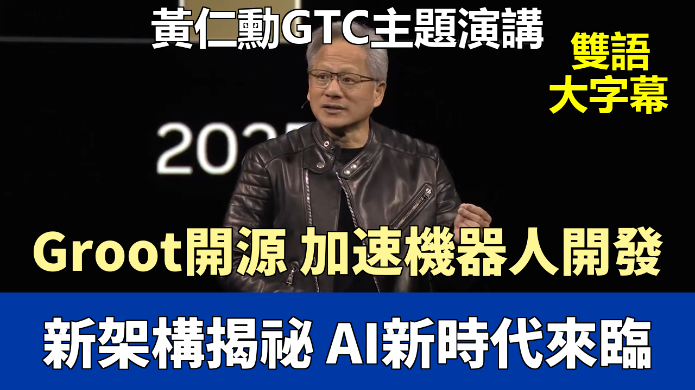

{% video youtube:XSSeizMti1w width:100% autoplay:0 %}

### 【中英文双语脚本】
Welcome to the stage, Nvidia founder and CEO, Jensen Wong.
歡迎英偉達創始人兼首席執行官黃仁勳先生登臺。

Welcome to GTC! 25 years after we started working on GeForce, GeForce is sold out all over the world.
歡迎來到 GTC！在我們開始研發 GeForce 25 年後，GeForce 已經在全球銷售一空。

This is the 5090, the Blackwell generation, and comparing it to the 4090, look how it's 30% smaller in volume.
這是 5090，Blackwell 這一代產品，與 4090 相比，看它的體積縮小了 30%。

It's 30% better at dissipating energy and incredible performance. Hard to even compare, and the reason for that is because of artificial intelligence.
它的散熱能效提高了 30%，性能令人難以置信。甚至難以比較，而原因就在於人工智能。

GeForce brought CUDA to the world. CUDA enabled AI, and AI has now come back to revolutionize computer graphics.
GeForce 將 CUDA 帶給了世界。CUDA 賦能了 AI，而 AI 現在又回來徹底改變計算機圖形學。

What you're looking at is real-time computer graphics, 100% path traced. For every pixel that's rendered, artificial intelligence predicts the other 15.
你現在看到的是實時計算機圖形，100% 路徑追蹤。對於渲染的每一個像素，人工智能會預測其餘的 15 個像素。

AI really came into the world's consciousness about a decade ago. Started with perception AI, computer vision, speech recognition.
大約十年前，AI 才真正進入了世界的視野。它始於感知 AI、計算機視覺、語音識別。

Then generative AI. Generative AI fundamentally changed how computing is done. From a retrieval computing model, we now have a generative computing model.
接着是生成式 AI。生成式 AI 從根本上改變了計算的完成方式。從檢索式計算模型，我們現在擁有了生成式計算模型。

Now, AI understands the context, understands what we're asking, understands the meaning of our request, and generates what it knows.
現在，AI 能夠理解上下文，理解我們的提問，理解我們請求的含義，並生成它所知道的內容。

The last couple of two, three years, major breakthrough happened. Fundamental advance in artificial intelligence. We call it agentic AI.
在過去的兩三年裏，發生了重大的突破。人工智能取得了根本性的進展。我們稱之爲智能體 AI。

Agentic AI basically means that you have an AI that has agency. It can perceive and understand the context of the circumstance.
智能體 AI 基本上意味着你擁有一個具有自主性的 AI。它可以感知並理解環境的背景。

It can reason, very importantly, can reason about how to answer or how to solve a problem. And it can plan an action.
它可以推理，非常重要的是，能夠推理如何回答或如何解決問題。並且它可以規劃行動。

At the foundation of agentic AI, of course, something that's very new, reasoning. And then, of course, the next wave is already happening.
當然，智能體 AI 的基礎是一些非常新的東西，比如推理能力。然後，下一波浪潮顯然已經在發生。

We're going to talk a lot about that today. Robotics, which has been enabled by physical AI. AI that understands the physical world.
我們今天會重點討論這個。機器人技術，它已由物理 AI 實現。即理解物理世界的 AI。

It understands things like friction and inertia, cause and effect, object permanence.
它能理解像摩擦力、慣性、因果關係、物體恆存性這樣的事物。

When someone doesn't mean to disappear from this universe, it's still there. Just not seeable.
當某物並非有意從這個宇宙消失時，它仍然存在，只是看不見而已。

And so that ability to understand the physical world, the three-dimensional world.
因此，這種理解物理世界、三維世界的能力。

Is what's going to enable a new era of AI we call physical AI, and it's going to enable robotics.
將會開啓一個我們稱爲物理 AI 的新紀元，並將賦能機器人技術。

The computation requirement, the scaling law of AI is more resilient, and in fact, hyper accelerated.
AI 的計算需求和擴展定律更具彈性，並且實際上是超級加速的。

The amount of computation we need at this point as a result of agentic AI, as a result of reasoning.
由於智能體 AI 和推理能力的發展，我們現階段所需的計算量。

Is easily a hundred times more than we thought we needed this time last year.
輕易就達到了我們去年此時認爲所需計算量的一百倍。

In training, there are two fundamental problems we have to solve. Where does the data come from? Where does the data come from?
在訓練方面，我們必須解決兩個根本問題。數據從哪裏來？數據從哪裏來？

And how do we not have it be limited by human in the loop? There's only so much data and so much human demonstration we can perform.
以及我們如何才能不被“人類在環”所限制？我們能執行的數據量和人類演示是有限的。

And so this is the big breakthrough in the last couple years. Reinforcement learning, verifiable results.
這就是過去幾年的重大突破。強化學習，可驗證的結果。

So you can kind of see that in fact, AI is going through an inflection point. It has become more useful because it's smarter, it can reason.
所以你可以看到，事實上，AI 正在經歷一個轉折點。它變得更加有用，因爲它更智能，能夠推理。

It is more used, you can tell it's more used, because whenever you go to chat GPT these days, it seems like you have to wait longer and longer and longer, which is a good thing.
它被使用得更頻繁了，你可以看出來它被用得更多了，因爲現在每當你去用 ChatGPT 時，似乎等待的時間越來越長，這是件好事。

It says a lot of people are using it with great effect. And the amount of computation necessary to train those models and to inference those models has grown tremendously.
這說明很多人正在有效地使用它。而訓練這些模型和進行模型推理所需的計算量已經急劇增長。

So in just one year, and Blackwell has just started shipping, in just one year, you could see the incredible growth in AI infrastructure.
因此，僅僅一年時間，而且 Blackwell 纔剛剛開始出貨，僅僅一年，你就能看到 AI 基礎設施令人難以置信的增長。

I've said before that I expect data center build out to reach a trillion dollars. And I am fairly certain we're going to reach that very soon.
我之前說過，我預計數據中心的建設規模將達到一萬億美元。而且我相當確定我們很快就會達到這個目標。

And the world is going through a platform shift from hand coded software running on general purpose computers to machine learning software running on accelerators and GPUs.
世界正在經歷一場平臺轉變，從在通用計算機上運行的手動編碼軟件，轉向在加速器和 GPU 上運行的機器學習軟件。

This way of doing computation is at this point past this tipping point.
這種計算方式目前已經越過了臨界點。

And we are now seeing the inflection point happening, the inflection happening in the world's data center build outs.
我們現在正看到轉折點的發生，這個轉折點正發生在世界數據中心的建設中。

So the first thing is a transition in the way we do computing. Second is an increase in recognition that the future of software requires capital investment.
所以，首先是計算方式的轉變。其次是人們越來越認識到軟件的未來需要資本投入。

Now this is a very big idea. Whereas in the past we wrote the software and we ran it on computers, in the future the computer is going to generate the tokens for the software.
這是一個非常重要的理念。過去我們編寫軟件並在計算機上運行，未來計算機將爲軟件生成 Token。

And so the computer has become a generator of tokens, not a retrieval of files.
因此，計算機已經變成了 Token 的生成器，而不是文件的檢索器。

From retrieval based computing to generative based computing, from the old way of doing data centers to a new way of building these infrastructure, and I call them AI factories.
從基於檢索的計算到基於生成的計算，從舊的數據中心運作方式到建設這些基礎設施的新方式，我稱之爲 AI 工廠。

They're AI factories because it has one job and one job only, generating these incredible tokens.
它們是 AI 工廠，因爲它們只有一個任務，且僅此一個任務，那就是生成這些令人難以置信的 Token。

So the world is going through a transition in not just the amount of data centers that will be built, but also how it's built.
所以世界正在經歷的轉變，不僅僅在於將要建設的數據中心的數量，還在於它們的建設方式。

Well everything in the data center will be accelerated, not all of its AI. This is in fact what GTC is all about.
嗯，數據中心裏的所有東西都將被加速，但並非所有都是 AI。這實際上就是 GTC 的全部意義所在。

You need all kinds of libraries and frameworks. We call them CUDA-X libraries, acceleration frameworks for each one of these fields of science.
你需要各種各樣的庫和框架。我們稱之爲 CUDA-X 庫，它們是針對各個科學領域的加速框架。

But you know AI started in the cloud. It started in the cloud for good reason because it turns out that AI needs infrastructure.
但你知道，AI 是在雲端起步的。它在雲端起步是有充分理由的，因爲事實證明 AI 需要基礎設施。

It's machine learning. If the science is machine learning then you need a machine to do the science.
它是機器學習。如果這門科學是機器學習，那麼你就需要一臺機器來做這門科學。

And so machine learning requires infrastructure and the cloud data centers have infrastructure.
因此，機器學習需要基礎設施，而云數據中心擁有基礎設施。

They also have extraordinary computer science, extraordinary research, the perfect circumstance for AI to take off in the cloud and the CSPs.
它們還擁有非凡的計算機科學、非凡的研究，這是 AI 在雲端和雲服務提供商中騰飛的完美環境。

But that's not where AI is limited to. AI will go everywhere. And we're going to talk about AI in a lot of different ways.
但 AI 並不僅限於此。AI 將無處不在。我們將以多種不同的方式討論 AI。

And the cloud service providers of course they like our leading edge technology.
當然，雲服務提供商喜歡我們領先的技術。

They like the fact that we have full stack because accelerated computing as you know, as I was explaining earlier, is not about the chip.
他們喜歡我們擁有全棧能力，因爲正如你所知，正如我之前解釋的，加速計算不僅僅是關於芯片。

It's not even just the chip in the library. The programming model is the chip, the programming model, and a whole bunch of software that goes on top of it.
它甚至不只是芯片和庫。編程模型就是芯片、編程模型，以及在其之上運行的大量軟件。

That entire stack is incredibly complex. There's a whole bunch of companies, maybe 20 of them, who started during the NVIDIA time.
整個技術棧極其複雜。有一大批公司，大約 20 家，是在英偉達時代起步的。

And what they do is just one thing. They host GPUs. They call themselves GPU clouds. All right, let's talk about data centers.
他們只做一件事。他們託管 GPU。他們稱自己爲 GPU 雲。好了，我們來談談數據中心。

Blackwell is in full production and this is what it looks like. It's an incredible, incredible, you know, for people, for us, this is a sight of beauty.
Blackwell 已經全面投產，這就是它的樣子。你知道，對於人們，對於我們來說，這是一種令人難以置信、難以置信的美景。

Would you agree? This is. Blackwell is way, way better than Hopper. And remember, this is not ISO chips. This is ISO power.
你同意嗎？就是這樣。Blackwell 比 Hopper 好太多太多了。請記住，這不是同等芯片比較，這是同等功耗比較。

And in a reasoning model, Blackwell is 40 times, 40 times the performance of Hopper. Straight up.
在推理模型中，Blackwell 的性能是 Hopper 的 40 倍，整整 40 倍。毫不含糊。

Okay, just to put it in perspective, this is what a 100 megawatt factory looks like. This is a 100 megawatt factory.
好的，爲了讓大家有個概念，這就是一個 100 兆瓦工廠的樣子。這是一個 100 兆瓦的工廠。

You have, based on Hopper's, you have 45,000 dies, 1400 racks, and it produces 300 million tokens per second. Okay?
基於 Hopper 的話，你有 45,000 個裸片，1400 個機架，它每秒產生 3 億個 Token。明白嗎？

And then this is what it looks like with Blackwell. We're now in full production of Blackwell.
然後，這就是使用 Blackwell 的樣子。我們現在已經全面投產 Blackwell。

And now, in the second half of this year, we'll easily transition into the upgrade. So we have the Blackwell Ultra, NVLink 72.
現在，在今年下半年，我們將輕鬆過渡到升級版。所以我們有了 Blackwell Ultra，NVLink 72。

You know, it's one and a half times more flops. It's, you know, it's got a new instruction for attention. It's one and a half times more memory.
你知道，它的浮點運算性能提高了一倍半。它，嗯，它有了一個新的用於注意力機制的指令。它的內存增加了一倍半。

All that memory is useful for things like KVCache. It's, you know, two times more bandwidth, okay, for networking bandwidth.
所有的內存對於像 KVCache 這樣的東西都很有用。它的帶寬，網絡帶寬，你知道，增加了一倍，好嗎。

And so you're going to, now that we have the same architecture, we'll just kind of gracefully glide into that. And that's called Blackwell Ultra.
所以，既然我們擁有相同的架構，我們將順利地過渡到那個階段。那就是所謂的 Blackwell Ultra。

Okay? So that's coming second half of this year. The next click, one year out, is named after an astronomer. And her grandkids are here.
好嗎？所以那將在今年下半年到來。下一次迭代，一年之後，是以一位天文學家的名字命名的。她的孫輩們今天也在場。

Her name is Vera Rubin. She discovered dark matter. Vera Rubin is incredible because the CPU is new.
她的名字是維拉·魯賓。她發現了暗物質。Vera Rubin 平臺令人難以置信，因爲 CPU 是全新的。

It's twice the performance of Grace, more memory, more bandwidth, and yet just a little tiny 50-watt CPU is really quite incredible.
它的性能是 Grace 的兩倍，擁有更多內存、更大帶寬，然而僅僅是一個小小的 50 瓦 CPU，這真是相當不可思議。

Okay? And Rubin, brand new GPU. CX9, brand new networking SmartNIC. NVLink 6, brand new NVLink. Brand new memories, HBM4.
好嗎？還有 Rubin，全新的 GPU。CX9，全新的網絡智能網卡。NVLink 6，全新的 NVLink。全新的內存，HBM4。

Basically, everything is brand new. Except for the chassis. And so Vera Rubin, NVLink 144, is the second half of next year.
基本上，除了機箱，一切都是全新的。所以 Vera Rubin，NVLink 144，將在明年下半年推出。

And then this now sets the stage for the second half of the year, the following year, we call Rubin Ultra. NVLink 576, extreme scale-up.
然後，這爲後年下半年奠定了基礎，我們稱之爲 Rubin Ultra。NVLink 576，極致擴展。

Each rack is 600 kilowatts. Two and a half million parts. Okay? And, obviously, a whole lot of GPUs. And everything is X-factor more.
每個機架 600 千瓦。兩百五十萬個部件。好嗎？而且，顯然，有大量的 GPU。所有指標都呈 X 倍數增長。

So 14 times more, more flops, 15 exaflops. Instead of one exaflop, as I mentioned earlier, it's now 15 exaflops scaled up exaflops.
所以是 14 倍以上，更多的浮點運算能力，15 Exaflops。相比我之前提到的 1 Exaflop，現在是 15 Exaflops 的擴展浮點運算能力。

Okay? And it's 300, what? 4.6 petabytes, so 4,600 terabytes per second scale-up bandwidth. I don't mean aggregate. I mean scale-up bandwidth.
好嗎？它是 300，什麼？4.6 Petabytes，也就是每秒 4600 Terabytes 的擴展帶寬。我不是指聚合帶寬，我說的是擴展帶寬。

And, of course, lots of brand new NVLink switch and CX9. Okay? So this is what Grace Blackwell looks like. And this is what Rubin looks like.
當然，還有大量全新的 NVLink 交換機和 CX9。好嗎？所以這就是 Grace Blackwell 的樣子。這就是 Rubin 的樣子。

Now that gives you a sense of the pace at which we're moving. This is the amount of scale-up flops. This is scale-up flops.
現在這讓你瞭解了我們前進的速度。這是擴展浮點運算能力的量級。這是擴展浮點運算能力。

Hopper is 1x, Blackwell is 68x, Rubin is 900x. Okay? So that's very quickly Nvidia's roadmap. Our InfiniBand switch, the silicon is working fantastically.
Hopper 是 1 倍，Blackwell 是 68 倍，Rubin 是 900 倍。好嗎？這就是英偉達的路線圖概覽。我們的 InfiniBand 交換機，其芯片運行得非常出色。

Second half of this year we will ship the silicon photonic switch in the second half of this year.
今年下半年，我們將在今年下半年出貨硅光子交換機。

And the second half of next year we'll ship the Spectrum X. Because of the MRM choice, because of the incredible technology risks that over the last five years.
明年下半年，我們將出貨 Spectrum X。由於 MRM 的選擇，由於過去五年中我們承擔的巨大技術風險。

That we did and filed hundreds of patents and we've licensed it to our partners so that we can all build them.
我們這樣做了，申請了數百項專利，並將其授權給我們的合作伙伴，以便我們大家都能製造它們。

Now we're in a position to put silicon photonics with co-package options, no transceivers, fiber, direct fiber in into our switches with a radix of 512.
現在我們能夠將硅光子技術與共封裝選項相結合，無需收發器，使用光纖，將直接光纖引入到我們具有 512 基數的交換機中。

This is the 512 ports. This would just simply not be possible any other way.
這就是 512 個端口。用其他任何方式都根本不可能實現。

And so this is, this now set us up to be able to scale up to these multi-hundred thousand GPUs and multi-million GPUs.
因此，這，這現在使我們能夠擴展到數十萬乃至數百萬 GPU 的規模。

Let me talk to you about enterprise computing. This is the computer of the age of AI. Okay?
讓我和大家談談企業計算。這是 AI 時代的計算機。好嗎？

So this is called DGX station. DGX Spark and DGX station are going to be available by all of the OEMs. HP, Dell, Lenovo, Asus.
這個叫做 DGX Station。DGX Spark 和 DGX Station 將通過所有的 OEM 廠商提供。惠普、戴爾、聯想、華碩。

It's going to be manufactured for data scientists and researchers all over the world. This is what computers should look like.
它將爲全世界的數據科學家和研究人員製造。這就是計算機應有的樣子。

And this is what computers will run in the future. And we have a whole lineup for enterprise now.
這就是未來計算機將運行的樣子。我們現在爲企業準備了完整的產品線。

From little tiny one to workstation ones, the server ones to supercomputer ones. And these will be available by all of our partners.
從微型設備到工作站，再到服務器和超級計算機。這些都將通過我們所有的合作伙伴提供。

We will also revolutionize the rest of the computing stack. Okay, so you can see that we're in the process of revolutionizing the world's enterprise.
我們還將徹底改變計算堆棧的其餘部分。好的，所以你可以看到我們正在徹底改變全球企業計算。

We're also announcing today this incredible model that everybody can run. And we can make it possible to be enterprise ready for any company.
我們今天還宣佈了這個令人難以置信的模型，每個人都可以運行它。我們可以讓任何公司都能輕鬆實現企業級應用。

And it's now completely open source. It's part of our system we call NIMS. And you can download it.
它現在完全開源了。它是我們稱爲 NIMS 系統的一部分。你可以下載它。

You can run it anywhere. You can run it on DGX Spark. You can run it on DGX station. You can run on any of the servers that the OEMs make.
你可以在任何地方運行它。可以在 DGX Spark 上運行。可以在 DGX Station 上運行。可以在 OEM 製造的任何服務器上運行。

You can run it in the cloud. You can integrate it into any of your agentic AI frameworks. Let's talk about robots.
你可以在雲端運行它。你可以將它集成到你的任何智能體 AI 框架中。讓我們談談機器人。

Well, the time has come. The time has come for robots.
嗯，時機已到。機器人時代已經到來。

Robots have the benefit of being able to interact with the physical world and do things that otherwise digital information cannot.
機器人具有與物理世界互動並完成數字信息無法完成的事情的優勢。

Physical AI and robotics are moving so fast. Everybody pay attention to this space. This could very well likely be the largest industry of all.
物理 AI 和機器人技術發展如此之快。大家請關注這個領域。這很可能成爲所有行業中最大的一個。

And so today we're announcing something really, really special. It is a partnership of three companies. DeepMind, Disney Research, and NVIDIA.
因此，今天我們要宣佈一件非常非常特別的事情。這是三家公司的合作：DeepMind、迪士尼研究院和英偉達。

And we call it Newton. Okay. We have another amazing news. Today we're announcing that Groot N1 is open-sourced.
我們稱之爲 Newton。好的。我們還有另一個驚人的消息。今天我們宣佈 Groot N1 開源了。

I want to thank all of you for coming to GTC. We talked about several things. One, Blackwell is in full production.
我想感謝大家來到 GTC。我們討論了幾件事。第一，Blackwell 已全面投產。

Second, Blackwell NVLink 72 with Dynamo is 40 times the performance, AI factory performance of Hopper.
第二，配備 Dynamo 的 Blackwell NVLink 72，其 AI 工廠性能是 Hopper 的 40 倍。

Third, we have annual rhythm of roadmaps that has been laid out for you so that you could plan your AI infrastructure.
第三，我們制定了年度節奏的路線圖供大家參考，以便你們規劃自己的 AI 基礎設施。

And then we have three AI infrastructures we're building. AI infrastructure for the cloud, AI infrastructure for enterprise, and AI infrastructure for robots.
然後，我們正在構建三種 AI 基礎設施：面向雲的 AI 基礎設施、面向企業的 AI 基礎設施，以及面向機器人的 AI 基礎設施。

Possible. Have a great GTC. Thank you.
祝大家 GTC 大會愉快。謝謝。

