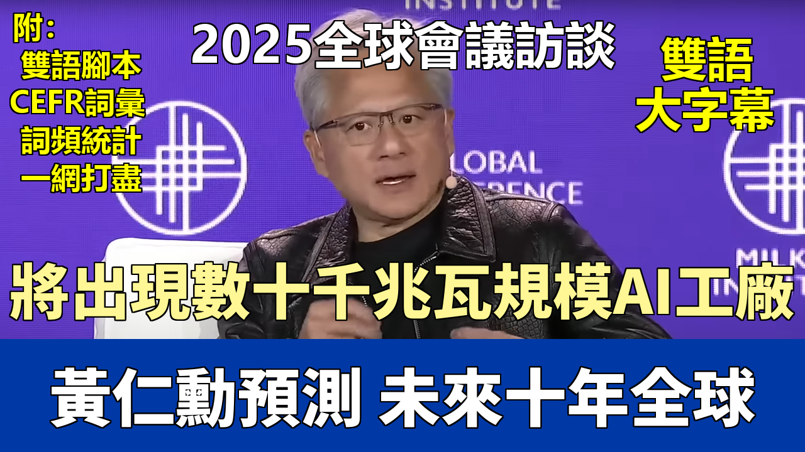

{% video youtube:mBcglgaQ8E8 width:100% autoplay:0 %}


### 【中英文双语脚本】

Please welcome President and CEO of NVIDIA, Jensen Huang, in conversation with Institute Chairman, Michael Milken.
請歡迎NVIDIA總裁兼首席執行官黃仁勳，與米爾肯研究院主席邁克爾·米爾肯進行對話。
They're big fans of yours.
他們是您的忠實粉絲。
I think that's for you. I think the hoo-hoo is for you.
我想那是給你的。我想那歡呼聲是給你的。
And I think your outfit is for me. Welcome.
而且我想你的着裝是爲了我。歡迎。
So AI, is this the next Industrial Revolution? Yes.
那麼人工智能，這是下一次工業革命嗎？是的。
Is this the next manufacturing revolution? Yes. Let me explain.
這是下一次製造業革命嗎？是的。讓我解釋一下。
So all of us have been talking about the technology of AI, that it can perceive the world, it can generate content, it can translate,
所以我們所有人一直在談論人工智能技術，它能夠感知世界，能夠生成內容，能夠翻譯，
it can now even reason and solve problems, use tools, use the web browser, read PDFs, do research for you.
現在它甚至能夠推理和解決問題，使用工具，使用網絡瀏覽器，閱讀PDF，爲你做研究。
And so we know what the technology is able to do, and that's very exciting in itself.
因此我們知道這項技術能做什麼，這本身就非常令人興奮。
It's transformative completely in itself.
它本身就具有完全的變革性。
We understand that the technology is unlike any IT technology of the past.
我們明白這項技術不同於以往任何信息技術。
Remember, IT technology is a tool. You have to use it to make it effective.
記住，信息技術是一種工具。你必須使用它才能使其有效。
You have to sit in front of the computer and use it. But now AI has the ability to automate.
你必須坐在電腦前使用它。但現在人工智能具有自動化的能力。
And the concept of robotics and robots are very well understood.
而且機器人和機器人的概念已經得到了很好的理解。
And so imagine a physical robot, but we understand that. We can imagine that.
所以想象一個物理機器人，但我們理解這一點。我們可以想象得到。
Imagine a digital robot, and it's in the computer in your data center doing work for you.
想象一個數字機器人，它在你的數據中心的計算機裏爲你工作。
So it's exciting because for the first time, it's no longer just replacing or the next generation of the IT technology that we know.
所以這很令人興奮，因爲這是第一次，它不再僅僅是取代我們所知的IT技術或成爲其下一代。
But for the first time, it actually could augment and add to the digital workforce.
而是第一次，它實際上可以增強並補充數字勞動力。
So the part of the economy that it's part of is much larger than a trillion dollars, it's part of the $100 trillion.
所以它所處的經濟部分遠不止一萬億美元，它是一百一十萬億美元經濟體的一部分。
And so that's the first layer.
所以這是第一個層面。
The second layer is how do you generate this AI? What does the AI come about?
第二個層面是你如何生成這種人工智能？人工智能是如何產生的？
Whereas the last generation of computers was software written by hand and it runs on CPUs,
上一代計算機的軟件是手工編寫的，並在CPU上運行，
what NVIDIA took some 33 years to build is this idea of a new type of computer that learns, the machine learns to write the software itself,
而NVIDIA花了大約33年時間構建的是一種新型計算機的理念，這種計算機能夠學習，機器學會自己編寫軟件，
and it runs on this processor, this computing platform we invented called Accelerated Computing and GPUs.
它運行在我們發明的這種處理器，這個計算平臺上，我們稱之爲加速計算和GPU。
And so now the question is, how does the AI get produced?
那麼現在的問題是，人工智能是如何產生的呢？
And it gets produced in essentially what people call AI data centers, but it's essentially a factory.
它基本上是在人們所說的人工智能數據中心產生的，但它本質上是一個工廠。
It's unlike a data center. It doesn't look like a data center. It's quite large in scale. It does use energy.
它不像數據中心。它看起來不像數據中心。它的規模相當大。它確實消耗能源。
And it produces-- you apply energy to it, and it produces these things called tokens, but they're basically numbers.
它生產——你向它輸入能源，它就會生產出這些叫做“令牌”的東西，但它們基本上是數字。
And these tokens can be reformulated into numbers or words or images or pixels or videos or chemicals or protein combinations for drug discovery
這些令牌可以被重構成數字、文字、圖像、像素、視頻、化學品或用於藥物發現的蛋白質組合，
or even motor skills necessary to drive a robot or steering wheels to drive a self-driving car.
甚至是驅動機器人所需的運動技能或駕駛自動駕駛汽車的方向盤控制。
And so these tokens are being manufactured by this factory.
所以這些令牌是由這個工廠製造出來的。
And so what's interesting is that people are starting to understand that there's a whole new industry that has been created.
因此有趣的是，人們開始理解一個全新的產業已經被創造出來了。
This new industry has a factory. And this factory, there are AI factories.
這個新產業有一個工廠。而這個工廠，就是人工智能工廠。
And how large can these factories be? They could be a gigawatt or building ones that are about a gigawatt,
這些工廠能有多大？它們可能是一千兆瓦，或者正在建造大約一千兆瓦的工廠，
and each gigawatt's about $50, $60 billion.
每千兆瓦大約價值500到600億美元。
And over the course of the next, call it 10 years or so, I wouldn't be surprised to see tens of gigawatts of AI factories being built around the world.
在未來大約10年左右的時間裏，我不會驚訝地看到世界各地建造數十千兆瓦的人工智能工廠。
So that's the second layer.
所以這是第二個層面。
The third layer that's probably even more profound is that for the very first time, you have a capability, a technology, that affects almost every industry,
第三個層面可能更爲深遠，那就是你第一次擁有了一種能力，一種技術，它幾乎影響到每一個行業，
from financial services to health care to manufacturing to logistics to retail to entertainment, you name it.
從金融服務到醫療保健，從製造業到物流，從零售到娛樂，你能想到的都有。
And so this infrastructure, if you will, this AI factory, now becomes an infrastructure for a whole bunch of other industries.
因此，這個基礎設施，如果你願意這麼稱呼，這個人工智能工廠，現在成爲了一大堆其他產業的基礎設施。
And just like the last generation, this infrastructure is kind of hard to understand.
就像上一代一樣，這種基礎設施有點難以理解。
But the last generation, we had the information infrastructure.
但在上一代，我們擁有信息基礎設施。
And the generation before that, we had the energy infrastructure. And now we have the intelligence infrastructure.
而在那之前的一代，我們擁有能源基礎設施。而現在，我們擁有了智能基礎設施。
And the internet is the information infrastructure. And artificial intelligence is this one.
互聯網是信息基礎設施。而人工智能就是這個（智能基礎設施）。
And so now, I think when you look at AI from those different lenses,
所以現在，我認爲當你從那些不同的視角看待人工智能時，
you could start to understand the impact of AI to the technology industry that we're in, to a new industry that every country will want to be part of.
你就能開始理解人工智能對我們所處的技術產業的影響，對每個國家都想參與的新興產業的影響。
Anybody who has excess energy, you're going to want to be part of this industry, to the infrastructure that affects every industry.
任何擁有過剩能源的人，都會想成爲這個行業的一部分，成爲影響每個行業的基礎設施的一部分。
So let's step back for a couple of minutes and talk about the skill sets needed to interact.
那麼讓我們退後幾分鐘，談談互動所需的技能組合。
We estimated a number of years ago that if you took the most modern agricultural technology, that in the world,
我們幾年前估計，如果你採用世界上最現代的農業技術，
you might eliminate a half a billion jobs of what's going on in farming, subsistence, et cetera.
你可能會消滅掉農業、自給自足型農業等領域中五十億個工作崗位。
There are significant questions today. Who's going to be disintermediated?
今天存在一些重大的問題。誰將被去中介化？
Now, I had a substantial advantage in the 1960s that I could calculate yields in my head.
現在，我在20世紀60年代有一個顯著的優勢，我可以在腦子裏計算產量。
And then in 1970, they came out with the calculator. So I got disintermediated. [LAUGHTER]
然後在1970年，他們推出了計算器。所以我被去中介化了。[笑聲]
Looks like he's done pretty well since the invention of the calculator.
看來自從計算器發明以來他做得相當不錯。
And I could remember millions of trades. And then computers started storing those trades.
我能記住數百萬筆交易。然後計算機開始存儲那些交易。
What do you see in the concept of work and the interaction with the technology you're going to provide? Yeah.
您如何看待工作概念以及與您將提供的技術的互動？是的。
So all of you have heard a lot about job displacement. Every job will be affected.
所以你們都聽說了很多關於工作崗位流失的事情。每個工作都會受到影響。
Some jobs will be lost. Some jobs will be created. But every job will be affected.
一些工作將會消失。一些工作將會被創造出來。但每個工作都會受到影響。
And immediately, it is unquestionable. You're not going to lose your job to an AI, but you're going to lose your job to somebody who uses AI.
而且，這是毋庸置疑的。你不會因爲人工智能而失業，但你會因爲那些使用人工智能的人而失業。
But let me give you-- and those are fairly common sense things to have observed.
但是讓我給你——那些都是通過觀察可以得出的相當普遍的常識。
But let me give you two extremes that you might want to consider as well.
但是讓我給你兩個你可能也想考慮的極端情況。
Computer technology, computer science has benefited about 30 million people.
計算機技術、計算機科學已經使大約3000萬人受益。
There are about 30 million people in the world who know how to program and use this technology to its extreme.
世界上大約有3000萬人知道如何編程並將這項技術發揮到極致。
And it's really benefited all of us that have been in this industry.
這確實讓我們這個行業的所有人都受益匪淺。
The last 30 years, potentially one of the best and most wealth-creating industry you could have selected.
過去30年，這可能是你能選擇的最好、最能創造財富的行業之一。
I could have been a petroleum engineer. My dad was. And I could have been a doctor. My mom thinks that everybody should be a doctor.
我本可以成爲一名石油工程師。我父親就是。我本可以成爲一名醫生。我媽媽認爲每個人都應該成爲醫生。
But I chose to go into computer engineering, and it turned out to have been quite a good choice.
但我選擇了計算機工程，結果證明這是一個相當不錯的選擇。
And however, there are about 30 million people like in this industry.
然而，這個行業大約有3000萬人。
So we've created, Mike, in the last 30, 40 years, probably the greatest technology divide the world's ever seen.
所以，邁克，在過去的三四十年裏，我們可能創造了世界上最大的技術鴻溝。
The instrument that we've invented, we know how to use, but the other 8, 7 and a half billion people don't.
我們發明的工具，我們知道如何使用，但其他75億到80億人卻不知道。
I'll put on the table that, in fact, artificial intelligence is the greatest opportunity for us to close the technology divide.
我要提出的是，事實上，人工智能是我們彌合技術鴻溝的最大機遇。
And let me prove it to you. If we just look in this room, it's very unlikely that more than a handful of people know how to program with C++.
讓我向你證明。如果我們看看這個房間，很可能只有少數人知道如何用C++編程。
And an equal number know how to program in C. And yet, 100% of you know how to program in AI.
同樣數量的人知道如何用C語言編程。然而，你們百分之百的人都知道如何在人工智能中編程。
And the reason for that is because AI will speak whatever language you want it to speak.
原因在於人工智能會說任何你想讓它說的語言。
You could draw a schematic and show it to it. You could draw a picture and ask it what to do.
你可以畫一個示意圖給它看。你可以畫一幅畫然後問它該怎麼做。
You could, obviously, talk to it in words. You could write a prompt. You could describe your prompt in a very explicit way.
你顯然可以用語言和它交流。你可以寫一個提示。你可以用非常明確的方式描述你的提示。
You could describe your prompt in a very implicit way.
你可以用非常含蓄的方式描述你的提示。
And if you don't know how to program that computer using AI, just tell the AI, I don't know how to program you. How do I program you?
而且如果你不知道如何使用人工智能來編程那臺計算機，就告訴人工智能，我不知道如何對你編程。我該如何對你編程？
And the AI will tell you exactly how to program you and program it.
人工智能會準確地告訴你如何對你編程以及對它編程。
And so I think that-- and the number of people who are using ChatGPT and Gemini Pro and these AIs kind of demonstrate that,
所以我認爲——而且正在使用ChatGPT、Gemini Pro和這些人工智能的人數也某種程度上證明了，
in fact, this is one of the easiest to use technologies in history.
事實上，這是歷史上最容易使用的技術之一。
And so now everybody could take advantage of this capability, whether it's a teacher or a student wanting a tutor.
所以現在每個人都可以利用這種能力，無論是老師還是想要家教的學生。
And every student should use it as a tutor. I use it as a tutor every day.
每個學生都應該把它當作輔導老師來用。我每天都用它來當輔導老師。
And so I think the ability for us to now use artificial intelligence to close the technology gap is incredible.
所以我認爲我們現在利用人工智能來彌合技術差距的能力是令人難以置信的。
So that's one extreme.
那是一個極端。
The other extreme that I will say is that, remember, we have a shortage of labor. We have a shortage of workers.
我要說的另一個極端是，記住，我們面臨勞動力短缺。我們缺少工人。
We don't have an abundance of workers. We have a shortage of.
我們並非擁有過剩的工人。我們是短缺的。
And for the very first time in history, we can imagine the opportunity to close that gap,
歷史上第一次，我們可以想象有機會彌合這一差距，
to put 30, 40 million workers back into the workforce that otherwise the world doesn't have.
讓三四千萬原本世界上沒有的工人重返勞動力市場。
And so you could argue that artificial intelligence is probably our best way to increase the GDP, the global GDP.
所以你可以說人工智能可能是我們增加全球GDP的最佳途徑。
And so those are two other ways to look at it.
所以這是看待這個問題的另外兩種方式。
In the meantime, I would recommend 100% of everybody take advantage of AI.
與此同時，我建議百分之百的每個人都利用人工智能。
And don't be that person who ignores this technology and as a result, loses.
不要做那個忽視這項技術並因此失敗的人。
So let's talk for a moment. They're going to walk out of this room.
那麼我們來談一會兒。他們將走出這個房間。
And Thursday, after six days of the conference, they're going to want to learn more about AI.
週四，在爲期六天的會議結束後，他們會想更多地瞭解人工智能。
Do they ask their computer to teach them about AI? Yeah. Is that what we're going to do?
他們會要求他們的電腦教他們人工智能嗎？是的。我們就是要這麼做嗎？
Excellent way to do it. Just pick up your phone. Get yourself-- Perplexity is pretty good.
這是個好方法。拿起你的手機。給自己找個——Perplexity就很好。
ChatGPT is really excellent. Gemini Pro is excellent. I use all three of them.
ChatGPT非常出色。Gemini Pro也很出色。我三個都在用。
And just ask it whatever you want to ask it about AI, and it'll tell you. As deep as you like it to be.
然後就問它任何你想問的關於人工智能的問題，它都會告訴你。你想多深入都可以。
Sometimes in areas that are fairly new to me, I might say, start by explaining it to me like I'm a 12-year-old.
有時在對我來說相當新的領域，我可能會說，先像對一個12歲的孩子那樣向我解釋。
And then work your way up into a doctorate level over time. And so you could all do the same.
然後隨着時間的推移，逐漸提升到博士水平。所以你們都可以這樣做。
Let's look at it from another side, Jensen. Your family came from Taiwan. You went to Washington.
讓我們從另一個角度來看，仁勳。你的家人來自臺灣。你去了華盛頓州。
And then eventually, your parents moved to Oregon.
然後最終，你的父母搬到了俄勒岡州。
And I've had a chance to finance many other entrepreneurs. Bill McGowan comes to mind at MCI.
我有機會資助過許多其他企業家。MCI的比爾·麥高恩浮現在我的腦海。
So he had a company that had 99% market share in AT&T that he wanted to take on.
所以他有一家公司，想要挑戰在AT&T擁有99%市場份額的公司。
In those early years that you often talk about, you didn't know if you were going to make it or not.
在你經常談到的那些早年，你不知道自己是否能成功。
He often was wondering where the payroll was coming from every month.
他常常想知道每個月的工資從哪裏來。
What did the other companies miss who had more access to capital than you did at the time? What did they not see that you saw?
那些當時比你更容易獲得資本的其他公司錯過了什麼？他們沒有看到你所看到的什麼？
Gosh.
天啊。
In other words, what did Intel not see in the market? What did they not recognize?
換句話說，英特爾在市場上沒有看到什麼？他們沒有認識到什麼？
Yeah, the reason why I paused to say it is because, from the very beginning, we imagined--
是的，我之所以停頓了一下才說，是因爲從一開始，我們就設想——
so what we were trying to do as a company was to build, to invent a new way of doing computing that solves problems that normal computers can't.
所以我們公司試圖做的是建立、發明一種新的計算方式，以解決普通計算機無法解決的問題。
In fact, if you just wrote that mission statement out, to do something that normal things can't,
事實上，如果你只是寫下那個使命宣言，去做普通事物做不到的事情，
it's like, I would like to build a new car to go places where normal cars can't.
這就像是，我想造一輛新車去普通汽車去不了的地方。
Well, usually what happens if normal cars can't go there, those places also aren't paved with roads or they're not that desirable to go to anyways.
嗯，通常情況下，如果普通汽車去不了那裏，那些地方也往往沒有鋪設道路，或者它們本身也不是那麼值得去的地方。
And so we came up with this mission statement to solve problems that normal computers can't.
所以我們提出了這個使命宣言：解決普通計算機無法解決的問題。
And several problems with that mission statement. Turned out it took us 33 years to do, and we succeeded at it.
那個使命宣言有幾個問題。結果我們花了33年才完成，並且我們成功了。
But the first thing is that the whole economy, the whole industry, the whole ecosystem wants to go where problems can be solved.
但首先是，整個經濟、整個行業、整個生態系統都想去問題可以被解決的地方。
Nobody wants to go to where problems can't be solved. And so where we are was rather lonely.
沒有人想去問題無法解決的地方。所以我們所在的地方相當孤獨。
There aren't other people solving this problem because it's hard to solve.
沒有其他人在解決這個問題，因爲它很難解決。
There aren't many customers because they tend not to choose problems like that. They want to have their problems be solvable, not unsolvable.
沒有多少客戶，因爲他們往往不選擇那樣的問題。他們希望他們的問題是可以解決的，而不是無法解決的。
And then the other thing is Intel watching us the whole time had the benefit.
然後另一件事是，英特爾一直注視着我們，並從中受益。
And you said they had greater source of access to capital. And that's completely true because they were so successful doing what they were doing,
你說他們有更多的資本來源。這完全正確，因爲他們在做的事情上非常成功，
they kind of rejected what we were doing. And that's, in fact, the good news.
他們有點排斥我們正在做的事情。而這，事實上，是個好消息。
Over time, the reason why it took us so long is because it's hard.
隨着時間的推移，我們之所以花了這麼長時間，是因爲它很難。
And the reason why we're here alone is because people left us alone for a long time.
而我們之所以獨自在此，是因爲人們在很長一段時間裏都沒有打擾我們。
And there was a book that was written recently, and I picked it up and skimmed it, Peter Thiel's Zero to One book.
最近有本書出版了，我拿起來略讀了一下，是彼得·蒂爾的《從0到1》。
In a lot of ways, it's kind of a story about Nvidia, too.
在很多方面，它也像是關於英偉達的故事。
We chose to do something that nobody thought was possible or very hard to do and very unlikely to succeed. But to us, it was very common sense.
我們選擇做一些沒有人認爲可能或者非常難做且極不可能成功的事情。但對我們來說，這非常合乎情理。
And so I think simultaneously because it was hard to do, and also because they were so successful doing what they were already doing,
所以我認爲同時因爲這很難做到，也因爲他們在已經做的事情上非常成功，
they kind of rejected the idea until everything came together.
他們有點排斥這個想法，直到一切都水到渠成。
Well, and you're also trying to make sure your company doesn't go in the direction of Intel also.
嗯，而且你也在努力確保你的公司不會也朝着英特爾的方向發展。
So you're the leader today. How do you get that culture of constant innovation?
所以你是今天的領導者。你如何培養那種持續創新的文化？
And if I wanted to talk about Captain Kirk, to go where no one has gone before.
如果我想談論柯克船長，去往無人曾至之境。
I think partly, first of all, there's just no guarantees.
我想部分原因是，首先，沒有任何保證。
But we have several things about our company that's really quite extraordinary. And I appreciate it as a person.
但我們公司有幾件非常了不起的事情。我個人對此非常欣賞。
I wish upon my kids and the people I love to have the same experience, which is that long suffering that we have.
我希望我的孩子和我愛的人也能有同樣的經歷，那就是我們所經歷的長期磨礪。
Long, long suffering that comes with struggle. And you never take anything for granted.
漫長而艱苦的奮鬥。你永遠不會把任何事情視爲理所當然。
You're super, super efficient. You're trying to save everything you can, save every penny you can, because you don't know how long the struggle is going to last.
你超級、超級高效。你努力節省一切能節省的，節省每一分錢，因爲你不知道這場鬥爭會持續多久。
You have incredible resilience because it took a long time to do it. And so the company has that in its character.
你擁有令人難以置信的韌性，因爲它花了很長時間才做到。所以公司性格中就有這一點。
Almost everything we undertake, even these days, are five, 10-year endeavors.
幾乎我們承擔的每一件事，即使是現在，都是五年、十年的努力。
We're probably the deepest in this new area called physical AI, which translates to robotics in the world.
我們可能在物理人工智能這個新領域研究最深，這個領域在世界上轉化爲機器人技術。
And the fundamental technology necessary for the next generation of AI, we're probably the furthest along, the deepest of anybody.
而下一代人工智能所需的基礎技術，我們可能比任何人都走得更遠，研究得更深。
And so I think those characteristics of dreaming big on the one hand and having the resilience and the character to suffer until you see it happen,
所以我認爲，一方面擁有遠大夢想，另一方面擁有韌性和品格去承受痛苦直到成功，這些特質非常好。
I think that's very good. I think the other part that's good is you're always going out of business.
我覺得這非常好。我覺得另一個好的方面是，你總是在面臨倒閉的風險。
For us, for 30 years, we're always in a perpetual state of going out of business. And so you don't take anything for granted.
對我們來說，30年來，我們一直處於一種隨時可能倒閉的永久狀態。所以你不會把任何事情視爲理所當然。
And when there's a setback, it doesn't trouble me too much. When we make mistakes, it doesn't surprise me too much.
當遇到挫折時，我不會太煩惱。當我們犯錯誤時，我不會太驚訝。
When we have success, I don't take it for granted. And we don't celebrate it too much. And we really stay focused on doing our work.
當我們取得成功時，我不會認爲這是理所當然的。我們也不會過多慶祝。我們真正專注於做好我們的工作。
And so I think part of that is just how long it took to build a company.
所以我認爲部分原因在於建立一家公司花了多長時間。
Let's talk, for most laypersons, how do you make a chip? What is required to make a chip?
讓我們談談，對於大多數外行來說，如何製造芯片？製造芯片需要什麼？
So we all like to go out there and make chips. We have no idea how to go about it, but we'd like to.
所以我們都想去製造芯片。我們不知道該怎麼做，但我們想做。
And as you remember, the US passed an act. We're going to invest $62 billion.
你還記得，美國通過了一項法案。我們將投資620億美元。
And then they discovered six months later, there's no one in the United States that knows how to build a factory.
然後他們六個月後發現，美國沒有人知道如何建造工廠。
And we need to get 7,000 people from Taiwan here.
我們需要從臺灣招募7000人到這裏。
Well, with all things, I think craft and artistry matters.
嗯，對於所有事情，我認爲工藝和技藝很重要。
If you want to learn how to build a chip, I would start with YouTube. And then-- [LAUGHTER]
如果你想學習如何製造芯片，我會從YouTube開始。然後——[笑聲]
So it turns out, we're very good at building chips.
事實證明，我們非常擅長製造芯片。
And the reason for that is because we build-- not since IBM in the '60s has a company like us existed,
原因在於我們構建——自60年代的IBM以來，再也沒有像我們這樣的公司存在過，
where we come up with a blank sheet of paper, design a brand new architecture, create the chips, create the systems, create the networking,
我們從一張白紙開始，設計全新的架構，創造芯片，創造系統，創造網絡，
create the infrastructure, write all the software, take that software to the market,
創造基礎設施，編寫所有軟件，將軟件推向市場，
have the world's developers and ecosystem develop for that computer, kind of like we develop for iPhones, and you develop for Windows, you develop for NVIDIA.
讓全世界的開發者和生態系統爲那臺計算機開發，就像我們爲iPhone開發，你們爲Windows開發，你們爲NVIDIA開發一樣。
And so not since the '60s and '70s when IBM built everything from the ground up has a company like us existed.
所以自六七十年代IBM從零開始構建一切以來，再也沒有像我們這樣的公司存在過。
We build the chips, but we build the entire system. And we're really an AI infrastructure company today.
我們製造芯片，但我們構建整個系統。我們今天實際上是一家人工智能基礎設施公司。
If you look at the systems we build, each one of our chips, if you will, it's a ton and a half. This is a ton and a half chip.
如果你看看我們構建的系統，我們的每一塊芯片，可以說，重達一噸半。這是一塊一噸半的芯片。
It's $3 million each. We build these things in very high volume.
每塊價值300萬美元。我們大批量生產這些東西。
We manufacture it, assemble it, and then we test it.
我們製造它，組裝它，然後測試它。
We use a supercomputer to test the supercomputer, because you have to be smart to test the computer you make is smart.
我們用超級計算機來測試超級計算機，因爲你必須足夠聰明才能測試你製造的計算機是否智能。
And so we test everything is liquid cooled.
所以我們測試的所有東西都是液冷的。
And then we test everything, assemble everything, we disassemble everything, put it on a plane, ship it to wherever the data center is,
然後我們測試所有東西，組裝所有東西，我們拆卸所有東西，把它裝上飛機，運到數據中心所在地，
assemble it again outside their door, put it inside their data center.
在他們門外再次組裝，然後把它放進他們的數據中心。
This entire process has 200 manufacturers and suppliers working with us around the world.
整個過程有全球200家制造商和供應商與我們合作。
We build a couple of hundred billion dollars of it a year at this moment.
目前我們每年製造價值數千億美元的產品。
We're the largest technology company, chip company in the world, I guess, if you will.
我想，我們是世界上最大的科技公司，芯片公司。
And so it's incredibly hard to do. Our R&D budget per generation is probably about $20, $30 billion.
所以這非常難做。我們每一代的研發預算大約是200到300億美元。
And so this is a giant game.
所以這是一場巨大的博弈。
But we're working into an industry, Mike, that you know, the intelligence industry will likely be measured in trillions of dollars.
但是，邁克，我們正在進入一個你所知道的行業，智能產業的規模很可能以萬億美元計。
And so the amount of investment that we're making is warranted for the opportunities ahead.
因此，我們所做的投資額對於未來的機遇是合理的。
So we've all had a chance to read about potential restrictions on where you're going to be able to sell your chips.
所以我們都有機會讀到關於你能在哪裏銷售芯片的潛在限制。
There's pros and cons that people put forth in this debate. Lay out the issues as you see them.
在這場辯論中，人們提出了各種利弊。請闡述你所看到的這些問題。
NVIDIA's technology, oftentimes described as a national treasure.
NVIDIA的技術，常被描述爲國寶。
And the technology, obviously, is important to this new industry called artificial intelligence.
顯然，這項技術對於這個名爲人工智能的新興產業至關重要。
And so one extreme, on one side, we want to make sure that this technology is available only to the friends of our nation.
所以一個極端是，一方面，我們希望確保這項技術只提供給我們國家的盟友。
We want to ensure that access of this technology doesn't fall into the hands of people who might use it for military reasons.
我們希望確保這項技術的獲取權不會落入可能將其用於軍事目的的人手中。
And so those are the arguments for limiting the access, for economic reasons, for national security reasons.
所以這些就是限制獲取的理由，出於經濟原因，出於國家安全原因。
And the fallacy of that is no government, especially the government of our adversaries, are limited by the available capacity of computing in their country
這種說法的謬誤在於，沒有任何政府，尤其是我們對手的政府，會因爲其國內可用的計算能力而受到限制，
for their military reasons. Our country is not. No countries are.
以滿足其軍事需求。我們國家不是。沒有任何國家是。
If they need it for military advance, they'll just secure whatever computing resources that they already have.
如果他們需要它來進行軍事發展，他們只會確保他們已有的任何計算資源。
And there are millions and millions of NVIDIA chips in just about every country already.
而且幾乎每個國家都已經擁有數百萬計的NVIDIA芯片。
And so it's not going to limit shipping additional GPUs, NVIDIA technology, into whatever country. It's not going to limit their military.
因此，向任何國家運送額外的GPU、NVIDIA技術，並不會限制他們的軍事力量。
I think the reason for leaning into the export of this technology is we want to build the world's AI.
我認爲傾向於出口這項技術的原因是，我們希望構建世界的人工智能。
Whereas American standards are being adopted around the world, the ecosystem of artificial intelligence will build on top of our standard versus somebody else's standard.
當美國標準在世界各地被採用時，人工智能的生態系統將建立在我們的標準之上，而不是別人的標準之上。
And we are not alone. NVIDIA, of course, is the world leader today.
我們並非孤軍奮戰。NVIDIA當然是當今世界的領導者。
But in our absence, if we don't serve a particular market, if we leave a market altogether, there's no question somebody else would step in.
但是如果我們缺席，如果我們不服務於某個特定市場，如果我們完全離開一個市場，毫無疑問會有其他人介入。
Huawei, for example, is very formidable. One of the most formidable technology companies in the world, they'll step in.
例如，華爲非常強大。作爲世界上最強大的科技公司之一，他們會介入。
And so the reason why it would make sense is to win in the marketplace, make the American standard, the global standard,
因此，這樣做的意義在於贏得市場，使美國標準成爲全球標準，
have AI be built on top of American technology. And of course, very importantly, it's a giant market.
讓AI建立在美國技術之上。當然，非常重要的一點是，這是一個巨大的市場。
When we were limited to ship to China, the Chinese market in a couple of years is probably about $50 billion.
當我們被限制向中國出口時，中國市場在幾年內可能達到約500億美元的規模。
The market we've left behind is utterly gigantic.
我們留下的市場是極其巨大的。
$50 billion, just so you have a feeling for that number, $50 billion is like Boeing, not a plane, the entire company.
500億美元，爲了讓你對這個數字有個概念，500億美元就像波音公司，不是一架飛機，而是整個公司。
And so that's the business opportunity that I think we could enjoy, bring back tax dollars, create jobs, advance our technology even further.
所以我認爲這是我們可以享有的商業機會，可以帶回稅收，創造就業，並進一步推進我們的技術。
Well, also, your interaction with the customer. You're missing that chance to learn from that interaction from the customer.
嗯，還有，你與客戶的互動。你正在錯失從與客戶的互動中學習的機會。
The most important thing for any business is the interaction with the customer.
對於任何企業來說，最重要的事情就是與客戶的互動。
And what have your customers-- what have you learned from your customers over the last few years and their demand for chips, but their use of chips,
你的客戶——在過去幾年裏，你從客戶那裏學到了什麼，他們對芯片的需求，以及他們對芯片的使用情況，
and how is that feedback to you and to NVIDIA?
這些反饋是如何傳遞給你和NVIDIA的？
Well, we work with just about every AI developer in the world.
嗯，我們與世界上幾乎每一位人工智能開發者都有合作。
And we learn everything from how our architecture, how the nature of our technology is optimal or not optimal for the future of AI.
我們從中學習到關於我們的架構、我們的技術本質對於人工智能的未來是否最優的一切。
And so when we understand what an AI researcher would like to do with, for example, the AI model for a virtual cell,
因此，當我們瞭解人工智能研究員想要用例如虛擬細胞的人工智能模型做什麼時，
we've now made very good progress with virtual proteins. And so now we're working on virtual cells.
我們現在在虛擬蛋白質方面取得了很好的進展。所以現在我們正在研究虛擬細胞。
And if we can understand how cells interact and how its pathways can be expressed and understand basically the meaning of cells and its dynamics,
如果我們能夠理解細胞如何相互作用，其通路如何表達，並基本上理解細胞的意義及其動態，
we could do that with AI. So that AI model is very different than AI model for large language models.
我們就可以用人工智能做到這一點。所以那種人工智能模型與大型語言模型的人工智能模型非常不同。
And so understanding how people want to use that helps us change our architecture in the future to be better suited.
因此，瞭解人們希望如何使用它，有助於我們在未來改變我們的架構以更好地適應。
So as I mentioned, Jensen, many years ago, I went to IBM and tried to convince them at what they called their super chip at the time,
正如我提到的，仁勳，很多年前，我去了IBM，試圖說服他們當時所謂的超級芯片，
that we should use it for medical research. And then they wrote me a Dear John letter.
我們應該將其用於醫學研究。然後他們給我寫了一封“絕交信”。
Thanks, Mike. Great presentation. But we're going with video games.
謝謝，邁克。精彩的演講。但我們選擇做視頻遊戲。
So where does the demand you see in the future? Is it certain industries going to play a larger role, such like bioscience and what you could do in that area?
那麼您認爲未來的需求在哪裏？某些行業會扮演更重要的角色嗎，比如生物科學以及您在該領域可以做些什麼？
Where do you see the demand from different industries?
您認爲不同行業的需求在哪裏？
Well, if you look at where AI is today, as large as Nvidia has been already, and as large as the AI industry is already,
嗯，如果你看看今天人工智能的狀況，儘管英偉達已經如此龐大，人工智能產業也已經如此龐大，
we're serving basically the consumer internet market.
我們基本上服務的是消費者互聯網市場。
If you just take a step back for a second, that's the only tiny little sliver of the global economy that we're serving.
如果你退後一步看，那只是我們所服務的全球經濟中微不足道的一小部分。
Above this are health care industries, life sciences, manufacturing, the actual manufacturing.
在此之上是醫療保健行業、生命科學、製造業，即實際的製造業。
In the future, the factory will be one gigantic robot orchestrating a whole bunch of robots inside,
未來，工廠將是一個巨大的機器人，在內部協調一大羣機器人，
working with people to build products that are robotics. So you have robots building robots building robots.
與人們一起製造機器人產品。所以你會有機器人制造機器人再製造機器人。
And this nested layer of technology is nearly upon us.
而這個嵌套的技術層級幾乎就在我們眼前了。
And so that application for manufacturing, industrialization, plants and factories, and that entire area needs this new AI called physical AI.
因此，製造業、工業化、工廠以及整個領域都需要這種名爲物理人工智能的新型AI。
If we can solve that, we're talking about trillions and trillions of dollars of industries.
如果我們能解決這個問題，我們談論的就是數萬億美元的產業。
So last question. We might have a lot of people after listening and thinking, how do I get a job in Nvidia? OK.
那麼最後一個問題。聽完之後，可能會有很多人在想，我怎樣才能在英偉達找到一份工作？好的。
What are the skill sets you're looking for today?
你們今天在尋找什麼樣的技能組合？
Well, if you can't design a chip, if you tell me that you learn how to design chips on YouTube, I think that's going to tell me a lot.
嗯，如果你不能設計芯片，如果你告訴我你是在YouTube上學會設計芯片的，我想這會告訴我很多信息。
And so, no, no. Look, you know, Nvidia is the world's first chip company.
所以，不，不。聽着，你知道，英偉達是世界上第一家芯片公司。
Of course, as I mentioned, we build the entire AI infrastructure stack. But we have digital biologists.
當然，正如我提到的，我們構建了整個人工智能基礎設施堆棧。但我們有數字生物學家。
We have quantum chemists. We have computer graphics engineers. We have roboticists. We have language experts.
我們有量子化學家。我們有計算機圖形工程師。我們有機器人專家。我們有語言專家。
We have expertise across a very large domain of science. And we have a very large domain of industries.
我們在非常廣泛的科學領域擁有專業知識。我們也在非常廣泛的行業領域擁有專業知識。
And so we serve health care industry. We serve financial services industry. So if you have domain expertise, we love that.
所以我們服務於醫療保健行業。我們服務於金融服務行業。所以如果你有領域專業知識，我們非常喜歡。
We love people with domain expertise. And so we also love people with general basic intelligence.
我們喜歡擁有領域專業知識的人。所以我們也喜歡擁有普遍基本智力的人。
And if you love hard work, and especially if you love to suffer, you know exactly who to call.
如果你熱愛努力工作，尤其如果你熱愛承受磨難，你就確切知道該找誰了。
As we have seen over the years, that those-- I don't know if my microphone is working or not. Can you hear me? Yes. Yes.
正如我們這些年來所看到的，那些——我不知道我的麥克風是否在工作。你能聽到我嗎？是的。是的。
We have a famous professor, a friend of mine, tells me when he gets a new class,
我有一位著名的教授朋友告訴我，當他帶一個新班級時，
he tries to figure out who got in because of their ability and who got in because of their family relationships. And that is-- There we go.
他會試圖弄清楚誰是憑能力進來的，誰是憑家庭關係進來的。那就是——好了。
So I was saying, when you talk about what built Nvidia-- hard work, a lot of challenges, tough days--
所以我說，當你談到是什麼造就了英偉達——辛勤工作、諸多挑戰、艱難歲月——
I was saying this professor friend of mine points out that he tries to figure out when the class comes in who got in on their ability
我說我這位教授朋友指出，他會試圖在班級剛開始時弄清楚誰是憑能力進來的，
and who got in because of relationships. That's easy, he tells me, within a week.
誰是憑關係進來的。他告訴我，這很容易，一週之內就能看出來。
What's harder is, how long will it be before the person that got in on relationships is working for the person with ability?
更難的是，那個憑關係進來的人要過多久纔會爲那個憑能力進來的人工作？
That takes a long time. He needs to get to know the students.
那需要很長時間。他需要去了解學生們。
Those hard days have paid off, and we look forward to see what you can accomplish in the future. Thank you for joining us.
那些艱難的日子已經得到了回報，我們期待看到您未來能取得的成就。感謝您加入我們。
Thank you very much, Mike.
非常感謝你，邁克。

### 【核心词汇 - B1_C2】
| 單詞 | 音標 | 詞性 | 釋義 | 等級 | 次數 |
|---|---|---|---|---|---|
| able | /ˈeɪbl/ | adjective | 能夠；有能力的 | B1 | 1 |
| absence | /ˈæbsəns/ | noun | 缺席；不在 | B1 | 1 |
| abundance | /əˈbʌndəns/ | noun | 大量；豐富 | B1 | 1 |
| access | /ˈækses/ | noun | 進入；通道；使用權 | B1 | 1 |
| accomplish | /əˈkɑːmplɪʃ/ | verb | 完成；實現 | B1 | 1 |
| adopt | /əˈdɑːpt/ | verb | 採用，收養 | B1 | 1 |
| advance | /ədˈvæns/ | verb | 前進，進步 | B1 | 1 |
| affect | /əˈfekt/ | verb | 影響 | B1 | 2 |
| agricultural | /ˌæɡrɪˈkʌltʃərəl/ | adjective | 農業的 | B1 | 1 |
| altogether | /ˌɔːltəˈɡeðər/ | adverb | adv. 總共；完全地 | B1 | 1 |
| amount | /əˈmaʊnt/ | noun | n. 數量；總額 | B1 | 1 |
| application | /ˌæplɪˈkeɪʃn/ | noun | n. 應用；申請 | B1 | 1 |
| available | /əˈveɪləbl/ | adjective | 可用的，有空的 | B1 | 1 |
| benefit | /ˈbenɪfɪt/ | noun | 好處 | B1 | 2 |
| bunch | /bʌntʃ/ | noun | 串；束；夥 | B1 | 1 |
| calculate | /ˈkælkjəleɪt/ | verb | 計算；估計 | B1 | 1 |
| calculator | /ˈkælkjəleɪtər/ | noun | 計算器 | B1 | 1 |
| capacity | /kəˈpæsəti/ | noun | 容量；能力 | B1 | 1 |
| cell | /sɛl/ | noun | 細胞，單間牢房，電池 | B1 | 2 |
| characteristic | /ˌkærəktəˈrɪstɪk/ | noun | 特徵，特性 | B1 | 1 |
| chemist | /ˈkɛmɪst/ | noun | 化學家，藥劑師 | B1 | 1 |
| combination | /ˌkɑːmbɪˈneɪʃn/ | noun | 結合，組合 | B1 | 1 |
| completely | /kəmˈpliːtli/ | adverb | 完全地，徹底地 | B1 | 1 |
| concept | /ˈkɑːnsɛpt/ | noun | n. 概念，觀念 | B1 | 1 |
| consumer | /kənˈsuːmər/ | noun | n. 消費者 | B1 | 1 |
| content | /kənˈtent/ | noun | n. 內容，目錄 | B1 | 1 |
| convince | /kənˈvɪns/ | verb | v. 使確信，說服 | B1 | 1 |
| craft | /kræft/ | noun | 工藝，手藝，船，飛行器 | B1 | 1 |
| demand | /dɪˈmænd/ | noun | 需求；要求 | B1 | 1 |
| demonstrate | /ˈdemənstreɪt/ | verb | 論證；證明；示威 | B1 | 1 |
| digital | /ˈdɪdʒɪtl/ | adjective | 數字的，數碼的 | B1 | 1 |
| discovery | /dɪˈskʌvəri/ | noun | 發現 | B1 | 1 |
| economic | /ˌekəˈnɑːmɪk/ | adjective | 經濟的 | B1 | 1 |
| economy | /iˈkɑːnəmi/ | noun | 經濟 | B1 | 1 |
| ecosystem | /ˈekoʊsɪstəm/ | noun | 生態系統 | B1 | 1 |
| effective | /ɪˈfektɪv/ | adjective | 有效的；生效的 | B1 | 1 |
| efficient | /ɪˈfɪʃənt/ | adjective | 效率高的；有能力的 | B1 | 1 |
| eliminate | /ɪˈlɪmɪneɪt/ | verb | 消除；排除 | B1 | 1 |
| engineering | /ˌendʒɪˈnɪərɪŋ/ | noun | 工程；工程學 | B1 | 1 |
| ensure | /ɪnˈʃʊr/ | verb | 確保；保證 | B1 | 1 |
| entire | /ɪnˈtaɪər/ | adjective | 整個的；全部的 | B1 | 1 |
| equal | /ˈiːkwəl/ | adjective | 相等的；同樣的 | B1 | 1 |
| estimate | /ˈestɪmeɪt/ | verb | 估計；估算 | B1 | 1 |
| eventually | /ɪˈventʃuəli/ | adverb | 最終；終於 | B1 | 1 |
| excess | /ɪkˈses/ | noun | 過度；過量 | B1 | 1 |
| extraordinary | /ɪkˌstrɔːrdɪneri/ | adjective | 非凡的；特別的 | B1 | 1 |
| extreme | /ɪkˈstriːm/ | adjective | 極端的；極度的 | B1 | 2 |
| finance | /faɪˈnæns/ | verb | 爲…提供資金；資助 | B1 | 1 |
| financial | /faɪˈnænʃl/ | adjective | 財政的；金融的 | B1 | 1 |
| forth | /fɔːrθ/ | adverb | 向前，向外 | B1 | 1 |
| gap | /ɡæp/ | noun | 缺口，間隔；差距，差異 | B1 | 1 |
| general | /ˈdʒenərəl/ | adjective | 大致的，總體的；普遍的，一般的 | B1 | 1 |
| generate | /ˈdʒenəreɪt/ | verb | 產生，發生；生成，產生（能量等） | B1 | 1 |
| giant | /ˈdʒaɪənt/ | adjective | 巨大的，龐大的 | B1 | 1 |
| global | /ˈɡloʊbl/ | adjective | 全球的，世界的 | B1 | 1 |
| grant | /ɡrænt/ | noun | 撥款，補助金 | B1 | 1 |
| graphic | /ˈɡræfɪk/ | adjective | 圖形的，形象的，生動的 | B1 | 1 |
| guarantee | /ˌɡærənˈtiː/ | noun | 保證，擔保 | B1 | 1 |
| ignore | /ɪɡˈnɔːr/ | verb | 忽視，忽略 | B1 | 1 |
| immediately | /ɪˈmiːdiətli/ | adverb | 立即，馬上 | B1 | 1 |
| incredible | /ɪnˈkredəbl/ | adjective | 難以置信的，極好的 | B1 | 1 |
| incredibly | /ɪnˈkredəbli/ | adverb | 難以置信地，非常 | B1 | 1 |
| industry | /ˈɪndəstri/ | noun | 工業，產業 | B1 | 2 |
| interact | /ˌɪntərˈækt/ | verb | 互動，交流 | B1 | 1 |
| interaction | /ˌɪntərˈækʃən/ | noun | 互動，交流 | B1 | 1 |
| invest | /ɪnˈvest/ | verb | 投資 | B1 | 1 |
| layer | /ˈler/ | noun | 層，層次 | B1 | 1 |
| lean | /liːn/ | adjective | 瘦的，精幹的 | B1 | 1 |
| limit | /ˈlɪmɪt/ | noun | 限制，限度 | B1 | 2 |
| limited | /ˈlɪmɪtɪd/ | adjective | 有限的，受限制的 | B1 | 1 |
| liquid | /ˈlɪkwɪd/ | adjective | 液體的 | B1 | 1 |
| measure | /ˈmeʒər/ | noun | 措施，方法；計量單位；程度 | B1 | 1 |
| mission | /ˈmɪʃn/ | noun | 任務；使命 | B1 | 1 |
| motor | /ˈmoʊtər/ | noun | 馬達；發動機 | B1 | 1 |
| network | /ˈnɛˌtwɜrk/ | noun | 網絡；人脈 | B1 | 1 |
| observe | /əbˈzɜrv/ | verb | 觀察 | B1 | 1 |
| obviously | /ˈɑbviəsli/ | adverb | 顯然地 | B1 | 1 |
| otherwise | /ˈʌðərˌwaɪz/ | adverb | 否則 | B1 | 1 |
| pause | /pɔz/ | noun | 暫停，停頓 | B1 | 1 |
| penny | /ˈpɛni/ | noun | 便士 | B1 | 1 |
| per | /pɜr/ | preposition | 每，每一；按照，根據 | B1 | 1 |
| platform | /ˈplætˌfɔrm/ | noun | 平臺；站臺；講臺 | B1 | 1 |
| potential | /pəˈtenʃl/ | noun | 潛力；可能性 | B1 | 1 |
| presentation | /ˌpreznˈteɪʃn/ | noun | 演講；報告；展示 | B1 | 1 |
| process | /ˈprɑːses/ | noun | 過程，程序 | B1 | 1 |
| professor | /prəˈfesər/ | noun | 教授 | B1 | 1 |
| progress | /ˈprɑːɡres/ | noun | 進步，進展 | B1 | 1 |
| prove | /pruːv/ | verb | 證明 | B1 | 1 |
| recommend | /ˌrekəˈmend/ | verb | 推薦，建議 | B1 | 1 |
| reject | /rɪˈdʒekt/ | verb | 拒絕，駁回 | B1 | 1 |
| relationship | /rɪˈleɪʃnʃɪp/ | noun | 關係，聯繫 | B1 | 1 |
| require | /rɪˈkwaɪər/ | verb | 需要，要求 | B1 | 1 |
| researcher | /rɪˈsɜːrtʃər/ | noun | 研究員 | B1 | 1 |
| resource | /ˈriːsɔːrs/ | noun | 資源 | B1 | 1 |
| retail | /ˈriːteɪl/ | noun | 零售 | B1 | 1 |
| robot | /ˈroʊbɑːt/ | noun | 機器人 | B1 | 2 |
| secure | /sɪˈkjʊr/ | adjective | 安全的；可靠的 | B1 | 1 |
| security | /sɪˈkjʊrəti/ | noun | 安全；保障 | B1 | 1 |
| select | /sɪˈlekt/ | adjective | 精選的；優等的 | B1 | 1 |
| service | /ˈsɜːrvɪs/ | noun | 服務；服務業 | B1 | 1 |
| sheet | /ʃiːt/ | noun | 牀單；紙張 | B1 | 1 |
| shortage | /ˈʃɔːrtɪdʒ/ | noun | 短缺；不足 | B1 | 1 |
| simultaneously | /ˌsaɪmlˈteɪniəsli/ | adverb | 同時地；同步地 | B1 | 1 |
| sometimes | /ˈsʌmtaɪmz/ | adverb | 有時；間或 | B1 | 1 |
| standard | /ˈstændərd/ | noun | 標準，規格；水平，水準；規範，準則 | B1 | 2 |
| struggle | /ˈstrʌɡl/ | noun | 鬥爭，奮鬥 | B1 | 1 |
| substantial | /səbˈstænʃəl/ | adjective | 大量的，可觀的；重大的，實質性的 | B1 | 1 |
| suffer | /ˈsʌfər/ | verb | 遭受，忍受；患病 | B1 | 2 |
| tax | /tæks/ | noun | 稅，稅收 | B1 | 1 |
| tend | /tend/ | verb | 傾向於；照顧 | B1 | 1 |
| tiny | /ˈtaɪni/ | adjective | 極小的；微小的 | B1 | 1 |
| translate | /trænzˈleɪt/ | verb | 翻譯 | B1 | 2 |
| unlikely | /ʌnˈlaɪkli/ | adjective | 不太可能的 | B1 | 1 |
| virtual | /ˈvɜːrtʃuəl/ | adjective | 虛擬的；模擬的 | B1 | 1 |
| volume | /ˈvɑːljuːm/ | noun | 音量；體積；量 | B1 | 1 |
| wherever | /werˈevər/ | conjunction | 無論哪裏 | B1 | 1 |
| whether | /ˈweðər/ | conjunction | 是否 | B1 | 1 |
| working | /ˈwɜːrkɪŋ/ | adjective | adj. 工作的；有效的 | B1 | 1 |
| actual | /ˈæktʃuəl/ | adjective | adj. 實際的，真實的 | B2 | 1 |
| artistry | /ˈɑːrtɪstri/ | noun | 藝術技巧；藝術性 | B2 | 1 |
| assemble | /əˈsembl/ | verb | 集合，聚集；組裝 | B2 | 1 |
| billion | /ˈbɪljən/ | noun | 十億 | B2 | 1 |
| browser | /ˈbraʊzər/ | noun | 瀏覽器 | B2 | 1 |
| capability | /ˌkeɪpəˈbɪləti/ | noun | 能力；才能 | B2 | 1 |
| chip | /tʃɪp/ | noun | 芯片；炸薯條; 碎片 | B2 | 2 |
| conference | /ˈkɑːnfərəns/ | noun | 會議，討論會 | B2 | 1 |
| constant | /ˈkɑːnstənt/ | adjective | 持續的，不變的 | B2 | 1 |
| desirable | /dɪˈzaɪərəbl/ | adjective | 令人滿意的；值得擁有的 | B2 | 1 |
| energy | /ˈenərdʒi/ | noun | 能量；精力 | B2 | 1 |
| entrepreneur | /ˌɑːntrəprəˈnɜːr/ | noun | 企業家 | B2 | 1 |
| essentially | /ɪˈsenʃəli/ | adverb | 本質上；根本上 | B2 | 1 |
| export | /ɪkˈspɔːrt/ | noun | 出口；出口商品 | B2 | 1 |
| feedback | /ˈfiːdbæk/ | noun | 反饋，意見 | B2 | 1 |
| focused | /ˈfoʊkəst/ | adjective | 集中的 | B2 | 1 |
| formidable | /fɔːrˈmɪdəbl/ | adjective | 可怕的；令人敬畏的；難對付的 | B2 | 1 |
| fundamental | /ˌfʌndəˈmentl/ | adjective | 基本的，根本的；主要的 | B2 | 1 |
| gigantic | /dʒaɪˈɡæntɪk/ | adjective | 巨大的 | B2 | 1 |
| infrastructure | /ˈɪnfrəstrʌktʃər/ | noun | 基礎設施 | B2 | 1 |
| innovation | /ˌɪnəˈveɪʃn/ | noun | 創新，革新 | B2 | 1 |
| investment | /ɪnˈvestmənt/ | noun | 投資 | B2 | 1 |
| manufacture | /ˌmænjəˈfæktʃər/ | noun | 製造；生產 | B2 | 2 |
| manufacturer | /ˌmænjəˈfæktʃərər/ | noun | 製造商；廠商 | B2 | 1 |
| manufacturing | /ˌmænjəˈfæktʃərɪŋ/ | noun | 製造業 | B2 | 1 |
| microphone | /ˈmaɪkrəfoʊn/ | noun | 麥克風，話筒 | B2 | 1 |
| outfit | /ˈaʊtfɪt/ | noun | 服裝；裝備 | B2 | 1 |
| particular | /pərˈtɪkjələr/ | adjective | 特定的，特別的 | B2 | 1 |
| perceive | /pərˈsiːv/ | verb | 察覺，感知 | B2 | 1 |
| potentially | /pəˈtenʃəli/ | adverb | 潛在地；可能地 | B2 | 1 |
| prompt | /prɑːmpt/ | adjective | 迅速的，及時的 | B2 | 1 |
| restriction | /rɪˈstrɪkʃən/ | noun | 限制；約束 | B2 | 1 |
| revolution | /ˌrevəˈluːʃən/ | noun | 革命；變革 | B2 | 1 |
| setback | /ˈsetbæk/ | noun | 挫折，倒退 | B2 | 1 |
| shipping | /ˈʃɪpɪŋ/ | noun | 航運，運輸 | B2 | 1 |
| skim | /skɪm/ | verb | 撇去；瀏覽 | B2 | 1 |
| sliver | /ˈslɪvər/ | noun | 小碎片，細條 | B2 | 1 |
| stack | /stæk/ | noun | 堆；垛 | B2 | 1 |
| supplier | /səˈplaɪər/ | noun | 供應商，供應者 | B2 | 1 |
| ton | /tʌn/ | noun | 噸 | B2 | 1 |
| tough | /tʌf/ | adjective | 堅韌的；困難的 | B2 | 1 |
| tutor | /ˈtuːtər/ | noun | 家庭教師；導師 | B2 | 1 |
| understanding | /ˌʌndərˈstændɪŋ/ | adjective | 理解的；諒解的 | B2 | 1 |
| undertake | /ˌʌndərˈteɪk/ | verb | 承擔；着手做；保證 | B2 | 1 |
| utterly | /ˈʌtərli/ | adverb | 完全地，徹底地 | B2 | 1 |
| versus | /ˈvɜːrsəs/ | preposition | 對，對抗 | B2 | 1 |
| whereas | /ˌwerˈæz/ | conjunction | 然而；鑑於 | B2 | 1 |
| workforce | /ˈwɝːk.fɔːrs/ | noun | 勞動力，員工 | B2 | 1 |
| yield | /jiːld/ | verb | 產生，屈服 | B2 | 1 |
| adversary | /ˈædvərseri/ | noun | 對手，敵手 | C1 | 1 |
| con | /kɑːn/ | verb | 詐騙，哄騙 | C1 | 1 |
| profound | /prəˈfaʊnd/ | adjective | 深刻的，深遠的 | C1 | 1 |
| resilience | /rɪˈzɪliəns/ | noun | 韌性；彈性；恢復力 | C1 | 1 |
| automate | /ˈɔːtəmeɪt/ | verb | 自動化 | C2 | 1 |
| fallacy | /ˈfæləsi/ | noun | 謬論；謬誤 | C2 | 1 |
| subsistence | /səbˈsɪstəns/ | noun | 生存；生計 | C2 | 1 |

### 【核心词汇 - A2】
| 單詞 | 音標 | 詞性 | 釋義 | 等級 | 次數 |
|---|---|---|---|---|---|
| American | /əˈmer.ɪ.kən/ | adjective | 美國的 | A2 | 1 |
| United | /juːˈnaɪ.tɪd/ | adjective | 聯合的，團結的 | A2 | 1 |
| ability | /əˈbɪləti/ | noun | 能力 | A2 | 1 |
| across | /əˈkrɔːs/ | adverb | 橫過，穿過 | A2 | 1 |
| act | /ækt/ | noun | 行爲，行動；法案 | A2 | 1 |
| actually | /ˈæktʃuəli/ | adverb | 實際上，事實上 | A2 | 1 |
| additional | /əˈdɪʃənl/ | adjective | 附加的，額外的 | A2 | 1 |
| advantage | /ədˈvæntɪdʒ/ | noun | 優勢，優點 | A2 | 1 |
| ahead | /əˈhed/ | adverb | 在前面，領先 | A2 | 1 |
| apply | /əˈplaɪ/ | verb | 申請，應用 | A2 | 1 |
| appreciate | /əˈpriːʃieɪt/ | verb | 感謝，欣賞 | A2 | 1 |
| architecture | /ˈɑːrkɪtektʃər/ | noun | 建築學，建築風格 | A2 | 1 |
| area | /ˈeriə/ | noun | 區域，面積 | A2 | 2 |
| argue | /ˈɑːrɡjuː/ | verb | 爭論，辯論 | A2 | 1 |
| argument | /ˈɑːrɡjumənt/ | noun | 爭論，論點 | A2 | 1 |
| artificial | /ˌɑːrtɪˈfɪʃəl/ | adjective | 人造的，假的 | A2 | 1 |
| basic | /ˈbeɪsɪk/ | adjective | 基本的；基礎的 | A2 | 1 |
| basically | /ˈbeɪsɪkli/ | adverb | 基本上；主要地 | A2 | 1 |
| beginning | /bɪˈɡɪnɪŋ/ | noun | 開始；開端 | A2 | 1 |
| being | /ˈbiːɪŋ/ | noun | 存在；生命 | A2 | 1 |
| brand | /brænd/ | noun | 品牌；商標 | A2 | 1 |
| budget | /ˈbʌdʒɪt/ | noun | 預算 | A2 | 1 |
| capital | /ˈkæpɪtl/ | noun | 首都；資金 | A2 | 1 |
| center | /ˈsentər/ | noun | 中心 | A2 | 2 |
| certain | /ˈsɜːrtn/ | adjective | 確定的；肯定的 | A2 | 1 |
| challenge | /ˈtʃælɪndʒ/ | noun | 挑戰 | A2 | 1 |
| chance | /tʃæns/ | noun | 機會；可能性 | A2 | 1 |
| chemical | /ˈkemɪkl/ | adjective | 化學的 | A2 | 1 |
| choice | /tʃɔɪs/ | noun | 選擇 | A2 | 1 |
| common | /ˈkɑːmən/ | adjective | 常見的，普通的 | A2 | 1 |
| company | /ˈkʌmpəni/ | noun | 公司，陪伴 | A2 | 2 |
| consider | /kənˈsɪdər/ | verb | 考慮，認爲 | A2 | 1 |
| country | /ˈkʌntri/ | noun | 國家，國土；鄉村，鄉下 | A2 | 2 |
| couple | /ˈkʌpl/ | noun | 一對，夫婦；幾個，少量 | A2 | 1 |
| create | /kriˈeɪt/ | verb | 創造，創建 | A2 | 2 |
| customer | /ˈkʌstəmər/ | noun | 顧客，客戶 | A2 | 2 |
| debate | /dɪˈbeɪt/ | noun | 辯論，爭論 | A2 | 1 |
| deep | /diːp/ | adverb | 深深地，深切地 | A2 | 2 |
| develop | /dɪˈveləp/ | verb | 發展，開發 | A2 | 1 |
| direction | /dəˈrekʃən/ | noun | 方向，指導 | A2 | 1 |
| discover | /dɪˈskʌvər/ | verb | 發現 | A2 | 1 |
| divide | /dɪˈvaɪd/ | verb | 分，劃分 | A2 | 1 |
| drug | /drʌɡ/ | noun | n. 藥物；毒品 | A2 | 1 |
| entertainment | /ˌentərˈteɪnmənt/ | noun | n. 娛樂 | A2 | 1 |
| especially | /ɪˈspeʃəli/ | adverb | 尤其，特別 | A2 | 1 |
| even | /ˈiːvən/ | adverb | 甚至，即使 | A2 | 1 |
| ever | /ˈevər/ | adverb | 曾經；永遠 | A2 | 1 |
| exactly | /ɪɡˈzæktli/ | adverb | 確切地，精確地 | A2 | 1 |
| exist | /ɪɡˈzɪst/ | verb | 存在 | A2 | 1 |
| experience | /ɪkˈspɪriəns/ | noun | 經驗，經歷 | A2 | 1 |
| expert | /ˈekspɜːrt/ | noun | 專家 | A2 | 1 |
| explain | /ɪkˈspleɪn/ | verb | 解釋，說明 | A2 | 2 |
| express | /ɪkˈspres/ | noun | 快車；快遞；表達 | A2 | 1 |
| fact | /fækt/ | noun | 事實 | A2 | 1 |
| fairly | /ˈferli/ | adverb | 相當地，還算 | A2 | 1 |
| fall | /fɔːl/ | verb | 落下，跌倒 | A2 | 1 |
| few | /fjuː/ | determiner | 少數的，幾乎沒有的 | A2 | 1 |
| figure | /ˈfɪɡjər/ | noun | 數字，人物，身材 | A2 | 1 |
| forward | /ˈfɔːrwərd/ | adverb | 向前 | A2 | 1 |
| further | /ˈfɜːrðər/ | adjective | 更遠的，更多的 | A2 | 1 |
| generation | /ˌdʒenəˈreɪʃən/ | noun | 一代人；產生 | A2 | 1 |
| government | /ˈɡʌvərnmənt/ | noun | 政府 | A2 | 1 |
| however | /haʊˈevər/ | adverb | 然而，不過 | A2 | 1 |
| hundred | /ˈhʌndrəd/ | number | 一百 | A2 | 1 |
| image | /ˈɪmɪdʒ/ | noun | 圖像，影像 | A2 | 1 |
| impact | /ˈɪmpækt/ | noun | 影響；衝擊力 | A2 | 1 |
| importantly | /ɪmˈpɔːrtntli/ | adverb | 重要地 | A2 | 1 |
| increase | /ɪnˈkriːs/ | verb | 增加，增長 | A2 | 1 |
| instrument | /ˈɪnstrəmənt/ | noun | 樂器，儀器 | A2 | 1 |
| intelligence | /ɪnˈtelɪdʒəns/ | noun | 智力，情報 | A2 | 1 |
| invent | /ɪnˈvent/ | verb | 發明 | A2 | 2 |
| invention | /ɪnˈvenʃən/ | noun | 發明，創造 | A2 | 1 |
| issue | /ˈɪʃuː/ | noun | 問題，議題 | A2 | 1 |
| itself | /ɪtˈself/ | pronoun | 它自己 | A2 | 1 |
| last | /læst/ | determiner | 最近的；最後的；最不可能的；剛過去的 | A2 | 1 |
| level | /ˈlevəl/ | noun | 水平；等級 | A2 | 1 |
| likely | /ˈlaɪkli/ | adjective | 可能的 | A2 | 1 |
| lose | /luːz/ | verb | 丟失；失敗 | A2 | 2 |
| lost | /lɔːst/ | adjective | 迷路的；失去的 | A2 | 1 |
| market | /ˈmɑːrkɪt/ | noun | 市場 | A2 | 1 |
| medical | /ˈmedɪkəl/ | adjective | 醫療的，醫學的 | A2 | 1 |
| mention | /ˈmenʃən/ | noun | 提及 | A2 | 1 |
| might | /maɪt/ | modal auxiliary | 可能 | A2 | 1 |
| military | /ˈmɪləteri/ | adjective | 軍事的 | A2 | 1 |
| million | /ˈmɪljən/ | number | 百萬 | A2 | 2 |
| missing | /ˈmɪsɪŋ/ | adjective | 丟失的，失蹤的 | A2 | 1 |
| mistake | /mɪˈsteɪk/ | noun | 錯誤 | A2 | 1 |
| model | /ˈmɑːdl/ | noun | 模型，模特 | A2 | 2 |
| modern | /ˈmɑːdərn/ | adjective | 現代的 | A2 | 1 |
| nation | /ˈneɪʃən/ | noun | 國家，民族 | A2 | 1 |
| national | /ˈnæʃənəl/ | adjective | 國家的，民族的 | A2 | 1 |
| nature | /ˈneɪtʃər/ | noun | 自然，本性 | A2 | 1 |
| nearly | /ˈnɪrli/ | adverb | 幾乎，差不多 | A2 | 1 |
| necessary | /ˈnesəseri/ | adjective | 必要的，必需的 | A2 | 1 |
| next | /nekst/ | adverb | 下一個，然後 | A2 | 1 |
| nobody | /ˈnoʊbɑːdi/ | pronoun | 沒有人 | A2 | 2 |
| normal | /ˈnɔːrməl/ | adjective | 正常的，通常的 | A2 | 1 |
| opportunity | /ˌɑːpərˈtuːnəti/ | noun | 機會 | A2 | 2 |
| part | /pɑːrt/ | noun | 部分，角色 | A2 | 1 |
| partly | /ˈpɑːrtli/ | adverb | 部分地，在某種程度上 | A2 | 1 |
| pass | /pæs/ | noun | 通行證，及格 | A2 | 1 |
| physical | /ˈfɪzɪkl/ | adjective | 身體的，物理的 | A2 | 1 |
| plant | /plænt/ | noun | 植物，工廠 | A2 | 1 |
| possible | /ˈpɑːsəbl/ | adjective | 可能的 | A2 | 1 |
| pro | /proʊ/ | noun | 贊成者，支持者 | A2 | 1 |
| probably | /ˈprɑːbəbli/ | adverb | 可能，大概 | A2 | 1 |
| produce | /prəˈduːs/ | verb | 生產，製造 | A2 | 2 |
| product | /ˈprɑːdʌkt/ | noun | 產品，產物 | A2 | 1 |
| provide | /prəˈvaɪd/ | verb | 提供 | A2 | 1 |
| quite | /kwaɪt/ | adverb | 相當，非常 | A2 | 1 |
| rather | /ˈræðər/ | adverb | 相當，寧願 | A2 | 1 |
| recently | /ˈriːsntli/ | adverb | 最近地；近來 | A2 | 1 |
| replace | /rɪˈpleɪs/ | verb | 替換；代替 | A2 | 1 |
| research | /rɪˈsɜːrtʃ/ | noun | 研究 | A2 | 1 |
| road | /roʊd/ | noun | 路；道路 | A2 | 1 |
| scale | /skeɪl/ | noun | 規模，刻度 | A2 | 1 |
| sense | /sens/ | noun | 感覺，意識 | A2 | 1 |
| serve | /sɜːrv/ | verb | 服務，供應 | A2 | 2 |
| several | /ˈsevərəl/ | determiner | 幾個，一些 | A2 | 1 |
| significant | /sɪɡˈnɪfɪkənt/ | adjective | 重要的，顯著的 | A2 | 1 |
| since | /sɪns/ | preposition | 自從 | A2 | 1 |
| software | /ˈsɔːftwer/ | noun | 軟件 | A2 | 1 |
| somebody | /ˈsʌmbɑːdi/ | pronoun | 某人 | A2 | 1 |
| source | /sɔːrs/ | noun | 來源，源頭 | A2 | 1 |
| state | /steɪt/ | noun | 狀態，情形，國家 | A2 | 1 |
| statement | /ˈsteɪtmənt/ | noun | 聲明，陳述 | A2 | 1 |
| succeed | /səkˈsiːd/ | verb | 成功，繼承 | A2 | 2 |
| success | /səkˈses/ | noun | 成功，成就 | A2 | 1 |
| such | /sʌtʃ/ | determiner | 這樣的，如此的 | A2 | 1 |
| surprised | /sərˈpraɪzd/ | adjective | 吃驚的，感到驚訝的 | A2 | 1 |
| system | /ˈsɪstəm/ | noun | 系統 | A2 | 2 |
| third | /θɜːrd/ | adjective | 第三 | A2 | 1 |
| thought | /θɔːt/ | noun | 想法，思考 | A2 | 1 |
| trade | /treɪd/ | noun | 貿易；行業 | A2 | 1 |
| treasure | /ˈtreʒər/ | noun | 寶藏；財富 | A2 | 1 |
| trouble | /ˈtrʌbl/ | noun | 麻煩 | A2 | 1 |
| try | /traɪ/ | verb | 嘗試 | A2 | 3 |
| understand | /ˌʌndərˈstænd/ | verb | 理解 | A2 | 2 |
| unlike | /ʌnˈlaɪk/ | adjective | 不像的；不同的 | A2 | 1 |
| upon | /əˈpɑːn/ | preposition | 在…之上，在…上，緊接着 | A2 | 1 |
| web | /web/ | noun | 網絡，蜘蛛網 | A2 | 1 |
| whatever | /wətˈevər/ | determiner | 無論什麼，任何 | A2 | 1 |
| whole | /hoʊl/ | adjective | 整個的，全部的 | A2 | 1 |
| within | /wɪˈðɪn/ | preposition | 在…之內；在…裏面 | A2 | 1 |
| wonder | /ˈwʌndər/ | verb | 想知道；感到驚訝 | A2 | 1 |
| yeah | /jeə/ | adverb | 是；是的（口語） | A2 | 1 |

### 【核心词汇 - A1】
| 單詞 | 音標 | 詞性 | 釋義 | 等級 | 次數 |
|---|---|---|---|---|---|
| I | /aɪ/ | pronoun | 我 | A1 | 2 |
| President | /ˈprezɪdənt/ | noun | 總統 | A1 | 1 |
| Thursday | /ˈθɜːrzdeɪ/ | noun | 星期四 | A1 | 1 |
| a | /ə/ | determiner | 一個，一種 | A1 | 2 |
| about | /əˈbaʊt/ | adverb | 大約，關於 | A1 | 1 |
| above | /əˈbʌv/ | adverb | 在...上面，以上 | A1 | 1 |
| add | /æd/ | verb | 添加，增加 | A1 | 1 |
| after | /ˈæftər/ | preposition | 在...之後 | A1 | 1 |
| again | /əˈɡen/ | adverb | 再次，又一次 | A1 | 1 |
| ago | /əˈɡoʊ/ | adverb | 以前，從前 | A1 | 1 |
| all | /ɔːl/ | determiner | 所有，全部 | A1 | 1 |
| almost | /ˈɔːlmoʊst/ | adverb | 幾乎，差不多 | A1 | 2 |
| alone | /əˈloʊn/ | adverb | 單獨地，獨自地 | A1 | 1 |
| along | /əˈlɔːŋ/ | adverb | 沿着，順着 | A1 | 1 |
| already | /ɔːlˈredi/ | adverb | 已經 | A1 | 1 |
| also | /ˈɔːlsoʊ/ | adverb | 也，還 | A1 | 1 |
| always | /ˈɔːlweɪz/ | adverb | 總是，一直 | A1 | 1 |
| am | /æm/ | be-verb | 是 (be動詞的第一人稱單數) | A1 | 1 |
| and | /ænd/ | conjunction | 和，並且 | A1 | 2 |
| another | /əˈnʌðər/ | determiner | 另一個，又一個 | A1 | 1 |
| any | /ˈeni/ | determiner | 任何，一些 | A1 | 1 |
| anybody | /ˈenibɑːdi/ | pronoun | 任何人 | A1 | 2 |
| anything | /ˈeniθɪŋ/ | pronoun | 任何事，任何東西 | A1 | 1 |
| around | /əˈraʊnd/ | preposition | 在...周圍，大約 | A1 | 1 |
| as | /æz/ | preposition | 作爲，像…一樣 | A1 | 2 |
| ask | /æsk/ | verb | 問，詢問 | A1 | 1 |
| at | /æt/ | preposition | 在…（地點/時間） | A1 | 1 |
| back | /bæk/ | adverb | 回到，向後 | A1 | 1 |
| be | /biː/ | be-verb | 是 | A1 | 5 |
| because | /bɪˈkɔːz/ | conjunction | 因爲 | A1 | 1 |
| become | /bɪˈkʌm/ | verb | 變成 | A1 | 1 |
| before | /bɪˈfɔːr/ | adverb | 之前，以前 | A1 | 1 |
| behind | /bɪˈhaɪnd/ | adverb | 在後面 | A1 | 1 |
| better | /ˈbetər/ | adjective | 更好的 | A1 | 1 |
| big | /bɪɡ/ | adjective | 大的 | A1 | 1 |
| blank | /blæŋk/ | adjective | 空白的 | A1 | 1 |
| book | /bʊk/ | noun | 書 | A1 | 1 |
| bring | /brɪŋ/ | verb | 帶來 | A1 | 1 |
| build | /bɪld/ | verb | 建造 | A1 | 2 |
| building | /ˈbɪldɪŋ/ | noun | 建築物 | A1 | 1 |
| business | /ˈbɪznɪs/ | noun | 生意，商業；事務 | A1 | 1 |
| but | /bʌt/ | conjunction | 但是，可是 | A1 | 2 |
| by | /baɪ/ | preposition | 在...旁邊；通過 | A1 | 1 |
| call | /kɔːl/ | noun | 呼叫；電話 | A1 | 2 |
| can | /kæn/ | modal auxiliary | 能，可以 | A1 | 2 |
| cannot | /ˈkænɑːt/ | verb | 不能 | A1 | 1 |
| car | /kɑːr/ | noun | 汽車 | A1 | 2 |
| care | /ker/ | noun | 關心；照顧 | A1 | 1 |
| celebrate | /ˈselɪbreɪt/ | verb | 慶祝 | A1 | 1 |
| change | /tʃeɪndʒ/ | noun | 改變；零錢 | A1 | 1 |
| character | /ˈkærəktər/ | noun | 角色；性格 | A1 | 1 |
| choose | /tʃuːz/ | verb | 選擇 | A1 | 2 |
| class | /klæs/ | noun | 班級；課程 | A1 | 1 |
| close | /kloʊz/ | adjective | adj. 靠近的，親密的 | A1 | 1 |
| come | /kʌm/ | verb | v. 來 | A1 | 4 |
| computer | /kəmˈpjutər/ | noun | n. 電腦，計算機 | A1 | 3 |
| conversation | /ˌkɑːnvərˈseɪʃn/ | noun | n. 談話，對話 | A1 | 1 |
| cool | /kuːl/ | adjective | adj. 涼爽的，酷的 | A1 | 1 |
| could | /kʊd/ | modal auxiliary | modal auxiliary 能，可以 | A1 | 1 |
| course | /kɔːrs/ | noun | n. 課程，過程 | A1 | 1 |
| culture | /ˈkʌltʃər/ | noun | n. 文化 | A1 | 1 |
| dad | /dæd/ | noun | 爸爸 | A1 | 1 |
| day | /deɪ/ | noun | 天，一天 | A1 | 2 |
| dear | /dɪr/ | adjective | 親愛的，昂貴的 | A1 | 1 |
| describe | /dɪˈskraɪb/ | verb | 描述，形容 | A1 | 2 |
| design | /dɪˈzaɪn/ | noun | 設計，圖案 | A1 | 1 |
| different | /ˈdɪfərənt/ | adjective | 不同的，差異的 | A1 | 1 |
| do | /duː/ | do-verb | 做，幹 | A1 | 6 |
| dollar | /ˈdɑːlər/ | noun | 美元 | A1 | 1 |
| door | /dɔːr/ | noun | 門 | A1 | 1 |
| draw | /drɔː/ | verb | 畫，繪製 | A1 | 1 |
| dream | /driːm/ | noun | 夢想，夢 | A1 | 1 |
| drive | /draɪv/ | noun | 駕駛，開車 | A1 | 1 |
| each | /iːtʃ/ | determiner | 每個，各自 | A1 | 1 |
| early | /ˈɜːrli/ | adverb | 早，提早 | A1 | 1 |
| easy | /ˈiːzi/ | adjective | 容易的，簡單的 | A1 | 2 |
| else | /ɛls/ | adverb | 其他，否則 | A1 | 2 |
| engineer | /ˌɛndʒɪˈnɪr/ | noun | 工程師 | A1 | 2 |
| enjoy | /ɪnˈdʒɔɪ/ | verb | 享受，喜歡 | A1 | 1 |
| every | /ˈɛvri/ | determiner | 每一，每個 | A1 | 1 |
| everybody | /ˈevriˌbɑdi/ | pronoun | 每個人，人人 | A1 | 1 |
| everything | /ˈevriˌθɪŋ/ | pronoun | 每件事，一切 | A1 | 1 |
| example | /ɪɡˈzæmpl/ | noun | 例子，榜樣 | A1 | 1 |
| excellent | /ˈɛksələnt/ | adjective | 極好的，優秀的 | A1 | 2 |
| exciting | /ɪkˈsaɪtɪŋ/ | adjective | 令人興奮的 | A1 | 1 |
| factory | /ˈfæktəri/ | noun | 工廠 | A1 | 2 |
| family | /ˈfæməli/ | noun | 家庭，家人 | A1 | 1 |
| famous | /ˈfeɪməs/ | adjective | 著名的，出名的 | A1 | 1 |
| fan | /fæn/ | noun | 扇子，風扇；（運動、電影等的）迷 | A1 | 1 |
| farm | /fɑːrm/ | noun | 農場，農莊 | A1 | 1 |
| feeling | /ˈfilɪŋ/ | noun | 感覺，感情 | A1 | 1 |
| first | /fɜːrst/ | adjective | 第一的 | A1 | 1 |
| five | /faɪv/ | number | 五 | A1 | 1 |
| for | /fɔːr/ | preposition | 爲了，給，對於 | A1 | 2 |
| friend | /frɛnd/ | noun | 朋友 | A1 | 2 |
| from | /frʌm/ | preposition | 從 | A1 | 1 |
| front | /frʌnt/ | adjective | 前面的 | A1 | 1 |
| future | /ˈfjutʃər/ | noun | 將來，未來 | A1 | 1 |
| game | /ɡeɪm/ | noun | 遊戲，比賽 | A1 | 2 |
| get | /ɡet/ | verb | 獲得，得到，到達 | A1 | 4 |
| give | /ɡɪv/ | verb | 給，給予 | A1 | 1 |
| go | /ɡoʊ/ | verb | 去，走 | A1 | 4 |
| good | /ɡʊd/ | adjective | 好的，優秀的 | A1 | 2 |
| great | /ɡreɪt/ | adjective | 偉大的，極好的 | A1 | 2 |
| ground | /ɡraʊnd/ | noun | 地面，土地 | A1 | 1 |
| guess | /ɡes/ | verb | 猜測，認爲 | A1 | 1 |
| half | /hæf/ | noun | 一半 | A1 | 1 |
| hand | /hænd/ | noun | 手 | A1 | 2 |
| happen | /ˈhæpən/ | verb | 發生 | A1 | 2 |
| hard | /hɑːrd/ | adjective | 堅硬的，困難的，努力的 | A1 | 2 |
| have | /hæv/ | have-verb | 有 | A1 | 4 |
| he | /hiː/ | pronoun | 他 | A1 | 2 |
| head | /hed/ | noun | 頭 | A1 | 1 |
| health | /helθ/ | noun | 健康 | A1 | 1 |
| hear | /hɪr/ | verb | 聽見 | A1 | 2 |
| help | /help/ | verb | 幫助 | A1 | 1 |
| here | /hɪr/ | adverb | 這裏 | A1 | 1 |
| high | /haɪ/ | adjective | 高的 | A1 | 1 |
| history | /ˈhɪstəri/ | noun | 歷史 | A1 | 1 |
| how | /haʊ/ | adverb | 如何，怎樣 | A1 | 2 |
| idea | /aɪˈdiːə/ | noun | 想法，主意 | A1 | 1 |
| if | /ɪf/ | conjunction | 如果 | A1 | 2 |
| imagine | /ɪˈmædʒɪn/ | verb | 想象 | A1 | 3 |
| important | /ɪmˈpɔːrtnt/ | adjective | 重要的 | A1 | 1 |
| in | /ɪn/ | preposition | 在...裏面 | A1 | 2 |
| information | /ˌɪnfərˈmeɪʃn/ | noun | 信息 | A1 | 1 |
| inside | /ɪnˈsaɪd/ | preposition | 在...裏面 | A1 | 1 |
| interesting | /ˈɪntrəstɪŋ/ | adjective | 有趣的 | A1 | 1 |
| into | /ˈɪntuː/ | preposition | 進入 | A1 | 1 |
| is | /ɪz/ | be-verb | 是 | A1 | 1 |
| it | /ɪt/ | pronoun | 它 | A1 | 3 |
| its | /ɪts/ | determiner | 它的 | A1 | 1 |
| job | /dʒɑːb/ | noun | 工作 | A1 | 2 |
| join | /dʒɔɪn/ | verb | 加入 | A1 | 1 |
| just | /dʒʌst/ | adverb | 僅僅，剛纔 | A1 | 1 |
| kid | /kɪd/ | noun | 小孩 | A1 | 1 |
| kind | /kaɪnd/ | noun | 種類 | A1 | 1 |
| know | /noʊ/ | verb | 知道，瞭解 | A1 | 2 |
| language | /ˈlæŋɡwɪdʒ/ | noun | 語言 | A1 | 1 |
| large | /lɑːrdʒ/ | adjective | 大的 | A1 | 3 |
| later | /ˈleɪtər/ | adverb | 後來，以後 | A1 | 1 |
| leader | /ˈliːdər/ | noun | 領導者，領袖 | A1 | 1 |
| learn | /lɜːrn/ | verb | 學習 | A1 | 3 |
| leave | /liːv/ | verb | 離開 | A1 | 1 |
| left | /left/ | adjective | 左邊的 | A1 | 1 |
| let | /let/ | verb | 讓 | A1 | 2 |
| letter | /ˈletər/ | noun | 信，字母 | A1 | 1 |
| life | /laɪf/ | noun | 生活，生命 | A1 | 1 |
| like | /laɪk/ | preposition | 像，如同 | A1 | 1 |
| listen | /ˈlɪsn/ | verb | 聽 | A1 | 1 |
| little | /ˈlɪtl/ | adjective | 小的 | A1 | 1 |
| lonely | /ˈloʊnli/ | adjective | 孤獨的 | A1 | 1 |
| long | /lɔːŋ/ | adjective | 長的 | A1 | 1 |
| longer | american_phonetic | adjective | 更長的 | A1 | 1 |
| look | /lʊk/ | noun | 看，外表 | A1 | 4 |
| lot | /lɑːt/ | adverb | 非常，很 | A1 | 1 |
| love | /lʌv/ | noun | 愛 | A1 | 1 |
| machine | /məˈʃiːn/ | noun | 機器，機械 | A1 | 1 |
| make | /meɪk/ | verb | 做，製作 | A1 | 3 |
| many | /ˈmɛni/ | determiner | 許多的 | A1 | 1 |
| matter | /ˈmætər/ | noun | 問題，事情 | A1 | 1 |
| mean | /miːn/ | verb | 意思是，意味着 | A1 | 1 |
| mind | /maɪnd/ | noun | 思想，想法，頭腦 | A1 | 1 |
| mine | /maɪn/ | pronoun | 我的 | A1 | 1 |
| minute | /ˈmɪnət/ | noun | 分鐘 | A1 | 1 |
| miss | /mɪs/ | verb | 想念，錯過 | A1 | 1 |
| mom | /mɑːm/ | noun | 媽媽 | A1 | 1 |
| moment | /ˈmoʊmənt/ | noun | 片刻，瞬間 | A1 | 1 |
| month | /mʌnθ/ | noun | 月份 | A1 | 2 |
| more | /mɔːr/ | determiner | 更多 | A1 | 1 |
| most | /moʊst/ | determiner | 最多的，大多數 | A1 | 1 |
| move | /muːv/ | noun | 移動，搬家；行動，步驟 | A1 | 1 |
| much | /mʌtʃ/ | adverb | 非常，很，十分 | A1 | 1 |
| my | /maɪ/ | determiner | 我的 | A1 | 2 |
| name | /neɪm/ | noun | 名字 | A1 | 1 |
| need | /niːd/ | modal auxiliary | 需要 | A1 | 3 |
| never | /ˈnevər/ | adverb | 從不，永不 | A1 | 1 |
| new | /nuː/ | adjective | 新的 | A1 | 1 |
| news | /nuːz/ | noun | 新聞 | A1 | 1 |
| no | /noʊ/ | adverb | 不 | A1 | 2 |
| not | /nɑːt/ | adverb | 不，沒有 | A1 | 1 |
| now | /naʊ/ | adverb | 現在 | A1 | 2 |
| number | /ˈnʌmbər/ | noun | 數字，號碼 | A1 | 2 |
| of | /ʌv/ | preposition | ...的 | A1 | 2 |
| off | /ɔːf/ | adjective | 離開的，停止的 | A1 | 1 |
| often | /ˈɔːftən/ | adverb | 經常 | A1 | 1 |
| on | /ɑːn/ | preposition | 在...之上；關於 | A1 | 1 |
| one | /wʌn/ | determiner | 一 (個/件/…) | A1 | 3 |
| only | /ˈoʊnli/ | adjective | 唯一的；僅有的 | A1 | 1 |
| or | /ɔːr/ | conjunction | 或者 | A1 | 1 |
| other | /ˈʌðər/ | determiner | 其他的 | A1 | 1 |
| out | /aʊt/ | adverb | 在外；出去 | A1 | 1 |
| outside | /ˌaʊtˈsaɪd/ | adverb | 在外面 | A1 | 1 |
| over | /ˈoʊvər/ | preposition | 在...之上；結束 | A1 | 2 |
| paper | /ˈpeɪpər/ | noun | 紙 | A1 | 1 |
| parent | /ˈperənt/ | noun | 父母 | A1 | 1 |
| past | /pæst/ | adverb | 過去 | A1 | 1 |
| pay | /peɪ/ | noun | 工資；薪水 | A1 | 1 |
| person | /ˈpɜːrsn/ | noun | 人 | A1 | 2 |
| phone | /foʊn/ | noun | 電話 | A1 | 1 |
| pick | /pɪk/ | verb | 採摘，挑選 | A1 | 2 |
| picture | /ˈpɪktʃər/ | noun | 圖片，照片 | A1 | 1 |
| place | /pleɪs/ | noun | 地方 | A1 | 1 |
| plane | /pleɪn/ | noun | 飛機 | A1 | 1 |
| play | /pleɪ/ | noun | 玩耍，遊戲 | A1 | 1 |
| please | /pliːz/ | adverb | 請 | A1 | 1 |
| point | /pɔɪnt/ | noun | 點，要點 | A1 | 1 |
| pretty | /ˈprɪti/ | adjective | 漂亮的，美麗的 | A1 | 1 |
| problem | /ˈprɑːbləm/ | noun | 問題 | A1 | 2 |
| put | /pʊt/ | verb | 放 | A1 | 1 |
| question | /ˈkwɛstʃən/ | noun | 問題 | A1 | 2 |
| read | /riːd/ | verb | 讀，閱讀 | A1 | 1 |
| really | /ˈriːəli/ | adverb | 真正地，非常 | A1 | 1 |
| reason | /ˈriːzn/ | noun | 原因，理由 | A1 | 2 |
| remember | /rɪˈmembər/ | verb | 記得，記住 | A1 | 2 |
| result | /rɪˈzʌlt/ | noun | 結果，後果 | A1 | 1 |
| role | /roʊl/ | noun | 角色，作用 | A1 | 1 |
| room | /ruːm/ | noun | 房間，空間 | A1 | 1 |
| run | /rʌn/ | noun | 跑，賽跑 | A1 | 1 |
| same | /seɪm/ | adjective | 同樣的，相同的 | A1 | 1 |
| save | /seɪv/ | verb | 節省，保存 | A1 | 1 |
| saw | /sɔː/ | noun | 鋸子 | A1 | 1 |
| say | /seɪ/ | verb | 說，講 | A1 | 3 |
| science | /ˈsaɪəns/ | noun | 科學 | A1 | 2 |
| second | /ˈsekənd/ | adjective | 第二 | A1 | 1 |
| see | /siː/ | verb | 看見 | A1 | 2 |
| sell | /sel/ | verb | 賣 | A1 | 1 |
| set | /set/ | verb | 設置，放置 | A1 | 1 |
| share | /ʃer/ | verb | 分享 | A1 | 1 |
| ship | /ʃɪp/ | noun | 船 | A1 | 1 |
| should | /ʃʊd/ | modal auxiliary | 應該 | A1 | 1 |
| show | /ʃoʊ/ | verb | 展示 | A1 | 1 |
| side | /saɪd/ | noun | 邊，側面 | A1 | 1 |
| sit | /sɪt/ | verb | 坐 | A1 | 1 |
| six | /sɪks/ | number | 六 | A1 | 1 |
| skill | /skɪl/ | noun | 技能 | A1 | 2 |
| smart | /smɑːrt/ | adjective | 聰明的，漂亮的 | A1 | 1 |
| so | /soʊ/ | conjunction | 所以，那麼 | A1 | 2 |
| solve | /sɑːlv/ | verb | 解決 | A1 | 4 |
| some | /sʌm/ | determiner | 一些，某些 | A1 | 2 |
| something | /ˈsʌmθɪŋ/ | pronoun | 某事，某物 | A1 | 1 |
| speak | /spiːk/ | verb | 說，講話 | A1 | 1 |
| start | /stɑːrt/ | noun | 開始 | A1 | 3 |
| stay | /steɪ/ | verb | 停留，保持 | A1 | 1 |
| step | /step/ | verb | 走，踩 | A1 | 1 |
| store | /stɔːr/ | noun | 商店 | A1 | 1 |
| story | /ˈstɔːri/ | noun | 故事 | A1 | 1 |
| student | /ˈstuːdnt/ | noun | 學生 | A1 | 2 |
| successful | /səkˈsesfl/ | adjective | 成功的 | A1 | 1 |
| super | /ˈsuːpər/ | adjective | 超級的，極好的 | A1 | 1 |
| sure | /ʃʊr/ | adjective | 確定的，肯定的 | A1 | 1 |
| surprise | /sərˈpraɪz/ | noun | 驚喜 | A1 | 1 |
| table | /ˈteɪbl/ | noun | 桌子 | A1 | 1 |
| take | /teɪk/ | verb | 拿，取，帶 | A1 | 3 |
| talk | /tɔːk/ | verb | 談話，說話 | A1 | 1 |
| teach | /tiːtʃ/ | verb | 教 | A1 | 1 |
| teacher | /ˈtiːtʃər/ | noun | 老師 | A1 | 1 |
| technology | /tekˈnɑːlədʒi/ | noun | 科技，技術 | A1 | 2 |
| tell | /tel/ | verb | 告訴 | A1 | 2 |
| ten | /ten/ | number | 十 | A1 | 1 |
| test | /test/ | noun | 考試，測試 | A1 | 1 |
| than | /ðæn/ | conjunction | 比 | A1 | 1 |
| thank | /θæŋk/ | verb | 感謝 | A1 | 1 |
| thanks | /θæŋks/ | noun | 感謝 | A1 | 1 |
| that | /ðæt/ | conjunction | 那，引導從句 | A1 | 4 |
| the | /ðiː/ | determiner | 這；那 | A1 | 2 |
| then | /ðen/ | adverb | 那麼；然後；當時 | A1 | 1 |
| there | /ðer/ | adverb | 那裏；那兒 | A1 | 2 |
| they | /ðeɪ/ | pronoun | 他們；她們；它們 | A1 | 4 |
| thing | /θɪŋ/ | noun | 東西；事情 | A1 | 2 |
| think | /θɪŋk/ | verb | 想；認爲 | A1 | 2 |
| this | /ðɪs/ | determiner | 這；這個 | A1 | 3 |
| three | /θriː/ | number | 三 | A1 | 1 |
| time | /taɪm/ | noun | 時間；時刻 | A1 | 1 |
| to | /tuː/ | infinitive-to | （動詞不定式） | A1 | 1 |
| today | /təˈdeɪ/ | adverb | 今天 | A1 | 1 |
| together | /təˈɡeðər/ | adverb | 一起；共同 | A1 | 1 |
| too | /tuː/ | adverb | 也；太 | A1 | 1 |
| tool | /tuːl/ | noun | 工具 | A1 | 2 |
| top | /tɑːp/ | noun | 頂部；上衣 | A1 | 1 |
| true | american_phonetic | adjective | 真的，真實的 | A1 | 1 |
| turn | /tɜːrn/ | noun | 輪流，轉彎 | A1 | 3 |
| two | /tuː/ | number | 二 | A1 | 1 |
| type | /taɪp/ | noun | 類型，種類 | A1 | 1 |
| until | /ənˈtɪl/ | preposition | 直到...爲止 | A1 | 1 |
| up | /ʌp/ | preposition | 向上 | A1 | 1 |
| us | /ʌs/ | pronoun | 我們 | A1 | 1 |
| use | /juːz/ | verb | 使用 | A1 | 3 |
| usually | /ˈjuːʒuəli/ | adverb | 通常 | A1 | 1 |
| very | /ˈveri/ | adverb | 非常 | A1 | 1 |
| video | /ˈvɪdioʊ/ | noun | 視頻 | A1 | 2 |
| walk | /wɔːk/ | noun | 步行，散步 | A1 | 1 |
| want | /wɑːnt/ | verb | 想要 | A1 | 4 |
| was | /wʌz/ | be-verb | 是 (過去式) | A1 | 1 |
| way | /weɪ/ | noun | 方法；道路；方向 | A1 | 2 |
| we | /wiː/ | pronoun | 我們 | A1 | 4 |
| week | /wiːk/ | noun | 星期 | A1 | 1 |
| welcome | /ˈwelkəm/ | interjection | 歡迎 | A1 | 2 |
| well | /wel/ | adjective | 健康的；好的 | A1 | 2 |
| what | /wʌt/ | determiner | 什麼 | A1 | 2 |
| wheel | /wiːl/ | noun | 輪子 | A1 | 1 |
| when | /wen/ | adverb | 什麼時候 | A1 | 2 |
| where | /wer/ | adverb | 在哪裏 | A1 | 2 |
| which | /wɪtʃ/ | determiner | 哪一個 | A1 | 1 |
| who | /huː/ | pronoun | 誰 | A1 | 1 |
| why | /waɪ/ | adverb | 爲什麼 | A1 | 1 |
| will | /wɪl/ | modal auxiliary | 將要 | A1 | 1 |
| win | /wɪn/ | verb | 贏 | A1 | 1 |
| wish | /wɪʃ/ | noun | 願望 | A1 | 1 |
| with | /wɪθ/ | preposition | 和...一起；用 | A1 | 1 |
| word | /wɜːrd/ | noun | 單詞；話語 | A1 | 1 |
| work | /wɜːrk/ | noun | 工作 | A1 | 1 |
| worker | /ˈwɜːrkər/ | noun | 工人 | A1 | 1 |
| world | /wɜːrld/ | noun | 世界 | A1 | 2 |
| would | /wʊd/ | modal auxiliary | 將要 (will 的過去式，表示意願或禮貌) | A1 | 1 |
| write | /raɪt/ | verb | 寫 | A1 | 3 |
| year | /jɪr/ | noun | 年 | A1 | 2 |
| yet | /jet/ | adverb | 還，仍然 | A1 | 1 |
| you | /juː/ | pronoun | 你，你們 | A1 | 3 |
| your | /jʊr/ | determiner | 你的，你們的 | A1 | 1 |
| yours | /jʊrz/ | pronoun | 你的，你們的（所有格） | A1 | 1 |
| yourself | /jʊrˈself/ | pronoun | 你自己，你們自己 | A1 | 1 |

### 【核心词汇 - Others】
| 單詞 | 音標 | 詞性 | 釋義 | 等級 | 次數 |
|---|---|---|---|---|---|
| $100 |  |  |  | UNKNOWN | 1 |
| $20 |  |  |  | UNKNOWN | 1 |
| $3 |  |  |  | UNKNOWN | 1 |
| $30 |  |  |  | UNKNOWN | 1 |
| $50 |  |  |  | UNKNOWN | 1 |
| $60 |  |  |  | UNKNOWN | 1 |
| $62 |  |  |  | UNKNOWN | 1 |
| 10-year |  |  |  | UNKNOWN | 1 |
| 12-year-old |  |  |  | UNKNOWN | 1 |
| 1960 |  |  |  | UNKNOWN | 1 |
| 60 |  |  |  | UNKNOWN | 1 |
| 70 |  |  |  | UNKNOWN | 1 |
| AIs |  |  |  | UNKNOWN | 1 |
| AT&T |  |  |  | UNKNOWN | 1 |
| Accelerated |  |  |  | UNKNOWN | 1 |
| Bill |  |  |  | UNKNOWN | 1 |
| Boeing |  |  |  | UNKNOWN | 1 |
| C++ |  |  |  | UNKNOWN | 1 |
| CEO |  |  |  | UNKNOWN | 1 |
| Captain |  |  |  | UNKNOWN | 1 |
| Chairman |  |  |  | UNKNOWN | 1 |
| ChatGPT |  |  |  | UNKNOWN | 1 |
| China |  |  |  | UNKNOWN | 1 |
| Chinese |  |  |  | UNKNOWN | 1 |
| Computing |  |  |  | UNKNOWN | 1 |
| Every |  |  |  | UNKNOWN | 1 |
| GDP |  |  |  | UNKNOWN | 1 |
| GPUs |  |  |  | UNKNOWN | 1 |
| Gemini |  |  |  | UNKNOWN | 1 |
| Gosh |  |  |  | UNKNOWN | 1 |
| Great |  |  |  | UNKNOWN | 1 |
| Huang |  |  |  | UNKNOWN | 1 |
| Huawei |  |  |  | UNKNOWN | 1 |
| IBM |  |  |  | UNKNOWN | 1 |
| Industrial |  |  |  | UNKNOWN | 1 |
| Institute |  |  |  | UNKNOWN | 1 |
| Intel |  |  |  | UNKNOWN | 1 |
| Jensen |  |  |  | UNKNOWN | 1 |
| John |  |  |  | UNKNOWN | 1 |
| Just |  |  |  | UNKNOWN | 1 |
| Kirk |  |  |  | UNKNOWN | 1 |
| Lay |  |  |  | UNKNOWN | 1 |
| Long |  |  |  | UNKNOWN | 1 |
| MCI |  |  |  | UNKNOWN | 1 |
| McGowan |  |  |  | UNKNOWN | 1 |
| Michael |  |  |  | UNKNOWN | 1 |
| Mike | /maɪk/ | noun | 邁克（人名） | UNKNOWN | 1 |
| Milken |  |  |  | UNKNOWN | 1 |
| NVIDIA |  |  |  | UNKNOWN | 2 |
| Nvidia |  |  |  | UNKNOWN | 1 |
| Oregon |  |  |  | UNKNOWN | 1 |
| Peter | /ˈpiːtər/ | noun | 彼得（人名） | UNKNOWN | 1 |
| Pro |  |  |  | UNKNOWN | 1 |
| Revolution |  |  |  | UNKNOWN | 1 |
| States | /steɪts/ | noun | 美國 | UNKNOWN | 1 |
| Taiwan |  |  |  | UNKNOWN | 1 |
| Thiel |  |  |  | UNKNOWN | 1 |
| US | /ˌjuːˈes/ | noun | 美國 | UNKNOWN | 1 |
| Washington |  |  |  | UNKNOWN | 1 |
| Windows |  |  |  | UNKNOWN | 1 |
| Yes |  |  |  | UNKNOWN | 1 |
| YouTube |  |  |  | UNKNOWN | 1 |
| Zero |  |  |  | UNKNOWN | 1 |
| [LAUGHTER] |  |  |  | UNKNOWN | 1 |
| ai | /ˌeɪˈaɪ/ | noun | 人工智能（Artificial Intelligence） | UNKNOWN | 1 |
| anyways |  |  |  | UNKNOWN | 1 |
| augment |  |  |  | UNKNOWN | 1 |
| biologist |  |  |  | UNKNOWN | 1 |
| bioscience |  |  |  | UNKNOWN | 1 |
| cetera |  |  |  | UNKNOWN | 1 |
| computing |  |  |  | UNKNOWN | 1 |
| cpus |  |  |  | UNKNOWN | 1 |
| datum | /ˈdeɪtəm/ | noun | 數據 | UNKNOWN | 1 |
| developer |  |  |  | UNKNOWN | 2 |
| disassemble |  |  |  | UNKNOWN | 1 |
| disintermediated |  |  |  | UNKNOWN | 1 |
| displacement |  |  |  | UNKNOWN | 1 |
| doctor |  |  |  | UNKNOWN | 1 |
| doctorate |  |  |  | UNKNOWN | 1 |
| domain |  |  |  | UNKNOWN | 1 |
| dynamics |  |  |  | UNKNOWN | 1 |
| endeavor |  |  |  | UNKNOWN | 1 |
| et |  |  |  | UNKNOWN | 1 |
| expertise | /ˌekspɜːrˈtiːz/ | noun | 專業知識，專長 | UNKNOWN | 1 |
| explicit |  |  |  | UNKNOWN | 1 |
| furth |  |  |  | UNKNOWN | 1 |
| gigawatt |  |  |  | UNKNOWN | 3 |
| handful |  |  |  | UNKNOWN | 1 |
| hoo-hoo |  |  |  | UNKNOWN | 1 |
| iPhones |  |  |  | UNKNOWN | 1 |
| implicit |  |  |  | UNKNOWN | 1 |
| industrialization |  |  |  | UNKNOWN | 1 |
| internet |  |  |  | UNKNOWN | 1 |
| labor |  |  |  | UNKNOWN | 1 |
| layperson |  |  |  | UNKNOWN | 1 |
| lens |  |  |  | UNKNOWN | 1 |
| logistics |  |  |  | UNKNOWN | 1 |
| marketplace |  |  |  | UNKNOWN | 1 |
| meantime |  |  |  | UNKNOWN | 1 |
| nest |  |  |  | UNKNOWN | 1 |
| oftentimes |  |  |  | UNKNOWN | 1 |
| ok |  |  |  | UNKNOWN | 1 |
| optimal |  |  |  | UNKNOWN | 1 |
| orchestrate | /ˈɔːrkɪstreɪt/ | verb | 精心策劃，組織 | UNKNOWN | 1 |
| pathway |  |  |  | UNKNOWN | 1 |
| paved |  |  |  | UNKNOWN | 1 |
| payroll |  |  |  | UNKNOWN | 1 |
| pdf |  |  |  | UNKNOWN | 1 |
| perpetual |  |  |  | UNKNOWN | 1 |
| perplexity |  |  |  | UNKNOWN | 1 |
| petroleum |  |  |  | UNKNOWN | 1 |
| pixel |  |  |  | UNKNOWN | 1 |
| processor |  |  |  | UNKNOWN | 1 |
| program |  |  |  | UNKNOWN | 1 |
| protein |  |  |  | UNKNOWN | 1 |
| proteins |  |  |  | UNKNOWN | 1 |
| quantum |  |  |  | UNKNOWN | 1 |
| r&d |  |  |  | UNKNOWN | 1 |
| recognize |  |  |  | UNKNOWN | 1 |
| reformulate | /ˌriːˈfɔːrmjʊleɪt/ | verb | 重新制定，重新配方 | UNKNOWN | 1 |
| robotic | /roʊˈbɑːtɪk/ | adjective | 機器人的 | UNKNOWN | 1 |
| roboticist |  |  |  | UNKNOWN | 1 |
| schematic |  |  |  | UNKNOWN | 1 |
| self-driving | /ˌself ˈdraɪvɪŋ/ | adjective | 自動駕駛的 | UNKNOWN | 1 |
| solvable |  |  |  | UNKNOWN | 1 |
| steering |  |  |  | UNKNOWN | 1 |
| suited |  |  |  | UNKNOWN | 1 |
| supercomputer | /ˌsuːpərkəmˈpjuːtər/ | noun | 超級計算機 | UNKNOWN | 1 |
| talking |  |  |  | UNKNOWN | 1 |
| thinking |  |  |  | UNKNOWN | 1 |
| token |  |  |  | UNKNOWN | 1 |
| transformative |  |  |  | UNKNOWN | 1 |
| trillion | /ˈtrɪljən/ | noun | 萬億 | UNKNOWN | 2 |
| unquestionable |  |  |  | UNKNOWN | 1 |
| unsolvable |  |  |  | UNKNOWN | 1 |
| warranted |  |  |  | UNKNOWN | 1 |
| watching |  |  |  | UNKNOWN | 1 |
| wealth-creating |  |  |  | UNKNOWN | 1 |

