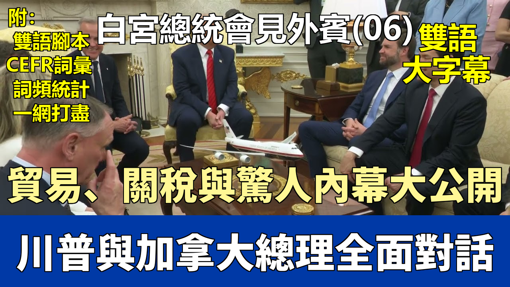

{% video youtube:BIFrSP9LA-g width:100% autoplay:0 %}


### 【中英文双语脚本】

Thank you very much everybody.
非常感謝大家。
It's a great honor to have Prime Minister Mark Carney with us.
非常榮幸能邀請到馬克·卡尼總理和我們在一起。
As you know, just a few days ago he won a very big election in Canada.
如你們所知，就在幾天前，他在加拿大贏得了一場非常重要的選舉。
And I think I was probably the greatest thing that happened to him, but I can't take that back.
而且我想我大概是他遇到的最棒的事情了，但我不能收回這句話。
His party was losing by a lot, and he ended up winning. So I really want to congratulate him.
他的政黨曾大幅落後，但他最終贏了。所以我真心想祝賀他。
It was probably one of the greatest comebacks in the history of politics. Maybe even greater than mine, you know.
這可能是政治史上最偉大的東山再起之一。也許比我的那次還要偉大，你們知道的。
But I want to just congratulate you. It was a great election, actually.
但我只想祝賀你。這確實是一場很棒的選舉。
We were watching it with interest.
我們饒有興趣地關注了它。
And I think Canada chose a very talented person, a very good person, because we spoke before the election quite a few times.
而且我認爲加拿大選擇了一個非常有才華的人，一個非常好的人，因爲我們在選舉前聊過好幾次。
And it's an honor to have you at the White House and the Oval Office.
很榮幸能邀請您來到白宮和橢圓形辦公室。
You see the new and improved Oval Office as it becomes more and more beautiful with love.
您看到的這個煥然一新的橢圓形辦公室，因爲它充滿了愛而變得越來越美麗。
We handle it with great love and 24-carat gold. That always helps, too.
我們用愛心和24K金來打理它。那也總是有幫助的。
But it's been a lot of fun going over some of the beautiful pictures that were stored in the vaults, that were for many, many years, in some cases, over 100 years.
但是，翻閱那些存放在保險庫裏許多許多年，有些情況下甚至超過100年的美麗照片，真的很有趣。
They were stored in vaults of the great presidents who are almost great presidents, all having a reason for being up, every one of them.
它們存放在那些偉大總統——他們幾乎都是偉大的總統——的保險庫中，每一幅都有其存在的理由。
So it's very interesting. But I just want to congratulate you.
所以這非常有趣。但我只是想祝賀你。
And he ran a really great race. I watched the debate, and I thought you were excellent.
他 действительно провел отличную гонку. 我看了辯論，我覺得你表現非常出色。
And I think we have a lot of things in common.
而且我認爲我們有很多共同點。
We have some tough points to go over, and that'll be fine.
我們有一些棘手的問題需要討論，不過那會沒事的。
But we're going to also be discussing Ukraine-Russia, the war, because Mark wants it ended as quickly as I do.
但我們也將討論烏克蘭-俄羅斯問題，這場戰爭，因爲馬克和我一樣希望它儘快結束。
I think it has to end. We had some very good news last night.
我認爲它必須結束。我們昨晚得到了一些非常好的消息。
The Houthis have announced that they are not, or they've been announced to us, at least, that they don't want to fight anymore.
胡塞武裝已經宣佈他們不再——或者至少我們得到消息稱——他們不想再打了。
They just don't want to fight. And we will honor that.
他們只是不想打了。我們會尊重這一點。
And we will stop the bombings. And they have capitulated.
我們將停止轟炸。他們已經投降了。
But more importantly, we will take their word. They say they will not be blowing up ships anymore.
但更重要的是，我們會相信他們的話。他們說他們不會再炸燬船隻了。
And that's the purpose of what we were doing. So that's just news. We just found out about that.
而這正是我們行動的目的。所以這只是個消息。我們剛剛得知。
So I think that's very, very positive.
所以我認爲這是非常非常積極的。
They were knocking out a lot of ships going, as you know, sailing beautifully down the various seas.
如你們所知，他們曾擊毀許多在各海域漂亮航行的船隻。
It wasn't just the canal; it was a lot of other places. And I will accept their word.
不僅僅是運河，還有很多其他地方。我會接受他們的話。
And we are going to stop the bombing of the Houthis. Effective immediately.
我們將停止對胡塞武裝的轟炸。立即生效。
And, Marco, you'll let everybody know that. Okay?
而且，馬可，你會讓所有人都知道這件事。好嗎？
Do you have something to say about that, by the way? It's a pretty big announcement.
順便問一下，關於這件事你有什麼要說的嗎？這可是個相當重大的宣佈。
Yeah, this was always a freedom of navigation mission.
是的，這一直是一項航行自由任務。
Besides, these are, you know, a band of individuals with advanced weaponry that were threatening global shipping.
此外，你知道，這是一羣擁有先進武器、威脅全球航運的個人。
And the job was to get that to stop. And if it's going to stop, then we can stop.
而我們的任務就是阻止那種情況。如果它要停止，那麼我們就可以停止。
And so I think it's an important development.
所以我認爲這是一個重要的進展。
And we'll have, maybe before we're going to, as you know, the Middle East and Saudi Arabia, we're going to UAE and Qatar.
我們將會，也許在我們去中東和沙特阿拉伯之前，如你們所知，我們會去阿聯酋和卡塔爾。
And that'll be, I guess, Monday night. Some of you are coming with us.
我想那會是週一晚上。你們中的一些人會和我們一起去。
I think before then we're going to have a very, very big announcement to make. Like as big as it gets.
我想在那之前我們將有一個非常非常重大的宣佈。可以說是重大至極。
And I won't tell you on what. But it's going to, and it's very positive.
我不會告訴你們是什麼內容。但它即將發生，而且非常積極。
I'd also tell you if it was negative or positive. I can't keep that out. It is really, really positive.
我也會告訴你們它是消極的還是積極的。我瞞不住這個。它確實是非常非常積極的。
And that announcement will be made either Thursday or Friday or Monday before we leave.
那個宣佈將在我們離開前的週四、週五或週一進行。
But it'll be one of the most important announcements that have been made in many years about a certain subject, a very important subject.
但這將是多年來就某一特定主題，一個非常重要的主題所做的最重要的宣佈之一。
So you'll all be here. Mark, would you like to say a few words?
所以你們都會在這裏。馬克，你想說幾句嗎？
Thank you, Mr. President. I'm on the edge of my seat, actually.
謝謝您，總統先生。事實上，我正緊張地期待着。
But thank you for your hospitality and above all for your leadership.
但感謝您的盛情款待，尤其感謝您的領導力。
You're a transformational president, the focus on the economy with a relentless focus on the American worker, securing your borders, providing,
您是一位變革型的總統，專注於經濟，不懈地關注美國工人，保衛國家邊境，提供保障，
ending the scourge of fentanyl and other opioids, and securing the world.
消除芬太尼和其他阿片類藥物的禍害，並保障世界安全。
And I've been elected with my colleagues here, with the help of my colleagues here, I'm going to spread the credit, to transform Canada
我與在座的同事們一起當選，在他們的幫助下，我要分享這份功勞，去改造加拿大，
with a similar focus on the economy, securing our borders, again, on fentanyl, much greater focus on defense and security,
同樣以經濟爲重點，保衛我們的邊境，再次強調芬太尼問題，更加關注國防和安全，
securing the Arctic and developing the Arctic.
保衛北極和開發北極。
And the history of Canada and the U.S. is we're stronger when we work together, and there's many opportunities to work together.
加拿大和美國曆史表明，當我們合作時會更強大，而且有很多合作的機會。
And I look forward to, you know, addressing some of those issues that we have,
我期待着，你知道，解決我們之間存在的一些問題，
but also finding those areas of mutual cooperation so we can work.
同時也找到那些可以共同合作的領域，以便我們能夠共事。
Great. That's great. Very nice. Thank you very much. It's a very nice statement.
太好了。那很棒。非常好。非常感謝。這是一個非常好的聲明。
Anybody? Mr. President, is USMCA dead?
還有人嗎？總統先生，美墨加協定（USMCA）黃了嗎？
No. It was actually very effective, and it's still very effective, but people have to follow it.
不。它實際上非常有效，現在依然非常有效，但人們必須遵守它。
So, you know, that's been a problem. People haven't followed it.
所以，你知道，那一向是個問題。人們沒有遵守它。
But it was a transitional step a little bit. And as you know, it terminates fairly shortly. It gets renegotiated very shortly.
但這只是一個過渡性措施。如你所知，它很快就會到期。很快就會重新談判。
But I thought it was a very positive step from NAFTA.
但我認爲這是從北美自由貿易協定（NAFTA）邁出的非常積極的一步。
NAFTA was the worst trade deal in the history of our country, probably in the history of the world. And this was a transitional deal.
NAFTA 是我國曆史上，或許也是世界歷史上最糟糕的貿易協定。而這是一個過渡性的協定。
And we'll see what happens. You know, we're going to be starting to possibly renegotiate that if it's even necessary.
我們將拭目以待。你知道，如果還有必要的話，我們可能會開始重新談判。
I don't know that it's necessary anymore. But it served a very good purpose.
我不知道現在是否還有必要。但它達到了一個很好的目的。
And the biggest purpose it served is we got rid of NAFTA. NAFTA was a very unfair deal for the United States.
它所達成的最大目的是我們擺脫了 NAFTA。NAFTA 對美國來說是一項非常不公平的協議。
A very, very terrible deal. It should have never been made. It was made many years ago, but it should have never been made.
一項非常非常糟糕的協議。它根本就不應該被簽訂。它是很多年前簽訂的，但它根本就不應該被簽訂。
The Press: Mr. President, you've been in the United States. Would you like to see your first trade deal be with Canada? Our neighbors.
記者：總統先生，您一直在美國。您希望您的第一個貿易協議是與加拿大，我們的鄰國達成嗎？
The President: I would love that. Look, I have a lot of respect for this man.
總統：我很樂意。聽着，我非常尊敬這個人。
And I watched him come up, in a sense, through the ranks when he wasn't given much of a chance.
我看着他，在某種意義上，在不被看好的情況下，一步步晉升上來。
And he did, he ran a really great campaign. He did a really great debate. I think that debate was very helpful.
他確實幹得不錯，他發起了一場非常棒的競選活動。他進行了一場非常棒的辯論。我認爲那場辯論非常有幫助。
I was going to raise my hand. I don't know if that's good or bad. I shouldn't say that. That might hurt you.
我本打算舉手的。我不知道那是好是壞。我不該那麼說。那可能會傷害到你。
But no, he ran a really great election, I thought. And yeah, something could happen. Something could happen. Yeah, please.
但不，我認爲他進行了一場非常棒的選舉。是的，有些事情可能會發生。有些事情可能會發生。是的，請。
The Press: What's the top concession you want out of Canada? The top concession you want out of Canada?
記者：您最想從加拿大得到什麼讓步？您最想從加拿大得到什麼讓步？
The President: Concession?
總統：讓步？
The Press: Yes.
記者：是的。
The President: Friendship.
總統：友誼。
The Press: But that's not a concession.
記者：但那不是讓步。
The President: No. I just, I just, we're going to be friends with Canada.
總統：不。我只是，我只是，我們將和加拿大成爲朋友。
Regardless of anything, we're going to be friends with Canada. Canada is a very special place to me.
無論如何，我們將和加拿大成爲朋友。加拿大對我來說是一個非常特別的地方。
I know so many people that live in Canada. My parents had relatives that lived in Canada. My mother, in particular.
我認識很多住在加拿大的人。我的父母有親戚住在加拿大。尤其是我母親。
And I love Canada. A lot of, I have a lot of respect for the Canadians. Wayne Gretzky. I mean, how good, the great one.
而且我熱愛加拿大。很多，我非常尊重加拿大人。韋恩·格雷茨基。我的意思是，多麼優秀，那位偉人。
You happen to have a very, very good hockey player right here on the Capitals, who I admire a lot; he is a big, tough cookie.
你們首都隊正好有一位非常非常優秀的冰球運動員，我非常欣賞他；他是個厲害角色。
He just broke the record. And he's a great guy.
他剛剛打破了紀錄。而且他是個很棒的人。
And, you know, we had the team here, and I got to know a lot of the players. But Canada is a very special place. Yeah, please.
而且，你知道，我們曾邀請球隊來這裏，我認識了很多球員。但加拿大是一個非常特別的地方。是的，請。
The Press: Mr. President, and, Mr. Prime Minister, I'd like to get your response to this, too.
記者：總統先生，以及總理先生，我也想聽聽您對此的迴應。
Mr. President, you had said that Canada should become the 51st state for the jobs?
總統先生，您曾說過加拿大爲了就業機會應該成爲第51個州？
The President: No, no. Well, I still believe that. But, you know, it takes two to tango, right?
總統：不，不。嗯，我仍然那麼認爲。但是，你知道，一個巴掌拍不響，對吧？
But, no, I do. I mean, I believe it would be a massive tax cut for the Canadian citizens.
但不，我確實是這麼想的。我的意思是，我相信這對加拿大公民來說將是一次大規模的減稅。
You get free military, you get tremendous medical care and other things.
你們可以獲得免費的軍事保護，獲得極好的醫療保健和其他福利。
There would be a lot of advantages, but it would be a massive tax cut.
會有很多好處，但這將是一次大規模的減稅。
And it's also a beautiful, you know, as a real estate developer, you know, I'm a real estate developer at heart.
而且它也很美，你知道，作爲一名房地產開發商，你知道，我骨子裏是個房地產開發商。
When you get rid of that artificially drawn line, somebody drew that line many years ago with, like, a ruler, just a straight line right across the top of the country.
當你去掉那條人爲劃定的界線時，那是很多年前有人用尺子之類的東西劃的，就在國家頂部橫着一條直線。
When you look at that beautiful formation when it's together, I'm a very artistic person, but when I looked at that beauty, I said that's the way it was meant to be.
當你看到它們合在一起時的美麗形態，我是一個非常有藝術感的人，但是當我看到那種美時，我說那纔是它本該有的樣子。
But, you know, I just, I do feel it's much better for Canada.
但是，你知道，我只是，我確實覺得這對加拿大來說要好得多。
But we're not going to be discussing that unless somebody wants to discuss it.
但我們不打算討論那個，除非有人想討論。
I think that there are tremendous benefits to the Canadian citizens, tremendously lower taxes, free military, which, honestly, we give you essentially anyway,
我認爲這對加拿大公民有巨大的好處，極低的稅收，免費的軍事保護，老實說，我們基本上無論如何都會給你們提供這些，
because we're protecting Canada, if you had a problem.
因爲如果你們遇到問題，我們會保護加拿大。
But I think, you know, it would really be a wonderful marriage because it's two places that get along very well. They like each other a lot.
但我認爲，你知道，這確實會是一段美好的聯姻，因爲這是兩個相處得非常好的地方。他們非常喜歡彼此。
Well, if I may, as you know, from real estate, there are some places that are never for sale.
嗯，恕我直言，正如您從房地產行業所知，有些地方是永遠不會出售的。
That's true. We're sitting in one right now, you know, Buckingham Palace, that you visited as well.
沒錯。我們現在就坐在其中一個這樣的地方，你知道，白金漢宮，您也參觀過。
And having met with the owners of Canada over the course of the campaign, last several months, it's not for sale, won't be for sale ever.
在過去幾個月的競選過程中，我已經和加拿大的“所有者們”見過面，它（加拿大）是非賣品，永遠都不會是。
But the opportunity is in the partnership and what we can build together. We have done that in the past.
但機會在於夥伴關係以及我們能共同建設的事業。我們過去就這樣做過。
And part of that, as the President just said, is with respect to our own security.
其中一部分，正如總統剛纔所說，是關於我們自身的安全。
And my government is committed for a step change in our investment in Canadian security and our partnership,
我的政府致力於在加拿大安全和我們的夥伴關係方面的投資實現階段性變化，
and I'll say this as well, that the President has revitalized international security, revitalized NATO, and us playing our full weight in NATO.
我還要說的是，總統已經振興了國際安全，振興了北約，並讓我們在北約中充分發揮作用。
And that will be part of it.
那也將是其中的一部分。
The Press: Mr. President, you never talk about Mexico.
記者：總統先生，您從不談論墨西哥。
The President: They have, I must say, Canada is stepping up the military participation because Mark knew, you know, they were low, and now they're stepping it up.
總統：他們已經，我必須說，加拿大正在加強軍事參與，因爲馬克知道，你知道，他們以前的參與度很低，現在他們正在加強。
And that's a very important thing. But never say never. Never say never.
那是非常重要的事情。但永遠別說絕不。永遠別說絕不。
The Press: Mr. President, you can't say that. What would it take to get the terrorists off of Canada?
記者：總統先生，您不能那麼說。要怎樣才能把恐怖分子趕出加拿大？
The President: Well, we'll be talking about different things.
總統：嗯，我們會討論不同的事情。
Like, you know, we want to protect our automobile business, and so does Mark.
比如，你知道，我們想保護我們的汽車產業，馬克也是。
But we want to protect, we want to make the automobiles, and we want to, you know, we have a tremendous abundance of energy, more than any country.
但我們想保護，我們想製造汽車，我們想，你知道，我們擁有巨大的能源儲備，比任何國家都多。
We have, just in Alaska alone, ANWR has been reopened now. ANWR is probably the largest find anywhere in the world.
我們僅在阿拉斯加，北極國家野生動物保護區（ANWR）現已重新開放。ANWR 可能是世界上最大的油氣發現地。
They say it's larger than Saudi Arabia. I don't know, but it's a lot.
他們說它比沙特阿拉伯還大。我不知道，但儲量很多。
But we have tremendous amounts of energy. Other countries don't. We're both lucky in that way. They have energy. We have energy.
但我們擁有巨大的能源。其他國家沒有。在這方面我們都很幸運。他們有能源。我們有能源。
We have more than we can ever use and more than we could ever sell, actually. And you have the same thing.
實際上，我們的能源多到我們永遠用不完，也永遠賣不完。你們也一樣。
So we're two countries that are very lucky. If you look at China, they don't have that. You know, it's a big disadvantage.
所以我們是兩個非常幸運的國家。如果你看中國，他們沒有這個。你知道，這是一個很大的劣勢。
Other countries, most countries don't have, you know, most countries don't have that.
其他國家，大多數國家沒有，你知道，大多數國家沒有那個。
So Canada and us, we have a lot of, a lot of advantages over other places.
所以加拿大和我們，我們比其他地方有很多很多優勢。
When you consider what Mr. Carney just said, that Canada is not for sale, does this make the discussion a little more difficult to start on?
考慮到卡尼先生剛纔說加拿大是非賣品，這是否讓討論的開端變得更困難一些？
No, not at all. No, not at all. No, time. Time will tell. It's only time.
不，一點也不。不，一點也不。不，時間。時間會證明一切。只是時間問題。
But I say, never say never. I've had many, many things that were not doable, and they ended up being doable.
但我說，永遠別說絕不。我遇到過很多很多原以爲做不到的事情，最終都做到了。
And only doable in a very friendly way. But if it's to everybody's benefit, you know, Canada loves us and we love Canada.
而且只能以非常友好的方式做到。但如果這對大家都有利，你知道，加拿大愛我們，我們也愛加拿大。
That's, I think, the number one thing that's important. But we'll see. I mean, over time, we'll see what happens. China.
我認爲，這纔是最重要的。但我們會看到的。我的意思是，隨着時間的推移，我們會看到結果。中國。
The Press: Mr. President, I was hoping you could clarify something.
記者：總統先生，我希望您能澄清一些事情。
Earlier this morning, Capitol Hill Secretary Vest said that there had been no negotiations yet with China. Do you assert something different? Do you clarify?
今天早上早些時候，國會山的維斯特部長說，尚未與中國進行任何談判。您有不同的說法嗎？您能澄清一下嗎？
The President: They want to meet. And they're doing no business right now. And those ships are turning around in the Pacific Ocean. Big turn.
總統：他們想見面。他們現在沒有任何業務往來。那些船隻正在太平洋上掉頭。大轉彎。
Those are big ships. Those ships take about 10 miles to turn.
那些都是大船。那些船掉頭大約需要10英里。
And you know, we lost a trillion dollars to China on trade because of an incompetent president that we had who preceded me, who was grossly incompetent.
你知道，由於我們前任總統的無能，一個極其無能的總統，我們在與中國的貿易中損失了一萬億美元。
You're finding it out more and more now. And by not trading, we're losing nothing. So we're saving a trillion dollars. It's a lot.
你們現在越來越清楚地認識到這一點。不進行貿易，我們什麼也沒損失。所以我們節省了一萬億美元。這很多。
But they want to negotiate and they want to have a meeting, and we'll be meeting with them at the right time.
但他們想談判，他們想開會，我們會在合適的時候和他們見面。
The Press: But you haven't met with them yet?
記者：但您還沒和他們見過面？
The President: I have not met with them yet. Of course. You would know if I met. I tell you, they want to meet.
總統：我還沒和他們見過面。當然。如果我見了，你們會知道的。我告訴你們，他們想見面。
But you know, we are right now, look, they're suffering greatly. Their economy is suffering greatly because they're not doing trade with the U.S.
但是你知道，我們現在，看，他們正遭受巨大的痛苦。他們的經濟因爲不和美國做生意而遭受巨大損失。
And they made most of their money off the U.S. Don't kid yourself. They don't make the money off other countries like this.
他們大部分的錢都是從美國賺的。別騙自己了。他們不像這樣從其他國家賺錢。
And they were making, we had a trade imbalance. We had a deficit, or they had a surplus, another way of saying it, of more than a trillion dollars.
他們當時在賺取，我們存在貿易不平衡。我們有超過一萬億美元的逆差，或者換句話說，他們有超過一萬億美元的順差。
Think of it. More than a trillion dollars.
想想看。超過一萬億美元。
And because of 145 percent—that's the only reason—but because they now have a 145 percent tariff, there's no trading.
而且因爲145%——這是唯一的原因——但因爲他們現在有145%的關稅，所以沒有貿易了。
You can't trade with 145 percent. We are, therefore, making, in a certain way, I guess, $1.1 trillion.
你無法在145%的關稅下進行貿易。因此，我想，在某種程度上，我們正在賺取1.1萬億美元。
In other words, we're not losing $1.1 trillion; our deficit is much better.
換句話說，我們沒有損失1.1萬億美元；我們的赤字狀況好多了。
When I started, I say we were losing billions of dollars a day on trade. That's rapidly turning around. We looked at numbers this morning.
我剛開始的時候，我說我們每天在貿易上損失數十億美元。情況正在迅速好轉。我們今天早上看了數據。
So we were losing, the United States, during Biden, was losing more than, I won't even give you numbers because they're so embarrassing,
所以我們當時在虧損，美國在拜登執政期間，虧損的數額超過了——我甚至不給你們具體數字，因爲太難堪了——
but billions of dollars a day on trade. Those numbers are rapidly turning between the tariffs.
但每天在貿易上損失數十億美元。由於關稅，這些數字正在迅速轉變。
Don't forget, we're now getting 25 percent on cars, 25 percent on aluminum, 25 percent on steel, and maybe more importantly,
別忘了，我們現在對汽車徵收25%的關稅，對鋁徵收25%，對鋼鐵徵收25%，而且可能更重要的是，
massive numbers of companies are moving into the United States. Honda, we have tremendous, the car companies are moving in at levels we've never seen before.
大量公司正在遷入美國。本田，我們有巨大的（投資），汽車公司正以前所未有的規模遷入。
The biggest investment ever made in the United States is being made right now, trillions of dollars. I would say we could be at $9 trillion.
美國有史以來最大規模的投資正在進行中，數萬億美元。我想我們可能達到9萬億美元。
You could go back to other presidents who haven't had $1 trillion for their entire term. Look at Biden. He had bad numbers. People are leaving.
你可以回顧一下其他總統，他們在整個任期內都沒有1萬億美元的投資。看看拜登。他的數據很糟糕。人們在離開。
They weren't coming in. They were leaving with Biden, and he didn't know the difference.
他們沒有進來。他們在拜登執政時離開，而他卻不知道區別。
The only thing he knew is people coming in. You know who they were? Illegal immigrants, okay, from prisons, from mental institutions,
他唯一知道的就是有人進來。你知道他們是誰嗎？非法移民，好的，來自監獄，來自精神病院，
from all sorts of places that weren't good, from gangs, from Venezuela.
來自各種不好的地方，來自幫派，來自委內瑞拉。
They were coming in, and there were criminals and murderers, 11,888 people that murdered, and at least half of them murdered more than one person.
他們進來了，其中有罪犯和殺人犯，11888名殺人犯，其中至少一半人殺害了不止一個人。
This is what Biden led into our country. I'm bringing in big companies.
這就是拜登帶給我們國家的。我正在引進大公司。
We have, Apple is investing $500 billion. We have Jensen, as you know, who's going to be involved with another $500 billion, biggest chipmaker, or chip thinker, I call him.
我們有，蘋果公司正在投資5000億美元。我們有詹森，如你們所知，他將參與另外5000億美元的項目，是最大的芯片製造商，或者我稱他爲芯片思想家。
He's really a thinker, more than a maker. But we also have the maker, Mr. Wei.
他確實更像一個思想家，而不是製造商。但我們也有製造商，魏先生。
I got to know them all; in the last, it was a cram course. But they're all moving into America because of the tariffs.
我最近才認識他們所有人；這就像一個速成班。但他們都因爲關稅而遷往美國。
And, I don't think people have appreciated it. Some people do. Some of the smart people do.
而且，我認爲人們還沒有意識到這一點。有些人意識到了。一些聰明人意識到了。
So we have more money coming in. It's really an amazing thing.
所以我們有更多的資金流入。這真是一件了不起的事情。
We have more money being invested in the United States now than at any time ever before in our history, and it's not even close.
現在投資到美國的資金比我們歷史上任何時候都多，而且遙遙領先。
And I think the real number could be 9 or 10 trillion. We don't know everybody that's doing it.
我認爲真實數字可能是9萬億或10萬億。我們不知道所有參與其中的人。
We have many, I just heard about a plant that's being built right now, a very, very top-of-the-line company.
我們有很多，我剛剛聽說一個正在建設的工廠，一家非常非常頂尖的公司。
And they didn't come to the White House. They're just doing it because they're making it, because if they build here, there are no tariffs.
他們沒有來白宮。他們只是在做，因爲他們在製造，因爲如果他們在這裏建廠，就沒有關稅。
And this is the big market. This is the market. That sets us apart from it. This is the market where everyone wants to be.
而這纔是大市場。這纔是市場。這將我們與它區分開來。這是人人都想進入的市場。
Now, if I didn't come here and do this, all of a sudden, we wouldn't be the market where everyone wants to be. So we're able to do it in time.
現在，如果我沒來這裏做這件事，突然之間，我們就不會是人人都想進入的市場了。所以我們及時做到了。
But we're going to have a great announcement. And I'm not necessarily saying it's on trade.
但我們將有一個重大的宣佈。而且我不一定說 это касается торговли.
Going back to the beginning, we're going to have a great announcement over the next few days, an announcement that will be so incredible, so positive.
回到開頭，我們未來幾天將有一個重大的宣佈，一個如此不可思議、如此積極的宣佈。
And I'm not saying, I don't want you to think it's necessarily on trade.
而且我不是說，我不希望你們認爲這必然與貿易有關。
Just to finish, we also have a situation, because everyone says, "When? When? When are you going to sign deals?"
最後，我們還有一種情況，因爲每個人都在說：“什麼時候？什麼時候？你們什麼時候籤協議？”
We don't have to sign deals. We could sign 25 deals right now, Howard, if we wanted. We don't have to sign deals.
我們不必簽署協議。霍華德，如果我們願意，我們現在就可以簽署25項協議。我們不必簽署協議。
They have to sign deals with us. They want a piece of our market. We don't want a piece of their market. We don't care about their market.
他們必須和我們簽署協議。他們想要我們市場的一塊蛋糕。我們不想要他們市場的一塊蛋糕。我們不在乎他們的市場。
They want a piece of our market. So we can just sit down, and I'll do this at some point over the next two weeks,
他們想要我們市場的一塊蛋糕。所以我們可以坐下來談，我會在未來兩週的某個時候這樣做，
and I'll sit with Howard and Scott and with our great Vice President, who has done a really good job.
我會和霍華德、斯科特以及我們偉大的副總統坐下來，他做得非常好。
We have some good news to report on a lot of fronts. But JD will be there and Marco, and we're going to sit down and we're going to put very fair numbers down,
我們在很多方面都有好消息要報告。但JD和馬可都會在場，我們會坐下來，我們會提出非常公平的數字，
and we're going to say, "Here's what this country, what we want, and congratulations, we have a deal."
我們會說：“這就是這個國家，我們想要的，恭喜，我們達成協議了。”
And they'll either say, "Great," and they'll start shopping, or they'll say, "Not good. We're not going to do it."
他們要麼會說：“太好了，”然後開始購買，要麼會說：“不好。我們不幹。”
And they'll say, "That's okay. You don't have to shop." Now, we may think, well, they have a right, you know, that maybe we were a little bit wrong, so we'll adjust it.
他們會說：“沒關係。你們不必購買。”現在，我們可能會想，好吧，他們有權利，你知道，也許我們有點錯了，所以我們會調整它。
And then you people will say, "Oh, it's so chaotic." No, we're flexible.
然後你們這些人會說：“哦，太混亂了。”不，我們是靈活的。
But we'll sit down and we'll, at some point, in some cases, we'll sign some deals. It's much less important than what I'm talking about.
但我們會坐下來，在某個時候，在某些情況下，我們會簽署一些協議。這遠沒有我正在談論的那麼重要。
For the most part, we're just going to put down a number and say, "This is what you're going to pay to shop."
在大多數情況下，我們只會給出一個數字，然後說：“這就是你們購物需要支付的價格。”
And it's going to be a very fair number. It'll be a low number. We're not looking to hurt countries. We want to help countries. We want to be friendly with countries.
這將是一個非常公平的數字。會是一個較低的數字。我們不打算傷害任何國家。我們想幫助其他國家。我們想與其他國家友好相處。
But you keep writing about deals, deals. When are we going to sign?
但你們一直在寫關於協議、協議的事情。我們什麼時候籤？
One, it's very simple. We're going to say, in some cases, we want you to open up your country. In some cases, we want you to drop your tariffs.
第一，這很簡單。我們會說，在某些情況下，我們希望你們開放你們的國家。在某些情況下，我們希望你們降低關稅。
I mean, India, as an example, is one of the highest tariffs in the world. We're not going to put up with that. And they've agreed already to drop it.
我的意思是，以印度爲例，它是世界上關稅最高的國家之一。我們不會容忍這一點。他們已經同意降低關稅了。
They'll drop it to nothing. They've already agreed. They would have never done that for anybody else but me.
他們會把關稅降到零。他們已經同意了。除了我，他們絕不會爲任何人這樣做。
So we're going to put down some numbers, and we're going to say, "Our country is open for business."
所以我們會給出一些數字，然後我們會說：“我們的國家對商業開放。”
And they're going to come in, and they're going to pay for the privilege of being able to shop in the United States of America. It's very simple.
他們會進來，他們會爲能夠在美國購物的特權付費。這很簡單。
It's very simple. So I wish they'd, you know, stop asking, "How many deals are you signing this week?"
這很簡單。所以我希望他們，你知道，別再問：“你這周要籤多少協議？”
Because one day, we'll come and we'll give you 100 deals. And they don't have to sign.
因爲總有一天，我們會來給你們100個協議。他們不必簽署。
All they have to do is say, "Oh, we'll start sending our ships right now to pick up whatever we want or to bring whatever we want." It's very, very simple.
他們只需要說：“哦，我們現在就派船去取我們想要的任何東西，或者運來我們想要的任何東西。”這非常非常簡單。
And I think my people haven't made it clear. We will sign some deals.
而且我認爲我的人沒有說清楚。我們會簽署一些協議。
But much bigger than that is we're going to put down the price that people are going to have to pay to shop in the United States.
但遠比這更重要的是，我們將設定人們在美國購物必須支付的價格。
Think of us as a super luxury store, a store that has the goods.
把我們想象成一家超級奢侈品店，一家擁有好貨的商店。
You're going to come and you're going to pay a price, and we're going to give you a very good price. We're going to make very good deals. And in some cases, we'll adjust.
你們會來，你們會付錢，我們會給你們一個非常好的價格。我們會做非常好的交易。在某些情況下，我們會進行調整。
But that's where it is. And we've been ripped off by everybody for 50 years, for 50 years. And we're just not going to do that anymore. We can't do that.
但情況就是這樣。我們已經被所有人敲詐了50年，整整50年。我們只是不打算再這樣做了。我們不能那樣做。
And we can't let any country do that to us. We're just not going to do it anymore.
我們不能讓任何國家那樣對待我們。我們只是不打算再那樣做了。
Mr. President, on the Houthis, can you tell us a bit more about the deal that you've reached with the Houthis that you mentioned?
總統先生，關於胡塞武裝，您能多告訴我們一些您提到的與他們達成的協議的細節嗎？
No, it's not a deal. They've said, "Please don't bomb us anymore. We're not going to attack your ships."
不，這不是協議。他們說：“請不要再轟炸我們了。我們不會攻擊你們的船隻。”
And where did you hear about that? It doesn't matter where I hear it.
你從哪裏聽說的？我從哪裏聽說的並不重要。
A very good source, I can tell you. Very, very good source. Would you say, Marco? I would say pretty good. Right, JD? Very good source.
一個非常可靠的消息來源，我可以告訴你。非常非常可靠的消息來源。你說呢，馬可？我會說相當不錯。對吧，JD？非常好的來源。
They don't want to be bombed anymore. I sort of thought that would happen.
他們不想再被轟炸了。我有點想到會發生這種事。
Mr. President, I'm sorry, but could you clarify something you said on USMCA? Is the U.S. prepared to walk away from that pact?
總統先生，抱歉，但您能澄清一下您在美墨加協定上說的一些話嗎？美國準備好退出該協定了嗎？
What pact? USMCA.
什麼協定？美墨加協定。
No, no, it's fine. It's there. It's good. We use it for certain things. It's there. The USMCA is a good deal for everybody.
不，不，它沒問題。它還在。它很好。我們用它來處理某些事情。它還在。美墨加協定對每個人來說都是一個好協議。
I won't say this about Mark, but I didn't like his predecessor. I didn't like a person that worked. She was terrible, actually. She was a terrible person.
我不會這麼說馬克，但我不喜歡他的前任。我不喜歡那個工作的人。她實際上很糟糕。她是個很糟糕的人。
And she really hurt that deal very badly because she tried to take advantage of the deal and she didn't get away with it. You know who I'm talking about.
她真的嚴重損害了那項協議，因爲她試圖利用協議佔便宜，但她沒有得逞。你知道我說的是誰。
So we had a bad relationship having to do with the fact that we disagreed with the way they viewed the deal and we ended it.
所以我們的關係不好，因爲我們不同意他們看待協議的方式，於是我們終止了它。
You know, we ended that relationship pretty much. The USMCA is great for all countries. It's good for all countries.
你知道，我們差不多結束了那段關係。美墨加協定對所有國家都很好。對所有國家都有利。
We do have a negotiation coming up over the next year or so to adjust it or terminate it.
我們確實在未來一年左右有一次談判，以調整或終止它。
Mr. President, I'll just say a word on USMCA if I may, Mr. President. It is a basis for a broader negotiation.
總統先生，如果可以的話，總統先生，我就美墨加協定說幾句。它是更廣泛談判的基礎。
Some things about it are going to have to change. And part of the way you've conducted these tariffs has taken advantage of existing aspects of USMCA.
其中一些內容將不得不改變。而且您實施這些關稅的方式，部分利用了美墨加協定現有的一些方面。
So it's going to have to change. There's other elements that are coming and that's part of what we're going to discuss. On board.
所以它必須改變。還有其他因素即將出現，這也是我們將要討論的一部分。同意。
During the campaign, Prime Minister Carney talked about the American betrayal.
在競選期間，卡尼總理談到了美國的背叛。
How did you react if Canada decided not to shop in the American store as much as before and decided to partner with other countries?
如果加拿大決定不像以前那樣在美國商店購物，並決定與其他國家合作，您會作何反應？
Well, we don't do much business with Canada from our standpoint. They do a lot of business with us. We're at like 4 percent.
嗯，從我們的角度來看，我們與加拿大的生意不多。他們與我們有很多生意往來。我們大概佔4%。
And usually those things don't last very long. You know, we have great things, great product,
通常那些事情不會持續很久。你知道，我們有很棒的東西，很棒的產品，
the kind of product we sell nobody else can sell, including military.
我們銷售的那種產品，沒有其他人能賣，包括軍用產品。
Look, we make the best military equipment in the world and Canada buys our military equipment, which we appreciate.
看，我們製造世界上最好的軍事裝備，加拿大購買我們的軍事裝備，對此我們表示感謝。
But we make the best military equipment in the world by far. The missiles, the submarines, everything, everything we have is really top notch.
但到目前爲止，我們製造的軍事裝備是世界上最好的。導彈、潛艇，一切，我們擁有的一切都是頂級的。
I rebuilt our military during our last term. Stupidly, we gave some away to Afghanistan, which shouldn't have happened.
我在上個任期內重建了我們的軍隊。愚蠢的是，我們把一些裝備給了阿富汗，這本不應該發生。
But that was, I think, the most embarrassing moment in the history of our country. It was just very incompetent people.
但我認爲，那是我國曆史上最尷尬的時刻。那只是一些非常無能的人造成的。
But if you look at the man that's now the head of our Joint Chiefs, he led the attack on ISIS for me.
但如果你看看現在我們參謀長聯席會議主席，是他爲我領導了對ISIS的攻擊。
That's why he's the head of the Joint Chiefs and is known for raising Cain. He was unbelievable.
所以他才能當上參謀長聯席會議主席，並以“能惹事”（善於製造麻煩）著稱。他太不可思議了。
And as you know, we defeated ISIS in three weeks. It was supposed to take five years. We did it in three weeks and he ran the campaign.
如你所知，我們在三週內擊敗了ISIS。原本預計需要五年。我們在三週內做到了，他負責指揮了那場戰役。
I said, I like him, but I knew him before I went. I went to Iraq and we agreed to a plan and that was the plan. And as you know, we did it in record time.
我說，我喜歡他，但在我去之前就認識他了。我去了伊拉克，我們商定了一個計劃，那就是那個計劃。如你所知，我們以創紀錄的時間完成了它。
So we have, you know, we have the best, we have the best equipment in the world. We have the best a lot of things.
所以我們擁有，你知道，我們擁有世界上最好的，我們擁有世界上最好的裝備。我們擁有很多最好的東西。
And but Canada does a lot more business with us than we do with Canada.
但是加拿大和我們做的生意比我們和加拿大做的要多得多。
Mr. President, when do you think the investments that you've announced, the trillions, will finally hit the economic data this year?
總統先生，您認爲您宣佈的數萬億投資何時會最終反映在今年的經濟數據中？
When you're saying about the tariffs? No, no, about the investments that you've announced.
你是說關於關稅嗎？不，不，是關於您宣佈的投資。
Oh, it's hitting right now. Look, they're already starting AI plans. These are not people that look for financing. That's a good thing.
哦，現在就已經開始顯現了。看，他們已經在啓動人工智能計劃了。這些人不需要尋找融資。這是件好事。
You know, in real estate, you get a site, then you have to look for financing. You have to get your zoning.
你知道，在房地產行業，你拿到一塊地，然後你必須尋找融資。你必須獲得規劃許可。
You know, five years later, you start building, you get a bank, then the bank's no good. These people have massive amounts of cash.
你知道，五年後，你開始建設，你找到一家銀行，然後那家銀行又不好了。這些人擁有鉅額現金。
The Chips Act was a ridiculous thing because that doesn't get them to build. All we did is hand very wealthy companies money.
《芯片法案》是個荒謬的東西，因爲它並不能讓他們去建設。我們所做的只是把錢交給非常富有的公司。
The Chips Act that was done by Biden. Billions, we give them billions of dollars. They don't even have to do anything with it.
拜登搞的《芯片法案》。數十億，我們給他們數十億美元。他們甚至不需要用它做任何事情。
And then if you weren't, if you didn't have, and I won't, I don't want to be a wise guy,
然後如果你不是，如果你沒有，我不會，我不想自作聰明，
but if you didn't go with the DEI, if you didn't go with all of the different things, woke, if you weren't woke, you couldn't even use the money.
但如果你不遵循DEI（多元化、公平和包容性），如果你不遵循所有那些不同的、“覺醒”的東西，如果你不“覺醒”，你甚至不能用那些錢。
You had to have a certain percentage of this and that and that and that. It's impossible, impossible to have the people, the companies actually complained to me.
你必須有一定比例的這個那個，那個那個。這不可能，不可能讓人們，那些公司實際上向我抱怨過。
They say they gave me all this money, but nobody can get these people to do anything.
他們說他們給了我這麼多錢，但沒人能讓這些人做任何事。
I mean, look, President Obama, and if he wanted help, I'd give him help because I'm a really good builder and I build on time, on budget.
我的意思是，看，奧巴馬總統，如果他需要幫助，我會幫助他，因爲我是一個非常優秀的建築商，我能按時、按預算完成建設。
He's building his library in Chicago. It's a disaster.
他正在芝加哥建他的圖書館。那簡直是一場災難。
And he said something to the effect, I only want DEI, I only want woke. He wants woke people to build it.
他說了類似這樣的話，我只要DEI，我只要“覺醒”的人。他想讓“覺醒”的人來建。
Well, he got woke people and they have massive cost overruns. The job is stopped. I don't know. It's a disaster.
好吧，他找到了“覺醒”的人，結果成本大幅超支。工程停了。我不知道。這是一場災難。
I don't like that happening because I think it's bad for the presidency that a thing like that should happen. He's got a library that's a disaster.
我不喜歡發生那樣的事情，因爲我認爲那樣的事情對總統職位不利。他的圖書館一團糟。
And he wanted to be very politically correct and he didn't use good, hard, tough, mean construction workers that I love, Marco. I love those construction workers.
他想非常政治正確，他沒有用我喜歡的那種優秀的、努力的、強悍的、厲害的建築工人，馬可。我愛那些建築工人。
But he didn't want construction workers. He wanted people that never did it before. He's got a disaster in his hands.
但他不想要建築工人。他想要以前從未做過的人。他現在手上是個爛攤子。
Like millions of dollars, many, many, I mean, really many millions of dollars over budget. And I would love to help him with it.
比如數百萬美元，很多很多，我的意思是，真的超預算很多很多百萬美元。我很樂意幫助他解決這個問題。
Or somebody else, I could recommend professionals. But it was not built in a professional manner.
或者其他人，我可以推薦專業人士。但它不是以專業的方式建造的。
By the way, nor was, in California, a little train going from San Francisco to Los Angeles that's being run by Gavin Newsom, the governor of California.
順便說一句，加州那個從舊金山到洛杉磯的小火車項目也不是，那是由加州州長加文·紐森負責的。
Did you ever hear of Gavin Newsom? That train is the worst cost overrun I've ever seen. It's like totally out of control.
你聽說過加文·紐森嗎？那列火車是我見過的最嚴重的成本超支。簡直完全失控了。
So then they said, all right, we won't go into San Francisco. We'll stop 25 miles short.
然後他們說，好吧，我們不進舊金山了。我們將在25英里外停下。
And we won't go into Los Angeles. We'll stop 25 miles short. It's hundreds of billions of dollars for this stupid project that should have never been built.
我們也不進洛杉磯了。我們將在25英里外停下。這個本不該建的愚蠢項目耗資數千億美元。
And then they realized that it would have been a lot less costly if we just gave limousine service back and forth and gave it free.
然後他們意識到，如果我們只是來回提供免費的豪華轎車服務，成本會低得多。
They would have saved hundreds of billions of dollars. They have airplanes that go there for one-hundredth the cost. And they have cars.
他們本可以節省數千億美元。他們有飛機去那裏，成本只有百分之一。他們還有汽車。
They have a thing called the highway that goes back and forth. It's not fully utilized. And they got involved with this project.
他們有一種叫做高速公路的東西，可以來回通行。它沒有得到充分利用。他們卻參與了這個項目。
And Gavin, you know, I always liked Gavin, had a good relationship with him. I just got him a lot of water.
而加文，你知道，我一直很喜歡加文，和他關係不錯。我剛幫他弄到很多水。
You know, I sent in people to open up that water because he refused to do it. And we just got him a lot of water.
你知道，我派人去開通那些水源，因爲他拒絕那麼做。我們剛幫他弄到很多水。
They would have had that water. And if they would have done what I said to do, they wouldn't have the fires in Los Angeles. Those fires would have been put out very quickly.
他們本可以擁有那些水。如果他們按照我說的去做，洛杉磯就不會發生那些火災。那些火災本可以很快被撲滅。
But if you think about it and you got to take a look at this, it's the worst cost overrun I've ever seen.
但如果你仔細想想，你必須看看這個，這是我見過的最嚴重的成本超支。
I've watched a lot of stupid people build a lot of stupid things, but that's the worst cost overrun I've ever seen. What's happening between San Francisco and Los Angeles.
我看過很多愚蠢的人建了很多愚蠢的東西，但那是我見過的最嚴重的成本超支。舊金山和洛杉磯之間發生的事情。
And you want to ask about that because this government is not going to pay.
而且你想問問那個，因爲這個政府不打算付錢。
I told our very great new Secretary of Transportation, he's doing a good job, Sean Duffy. I said, we're not going to pay for that thing.
我告訴了我們非常棒的新任交通部長，他做得很好，肖恩·達菲。我說，我們不打算爲那東西付錢。
They are just, it's out of control. This is something that you don't have for things like this. It's not even conceivable. Like 30 times over budget, 30 times.
他們簡直是，它失控了。這種事情是你無法想象的。簡直無法想象。比如超預算30倍，30倍。
It's the craziest thing. And now it's hundreds of, it was supposed to be a simple train. And I think the media should take a look at it.
這是最瘋狂的事情。現在是數百億，它本應該是一列簡單的火車。我認爲媒體應該關注一下。
And I'd love him to run for president on the other side. You know, I'd love to see that.
我很樂意看到他代表另一方競選總統。你知道，我很樂意看到那樣。
But I don't think he's going to be running because that one project alone, well that and the fires and a lot of other things pretty much put him out of the race.
但我認爲他不會參選，因爲單單那個項目，嗯，還有那些火災和很多其他事情，基本上讓他退出了競爭。
Mr. President, what changes would you like to see to the USMCA? Or what changes would you like to make?
總統先生，您希望看到美墨加協定有哪些改變？或者您想做出哪些改變？
We're going to work on some subtle changes. Maybe I don't even know if we're going to be dealing with USMCA. We're dealing more with concepts right now.
我們將致力於一些細微的改變。也許我甚至不知道我們是否會處理美墨加協定。我們現在更多地是在處理概念。
Look, right now we're doing trade. We have trade. They're paying a tariff on cars and steel and aluminum.
看，現在我們正在進行貿易。我們有貿易。他們正在爲汽車、鋼鐵和鋁支付關稅。
And I think we have a baseline of 10 percent or something like that for the tariffs. But we're getting along very well.
我想我們的關稅基準大概是10%左右。但我們相處得很好。
Right now, going no further, but we have an agreement. We did something with even parts.
目前，就到此爲止，但我們有一項協議。我們甚至在零部件方面也做了一些事情。
You want to discuss that, Howard, with respect to Canada, which helps Canada out?
霍華德，你想討論一下那個嗎？關於加拿大的，那對加拿大有幫助。
Sure. We have, we've made an arrangement with the car companies that 15 percent of their USMCA parts are included
當然。我們已經和汽車公司達成協議，他們15%的美墨加協定零部件被包括在內，
and then 15 percent of foreign parts from the manufactured suggested retail price are not tariffed to help domestic manufacturing really thrive.
然後製造商建議零售價中15%的外國零部件不徵收關稅，以幫助國內製造業真正蓬勃發展。
So it gave them a chance to be able to build their car parts factories, if they're going to be built.
所以這給了他們一個機會去建他們的汽車零部件工廠，如果這些工廠要建的話。
These companies already have factories and what they have to do is just fill them out. But they're able to build them in the United States.
這些公司已經有工廠了，他們要做的只是把它們填滿。但他們能夠在美國建廠。
So we gave them a pretty substantial period of time.
所以我們給了他們相當長的一段時間。
Just to clarify, Mr. President, is there anything the Prime Minister can say to you today to change your mind on tariffing Canada? Tariffing cars?
只是爲了澄清，總統先生，總理今天有什麼話能讓您改變對加拿大徵收關稅的想法嗎？對汽車徵收關稅？
Tariffing Canada. Is there anything he can say to you in the course of your meetings with him today that would get you to lift tariffs on Canada?
對加拿大徵收關稅。在他今天與您會晤的過程中，他有什麼話能讓您取消對加拿大的關稅嗎？
No. Why not?
不。爲什麼不？
Mr. President, if Canadians don't want it, would you respect that?
總統先生，如果加拿大人不想要，您會尊重嗎？
Sure I would. But this is not necessarily a one day deal. This is over a period of time they have to make that decision. Yes, go ahead.
我當然會。但這不一定是一天就能決定的交易。他們需要在一段時間內做出這個決定。是的，請說。
Yeah, if I may. Well, respectfully, Canadians' view on this is not going to change on the 51st state.
是的，如果可以的話。嗯，恕我直言，加拿大人對此的看法在成爲第51個州的問題上是不會改變的。
Secondly, we are the largest client of the United States in the totality of all the goods. So we are the largest client of the United States.
其次，就所有商品而言，我們是美國最大的客戶。所以我們是美國最大的客戶。
We have a tremendous auto sector between the two of us and the changes that may have been helpful.
我們兩國之間有一個巨大的汽車產業，那些可能有所幫助的改變。
You know, 50% of a car that comes from Canada is American. That's not like anywhere else in the world.
你知道，來自加拿大的汽車有50%是美國的。這在世界上其他任何地方都是沒有的。
And to your question about is there one thing, no, this is a bigger discussion.
至於你問的是否只有一件事，不，這是一個更大的討論。
There are much bigger forces involved and this will take some time and some discussions. And that's why we're here, to have those discussions.
這其中涉及到更大的力量，這需要一些時間和一些討論。這就是我們來這裏的原因，進行這些討論。
And that is represented by who's sitting around the table. See, the conflict is.
而這正由圍桌而坐的人們所代表。看，衝突就在於此。
And this is very friendly. This is not going to be like we had another little blow up with somebody else. That was much different.
而且這是非常友好的。這不會像我們和別人發生的那次小衝突一樣。那次情況大不相同。
This is a very friendly conversation. But we want to make our own cars. We don't really want cars from Canada.
這是一次非常友好的談話。但我們想自己製造汽車。我們並不真的想要加拿大的汽車。
And we put tariffs on cars from Canada. And at a certain point, it won't make economic sense for Canada to build those cars.
我們對來自加拿大的汽車徵收關稅。到某個時候，加拿大生產那些汽車在經濟上將不再划算。
And we don't want steel from Canada because we're making our own steel and we're having massive steel plants being built right now as we speak.
我們不想要加拿大的鋼鐵，因爲我們正在自己生產鋼鐵，而且就在我們說話的時候，大量鋼鐵廠正在建設中。
We really don't want Canadian steel and we don't want Canadian aluminum and various other things because we want to be able to do it ourselves.
我們真的不想要加拿大的鋼鐵，也不想要加拿大的鋁和各種其他東西，因爲我們希望能夠自己生產。
And because of past thinking of people, we have a tremendous deficit with Canada. In other words, they have a surplus with us.
而且由於過去人們的想法，我們與加拿大存在巨大的貿易逆差。換句話說，他們對我們有順差。
And there's no reason for us to be subsidizing Canada. Canada is a place that will have to be able to take care of itself economically. I assume they can.
我們沒有理由補貼加拿大。加拿大是一個必須能夠在經濟上照顧好自己的地方。我想他們可以。
I will tell you that Trudeau, when I spoke to him, I used to call him Governor Trudeau.
我會告訴你，特魯多，當我和他說話時，我過去常叫他特魯多省長。
I think that probably didn't help his election, but when I spoke to him, I said, "So why are we taking your cars? Why are we taking your..."
我想那可能對他的選舉沒有幫助，但當我和他說話時，我說：“那麼我們爲什麼要買你們的汽車？我們爲什麼要買你們的……”
"We want to make them ourselves." I mean, I said, "And if the price of your cars went up or if we put a tariff, if we put a tariff on your cars of 25 percent,
“我們想自己製造。”我的意思是，我說：“如果你們汽車的價格上漲，或者如果我們徵收關稅，如果我們對你們的汽車徵收25%的關稅，
what would that mean to you?" He said that would mean the end of Canada. He actually said that to me.
那對你們意味着什麼？”他說那將意味着加拿大的終結。他確實那樣對我說過。
And I said, "That's a strange answer, but I understand his answer."
我說：“這是一個奇怪的答案，但我理解他的答案。”
But no, I mean, it's hard to justify subsidizing Canada to the tune of maybe two hundred billion dollars a year.
但不，我的意思是，很難爲每年補貼加拿大高達約兩千億美元辯護。
We protect Canada militarily and we always will. We're going to, you know, that's not a money thing. But we always will.
我們在軍事上保護加拿大，而且我們將永遠這樣做。我們將，你知道，那不是錢的問題。但我們將永遠這樣做。
But, you know, it's not fair. But why are we subsidizing Canada two hundred billion dollars a year or whatever the number might be?
但是，你知道，這不公平。但我們爲什麼要每年補貼加拿大兩千億美元，或者不管具體數字是多少？
That's a substantial number. And it's hard for the American taxpayer to say, "Gee whiz, we love doing that." Thank you very much.
那是個相當大的數目。美國納稅人很難說：“哎呀，我們很樂意這樣做。”非常感謝。
We're going to have a very... Thank you. Thank you.
我們將進行一次非常……謝謝。謝謝。

### 【核心词汇 - B1_C2】
| 單詞 | 音標 | 詞性 | 釋義 | 等級 | 次數 |
|---|---|---|---|---|---|
| able | /ˈeɪbl/ | adjective | 能夠；有能力的 | B1 | 1 |
| abundance | /əˈbʌndəns/ | noun | 大量；豐富 | B1 | 1 |
| agreement | /əˈɡriːmənt/ | noun | 協議，同意 | B1 | 1 |
| amazing | /əˈmeɪzɪŋ/ | adjective | adj. 令人驚奇的；極好的 | B1 | 1 |
| amount | /əˈmaʊnt/ | noun | n. 數量；總額 | B1 | 1 |
| announce | /əˈnaʊns/ | verb | v. 宣佈；宣告 | B1 | 1 |
| announcement | /əˈnaʊnsmənt/ | noun | n. 聲明；公告 | B1 | 2 |
| arrangement | /əˈreɪndʒmənt/ | noun | 安排，約定 | B1 | 1 |
| artistic | /ɑːrˈtɪstɪk/ | adjective | 藝術的，有藝術天賦的 | B1 | 1 |
| aspect | /ˈæspekt/ | noun | 方面，層面 | B1 | 1 |
| assume | /əˈsuːm/ | verb | 假設，認爲 | B1 | 1 |
| basis | /ˈbeɪsɪs/ | noun | 基礎，根據 | B1 | 1 |
| beautifully | /ˈbjuːtɪfəli/ | adverb | 美麗地，出色地 | B1 | 1 |
| benefit | /ˈbenɪfɪt/ | noun | 好處 | B1 | 2 |
| bomb | /bɑːm/ | noun | 炸彈 | B1 | 3 |
| border | /ˈbɔːrdər/ | noun | 邊界；邊境 | B1 | 1 |
| broad | /brɔːd/ | adjective | 寬闊的；廣泛的 | B1 | 1 |
| builder | /ˈbɪldər/ | noun | 建築工人；建造者 | B1 | 1 |
| canal | /kəˈnæl/ | noun | 運河 | B1 | 1 |
| concept | /ˈkɑːnsɛpt/ | noun | n. 概念，觀念 | B1 | 1 |
| conduct | /ˈkɑːndʌkt/ | noun | n. 行爲，舉止；v. 指揮，引導 | B1 | 1 |
| conflict | /ˈkɑːnflɪkt/ | noun | n. 衝突，矛盾 | B1 | 1 |
| congratulate | /kənˈɡrætʃəleɪt/ | verb | v. 祝賀，恭喜 | B1 | 1 |
| congratulation | /kənˌɡrætʃəˈleɪʃn/ | noun | 祝賀 | B1 | 1 |
| construction | /kənˈstrʌkʃn/ | noun | n. 建造，建設；建築物 | B1 | 1 |
| criminal | /ˈkrɪmɪnl/ | noun | 罪犯 | B1 | 1 |
| decision | /dɪˈsɪʒn/ | noun | 決定；決策 | B1 | 1 |
| defeat | /dɪˈfiːt/ | verb | 擊敗；戰勝 | B1 | 1 |
| development | /dɪˈveləpmənt/ | noun | 發展；開發；事態發展 | B1 | 1 |
| disaster | /dɪˈzæstər/ | noun | 災難 | B1 | 1 |
| economic | /ˌekəˈnɑːmɪk/ | adjective | 經濟的 | B1 | 1 |
| economy | /iˈkɑːnəmi/ | noun | 經濟 | B1 | 1 |
| edge | /edʒ/ | noun | 邊緣；優勢 | B1 | 1 |
| effective | /ɪˈfektɪv/ | adjective | 有效的；生效的 | B1 | 2 |
| election | /ɪˈlekʃən/ | noun | 選舉 | B1 | 1 |
| element | /ˈelɪmənt/ | noun | 元素；要素 | B1 | 1 |
| entire | /ɪnˈtaɪər/ | adjective | 整個的；全部的 | B1 | 1 |
| equipment | /ɪˈkwɪpmənt/ | noun | 設備；裝備 | B1 | 1 |
| finding | /ˈfaɪndɪŋ/ | noun | 發現；發現物；調查結果 | B1 | 1 |
| forth | /fɔːrθ/ | adverb | 向前，向外 | B1 | 1 |
| gee | /dʒiː/ | interjection | （表示驚訝、興奮等）哎呀，天啊 | B1 | 1 |
| global | /ˈɡloʊbl/ | adjective | 全球的，世界的 | B1 | 1 |
| goods | /ɡʊdz/ | noun | 商品，貨物 | B1 | 1 |
| governor | /ˈɡʌvərnər/ | noun | 州長；主管人員，理事 | B1 | 1 |
| honestly | /ˈɑːnɪstli/ | adverb | 誠實地; 坦率地 | B1 | 1 |
| immediately | /ɪˈmiːdiətli/ | adverb | 立即，馬上 | B1 | 1 |
| incredible | /ɪnˈkredəbl/ | adjective | 難以置信的，極好的 | B1 | 1 |
| individual | /ˌɪndɪˈvɪdʒuəl/ | adjective | 個人的，單獨的 | B1 | 1 |
| invest | /ɪnˈvest/ | verb | 投資 | B1 | 2 |
| involved | /ɪnˈvɑːlvd/ | adjective | 參與的，捲入的 | B1 | 1 |
| leadership | /ˈliːdərʃɪp/ | noun | 領導能力，領導地位；領導階層 | B1 | 1 |
| lift | /lɪft/ | noun | 電梯，舉起 | B1 | 1 |
| marriage | /ˈmærɪdʒ/ | noun | 婚姻 | B1 | 1 |
| massive | /ˈmæsɪv/ | adjective | 巨大的 | B1 | 1 |
| mental | /ˈmentl/ | adjective | 精神的；心理的 | B1 | 1 |
| mile | /maɪl/ | noun | 英里 | B1 | 1 |
| mission | /ˈmɪʃn/ | noun | 任務；使命 | B1 | 1 |
| murderer | /ˈmɜːrdərər/ | noun | 殺人犯 | B1 | 1 |
| mutual | /ˈmjuːtʃuəl/ | adjective | 相互的；共同的 | B1 | 1 |
| negotiate | /nɪˈɡoʊʃieɪt/ | verb | 談判，協商 | B1 | 1 |
| negotiation | /nɪˌɡoʊʃiˈeɪʃn/ | noun | 談判，協商 | B1 | 2 |
| nor | /nɔr/ | conjunction | 也不 | B1 | 1 |
| politics | /ˈpɑləˌtɪks/ | noun | 政治；政治學；政治活動；政事 | B1 | 1 |
| positive | /ˈpɑːzətɪv/ | adjective | 積極的；肯定的；樂觀的；有益的；確定的；陽性的 | B1 | 1 |
| prepared | /prɪˈperd/ | adjective | 準備好的；預備好的 | B1 | 1 |
| president | /ˈprezɪdənt/ | noun | 總統；主席；校長 | B1 | 2 |
| prison | /ˈprɪzn/ | noun | 監獄 | B1 | 1 |
| protect | /prəˈtekt/ | verb | 保護 | B1 | 2 |
| race | /reɪs/ | noun | 種族；比賽 | B1 | 1 |
| rank | /ræŋk/ | noun | 等級，級別 | B1 | 1 |
| rapidly | /ˈræpɪdli/ | adverb | 迅速地，快速地 | B1 | 1 |
| react | /riˈækt/ | verb | 反應，迴應 | B1 | 1 |
| realize | /ˈriːəlaɪz/ | verb | 意識到 | B1 | 1 |
| rebuild | /ˌriːˈbɪld/ | verb | 重建，修復 | B1 | 1 |
| recommend | /ˌrekəˈmend/ | verb | 推薦，建議 | B1 | 1 |
| refuse | /rɪˈfjuːz/ | noun | 垃圾，廢物 | B1 | 1 |
| relationship | /rɪˈleɪʃnʃɪp/ | noun | 關係，聯繫 | B1 | 1 |
| relative | /ˈrelətɪv/ | adjective | 相對的，比較的 | B1 | 1 |
| respect | /rɪˈspekt/ | noun | 尊敬，尊重 | B1 | 1 |
| retail | /ˈriːteɪl/ | noun | 零售 | B1 | 1 |
| rid | /rɪd/ | verb | 使擺脫，使除去 | B1 | 1 |
| ridiculous | /rɪˈdɪkjələs/ | adjective | 荒謬的，可笑的 | B1 | 1 |
| secure | /sɪˈkjʊr/ | adjective | 安全的；可靠的 | B1 | 1 |
| security | /sɪˈkjʊrəti/ | noun | 安全；保障 | B1 | 1 |
| service | /ˈsɜːrvɪs/ | noun | 服務；服務業 | B1 | 1 |
| shortly | /ˈʃɔːrtli/ | adverb | 不久；很快 | B1 | 1 |
| sort | /sɔːrt/ | noun | 種類，類別；品質，品級；方式，方法 | B1 | 2 |
| steel | /stiːl/ | noun | 鋼；鋼鐵製品 | B1 | 1 |
| stupid | /ˈstuːpɪd/ | adjective | 愚蠢的，笨的 | B1 | 1 |
| submarine | /ˌsʌbməˈriːn/ | noun | 潛水艇 | B1 | 1 |
| substantial | /səbˈstænʃəl/ | adjective | 大量的，可觀的；重大的，實質性的 | B1 | 1 |
| suffer | /ˈsʌfər/ | verb | 遭受，忍受；患病 | B1 | 1 |
| suppose | /səˈpoʊz/ | verb | 假設，認爲 | B1 | 1 |
| talented | /ˈtæləntɪd/ | adjective | 有才能的，有天賦的 | B1 | 1 |
| tax | /tæks/ | noun | 稅，稅收 | B1 | 2 |
| term | /tɜːrm/ | noun | 術語；學期；條款 | B1 | 1 |
| totally | /ˈtoʊtəli/ | adverb | 完全地，徹底地 | B1 | 1 |
| transform | /trænsˈfɔːrm/ | verb | 改變，改造 | B1 | 1 |
| transitional | /trænˈzɪʃənəl/ | adjective | 過渡的，轉變的 | B1 | 1 |
| tremendous | /trɪˈmendəs/ | adjective | 巨大的，極好的 | B1 | 1 |
| unbelievable | /ˌʌnbɪˈliːvəbl/ | adjective | 難以置信的，驚人的 | B1 | 1 |
| unless | /ənˈles/ | conjunction | 除非，如果不 | B1 | 1 |
| various | /ˈveriəs/ | adjective | 各種各樣的；不同的 | B1 | 1 |
| wake | /weɪk/ | verb | 醒來；喚醒；意識到 | B1 | 1 |
| Secretary | /ˈsekrəteri/ | noun | 祕書，部長 | B2 | 1 |
| artificially | /ˌɑːrtɪˈfɪʃəli/ | adverb | 人工地；虛假地 | B2 | 1 |
| assert | /əˈsɜːrt/ | verb | 斷言，聲稱；堅持 | B2 | 1 |
| billion | /ˈbɪljən/ | noun | 十億 | B2 | 3 |
| bombing | /ˈbɑːmɪŋ/ | noun | 轟炸 | B2 | 1 |
| campaign | /kæmˈpeɪn/ | noun | 運動；活動 | B2 | 1 |
| chaotic | /keɪˈɑːtɪk/ | adjective | 混亂的，無秩序的 | B2 | 1 |
| chip | /tʃɪp/ | noun | 芯片；炸薯條; 碎片 | B2 | 2 |
| clarify | /ˈklærɪfaɪ/ | verb | 澄清，闡明 | B2 | 1 |
| client | /ˈklaɪənt/ | noun | 客戶，顧客 | B2 | 1 |
| colleague | /ˈkɑːliːɡ/ | noun | 同事 | B2 | 1 |
| committed | /kəˈmɪtɪd/ | adjective | 盡心盡力的，堅定的 | B2 | 1 |
| conceivable | /kənˈsiːvəbl/ | adjective | 可以想象的，可能的 | B2 | 1 |
| concession | /kənˈseʃən/ | noun | 讓步，妥協 | B2 | 2 |
| cooperation | /koʊˌɑːpəˈreɪʃən/ | noun | 合作 | B2 | 1 |
| costly | /ˈkɔːstli/ | adjective | 昂貴的；代價高的 | B2 | 1 |
| defense | /dɪˈfens/ | noun | 防禦，辯護 | B2 | 1 |
| deficit | /ˈdefəsɪt/ | noun | 赤字；不足 | B2 | 1 |
| domestic | /dəˈmestɪk/ | adjective | 國內的，家庭的；馴養的 | B2 | 1 |
| elect | /ɪˈlekt/ | verb | 選舉；推選 | B2 | 1 |
| energy | /ˈenərdʒi/ | noun | 能量；精力 | B2 | 1 |
| essentially | /ɪˈsenʃəli/ | adverb | 本質上；根本上 | B2 | 1 |
| estate | /ɪˈsteɪt/ | noun | 房地產；莊園 | B2 | 1 |
| flexible | /ˈfleksəbl/ | adjective | 靈活的；可彎曲的；柔韌的 | B2 | 1 |
| formation | /fɔːrˈmeɪʃn/ | noun | 形成；組成；隊形 | B2 | 1 |
| friendly | /ˈfrendli/ | adjective | 友好的；親切的 | B2 | 1 |
| gang | /ɡæŋ/ | noun | 一幫，一夥；團伙 | B2 | 1 |
| honor | /ˈɑːnər/ | verb | 尊敬，給予榮譽 | B2 | 1 |
| hospitality | /ˌhɑːspɪˈtæləti/ | noun | 好客；殷勤 | B2 | 1 |
| immigrant | /ˈɪmɪɡrənt/ | noun | n. 移民 | B2 | 1 |
| institution | /ˌɪnstɪˈtuːʃn/ | noun | 機構，制度 | B2 | 1 |
| investment | /ɪnˈvestmənt/ | noun | 投資 | B2 | 2 |
| justify | /ˈdʒʌstɪˌfaɪ/ | verb | 證明…是正當的；爲…辯護 | B2 | 1 |
| luxury | /ˈlʌkʃəri/ | noun | 奢侈；奢侈品 | B2 | 1 |
| manufacture | /ˌmænjəˈfæktʃər/ | noun | 製造；生產 | B2 | 1 |
| manufacturing | /ˌmænjəˈfæktʃərɪŋ/ | noun | 製造業 | B2 | 1 |
| media | /ˈmiːdiə/ | noun | 媒體，媒介 | B2 | 1 |
| missile | /ˈmɪsl/ | noun | 導彈，發射物 | B2 | 1 |
| navigation | /ˌnævɪˈɡeɪʃən/ | noun | 航行；導航 | B2 | 1 |
| necessarily | /ˌnesəˈserɪli/ | adverb | 必然地；必須地 | B2 | 1 |
| participation | /pɑːrˌtɪsɪˈpeɪʃn/ | noun | 參與，參加 | B2 | 1 |
| particular | /pərˈtɪkjələr/ | adjective | 特定的，特別的 | B2 | 1 |
| partnership | /ˈpɑːrtnərʃɪp/ | noun | 夥伴關係，合作關係 | B2 | 1 |
| percentage | /pərˈsentɪdʒ/ | noun | 百分比 | B2 | 1 |
| politically | /pəˈlɪtɪkli/ | adverb | 政治上地 | B2 | 1 |
| precede | /priːˈsiːd/ | verb | 在...之前；先於 | B2 | 1 |
| presidency | /ˈprezɪdənsi/ | noun | 總統職位，總統任期 | B2 | 1 |
| privilege | /ˈprɪvəlɪdʒ/ | noun | 特權，優惠 | B2 | 1 |
| project | /ˈprɑːdʒekt/ | noun | 項目，工程 | B2 | 1 |
| regardless | /rɪˈɡɑːrdləs/ | adverb | 不管，不顧 | B2 | 1 |
| rip | /rɪp/ | verb | 撕裂；扯破 | B2 | 1 |
| secondly | /ˈsekəndli/ | adverb | 第二 | B2 | 1 |
| sector | /ˈsektər/ | noun | 部門，領域 | B2 | 1 |
| shipping | /ˈʃɪpɪŋ/ | noun | 航運，運輸 | B2 | 1 |
| subtle | /ˈsʌtl/ | adjective | 微妙的；精巧的 | B2 | 1 |
| tariff | /ˈtærɪf/ | noun | 關稅 | B2 | 3 |
| thinker | /ˈθɪŋkər/ | noun | 思想家 | B2 | 1 |
| threaten | /ˈθretn/ | verb | 威脅 | B2 | 1 |
| tough | /tʌf/ | adjective | 堅韌的；困難的 | B2 | 1 |
| tremendously | /trɪˈmendəsli/ | adverb | 極大地，非常地 | B2 | 1 |
| wealthy | /ˈwelθi/ | adjective | 富有的；富裕的 | B2 | 1 |
| predecessor | /ˈpredəsesər/ | noun | 前任，先輩 | C2 | 1 |
| subsidize | /ˈsʌbsɪdaɪz/ | verb | 補貼；資助 | C2 | 1 |
| utilize | /ˈjuːtəˌlaɪz/ | verb | 利用，使用 | C2 | 1 |

### 【核心词汇 - A2】
| 單詞 | 音標 | 詞性 | 釋義 | 等級 | 次數 |
|---|---|---|---|---|---|
| American | /əˈmer.ɪ.kən/ | adjective | 美國的 | A2 | 1 |
| Office | /ˈɔːfɪs/ | noun | 辦公室 | A2 | 1 |
| United | /juːˈnaɪ.tɪd/ | adjective | 聯合的，團結的 | A2 | 1 |
| accept | /əkˈsept/ | verb | 接受，同意 | A2 | 1 |
| across | /əˈkrɔːs/ | adverb | 橫過，穿過 | A2 | 1 |
| actually | /ˈæktʃuəli/ | adverb | 實際上，事實上 | A2 | 1 |
| adjust | /əˈdʒʌst/ | verb | 調整，調節 | A2 | 1 |
| admire | /ədˈmaɪər/ | verb | 欽佩，羨慕 | A2 | 1 |
| advanced | /ədˈvænst/ | adjective | 高級的，先進的 | A2 | 1 |
| advantage | /ədˈvæntɪdʒ/ | noun | 優勢，優點 | A2 | 2 |
| ahead | /əˈhed/ | adverb | 在前面，領先 | A2 | 1 |
| airplane | /ˈerpleɪn/ | noun | 飛機 | A2 | 1 |
| anymore | /ˌeniˈmɔːr/ | adverb | 再也，不再 | A2 | 1 |
| anyway | /ˈeniweɪ/ | adverb | 無論如何，總之 | A2 | 1 |
| anywhere | /ˈeniwer/ | adverb | 任何地方 | A2 | 1 |
| apart | /əˈpɑːrt/ | adverb | 相隔，分開 | A2 | 1 |
| appreciate | /əˈpriːʃieɪt/ | verb | 感謝，欣賞 | A2 | 2 |
| area | /ˈeriə/ | noun | 區域，面積 | A2 | 1 |
| attack | /əˈtæk/ | noun | 攻擊；襲擊 | A2 | 1 |
| badly | /ˈbædli/ | adverb | 嚴重地；糟糕地 | A2 | 1 |
| beauty | /ˈbjuːti/ | noun | 美；美麗 | A2 | 1 |
| beginning | /bɪˈɡɪnɪŋ/ | noun | 開始；開端 | A2 | 1 |
| being | /ˈbiːɪŋ/ | noun | 存在；生命 | A2 | 1 |
| besides | /bɪˈsaɪdz/ | adverb | 此外；而且；還有；另外 | A2 | 1 |
| bit | /bɪt/ | noun | 一點；少量；小塊兒 | A2 | 1 |
| budget | /ˈbʌdʒɪt/ | noun | 預算 | A2 | 1 |
| cash | /kæʃ/ | noun | 現金 | A2 | 1 |
| certain | /ˈsɜːrtn/ | adjective | 確定的；肯定的 | A2 | 1 |
| chance | /tʃæns/ | noun | 機會；可能性 | A2 | 1 |
| citizen | /ˈsɪtɪzn/ | noun | 公民 | A2 | 1 |
| clear | /klɪr/ | adjective | 清楚的；清晰的 | A2 | 1 |
| common | /ˈkɑːmən/ | adjective | 常見的，普通的 | A2 | 1 |
| company | /ˈkʌmpəni/ | noun | 公司，陪伴 | A2 | 2 |
| complain | /kəmˈpleɪn/ | verb | 抱怨，投訴 | A2 | 1 |
| consider | /kənˈsɪdər/ | verb | 考慮，認爲 | A2 | 1 |
| control | /kənˈtroʊl/ | noun | 控制，掌握 | A2 | 1 |
| cost | /kɔːst/ | noun | 費用，價格；代價，損失 | A2 | 1 |
| country | /ˈkʌntri/ | noun | 國家，國土；鄉村，鄉下 | A2 | 2 |
| crazy | /ˈkreɪzi/ | adjective | 瘋狂的，古怪的；極感興趣的 | A2 | 1 |
| credit | /ˈkredɪt/ | noun | 信用，信譽；學分 | A2 | 1 |
| dead | /ded/ | adjective | 死的，已故的；無生氣的 | A2 | 1 |
| deal | /diːl/ | noun | 交易，協議；大量 | A2 | 3 |
| debate | /dɪˈbeɪt/ | noun | 辯論，爭論 | A2 | 1 |
| decide | /dɪˈsaɪd/ | verb | 決定，下決心 | A2 | 1 |
| develop | /dɪˈveləp/ | verb | 發展，開發 | A2 | 1 |
| disadvantage | /ˌdɪsədˈvæntɪdʒ/ | noun | 缺點，劣勢 | A2 | 1 |
| disagree | /ˌdɪsəˈɡriː/ | verb | 不同意 | A2 | 1 |
| discussion | /dɪˈskʌʃən/ | noun | 討論 | A2 | 2 |
| during | /ˈdʊrɪŋ/ | preposition | prep. 在...期間 | A2 | 2 |
| effect | /ɪˈfekt/ | noun | n. 影響；效果 | A2 | 1 |
| embarrassing | /ɪmˈbærəsɪŋ/ | adjective | adj. 令人尷尬的 | A2 | 1 |
| ending | /ˈendɪŋ/ | noun | n. 結尾；結局 | A2 | 1 |
| even | /ˈiːvən/ | adverb | 甚至，即使 | A2 | 1 |
| ever | /ˈevər/ | adverb | 曾經；永遠 | A2 | 1 |
| exist | /ɪɡˈzɪst/ | verb | 存在 | A2 | 1 |
| fact | /fækt/ | noun | 事實 | A2 | 1 |
| fairly | /ˈferli/ | adverb | 相當地，還算 | A2 | 1 |
| far | /fɑːr/ | adverb | 遠的 | A2 | 1 |
| feel | /fiːl/ | verb | 感覺 | A2 | 1 |
| few | /fjuː/ | determiner | 少數的，幾乎沒有的 | A2 | 1 |
| finally | /ˈfaɪnəli/ | adverb | 最後，終於 | A2 | 1 |
| follow | /ˈfɑːloʊ/ | verb | 跟隨，聽從 | A2 | 2 |
| force | /fɔːrs/ | noun | 力量，軍隊 | A2 | 1 |
| forward | /ˈfɔːrwərd/ | adverb | 向前 | A2 | 1 |
| freedom | /ˈfriːdəm/ | noun | 自由 | A2 | 1 |
| friendship | /ˈfrendʃɪp/ | noun | 友誼 | A2 | 1 |
| fully | /ˈfʊli/ | adverb | 完全地 | A2 | 1 |
| further | /ˈfɜːrðər/ | adjective | 更遠的，更多的 | A2 | 1 |
| government | /ˈɡʌvərnmənt/ | noun | 政府 | A2 | 1 |
| greatly | /ˈɡreɪtli/ | adverb | 非常；大大地 | A2 | 1 |
| handle | /ˈhændl̩/ | noun | 把手；柄 | A2 | 1 |
| helpful | /ˈhelpfəl/ | adjective | 有幫助的，有用的；樂於助人的 | A2 | 1 |
| highway | /ˈhaɪweɪ/ | noun | 公路，幹道 | A2 | 1 |
| hit | /hɪt/ | verb | 打，擊；碰撞 | A2 | 2 |
| hockey | /ˈhɑːki/ | noun | 曲棍球；冰球 | A2 | 1 |
| hundred | /ˈhʌndrəd/ | number | 一百 | A2 | 2 |
| illegal | /ɪˈliːɡəl/ | adjective | 非法的 | A2 | 1 |
| importantly | /ɪmˈpɔːrtntli/ | adverb | 重要地 | A2 | 1 |
| impossible | /ɪmˈpɑːsəbl̩/ | adjective | 不可能的 | A2 | 1 |
| improve | /ɪmˈpruːv/ | verb | 改善，提高 | A2 | 1 |
| include | /ɪnˈkluːd/ | verb | 包括，包含 | A2 | 2 |
| interest | /ˈɪntrəst/ | noun | 興趣，利益 | A2 | 1 |
| international | /ˌɪntərˈnæʃənəl/ | adjective | 國際的 | A2 | 1 |
| issue | /ˈɪʃuː/ | noun | 問題，議題 | A2 | 1 |
| itself | /ɪtˈself/ | pronoun | 它自己 | A2 | 1 |
| knock | /nɑːk/ | noun | 敲門聲 | A2 | 1 |
| last | /læst/ | determiner | 最近的；最後的；最不可能的；剛過去的 | A2 | 1 |
| lead | /liːd/ | noun | 鉛；領先 | A2 | 1 |
| least | /liːst/ | determiner | 最小的；最少的 | A2 | 1 |
| less | /les/ | adverb | 更少地 | A2 | 1 |
| level | /ˈlevəl/ | noun | 水平；等級 | A2 | 1 |
| lose | /luːz/ | verb | 丟失；失敗 | A2 | 1 |
| lost | /lɔːst/ | adjective | 迷路的；失去的 | A2 | 1 |
| low | /loʊ/ | adjective | 低的 | A2 | 2 |
| maker | /ˈmeɪkər/ | noun | 製造者，生產者 | A2 | 1 |
| manner | /ˈmænər/ | noun | 方式，禮貌 | A2 | 1 |
| market | /ˈmɑːrkɪt/ | noun | 市場 | A2 | 1 |
| medical | /ˈmedɪkəl/ | adjective | 醫療的，醫學的 | A2 | 1 |
| mention | /ˈmenʃən/ | noun | 提及 | A2 | 1 |
| might | /maɪt/ | modal auxiliary | 可能 | A2 | 1 |
| military | /ˈmɪləteri/ | adjective | 軍事的 | A2 | 1 |
| million | /ˈmɪljən/ | number | 百萬 | A2 | 1 |
| murder | /ˈmɜːrdər/ | noun | 謀殺 | A2 | 1 |
| necessary | /ˈnesəseri/ | adjective | 必要的，必需的 | A2 | 1 |
| negative | /ˈneɡətɪv/ | adjective | 負面的，消極的 | A2 | 1 |
| next | /nekst/ | adverb | 下一個，然後 | A2 | 1 |
| nobody | /ˈnoʊbɑːdi/ | pronoun | 沒有人 | A2 | 1 |
| opportunity | /ˌɑːpərˈtuːnəti/ | noun | 機會 | A2 | 2 |
| ourselves | /aʊərˈselvz/ | pronoun | 我們自己 | A2 | 1 |
| part | /pɑːrt/ | noun | 部分，角色 | A2 | 2 |
| percent | /pərˈsent/ | noun | 百分之 | A2 | 2 |
| plant | /plænt/ | noun | 植物，工廠 | A2 | 2 |
| possibly | /ˈpɑːsəbli/ | adverb | 可能地 | A2 | 1 |
| probably | /ˈprɑːbəbli/ | adverb | 可能，大概 | A2 | 1 |
| product | /ˈprɑːdʌkt/ | noun | 產品，產物 | A2 | 1 |
| professional | /prəˈfeʃənl/ | adjective | 專業的，職業的 | A2 | 2 |
| provide | /prəˈvaɪd/ | verb | 提供 | A2 | 1 |
| purpose | /ˈpɜːrpəs/ | noun | 目的，意圖 | A2 | 1 |
| quite | /kwaɪt/ | adverb | 相當，非常 | A2 | 1 |
| raise | /reɪz/ | verb | 舉起，提高 | A2 | 2 |
| reach | /riːtʃ/ | verb | 到達；夠到 | A2 | 1 |
| record | /ˈrekərd/ | verb | 記錄；錄製 | A2 | 1 |
| report | /rɪˈpɔːrt/ | noun | 報告；報道 | A2 | 1 |
| represent | /ˌreprɪˈzent/ | verb | 代表；象徵 | A2 | 1 |
| response | /rɪˈspɑːns/ | noun | 迴應；答覆 | A2 | 1 |
| running | /ˈrʌnɪŋ/ | noun | 跑步 | A2 | 1 |
| sailing | /ˈseɪlɪŋ/ | noun | 帆船運動 | A2 | 1 |
| send | /send/ | verb | 發送，寄 | A2 | 2 |
| sense | /sens/ | noun | 感覺，意識 | A2 | 1 |
| serve | /sɜːrv/ | verb | 服務，供應 | A2 | 1 |
| several | /ˈsevərəl/ | determiner | 幾個，一些 | A2 | 1 |
| similar | /ˈsɪmələr/ | adjective | 相似的，類似的 | A2 | 1 |
| simple | /ˈsɪmpl/ | adjective | 簡單的，簡易的 | A2 | 1 |
| situation | /ˌsɪtʃuˈeɪʃn/ | noun | 情況，形勢 | A2 | 1 |
| somebody | /ˈsʌmbɑːdi/ | pronoun | 某人 | A2 | 1 |
| source | /sɔːrs/ | noun | 來源，源頭 | A2 | 1 |
| spread | /spred/ | noun | 傳播，塗抹醬 | A2 | 1 |
| state | /steɪt/ | noun | 狀態，情形，國家 | A2 | 1 |
| statement | /ˈsteɪtmənt/ | noun | 聲明，陳述 | A2 | 1 |
| sudden | /ˈsʌdn/ | adjective | 突然的， неожиданный | A2 | 1 |
| suggest | /səˈdʒest/ | verb | 建議，提議 | A2 | 1 |
| terrorist | /ˈterərɪst/ | adjective | 恐怖主義的 | A2 | 1 |
| therefore | /ˈðerfɔːr/ | adverb | 因此，所以 | A2 | 1 |
| thought | /θɔːt/ | noun | 想法，思考 | A2 | 1 |
| trade | /treɪd/ | noun | 貿易；行業 | A2 | 1 |
| try | /traɪ/ | verb | 嘗試 | A2 | 1 |
| tune | /tuːn/ | noun | 曲調；調諧 | A2 | 1 |
| understand | /ˌʌndərˈstænd/ | verb | 理解 | A2 | 1 |
| unfair | /ʌnˈfer/ | adjective | 不公平的 | A2 | 1 |
| used | /juːzd/ | adjective | 用過的，二手的；習慣的，適應的 | A2 | 1 |
| view | /vjuː/ | noun | 景色，視野；觀點，看法 | A2 | 2 |
| weight | /weɪt/ | noun | 重量，分量，重要性 | A2 | 1 |
| whatever | /wətˈevər/ | determiner | 無論什麼，任何 | A2 | 1 |
| wise | /waɪz/ | adjective | 聰明的；明智的 | A2 | 1 |
| yeah | /jeə/ | adverb | 是；是的（口語） | A2 | 2 |

### 【核心词汇 - A1】
| 單詞 | 音標 | 詞性 | 釋義 | 等級 | 次數 |
|---|---|---|---|---|---|
| America | /əˈmerɪkə/ | noun | 美國，美洲 | A1 | 1 |
| Friday | /ˈfraɪˌde/ | noun | 星期五 | A1 | 1 |
| House | /haʊs/ | noun | 房子，家庭 | A1 | 1 |
| I | /aɪ/ | pronoun | 我 | A1 | 2 |
| Monday | /ˈmʌndeɪ/ | noun | 星期一 | A1 | 1 |
| President | /ˈprezɪdənt/ | noun | 總統 | A1 | 1 |
| Sure | /ʃʊr/ | adjective | 確定的，當然 | A1 | 1 |
| Thursday | /ˈθɜːrzdeɪ/ | noun | 星期四 | A1 | 1 |
| White | /waɪt/ | adjective | 白色的 | A1 | 1 |
| a | /ə/ | determiner | 一個，一種 | A1 | 2 |
| about | /əˈbaʊt/ | adverb | 大約，關於 | A1 | 1 |
| above | /əˈbʌv/ | adverb | 在...上面，以上 | A1 | 1 |
| address | /əˈdres/ | noun | 地址 | A1 | 1 |
| again | /əˈɡen/ | adverb | 再次，又一次 | A1 | 1 |
| ago | /əˈɡoʊ/ | adverb | 以前，從前 | A1 | 1 |
| agree | /əˈɡriː/ | verb | 同意 | A1 | 1 |
| all | /ɔːl/ | determiner | 所有，全部 | A1 | 2 |
| almost | /ˈɔːlmoʊst/ | adverb | 幾乎，差不多 | A1 | 1 |
| alone | /əˈloʊn/ | adverb | 單獨地，獨自地 | A1 | 1 |
| along | /əˈlɔːŋ/ | adverb | 沿着，順着 | A1 | 1 |
| already | /ɔːlˈredi/ | adverb | 已經 | A1 | 1 |
| also | /ˈɔːlsoʊ/ | adverb | 也，還 | A1 | 1 |
| always | /ˈɔːlweɪz/ | adverb | 總是，一直 | A1 | 1 |
| am | /æm/ | be-verb | 是 (be動詞的第一人稱單數) | A1 | 1 |
| and | /ænd/ | conjunction | 和，並且 | A1 | 2 |
| another | /əˈnʌðər/ | determiner | 另一個，又一個 | A1 | 1 |
| answer | /ˈænsər/ | noun | 答案，回答 | A1 | 1 |
| any | /ˈeni/ | determiner | 任何，一些 | A1 | 1 |
| anybody | /ˈenibɑːdi/ | pronoun | 任何人 | A1 | 2 |
| anything | /ˈeniθɪŋ/ | pronoun | 任何事，任何東西 | A1 | 1 |
| around | /əˈraʊnd/ | preposition | 在...周圍，大約 | A1 | 1 |
| as | /æz/ | preposition | 作爲，像…一樣 | A1 | 2 |
| ask | /æsk/ | verb | 問，詢問 | A1 | 2 |
| at | /æt/ | preposition | 在…（地點/時間） | A1 | 1 |
| away | /əˈweɪ/ | adverb | 離開，遠離 | A1 | 1 |
| back | /bæk/ | adverb | 回到，向後 | A1 | 1 |
| bad | /bæd/ | adjective | 壞的，糟糕的 | A1 | 2 |
| band | /bænd/ | noun | 樂隊，帶子 | A1 | 1 |
| bank | /bæŋk/ | noun | 銀行 | A1 | 2 |
| be | /biː/ | be-verb | 是 | A1 | 5 |
| beautiful | /ˈbjuːtɪfl/ | adjective | 美麗的，漂亮的 | A1 | 1 |
| because | /bɪˈkɔːz/ | conjunction | 因爲 | A1 | 2 |
| become | /bɪˈkʌm/ | verb | 變成 | A1 | 2 |
| before | /bɪˈfɔːr/ | adverb | 之前，以前 | A1 | 1 |
| believe | /bɪˈliːv/ | verb | 相信 | A1 | 1 |
| better | /ˈbetər/ | adjective | 更好的 | A1 | 1 |
| between | /bɪˈtwiːn/ | preposition | 在...之間 | A1 | 1 |
| big | /bɪɡ/ | adjective | 大的 | A1 | 3 |
| blow | /bloʊ/ | verb | 吹 | A1 | 1 |
| board | /bɔːrd/ | noun | 板，董事會 | A1 | 1 |
| both | /boʊθ/ | adverb | 兩者都 | A1 | 1 |
| bring | /brɪŋ/ | verb | 帶來 | A1 | 2 |
| build | /bɪld/ | verb | 建造 | A1 | 2 |
| building | /ˈbɪldɪŋ/ | noun | 建築物 | A1 | 1 |
| business | /ˈbɪznɪs/ | noun | 生意，商業；事務 | A1 | 1 |
| but | /bʌt/ | conjunction | 但是，可是 | A1 | 3 |
| buy | /baɪ/ | verb | 買 | A1 | 1 |
| by | /baɪ/ | preposition | 在...旁邊；通過 | A1 | 2 |
| call | /kɔːl/ | noun | 呼叫；電話 | A1 | 2 |
| can | /kæn/ | modal auxiliary | 能，可以 | A1 | 1 |
| cannot | /ˈkænɑːt/ | verb | 不能 | A1 | 1 |
| car | /kɑːr/ | noun | 汽車 | A1 | 2 |
| care | /ker/ | noun | 關心；照顧 | A1 | 1 |
| case | /keɪs/ | noun | 案例；情況；盒子 | A1 | 1 |
| change | /tʃeɪndʒ/ | noun | 改變；零錢 | A1 | 2 |
| choose | /tʃuːz/ | verb | 選擇 | A1 | 1 |
| close | /kloʊz/ | adjective | adj. 靠近的，親密的 | A1 | 1 |
| come | /kʌm/ | verb | v. 來 | A1 | 3 |
| conversation | /ˌkɑːnvərˈseɪʃn/ | noun | n. 談話，對話 | A1 | 1 |
| cookie | /ˈkʊki/ | noun | n. 餅乾 | A1 | 1 |
| correct | /kəˈrɛkt/ | adjective | adj. 正確的 | A1 | 1 |
| could | /kʊd/ | modal auxiliary | modal auxiliary 能，可以 | A1 | 1 |
| course | /kɔːrs/ | noun | n. 課程，過程 | A1 | 1 |
| cut | /kʌt/ | verb | v. 切，剪 | A1 | 1 |
| day | /deɪ/ | noun | 天，一天 | A1 | 2 |
| difference | /ˈdɪfərəns/ | noun | 區別，差異 | A1 | 1 |
| different | /ˈdɪfərənt/ | adjective | 不同的，差異的 | A1 | 1 |
| difficult | /ˈdɪfɪˌkʌlt/ | adjective | 困難的，艱難的 | A1 | 1 |
| discuss | /dɪˈskʌs/ | verb | 討論，商議 | A1 | 2 |
| do | /duː/ | do-verb | 做，幹 | A1 | 7 |
| dollar | /ˈdɑːlər/ | noun | 美元 | A1 | 1 |
| down | /daʊn/ | adverb | 向下，在下面 | A1 | 1 |
| draw | /drɔː/ | verb | 畫，繪製 | A1 | 2 |
| drop | /drɑːp/ | verb | 落下，掉下 | A1 | 1 |
| each | /iːtʃ/ | determiner | 每個，各自 | A1 | 1 |
| early | /ˈɜːrli/ | adverb | 早，提早 | A1 | 1 |
| either | /ˈiːðər/ | adverb | 也(用於否定句)；兩者之中任一 | A1 | 1 |
| else | /ɛls/ | adverb | 其他，否則 | A1 | 1 |
| end | /ɛnd/ | noun | 結束，結尾 | A1 | 2 |
| every | /ˈɛvri/ | determiner | 每一，每個 | A1 | 1 |
| everybody | /ˈevriˌbɑdi/ | pronoun | 每個人，人人 | A1 | 2 |
| everyone | /ˈevriˌwʌn/ | pronoun | 每個人，人人 | A1 | 1 |
| everything | /ˈevriˌθɪŋ/ | pronoun | 每件事，一切 | A1 | 1 |
| example | /ɪɡˈzæmpl/ | noun | 例子，榜樣 | A1 | 1 |
| excellent | /ˈɛksələnt/ | adjective | 極好的，優秀的 | A1 | 1 |
| factory | /ˈfæktəri/ | noun | 工廠 | A1 | 1 |
| fair | /fer/ | adjective | 公平的，合理的 | A1 | 1 |
| fight | /faɪt/ | noun | 打架，戰鬥 | A1 | 1 |
| fill | /fɪl/ | verb | 填充，裝滿 | A1 | 1 |
| find | /faɪnd/ | verb | 發現，找到 | A1 | 2 |
| fine | /faɪn/ | adjective | 好的，晴朗的，罰款 | A1 | 1 |
| finish | /ˈfɪnɪʃ/ | noun | 結束，完成 | A1 | 1 |
| fire | /ˈfaɪər/ | noun | 火，火災 | A1 | 1 |
| first | /fɜːrst/ | adjective | 第一的 | A1 | 1 |
| five | /faɪv/ | number | 五 | A1 | 1 |
| focus | /ˈfoʊkəs/ | verb | 集中，關注 | A1 | 1 |
| for | /fɔːr/ | preposition | 爲了，給，對於 | A1 | 2 |
| foreign | /ˈfɔːrən/ | adjective | 外國的 | A1 | 1 |
| forget | /fərˈɡɛt/ | verb | 忘記 | A1 | 1 |
| free | /friː/ | adjective | 自由的，免費的 | A1 | 1 |
| friend | /frɛnd/ | noun | 朋友 | A1 | 1 |
| from | /frʌm/ | preposition | 從 | A1 | 1 |
| front | /frʌnt/ | adjective | 前面的 | A1 | 1 |
| full | /fʊl/ | adjective | 滿的，飽的 | A1 | 1 |
| fun | /fʌn/ | adjective | 有趣的 | A1 | 1 |
| get | /ɡet/ | verb | 獲得，得到，到達 | A1 | 4 |
| give | /ɡɪv/ | verb | 給，給予 | A1 | 3 |
| go | /ɡoʊ/ | verb | 去，走 | A1 | 5 |
| gold | /ɡoʊld/ | adjective | 金色的，金制的 | A1 | 1 |
| good | /ɡʊd/ | adjective | 好的，優秀的 | A1 | 2 |
| great | /ɡreɪt/ | adjective | 偉大的，極好的 | A1 | 3 |
| guess | /ɡes/ | verb | 猜測，認爲 | A1 | 1 |
| guy | /ɡaɪ/ | noun | (口語)傢伙，人 | A1 | 1 |
| half | /hæf/ | noun | 一半 | A1 | 1 |
| hand | /hænd/ | noun | 手 | A1 | 2 |
| happen | /ˈhæpən/ | verb | 發生 | A1 | 4 |
| hard | /hɑːrd/ | adjective | 堅硬的，困難的，努力的 | A1 | 1 |
| have | /hæv/ | have-verb | 有 | A1 | 4 |
| he | /hiː/ | pronoun | 他 | A1 | 5 |
| head | /hed/ | noun | 頭 | A1 | 1 |
| hear | /hɪr/ | verb | 聽見 | A1 | 2 |
| heart | /hɑːrt/ | noun | 心臟，心 | A1 | 1 |
| help | /help/ | verb | 幫助 | A1 | 2 |
| here | /hɪr/ | adverb | 這裏 | A1 | 1 |
| high | /haɪ/ | adjective | 高的 | A1 | 1 |
| history | /ˈhɪstəri/ | noun | 歷史 | A1 | 1 |
| hope | /hoʊp/ | noun | 希望 | A1 | 1 |
| how | /haʊ/ | adverb | 如何，怎樣 | A1 | 2 |
| hurt | /hɜːrt/ | verb | 傷害，疼痛 | A1 | 1 |
| if | /ɪf/ | conjunction | 如果 | A1 | 2 |
| important | /ɪmˈpɔːrtnt/ | adjective | 重要的 | A1 | 1 |
| in | /ɪn/ | preposition | 在...裏面 | A1 | 2 |
| interesting | /ˈɪntrəstɪŋ/ | adjective | 有趣的 | A1 | 1 |
| into | /ˈɪntuː/ | preposition | 進入 | A1 | 1 |
| is | /ɪz/ | be-verb | 是 | A1 | 1 |
| it | /ɪt/ | pronoun | 它 | A1 | 2 |
| job | /dʒɑːb/ | noun | 工作 | A1 | 2 |
| just | /dʒʌst/ | adverb | 僅僅，剛纔 | A1 | 1 |
| keep | /kiːp/ | verb | 保持，保留 | A1 | 1 |
| kid | /kɪd/ | noun | 小孩 | A1 | 1 |
| kind | /kaɪnd/ | noun | 種類 | A1 | 1 |
| know | /noʊ/ | verb | 知道，瞭解 | A1 | 3 |
| large | /lɑːrdʒ/ | adjective | 大的 | A1 | 2 |
| later | /ˈleɪtər/ | adverb | 後來，以後 | A1 | 1 |
| leave | /liːv/ | verb | 離開 | A1 | 2 |
| let | /let/ | verb | 讓 | A1 | 1 |
| library | /ˈlaɪbreri/ | noun | 圖書館 | A1 | 1 |
| like | /laɪk/ | preposition | 像，如同 | A1 | 3 |
| line | /laɪn/ | noun | 線，排隊 | A1 | 1 |
| little | /ˈlɪtl/ | adjective | 小的 | A1 | 1 |
| live | /lɪv/ | verb | 住，居住 | A1 | 2 |
| long | /lɔːŋ/ | adjective | 長的 | A1 | 1 |
| look | /lʊk/ | noun | 看，外表 | A1 | 4 |
| lot | /lɑːt/ | adverb | 非常，很 | A1 | 1 |
| love | /lʌv/ | noun | 愛 | A1 | 2 |
| lucky | /ˈlʌki/ | adjective | 幸運的 | A1 | 1 |
| make | /meɪk/ | verb | 做，製作 | A1 | 3 |
| man | /mæn/ | noun | 男人 | A1 | 1 |
| many | /ˈmɛni/ | determiner | 許多的 | A1 | 1 |
| matter | /ˈmætər/ | noun | 問題，事情 | A1 | 1 |
| may | /meɪ/ | modal auxiliary | 可以，可能 | A1 | 1 |
| maybe | /ˈmeɪbi/ | adverb | 也許，可能 | A1 | 2 |
| mean | /miːn/ | verb | 意思是，意味着 | A1 | 2 |
| meet | /miːt/ | verb | 見面，相遇 | A1 | 2 |
| meeting | /ˈmiːtɪŋ/ | noun | 會議 | A1 | 2 |
| mind | /maɪnd/ | noun | 思想，想法，頭腦 | A1 | 1 |
| mine | /maɪn/ | pronoun | 我的 | A1 | 1 |
| moment | /ˈmoʊmənt/ | noun | 片刻，瞬間 | A1 | 1 |
| money | /ˈmʌni/ | noun | 錢 | A1 | 1 |
| month | /mʌnθ/ | noun | 月份 | A1 | 1 |
| more | /mɔːr/ | determiner | 更多 | A1 | 2 |
| morning | /ˈmɔːrnɪŋ/ | noun | 早上 | A1 | 1 |
| most | /moʊst/ | determiner | 最多的，大多數 | A1 | 1 |
| mother | /ˈmʌðər/ | noun | 母親 | A1 | 1 |
| move | /muːv/ | noun | 移動，搬家；行動，步驟 | A1 | 1 |
| much | /mʌtʃ/ | adverb | 非常，很，十分 | A1 | 1 |
| must | /mʌst/ | modal auxiliary | 必須，一定 | A1 | 1 |
| my | /maɪ/ | determiner | 我的 | A1 | 2 |
| neighbor | /ˈneɪbər/ | noun | 鄰居 | A1 | 1 |
| never | /ˈnevər/ | adverb | 從不，永不 | A1 | 2 |
| new | /nuː/ | adjective | 新的 | A1 | 1 |
| news | /nuːz/ | noun | 新聞 | A1 | 1 |
| nice | /naɪs/ | adjective | 好的，令人愉快的，友善的 | A1 | 1 |
| night | /naɪt/ | noun | 夜晚 | A1 | 1 |
| no | /noʊ/ | adverb | 不 | A1 | 2 |
| not | /nɑːt/ | adverb | 不，沒有 | A1 | 2 |
| nothing | /ˈnʌθɪŋ/ | pronoun | 沒有什麼 | A1 | 1 |
| now | /naʊ/ | adverb | 現在 | A1 | 2 |
| number | /ˈnʌmbər/ | noun | 數字，號碼 | A1 | 2 |
| of | /ʌv/ | preposition | ...的 | A1 | 2 |
| off | /ɔːf/ | adjective | 離開的，停止的 | A1 | 1 |
| okay | /ˌoʊˈkeɪ/ | adjective | 好的 | A1 | 2 |
| on | /ɑːn/ | preposition | 在...之上；關於 | A1 | 2 |
| one | /wʌn/ | determiner | 一 (個/件/…) | A1 | 2 |
| only | /ˈoʊnli/ | adjective | 唯一的；僅有的 | A1 | 1 |
| open | /ˈoʊpən/ | adjective | 開着的；開放的 | A1 | 1 |
| or | /ɔːr/ | conjunction | 或者 | A1 | 2 |
| other | /ˈʌðər/ | determiner | 其他的 | A1 | 1 |
| out | /aʊt/ | adverb | 在外；出去 | A1 | 1 |
| over | /ˈoʊvər/ | preposition | 在...之上；結束 | A1 | 1 |
| own | /oʊn/ | adjective | 自己的 | A1 | 1 |
| owner | /ˈoʊnər/ | noun | 擁有者；所有者 | A1 | 1 |
| parent | /ˈperənt/ | noun | 父母 | A1 | 1 |
| partner | /ˈpɑːrtnər/ | noun | 夥伴；搭檔 | A1 | 1 |
| party | /ˈpɑːrti/ | noun | 聚會 | A1 | 1 |
| past | /pæst/ | adverb | 過去 | A1 | 1 |
| pay | /peɪ/ | noun | 工資；薪水 | A1 | 2 |
| period | /ˈpɪriəd/ | noun | 時期；句號 | A1 | 1 |
| person | /ˈpɜːrsn/ | noun | 人 | A1 | 2 |
| pick | /pɪk/ | verb | 採摘，挑選 | A1 | 1 |
| picture | /ˈpɪktʃər/ | noun | 圖片，照片 | A1 | 1 |
| piece | /piːs/ | noun | 一塊，一片 | A1 | 1 |
| place | /pleɪs/ | noun | 地方 | A1 | 2 |
| plan | /plæn/ | noun | 計劃 | A1 | 2 |
| player | /ˈpleɪər/ | noun | 運動員，演奏者 | A1 | 2 |
| playing | /ˈpleɪ.ɪŋ/ | verb | 玩，演奏 | A1 | 1 |
| please | /pliːz/ | adverb | 請 | A1 | 2 |
| point | /pɔɪnt/ | noun | 點，要點 | A1 | 2 |
| pretty | /ˈprɪti/ | adjective | 漂亮的，美麗的 | A1 | 1 |
| price | /praɪs/ | noun | 價格 | A1 | 1 |
| problem | /ˈprɑːbləm/ | noun | 問題 | A1 | 1 |
| put | /pʊt/ | verb | 放 | A1 | 1 |
| question | /ˈkwɛstʃən/ | noun | 問題 | A1 | 1 |
| quickly | /ˈkwɪkli/ | adverb | 快速地 | A1 | 1 |
| real | /ˈriːəl/ | adjective | 真實的，真正的 | A1 | 1 |
| really | /ˈriːəli/ | adverb | 真正地，非常 | A1 | 1 |
| reason | /ˈriːzn/ | noun | 原因，理由 | A1 | 2 |
| right | /raɪt/ | adjective | 正確的，右邊的 | A1 | 1 |
| ruler | /ˈruːlər/ | noun | 尺子 | A1 | 1 |
| run | /rʌn/ | noun | 跑，賽跑 | A1 | 2 |
| sale | /seɪl/ | noun | 銷售，出售 | A1 | 1 |
| same | /seɪm/ | adjective | 同樣的，相同的 | A1 | 1 |
| save | /seɪv/ | verb | 節省，保存 | A1 | 2 |
| say | /seɪ/ | verb | 說，講 | A1 | 4 |
| sea | /siː/ | noun | 海 | A1 | 1 |
| seat | /siːt/ | noun | 座位 | A1 | 1 |
| see | /siː/ | verb | 看見 | A1 | 3 |
| sell | /sel/ | verb | 賣 | A1 | 1 |
| set | /set/ | verb | 設置，放置 | A1 | 1 |
| she | /ʃiː/ | pronoun | 她 | A1 | 2 |
| ship | /ʃɪp/ | noun | 船 | A1 | 1 |
| shop | /ʃɑːp/ | noun | 商店 | A1 | 2 |
| short | /ʃɔːrt/ | adjective | 短的 | A1 | 1 |
| should | /ʃʊd/ | modal auxiliary | 應該 | A1 | 1 |
| side | /saɪd/ | noun | 邊，側面 | A1 | 1 |
| sign | /saɪn/ | noun | 標誌 | A1 | 2 |
| sit | /sɪt/ | verb | 坐 | A1 | 2 |
| site | /saɪt/ | noun | 地點，位置 | A1 | 1 |
| smart | /smɑːrt/ | adjective | 聰明的，漂亮的 | A1 | 1 |
| so | /soʊ/ | conjunction | 所以，那麼 | A1 | 2 |
| some | /sʌm/ | determiner | 一些，某些 | A1 | 2 |
| something | /ˈsʌmθɪŋ/ | pronoun | 某事，某物 | A1 | 2 |
| sorry | /ˈsɑːri/ | adjective | 抱歉的，遺憾的 | A1 | 1 |
| speak | /spiːk/ | verb | 說，講話 | A1 | 2 |
| special | /ˈspeʃl/ | adjective | 特別的，特殊的 | A1 | 1 |
| start | /stɑːrt/ | noun | 開始 | A1 | 3 |
| step | /step/ | verb | 走，踩 | A1 | 1 |
| still | /stɪl/ | adjective | 靜止的，平靜的 | A1 | 1 |
| stop | /stɑːp/ | noun | 停止，車站 | A1 | 2 |
| store | /stɔːr/ | noun | 商店 | A1 | 2 |
| straight | /streɪt/ | adverb | 直的，直接地 | A1 | 1 |
| strange | /streɪndʒ/ | adjective | 奇怪的，陌生的 | A1 | 1 |
| strong | /strɔːŋ/ | adjective | 強壯的，強大的 | A1 | 1 |
| subject | /ˈsʌbdʒekt/ | noun | 科目，主題 | A1 | 1 |
| super | /ˈsuːpər/ | adjective | 超級的，極好的 | A1 | 1 |
| table | /ˈteɪbl/ | noun | 桌子 | A1 | 1 |
| take | /teɪk/ | verb | 拿，取，帶 | A1 | 3 |
| talk | /tɔːk/ | verb | 談話，說話 | A1 | 2 |
| team | /tiːm/ | noun | 團隊，隊伍 | A1 | 1 |
| tell | /tel/ | verb | 告訴 | A1 | 2 |
| terrible | /ˈterəbl/ | adjective | 可怕的，糟糕的 | A1 | 1 |
| than | /ðæn/ | conjunction | 比 | A1 | 1 |
| thank | /θæŋk/ | verb | 感謝 | A1 | 2 |
| that | /ðæt/ | conjunction | 那，引導從句 | A1 | 6 |
| the | /ðiː/ | determiner | 這；那 | A1 | 2 |
| then | /ðen/ | adverb | 那麼；然後；當時 | A1 | 1 |
| there | /ðer/ | adverb | 那裏；那兒 | A1 | 2 |
| they | /ðeɪ/ | pronoun | 他們；她們；它們 | A1 | 5 |
| thing | /θɪŋ/ | noun | 東西；事情 | A1 | 2 |
| think | /θɪŋk/ | verb | 想；認爲 | A1 | 2 |
| this | /ðɪs/ | determiner | 這；這個 | A1 | 4 |
| three | /θriː/ | number | 三 | A1 | 1 |
| through | /θruː/ | preposition | 通過；穿過 | A1 | 1 |
| time | /taɪm/ | noun | 時間；時刻 | A1 | 2 |
| to | /tuː/ | infinitive-to | （動詞不定式） | A1 | 1 |
| today | /təˈdeɪ/ | adverb | 今天 | A1 | 1 |
| together | /təˈɡeðər/ | adverb | 一起；共同 | A1 | 1 |
| too | /tuː/ | adverb | 也；太 | A1 | 1 |
| top | /tɑːp/ | noun | 頂部；上衣 | A1 | 1 |
| train | /treɪn/ | noun | 火車 | A1 | 1 |
| true | american_phonetic | adjective | 真的，真實的 | A1 | 1 |
| turn | /tɜːrn/ | noun | 輪流，轉彎 | A1 | 2 |
| two | /tuː/ | number | 二 | A1 | 1 |
| up | /ʌp/ | preposition | 向上 | A1 | 1 |
| us | /ʌs/ | pronoun | 我們 | A1 | 1 |
| use | /juːz/ | verb | 使用 | A1 | 1 |
| usually | /ˈjuːʒuəli/ | adverb | 通常 | A1 | 1 |
| very | /ˈveri/ | adverb | 非常 | A1 | 2 |
| visit | /ˈvɪzɪt/ | noun | 拜訪，參觀 | A1 | 1 |
| walk | /wɔːk/ | noun | 步行，散步 | A1 | 1 |
| want | /wɑːnt/ | verb | 想要 | A1 | 3 |
| war | /wɔːr/ | noun | 戰爭 | A1 | 1 |
| was | /wʌz/ | be-verb | 是 (過去式) | A1 | 1 |
| watch | /wɑːtʃ/ | noun | 手錶；看守，值班 | A1 | 1 |
| water | /ˈwɔːtər/ | noun | 水 | A1 | 1 |
| way | /weɪ/ | noun | 方法；道路；方向 | A1 | 1 |
| we | /wiː/ | pronoun | 我們 | A1 | 4 |
| week | /wiːk/ | noun | 星期 | A1 | 2 |
| well | /wel/ | adjective | 健康的；好的 | A1 | 2 |
| what | /wʌt/ | determiner | 什麼 | A1 | 2 |
| when | /wen/ | adverb | 什麼時候 | A1 | 2 |
| where | /wer/ | adverb | 在哪裏 | A1 | 1 |
| which | /wɪtʃ/ | determiner | 哪一個 | A1 | 1 |
| who | /huː/ | pronoun | 誰 | A1 | 1 |
| why | /waɪ/ | adverb | 爲什麼 | A1 | 2 |
| will | /wɪl/ | modal auxiliary | 將要 | A1 | 2 |
| win | /wɪn/ | verb | 贏 | A1 | 2 |
| wish | /wɪʃ/ | noun | 願望 | A1 | 1 |
| with | /wɪθ/ | preposition | 和...一起；用 | A1 | 1 |
| wonderful | /ˈwʌndərfl/ | adjective | 極好的 | A1 | 1 |
| word | /wɜːrd/ | noun | 單詞；話語 | A1 | 2 |
| work | /wɜːrk/ | noun | 工作 | A1 | 2 |
| worker | /ˈwɜːrkər/ | noun | 工人 | A1 | 2 |
| world | /wɜːrld/ | noun | 世界 | A1 | 1 |
| would | /wʊd/ | modal auxiliary | 將要 (will 的過去式，表示意願或禮貌) | A1 | 2 |
| write | /raɪt/ | verb | 寫 | A1 | 1 |
| wrong | /rɔːŋ/ | adjective | 錯誤的 | A1 | 1 |
| year | /jɪr/ | noun | 年 | A1 | 2 |
| yet | /jet/ | adverb | 還，仍然 | A1 | 1 |
| you | /juː/ | pronoun | 你，你們 | A1 | 2 |
| your | /jʊr/ | determiner | 你的，你們的 | A1 | 1 |
| yourself | /jʊrˈself/ | pronoun | 你自己，你們自己 | A1 | 1 |

### 【核心词汇 - Others】
| 單詞 | 音標 | 詞性 | 釋義 | 等級 | 次數 |
|---|---|---|---|---|---|
| $1 |  |  |  | UNKNOWN | 1 |
| $11 |  |  |  | UNKNOWN | 1 |
| $500 |  |  |  | UNKNOWN | 1 |
| $9 |  |  |  | UNKNOWN | 1 |
| 24-carat |  |  |  | UNKNOWN | 1 |
| 51st |  |  |  | UNKNOWN | 1 |
| ANWR |  |  |  | UNKNOWN | 1 |
| Act |  |  |  | UNKNOWN | 1 |
| Afghanistan | /æfˈɡænɪstæn/ | noun | 阿富汗 | UNKNOWN | 1 |
| Alaska |  |  |  | UNKNOWN | 1 |
| Angeles |  |  |  | UNKNOWN | 1 |
| Apple |  |  |  | UNKNOWN | 1 |
| Arabia |  |  |  | UNKNOWN | 1 |
| Arctic |  |  |  | UNKNOWN | 1 |
| Biden | /ˈbaɪdən/ | noun | 拜登（人名） | UNKNOWN | 1 |
| Big |  |  |  | UNKNOWN | 1 |
| Buckingham |  |  |  | UNKNOWN | 1 |
| Cain |  |  |  | UNKNOWN | 1 |
| California |  |  |  | UNKNOWN | 1 |
| Canada |  |  |  | UNKNOWN | 1 |
| Canadian |  |  |  | UNKNOWN | 2 |
| Capitals |  |  |  | UNKNOWN | 1 |
| Capitol |  |  |  | UNKNOWN | 1 |
| Carney |  |  |  | UNKNOWN | 1 |
| Chicago |  |  |  | UNKNOWN | 1 |
| Chiefs |  |  |  | UNKNOWN | 1 |
| China |  |  |  | UNKNOWN | 1 |
| DEI |  |  |  | UNKNOWN | 1 |
| Duffy |  |  |  | UNKNOWN | 1 |
| East |  |  |  | UNKNOWN | 1 |
| Francisco |  |  |  | UNKNOWN | 1 |
| Gavin |  |  |  | UNKNOWN | 1 |
| Governor |  |  |  | UNKNOWN | 1 |
| Great |  |  |  | UNKNOWN | 1 |
| Gretzky |  |  |  | UNKNOWN | 1 |
| Hill |  |  |  | UNKNOWN | 1 |
| Honda |  |  |  | UNKNOWN | 1 |
| Houthis | /ˈhuːθiz/ | noun | 胡塞武裝 | UNKNOWN | 1 |
| Howard |  |  |  | UNKNOWN | 1 |
| ISIS |  |  |  | UNKNOWN | 1 |
| India |  |  |  | UNKNOWN | 1 |
| Iraq | /ɪˈræk/ | noun | 伊拉克 | UNKNOWN | 1 |
| JD |  |  |  | UNKNOWN | 1 |
| Jensen |  |  |  | UNKNOWN | 1 |
| Joint |  |  |  | UNKNOWN | 1 |
| Just |  |  |  | UNKNOWN | 1 |
| Los |  |  |  | UNKNOWN | 1 |
| Marco |  |  |  | UNKNOWN | 1 |
| Mark | /mɑːrk/ | noun | 馬克（人名） | UNKNOWN | 1 |
| Mexico |  |  |  | UNKNOWN | 1 |
| Middle |  |  |  | UNKNOWN | 1 |
| Minister |  |  |  | UNKNOWN | 1 |
| Mr |  |  |  | UNKNOWN | 1 |
| NAFTA |  |  |  | UNKNOWN | 1 |
| NATO |  |  |  | UNKNOWN | 1 |
| Newsom |  |  |  | UNKNOWN | 1 |
| Obama | /oʊˈbɑː.mə/ | noun | 奧巴馬（人名） | UNKNOWN | 1 |
| Ocean |  |  |  | UNKNOWN | 1 |
| Oh |  |  |  | UNKNOWN | 1 |
| Other |  |  |  | UNKNOWN | 1 |
| Oval | /ˈoʊvl/ | adjective | 橢圓形的 | UNKNOWN | 1 |
| Pacific |  |  |  | UNKNOWN | 1 |
| Palace |  |  |  | UNKNOWN | 1 |
| People |  |  |  | UNKNOWN | 1 |
| Press |  |  |  | UNKNOWN | 1 |
| Prime |  |  |  | UNKNOWN | 1 |
| Qatar |  |  |  | UNKNOWN | 1 |
| Right |  |  |  | UNKNOWN | 1 |
| San |  |  |  | UNKNOWN | 1 |
| Saudi |  |  |  | UNKNOWN | 1 |
| Scott |  |  |  | UNKNOWN | 1 |
| Sean |  |  |  | UNKNOWN | 1 |
| States | /steɪts/ | noun | 美國 | UNKNOWN | 1 |
| Time |  |  |  | UNKNOWN | 1 |
| Transportation |  |  |  | UNKNOWN | 1 |
| Trudeau |  |  |  | UNKNOWN | 1 |
| UAE |  |  |  | UNKNOWN | 1 |
| US | /ˌjuːˈes/ | noun | 美國 | UNKNOWN | 1 |
| USMCA |  |  |  | UNKNOWN | 1 |
| Ukraine-Russia |  |  |  | UNKNOWN | 1 |
| Venezuela |  |  |  | UNKNOWN | 1 |
| Vice | /vaɪs/ | noun | 副的 | UNKNOWN | 1 |
| Wayne |  |  |  | UNKNOWN | 1 |
| Wei |  |  |  | UNKNOWN | 1 |
| Yes |  |  |  | UNKNOWN | 1 |
| ai | /ˌeɪˈaɪ/ | noun | 人工智能（Artificial Intelligence） | UNKNOWN | 1 |
| aluminum |  |  |  | UNKNOWN | 1 |
| auto | /ˈɔːtoʊ/ | noun | 汽車（automobile的縮寫） | UNKNOWN | 1 |
| automobile |  |  |  | UNKNOWN | 2 |
| baseline |  |  |  | UNKNOWN | 1 |
| betrayal |  |  |  | UNKNOWN | 1 |
| blowing |  |  |  | UNKNOWN | 1 |
| broke |  |  |  | UNKNOWN | 1 |
| capitulate |  |  |  | UNKNOWN | 1 |
| chipmaker |  |  |  | UNKNOWN | 1 |
| comeback |  |  |  | UNKNOWN | 1 |
| cram |  |  |  | UNKNOWN | 1 |
| datum | /ˈdeɪtəm/ | noun | 數據 | UNKNOWN | 1 |
| developer |  |  |  | UNKNOWN | 1 |
| doable |  |  |  | UNKNOWN | 1 |
| economically |  |  |  | UNKNOWN | 1 |
| fentanyl |  |  |  | UNKNOWN | 1 |
| financing |  |  |  | UNKNOWN | 1 |
| grossly |  |  |  | UNKNOWN | 1 |
| imbalance |  |  |  | UNKNOWN | 1 |
| incompetent |  |  |  | UNKNOWN | 1 |
| limousine |  |  |  | UNKNOWN | 1 |
| militarily |  |  |  | UNKNOWN | 1 |
| notch |  |  |  | UNKNOWN | 1 |
| one-hundredth |  |  |  | UNKNOWN | 1 |
| opioid |  |  |  | UNKNOWN | 1 |
| overrun |  |  |  | UNKNOWN | 2 |
| pact |  |  |  | UNKNOWN | 1 |
| relentless |  |  |  | UNKNOWN | 1 |
| renegotiate |  |  |  | UNKNOWN | 2 |
| reopen |  |  |  | UNKNOWN | 1 |
| respectfully |  |  |  | UNKNOWN | 1 |
| revitalize |  |  |  | UNKNOWN | 1 |
| scourge |  |  |  | UNKNOWN | 1 |
| standpoint |  |  |  | UNKNOWN | 1 |
| stepping |  |  |  | UNKNOWN | 1 |
| stupidly |  |  |  | UNKNOWN | 1 |
| surplus |  |  |  | UNKNOWN | 1 |
| taking |  |  |  | UNKNOWN | 1 |
| talking |  |  |  | UNKNOWN | 1 |
| tango |  |  |  | UNKNOWN | 1 |
| tariffing |  |  |  | UNKNOWN | 2 |
| taxpayer | /ˈtækspeɪər/ | noun | 納稅人 | UNKNOWN | 1 |
| terminate |  |  |  | UNKNOWN | 2 |
| thinking |  |  |  | UNKNOWN | 1 |
| thrive |  |  |  | UNKNOWN | 1 |
| top-of-the-line |  |  |  | UNKNOWN | 1 |
| totality |  |  |  | UNKNOWN | 1 |
| trading |  |  |  | UNKNOWN | 1 |
| transformational |  |  |  | UNKNOWN | 1 |
| trillion | /ˈtrɪljən/ | noun | 萬億 | UNKNOWN | 2 |
| v |  |  |  | UNKNOWN | 1 |
| vault |  |  |  | UNKNOWN | 1 |
| watching |  |  |  | UNKNOWN | 1 |
| weaponry |  |  |  | UNKNOWN | 1 |
| whiz |  |  |  | UNKNOWN | 1 |
| zoning |  |  |  | UNKNOWN | 1 |

