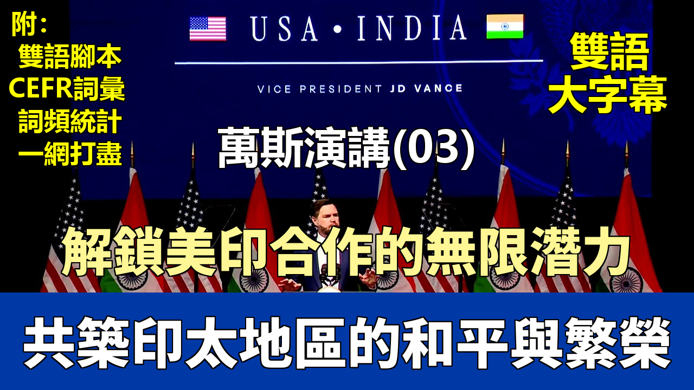

{% video youtube:q6nBlix6TOE width:100% autoplay:0 %}


### 【中英文双语脚本】

Good to see everybody.
很高興見到大家。
How are we doing? Good, good.
我們都好嗎？很好，很好。
Well, it's an amazing privilege to be here in Jaipur.
嗯，能來到齋浦爾是我的榮幸。
I'm thrilled to address the Ananta Centre India-U.S. Forum, and I'm thrilled to have you all here with me.
我很高興能在阿南塔中心印美論壇發表演講，也很高興你們都能和我一起在這裏。
Thanks to all of you, the business leaders, decision makers, and of course the students for being here.
感謝各位商界領袖、決策者，當然還有學生們來到這裏。
And thanks to our great team at the U.S. Embassy for everything that you guys do for our country.
也感謝我們美國大使館出色的團隊爲我們國家所做的一切。
In the United States, we're proud of the deep connection between our nations, between India and the United States.
在美國，我們爲我們兩國之間，即印度和美國之間的深厚聯繫感到自豪。
Prime Minister Modi, as most of you probably know, was one of the first visitors welcomed into the Oval Office during President Trump's second term.
莫迪總理，可能你們大多數人都知道，是特朗普總統第二任期內最早受邀訪問橢圓形辦公室的訪客之一。
And like President Trump, the Prime Minister inspires remarkable loyalty because of the strength of his belief in his people and in his country.
和特朗普總統一樣，莫迪總理也因其對自己人民和國家的堅定信念而贏得了非凡的忠誠。
Now, we're so grateful for Prime Minister Modi's hospitality,
現在，我們非常感謝莫迪總理的熱情款待，
as well as the reception that he and everyone else in this country have given us on this first trip for me to India.
以及他和這個國家的每個人在我首次訪問印度期間給予我們的接待。
This is my first time visiting the birthplace of my wife's parents, and she's of course in the front row there. There you are, Usha.
這是我第一次來到我妻子父母的出生地，她當然就在前排那裏。你在這兒呢，烏莎。
She's a bit of a celebrity, it turns out, in India, I think more so than her husband.
事實證明，她在印度有點像個名人，我想比她丈夫更是如此。
But I haven't been here long, but already I've been fortunate enough to visit the Akshardham Temple,
但我來這裏不久，就已經有幸參觀了阿克薩達姆神廟（Akshardham Temple），
did I pronounce that right, honey? I did okay? All right.
我發音對了嗎，親愛的？還行？好的。
With my family this morning, as a matter of fact,
事實上，今天早上我和我的家人一起去了，
and last night Prime Minister Modi welcomed me, Usha, and our three small children at his beautiful home.
昨晚莫迪總理在他美麗的家中歡迎了我、烏莎和我們的三個小孩。
I've been amazed by the ancient beauty of the architecture of India, by the richness of India's history and traditions,
我驚歎於印度建築的古老之美，驚歎於印度歷史和傳統的豐富多彩，
but also by India's laser-like focus on the future.
也驚歎於印度對未來如同激光般精準的關注。
And those things, I think this appreciation for history and tradition
我認爲，這些東西，這種對歷史和傳統的欣賞
and this focus on the future is very much something that I think animates this country in 2025.
以及對未來的關注，正是我認爲在2025年賦予這個國家活力的東西。
Now, in other countries I've visited, it sometimes feels like there's a flatness, a sameness, a desire to just be like everyone else in the world.
現在，在我訪問過的其他國家，有時會感覺那裏有一種扁平化、一種同質化，一種只想和世界上其他人一樣的渴望。
But it's different here. There's a vitality to India, a sense of infinite possibility,
但這裏不同。印度充滿活力，有一種無限可能的感覺，
of new homes to be built, new skylines to be raised, and lives to be enriched.
有新的家園待建，新的天際線待升，新的生活待豐富。
And there's a pride in being Indian, a feeling of excitement about the days that lie ahead.
這裏有一種作爲印度人的自豪感，一種對未來日子的興奮感。
Now, it's a striking contrast with too many in the West, where some in our leadership class seem stricken by self-doubt and even fear of the future.
這與西方許多人形成了鮮明對比，我們的一些領導層似乎被自我懷疑甚至對未來的恐懼所困擾。
To them, humanity is always one bad decision away from catastrophe.
對他們來說，人類總是一個錯誤的決定就會導致災難。
"The world will soon end," they tell us, "because we're burning too much fuel or making too many things or having too many children."
“世界很快就要終結了，”他們告訴我們，“因爲我們燃燒了太多燃料，製造了太多東西，或者生了太多孩子。”
And so, rather than invest in the future, they too often retreat from it.
因此，他們往往不是投資未來，而是從中退縮。
Some of them pass laws that force their nations to use less power.
他們中的一些人通過法律迫使自己的國家減少能源使用。
They cancel nuclear and other energy generation facilities,
他們取消核能和其他能源生產設施，
even as their choices, the choices of these leaders, lead to more dependence on foreign adversaries.
即使他們的選擇，這些領導人的選擇，導致了對外國對手的更大依賴。
Meanwhile, their message to their friends, to countries like India, is to tell them that they are not allowed to grow.
與此同時，他們給朋友，像印度這樣的國家的信息是，告訴他們不允許發展。
Well, President Trump rejects these failed ideas. He wants America to grow. He wants India to grow.
嗯，特朗普總統拒絕這些失敗的想法。他希望美國發展。他希望印度發展。
And he wants to build the future with our partners all over the globe.
他希望與我們全球的夥伴共同建設未來。
And when I look at this audience, or when I visit this incredible country over these last couple of days,
當我看着這裏的觀衆，或者當我在過去幾天訪問這個不可思議的國家時，
I see a people that will not be held back.
我看到一個不會被阻礙的人民。
Now, the most profound responsibility, I believe, that all of us have is not to ourselves,
現在，我相信，我們所有人肩負的最深遠的責任，不是對我們自己，
but to the next generation, to make sure we leave them with a better society than the one that our parents and our grandparents gave us.
而是對下一代，確保我們留給他們一個比我們父母和祖父母給予我們的更好的社會。
And this is the world that America seeks to create with you.
這就是美國尋求與你們共同創造的世界。
We want to build a bright new world, one that's constantly innovating, one that's helping people to form families,
我們想建設一個光明的、不斷創新的新世界，一個幫助人們組建家庭的世界，
making it easier to build, invest and trade together in pursuit of common goals.
一個讓共同建設、投資和貿易以追求共同目標變得更容易的世界。
Now, I believe that our nations have much to offer one another.
現在，我相信我們兩國可以互相提供很多東西。
And that's why we come to you as partners looking to strengthen our relationship.
這就是爲什麼我們作爲夥伴來到你們這裏，尋求加強我們的關係。
Now, we're not here to preach that you do things any one particular way.
現在，我們不是來這裏說教你們要以某種特定的方式做事。
Too often in the past, Washington approached Prime Minister Modi with an attitude of preachiness, or even one of condescension.
過去，華盛頓方面常常以說教甚至居高臨下的態度對待莫迪總理。
Prior administrations saw India as a source of low-cost labor, on the one hand,
過去的政府一方面將印度視爲廉價勞動力的來源，
even as they criticized the Prime Minister's government, arguably the most popular in the democratic world.
另一方面卻批評總理的政府，而這可以說是民主世界中最受歡迎的政府。
And as I told Prime Minister Modi last night, he's got approval ratings that would make me jealous.
正如我昨晚告訴莫迪總理的，他的支持率會讓我嫉妒。
But it wasn't just India. This attitude captured too much of our economic relationship with the rest of the world.
但這不僅僅是針對印度。這種態度過多地體現在我們與世界其他地區的經濟關係中。
So we shipped countless jobs overseas and with them our capacity to make things, from furniture, appliances and even weapons of war.
所以我們將無數的工作崗位轉移到海外，隨之而去的是我們的製造能力，從傢俱、家電甚至到戰爭武器。
We traded hard power for soft power, because with economic integration, we were told, would also come peace through sameness.
我們用硬實力換取軟實力，因爲我們被告知，經濟一體化也會帶來同質化帶來的和平。
Over time, we'd all assume the same sort of bland, secular, universal values.
隨着時間的推移，我們都會接受那種平淡、世俗、普世的價值觀。
No matter where you lived, the world was flat after all.
畢竟，無論你住在哪裏，世界是平的。
That was the thesis and that was what they told us.
那就是他們的論點，那就是他們告訴我們的。
And when that thesis proved false, or at least incomplete, leaders in the West took it upon themselves to flatten it by any means necessary.
而當這個論點被證明是錯誤的，或者至少是不完整的，西方的領導人就自作主張，不擇手段地將其“壓平”。
But many people across the world, and I think your country counts among them, they did not want to be flattened.
但世界上的許多人，我想貴國也在此列，他們不想被“壓平”。
Many were proud of where they came from, their way of life, the kind of jobs they worked and the kind of jobs their parents worked before them.
許多人爲他們的出身、他們的生活方式、他們所從事的工作以及他們父母之前所從事的工作感到自豪。
And that very much includes people in my own country, the United States of America.
這也非常包括我自己國家的人民，美利堅合衆國的人民。
Now some of you are aware of my own background. I actually didn't plan to talk about my background at all until last night at dinner,
現在有些人知道我的背景。其實我根本沒打算談我的背景，直到昨晚晚宴時，
while my children mostly behaved, we gave them an A- for behavior with the Prime Minister.
我的孩子們大體上表現不錯，我們給他們在總理面前的表現打了 A-。
The Prime Minister said, "I have one request. I want you to talk a little bit about your background." And so I wanted to do that.
總理說：“我有一個請求。我希望你稍微談談你的背景。” 所以我想這麼做。
For those of you who don't know anything about me, I wanted to talk about it.
對於那些對我一無所知的人，我想談談這個。
I come from, and I'm biased, the greatest state in the Union, the state of Ohio,
我來自，我帶有偏見地說，聯邦中最偉大的州，俄亥俄州，
a long-time manufacturing powerhouse in the United States of America.
一個在美國長期以來的製造業重鎮。
My home specifically is a place called Middletown.
我的家鄉具體來說是一個叫做米德爾敦的地方。
Now it's not a massive city by any means, it's not Jaipur, but it's a decent-sized town and a place where people make things,
它絕不是一個大城市，不是齋浦爾，但它是一個規模適中的城鎮，一個人們製造東西的地方，
which has been a point of pride in Middletown for generations.
這在米德爾敦幾代人以來都是一個值得驕傲的地方。
It's filled with families like my own, some of whom called us hillbillies,
那裏充滿了像我家一樣的家庭，其中一些人稱我們爲“鄉巴佬”（hillbillies），
Americans who came down from the surrounding hills and mountains of West Virginia, Tennessee and Kentucky
他們是從西弗吉尼亞、田納西和肯塔基周圍的山區下來的美國人，
to cities like Middletown in pursuit of the manufacturing jobs that were creating widespread prosperity for families all across America.
來到像米德爾敦這樣的城市，追求那些曾爲全美家庭創造廣泛繁榮的製造業工作。
They came to Middletown in search of what we call back home the American dream.
他們來到米德爾敦，尋找我們家鄉所謂的美國夢。
In Middletown, my parents raised me. My grandparents raised me.
在米德爾敦，我的父母撫養了我。我的祖父母撫養了我。
They taught us to work hard, they taught me to study hard, and they taught me to love God and my country and always be good to your own.
他們教導我們要努力工作，教導我要努力學習，教導我要熱愛上帝和我的國家，並始終善待自己人。
My granddad, who I called Papaw growing up, he typified that.
我的外祖父，我從小叫他 Papaw，他就是典型的代表。
Late into life, he worked as a steelmaker at the local mill, and I know India has a lot of those.
直到晚年，他都在當地的鋼廠當鍊鋼工人，我知道印度有很多這樣的鋼廠。
Papaw's job gave him a good wage, stable hours, and a generous pension.
Papaw 的工作給了他不錯的工資、穩定的工時和豐厚的養老金。
All that allowed him to support not just him and my grandmother, but his own daughter and grandkids with him.
所有這些讓他不僅能養活他和我的外祖母，還能養活他自己的女兒和外孫們。
Now, by the time I came around, money was awfully tight, but he worked hard to make a good living for all of us.
現在，到我出生的時候，錢已經非常緊張了，但他努力工作，爲我們所有人創造了好的生活。
Now, I know Papaw and Mamaw were grateful for the way of life their country made possible.
現在，我知道 Papaw 和 Mamaw 感激他們的國家使這種生活方式成爲可能。
Their generation bore witness to the formation of America's great middle class.
他們那一代人見證了美國偉大的中產階級的形成。
And by creating an economy centered around production, around workers who build things,
通過創建一個以生產爲中心、以建設者爲中心、
and around the value of their labor, our nation's leaders then transformed their country and made thousands of little Middletowns possible.
以勞動價值爲中心的經濟，我們國家的領導人隨後改變了他們的國家，使得成千上萬個小小的米德爾敦成爲可能。
The government supported its labor force. We created incentives for productive industries to take root
政府支持其勞動力。我們創造激勵措施讓生產性行業紮根，
and struck good deals with international partners to sell the goods made in the United States of America.
並與國際夥伴達成良好協議，銷售在美國製造的商品。
But as America settled in to world-historic prosperity it generated,
但隨着美國沉浸在其產生的世界歷史性的繁榮中，
our leaders began to take that very prosperity and what created it for granted.
我們的領導人開始將這種繁榮及其根源視爲理所當然。
They forgot the importance of building, of supporting productive industry,
他們忘記了建設的重要性，忘記了支持生產性行業的重要性，
of striking fair deals, and of supporting our workers and their families.
忘記了達成公平交易以及支持我們的工人及其家庭的重要性。
And as time went on, we saw the consequences. In my hometown, factories left, jobs evaporated,
隨着時間的推移，我們看到了後果。在我的家鄉，工廠離開了，工作消失了，
and America's Middletowns ceased to be the lifeblood of our nation's economy.
美國的米德爾敦們不再是我們國家經濟的命脈。
And the United States, as it became transformed, those very people, the working class, the background of the United States of America,
隨着美國的轉型，正是那些人，工人階級，美國的中堅力量，
were dismissed as backwards for holding on to the values their people had held dear for generations.
因爲堅守他們人民世代珍視的價值觀而被斥爲落後。
Now, Middletown's story is my story, but it's hardly unusual in the United States of America.
現在，米德爾敦的故事就是我的故事，但在美利堅合衆國，這並非罕見。
There are tens of millions of Americans who over the last 20 or so years have woken up to what's happening in our nation.
在過去大約20年裏，有數千萬美國人已經意識到我們國家正在發生什麼。
But I believe they woke up well before it's too late.
但我相信他們在爲時已晚之前就已經醒悟。
Now, like you, we want to appreciate our history, our culture, our religion.
現在，像你們一樣，我們想要珍視我們的歷史、我們的文化、我們的宗教。
We want to do commerce and strike good deals with our friends.
我們想要與朋友進行商業往來並達成好的協議。
We want to found our vision of the future upon the proud recognition of our heritage, rather than self-loathing and fear.
我們希望將我們對未來的願景建立在對我們遺產的自豪認知之上，而不是自我厭惡和恐懼。
I work for a president who has long understood all of this,
我爲一位長期以來一直理解這一切的總統工作，
whether through fighting those who seek to erase American history or in support of fair trade deals abroad.
無論是通過與那些試圖抹殺美國曆史的人作鬥爭，還是支持國外的公平貿易協議。
He has been consistent on these issues for decades.
幾十年來，他在這些問題上一直保持一致。
And as a result, under the Trump administration, America now has a government that has learned from the mistakes of the past.
因此，在特朗普政府的領導下，美國現在有了一個吸取了過去錯誤的教訓的政府。
It's why President Trump cares so deeply about protecting the manufacturing economy that is the lifeblood of American prosperity
這就是爲什麼特朗普總統如此深切地關心保護作爲美國繁榮命脈的製造業經濟，
and making sure America's workers have opportunities for good jobs.
並確保美國工人有機會獲得好工作。
As we saw earlier this month, he will go to extraordinary lengths to protect and expand those opportunities for all Americans.
正如我們本月早些時候看到的，他將不遺餘力地保護和擴大所有美國人的這些機會。
And so today I come here with a simple message. Our administration seeks trade partners on the basis of fairness and of shared national interests.
因此，今天我帶着一個簡單的信息來到這裏。我們的政府尋求基於公平和共同國家利益的貿易伙伴。
We want to build relationships with our foreign partners who respect their workers,
我們希望與尊重本國工人的外國夥伴建立關係，
who don't suppress their wages to boost exports, but respect the value of their labor.
他們不壓低工資以促進出口，而是尊重其勞動價值。
We want partners that are committed to working with America to build things,
我們希望合作伙伴致力於與美國一起建設，
not just allowing themselves to become a conduit for transshipping others' goods.
而不僅僅是讓自己成爲轉運他人貨物的渠道。
And finally, we want to partner with people and countries who recognize the historic nature of the moment we're in,
最後，我們希望與認識到我們所處時刻的歷史性的人民和國家合作，
of the need to come together and build something truly new,
認識到需要團結起來，建設真正新事物，
a system of global trade that is balanced, one that is open, and one that is stable and fair.
一個平衡、開放、穩定和公平的全球貿易體系。
Now, I want to be clear. America's partners need not look exactly like America, nor must our governments do everything exactly the same way.
現在，我想明確一點。美國的夥伴不必看起來完全像美國，我們的政府也不必完全以相同的方式做所有事情。
But we should have some common goals, and I believe here in India we do, in both economics and in national security.
但我們應該有一些共同的目標，我相信在印度這裏我們做到了，無論是在經濟還是國家安全方面。
And that's why we're so excited. That's why I'm so excited to be here today.
這就是爲什麼我們如此興奮。這就是爲什麼我今天如此興奮地來到這裏。
In India, America has a friend, and we seek to strengthen the warm bonds our great nations already share.
在美國，印度是一位朋友，我們尋求加強我們偉大國家之間已經存在的溫暖紐帶。
Now, critics have attacked my president, President Trump, for starting a trade war in an effort to bring back the jobs of the past,
現在，批評者攻擊我的總統，特朗普總統，說他發動貿易戰是爲了帶回過去的就業崗位，
but nothing could be further from the truth.
但這與事實相去甚遠。
He seeks to rebalance global trade so that America, with friends like India, can build a future worth having for all of our people together.
他尋求重新平衡全球貿易，以便美國能與像印度這樣的朋友一起，爲我們所有的人民共同建設一個值得擁有的未來。
And when President Trump and Prime Minister Modi announced in February that our countries aim to more than double our bilateral trade
當特朗普總統和莫迪總理在二月份宣佈，我們兩國旨在將雙邊貿易額增加一倍以上，
to $500 billion by the end of the decade,
在本十年末達到5000億美元時，
I know that both of them meant it. And I'm encouraged by everything our nations are doing to get us there.
我知道他們兩人都是認真的。我對我們兩國爲實現這一目標所做的一切感到鼓舞。
As many of you are aware, both of our governments are hard at work on a trade agreement built on shared priorities, like creating new jobs,
正如你們許多人所知，我們兩國政府都在努力制定一項基於共同優先事項的貿易協定，例如創造新的就業機會，
building durable supply chains, and achieving prosperity for our workers.
建立持久的供應鏈，以及爲我們的工人實現繁榮。
In our meeting yesterday, Prime Minister Modi and I made very good progress on all of those points.
在昨天的會晤中，莫迪總理和我在所有這些方面都取得了非常好的進展。
And we are especially excited to formally announce that America and India have officially finalized the terms of reference for the trade negotiation.
我們特別興奮地正式宣佈，美國和印度已正式敲定貿易談判的職權範圍。
I think this is a vital step. I believe this is a vital step toward realizing President Trump's and Prime Minister Modi's vision
我認爲這是至關重要的一步。我相信這是實現特朗普總統和莫迪總理願景的關鍵一步，
because it sets a roadmap toward a final deal between our nations.
因爲它爲我們兩國達成最終協議設定了路線圖。
I believe there is much that America and India can accomplish together.
我相信美國和印度可以共同完成很多事情。
And on that note, I want to talk about a few areas of collaboration today, how India and the United States can work together.
關於這一點，我今天想談談幾個合作領域，即印度和美國如何能夠合作。
First, perhaps most importantly, to protect our nations.
首先，也許是最重要的，保護我們的國家。
Second, to build great things. And finally, to innovate the cutting-edge technologies both our countries will need in the years to come.
其次，建設偉大的事物。最後，創新我們兩國在未來幾年都將需要的前沿技術。
Now, on defense, our countries already enjoy a close relationship, one of the closest relationships in the world.
現在，在國防方面，我們兩國已經享有密切的關係，是世界上最密切的關係之一。
America does more military exercises with India than we do with any other nation on Earth.
美國與印度進行的軍事演習比我們與地球上任何其他國家都多。
The U.S.-India Compact that President Trump and Prime Minister Modi announced in February
特朗普總統和莫迪總理在二月份宣佈的美印契約
will lay the foundation for even closer collaboration between our countries.
將爲我們兩國之間更緊密的合作奠定基礎。
From javelins to striker combat vehicles,
從標槍導彈到斯崔克戰車，
our nations will co-produce many of the munitions and equipment that we'll need to deter foreign aggressors,
我們兩國將共同生產許多我們需要用來威懾外國侵略者的彈藥和裝備，
not because we seek war, but because we seek peace and we believe the best path to peace is through mutual strength.
不是因爲我們尋求戰爭，而是因爲我們尋求和平，我們相信通往和平的最佳途徑是通過共同的力量。
And the launching the Joint Autonomous Systems Industry Alliance
以及啓動聯合自主系統產業聯盟
will enable America and India to develop the most state-of-the-art maritime systems needed for victory.
將使美國和印度能夠開發取得勝利所需的最先進的海上系統。
It's fitting that India this year is hosting the Quad Leaders Summit this fall.
印度今年秋天主辦四方領導人峯會是恰當的。
Our interests in a free, open, peaceful, and prosperous Indo-Pacific are in full alignment.
我們在自由、開放、和平與繁榮的印太地區的利益是完全一致的。
Both of us know that the region must remain safe from any hostile powers that seek to dominate it.
我們雙方都知道，該地區必須保持安全，免受任何尋求主宰該地區的敵對勢力的威脅。
Growing relations between our countries over the last decade
過去十年我們兩國之間不斷髮展的關係
are part of what led America to designate India a major defense partner, the first of that class.
是美國將印度指定爲主要國防夥伴的部分原因，這是該類別中的第一個。
This designation means that India now shares with the UAE a defense and technology infrastructure
這一指定意味着印度現在與阿聯酋共享國防和技術基礎設施，
and partnership with the United States on par with America's closest allies and friends.
以及與美國建立的夥伴關係，其水平與美國最親密的盟友和朋友相當。
But we actually feel that India has much more to gain from its continued defense partnership with the United States,
但我們實際上認爲，印度可以從其與美國的持續防務夥伴關係中獲得更多收益，
and let me sketch that out a little bit.
讓我稍微勾勒一下。
We, of course, want to collaborate more. We want to work together more.
我們當然希望加強合作。我們希望更多地共同努力。
And we want your nation to buy more of our military equipment, which, of course, we believe is the best in class.
我們希望貴國購買更多我們的軍事裝備，當然，我們相信這是同類中最好的。
American fifth-generation F-35s, for example,
例如，美國的第五代F-35戰鬥機，
would give the Indian Air Force the ability to defend your airspace and protect your people like never before.
將賦予印度空軍前所未有的保衛領空和保護人民的能力。
And I've met a lot of great people from the Indian Air Force just in the last couple of days.
在過去的幾天裏，我遇到了很多來自印度空軍的優秀人才。
India, like America, wants to build, and that will mean that we have to produce more energy.
印度和美國一樣，想要建設，這意味着我們必須生產更多的能源。
It's more energy production and more energy consumption.
這意味着更多的能源生產和更多的能源消耗。
And it's one of the many reasons why I think our nations have so much to gain by strengthening our energy ties.
這也是我認爲我們兩國可以通過加強能源聯繫而獲益良多的衆多原因之一。
As President Trump is fond of saying, America has once again begun to drill, baby, drill.
正如特朗普總統喜歡說的，美國再次開始“鑽探吧，寶貝，鑽探吧”（drill, baby, drill）。
And we think that will accrue to the benefit of Americans, but it will also benefit India as well.
我們認爲這將使美國人受益，但同樣也會使印度受益。
Past administrations in the United States of America,
美國過去的政府，
I think motivated by a fear of the future, have tied our hands and restricted American investments in oil and natural gas production.
我認爲是出於對未來的恐懼，束縛了我們的手腳，限制了美國在石油和天然氣生產方面的投資。
This administration recognizes that cheap, dependable energy is an essential part of making things
本屆政府認識到，廉價、可靠的能源是製造業的重要組成部分，
and is an essential part of economic independence for both of our nations.
也是我們兩國經濟獨立的重要組成部分。
Of course, America is blessed with vast natural resources and an unusual capacity to generate energy.
當然，美國擁有豐富的自然資源和非凡的能源生產能力。
So much that we want to be able to sell it to our friends like India.
如此之多，以至於我們希望能夠將其出售給我們像印度這樣的朋友。
We believe your nation will benefit from American energy exports and expanding those exports.
我們相信貴國將從美國的能源出口和擴大這些出口中受益。
You'll be able to build more, make more, and grow more, but at much lower energy costs.
你們將能夠建造更多、製造更多、發展更多，而且能源成本要低得多。
We also want to help India explore its own considerable natural resources, including its offshore natural gas reserves and critical mineral supplies.
我們也想幫助印度勘探其自身可觀的自然資源，包括其海上天然氣儲量和關鍵礦產供應。
We have the capacity and we have the desire to help.
我們有能力，也有意願提供幫助。
Moreover, we think energy co-production will help beat unfair competitors in other foreign markets.
此外，我們認爲能源聯合生產將有助於在其他國外市場擊敗不公平的競爭對手。
But India, we believe, can go a long way to enhance energy ties between our nations.
但是印度，我們相信，可以在加強我們兩國能源聯繫方面大有作爲。
And one suggestion I'd have is maybe consider dropping some of the non-tariff barriers for American access to the Indian market.
我有一個建議是，也許可以考慮取消一些針對美國進入印度市場的非關稅壁壘。
Now, I've talked about this, of course, with Prime Minister Modi.
當然，我已經和莫迪總理談過這件事了。
And look, President Trump and I know that Prime Minister Modi is a tough negotiator.
看，特朗普總統和我知道莫迪總理是一位強硬的談判者。
He drives a hard bargain. It's one of the reasons why we respect him.
他很會討價還價。這也是我們尊重他的原因之一。
And we don't blame Prime Minister Modi for fighting for India's industry.
我們不責怪莫迪總理爲印度的工業而戰。
But we do blame American leaders of the past for failing to do the same for our workers.
但我們確實責怪過去的美國領導人未能爲我們的工人做同樣的事情。
And we believe that we can fix that to the mutual benefit of both the United States and India.
我們相信我們可以解決這個問題，使美國和印度互惠互利。
Let me give an example.
讓我舉個例子。
American ethanol, we believe made from the finest corn in the world, can play a tremendous role in enhancing our partnership.
美國的乙醇，我們相信是用世界上最好的玉米制成的，可以在加強我們的夥伴關係方面發揮巨大作用。
And I know our farmers would be delighted to support India's energy security ambitions.
我知道我們的農民會很高興支持印度的能源安全雄心。
We welcome the Modi government's budget announcement to amend India's civil nuclear liability laws,
我們歡迎莫迪政府在預算中宣佈修改印度的民用核責任法，
which currently prevent U.S. producers from exporting small modular reactors and building larger U.S.-designed reactors in India.
該法律目前阻止美國生產商出口小型模塊化反應堆並在印度建造更大的美國設計的反應堆。
There's much that we can create, much that we can do together.
我們可以共同創造很多，共同做很多事情。
We believe that American energy can help realize India's nuclear power production goals, and this is very important, as well as its AI ambitions.
我們相信美國的能源可以幫助實現印度的核電生產目標，這一點非常重要，同時也能助其實現人工智能的雄心。
Because as the United States knows well and I know that India knows well, there is no AI future without energy security and energy dominance.
因爲正如美國深知，我也知道印度深知，沒有能源安全和能源主導地位，就沒有人工智能的未來。
And that brings me to my final point of collaboration.
這就引出了我關於合作的最後一點。
I believe that the technological collaboration between our countries is going to extend well beyond defense and energy.
我相信我們兩國之間的技術合作將遠遠超出國防和能源領域。
The U.S.-India Trust Initiative that President Trump and Prime Minister Modi have launched will be a cornerstone of the partnership in the future.
特朗普總統和莫迪總理啓動的美印信任倡議將成爲未來夥伴關係的基石。
It will build on billions of dollars of planned investments that American companies have already announced across India.
它將建立在美國公司已宣佈在印度各地進行的數十億美元計劃投資的基礎上。
In the years to come, we're going to see data centers, pharmaceuticals, undersea cables
在未來的歲月裏，我們將看到數據中心、藥品、海底電纜
and countless other critical goods being developed and being built because of the American and Indian economic partnership.
以及無數其他關鍵商品因爲美印經濟夥伴關係而被開發和建造。
And I'll say it again, I think that our nations have so much to gain by investing in one another,
我再說一遍，我認爲我們兩國通過相互投資可以獲益良多，
America investing in India and, of course, India investing in the United States of America.
美國投資印度，當然，還有印度投資美利堅合衆國。
And I know that Americans, our people, are excited about that prospect and that President Trump and I are looking forward to stronger ties.
我知道美國人，我們的人民，對這個前景感到興奮，特朗普總統和我期待着更緊密的聯繫。
Americans want further access to Indian markets. This is a great place to do business and we want to give our people more access to this country.
美國人希望進一步進入印度市場。這是一個做生意的好地方，我們希望讓我們的人民更多地接觸這個國家。
And Indians, we believe, will thrive from greater commerce in the United States.
我們相信，印度人將從在美國的更大規模商業活動中蓬勃發展。
This is very much a win-win partnership. It certainly will be far into the future.
這在很大程度上是一個雙贏的夥伴關係。在遙遠的未來肯定也是如此。
And as I know this audience knows better than most, neither Americans nor Indians are alone in looking to scale up their manufacturing capacity.
正如我知道在座各位比大多數人更清楚的，無論是美國人還是印度人，在尋求擴大製造業能力方面都不是孤單的。
The competition extends well beyond cheap consumer goods
競爭遠遠超出了廉價消費品，
and into munitions, energy, infrastructure and all sorts of other cutting edge technologies.
延伸到了彈藥、能源、基礎設施和各種其他尖端技術領域。
I believe that if our nations fail to keep pace,
我相信，如果我們兩國不能跟上步伐，
the consequences for the Indo-Pacific, but really the consequences for the entire world will be quite dire.
對印太地區的後果，但實際上對整個世界的後果都將是相當可怕的。
And this, again, is where India and the United States have so much to offer one another.
這再次說明了印度和美國可以互相提供如此之多。
We've got great hardware, the leading artificial intelligence hardware in the world.
我們擁有出色的硬件，世界領先的人工智能硬件。
You have one of the most exciting startup technology infrastructures anywhere in the world.
你們擁有世界上任何地方最令人興奮的初創科技基礎設施之一。
There's a lot to be gained by working together.
通過合作可以獲益良多。
And this is why President Trump and I both welcome India's leadership in a number of diplomatic organizations, but of course in the Quad.
這就是爲什麼特朗普總統和我本人都歡迎印度在一些外交組織中發揮領導作用，當然也包括在四方安全對話（Quad）中。
We believe a stronger India means greater economic prosperity, but also greater stability across the Indo-Pacific,
我們相信一個更強大的印度意味着更大的經濟繁榮，同時也意味着整個印太地區更大的穩定，
which is, of course, a shared goal for all of us in this room and is a shared goal for both of our countries.
這當然是在座各位的共同目標，也是我們兩國的共同目標。
Now, I want to close with one last story or maybe a couple of stories.
現在，我想用最後一個故事或者幾個故事來結束。
So, you know, my son Ewan is seven years old. He's our firstborn son.
所以，你們知道，我的兒子伊萬（Ewan）七歲了。他是我們的長子。
And yesterday after we had dinner at the Prime Minister's house, the food was so good and the Prime Minister was so kind to our three children
昨天我們在總理家吃過晚飯後，食物非常美味，總理對我們的三個孩子非常友善，
that Ewan came up to me afterwards and he said, "Dad, you know, I think maybe I could live in India."
以至於伊萬後來走到我面前說：“爸爸，你知道嗎，我想也許我可以住在印度。”
And, but I think after about 90 minutes in the Jaipur sun today at the great palace, he suggested that maybe we should move to England.
但是，我想今天在齋浦爾的烈日下，在宏偉的宮殿裏待了大約90分鐘後，他建議也許我們應該搬到英國去。
So you take the good with the bad here.
所以在這裏你要接受好的，也要接受壞的。
But I want to talk about Prime Minister Modi because I think he's a special person.
但我想談談莫迪總理，因爲我認爲他是一個特別的人。
I first met Prime Minister Modi at the AI Action Summit in February,
我第一次見到莫迪總理是在二月份的人工智能行動峯會上，
and we had a lot of important discussions on AI and other policies to prepare for.
我們就人工智能和其他需要準備的政策進行了許多重要的討論。
The Prime Minister also managed to figure out that my son Vivek was actually turning five years old on the trip.
總理還設法瞭解到我的兒子維韋克（Vivek）在那次旅途中正好滿五歲。
This was in Paris just a couple of months ago.
這是幾個月前在巴黎發生的事。
So think about this. Amid a huge international policy conference,
所以想想看。在一場大型國際政策會議期間，
he took the time to stop by where I was staying, wish our second son Vivek a happy birthday, and even bring him a gift.
他抽出時間來到我住的地方，祝我們的次子維韋克生日快樂，甚至還給他帶了禮物。
Usha and I were both genuinely touched by his graciousness.
烏莎和我都由衷地被他的親切所感動。
And we've been even more impressed by his warmth since we arrived in India.
自從我們抵達印度以來，我們對他的熱情更是印象深刻。
Now, it's interesting. Some of you may know that when you're a politician, your kids spend almost as much time in the limelight as you do.
現在，這很有趣。你們有些人可能知道，當你是個政治家時，你的孩子幾乎和你一樣多地暴露在聚光燈下。
And the great things about kids is they are brutally honest.
而關於孩子們的偉大之處在於他們非常誠實。
They're brutally honest with everybody, whether you want them to be or not.
他們對每個人都非常誠實，不管你願不願意。
And our seven-year-old, our five-year-old, and then our three-year-old baby girl Mirabelle, it's interesting.
我們七歲的、五歲的，還有我們三歲的小女兒米拉貝爾（Mirabelle），這很有趣。
They have only really been, they've only really attached themselves to.
他們真的只，他們真的只依附於。
They've only really liked, I should say. They've only really built a rapport with two world leaders.
我應該說，他們真的只喜歡。他們真的只和兩位世界領導人建立了融洽的關係。
The first, of course, is President Trump. He just has a certain energy about him.
第一位當然是特朗普總統。他身上就是有某種能量。
But Prime Minister Modi, it's the exact same thing.
但莫迪總理，完全是一樣的。
Our kids just like him. And I think that because kids are such good, strong judges of character,
我們的孩子們就是喜歡他。我認爲，因爲孩子們是如此優秀的、敏銳的性格判斷者，
I just like Prime Minister Modi, too. And I think it's a great foundation for the future of our relationship.
我也就喜歡莫迪總理。我認爲這是我們未來關係的一個良好基礎。
I could tell then, I could tell when Prime Minister Modi came over a couple of months ago, and I believe today that he is a serious leader
那時我就能看出來，當莫迪總理幾個月前來訪時我就能看出來，而且我相信今天，他是一位認真的領導人，
who has thought deeply about India's future prosperity and security,
他深入思考了印度的未來繁榮與安全，
not just for the rest of his time in office, but over the next century.
不僅僅是在他剩餘的任期內，而是着眼於下一個世紀。
And I want to end by making a simple overarching point.
我想以一個簡單的 overarching 觀點來結束。
We are now officially one quarter into the 21st century, 25 years in, 75 years to go.
我們現在正式進入了21世紀的四分之一，25年過去了，還有75年。
And I really believe that the future of the 21st century is going to be determined by the strength of the United States-India partnership.
我真的相信，21世紀的未來將由美印夥伴關係的強度來決定。
I believe, thank you.
我相信，謝謝你們。
I believe that if India and the United States work together successfully, we are going to see a 21st century that is prosperous and peaceful.
我相信，如果印度和美國成功合作，我們將看到一個繁榮與和平的21世紀。
But I also believe that if we fail to work together successfully, the 21st century could be a very dark time for all of humanity.
但我也相信，如果我們未能成功合作，21世紀可能成爲全人類一個非常黑暗的時期。
So I want to say, it's clear to me, as it is to most observers, that President Trump, of course, intends to rebalance
所以我想說，對我來說很清楚，對大多數觀察者來說也是如此，特朗普總統當然打算重新平衡
America's economic relationship with the rest of the world.
美國與世界其他地區的經濟關係。
That's going to cause, fundamentally will cause profound changes within our borders and the United States,
這將導致，根本上將導致我們邊境內和美國的深刻變化，
but of course with other countries as well.
當然也包括其他國家。
But I believe that this rebalancing is going to produce great benefits for American workers.
但我相信這種重新平衡將爲美國工人帶來巨大的利益。
It's going to produce great benefits for the people of India.
它將爲印度人民帶來巨大的利益。
And because our partnership is so important to the future of the world, I believe President Trump's efforts,
因爲我們的夥伴關係對世界的未來如此重要，我相信特朗普總統的努力，
joined, of course, by the whole country of India and Prime Minister Modi,
當然，還有整個印度國家和莫迪總理的共同參與，
will make the 21st century the best century in human history.
將使21世紀成爲人類歷史上最好的世紀。
Let's do it together. God bless you and thank you for having me.
讓我們一起努力。上帝保佑你們，感謝你們邀請我。

### 【核心词汇 - B1_C2】
| 單詞 | 音標 | 詞性 | 釋義 | 等級 | 次數 |
|---|---|---|---|---|---|
| able | /ˈeɪbl/ | adjective | 能夠；有能力的 | B1 | 1 |
| access | /ˈækses/ | noun | 進入；通道；使用權 | B1 | 1 |
| accomplish | /əˈkɑːmplɪʃ/ | verb | 完成；實現 | B1 | 1 |
| administration | /ədˌmɪnɪˈstreɪʃn/ | noun | 管理，行政 | B1 | 2 |
| afterwards | /ˈæftərwərdz/ | adverb | 之後，後來 | B1 | 1 |
| agreement | /əˈɡriːmənt/ | noun | 協議，同意 | B1 | 1 |
| aim | /eɪm/ | noun | 目標，目的 | B1 | 1 |
| amazed | /əˈmeɪzd/ | adjective | adj. 驚訝的；驚奇的 | B1 | 1 |
| amazing | /əˈmeɪzɪŋ/ | adjective | adj. 令人驚奇的；極好的 | B1 | 1 |
| announce | /əˈnaʊns/ | verb | v. 宣佈；宣告 | B1 | 2 |
| announcement | /əˈnaʊnsmənt/ | noun | n. 聲明；公告 | B1 | 1 |
| appreciation | /əˌpriːʃiˈeɪʃn/ | noun | n. 感謝；欣賞 | B1 | 1 |
| approach | /əˈproʊtʃ/ | noun | n. 方法；接近；途徑 | B1 | 1 |
| approval | /əˈpruːvl/ | noun | n. 批准；認可 | B1 | 1 |
| assume | /əˈsuːm/ | verb | 假設，認爲 | B1 | 1 |
| attach | /əˈtætʃ/ | verb | 連接，附加 | B1 | 1 |
| aware | /əˈwer/ | adjective | 知道的，意識到的 | B1 | 1 |
| backwards | /ˈbækwərdz/ | adverb | 向後 | B1 | 1 |
| basis | /ˈbeɪsɪs/ | noun | 基礎，根據 | B1 | 1 |
| beat | /biːt/ | verb | 打敗 | B1 | 1 |
| behave | /bɪˈheɪv/ | verb | 表現 | B1 | 1 |
| belief | /bɪˈliːf/ | noun | 信仰 | B1 | 1 |
| benefit | /ˈbenɪfɪt/ | noun | 好處 | B1 | 2 |
| bless | /bles/ | verb | 祝福；保佑；讚美 | B1 | 2 |
| bond | /bɑːnd/ | noun | 紐帶；聯繫；債券 | B1 | 1 |
| border | /ˈbɔːrdər/ | noun | 邊界；邊境 | B1 | 1 |
| bore | /bɔːr/ | verb | 使厭煩；使厭倦 | B1 | 1 |
| cancel | /ˈkænsəl/ | verb | 取消；撤銷 | B1 | 1 |
| capacity | /kəˈpæsəti/ | noun | 容量；能力 | B1 | 1 |
| capture | /ˈkæptʃər/ | noun | 捕獲；俘獲 | B1 | 1 |
| celebrity | /səˈlebrəti/ | noun | 名人 | B1 | 1 |
| civil | /ˈsɪvl/ | adjective | 文明的，民用的，公民的 | B1 | 1 |
| competitor | /kəmˈpɛtɪtər/ | noun | 競爭者，對手 | B1 | 1 |
| considerable | /kənˈsɪdərəbl/ | adjective | adj. 相當大的，可觀的 | B1 | 1 |
| constantly | /ˈkɑːnstəntli/ | adverb | adv. 總是，經常地 | B1 | 1 |
| consumer | /kənˈsuːmər/ | noun | n. 消費者 | B1 | 1 |
| consumption | /kənˈsʌmpʃn/ | noun | n. 消費，消耗 | B1 | 1 |
| countless | /ˈkaʊntləs/ | adjective | 無數的，數不清的 | B1 | 1 |
| critic | /ˈkrɪtɪk/ | noun | 評論家，批評家 | B1 | 1 |
| critical | /ˈkrɪtɪkl/ | adjective | 關鍵的，批判性的 | B1 | 1 |
| currently | /ˈkɜːrəntli/ | adverb | 目前，現在 | B1 | 1 |
| decision | /dɪˈsɪʒn/ | noun | 決定；決策 | B1 | 1 |
| defend | /dɪˈfend/ | verb | 保衛；辯護 | B1 | 1 |
| delighted | /dɪˈlaɪtɪd/ | adjective | 高興的；快樂的 | B1 | 1 |
| democratic | /ˌdeməˈkrætɪk/ | adjective | 民主的；民主制度的 | B1 | 1 |
| desire | /dɪˈzaɪər/ | noun | 慾望，渴望 | B1 | 1 |
| determine | /dɪˈtɜːrmɪn/ | verb | 決定，確定；下決心 | B1 | 1 |
| economic | /ˌekəˈnɑːmɪk/ | adjective | 經濟的 | B1 | 1 |
| economics | /ˌekəˈnɑːmɪks/ | noun | 經濟學 | B1 | 1 |
| economy | /iˈkɑːnəmi/ | noun | 經濟 | B1 | 1 |
| edge | /edʒ/ | noun | 邊緣；優勢 | B1 | 1 |
| enable | /ɪˈneɪbəl/ | verb | 使能夠；使可能 | B1 | 1 |
| entire | /ɪnˈtaɪər/ | adjective | 整個的；全部的 | B1 | 1 |
| equipment | /ɪˈkwɪpmənt/ | noun | 設備；裝備 | B1 | 1 |
| essential | /ɪˈsenʃəl/ | adjective | 必不可少的；至關重要的 | B1 | 1 |
| exact | /ɪɡˈzækt/ | adjective | 確切的；精確的 | B1 | 1 |
| excitement | /ɪkˈsaɪtmənt/ | noun | 興奮；激動 | B1 | 1 |
| expand | /ɪkˈspænd/ | verb | 擴張；擴大 | B1 | 2 |
| extend | /ɪkˈstend/ | verb | 延伸；延長 | B1 | 2 |
| extraordinary | /ɪkˌstrɔːrdɪneri/ | adjective | 非凡的；特別的 | B1 | 1 |
| facility | /fəˈsɪləti/ | noun | 設施；設備 | B1 | 1 |
| false | /fɔːls/ | adjective | 假的，錯誤的 | B1 | 1 |
| fond | /fɑːnd/ | adjective | 喜歡的；喜愛的 | B1 | 1 |
| formally | /ˈfɔːrməli/ | adverb | 正式地，禮儀地 | B1 | 1 |
| fortunate | /ˈfɔːrtʃənət/ | adjective | 幸運的，僥倖的 | B1 | 1 |
| foundation | /faʊnˈdeɪʃn/ | noun | 基礎，地基，基金會 | B1 | 1 |
| fuel | /ˈfjuːəl/ | noun | 燃料 | B1 | 1 |
| gain | /ɡeɪn/ | noun | 收益，獲得 | B1 | 2 |
| generate | /ˈdʒenəreɪt/ | verb | 產生，發生；生成，產生（能量等） | B1 | 2 |
| generous | /ˈdʒenərəs/ | adjective | 慷慨的，大方的；寬宏大量的 | B1 | 1 |
| global | /ˈɡloʊbl/ | adjective | 全球的，世界的 | B1 | 1 |
| goods | /ɡʊdz/ | noun | 商品，貨物 | B1 | 1 |
| grant | /ɡrænt/ | noun | 撥款，補助金 | B1 | 1 |
| historic | /hɪˈstɔːrɪk/ | adjective | 歷史性的; 具有歷史意義的 | B1 | 1 |
| honest | /ˈɑːnɪst/ | adjective | 誠實的 | B1 | 1 |
| huge | /hjuːdʒ/ | adjective | 巨大的 | B1 | 1 |
| humanity | /hjuːˈmænəti/ | noun | 人性，人道；人類 | B1 | 1 |
| incredible | /ɪnˈkredəbl/ | adjective | 難以置信的，極好的 | B1 | 1 |
| industry | /ˈɪndəstri/ | noun | 工業，產業 | B1 | 2 |
| inspire | /ɪnˈspaɪər/ | verb | 激勵，鼓舞 | B1 | 1 |
| intend | /ɪnˈtend/ | verb | 打算，計劃 | B1 | 1 |
| invest | /ɪnˈvest/ | verb | 投資 | B1 | 2 |
| jealous | /ˈdʒeləs/ | adjective | 嫉妒的，羨慕的 | B1 | 1 |
| launch | /lɔːntʃ/ | verb | 發起，發動，推出；發射，下水 | B1 | 2 |
| lay | /leɪ/ | verb | 放置，安放；產（卵）；鋪設 | B1 | 1 |
| leadership | /ˈliːdərʃɪp/ | noun | 領導能力，領導地位；領導階層 | B1 | 1 |
| length | /leŋθ/ | noun | 長度，時間長度 | B1 | 1 |
| loyalty | /ˈlɔɪəlti/ | noun | 忠誠，忠實 | B1 | 1 |
| massive | /ˈmæsɪv/ | adjective | 巨大的 | B1 | 1 |
| meanwhile | /ˈmiːnwaɪl/ | adverb | 同時，與此同時；期間 | B1 | 1 |
| mineral | /ˈmɪnərəl/ | noun | 礦物；礦物質 | B1 | 1 |
| moreover | /mɔːrˈoʊvər/ | adverb | 此外；而且 | B1 | 1 |
| mutual | /ˈmjuːtʃuəl/ | adjective | 相互的；共同的 | B1 | 1 |
| negotiation | /nɪˌɡoʊʃiˈeɪʃn/ | noun | 談判，協商 | B1 | 1 |
| nor | /nɔr/ | conjunction | 也不 | B1 | 1 |
| nuclear | /ˈnukliər/ | adjective | 核的，核能的 | B1 | 1 |
| officially | /əˈfɪʃəli/ | adverb | 正式地 | B1 | 1 |
| organization | /ˌɔːrɡənɪˈzeɪʃn/ | noun | 組織 | B1 | 1 |
| pace | /peɪs/ | noun | 速度，步調 | B1 | 1 |
| planned | /plænd/ | adjective | 計劃好的 | B1 | 1 |
| policy | /ˈpɑləsi/ | noun | 政策，方針；保險單 | B1 | 2 |
| politician | /ˌpɑləˈtɪʃən/ | noun | 政治家；政客 | B1 | 1 |
| possibility | /ˌpɑːsəˈbɪləti/ | noun | 可能性；可能發生的事 | B1 | 1 |
| president | /ˈprezɪdənt/ | noun | 總統；主席；校長 | B1 | 1 |
| producer | /prəˈduːsər/ | noun | 生產者，製片人 | B1 | 1 |
| productive | /prəˈdʌktɪv/ | adjective | 富有成效的 | B1 | 1 |
| progress | /ˈprɑːɡres/ | noun | 進步，進展 | B1 | 1 |
| prosperity | /prɑːˈsperəti/ | noun | 繁榮，興旺 | B1 | 1 |
| prosperous | /ˈprɑːspərəs/ | adjective | 繁榮的，興旺的 | B1 | 1 |
| protect | /prəˈtekt/ | verb | 保護 | B1 | 2 |
| proud | /praʊd/ | adjective | 自豪的，驕傲的 | B1 | 1 |
| prove | /pruːv/ | verb | 證明 | B1 | 1 |
| realize | /ˈriːəlaɪz/ | verb | 意識到 | B1 | 2 |
| reception | /rɪˈsepʃn/ | noun | 接待；招待會；接收效果 | B1 | 1 |
| region | /ˈriːdʒən/ | noun | 地區，區域 | B1 | 1 |
| reject | /rɪˈdʒekt/ | verb | 拒絕，駁回 | B1 | 1 |
| relation | /rɪˈleɪʃn/ | noun | 關係，聯繫 | B1 | 1 |
| relationship | /rɪˈleɪʃnʃɪp/ | noun | 關係，聯繫 | B1 | 2 |
| religion | /rɪˈlɪdʒən/ | noun | 宗教 | B1 | 1 |
| remarkable | /rɪˈmɑːrkəbl/ | adjective | 非凡的，顯著的 | B1 | 1 |
| reserve | /rɪˈzɜːrv/ | noun | 儲備，儲備物 | B1 | 1 |
| resource | /ˈriːsɔːrs/ | noun | 資源 | B1 | 1 |
| respect | /rɪˈspekt/ | noun | 尊敬，尊重 | B1 | 1 |
| responsibility | /rɪˌspɑːnsəˈbɪləti/ | noun | 責任 | B1 | 1 |
| rest | /rest/ | noun | 休息 | B1 | 1 |
| restrict | /rɪˈstrɪkt/ | verb | 限制，約束 | B1 | 1 |
| security | /sɪˈkjʊrəti/ | noun | 安全；保障 | B1 | 1 |
| serious | /ˈsɪriəs/ | adjective | 嚴肅的；嚴重的 | B1 | 1 |
| settle | /ˈsetl/ | verb | 解決；安頓 | B1 | 1 |
| sometimes | /ˈsʌmtaɪmz/ | adverb | 有時；間或 | B1 | 1 |
| sort | /sɔːrt/ | noun | 種類，類別；品質，品級；方式，方法 | B1 | 2 |
| stable | /ˈsteɪbl/ | adjective | 穩定的，穩固的；可靠的，持之以恆的 | B1 | 1 |
| strengthen | /ˈstreŋθən/ | verb | 加強，鞏固 | B1 | 2 |
| stricken | /ˈstrɪkən/ | adjective | 受打擊的，受災的 | B1 | 1 |
| supply | /səˈplaɪ/ | noun | 供應，供給；物資 | B1 | 2 |
| surround | /səˈraʊnd/ | verb | 包圍，環繞 | B1 | 1 |
| technological | /ˌteknəˈlɑːdʒɪkl/ | adjective | 技術的，工藝的 | B1 | 1 |
| term | /tɜːrm/ | noun | 術語；學期；條款 | B1 | 2 |
| transform | /trænsˈfɔːrm/ | verb | 改變，改造 | B1 | 1 |
| tremendous | /trɪˈmendəs/ | adjective | 巨大的，極好的 | B1 | 1 |
| vast | /væst/ | adjective | 巨大的；廣闊的 | B1 | 1 |
| vehicle | /ˈviːɪkl/ | noun | 車輛；交通工具 | B1 | 1 |
| victory | /ˈvɪktəri/ | noun | 勝利；戰勝 | B1 | 1 |
| vision | /ˈvɪʒən/ | noun | 視力；景象；願景 | B1 | 1 |
| wages | /ˈweɪdʒɪz/ | noun | 工資 | B1 | 1 |
| wake | /weɪk/ | verb | 醒來；喚醒；意識到 | B1 | 2 |
| warmth | /wɔːrmθ/ | noun | 溫暖；熱情 | B1 | 1 |
| weapon | /ˈwepən/ | noun | 武器 | B1 | 1 |
| whether | /ˈweðər/ | conjunction | 是否 | B1 | 1 |
| widespread | /ˈwaɪdspred/ | adjective | 廣泛的；普遍的 | B1 | 1 |
| witness | /ˈwɪtnəs/ | verb | 親眼目睹；見證 | B1 | 1 |
| working | /ˈwɜːrkɪŋ/ | adjective | adj. 工作的；有效的 | B1 | 1 |
| worth | /wɜːrθ/ | adjective | adj. 值…的，有…價值的 | B1 | 1 |
| ally | /ˈælaɪ/ | noun | 盟友，同盟者 | B2 | 1 |
| animate | /ˈænɪmeɪt/ | verb | 使有生氣；使活潑；賦予生命 | B2 | 1 |
| balanced | /ˈbælənst/ | adjective | 平衡的，均衡的 | B2 | 1 |
| barrier | /ˈbæriər/ | noun | 障礙物，柵欄；障礙，隔閡 | B2 | 1 |
| billion | /ˈbɪljən/ | noun | 十億 | B2 | 2 |
| birthplace | /ˈbɜːrθpleɪs/ | noun | 出生地 | B2 | 1 |
| boost | /buːst/ | noun | 促進，提高 | B2 | 1 |
| cable | /ˈkeɪbl/ | noun | 電纜；纜繩 | B2 | 1 |
| catastrophe | /kəˈtæstrəfi/ | noun | 災難 | B2 | 1 |
| cease | /siːs/ | verb | 停止，終止 | B2 | 1 |
| combat | /ˈkɑːmbæt/ | noun | 戰鬥 | B2 | 1 |
| commerce | /ˈkɑːmɜːrs/ | noun | 商業，貿易 | B2 | 1 |
| committed | /kəˈmɪtɪd/ | adjective | 盡心盡力的，堅定的 | B2 | 1 |
| conference | /ˈkɑːnfərəns/ | noun | 會議，討論會 | B2 | 1 |
| consistent | /kənˈsɪstənt/ | adjective | 一致的，始終如一的 | B2 | 1 |
| cornerstone | /ˈkɔːrnərstoʊn/ | noun | 奠基石；基石 | B2 | 1 |
| decade | /ˈdekeɪd/ | noun | 十年 | B2 | 2 |
| defense | /dɪˈfens/ | noun | 防禦，辯護 | B2 | 1 |
| dependable | /dɪˈpendəbl/ | adjective | 可靠的；可信賴的 | B2 | 1 |
| designate | /ˈdezɪɡneɪt/ | verb | 指定，指派 | B2 | 1 |
| dismiss | /dɪsˈmɪs/ | verb | 解僱，駁回；不予考慮 | B2 | 1 |
| dominate | /ˈdɑːməˌneɪt/ | verb | 控制，支配；在…中佔首要地位 | B2 | 1 |
| energy | /ˈenərdʒi/ | noun | 能量；精力 | B2 | 1 |
| enhance | /ɪnˈhæns/ | verb | 提高；增強 | B2 | 2 |
| export | /ɪkˈspɔːrt/ | noun | 出口；出口商品 | B2 | 2 |
| fighting | /ˈfaɪtɪŋ/ | noun | 戰鬥，鬥爭 | B2 | 1 |
| formation | /fɔːrˈmeɪʃn/ | noun | 形成；組成；隊形 | B2 | 1 |
| genuinely | /ˈdʒenjuɪnli/ | adverb | 真誠地，真正地 | B2 | 1 |
| hardware | /ˈhɑːrdwer/ | noun | 硬件 | B2 | 1 |
| heritage | /ˈherɪtɪdʒ/ | noun | 遺產；傳統 | B2 | 1 |
| hospitality | /ˌhɑːspɪˈtæləti/ | noun | 好客；殷勤 | B2 | 1 |
| impressed | /ɪmˈprest/ | adjective | adj. 印象深刻的 | B2 | 1 |
| incentive | /ɪnˈsentɪv/ | noun | 激勵，動力 | B2 | 1 |
| infrastructure | /ˈɪnfrəstrʌktʃər/ | noun | 基礎設施 | B2 | 2 |
| investment | /ɪnˈvestmənt/ | noun | 投資 | B2 | 1 |
| manufacturing | /ˌmænjəˈfæktʃərɪŋ/ | noun | 製造業 | B2 | 1 |
| means | /miːnz/ | noun | 方法，手段，財產 | B2 | 1 |
| mill | /mɪl/ | noun | 磨坊，工廠 | B2 | 1 |
| motivated | /ˈmoʊtɪveɪtɪd/ | adjective | 積極的，有動力的 | B2 | 1 |
| neither | /ˈniːðər/ | adverb | 也不 | B2 | 1 |
| observer | /əbˈzɜːrvər/ | noun | 觀察員，觀察者 | B2 | 1 |
| offshore | /ˈɔːfʃɔːr/ | adjective | 近海的，離岸的 | B2 | 1 |
| particular | /pərˈtɪkjələr/ | adjective | 特定的，特別的 | B2 | 1 |
| partnership | /ˈpɑːrtnərʃɪp/ | noun | 夥伴關係，合作關係 | B2 | 1 |
| pension | /ˈpenʃən/ | noun | 養老金，退休金 | B2 | 1 |
| prior | /ˈpraɪər/ | adjective | 在前的，優先的 | B2 | 1 |
| priority | /praɪˈɔːrəti/ | noun | 優先事項，優先權 | B2 | 1 |
| privilege | /ˈprɪvəlɪdʒ/ | noun | 特權，優惠 | B2 | 1 |
| prospect | /ˈprɑːspekt/ | noun | 前景，可能性 | B2 | 1 |
| pursuit | /pərˈsuːt/ | noun | 追求，追趕 | B2 | 1 |
| recognition | /ˌrekəɡˈnɪʃn/ | noun | 認出；認可；表彰 | B2 | 1 |
| reference | /ˈrefrəns/ | noun | 參考；推薦信 | B2 | 1 |
| retreat | /rɪˈtriːt/ | noun | 撤退；退隱 | B2 | 1 |
| sketch | /sketʃ/ | verb | 素描，草擬 | B2 | 1 |
| specifically | /spəˈsɪfɪkli/ | adverb | adv. 特別地，明確地 | B2 | 1 |
| stability | /stəˈbɪləti/ | noun | 穩定；穩固 | B2 | 1 |
| striking | /ˈstraɪkɪŋ/ | adjective | 顯著的；引人注目的 | B2 | 1 |
| suppress | /səˈpres/ | verb | 壓制，鎮壓；抑制，忍住 | B2 | 1 |
| thesis | /ˈθiːsɪs/ | noun | 論文，論點 | B2 | 1 |
| thrilled | /θrɪld/ | adjective | 非常興奮的，激動的 | B2 | 1 |
| tough | /tʌf/ | adjective | 堅韌的；困難的 | B2 | 1 |
| undersea | /ˌʌndərˈsiː/ | adjective | 海底的 | B2 | 1 |
| universal | /ˌjuːnɪˈvɜːrsl/ | adjective | 普遍的；通用的 | B2 | 1 |
| vital | /ˈvaɪtl/ | adjective | 極其重要的；必不可少的；充滿活力的 | B2 | 1 |
| wage | /weɪdʒ/ | noun | 工資；報酬 | B2 | 1 |
| adversary | /ˈædvərseri/ | noun | 對手，敵手 | C1 | 1 |
| alignment | /əˈlaɪn.mənt/ | noun | 對齊；一致；結盟 | C1 | 1 |
| amid | /əˈmɪd/ | preposition | 在...之中 | C1 | 1 |
| appliance | /əˈplaɪəns/ | noun | 家用電器，裝置 | C1 | 1 |
| collaborate | /kəˈlæbəreɪt/ | verb | 合作，協作 | C1 | 1 |
| collaboration | /kəˌlæbəˈreɪʃən/ | noun | 合作，協作 | C1 | 1 |
| durable | /ˈdʊrəbl̩/ | adjective | adj. 耐用的；持久的 | C1 | 1 |
| hostile | /ˈhɑːstl/ | adjective | 敵對的；不友好的 | C1 | 1 |
| innovate | /ˈɪnəveɪt/ | verb | 創新 | C1 | 2 |
| preach | /priːtʃ/ | verb | 佈道，宣講；說教，勸誡 | C1 | 1 |
| profound | /prəˈfaʊnd/ | adjective | 深刻的，深遠的 | C1 | 1 |
| rapport | /ræˈpɔːr/ | noun | 融洽的關係，和諧一致 | C1 | 1 |
| vitality | /vaɪˈtæləti/ | noun | 活力，生命力 | C1 | 1 |
| accrue | /əˈkru/ | verb | 積累，增加 | C2 | 1 |
| conduit | /ˈkɑːnduɪt/ | noun | 管道，渠道 | C2 | 1 |
| integration | /ˌɪntɪˈɡreɪʃən/ | noun | 集成；融合 | C2 | 1 |
| secular | /ˈsɛkjələr/ | adjective | 世俗的，非宗教的 | C2 | 1 |

### 【核心词汇 - A2】
| 單詞 | 音標 | 詞性 | 釋義 | 等級 | 次數 |
|---|---|---|---|---|---|
| American | /əˈmer.ɪ.kən/ | adjective | 美國的 | A2 | 2 |
| Office | /ˈɔːfɪs/ | noun | 辦公室 | A2 | 1 |
| United | /juːˈnaɪ.tɪd/ | adjective | 聯合的，團結的 | A2 | 1 |
| ability | /əˈbɪləti/ | noun | 能力 | A2 | 1 |
| abroad | /əˈbrɔːd/ | adverb | 國外，海外 | A2 | 1 |
| achieve | /əˈtʃiːv/ | verb | 達到，完成 | A2 | 1 |
| across | /əˈkrɔːs/ | adverb | 橫過，穿過 | A2 | 1 |
| actually | /ˈæktʃuəli/ | adverb | 實際上，事實上 | A2 | 1 |
| ahead | /əˈhed/ | adverb | 在前面，領先 | A2 | 1 |
| allow | /əˈlaʊ/ | verb | 允許 | A2 | 2 |
| ambition | /æmˈbɪʃən/ | noun | 雄心，抱負 | A2 | 1 |
| among | /əˈmʌŋ/ | preposition | 在…之中 | A2 | 1 |
| ancient | /ˈeɪnʃənt/ | adjective | 古老的 | A2 | 1 |
| anywhere | /ˈeniwer/ | adverb | 任何地方 | A2 | 1 |
| appreciate | /əˈpriːʃieɪt/ | verb | 感謝，欣賞 | A2 | 1 |
| architecture | /ˈɑːrkɪtektʃər/ | noun | 建築學，建築風格 | A2 | 1 |
| area | /ˈeriə/ | noun | 區域，面積 | A2 | 1 |
| artificial | /ˌɑːrtɪˈfɪʃəl/ | adjective | 人造的，假的 | A2 | 1 |
| attack | /əˈtæk/ | noun | 攻擊；襲擊 | A2 | 1 |
| attitude | /ˈætɪtuːd/ | noun | 態度；看法 | A2 | 1 |
| audience | /ˈɔːdiəns/ | noun | 觀衆；聽衆 | A2 | 1 |
| background | /ˈbækɡraʊnd/ | noun | 背景 | A2 | 1 |
| bargain | /ˈbɑːrɡɪn/ | noun | 便宜貨；划算的交易 | A2 | 1 |
| beauty | /ˈbjuːti/ | noun | 美；美麗 | A2 | 1 |
| beyond | /bɪˈjɑːnd/ | preposition | 超出；超過；在…的那邊 | A2 | 1 |
| bit | /bɪt/ | noun | 一點；少量；小塊兒 | A2 | 1 |
| blame | /bleɪm/ | verb | 責備；歸咎於 | A2 | 1 |
| budget | /ˈbʌdʒɪt/ | noun | 預算 | A2 | 1 |
| burn | /bɜːrn/ | noun | 燒傷；燙傷 | A2 | 1 |
| cause | /kɔːz/ | verb | 導致；引起 | A2 | 1 |
| center | /ˈsentər/ | noun | 中心 | A2 | 2 |
| century | /ˈsentʃəri/ | noun | 世紀 | A2 | 1 |
| certain | /ˈsɜːrtn/ | adjective | 確定的；肯定的 | A2 | 1 |
| certainly | /ˈsɜːrtənli/ | adverb | 當然；肯定地 | A2 | 1 |
| chain | /tʃeɪn/ | noun | 鏈條；鎖鏈 | A2 | 1 |
| cheap | /tʃiːp/ | adjective | 便宜的 | A2 | 1 |
| choice | /tʃɔɪs/ | noun | 選擇 | A2 | 1 |
| clear | /klɪr/ | adjective | 清楚的；清晰的 | A2 | 1 |
| common | /ˈkɑːmən/ | adjective | 常見的，普通的 | A2 | 1 |
| company | /ˈkʌmpəni/ | noun | 公司，陪伴 | A2 | 1 |
| competition | /ˌkɑːmpəˈtɪʃən/ | noun | 競爭，比賽 | A2 | 1 |
| consequence | /ˈkɑːnsɪkwens/ | noun | 結果，後果 | A2 | 1 |
| consider | /kənˈsɪdər/ | verb | 考慮，認爲 | A2 | 1 |
| contrast | /ˈkɑːntræst/ | noun | 對比，對照 | A2 | 1 |
| cost | /kɔːst/ | noun | 費用，價格；代價，損失 | A2 | 1 |
| count | /kaʊnt/ | verb | 數，計數；認爲，算作 | A2 | 1 |
| country | /ˈkʌntri/ | noun | 國家，國土；鄉村，鄉下 | A2 | 2 |
| couple | /ˈkʌpl/ | noun | 一對，夫婦；幾個，少量 | A2 | 1 |
| create | /kriˈeɪt/ | verb | 創造，創建 | A2 | 3 |
| deal | /diːl/ | noun | 交易，協議；大量 | A2 | 2 |
| deep | /diːp/ | adverb | 深深地，深切地 | A2 | 1 |
| deeply | /ˈdiːpli/ | adverb | 深深地，深刻地 | A2 | 1 |
| develop | /dɪˈveləp/ | verb | 發展，開發 | A2 | 2 |
| discussion | /dɪˈskʌʃən/ | noun | 討論 | A2 | 1 |
| double | /ˈdʌbl/ | adjective | 雙倍的 | A2 | 1 |
| drill | /drɪl/ | noun | n. 鑽；訓練；v. 鑽孔；訓練 | A2 | 1 |
| during | /ˈdʊrɪŋ/ | preposition | prep. 在...期間 | A2 | 1 |
| effort | /ˈefərt/ | noun | n. 努力 | A2 | 2 |
| enough | /ɪˈnʌf/ | adverb | adv. 足夠地 | A2 | 1 |
| especially | /ɪˈspeʃəli/ | adverb | 尤其，特別 | A2 | 1 |
| even | /ˈiːvən/ | adverb | 甚至，即使 | A2 | 1 |
| exactly | /ɪɡˈzæktli/ | adverb | 確切地，精確地 | A2 | 1 |
| explore | /ɪkˈsplɔːr/ | verb | 探索，探險 | A2 | 1 |
| fact | /fækt/ | noun | 事實 | A2 | 1 |
| fail | /feɪl/ | verb | 失敗，不及格 | A2 | 3 |
| fall | /fɔːl/ | verb | 落下，跌倒 | A2 | 1 |
| far | /fɑːr/ | adverb | 遠的 | A2 | 1 |
| fear | /fɪr/ | noun | 害怕，恐懼 | A2 | 1 |
| feel | /fiːl/ | verb | 感覺 | A2 | 2 |
| few | /fjuː/ | determiner | 少數的，幾乎沒有的 | A2 | 1 |
| figure | /ˈfɪɡjər/ | noun | 數字，人物，身材 | A2 | 1 |
| final | /ˈfaɪnl̩/ | adjective | 最後的，最終的 | A2 | 1 |
| finally | /ˈfaɪnəli/ | adverb | 最後，終於 | A2 | 1 |
| fix | /fɪks/ | noun | 困境，窘境 | A2 | 1 |
| force | /fɔːrs/ | noun | 力量，軍隊 | A2 | 2 |
| forward | /ˈfɔːrwərd/ | adverb | 向前 | A2 | 1 |
| furniture | /ˈfɜːrnɪtʃər/ | noun | 傢俱 | A2 | 1 |
| further | /ˈfɜːrðər/ | adjective | 更遠的，更多的 | A2 | 1 |
| gas | /ɡæs/ | noun | 氣體；汽油 | A2 | 1 |
| generation | /ˌdʒenəˈreɪʃən/ | noun | 一代人；產生 | A2 | 2 |
| globe | /ɡloʊb/ | noun | 地球；地球儀 | A2 | 1 |
| government | /ˈɡʌvərnmənt/ | noun | 政府 | A2 | 3 |
| granddad | /ˈɡrændæd/ | noun | (口語) 爺爺；外公 | A2 | 1 |
| grateful | /ˈɡreɪtfəl/ | adjective | 感激的；感謝的 | A2 | 1 |
| hardly | /ˈhɑːrdli/ | adverb | 幾乎不；簡直不 | A2 | 1 |
| honey | /ˈhʌni/ | noun | 蜂蜜；親愛的 | A2 | 1 |
| host | /hoʊst/ | noun | 主人；主持人 | A2 | 1 |
| human | /ˈhjuːmən/ | adjective | 人的，人類的 | A2 | 1 |
| importance | /ɪmˈpɔːrtns/ | noun | 重要性 | A2 | 1 |
| importantly | /ɪmˈpɔːrtntli/ | adverb | 重要地 | A2 | 1 |
| include | /ɪnˈkluːd/ | verb | 包括，包含 | A2 | 2 |
| independence | /ˌɪndɪˈpendəns/ | noun | 獨立 | A2 | 1 |
| intelligence | /ɪnˈtelɪdʒəns/ | noun | 智力，情報 | A2 | 1 |
| interest | /ˈɪntrəst/ | noun | 興趣，利益 | A2 | 1 |
| international | /ˌɪntərˈnæʃənəl/ | adjective | 國際的 | A2 | 1 |
| issue | /ˈɪʃuː/ | noun | 問題，議題 | A2 | 1 |
| last | /læst/ | determiner | 最近的；最後的；最不可能的；剛過去的 | A2 | 1 |
| law | /lɔː/ | noun | 法律；規律 | A2 | 1 |
| lead | /liːd/ | noun | 鉛；領先 | A2 | 3 |
| least | /liːst/ | determiner | 最小的；最少的 | A2 | 1 |
| less | /les/ | adverb | 更少地 | A2 | 1 |
| lie | /laɪ/ | verb | 躺；說謊 | A2 | 1 |
| local | /ˈloʊkəl/ | adjective | 當地的 | A2 | 1 |
| low | /loʊ/ | adjective | 低的 | A2 | 1 |
| major | /ˈmeɪdʒər/ | adjective | 主要的，重要的 | A2 | 1 |
| maker | /ˈmeɪkər/ | noun | 製造者，生產者 | A2 | 1 |
| manage | /ˈmænɪdʒ/ | verb | 管理，設法做到 | A2 | 1 |
| market | /ˈmɑːrkɪt/ | noun | 市場 | A2 | 2 |
| military | /ˈmɪləteri/ | adjective | 軍事的 | A2 | 1 |
| million | /ˈmɪljən/ | number | 百萬 | A2 | 1 |
| mistake | /mɪˈsteɪk/ | noun | 錯誤 | A2 | 1 |
| mostly | /ˈmoʊstli/ | adverb | 主要地 | A2 | 1 |
| nation | /ˈneɪʃən/ | noun | 國家，民族 | A2 | 3 |
| national | /ˈnæʃənəl/ | adjective | 國家的，民族的 | A2 | 1 |
| natural | /ˈnætʃərəl/ | adjective | 自然的，天然的 | A2 | 1 |
| nature | /ˈneɪtʃər/ | noun | 自然，本性 | A2 | 1 |
| necessary | /ˈnesəseri/ | adjective | 必要的，必需的 | A2 | 1 |
| next | /nekst/ | adverb | 下一個，然後 | A2 | 1 |
| offer | /ˈɔːfər/ | noun | 提供，提議 | A2 | 1 |
| oil | /ɔɪl/ | noun | 油 | A2 | 1 |
| opportunity | /ˌɑːpərˈtuːnəti/ | noun | 機會 | A2 | 1 |
| ourselves | /aʊərˈselvz/ | pronoun | 我們自己 | A2 | 1 |
| overseas | /ˌoʊvərˈsiːz/ | adverb | 在海外，在國外 | A2 | 1 |
| part | /pɑːrt/ | noun | 部分，角色 | A2 | 1 |
| pass | /pæs/ | noun | 通行證，及格 | A2 | 1 |
| path | /pæθ/ | noun | 小路，道路 | A2 | 1 |
| peaceful | /ˈpiːsfl/ | adjective | 和平的，寧靜的 | A2 | 1 |
| perhaps | /pərˈhæps/ | adverb | 或許，可能 | A2 | 1 |
| popular | /ˈpɑːpjələr/ | adjective | 受歡迎的 | A2 | 1 |
| possible | /ˈpɑːsəbl/ | adjective | 可能的 | A2 | 1 |
| power | /ˈpaʊər/ | noun | 力量，電力 | A2 | 2 |
| prepare | /prɪˈper/ | verb | 準備，預備 | A2 | 1 |
| prevent | /prɪˈvent/ | verb | 阻止，預防 | A2 | 1 |
| pride | /praɪd/ | noun | 自豪，驕傲 | A2 | 1 |
| probably | /ˈprɑːbəbli/ | adverb | 可能，大概 | A2 | 1 |
| produce | /prəˈduːs/ | verb | 生產，製造 | A2 | 1 |
| production | /prəˈdʌkʃn/ | noun | 生產，產量 | A2 | 1 |
| pronounce | /prəˈnaʊns/ | verb | 發音 | A2 | 1 |
| quite | /kwaɪt/ | adverb | 相當，非常 | A2 | 1 |
| raise | /reɪz/ | verb | 舉起，提高 | A2 | 1 |
| rather | /ˈræðər/ | adverb | 相當，寧願 | A2 | 1 |
| rating | /ˈreɪtɪŋ/ | noun | 評級，等級 | A2 | 1 |
| remain | /rɪˈmeɪn/ | verb | 保持；剩餘 | A2 | 1 |
| request | /rɪˈkwest/ | noun | 請求；要求 | A2 | 1 |
| root | /ruːt/ | noun | 根，根源 | A2 | 1 |
| safe | /seɪf/ | adjective | 安全的 | A2 | 1 |
| scale | /skeɪl/ | noun | 規模，刻度 | A2 | 1 |
| search | /sɜːrtʃ/ | noun | 搜索，搜尋 | A2 | 1 |
| seek | /siːk/ | verb | 尋找，尋求 | A2 | 2 |
| seem | /siːm/ | verb | 似乎，好像 | A2 | 1 |
| sense | /sens/ | noun | 感覺，意識 | A2 | 1 |
| simple | /ˈsɪmpl/ | adjective | 簡單的，簡易的 | A2 | 1 |
| since | /sɪns/ | preposition | 自從 | A2 | 1 |
| society | /səˈsaɪəti/ | noun | 社會 | A2 | 1 |
| soft | /sɔːft/ | adjective | 柔軟的，柔和的 | A2 | 1 |
| source | /sɔːrs/ | noun | 來源，源頭 | A2 | 1 |
| state | /steɪt/ | noun | 狀態，情形，國家 | A2 | 1 |
| strength | /streŋθ/ | noun | 力量，力氣 | A2 | 1 |
| strike | /straɪk/ | noun | 罷工，襲擊 | A2 | 2 |
| successfully | /səkˈsesfəli/ | adverb | 成功地 | A2 | 1 |
| such | /sʌtʃ/ | determiner | 這樣的，如此的 | A2 | 1 |
| suggest | /səˈdʒest/ | verb | 建議，提議 | A2 | 1 |
| support | /səˈpɔːrt/ | noun | 支持，支撐 | A2 | 3 |
| system | /ˈsɪstəm/ | noun | 系統 | A2 | 2 |
| themselves | /ðəmˈselvz/ | pronoun | 他們自己 | A2 | 1 |
| thought | /θɔːt/ | noun | 想法，思考 | A2 | 1 |
| thousand | /ˈθaʊzənd/ | number | 千 | A2 | 1 |
| tie | /taɪ/ | noun | 領帶 | A2 | 2 |
| trade | /treɪd/ | noun | 貿易；行業 | A2 | 2 |
| tradition | /trəˈdɪʃn/ | noun | 傳統 | A2 | 2 |
| truly | /ˈtruːli/ | adverb | 真正地；真實地 | A2 | 1 |
| truth | /truːθ/ | noun | 真相；真理 | A2 | 1 |
| understand | /ˌʌndərˈstænd/ | verb | 理解 | A2 | 1 |
| unfair | /ʌnˈfer/ | adjective | 不公平的 | A2 | 1 |
| unusual | /ʌnˈjuːʒuəl/ | adjective | 不尋常的，罕見的 | A2 | 1 |
| upon | /əˈpɑːn/ | preposition | 在…之上，在…上，緊接着 | A2 | 1 |
| value | /ˈvæljuː/ | noun | 價值，重要性；價值觀 | A2 | 2 |
| visitor | /ˈvɪzɪtər/ | noun | 訪客，參觀者 | A2 | 1 |
| west | /west/ | adjective | 西方的，向西的 | A2 | 1 |
| while | /waɪl/ | conjunction | 當…的時候，雖然 | A2 | 1 |
| whole | /hoʊl/ | adjective | 整個的，全部的 | A2 | 1 |
| whom | /huːm/ | pronoun | 誰（賓格） | A2 | 1 |
| within | /wɪˈðɪn/ | preposition | 在…之內；在…裏面 | A2 | 1 |
| without | /wɪˈθaʊt/ | preposition | 沒有；無 | A2 | 1 |

### 【核心词汇 - A1】
| 單詞 | 音標 | 詞性 | 釋義 | 等級 | 次數 |
|---|---|---|---|---|---|
| America | /əˈmerɪkə/ | noun | 美國，美洲 | A1 | 2 |
| February | /ˈfɛbruˌɛri/ | noun | 二月 | A1 | 1 |
| God | /ɡɑːd/ | noun | 上帝，神 | A1 | 1 |
| I | /aɪ/ | pronoun | 我 | A1 | 2 |
| President | /ˈprezɪdənt/ | noun | 總統 | A1 | 1 |
| a | /ə/ | determiner | 一個，一種 | A1 | 2 |
| about | /əˈbaʊt/ | adverb | 大約，關於 | A1 | 1 |
| action | /ˈækʃən/ | noun | 行動，行爲 | A1 | 1 |
| address | /əˈdres/ | noun | 地址 | A1 | 1 |
| after | /ˈæftər/ | preposition | 在...之後 | A1 | 1 |
| again | /əˈɡen/ | adverb | 再次，又一次 | A1 | 1 |
| ago | /əˈɡoʊ/ | adverb | 以前，從前 | A1 | 1 |
| all | /ɔːl/ | determiner | 所有，全部 | A1 | 2 |
| almost | /ˈɔːlmoʊst/ | adverb | 幾乎，差不多 | A1 | 1 |
| alone | /əˈloʊn/ | adverb | 單獨地，獨自地 | A1 | 1 |
| already | /ɔːlˈredi/ | adverb | 已經 | A1 | 1 |
| also | /ˈɔːlsoʊ/ | adverb | 也，還 | A1 | 1 |
| always | /ˈɔːlweɪz/ | adverb | 總是，一直 | A1 | 1 |
| am | /æm/ | be-verb | 是 (be動詞的第一人稱單數) | A1 | 1 |
| and | /ænd/ | conjunction | 和，並且 | A1 | 2 |
| another | /əˈnʌðər/ | determiner | 另一個，又一個 | A1 | 1 |
| any | /ˈeni/ | determiner | 任何，一些 | A1 | 1 |
| anything | /ˈeniθɪŋ/ | pronoun | 任何事，任何東西 | A1 | 1 |
| around | /əˈraʊnd/ | preposition | 在...周圍，大約 | A1 | 1 |
| arrive | /əˈraɪv/ | verb | 到達，抵達 | A1 | 1 |
| as | /æz/ | preposition | 作爲，像…一樣 | A1 | 2 |
| at | /æt/ | preposition | 在…（地點/時間） | A1 | 1 |
| away | /əˈweɪ/ | adverb | 離開，遠離 | A1 | 1 |
| baby | /ˈbeɪbi/ | noun | 嬰兒，寶貝 | A1 | 1 |
| back | /bæk/ | adverb | 回到，向後 | A1 | 1 |
| bad | /bæd/ | adjective | 壞的，糟糕的 | A1 | 1 |
| be | /biː/ | be-verb | 是 | A1 | 5 |
| beautiful | /ˈbjuːtɪfl/ | adjective | 美麗的，漂亮的 | A1 | 1 |
| because | /bɪˈkɔːz/ | conjunction | 因爲 | A1 | 2 |
| become | /bɪˈkʌm/ | verb | 變成 | A1 | 2 |
| before | /bɪˈfɔːr/ | adverb | 之前，以前 | A1 | 1 |
| begin | /bɪˈɡɪn/ | verb | 開始 | A1 | 2 |
| believe | /bɪˈliːv/ | verb | 相信 | A1 | 1 |
| between | /bɪˈtwiːn/ | preposition | 在...之間 | A1 | 1 |
| birthday | /ˈbɜːrθdeɪ/ | noun | 生日 | A1 | 1 |
| both | /boʊθ/ | adverb | 兩者都 | A1 | 2 |
| bright | /braɪt/ | adjective | 明亮的 | A1 | 1 |
| bring | /brɪŋ/ | verb | 帶來 | A1 | 2 |
| build | /bɪld/ | verb | 建造 | A1 | 2 |
| building | /ˈbɪldɪŋ/ | noun | 建築物 | A1 | 1 |
| business | /ˈbɪznɪs/ | noun | 生意，商業；事務 | A1 | 1 |
| but | /bʌt/ | conjunction | 但是，可是 | A1 | 2 |
| buy | /baɪ/ | verb | 買 | A1 | 1 |
| by | /baɪ/ | preposition | 在...旁邊；通過 | A1 | 1 |
| call | /kɔːl/ | noun | 呼叫；電話 | A1 | 2 |
| can | /kæn/ | modal auxiliary | 能，可以 | A1 | 1 |
| care | /ker/ | noun | 關心；照顧 | A1 | 1 |
| change | /tʃeɪndʒ/ | noun | 改變；零錢 | A1 | 1 |
| character | /ˈkærəktər/ | noun | 角色；性格 | A1 | 1 |
| child | /tʃaɪld/ | noun | 孩子 | A1 | 1 |
| city | /ˈsɪti/ | noun | 城市 | A1 | 2 |
| class | /klæs/ | noun | 班級；課程 | A1 | 1 |
| close | /kloʊz/ | adjective | adj. 靠近的，親密的 | A1 | 3 |
| come | /kʌm/ | verb | v. 來 | A1 | 2 |
| corn | /kɔːrn/ | noun | n. 玉米 | A1 | 1 |
| could | /kʊd/ | modal auxiliary | modal auxiliary 能，可以 | A1 | 1 |
| course | /kɔːrs/ | noun | n. 課程，過程 | A1 | 1 |
| culture | /ˈkʌltʃər/ | noun | n. 文化 | A1 | 1 |
| dark | /dɑːrk/ | adjective | 黑暗的，深色的 | A1 | 1 |
| daughter | /ˈdɔːtər/ | noun | 女兒 | A1 | 1 |
| day | /deɪ/ | noun | 天，一天 | A1 | 1 |
| dear | /dɪr/ | adjective | 親愛的，昂貴的 | A1 | 1 |
| different | /ˈdɪfərənt/ | adjective | 不同的，差異的 | A1 | 1 |
| dinner | /ˈdɪnər/ | noun | 晚餐，正餐 | A1 | 1 |
| do | /duː/ | do-verb | 做，幹 | A1 | 4 |
| dollar | /ˈdɑːlər/ | noun | 美元 | A1 | 1 |
| down | /daʊn/ | adverb | 向下，在下面 | A1 | 1 |
| dream | /driːm/ | noun | 夢想，夢 | A1 | 1 |
| drive | /draɪv/ | noun | 駕駛，開車 | A1 | 1 |
| drop | /drɑːp/ | verb | 落下，掉下 | A1 | 1 |
| early | /ˈɜːrli/ | adverb | 早，提早 | A1 | 1 |
| easy | /ˈiːzi/ | adjective | 容易的，簡單的 | A1 | 1 |
| else | /ɛls/ | adverb | 其他，否則 | A1 | 1 |
| end | /ɛnd/ | noun | 結束，結尾 | A1 | 1 |
| enjoy | /ɪnˈdʒɔɪ/ | verb | 享受，喜歡 | A1 | 1 |
| everybody | /ˈevriˌbɑdi/ | pronoun | 每個人，人人 | A1 | 1 |
| everyone | /ˈevriˌwʌn/ | pronoun | 每個人，人人 | A1 | 1 |
| everything | /ˈevriˌθɪŋ/ | pronoun | 每件事，一切 | A1 | 1 |
| example | /ɪɡˈzæmpl/ | noun | 例子，榜樣 | A1 | 1 |
| excited | /ɪkˈsaɪtɪd/ | adjective | 興奮的，激動的 | A1 | 1 |
| exciting | /ɪkˈsaɪtɪŋ/ | adjective | 令人興奮的 | A1 | 1 |
| exercise | /ˈɛksərsaɪz/ | verb | 鍛鍊，運動 | A1 | 1 |
| factory | /ˈfæktəri/ | noun | 工廠 | A1 | 1 |
| fair | /fer/ | adjective | 公平的，合理的 | A1 | 1 |
| family | /ˈfæməli/ | noun | 家庭，家人 | A1 | 2 |
| farmer | /ˈfɑːrmər/ | noun | 農民，農場主 | A1 | 1 |
| feeling | /ˈfilɪŋ/ | noun | 感覺，感情 | A1 | 1 |
| fill | /fɪl/ | verb | 填充，裝滿 | A1 | 1 |
| find | /faɪnd/ | verb | 發現，找到 | A1 | 1 |
| fine | /faɪn/ | adjective | 好的，晴朗的，罰款 | A1 | 1 |
| first | /fɜːrst/ | adjective | 第一的 | A1 | 1 |
| five | /faɪv/ | number | 五 | A1 | 1 |
| flat | /flæt/ | noun | 公寓 | A1 | 1 |
| focus | /ˈfoʊkəs/ | verb | 集中，關注 | A1 | 1 |
| food | /fud/ | noun | 食物 | A1 | 1 |
| for | /fɔːr/ | preposition | 爲了，給，對於 | A1 | 2 |
| foreign | /ˈfɔːrən/ | adjective | 外國的 | A1 | 1 |
| forget | /fərˈɡɛt/ | verb | 忘記 | A1 | 1 |
| form | /fɔːrm/ | noun | 形式，表格 | A1 | 1 |
| free | /friː/ | adjective | 自由的，免費的 | A1 | 1 |
| friend | /frɛnd/ | noun | 朋友 | A1 | 2 |
| from | /frʌm/ | preposition | 從 | A1 | 2 |
| front | /frʌnt/ | adjective | 前面的 | A1 | 1 |
| full | /fʊl/ | adjective | 滿的，飽的 | A1 | 1 |
| future | /ˈfjutʃər/ | noun | 將來，未來 | A1 | 1 |
| get | /ɡet/ | verb | 獲得，得到，到達 | A1 | 2 |
| gift | /ɡɪft/ | noun | 禮物，天賦 | A1 | 1 |
| girl | /ɡɜːrl/ | noun | 女孩 | A1 | 1 |
| give | /ɡɪv/ | verb | 給，給予 | A1 | 3 |
| go | /ɡoʊ/ | verb | 去，走 | A1 | 3 |
| goal | /ɡoʊl/ | noun | 目標，球門 | A1 | 2 |
| good | /ɡʊd/ | adjective | 好的，優秀的 | A1 | 4 |
| grandmother | /ˈɡrænmʌðər/ | noun | 祖母，外祖母 | A1 | 1 |
| grandparent | /ˈɡrænperənt/ | noun | 祖父母，外祖父母 | A1 | 1 |
| great | /ɡreɪt/ | adjective | 偉大的，極好的 | A1 | 3 |
| grow | /ɡroʊ/ | verb | 生長，種植 | A1 | 3 |
| guy | /ɡaɪ/ | noun | (口語)傢伙，人 | A1 | 1 |
| hand | /hænd/ | noun | 手 | A1 | 2 |
| happen | /ˈhæpən/ | verb | 發生 | A1 | 1 |
| happy | /ˈhæpi/ | adjective | 快樂的，幸福的 | A1 | 1 |
| hard | /hɑːrd/ | adjective | 堅硬的，困難的，努力的 | A1 | 1 |
| have | /hæv/ | have-verb | 有 | A1 | 4 |
| he | /hiː/ | pronoun | 他 | A1 | 4 |
| help | /help/ | verb | 幫助 | A1 | 2 |
| here | /hɪr/ | adverb | 這裏 | A1 | 1 |
| hill | /hɪl/ | noun | 小山，丘陵 | A1 | 1 |
| history | /ˈhɪstəri/ | noun | 歷史 | A1 | 1 |
| hold | /hoʊld/ | noun | 抓住，握住 | A1 | 1 |
| home | /hoʊm/ | noun | 家 | A1 | 2 |
| hometown | /ˈhoʊmtaʊn/ | noun | 家鄉 | A1 | 1 |
| hour | /ˈaʊər/ | noun | 小時 | A1 | 1 |
| house | /haʊs/ | noun | 房子 | A1 | 1 |
| how | /haʊ/ | adverb | 如何，怎樣 | A1 | 2 |
| husband | /ˈhʌzbənd/ | noun | 丈夫 | A1 | 1 |
| idea | /aɪˈdiːə/ | noun | 想法，主意 | A1 | 1 |
| if | /ɪf/ | conjunction | 如果 | A1 | 1 |
| important | /ɪmˈpɔːrtnt/ | adjective | 重要的 | A1 | 1 |
| in | /ɪn/ | preposition | 在...裏面 | A1 | 2 |
| interesting | /ˈɪntrəstɪŋ/ | adjective | 有趣的 | A1 | 1 |
| into | /ˈɪntuː/ | preposition | 進入 | A1 | 1 |
| is | /ɪz/ | be-verb | 是 | A1 | 1 |
| it | /ɪt/ | pronoun | 它 | A1 | 2 |
| its | /ɪts/ | determiner | 它的 | A1 | 1 |
| job | /dʒɑːb/ | noun | 工作 | A1 | 2 |
| judge | /dʒʌdʒ/ | verb | 判斷 | A1 | 1 |
| just | /dʒʌst/ | adverb | 僅僅，剛纔 | A1 | 1 |
| keep | /kiːp/ | verb | 保持，保留 | A1 | 1 |
| kid | /kɪd/ | noun | 小孩 | A1 | 1 |
| kind | /kaɪnd/ | noun | 種類 | A1 | 1 |
| know | /noʊ/ | verb | 知道，瞭解 | A1 | 2 |
| large | /lɑːrdʒ/ | adjective | 大的 | A1 | 1 |
| late | /leɪt/ | adjective | 遲的，晚的 | A1 | 2 |
| leader | /ˈliːdər/ | noun | 領導者，領袖 | A1 | 3 |
| learn | /lɜːrn/ | verb | 學習 | A1 | 1 |
| leave | /liːv/ | verb | 離開 | A1 | 1 |
| left | /left/ | adjective | 左邊的 | A1 | 1 |
| let | /let/ | verb | 讓 | A1 | 2 |
| life | /laɪf/ | noun | 生活，生命 | A1 | 2 |
| like | /laɪk/ | preposition | 像，如同 | A1 | 2 |
| little | /ˈlɪtl/ | adjective | 小的 | A1 | 1 |
| live | /lɪv/ | verb | 住，居住 | A1 | 2 |
| living | /ˈlɪvɪŋ/ | adjective | 活着的 | A1 | 1 |
| long | /lɔːŋ/ | adjective | 長的 | A1 | 1 |
| look | /lʊk/ | noun | 看，外表 | A1 | 2 |
| lot | /lɑːt/ | adverb | 非常，很 | A1 | 1 |
| love | /lʌv/ | noun | 愛 | A1 | 1 |
| make | /meɪk/ | verb | 做，製作 | A1 | 3 |
| many | /ˈmɛni/ | determiner | 許多的 | A1 | 2 |
| matter | /ˈmætər/ | noun | 問題，事情 | A1 | 1 |
| may | /meɪ/ | modal auxiliary | 可以，可能 | A1 | 1 |
| maybe | /ˈmeɪbi/ | adverb | 也許，可能 | A1 | 1 |
| mean | /miːn/ | verb | 意思是，意味着 | A1 | 2 |
| meet | /miːt/ | verb | 見面，相遇 | A1 | 1 |
| meeting | /ˈmiːtɪŋ/ | noun | 會議 | A1 | 1 |
| message | /ˈmɛsɪdʒ/ | noun | 消息，信息 | A1 | 1 |
| middle | /ˈmɪdl/ | adjective | 中間的 | A1 | 1 |
| minute | /ˈmɪnət/ | noun | 分鐘 | A1 | 1 |
| moment | /ˈmoʊmənt/ | noun | 片刻，瞬間 | A1 | 1 |
| money | /ˈmʌni/ | noun | 錢 | A1 | 1 |
| month | /mʌnθ/ | noun | 月份 | A1 | 2 |
| more | /mɔːr/ | determiner | 更多 | A1 | 1 |
| morning | /ˈmɔːrnɪŋ/ | noun | 早上 | A1 | 1 |
| most | /moʊst/ | determiner | 最多的，大多數 | A1 | 1 |
| mountain | /ˈmaʊntən/ | noun | 山 | A1 | 1 |
| move | /muːv/ | noun | 移動，搬家；行動，步驟 | A1 | 1 |
| much | /mʌtʃ/ | adverb | 非常，很，十分 | A1 | 1 |
| must | /mʌst/ | modal auxiliary | 必須，一定 | A1 | 1 |
| my | /maɪ/ | determiner | 我的 | A1 | 2 |
| need | /niːd/ | modal auxiliary | 需要 | A1 | 2 |
| never | /ˈnevər/ | adverb | 從不，永不 | A1 | 1 |
| new | /nuː/ | adjective | 新的 | A1 | 1 |
| night | /naɪt/ | noun | 夜晚 | A1 | 1 |
| no | /noʊ/ | adverb | 不 | A1 | 2 |
| not | /nɑːt/ | adverb | 不，沒有 | A1 | 1 |
| note | /noʊt/ | noun | 筆記，便條，音符，票據 | A1 | 1 |
| nothing | /ˈnʌθɪŋ/ | pronoun | 沒有什麼 | A1 | 1 |
| now | /naʊ/ | adverb | 現在 | A1 | 2 |
| number | /ˈnʌmbər/ | noun | 數字，號碼 | A1 | 1 |
| of | /ʌv/ | preposition | ...的 | A1 | 2 |
| office | /ˈɑːfɪs/ | noun | 辦公室 | A1 | 1 |
| often | /ˈɔːftən/ | adverb | 經常 | A1 | 1 |
| okay | /ˌoʊˈkeɪ/ | adjective | 好的 | A1 | 1 |
| old | /oʊld/ | adjective | 老的 | A1 | 1 |
| on | /ɑːn/ | preposition | 在...之上；關於 | A1 | 1 |
| once | /wʌns/ | adverb | 一次；曾經 | A1 | 1 |
| one | /wʌn/ | determiner | 一 (個/件/…) | A1 | 1 |
| only | /ˈoʊnli/ | adjective | 唯一的；僅有的 | A1 | 1 |
| open | /ˈoʊpən/ | adjective | 開着的；開放的 | A1 | 1 |
| or | /ɔːr/ | conjunction | 或者 | A1 | 1 |
| other | /ˈʌðər/ | determiner | 其他的 | A1 | 2 |
| out | /aʊt/ | adverb | 在外；出去 | A1 | 1 |
| over | /ˈoʊvər/ | preposition | 在...之上；結束 | A1 | 2 |
| own | /oʊn/ | adjective | 自己的 | A1 | 1 |
| palace | /ˈpæləs/ | noun | 宮殿 | A1 | 1 |
| parent | /ˈperənt/ | noun | 父母 | A1 | 1 |
| partner | /ˈpɑːrtnər/ | noun | 夥伴；搭檔 | A1 | 2 |
| past | /pæst/ | adverb | 過去 | A1 | 2 |
| peace | /piːs/ | noun | 和平 | A1 | 1 |
| person | /ˈpɜːrsn/ | noun | 人 | A1 | 2 |
| place | /pleɪs/ | noun | 地方 | A1 | 1 |
| plan | /plæn/ | noun | 計劃 | A1 | 1 |
| play | /pleɪ/ | noun | 玩耍，遊戲 | A1 | 1 |
| point | /pɔɪnt/ | noun | 點，要點 | A1 | 2 |
| quarter | /ˈkwɔːrtər/ | noun | 四分之一，一刻鐘 | A1 | 1 |
| really | /ˈriːəli/ | adverb | 真正地，非常 | A1 | 1 |
| reason | /ˈriːzn/ | noun | 原因，理由 | A1 | 1 |
| result | /rɪˈzʌlt/ | noun | 結果，後果 | A1 | 1 |
| right | /raɪt/ | adjective | 正確的，右邊的 | A1 | 1 |
| role | /roʊl/ | noun | 角色，作用 | A1 | 1 |
| room | /ruːm/ | noun | 房間，空間 | A1 | 1 |
| row | /raʊ/ | noun | 行，排 | A1 | 1 |
| same | /seɪm/ | adjective | 同樣的，相同的 | A1 | 1 |
| saw | /sɔː/ | noun | 鋸子 | A1 | 1 |
| say | /seɪ/ | verb | 說，講 | A1 | 3 |
| second | /ˈsekənd/ | adjective | 第二 | A1 | 2 |
| see | /siː/ | verb | 看見 | A1 | 1 |
| sell | /sel/ | verb | 賣 | A1 | 1 |
| set | /set/ | verb | 設置，放置 | A1 | 1 |
| seven | /ˈsevn/ | number | 七 | A1 | 1 |
| share | /ʃer/ | verb | 分享 | A1 | 3 |
| she | /ʃiː/ | pronoun | 她 | A1 | 2 |
| ship | /ʃɪp/ | noun | 船 | A1 | 1 |
| should | /ʃʊd/ | modal auxiliary | 應該 | A1 | 1 |
| small | /smɔːl/ | adjective | 小的，不重要的 | A1 | 1 |
| so | /soʊ/ | conjunction | 所以，那麼 | A1 | 2 |
| some | /sʌm/ | determiner | 一些，某些 | A1 | 2 |
| something | /ˈsʌmθɪŋ/ | pronoun | 某事，某物 | A1 | 1 |
| son | /sʌn/ | noun | 兒子 | A1 | 1 |
| soon | /suːn/ | adverb | 很快，不久 | A1 | 1 |
| special | /ˈspeʃl/ | adjective | 特別的，特殊的 | A1 | 1 |
| spend | /spend/ | verb | 花費，度過 | A1 | 1 |
| start | /stɑːrt/ | noun | 開始 | A1 | 1 |
| stay | /steɪ/ | verb | 停留，保持 | A1 | 1 |
| step | /step/ | verb | 走，踩 | A1 | 1 |
| stop | /stɑːp/ | noun | 停止，車站 | A1 | 1 |
| story | /ˈstɔːri/ | noun | 故事 | A1 | 2 |
| strong | /strɔːŋ/ | adjective | 強壯的，強大的 | A1 | 2 |
| student | /ˈstuːdnt/ | noun | 學生 | A1 | 1 |
| study | /ˈstʌdi/ | verb | 學習，研究 | A1 | 1 |
| suggestion | /səˈdʒestʃən/ | noun | 建議 | A1 | 1 |
| sun | /sʌn/ | noun | 太陽 | A1 | 1 |
| sure | /ʃʊr/ | adjective | 確定的，肯定的 | A1 | 1 |
| take | /teɪk/ | verb | 拿，取，帶 | A1 | 2 |
| talk | /tɔːk/ | verb | 談話，說話 | A1 | 2 |
| teach | /tiːtʃ/ | verb | 教 | A1 | 1 |
| team | /tiːm/ | noun | 團隊，隊伍 | A1 | 1 |
| technology | /tekˈnɑːlədʒi/ | noun | 科技，技術 | A1 | 2 |
| tell | /tel/ | verb | 告訴 | A1 | 2 |
| ten | /ten/ | number | 十 | A1 | 1 |
| than | /ðæn/ | conjunction | 比 | A1 | 1 |
| thank | /θæŋk/ | verb | 感謝 | A1 | 1 |
| thanks | /θæŋks/ | noun | 感謝 | A1 | 2 |
| that | /ðæt/ | conjunction | 那，引導從句 | A1 | 3 |
| the | /ðiː/ | determiner | 這；那 | A1 | 2 |
| then | /ðen/ | adverb | 那麼；然後；當時 | A1 | 1 |
| there | /ðer/ | adverb | 那裏；那兒 | A1 | 2 |
| they | /ðeɪ/ | pronoun | 他們；她們；它們 | A1 | 5 |
| thing | /θɪŋ/ | noun | 東西；事情 | A1 | 2 |
| think | /θɪŋk/ | verb | 想；認爲 | A1 | 1 |
| this | /ðɪs/ | determiner | 這；這個 | A1 | 3 |
| three | /θriː/ | number | 三 | A1 | 1 |
| through | /θruː/ | preposition | 通過；穿過 | A1 | 1 |
| tight | /taɪt/ | adjective | 緊的；牢固的 | A1 | 1 |
| time | /taɪm/ | noun | 時間；時刻 | A1 | 1 |
| to | /tuː/ | infinitive-to | （動詞不定式） | A1 | 2 |
| today | /təˈdeɪ/ | adverb | 今天 | A1 | 1 |
| together | /təˈɡeðər/ | adverb | 一起；共同 | A1 | 1 |
| too | /tuː/ | adverb | 也；太 | A1 | 1 |
| touch | /tʌtʃ/ | noun | 觸摸；觸覺 | A1 | 1 |
| town | /taʊn/ | noun | 城鎮 | A1 | 1 |
| trip | /trɪp/ | noun | 旅行，行程 | A1 | 1 |
| turn | /tɜːrn/ | noun | 輪流，轉彎 | A1 | 2 |
| two | /tuː/ | number | 二 | A1 | 1 |
| under | /ˈʌndər/ | preposition | 在...下面 | A1 | 1 |
| until | /ənˈtɪl/ | preposition | 直到...爲止 | A1 | 1 |
| up | /ʌp/ | preposition | 向上 | A1 | 1 |
| us | /ʌs/ | pronoun | 我們 | A1 | 1 |
| use | /juːz/ | verb | 使用 | A1 | 1 |
| very | /ˈveri/ | adverb | 非常 | A1 | 1 |
| visit | /ˈvɪzɪt/ | noun | 拜訪，參觀 | A1 | 3 |
| want | /wɑːnt/ | verb | 想要 | A1 | 3 |
| war | /wɔːr/ | noun | 戰爭 | A1 | 1 |
| warm | /wɔːrm/ | adjective | 溫暖的 | A1 | 1 |
| was | /wʌz/ | be-verb | 是 (過去式) | A1 | 1 |
| way | /weɪ/ | noun | 方法；道路；方向 | A1 | 1 |
| we | /wiː/ | pronoun | 我們 | A1 | 4 |
| welcome | /ˈwelkəm/ | interjection | 歡迎 | A1 | 2 |
| well | /wel/ | adjective | 健康的；好的 | A1 | 2 |
| what | /wʌt/ | determiner | 什麼 | A1 | 1 |
| when | /wen/ | adverb | 什麼時候 | A1 | 1 |
| where | /wer/ | adverb | 在哪裏 | A1 | 1 |
| which | /wɪtʃ/ | determiner | 哪一個 | A1 | 1 |
| who | /huː/ | pronoun | 誰 | A1 | 1 |
| why | /waɪ/ | adverb | 爲什麼 | A1 | 1 |
| wife | /waɪf/ | noun | 妻子 | A1 | 1 |
| will | /wɪl/ | modal auxiliary | 將要 | A1 | 1 |
| wish | /wɪʃ/ | noun | 願望 | A1 | 1 |
| with | /wɪθ/ | preposition | 和...一起；用 | A1 | 2 |
| work | /wɜːrk/ | noun | 工作 | A1 | 2 |
| worker | /ˈwɜːrkər/ | noun | 工人 | A1 | 1 |
| world | /wɜːrld/ | noun | 世界 | A1 | 1 |
| would | /wʊd/ | modal auxiliary | 將要 (will 的過去式，表示意願或禮貌) | A1 | 1 |
| year | /jɪr/ | noun | 年 | A1 | 2 |
| yesterday | /ˈjestərdeɪ/ | adverb | 昨天 | A1 | 1 |
| you | /juː/ | pronoun | 你，你們 | A1 | 2 |
| your | /jʊr/ | determiner | 你的，你們的 | A1 | 1 |

### 【核心词汇 - Others】
| 單詞 | 音標 | 詞性 | 釋義 | 等級 | 次數 |
|---|---|---|---|---|---|
| $500 |  |  |  | UNKNOWN | 1 |
| 21st |  |  |  | UNKNOWN | 1 |
| Air |  |  |  | UNKNOWN | 1 |
| Akshardham |  |  |  | UNKNOWN | 1 |
| Alliance |  |  |  | UNKNOWN | 1 |
| Ananta |  |  |  | UNKNOWN | 1 |
| Autonomous |  |  |  | UNKNOWN | 1 |
| Centre |  |  |  | UNKNOWN | 1 |
| Compact |  |  |  | UNKNOWN | 1 |
| Dad |  |  |  | UNKNOWN | 1 |
| Earth |  |  |  | UNKNOWN | 1 |
| Embassy |  |  |  | UNKNOWN | 1 |
| England |  |  |  | UNKNOWN | 1 |
| Ewan |  |  |  | UNKNOWN | 1 |
| F-35s |  |  |  | UNKNOWN | 1 |
| First |  |  |  | UNKNOWN | 1 |
| Forum |  |  |  | UNKNOWN | 1 |
| India |  |  |  | UNKNOWN | 2 |
| India-US |  |  |  | UNKNOWN | 1 |
| Indian |  |  |  | UNKNOWN | 2 |
| Indo-Pacific |  |  |  | UNKNOWN | 1 |
| Industry |  |  |  | UNKNOWN | 1 |
| Initiative |  |  |  | UNKNOWN | 1 |
| Jaipur |  |  |  | UNKNOWN | 1 |
| Joint |  |  |  | UNKNOWN | 1 |
| Kentucky |  |  |  | UNKNOWN | 1 |
| Mamaw |  |  |  | UNKNOWN | 1 |
| Middletown |  |  |  | UNKNOWN | 2 |
| Minister |  |  |  | UNKNOWN | 2 |
| Mirabelle |  |  |  | UNKNOWN | 1 |
| Modi |  |  |  | UNKNOWN | 2 |
| Ohio |  |  |  | UNKNOWN | 1 |
| Oval | /ˈoʊvl/ | adjective | 橢圓形的 | UNKNOWN | 1 |
| Paris |  |  |  | UNKNOWN | 1 |
| Prime |  |  |  | UNKNOWN | 1 |
| States | /steɪts/ | noun | 美國 | UNKNOWN | 1 |
| States-India |  |  |  | UNKNOWN | 1 |
| Summit |  |  |  | UNKNOWN | 1 |
| Systems |  |  |  | UNKNOWN | 1 |
| Temple |  |  |  | UNKNOWN | 1 |
| Tennessee |  |  |  | UNKNOWN | 1 |
| Too |  |  |  | UNKNOWN | 1 |
| Trump | /trʌmp/ | noun | 特朗普（人名） | UNKNOWN | 2 |
| Trust |  |  |  | UNKNOWN | 1 |
| UAE |  |  |  | UNKNOWN | 1 |
| US | /ˌjuːˈes/ | noun | 美國 | UNKNOWN | 1 |
| US-India |  |  |  | UNKNOWN | 1 |
| US-designed |  |  |  | UNKNOWN | 1 |
| Union |  |  |  | UNKNOWN | 1 |
| Usha |  |  |  | UNKNOWN | 1 |
| Virginia |  |  |  | UNKNOWN | 1 |
| Vivek |  |  |  | UNKNOWN | 1 |
| Washington |  |  |  | UNKNOWN | 1 |
| aggressor |  |  |  | UNKNOWN | 1 |
| ai | /ˌeɪˈaɪ/ | noun | 人工智能（Artificial Intelligence） | UNKNOWN | 1 |
| airspace |  |  |  | UNKNOWN | 1 |
| amend |  |  |  | UNKNOWN | 1 |
| arguably | /ˈɑːrɡjuəbli/ | adverb | 可以說是，大概 | UNKNOWN | 1 |
| awfully |  |  |  | UNKNOWN | 1 |
| behavior |  |  |  | UNKNOWN | 1 |
| biased |  |  |  | UNKNOWN | 1 |
| bilateral |  |  |  | UNKNOWN | 1 |
| bland |  |  |  | UNKNOWN | 1 |
| brutally |  |  |  | UNKNOWN | 1 |
| co-produce |  |  |  | UNKNOWN | 1 |
| co-production |  |  |  | UNKNOWN | 1 |
| condescension |  |  |  | UNKNOWN | 1 |
| connection |  |  |  | UNKNOWN | 1 |
| continued |  |  |  | UNKNOWN | 1 |
| criticize |  |  |  | UNKNOWN | 1 |
| cutting |  |  |  | UNKNOWN | 1 |
| cutting-edge |  |  |  | UNKNOWN | 1 |
| datum | /ˈdeɪtəm/ | noun | 數據 | UNKNOWN | 1 |
| decent-sized |  |  |  | UNKNOWN | 1 |
| dependence |  |  |  | UNKNOWN | 1 |
| designation | /ˌdezɪɡˈneɪʃən/ | noun | 指定，稱號 | UNKNOWN | 1 |
| deter |  |  |  | UNKNOWN | 1 |
| diplomatic |  |  |  | UNKNOWN | 1 |
| dire |  |  |  | UNKNOWN | 1 |
| dominance |  |  |  | UNKNOWN | 1 |
| encouraged |  |  |  | UNKNOWN | 1 |
| enriched |  |  |  | UNKNOWN | 1 |
| erase |  |  |  | UNKNOWN | 1 |
| ethanol |  |  |  | UNKNOWN | 1 |
| evaporate |  |  |  | UNKNOWN | 1 |
| fairness |  |  |  | UNKNOWN | 1 |
| fifth-generation |  |  |  | UNKNOWN | 1 |
| finalize |  |  |  | UNKNOWN | 1 |
| firstborn |  |  |  | UNKNOWN | 1 |
| fitting |  |  |  | UNKNOWN | 1 |
| five-year-old |  |  |  | UNKNOWN | 1 |
| flatness |  |  |  | UNKNOWN | 1 |
| flatten |  |  |  | UNKNOWN | 2 |
| fundamentally |  |  |  | UNKNOWN | 1 |
| graciousness |  |  |  | UNKNOWN | 1 |
| grandkid |  |  |  | UNKNOWN | 1 |
| held |  |  |  | UNKNOWN | 1 |
| hillbilly |  |  |  | UNKNOWN | 1 |
| incomplete |  |  |  | UNKNOWN | 1 |
| infinite |  |  |  | UNKNOWN | 1 |
| javelin |  |  |  | UNKNOWN | 1 |
| joined |  |  |  | UNKNOWN | 1 |
| labor |  |  |  | UNKNOWN | 1 |
| laser-like |  |  |  | UNKNOWN | 1 |
| liability |  |  |  | UNKNOWN | 1 |
| lifeblood |  |  |  | UNKNOWN | 1 |
| limelight |  |  |  | UNKNOWN | 1 |
| long-time |  |  |  | UNKNOWN | 1 |
| low-cost |  |  |  | UNKNOWN | 1 |
| maritime |  |  |  | UNKNOWN | 1 |
| middletown |  |  |  | UNKNOWN | 1 |
| modular |  |  |  | UNKNOWN | 1 |
| munitions |  |  |  | UNKNOWN | 1 |
| negotiator |  |  |  | UNKNOWN | 1 |
| non-tariff |  |  |  | UNKNOWN | 1 |
| overarching |  |  |  | UNKNOWN | 1 |
| papaw |  |  |  | UNKNOWN | 2 |
| par |  |  |  | UNKNOWN | 1 |
| pharmaceutical |  |  |  | UNKNOWN | 1 |
| powerhouse |  |  |  | UNKNOWN | 1 |
| preachiness |  |  |  | UNKNOWN | 1 |
| quad |  |  |  | UNKNOWN | 1 |
| reactor |  |  |  | UNKNOWN | 1 |
| rebalance |  |  |  | UNKNOWN | 1 |
| rebalancing |  |  |  | UNKNOWN | 1 |
| recognize |  |  |  | UNKNOWN | 2 |
| richness |  |  |  | UNKNOWN | 1 |
| roadmap |  |  |  | UNKNOWN | 1 |
| sameness |  |  |  | UNKNOWN | 1 |
| self-doubt |  |  |  | UNKNOWN | 1 |
| self-loathing |  |  |  | UNKNOWN | 1 |
| seven-year-old |  |  |  | UNKNOWN | 1 |
| skyline |  |  |  | UNKNOWN | 1 |
| startup |  |  |  | UNKNOWN | 1 |
| state-of-the-art |  |  |  | UNKNOWN | 1 |
| steelmaker |  |  |  | UNKNOWN | 1 |
| striker |  |  |  | UNKNOWN | 1 |
| three-year-old |  |  |  | UNKNOWN | 1 |
| thrive |  |  |  | UNKNOWN | 1 |
| toward |  |  |  | UNKNOWN | 1 |
| transship |  |  |  | UNKNOWN | 1 |
| typify |  |  |  | UNKNOWN | 1 |
| win-win |  |  |  | UNKNOWN | 1 |
| world-historic |  |  |  | UNKNOWN | 1 |

