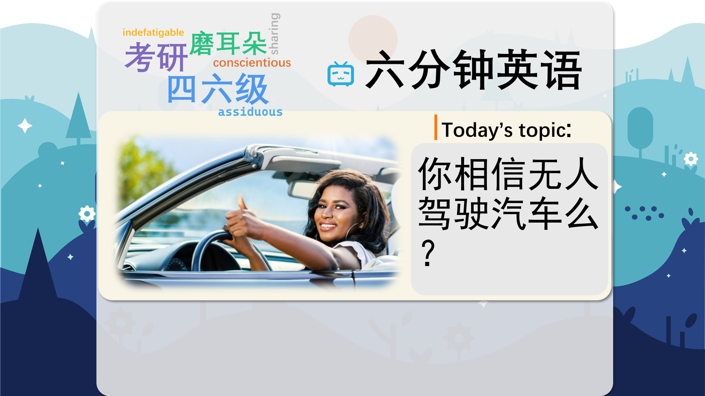

### 【英文脚本】
Alice
Hello and welcome to 6 Minute English. I'm Alice…
 
Neil
And I'm Neil. What do you think about autonomous cars, Alice?
 
Alice
An autonomous – or independent and driverless – car is a vehicle that is capable of sensing its environment and navigating without human input. I think they're a great idea.
 
Neil
And navigate means' to find the way to get to a place'. I'm not sure I would trust a computer to drive me. It might go wrong and crash into a wall.
 
Alice
Maybe, but actually most car accidents involve an element of human error, and human error means 'the mistakes we make because we're human'. For example, people who are behind the wheel while tired or drunk – or distracted.
 
Neil
Behind the wheel: in other words, in control of a car. Yes, I often see people talking on their mobile phones – or texting – instead of looking at the road.
 
Alice
They are being irresponsible drivers, Neil. Driving is the subject of today's show. I have a question for you. On average, how many people around the world die each day from road accidents? Is it… a) 300? b) 3,000? Or c) 30,000?
 
Neil
And I'm going to say b) 3,000.
 
Alice
Well, we'll see if you were right or not later on in the show. Are you a petrol head, Neil?
 
Neil
No, I'm not a petrol head – which is somebody who loves cars and driving. But I know Eddie Jordan, a racing team owner, is. And what does he love about driving? He'll answer this question himself. Let's listen.
 
INSERT
Eddie Jordan, racing team owner When I get in a car I feel a different person, I feel that I'm now in control. I can turn on the music or I can turn it off. I can do all sorts of different things that I feel good about. When I was flat out with the Jordan team I did have a driver and that was one to be able to make calls and to be able to receive calls and to be able to work in the car, not because I didn't want to drive and I always felt cheated because there was a driver there taking the pleasure that I should be having. So when I get in a car it has to be a fun experience.
 
Neil
Eddie Jordan there. And doing something flat out means 'at maximum capacity'. Do you feel like a different person when you're driving, Alice?
 
Alice
No. And – unlike Eddie Jordan – I'd love to have a driver or a driverless car, for that matter. It gives you time to do other things, like getting some work done. I certainly wouldn't feel cheated of the pleasure of driving!
 
Neil
I agree with Eddie Jordan. I would feel a bit cheated. And I have to admit: I'm a bit of a backseat driver. I sit in the passenger seat and give the driver unwanted advice.
 
Alice
Well just think, Neil, in a driverless car, you wouldn't need to give the computer advice because it would be making the right decisions to get you to your destination safely.
 
Neil
But can you override the computer? You know, if you felt that it was making bad decisions?
 
Alice
Override in this context means 'to stop an automatic action by taking control yourself'. Airline pilots do that, don't they? They fly on autopilot for most of the journey, but override it in order to take control of the plane for take-off and landing.
 
Neil
I would feel happier if I could take back control of an automated car if I wanted to.
 
Alice
Well, let's listen now to Brian Fung, a technology reporter, who's experienced what it is to be in a driverless car that has no steering wheels, no brake pedals, no emergency brake, no gear shifter. Google is developing a car in which everything will be self-contained.
 
INSERT
Brian Fung, technology reporter Well, the biggest thing you notice right off the bat is that the car accelerates a little bit more aggressively than a regular car might and it brakes a little more aggressively than a regular car might but other than that it takes about ten seconds for you to get pretty comfortable. And the car knew how to stop for red lights; it knew how to run through yellow lights, it could detect pedestrians and navigate its way around parked cars. All in all, it felt very similar to a regular car-driving experience. And I think that's one of the most surprising and exciting things about it – it's how mundane it was.
 
Neil
Brian Fung says he noticed right off the bat that the Google car accelerated and braked more aggressively than a regular car – and right off the bat means 'immediately'.
 
Alice
But he also says it took him only ten seconds to get used to it and feel comfortable, as the car navigated appropriately and responded to different traffic situations, including pedestrians and parked cars.
 
Neil
Well, that all sounds very nice, but I think I'd still prefer to be in the driving seat – and that means 'in control of a situation'. You can take the driverless car, and do your work, Alice.
 
Alice
Well, the future is likely to be all about automated transport – planes, trains, buses, and cars – and you simply won't have a choice, Neil.
 
Neil
Maybe you'll be allowed to hire a car you can drive yourself, just for fun.
 
Alice
Maybe. But I like the idea of a future with safe driverless roads.
 
Neil
I still need some convincing. And that brings us back to today's quiz question. Can you tell us the answer, now please, Alice?
 
Alice
Of course I can! I asked: On average, around how many people around the world die each day from road accidents? Is it… a) 300, b) 3,000 or c) 30,000?
 
Neil
And I said 3,000.
 
Alice
And unfortunately Neil that's right! Nearly 1.3 million people die in road crashes each year, on average 3,287 deaths a day. That's according to Annual Global Road Crash Statistics.
 
Neil
Now, here are the words we learned today: autonomous navigate human error behind the wheel petrol head flat out backseat driver override right off the bat in the driving seat
 
Alice
And that's the end of today's 6 Minute English. Don't forget to join us again soon!
 
Both
Bye!
 

### 【中英文双语脚本】
Alice(爱丽丝)
Hello and welcome to 6 Minute English. I'm Alice…
您好，欢迎来到 6 Minute English。我是 Alice...

Neil(尼尔)
And I'm Neil. What do you think about autonomous cars, Alice?
我是 Neil。爱丽丝，你觉得自动驾驶汽车怎么样？

Alice(爱丽丝)
An autonomous – or independent and driverless – car is a vehicle that is capable of sensing its environment and navigating without human input. I think they're a great idea.
自动驾驶或独立无人驾驶汽车是指能够在无需人工输入的情况下感知环境并导航的车辆。我认为他们是个好主意。

Neil(尼尔)
And navigate means' to find the way to get to a place'. I'm not sure I would trust a computer to drive me. It might go wrong and crash into a wall.
导航的意思是“找到到达某个地方的路”。我不确定我是否会相信计算机会驱动我。它可能会出错并撞到墙上。

Alice(爱丽丝)
Maybe, but actually most car accidents involve an element of human error, and human error means 'the mistakes we make because we're human'. For example, people who are behind the wheel while tired or drunk – or distracted.
也许吧，但实际上大多数车祸都涉及人为错误的因素，而人为错误是指“因为我们是人而犯的错误”。例如，在疲倦或醉酒或分心时开车的人。

Neil(尼尔)
Behind the wheel: in other words, in control of a car. Yes, I often see people talking on their mobile phones – or texting – instead of looking at the road.
在方向盘后面：换句话说，控制一辆汽车。是的，我经常看到人们用手机或短信聊天，而不是看路。

Alice(爱丽丝)
They are being irresponsible drivers, Neil. Driving is the subject of today's show. I have a question for you. On average, how many people around the world die each day from road accidents? Is it… a) 300? b) 3,000? Or c) 30,000?
他们是不负责任的司机，尼尔。驾驶是今天节目的主题。我有一个问题要问你。平均而言，全世界每天有多少人死于道路事故？是吗。。。a） 300 个？b） 3,000 人？或者 c） 30,000 人？

Neil(尼尔)
And I'm going to say b) 3,000.
我要说 b） 3,000。

Alice(爱丽丝)
Well, we'll see if you were right or not later on in the show. Are you a petrol head, Neil?
好吧，我们稍后会在节目中看看你是对还是错。你是汽油迷吗，尼尔？

Neil(尼尔)
No, I'm not a petrol head – which is somebody who loves cars and driving. But I know Eddie Jordan, a racing team owner, is. And what does he love about driving? He'll answer this question himself. Let's listen.
不，我不是一个汽油迷 —— 我是一个热爱汽车和驾驶的人。但我知道赛车队老板 Eddie Jordan 是。他喜欢开车的什么地方？他会自己回答这个问题。让我们倾听。

INSERT(插入)
Eddie Jordan, racing team owner When I get in a car I feel a different person, I feel that I'm now in control. I can turn on the music or I can turn it off. I can do all sorts of different things that I feel good about. When I was flat out with the Jordan team I did have a driver and that was one to be able to make calls and to be able to receive calls and to be able to work in the car, not because I didn't want to drive and I always felt cheated because there was a driver there taking the pleasure that I should be having. So when I get in a car it has to be a fun experience.
Eddie Jordan，赛车队老板当我坐上一辆车时，我感觉自己变了一个人，我觉得我现在掌控一切。我可以打开音乐，也可以关闭它。我可以做各种我感觉良好的不同事情。当我在 Jordan 团队全力以赴时，我确实有一名车手，他能够打电话、接电话、能够在车里工作，不是因为我不想开车，我总是觉得被骗了，因为那里有一位车手享受了我本应拥有的乐趣。所以当我坐上车时，它必须是一次有趣的经历。

Neil(尼尔)
Eddie Jordan there. And doing something flat out means 'at maximum capacity'. Do you feel like a different person when you're driving, Alice?
埃迪乔丹在那里。全力以赴意味着“以最大容量”。爱丽丝，当你开车时，你觉得自己变了一个人吗？

Alice(爱丽丝)
No. And – unlike Eddie Jordan – I'd love to have a driver or a driverless car, for that matter. It gives you time to do other things, like getting some work done. I certainly wouldn't feel cheated of the pleasure of driving!
不。而且 —— 与 Eddie Jordan 不同 —— 就此而言，我很想拥有一辆司机或无人驾驶汽车。它让你有时间做其他事情，比如完成一些工作。我当然不会觉得被驾驶的乐趣所欺骗！

Neil(尼尔)
I agree with Eddie Jordan. I would feel a bit cheated. And I have to admit: I'm a bit of a backseat driver. I sit in the passenger seat and give the driver unwanted advice.
我同意 Eddie Jordan 的观点。我会觉得有点被骗了。我不得不承认：我有点像后座司机。我坐在副驾驶座上，给司机一些不需要的建议。

Alice(爱丽丝)
Well just think, Neil, in a driverless car, you wouldn't need to give the computer advice because it would be making the right decisions to get you to your destination safely.
好吧，Neil，想想看，在无人驾驶汽车中，你不需要给计算机建议，因为它会做出正确的决定，让你安全地到达目的地。

Neil(尼尔)
But can you override the computer? You know, if you felt that it was making bad decisions?
但是你能覆盖计算机吗？你知道，如果你觉得它做出了错误的决定？

Alice(爱丽丝)
Override in this context means 'to stop an automatic action by taking control yourself'. Airline pilots do that, don't they? They fly on autopilot for most of the journey, but override it in order to take control of the plane for take-off and landing.
在此上下文中，Override 的意思是 “通过自己控制来停止自动作”。航空公司的飞行员就是这样做的，不是吗？他们在大部分旅程中都以自动驾驶仪飞行，但为了控制飞机的起飞和降落，他们超越了自动驾驶仪。

Neil(尼尔)
I would feel happier if I could take back control of an automated car if I wanted to.
如果我愿意，如果我能收回对自动驾驶汽车的控制权，我会感到更快乐。

Alice(爱丽丝)
Well, let's listen now to Brian Fung, a technology reporter, who's experienced what it is to be in a driverless car that has no steering wheels, no brake pedals, no emergency brake, no gear shifter. Google is developing a car in which everything will be self-contained.
好吧，现在让我们听听科技记者 Brian Fung 的演讲，他体验了在无人驾驶汽车中的感觉，没有方向盘、没有制动踏板、没有紧急制动、没有换档器。谷歌正在开发一款汽车，其中一切都将是独立的。

INSERT(插入)
Brian Fung, technology reporter Well, the biggest thing you notice right off the bat is that the car accelerates a little bit more aggressively than a regular car might and it brakes a little more aggressively than a regular car might but other than that it takes about ten seconds for you to get pretty comfortable. And the car knew how to stop for red lights; it knew how to run through yellow lights, it could detect pedestrians and navigate its way around parked cars. All in all, it felt very similar to a regular car-driving experience. And I think that's one of the most surprising and exciting things about it – it's how mundane it was.
Brian Fung，科技记者 嗯，你马上注意到的最重要的事情是，这辆车的加速可能比普通汽车更激进一点，刹车也比普通汽车更激进一点，但除此之外，你需要大约 10 秒才能适应。而且这辆车知道如何在红灯时停下来；它知道如何闯黄灯，可以检测行人并在停放的汽车周围导航。总而言之，感觉与普通的汽车驾驶体验非常相似。我认为这是它最令人惊讶和令人兴奋的事情之一 —— 它是多么平凡。

Neil(尼尔)
Brian Fung says he noticed right off the bat that the Google car accelerated and braked more aggressively than a regular car – and right off the bat means 'immediately'.
Brian Fung 说，他立即注意到 Google 汽车的加速和制动比普通汽车更激进 —— 马上就意味着“立即”。

Alice(爱丽丝)
But he also says it took him only ten seconds to get used to it and feel comfortable, as the car navigated appropriately and responded to different traffic situations, including pedestrians and parked cars.
但他也表示，他只花了 10 秒钟就适应了它并感到舒适，因为汽车可以适当地导航并响应不同的交通情况，包括行人和停放的汽车。

Neil(尼尔)
Well, that all sounds very nice, but I think I'd still prefer to be in the driving seat – and that means 'in control of a situation'. You can take the driverless car, and do your work, Alice.
嗯，这听起来很不错，但我想我仍然更喜欢坐在驾驶座上 —— 这意味着“掌控局势”。你可以坐那辆无人驾驶的车，去做你的工作吧，爱丽丝。

Alice(爱丽丝)
Well, the future is likely to be all about automated transport – planes, trains, buses, and cars – and you simply won't have a choice, Neil.
好吧，未来很可能都是关于自动化运输的 - 飞机、火车、公共汽车和汽车 - 你根本别无选择，Neil。

Neil(尼尔)
Maybe you'll be allowed to hire a car you can drive yourself, just for fun.
也许你会被允许租一辆可以自己驾驶的汽车，只是为了好玩。

Alice(爱丽丝)
Maybe. But I like the idea of a future with safe driverless roads.
或。但我喜欢未来拥有安全无人驾驶道路的想法。

Neil(尼尔)
I still need some convincing. And that brings us back to today's quiz question. Can you tell us the answer, now please, Alice?
我还需要一些说服力。这让我们回到了今天的测验问题。现在，您能告诉我们答案吗，爱丽丝？

Alice(爱丽丝)
Of course I can! I asked: On average, around how many people around the world die each day from road accidents? Is it… a) 300, b) 3,000 or c) 30,000?
我当然可以！我问道：平均而言，全世界每天大约有多少人死于交通事故？是吗。。。a） 300，b） 3,000 还是 c） 30,000？

Neil(尼尔)
And I said 3,000.
我说 3,000 人。

Alice(爱丽丝)
And unfortunately Neil that's right! Nearly 1.3 million people die in road crashes each year, on average 3,287 deaths a day. That's according to Annual Global Road Crash Statistics.
不幸的是，尼尔，没错！每年有近 130 万人死于道路交通事故，平均每天有 3,287 人死亡。这是根据年度全球道路交通事故统计数据得出的。

Neil(尼尔)
Now, here are the words we learned today: autonomous navigate human error behind the wheel petrol head flat out backseat driver override right off the bat in the driving seat
现在，以下是我们今天学到的单词： 自主导航 方向盘后面的人为错误 汽油头 后座驾驶员立即在驾驶座上超控

Alice(爱丽丝)
And that's the end of today's 6 Minute English. Don't forget to join us again soon!
这就是今天的六分钟 English 的结尾。别忘了很快再次加入我们！

Both(双)
Bye!
再见！

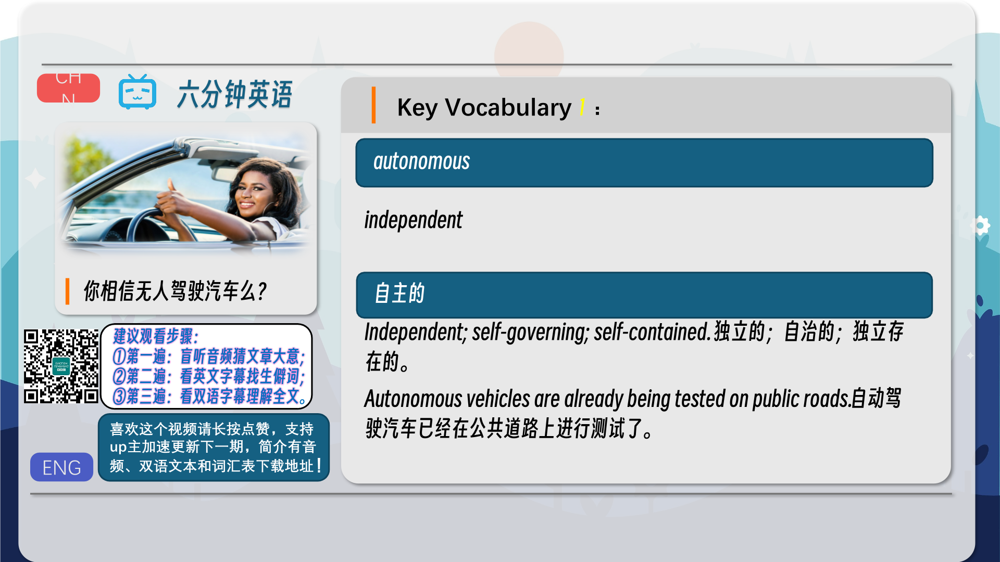
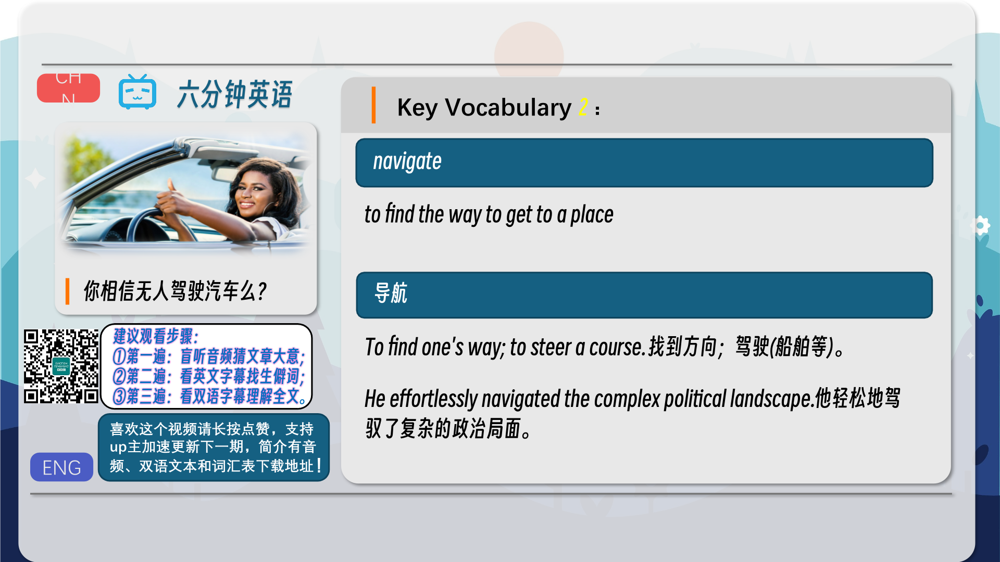
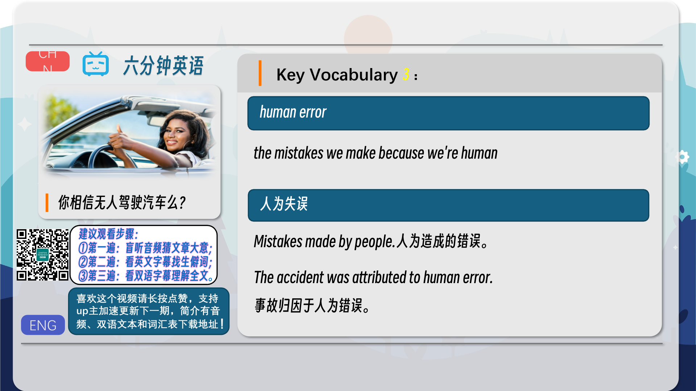
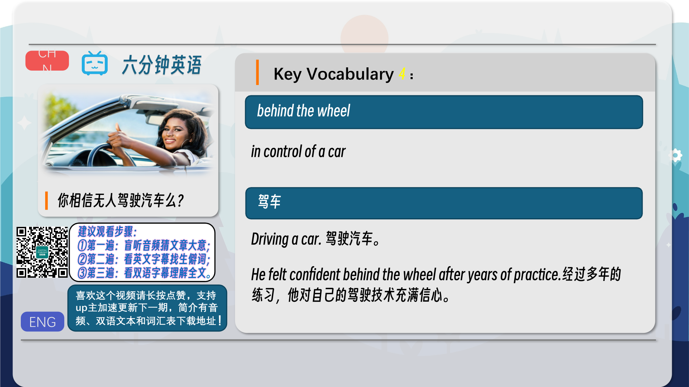
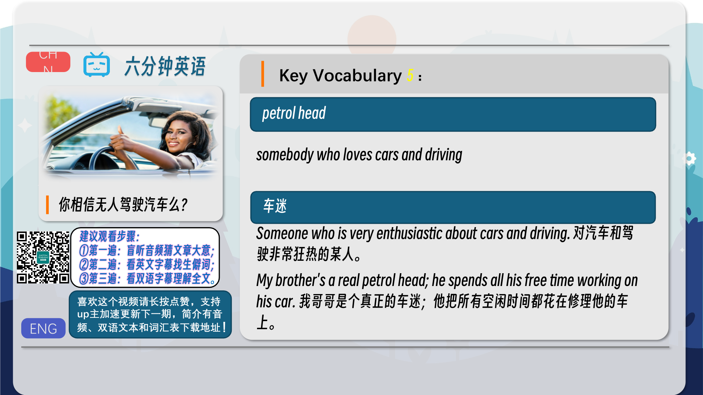
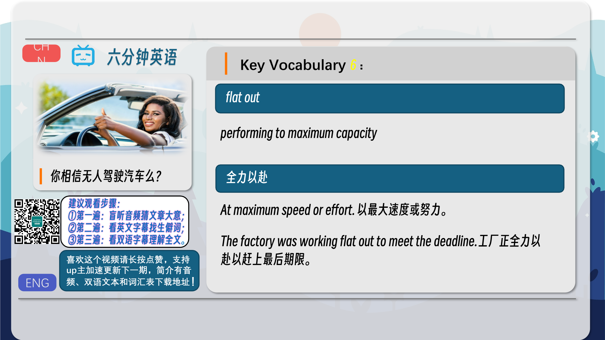
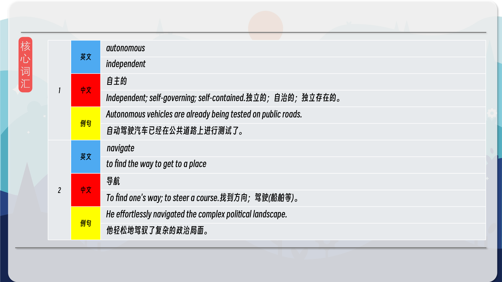
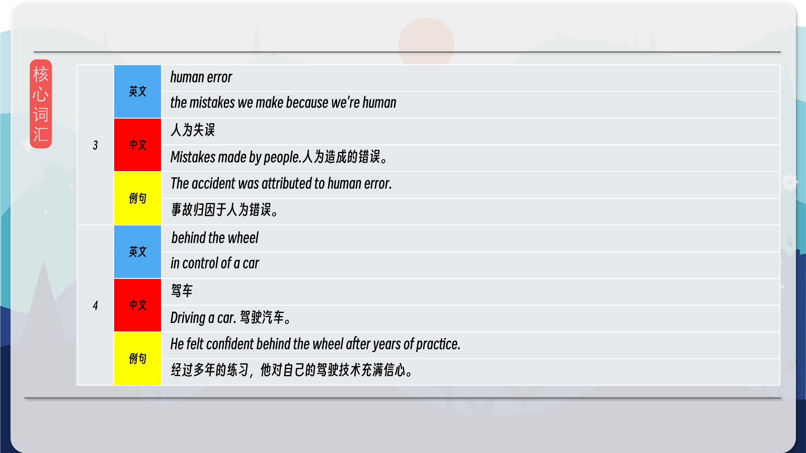
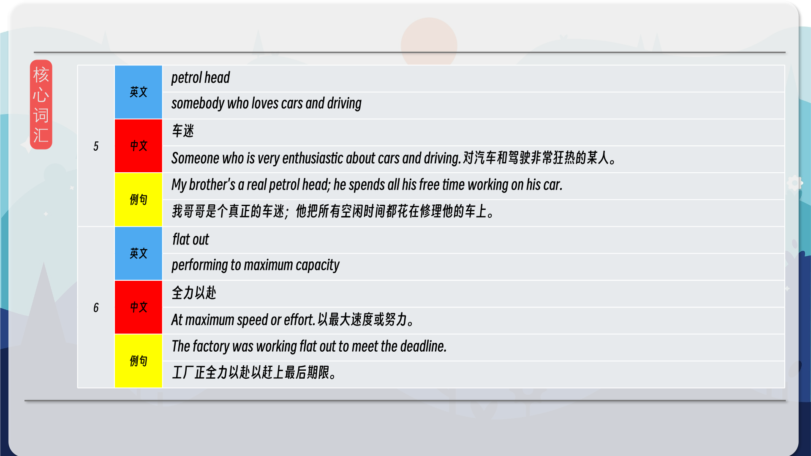
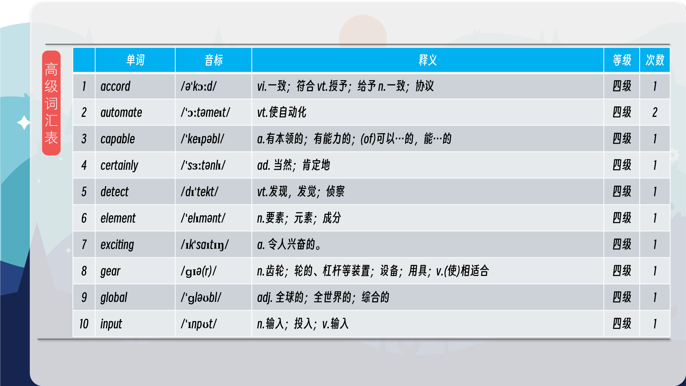
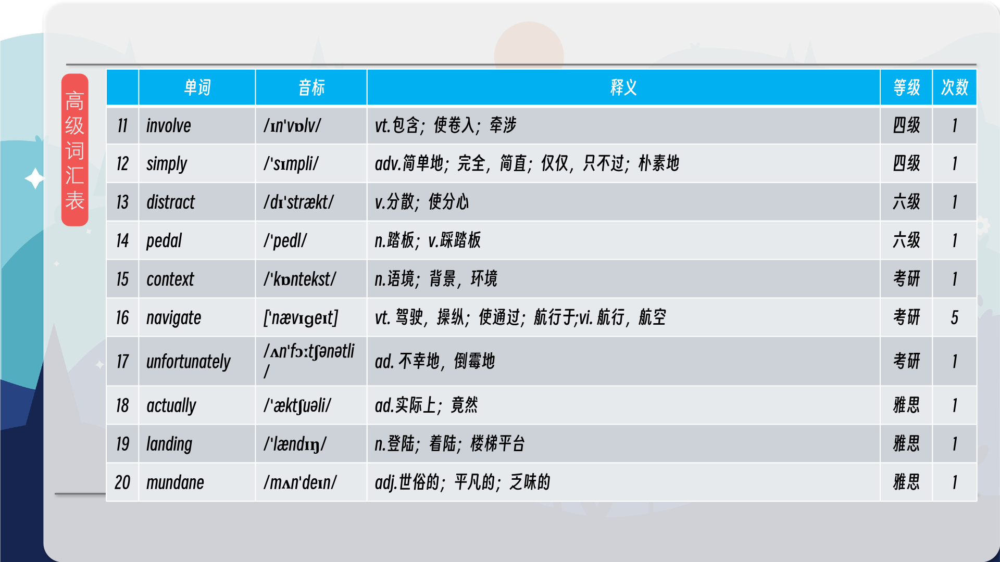
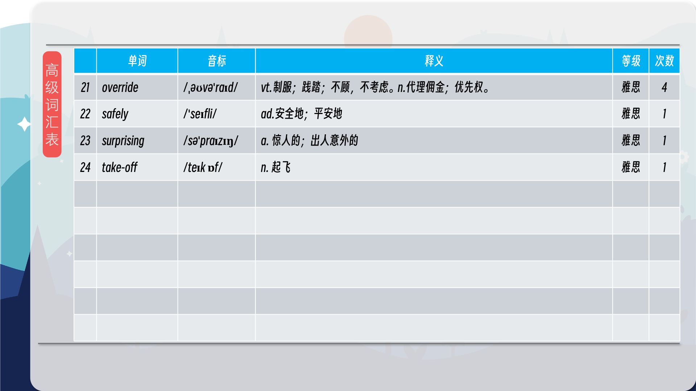

### 【核心词汇】
#### autonomous
independent
自主的
Independent; self-governing; self-contained. 独立的；自治的；独立存在的。
Autonomous vehicles are already being tested on public roads.
自动驾驶汽车已经在公共道路上进行测试了。
#### navigate
to find the way to get to a place
导航
To find one's way; to steer a course. 找到方向；驾驶(船舶等)。
He effortlessly navigated the complex political landscape.
他轻松地驾驭了复杂的政治局面。
#### human error
the mistakes we make because we're human
人为失误
Mistakes made by people. 人为造成的错误。
The accident was attributed to human error.
事故归因于人为错误。
#### behind the wheel
in control of a car
驾车
Driving a car. 驾驶汽车。
He felt confident behind the wheel after years of practice.
经过多年的练习，他对自己的驾驶技术充满信心。
#### petrol head
somebody who loves cars and driving
车迷
Someone who is very enthusiastic about cars and driving. 对汽车和驾驶非常狂热的某人。
My brother's a real petrol head; he spends all his free time working on his car.
我哥哥是个真正的车迷；他把所有空闲时间都花在修理他的车上。
#### flat out
performing to maximum capacity
全力以赴
At maximum speed or effort. 以最大速度或努力。
The factory was working flat out to meet the deadline.
工厂正全力以赴以赶上最后期限。

在公众号里输入6位数字，获取【对话音频、英文文本、中文翻译、核心词汇和高级词汇表】电子档，6位数字【暗号】在文章的最后一张图片，如【220728】，表示22年7月28日这一期。公众号没有的文章说明还没有制作相关资料。年度合集在B站【六分钟英语】工房获取，每年共计300+文档，感谢支持！