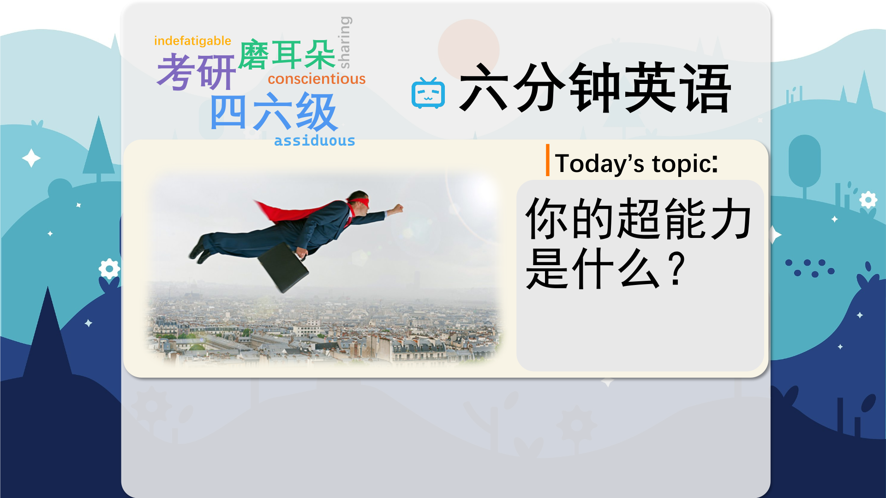

### 【英文脚本】
Neil
Hello and welcome to 6 Minute English. I'm Neil…
 
Alice
And I'm Alice. So Neil, the subject of today's show is superheroes! Who's your favourite?
 
Neil
Spiderman. He's cool and funny – and he can spin webs and jump off skyscrapers!
 
Alice
Well, my favourite superhero is Ms Marvel.
 
Neil
I've never heard of her – and I’m a bit on an expert on comic book superheroes.
 
Alice
Well, a growing number of people from ethnic backgrounds are getting bored of all these white male superheroes they can’t relate to. And they're hungry for characters a little closer to home – or relevant to their own lives.
 
Neil
So what's Ms Marvel's super power?
 
Alice
She's a shape shifter – which means she can change shape and become anything she wants. But she's also just Kamala Khan, an average teenager from New Jersey, who happens to be Asian and a Muslim.
 
Neil
It sounds good. But I think it must be time for today's quiz question, Alice!
 
Alice
OK, here it is. What is the name of the new character that replaces Tony Stark as Iron Man? Is it… a) Miles Morales? b) Riri Williams? Or c) Jane Foster?
 
Neil
I'm going to say a) Miles Morales because he sounds like a man.
 
Alice
Well, we'll find out later on the show whether you got the answer right or not. Now, I have another question. What are the rules for achieving superhero status? Superman is an alien, Ms Marvel has alien genes, and Spiderman and the Hulk are both contaminated – or poisoned – by radioactive substances that change their DNA.
 
Neil
What about Batman and Iron Man? They're just ordinary guys with a lot of money who use technology to create superpowers for themselves.
 
Alice
Good point. There don't seem to be any hard-and-fast – or clear – rules. But these special powers – whether it's being able to fly, or change shape, or spin webs – they allow the characters to do good in the world. And that’s a big theme across all comic books.
 
Neil
That's true. But times have changed, and comic books these days often blur the line between right and wrong – making things unclear. Superheroes don’t always do the right thing and struggle with everyday problems like you and me.
 
Alice
Let's hear more about imperfect superheroes from Jason Ditmer, professor of political geography at University College London.
 
INSERT
Jason Ditmer, professor of political geography at University College London They [Marvel Comics] imbued these characters with real human problems. So Peter Parker had just, was sort of… one problem after another. The Fantastic Four was a family and they bickered and fought and Reed and Sue were a couple, and then they got married, and that had, like, never happened in superhero comics. So these people had lives that others could relate to.
 
Neil
So publishers – like Marvel Comics – imbued – or filled – their characters with human problems. I can't imagine a character like Captain America worrying about small things – or bickering with his wife!
 
Alice
And bickering means arguing about things that aren't important. Well, like you said earlier, times change, Neil. These days, the publishing houses want to attract a more diverse – or varied – readership: teenagers, women, ethnic minorities – who want superheroes they can relate to, facing issues from racial discrimination to bickering at home.
 
Neil
I know that women are indeed interested in superheroes because they've been appearing in movies and on TV, but the world of comic books has always been a bit of a guy thing.
 
Alice
Well, it isn't. Women read them and in some places women work in them. In Japan for example, we have the manga – these are Japanese comic books for adults and children. And, guess what – there is a strong tradition of female illustrators there.
 
Neil
Really?
 
Alice
Yes. Let’s move on now and listen to Dr Casey Brienza, Sociologist at City University in London, talking about manga.
 
INSERT
Dr Casey Brienza, Sociologist at City University in London One of the really interesting things about producing comics in Japan is that it's one of the few, kind of, autonomous careers that women can have. And so Japan has many, many female comic-book artists who write both for men, women, boys, and girls. And in the United States and in Britain female comic-book artists are far and away a minority.
 
Neil
Dr Casey Brienza there. So she says female comic-book artists are common in Japan but are a minority in the US and the UK.
 
Alice
It's particularly interesting that being an artist is an autonomous career – meaning you have the freedom to make your own decisions - and apparently this is not common for women in Japan.
 
Neil
And do you know who draws Ms Marvel? Is it a woman?
 
Alice
No. Ms Marvel is drawn by a man – the Canadian comic book artist Adrian Alphona. But we are running out of time so let's go to today's quiz question. I asked you: what's the name of the new character that replaces Tony Stark as Iron Man? Is it… a) Miles Morales? b) Riri Williams? Or c) Jane Foster?
 
Neil
And I said Miles Morales.
 
Alice
And you were… wrong, Neil. I'm sorry. The answer is Riri Williams. Marvel Comics has recently diversified its characters to look more like the world we know today, including the addition of female African-American college student Riri Williams as Iron Man. Marvel has also given Thor's hammer to a woman, introduced a black, Hispanic Spider-Man called Miles Morales and created Kamala Khan, a Muslim superhero otherwise known as Ms Marvel.
 
Neil
Very interesting. Now, let's remind ourselves of the words we learned today: closer to home shape shifter contaminated hard and fast blur imbued bicker diverse manga autonomous
 
Alice
And that's the end of today's 6 Minute English. Don't forget to join us again soon!
 
Both
Bye!
 

### 【中英文双语脚本】
Neil(尼尔)
Hello and welcome to 6 Minute English. I'm Neil…
您好，欢迎来到 6 Minute English。我是 Neil...

Alice(爱丽丝)
And I'm Alice. So Neil, the subject of today's show is superheroes! Who's your favourite?
我是 Alice。所以 Neil，今天节目的主题是超级英雄！你最喜欢谁？

Neil(尼尔)
Spiderman. He's cool and funny – and he can spin webs and jump off skyscrapers!
蜘蛛侠。他很酷，很有趣 —— 他可以织网和从摩天大楼上跳下来！

Alice(爱丽丝)
Well, my favourite superhero is Ms Marvel.
嗯，我最喜欢的超级英雄是惊奇女士。

Neil(尼尔)
I've never heard of her – and I’m a bit on an expert on comic book superheroes.
我从来没有听说过她 —— 而且我有点像漫画超级英雄方面的专家。

Alice(爱丽丝)
Well, a growing number of people from ethnic backgrounds are getting bored of all these white male superheroes they can’t relate to. And they're hungry for characters a little closer to home – or relevant to their own lives.
好吧，越来越多的来自不同种族背景的人对所有这些他们无法与之产生共鸣的白人男性超级英雄感到厌倦。他们渴望更贴近家庭或与他们自己的生活相关的角色。

Neil(尼尔)
So what's Ms Marvel's super power?
那么惊奇女士的超能力是什么呢？

Alice(爱丽丝)
She's a shape shifter – which means she can change shape and become anything she wants. But she's also just Kamala Khan, an average teenager from New Jersey, who happens to be Asian and a Muslim.
她是一个变形者 —— 这意味着她可以改变形状并成为她想要的任何东西。但她也只是卡玛拉·汗（Kamala Khan），一个来自新泽西州的普通青少年，恰好是亚裔和穆斯林。

Neil(尼尔)
It sounds good. But I think it must be time for today's quiz question, Alice!
听起来不错。但我认为今天一定是问答问题的时候了，Alice！

Alice(爱丽丝)
OK, here it is. What is the name of the new character that replaces Tony Stark as Iron Man? Is it… a) Miles Morales? b) Riri Williams? Or c) Jane Foster?
好，就在这里。取代托尼·斯塔克饰演钢铁侠的新角色叫什么名字？是吗。。。a） 迈尔斯·莫拉莱斯？b） 里里·威廉姆斯？或者 c） 简·福斯特？

Neil(尼尔)
I'm going to say a) Miles Morales because he sounds like a man.
我要说 a） 迈尔斯·莫拉莱斯，因为他听起来像个男人。

Alice(爱丽丝)
Well, we'll find out later on the show whether you got the answer right or not. Now, I have another question. What are the rules for achieving superhero status? Superman is an alien, Ms Marvel has alien genes, and Spiderman and the Hulk are both contaminated – or poisoned – by radioactive substances that change their DNA.
好吧，我们稍后会在节目中发现您是否回答正确。现在，我有另一个问题。获得超级英雄地位的规则是什么？超人是外星人，惊奇女士有外星基因，蜘蛛侠和绿巨人都被改变 DNA 的放射性物质污染或中毒。

Neil(尼尔)
What about Batman and Iron Man? They're just ordinary guys with a lot of money who use technology to create superpowers for themselves.
蝙蝠侠和钢铁侠呢？他们只是拥有大量金钱的普通人，利用技术为自己创造超能力。

Alice(爱丽丝)
Good point. There don't seem to be any hard-and-fast – or clear – rules. But these special powers – whether it's being able to fly, or change shape, or spin webs – they allow the characters to do good in the world. And that’s a big theme across all comic books.
说得好。似乎没有任何硬性规定或明确的规定。但这些特殊能力 —— 无论是能够飞行、改变形状还是织网 —— 它们都让角色在世界上做好事。这是所有漫画书的一个大主题。

Neil(尼尔)
That's true. But times have changed, and comic books these days often blur the line between right and wrong – making things unclear. Superheroes don’t always do the right thing and struggle with everyday problems like you and me.
这是真的。但时代变了，如今的漫画书经常模糊对与错的界限 —— 让事情变得不清楚。超级英雄并不总是做正确的事情，像你我一样与日常问题作斗争。

Alice(爱丽丝)
Let's hear more about imperfect superheroes from Jason Ditmer, professor of political geography at University College London.
让我们从伦敦大学学院政治地理学教授 Jason Ditmer 那里更多地了解不完美的超级英雄。

INSERT(插入)
Jason Ditmer, professor of political geography at University College London They [Marvel Comics] imbued these characters with real human problems. So Peter Parker had just, was sort of… one problem after another. The Fantastic Four was a family and they bickered and fought and Reed and Sue were a couple, and then they got married, and that had, like, never happened in superhero comics. So these people had lives that others could relate to.
杰森·迪特默（Jason Ditmer），伦敦大学学院政治地理学教授他们 [漫威漫画] 为这些角色注入了真实的人类问题。所以彼得·帕克刚刚，有点......一个接一个的问题。神奇四侠是一个家庭，他们争吵和打架，里德和苏是一对，然后他们结婚了，这在超级英雄漫画中从来没有发生过。所以这些人的生活让其他人可以感同身受。

Neil(尼尔)
So publishers – like Marvel Comics – imbued – or filled – their characters with human problems. I can't imagine a character like Captain America worrying about small things – or bickering with his wife!
因此，出版商 —— 比如漫威漫画 —— 将人性问题灌输或填充到他们的角色中。我无法想象像美国队长这样的角色会为小事担心 —— 或者和他的妻子争吵！

Alice(爱丽丝)
And bickering means arguing about things that aren't important. Well, like you said earlier, times change, Neil. These days, the publishing houses want to attract a more diverse – or varied – readership: teenagers, women, ethnic minorities – who want superheroes they can relate to, facing issues from racial discrimination to bickering at home.
而争吵意味着为不重要的事情争论。嗯，就像你之前说的，时代在变化，Neil。如今，出版社希望吸引更多样化或多样化的读者群：青少年、女性、少数民族 —— 他们希望有与自己产生共鸣的超级英雄，面临从种族歧视到家庭争吵等问题。

Neil(尼尔)
I know that women are indeed interested in superheroes because they've been appearing in movies and on TV, but the world of comic books has always been a bit of a guy thing.
我知道女性确实对超级英雄感兴趣，因为她们一直出现在电影和电视上，但漫画书的世界一直有点像男人。

Alice(爱丽丝)
Well, it isn't. Women read them and in some places women work in them. In Japan for example, we have the manga – these are Japanese comic books for adults and children. And, guess what – there is a strong tradition of female illustrators there.
嗯，不是。女性阅读它们，在某些地方，女性在其中工作。例如，在日本，我们有漫画 —— 这些是成人和儿童的日本漫画书。而且，你猜怎么着 —— 那里有很强的女性插画家传统。

Neil(尼尔)
Really?
真？

Alice(爱丽丝)
Yes. Let’s move on now and listen to Dr Casey Brienza, Sociologist at City University in London, talking about manga.
是的。现在让我们继续前进，听听伦敦城市大学（City University）的社会学家凯西·布里恩扎（Casey Brienza）博士谈论漫画。

INSERT(插入)
Dr Casey Brienza, Sociologist at City University in London One of the really interesting things about producing comics in Japan is that it's one of the few, kind of, autonomous careers that women can have. And so Japan has many, many female comic-book artists who write both for men, women, boys, and girls. And in the United States and in Britain female comic-book artists are far and away a minority.
Casey Brienza 博士，伦敦城市大学社会学家在日本制作漫画真正有趣的事情之一是，它是女性可以拥有的少数自主职业之一。因此，日本有很多很多女性漫画家，她们为男性、女性、男孩和女孩写作。在美国和英国，女性漫画家无疑是少数。

Neil(尼尔)
Dr Casey Brienza there. So she says female comic-book artists are common in Japan but are a minority in the US and the UK.
Casey Brienza 博士在那里。所以她说，女性漫画家在日本很常见，但在美国和英国却是少数。

Alice(爱丽丝)
It's particularly interesting that being an artist is an autonomous career – meaning you have the freedom to make your own decisions - and apparently this is not common for women in Japan.
特别有趣的是，成为一名艺术家是一个自主的职业–这意味着你可以自由地做出自己的决定--显然，这对日本女性来说并不常见。

Neil(尼尔)
And do you know who draws Ms Marvel? Is it a woman?
你知道谁画了惊奇女士吗？是女性吗？

Alice(爱丽丝)
No. Ms Marvel is drawn by a man – the Canadian comic book artist Adrian Alphona. But we are running out of time so let's go to today's quiz question. I asked you: what's the name of the new character that replaces Tony Stark as Iron Man? Is it… a) Miles Morales? b) Riri Williams? Or c) Jane Foster?
不。惊奇女士是由一个男人绘制的 —— 加拿大漫画家阿德里安·阿尔方纳 （Adrian Alphona）。但是我们的时间不多了，所以让我们来看看今天的测验问题。我问你：取代托尼·斯塔克饰演钢铁侠的新角色叫什么名字？是吗。。。a） 迈尔斯·莫拉莱斯？b） 里里·威廉姆斯？或者 c） 简·福斯特？

Neil(尼尔)
And I said Miles Morales.
我说的是迈尔斯·莫拉莱斯。

Alice(爱丽丝)
And you were… wrong, Neil. I'm sorry. The answer is Riri Williams. Marvel Comics has recently diversified its characters to look more like the world we know today, including the addition of female African-American college student Riri Williams as Iron Man. Marvel has also given Thor's hammer to a woman, introduced a black, Hispanic Spider-Man called Miles Morales and created Kamala Khan, a Muslim superhero otherwise known as Ms Marvel.
而你是......错了，尼尔。对不起。答案是 Riri Williams。漫威漫画最近对其角色进行了多样化，使其看起来更像我们今天所知道的世界，包括增加非裔美国女大学生瑞里·威廉姆斯 （Riri Williams） 饰演钢铁侠。漫威还将雷神的锤子给了一位女性，介绍了一位名叫迈尔斯·莫拉莱斯 （Miles Morales） 的西班牙裔黑人蜘蛛侠，并创造了穆斯林超级英雄卡玛拉·汗 （Kamala Khan），也被称为惊奇女士。

Neil(尼尔)
Very interesting. Now, let's remind ourselves of the words we learned today: closer to home shape shifter contaminated hard and fast blur imbued bicker diverse manga autonomous
非常有趣。现在，让我们提醒自己今天学到的单词： 离家更近 变形器 污染 硬而快 模糊 灌输 争吵者 多样化 漫画 自主

Alice(爱丽丝)
And that's the end of today's 6 Minute English. Don't forget to join us again soon!
这就是今天的六分钟 English 的结尾。别忘了很快再次加入我们！

Both(双)
Bye!
再见！

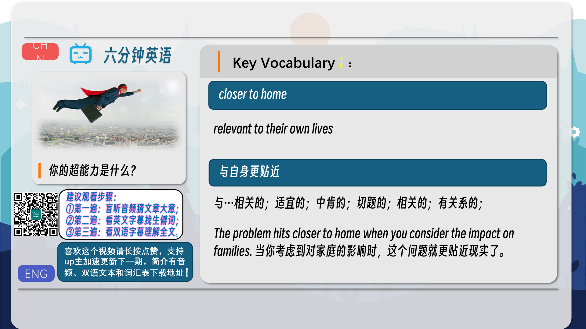
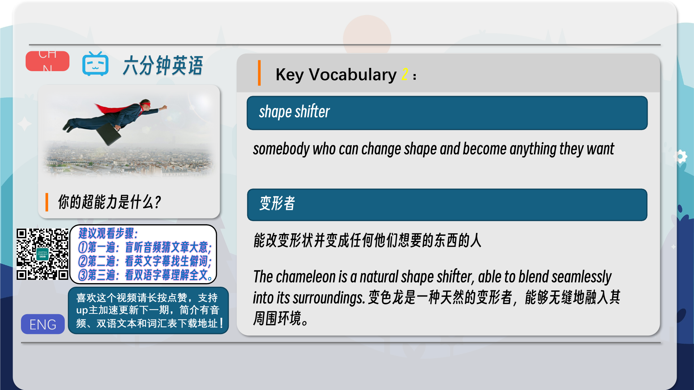
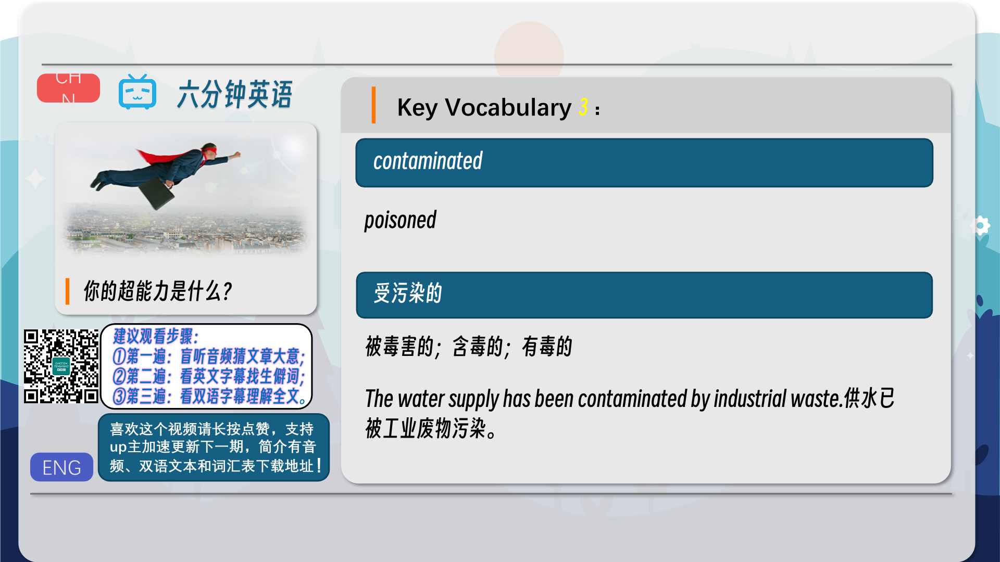
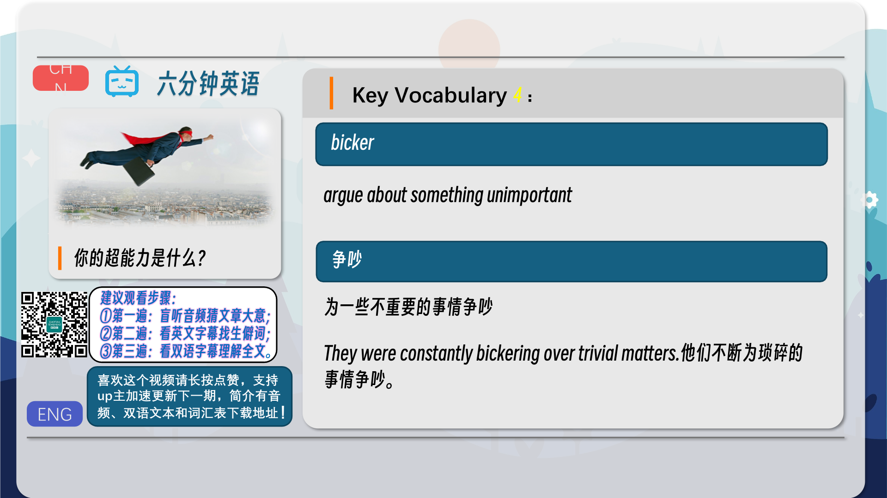
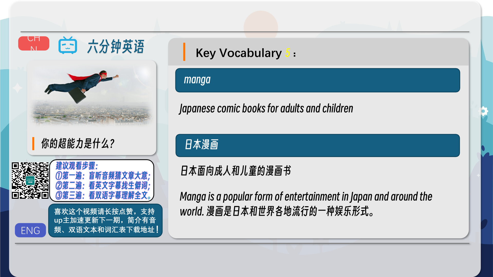
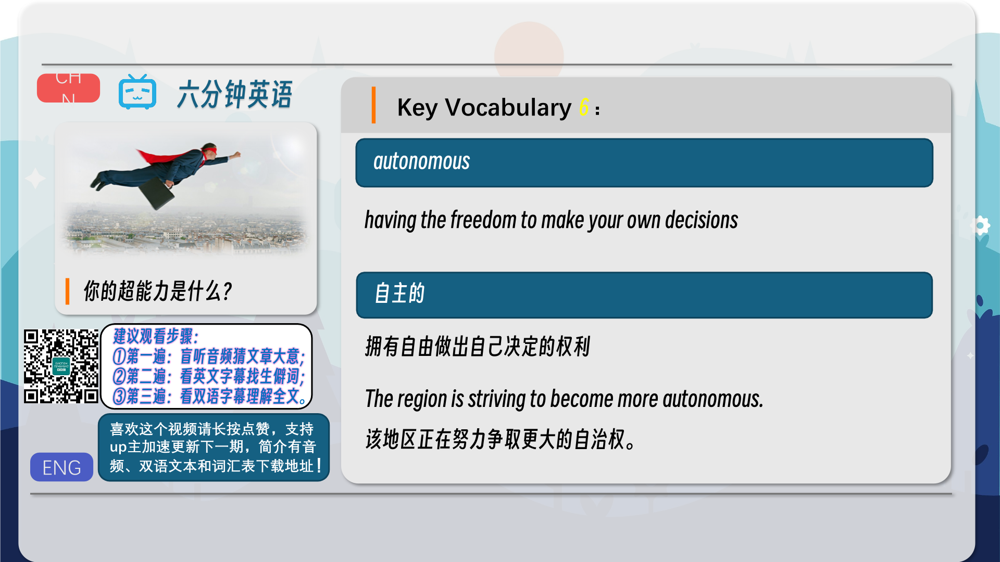
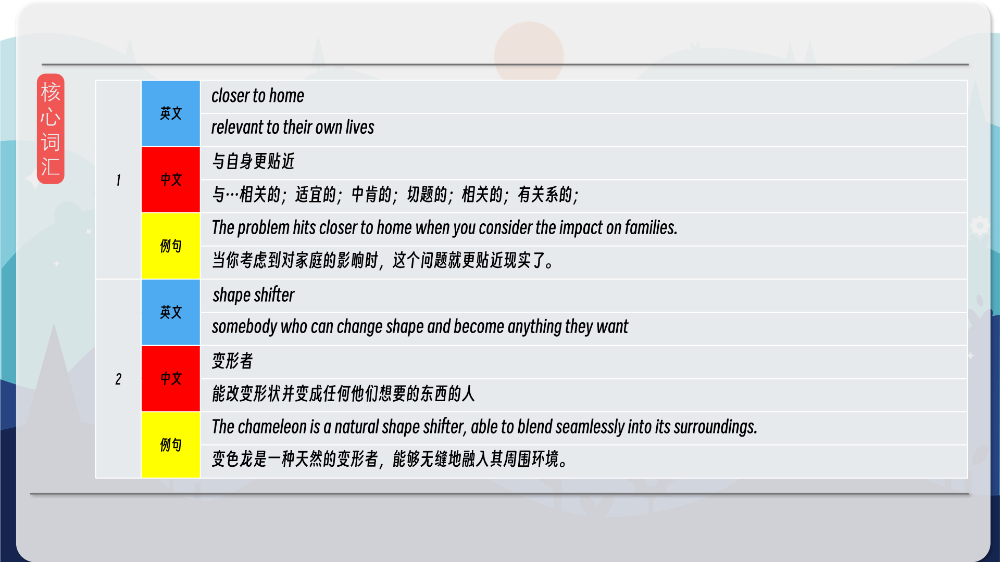
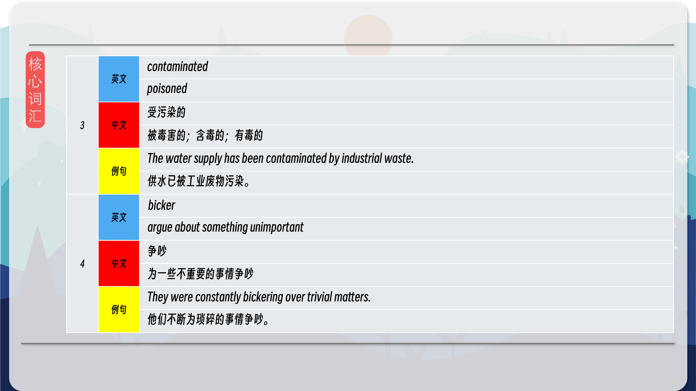
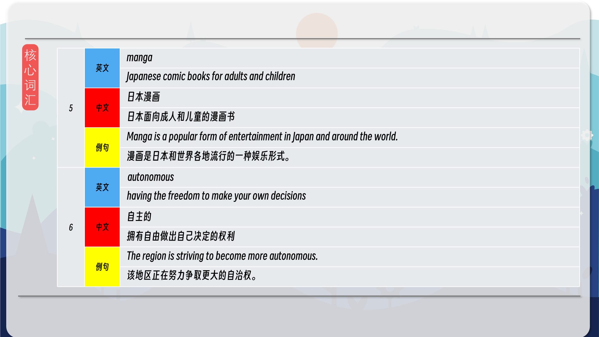
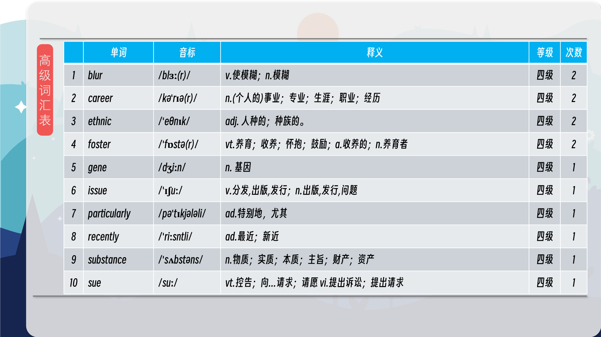
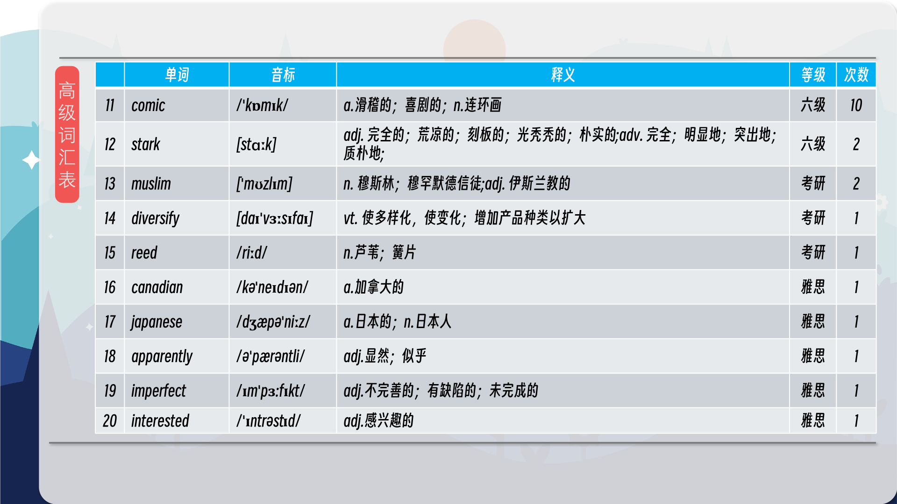
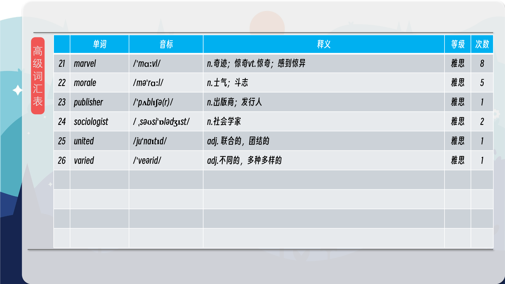

### 【核心词汇】
#### closer to home
relevant to their own lives
与自身更贴近
与…相关的；适宜的；中肯的；切题的；相关的；有关系的；
The problem hits closer to home when you consider the impact on families.
当你考虑到对家庭的影响时，这个问题就更贴近现实了。
#### shape shifter
somebody who can change shape and become anything they want
变形者
能改变形状并变成任何他们想要的东西的人
The chameleon is a natural shape shifter, able to blend seamlessly into its surroundings.
变色龙是一种天然的变形者，能够无缝地融入其周围环境。
#### contaminated
poisoned
受污染的
被毒害的；含毒的；有毒的
The water supply has been contaminated by industrial waste.
供水已被工业废物污染。
#### bicker
argue about something unimportant
争吵
为一些不重要的事情争吵
They were constantly bickering over trivial matters.
他们不断为琐碎的事情争吵。
#### manga
Japanese comic books for adults and children
日本漫画
日本面向成人和儿童的漫画书
Manga is a popular form of entertainment in Japan and around the world.
漫画是日本和世界各地流行的一种娱乐形式。
#### autonomous
having the freedom to make your own decisions
自主的
拥有自由做出自己决定的权利
The region is striving to become more autonomous.
该地区正在努力争取更大的自治权。

在公众号里输入6位数字，获取【对话音频、英文文本、中文翻译、核心词汇和高级词汇表】电子档，6位数字【暗号】在文章的最后一张图片，如【220728】，表示22年7月28日这一期。公众号没有的文章说明还没有制作相关资料。年度合集在B站【六分钟英语】工房获取，每年共计300+文档，感谢支持！