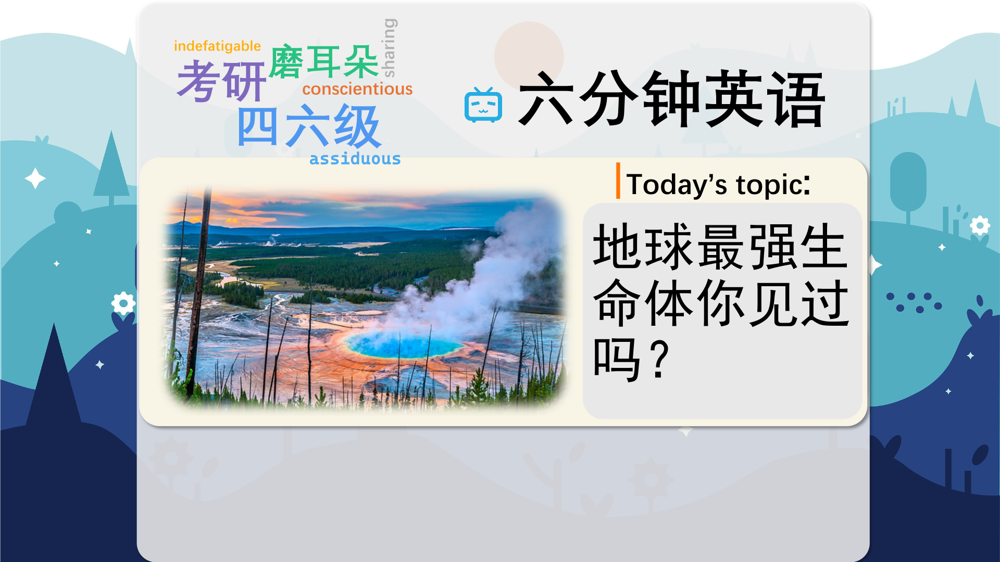

### 【英文脚本】
Alice
Hello and welcome to 6 Minute English. I'm Alice…
 
Neil
And I'm Neil. So Alice, what's your ideal place to be?
 
Alice
Curled up on the sofa with a good book in front of a log fire. Last night it was very cold.
 
Neil
Well, for me, lying in a hammock under a palm tree on a tropical beach with a cool breeze. I don't like when it's too hot.
 
Alice
Yes, true. Humans don't cope well with extremes of temperature but some species do. The subject of today's show is extremophiles – these are microorganisms that have adapted to live in what we would consider to be extreme conditions. For example, living in near boiling acidic water or frozen at the bottom of an Antarctic lake.
 
Neil
Those do sound like pretty extreme conditions.
 
Alice
Yes. The thing is, what sounds hostile – or unfriendly – to us, are perfect environments for extremophiles and in fact they wouldn't survive without them. Now, are you tough enough to face up to today's quiz question, Neil?
 
Neil
I think so.
 
Alice
Alright then, here goes: which US National Park is home to geysers – or hot springs that shoot hot water and steam into the air – which have extremophiles living in them? Is it… a) Grand Canyon? b) Death Valley National Park? Or c) Yellowstone?
 
Neil
That's easy - it has to be c) Yellowstone.
 
Alice
OK, well we'll find out if you got the answer right later on in the show. But, moving on, now, Neil, did you know that extremophiles belong to an entirely different group of living things to other animals and plants?
 
Neil
No. I imagined extremophiles would be like insects, because insects are pretty tough, aren't they?
 
Alice
Yes, that's true. But remember, extremophiles are microorganisms – they're really tiny. Let's listen to Ian Crawford, Professor of Planetary Science and Astrobiology at Birkbeck University of London. He tells us how in the 1970s a scientist called Carl Woese identified a new kingdom of living things that he called 'archaea' – meaning 'ancient ones'. The extremophiles belong to this group.
 
INSERT
Ian Crawford, Professor of Planetary Science and Astrobiology at Birkbeck University of London Well, the old tree of life idea basically talked about empires if you like, of plants, and animals, and things that we can see, essentially. We put a great deal of emphasis on large organisms and the traditional distinction in biology between botany and zoology. What it really did was say 'that's all wrong – there's really only three major groups in life: there's the archaea, the bacteria, and the eukaryotes, which is all of this complex life'; and so it kind of put humans into a small corner of the tree of life next to plants and whatever else. It kind of squashes us again after being the centre of the universe.
 
Neil
So botany is the study of plant life, and zoology is the study of animal life. But maybe you can explain 'archaea', and 'eukaryotes', Alice.
 
Alice
Archaea are a group of single-celled microbes similar to bacteria but different to all other known types. Eukaryote is the scientific term for organisms with a much larger and more complex type of cell– and this group includes all animals, plants, and fungi.
 
Neil
But why are archaea so important? Why do they need a whole biological domain to themselves, while we humans get squashed up in one domain with plants and fungi?
 
Alice
Well, Neil, it's likely they've have been living on our planet ever since the Earth became habitable – and that's billions of years. And they are still living and thriving in a whole range of different environments today.
 
Neil
And when something is thriving it means it's doing well! So tell us about where they live, Alice.
 
Alice
Some live in hydrothermal vents – holes in the ocean floor hundreds of metres down where there's lots of pressure and no sunlight. And mineral-rich superheated water is coming out of the Earth's crust and then flowing out through these holes.
 
Neil
I see… Well, what about cold-loving extremophiles?
 
Alice
Well, scientists have found them in hidden lakes trapped beneath ice sheets hundreds of metres thick in Antarctica. It takes days to drill through the ice to reach the water.
 
Neil
And how do they survive down there?
 
Alice
Well, these microbes have found a way of getting energy from certain minerals like iron and sulphur present in the water.
 
Neil
That sounds clever for a microbe – how did they figure that out?
 
Alice
It isn't a question of cleverness - it's a question of adaptation. Extremophiles are extremely well adapted to their environment and they appeared on Earth much earlier than more complex life forms. Let's hear from Nick Lane, Reader in Evolutionary Biochemistry at University College London.
 
INSERT
Nick Lane, Reader in Evolutionary Biochemistry at University College London The origin of the Eukaryotic cell, it seems to have happened once, it took about 2 billion years before that happened. Then there was kind of a great leap forward at the cellular level, but another billion years went by before we see animals.
 
Neil
So, basically, the animal kingdom is much newer than the archaean kingdom.
 
Alice
Indeed. And now it's time for the answer to today's quiz question, Neil. I asked: which US National Park is home to geysers that have extremophiles living in them? Is it… a) Grand Canyon, b) Death Valley National Park or c) Yellowstone?
 
Neil
And I said c) Yellowstone. I must be right.
 
Alice
Yes, Neil, you are right - it's Yellowstone National Park. Every year, scientists discover remarkable new microbes in Yellowstone's hot springs, with implications for medicine, agriculture and energy, as well as offering clues to the formation of the earliest life on Earth.
 
Neil
Very interesting. Now, here are the words we heard today: extremophiles hostile geysers microorganisms botany zoology archaea eukaryote thriving hydrothermal vents
 
Alice
And that's the end of today's 6 Minute English. Don't forget to join us again soon!
 
Both
Bye!
 

### 【中英文双语脚本】
Alice(爱丽丝)
Hello and welcome to 6 Minute English. I'm Alice…
您好，欢迎来到 6 Minute English。我是 Alice...

Neil(尼尔)
And I'm Neil. So Alice, what's your ideal place to be?
我是 Neil。那么 Alice，您理想的地方是哪里？

Alice(爱丽丝)
Curled up on the sofa with a good book in front of a log fire. Last night it was very cold.
蜷缩在沙发上，在柴火前放着一本好书。昨晚非常冷。

Neil(尼尔)
Well, for me, lying in a hammock under a palm tree on a tropical beach with a cool breeze. I don't like when it's too hot.
嗯，对我来说，躺在热带海滩上棕榈树下的吊床上，微风拂面。我不喜欢太热的时候。

Alice(爱丽丝)
Yes, true. Humans don't cope well with extremes of temperature but some species do. The subject of today's show is extremophiles – these are microorganisms that have adapted to live in what we would consider to be extreme conditions. For example, living in near boiling acidic water or frozen at the bottom of an Antarctic lake.
是的，确实如此。人类不能很好地应对极端温度，但有些物种可以。今天节目的主题是极端微生物 —— 这些微生物已经适应了生活在我们认为是极端条件下的微生物。例如，生活在接近沸腾的酸性水中或在南极湖底部结冰。

Neil(尼尔)
Those do sound like pretty extreme conditions.
这些听起来确实是相当极端的情况。

Alice(爱丽丝)
Yes. The thing is, what sounds hostile – or unfriendly – to us, are perfect environments for extremophiles and in fact they wouldn't survive without them. Now, are you tough enough to face up to today's quiz question, Neil?
是的。问题是，对我们来说听起来充满敌意或不友好的是极端微生物的完美环境，事实上，没有它们它们就无法生存。现在，尼尔，你有足够的勇气来面对今天的测验问题吗？

Neil(尼尔)
I think so.
我认为如此。

Alice(爱丽丝)
Alright then, here goes: which US National Park is home to geysers – or hot springs that shoot hot water and steam into the air – which have extremophiles living in them? Is it… a) Grand Canyon? b) Death Valley National Park? Or c) Yellowstone?
好了，那么，这里开始了：哪个美国国家公园是间歇泉的所在地 —— 或者说是将热水和蒸汽喷射到空中的温泉 —— 里面生活着极端微生物？是吗。。。a） 大峡谷？b） 死亡谷国家公园？或者 c） 黄石公园？

Neil(尼尔)
That's easy - it has to be c) Yellowstone.
这很简单 - 必须是 c） 黄石公园。

Alice(爱丽丝)
OK, well we'll find out if you got the answer right later on in the show. But, moving on, now, Neil, did you know that extremophiles belong to an entirely different group of living things to other animals and plants?
好的，我们会在节目的后面看看你是否得到了正确的答案。但是，继续说下去，现在，尼尔，你知道极端微生物与其他动物和植物属于完全不同的生物群吗？

Neil(尼尔)
No. I imagined extremophiles would be like insects, because insects are pretty tough, aren't they?
不。我想象极端微生物会像昆虫一样，因为昆虫很坚韧，不是吗？

Alice(爱丽丝)
Yes, that's true. But remember, extremophiles are microorganisms – they're really tiny. Let's listen to Ian Crawford, Professor of Planetary Science and Astrobiology at Birkbeck University of London. He tells us how in the 1970s a scientist called Carl Woese identified a new kingdom of living things that he called 'archaea' – meaning 'ancient ones'. The extremophiles belong to this group.
是的，这是真的。但请记住，极端微生物是微生物 —— 它们真的很小。让我们听听伦敦伯贝克大学行星科学和天体生物学教授伊恩·克劳福德 （Ian Crawford） 的演讲。他告诉我们，在 1970 年代，一位名叫 Carl Woese 的科学家如何确定了一个新的生物王国，他称之为“古细菌” —— 意思是“古老的”。极端微生物属于这一组。

INSERT(插入)
Ian Crawford, Professor of Planetary Science and Astrobiology at Birkbeck University of London Well, the old tree of life idea basically talked about empires if you like, of plants, and animals, and things that we can see, essentially. We put a great deal of emphasis on large organisms and the traditional distinction in biology between botany and zoology. What it really did was say 'that's all wrong – there's really only three major groups in life: there's the archaea, the bacteria, and the eukaryotes, which is all of this complex life'; and so it kind of put humans into a small corner of the tree of life next to plants and whatever else. It kind of squashes us again after being the centre of the universe.
伊恩·克劳福德（Ian Crawford），伦敦伯贝克大学行星科学和天体生物学教授嗯，古老的生命之树概念基本上是关于帝国，如果你愿意的话，植物、动物，以及我们可以看到的事物。我们非常重视大型生物以及植物学和动物学在生物学中的传统区别。它真正做的是说“这都是错误的 —— 生命中实际上只有三个主要群体：古细菌、细菌和真核生物，它们就是所有这些复杂的生命”；所以它有点把人类放在生命之树的一个小角落里，旁边是植物和其他任何东西。在成为宇宙的中心之后，它又一次压制了我们。

Neil(尼尔)
So botany is the study of plant life, and zoology is the study of animal life. But maybe you can explain 'archaea', and 'eukaryotes', Alice.
所以植物学是对植物生命的研究，而动物学是对动物生命的研究。但也许你可以解释“古细菌”和“真核生物”，爱丽丝。

Alice(爱丽丝)
Archaea are a group of single-celled microbes similar to bacteria but different to all other known types. Eukaryote is the scientific term for organisms with a much larger and more complex type of cell– and this group includes all animals, plants, and fungi.
古细菌是一组单细胞微生物，类似于细菌，但与所有其他已知类型不同。真核生物是具有更大、更复杂的细胞类型的生物的科学术语 —— 该组包括所有动物、植物和真菌。

Neil(尼尔)
But why are archaea so important? Why do they need a whole biological domain to themselves, while we humans get squashed up in one domain with plants and fungi?
但为什么古细菌如此重要呢？为什么他们需要属于自己的整个生物领域，而我们人类却被植物和真菌挤在一个领域？

Alice(爱丽丝)
Well, Neil, it's likely they've have been living on our planet ever since the Earth became habitable – and that's billions of years. And they are still living and thriving in a whole range of different environments today.
嗯，尼尔，自从地球变得宜居以来，它们很可能就一直生活在我们的星球上 —— 那是数十亿年。今天，它们仍然在各种不同的环境中生活和繁荣。

Neil(尼尔)
And when something is thriving it means it's doing well! So tell us about where they live, Alice.
当某样东西蓬勃发展时，意味着它做得很好！那么，告诉我们他们住在哪里，Alice。

Alice(爱丽丝)
Some live in hydrothermal vents – holes in the ocean floor hundreds of metres down where there's lots of pressure and no sunlight. And mineral-rich superheated water is coming out of the Earth's crust and then flowing out through these holes.
有些生活在热液喷口中，即海底数百米深的洞，那里有很大的压力，没有阳光。富含矿物质的过热水从地壳中流出，然后通过这些空洞流出。

Neil(尼尔)
I see… Well, what about cold-loving extremophiles?
明白了。。。那么，爱寒的极端微生物呢？

Alice(爱丽丝)
Well, scientists have found them in hidden lakes trapped beneath ice sheets hundreds of metres thick in Antarctica. It takes days to drill through the ice to reach the water.
嗯，科学家们在南极洲数百米厚的冰盖下的隐藏湖泊中发现了它们。钻穿冰层到达水面需要几天时间。

Neil(尼尔)
And how do they survive down there?
他们又是如何在那儿生存的呢？

Alice(爱丽丝)
Well, these microbes have found a way of getting energy from certain minerals like iron and sulphur present in the water.
嗯，这些微生物已经找到了一种从水中的某些矿物质（如铁和硫）中获取能量的方法。

Neil(尼尔)
That sounds clever for a microbe – how did they figure that out?
对于微生物来说，这听起来很聪明 —— 他们是怎么弄清楚的呢？

Alice(爱丽丝)
It isn't a question of cleverness - it's a question of adaptation. Extremophiles are extremely well adapted to their environment and they appeared on Earth much earlier than more complex life forms. Let's hear from Nick Lane, Reader in Evolutionary Biochemistry at University College London.
这不是一个聪明的问题 —— 这是一个适应的问题。极端微生物对环境的适应能力极强，它们比更复杂的生命形式更早出现在地球上。让我们听听伦敦大学学院进化生物化学读者 Nick Lane 的演讲。

INSERT(插入)
Nick Lane, Reader in Evolutionary Biochemistry at University College London The origin of the Eukaryotic cell, it seems to have happened once, it took about 2 billion years before that happened. Then there was kind of a great leap forward at the cellular level, but another billion years went by before we see animals.
Nick Lane，伦敦大学学院进化生物化学读者真核细胞的起源，似乎发生过一次，大约花了 20 亿年才发生。然后，在细胞水平上出现了巨大的飞跃，但又过了十亿年，我们才看到动物。

Neil(尼尔)
So, basically, the animal kingdom is much newer than the archaean kingdom.
所以，基本上，动物界比古宙界要新得多。

Alice(爱丽丝)
Indeed. And now it's time for the answer to today's quiz question, Neil. I asked: which US National Park is home to geysers that have extremophiles living in them? Is it… a) Grand Canyon, b) Death Valley National Park or c) Yellowstone?
事实上。现在是回答今天测验问题的时候了，Neil。我问：美国哪个国家公园是间歇泉的所在地，其中生活着极端微生物？是吗。。。a） 大峡谷，b） 死亡谷国家公园还是 c） 黄石公园？

Neil(尼尔)
And I said c) Yellowstone. I must be right.
我说 c） 黄石公园。我一定是对的。

Alice(爱丽丝)
Yes, Neil, you are right - it's Yellowstone National Park. Every year, scientists discover remarkable new microbes in Yellowstone's hot springs, with implications for medicine, agriculture and energy, as well as offering clues to the formation of the earliest life on Earth.
是的，Neil，你说得对 - 这是黄石国家公园。每年，科学家们都会在黄石公园的温泉中发现非凡的新微生物，对医学、农业和能源产生影响，并为地球上最早生命的形成提供线索。

Neil(尼尔)
Very interesting. Now, here are the words we heard today: extremophiles hostile geysers microorganisms botany zoology archaea eukaryote thriving hydrothermal vents
非常有趣。现在，以下是我们今天听到的词： 极端微生物 敌对间歇泉 微生物 植物学 动物学 古细菌 真核生物 繁荣的热液喷口

Alice(爱丽丝)
And that's the end of today's 6 Minute English. Don't forget to join us again soon!
这就是今天的六分钟 English 的结尾。别忘了很快再次加入我们！

Both(双)
Bye!
再见！

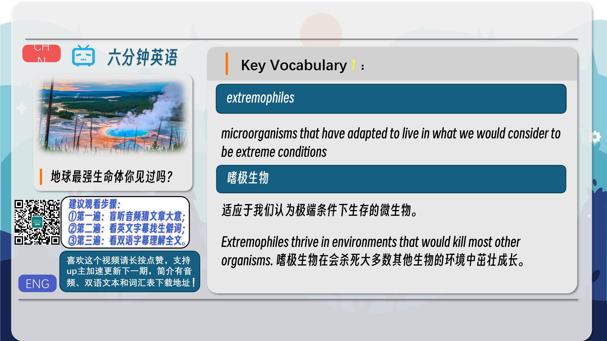
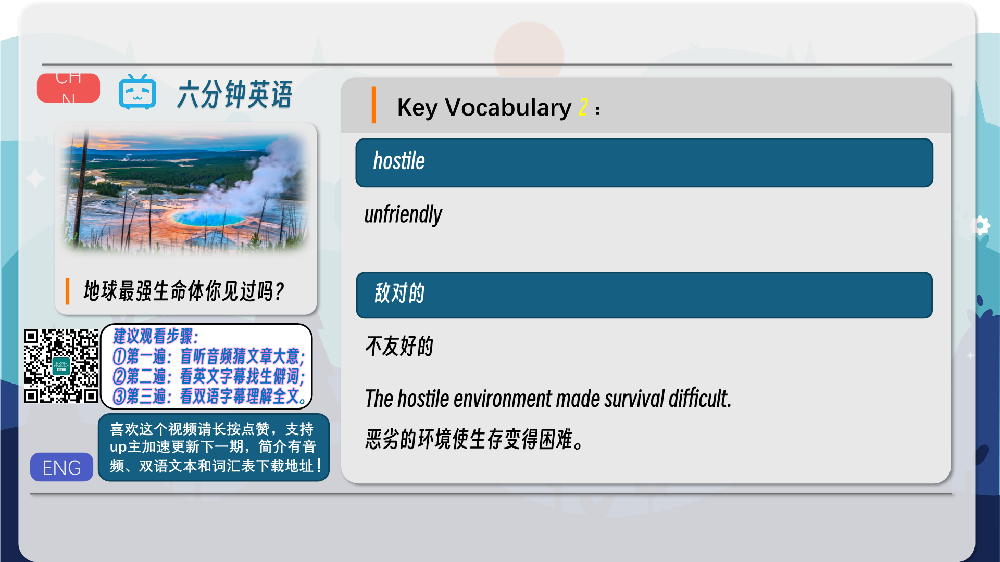
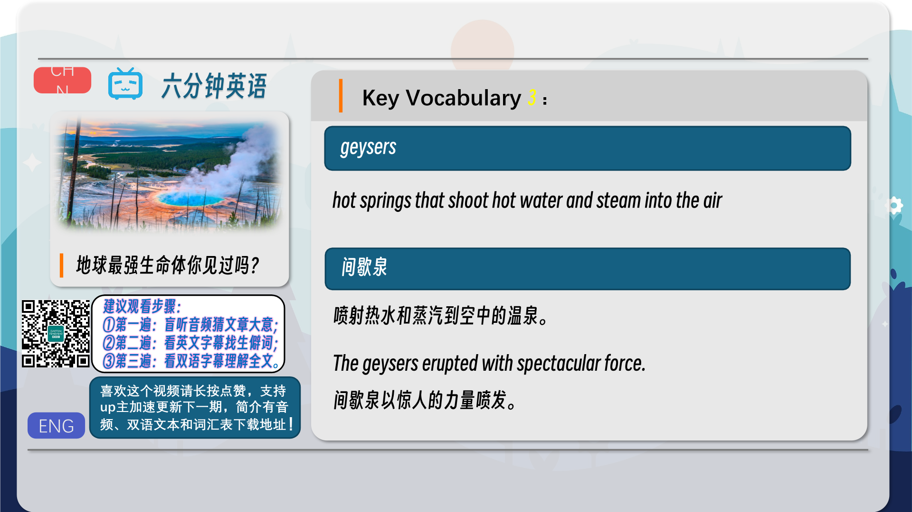
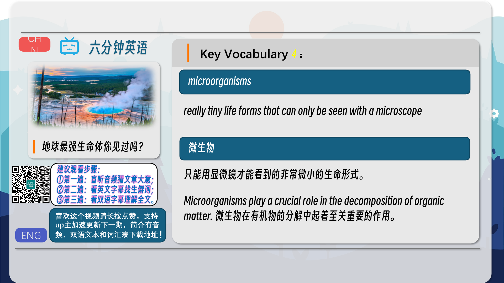
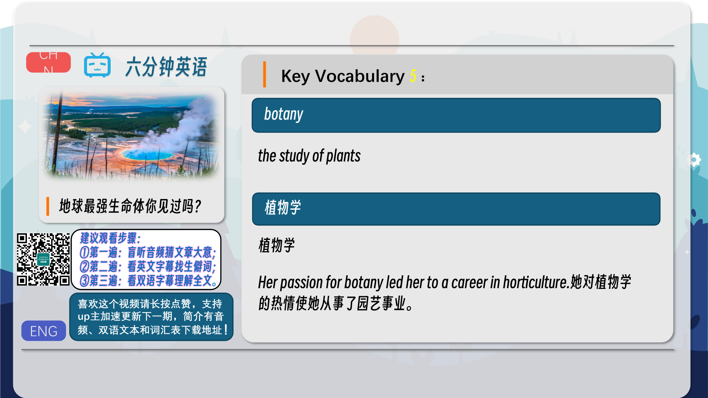
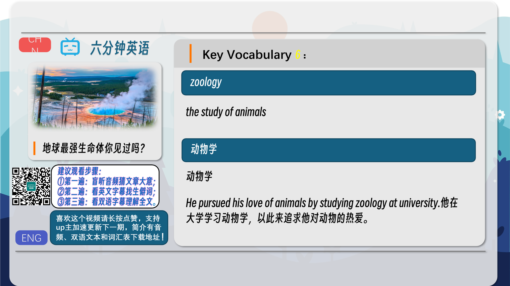
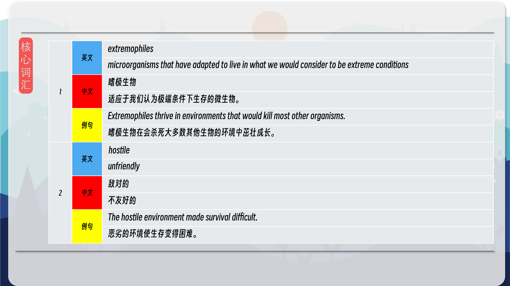
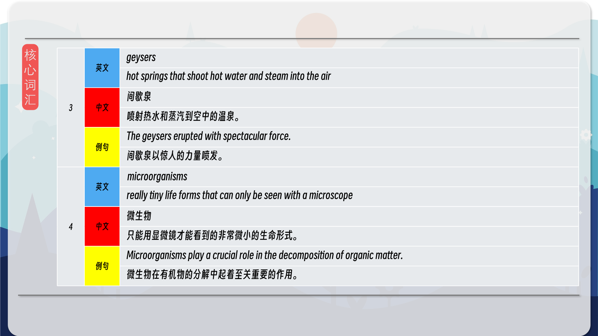
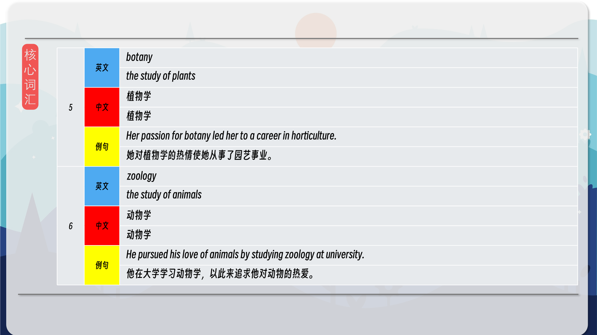
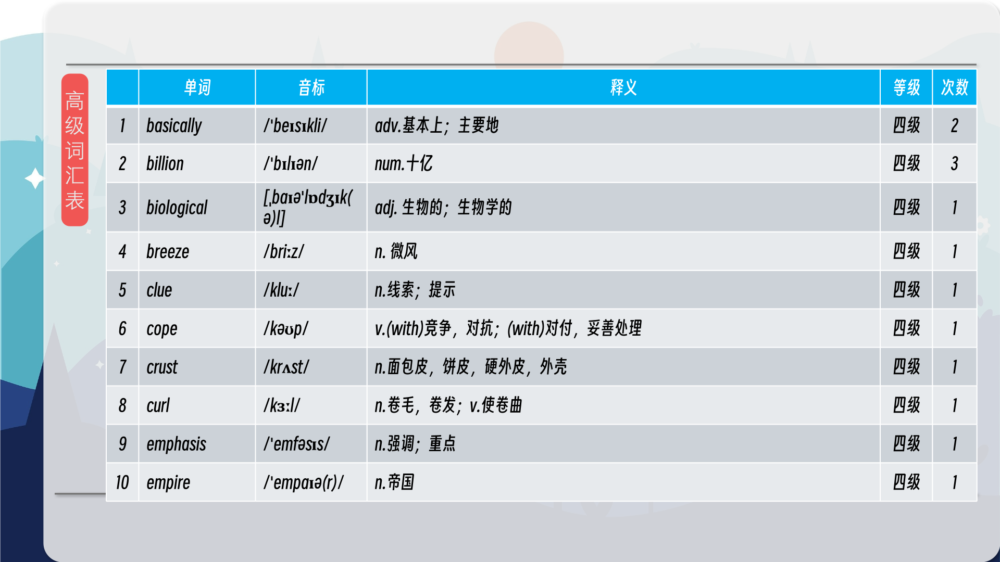

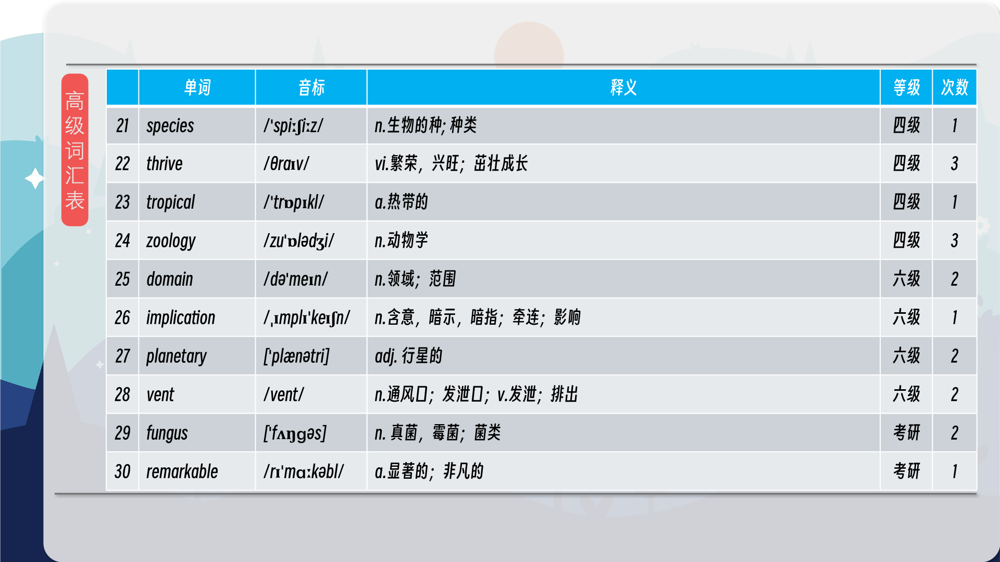

### 【核心词汇】
#### extremophiles
microorganisms that have adapted to live in what we would consider to be extreme conditions
嗜极生物
适应于我们认为极端条件下生存的微生物。
Extremophiles thrive in environments that would kill most other organisms.
嗜极生物在会杀死大多数其他生物的环境中茁壮成长。
#### hostile
unfriendly
敌对的
不友好的
The hostile environment made survival difficult.
恶劣的环境使生存变得困难。
#### geysers
hot springs that shoot hot water and steam into the air
间歇泉
喷射热水和蒸汽到空中的温泉。
The geysers erupted with spectacular force.
间歇泉以惊人的力量喷发。
#### microorganisms
really tiny life forms that can only be seen with a microscope
微生物
只能用显微镜才能看到的非常微小的生命形式。
Microorganisms play a crucial role in the decomposition of organic matter.
微生物在有机物的分解中起着至关重要的作用。
#### botany
the study of plants
植物学
植物学
Her passion for botany led her to a career in horticulture.
她对植物学的热情使她从事了园艺事业。
#### zoology
the study of animals
动物学
动物学
He pursued his love of animals by studying zoology at university.
他在大学学习动物学，以此来追求他对动物的热爱。

在公众号里输入6位数字，获取【对话音频、英文文本、中文翻译、核心词汇和高级词汇表】电子档，6位数字【暗号】在文章的最后一张图片，如【220728】，表示22年7月28日这一期。公众号没有的文章说明还没有制作相关资料。年度合集在B站【六分钟英语】工房获取，每年共计300+文档，感谢支持！