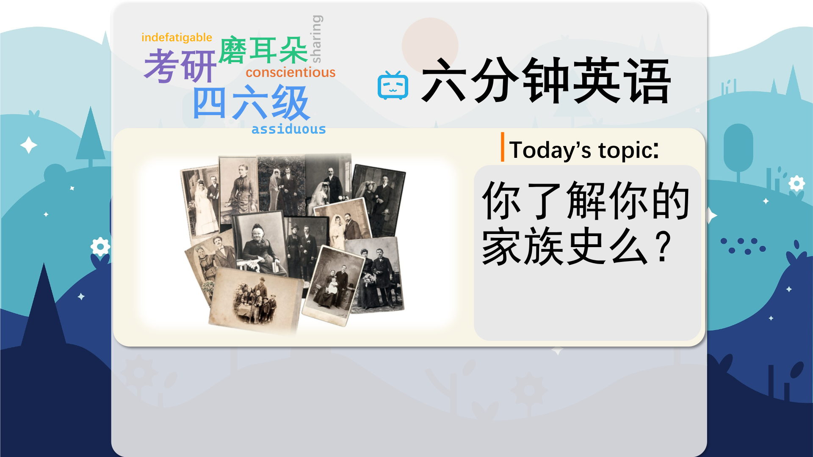

### 【英文脚本】
Catherine
Hello and welcome to 6 Minute English. I'm Catherine…
 
Neil
And I'm Neil. Do you realise, Catherine, that we are related to each other?
 
Catherine
Don't be silly, Neil. I think I'd know if you were in my family.
 
Neil
Well, we'll talk more about that later in the show, but I should say at this point that today we're discussing genealogy – or the study of family history. And I think it's pretty fascinating stuff. Do you ever watch the TV programme Who do you think you are, Catherine? You know, where celebrities find out about their family history?
 
Catherine
Yeah, I've seen a couple of them. For example, one celebrity – who was very proud of his working class London roots – or origins – discovered that he's actually a direct descendent of an English king!
 
Neil
Well, that's quite a discovery! The thing is though, Catherine, what if there isn't anything exciting in your family history – no mysteries, no skeletons in the closet…
 
Catherine
Well, I reckon if you go back far enough Neil, there's always something exciting or unexpected in anybody's family history. And skeletons in the closet by the way, means secrets! Now, I think it's time for today's quiz question. Researching family history often involves reading old documents such as birth, marriage and death certificates, and these can be difficult to decipher – or understand. So what's the name for the study of ancient handwriting? Is it… a) Scriptography? b) Palaeography? Or c) Scribology?
 
Neil
Well, it must be a) Scriptography.
 
Catherine
And we'll see if you're right or not later on in the show. Now, why do you think most people look into their genealogy, Neil? Is it just curiosity?
 
Neil
Well, Catherine, we all love a good mystery story – especially if it's connected with our own family. And these days, it's easy to do research online because many old paper documents have been digitised and are available online.
 
Catherine
BBC presenter Mike Williams investigated his own family history. And here, he's talking about his great-grandfather's story. And if you listen carefully you can hear him rustling the real paper documents!
 
INSERT
Mike Williams, BBC presenter The Williamses are my father's side and on my mother's the Heino's – it's a name that we think comes from Finland. If I look at this document here – it's a copy of the census of England and Wales 1911 - you can see my grandfather, the son, and his father – the head of the household – Michael Heino, or Michel Heino, who, the family lore has it, jumped ship and ended up in Liverpool.
 
Neil
What's a census, Catherine?
 
Catherine
It's an official count of people in a population. So Mike Williams's great grandfather appeared on the 1911 census for England and Wales but because of his surname the family think he might originally have come from Finland.
 
Neil
The exciting event in Mike Williams' history – passed down through family lore – which means 'knowledge passed on from one generation to the next' – is that his great-grandfather jumped ship.
 
Catherine
Which means he left the ship he was working on without permission to do so.
 
Neil
And he started a new life in England. I suppose quite a few people have immigration stories in their family histories – sometimes without knowing it.
 
Catherine
Actually that's something that many people are fascinated by – and has also become easier to investigate these days now companies offer to test the DNA in your saliva for as little as a hundred dollars.
 
Neil
And then they come up with results saying you're related to Alexander the Great or Brad Pitt… Remember I said that we were related? Well, let's now listen to Else Churchill, from the Society of Genealogists here in London, who explains what I meant.
 
INSERT
Else Churchill, Society of Genealogists, London There's what you might call the 'gateway ancestor' – and the idea of history and genealogy is that's normally somebody that is so well documented that their descendants are well known – in England it's something like Edward III. And we're all probably descended from Edward III. Is it nice to have royal ancestors? Well, millions of people are descended from Edward III, and so in that sense, that's where the connection might be. So the chances are an awful lot of people are distantly connected to each other.
 
Catherine
Else Churchill says it's likely that millions of us are distantly related to a gateway ancestor like King Edward III of England. And that means that all those people related to Edward III are also distantly related to each other. So it seems that paying a company a hundred dollars to reveal that you're related to Edward III is a waste of money.
 
Neil
Yes, in the sense that it's you and millions of other people. And in fact, we're all related to each other somehow, via Edward III or someone else.
 
Catherine
And another popular finding for British people is to say that you're descended from the Vikings, and again this is true for many people so it isn't particularly meaningful.
 
Neil
If you're descended from a person or a group it means they are among your ancestors.
 
Catherine
Now, remember I asked: what's the name for the study of ancient handwriting? Is it… a) Scriptography? b) Palaeography? Or c) Scribology?
 
Neil
I said a) Scriptography. And I'm pretty confident that's the right answer.
 
Catherine
Well, Neil, you're pretty confident but unfortunately it was wrong! The correct answer is b) Palaeography. Palaeography is the study of ancient and historical handwriting, including the practice of deciphering, reading, and dating historical manuscripts.
 
Neil
Oh well, here are the words we learned: genealogy roots skeletons in the closet decipher census family lore descended from
 
Catherine
And that's the end of today's 6 Minute English. Don't forget to join us again soon!
 
Both
Bye!
 

### 【中英文双语脚本】
Catherine(凯瑟琳)
Hello and welcome to 6 Minute English. I'm Catherine…
您好，欢迎来到 6 Minute English。我是 Catherine...

Neil(尼尔)
And I'm Neil. Do you realise, Catherine, that we are related to each other?
我是 Neil。凯瑟琳，你意识到我们是彼此相关的吗？

Catherine(凯瑟琳)
Don't be silly, Neil. I think I'd know if you were in my family.
别傻了，尼尔。我想我会知道你是否在我家。

Neil(尼尔)
Well, we'll talk more about that later in the show, but I should say at this point that today we're discussing genealogy – or the study of family history. And I think it's pretty fascinating stuff. Do you ever watch the TV programme Who do you think you are, Catherine? You know, where celebrities find out about their family history?
好吧，我们将在节目后面详细讨论这个问题，但我想说的是，今天我们讨论的是家谱 —— 或者说家族史的研究。我认为这是非常有趣的东西。你有没有看过电视节目《你觉得你是谁，凯瑟琳》？你知道吗，名人在哪里了解他们的家族历史？

Catherine(凯瑟琳)
Yeah, I've seen a couple of them. For example, one celebrity – who was very proud of his working class London roots – or origins – discovered that he's actually a direct descendent of an English king!
是的，我见过几个。例如，一位名人 - 他对自己的工人阶级伦敦根源或出身感到非常自豪 - 发现他实际上是英国国王的直系后裔！

Neil(尼尔)
Well, that's quite a discovery! The thing is though, Catherine, what if there isn't anything exciting in your family history – no mysteries, no skeletons in the closet…
嗯，这真是一个了不起的发现！但问题是，凯瑟琳，如果你的家族历史中没有任何令人兴奋的事情 —— 没有谜团，壁橱里没有骷髅 —— 该怎么办......

Catherine(凯瑟琳)
Well, I reckon if you go back far enough Neil, there's always something exciting or unexpected in anybody's family history. And skeletons in the closet by the way, means secrets! Now, I think it's time for today's quiz question. Researching family history often involves reading old documents such as birth, marriage and death certificates, and these can be difficult to decipher – or understand. So what's the name for the study of ancient handwriting? Is it… a) Scriptography? b) Palaeography? Or c) Scribology?
好吧，我想如果你追溯得足够远，尼尔，任何人的家族历史中总会有一些令人兴奋或意想不到的事情。顺便说一句，壁橱里的骷髅意味着秘密！现在，我认为是时候回答今天的测验问题了。研究家族史通常涉及阅读旧文件，例如出生证明、结婚证和死亡证明，这些文件可能难以破译或理解。那么，古代笔迹研究的名称是什么呢？是吗。。。a） 剧本？b） 古文字学？或者 c） 抄写学？

Neil(尼尔)
Well, it must be a) Scriptography.
嗯，它必须是 a） 剧本学。

Catherine(凯瑟琳)
And we'll see if you're right or not later on in the show. Now, why do you think most people look into their genealogy, Neil? Is it just curiosity?
我们稍后会在节目中看看你是对还是错。现在，你认为为什么大多数人都会查看他们的家谱，尼尔？只是好奇吗？

Neil(尼尔)
Well, Catherine, we all love a good mystery story – especially if it's connected with our own family. And these days, it's easy to do research online because many old paper documents have been digitised and are available online.
好吧，凯瑟琳，我们都喜欢一个好的悬疑故事 —— 尤其是当它与我们自己的家庭有关时。如今，在线研究很容易，因为许多旧的纸质文档已经数字化并且可以在线访问。

Catherine(凯瑟琳)
BBC presenter Mike Williams investigated his own family history. And here, he's talking about his great-grandfather's story. And if you listen carefully you can hear him rustling the real paper documents!
BBC 主持人迈克·威廉姆斯 （Mike Williams） 调查了他自己的家族史。在这里，他谈论的是他曾祖父的故事。如果你仔细听，你可以听到他沙沙作响的真实纸质文件！

INSERT(插入)
Mike Williams, BBC presenter The Williamses are my father's side and on my mother's the Heino's – it's a name that we think comes from Finland. If I look at this document here – it's a copy of the census of England and Wales 1911 - you can see my grandfather, the son, and his father – the head of the household – Michael Heino, or Michel Heino, who, the family lore has it, jumped ship and ended up in Liverpool.
Mike Williams，BBC 主持人 Williamses 是我父亲的一方，而我母亲是 Heino 一家 —— 我们认为这个名字来自芬兰。如果我在这里看这份文件 —— 它是 1911 年英格兰和威尔士人口普查的副本 —— 你可以看到我的祖父、儿子和他的父亲 —— 一家之主 —— 迈克尔·海诺，或者米歇尔·海诺，家族传说中，他跳槽并最终来到了利物浦。

Neil(尼尔)
What's a census, Catherine?
什么是人口普查，凯瑟琳？

Catherine(凯瑟琳)
It's an official count of people in a population. So Mike Williams's great grandfather appeared on the 1911 census for England and Wales but because of his surname the family think he might originally have come from Finland.
这是对人口的官方统计。因此，迈克·威廉姆斯的曾祖父出现在 1911 年的英格兰和威尔士人口普查中，但由于他的姓氏，家人认为他可能最初来自芬兰。

Neil(尼尔)
The exciting event in Mike Williams' history – passed down through family lore – which means 'knowledge passed on from one generation to the next' – is that his great-grandfather jumped ship.
迈克·威廉姆斯 （Mike Williams） 历史上激动人心的事件 —— 通过家族传说流传下来 —— 意思是“知识代代相传” —— 是他的曾祖父跳槽了。

Catherine(凯瑟琳)
Which means he left the ship he was working on without permission to do so.
这意味着他在未经允许的情况下离开了他正在工作的船。

Neil(尼尔)
And he started a new life in England. I suppose quite a few people have immigration stories in their family histories – sometimes without knowing it.
他在英国开始了新的生活。我想相当多的人在他们的家族历史中都有移民故事 —— 有时他们并不知道。

Catherine(凯瑟琳)
Actually that's something that many people are fascinated by – and has also become easier to investigate these days now companies offer to test the DNA in your saliva for as little as a hundred dollars.
实际上，这是许多人着迷的事情 —— 而且现在公司以低至 100 美元的价格提供测试唾液中的 DNA 也变得更容易调查。

Neil(尼尔)
And then they come up with results saying you're related to Alexander the Great or Brad Pitt… Remember I said that we were related? Well, let's now listen to Else Churchill, from the Society of Genealogists here in London, who explains what I meant.
然后他们得出的结果说你和亚历山大大帝或布拉德皮特有关系......还记得我说过我们是亲戚吗？好吧，现在让我们听听伦敦系谱学家协会的 Else Churchill 的演讲，他解释了我的意思。

INSERT(插入)
Else Churchill, Society of Genealogists, London There's what you might call the 'gateway ancestor' – and the idea of history and genealogy is that's normally somebody that is so well documented that their descendants are well known – in England it's something like Edward III. And we're all probably descended from Edward III. Is it nice to have royal ancestors? Well, millions of people are descended from Edward III, and so in that sense, that's where the connection might be. So the chances are an awful lot of people are distantly connected to each other.
Else Churchill，系谱学家协会，伦敦 你可以称之为“门户祖先” —— 历史和家谱学的概念通常是有据可查的人，他们的后代是众所周知的 —— 在英国，它就像爱德华三世。我们很可能都是爱德华三世的后裔。有皇室祖先是不是很好？嗯，数以百万计的人是爱德华三世的后裔，所以从这个意义上说，这可能就是联系所在。因此，很可能很多人彼此之间有很远的联系。

Catherine(凯瑟琳)
Else Churchill says it's likely that millions of us are distantly related to a gateway ancestor like King Edward III of England. And that means that all those people related to Edward III are also distantly related to each other. So it seems that paying a company a hundred dollars to reveal that you're related to Edward III is a waste of money.
埃尔斯·丘吉尔说，我们数百万人很可能与像英格兰国王爱德华三世这样的门户祖先有远亲关系。这意味着所有与爱德华三世有关的人也彼此之间有远亲关系。所以看来，付给一家公司一百美元来透露你和爱德华三世有关系是浪费钱。

Neil(尼尔)
Yes, in the sense that it's you and millions of other people. And in fact, we're all related to each other somehow, via Edward III or someone else.
是的，从某种意义上说，这是您和数百万其他人。事实上，我们都以某种方式通过爱德华三世或其他人彼此联系在一起。

Catherine(凯瑟琳)
And another popular finding for British people is to say that you're descended from the Vikings, and again this is true for many people so it isn't particularly meaningful.
英国人的另一个流行发现是说你是维京人的后裔，这对许多人来说都是如此，所以这并不是特别有意义。

Neil(尼尔)
If you're descended from a person or a group it means they are among your ancestors.
如果你是某个人或某个群体的后裔，那就意味着他们是你的祖先。

Catherine(凯瑟琳)
Now, remember I asked: what's the name for the study of ancient handwriting? Is it… a) Scriptography? b) Palaeography? Or c) Scribology?
现在，记得我问过：古代笔迹研究的名字是什么？是吗。。。a） 剧本？b） 古文字学？或者 c） 抄写学？

Neil(尼尔)
I said a) Scriptography. And I'm pretty confident that's the right answer.
我说的是 a） 剧本学。我非常有信心这是正确的答案。

Catherine(凯瑟琳)
Well, Neil, you're pretty confident but unfortunately it was wrong! The correct answer is b) Palaeography. Palaeography is the study of ancient and historical handwriting, including the practice of deciphering, reading, and dating historical manuscripts.
好吧，尼尔，你很有信心，但不幸的是，你错了！正确答案是 b） 古文字学。古文字学是对古代和历史笔迹的研究，包括破译、阅读和确定历史手稿年代的实践。

Neil(尼尔)
Oh well, here are the words we learned: genealogy roots skeletons in the closet decipher census family lore descended from
哦，好吧，这是我们学到的单词：家谱根源 壁橱里的骨骼破译了人口普查家族传说的后代

Catherine(凯瑟琳)
And that's the end of today's 6 Minute English. Don't forget to join us again soon!
这就是今天的六分钟 English 的结尾。别忘了很快再次加入我们！

Both(双)
Bye!
再见！

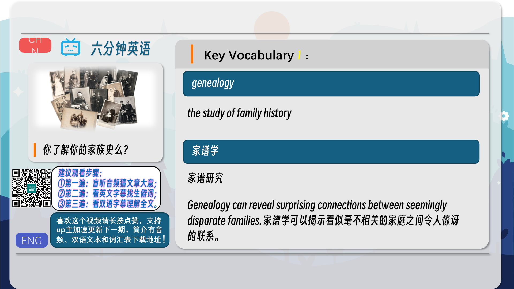
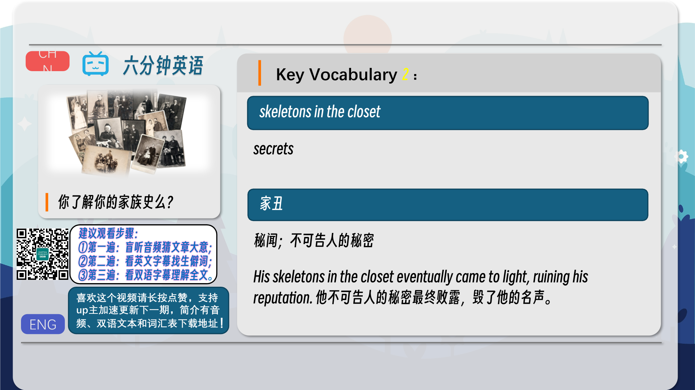
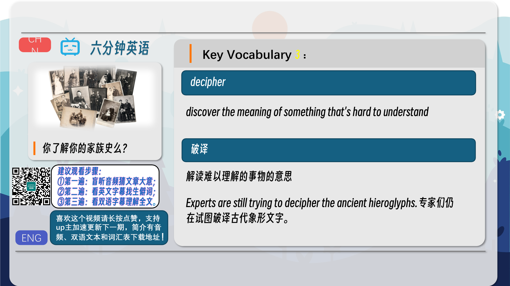
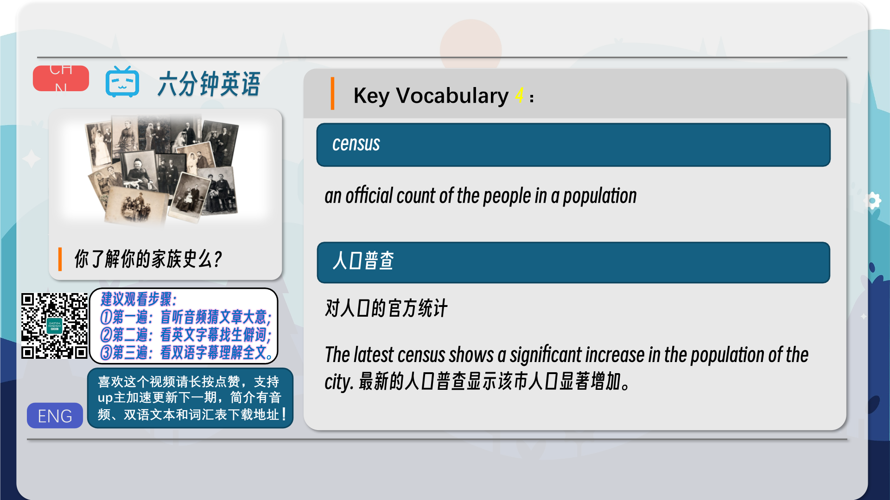
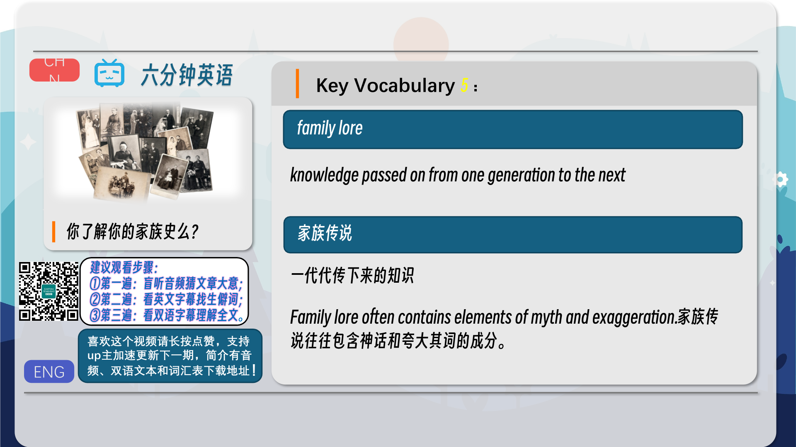
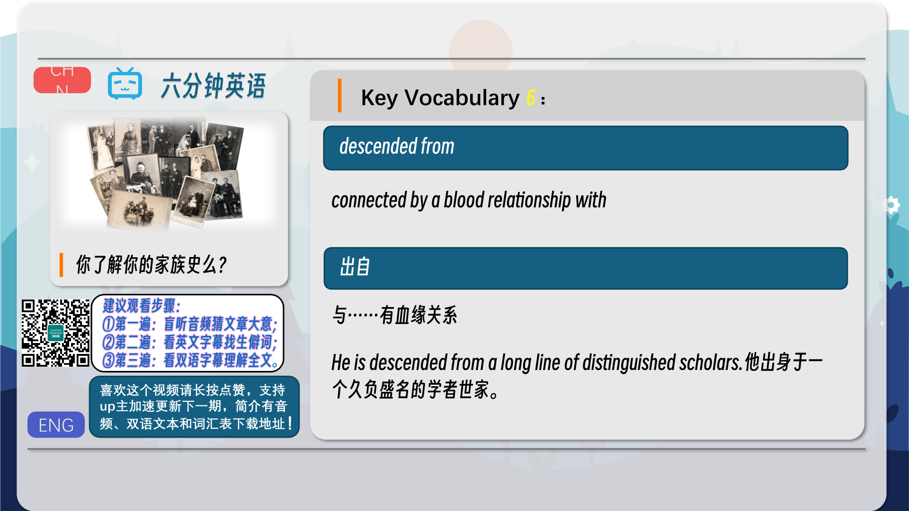
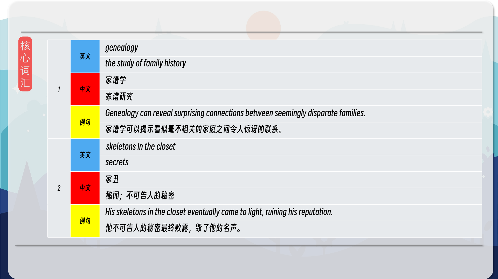
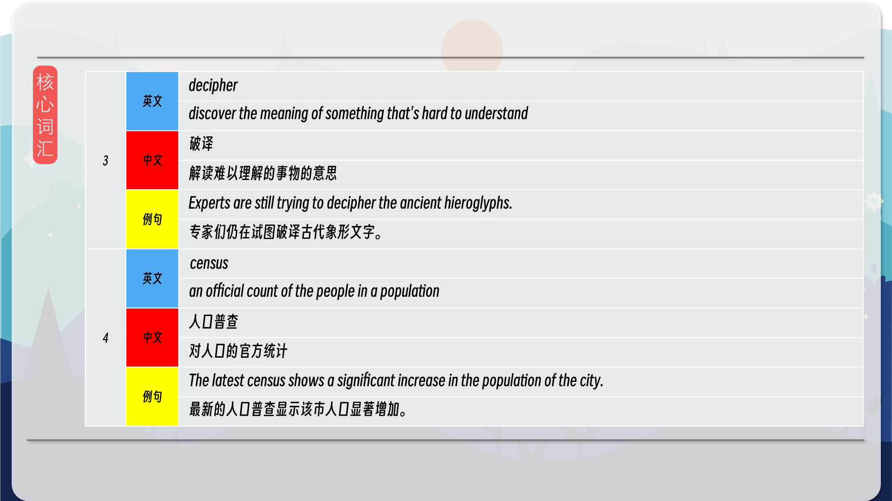
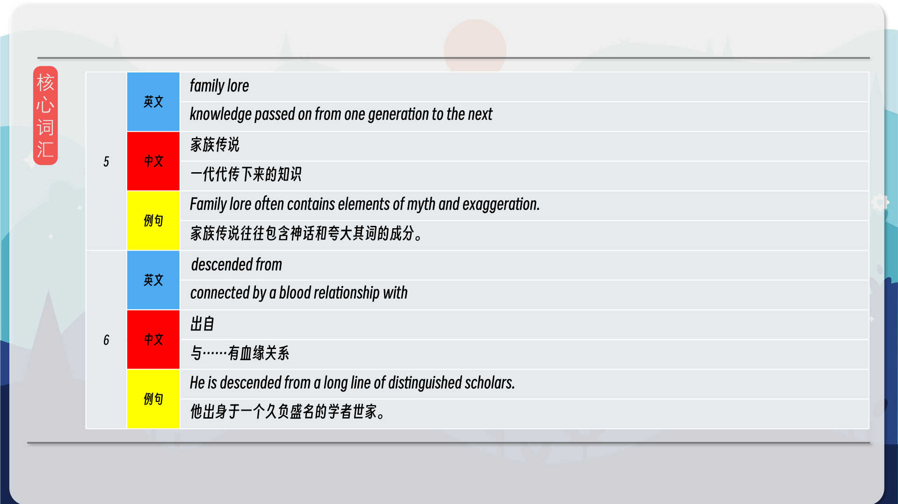
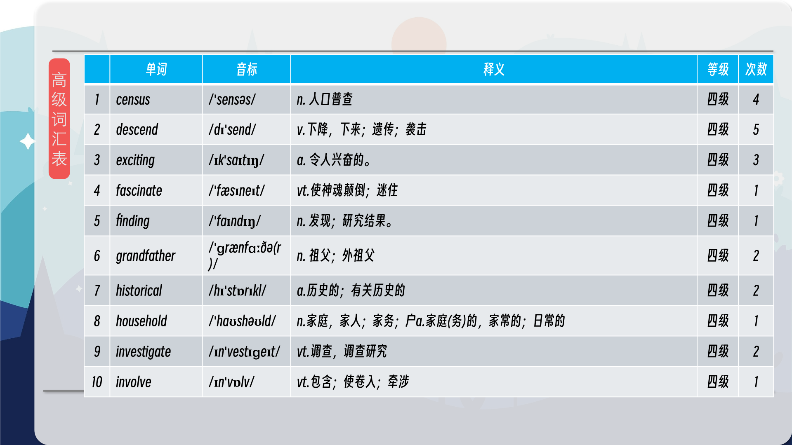
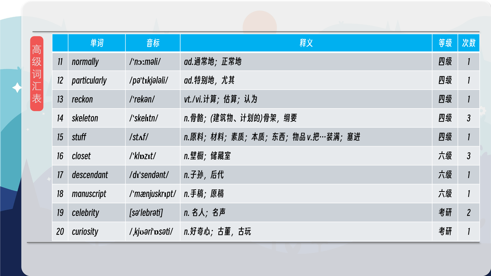
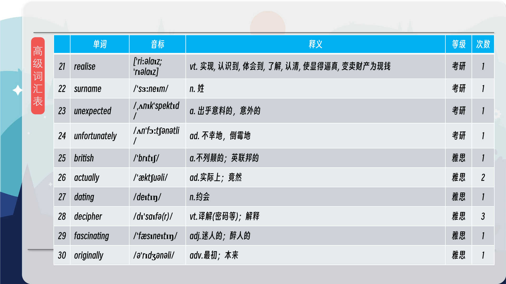

### 【核心词汇】
#### genealogy
the study of family history
家谱学
家谱研究
Genealogy can reveal surprising connections between seemingly disparate families.
家谱学可以揭示看似毫不相关的家庭之间令人惊讶的联系。
#### skeletons in the closet
secrets
家丑
秘闻；不可告人的秘密
His skeletons in the closet eventually came to light, ruining his reputation.
他不可告人的秘密最终败露，毁了他的名声。
#### decipher
discover the meaning of something that's hard to understand
破译
解读难以理解的事物的意思
Experts are still trying to decipher the ancient hieroglyphs.
专家们仍在试图破译古代象形文字。
#### census
an official count of the people in a population
人口普查
对人口的官方统计
The latest census shows a significant increase in the population of the city.
最新的人口普查显示该市人口显著增加。
#### family lore
knowledge passed on from one generation to the next
家族传说
一代代传下来的知识
Family lore often contains elements of myth and exaggeration.
家族传说往往包含神话和夸大其词的成分。
#### descended from
connected by a blood relationship with
出自
与……有血缘关系
He is descended from a long line of distinguished scholars.
他出身于一个久负盛名的学者世家。

在公众号里输入6位数字，获取【对话音频、英文文本、中文翻译、核心词汇和高级词汇表】电子档，6位数字【暗号】在文章的最后一张图片，如【220728】，表示22年7月28日这一期。公众号没有的文章说明还没有制作相关资料。年度合集在B站【六分钟英语】工房获取，每年共计300+文档，感谢支持！