### 【英文脚本】
Catherine
Hello and welcome to 6 Minute English. I'm Catherine…
 
Neil
And I'm Neil. Do you know, Catherine, someone actually talked to me on the underground this morning!
 
Catherine
No, really?
 
Neil
Yeah.
 
Catherine
Wow! I should perhaps point out that talking to someone you don't know on the Tube is quite unusual behaviour in London! So, Neil, what did they say?
 
Neil
Well, they said what a lovely day it was, great to see the sun shining in London – something along those lines. But it was actually nice to chat instead of sitting there with a frown on my face, fiddling with my phone.
 
Catherine
Which is what you probably always do to pass the time on public transport, Neil.
 
Neil
Yes, it is - me and thousands of others. But it got me thinking… if it makes me feel better to talk to people on the way to work, why don't I – and other commuters in the city – do it more often?
 
Catherine
Well, that's a good question, Neil, and maybe we'll find some answers in the show, because today we're talking about why cities make us so rude. And I have a question for you: when we have a positive interaction with somebody, our body releases a chemical. But what's the name of this chemical? Is it… a) melatonin? b) oxytocin? Or c) thyroxin?
 
Neil
I don't know, but I'm going to say a) melatonin.
 
Catherine
Well, we'll see if you were right or not later on in the show. But did you know, Neil, that an organisation called 'Talk to me London' has created these 'Tubechat' badges that you can wear to show that you're happy to talk to a stranger. Maybe you should get one!
 
Neil
Yeah, maybe I should. But the thing is, people in big cities are often scared to start a conversation with a stranger because, well, you don't know what might happen.
 
Catherine
That's true. Now, let's listen to Dr Elle Boag, a social psychologist at Birmingham City University here in the UK. She agrees that people can view cities as threatening places.
 
Dr Elle Boag, social psychologist, Birmingham City University in the UK
When we step off the metro or onto a crowded city street our brain becomes hyper vigilant to the perception of threats around us – we're just one small person in a very large set of other people, in a large body of people. This then leads to behaviours that are insular and defensive. We're persistently looking for potential threats around us, and this then makes us not give eye contact, this will reduce the likelihood that anybody will say hello. It's a protective mechanism by which we can survive our journey to whence we're going, which makes us all sound really really rude to one other.
 
Catherine
Dr Elle Boag there. And hyper vigilance means being extremely watchful of what's going on around you. People can behave unpredictably, and like Dr Boag says, you're just one person in a crowd of others and you just don't know who might be dangerous.
 
Neil
Yeah, I see what you mean. And the fact we are constantly on the lookout for potential threats, well, it affects our behaviour.
 
Catherine
That's right. And as a protective mechanism we avoid speaking to or making eye contact with other people. So we become insular – which means inward looking.
 
Neil
It sounds awful! But actually, I know people who moved to London in order to be anonymous – to blend in with the crowd – and not have to talk to people!
 
Catherine
Well, if you grow up in a small town, it can feel claustrophobic – which means not having enough space to feel comfortable. You know, you can't do anything without the whole community knowing about it. You may have nosey neighbours.
 
Neil
And a nosey person shows too much interest in other people's business.
 
Catherine
Now, it's good to point out that people living in cities have stuff to do. And it's not necessarily rudeness that stops people from chatting – it's about efficiency – getting to work on time, getting things done. Let's hear from Thomas Farley, writer and broadcaster, and expert on manners, for more on this.
 
Thomas Farley, writer and broadcaster
The cost of living in cities is higher, the success quotient is higher, it's a place where you hustle to survive, and if you are not hustling, and I mean that literally and figuratively, you are not able to survive and thrive. So we often don't have much time for chitchat. I think we just all need to be mindful that it's not a deliberate disregard or somebody trying to be rude on purpose – it's simply that people have a destination to be.
 
Neil
So what does Thomas Farley mean by success quotient, Catherine?
 
Catherine
Success quotient means your ability to be successful in work, relative to the average person, and Thomas Farley is saying that in cities people have higher success quotients.
 
Neil
Cities are also competitive places so people have to hustle to survive. Do we hustle, Catherine?
 
Catherine
I don't think we hustle, Neil. Hustle means to work aggressively to make money.
 
Neil
We do have plenty of time for chitchat, though. And chitchat, by the way, means unimportant conversation. That's what we do!
 
Catherine
What we do isn't chitchat, Neil! It's highly informative and instructional! Now, I think it must be time to hear the answer to today's quiz. Do you remember, I asked: when we have a positive interaction with someone, our body releases a chemical. What's the name of this chemical? Is it… a) melatonin? b) oxytocin? Or c) thyroxin?
 
Neil
And it's a) melatonin – I'm absolutely sure.
 
Catherine
Sorry! The correct answer is b) oxytocin – a hormone commonly known as the 'love drug'. It reduces fear, increases trust between people, and evokes feelings of contentment.
 
Neil
Now, here are the words we learned today: hyper vigilance insular claustrophobic nosey quotient hustle chitchat
 
Catherine
That's the end of today's 6 Minute English. Don't forget to join us again soon!
 
Both
Bye!
 

### 【中英文双语脚本】
Catherine(凯瑟琳)
Hello and welcome to 6 Minute English. I'm Catherine…
您好，欢迎来到 6 Minute English。我是 Catherine...

Neil(尼尔)
And I'm Neil. Do you know, Catherine, someone actually talked to me on the underground this morning!
我是 Neil。你知道吗，凯瑟琳，今天早上有人在地铁上和我说话了！

Catherine(凯瑟琳)
No, really?
不，真的吗？

Neil(尼尔)
Yeah.
是的。

Catherine(凯瑟琳)
Wow! I should perhaps point out that talking to someone you don't know on the Tube is quite unusual behaviour in London! So, Neil, what did they say?
哇！我也许应该指出，在地铁上与你不认识的人交谈在伦敦是相当不寻常的行为！那么，尼尔，他们怎么说呢？

Neil(尼尔)
Well, they said what a lovely day it was, great to see the sun shining in London – something along those lines. But it was actually nice to chat instead of sitting there with a frown on my face, fiddling with my phone.
嗯，他们说今天是多么美好的一天，很高兴看到阳光明媚地照耀着伦敦 —— 类似这样。但实际上，聊天而不是皱着眉头坐在那里摆弄我的手机是件好事。

Catherine(凯瑟琳)
Which is what you probably always do to pass the time on public transport, Neil.
尼尔，你可能总是这样做来在公共交通工具上打发时间。

Neil(尼尔)
Yes, it is - me and thousands of others. But it got me thinking… if it makes me feel better to talk to people on the way to work, why don't I – and other commuters in the city – do it more often?
是的，是的 - 我和其他成千上万的人。但这让我思考......如果在上班路上与人交谈让我感觉更好，那么我和城市中的其他通勤者为什么不更频繁地交谈呢？

Catherine(凯瑟琳)
Well, that's a good question, Neil, and maybe we'll find some answers in the show, because today we're talking about why cities make us so rude. And I have a question for you: when we have a positive interaction with somebody, our body releases a chemical. But what's the name of this chemical? Is it… a) melatonin? b) oxytocin? Or c) thyroxin?
嗯，这是个好问题，Neil，也许我们会在节目中找到一些答案，因为今天我们要讨论的是为什么城市让我们如此粗鲁。我有一个问题要问你：当我们与某人进行积极的互动时，我们的身体会释放一种化学物质。但是这种化学物质叫什么名字呢？是吗。。。a） 褪黑激素？b） 催产素？或 c） 甲状腺素？

Neil(尼尔)
I don't know, but I'm going to say a) melatonin.
我不知道，但我要说的是 a） 褪黑激素。

Catherine(凯瑟琳)
Well, we'll see if you were right or not later on in the show. But did you know, Neil, that an organisation called 'Talk to me London' has created these 'Tubechat' badges that you can wear to show that you're happy to talk to a stranger. Maybe you should get one!
好吧，我们稍后会在节目中看看你是对还是错。但是你知道吗，Neil，一个名为 “Talk to me London” 的组织创造了这些 “Tubechat” 徽章，你可以佩戴这些徽章来表明你很乐意与陌生人交谈。也许你应该买一个！

Neil(尼尔)
Yeah, maybe I should. But the thing is, people in big cities are often scared to start a conversation with a stranger because, well, you don't know what might happen.
是的，也许我应该这样做。但问题是，大城市的人们经常害怕与陌生人开始交谈，因为你不知道会发生什么。

Catherine(凯瑟琳)
That's true. Now, let's listen to Dr Elle Boag, a social psychologist at Birmingham City University here in the UK. She agrees that people can view cities as threatening places.
这是真的。现在，让我们听听英国伯明翰城市大学的社会心理学家 Elle Boag 博士的演讲。她同意人们可以将城市视为具有威胁性的地方。

Dr Elle Boag, social psychologist, Birmingham City University in the UK(ElleBoag博士，英国伯明翰城市大学社会心理学家)
When we step off the metro or onto a crowded city street our brain becomes hyper vigilant to the perception of threats around us – we're just one small person in a very large set of other people, in a large body of people. This then leads to behaviours that are insular and defensive. We're persistently looking for potential threats around us, and this then makes us not give eye contact, this will reduce the likelihood that anybody will say hello. It's a protective mechanism by which we can survive our journey to whence we're going, which makes us all sound really really rude to one other.
当我们走下地铁或走上拥挤的城市街道时，我们的大脑会对周围威胁的感知变得高度警惕 —— 我们只是一大群人中的一个小人物。这会导致孤立和防御的行为。我们一直在寻找周围的潜在威胁，这使得我们不再进行眼神交流，这将降低任何人打招呼的可能性。这是一种保护机制，我们可以在前往目的地的旅程中幸存下来，这使得我们听起来对彼此都非常粗鲁。

Catherine(凯瑟琳)
Dr Elle Boag there. And hyper vigilance means being extremely watchful of what's going on around you. People can behave unpredictably, and like Dr Boag says, you're just one person in a crowd of others and you just don't know who might be dangerous.
Elle Boag 博士在那里。高度警惕意味着要非常警惕周围发生的事情。人们的行为可能不可预测，就像 Boag 博士所说，你只是一群人中的一个人，你只是不知道谁可能是危险的。

Neil(尼尔)
Yeah, I see what you mean. And the fact we are constantly on the lookout for potential threats, well, it affects our behaviour.
是的，我明白你的意思。事实上，我们一直在寻找潜在的威胁，嗯，它会影响我们的行为。

Catherine(凯瑟琳)
That's right. And as a protective mechanism we avoid speaking to or making eye contact with other people. So we become insular – which means inward looking.
没错。作为一种保护机制，我们避免与他人交谈或眼神交流。因此，我们变得狭隘 – 这意味着向内看。

Neil(尼尔)
It sounds awful! But actually, I know people who moved to London in order to be anonymous – to blend in with the crowd – and not have to talk to people!
听起来很糟糕！但实际上，我认识一些人搬到伦敦，是为了保持匿名 —— 融入人群 —— 而不必与人交谈！

Catherine(凯瑟琳)
Well, if you grow up in a small town, it can feel claustrophobic – which means not having enough space to feel comfortable. You know, you can't do anything without the whole community knowing about it. You may have nosey neighbours.
好吧，如果你在一个小镇长大，它可能会让人感到幽闭恐惧症 —— 这意味着没有足够的空间来感到舒适。你知道，如果整个社区都不知道，你就不能做任何事情。你可能有爱管闲事的邻居。

Neil(尼尔)
And a nosey person shows too much interest in other people's business.
而一个爱管闲事的人对别人的事情表现出太大的兴趣。

Catherine(凯瑟琳)
Now, it's good to point out that people living in cities have stuff to do. And it's not necessarily rudeness that stops people from chatting – it's about efficiency – getting to work on time, getting things done. Let's hear from Thomas Farley, writer and broadcaster, and expert on manners, for more on this.
现在，最好指出生活在城市的人们有事情要做。阻止人们聊天的不一定是粗鲁 —— 这是关于效率的 —— 准时上班，完成工作。让我们听听作家、广播员、礼仪专家 Thomas Farley 的意见，以了解更多信息。

Thomas Farley, writer and broadcaster(ThomasFarley，作家和广播员)
The cost of living in cities is higher, the success quotient is higher, it's a place where you hustle to survive, and if you are not hustling, and I mean that literally and figuratively, you are not able to survive and thrive. So we often don't have much time for chitchat. I think we just all need to be mindful that it's not a deliberate disregard or somebody trying to be rude on purpose – it's simply that people have a destination to be.
城市的生活成本更高，成功商数更高，这是一个你努力生存的地方，如果你不努力，我的意思是，从字面上和比喻上讲，你无法生存和繁荣。所以我们通常没有太多时间闲聊。我认为我们都需要注意，这不是故意的无视或故意粗鲁的人 —— 这只是人们有一个目的地。

Neil(尼尔)
So what does Thomas Farley mean by success quotient, Catherine?
那么，凯瑟琳，托马斯·法利 （Thomas Farley） 所说的成功商数是什么意思呢？

Catherine(凯瑟琳)
Success quotient means your ability to be successful in work, relative to the average person, and Thomas Farley is saying that in cities people have higher success quotients.
成功商数是指相对于普通人，你在工作中取得成功的能力，托马斯·法利 （Thomas Farley） 说，在城市里，人们的成功商数更高。

Neil(尼尔)
Cities are also competitive places so people have to hustle to survive. Do we hustle, Catherine?
城市也是竞争激烈的地方，因此人们必须努力生存。我们忙碌吗，凯瑟琳？

Catherine(凯瑟琳)
I don't think we hustle, Neil. Hustle means to work aggressively to make money.
我不认为我们很忙，Neil。Hustle 的意思是积极工作以赚钱。

Neil(尼尔)
We do have plenty of time for chitchat, though. And chitchat, by the way, means unimportant conversation. That's what we do!
不过，我们确实有足够的时间闲聊。顺便说一句，闲聊的意思是不重要的对话。这就是我们所做的！

Catherine(凯瑟琳)
What we do isn't chitchat, Neil! It's highly informative and instructional! Now, I think it must be time to hear the answer to today's quiz. Do you remember, I asked: when we have a positive interaction with someone, our body releases a chemical. What's the name of this chemical? Is it… a) melatonin? b) oxytocin? Or c) thyroxin?
我们所做的不是闲聊，尼尔！它信息量很大，具有指导意义！现在，我认为是时候听听今天测验的答案了。你还记得吗，我问道：当我们与某人进行积极的互动时，我们的身体会释放一种化学物质。这种化学物质叫什么名字？是吗。。。a） 褪黑激素？b） 催产素？或 c） 甲状腺素？

Neil(尼尔)
And it's a) melatonin – I'm absolutely sure.
它是 a） 褪黑激素 – 我绝对确定。

Catherine(凯瑟琳)
Sorry! The correct answer is b) oxytocin – a hormone commonly known as the 'love drug'. It reduces fear, increases trust between people, and evokes feelings of contentment.
不好意思！正确答案是 b） 催产素 – 一种通常被称为“爱情药物”的激素。它减少了恐惧，增加了人与人之间的信任，并唤起了满足感。

Neil(尼尔)
Now, here are the words we learned today: hyper vigilance insular claustrophobic nosey quotient hustle chitchat
现在，这是我们今天学到的单词： 高度警惕 孤立 幽闭恐惧症 爱管闲事 商数 喧嚣 闲聊

Catherine(凯瑟琳)
That's the end of today's 6 Minute English. Don't forget to join us again soon!
今天的六分钟 English 到此结束。别忘了很快再次加入我们！

Both(双)
Bye!
再见！

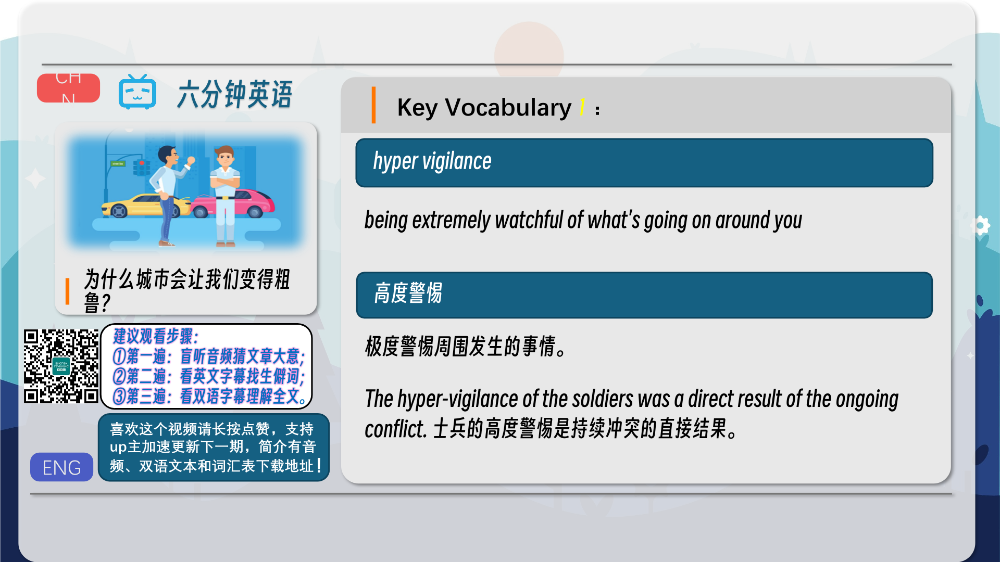
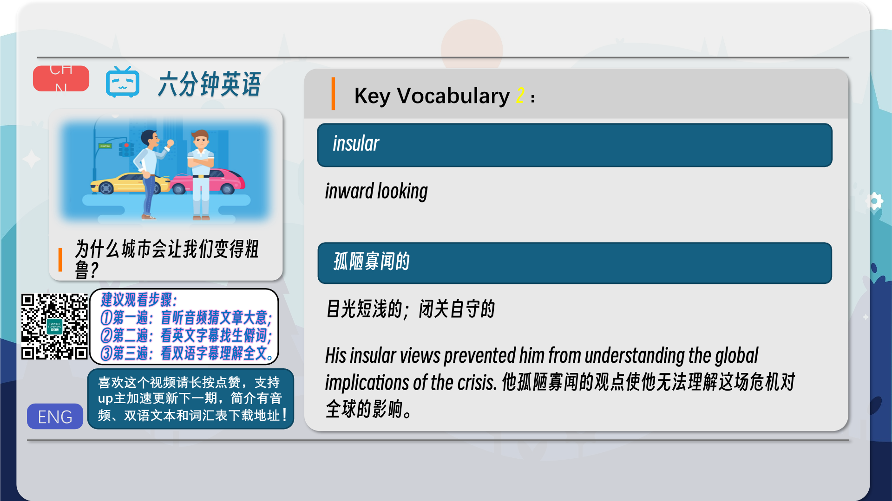
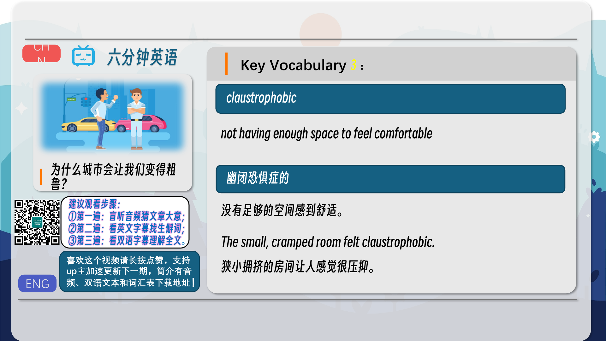
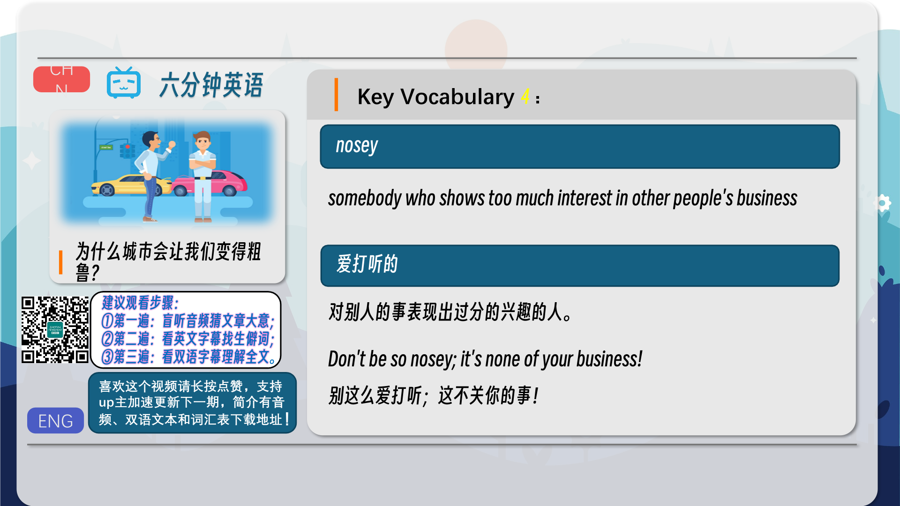
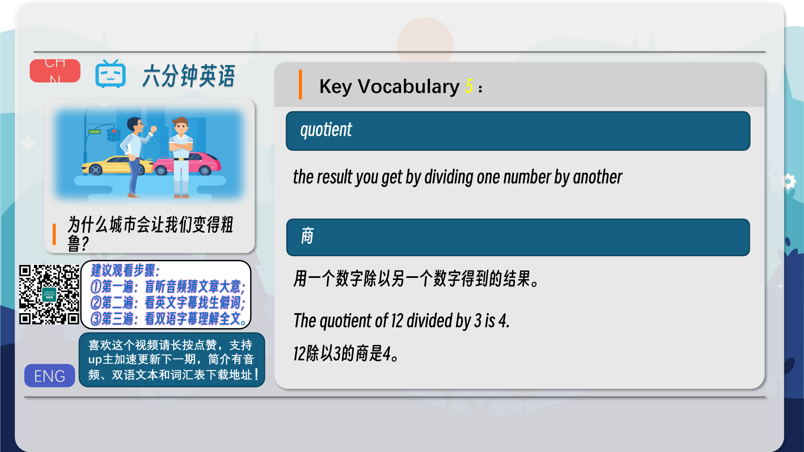
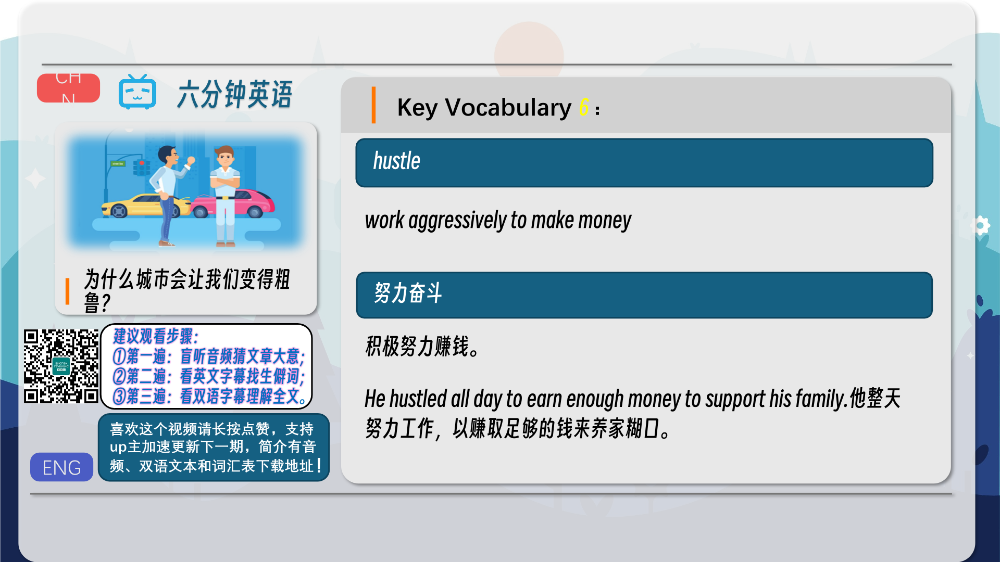
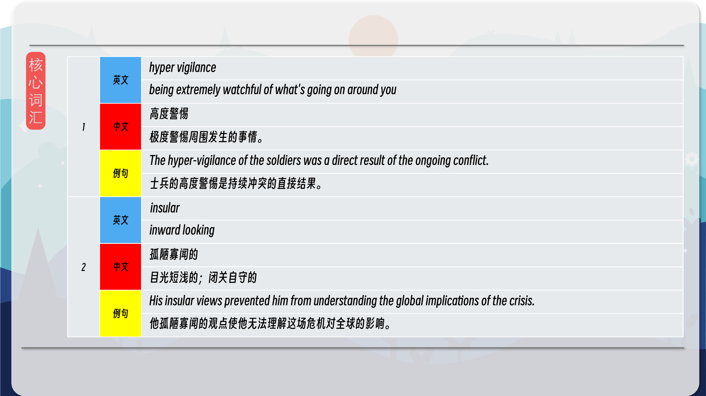
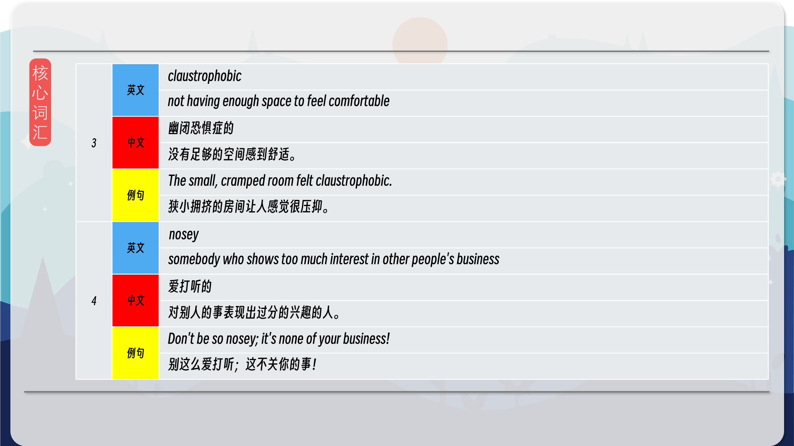
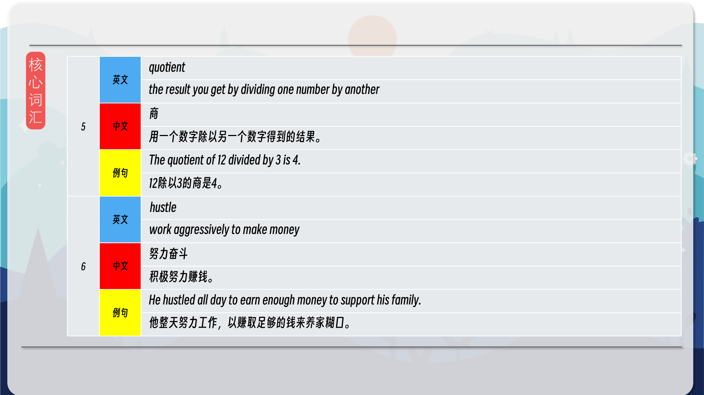
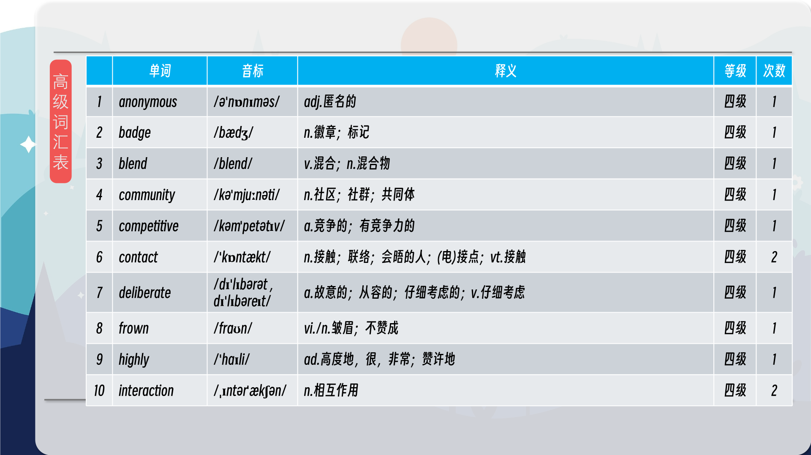
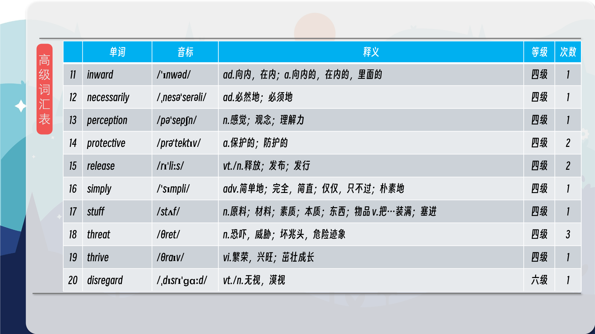
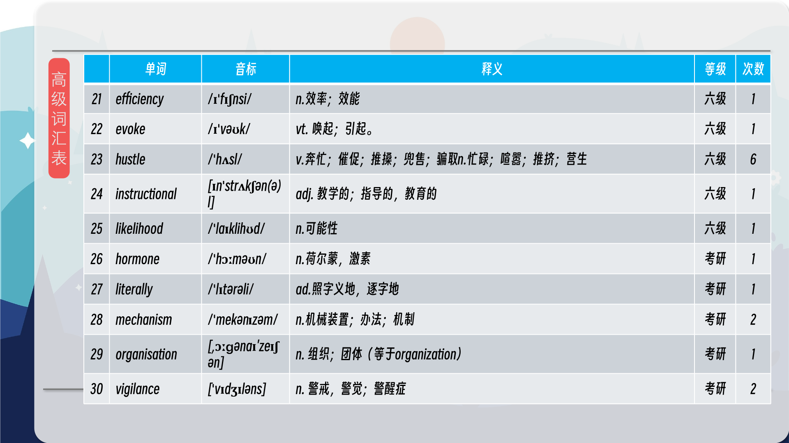
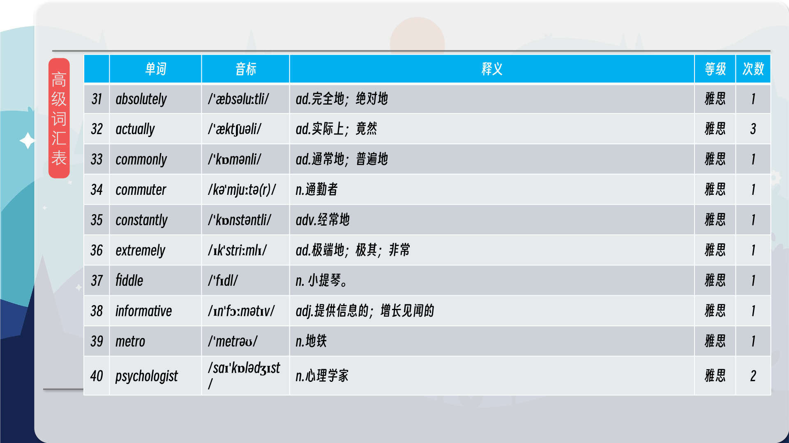
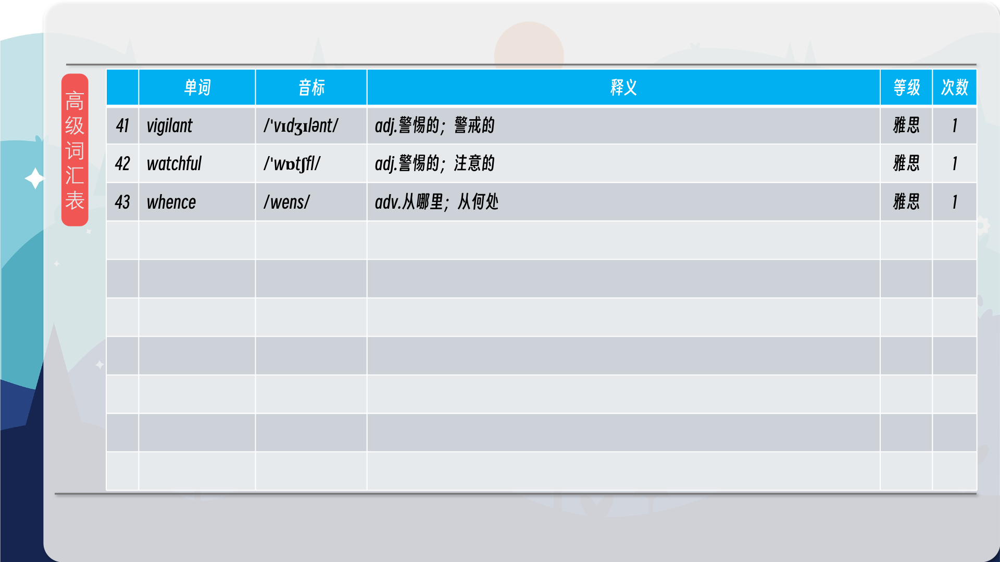

### 【核心词汇】
#### hyper vigilance
being extremely watchful of what's going on around you
高度警惕
极度警惕周围发生的事情。
The hyper-vigilance of the soldiers was a direct result of the ongoing conflict.
士兵的高度警惕是持续冲突的直接结果。
#### insular
inward looking
孤陋寡闻的
目光短浅的；闭关自守的
His insular views prevented him from understanding the global implications of the crisis.
他孤陋寡闻的观点使他无法理解这场危机对全球的影响。
#### claustrophobic
not having enough space to feel comfortable
幽闭恐惧症的
没有足够的空间感到舒适。
The small, cramped room felt claustrophobic.
狭小拥挤的房间让人感觉很压抑。
#### nosey
somebody who shows too much interest in other people's business
爱打听的
对别人的事表现出过分的兴趣的人。
Don't be so nosey; it's none of your business!
别这么爱打听；这不关你的事！
#### quotient
the result you get by dividing one number by another
商
用一个数字除以另一个数字得到的结果。
The quotient of 12 divided by 3 is 4.
12除以3的商是4。
#### hustle
work aggressively to make money
努力奋斗
积极努力赚钱。
He hustled all day to earn enough money to support his family.
他整天努力工作，以赚取足够的钱来养家糊口。

在公众号里输入6位数字，获取【对话音频、英文文本、中文翻译、核心词汇和高级词汇表】电子档，6位数字【暗号】在文章的最后一张图片，如【220728】，表示22年7月28日这一期。公众号没有的文章说明还没有制作相关资料。年度合集在B站【六分钟英语】工房获取，每年共计300+文档，感谢支持！