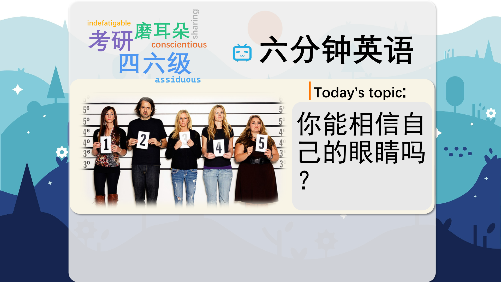

### 【英文脚本】
Catherine
Hello and welcome to 6 Minute English. I'm Catherine…
 
Neil
And I'm Neil.
 
Catherine
So, Neil, do you notice anything different about me today?
 
Neil
Have you done your hair differently?
 
Catherine
No.
 
Neil
Is that a new outfit?
 
Catherine
Honestly, Neil!
 
Neil
I give up. I don't know what's different about you.
 
Catherine
OK. Well, maybe by the end of the show you'll have figured it out. Anyway, today we're discussing memory and whether we can remember things accurately. So are you ready to answer today's quiz question, Neil?
 
Neil
I am.
 
Catherine
OK. So in which part of the brain is there an area dedicated to remembering faces? Is it… a) the temporal lobe? b) the hypothalamus? or c) the cerebellum?
 
Neil
Well, I have no idea. But I'll say a) the temporal lobe.
 
Catherine
OK and we'll find out whether you chose the correct answer later on in the show. But let's talk more about how our memories can play tricks on us. We tend to think of memory as being like a video recorder that we can replay and recall again and again as it originally occurred. But memory doesn't work like that. It's a reconstructive process.
 
Neil
A reconstructive process?
 
Catherine
Yes. We reconstruct - or rebuild - memories, and during this process, they may be distorted – or changed – for different reasons. Let's listen to Tim Valentine, retired professor of psychology at Goldsmith's College at the University of London, talking about this.
 
Tim Valentine, retired professor of psychology at Goldsmith's College, University of London
From all those TV dramas you've watched you'll be familiar with the forensic scenes of crimes officers wearing their paper suits and covering their shoes and their hair to make sure they don't introduce their DNA or physical traces onto the crime scene. So that in the same way anybody who has any interaction with a witness needs to make sure that they don't distort their memory.
 
Neil
So crime officers wear protective clothing at crime scenes so they don't contaminate it with their DNA.
 
Catherine
That's right. A crime scene is a place where a crime was committed. And contaminated means 'made impure through contact with an outside source'. So for example, if an officer touches something without gloves on, they introduce new information. And once this has happened, you can't get back to the original information.
 
Neil
Now, Tim Valentine says that when police officers talk to the witness of a crime, they might also introduce new information. And this could change the witness's memory of what happened.
 
Catherine
And it isn't only police questioning that can distort memory. Other factors such as stress can affect your ability to recall events accurately. For example, if you're being held at knifepoint you are likely to be concentrating on the weapon rather than on your attacker's face. And at knifepoint means 'under threat of being stabbed'.
 
Neil
So why do we place so much importance on eyewitness accounts?
 
Catherine
Eyewitness accounts can sound very convincing in court – but in fact according to research, they are often unreliable. Karen Newirth, senior attorney at the Innocence Project in New York, explains this further.
 
Karen Newirth, senior attorney at the Innocence Project, New York
First, I think it's sort of natural for people to want to believe that memory can be accurate. It's disconcerting to think that we're going through life relying on our memories and then to learn how mistaken they can be – and how frequently. Second is that the testimony of eyewitnesses has become a very expected piece of criminal trial so jurors sort of anticipate it, look for it, and tend to believe it.
 
Neil
So we like to trust in our ability to remember things accurately. And it's disconcerting to learn that memory is frequently inaccurate. And disconcerting means…
 
Catherine
…it means 'confusing and a bit upsetting'.
 
Neil
Karen Newirth also says that people expect eyewitness testimony – or spoken statements – in court. Do you think that's true, Catherine?
 
Catherine
Yes – and it's the most commonly used evidence brought against criminal defendants in court, even though they are often inaccurate.
 
Neil
Are there any ways to improve accuracy?
 
Catherine
Yes, there are. For example, in a police line-up you can prevent eyewitnesses receiving information from the officer giving instructions, which might influence their response.
 
Neil
Yes, I see. Well, you didn't give anything away when you asked what was different about your appearance at the beginning of the show.
 
Catherine
Yes, that's true, Neil. But I can now reveal to you that… I'm wearing glasses, Neil. I've lost my contact lenses!
 
Neil
I don't know how I missed that. Because actually you do look, well, completely different with glasses.
 
Catherine
Just a bit, yes. So, now we're running out of time, so let's move onto the answer to today's quiz question. Remember I asked: in which part of the brain is there an area dedicated to recognizing faces? Is it… a) the temporal lobe? b) the hypothalamus? or c) the cerebellum?
 
Neil
I said a) the temporal lobe. Was I right?
 
Catherine
You were indeed, Neil! Very well done, it was the correct answer!
 
Neil
Yes!
 
Catherine
The main part of the brain dedicated to recognising faces – called the Fusiform Face Area – is positioned in the temporal lobe, which can be found roughly in the area behind your ears.
 
Neil
Fascinating! Now, here are the words we learned today… reconstruct distorted crime scene contaminated at knifepoint disconcerting testimony
 
Catherine
And that bring us to the end of today's 6 Minute English. Don't forget to join us again soon!
 
Both
Bye!
 

### 【中英文双语脚本】
Catherine(凯瑟琳)
Hello and welcome to 6 Minute English. I'm Catherine…
您好，欢迎来到 6 Minute English。我是 Catherine...

Neil(尼尔)
And I'm Neil.
我是 Neil。

Catherine(凯瑟琳)
So, Neil, do you notice anything different about me today?
那么，Neil，你注意到我今天有什么不同吗？

Neil(尼尔)
Have you done your hair differently?
你的头发设计有不同吗？

Catherine(凯瑟琳)
No.
不。

Neil(尼尔)
Is that a new outfit?
那是一套新衣服吗？

Catherine(凯瑟琳)
Honestly, Neil!
老实说，尼尔！

Neil(尼尔)
I give up. I don't know what's different about you.
我放弃了。我不知道你有什么不同。

Catherine(凯瑟琳)
OK. Well, maybe by the end of the show you'll have figured it out. Anyway, today we're discussing memory and whether we can remember things accurately. So are you ready to answer today's quiz question, Neil?
还行。好吧，也许在节目结束时你会弄清楚。无论如何，今天我们讨论的是记忆以及我们是否能准确地记住事物。那么，尼尔，你准备好回答今天的测验问题了吗？

Neil(尼尔)
I am.
我是。

Catherine(凯瑟琳)
OK. So in which part of the brain is there an area dedicated to remembering faces? Is it… a) the temporal lobe? b) the hypothalamus? or c) the cerebellum?
还行。那么，大脑的哪个部分有专门用于记住面孔的区域呢？是吗。。。a） 颞叶？b） 下丘脑？或 c） 小脑？

Neil(尼尔)
Well, I have no idea. But I'll say a) the temporal lobe.
嗯，我不知道。但我要说的是 a） 颞叶。

Catherine(凯瑟琳)
OK and we'll find out whether you chose the correct answer later on in the show. But let's talk more about how our memories can play tricks on us. We tend to think of memory as being like a video recorder that we can replay and recall again and again as it originally occurred. But memory doesn't work like that. It's a reconstructive process.
好的，我们将在稍后的节目中找出您是否选择了正确的答案。但是，让我们更多地谈谈我们的记忆是如何欺骗我们的。我们倾向于认为记忆就像一个录像机，我们可以一遍又一遍地重播和回忆它最初发生的情况。但记忆不是那样工作的。这是一个重建的过程。

Neil(尼尔)
A reconstructive process?
重建过程？

Catherine(凯瑟琳)
Yes. We reconstruct - or rebuild - memories, and during this process, they may be distorted – or changed – for different reasons. Let's listen to Tim Valentine, retired professor of psychology at Goldsmith's College at the University of London, talking about this.
是的。我们重建或重建记忆，在此过程中，它们可能会因不同的原因而被扭曲或更改。让我们听听伦敦大学金史密斯学院 （Goldsmith's College at the University of London） 退休心理学教授蒂姆·瓦伦丁 （Tim Valentine） 谈论这个问题。

Tim Valentine, retired professor of psychology at Goldsmith's College, University of London(蒂姆·瓦伦丁（TimValentine），伦敦大学金史密斯学院（Goldsmith'sCollege，UniversityofLondon）退休心理学教授)
From all those TV dramas you've watched you'll be familiar with the forensic scenes of crimes officers wearing their paper suits and covering their shoes and their hair to make sure they don't introduce their DNA or physical traces onto the crime scene. So that in the same way anybody who has any interaction with a witness needs to make sure that they don't distort their memory.
从你看过的所有电视剧中，你会熟悉犯罪警察穿着纸制西装，遮住鞋子和头发的法医现场，以确保他们不会将自己的 DNA 或物理痕迹引入犯罪现场。因此，任何与证人互动的人都需要确保他们不会扭曲自己的记忆。

Neil(尼尔)
So crime officers wear protective clothing at crime scenes so they don't contaminate it with their DNA.
因此，犯罪警察在犯罪现场穿着防护服，这样他们就不会用 DNA 污染它。

Catherine(凯瑟琳)
That's right. A crime scene is a place where a crime was committed. And contaminated means 'made impure through contact with an outside source'. So for example, if an officer touches something without gloves on, they introduce new information. And once this has happened, you can't get back to the original information.
没错。犯罪现场是犯罪发生的地方。而 infected 的意思是“通过与外部来源接触而变得不纯”。因此，例如，如果警官在没有戴手套的情况下触摸某物，他们就会引入新信息。一旦发生这种情况，您将无法返回原始信息。

Neil(尼尔)
Now, Tim Valentine says that when police officers talk to the witness of a crime, they might also introduce new information. And this could change the witness's memory of what happened.
现在，蒂姆·瓦伦丁 （Tim Valentine） 说，当警察与犯罪证人交谈时，他们也可能会引入新的信息。这可能会改变证人对所发生的事情的记忆。

Catherine(凯瑟琳)
And it isn't only police questioning that can distort memory. Other factors such as stress can affect your ability to recall events accurately. For example, if you're being held at knifepoint you are likely to be concentrating on the weapon rather than on your attacker's face. And at knifepoint means 'under threat of being stabbed'.
而且，不仅仅是警察的审问会扭曲记忆。其他因素（如压力）会影响您准确回忆事件的能力。例如，如果您被持刀指着，您很可能专注于武器而不是攻击者的脸。而 at knifepoint 的意思是“受到被刺伤的威胁”。

Neil(尼尔)
So why do we place so much importance on eyewitness accounts?
那么，为什么我们如此重视目击者的陈述呢？

Catherine(凯瑟琳)
Eyewitness accounts can sound very convincing in court – but in fact according to research, they are often unreliable. Karen Newirth, senior attorney at the Innocence Project in New York, explains this further.
目击者的陈述在法庭上听起来非常有说服力 —— 但事实上，根据研究，它们往往不可靠。纽约 Innocence Project 的高级律师 Karen Newirth 进一步解释了这一点。

Karen Newirth, senior attorney at the Innocence Project, New York(KarenNewirth，纽约InnocenceProject高级律师)
First, I think it's sort of natural for people to want to believe that memory can be accurate. It's disconcerting to think that we're going through life relying on our memories and then to learn how mistaken they can be – and how frequently. Second is that the testimony of eyewitnesses has become a very expected piece of criminal trial so jurors sort of anticipate it, look for it, and tend to believe it.
首先，我认为人们想要相信记忆可以是准确的是很自然的。想到我们一生中都依赖我们的记忆，然后了解它们可能有多么错误 —— 以及它们有多频繁，这令人不安。其次，目击者的证词已经成为一项非常令人期待的刑事审判，因此陪审员们在某种程度上预料到它，寻找它，并倾向于相信它。

Neil(尼尔)
So we like to trust in our ability to remember things accurately. And it's disconcerting to learn that memory is frequently inaccurate. And disconcerting means…
因此，我们愿意相信我们能够准确记住事物。得知记忆经常不准确，这令人不安。而令人不安的意思是......

Catherine(凯瑟琳)
…it means 'confusing and a bit upsetting'.
…它的意思是“令人困惑和有点不安”。

Neil(尼尔)
Karen Newirth also says that people expect eyewitness testimony – or spoken statements – in court. Do you think that's true, Catherine?
Karen Newirth 还表示，人们期待在法庭上看到目击者的证词或口头陈述。你认为这是真的吗，凯瑟琳？

Catherine(凯瑟琳)
Yes – and it's the most commonly used evidence brought against criminal defendants in court, even though they are often inaccurate.
是的 - 这是在法庭上针对刑事被告提出的最常用的证据，尽管它们通常不准确。

Neil(尼尔)
Are there any ways to improve accuracy?
有什么方法可以提高准确性吗？

Catherine(凯瑟琳)
Yes, there are. For example, in a police line-up you can prevent eyewitnesses receiving information from the officer giving instructions, which might influence their response.
是的，有。例如，在警察阵容中，您可以阻止目击者从发出指示的警官那里接收信息，这可能会影响他们的反应。

Neil(尼尔)
Yes, I see. Well, you didn't give anything away when you asked what was different about your appearance at the beginning of the show.
是的，我明白了。好吧，当你在节目开始时问你的外表有什么不同时，你没有透露任何东西。

Catherine(凯瑟琳)
Yes, that's true, Neil. But I can now reveal to you that… I'm wearing glasses, Neil. I've lost my contact lenses!
是的，这是真的，尼尔。但我现在可以向你透露......我戴着眼镜，Neil。我的隐形眼镜丢了！

Neil(尼尔)
I don't know how I missed that. Because actually you do look, well, completely different with glasses.
我不知道我是怎么错过的。因为实际上你戴眼镜看起来确实完全不同。

Catherine(凯瑟琳)
Just a bit, yes. So, now we're running out of time, so let's move onto the answer to today's quiz question. Remember I asked: in which part of the brain is there an area dedicated to recognizing faces? Is it… a) the temporal lobe? b) the hypothalamus? or c) the cerebellum?
只是一点点，是的。所以，现在我们的时间不多了，所以让我们继续回答今天的测验问题。记得我问过：大脑的哪个部分有专门用于识别面孔的区域？是吗。。。a） 颞叶？b） 下丘脑？或 c） 小脑？

Neil(尼尔)
I said a) the temporal lobe. Was I right?
我说的是 a） 颞叶。我是对的吗？

Catherine(凯瑟琳)
You were indeed, Neil! Very well done, it was the correct answer!
你确实是，尼尔！做得非常好，这是正确的答案！

Neil(尼尔)
Yes!
是的！

Catherine(凯瑟琳)
The main part of the brain dedicated to recognising faces – called the Fusiform Face Area – is positioned in the temporal lobe, which can be found roughly in the area behind your ears.
大脑中专门用于识别面孔的主要部分 —— 称为梭形面区域 —— 位于颞叶，大致位于耳后区域。

Neil(尼尔)
Fascinating! Now, here are the words we learned today… reconstruct distorted crime scene contaminated at knifepoint disconcerting testimony
迷人！现在，这是我们今天学到的单词......重建被刀指着污染的扭曲犯罪现场令人不安的证词

Catherine(凯瑟琳)
And that bring us to the end of today's 6 Minute English. Don't forget to join us again soon!
这就是今天的六分钟 English 的结尾。别忘了很快再次加入我们！

Both(双)
Bye!
再见！

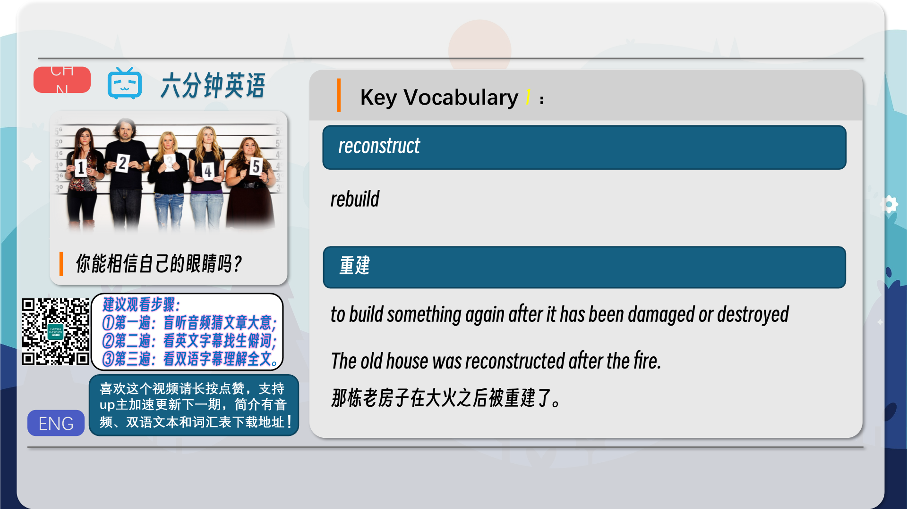

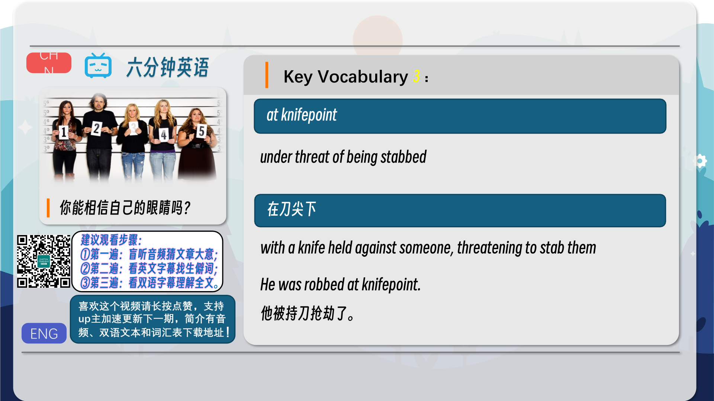
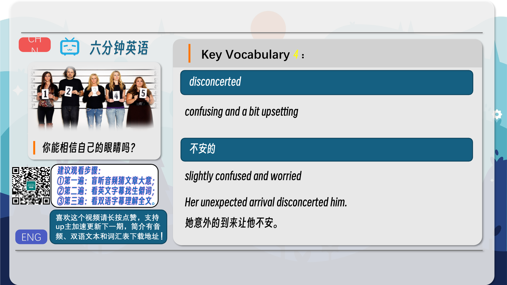
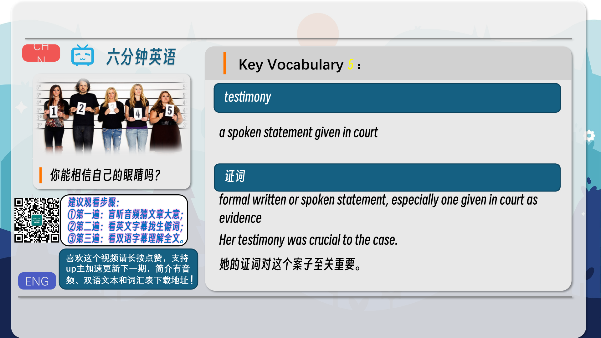

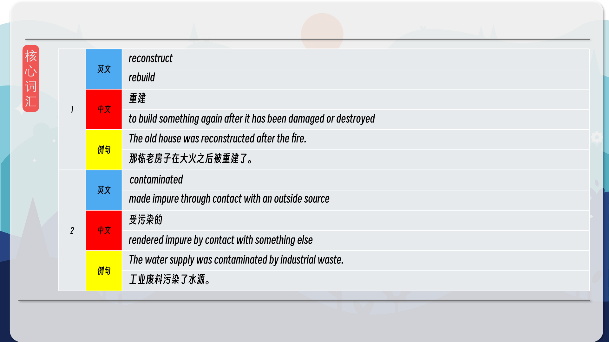
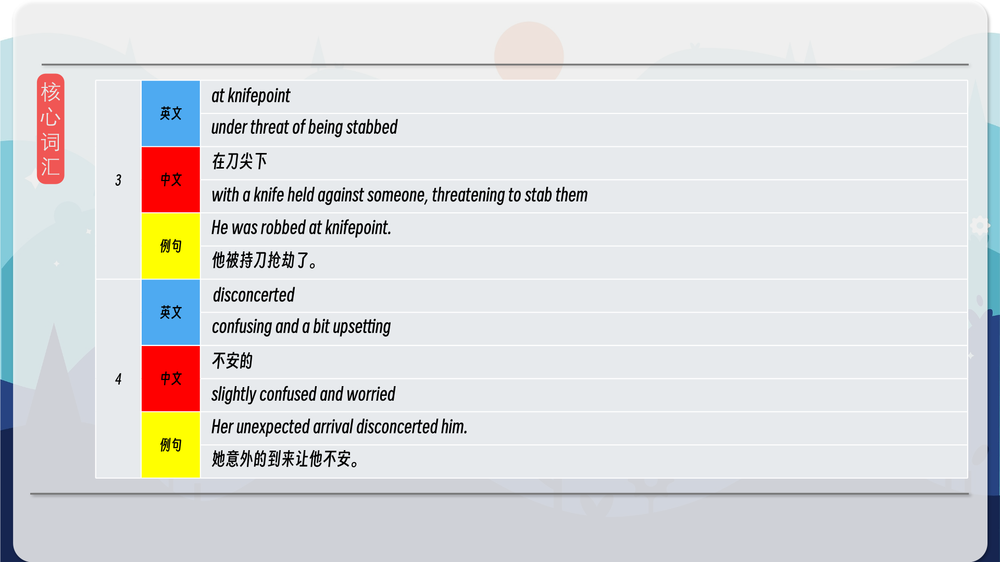
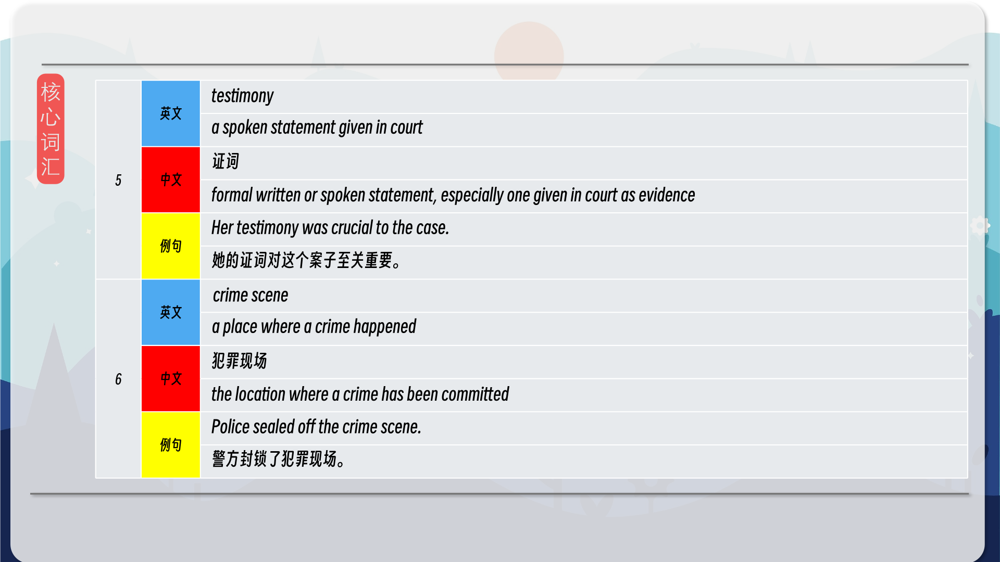
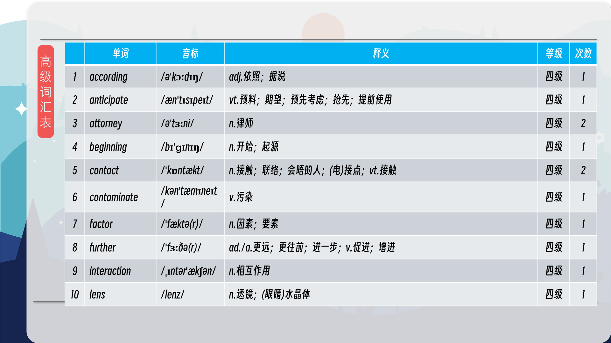
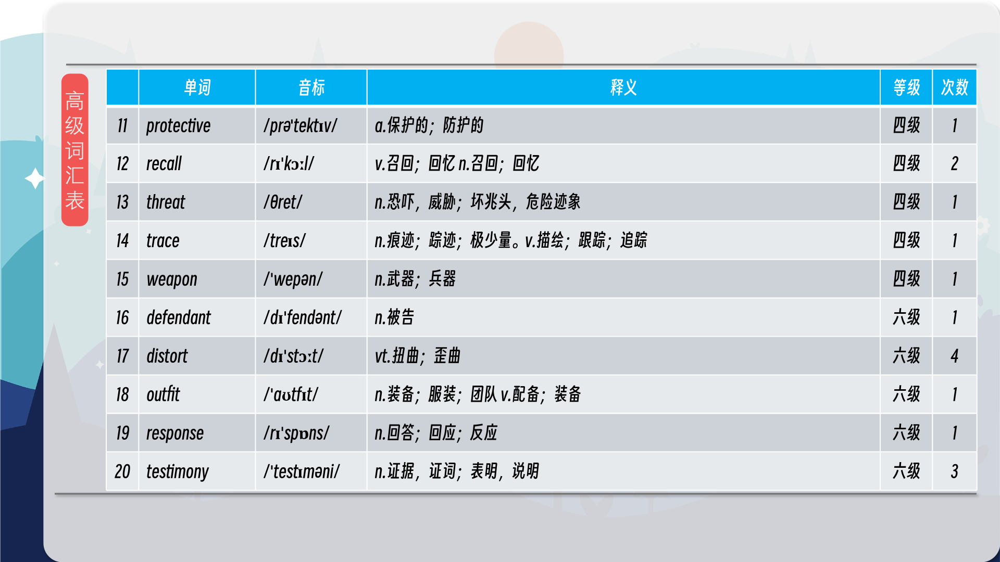
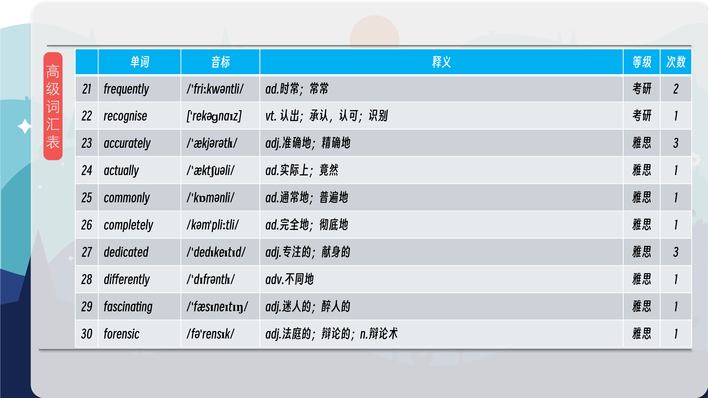
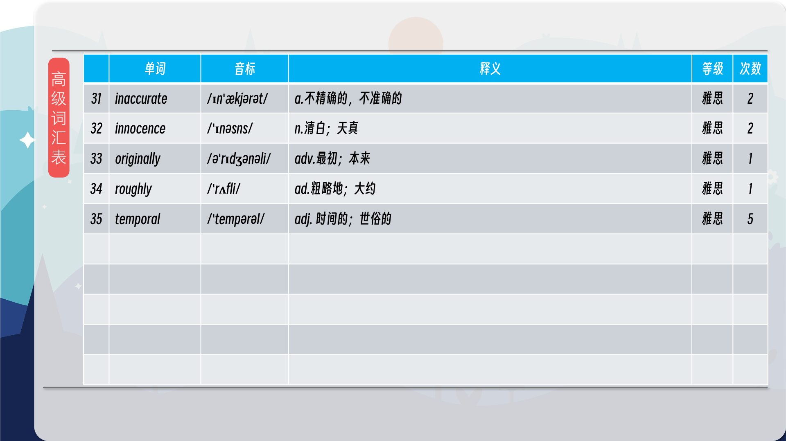

### 【核心词汇】
#### reconstruct
rebuild
重建
to build something again after it has been damaged or destroyed
The old house was reconstructed after the fire.
那栋老房子在大火之后被重建了。
#### contaminated
made impure through contact with an outside source
受污染的
rendered impure by contact with something else
The water supply was contaminated by industrial waste.
工业废料污染了水源。
#### at knifepoint
under threat of being stabbed
在刀尖下
with a knife held against someone, threatening to stab them
He was robbed at knifepoint.
他被持刀抢劫了。
#### disconcerted
confusing and a bit upsetting
不安的
slightly confused and worried
Her unexpected arrival disconcerted him.
她意外的到来让他不安。
#### testimony
a spoken statement given in court
证词
formal written or spoken statement, especially one given in court as evidence
Her testimony was crucial to the case.
她的证词对这个案子至关重要。
#### crime scene
a place where a crime happened
犯罪现场
the location where a crime has been committed
Police sealed off the crime scene.
警方封锁了犯罪现场。

在公众号里输入6位数字，获取【对话音频、英文文本、中文翻译、核心词汇和高级词汇表】电子档，6位数字【暗号】在文章的最后一张图片，如【220728】，表示22年7月28日这一期。公众号没有的文章说明还没有制作相关资料。年度合集在B站【六分钟英语】工房获取，每年共计300+文档，感谢支持！