### 【英文脚本】
Dan
Hello and welcome to 6 Minute English – the show that brings you an interesting topic, authentic listening practice and vocabulary to help you improve your language skills. I'm Dan…
 
Neil
And I'm Neil. In this programme we’ll be discussing romance, as well as teaching you 6 new items of vocabulary, of course. Now, Dan, why are you looking so upset?
 
Dan
Oh Neil, it’s all over! She broke up with me on Valentine’s Day! She said I wasn’t the one.
 
Neil
Cheer up Dan, cheer up. It’s not your fault.
 
Dan
No?
 
Neil
You can blame romanticism.
 
Dan
Romanticism? What’s that?
 
Neil
Romanticism was a movement that started in Europe and spread worldwide. It influenced literature, art, poetry, music and the way people behaved.
 
Dan
A movement meaning 'a group of people working together to support an idea'?
 
Neil
Yes. And that bring us on to this week’s question. When was the start of the romantic period? Was it a) the beginning of the 18th century, b) the middle of the 18thth century or c) the end of the 18th century?
 
Dan
Well, I honestly have no idea, so I’m going to go smack in the middle… the middle of the 18th century.
 
Neil
And we'll find out later on in the show if you got the question right. Now, going back to your ex-girlfriend, let me take a wild guess… love at first sight, was it?
 
Dan
Well… yes. What’s your point?
 
Neil
Well, it’s not your fault, Dan. That idea is romantic, and by that I mean it originated from the romantic era. It was part of the zeitgeist, and many of these ideas still continue today.
 
Dan
Zeitgeist, the word comes from German and literally means 'the spirit of the time'.
 
Neil
A lot of what we believe about love today – for example, the idea that two people will live happily ever after - comes from the romantic period.
 
Dan
But, everyone loves a bit of romance!
 
Neil
Well, that’s true. However, it’s one thing to enjoy romance, but it can be dangerous to judge your relationship against romantic ideals.
 
Dan
True, it might not be a realistic benchmark, and by that I mean 'a standard from which other things are judged'. So we grow up hearing these romantic stories, which leads us to develop an idea of what a relationship is meant to be…and then we get disappointed by the real thing?
 
Neil
Well, to put it bluntly, yes. The romantic ideal is just that – an idealised version, or perfect version, of a relationship. But it often leaves out the nitty-gritty, meaning 'practical details'. Details like work, stress, children…all of the things that we have to deal with in everyday life.
 
Dan
Not to mention, the fact that everyone is flawed, or 'imperfect', in their own way. That means we get angry or moody or upset for all sorts of reasons.
 
Neil
Exactly! Many popular love stories end at the point where the characters get together or marry. But very few show us how to keep that someone special over a long period of time. A relationship is hard work.
 
Dan
And if the relationship you are in isn’t as perfect as the story said it should be, then maybe you’re with the wrong person, which could explain why so many marriages end in divorce. I wonder if that’s true for everyone’s relationships. Fortunately, I found some people with partners and asked them.
 
Neil
Well, I asked these people about theirs…
 
INSERT
Is your partner 100% perfect for you? No. Not 100%. No, I don’t think that’s true.
 
Dan
Does that mean true love doesn’t exist?
 
Neil
No. It just means that all relationships must be worked on and that perfection is impossible. But we should never give up trying.
 
Dan
You’re right! She wasn’t the one for me! I need to find my next Juliet. She’ll be just perfect!
 
Neil
Oh Dan. You haven’t learnt anything! You’re just a hopeless romantic. Now, can you remember the quiz question? I asked you when the Romantic period originated? Was it a) th th th the beginning of the 18 century, b) the middle of the 18 century or c) the end of the 18 century?
 
Dan
And I said: the middle of the 18th century.
 
Neil
Wrong I’m afraid! It was towards the end of the 18th century.
 
Dan
I have nothing good in my life at the moment.
 
Neil
Shall we take a look at the vocabulary too?
 
Dan
Sure. The first word we had was: movement – a movement is a 'group of people working together to support an idea'. Can you think of any modern day movements, Neil?
 
Neil
The environmental movement is very strong and popular at the moment, as is the movement for equality – gender equality, for example. And the next word we had was zeitgeist – now, a zeitgeist literally means 'the spirit of a particular time'. What would you say that the zeitgeist is these days, Dan?
 
Dan
Well, I think there’s a focus on personal freedom. There’s environmental concern, and of course, let’s not forget the rise of social media. The next word we had was benchmark – a benchmark is a 'standard from which other things are judged'. If you were looking for a new house, Neil, what would your benchmark be?
 
Neil
Well, my current house has a garden and it has somewhere I can park my car, so that would be the benchmark for a new house. It would have to have that at least, and more. Next we have: idealised – an idealised thing is an 'often imagined, perfect version' of something. Now, what three things would exist in an idealised world for you then, Dan?
 
Dan
I would say, personal freedom, religious tolerance and free ice-cream for everybody on a daily basis.
 
Neil
Brilliant! OK!
 
Dan
Next we have nitty-gritty – the nitty-gritty is the 'important or practical detail involved in a situation or thing'. Now, getting married is supposed to be a wonderful thing, but what about the nitty-gritty of the ceremony, Neil. Give us a few examples!
 
Neil
Well, you have to decide who’s going to sit next to who, who to invite, the food - some people don’t like this, some people don’t like that. You’ve got to get the flowers right. Oh, there’s so much to think about – makes you think that marriage might be flawed… and flawed – is a thing which is 'imperfect in some way'. London’s a great city, but how do you feel about it, Dan?
 
Dan
Well, I think it’s flawed in the way that the public transport could use an upgrade – there’s never enough space on the carriages. Well, that's the end of today's 6 Minute English. Please join us again soon!
 
Neil
And we are on social media too. Make sure to visit our Facebook, Twitter, Instagram and YouTube pages.
 
Both
Bye!
 

### 【中英文双语脚本】
Dan(担)
Hello and welcome to 6 Minute English – the show that brings you an interesting topic, authentic listening practice and vocabulary to help you improve your language skills. I'm Dan…
您好，欢迎来到六分钟英语 - 该节目为您带来有趣的话题、真实的听力练习和词汇，帮助您提高语言技能。我是 Dan...

Neil(尼尔)
And I'm Neil. In this programme we’ll be discussing romance, as well as teaching you 6 new items of vocabulary, of course. Now, Dan, why are you looking so upset?
我是 Neil。在这个节目中，我们将讨论浪漫，当然也会教你 6 个新的词汇。现在，丹，你为什么看起来这么难过？

Dan(担)
Oh Neil, it’s all over! She broke up with me on Valentine’s Day! She said I wasn’t the one.
哦，尼尔，一切都结束了！她在情人节那天和我分手了！她说我不是那个人。

Neil(尼尔)
Cheer up Dan, cheer up. It’s not your fault.
振作起来，丹，振作起来。这不是你的错。

Dan(担)
No?
不？

Neil(尼尔)
You can blame romanticism.
你可以责怪浪漫主义。

Dan(担)
Romanticism? What’s that?
浪漫主义？什么？

Neil(尼尔)
Romanticism was a movement that started in Europe and spread worldwide. It influenced literature, art, poetry, music and the way people behaved.
浪漫主义是一场起源于欧洲并传播到全世界的运动。它影响了文学、艺术、诗歌、音乐和人们的行为方式。

Dan(担)
A movement meaning 'a group of people working together to support an idea'?
一个运动的意思是“一群人一起努力支持一个想法”？

Neil(尼尔)
Yes. And that bring us on to this week’s question. When was the start of the romantic period? Was it a) the beginning of the 18th century, b) the middle of the 18thth century or c) the end of the 18th century?
是的。这让我们进入了本周的问题。浪漫时期是从什么时候开始的？是 a） 18 世纪初，b） 18 世纪中叶还是 c） 18 世纪末？

Dan(担)
Well, I honestly have no idea, so I’m going to go smack in the middle… the middle of the 18th century.
好吧，老实说我不知道，所以我要去中间打......18 世纪中叶。

Neil(尼尔)
And we'll find out later on in the show if you got the question right. Now, going back to your ex-girlfriend, let me take a wild guess… love at first sight, was it?
我们稍后会在节目中发现您是否回答正确。现在，回到你的前女友，让我大胆猜测一下......一见钟情，是吗？

Dan(担)
Well… yes. What’s your point?
井。。。是的。你的意思是什么？

Neil(尼尔)
Well, it’s not your fault, Dan. That idea is romantic, and by that I mean it originated from the romantic era. It was part of the zeitgeist, and many of these ideas still continue today.
好吧，这不是你的错，丹。这个想法很浪漫，我的意思是它起源于浪漫主义时代。这是时代精神的一部分，其中许多想法今天仍在继续。

Dan(担)
Zeitgeist, the word comes from German and literally means 'the spirit of the time'.
Zeitgeist，这个词来自德语，字面意思是“时代精神”。

Neil(尼尔)
A lot of what we believe about love today – for example, the idea that two people will live happily ever after - comes from the romantic period.
我们今天对爱情的很多信念 —— 例如，两个人会从此幸福生活的想法 —— 都来自浪漫时期。

Dan(担)
But, everyone loves a bit of romance!
但是，每个人都喜欢一点浪漫！

Neil(尼尔)
Well, that’s true. However, it’s one thing to enjoy romance, but it can be dangerous to judge your relationship against romantic ideals.
嗯，这是真的。然而，享受浪漫是一回事，但根据浪漫理想来评判你们的关系可能是危险的。

Dan(担)
True, it might not be a realistic benchmark, and by that I mean 'a standard from which other things are judged'. So we grow up hearing these romantic stories, which leads us to develop an idea of what a relationship is meant to be…and then we get disappointed by the real thing?
诚然，它可能不是一个现实的基准，我的意思是“评判其他事物的标准”。所以我们从小就听着这些浪漫的故事长大，这让我们对一段关系的意义产生了一种观念......然后我们对真实的东西感到失望？

Neil(尼尔)
Well, to put it bluntly, yes. The romantic ideal is just that – an idealised version, or perfect version, of a relationship. But it often leaves out the nitty-gritty, meaning 'practical details'. Details like work, stress, children…all of the things that we have to deal with in everyday life.
嗯，坦率地说，是的。浪漫的理想就是这样 —— 一段关系的理想化版本，或完美版本。但它往往忽略了细节，即“实际细节”。工作、压力、孩子等细节......我们在日常生活中必须处理的所有事情。

Dan(担)
Not to mention, the fact that everyone is flawed, or 'imperfect', in their own way. That means we get angry or moody or upset for all sorts of reasons.
更不用说，每个人都以自己的方式存在缺陷或“不完美”的事实。这意味着我们会因为各种原因而生气、喜怒无常或不安。

Neil(尼尔)
Exactly! Many popular love stories end at the point where the characters get together or marry. But very few show us how to keep that someone special over a long period of time. A relationship is hard work.
完全！许多流行的爱情故事以人物聚在一起或结婚结束。但很少有人向我们展示如何让这个人长期保持特别。一段关系是一项艰苦的工作。

Dan(担)
And if the relationship you are in isn’t as perfect as the story said it should be, then maybe you’re with the wrong person, which could explain why so many marriages end in divorce. I wonder if that’s true for everyone’s relationships. Fortunately, I found some people with partners and asked them.
如果你的关系并不像故事所说的那么完美，那么也许你和错误的人在一起了，这可以解释为什么这么多婚姻以离婚告终。我想知道每个人的关系是否都是如此。幸运的是，我找到了一些有伴侣的人并询问了他们。

Neil(尼尔)
Well, I asked these people about theirs…
好吧，我问了这些人关于他们的......

INSERT(插入)
Is your partner 100% perfect for you? No. Not 100%. No, I don’t think that’s true.
您的伴侣 100% 适合您吗？不。不是 100%。不，我不认为这是真的。

Dan(担)
Does that mean true love doesn’t exist?
这是否意味着真爱不存在？

Neil(尼尔)
No. It just means that all relationships must be worked on and that perfection is impossible. But we should never give up trying.
不。它只是意味着所有的关系都必须努力，完美是不可能的。但我们永远不应该放弃尝试。

Dan(担)
You’re right! She wasn’t the one for me! I need to find my next Juliet. She’ll be just perfect!
你是对的！她不是适合我的那个人！我需要找到我的下一个朱丽叶。她会完美无缺！

Neil(尼尔)
Oh Dan. You haven’t learnt anything! You’re just a hopeless romantic. Now, can you remember the quiz question? I asked you when the Romantic period originated? Was it a) th th th the beginning of the 18 century, b) the middle of the 18 century or c) the end of the 18 century?
哦，丹。你什么都没学到！你只是一个无可救药的浪漫主义者。现在，您记得测验问题吗？我问你浪漫主义时期是什么时候起源的？是 a） 18 世纪初，b） 18 世纪中叶还是 c） 18 世纪末？

Dan(担)
And I said: the middle of the 18th century.
我说：18 世纪中叶。

Neil(尼尔)
Wrong I’m afraid! It was towards the end of the 18th century.
恐怕错了！那是在 18 世纪末。

Dan(担)
I have nothing good in my life at the moment.
我现在的生活没有什么好东西。

Neil(尼尔)
Shall we take a look at the vocabulary too?
我们也要看看这些词汇吗？

Dan(担)
Sure. The first word we had was: movement – a movement is a 'group of people working together to support an idea'. Can you think of any modern day movements, Neil?
确定。我们得到的第一个词是：运动 – 运动是“一群人共同努力支持一个想法”。Neil，你能想到任何现代的运动吗？

Neil(尼尔)
The environmental movement is very strong and popular at the moment, as is the movement for equality – gender equality, for example. And the next word we had was zeitgeist – now, a zeitgeist literally means 'the spirit of a particular time'. What would you say that the zeitgeist is these days, Dan?
目前，环保运动非常强大和受欢迎，平等运动也是如此 —— 例如性别平等。“我们得到的下一个词是 zeitgeist —— 现在，zeitgeist 的字面意思是”特定时代的精神”。Dan，你认为现在的时代精神是什么？

Dan(担)
Well, I think there’s a focus on personal freedom. There’s environmental concern, and of course, let’s not forget the rise of social media. The next word we had was benchmark – a benchmark is a 'standard from which other things are judged'. If you were looking for a new house, Neil, what would your benchmark be?
嗯，我认为人们关注的是个人自由。这里有环境问题，当然，我们不要忘记社交媒体的兴起。我们得到的下一个词是 benchmark – benchmark 是“评判其他事物的标准”。如果你在找新房子，Neil，你的基准是什么？

Neil(尼尔)
Well, my current house has a garden and it has somewhere I can park my car, so that would be the benchmark for a new house. It would have to have that at least, and more. Next we have: idealised – an idealised thing is an 'often imagined, perfect version' of something. Now, what three things would exist in an idealised world for you then, Dan?
嗯，我现在的房子有一个花园，有我可以停车的地方，所以这将是新房子的基准。它至少必须有这个，甚至更多。接下来我们有：理想化 – 理想化的事物是某物的“经常想象的完美版本”。那么，Dan，在你的理想化世界中会存在哪三样东西呢？

Dan(担)
I would say, personal freedom, religious tolerance and free ice-cream for everybody on a daily basis.
我想说的是，个人自由、宗教宽容和每天为每个人提供免费的冰淇淋。

Neil(尼尔)
Brilliant! OK!
明！还行！

Dan(担)
Next we have nitty-gritty – the nitty-gritty is the 'important or practical detail involved in a situation or thing'. Now, getting married is supposed to be a wonderful thing, but what about the nitty-gritty of the ceremony, Neil. Give us a few examples!
接下来我们有了细节 —— 细节是“情况或事物中涉及的重要或实际细节”。现在，结婚应该是一件美妙的事情，但仪式的细节呢，尼尔。请给我们举几个例子！

Neil(尼尔)
Well, you have to decide who’s going to sit next to who, who to invite, the food - some people don’t like this, some people don’t like that. You’ve got to get the flowers right. Oh, there’s so much to think about – makes you think that marriage might be flawed… and flawed – is a thing which is 'imperfect in some way'. London’s a great city, but how do you feel about it, Dan?
嗯，你必须决定谁坐在谁旁边，邀请谁，食物 - 有些人不喜欢这个，有些人不喜欢那个。你得把花弄对。哦，有太多事情要考虑 – 让你觉得婚姻可能有缺陷......和 flawed – 是“在某种程度上不完美”的事物。伦敦是个很棒的城市，但你觉得怎么样，Dan？

Dan(担)
Well, I think it’s flawed in the way that the public transport could use an upgrade – there’s never enough space on the carriages. Well, that's the end of today's 6 Minute English. Please join us again soon!
嗯，我认为公共交通使用升级的方式是有缺陷的 —— 车厢上永远没有足够的空间。好了，今天的六分钟 English 到此结束。请尽快再次加入我们！

Neil(尼尔)
And we are on social media too. Make sure to visit our Facebook, Twitter, Instagram and YouTube pages.
我们也在社交媒体上。请务必访问我们的 Facebook、Twitter、Instagram 和 YouTube 页面。

Both(双)
Bye!
再见！

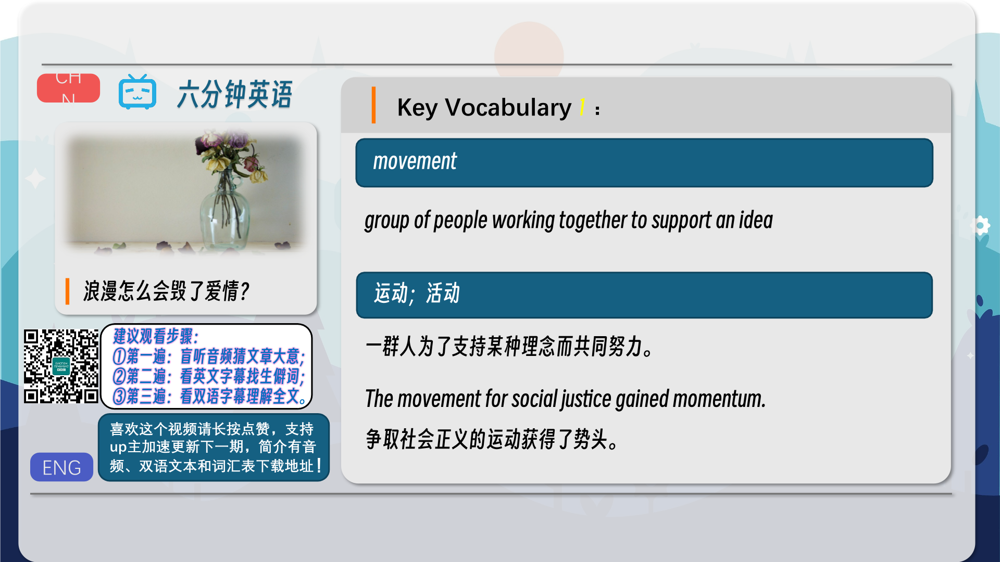
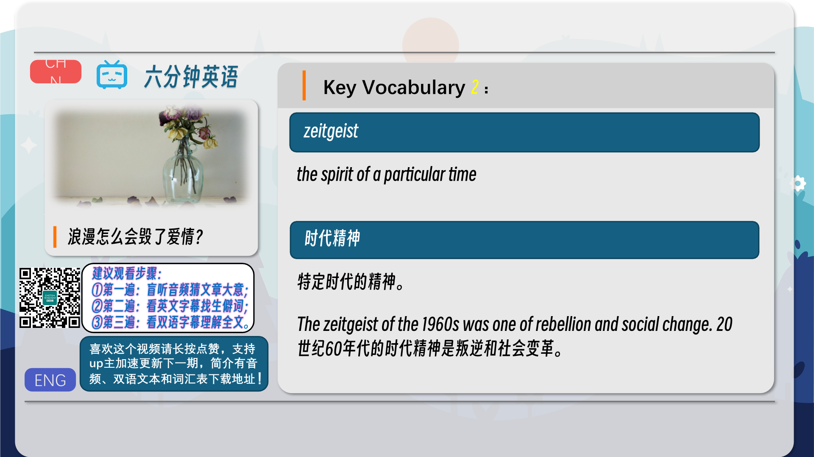
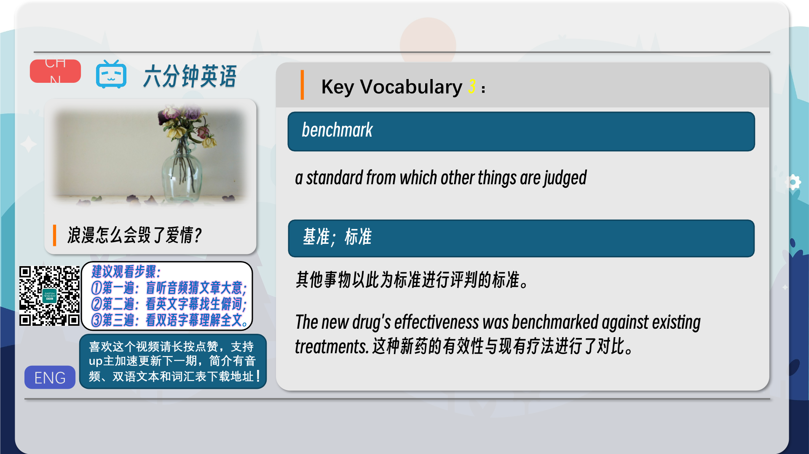
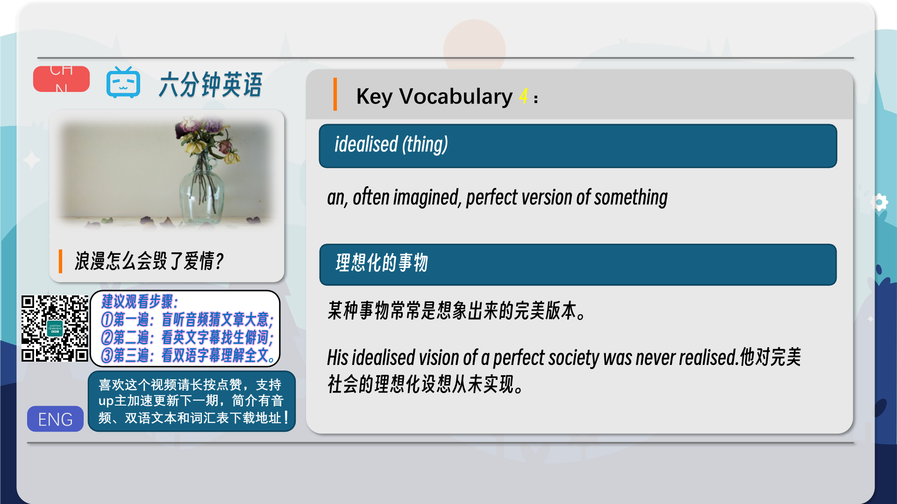

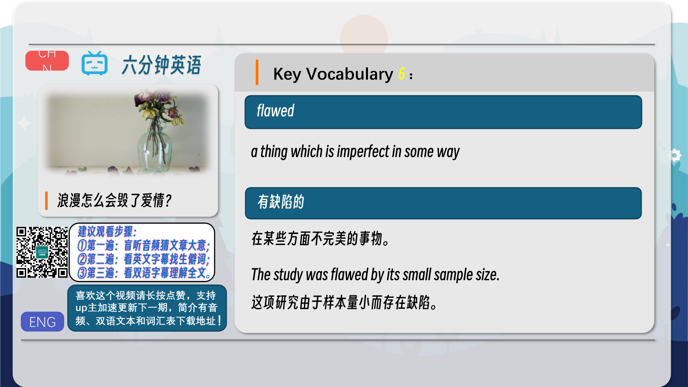
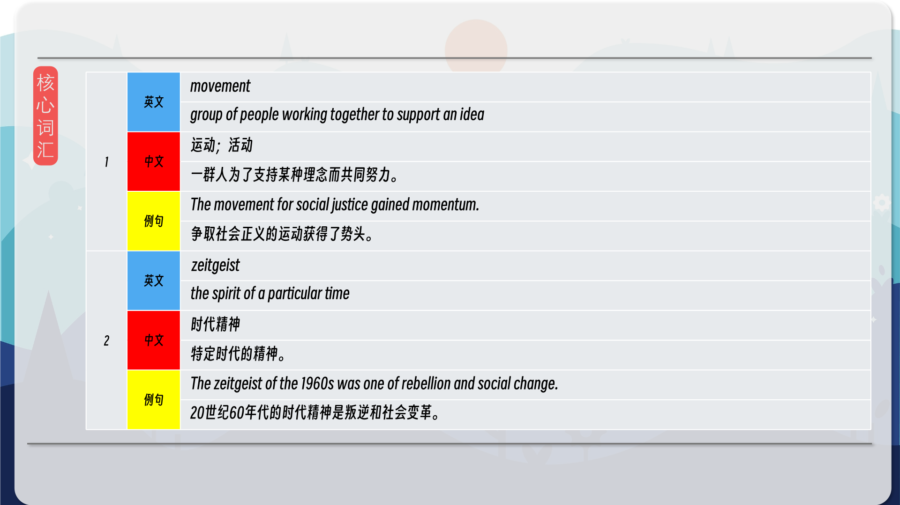
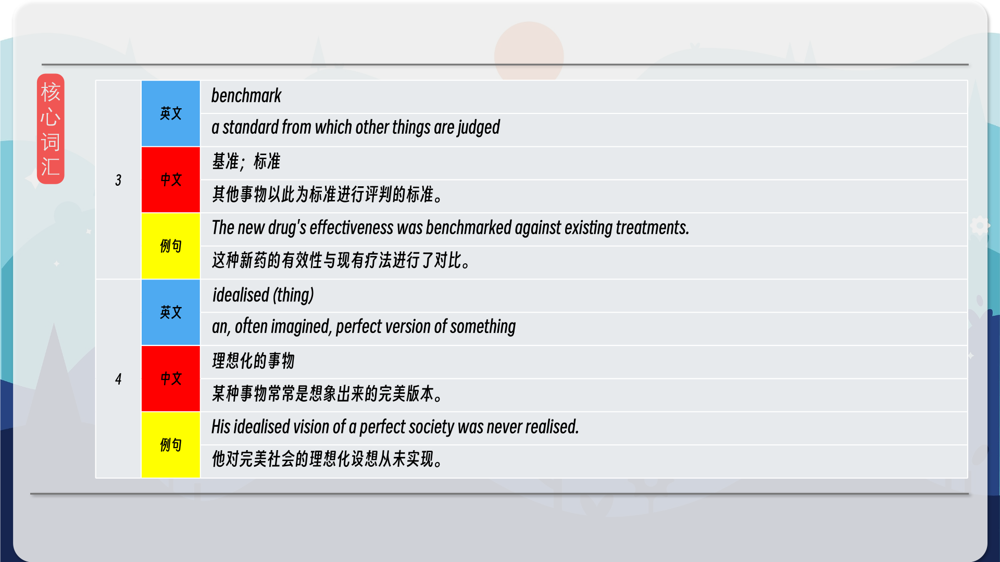
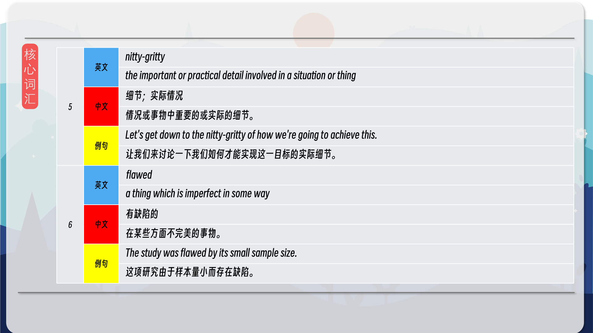
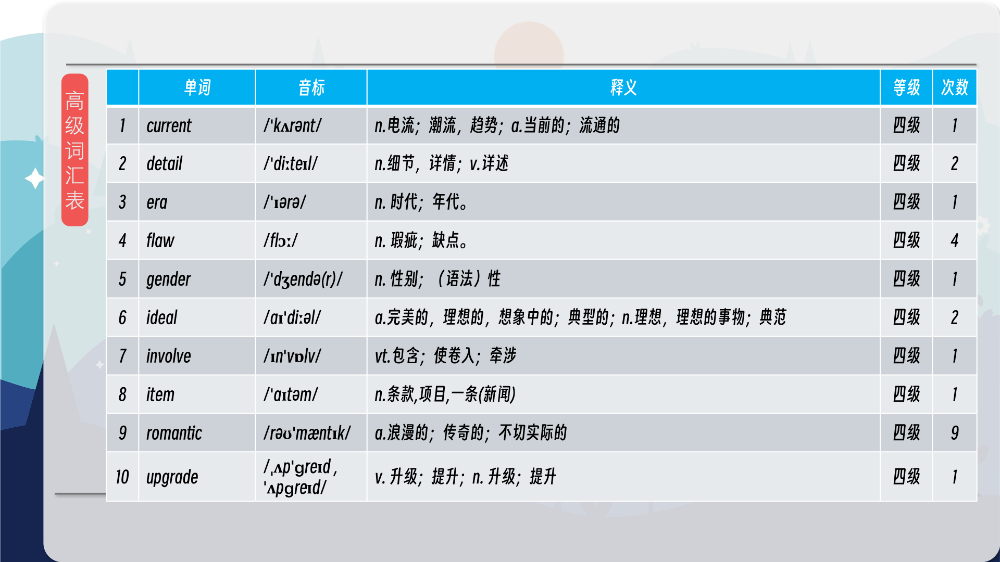
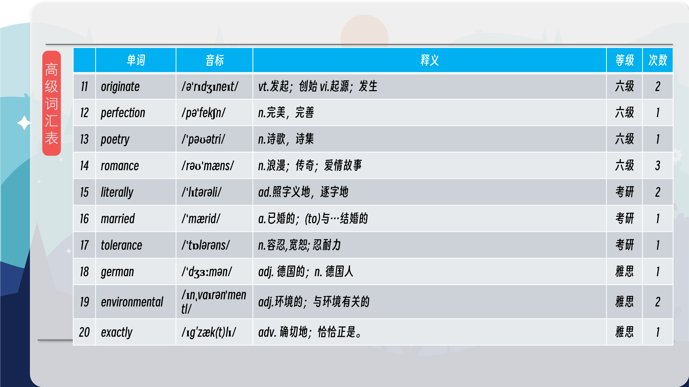
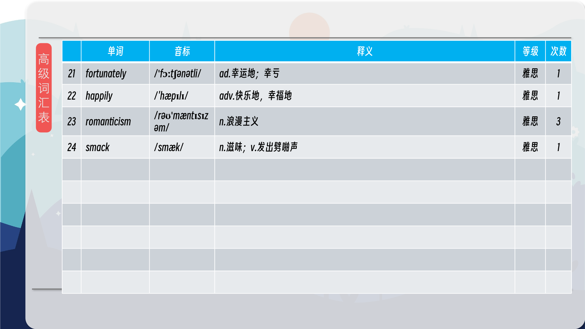

### 【核心词汇】
#### movement
group of people working together to support an idea
运动；活动
一群人为了支持某种理念而共同努力。
The movement for social justice gained momentum.
争取社会正义的运动获得了势头。
#### zeitgeist
the spirit of a particular time
时代精神
特定时代的精神。
The zeitgeist of the 1960s was one of rebellion and social change.
20世纪60年代的时代精神是叛逆和社会变革。
#### benchmark
a standard from which other things are judged
基准；标准
其他事物以此为标准进行评判的标准。
The new drug's effectiveness was benchmarked against existing treatments.
这种新药的有效性与现有疗法进行了对比。
#### idealised (thing)
an, often imagined, perfect version of something
理想化的事物
某种事物常常是想象出来的完美版本。
His idealised vision of a perfect society was never realised.
他对完美社会的理想化设想从未实现。
#### nitty-gritty
the important or practical detail involved in a situation or thing
细节；实际情况
情况或事物中重要的或实际的细节。
Let's get down to the nitty-gritty of how we're going to achieve this.
让我们来讨论一下我们如何才能实现这一目标的实际细节。
#### flawed
a thing which is imperfect in some way
有缺陷的
在某些方面不完美的事物。
The study was flawed by its small sample size.
这项研究由于样本量小而存在缺陷。

在公众号里输入6位数字，获取【对话音频、英文文本、中文翻译、核心词汇和高级词汇表】电子档，6位数字【暗号】在文章的最后一张图片，如【220728】，表示22年7月28日这一期。公众号没有的文章说明还没有制作相关资料。年度合集在B站【六分钟英语】工房获取，每年共计300+文档，感谢支持！