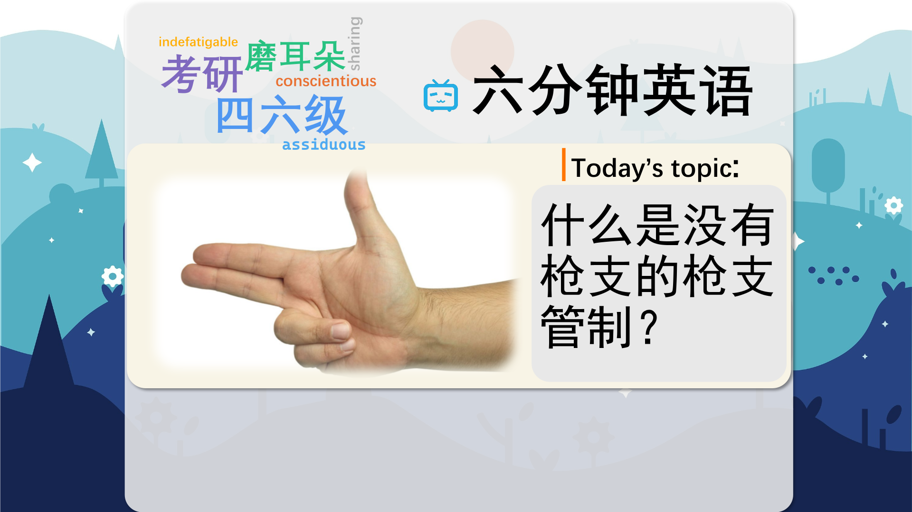

### 【英文脚本】
Dan
Hello and welcome to 6 Minute English – the show that brings you an interesting topic, authentic listening practice and vocabulary to help you improve your language skills. I'm Dan…
 
Neil
And I'm Neil. In this programme we'll be discussing armed police, as well as teaching you six new items of vocabulary, of course.
 
Dan
Can we get this done quickly today Neil? Only I've got to shoot off to a party later.
 
Neil
Shoot off meaning leave quickly. Of course we can. And it's funny that you should mention shooting because our topic this week is gun control without guns.
 
Dan
Is that so? I have a question about that for you.
 
Neil
Fire away then.
 
Dan
Fire away, an expression giving permission for someone to ask a question or speak. So, which country has the oldest gun control laws in the world? Is it a) USA, b) Iceland or c) Japan?
 
Neil
I'm going to guess b) Iceland, just because I've never been there.
 
Dan
Well, we'll find out if you're right a bit later on. Now, imagine the scene. You are a police officer who has been called out to deal with an incident. When you arrive on scene you find a dangerous criminal. Do you reach for a gun, or a blanket?
 
Neil
It's got to be a gun.
 
Dan
Well, in most countries in the world you'd be right, but not in Japan. Despite carrying guns, Japanese police almost never use them. Instead they rely on a combination of martial arts and in many cases where a person is violent, they bring out the futon – which is a kind of blanket – and they wrap them up and restrain them, or prevent them from moving.
 
Neil
You're pulling my leg.
 
Dan
Nope! Listen to Japanese journalist Anthony Berteaux describe the situation:
 
Anthony Berteaux, Japanese Journalist
What most Japanese police will do is to get huge futons and essentially roll up the person who is being violent or drunk into a little burrito and carry them back to the station, and calm them down. The response to violence is never violence, it's always to de-escalate it.
 
Neil
So, they safely restrain the person and wait for the situation to de-escalate, or become less intense.
 
Dan
Unless a criminal has a gun, Japanese police never fire their weapons.
 
Neil
Surely that means that the criminals always have the advantage then?
 
Dan
You'd think so, but no. It seems that guns don't really feature in crimes much in Japan.
 
Neil
Well, that's astonishing. So do you think the criminals don't carry guns because the police don't carry guns or that the police don't carry guns because the criminals don't carry guns?
 
Dan
Wow, that makes my head hurt! Well I don't know, but listen to what Iain Overton, the Executive Director of Action on Armed Violence says about armed police in society.
 
Iain Overton, the Executive Director of Action on Armed Violence
The American model has been militarise the police, but the challenge I have is that there is very little evidence that a more militarised police results in a more peaceful society. And I'm very concerned that if you have too many police pulling out guns at the first incidence of crime then you lead to a miniature arms race between police and criminals.
 
Neil
So, America tends to militarise its police meaning to equip them and use them as an army…
 
Dan
…and that causes an arms race with the criminals, which is a competition between two groups to have more weapons than the other group.
 
Neil
He also said that there's not a strong connection between armed police and a peaceful society. So, does that mean that Japanese society is more peaceful?
 
Dan
Well, violent crime still happens there, but criminals tend to carry other weapons, such as swords and knives, but at least it's a step in the right direction. Now, can you remember the quiz question I asked?
 
Neil
I think so. You asked me which country has the oldest gun control laws in the world? Is it a) USA, b) Iceland or c) Japan? And I said b) Iceland.
 
Dan
Well, I'm sorry Neil, that's not right. But, don't shoot the messenger, OK? It's Japan, which implemented its gun control laws in 1685.
 
Neil
How interesting. Now, let's take a look at the vocabulary from this programme.
 
Dan
Sure, we had shoot off. If you shoot off, it means you leave somewhere in a hurry. What type of verb is it Neil? Can you give us an example?
 
Neil
It's a phrasal verb so it's used conversationally and usually in an informal context. As for an example, when he heard his wife was sick, he shot off to the hospital. Synonyms could be dash off or run off. Next we had fire away. Now, fire away is an expression giving permission for someone to ask a question or speak. Can you think of any other ways to say the same thing, Dan, if I said, can I ask you a question?
 
Dan
I'd say yes, of course, go ahead, please do, or by all means. Restrain. If you restrain someone, you prevent them from moving. In another sense, you might restrain yourself from doing something – for example: eating chocolate! Have you ever had to restrain your children from anything, Neil?
 
Neil
I have to restrain my children all the time, Dan, otherwise they would fight like mad. I have to pull them apart and restrain them. OK, de-escalate – If something de-escalates, it becomes less intense. This is often used in the context of conflicts or argument. Can you think of a historical example, Dan?
 
Dan
Well, in the 1960s the Cuban missile crises escalated over a period of two weeks and de- escalated only after diplomatic negotiations were successful. But it was pretty close to World War 3 at one point! Militarise. If something is militarised, it is equipped and used like an army. Give me an example of people who have become militarised, Neil.
 
Neil
Yes, when I was a student in the United Kingdom some of the foreign students had to go home to take part in national service – that's join the army for a couple of years – so they became militarised. Now, an arms race. An arms race is a competition between two groups to gain more weapons than the other group. Got an example of that, Dan?
 
Dan
The most famous example of this is the Cold War. Both the USSR and the USA became involved in an arms race to stockpile as many nuclear weapons as possible. Well, that's the end of today's 6 Minute English. Please join us again soon!
 
Neil
And we are on social media too, so make sure to visit us on Facebook, Twitter, Instagram and YouTube.
 
Both
Bye!
 

### 【中英文双语脚本】
Dan(担)
Hello and welcome to 6 Minute English – the show that brings you an interesting topic, authentic listening practice and vocabulary to help you improve your language skills. I'm Dan…
您好，欢迎来到六分钟英语 - 该节目为您带来有趣的话题、真实的听力练习和词汇，帮助您提高语言技能。我是 Dan...

Neil(尼尔)
And I'm Neil. In this programme we'll be discussing armed police, as well as teaching you six new items of vocabulary, of course.
我是 Neil。在这个节目中，我们将讨论武装警察，当然也会教你六项新的词汇。

Dan(担)
Can we get this done quickly today Neil? Only I've got to shoot off to a party later.
我们今天能快点完成这件事吗，Neil？只是我得稍后去参加一个派对。

Neil(尼尔)
Shoot off meaning leave quickly. Of course we can. And it's funny that you should mention shooting because our topic this week is gun control without guns.
Shoot off 意味着快速离开。我们当然可以。有趣的是，你应该提到射击，因为我们本周的主题是没有枪支的枪支管制。

Dan(担)
Is that so? I have a question about that for you.
是吗？我有一个问题要问你。

Neil(尼尔)
Fire away then.
然后开火。

Dan(担)
Fire away, an expression giving permission for someone to ask a question or speak. So, which country has the oldest gun control laws in the world? Is it a) USA, b) Iceland or c) Japan?
fire away，允许某人提出问题或发言的表达式。那么，哪个国家的枪支管制法律是世界上最古老的呢？是 a） 美国，b） 冰岛还是 c） 日本？

Neil(尼尔)
I'm going to guess b) Iceland, just because I've never been there.
我猜 b） 冰岛，只是因为我从来没有去过那里。

Dan(担)
Well, we'll find out if you're right a bit later on. Now, imagine the scene. You are a police officer who has been called out to deal with an incident. When you arrive on scene you find a dangerous criminal. Do you reach for a gun, or a blanket?
好吧，我们稍后会发现你是对的。现在，想象一下这个场景。您是一名警察，被派去处理一起事件。当你到达现场时，你发现了一个危险的罪犯。你伸手去拿枪还是毯子？

Neil(尼尔)
It's got to be a gun.
它必须是一把枪。

Dan(担)
Well, in most countries in the world you'd be right, but not in Japan. Despite carrying guns, Japanese police almost never use them. Instead they rely on a combination of martial arts and in many cases where a person is violent, they bring out the futon – which is a kind of blanket – and they wrap them up and restrain them, or prevent them from moving.
嗯，在世界上大多数国家你都是对的，但在日本不是。尽管日本警察携带枪支，但几乎从不使用枪支。相反，他们依靠武术的组合，在许多情况下，当一个人有暴力行为时，他们会拿出被褥 —— 这是一种毯子 —— 然后把他们裹起来，束缚他们，或阻止他们移动。

Neil(尼尔)
You're pulling my leg.
你在拉我的腿。

Dan(担)
Nope! Listen to Japanese journalist Anthony Berteaux describe the situation:
不！听听日本记者 Anthony Berteaux 描述这种情况：

Anthony Berteaux, Japanese Journalist(AnthonyBerteaux，日本记者)
What most Japanese police will do is to get huge futons and essentially roll up the person who is being violent or drunk into a little burrito and carry them back to the station, and calm them down. The response to violence is never violence, it's always to de-escalate it.
大多数日本警察会做的是弄来巨大的被褥，基本上把施暴或喝醉的人卷进一个小墨西哥卷饼里，把他们带回警察局，让他们冷静下来。对暴力的反应从来都不是暴力，而是总是缓和暴力。

Neil(尼尔)
So, they safely restrain the person and wait for the situation to de-escalate, or become less intense.
因此，他们安全地控制住这个人，并等待情况缓和或变得不那么激烈。

Dan(担)
Unless a criminal has a gun, Japanese police never fire their weapons.
除非罪犯有枪，否则日本警察从不开枪。

Neil(尼尔)
Surely that means that the criminals always have the advantage then?
这肯定意味着罪犯总是占优势吗？

Dan(担)
You'd think so, but no. It seems that guns don't really feature in crimes much in Japan.
你可能会这么认为，但不是。在日本，枪支似乎并不真正出现在犯罪中。

Neil(尼尔)
Well, that's astonishing. So do you think the criminals don't carry guns because the police don't carry guns or that the police don't carry guns because the criminals don't carry guns?
嗯，这太令人惊讶了。那么，您认为罪犯不携带枪支是因为警察不携带枪支，还是因为罪犯不携带枪支而警察不携带枪支？

Dan(担)
Wow, that makes my head hurt! Well I don't know, but listen to what Iain Overton, the Executive Director of Action on Armed Violence says about armed police in society.
哇，真让我头疼！好吧，我不知道，但请听听武装暴力行动组织执行主任伊恩·奥弗顿 （Iain Overton） 对社会武装警察的看法。

Iain Overton, the Executive Director of Action on Armed Violence(伊恩·奥弗顿（IainOverton），武装暴力行动组织执行主任)
The American model has been militarise the police, but the challenge I have is that there is very little evidence that a more militarised police results in a more peaceful society. And I'm very concerned that if you have too many police pulling out guns at the first incidence of crime then you lead to a miniature arms race between police and criminals.
美国的模式是将警察军事化，但我面临的挑战是，几乎没有证据表明警察更加军事化会带来一个更和平的社会。我非常担心，如果有太多警察在第一次犯罪时拔枪，那么会导致警察和罪犯之间的小型军备竞赛。

Neil(尼尔)
So, America tends to militarise its police meaning to equip them and use them as an army…
所以，美国倾向于将其警察军事化，以装备他们并把他们当作军队来使用......

Dan(担)
…and that causes an arms race with the criminals, which is a competition between two groups to have more weapons than the other group.
…这会导致与罪犯的军备竞赛，这是两个群体之间争夺比另一个群体拥有更多武器的竞争。

Neil(尼尔)
He also said that there's not a strong connection between armed police and a peaceful society. So, does that mean that Japanese society is more peaceful?
他还表示，武装警察与和平社会之间没有很强的联系。那么，这是否意味着日本社会更加和平呢？

Dan(担)
Well, violent crime still happens there, but criminals tend to carry other weapons, such as swords and knives, but at least it's a step in the right direction. Now, can you remember the quiz question I asked?
好吧，那里仍然发生暴力犯罪，但罪犯往往携带其他武器，例如剑和刀，但至少这是朝着正确方向迈出的一步。现在，您还记得我问的测验问题吗？

Neil(尼尔)
I think so. You asked me which country has the oldest gun control laws in the world? Is it a) USA, b) Iceland or c) Japan? And I said b) Iceland.
我认为如此。你问我哪个国家的枪支管制法律是世界上最古老的？是 a） 美国，b） 冰岛还是 c） 日本？我说 b） 冰岛。

Dan(担)
Well, I'm sorry Neil, that's not right. But, don't shoot the messenger, OK? It's Japan, which implemented its gun control laws in 1685.
好吧，对不起，尼尔，这不对。但是，不要向信使开枪，好吗？日本于 1685 年实施了枪支管制法。

Neil(尼尔)
How interesting. Now, let's take a look at the vocabulary from this programme.
真有趣。现在，让我们来看看这个程序的词汇。

Dan(担)
Sure, we had shoot off. If you shoot off, it means you leave somewhere in a hurry. What type of verb is it Neil? Can you give us an example?
当然，我们已经开枪了。如果你开枪，那就意味着你匆忙离开某个地方。尼尔是什么类型的动词？您能给我们举个例子吗？

Neil(尼尔)
It's a phrasal verb so it's used conversationally and usually in an informal context. As for an example, when he heard his wife was sick, he shot off to the hospital. Synonyms could be dash off or run off. Next we had fire away. Now, fire away is an expression giving permission for someone to ask a question or speak. Can you think of any other ways to say the same thing, Dan, if I said, can I ask you a question?
它是一个短语动词，因此在对话中使用，通常在非正式上下文中使用。举个例子，当他听说妻子生病时，他立即赶往医院。同义词可以是 dash off 或 run off。接下来我们把火烧走了。现在，fire away 是一个允许某人提出问题或发言的表达式。Dan，你能想到其他方式来表达同样的事情吗，如果我说，我可以问你一个问题吗？

Dan(担)
I'd say yes, of course, go ahead, please do, or by all means. Restrain. If you restrain someone, you prevent them from moving. In another sense, you might restrain yourself from doing something – for example: eating chocolate! Have you ever had to restrain your children from anything, Neil?
我会说是的，当然，去吧，请这样做，或者一定要这样做。抑制。如果你约束某人，你就阻止他们移动。从另一种意义上说，你可能会克制自己做某事 —— 例如：吃巧克力！尼尔，你有没有不得不约束你的孩子做任何事情？

Neil(尼尔)
I have to restrain my children all the time, Dan, otherwise they would fight like mad. I have to pull them apart and restrain them. OK, de-escalate – If something de-escalates, it becomes less intense. This is often used in the context of conflicts or argument. Can you think of a historical example, Dan?
我必须一直约束我的孩子，丹，否则他们会疯狂地打架。我必须把他们拉开并约束他们。好的，降级 – 如果某件事降级，它会变得不那么激烈。这通常用于冲突或争论的上下文中。丹，你能想出一个历史上的例子吗？

Dan(担)
Well, in the 1960s the Cuban missile crises escalated over a period of two weeks and de- escalated only after diplomatic negotiations were successful. But it was pretty close to World War 3 at one point! Militarise. If something is militarised, it is equipped and used like an army. Give me an example of people who have become militarised, Neil.
嗯，在 1960 年代，古巴导弹危机在两周内升级，只有在外交谈判成功后才有所缓和。但它一度非常接近第三次世界大战！军事化。如果某物是军事化的，它就会像军队一样装备和使用。给我举个军事化的例子吧，尼尔。

Neil(尼尔)
Yes, when I was a student in the United Kingdom some of the foreign students had to go home to take part in national service – that's join the army for a couple of years – so they became militarised. Now, an arms race. An arms race is a competition between two groups to gain more weapons than the other group. Got an example of that, Dan?
是的，当我在英国读书时，一些外国学生不得不回国参加国民服役 —— 也就是参军几年 —— 所以他们变得军事化了。现在，一场军备竞赛。军备竞赛是两组人之间为了获得比另一组人更多的武器而进行的比赛。有个例子吗，Dan？

Dan(担)
The most famous example of this is the Cold War. Both the USSR and the USA became involved in an arms race to stockpile as many nuclear weapons as possible. Well, that's the end of today's 6 Minute English. Please join us again soon!
最著名的例子是冷战。苏联和美国都卷入了一场军备竞赛，以尽可能多地储存核武器。好了，今天的六分钟 English 到此结束。请尽快再次加入我们！

Neil(尼尔)
And we are on social media too, so make sure to visit us on Facebook, Twitter, Instagram and YouTube.
我们也在社交媒体上，所以请务必在 Facebook、Twitter、Instagram 和 YouTube 上访问我们。

Both(双)
Bye!
再见！

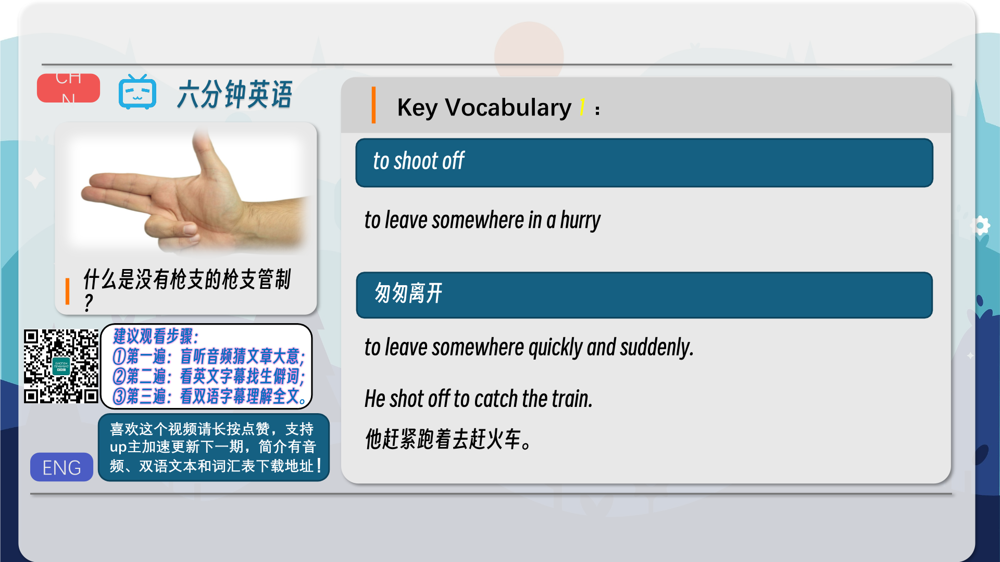
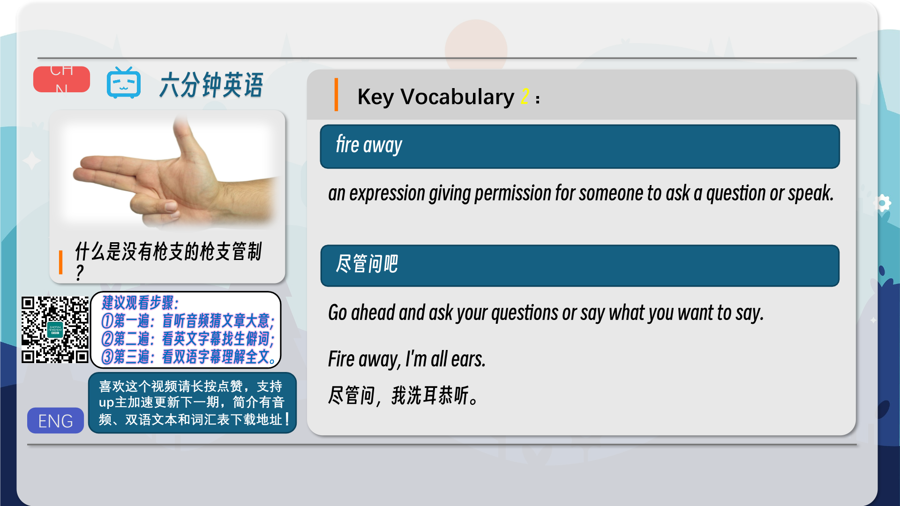
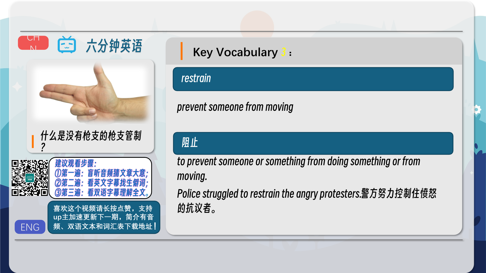
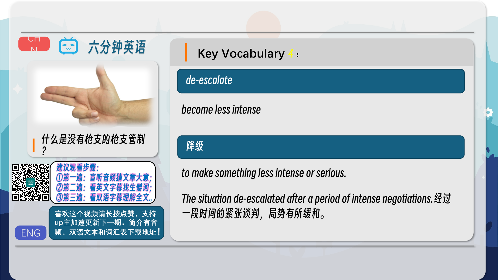
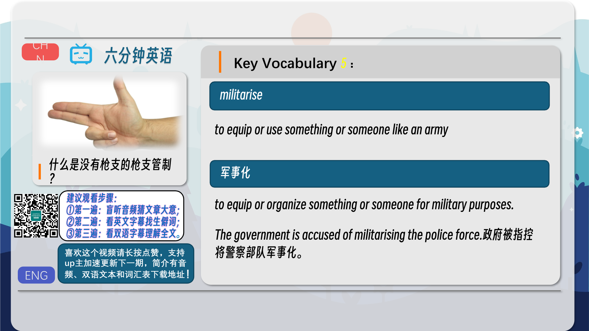
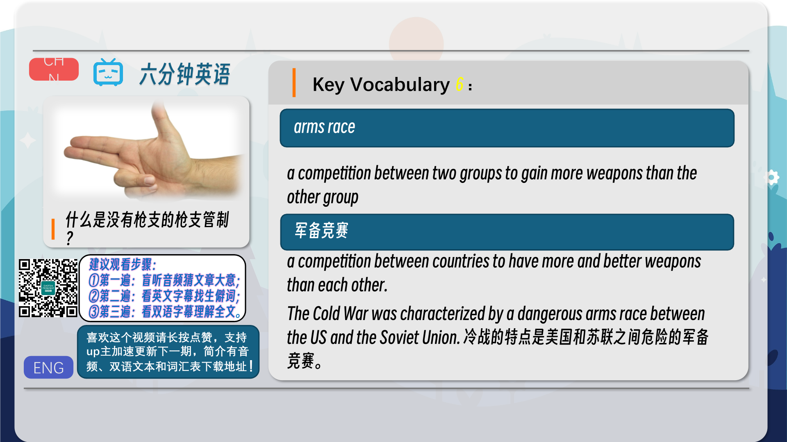
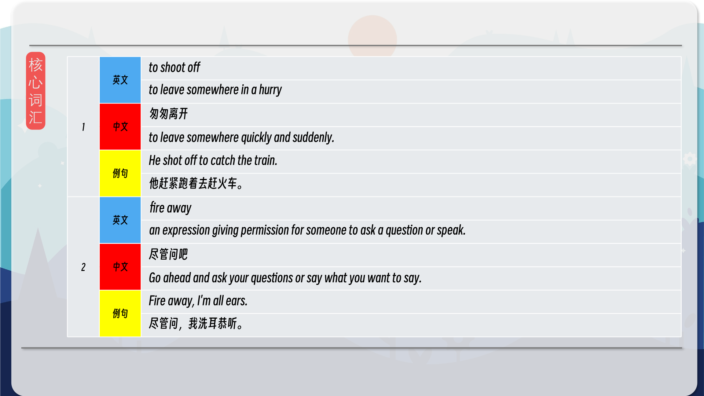
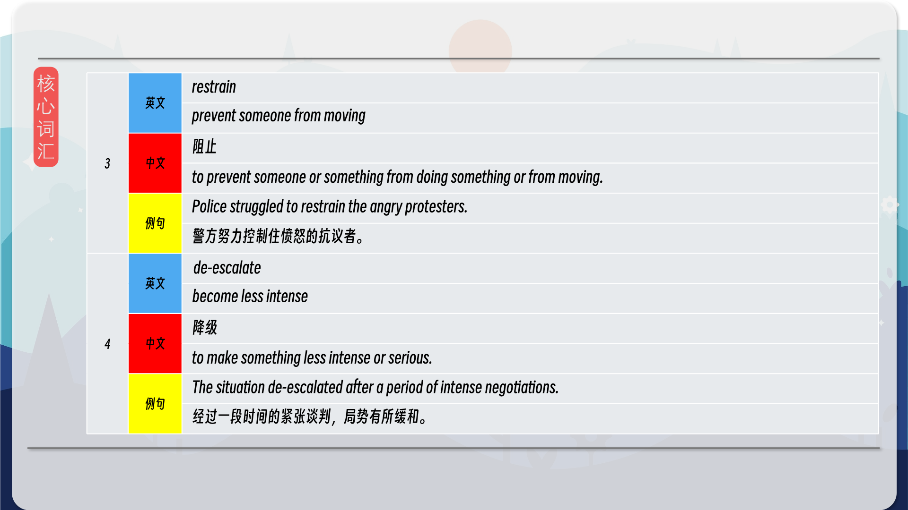
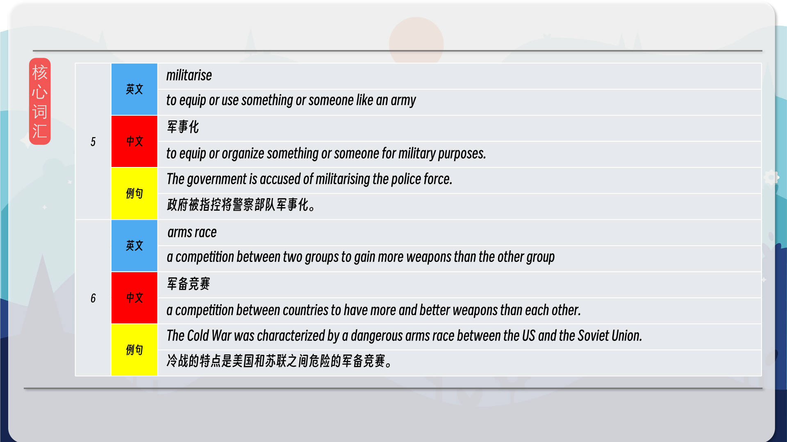
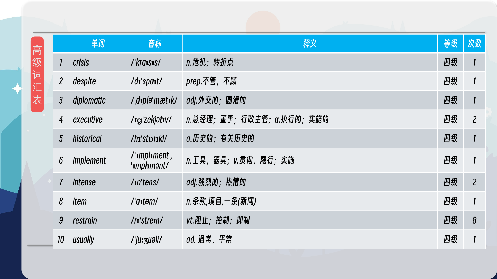
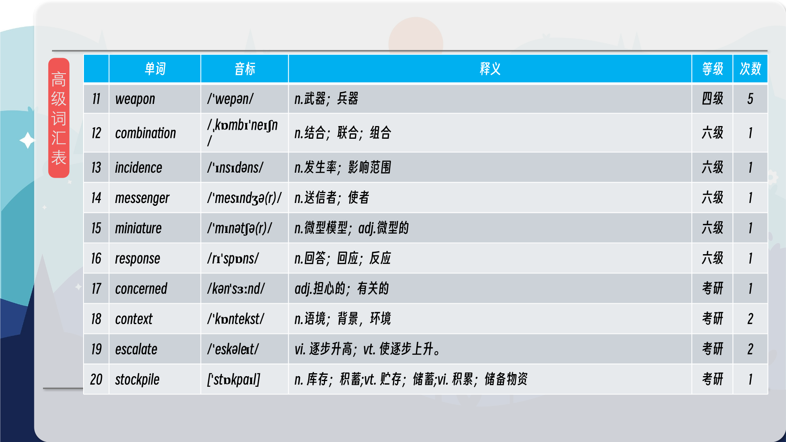
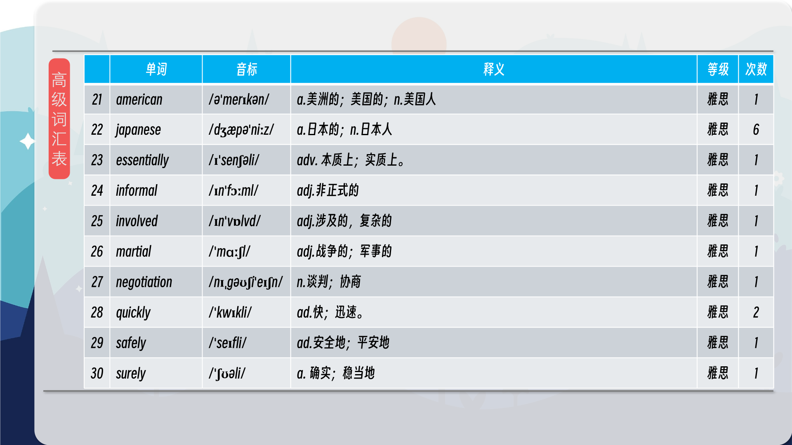
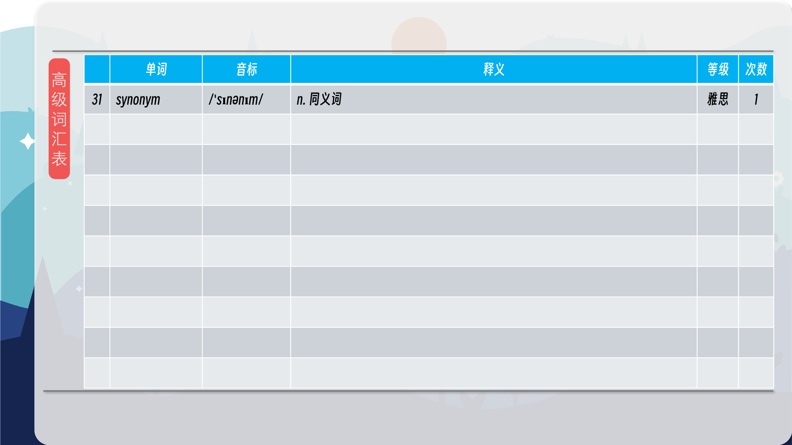

### 【核心词汇】
#### to shoot off
to leave somewhere in a hurry
匆匆离开
to leave somewhere quickly and suddenly.
He shot off to catch the train.
他赶紧跑着去赶火车。
#### fire away
an expression giving permission for someone to ask a question or speak.
尽管问吧
Go ahead and ask your questions or say what you want to say.
Fire away, I'm all ears.
尽管问，我洗耳恭听。
#### restrain
prevent someone from moving
阻止
to prevent someone or something from doing something or from moving.
Police struggled to restrain the angry protesters.
警方努力控制住愤怒的抗议者。
#### de-escalate
become less intense
降级
to make something less intense or serious.
The situation de-escalated after a period of intense negotiations.
经过一段时间的紧张谈判，局势有所缓和。
#### militarise
to equip or use something or someone like an army
军事化
to equip or organize something or someone for military purposes.
The government is accused of militarising the police force.
政府被指控将警察部队军事化。
#### arms race
a competition between two groups to gain more weapons than the other group
军备竞赛
a competition between countries to have more and better weapons than each other.
The Cold War was characterized by a dangerous arms race between the US and the Soviet Union.
冷战的特点是美国和苏联之间危险的军备竞赛。

在公众号里输入6位数字，获取【对话音频、英文文本、中文翻译、核心词汇和高级词汇表】电子档，6位数字【暗号】在文章的最后一张图片，如【220728】，表示22年7月28日这一期。公众号没有的文章说明还没有制作相关资料。年度合集在B站【六分钟英语】工房获取，每年共计300+文档，感谢支持！