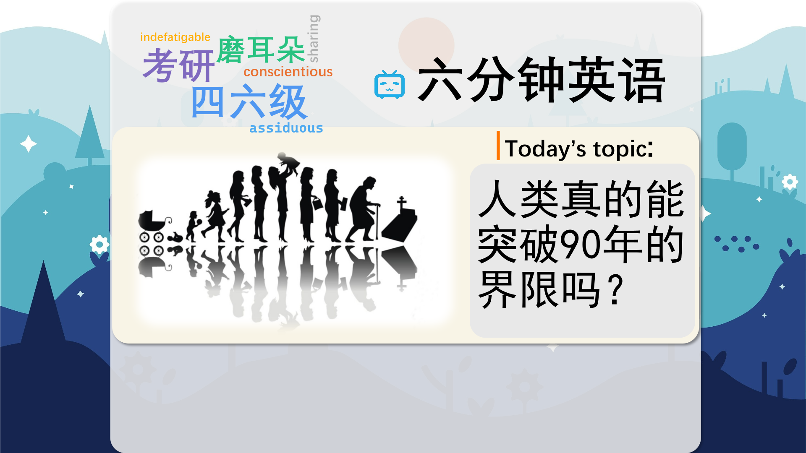

### 【英文脚本】
Dan
Hello and welcome to 6 Minute English – the show that brings you an interesting topic, authentic listening practice and vocabulary to help you improve your language skills. I'm Dan…
 
Catherine
And I'm Catherine. In this programme we'll be discussing mermaids, as well as teaching you 6 new items of vocabulary, of course…
 
Dan
How would you like to be a mermaid?
 
Catherine
A half-human and half-fish? Well, Dan, I think it's all a myth.
 
Dan
Well, then you'll find this week's question a bit of a difficult one to answer.
 
Catherine
I suppose I will. Go on then.
 
Dan
When did the most recent alleged mermaid sighting take place? Was it a) the 1400s b) 1800s or c) 2000s?
 
Catherine
Ok, and by alleged, you mean 'said or believed to be true but not proven'. I don't believe in mermaids, but I think there's a lot of people who do, so I will say c) the 2000s.
 
Dan
Well, we'll find out if you're right a bit later on. So, what do you know about mermaids, Catherine?
 
Catherine
Well, a mermaid is a creature that's similar in appearance to a woman but instead of legs, a mermaid has the tail of a fish. The males are called mermen, and they live in the ocean. I thought they were a myth.
 
Dan
They certainly appear to be mythical. They feature in legends and stories from all over the world. The earliest known one in a story dates from ancient Assyria, around 1000 BC. Can you think of a more modern example?
 
Catherine
Many people will be familiar with the Disney story, 'The Little Mermaid'.
 
Dan
Yes. Before it was an animated movie, it was a renowned fairy-tale written by Hans Christian Andersen, first published in 1837. Interestingly, a small bronze statue of the little mermaid has been sitting in Copenhagen in Denmark since 1913.
 
Catherine
There you go! There's no real evidence.
 
Dan
What if I told you that over 200 mermaids have recently gathered in Greensboro, North Carolina in the USA?
 
Catherine
You're telling me fish tales, Dan
 
Dan
Ok. I'll confess. They aren't real mermaids. Each person is a normal human wearing a waist- high latex tail. They meet to share an interest in aquatic mythology, take underwater photos, and swim. For many of them, it's a source of income too! Listen to Daniel Craig, five year merman, explain.
 
Daniel Craig, merman
A lot of the mermaids we have attending here are professional mermaids. They will entertain at birthday parties, social events, company events. I stumbled across the mermaiding community merely by accident.
 
Catherine
So it's a job too! A professional merman. And Daniel said that he stumbled across it, or 'found it by accident'. So, it doesn't really count then though, does it Dan?
 
Dan
A real, real mermaid? That's a different kettle of fish, which is an idiomatic phrase that means 'a completely different matter or issue'. Well, while we have no hard evidence, such as a photo of a real mermaid, there have been several sightings. One of the more recent ones was in 2009 in Haifa Bay.
 
Catherine
Hang on now, that rings a bell! That's in Israel, isn't it? And it allegedly appeared at sunset. Apparently the mermaid was doing tricks.
 
Dan
There you go then!
 
Catherine
But there is no reason, Dan, to believe that it was anything other than a hoax, which means 'a deception or lie – often done for humour or sometimes cruelty'. Well, real or not, it could be fun to be a mermaid. I wonder what it would be like?
 
Dan
Well, that I can help with. Let Daniel Craig explain why he likes it so much.
 
Daniel Craig, merman
It's just serene. It's the perfect place for a temporary getaway.
 
Catherine
So he likes it because it's serene, which means 'calm and peaceful'.
 
Dan
Yes and he says it's the perfect getaway, which is 'a place you go in order to escape from normal life'.
 
Catherine
Well, I still don't believe in mermaids, but I do believe, Dan, that you asked me a question.
 
Dan
I definitely did. I asked, when did the most recent alleged mermaid sighting take place? Was it a) the 1400s b) 1800s or c) 2000s?
 
Catherine
And I said I think it was the 2000s
 
Dan
And you have hit the nail on the head. Well done.
 
Catherine
Thank you
 
Dan
You're right. It was the 2000s. It was in 2012 in Zimbabwe and it was reported by the water resource minister. Let's take a look at the vocabulary from this programme. Our first word was alleged. If something is alleged it is 'said or believed be true but not proven to be true'. Can you think of a recent example, Catherine?
 
Catherine
US President Donald Trump has alleged that newspapers have been printing fake news, but apparently there's no proof. And our next one was stumbled across. So, if you stumble across something you 'encounter or find it by accident'. It's a phrasal verb and you could also say come across. So, Dan, have you ever stumbled across anything unusual?
 
Dan
Well, there was a time when I was going to a party in Holborn and I got completely lost. And there on the floor in front of me I stumbled across a map of London. It got me straight to the party.
 
Catherine
Spooky.
 
Dan
The next one after that was a different kettle of fish. A different kettle of fish is an idiomatic phrase which means 'a completely different matter or issue'. You could also use the phrase 'a horse of a different colour'.
 
Catherine
Next up, we had hoax. And a hoax is 'a deception or lie – which is often done for humour or cruelty'. What was the last hoax you did, Dan?
 
Dan
One Christmas I wrapped a broken lightbulb in a box and gave it to mother as a present. I pretended to drop it and the broken lightbulb made a glass shattering noise and she thought that I had broken her present. After that we heard serene. Serene means 'calm and peaceful'. The noun is serenity. What's your idea of serene, Catherine?
 
Catherine
Two weeks, lying on the beach, drinking lemonade, listening to the sound of the sea. Fabulous. And finally we had a getaway. A getaway is an informal word meaning 'a place you go in order to escape from normal life', such as a holiday. So, where's your favourite getaway, Dan?
 
Dan
My favourite getaway is my yoga class. I find it really, really refreshing. Well, that's the end of today's 6 Minute English. Please join us again soon!
 
Catherine
And we are on social media too, so make sure to visit us on Facebook, Twitter, Instagram and YouTube.
 
Both
Bye!
 

### 【中英文双语脚本】
Dan(担)
Hello and welcome to 6 Minute English – the show that brings you an interesting topic, authentic listening practice and vocabulary to help you improve your language skills. I'm Dan…
您好，欢迎来到六分钟英语 - 该节目为您带来有趣的话题、真实的听力练习和词汇，帮助您提高语言技能。我是 Dan...

Catherine(凯瑟琳)
And I'm Catherine. In this programme we'll be discussing mermaids, as well as teaching you 6 new items of vocabulary, of course…
我是 Catherine。在这个节目中，我们将讨论美人鱼，当然还会教你 6 个新的词汇项目......

Dan(担)
How would you like to be a mermaid?
你想成为美人鱼吗？

Catherine(凯瑟琳)
A half-human and half-fish? Well, Dan, I think it's all a myth.
半人半鱼？嗯，Dan，我觉得这都是个神话。

Dan(担)
Well, then you'll find this week's question a bit of a difficult one to answer.
那么，你会发现本周的问题有点难以回答。

Catherine(凯瑟琳)
I suppose I will. Go on then.
我想我会的。那就继续吧。

Dan(担)
When did the most recent alleged mermaid sighting take place? Was it a) the 1400s b) 1800s or c) 2000s?
最近一次据称目击美人鱼的事件是什么时候发生的？是 a） 1400 年代 b） 1800 年代还是 c） 2000 年代？

Catherine(凯瑟琳)
Ok, and by alleged, you mean 'said or believed to be true but not proven'. I don't believe in mermaids, but I think there's a lot of people who do, so I will say c) the 2000s.
好的，你说的 alleged，你的意思是 '说或相信是真的，但未经证实'。我不相信美人鱼，但我认为有很多人相信，所以我会说 c） 2000 年代。

Dan(担)
Well, we'll find out if you're right a bit later on. So, what do you know about mermaids, Catherine?
好吧，我们稍后会发现你是对的。那么，凯瑟琳，你对美人鱼了解多少呢？

Catherine(凯瑟琳)
Well, a mermaid is a creature that's similar in appearance to a woman but instead of legs, a mermaid has the tail of a fish. The males are called mermen, and they live in the ocean. I thought they were a myth.
嗯，美人鱼是一种外表与女性相似的生物，但美人鱼没有腿，而是有鱼的尾巴。雄性被称为人鱼，它们生活在海洋中。我认为他们是一个神话。

Dan(担)
They certainly appear to be mythical. They feature in legends and stories from all over the world. The earliest known one in a story dates from ancient Assyria, around 1000 BC. Can you think of a more modern example?
他们肯定是神话般的。他们出现在来自世界各地的传说和故事中。故事中已知最早的可以追溯到公元前 1000 年左右的古亚述。你能想到一个更现代的例子吗？

Catherine(凯瑟琳)
Many people will be familiar with the Disney story, 'The Little Mermaid'.
很多人都熟悉迪斯尼的故事《小美人鱼》。

Dan(担)
Yes. Before it was an animated movie, it was a renowned fairy-tale written by Hans Christian Andersen, first published in 1837. Interestingly, a small bronze statue of the little mermaid has been sitting in Copenhagen in Denmark since 1913.
是的。在成为动画电影之前，它是汉斯·克里斯蒂安·安徒生 （Hans Christian Andersen） 创作的著名童话故事，于 1837 年首次出版。有趣的是，自 1913 年以来，丹麦哥本哈根一直矗立着小美人鱼的小铜像。

Catherine(凯瑟琳)
There you go! There's no real evidence.
给你！没有真正的证据。

Dan(担)
What if I told you that over 200 mermaids have recently gathered in Greensboro, North Carolina in the USA?
如果我告诉你，最近有 200 多条美人鱼聚集在美国北卡罗来纳州的格林斯博罗，会怎么样？

Catherine(凯瑟琳)
You're telling me fish tales, Dan
你在给我讲鱼的故事，丹

Dan(担)
Ok. I'll confess. They aren't real mermaids. Each person is a normal human wearing a waist- high latex tail. They meet to share an interest in aquatic mythology, take underwater photos, and swim. For many of them, it's a source of income too! Listen to Daniel Craig, five year merman, explain.
好吧，我承认。他们不是真正的美人鱼。每个人都是穿着齐腰高的乳胶尾巴的正常人。他们相聚一堂，分享对水生神话的兴趣，拍摄水下照片和游泳。对于他们中的许多人来说，这也是一个收入来源！听听 Daniel Craig，五年人鱼，解释。

Daniel Craig, merman(DanielCraig，人鱼)
A lot of the mermaids we have attending here are professional mermaids. They will entertain at birthday parties, social events, company events. I stumbled across the mermaiding community merely by accident.
我们在这里参加的很多美人鱼都是专业的美人鱼。他们将在生日派对、社交活动、公司活动中娱乐。我偶然发现了美人鱼社区。

Catherine(凯瑟琳)
So it's a job too! A professional merman. And Daniel said that he stumbled across it, or 'found it by accident'. So, it doesn't really count then though, does it Dan?
所以这也是一份工作！一个专业的人鱼。丹尼尔说，他是偶然发现的，或者说是“偶然发现的”。所以，这并不算数，不是吗 Dan？

Dan(担)
A real, real mermaid? That's a different kettle of fish, which is an idiomatic phrase that means 'a completely different matter or issue'. Well, while we have no hard evidence, such as a photo of a real mermaid, there have been several sightings. One of the more recent ones was in 2009 in Haifa Bay.
一条真正的美人鱼？那是一壶不同的鱼，这是一个惯用语，意思是“完全不同的事情或问题”。好吧，虽然我们没有确凿的证据，例如真正的美人鱼的照片，但已经有几次目击事件。最近的一次是 2009 年在海法湾。

Catherine(凯瑟琳)
Hang on now, that rings a bell! That's in Israel, isn't it? And it allegedly appeared at sunset. Apparently the mermaid was doing tricks.
等一下，这敲响了警钟！那是在以色列，不是吗？据称，它出现在日落时分。显然，美人鱼在耍花招。

Dan(担)
There you go then!
那你去吧！

Catherine(凯瑟琳)
But there is no reason, Dan, to believe that it was anything other than a hoax, which means 'a deception or lie – often done for humour or sometimes cruelty'. Well, real or not, it could be fun to be a mermaid. I wonder what it would be like?
但是，丹，没有理由相信这只是一个骗局，意思是“欺骗或谎言 —— 通常是为了幽默或有时是残忍”。好吧，无论真实与否，成为美人鱼可能会很有趣。我想知道那会是什么样子？

Dan(担)
Well, that I can help with. Let Daniel Craig explain why he likes it so much.
嗯，我可以帮忙。让 Daniel Craig 解释一下他为什么这么喜欢它。

Daniel Craig, merman(DanielCraig，人鱼)
It's just serene. It's the perfect place for a temporary getaway.
它只是宁静的。这是临时度假的理想场所。

Catherine(凯瑟琳)
So he likes it because it's serene, which means 'calm and peaceful'.
所以他喜欢这里，因为它很宁静，意思是“平静祥和”。

Dan(担)
Yes and he says it's the perfect getaway, which is 'a place you go in order to escape from normal life'.
是的，他说这是一个完美的度假胜地，是“一个你为了逃离正常生活而去的地方”。

Catherine(凯瑟琳)
Well, I still don't believe in mermaids, but I do believe, Dan, that you asked me a question.
好吧，我仍然不相信美人鱼，但我确实相信，Dan，你问了我一个问题。

Dan(担)
I definitely did. I asked, when did the most recent alleged mermaid sighting take place? Was it a) the 1400s b) 1800s or c) 2000s?
我肯定是这样。我问，最近一次所谓的美人鱼目击事件是什么时候发生的？是 a） 1400 年代 b） 1800 年代还是 c） 2000 年代？

Catherine(凯瑟琳)
And I said I think it was the 2000s
我说我认为是 2000 年代

Dan(担)
And you have hit the nail on the head. Well done.
而你已经一针见血了。干的好。

Catherine(凯瑟琳)
Thank you
谢谢

Dan(担)
You're right. It was the 2000s. It was in 2012 in Zimbabwe and it was reported by the water resource minister. Let's take a look at the vocabulary from this programme. Our first word was alleged. If something is alleged it is 'said or believed be true but not proven to be true'. Can you think of a recent example, Catherine?
你是对的。那是 2000 年代。那是 2012 年在津巴布韦，水资源部长报告了这一事件。让我们来看看这个程序的词汇。我们的第一个词是据称。如果某事被指控，它就是 “说或相信是真的，但未被证明是真的”。你能想到最近的一个例子吗，凯瑟琳？

Catherine(凯瑟琳)
US President Donald Trump has alleged that newspapers have been printing fake news, but apparently there's no proof. And our next one was stumbled across. So, if you stumble across something you 'encounter or find it by accident'. It's a phrasal verb and you could also say come across. So, Dan, have you ever stumbled across anything unusual?
美国总统唐纳德·特朗普（Donald Trump）声称报纸一直在刊登假新闻，但显然没有证据。而我们的下一个是偶然发现的。所以，如果你偶然发现了一些东西，你 “偶然遇到或发现它”。这是一个短语动词，你也可以说 come acounter。那么，Dan，你有没有偶然发现过什么不寻常的事情？

Dan(担)
Well, there was a time when I was going to a party in Holborn and I got completely lost. And there on the floor in front of me I stumbled across a map of London. It got me straight to the party.
嗯，有一次我要去霍尔本参加一个派对，我完全迷路了。在我面前的地板上，我偶然发现了一张伦敦地图。它让我直接进入了派对。

Catherine(凯瑟琳)
Spooky.
怪异。

Dan(担)
The next one after that was a different kettle of fish. A different kettle of fish is an idiomatic phrase which means 'a completely different matter or issue'. You could also use the phrase 'a horse of a different colour'.
在那之后的下一个是不同的鱼缸。A different kettle of fish 是一个惯用语，意思是“完全不同的事情或问题”。你也可以使用 'a horse of a different colour' 这个短语。

Catherine(凯瑟琳)
Next up, we had hoax. And a hoax is 'a deception or lie – which is often done for humour or cruelty'. What was the last hoax you did, Dan?
接下来，我们遇到了骗局。骗局是“欺骗或谎言 —— 通常是为了幽默或残忍”。丹，你上次做的骗局是什么？

Dan(担)
One Christmas I wrapped a broken lightbulb in a box and gave it to mother as a present. I pretended to drop it and the broken lightbulb made a glass shattering noise and she thought that I had broken her present. After that we heard serene. Serene means 'calm and peaceful'. The noun is serenity. What's your idea of serene, Catherine?
有一年圣诞节，我把一个坏掉的灯泡装进盒子里，作为礼物送给了妈妈。我假装把它掉了下来，破碎的灯泡发出玻璃破碎的声音，她以为我打破了她的礼物。之后，我们听到了宁静的声音。Serene 的意思是“平静祥和”。名词是 serenity。你对宁静有什么看法，凯瑟琳？

Catherine(凯瑟琳)
Two weeks, lying on the beach, drinking lemonade, listening to the sound of the sea. Fabulous. And finally we had a getaway. A getaway is an informal word meaning 'a place you go in order to escape from normal life', such as a holiday. So, where's your favourite getaway, Dan?
两个星期，躺在沙滩上，喝柠檬水，听着海浪的声音。瑰。最后我们终于逃脱了。逍遥游是一个非正式词，意思是“你为了逃离正常生活而去的地方”，例如假期。那么，Dan，你最喜欢的度假胜地在哪里？

Dan(担)
My favourite getaway is my yoga class. I find it really, really refreshing. Well, that's the end of today's 6 Minute English. Please join us again soon!
我最喜欢的度假胜地是我的瑜伽课。我觉得这真的非常令人耳目一新。好了，今天的六分钟 English 到此结束。请尽快再次加入我们！

Catherine(凯瑟琳)
And we are on social media too, so make sure to visit us on Facebook, Twitter, Instagram and YouTube.
我们也在社交媒体上，所以请务必在 Facebook、Twitter、Instagram 和 YouTube 上访问我们。

Both(双)
Bye!
再见！

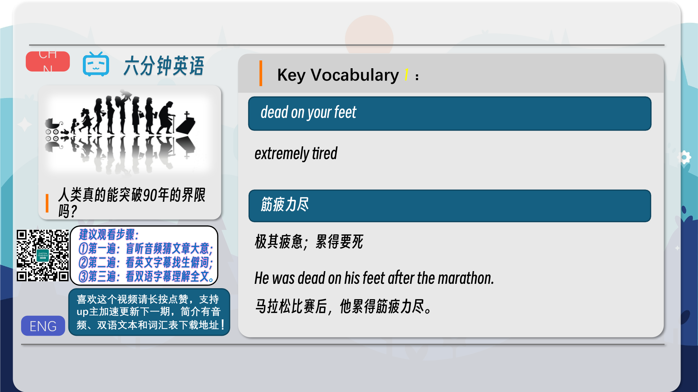
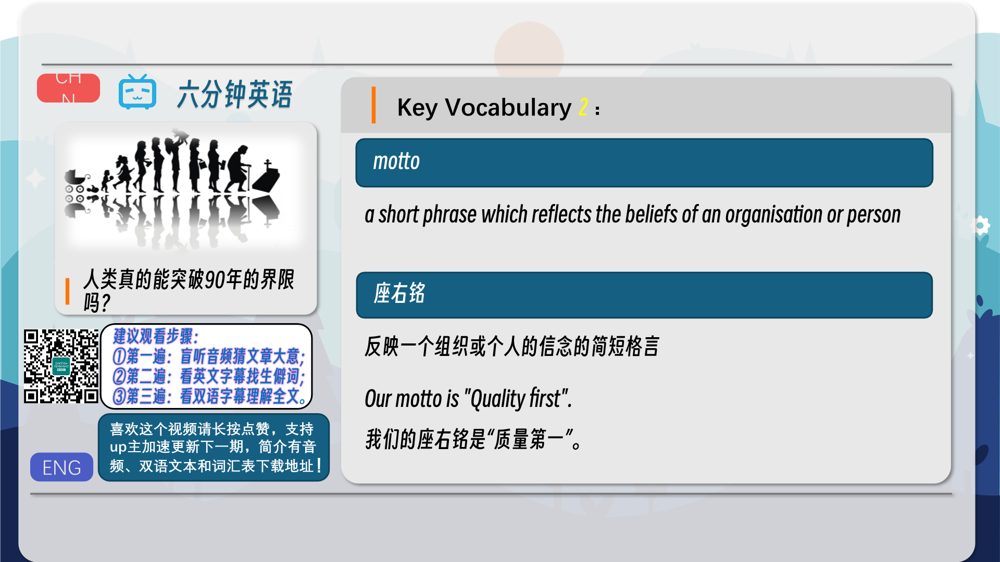
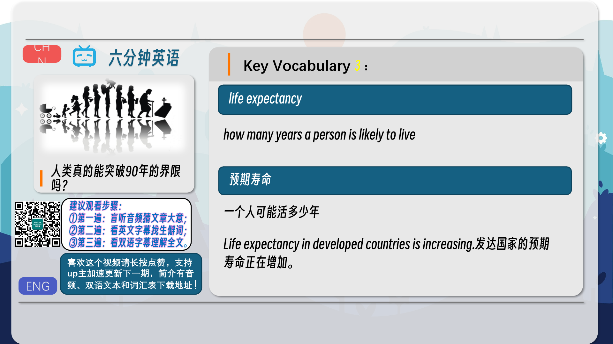
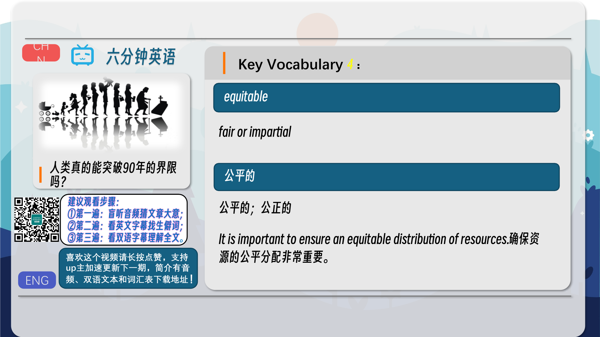
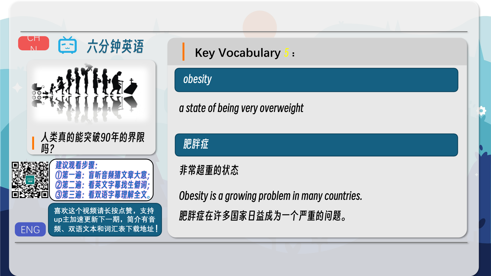

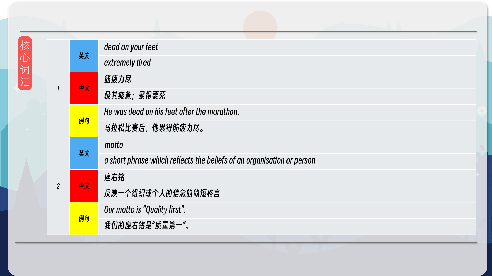
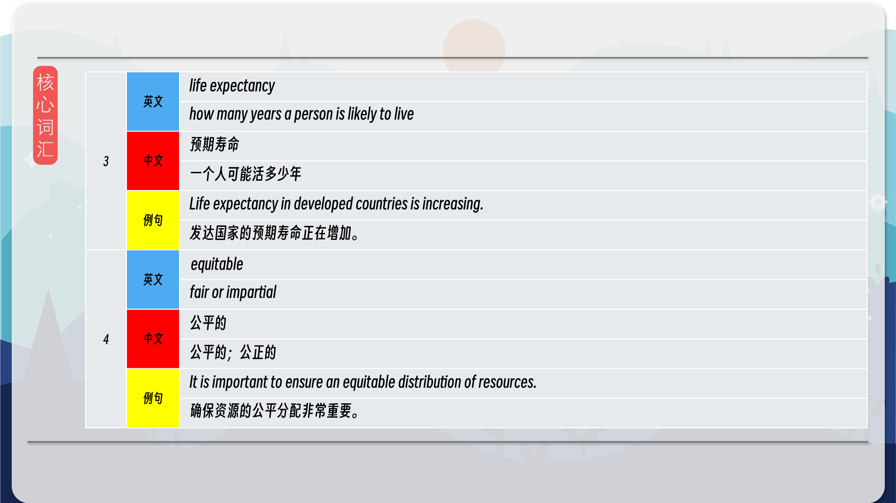
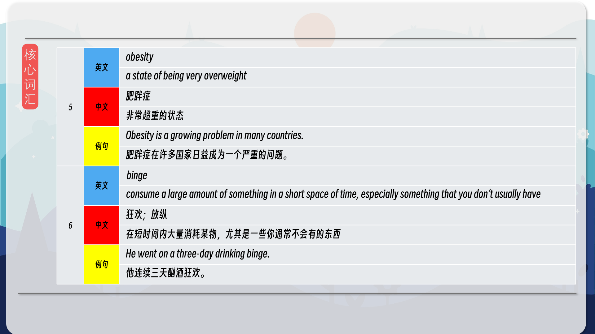
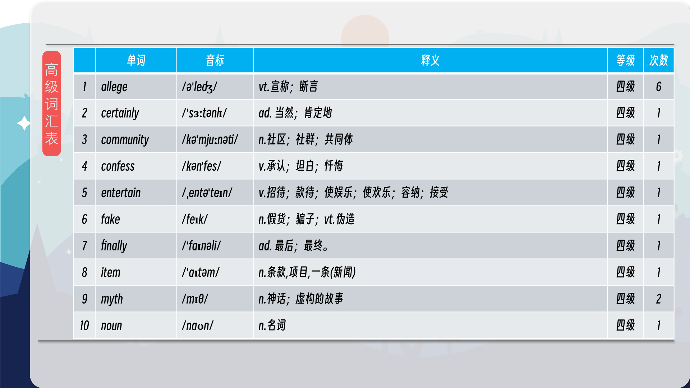
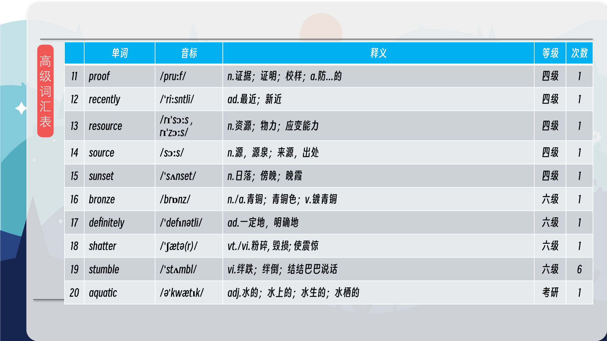
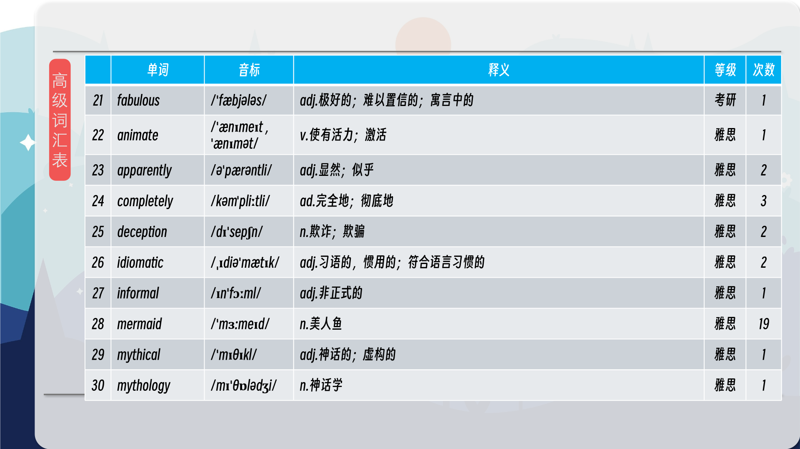
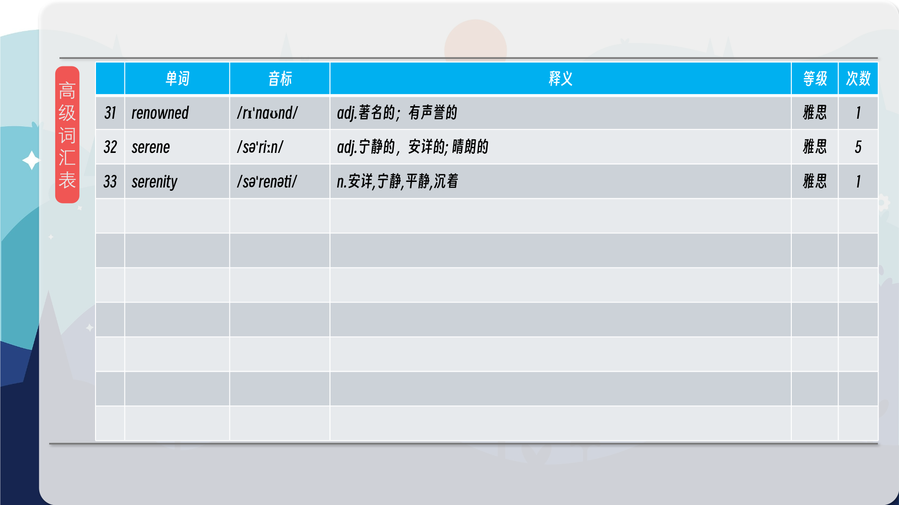

### 【核心词汇】
#### dead on your feet
extremely tired
筋疲力尽
极其疲惫；累得要死
He was dead on his feet after the marathon.
马拉松比赛后，他累得筋疲力尽。
#### motto
a short phrase which reflects the beliefs of an organisation or person
座右铭
反映一个组织或个人的信念的简短格言
Our motto is "Quality first".
我们的座右铭是“质量第一”。
#### life expectancy
how many years a person is likely to live
预期寿命
一个人可能活多少年
Life expectancy in developed countries is increasing.
发达国家的预期寿命正在增加。
#### equitable
fair or impartial
公平的
公平的；公正的
It is important to ensure an equitable distribution of resources.
确保资源的公平分配非常重要。
#### obesity
a state of being very overweight
肥胖症
非常超重的状态
Obesity is a growing problem in many countries.
肥胖症在许多国家日益成为一个严重的问题。
#### binge
consume a large amount of something in a short space of time, especially something that you don’t usually have
狂欢；放纵
在短时间内大量消耗某物，尤其是一些你通常不会有的东西
He went on a three-day drinking binge.
他连续三天酗酒狂欢。

在公众号里输入6位数字，获取【对话音频、英文文本、中文翻译、核心词汇和高级词汇表】电子档，6位数字【暗号】在文章的最后一张图片，如【220728】，表示22年7月28日这一期。公众号没有的文章说明还没有制作相关资料。年度合集在B站【六分钟英语】工房获取，每年共计300+文档，感谢支持！