### 【英文脚本】
Dan
Hello and welcome to 6 Minute English – the show that brings you an interesting topic, authentic listening practice and six items of incredibly useful vocabulary. I'm Dan…
 
Neil
And I'm Neil. In this programme we’ll be discussing the lovely topic of lunch – and what our lunch choices say about us. So, Dan, what are you doing for lunch today?
 
Dan
Ah Neil, are you asking me to join you? I’d love to, thanks. There’s this great little Vietnamese place we have to check out, right next to the office if you just…
 
Neil
Ah, actually – I was just asking to… open up today’s topic. Sorry. You see, I’ve brought a sandwich.
 
Dan
Oh, a sandwich. Again! How dull. Well, you’re not the only one – a survey from 2012 showed a third of Britons eat exactly the same thing for lunch – every day! And yes, it’s mostly sandwiches.
 
Neil
I had a curry yesterday.
 
Dan
Well, it’s almost lunchtime so we’d better get on with our question, which is: how long is the average lunch break in the UK? Is it:
 
a) An hour and a half
b) 45 minutes c) 25 minutes
 
Neil
Oh, I wish it was an hour and a half, but I’m pretty sure it must be c) 25 minutes
 
Dan
Well, we’ll find out if you’re right… just before lunch! All this talk of lunch is actually making me feel a bit peckish.
 
Neil
Peckish is a great word isn’t it – it’s a slang word for being a bit hungry. Feeling peckish, Dan?
 
Dan
I am now. Now, about you and your sandwiches Neil. Two slices of bread with filling might be the most popular British lunch choice, but it didn’t use to be that way. Listen to food writer Bee Wilson. Which adjective does she use to describe sandwiches?
 
Bee Wilson, Author
They were what you had in an emergency. They were what you had on a long train journey. It was a kind of makeshift lunch when you couldn’t get anything better.
 
Dan
So – sandwiches had humble origins as makeshift meals. Makeshift describes something temporary and low quality – a solution you create when you can’t do anything better.
 
Neil
I can’t help feel this is all getting a little personal, Dan.
 
Dan
There’s a sometimes very practical reason to eat a sandwich – like on a train. On a weekday in the office though, there’s no excuse.
 
Neil
If you worked as hard as I did, Dan – you’d only have time for a sandwich!
 
Dan
Which is just what Bee Wilson was saying – we treat lunchtime as if it were an emergency. It says something about our attitude to work and food in the UK. Next, let’s hear from philosopher Julian Baggini with his view on eating the same thing every day.
 
Neil
And let’s teach one more word first – utilitarian. It describes something practical and useful, rather than attractive.
 
Julian Baggini, Philosopher
What lunch says about us is that we’re still very much stuck in this kind of quite functional, you know, efficient, utilitarian attitude of how we should construct our daily lives; and that for all our embrace of this great food culture and everything, we haven’t managed to make that an everyday thing – it remains something for the special occasions.
 
Neil
So – he thinks we live in a world where we value being efficient – where we have a functional, utilitarian attitude to life.
 
Dan
Exactly, we’re aware of a great food culture, we embrace this culture – but only for special occasions.
 
Neil
Yes – let’s look at that word embrace. It normally means this… let me just…
 
Dan
Oh Neil, I didn’t know you cared. Neil just hugged me, wrapped his arms around me, embraced me.
 
Neil
Just as we can embrace physical things and people – we can also embrace ideas.
 
Dan
Here’s an idea I embrace, Neil. We should all embrace new foods. Broaden our horizons.
 
Neil
To broaden our horizons means ‘to open our minds and experience new things’.
 
Dan
Let me broaden your horizons right now. Experts from Cornell University say it leads to better team spirit if colleagues eat together.
 
Neil
OK, I get the picture. I should ditch my sandwich and eat with you. In the name of team spirit – that is – getting on well with team members – having a feeling of belonging.
 
Dan
Finally. Vietnamese?
 
Neil
Oh yes, but not before you tell me the answer to today’s question. How long do Brits take for lunch?
 
Dan
Well the answer was c) 25 minutes. That comes from a survey done by the BBC this year to find out about our modern dining habits.
 
Neil
25 minutes? It’s a crying shame, Dan. But before we have lunch ourselves, let’s run over the vocab one more time.
 
Dan
First up we had peckish. It means ‘hungry – just a little hungry’. I’m feeling rather peckish at the moment, you?
 
Neil
I think I’ve gone beyond peckish, Dan. Roll on lunch. Next?
 
Dan
We had makeshift – which describes a temporary or low quality solution. For example, last week my team’s goalkeeper was sick, so I had to replace him as a makeshift goalie.
 
Neil
Or, another example – when I was a student I used the steel bin in my room as a makeshift drum.
 
Dan
I’m sure the neighbours loved that. Now what about this word utilitarian? In the context we used it, it means ‘simple and functional, rather than beautiful’.
 
Neil
Do you think it would be fair to describe your polo shirt as utilitarian?
 
Dan
I prefer classic and timeless. Please.
 
Neil
But enough of all this banter. You know, I believe we should all just get along.
 
Dan
Oh, are you going to hug me again? To embrace me?
 
Neil
Not this time, let’s stick with the metaphorical meaning – ‘to accept a new belief or idea’.
 
Dan
For example, I wasn’t sure about the new website design, but now I fully embrace it.
 
Neil
Very nice. And I embrace your suggestion that colleagues should eat together.
 
Dan
It looks like you’ve broadened your horizons.
 
Neil
Well, when I taught English in Spain, Japan, Poland and the Czech Republic, it really broadened my horizons and taught me about new ways of life. How about you?
 
Dan
Yes, they say travel broadens the mind – it certainly broadened my horizons too.
 
Neil
Even better – why don’t we go travelling together – with the whole Learning English team?
 
Dan
Yeah! That would be wonderful for team spirit –the good feeling of being together. Maybe to Cambodia?
 
Neil
It certainly would. And that's the end of today's 6 Minute English. Please join us again soon, after our delicious lunch!
 
Dan
And we are on social media too. Make sure to visit our Facebook, Twitter, Instagram and YouTube pages.
 
Both
Bye!
 

### 【中英文双语脚本】
Dan(担)
Hello and welcome to 6 Minute English – the show that brings you an interesting topic, authentic listening practice and six items of incredibly useful vocabulary. I'm Dan…
您好，欢迎来到六分钟英语 - 该节目为您带来一个有趣的话题、真实的听力练习和六个非常有用的词汇。我是 Dan...

Neil(尼尔)
And I'm Neil. In this programme we’ll be discussing the lovely topic of lunch – and what our lunch choices say about us. So, Dan, what are you doing for lunch today?
我是 Neil。在这个节目中，我们将讨论午餐这个可爱的话题 —— 以及我们的午餐选择对我们的影响。那么，Dan，你今天午餐做什么？

Dan(担)
Ah Neil, are you asking me to join you? I’d love to, thanks. There’s this great little Vietnamese place we have to check out, right next to the office if you just…
啊，尼尔，你是要我加入你的吗？我很乐意，谢谢。我们得去看看这个很棒的越南小地方，如果你只是......

Neil(尼尔)
Ah, actually – I was just asking to… open up today’s topic. Sorry. You see, I’ve brought a sandwich.
啊，实际上 —— 我只是要求......打开今天的话题。不好意思。你看，我带了一个三明治。

Dan(担)
Oh, a sandwich. Again! How dull. Well, you’re not the only one – a survey from 2012 showed a third of Britons eat exactly the same thing for lunch – every day! And yes, it’s mostly sandwiches.
哦，一个三明治。再！多么沉闷。好吧，你不是唯一一个 —— 2012 年的一项调查显示，三分之一的英国人每天午餐都吃完全相同的东西 —— ！是的，主要是三明治。

Neil(尼尔)
I had a curry yesterday.
我昨天吃了咖喱。

Dan(担)
Well, it’s almost lunchtime so we’d better get on with our question, which is: how long is the average lunch break in the UK? Is it:
嗯，快到午餐时间了，所以我们最好继续我们的问题，即：英国的平均午休时间有多长？是吗：

a) An hour and a half(a）一个半小时)
b) 45 minutes c) 25 minutes
b） 45 分钟 c） 25 分钟

Neil(尼尔)
Oh, I wish it was an hour and a half, but I’m pretty sure it must be c) 25 minutes
哦，我希望这是一个半小时，但我很确定它一定是 c） 25 分钟

Dan(担)
Well, we’ll find out if you’re right… just before lunch! All this talk of lunch is actually making me feel a bit peckish.
好吧，我们会找出你是对的吗......就在午餐前！所有这些关于午餐的讨论实际上让我感到有点饿。

Neil(尼尔)
Peckish is a great word isn’t it – it’s a slang word for being a bit hungry. Feeling peckish, Dan?
Peckish 是个很棒的词，不是吗 —— 这是一个俚语，意思是有点饿。感觉饿了，丹？

Dan(担)
I am now. Now, about you and your sandwiches Neil. Two slices of bread with filling might be the most popular British lunch choice, but it didn’t use to be that way. Listen to food writer Bee Wilson. Which adjective does she use to describe sandwiches?
我现在是。现在，关于你和你的三明治 Neil。两片带馅面包可能是最受欢迎的英国午餐选择，但以前不是这样。听美食作家 Bee Wilson 的话。她用哪个形容词来形容三明治？

Bee Wilson, Author(BeeWilson，作者)
They were what you had in an emergency. They were what you had on a long train journey. It was a kind of makeshift lunch when you couldn’t get anything better.
他们是你在紧急情况下所拥有的。它们是你在长途火车旅行中所拥有的。这是一种临时午餐，当你找不到更好的东西时。

Dan(担)
So – sandwiches had humble origins as makeshift meals. Makeshift describes something temporary and low quality – a solution you create when you can’t do anything better.
所以 —— 三明治起源不起眼，是临时餐点。Makeshift 描述了一些临时的、低质量的东西 —— 当你无法做得更好时，你创建的解决方案。

Neil(尼尔)
I can’t help feel this is all getting a little personal, Dan.
我不禁觉得这一切都变得有点个人化了，丹。

Dan(担)
There’s a sometimes very practical reason to eat a sandwich – like on a train. On a weekday in the office though, there’s no excuse.
吃三明治有时有一个非常实际的理由 —— 就像在火车上一样。不过，在工作日在办公室里，没有任何借口。

Neil(尼尔)
If you worked as hard as I did, Dan – you’d only have time for a sandwich!
如果你像我一样努力工作，丹 —— 你只有时间吃个三明治了！

Dan(担)
Which is just what Bee Wilson was saying – we treat lunchtime as if it were an emergency. It says something about our attitude to work and food in the UK. Next, let’s hear from philosopher Julian Baggini with his view on eating the same thing every day.
这正是 Bee Wilson 所说的 —— 我们将午餐时间视为紧急情况。它说明了我们在英国对工作和食物的态度。接下来，让我们听听哲学家 Julian Baggini 对每天吃同样的东西的看法。

Neil(尼尔)
And let’s teach one more word first – utilitarian. It describes something practical and useful, rather than attractive.
让我们先再教一个词 – 功利主义。它描述的是实用和有用的东西，而不是有吸引力的东西。

Julian Baggini, Philosopher(朱利安·巴吉尼，哲学家)
What lunch says about us is that we’re still very much stuck in this kind of quite functional, you know, efficient, utilitarian attitude of how we should construct our daily lives; and that for all our embrace of this great food culture and everything, we haven’t managed to make that an everyday thing – it remains something for the special occasions.
午餐告诉我们的是，我们仍然非常受困于这种相当实用、高效、功利的态度，我们应该如何构建我们的日常生活；尽管我们拥抱这种伟大的饮食文化和一切，但我们并没有设法让它成为日常 —— 它仍然是特殊场合的事情。

Neil(尼尔)
So – he thinks we live in a world where we value being efficient – where we have a functional, utilitarian attitude to life.
所以 – 他认为我们生活在一个重视效率的世界 – 我们对生活有一种功能性的、功利主义的态度。

Dan(担)
Exactly, we’re aware of a great food culture, we embrace this culture – but only for special occasions.
没错，我们知道一种伟大的饮食文化，我们接受这种文化 —— 但仅限于特殊场合。

Neil(尼尔)
Yes – let’s look at that word embrace. It normally means this… let me just…
是的 - 让我们看看 embrace 这个词。通常的意思是这个...让我就......

Dan(担)
Oh Neil, I didn’t know you cared. Neil just hugged me, wrapped his arms around me, embraced me.
哦，尼尔，我不知道你在乎。尼尔只是拥抱我，搂着我，拥抱我。

Neil(尼尔)
Just as we can embrace physical things and people – we can also embrace ideas.
正如我们可以拥抱有形的事物和人一样，我们也可以拥抱想法。

Dan(担)
Here’s an idea I embrace, Neil. We should all embrace new foods. Broaden our horizons.
Neil 先生，我赞同这个想法。我们都应该接受新食物。拓宽我们的视野。

Neil(尼尔)
To broaden our horizons means ‘to open our minds and experience new things’.
To broading our sight 的意思是“打开我们的思维并体验新事物”。

Dan(担)
Let me broaden your horizons right now. Experts from Cornell University say it leads to better team spirit if colleagues eat together.
现在让我拓宽你们的视野。康奈尔大学的专家表示，如果同事们一起吃饭，会带来更好的团队精神。

Neil(尼尔)
OK, I get the picture. I should ditch my sandwich and eat with you. In the name of team spirit – that is – getting on well with team members – having a feeling of belonging.
好的，我明白了。我应该扔掉我的三明治，和你一起吃饭。以团队精神的名义 – 也就是说 – 与团队成员相处融洽 – 有归属感。

Dan(担)
Finally. Vietnamese?
最后。越南语？

Neil(尼尔)
Oh yes, but not before you tell me the answer to today’s question. How long do Brits take for lunch?
哦，是的，但在你告诉我今天问题的答案之前。英国人的午餐需要多长时间？

Dan(担)
Well the answer was c) 25 minutes. That comes from a survey done by the BBC this year to find out about our modern dining habits.
嗯，答案是 c） 25 分钟。这来自 BBC 今年进行的一项调查，旨在了解我们的现代用餐习惯。

Neil(尼尔)
25 minutes? It’s a crying shame, Dan. But before we have lunch ourselves, let’s run over the vocab one more time.
25 分钟？真是太可惜了，丹。但在我们自己吃午饭之前，让我们再来一遍这个词汇。

Dan(担)
First up we had peckish. It means ‘hungry – just a little hungry’. I’m feeling rather peckish at the moment, you?
首先，我们饿了。它的意思是 “饿 – 只是有点饿”。我现在感觉有点饿，你？

Neil(尼尔)
I think I’ve gone beyond peckish, Dan. Roll on lunch. Next?
我想我已经超越了饥饿，丹。午餐时滚动。下一个？

Dan(担)
We had makeshift – which describes a temporary or low quality solution. For example, last week my team’s goalkeeper was sick, so I had to replace him as a makeshift goalie.
我们有 makeshift – 它描述了一个临时或低质量的解决方案。例如，上周我们球队的守门员生病了，所以我不得不把他换成临时守门员。

Neil(尼尔)
Or, another example – when I was a student I used the steel bin in my room as a makeshift drum.
或者，另一个例子 - 当我还是学生时，我用房间里的钢桶作为临时鼓。

Dan(担)
I’m sure the neighbours loved that. Now what about this word utilitarian? In the context we used it, it means ‘simple and functional, rather than beautiful’.
我相信邻居们都喜欢这样。那么，功利主义这个词呢？在我们使用它的上下文中，它的意思是“简单而实用，而不是美丽”。

Neil(尼尔)
Do you think it would be fair to describe your polo shirt as utilitarian?
你认为用实用主义来形容你的 Polo 衫是公平的吗？

Dan(担)
I prefer classic and timeless. Please.
我更喜欢经典和永恒。请。

Neil(尼尔)
But enough of all this banter. You know, I believe we should all just get along.
但这些玩笑已经够了。你知道的，我相信我们都应该和睦相处。

Dan(担)
Oh, are you going to hug me again? To embrace me?
哦，你又要拥抱我吗？拥抱我？

Neil(尼尔)
Not this time, let’s stick with the metaphorical meaning – ‘to accept a new belief or idea’.
不是这一次，让我们坚持隐喻的含义 —— “接受一个新的信念或想法”。

Dan(担)
For example, I wasn’t sure about the new website design, but now I fully embrace it.
例如，我对新网站设计不确定，但现在我完全接受了它。

Neil(尼尔)
Very nice. And I embrace your suggestion that colleagues should eat together.
很好。我接受您的建议，即同事们应该一起吃饭。

Dan(担)
It looks like you’ve broadened your horizons.
看起来你开阔了视野。

Neil(尼尔)
Well, when I taught English in Spain, Japan, Poland and the Czech Republic, it really broadened my horizons and taught me about new ways of life. How about you?
当我在西班牙、日本、波兰和捷克共和国教英语时，它真的拓宽了我的视野，教会了我新的生活方式。你怎么样？

Dan(担)
Yes, they say travel broadens the mind – it certainly broadened my horizons too.
是的，他们说旅行可以开阔我的视野 —— 它当然也开阔了我的视野。

Neil(尼尔)
Even better – why don’t we go travelling together – with the whole Learning English team?
更棒的是 - 我们为什么不一起去旅行 - 与整个 Learning English 团队一起旅行呢？

Dan(担)
Yeah! That would be wonderful for team spirit –the good feeling of being together. Maybe to Cambodia?
是的！这对团队精神来说真是太棒了 —— 在一起的感觉很好。也许去柬埔寨？

Neil(尼尔)
It certainly would. And that's the end of today's 6 Minute English. Please join us again soon, after our delicious lunch!
肯定会的。这就是今天的六分钟 English 的结尾。在我们美味的午餐后，请很快再次加入我们！

Dan(担)
And we are on social media too. Make sure to visit our Facebook, Twitter, Instagram and YouTube pages.
我们也在社交媒体上。请务必访问我们的 Facebook、Twitter、Instagram 和 YouTube 页面。

Both(双)
Bye!
再见！

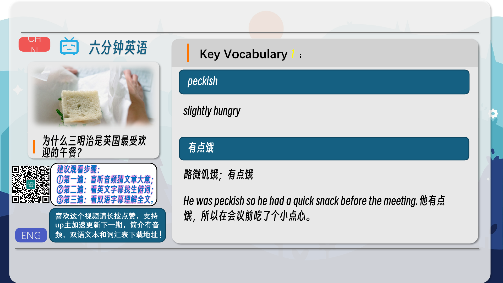
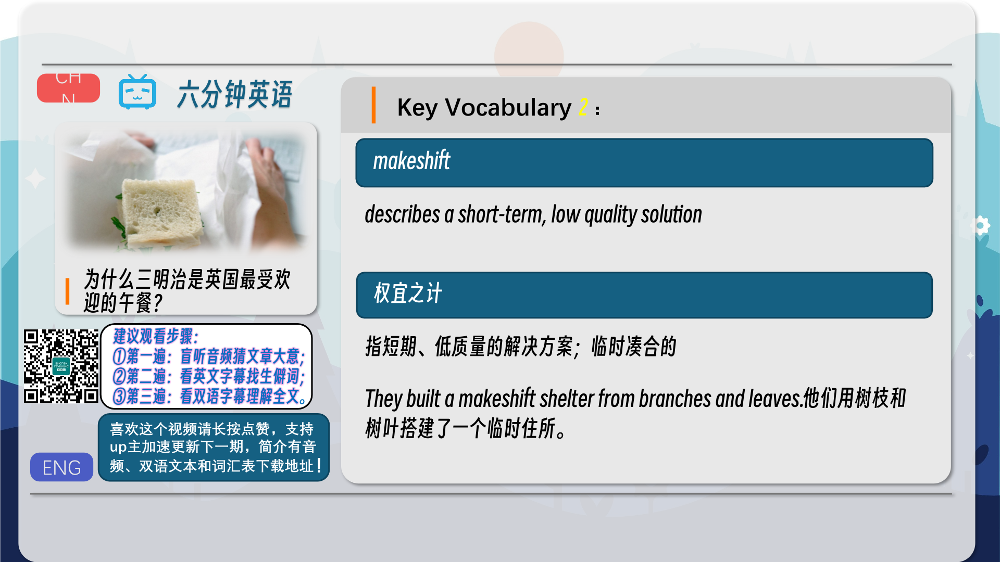
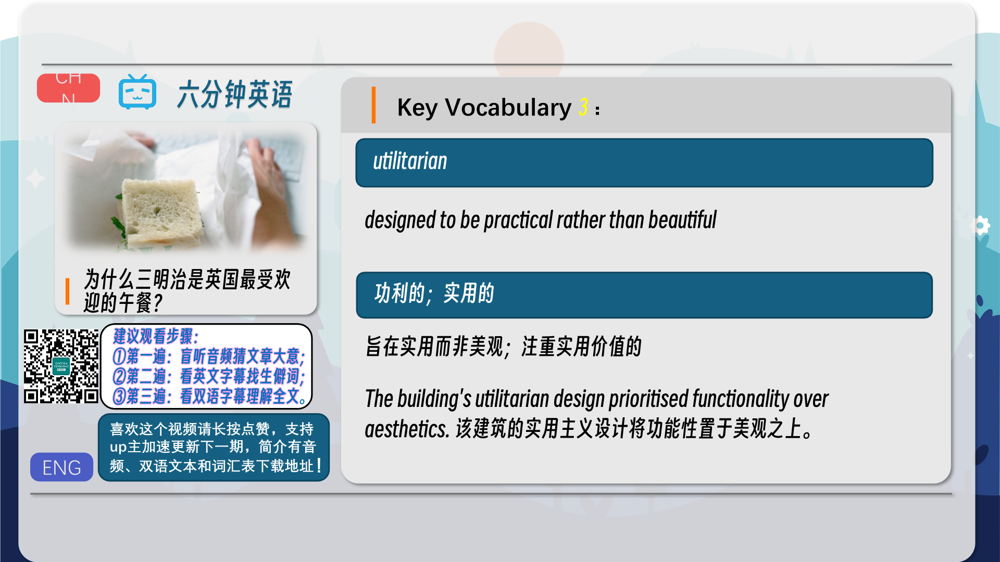
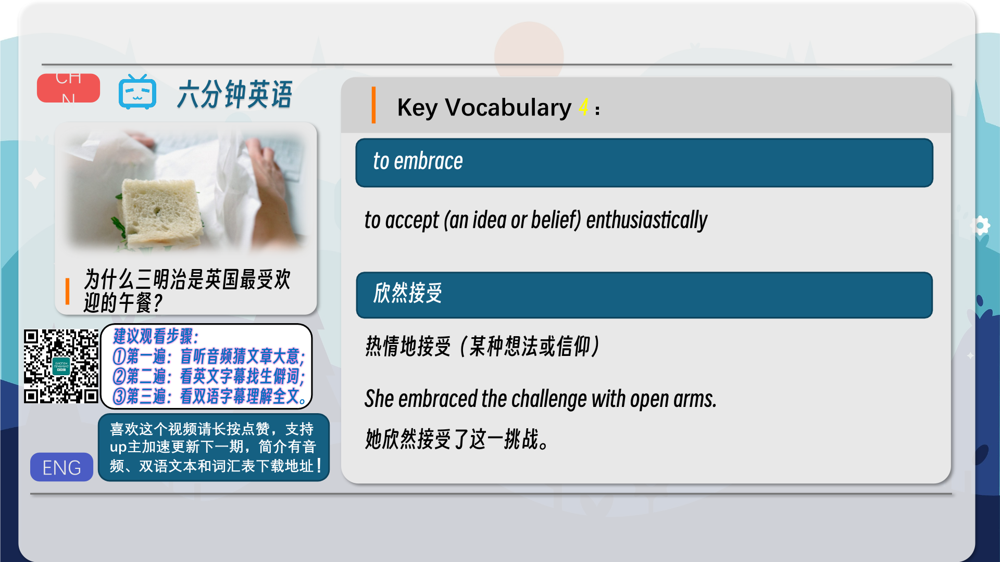
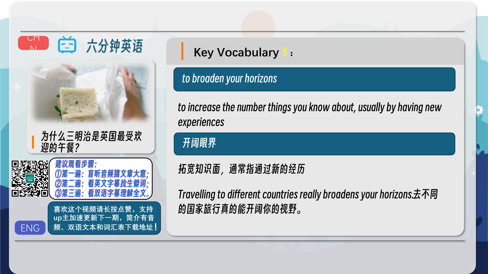
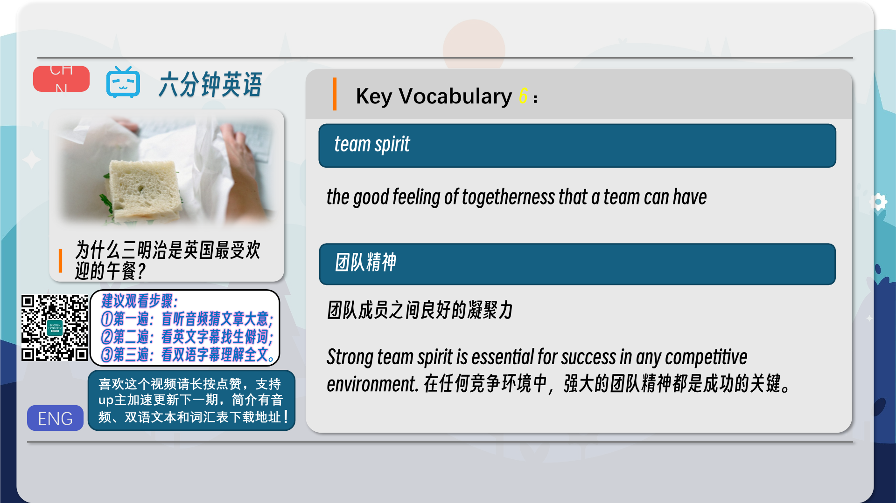
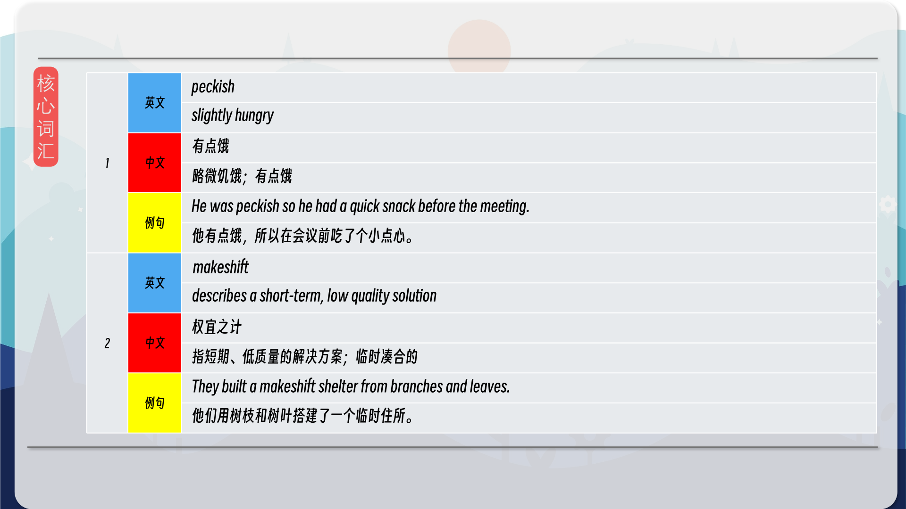
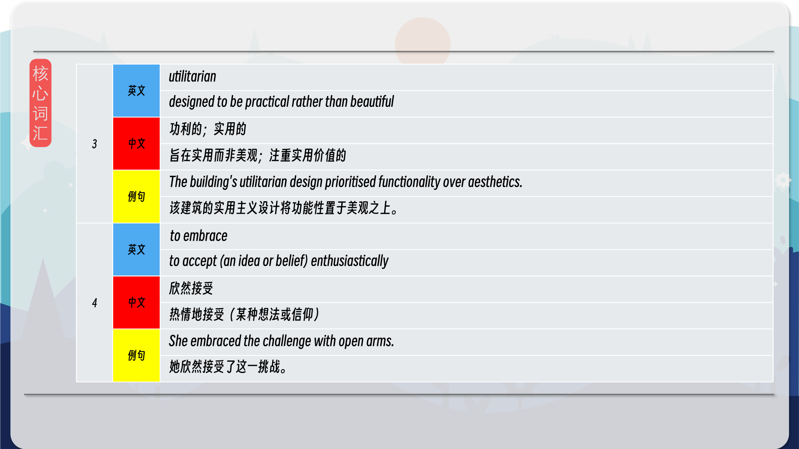
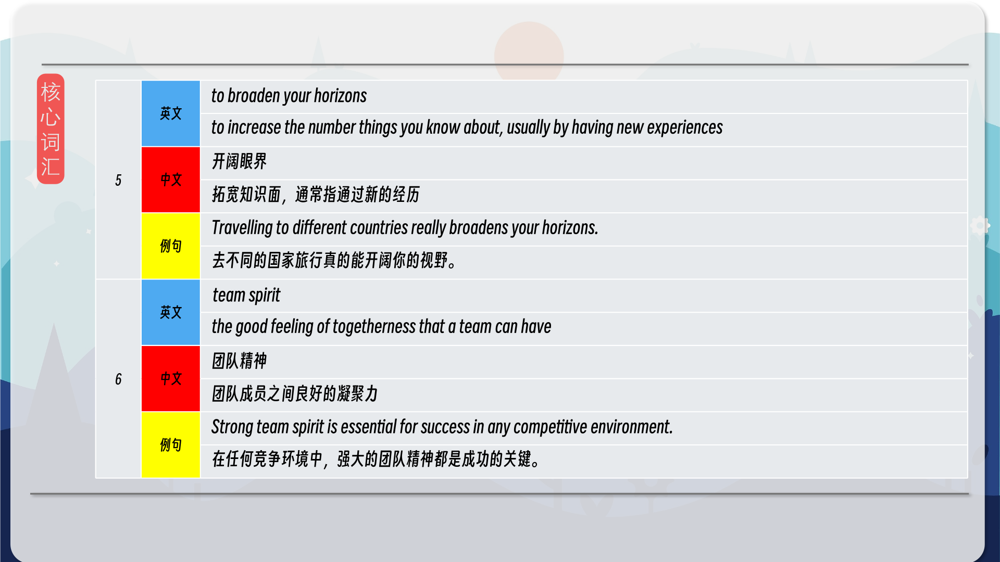
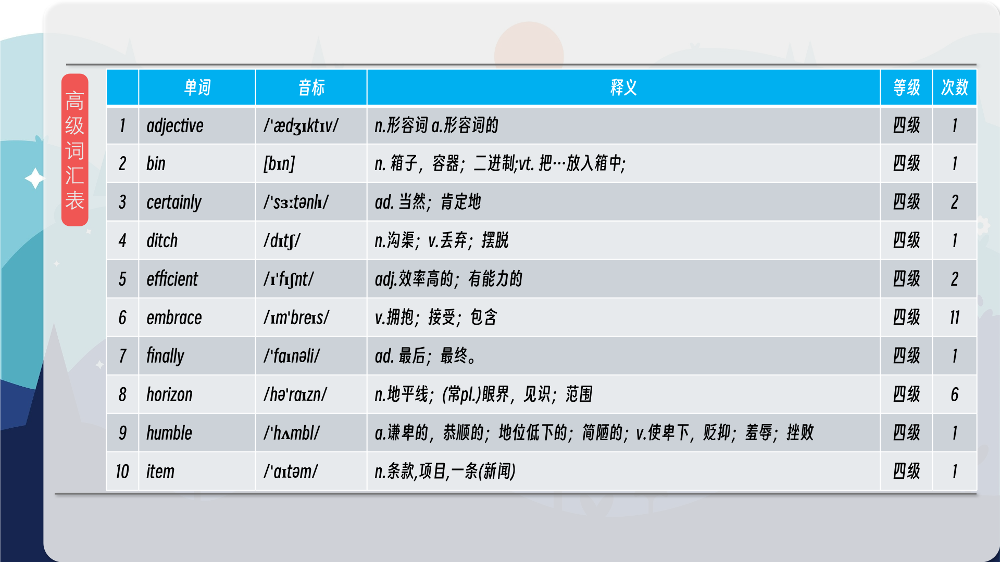
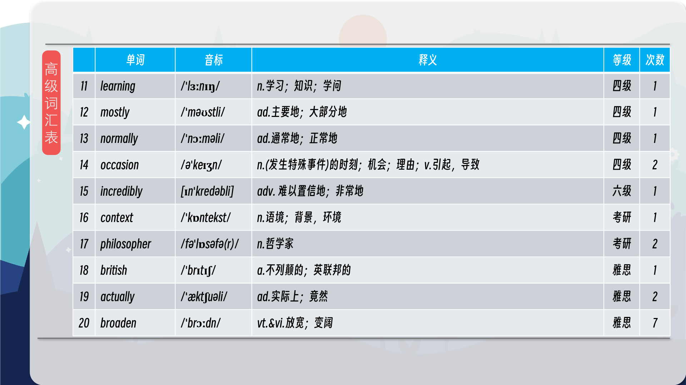
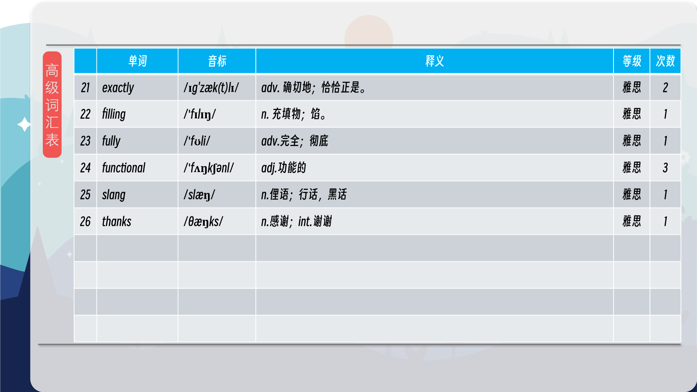

### 【核心词汇】
#### peckish
slightly hungry
有点饿
略微饥饿；有点饿
He was peckish so he had a quick snack before the meeting.
他有点饿，所以在会议前吃了个小点心。
#### makeshift
describes a short-term, low quality solution
权宜之计
指短期、低质量的解决方案；临时凑合的
They built a makeshift shelter from branches and leaves.
他们用树枝和树叶搭建了一个临时住所。
#### utilitarian
designed to be practical rather than beautiful
功利的；实用的
旨在实用而非美观；注重实用价值的
The building's utilitarian design prioritised functionality over aesthetics.
该建筑的实用主义设计将功能性置于美观之上。
#### to embrace
to accept (an idea or belief) enthusiastically
欣然接受
热情地接受（某种想法或信仰）
She embraced the challenge with open arms.
她欣然接受了这一挑战。
#### to broaden your horizons
to increase the number things you know about, usually by having new experiences
开阔眼界
拓宽知识面，通常指通过新的经历
Travelling to different countries really broadens your horizons.
去不同的国家旅行真的能开阔你的视野。
#### team spirit
the good feeling of togetherness that a team can have
团队精神
团队成员之间良好的凝聚力
Strong team spirit is essential for success in any competitive environment.
在任何竞争环境中，强大的团队精神都是成功的关键。

在公众号里输入6位数字，获取【对话音频、英文文本、中文翻译、核心词汇和高级词汇表】电子档，6位数字【暗号】在文章的最后一张图片，如【220728】，表示22年7月28日这一期。公众号没有的文章说明还没有制作相关资料。年度合集在B站【六分钟英语】工房获取，每年共计300+文档，感谢支持！