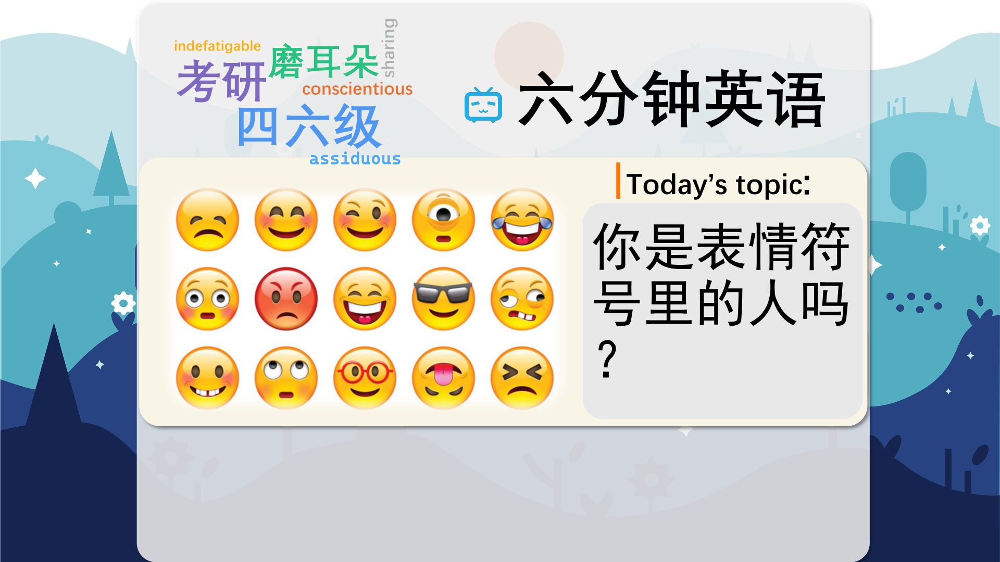

### 【英文脚本】
Dan
Hello and welcome to 6 Minute English – the show that brings you an interesting topic, authentic listening practice and six new items of vocabulary. I'm Dan…
 
Neil
And I'm Neil. We’ll be discussing the rise of those little graphics we call emojis and emoticons.
 
Dan
You know, I think emojis are a vital tool for communication. And actually, they’re not that new, either.
 
Neil
Oh really?
 
Dan
Well, that’s the perfect opportunity to ask this week’s question. When was the first emoticon used? Was it? a) 1606 b) 1862 c) 1982
 
Neil
It must be 1982. I’ll go with c).
 
Dan
We’ll find out if you’re right or wrong later in the programme.
 
Neil
You know, I think we should clear one thing up before we go any further: what’s the difference between an emoticon and an emoji?
 
Dan
Good point. Emoticons came first. They’re the images made using normal keys on a keyboard – usually punctuation, letters and numbers. For example a colon – two dots - followed by the curved line of a close brackets is a…
 
Neil
A smiley face. Something you use in way too many of your emails!
 
Dan
Well, thanks! Whereas an emoji is something completely different. It’s an actual image. It could be a simple, yellow, smiley face; or something like a dancing lady; or even a bowl of noodles…
 
Neil
Ah yes, all those little images we have in our phones. But you’ll have to convince me – why do people use them so much?
 
Dan
Well, let’s listen to Professor Vyv Evans. He wrote a book called The Emoji Code:
 
Professor Vyv Evans, Author of ‘The Emoji Code’
They enable us to express emotion and empathy in digital communication. Increasingly, what we’re finding is that digital communication is taking over from certain aspects of face- to-face interaction. In the UK today, for example, adults spend 22 hours online on average each week. One of the reasons emojis are so interesting is that they really do enable us to express our emotional selves much more effectively.
 
Neil
Ok so he used a very useful word - empathy. It means ‘the ability to show you understand someone else’s feelings’. Ok – tell me more Dan.
 
Dan
Yes – adding an emoticon can show you understand and express emotion, and show empathy – more clearly. In digital communication we lack the visual signals we have in face-to-face interaction – as he says.
 
Neil
Interaction, meaning ‘when people or things communicate with each other’. We can also interact with things like machines, computers and social media.
 
Dan
Yes, Professor Evans says 60% of information when we’re talking to each other comes from non-verbal cues.
 
Neil
Wow, that’s a lot. A cue is a signal that you need to do something.
 
Dan
For example, an actor goes on stage after their cue.
 
Neil
And non-verbal means ‘without using spoken language’. So, here in the studio there are lots of other non-verbal signals about how we’re feeling - non-verbal cues. For example my facial expression, my body language, the look in my eyes, Dan
 
Dan
There’s a glint of rage in there somewhere, Neil. Ok, so let’s apply this to digital communication. Imagine I sent you a text saying I hit my finger with a hammer – how would you respond?
 
Neil
Well, it depends. Did you hurt yourself badly?
 
Dan
If I followed it with a sad face emoji, then…?
 
Neil
Then I guess I’d know you hurt yourself. Poor you.
 
Dan
But if I followed it with a laughing emoji – the one with the tears coming out because I’m laughing so much?
 
Neil
Then I’d probably reply saying how stupid and clumsy you are!
 
Dan
Exactly – without adding the emoji – it’s hard to know my emotional state. The emoji is the non-verbal cue – like my facial expression.
 
Neil
By the way, is there an emoji meaning clumsy? Clumsy, means ‘physically awkward’ – someone who’s clumsy falls over a lot and drops things. Anyway, you were saying emoticons aren’t as new as I think?
 
Dan
Yes, I asked when they were invented. Is it a)1606, b)1862 or c)1982?
 
Neil
I said 1982.
 
Dan
Well, in fact, a witty speech Abraham Lincoln reprinted in a newspaper as far back as 1862 included a semi colon with a close brackets.
 
Neil
Like a winking face?
 
Dan
Exactly. Though people think this was sadly just a typographical error – or what we normally call a typo.
 
Neil
A typo – a spelling mistake made when typing too fast or carelessly.
 
Dan
The official birth of emoticons is usually given as 1982, when a US professor instructed his students to use smiley faces to indicate jokes - in digital a communication.
 
Neil
Wow, so they’re over 30 years old. Maybe I should start using them. Let’s round up with another look at today’s words.
 
Dan
Sure. The first word we had was empathy. Do you have a lot of empathy, Neil?
 
Neil
Yes, I think I’m quite good at understanding other people’s feelings. My friends tell me that, anyway! It’s important to empathise with your colleagues too.
 
Dan
That’s not what I saw in your eyes! Yes, empathy is an important part of all human interaction.
 
Neil
Nicely done. If two people interact, it means they ‘communicate with each other and react to each other’. It’s a pretty broad term.
 
Dan
We could also talk about how the way children interact with the internet.
 
Neil
Way too much! Next up, we had non-verbal, meaning ‘without spoken language’. When I first travelled to Poland, I used a lot of non-verbal communication to get my message across. Hand movements, counting with fingers, things like that. Next word, Dan?
 
Dan
Next word… that is my cue to say the next word – which is in fact – cue. A cue is a signal to do something. A commander could give his officer a cue to attack. Or I could give you a cue to… sing a song?
 
Neil
No thanks. I’ll stick with defining words, thank you. Like clumsy – meaning ‘physically awkward’. I’d have to say Dan, you’re a sporty guy, a talented footballer - you’re not clumsy at all.
 
Dan
That’s what I thought until I broke my leg – after a clumsy opponent ran into me…
 
Neil
Ouch. Finally – we had type. No hang on, that’s not right. It should say typo. A typo is a mistake in a written document, or a digital file or message.
 
Dan
Always check your scripts for typos before reading them, Neil. And, that's the end of today's 6 Minute English. Please join us again soon!
 
Neil
And we are on social media too - Facebook, Twitter, Instagram and YouTube. See you there.
 
Both
Bye!
 

### 【中英文双语脚本】
Dan(担)
Hello and welcome to 6 Minute English – the show that brings you an interesting topic, authentic listening practice and six new items of vocabulary. I'm Dan…
您好，欢迎来到六分钟英语 – 该节目为您带来一个有趣的话题、真实的听力练习和六个新词汇。我是 Dan...

Neil(尼尔)
And I'm Neil. We’ll be discussing the rise of those little graphics we call emojis and emoticons.
我是 Neil。我们将讨论那些我们称之为表情符号和表情符号的小图形的兴起。

Dan(担)
You know, I think emojis are a vital tool for communication. And actually, they’re not that new, either.
你知道，我认为表情符号是交流的重要工具。实际上，它们也不是那么新鲜。

Neil(尼尔)
Oh really?
真的？

Dan(担)
Well, that’s the perfect opportunity to ask this week’s question. When was the first emoticon used? Was it? a) 1606 b) 1862 c) 1982
嗯，这是提出本周问题的绝佳机会。第一个表情符号是什么时候使用的？是吗？a） 1606 b） 1862 c） 1982

Neil(尼尔)
It must be 1982. I’ll go with c).
那一定是 1982 年。我选择 c）。

Dan(担)
We’ll find out if you’re right or wrong later in the programme.
我们将在稍后的计划中找出您的判断是对还是错。

Neil(尼尔)
You know, I think we should clear one thing up before we go any further: what’s the difference between an emoticon and an emoji?
你知道，我认为在我们进一步讨论之前，我们应该澄清一件事：表情符号和表情符号有什么区别？

Dan(担)
Good point. Emoticons came first. They’re the images made using normal keys on a keyboard – usually punctuation, letters and numbers. For example a colon – two dots - followed by the curved line of a close brackets is a…
说得好。表情符号是第一位的。它们是使用键盘上的普通键制作的图像 - 通常是标点符号、字母和数字。例如，冒号 - 两个点 - 后跟右括号的曲线是...

Neil(尼尔)
A smiley face. Something you use in way too many of your emails!
一张笑脸。你在太多的电子邮件中使用的东西！

Dan(担)
Well, thanks! Whereas an emoji is something completely different. It’s an actual image. It could be a simple, yellow, smiley face; or something like a dancing lady; or even a bowl of noodles…
嗯，谢谢！而表情符号是完全不同的东西。这是一个真实的图像。它可以是一张简单的黄色笑脸；或者像跳舞的女士一样的东西；甚至是一碗面条......

Neil(尼尔)
Ah yes, all those little images we have in our phones. But you’ll have to convince me – why do people use them so much?
啊，是的，我们手机里的所有那些小图片。但你得说服我 —— 为什么人们这么频繁地使用它们？

Dan(担)
Well, let’s listen to Professor Vyv Evans. He wrote a book called The Emoji Code:
好吧，让我们听听 Vyv Evans 教授的话。他写了一本书，叫《表情符号代码》（The Emoji Code）：

Professor Vyv Evans, Author of ‘The Emoji Code’(VyvEvans教授，《TheEmojiCode》的作者)
They enable us to express emotion and empathy in digital communication. Increasingly, what we’re finding is that digital communication is taking over from certain aspects of face- to-face interaction. In the UK today, for example, adults spend 22 hours online on average each week. One of the reasons emojis are so interesting is that they really do enable us to express our emotional selves much more effectively.
它们使我们能够在数字通信中表达情感和同理心。我们越来越多地发现，数字通信正在取代面对面互动的某些方面。例如，在今天的英国，成年人平均每周花 22 小时上网。表情符号如此有趣的原因之一是它们确实使我们能够更有效地表达我们的情感自我。

Neil(尼尔)
Ok so he used a very useful word - empathy. It means ‘the ability to show you understand someone else’s feelings’. Ok – tell me more Dan.
好的，所以他用了一个非常有用的词 —— 同理心。它的意思是“表明你理解别人的感受的能力”。好的 - 告诉我更多 Dan。

Dan(担)
Yes – adding an emoticon can show you understand and express emotion, and show empathy – more clearly. In digital communication we lack the visual signals we have in face-to-face interaction – as he says.
是的 - 添加表情符号可以更清楚地表明你理解和表达情感，并表现出同理心。正如他所说，在数字通信中，我们缺乏面对面互动中的视觉信号。

Neil(尼尔)
Interaction, meaning ‘when people or things communicate with each other’. We can also interact with things like machines, computers and social media.
交互，意思是“当人或事物相互交流时”。我们还可以与机器、计算机和社交媒体等事物进行交互。

Dan(担)
Yes, Professor Evans says 60% of information when we’re talking to each other comes from non-verbal cues.
是的，埃文斯教授说，当我们相互交谈时，60% 的信息来自非语言线索。

Neil(尼尔)
Wow, that’s a lot. A cue is a signal that you need to do something.
哇，好多。提示是您需要做某事的信号。

Dan(担)
For example, an actor goes on stage after their cue.
例如，演员在提示后上台。

Neil(尼尔)
And non-verbal means ‘without using spoken language’. So, here in the studio there are lots of other non-verbal signals about how we’re feeling - non-verbal cues. For example my facial expression, my body language, the look in my eyes, Dan
非语言的意思是“不使用口语”。所以，在录音室里，还有许多其他关于我们感受的非语言信号 —— 非语言暗示。例如我的面部表情、我的肢体语言、我的眼神、Dan

Dan(担)
There’s a glint of rage in there somewhere, Neil. Ok, so let’s apply this to digital communication. Imagine I sent you a text saying I hit my finger with a hammer – how would you respond?
那里有一丝愤怒，Neil。好的，让我们将其应用于数字通信。想象一下，我给你发了一条短信，说我用锤子敲打了我的手指 —— 你会怎么回应？

Neil(尼尔)
Well, it depends. Did you hurt yourself badly?
嗯，这要看情况。你伤得很重吗？

Dan(担)
If I followed it with a sad face emoji, then…?
如果我跟着一个悲伤的表情符号，那么......？

Neil(尼尔)
Then I guess I’d know you hurt yourself. Poor you.
那我就知道你伤到了自己。可怜的你。

Dan(担)
But if I followed it with a laughing emoji – the one with the tears coming out because I’m laughing so much?
但是，如果我跟着一个大笑的表情符号 —— 那个因为我笑得太多而流泪的表情符号呢？

Neil(尼尔)
Then I’d probably reply saying how stupid and clumsy you are!
那我可能会回答说你多么愚蠢和笨拙！

Dan(担)
Exactly – without adding the emoji – it’s hard to know my emotional state. The emoji is the non-verbal cue – like my facial expression.
确切地说 - 如果不添加表情符号 - 很难知道我的情绪状态。表情符号是非语言暗示 —— 就像我的面部表情一样。

Neil(尼尔)
By the way, is there an emoji meaning clumsy? Clumsy, means ‘physically awkward’ – someone who’s clumsy falls over a lot and drops things. Anyway, you were saying emoticons aren’t as new as I think?
顺便说一句，有没有表示笨拙的表情符号？笨拙，意思是“身体笨拙” —— 笨拙的人经常摔倒并掉落东西。不管怎样，你是说表情符号并不像我想象的那么新吗？

Dan(担)
Yes, I asked when they were invented. Is it a)1606, b)1862 or c)1982?
是的，我问它们是什么时候发明的。是 a）1606、b）1862 还是 c）1982？

Neil(尼尔)
I said 1982.
我说的是 1982 年。

Dan(担)
Well, in fact, a witty speech Abraham Lincoln reprinted in a newspaper as far back as 1862 included a semi colon with a close brackets.
嗯，事实上，早在 1862 年，亚伯拉罕·林肯 （Abraham Lincoln） 就在报纸上转载了一篇诙谐的演讲，其中包括一个带有右括号的分号。

Neil(尼尔)
Like a winking face?
喜欢眨眼的脸？

Dan(担)
Exactly. Though people think this was sadly just a typographical error – or what we normally call a typo.
完全。尽管人们认为这很遗憾只是一个印刷错误 —— 或者我们通常所说的拼写错误。

Neil(尼尔)
A typo – a spelling mistake made when typing too fast or carelessly.
拼写错误 – 键入速度过快或不小心时出现的拼写错误。

Dan(担)
The official birth of emoticons is usually given as 1982, when a US professor instructed his students to use smiley faces to indicate jokes - in digital a communication.
表情符号的正式诞生通常是在 1982 年，当时一位美国教授指导他的学生使用笑脸来表示笑话 - 在数字交流中。

Neil(尼尔)
Wow, so they’re over 30 years old. Maybe I should start using them. Let’s round up with another look at today’s words.
哇，他们都超过 30 岁了。也许我应该开始使用它们。让我们再来看看今天的文字。

Dan(担)
Sure. The first word we had was empathy. Do you have a lot of empathy, Neil?
确定。我们得到的第一个词是同理心。尼尔，你有很多同理心吗？

Neil(尼尔)
Yes, I think I’m quite good at understanding other people’s feelings. My friends tell me that, anyway! It’s important to empathise with your colleagues too.
是的，我觉得我很擅长理解别人的感受。无论如何，我的朋友都告诉我！同情你的同事也很重要。

Dan(担)
That’s not what I saw in your eyes! Yes, empathy is an important part of all human interaction.
那不是我从你眼里看到的！是的，同理心是所有人类互动的重要组成部分。

Neil(尼尔)
Nicely done. If two people interact, it means they ‘communicate with each other and react to each other’. It’s a pretty broad term.
干得漂亮。如果两个人互动，这意味着他们“相互交流并相互反应”。这是一个相当宽泛的术语。

Dan(担)
We could also talk about how the way children interact with the internet.
我们还可以讨论孩子们如何与互联网互动。

Neil(尼尔)
Way too much! Next up, we had non-verbal, meaning ‘without spoken language’. When I first travelled to Poland, I used a lot of non-verbal communication to get my message across. Hand movements, counting with fingers, things like that. Next word, Dan?
太多了！接下来，我们有 non-verbal，意思是 “没有口语”。当我第一次去波兰旅行时，我使用了大量的非语言交流来传达我的信息。手部动作，用手指数数，诸如此类。下一个词，丹？

Dan(担)
Next word… that is my cue to say the next word – which is in fact – cue. A cue is a signal to do something. A commander could give his officer a cue to attack. Or I could give you a cue to… sing a song?
下一个词...这就是我说下一个词的提示 —— 实际上是 —— 提示。提示是执行某项作的信号。指挥官可以给他的军官一个攻击的提示。或者我可以给你一个提示......唱歌？

Neil(尼尔)
No thanks. I’ll stick with defining words, thank you. Like clumsy – meaning ‘physically awkward’. I’d have to say Dan, you’re a sporty guy, a talented footballer - you’re not clumsy at all.
不，谢谢。我将继续使用定义词，谢谢。就像笨拙 —— 意思是“身体上的尴尬”。我不得不说丹，你是一个运动型的人，一个有天赋的足球运动员 —— 你一点也不笨拙。

Dan(担)
That’s what I thought until I broke my leg – after a clumsy opponent ran into me…
我一直这么想，直到我摔断了腿 —— 在一个笨拙的对手撞到我之后......

Neil(尼尔)
Ouch. Finally – we had type. No hang on, that’s not right. It should say typo. A typo is a mistake in a written document, or a digital file or message.
哎哟。最后 - 我们有类型。不，等一下，这是不对的。它应该显示 typo。拼写错误是书面文档或数字文件或消息中的错误。

Dan(担)
Always check your scripts for typos before reading them, Neil. And, that's the end of today's 6 Minute English. Please join us again soon!
在阅读脚本之前，请务必检查脚本是否有拼写错误，Neil。这就是今天的六分钟 English 的结尾。请尽快再次加入我们！

Neil(尼尔)
And we are on social media too - Facebook, Twitter, Instagram and YouTube. See you there.
我们也在社交媒体上 - Facebook、Twitter、Instagram 和 YouTube。到时见。

Both(双)
Bye!
再见！

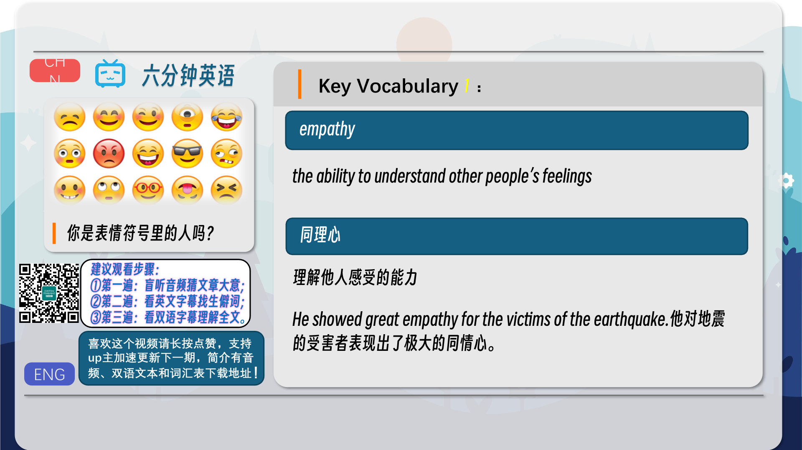
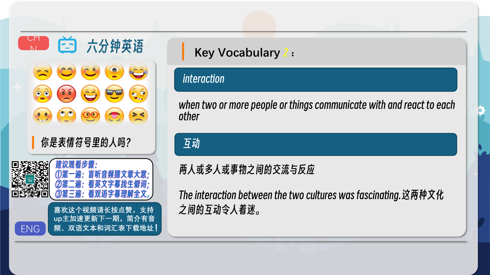
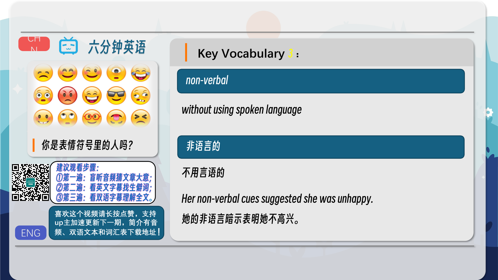
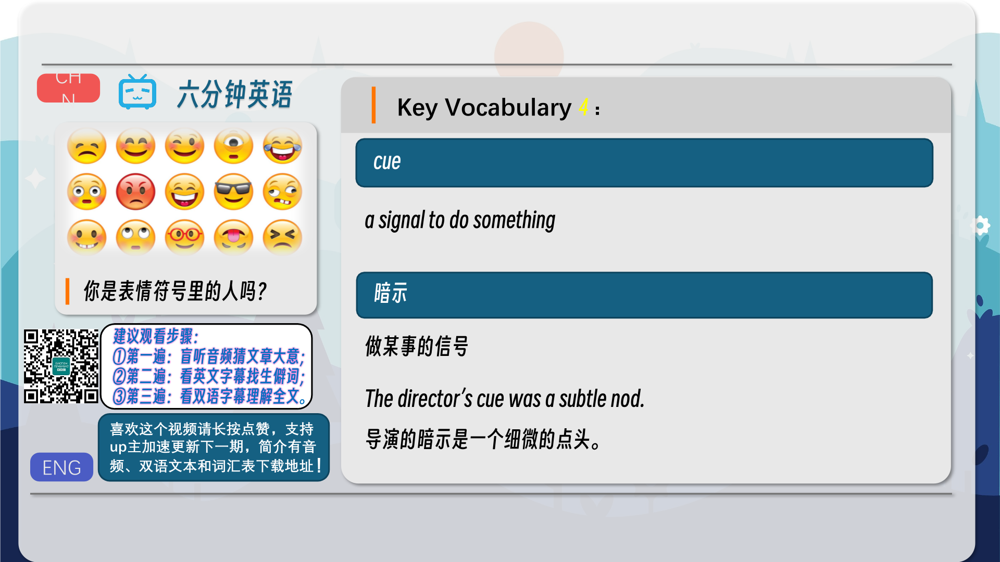
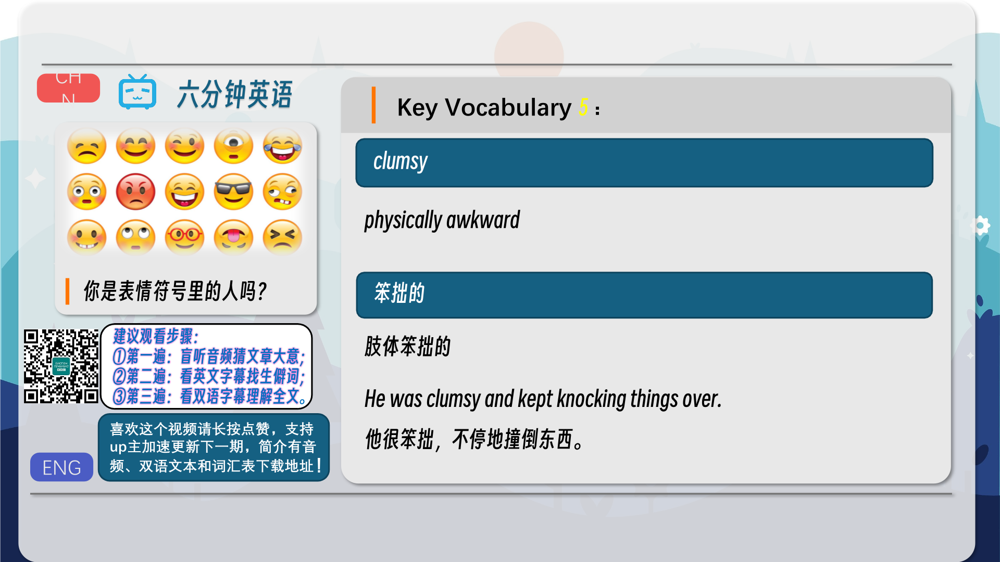
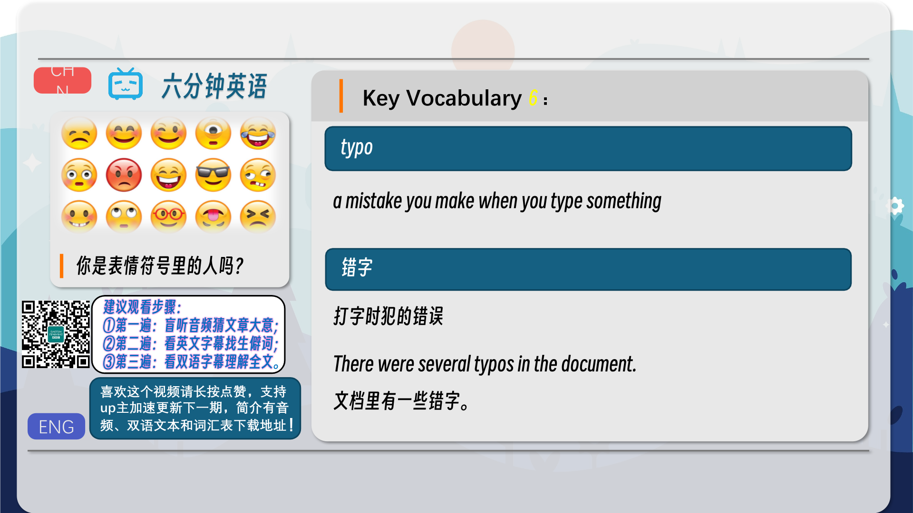
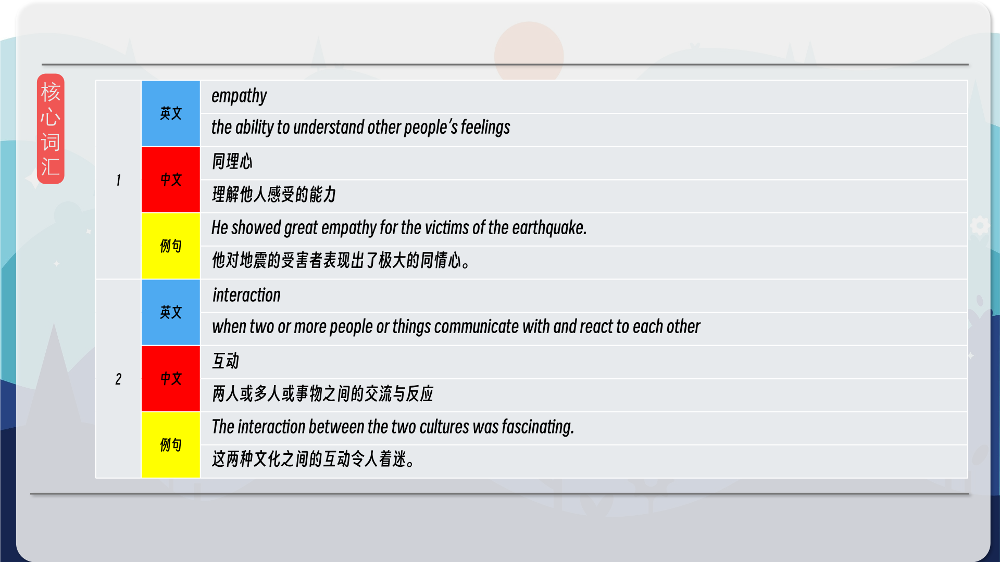
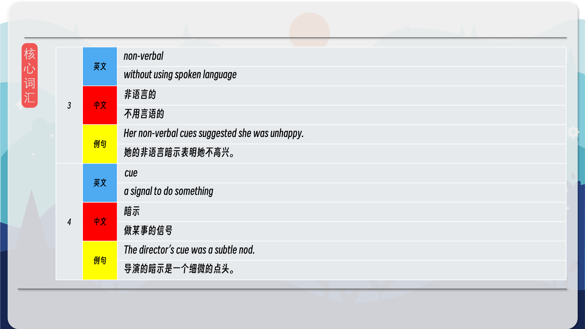
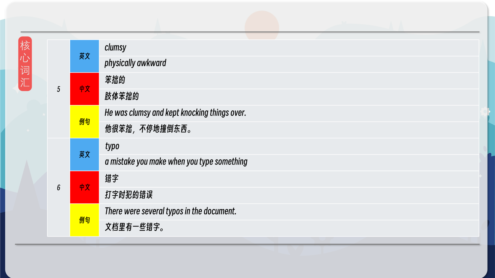
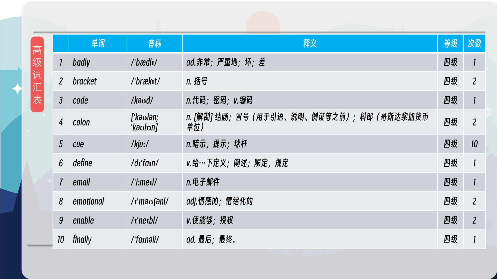
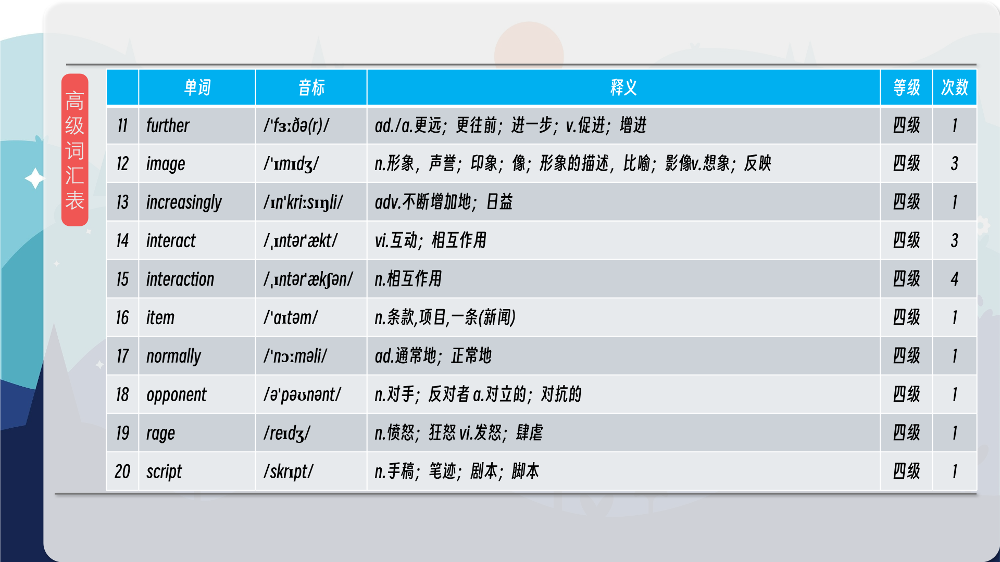
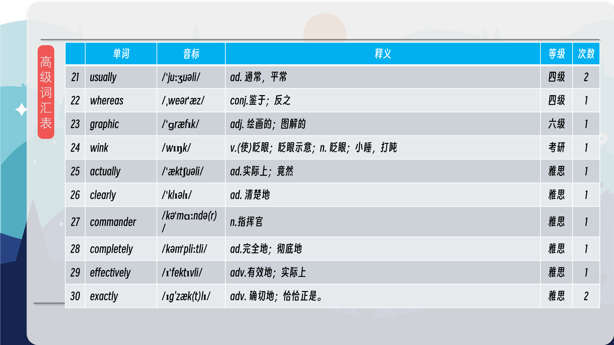
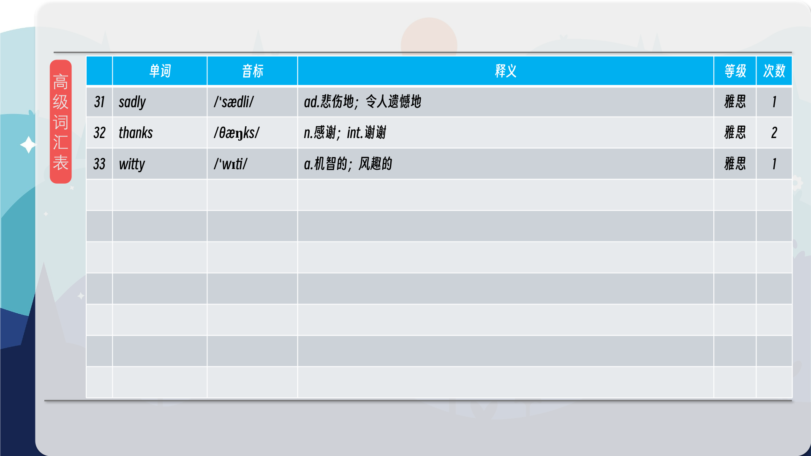
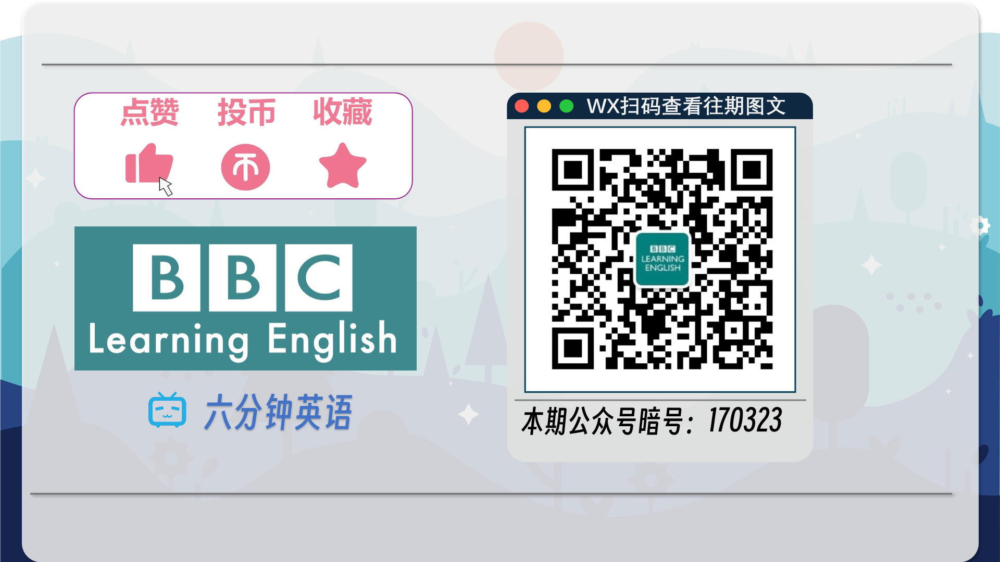

### 【核心词汇】
#### empathy
the ability to understand other people’s feelings
同理心
理解他人感受的能力
He showed great empathy for the victims of the earthquake.
他对地震的受害者表现出了极大的同情心。
#### interaction
when two or more people or things communicate with and react to each other
互动
两人或多人或事物之间的交流与反应
The interaction between the two cultures was fascinating.
这两种文化之间的互动令人着迷。
#### non-verbal
without using spoken language
非语言的
不用言语的
Her non-verbal cues suggested she was unhappy.
她的非语言暗示表明她不高兴。
#### cue
a signal to do something
暗示
做某事的信号
The director’s cue was a subtle nod.
导演的暗示是一个细微的点头。
#### clumsy
physically awkward
笨拙的
肢体笨拙的
He was clumsy and kept knocking things over.
他很笨拙，不停地撞倒东西。
#### typo
a mistake you make when you type something
错字
打字时犯的错误
There were several typos in the document.
文档里有一些错字。

在公众号里输入6位数字，获取【对话音频、英文文本、中文翻译、核心词汇和高级词汇表】电子档，6位数字【暗号】在文章的最后一张图片，如【220728】，表示22年7月28日这一期。公众号没有的文章说明还没有制作相关资料。年度合集在B站【六分钟英语】工房获取，每年共计300+文档，感谢支持！