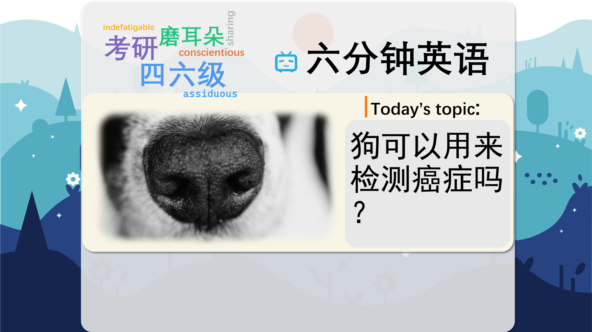
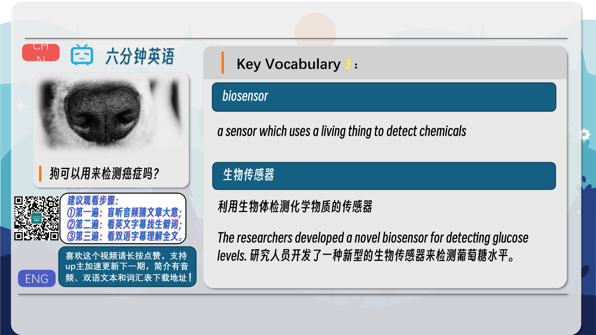
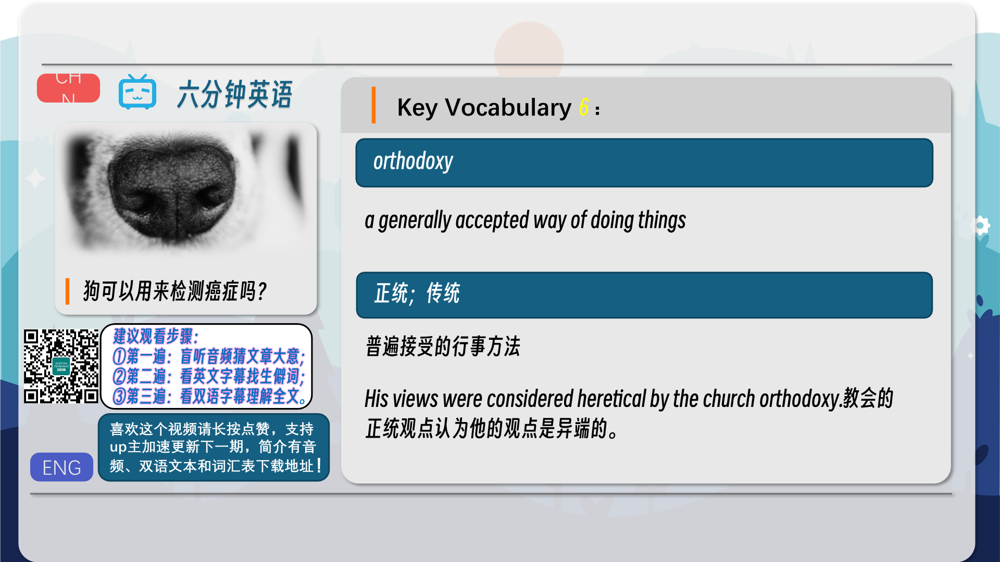
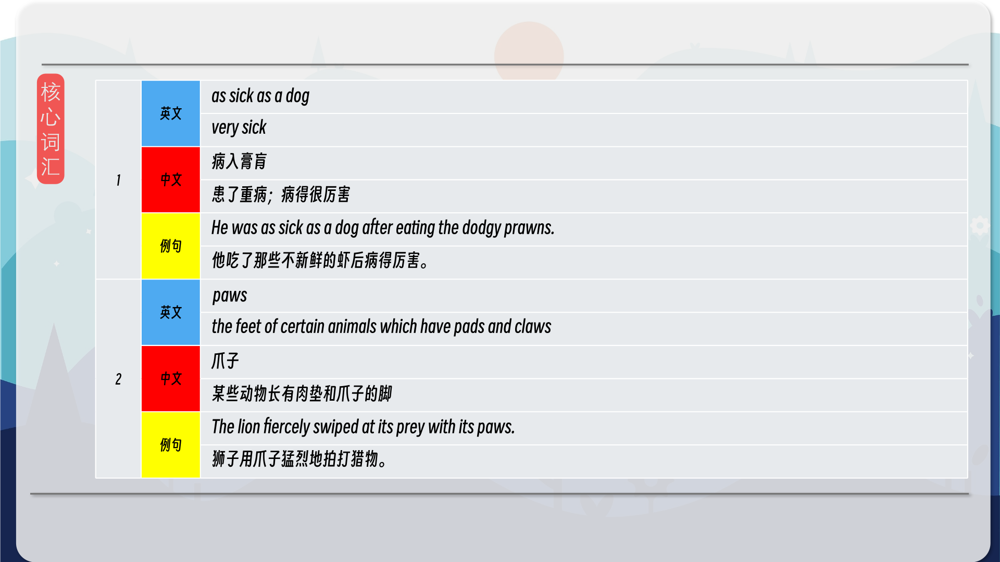
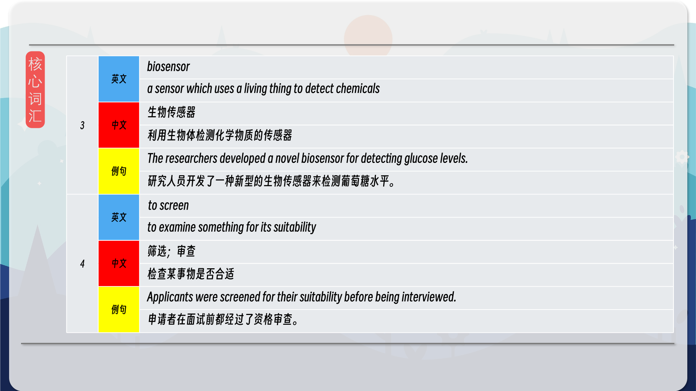
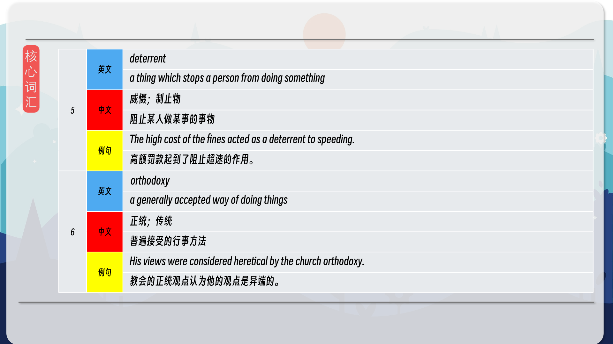
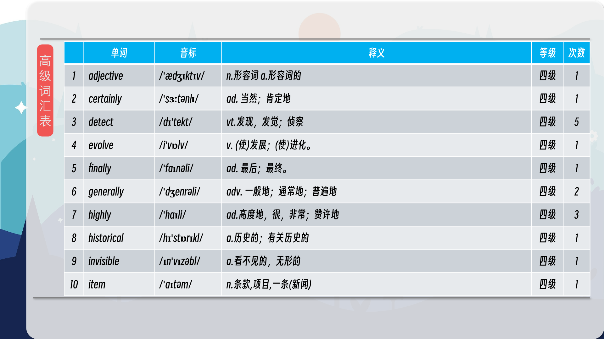
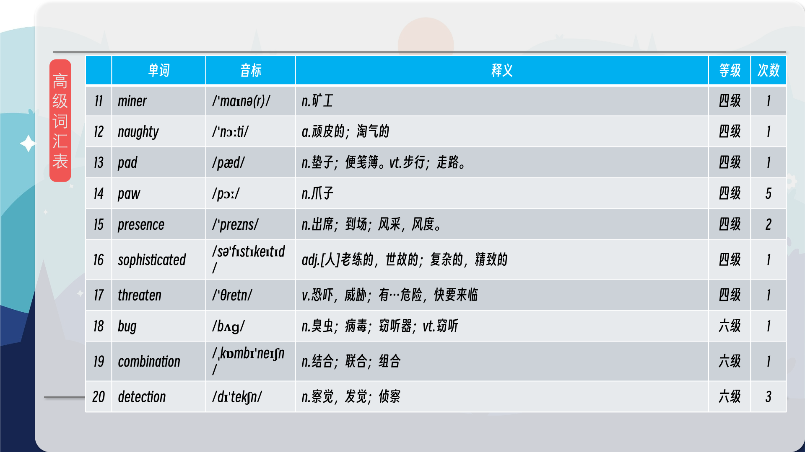
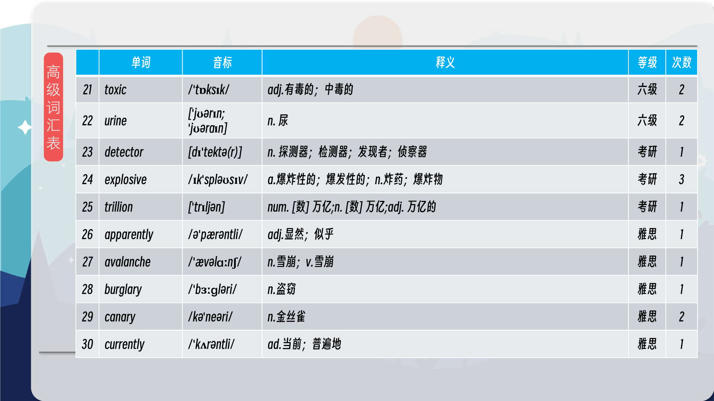

### 【英文脚本】
Dan
Hello and welcome to 6 Minute English– the show that brings you an interesting topic, authentic listening practice and six new items of vocabulary. I'm Dan.
 
Neil
And I'm Neil. We’ll be discussing dogs being used in cancer detection.
 
Dan
Everything ok, Neil?
 
Neil
I am so tired. One of my children is as sick as a dog. I didn’t sleep all night long looking after them.
 
Dan
As sick as a dog is an expression meaning ‘very ill’. I’m sorry to hear it. Try and hold on if you can.
 
Neil
Don’t worry. There’s life in this old dog yet.
 
Dan
Good. It’s funny that you mention dogs because apparently, the UK’s National Health Service is currently assessing whether dogs can be used to detect early stage prostate cancer.
 
Neil
Amazing. Any success?
 
Dan
Let me ask you in this week’s question. In what percentage of cases were dogs able to detect the presence of cancer in urine? Is it a) 50% b) 70% c) 90%
 
Neil
I’m going to guess a) 50%
 
Dan
We’ll find out later if you’re right or wrong. So, Neil, I say dog, what do you think?
 
Neil
A wet nose, four paws, which is what we call the feet of certain animals, a fluffy coat and a waggy tail? Man’s best friend? But I’ve never heard of cancer dogs. I wonder what makes them suitable?
 
Dan
Well, I’ll let Dr Claire Guest, CEO of the charity Medical Detection Dogs take that one.
 
Dr Claire Guest, CEO of Medical Detection Dogs
Although the dog has a fluffy coat and a waggy tail, he is in fact a highly sophisticated bio- sensor. You know, evolution has given him this highly sensitive nose, going down to parts per trillion. People board planes every day that have been screened by detector dogs to see if there are explosives on board. Why do we rely on them there and yet not in assisting us with health?
 
Dan
So, dogs have evolved to have a highly-developed sense of smell that allows them to act as a bio-sensor, a sensor which uses a living thing to detect chemicals. Neil Yes, and she mentioned that humans have a history of using dogs in security to screen, or examine for suitability, for explosives and bombs.
 
Dan
Yep! Can you think of any other places that dogs are used to support humans?
 
Neil
Well, there’s guide dogs, or seeing-eye dogs as they’re known in North America. They help people who are blind to avoid danger.
 
Dan
Nice. Any more? Maybe around the home?
 
Neil
Are you referring to guard dogs, meaning ‘a dog which keeps a house or place safe from burglary, theft or trespassing.’
 
Dan
Yep. Ex-burglars have often said that they’re a much bigger deterrent, or reason not to do something, than an alarm system.
 
Neil
Oh and there’s rescue dogs. They are trained to search and find victims of natural disasters such as avalanches or earthquakes.
 
Dan
Exactly, dogs are perfect for situations where people may be buried under the earth or the snow. A human can’t see them but a dog can still smell them.
 
Neil
Do you think our National Health Service will employ them as full time biosensors then?
 
Dan
Well, I don’t know, but here’s what Jeremy Hunt, the UK Health Secretary had to say on the matter.
 
Jeremy Hunt, Health Secretary
One of our jobs as MPs is sometimes to question orthodoxies, so if this research is good then I want to know about it, and I will certainly look at it carefully.
 
Dan
He mentions that this type of research goes against orthodoxies, or generally accepted way of doing things. But he also mentions that he will be looking at it carefully. So let’s hope so.
 
Neil
Yes I wouldn’t mind having a dog doctor! And speaking of research, there was a question I need to know the answer to.
 
Dan
Oh yes. I asked you in what percentage of cases were dogs able to detect the presence of cancer in urine? a) 50% b) 70% c) 90%
 
Neil
And I said 50%
 
Dan
It’s a dog’s life, Neil. I’m sorry. The answer was c) 90%
 
Neil
Wow! 90%! That’s amazing.
 
Dan
Isn’t it?
 
Neil
Shall we go through the vocabulary?
 
Dan
OK. The first expression we had was as sick as a dog. If you are as sick as a dog it means that you’re very sick indeed. When was the last time you were as sick as a dog, Neil?
 
Neil
Just after Christmas I caught a bug from my kids. I was as sick as a dog. Next we had paws. Paws are the feet of certain animals. They have pads and claws. Can you give us a few examples, Dan?
 
Dan
Well, dogs have paws. So do cats, rabbits, bears and mice. But not horses, sheep or pigs. They have hooves. After paws, we had biosensor. A biosensor is a combination of the words biology and sensor. It is a sensor which uses a living thing to detect chemicals. Can you think of a famous historical example, Neil?
 
Neil
Well, Miners in danger of a highly toxic but invisible gas called methane used to carry a canary in a cage down the mine with them. If the canary became ill or died, they knew that the air was toxic. Then we had screen. If you screen something, it means you examine it for its suitability, such as luggage going through an airport – where they would screen for explosives. How else can it be used, Dan?
 
Dan
Well, these days you can get an ad-blocker on your computer that will screen out those annoying pop-up adverts. I hate those! After that was deterrent. A deterrent is a thing which stops a person from doing something, such as the fear of punishment for a crime. How do you deter your children from being naughty, Neil?
 
Neil
That’s easy. I just threaten to remove a sticker from their sticker chart.
 
Dan
Good idea!
 
Neil
Finally, we heard orthodoxies. An orthodoxy is a generally accepted way of doing things. Its adjective isorthodox and we often hear its opposite word – unorthodox, meaning unusual. Do you do anythingunorthodox, Dan?
 
Dan
Well I love to combine hot sausages and cold vanilla ice-cream. It’s delicious! But no one will trust me enough to try!
 
Neil
I don’t blame them! Well, that's the end of today's 6 Minute English. Please join us again soon!
 
Dan
And we are on social media too - Facebook, Twitter, Instagram and YouTube. See you there.
 
Both
Bye!
 

### 【中英文双语脚本】
Dan(担)
Hello and welcome to 6 Minute English– the show that brings you an interesting topic, authentic listening practice and six new items of vocabulary. I'm Dan.
您好，欢迎来到六分钟英语 – 该节目为您带来一个有趣的话题、真实的听力练习和六个新词汇。我是 Dan。

Neil(尼尔)
And I'm Neil. We’ll be discussing dogs being used in cancer detection.
我是 Neil。我们将讨论用于癌症检测的狗。

Dan(担)
Everything ok, Neil?
一切都还好吗，尼尔？

Neil(尼尔)
I am so tired. One of my children is as sick as a dog. I didn’t sleep all night long looking after them.
我好累。我的一个孩子病得像狗一样。我整晚都没有睡觉照顾他们。

Dan(担)
As sick as a dog is an expression meaning ‘very ill’. I’m sorry to hear it. Try and hold on if you can.
As sick as a dog 是一个表达，意思是“病得很重”。听到这个消息，我感到很遗憾。如果可以的话，试着坚持下去。

Neil(尼尔)
Don’t worry. There’s life in this old dog yet.
不用担心。这只老狗还有生命。

Dan(担)
Good. It’s funny that you mention dogs because apparently, the UK’s National Health Service is currently assessing whether dogs can be used to detect early stage prostate cancer.
好。你提到狗很有趣，因为显然，英国国家卫生服务局目前正在评估狗是否可以用于检测早期前列腺癌。

Neil(尼尔)
Amazing. Any success?
了不起。成功了吗？

Dan(担)
Let me ask you in this week’s question. In what percentage of cases were dogs able to detect the presence of cancer in urine? Is it a) 50% b) 70% c) 90%
让我在本周的问题中问你。在多大的病例中，狗能够检测到尿液中是否存在癌症？是 a） 50% b） 70% c） 90%

Neil(尼尔)
I’m going to guess a) 50%
我猜 a） 50%

Dan(担)
We’ll find out later if you’re right or wrong. So, Neil, I say dog, what do you think?
我们稍后会知道你是对还是错。所以，尼尔，我说狗，你怎么看？

Neil(尼尔)
A wet nose, four paws, which is what we call the feet of certain animals, a fluffy coat and a waggy tail? Man’s best friend? But I’ve never heard of cancer dogs. I wonder what makes them suitable?
湿漉漉的鼻子、四只爪子，也就是我们所说的某些动物的脚，蓬松的外套和摇晃的尾巴？人类最好的朋友？但我从来没有听说过癌症狗。我想知道是什么让它们适合？

Dan(担)
Well, I’ll let Dr Claire Guest, CEO of the charity Medical Detection Dogs take that one.
好吧，我让慈善机构 Medical Detection Dogs 的首席执行官 Claire Guest 博士来回答这个问题。

Dr Claire Guest, CEO of Medical Detection Dogs(DrClaireGuest，MedicalDetectionDogs首席执行官)
Although the dog has a fluffy coat and a waggy tail, he is in fact a highly sophisticated bio- sensor. You know, evolution has given him this highly sensitive nose, going down to parts per trillion. People board planes every day that have been screened by detector dogs to see if there are explosives on board. Why do we rely on them there and yet not in assisting us with health?
虽然这只狗有蓬松的皮毛和摇晃的尾巴，但它实际上是一个高度复杂的生物传感器。你知道，进化赋予了他这个高度敏感的鼻子，可以精确到万亿分之几。人们每天登上经过搜查犬检查的飞机，看看机上是否有爆炸物。为什么我们在那里依赖他们，却不帮助我们保持健康？

Dan(担)
So, dogs have evolved to have a highly-developed sense of smell that allows them to act as a bio-sensor, a sensor which uses a living thing to detect chemicals. Neil Yes, and she mentioned that humans have a history of using dogs in security to screen, or examine for suitability, for explosives and bombs.
因此，狗已经进化到具有高度发达的嗅觉，这使它们能够充当生物传感器，一种使用生物检测化学物质的传感器。Neil 是的，她提到人类有使用警犬进行安全检查或检查爆炸物和炸弹是否适合的历史。

Dan(担)
Yep! Can you think of any other places that dogs are used to support humans?
是的！你能想到其他什么地方用狗来支持人类吗？

Neil(尼尔)
Well, there’s guide dogs, or seeing-eye dogs as they’re known in North America. They help people who are blind to avoid danger.
嗯，有导盲犬，或者北美众所周知的导盲犬。他们帮助盲人避免危险。

Dan(担)
Nice. Any more? Maybe around the home?
好。还有吗？也许在家里？

Neil(尼尔)
Are you referring to guard dogs, meaning ‘a dog which keeps a house or place safe from burglary, theft or trespassing.’
您指的是护卫犬，意思是“保护房屋或地方免受入室盗窃、盗窃或非法侵入的狗”。

Dan(担)
Yep. Ex-burglars have often said that they’re a much bigger deterrent, or reason not to do something, than an alarm system.
是的。前窃贼经常说，它们比警报系统更具有威慑力，或者说有理由不做某事。

Neil(尼尔)
Oh and there’s rescue dogs. They are trained to search and find victims of natural disasters such as avalanches or earthquakes.
哦，还有救援犬。他们接受过搜索和寻找雪崩或地震等自然灾害受害者的培训。

Dan(担)
Exactly, dogs are perfect for situations where people may be buried under the earth or the snow. A human can’t see them but a dog can still smell them.
没错，狗非常适合人们可能被埋在地下或雪下的情况。人类看不到它们，但狗仍然可以闻到它们。

Neil(尼尔)
Do you think our National Health Service will employ them as full time biosensors then?
您认为我们的国家卫生服务局会将它们用作全职生物传感器吗？

Dan(担)
Well, I don’t know, but here’s what Jeremy Hunt, the UK Health Secretary had to say on the matter.
嗯，我不知道，但以下是英国卫生大臣杰里米·亨特 （Jeremy Hunt） 对此事的看法。

Jeremy Hunt, Health Secretary(卫生大臣JeremyHunt)
One of our jobs as MPs is sometimes to question orthodoxies, so if this research is good then I want to know about it, and I will certainly look at it carefully.
作为国会议员，我们的工作之一有时就是质疑正统观念，所以如果这项研究是好的，那么我想了解它，我肯定会仔细研究它。

Dan(担)
He mentions that this type of research goes against orthodoxies, or generally accepted way of doing things. But he also mentions that he will be looking at it carefully. So let’s hope so.
他提到，这种类型的研究违背了正统或普遍接受的做事方式。但他也提到他会仔细研究它。所以让我们希望如此。

Neil(尼尔)
Yes I wouldn’t mind having a dog doctor! And speaking of research, there was a question I need to know the answer to.
是的，我不介意有个狗医生！说到研究，有一个问题我需要知道答案。

Dan(担)
Oh yes. I asked you in what percentage of cases were dogs able to detect the presence of cancer in urine? a) 50% b) 70% c) 90%
哦，是的。我问你，在多大的病例中，狗能够检测到尿液中癌症的存在？a） 50% b） 70% c） 90%

Neil(尼尔)
And I said 50%
我说 50%

Dan(担)
It’s a dog’s life, Neil. I’m sorry. The answer was c) 90%
这是狗的生活，尼尔。对不起。答案是 c） 90%

Neil(尼尔)
Wow! 90%! That’s amazing.
哇！90%!这太神奇了。

Dan(担)
Isn’t it?
不是吗？

Neil(尼尔)
Shall we go through the vocabulary?
我们应该浏览一下词汇吗？

Dan(担)
OK. The first expression we had was as sick as a dog. If you are as sick as a dog it means that you’re very sick indeed. When was the last time you were as sick as a dog, Neil?
还行。我们的第一个表情就像狗一样病恹恹的。如果你病得像狗一样，那就意味着你确实病得很重。尼尔，你上一次病得像狗是什么时候？

Neil(尼尔)
Just after Christmas I caught a bug from my kids. I was as sick as a dog. Next we had paws. Paws are the feet of certain animals. They have pads and claws. Can you give us a few examples, Dan?
圣诞节刚过，我就从我的孩子们那里抓到了一只虫子。我病得像条狗一样。接下来我们有爪子。爪子是某些动物的脚。他们有垫子和爪子。Dan，您能给我们举几个例子吗？

Dan(担)
Well, dogs have paws. So do cats, rabbits, bears and mice. But not horses, sheep or pigs. They have hooves. After paws, we had biosensor. A biosensor is a combination of the words biology and sensor. It is a sensor which uses a living thing to detect chemicals. Can you think of a famous historical example, Neil?
嗯，狗有爪子。猫、兔子、熊和老鼠也是如此。但不是马、羊或猪。他们有蹄子。在爪子之后，我们有生物传感器。生物传感器是 biology 和 sensor 这两个词的组合。它是一种使用生物来检测化学物质的传感器。尼尔，你能想到一个著名的历史例子吗？

Neil(尼尔)
Well, Miners in danger of a highly toxic but invisible gas called methane used to carry a canary in a cage down the mine with them. If the canary became ill or died, they knew that the air was toxic. Then we had screen. If you screen something, it means you examine it for its suitability, such as luggage going through an airport – where they would screen for explosives. How else can it be used, Dan?
好吧，处于一种叫做甲烷的剧毒但看不见的气体危险中的矿工过去常常带着笼子里的金丝雀下矿井。如果金丝雀生病或死亡，他们知道空气有毒。然后我们有屏幕。如果您检查某样东西，则意味着您检查其适用性，例如行李通过机场 – 他们会在那里检查爆炸物。丹，它还能怎么用呢？

Dan(担)
Well, these days you can get an ad-blocker on your computer that will screen out those annoying pop-up adverts. I hate those! After that was deterrent. A deterrent is a thing which stops a person from doing something, such as the fear of punishment for a crime. How do you deter your children from being naughty, Neil?
好吧，如今，您可以在您的计算机上安装一个广告拦截器，它可以过滤掉那些烦人的弹出广告。我讨厌那些！在那之后是威慑力。威慑是阻止一个人做某事的事情，例如害怕犯罪受到惩罚。你怎么阻止你的孩子顽皮，尼尔？

Neil(尼尔)
That’s easy. I just threaten to remove a sticker from their sticker chart.
这很简单。我只是威胁要从他们的贴纸图表中删除一个贴纸。

Dan(担)
Good idea!
好主意！

Neil(尼尔)
Finally, we heard orthodoxies. An orthodoxy is a generally accepted way of doing things. Its adjective isorthodox and we often hear its opposite word – unorthodox, meaning unusual. Do you do anythingunorthodox, Dan?
最后，我们听到了正统的说法。正统是一种普遍接受的做事方式。它的形容词是 orthodox，我们经常听到它的反词 – unorthodox，意思是不寻常。丹，你做了什么非正统的事情吗？

Dan(担)
Well I love to combine hot sausages and cold vanilla ice-cream. It’s delicious! But no one will trust me enough to try!
嗯，我喜欢将热香肠和冷香草冰淇淋混合在一起。好吃！但没有人会足够信任我去尝试！

Neil(尼尔)
I don’t blame them! Well, that's the end of today's 6 Minute English. Please join us again soon!
我不怪他们！好了，今天的六分钟 English 到此结束。请尽快再次加入我们！

Dan(担)
And we are on social media too - Facebook, Twitter, Instagram and YouTube. See you there.
我们也在社交媒体上 - Facebook、Twitter、Instagram 和 YouTube。到时见。

Both(双)
Bye!
再见！

### 【核心词汇】
#### as sick as a dog
very sick
病入膏肓
患了重病；病得很厉害
He was as sick as a dog after eating the dodgy prawns.
他吃了那些不新鲜的虾后病得厉害。
#### paws
the feet of certain animals which have pads and claws
爪子
某些动物长有肉垫和爪子的脚
The lion fiercely swiped at its prey with its paws.
狮子用爪子猛烈地拍打猎物。
#### biosensor
a sensor which uses a living thing to detect chemicals
生物传感器
利用生物体检测化学物质的传感器
The researchers developed a novel biosensor for detecting glucose levels.
研究人员开发了一种新型的生物传感器来检测葡萄糖水平。
#### to screen
to examine something for its suitability
筛选；审查
检查某事物是否合适
Applicants were screened for their suitability before being interviewed.
申请者在面试前都经过了资格审查。
#### deterrent
a thing which stops a person from doing something
威慑；制止物
阻止某人做某事的事物
The high cost of the fines acted as a deterrent to speeding.
高额罚款起到了阻止超速的作用。
#### orthodoxy
a generally accepted way of doing things
正统；传统
普遍接受的行事方法
His views were considered heretical by the church orthodoxy.
教会的正统观点认为他的观点是异端的。

在公众号里输入6位数字，获取【对话音频、英文文本、中文翻译、核心词汇和高级词汇表】电子档，6位数字【暗号】在文章的最后一张图片，如【220728】，表示22年7月28日这一期。公众号没有的文章说明还没有制作相关资料。年度合集在B站【六分钟英语】工房获取，每年共计300+文档，感谢支持！