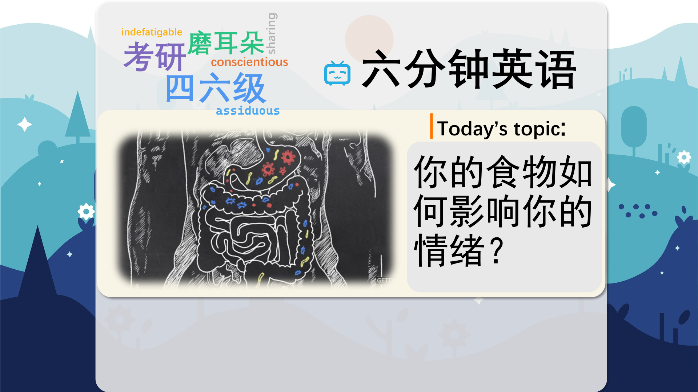

### 【英文脚本】
Dan
Hello and welcome to 6 Minute English – the show that brings you an interesting topic, authentic listening practice and six items of incredibly useful vocabulary. I'm Dan…
 
Neil
And I'm Neil. Now, a favourite topic today: food, and how food can influence your mood. Dan, tell me, what food makes you happy?
 
Dan
Oh, you know, ice cream, chocolate… chocolate always puts a smile on my face.
 
Neil
And a few inches round your waistline! Sadly, the research we’ll be looking at today doesn’t suggest you eat more chocolate… but it does talk about bacteria!
 
Dan
Bacteria – those simple, small organisms – they make me happy?
 
Neil
Absolutely, the so-called ‘good’ bacteria do! We’ll get to that, but first we’ll look at today’s question. How many bacteria are there in the human body? a) 39 million b) 39 billion c) 39 trillion
 
Dan
They are pretty small. I’m going to go for c) 39 trillion.
 
Neil
Well, we’ll find out if you’re right… by counting them one by one.
 
Dan
That’s going to take longer than six minutes!
 
Neil
Yes it is, so let’s get moving! Scientists believe your mental state is connected to the bacteria in your gut.
 
Dan
My gut - my stomach and the other organs my food passes through…
 
Neil
Yes. Researchers at McMaster University in Canada and University College Cork in Ireland have found that certain bacteria help reduce anxiety in mice…
 
Dan
Anxiety – the state of being worried or anxious. I don’t like the sound of an anxious mouse.
 
Neil
Well I’m afraid there’s another mouse experiment coming up. Researchers at Kyushu University found germ-free mice showed more stress…
 
Dan
Germs – a general word for bacteria and microorganisms, usually the ones which cause disease… So germs help reduce stress and anxiety in mice. Any research on humans?
 
Neil
The BBC TV programme Trust me, I’m a Doctor has just explored this. They looked at foods which are high in ‘good’ bacteria – a claim which more and more food products are making these days.
 
Dan
Yes, it’s a phrase that appears a lot in marketing.
 
Neil
But many traditional foods are high in good bacteria as well. They found that homemade fermented food was best.
 
Dan
So things like miso soup, kimchi, yoghurt, sauerkraut – all these are fermented. Have you tried all of those?
 
Neil
I love miso soup and kimchi. And fermentation is the process where sugars in food are turned into acids and alcohol.
 
Dan
Fermented foods are full of lots of good bacteria for your gut… Anything else from the BBC programme?
 
Neil
Well, this is the man behind the BBC study, Dr Michael Mosley. In this clip, a radio presenter asks him about the best kind of food to make us happy.
 
Presenter
What’s the good mood food? What shall we eat now to cheer ourselves up?
 
Dr Michael Mosley
Mediterranean diet. Olive oil; oily fish, full of omega 3, which is really good for the brain; whole grains; lots of fruits and vegetables. Sugar: terrible for you.
 
Presenter
Not chocolate eclairs then?
 
Dr Michael Mosley
Sadly not. That will make you feel good for about 30 seconds until you finish it and then you feel terribly guilty.
 
Presenter
Right, ok. Mediterranean it is.
 
Dan
He said the best kind of food is the Mediterranean diet. Now, a diet can mean ‘an eating plan designed to help you lose weight’.
 
Neil
But that’s not what it means here. Here it refers to the food and drink eaten by a group of people – in this case, the people living around the Mediterranean Sea.
 
Dan
Lots of oily fish, olive oil, grains, fruits and vegetables. And of course, add in plenty of fermented food too.
 
Neil
And don’t eat too many fatty, sugary, chocolaty things like chocolate eclairs – those are buns filled with cream and covered in chocolate. It’s really not rocket science, is it?
 
Dan
Eating healthily is pretty straightforward, even if the science behind it is complex. When you say something is not rocket science, you mean ‘it’s not difficult to understand’.
 
Neil
Now, are you ready for some counting?
 
Dan
Ah yes, you wanted me to count all the bacteria in my body! I said 39 trillion.
 
Neil
And you were right. The number goes up and down, but on average we’re thought to have around 39 trillion bacterial cells in the body, according to the Weizmann Institute in Israel. The interesting thing is they think that there are only 30 trillion human cells in the body.
 
Dan
So there’s more bacteria than human in me?
 
Neil
Well, maybe just you, Dan! Now, before the bacteria take over completely, let’s look over today’s words one more time.
 
Dan
Gut was first. It means ‘the stomach and other organs which digest our food’. But here’s an extra tip - the word can also mean ‘bravery’ when used in the plural. You’ve got guts, Neil, wearing that crazy shirt in this office!
 
Neil
Why thank you. Maybe I don’t feel any anxiety about how I look! Anxiety was our second word, and it means ‘fear or worry’. The adjective is anxious.
 
Dan
You know what makes me anxious? Germs. I wash my hands fifty times a day. I can’t stand the idea of getting ill from all the germs around here.
 
Neil
Yes, germs are tiny organisms, and usually refers to those which carry disease. But as we heard, certain germs are good for you!
 
Dan
Especially those which are in fermented food. That’s food which has gone through a process where sugars turn into acids and alcohol. They often taste sour or bitter.
 
Neil
We also talk about fermenting alcoholic drinks. Beer and wine are fermented.
 
Dan
Does that mean I should make them a part of my diet? A diet not only means ‘a healthy eating plan’, but can also mean ‘the foods and drinks consumed by an individual or group’. Which country has the best diet, Neil?
 
Neil
Well, in my opinion the Japanese diet. It’s my favourite anyway – very varied and plenty of fermented food!
 
Dan
And finally we had – it’s not rocket science – it’s simple to understand. An example?
 
Neil
Brewing beer isn’t rocket science – you just need hops, yeast and patience.
 
Dan
And there we are – a rocket speed review of today’s words! And that's the end of today's 6 Minute English. Please join us again soon.
 
Neil
And we are on social media too. Make sure to visit us on Facebook, Twitter, Instagram and YouTube.
 
Both
Bye!
 

### 【中英文双语脚本】
Dan(担)
Hello and welcome to 6 Minute English – the show that brings you an interesting topic, authentic listening practice and six items of incredibly useful vocabulary. I'm Dan…
您好，欢迎来到六分钟英语 - 该节目为您带来一个有趣的话题、真实的听力练习和六个非常有用的词汇。我是 Dan...

Neil(尼尔)
And I'm Neil. Now, a favourite topic today: food, and how food can influence your mood. Dan, tell me, what food makes you happy?
我是 Neil。现在，今天最喜欢的话题是：食物，以及食物如何影响您的情绪。Dan，告诉我，什么食物让你快乐？

Dan(担)
Oh, you know, ice cream, chocolate… chocolate always puts a smile on my face.
哦，你知道的，冰淇淋、巧克力......巧克力总是让我脸上露出笑容。

Neil(尼尔)
And a few inches round your waistline! Sadly, the research we’ll be looking at today doesn’t suggest you eat more chocolate… but it does talk about bacteria!
还有几英寸的腰围！遗憾的是，我们今天要看的研究并不建议你多吃巧克力......但它确实谈到了细菌！

Dan(担)
Bacteria – those simple, small organisms – they make me happy?
细菌 – 那些简单的小生物 – 它们让我快乐吗？

Neil(尼尔)
Absolutely, the so-called ‘good’ bacteria do! We’ll get to that, but first we’ll look at today’s question. How many bacteria are there in the human body? a) 39 million b) 39 billion c) 39 trillion
绝对，所谓的“好”细菌确实如此！我们稍后会谈到这个问题，但首先我们要看看今天的问题。人体有多少细菌？a） 3900 万 b） 390 亿 c） 39 万亿

Dan(担)
They are pretty small. I’m going to go for c) 39 trillion.
它们很小。我打算选择 c） 39 万亿。

Neil(尼尔)
Well, we’ll find out if you’re right… by counting them one by one.
好吧，我们会找出你是对的吗......通过一一数数。

Dan(担)
That’s going to take longer than six minutes!
这将花费超过六分钟的时间！

Neil(尼尔)
Yes it is, so let’s get moving! Scientists believe your mental state is connected to the bacteria in your gut.
是的，所以让我们开始吧！科学家认为，您的精神状态与肠道中的细菌有关。

Dan(担)
My gut - my stomach and the other organs my food passes through…
我的肠道 - 我的胃和我食物经过的其他器官......

Neil(尼尔)
Yes. Researchers at McMaster University in Canada and University College Cork in Ireland have found that certain bacteria help reduce anxiety in mice…
是的。加拿大麦克马斯特大学和爱尔兰科克大学的研究人员发现，某些细菌有助于减轻小鼠的焦虑......

Dan(担)
Anxiety – the state of being worried or anxious. I don’t like the sound of an anxious mouse.
焦虑 – 担心或焦虑的状态。我不喜欢焦虑的老鼠的声音。

Neil(尼尔)
Well I’m afraid there’s another mouse experiment coming up. Researchers at Kyushu University found germ-free mice showed more stress…
嗯，恐怕还有另一个老鼠实验即将到来。九州大学的研究人员发现，无菌小鼠表现出更大的压力......

Dan(担)
Germs – a general word for bacteria and microorganisms, usually the ones which cause disease… So germs help reduce stress and anxiety in mice. Any research on humans?
病菌 – 细菌和微生物的通用词，通常是导致疾病的细菌和微生物......因此，细菌有助于减轻小鼠的压力和焦虑。有没有关于人类的研究？

Neil(尼尔)
The BBC TV programme Trust me, I’m a Doctor has just explored this. They looked at foods which are high in ‘good’ bacteria – a claim which more and more food products are making these days.
BBC 电视节目 相信我，我是医生 刚刚探讨了这个问题。他们研究了富含“有益”细菌的食物 —— 如今越来越多的食品正在提出这一说法。

Dan(担)
Yes, it’s a phrase that appears a lot in marketing.
是的，这是营销中经常出现的短语。

Neil(尼尔)
But many traditional foods are high in good bacteria as well. They found that homemade fermented food was best.
但许多传统食品的有益细菌含量也很高。他们发现自制发酵食品是最好的。

Dan(担)
So things like miso soup, kimchi, yoghurt, sauerkraut – all these are fermented. Have you tried all of those?
所以像味噌汤、辛奇、酸奶、酸菜这样的东西 —— 所有这些都是发酵的。你试过所有这些吗？

Neil(尼尔)
I love miso soup and kimchi. And fermentation is the process where sugars in food are turned into acids and alcohol.
我喜欢味噌汤和辛奇。发酵是食物中的糖分转化为酸和酒精的过程。

Dan(担)
Fermented foods are full of lots of good bacteria for your gut… Anything else from the BBC programme?
发酵食品中含有大量对肠道有益的细菌......BBC 节目还有什么其他内容吗？

Neil(尼尔)
Well, this is the man behind the BBC study, Dr Michael Mosley. In this clip, a radio presenter asks him about the best kind of food to make us happy.
嗯，这就是 BBC 研究的幕后推手，迈克尔·莫斯利博士。在这个剪辑中，一位电台主持人问他最好的食物是什么才能让我们快乐。

Presenter(主持人)
What’s the good mood food? What shall we eat now to cheer ourselves up?
什么是好心情食物？我们现在该吃什么来振作起来呢？

Dr Michael Mosley(MichaelMosley医生)
Mediterranean diet. Olive oil; oily fish, full of omega 3, which is really good for the brain; whole grains; lots of fruits and vegetables. Sugar: terrible for you.
地中海饮食。橄榄油；油性鱼，富含 Omega 3，对大脑真的很好；全谷物；大量的水果和蔬菜。糖：对你来说很糟糕。

Presenter(主持人)
Not chocolate eclairs then?
那不是巧克力泡芙吗？

Dr Michael Mosley(MichaelMosley医生)
Sadly not. That will make you feel good for about 30 seconds until you finish it and then you feel terribly guilty.
遗憾的是没有。这会让你感觉良好大约 30 秒，直到你完成它，然后你会感到非常内疚。

Presenter(主持人)
Right, ok. Mediterranean it is.
对，好的。它是地中海的。

Dan(担)
He said the best kind of food is the Mediterranean diet. Now, a diet can mean ‘an eating plan designed to help you lose weight’.
他说，最好的食物是地中海饮食。现在，节食可以意味着“旨在帮助您减肥的饮食计划”。

Neil(尼尔)
But that’s not what it means here. Here it refers to the food and drink eaten by a group of people – in this case, the people living around the Mediterranean Sea.
但这不是它的意思。在这里，它指的是一群人吃的食物和饮料 —— 在这种情况下，是生活在地中海周围的人们。

Dan(担)
Lots of oily fish, olive oil, grains, fruits and vegetables. And of course, add in plenty of fermented food too.
很多油性鱼、橄榄油、谷物、水果和蔬菜。当然，也要加入大量的发酵食品。

Neil(尼尔)
And don’t eat too many fatty, sugary, chocolaty things like chocolate eclairs – those are buns filled with cream and covered in chocolate. It’s really not rocket science, is it?
不要吃太多高脂肪、含糖、巧克力等巧克力类的东西 —— 那些是装满奶油并覆盖着巧克力的面包。这真的不是火箭科学，不是吗？

Dan(担)
Eating healthily is pretty straightforward, even if the science behind it is complex. When you say something is not rocket science, you mean ‘it’s not difficult to understand’.
健康饮食非常简单，即使其背后的科学很复杂。当你说某件事不是火箭科学时，你的意思是“它不难理解”。

Neil(尼尔)
Now, are you ready for some counting?
现在，您准备好进行一些计数了吗？

Dan(担)
Ah yes, you wanted me to count all the bacteria in my body! I said 39 trillion.
啊，是的，你要我数一数我体内所有的细菌！我说的是 39 万亿。

Neil(尼尔)
And you were right. The number goes up and down, but on average we’re thought to have around 39 trillion bacterial cells in the body, according to the Weizmann Institute in Israel. The interesting thing is they think that there are only 30 trillion human cells in the body.
你是对的。这个数字有起有落，但根据以色列魏茨曼研究所的数据，平均而言，我们体内大约有 39 万亿个细菌细胞。有趣的是，他们认为体内只有 30 万亿个人体细胞。

Dan(担)
So there’s more bacteria than human in me?
所以我体内的细菌比人类还多？

Neil(尼尔)
Well, maybe just you, Dan! Now, before the bacteria take over completely, let’s look over today’s words one more time.
好吧，也许就你一个人，丹！现在，在细菌完全接管之前，让我们再看一遍今天的文字。

Dan(担)
Gut was first. It means ‘the stomach and other organs which digest our food’. But here’s an extra tip - the word can also mean ‘bravery’ when used in the plural. You’ve got guts, Neil, wearing that crazy shirt in this office!
肠道是第一位的。它的意思是“胃和其他消化我们食物的器官”。但这里有一个额外的提示 - 这个词在复数形式中使用时也可以表示“勇敢”。你有胆量，Neil，在这个办公室里穿着那件疯狂的衬衫！

Neil(尼尔)
Why thank you. Maybe I don’t feel any anxiety about how I look! Anxiety was our second word, and it means ‘fear or worry’. The adjective is anxious.
为什么谢谢你。也许我对自己的外表没有任何焦虑！焦虑是我们的第二个词，它的意思是“恐惧或担忧”。形容词是焦虑的。

Dan(担)
You know what makes me anxious? Germs. I wash my hands fifty times a day. I can’t stand the idea of getting ill from all the germs around here.
你知道是什么让我焦虑吗？病菌。我每天洗手 50 次。我无法忍受这里的所有病菌会生病。

Neil(尼尔)
Yes, germs are tiny organisms, and usually refers to those which carry disease. But as we heard, certain germs are good for you!
是的，病菌是微小的生物体，通常是指携带疾病的生物。但正如我们听说的那样，某些细菌对您有好处！

Dan(担)
Especially those which are in fermented food. That’s food which has gone through a process where sugars turn into acids and alcohol. They often taste sour or bitter.
尤其是那些在发酵食品中的。那是经历了糖转化为酸和酒精的过程的食物。它们通常尝起来是酸的或苦的。

Neil(尼尔)
We also talk about fermenting alcoholic drinks. Beer and wine are fermented.
我们还讨论了发酵酒精饮料。啤酒和葡萄酒经过发酵。

Dan(担)
Does that mean I should make them a part of my diet? A diet not only means ‘a healthy eating plan’, but can also mean ‘the foods and drinks consumed by an individual or group’. Which country has the best diet, Neil?
这是否意味着我应该将它们作为我饮食的一部分？节食不仅意味着“健康的饮食计划”，还可以意味着“个人或群体食用的食物和饮料”。尼尔，哪个国家的饮食最好？

Neil(尼尔)
Well, in my opinion the Japanese diet. It’s my favourite anyway – very varied and plenty of fermented food!
嗯，在我看来是日本的饮食。无论如何，这是我最喜欢的 - 种类繁多且发酵食品丰富！

Dan(担)
And finally we had – it’s not rocket science – it’s simple to understand. An example?
最后，我们有了 - 这不是火箭科学 - 它很容易理解。一个例子？

Neil(尼尔)
Brewing beer isn’t rocket science – you just need hops, yeast and patience.
酿造啤酒不是火箭科学 —— 你只需要啤酒花、酵母和耐心。

Dan(担)
And there we are – a rocket speed review of today’s words! And that's the end of today's 6 Minute English. Please join us again soon.
我们就这样 - 对今天的话进行火箭般的速度回顾！这就是今天的六分钟 English 的结尾。请尽快再次加入我们。

Neil(尼尔)
And we are on social media too. Make sure to visit us on Facebook, Twitter, Instagram and YouTube.
我们也在社交媒体上。请务必在 Facebook、Twitter、Instagram 和 YouTube 上访问我们。

Both(双)
Bye!
再见！

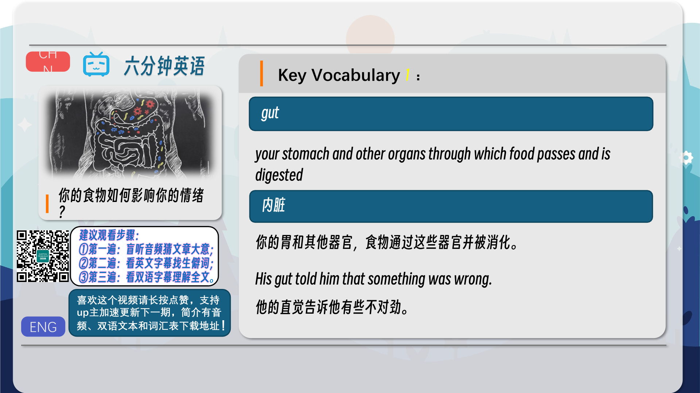
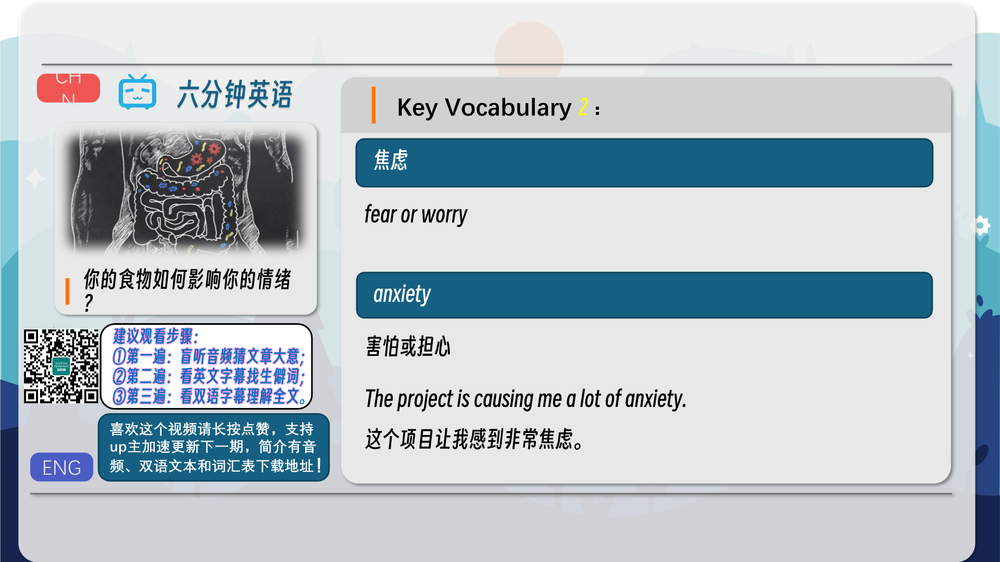
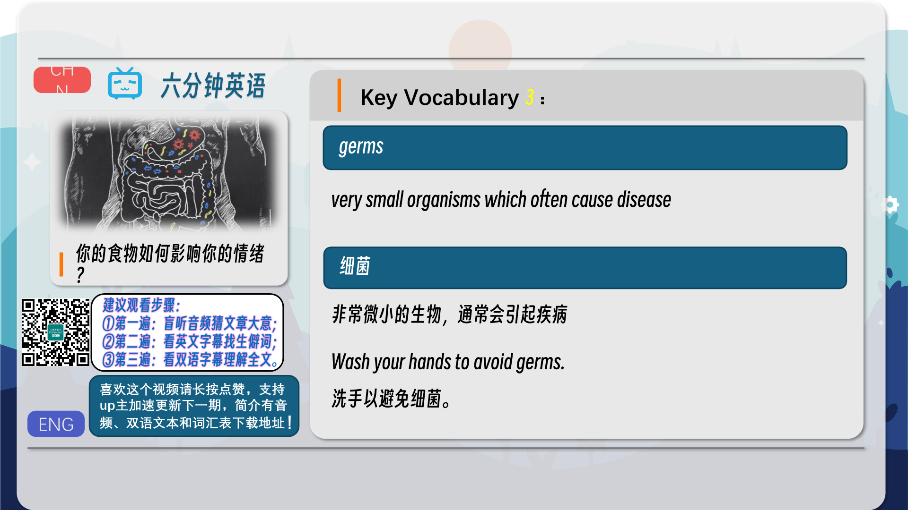
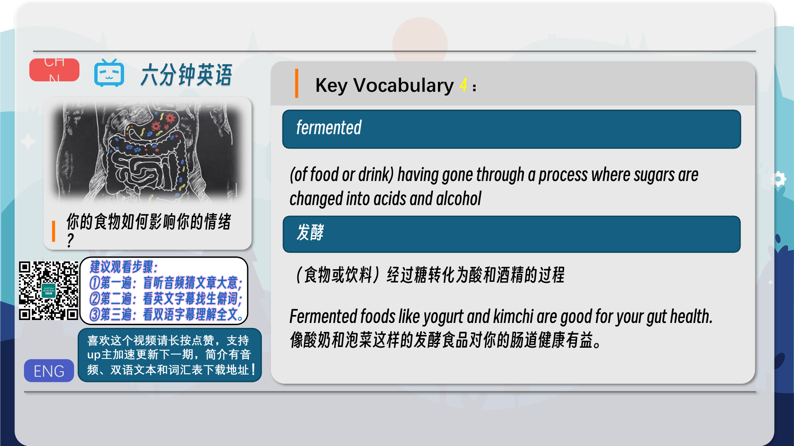
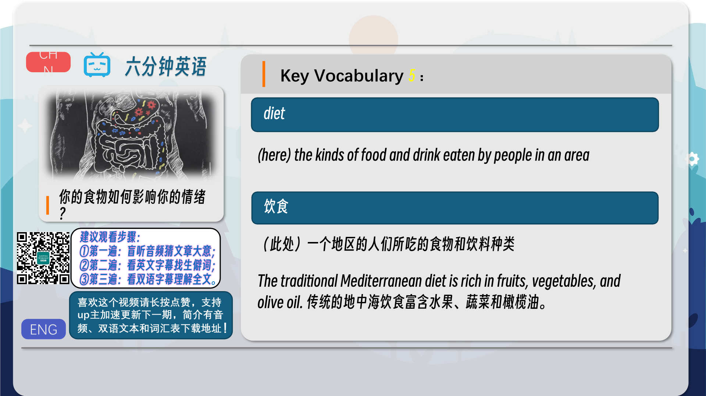
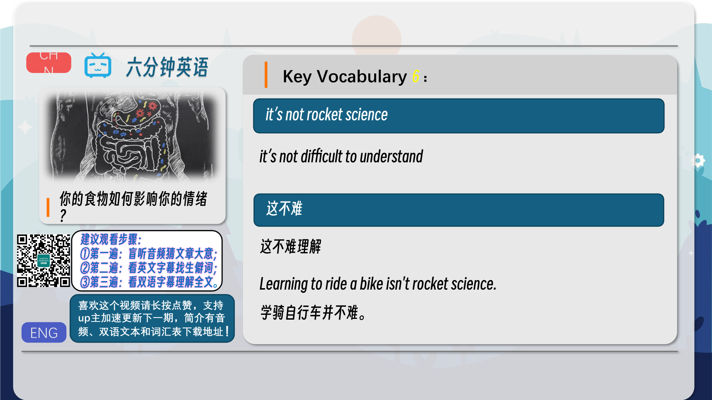
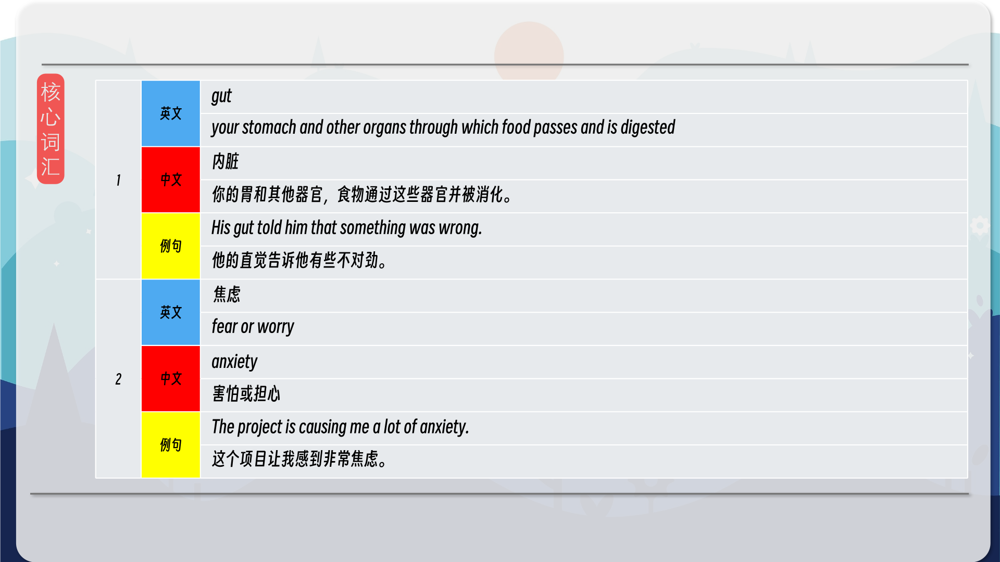
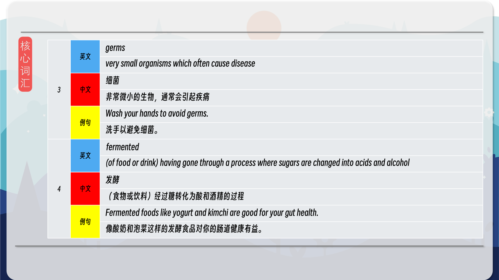
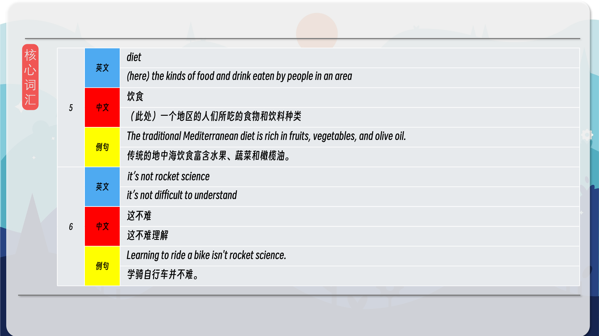
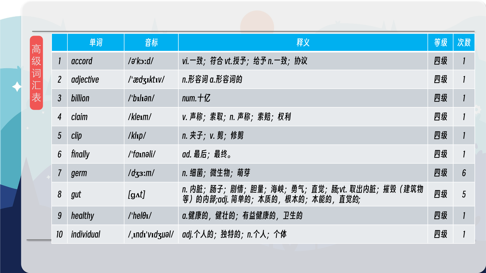
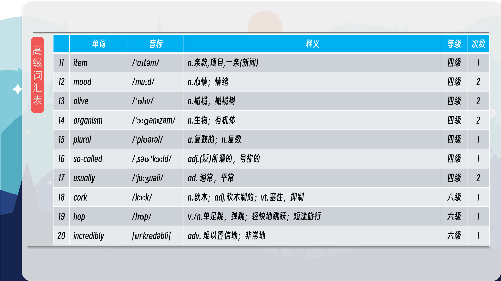
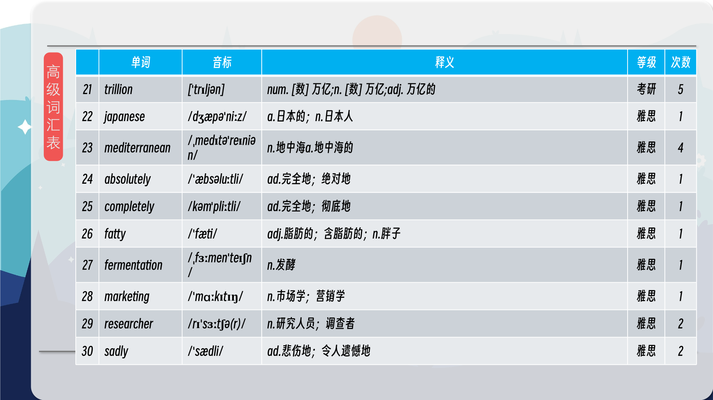
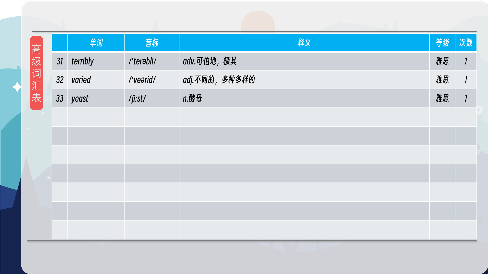

### 【核心词汇】
#### gut
your stomach and other organs through which food passes and is digested
内脏
你的胃和其他器官，食物通过这些器官并被消化。
His gut told him that something was wrong.
他的直觉告诉他有些不对劲。
#### 焦虑
fear or worry
anxiety
害怕或担心
The project is causing me a lot of anxiety.
这个项目让我感到非常焦虑。
#### germs
very small organisms which often cause disease
细菌
非常微小的生物，通常会引起疾病
Wash your hands to avoid germs.
洗手以避免细菌。
#### fermented
(of food or drink) having gone through a process where sugars are changed into acids and alcohol
发酵
（食物或饮料）经过糖转化为酸和酒精的过程
Fermented foods like yogurt and kimchi are good for your gut health.
像酸奶和泡菜这样的发酵食品对你的肠道健康有益。
#### diet
(here) the kinds of food and drink eaten by people in an area
饮食
（此处）一个地区的人们所吃的食物和饮料种类
The traditional Mediterranean diet is rich in fruits, vegetables, and olive oil.
传统的地中海饮食富含水果、蔬菜和橄榄油。
#### it’s not rocket science
it’s not difficult to understand
这不难
这不难理解
Learning to ride a bike isn't rocket science.
学骑自行车并不难。

在公众号里输入6位数字，获取【对话音频、英文文本、中文翻译、核心词汇和高级词汇表】电子档，6位数字【暗号】在文章的最后一张图片，如【220728】，表示22年7月28日这一期。公众号没有的文章说明还没有制作相关资料。年度合集在B站【六分钟英语】工房获取，每年共计300+文档，感谢支持！