### 【英文脚本】
Neil
Hello and welcome to 6 Minute English – the programme where we bring you an interesting topic and six items of vocabulary. I’m Neil. Today we’re talking about jobs.
 
Dan
And I’m Dan. And specifically, we’re looking at the trend for having more than one job…
 
Neil
Yes. On that note – Dan, were you ever asked this question as a kid? “What do you want to be when you grow up?” Do you remember your answer?
 
Dan
I wanted to be a ninja turtle. And you?
 
Neil
That doesn’t surprise me. I think I wanted to be a professional footballer. I wanted to play for England. Well, for many people, that question gets harder the older they become! It’s one reason why more and more people have what we call portfolio careers these days – so they can do a bit of everything.
 
Dan
A portfolio, as a noun, means 'a case for carrying large pictures' – or it can mean the collection of pictures themselves. But we also use it as an adjective to describe groups of certain things – in this case, careers.
 
Neil
Indeed, we could say someone who is a part-time teacher and a part-time musician has a portfolio career.
 
Dan
Sounds like a good combination. First, let’s do today’s question – it’s job-related. Many surnames in English originally come from professions. The surname Baker, for example, was originally given to people who worked as… bakers! What about the surname Bond, as in double-oh-seven, James Bond? Who had this surname? Was it: a) Farmers b) Spies c) Guards
 
Neil
It can’t be spies, can it? So I’m going to guess guards. C.
 
Dan
Great, well let’s find out at the end of the programme.
 
Neil
Now, the portfolio career. Emily Wapnick is the Canadian author of a book called How to Be Everything: A Guide for Those Who (Still) Don’t Know What They Want to Be When They Grow Up.
 
Dan
Which specific example of a portfolio career does she mention?
 
Emily Wapnick, Author
More and more people are doing multiple things and multiple jobs and it’s not just to make ends meet. A lot of people are choosing this kind of lifestyle. They’ve got, you know, three different businesses that are just thriving. Or they’re a serial entrepreneur. Or they’ve got a career in two different areas. There’s a guy I mention who is a psychotherapist and a luthier – he makes violins – and he’s very successful in both.
 
Neil
Emily is clearly a fan of this kind of working. She says she knows a man who’s both a psychotherapist and a luthier – someone who makes violins.
 
Dan
She says this trend is more than just about working to make ends meet – in other words, working to make enough money to live. And she used another interesting expression – a serial entrepreneur – what’s that exactly?
 
Neil
Well, an entrepreneur is someone who starts and runs businesses – and the use of serial here as an adjective describes someone who does the same thing again and again. Though we should say, the adjective is more often used for criminal activity – such as a serial killer or serial murderer.
 
Dan
Not the kind of portfolio career I had in mind. A serial entrepreneur, on the other hand, starts and runs business after business.
 
Neil
Another thing, because Emily believes the world of work is changing fast – it’s sensible to be able to do more than one thing. In other words, it’s wise to add another string to your bow.
 
Dan
A great phrase, which really just means 'to learn new skills you can use in the future'. I’d like to learn Japanese – that would add another string to my bow.
 
Neil
So desu, ne? But choosing a portfolio career is not for everyone, of course. It often simply comes down to money.
 
Dan
Here’s Charles Handy, writer and philosopher, and the man who popularised the term portfolio career in the first place.
 
Charles Handy, Writer
80% of the people in corporate jobs hate them, or are dissatisfied with them. Whereas if you’re doing your own thing, 80% of them really like the freedom and the entrepreneurial spirit, even if they’re not making an awful lot of money. It’s a balancing job really, you’re free but you’re poor. Or you’re slaved but you’re richer.
 
Neil
Sounds like a difficult choice – be poor or be a slave. What would you choose, Dan?
 
Dan
I’d rather be poor and free, thank you very much.
 
Neil
Well, let’s explain a term he used – a corporate job. What does corporate mean?
 
Dan
Quite literally, it’s the adjective from the term corporation - a corporate job is a job at a big corporation, company or organisation – usually well paid, and with certain benefits.
 
Neil
Could we say James Bond has a corporate career?
 
Dan
Yes, I guess so! And thank you for reminding me to answer today’s question: which profession does the surname Bond come from?
 
Neil
And I said the Bonds were guards.
 
Dan
I’m afraid you were wrong. Bonds were originally peasant farmers who were bound to work for a particular lord. This word goes back over 1,000 years… The spying game came much later!
 
Neil
Indeed! Let’s spy today’s words once more. We had portfolio – which can be used in different ways. There’s a portfolio career, as well as the original meaning of a portfolio of art. Any others?
 
Dan
Yes, people talk about a portfolio of investments – if you invest in several companies at once to reduce the risk.
 
Neil
Talking of money, we had to make ends meet. People often work a number of different part-time jobs to make ends meet – to make enough money to live on.
 
Dan
Though having a lot of part-time jobs is not the same as being a serial entrepreneur. Serial means doing something repeatedly, usually a crime!
 
Neil
And an entrepreneur is someone who starts and runs businesses.
 
Dan
I’d love to start a business… First, I need to learn a new skill - add another string to my bow and learn yoga. Then maybe one day I’ll run a yoga business.
 
Neil
Not for me though, I prefer the corporate life – a secure job in a big corporation!
 
Dan
OK, but then you can come to my yoga classes after work!
 
Neil
Alright.
 
Dan
And that's the end of today's 6 Minute English. Please join us again soon.
 
Neil
And we are on social media of course. Make sure to visit our Facebook, Twitter, Instagram and YouTube pages.
 
Both
Bye!
 

### 【中英文双语脚本】
Neil(尼尔)
Hello and welcome to 6 Minute English – the programme where we bring you an interesting topic and six items of vocabulary. I’m Neil. Today we’re talking about jobs.
您好，欢迎来到六分钟英语 - 我们为您带来一个有趣的话题和六项词汇。我是 Neil。今天我们谈论的是就业。

Dan(担)
And I’m Dan. And specifically, we’re looking at the trend for having more than one job…
我是 Dan。具体来说，我们正在研究拥有多份工作的趋势......

Neil(尼尔)
Yes. On that note – Dan, were you ever asked this question as a kid? “What do you want to be when you grow up?” Do you remember your answer?
是的。关于这一点 - Dan，你小时候有没有问过这个问题？“你长大后想成为什么？”你还记得你的答案吗？

Dan(担)
I wanted to be a ninja turtle. And you?
我想成为忍者神龟。还有你？

Neil(尼尔)
That doesn’t surprise me. I think I wanted to be a professional footballer. I wanted to play for England. Well, for many people, that question gets harder the older they become! It’s one reason why more and more people have what we call portfolio careers these days – so they can do a bit of everything.
这并不让我感到惊讶。我想我想成为一名职业足球运动员。我想为英格兰效力。好吧，对许多人来说，这个问题随着年龄的增长而变得更加困难！这就是为什么现在越来越多的人拥有我们所谓的投资组合职业的原因之一 —— 这样他们就可以做任何事情。

Dan(担)
A portfolio, as a noun, means 'a case for carrying large pictures' – or it can mean the collection of pictures themselves. But we also use it as an adjective to describe groups of certain things – in this case, careers.
作品集作为名词，意思是“携带大照片的箱子” —— 或者它可以指照片本身的集合。但我们也将其用作形容词来描述某些事物的组 —— 在本例中，职业。

Neil(尼尔)
Indeed, we could say someone who is a part-time teacher and a part-time musician has a portfolio career.
事实上，我们可以说兼职教师和兼职音乐家都有投资组合职业。

Dan(担)
Sounds like a good combination. First, let’s do today’s question – it’s job-related. Many surnames in English originally come from professions. The surname Baker, for example, was originally given to people who worked as… bakers! What about the surname Bond, as in double-oh-seven, James Bond? Who had this surname? Was it: a) Farmers b) Spies c) Guards
听起来不错。首先，让我们来回答今天的问题 – 它与工作有关。许多英文姓氏最初来自职业。例如，贝克这个姓氏最初是给那些担任...面包 师！姓氏邦德（Bond）呢，比如双七（double-oh-seven）中的詹姆斯·邦德（James Bond）呢？这个姓氏是谁？是不是：a） 农民 b） 间谍 c） 守卫

Neil(尼尔)
It can’t be spies, can it? So I’m going to guess guards. C.
不可能是间谍，对吧？所以我要猜猜后卫。C.

Dan(担)
Great, well let’s find out at the end of the programme.
太好了，让我们在节目结束时找出答案。

Neil(尼尔)
Now, the portfolio career. Emily Wapnick is the Canadian author of a book called How to Be Everything: A Guide for Those Who (Still) Don’t Know What They Want to Be When They Grow Up.
现在，投资组合职业。艾米丽·瓦普尼克 （Emily Wapnick） 是加拿大作家，著有一本名为《如何成为一切：给那些（仍然）不知道自己长大后想成为什么的人的指南》的书。

Dan(担)
Which specific example of a portfolio career does she mention?
她提到了哪个投资组合职业的具体例子？

Emily Wapnick, Author(EmilyWapnick，作家)
More and more people are doing multiple things and multiple jobs and it’s not just to make ends meet. A lot of people are choosing this kind of lifestyle. They’ve got, you know, three different businesses that are just thriving. Or they’re a serial entrepreneur. Or they’ve got a career in two different areas. There’s a guy I mention who is a psychotherapist and a luthier – he makes violins – and he’s very successful in both.
越来越多的人从事多种事情和多种工作，这不仅仅是为了维持生计。很多人都在选择这种生活方式。你知道，他们有三家不同的企业正在蓬勃发展。或者他们是一个连续创业者。或者他们在两个不同的领域都有职业生涯。我提到有一个人，他是一名心理治疗师和制琴师 —— 他制作小提琴 —— 他在这两方面都非常成功。

Neil(尼尔)
Emily is clearly a fan of this kind of working. She says she knows a man who’s both a psychotherapist and a luthier – someone who makes violins.
Emily 显然是这种工作的粉丝。她说她认识一个既是心理治疗师又是制琴师的男人 —— 一个制作小提琴的人。

Dan(担)
She says this trend is more than just about working to make ends meet – in other words, working to make enough money to live. And she used another interesting expression – a serial entrepreneur – what’s that exactly?
她说，这种趋势不仅仅是为了维持生计而工作 —— 换句话说，努力赚到足够的钱来生活。她还用了另一个有趣的表达方式 —— a serial entrepreneur —— 那到底是什么？

Neil(尼尔)
Well, an entrepreneur is someone who starts and runs businesses – and the use of serial here as an adjective describes someone who does the same thing again and again. Though we should say, the adjective is more often used for criminal activity – such as a serial killer or serial murderer.
嗯，企业家是创办和经营企业的人 —— 在这里使用 serial 作为形容词来描述一次又一次地做同样事情的人。虽然我们应该说，这个形容词更常用于犯罪活动 —— 例如连环杀手或连环杀人犯。

Dan(担)
Not the kind of portfolio career I had in mind. A serial entrepreneur, on the other hand, starts and runs business after business.
不是我心目中的那种投资组合职业。另一方面，连续创业者一个接一个地开始和经营企业。

Neil(尼尔)
Another thing, because Emily believes the world of work is changing fast – it’s sensible to be able to do more than one thing. In other words, it’s wise to add another string to your bow.
另一件事，因为 Emily 相信工作世界正在快速变化 —— 能够做不止一件事是明智的。换句话说，在你的弓上再加一根弦是明智的。

Dan(担)
A great phrase, which really just means 'to learn new skills you can use in the future'. I’d like to learn Japanese – that would add another string to my bow.
一个很棒的短语，它真的只是意味着“学习你将来可以使用的新技能”。我想学习日语 - 这将为我的弓增加另一根弦。

Neil(尼尔)
So desu, ne? But choosing a portfolio career is not for everyone, of course. It often simply comes down to money.
所以 desu，ne？但当然，选择投资组合职业并不适合所有人。这通常简单地归结为金钱。

Dan(担)
Here’s Charles Handy, writer and philosopher, and the man who popularised the term portfolio career in the first place.
这是作家和哲学家查尔斯·汉迪 （Charles Handy），也是最早推广投资组合职业一词的人。

Charles Handy, Writer(CharlesHandy，作家)
80% of the people in corporate jobs hate them, or are dissatisfied with them. Whereas if you’re doing your own thing, 80% of them really like the freedom and the entrepreneurial spirit, even if they’re not making an awful lot of money. It’s a balancing job really, you’re free but you’re poor. Or you’re slaved but you’re richer.
80% 的公司工作人员讨厌他们，或者对他们不满意。而如果你在做自己的事情，他们中的 80% 真的很喜欢自由和创业精神，即使他们赚的钱不多。这真的是一项平衡的工作，你很自由，但你很穷。或者你是奴隶，但你更富有。

Neil(尼尔)
Sounds like a difficult choice – be poor or be a slave. What would you choose, Dan?
听起来像是一个艰难的选择 —— 要么贫穷，要么成为奴隶。你会选择什么，丹？

Dan(担)
I’d rather be poor and free, thank you very much.
我宁愿贫穷自由，非常感谢。

Neil(尼尔)
Well, let’s explain a term he used – a corporate job. What does corporate mean?
好吧，让我们解释一下他用的一个术语 —— 公司工作。公司是什么意思？

Dan(担)
Quite literally, it’s the adjective from the term corporation - a corporate job is a job at a big corporation, company or organisation – usually well paid, and with certain benefits.
从字面上看，它是来自公司一词的形容词 - 公司工作是在大公司、公司或组织的工作 - 通常薪水很高，并有一定的福利。

Neil(尼尔)
Could we say James Bond has a corporate career?
我们能说詹姆斯·邦德有企业生涯吗？

Dan(担)
Yes, I guess so! And thank you for reminding me to answer today’s question: which profession does the surname Bond come from?
是的，我想是的！谢谢你提醒我回答今天的问题：邦德这个姓氏来自哪个职业？

Neil(尼尔)
And I said the Bonds were guards.
我说邦德夫妇是守卫。

Dan(担)
I’m afraid you were wrong. Bonds were originally peasant farmers who were bound to work for a particular lord. This word goes back over 1,000 years… The spying game came much later!
恐怕你错了。邦德最初是农民，他们必须为特定的领主工作。这个词可以追溯到 1000 多年前......间谍游戏来得晚得多！

Neil(尼尔)
Indeed! Let’s spy today’s words once more. We had portfolio – which can be used in different ways. There’s a portfolio career, as well as the original meaning of a portfolio of art. Any others?
事实上！让我们再次窥探今天的文字。我们有投资组合 – 可以以不同的方式使用。有一个作品集职业，以及艺术作品集的原意。还有其他的吗？

Dan(担)
Yes, people talk about a portfolio of investments – if you invest in several companies at once to reduce the risk.
是的，人们谈论的是投资组合 —— 如果您同时投资几家公司以降低风险。

Neil(尼尔)
Talking of money, we had to make ends meet. People often work a number of different part-time jobs to make ends meet – to make enough money to live on.
说到钱，我们不得不维持生计。人们经常做一些不同的兼职工作来维持生计 —— 赚到足够的钱来维持生活。

Dan(担)
Though having a lot of part-time jobs is not the same as being a serial entrepreneur. Serial means doing something repeatedly, usually a crime!
虽然有很多兼职工作与成为连续创业者不同。Serial 意味着反复做某事，通常是犯罪！

Neil(尼尔)
And an entrepreneur is someone who starts and runs businesses.
企业家是创办和经营企业的人。

Dan(担)
I’d love to start a business… First, I need to learn a new skill - add another string to my bow and learn yoga. Then maybe one day I’ll run a yoga business.
我很想创业...首先，我需要学习一项新技能 - 在我的弓上再加一根弦，学习瑜伽。然后也许有一天我会经营一家瑜伽生意。

Neil(尼尔)
Not for me though, I prefer the corporate life – a secure job in a big corporation!
但对我来说不是，我更喜欢公司生活 —— 在大公司找到一份稳定的工作！

Dan(担)
OK, but then you can come to my yoga classes after work!
好的，但下班后你可以来参加我的瑜伽课！

Neil(尼尔)
Alright.
好。

Dan(担)
And that's the end of today's 6 Minute English. Please join us again soon.
这就是今天的六分钟 English 的结尾。请尽快再次加入我们。

Neil(尼尔)
And we are on social media of course. Make sure to visit our Facebook, Twitter, Instagram and YouTube pages.
当然，我们在社交媒体上。请务必访问我们的 Facebook、Twitter、Instagram 和 YouTube 页面。

Both(双)
Bye!
再见！

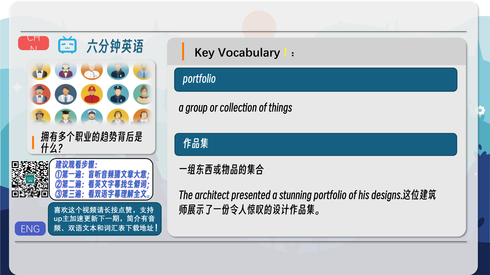
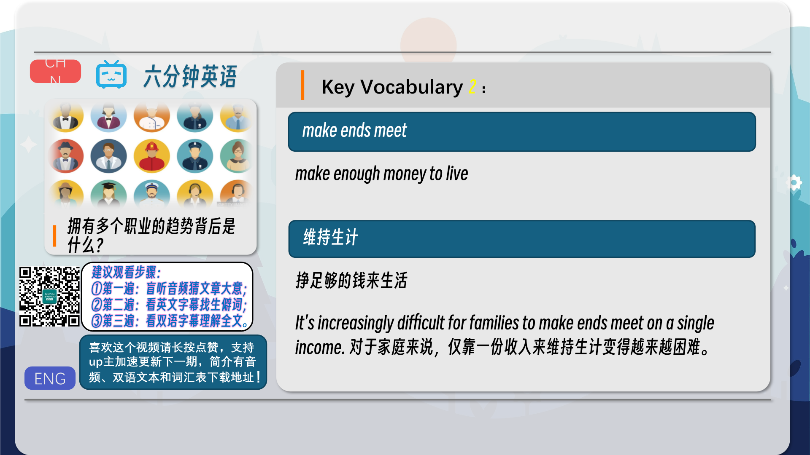
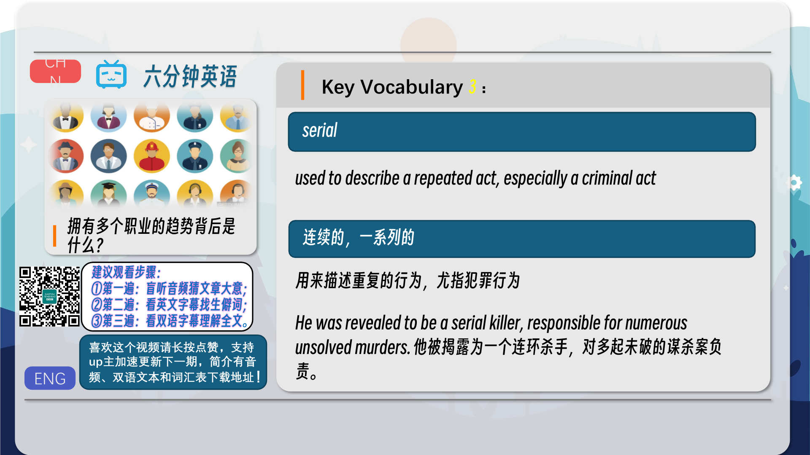
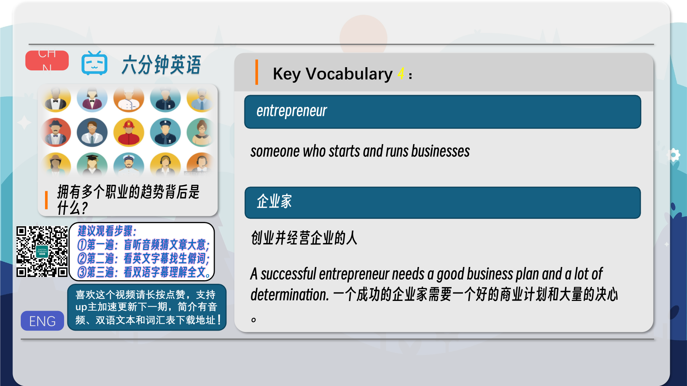
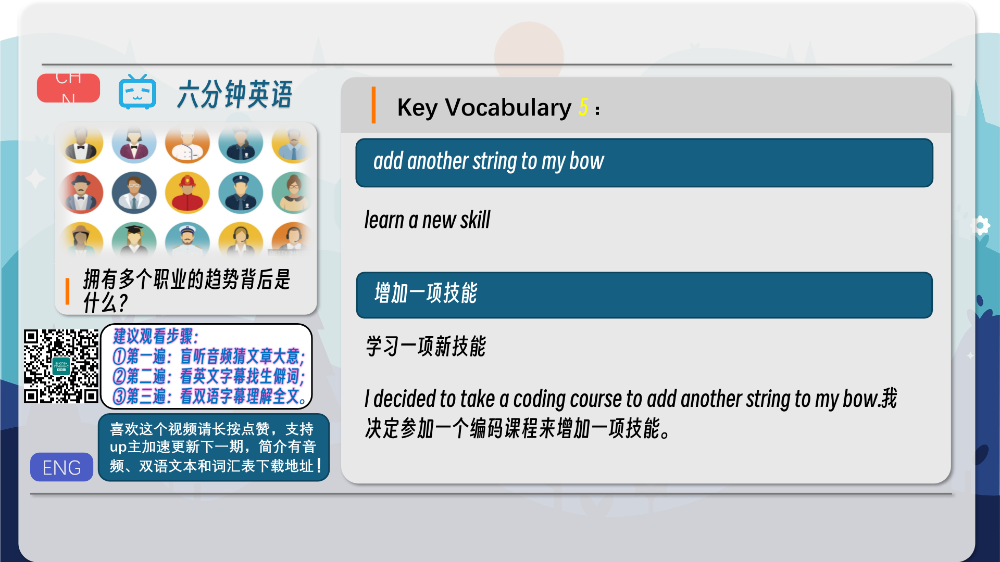
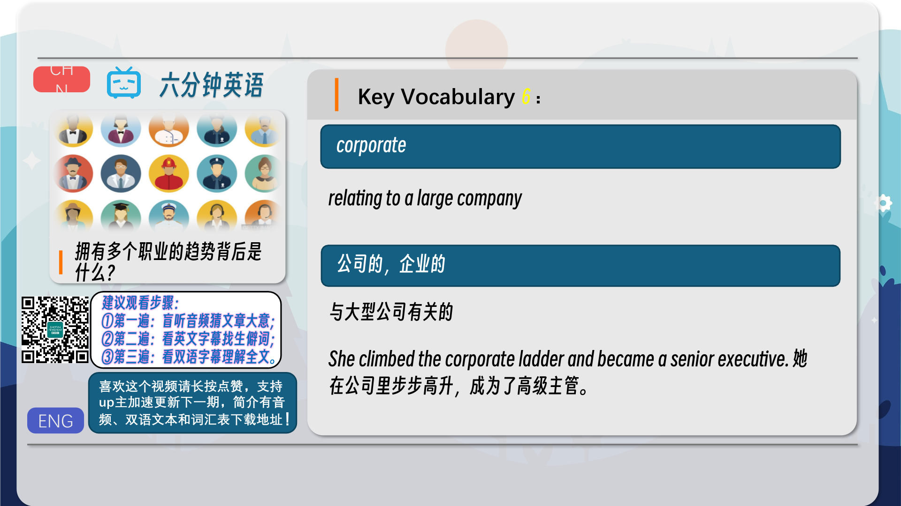
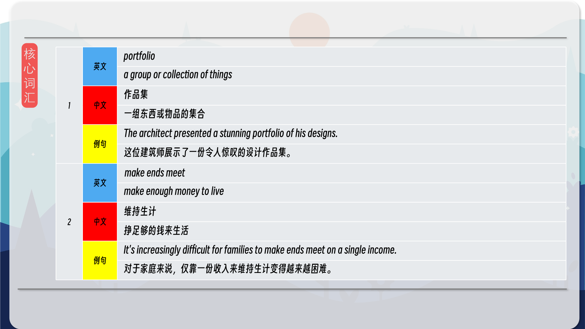
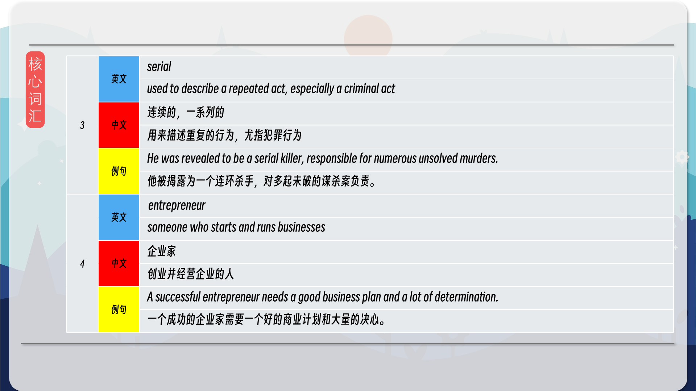
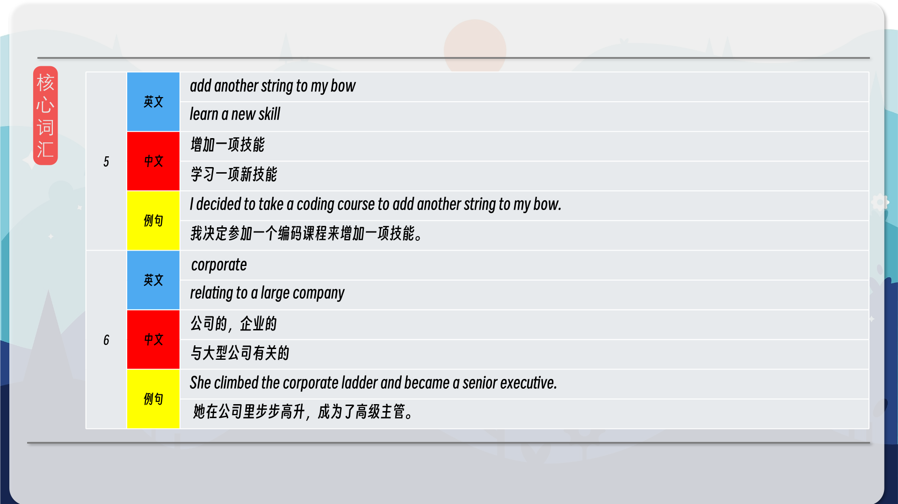
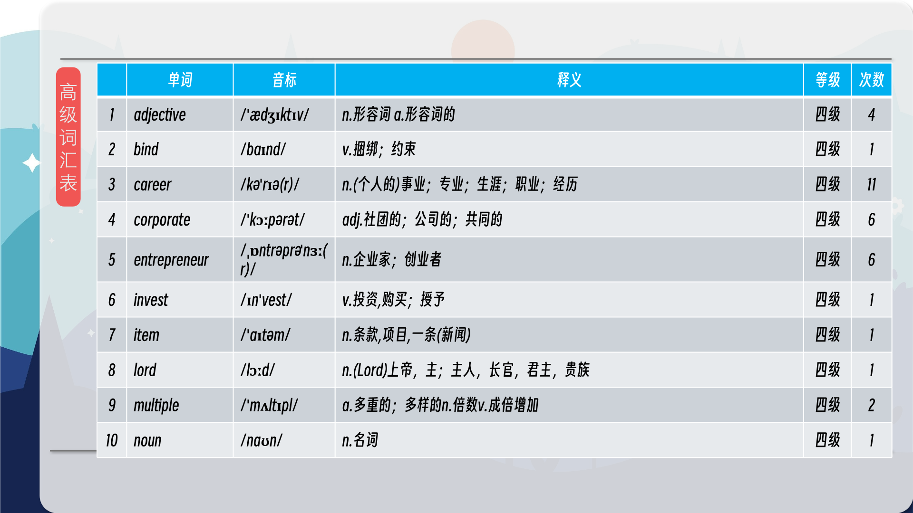
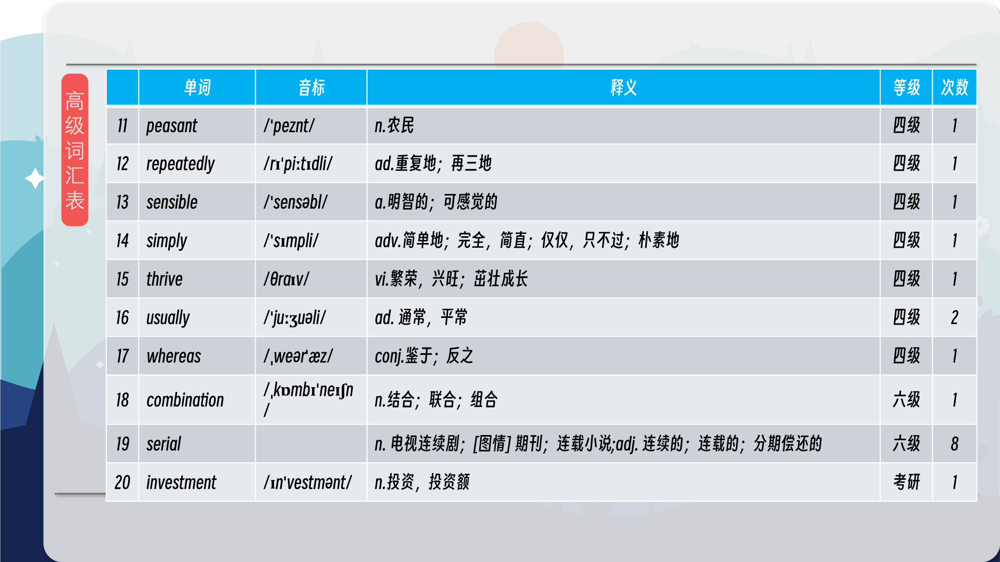
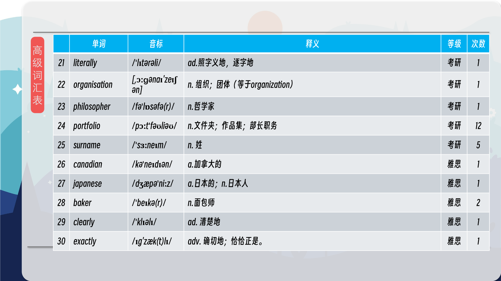
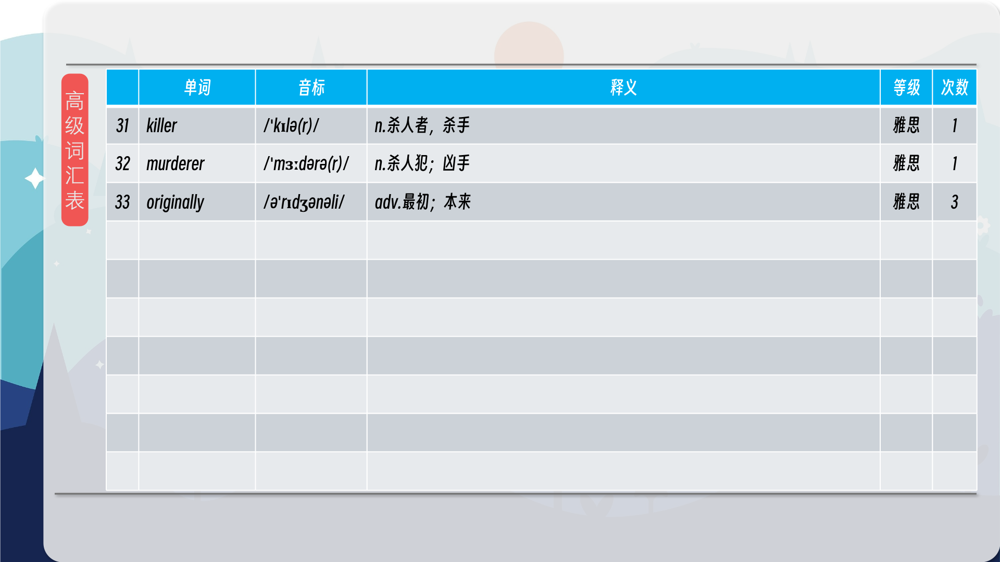

### 【核心词汇】
#### portfolio
a group or collection of things
作品集
一组东西或物品的集合
The architect presented a stunning portfolio of his designs.
这位建筑师展示了一份令人惊叹的设计作品集。
#### make ends meet
make enough money to live
维持生计
挣足够的钱来生活
It's increasingly difficult for families to make ends meet on a single income.
对于家庭来说，仅靠一份收入来维持生计变得越来越困难。
#### serial
used to describe a repeated act, especially a criminal act
连续的，一系列的
用来描述重复的行为，尤指犯罪行为
He was revealed to be a serial killer, responsible for numerous unsolved murders.
他被揭露为一个连环杀手，对多起未破的谋杀案负责。
#### entrepreneur
someone who starts and runs businesses
企业家
创业并经营企业的人
A successful entrepreneur needs a good business plan and a lot of determination.
一个成功的企业家需要一个好的商业计划和大量的决心。
#### add another string to my bow
learn a new skill
增加一项技能
学习一项新技能
I decided to take a coding course to add another string to my bow.
我决定参加一个编码课程来增加一项技能。
#### corporate
relating to a large company
公司的，企业的
与大型公司有关的
She climbed the corporate ladder and became a senior executive.
 她在公司里步步高升，成为了高级主管。

在公众号里输入6位数字，获取【对话音频、英文文本、中文翻译、核心词汇和高级词汇表】电子档，6位数字【暗号】在文章的最后一张图片，如【220728】，表示22年7月28日这一期。公众号没有的文章说明还没有制作相关资料。年度合集在B站【六分钟英语】工房获取，每年共计300+文档，感谢支持！