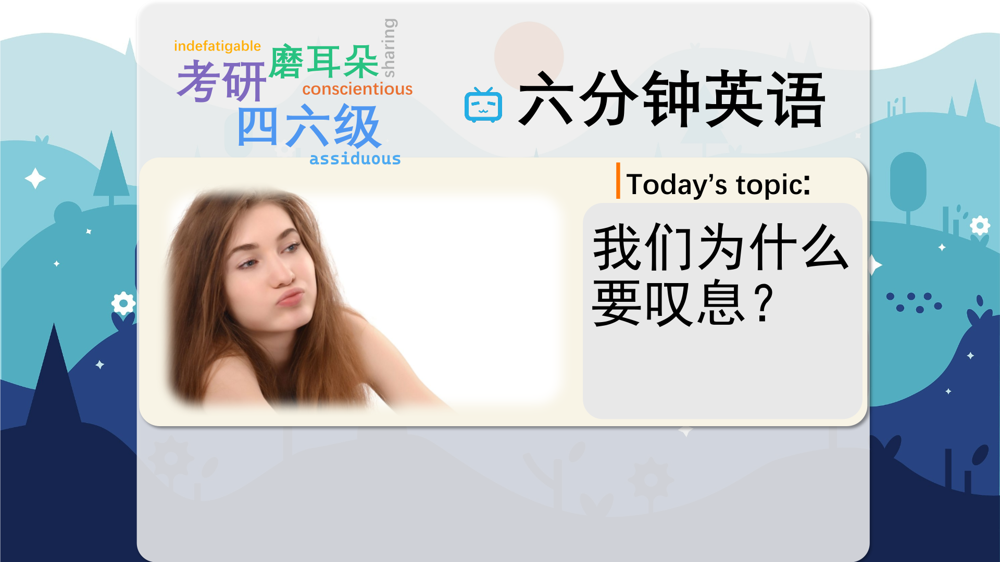

### 【英文脚本】
Dan
Hello and welcome to 6 Minute English – the programme where we bring you an interesting topic and six items of vocabulary. I’m Dan. And today we’re talking about...
 
Catherine
Sighing. I’m Catherine.
 
Dan
Now – was that a real sigh – or just one to demonstrate the meaning?
 
Catherine
That one was just for educational purposes, of course, Dan.
 
Dan
We’ll be looking at why we sigh, and learn how sighing keeps us alive!
 
Catherine
Yes, very interesting. And it’s not just humans that sigh, is it, Dan?
 
Dan
Indeed, most mammals sigh. And that brings me to today’s question. How many times does a mouse sigh in an hour, on average? Is it? a) Twice b) 10 times c) 40 times
 
Catherine
I’m going to say the poor little thing will sigh about 40 times an hour
 
Dan
OK. Let’s find out if you’re right later on in the programme. Now, what is a sigh, exactly?
 
Catherine
Let’s hear from Dr Lynne Barker, a cognitive neuroscientist from Sheffield Hallam University in the UK.
 
Dr Lynne Barker, Cognitive Neuroscientist, Sheffield Hallam University
It’s a typically cardio-respiratory kind of resetting mechanism, and most mammals will engage in sighing of some kind. Because people who don’t sigh would eventually die. It is a survival mechanism.
 
Catherine
So sighing keeps us alive.
 
Dan
Dr Barker called it a survival mechanism. To survive means to continue living, especially in difficult circumstances. A mechanism, here, means a system of behaviour.
 
Catherine
So, a survival mechanism is something the body does automatically in order to survive. But, Dan, why is sighing a survival mechanism?
 
Dan
It’s because sighing can reset the lungs. To reset is to return something to its original settings. We often use this verb when talking about technology. You can reset a computer or a phone.
 
Catherine
OK, that’s fine. But how does a sigh reset the lungs?
 
Dan
Well, scientists from UCLA, that’s the University of California, Los Angeles, found that a sigh is a special kind of very deep breath that keeps the tiny sacs of air in our lungs, called alveoli, working properly.
 
Catherine
And without sighing, these alveoli would collapse and we would die. We need the alveoli to transfer oxygen from our lungs to our blood.
 
Dan
Thankfully, we don’t have to think about this need to reset our lungs. Sighing is in fact a reflex.
 
Catherine
Boo!
 
Dan
Argh!
 
Catherine
There – you jumped! And that was a fabulous reflex, Dan! It’s something our bodies do without thinking, something you do unconsciously or automatically.
 
Dan
I meant like a man. Thank you for that, Catherine.
 
Catherine
You’re welcome.
 
Dan
Do you sigh a lot?
 
Catherine
Well, I sigh when I’m tired, and I sigh when I’m relieved. I breathe a sigh of relief.
 
Dan
To breathe a sigh of relief – that’s a great expression. It means what you think it means – to sigh when you feel good that something bad has not happened – but it’s often used metaphorically. It relates more to the feeling of relief than the act of sighing.
 
Catherine
That’s right. Now, I breathed a sigh of relief when I found my mobile phone the other day. I thought I’d lost it. It was new. I was so pleased when I found it! What about you, Dan?
 
Dan
I tend to sigh to show frustration. And sometimes resignation.
 
Catherine
Now, frustration is what we feel when things aren’t going well, when things are annoying us and they don’t work. When things are frustrating.
 
Dan
And resignation is what we feel when we finally accept that something bad has happened, that we can’t change. We feel resigned to something.
 
Catherine
So, relief, resignation, frustration, resetting our lungs. It sounds like we humans never stop sighing!
 
Dan
Well, actually, we humans sigh on average 12 times an hour. But what about. mice?
 
Catherine
Well, I said, I reckon they sigh about 40 times an hour.
 
Dan
Well, in fact, it is 40 times an hour. The hearts of mice beat faster – so they need to regulate their lungs more than humans.
 
Catherine
Let’s review today’s vocabulary.
 
Dan
We had the phrase survival mechanism. Something we do without thinking that keeps us alive.
 
Catherine
We often use this phrase, and the related phrase defence mechanism, when talking about what people do to cope with difficulties in life.
 
Dan
Next, we had reset. You can reset a computer, or a machine – to make it work again. This usually means switching it off and on again.
 
Catherine
And you can reset a password – this is a little bit different. It means to set – or choose - a new password.
 
Dan
We also had the word reflex. This is a physical action or reaction that you can’t control. For example. Catherine?
 
Catherine
Yes?
 
Dan
There, you closed your eyes. Another reflex.
 
Catherine
And we had to breathe a sigh to relief. Which means to feel better after something bad doesn’t happen. I breathed a sigh of relief when my friend recovered from her illness.
 
Dan
But we sigh for other reasons too. Two useful sighing words were: frustration and resignation.
 
Catherine
Frustration is the state of being frustrated. We can say something is frustrating. It’s frustrating when my boss doesn’t listen to me.
 
Dan
But let’s say you move beyond feeling frustrated and start feeling resigned.
 
Catherine
Yeah, and that would be when I finally accept my boss will never listen to me. And that’s when I’ll resign!
 
Dan
To resign also means to voluntarily leave a job! Please, Catherine, tell me that’s just another vocabulary example?
 
Catherine
Of course it is, Dan. I love my job! I only ever sigh, what, 12 times an hour?!
 
Dan
Which is perfectly average. And that's it for today's 6 Minute English. Please join us again soon.
 
Catherine
And we are on social media too. Make sure to find us on Facebook, Twitter, Instagram and YouTube.
 
Both
Bye!
 

### 【中英文双语脚本】
Dan(担)
Hello and welcome to 6 Minute English – the programme where we bring you an interesting topic and six items of vocabulary. I’m Dan. And today we’re talking about...
您好，欢迎来到六分钟英语 - 我们为您带来一个有趣的话题和六项词汇。我是 Dan。今天我们讨论的是......

Catherine(凯瑟琳)
Sighing. I’m Catherine.
叹息。我是 Catherine。

Dan(担)
Now – was that a real sigh – or just one to demonstrate the meaning?
现在 —— 这是真的叹息 —— 还是只是为了证明它的含义？

Catherine(凯瑟琳)
That one was just for educational purposes, of course, Dan.
那只是为了教育目的，当然，Dan。

Dan(担)
We’ll be looking at why we sigh, and learn how sighing keeps us alive!
我们将看看我们为什么叹息，并了解叹息如何让我们活着！

Catherine(凯瑟琳)
Yes, very interesting. And it’s not just humans that sigh, is it, Dan?
是的，非常有趣。叹息的不仅仅是人类，不是吗，Dan？

Dan(担)
Indeed, most mammals sigh. And that brings me to today’s question. How many times does a mouse sigh in an hour, on average? Is it? a) Twice b) 10 times c) 40 times
事实上，大多数哺乳动物都会叹息。这就引出了我今天的问题。老鼠平均一小时会叹气多少次？是吗？a） 2 次 b） 10 次 c） 40 次

Catherine(凯瑟琳)
I’m going to say the poor little thing will sigh about 40 times an hour
我要说这个可怜的小家伙每小时会叹气大约 40 次

Dan(担)
OK. Let’s find out if you’re right later on in the programme. Now, what is a sigh, exactly?
还行。让我们看看您在该计划的后面是否正确。那么，究竟什么是叹息呢？

Catherine(凯瑟琳)
Let’s hear from Dr Lynne Barker, a cognitive neuroscientist from Sheffield Hallam University in the UK.
让我们听听英国谢菲尔德哈勒姆大学的认知神经科学家 Lynne Barker 博士的演讲。

Dr Lynne Barker, Cognitive Neuroscientist, Sheffield Hallam University(谢菲尔德哈勒姆大学认知神经科学家LynneBarker博士)
It’s a typically cardio-respiratory kind of resetting mechanism, and most mammals will engage in sighing of some kind. Because people who don’t sigh would eventually die. It is a survival mechanism.
这是一种典型的心肺重置机制，大多数哺乳动物都会进行某种形式的叹息。因为不叹息的人最终会死去。它是一种生存机制。

Catherine(凯瑟琳)
So sighing keeps us alive.
所以叹息让我们活着。

Dan(担)
Dr Barker called it a survival mechanism. To survive means to continue living, especially in difficult circumstances. A mechanism, here, means a system of behaviour.
巴克博士称其为一种生存机制。生存意味着继续生活，尤其是在困难的环境中。在这里，机制是指行为系统。

Catherine(凯瑟琳)
So, a survival mechanism is something the body does automatically in order to survive. But, Dan, why is sighing a survival mechanism?
因此，生存机制是身体为了生存而自动做的事情。但是，Dan，为什么叹息是一种生存机制呢？

Dan(担)
It’s because sighing can reset the lungs. To reset is to return something to its original settings. We often use this verb when talking about technology. You can reset a computer or a phone.
这是因为叹息可以重置肺部。To reset 是将某些内容恢复到其原始设置。我们在谈论技术时经常使用这个动词。您可以重置计算机或手机。

Catherine(凯瑟琳)
OK, that’s fine. But how does a sigh reset the lungs?
好的，没关系。但是，一声叹息是如何使肺重置的呢？

Dan(担)
Well, scientists from UCLA, that’s the University of California, Los Angeles, found that a sigh is a special kind of very deep breath that keeps the tiny sacs of air in our lungs, called alveoli, working properly.
加州大学洛杉矶分校（UCLA）的科学家们发现，叹息是一种特殊的深呼吸，可以保持我们肺部的微小空气囊（称为肺泡）正常工作。

Catherine(凯瑟琳)
And without sighing, these alveoli would collapse and we would die. We need the alveoli to transfer oxygen from our lungs to our blood.
如果不叹息，这些肺泡就会塌陷，我们就会死去。我们需要肺泡将氧气从肺部转移到血液中。

Dan(担)
Thankfully, we don’t have to think about this need to reset our lungs. Sighing is in fact a reflex.
值得庆幸的是，我们不必考虑重置肺部的需要。叹息实际上是一种条件反射。

Catherine(凯瑟琳)
Boo!
喝倒彩！

Dan(担)
Argh!
啊！

Catherine(凯瑟琳)
There – you jumped! And that was a fabulous reflex, Dan! It’s something our bodies do without thinking, something you do unconsciously or automatically.
你跳了！这真是一个美妙的反应，丹！这是我们的身体不假思索地做的事情，是你无意识或自动做的事情。

Dan(担)
I meant like a man. Thank you for that, Catherine.
我是说像个男人。谢谢你，凯瑟琳。

Catherine(凯瑟琳)
You’re welcome.
别客气。

Dan(担)
Do you sigh a lot?
你是不是经常叹息？

Catherine(凯瑟琳)
Well, I sigh when I’m tired, and I sigh when I’m relieved. I breathe a sigh of relief.
嗯，累了就叹气，松了一口气就叹。我松了一口气。

Dan(担)
To breathe a sigh of relief – that’s a great expression. It means what you think it means – to sigh when you feel good that something bad has not happened – but it’s often used metaphorically. It relates more to the feeling of relief than the act of sighing.
松一口气 – 这是一个很好的表达。它的意思是你认为的意思 —— 当你感觉良好时叹息，因为坏事没有发生 —— 但它经常被用来比喻。它更多地与解脱的感觉有关，而不是叹息的行为。

Catherine(凯瑟琳)
That’s right. Now, I breathed a sigh of relief when I found my mobile phone the other day. I thought I’d lost it. It was new. I was so pleased when I found it! What about you, Dan?
没错。现在，当我前几天找到我的手机时，我松了一口气。我以为我已经失去了它。它是新的。当我找到它时，我非常高兴！丹，你呢？

Dan(担)
I tend to sigh to show frustration. And sometimes resignation.
我倾向于叹息以表示沮丧。有时是无奈。

Catherine(凯瑟琳)
Now, frustration is what we feel when things aren’t going well, when things are annoying us and they don’t work. When things are frustrating.
现在，当事情进展不顺利时，当事情让我们烦恼并且它们不起作用时，我们会感到沮丧。当事情令人沮丧时。

Dan(担)
And resignation is what we feel when we finally accept that something bad has happened, that we can’t change. We feel resigned to something.
而顺从是当我们最终接受发生了我们无法改变的坏事时的感觉。我们对某些事情感到无奈。

Catherine(凯瑟琳)
So, relief, resignation, frustration, resetting our lungs. It sounds like we humans never stop sighing!
所以，解脱、顺从、沮丧、重置我们的肺。听起来我们人类从来没有停止过叹息！

Dan(担)
Well, actually, we humans sigh on average 12 times an hour. But what about. mice?
嗯，实际上，我们人类平均每小时叹息 12 次。但是呢。小 鼠？

Catherine(凯瑟琳)
Well, I said, I reckon they sigh about 40 times an hour.
嗯，我说，我估计他们每小时大约叹气 40 次。

Dan(担)
Well, in fact, it is 40 times an hour. The hearts of mice beat faster – so they need to regulate their lungs more than humans.
嗯，事实上，它是每小时 40 次。老鼠的心脏跳动得更快 —— 因此它们比人类更需要调节自己的肺部。

Catherine(凯瑟琳)
Let’s review today’s vocabulary.
让我们回顾一下今天的词汇。

Dan(担)
We had the phrase survival mechanism. Something we do without thinking that keeps us alive.
我们有 survival mechanism 这个词。我们不假思索地做的事情让我们活着。

Catherine(凯瑟琳)
We often use this phrase, and the related phrase defence mechanism, when talking about what people do to cope with difficulties in life.
在谈论人们如何应对生活中的困难时，我们经常使用这个短语以及相关的短语 defence mechanism。

Dan(担)
Next, we had reset. You can reset a computer, or a machine – to make it work again. This usually means switching it off and on again.
接下来，我们重置了。您可以重置计算机或机器 – 使其再次工作。这通常意味着将其关闭并重新打开。

Catherine(凯瑟琳)
And you can reset a password – this is a little bit different. It means to set – or choose - a new password.
您可以重置密码 – 这有点不同。这意味着设置或选择 - 新密码。

Dan(担)
We also had the word reflex. This is a physical action or reaction that you can’t control. For example. Catherine?
我们还有 reflex 这个词。这是您无法控制的身体动作或反应。例如。凯瑟 琳？

Catherine(凯瑟琳)
Yes?
是的？

Dan(担)
There, you closed your eyes. Another reflex.
在那里，你闭上了眼睛。又一次反射。

Catherine(凯瑟琳)
And we had to breathe a sigh to relief. Which means to feel better after something bad doesn’t happen. I breathed a sigh of relief when my friend recovered from her illness.
我们不得不松一口气。这意味着在坏事没有发生后感觉更好。当我的朋友从病中康复时，我松了一口气。

Dan(担)
But we sigh for other reasons too. Two useful sighing words were: frustration and resignation.
但我们也会因为其他原因而叹息。两个有用的叹息词是：沮丧和无奈。

Catherine(凯瑟琳)
Frustration is the state of being frustrated. We can say something is frustrating. It’s frustrating when my boss doesn’t listen to me.
挫折是沮丧的状态。我们可以说有些事情令人沮丧。当我的老板不听我的话时，这很令人沮丧。

Dan(担)
But let’s say you move beyond feeling frustrated and start feeling resigned.
但是，假设您不再感到沮丧，开始感到无奈。

Catherine(凯瑟琳)
Yeah, and that would be when I finally accept my boss will never listen to me. And that’s when I’ll resign!
是的，那时我终于接受了我的老板永远不会听我的话。那时我就要辞职了！

Dan(担)
To resign also means to voluntarily leave a job! Please, Catherine, tell me that’s just another vocabulary example?
To resigning 也意味着自愿离职！请问，Catherine，请告诉我这只是另一个词汇示例？

Catherine(凯瑟琳)
Of course it is, Dan. I love my job! I only ever sigh, what, 12 times an hour?!
当然是，丹。我热爱我的工作！我只叹气，什么，每小时 12 次？！

Dan(担)
Which is perfectly average. And that's it for today's 6 Minute English. Please join us again soon.
这是完全平均的。这就是今天的六分钟 English 内容。请尽快再次加入我们。

Catherine(凯瑟琳)
And we are on social media too. Make sure to find us on Facebook, Twitter, Instagram and YouTube.
我们也在社交媒体上。请务必在 Facebook、Twitter、Instagram 和 YouTube 上找到我们。

Both(双)
Bye!
再见！

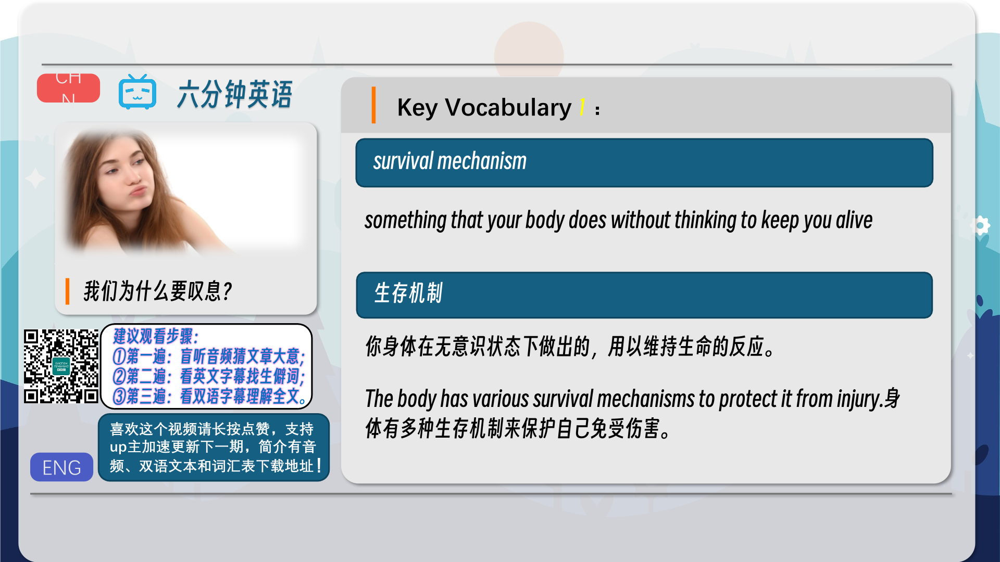
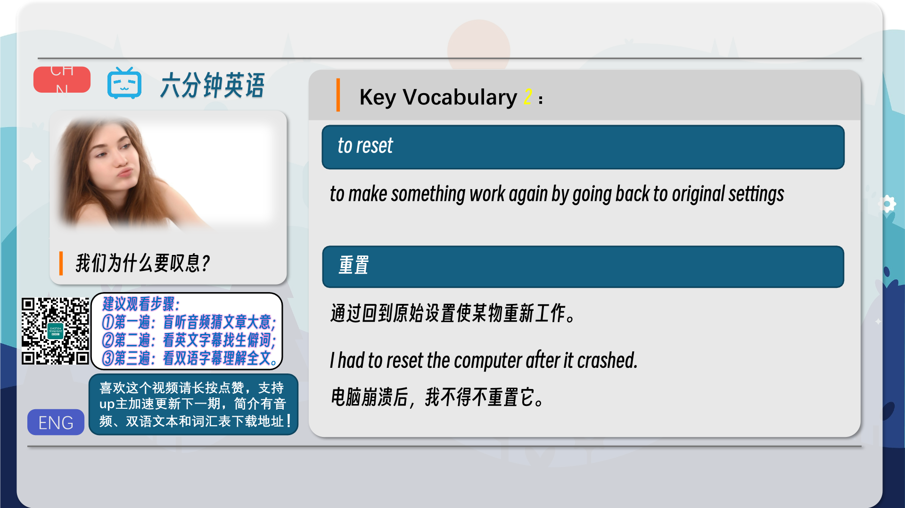
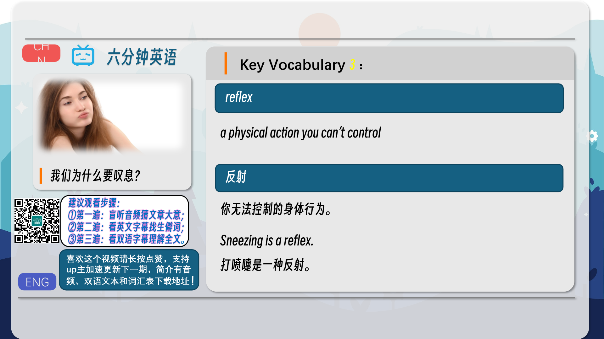
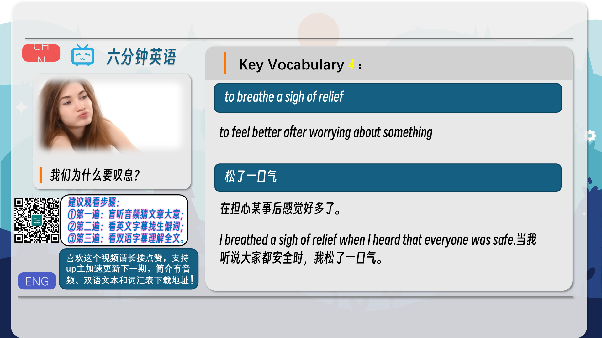
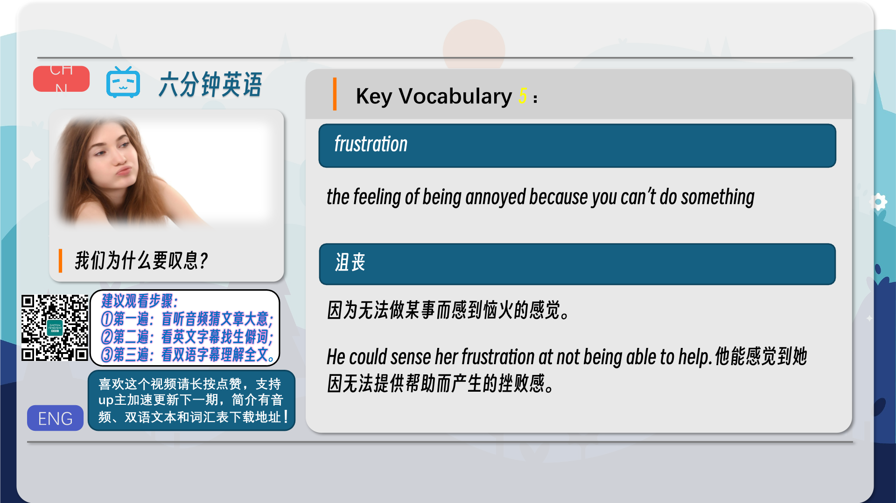
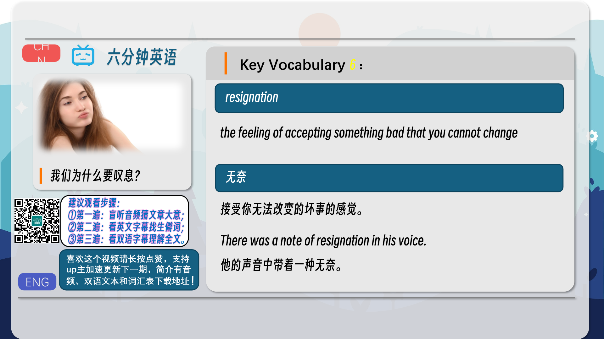
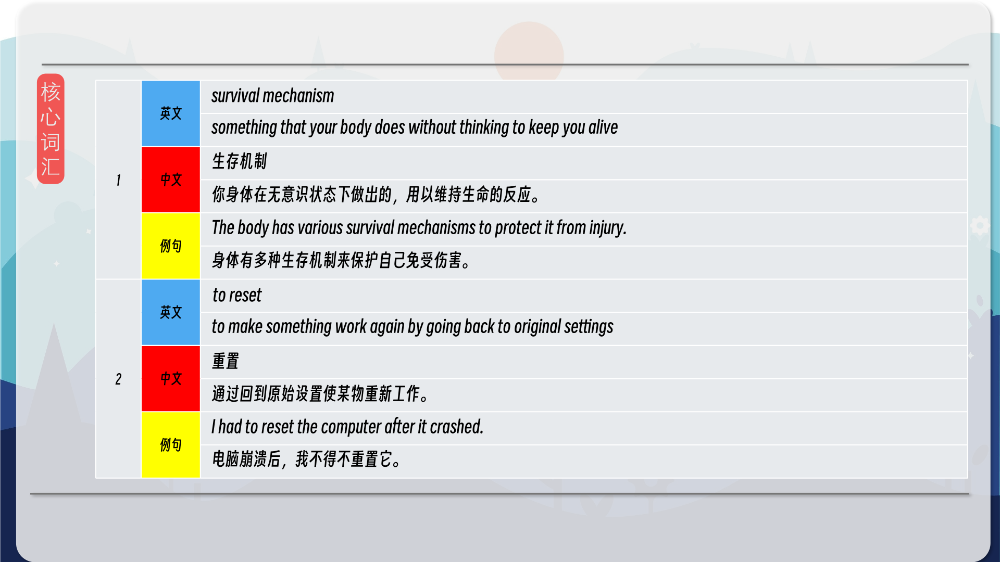
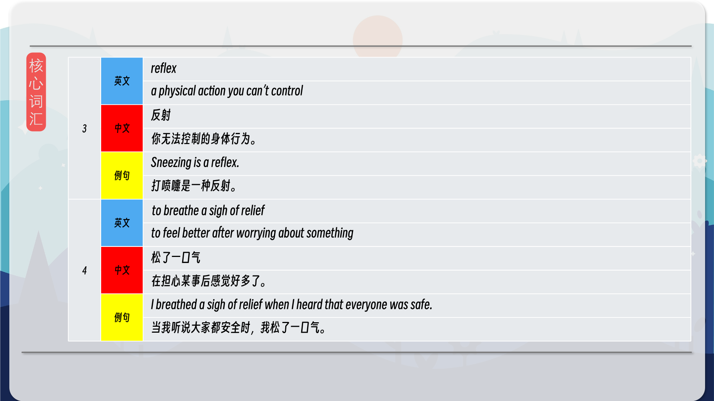
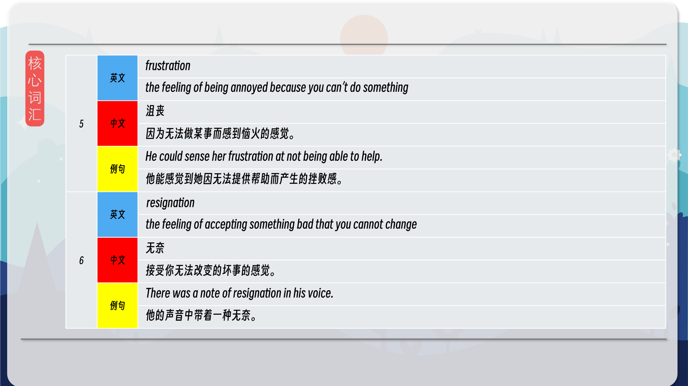
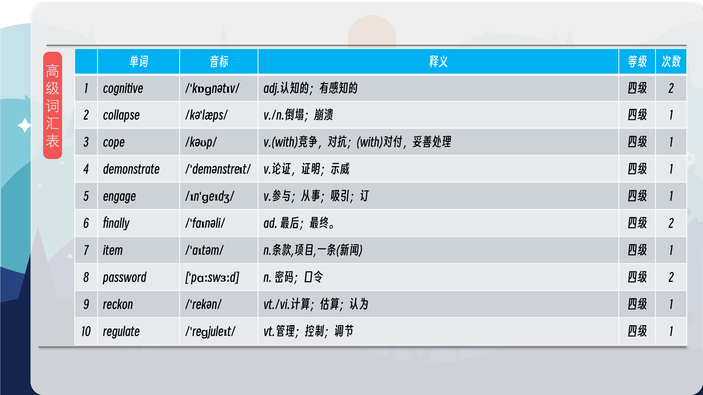
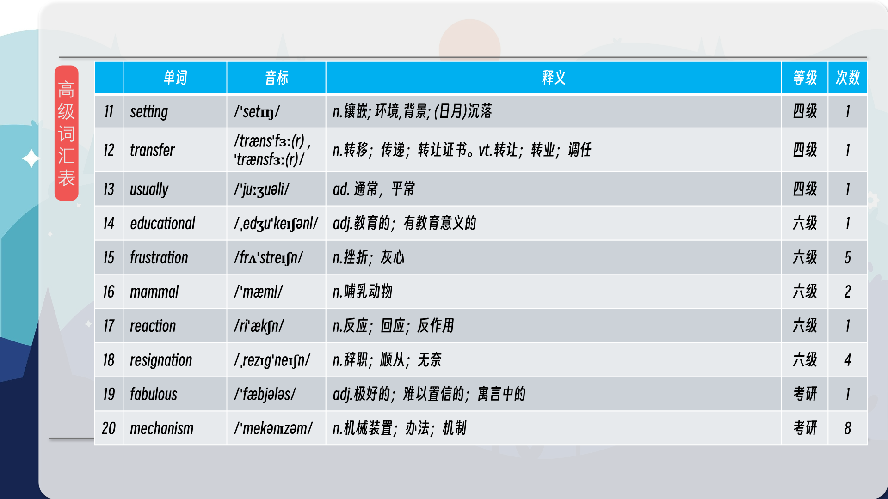
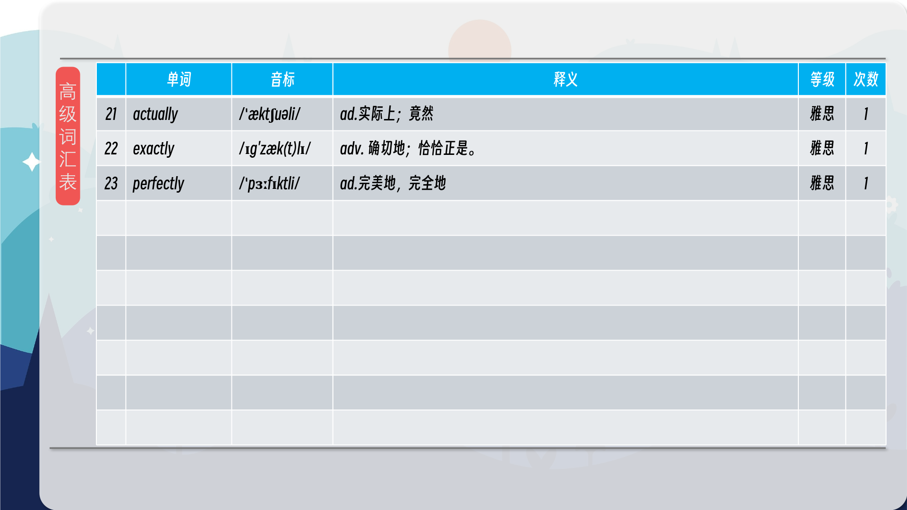

### 【核心词汇】
#### survival mechanism
something that your body does without thinking to keep you alive
生存机制
你身体在无意识状态下做出的，用以维持生命的反应。
The body has various survival mechanisms to protect it from injury.
身体有多种生存机制来保护自己免受伤害。
#### to reset
to make something work again by going back to original settings
重置
通过回到原始设置使某物重新工作。
I had to reset the computer after it crashed.
电脑崩溃后，我不得不重置它。
#### reflex
a physical action you can’t control
反射
你无法控制的身体行为。
Sneezing is a reflex.
打喷嚏是一种反射。
#### to breathe a sigh of relief
to feel better after worrying about something
松了一口气
在担心某事后感觉好多了。
I breathed a sigh of relief when I heard that everyone was safe.
当我听说大家都安全时，我松了一口气。
#### frustration
the feeling of being annoyed because you can’t do something
沮丧
因为无法做某事而感到恼火的感觉。
He could sense her frustration at not being able to help.
他能感觉到她因无法提供帮助而产生的挫败感。
#### resignation
the feeling of accepting something bad that you cannot change
无奈
接受你无法改变的坏事的感觉。
There was a note of resignation in his voice.
他的声音中带着一种无奈。

在公众号里输入6位数字，获取【对话音频、英文文本、中文翻译、核心词汇和高级词汇表】电子档，6位数字【暗号】在文章的最后一张图片，如【220728】，表示22年7月28日这一期。公众号没有的文章说明还没有制作相关资料。年度合集在B站【六分钟英语】工房获取，每年共计300+文档，感谢支持！