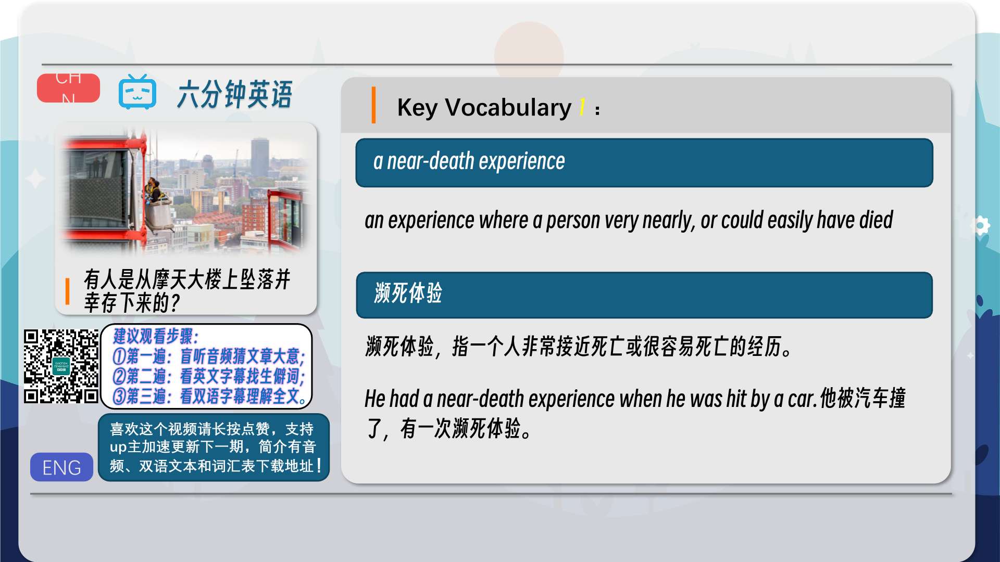
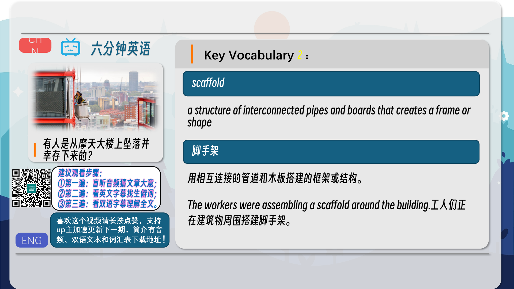
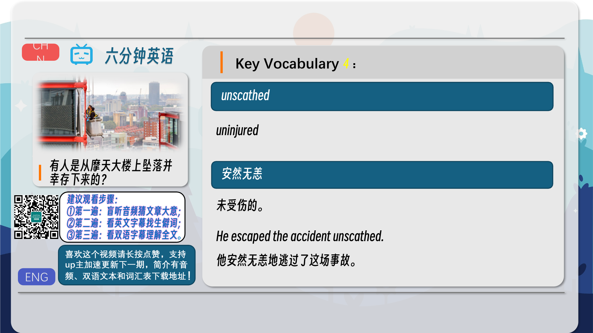
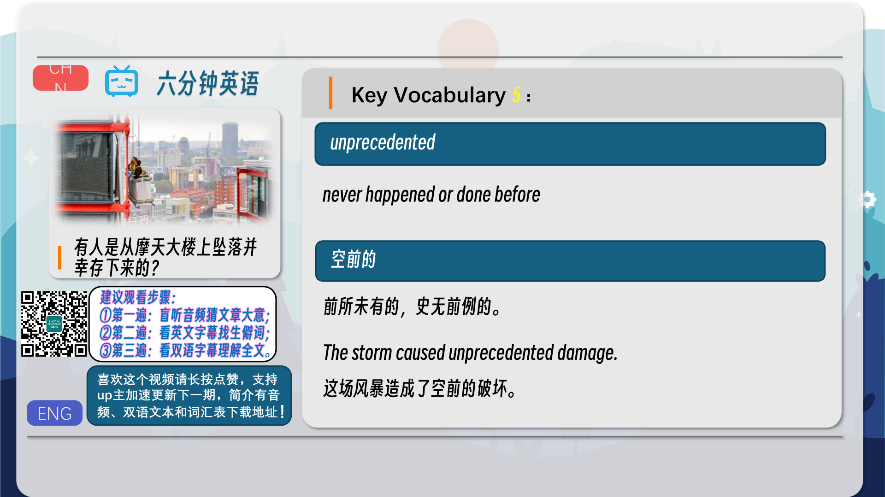
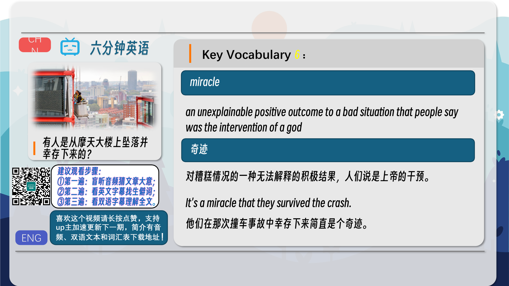
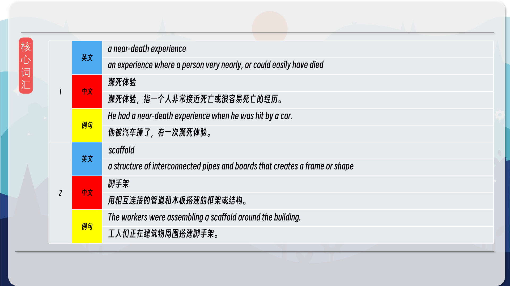
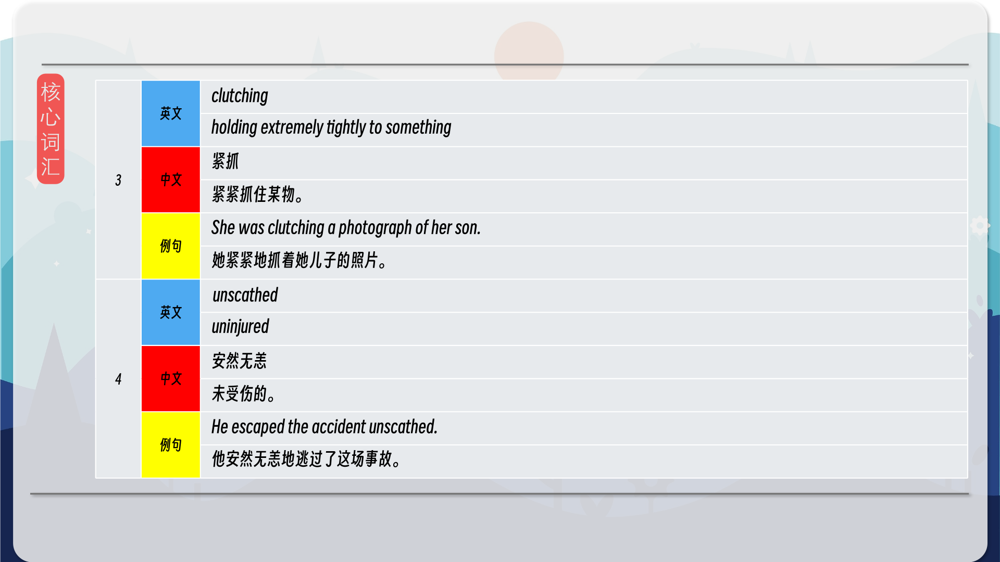
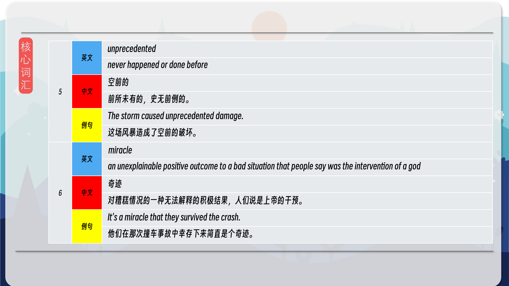

### 【英文脚本】
Dan
Hello and welcome to 6 Minute English – the show that brings you an interesting topic, authentic listening practice and six new items of vocabulary. I'm Dan.
 
Neil
And I’m Neil. In this episode we’ll be discussing miraculous survivals.
 
Dan
Have you ever had a near-death experience, Neil?
 
Neil
A near-death experience, meaning a situation where I very nearly died? Well, I once fell off the side of a mountain, but I was saved by a tree.
 
Dan
That’s incredible!
 
Neil
Why do you ask?
 
Dan
Well, I recently heard a story about Alcides Moreno.
 
Neil
Who’s that?
 
Dan
He’s a window cleaner. He cleaned the windows on the sky scrapers in New York. Except one day, he fell.
 
Neil
Oh my goodness.
 
Dan
Yes. And what’s more is. He survived.
 
Neil
Wow! How far did he fall?
 
Dan
Ah, well, all will be revealed after this week’s question. According to the BBC, what chance of survival does a human have when falling to the ground from around 3 storeys? a) 30% b) 50% c) 70%
 
Neil
And by storeys, you mean the entire floor of a building including all its rooms. Well, I think it’s got to be b) 50%
 
Dan
Well, we’ll find out if you’re right or not later. So, do you want to hear the story?
 
Neil
Of course!
 
Dan
Well, on the 7th of December, Ecuadorians Alcides Moreno, and his brother, Edgar, went up to the top of the Solow Tower in New York to clean the windows like they did every day.
 
Neil
And how tall is that building?
 
Dan
It’s 47 storeys.
 
Neil
And how did they usually clean it?
 
Dan
Well, they used a scaffold, which is a structure of interconnected pipes and boards that creates a frame or shape
 
Neil
Ah, so in this case there was a platform which was attached by cables, or large metal ropes, and hung over the edge of the building and which the window cleaners could raise and lower.
 
Dan
Exactly. So, as usual they filled up their buckets and climbed on to the scaffold.
 
Neil
And.
 
Dan
Well, unfortunately the cables were loose, and the scaffold fell from the building. Both brothers fell 47 storeys.
 
Neil
That’s terrible! What happened next?
 
Dan
I’ll let Jo Fidgen, presenter of the BBC show Outlook, explain
 
Jo Fidgen – BBC Outlook presenter
When firefighters arrived on the scene, they found a crowd of distraught onlookers pointing towards an alleyway. Edgar had landed on a fence and couldn’t be helped, but Alcides was found crouching in a pile of twisted metal still clutching the controls of the scaffold. He was breathing.even trying to stand up.
 
Neil
So, firefighters arrived to find a group of distraught, which means extremely worried and upset, people showing them where the two men had come down.
 
Dan
Yes, and though, unfortunately, Edgar didn’t survive, Alcides was found clutching, or holding extremely tightly, to the controls of the scaffold.
 
Neil
Did I hear correctly that he was trying to stand up? Did he escape the accident unscathed?
 
Dan
Unscathed means without any injury at all. And, no, he fell into a coma for 3 weeks and needed 24 pints of blood.
 
Neil
I’m speechless. I don’t understand how he lived.
 
Dan
You aren’t the only one. Listen to what Dr. Philip Barie, from New York-Presbyterian Hospital, said about the whole incident.
 
Philip Barie, New York-Presbyterian Hospital
I don’t know what adjective you’d care to use: unprecedented, extraordinary. if you are a believer in miracles, this would be one.
 
Neil
Wow. So he can’t explain it either. He said it was unprecedented which means never happened or done before.
 
Dan
Yes, and he also said that this was a miracle, which is an unexplainable positive outcome to a bad situation that people say was the intervention of a god.
 
Neil
I guess we’ll never know. But one thing I can know is the answer to this week’s question.
 
Dan
Ah, yes. I asked you what chance of survival does a human have when falling to the ground from around 3 storeys? a) 30% b) 50% c) 70%
 
Neil
And I said b) 50%
 
Dan
And you were exactly right. Well done.
 
Neil
Wow! It’s a first!
 
Dan
Shall we look at the vocabulary then?
 
Neil
First we had a near-death experience, which is an experience where a person very nearly, or could easily have died. Have you ever had one, Dan?
 
Dan
When I was 14 I fell out of a canoe into a river and got stuck between the boat and a rock with my head underwater. I thought it was the end. But, some people pulled me out. Then we had scaffold. A scaffold is a structure of interconnected pipes and boards that creates a frame or shape. Name a place that you might see scaffolding, Neil.
 
Neil
They are usually put up around houses when builders are working on the roof. Then we had clutching. If you clutch something, it means you hold it extremely tightly. There is a well-known idiom that uses this word. Sound familiar, Dan?
 
Dan
Ah, you’re clutching at straws, Neil, which means you are trying to find a reason or hope to succeed when it’s extremely unlikely. What was after that?
 
Neil
After that we had unscathed. If you are unscathed, you are uninjured. We often talk about escaping something unscathed. Have you ever escaped an accident unscathed?
 
Dan
Well, when I was 6, I fell through a hole that some builders had made while doing rennovation. I hit the ground in the garage, but somehow I escaped unscathed. Maybe, I bounced? Then we heard unprecedented. If something is unprecedented, it has never happened or been done before. Can you think of an example, Neil?
 
Neil
Neil Armstrong walking on the moon was unprecedented in 1969. And, finally, we had miracle. A miracle is an unexplainable positive outcome to a bad situation that people say was the intervention of a god. The adjectives is miraculous. Do you believe in miracles, Dan?
 
Dan
Well, I’ve never seen or experienced one, but when you hear a story like this, it’s difficult not to. And, that's the end of today's 6 Minute English. Please join us again soon!
 
Neil
And we are on social media too - Facebook, Twitter, Instagram and YouTube. See you there.
 
Both
Bye!
 

### 【中英文双语脚本】
Dan(担)
Hello and welcome to 6 Minute English – the show that brings you an interesting topic, authentic listening practice and six new items of vocabulary. I'm Dan.
您好，欢迎来到六分钟英语 – 该节目为您带来一个有趣的话题、真实的听力练习和六个新词汇。我是 Dan。

Neil(尼尔)
And I’m Neil. In this episode we’ll be discussing miraculous survivals.
我是 Neil。在这一集中，我们将讨论奇迹般的生存。

Dan(担)
Have you ever had a near-death experience, Neil?
尼尔，你有过濒死经历吗？

Neil(尼尔)
A near-death experience, meaning a situation where I very nearly died? Well, I once fell off the side of a mountain, but I was saved by a tree.
濒死体验，意味着我几乎要死的情况？嗯，我曾经从山的一侧掉下来，但我被一棵树救了下来。

Dan(担)
That’s incredible!
太不可思议了！

Neil(尼尔)
Why do you ask?
你为什么问？

Dan(担)
Well, I recently heard a story about Alcides Moreno.
嗯，我最近听说了一个关于 Alcides Moreno 的故事。

Neil(尼尔)
Who’s that?
那是谁？

Dan(担)
He’s a window cleaner. He cleaned the windows on the sky scrapers in New York. Except one day, he fell.
他是一名窗户清洁工。他清洁了纽约摩天大楼的窗户。除了有一天，他跌倒了。

Neil(尼尔)
Oh my goodness.
哦，天哪。

Dan(担)
Yes. And what’s more is. He survived.
是的。更重要的是。他活了下来。

Neil(尼尔)
Wow! How far did he fall?
哇！他跌落了多远？

Dan(担)
Ah, well, all will be revealed after this week’s question. According to the BBC, what chance of survival does a human have when falling to the ground from around 3 storeys? a) 30% b) 50% c) 70%
啊，好吧，一切都会在本周的问题之后揭晓。据 BBC 报道，当一个人从 3 层楼左右坠落到地面时，生存的机会有多大？a） 30% b） 50% c） 70%

Neil(尼尔)
And by storeys, you mean the entire floor of a building including all its rooms. Well, I think it’s got to be b) 50%
楼层是指建筑物的整个楼层，包括它的所有房间。嗯，我认为它必须是 b） 50%

Dan(担)
Well, we’ll find out if you’re right or not later. So, do you want to hear the story?
好吧，我们稍后会发现你是对还是错。那么，你想听这个故事吗？

Neil(尼尔)
Of course!
答案是肯定的！

Dan(担)
Well, on the 7th of December, Ecuadorians Alcides Moreno, and his brother, Edgar, went up to the top of the Solow Tower in New York to clean the windows like they did every day.
好吧，在 12 月 7 日，厄瓜多尔人 Alcides Moreno 和他的兄弟 Edgar 像每天一样登上纽约索洛塔的顶部清洁窗户。

Neil(尼尔)
And how tall is that building?
那栋楼有多高？

Dan(担)
It’s 47 storeys.
它有 47 层。

Neil(尼尔)
And how did they usually clean it?
他们通常如何清洁它？

Dan(担)
Well, they used a scaffold, which is a structure of interconnected pipes and boards that creates a frame or shape
嗯，他们使用了脚手架，这是一种由相互连接的管道和木板组成的结构，可以创建一个框架或形状

Neil(尼尔)
Ah, so in this case there was a platform which was attached by cables, or large metal ropes, and hung over the edge of the building and which the window cleaners could raise and lower.
啊，所以在这个例子中，有一个平台，它用电缆或大金属绳连接，悬挂在建筑物的边缘，窗户清洁工可以升降它。

Dan(担)
Exactly. So, as usual they filled up their buckets and climbed on to the scaffold.
完全。所以，像往常一样，他们装满了桶，爬上了脚手架。

Neil(尼尔)
And.
和。

Dan(担)
Well, unfortunately the cables were loose, and the scaffold fell from the building. Both brothers fell 47 storeys.
好吧，不幸的是，电缆松动了，脚手架从建筑物上掉了下来。两兄弟都倒塌了 47 层楼。

Neil(尼尔)
That’s terrible! What happened next?
太可怕了！接下来发生了什么？

Dan(担)
I’ll let Jo Fidgen, presenter of the BBC show Outlook, explain
我让 BBC 节目 Outlook 的主持人 Jo Fidgen 来解释一下

Jo Fidgen – BBC Outlook presenter(JoFidgen–BBCOutlook主持人)
When firefighters arrived on the scene, they found a crowd of distraught onlookers pointing towards an alleyway. Edgar had landed on a fence and couldn’t be helped, but Alcides was found crouching in a pile of twisted metal still clutching the controls of the scaffold. He was breathing.even trying to stand up.
当消防员到达现场时，他们发现一群心烦意乱的围观者指向一条小巷。埃德加降落在栅栏上，无能为力，但发现阿尔西德斯蹲在一堆扭曲的金属中，仍然紧紧抓住脚手架的控制装置。他有呼吸，甚至试图站起来。

Neil(尼尔)
So, firefighters arrived to find a group of distraught, which means extremely worried and upset, people showing them where the two men had come down.
因此，消防员到达现场时发现一群心烦意乱的人，这意味着非常担心和不安，人们向他们展示这两个人下来的地方。

Dan(担)
Yes, and though, unfortunately, Edgar didn’t survive, Alcides was found clutching, or holding extremely tightly, to the controls of the scaffold.
是的，虽然不幸的是，埃德加没有活下来，但人们发现阿尔西德斯紧紧抓住或紧紧抓住脚手架的控制装置。

Neil(尼尔)
Did I hear correctly that he was trying to stand up? Did he escape the accident unscathed?
我没听错他想站起来吗？他是否毫发无损地逃脱了事故？

Dan(担)
Unscathed means without any injury at all. And, no, he fell into a coma for 3 weeks and needed 24 pints of blood.
毫发无损的意思是完全没有任何伤害。而且，不，他昏迷了 3 周，需要 24 品脱的血。

Neil(尼尔)
I’m speechless. I don’t understand how he lived.
我说不出话来。我不明白他是怎么生活的。

Dan(担)
You aren’t the only one. Listen to what Dr. Philip Barie, from New York-Presbyterian Hospital, said about the whole incident.
你不是唯一一个。听听纽约长老会医院的菲利普·巴里 （Philip Barie） 医生对整个事件的看法。

Philip Barie, New York-Presbyterian Hospital(PhilipBarie，纽约长老会医院)
I don’t know what adjective you’d care to use: unprecedented, extraordinary. if you are a believer in miracles, this would be one.
我不知道你会想用什么形容词：史无前例，非凡。如果你是奇迹的信徒，这将是其中之一。

Neil(尼尔)
Wow. So he can’t explain it either. He said it was unprecedented which means never happened or done before.
哇。所以他也无法解释。他说这是前所未有的，这意味着以前从未发生过或做过。

Dan(担)
Yes, and he also said that this was a miracle, which is an unexplainable positive outcome to a bad situation that people say was the intervention of a god.
是的，他还说这是一个奇迹，这是对人们说是上帝的干预的糟糕情况的无法解释的积极结果。

Neil(尼尔)
I guess we’ll never know. But one thing I can know is the answer to this week’s question.
我想我们永远不会知道。但有一件事我能知道，那就是本周问题的答案。

Dan(担)
Ah, yes. I asked you what chance of survival does a human have when falling to the ground from around 3 storeys? a) 30% b) 50% c) 70%
啊，是的。我问你，当一个人从 3 层楼左右掉到地上时，还有多大的生存机会？a） 30% b） 50% c） 70%

Neil(尼尔)
And I said b) 50%
我说 b） 50%

Dan(担)
And you were exactly right. Well done.
你说得完全正确。干的好。

Neil(尼尔)
Wow! It’s a first!
哇！这是第一次！

Dan(担)
Shall we look at the vocabulary then?
那么，我们应该看看这些词汇吗？

Neil(尼尔)
First we had a near-death experience, which is an experience where a person very nearly, or could easily have died. Have you ever had one, Dan?
首先，我们有一个濒死体验，这是一个人非常接近或可能很容易死亡的经历。你有过吗，丹？

Dan(担)
When I was 14 I fell out of a canoe into a river and got stuck between the boat and a rock with my head underwater. I thought it was the end. But, some people pulled me out. Then we had scaffold. A scaffold is a structure of interconnected pipes and boards that creates a frame or shape. Name a place that you might see scaffolding, Neil.
当我 14 岁时，我从独木舟上掉进了一条河里，被卡在船和一块岩石之间，头在水下。我以为这就是结局。但是，有些人把我拉了出来。然后我们有了脚手架。脚手架是由互连的管道和板组成的结构，用于创建框架或形状。说出一个你可能会看到脚手架的地方，Neil。

Neil(尼尔)
They are usually put up around houses when builders are working on the roof. Then we had clutching. If you clutch something, it means you hold it extremely tightly. There is a well-known idiom that uses this word. Sound familiar, Dan?
当建筑商在屋顶上工作时，它们通常被放在房屋周围。然后我们紧紧抓住。如果你紧紧抓住什么东西，那就意味着你把它握得非常紧。有一个众所周知的谚语使用这个词。听起来很熟悉，Dan？

Dan(担)
Ah, you’re clutching at straws, Neil, which means you are trying to find a reason or hope to succeed when it’s extremely unlikely. What was after that?
啊，你抓着稻草，尼尔，这意味着你正在努力寻找成功的理由或希望，而这几乎是不可能的。那之后是什么？

Neil(尼尔)
After that we had unscathed. If you are unscathed, you are uninjured. We often talk about escaping something unscathed. Have you ever escaped an accident unscathed?
在那之后，我们就毫发无损了。如果你没有受伤，你就不会受伤。我们经常谈论毫发无损地逃离某物。你有没有安然无恙地逃脱事故？

Dan(担)
Well, when I was 6, I fell through a hole that some builders had made while doing rennovation. I hit the ground in the garage, but somehow I escaped unscathed. Maybe, I bounced? Then we heard unprecedented. If something is unprecedented, it has never happened or been done before. Can you think of an example, Neil?
好吧，当我 6 岁时，我掉进了一些建筑商在进行翻新时挖的一个洞。我在车库里撞到了地，但不知何故我毫发无损地逃脱了。也许，我反弹了？然后我们听到了前所未有的声音。如果某件事是前所未有的，那么它以前从未发生过或做过。Neil，你能想出一个例子吗？

Neil(尼尔)
Neil Armstrong walking on the moon was unprecedented in 1969. And, finally, we had miracle. A miracle is an unexplainable positive outcome to a bad situation that people say was the intervention of a god. The adjectives is miraculous. Do you believe in miracles, Dan?
尼尔·阿姆斯特朗 （Neil Armstrong） 在 1969 年在月球上行走是前所未有的。最后，我们创造了奇迹。奇迹是人们说是上帝的干预所造成的糟糕情况的无法解释的积极结果。这些形容词是奇迹。丹，你相信奇迹吗？

Dan(担)
Well, I’ve never seen or experienced one, but when you hear a story like this, it’s difficult not to. And, that's the end of today's 6 Minute English. Please join us again soon!
嗯，我从来没有见过或经历过，但当你听到这样的故事时，很难不去。这就是今天的六分钟 English 的结尾。请尽快再次加入我们！

Neil(尼尔)
And we are on social media too - Facebook, Twitter, Instagram and YouTube. See you there.
我们也在社交媒体上 - Facebook、Twitter、Instagram 和 YouTube。到时见。

Both(双)
Bye!
再见！

### 【核心词汇】
#### a near-death experience
an experience where a person very nearly, or could easily have died
濒死体验
濒死体验，指一个人非常接近死亡或很容易死亡的经历。
He had a near-death experience when he was hit by a car.
他被汽车撞了，有一次濒死体验。
#### scaffold
a structure of interconnected pipes and boards that creates a frame or shape
脚手架
用相互连接的管道和木板搭建的框架或结构。
The workers were assembling a scaffold around the building.
工人们正在建筑物周围搭建脚手架。
#### clutching
holding extremely tightly to something
紧抓
紧紧抓住某物。
She was clutching a photograph of her son.
她紧紧地抓着她儿子的照片。
#### unscathed
uninjured
安然无恙
未受伤的。
He escaped the accident unscathed.
他安然无恙地逃过了这场事故。
#### unprecedented
never happened or done before
空前的
前所未有的，史无前例的。
The storm caused unprecedented damage.
这场风暴造成了空前的破坏。
#### miracle
an unexplainable positive outcome to a bad situation that people say was the intervention of a god
奇迹
对糟糕情况的一种无法解释的积极结果，人们说是上帝的干预。
It's a miracle that they survived the crash.
他们在那次撞车事故中幸存下来简直是个奇迹。

在公众号里输入6位数字，获取【对话音频、英文文本、中文翻译、核心词汇和高级词汇表】电子档，6位数字【暗号】在文章的最后一张图片，如【220728】，表示22年7月28日这一期。公众号没有的文章说明还没有制作相关资料。年度合集在B站【六分钟英语】工房获取，每年共计300+文档，感谢支持！