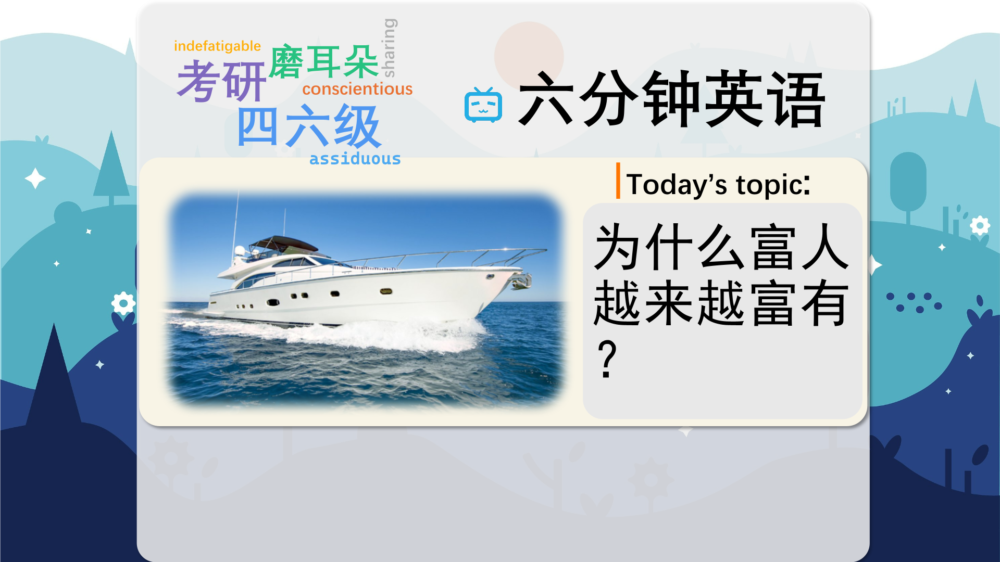

### 【英文脚本】
Neil
Hello and welcome to 6 Minute English – the programme where we bring you an interesting topic and six items of vocabulary. I'm Neil.
 
Catherine
And I'm Catherine. Today we're taking a look into the lives of the super rich – and we're going to look at one of their favourite pastimes.
 
Neil
The super rich are people with over $30 million US dollars of assets.
 
Catherine
Assets are things we can own and sell – like property, boats and private planes.
 
Neil
Expensive toys. First things first, let's do our question, Catherine. In which country is the percentage of super rich expected to grow fastest over the next 10 years? a) China b) Brazil c) Vietnam?
 
Catherine
I'm going to go for Vietnam. I think, that's an up and coming country and I think there is going to be a lot of growth in wealth in the future.
 
Neil
Ok, well we'll find out if you are right or wrong later. The number of super rich are expected to increase by 43% over the next decade.
 
Catherine
Now, this doesn't mean income is rising at the same speed for everyone. You might remember a report last year which said the world's richest 62 individuals owned as much as the poorest 50% of people in the whole world.
 
Neil
So, my question is – what on earth do people with so much money spend it on?
 
Catherine
One academic in the UK has been researching just that. And her answer is …, Neil?
 
Neil
Yachts! A yacht – a luxury boat used for pleasure. The ultimate status symbol – that is, an item which allows you to show off your wealth and position in society.
 
Catherine
Let's listen to Emma Spence from Cardiff University in the UK. What's so unusual about yachts?
 
Emma Spence, PhD researcher, Cardiff University
If you have an exclusive wine collection or art collection or even the purchase of a business jet – these are investable assets – something that you can retain value on or accrue value on. A business jet, a private jet, can cut costs – and make businesses more convenient by running faster, more comfortably than commercial airlines. So these purchases, they make good, sound business sense. Whereas a superyacht is essentially a black hole.
 
Neil
Before we get to the yacht, Emma talked about certain assets like planes and wine that made business sense.
 
Catherine
Now, to make sense – is a phrase you'll be familiar with. So, if we say something makes business sense, it means ‘it's good for business’. But yachts are different.
 
Neil
Yachts, and especially what she calls superyachts, actually lose money. So much so, she calls a superyacht a black hole of wealth.
 
Catherine
A black hole, in scientific terms, is a place where gravity is so strong that nothing can escape – not even light. So, in business terms, a black hole eats all your money!
 
Neil
It's also used conversationally to mean ‘a place where things go missing’.
 
Catherine
These superyachts are big. The world's longest is 180m in length. And they require a professional crew. Which is how Emma began her study – she used to work on the yachts.
 
Neil
She's now spent six years studying the world of superyachts and the super rich.
 
Catherine
So, what else did she learn?
 
Neil
She says that in the world of the super rich – the size of your yacht shows your place in the pecking order.
 
Catherine
The pecking order means ‘the social system from most powerful to least powerful’.
 
Neil
If you're higher up in the yachting pecking order, you get the best place in the harbour. Which is very important to yacht owners, apparently.
 
Catherine
Apparently, so. It's all about seeing and being seen. You could actually say that yachts are the ultimate form of conspicuous consumption. Now that's another great term – conspicuous means ‘visible or noticeable’ and consumption means ‘spending’. So, the phrase conspicuous consumption refers to the kind of buying you do so that other people notice your money.
 
Neil
Before we sail off into the sunset Catherine, how about we answer today's question.
 
Catherine
I said that Vietnam is the country in which the percentage of super rich is expected to grow fastest over the next 10 years.
 
Neil
Well, I'm very pleased to say that you were right. It was in fact Vietnam – according to the same report by Knight Frank – the population of ultra wealthy is expected to grow by a staggering 170% in the next decade.
 
Catherine
Now, how about we have another look at the wealth of vocabulary in this programme?
 
Neil
Very good. We started with assets – here it means ‘things we can buy or sell’. What are your assets?
 
Catherine
Oh, you know, my diamond rings, my bike, my laptop. I'm not like you though Neil, I don't live in an expensive mansion – that would be a real status symbol!
 
Neil
If only that were true, but it's a good example. A status symbol is a possession that shows off our wealth and our place in society.
 
Catherine
Yes, and we had the phrase to make business sense – in other words to be good for business. We could also say that a particular policy makes economic sense.
 
Neil
Or I could say investing wisely makes financial sense. Not like yachts which are expensive to buy and run. In fact, they're a black hole for our money.
 
Catherine
Now, did you know our next phrase, pecking order, actually comes from chicken behaviour?
 
Neil
And finally, the phrase conspicuous consumption. For example, you could say that dining at the finest restaurants wearing expensive clothes is conspicuous consumption.
 
Catherine
And to clear up two similar phrases: a status symbol refers to the object itself, like a luxury car; whereas conspicuous consumption refers to the act of spending money on things like expensive cars but you're spending money so that other people notice.
 
Neil
Do check us out on Facebook, Twitter, Instagram and YouTube.
 
Neil & Catherine
Bye!
 

### 【中英文双语脚本】
Neil(尼尔)
Hello and welcome to 6 Minute English – the programme where we bring you an interesting topic and six items of vocabulary. I'm Neil.
您好，欢迎来到六分钟英语 - 我们为您带来一个有趣的话题和六项词汇。我是 Neil。

Catherine(凯瑟琳)
And I'm Catherine. Today we're taking a look into the lives of the super rich – and we're going to look at one of their favourite pastimes.
我是 Catherine。今天，我们来看看超级富豪的生活 —— 我们将看看他们最喜欢的消遣方式之一。

Neil(尼尔)
The super rich are people with over $30 million US dollars of assets.
超级富豪是拥有超过 3000 万美元资产的人。

Catherine(凯瑟琳)
Assets are things we can own and sell – like property, boats and private planes.
资产是我们可以拥有和出售的东西，例如财产、船只和私人飞机。

Neil(尼尔)
Expensive toys. First things first, let's do our question, Catherine. In which country is the percentage of super rich expected to grow fastest over the next 10 years? a) China b) Brazil c) Vietnam?
昂贵的玩具。首先，让我们回答我们的问题，Catherine。预计未来 10 年哪个国家的超级富豪比例增长最快？a） 中国 b） 巴西 c） 越南？

Catherine(凯瑟琳)
I'm going to go for Vietnam. I think, that's an up and coming country and I think there is going to be a lot of growth in wealth in the future.
我要去越南。我认为，这是一个新兴的国家，我认为未来财富将有很大的增长。

Neil(尼尔)
Ok, well we'll find out if you are right or wrong later. The number of super rich are expected to increase by 43% over the next decade.
好的，我们稍后会知道你是对还是错。预计未来十年超级富豪的数量将增加 43%。

Catherine(凯瑟琳)
Now, this doesn't mean income is rising at the same speed for everyone. You might remember a report last year which said the world's richest 62 individuals owned as much as the poorest 50% of people in the whole world.
现在，这并不意味着每个人的收入都以相同的速度增长。你可能还记得去年的一份报告，其中说世界上最富有的 62 个人拥有的财产相当于全世界最贫穷的 50% 的人所拥有的财产。

Neil(尼尔)
So, my question is – what on earth do people with so much money spend it on?
所以，我的问题是 —— 有这么多钱的人到底把钱花在什么地方？

Catherine(凯瑟琳)
One academic in the UK has been researching just that. And her answer is …, Neil?
英国的一位学者一直在研究这个问题。她的回答是......，尼尔？

Neil(尼尔)
Yachts! A yacht – a luxury boat used for pleasure. The ultimate status symbol – that is, an item which allows you to show off your wealth and position in society.
游艇！游艇 – 用于娱乐的豪华船。终极身份象征 – 即让您炫耀财富和社会地位的物品。

Catherine(凯瑟琳)
Let's listen to Emma Spence from Cardiff University in the UK. What's so unusual about yachts?
让我们听听来自英国卡迪夫大学的 Emma Spence 的演讲。游艇有什么不寻常之处？

Emma Spence, PhD researcher, Cardiff University(EmmaSpence，卡迪夫大学博士研究员)
If you have an exclusive wine collection or art collection or even the purchase of a business jet – these are investable assets – something that you can retain value on or accrue value on. A business jet, a private jet, can cut costs – and make businesses more convenient by running faster, more comfortably than commercial airlines. So these purchases, they make good, sound business sense. Whereas a superyacht is essentially a black hole.
如果您拥有独家葡萄酒收藏或艺术收藏，甚至购买了一架公务机 —— 这些都是可投资的资产 —— 您可以保值或累积价值。公务机（私人飞机）可以降低成本，并且比商业航空公司运行得更快、更舒适，使企业更加方便。因此，这些购买具有很好的、合理的商业意义。而超级游艇本质上是一个黑洞。

Neil(尼尔)
Before we get to the yacht, Emma talked about certain assets like planes and wine that made business sense.
在我们进入游艇之前，Emma 谈到了某些具有商业意义的资产，例如飞机和葡萄酒。

Catherine(凯瑟琳)
Now, to make sense – is a phrase you'll be familiar with. So, if we say something makes business sense, it means ‘it's good for business’. But yachts are different.
现在，要说得通 – 是你会熟悉的一个短语。因此，如果我们说某件事具有商业意义，那就意味着“它对企业有好处”。但游艇不同。

Neil(尼尔)
Yachts, and especially what she calls superyachts, actually lose money. So much so, she calls a superyacht a black hole of wealth.
游艇，尤其是她所说的超级游艇，实际上是赔钱的。以至于她将超级游艇称为财富黑洞。

Catherine(凯瑟琳)
A black hole, in scientific terms, is a place where gravity is so strong that nothing can escape – not even light. So, in business terms, a black hole eats all your money!
从科学的角度来看，黑洞是一个引力如此强大以至于没有任何东西可以逃脱的地方 —— 即使是光。所以，从商业角度来说，黑洞会吃掉你所有的钱！

Neil(尼尔)
It's also used conversationally to mean ‘a place where things go missing’.
它在会话中也用于表示“东西丢失的地方”。

Catherine(凯瑟琳)
These superyachts are big. The world's longest is 180m in length. And they require a professional crew. Which is how Emma began her study – she used to work on the yachts.
这些超级游艇很大。世界上最长的有 180 米长。他们需要专业的工作人员。这就是 Emma 开始学习的原因 —— 她曾经在游艇上工作。

Neil(尼尔)
She's now spent six years studying the world of superyachts and the super rich.
她现在花了六年时间研究超级游艇和超级富豪的世界。

Catherine(凯瑟琳)
So, what else did she learn?
那么，她还学到了什么呢？

Neil(尼尔)
She says that in the world of the super rich – the size of your yacht shows your place in the pecking order.
她说，在超级富豪的世界里 —— 你的游艇的大小显示了你在啄食顺序中的位置。

Catherine(凯瑟琳)
The pecking order means ‘the social system from most powerful to least powerful’.
啄食顺序的意思是“从最强大到最不强大的社会制度”。

Neil(尼尔)
If you're higher up in the yachting pecking order, you get the best place in the harbour. Which is very important to yacht owners, apparently.
如果您在游艇啄食顺序中排名靠前，您将获得港口中最好的位置。显然，这对游艇所有者来说非常重要。

Catherine(凯瑟琳)
Apparently, so. It's all about seeing and being seen. You could actually say that yachts are the ultimate form of conspicuous consumption. Now that's another great term – conspicuous means ‘visible or noticeable’ and consumption means ‘spending’. So, the phrase conspicuous consumption refers to the kind of buying you do so that other people notice your money.
显然，是的。这一切都与看到和被看到有关。你实际上可以说游艇是炫耀性消费的终极形式。这是另一个很棒的术语 —— conspicuous 的意思是“可见或引人注目”，consumption 的意思是“支出”。所以，炫耀性消费这个词指的是你做的那种购买，让别人注意到你的钱。

Neil(尼尔)
Before we sail off into the sunset Catherine, how about we answer today's question.
在我们驶向日落之前，凯瑟琳，我们来回答今天的问题怎么样。

Catherine(凯瑟琳)
I said that Vietnam is the country in which the percentage of super rich is expected to grow fastest over the next 10 years.
我说过，越南是预计未来 10 年超级富豪比例增长最快的国家。

Neil(尼尔)
Well, I'm very pleased to say that you were right. It was in fact Vietnam – according to the same report by Knight Frank – the population of ultra wealthy is expected to grow by a staggering 170% in the next decade.
嗯，我很高兴地说你是对的。事实上，根据莱坊 （Knight Frank） 的同一份报告，越南的超级富豪人口预计将在未来十年内增长 170%，令人震惊。

Catherine(凯瑟琳)
Now, how about we have another look at the wealth of vocabulary in this programme?
现在，我们再看看这个程序中的词汇财富怎么样？

Neil(尼尔)
Very good. We started with assets – here it means ‘things we can buy or sell’. What are your assets?
非常好。我们从资产开始 —— 这里的意思是“我们可以购买或出售的东西”。您的资产是什么？

Catherine(凯瑟琳)
Oh, you know, my diamond rings, my bike, my laptop. I'm not like you though Neil, I don't live in an expensive mansion – that would be a real status symbol!
哦，你知道的，我的钻戒、我的自行车、我的笔记本电脑。我和你不一样，尼尔，我不住在昂贵的豪宅里 —— 那将是真正的身份象征！

Neil(尼尔)
If only that were true, but it's a good example. A status symbol is a possession that shows off our wealth and our place in society.
如果这是真的就好了，但这是个好例子。身份象征是炫耀我们的财富和社会地位的财产。

Catherine(凯瑟琳)
Yes, and we had the phrase to make business sense – in other words to be good for business. We could also say that a particular policy makes economic sense.
是的，我们有一句话要有商业意义 —— 换句话说，对业务有利。我们也可以说某项特定政策具有经济意义。

Neil(尼尔)
Or I could say investing wisely makes financial sense. Not like yachts which are expensive to buy and run. In fact, they're a black hole for our money.
或者我可以说明智地投资在财务上是有意义的。不像游艇，购买和运行成本很高。事实上，他们是我们资金的黑洞。

Catherine(凯瑟琳)
Now, did you know our next phrase, pecking order, actually comes from chicken behaviour?
现在，您知道我们的下一个短语 Peking order 实际上来自鸡的行为吗？

Neil(尼尔)
And finally, the phrase conspicuous consumption. For example, you could say that dining at the finest restaurants wearing expensive clothes is conspicuous consumption.
最后，短语 conspicuous consumption。例如，你可以说，在最好的餐厅穿着昂贵的衣服用餐是炫耀性消费。

Catherine(凯瑟琳)
And to clear up two similar phrases: a status symbol refers to the object itself, like a luxury car; whereas conspicuous consumption refers to the act of spending money on things like expensive cars but you're spending money so that other people notice.
澄清两个类似的短语：身份象征是指物体本身，就像一辆豪华汽车；而炫耀性消费是指将钱花在昂贵的汽车等东西上的行为，但你花钱是为了让其他人注意到。

Neil(尼尔)
Do check us out on Facebook, Twitter, Instagram and YouTube.
请在 Facebook、Twitter、Instagram 和 YouTube 上关注我们。

Neil & Catherine(尼尔和凯瑟琳)
Bye!
再见！

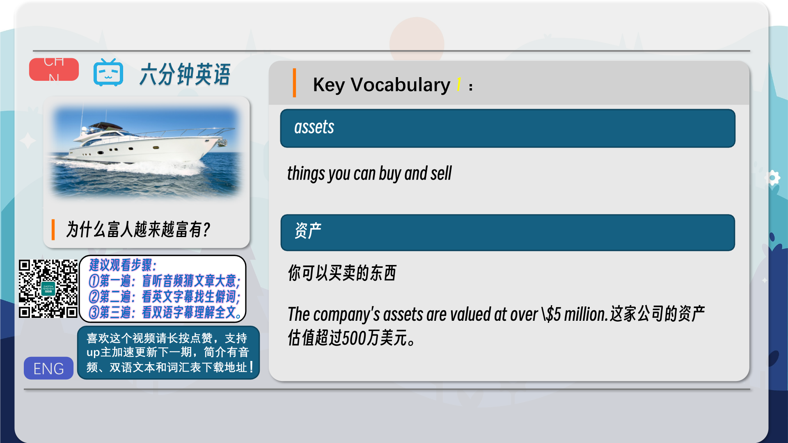
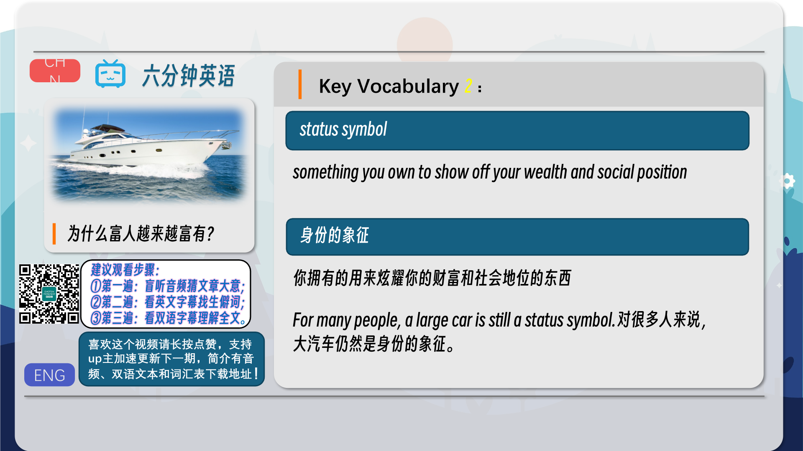
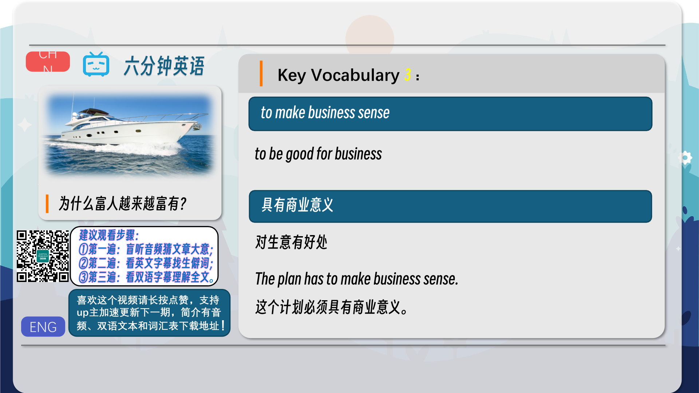
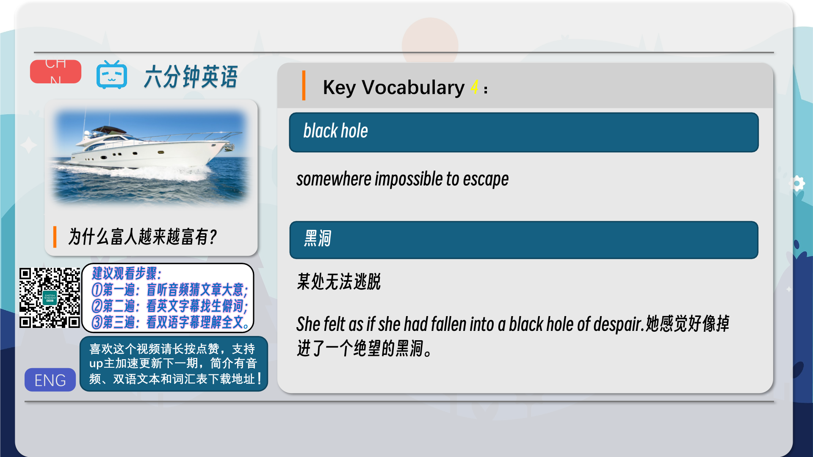
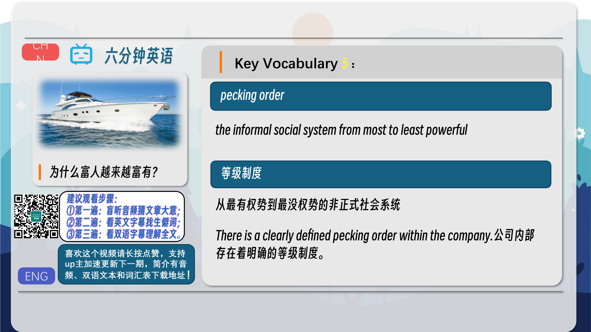
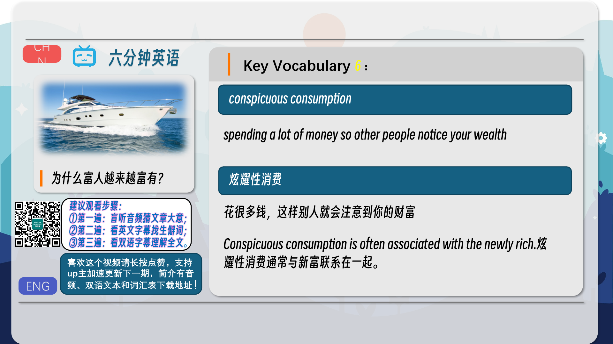
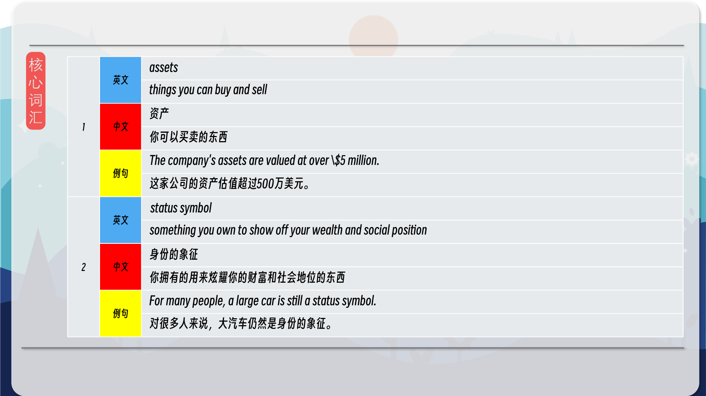
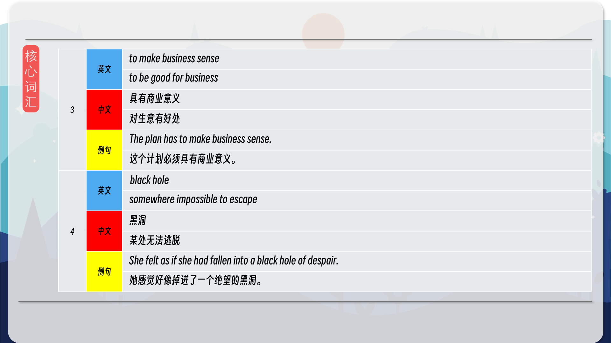
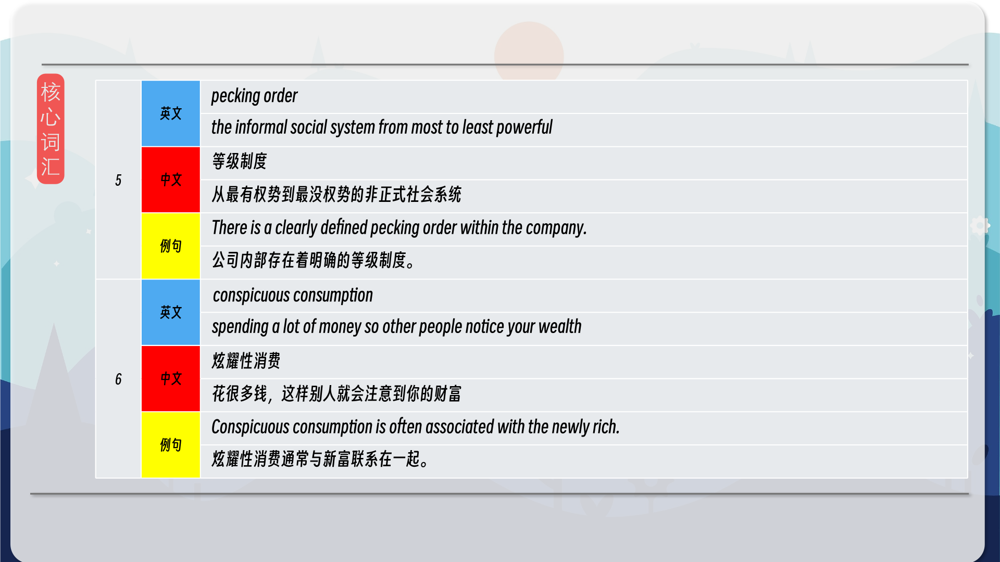
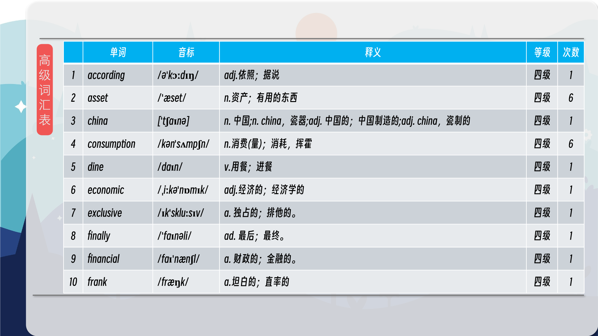
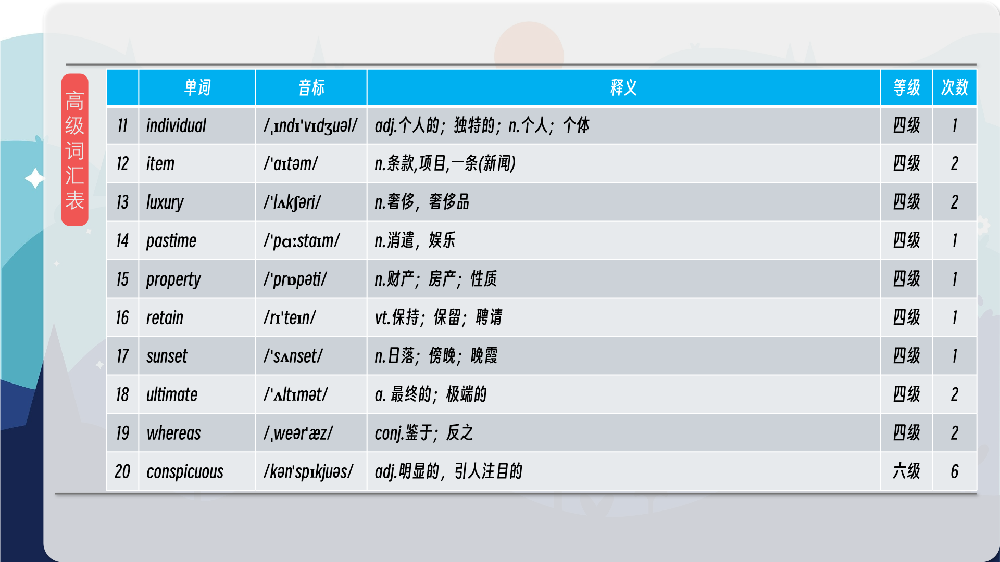
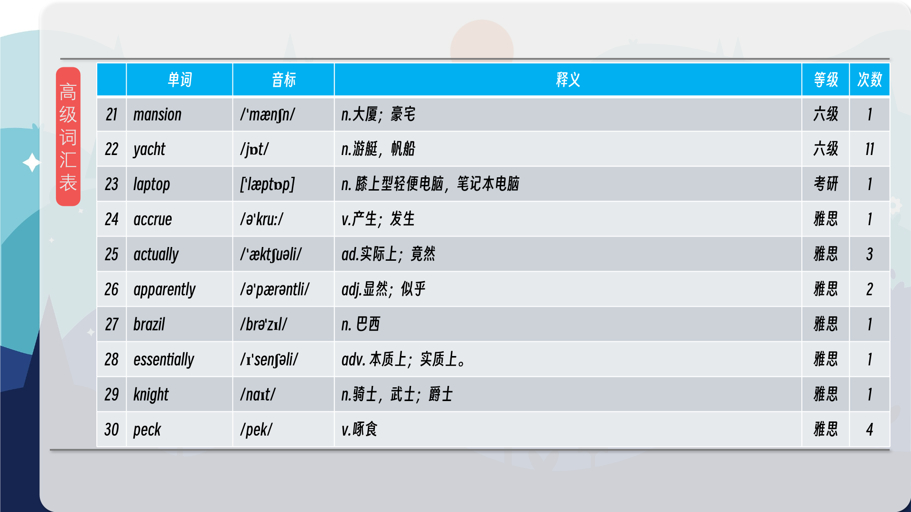
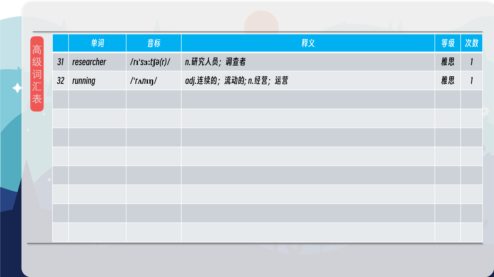

### 【核心词汇】
#### assets
things you can buy and sell
资产
你可以买卖的东西
The company's assets are valued at over \$5 million.
这家公司的资产估值超过500万美元。
#### status symbol
something you own to show off your wealth and social position
身份的象征
你拥有的用来炫耀你的财富和社会地位的东西
For many people, a large car is still a status symbol.
对很多人来说，大汽车仍然是身份的象征。
#### to make business sense
to be good for business
具有商业意义
对生意有好处
The plan has to make business sense.
这个计划必须具有商业意义。
#### black hole
somewhere impossible to escape
黑洞
某处无法逃脱
She felt as if she had fallen into a black hole of despair.
她感觉好像掉进了一个绝望的黑洞。
#### pecking order
the informal social system from most to least powerful
等级制度
从最有权势到最没权势的非正式社会系统
There is a clearly defined pecking order within the company.
公司内部存在着明确的等级制度。
#### conspicuous consumption
spending a lot of money so other people notice your wealth
炫耀性消费
花很多钱，这样别人就会注意到你的财富
Conspicuous consumption is often associated with the newly rich.
炫耀性消费通常与新富联系在一起。

在公众号里输入6位数字，获取【对话音频、英文文本、中文翻译、核心词汇和高级词汇表】电子档，6位数字【暗号】在文章的最后一张图片，如【220728】，表示22年7月28日这一期。公众号没有的文章说明还没有制作相关资料。年度合集在B站【六分钟英语】工房获取，每年共计300+文档，感谢支持！