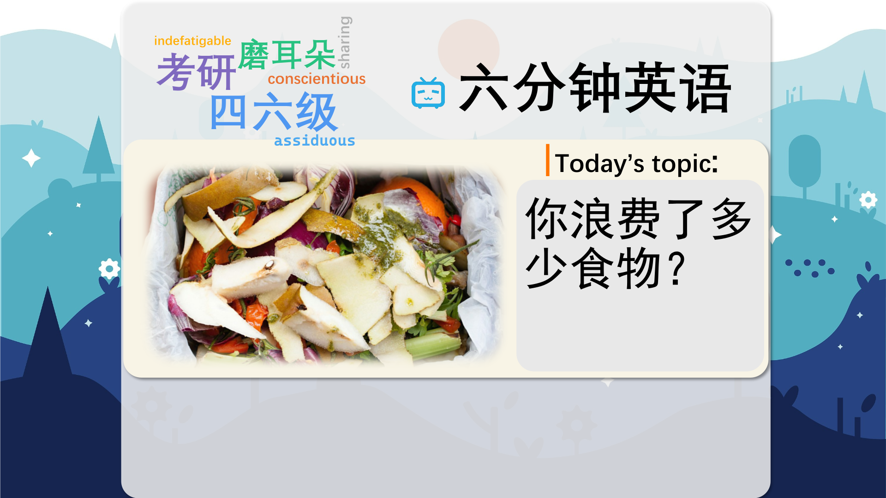

### 【英文脚本】
Dan
Hello and welcome to 6 Minute English– the show that brings you an interesting topic, authentic listening practice and six new items of vocabulary. I'm Dan.
 
Neil
And I'm Neil. In this episode we'll be discussing food waste, just as soon as
 
Dan
Neil, did you just throw the rest of that apple away?
 
Neil
Yeah. It was quite a big one and I couldn't finish it.
 
Dan
Neil, you know you shouldn't waste food.
 
Neil
Waste meaning to throw away without consuming or using. Ah, it's only an apple. It's not the end of the world, Dan.
 
Dan
Well, that's where you could be wrong, my friend. Let me prove it to you, with this week's question. How much of the world's food is wasted each year? a) a half b) a third c) a quarter
 
Neil
I'm not sure. I know it's a lot so I'm going to say a) a half
 
Dan
We'll find out if you're right or not at the end of this show. So, the actual figure is 1.3 billion tons of food, which is enough to feed a billion hungry people. Where do you think all this food waste comes from?
 
Neil
Well, restaurants, I imagine. I mean, they can't give one customer's leftovers to another! That would be unhygienic!
 
Dan
Leftovers are the remains of food which has not been eaten. And while you are right, restaurants are not the main contributor to food waste.
 
Neil
Supermarkets! I bet they throw out loads of food once it goes past its sell-by-date, or the date which it can be legally sold by.
 
Dan
Think closer to home.
 
Neil
It's us, isn't it?
 
Dan
Yes. In Europe an incredible 53% of food waste comes from households, which results in 88 million tonnes of food waste a year. And I bet you can't guess what we do with it?
 
Neil
I want to say recycle, but I can see from your face, Dan, that it's not.
 
Dan
No. Unfortunately it goes into landfills and decays.
 
Neil
A landfill is a place where rubbish is buried. I see, so the food rots and this causes greenhouse gasses which lead to global warming and climate change.
 
Dan
Exactly, and the end of the world. But, remarkably the European country of Denmark has managed to reduce its food waste by a very significant 25%.
 
Neil
That's impressive, how did that happen?
 
Dan
They attribute it to a woman called Selina Juul.
 
Neil
I've heard about her. She became a household name in Denmark overnight!
 
Dan
A household name is one which everybody knows, and that's right.
 
Neil
I thought she was Russian?
 
Dan
She is. But, I'll let her explain.
 
Selina Juul
I come from a country where there were food shortages, back then in Moscow, communism collapsed, we had the collapse of infrastructure, we were not sure we could get food on the table. And coming to Denmark, seeing this abundance, seeing these supermarkets filled with food. But then I was really shocked to see a lot of food getting wasted.
 
Neil
So Selina grew up in Moscow at a time when there wasn't enough food because of the collapse of infrastructure, meaning the basic systems and services of a society – such as food transportation.
 
Dan
Then when she moved to Denmark, she found an abundance, or more than enough, food, but she saw it being wasted.
 
Neil
So she decided to do something about it?
 
Dan
Yes. She started a Facebook page in 2008 called 'stop wasting food' and 9 years later the Danish government credits her for their reduction in food waste.
 
Neil
How did she do it?
 
Dan
Well, lots of ideas really. She convinced some supermarkets to stop selling their items in bulk so that people buy only what they need. She's produced a leftovers cookbook and she's working with three governments to set up an education programme in schools.
 
Neil
Wow, she's a busy woman. So how about you educate me with the answer to this week's question.
 
Dan
Sure! I asked you how much of the world's food is wasted each year? a) a half b) a third c) a quarter
 
Neil
And I said a) a half
 
Dan
And I'm terribly sorry, mate, but you're wrong. The answer is b) a third.
 
Neil
Well, it's not as bad as I thought it was, at least.
 
Dan
Shall we look at the vocabulary then?
 
Neil
Yes, let's. First we had waste. If you waste something, you throw it away or lose it without using it or consuming it. Common things we waste are food, time, money and energy. We also have some expressions with waste too. Can you think of one, Dan?
 
Dan
A waste of space is an expression which means a thing is completely without value. For example, I'm a complete waste of space in the kitchen. I can't cook at all. Next we had leftovers. Leftovers are the remains of food or a meal, which have not been eaten. What do you tend to do with your leftovers, Neil?
 
Neil
Oh I love leftovers! Sometimes I think they taste even better than the original meal!
 
Dan
I agree! Pizza's a great example!
 
Neil
Then we had landfill. A landfill is a place where rubbish is dropped and buried. In colloquial English we might say, a dump. Do you ever take your rubbish to the dump, Dan?
 
Dan
Not if I can help it. I prefer to recycle as much as possible. I only go to the dump if I have to get rid of a large appliance, such as a fridge. Then we had a household name. To be a household name is to be well-known by ordinary people of a particular place or culture. Can you think of a person who is a household name at the moment, Neil?
 
Neil
Oh, that's very easy. Donald Trump springs to mind! Everyone must know who he is. Then we had infrastructure. Infrastructure is the basic systems and services of a society – such as electricity supply, trains, and roads.
 
Dan
And finally we had abundance. If you have an abundance of something, you have more than you need. Do have anything in abundance, Neil?
 
Neil
Well, when it comes to my children I have to have an abundance of patience….well, most of the time. And, that's the end of today's 6 Minute English. Please join us again soon!
 
Dan
And we are on social media too - Facebook, Twitter, Instagram and YouTube. See you there.
 
Both
Bye!
 

### 【中英文双语脚本】
Dan(担)
Hello and welcome to 6 Minute English– the show that brings you an interesting topic, authentic listening practice and six new items of vocabulary. I'm Dan.
您好，欢迎来到六分钟英语 – 该节目为您带来一个有趣的话题、真实的听力练习和六个新词汇。我是 Dan。

Neil(尼尔)
And I'm Neil. In this episode we'll be discussing food waste, just as soon as
我是 Neil。在这一集中，我们将讨论食物浪费，只要

Dan(担)
Neil, did you just throw the rest of that apple away?
尼尔，你刚才把剩下的苹果都扔掉了吗？

Neil(尼尔)
Yeah. It was quite a big one and I couldn't finish it.
是的。这是一个相当大的问题，我无法完成它。

Dan(担)
Neil, you know you shouldn't waste food.
Neil，你知道你不应该浪费食物。

Neil(尼尔)
Waste meaning to throw away without consuming or using. Ah, it's only an apple. It's not the end of the world, Dan.
浪费的意思是不消费也不用就扔掉。啊，这只是一个苹果。这不是世界末日，丹。

Dan(担)
Well, that's where you could be wrong, my friend. Let me prove it to you, with this week's question. How much of the world's food is wasted each year? a) a half b) a third c) a quarter
嗯，这就是你可能错的地方，我的朋友。让我用本周的问题向你证明一下。世界上每年浪费多少食物？a） 二分之一 b） 三分之一 c） 四分之一

Neil(尼尔)
I'm not sure. I know it's a lot so I'm going to say a) a half
我不确定。我知道这很多，所以我要说 a） 一半

Dan(担)
We'll find out if you're right or not at the end of this show. So, the actual figure is 1.3 billion tons of food, which is enough to feed a billion hungry people. Where do you think all this food waste comes from?
我们将在本次节目结束时找出您的判断是否正确。因此，实际数字是 13 亿吨食物，足以养活 10 亿饥饿的人。您认为所有这些食物垃圾来自哪里？

Neil(尼尔)
Well, restaurants, I imagine. I mean, they can't give one customer's leftovers to another! That would be unhygienic!
嗯，我想是餐馆。我的意思是，他们不能把一个顾客的剩菜给另一个顾客！那太不卫生了！

Dan(担)
Leftovers are the remains of food which has not been eaten. And while you are right, restaurants are not the main contributor to food waste.
剩菜是未食用的食物残渣。虽然你是对的，但餐馆并不是食物浪费的主要来源。

Neil(尼尔)
Supermarkets! I bet they throw out loads of food once it goes past its sell-by-date, or the date which it can be legally sold by.
超市！我敢打赌，一旦食物超过了保质期或可以合法销售的日期，他们就会扔掉一大堆食物。

Dan(担)
Think closer to home.
想得更近一些。

Neil(尼尔)
It's us, isn't it?
是我们，不是吗？

Dan(担)
Yes. In Europe an incredible 53% of food waste comes from households, which results in 88 million tonnes of food waste a year. And I bet you can't guess what we do with it?
是的。在欧洲，令人难以置信的是，53% 的食物垃圾来自家庭，每年造成 8800 万吨食物浪费。我敢打赌你猜不出我们用它做什么？

Neil(尼尔)
I want to say recycle, but I can see from your face, Dan, that it's not.
我想说回收，但我可以从你的脸上看出，Dan，它不是。

Dan(担)
No. Unfortunately it goes into landfills and decays.
不。不幸的是，它进入垃圾填埋场并腐烂。

Neil(尼尔)
A landfill is a place where rubbish is buried. I see, so the food rots and this causes greenhouse gasses which lead to global warming and climate change.
垃圾填埋场是掩埋垃圾的地方。我明白了，所以食物会腐烂，这会导致温室气体，从而导致全球变暖和气候变化。

Dan(担)
Exactly, and the end of the world. But, remarkably the European country of Denmark has managed to reduce its food waste by a very significant 25%.
没错，世界末日。但是，值得注意的是，欧洲国家丹麦已经成功地将其食物浪费减少了 25%。

Neil(尼尔)
That's impressive, how did that happen?
这太令人印象深刻了，这是怎么发生的呢？

Dan(担)
They attribute it to a woman called Selina Juul.
他们将其归功于一位名叫 Selina Juul 的女士。

Neil(尼尔)
I've heard about her. She became a household name in Denmark overnight!
我听说过她。她一夜之间成为丹麦家喻户晓的名字！

Dan(担)
A household name is one which everybody knows, and that's right.
家喻户晓的名字是每个人都知道的名字，没错。

Neil(尼尔)
I thought she was Russian?
我以为她是俄罗斯人？

Dan(担)
She is. But, I'll let her explain.
她是。但是，我会让她解释。

Selina Juul(塞琳娜·朱尔)
I come from a country where there were food shortages, back then in Moscow, communism collapsed, we had the collapse of infrastructure, we were not sure we could get food on the table. And coming to Denmark, seeing this abundance, seeing these supermarkets filled with food. But then I was really shocked to see a lot of food getting wasted.
我来自一个食物短缺的国家，当时在莫斯科，共产主义崩溃了，我们的基础设施崩溃了，我们不确定我们能否在餐桌上买到食物。来到丹麦，看到这里丰富多彩，看到这些超市里装满了食物。但后来我真的很震惊地看到很多食物被浪费了。

Neil(尼尔)
So Selina grew up in Moscow at a time when there wasn't enough food because of the collapse of infrastructure, meaning the basic systems and services of a society – such as food transportation.
因此，Selina 在莫斯科长大，当时由于基础设施的崩溃，食物不足，这意味着一个社会的基本系统和服务 —— 例如食品运输。

Dan(担)
Then when she moved to Denmark, she found an abundance, or more than enough, food, but she saw it being wasted.
然后，当她搬到丹麦时，她发现食物丰富，或者说绰绰有余，但她看到这些食物被浪费了。

Neil(尼尔)
So she decided to do something about it?
所以她决定做点什么？

Dan(担)
Yes. She started a Facebook page in 2008 called 'stop wasting food' and 9 years later the Danish government credits her for their reduction in food waste.
是的。她在 2008 年开设了一个名为“停止浪费食物”的 Facebook 页面，9 年后，丹麦政府将减少食物浪费归功于她。

Neil(尼尔)
How did she do it?
她是怎么做到的呢？

Dan(担)
Well, lots of ideas really. She convinced some supermarkets to stop selling their items in bulk so that people buy only what they need. She's produced a leftovers cookbook and she's working with three governments to set up an education programme in schools.
嗯，真的有很多想法。她说服一些超市停止批量销售他们的商品，让人们只购买他们需要的东西。她制作了一本剩菜食谱，并与三个政府合作，在学校设立了一项教育计划。

Neil(尼尔)
Wow, she's a busy woman. So how about you educate me with the answer to this week's question.
哇，她是个大忙的女人。那么，你用本周问题的答案来教育我怎么样。

Dan(担)
Sure! I asked you how much of the world's food is wasted each year? a) a half b) a third c) a quarter
确定！我问你，世界上每年浪费多少食物？a） 二分之一 b） 三分之一 c） 四分之一

Neil(尼尔)
And I said a) a half
我说 a） 一半

Dan(担)
And I'm terribly sorry, mate, but you're wrong. The answer is b) a third.
我非常抱歉，伙计，但你错了。答案是 b） 三分之一。

Neil(尼尔)
Well, it's not as bad as I thought it was, at least.
嗯，至少没有我想象的那么糟糕。

Dan(担)
Shall we look at the vocabulary then?
那么，我们应该看看这些词汇吗？

Neil(尼尔)
Yes, let's. First we had waste. If you waste something, you throw it away or lose it without using it or consuming it. Common things we waste are food, time, money and energy. We also have some expressions with waste too. Can you think of one, Dan?
是的，让我们。首先，我们有废物。如果你浪费了什么东西，你就把它扔掉或丢失了，而没有使用它或消耗它。我们浪费的常见东西是食物、时间、金钱和精力。我们也有一些关于废物的表达。Dan，你能想到一个吗？

Dan(担)
A waste of space is an expression which means a thing is completely without value. For example, I'm a complete waste of space in the kitchen. I can't cook at all. Next we had leftovers. Leftovers are the remains of food or a meal, which have not been eaten. What do you tend to do with your leftovers, Neil?
a waste of space 是一个表达方式，意思是一个东西完全没有价值。例如，我在厨房里完全浪费了空间。我根本不会做饭。接下来我们吃剩菜。剩菜是食物或饭菜的残渣，没有被吃掉。你打算怎么处理你的剩菜，尼尔？

Neil(尼尔)
Oh I love leftovers! Sometimes I think they taste even better than the original meal!
哦，我喜欢剩菜！有时我觉得它们的味道甚至比原来的饭菜还要好！

Dan(担)
I agree! Pizza's a great example!
我同意！披萨就是一个很好的例子！

Neil(尼尔)
Then we had landfill. A landfill is a place where rubbish is dropped and buried. In colloquial English we might say, a dump. Do you ever take your rubbish to the dump, Dan?
然后我们有了垃圾填埋场。垃圾填埋场是丢弃和掩埋垃圾的地方。在口语英语中，我们可以说，一个垃圾场。丹，你有没有把你的垃圾带到垃圾场？

Dan(担)
Not if I can help it. I prefer to recycle as much as possible. I only go to the dump if I have to get rid of a large appliance, such as a fridge. Then we had a household name. To be a household name is to be well-known by ordinary people of a particular place or culture. Can you think of a person who is a household name at the moment, Neil?
如果我能帮得上忙的话，不会。我更喜欢尽可能多地回收利用。我只有在必须扔掉冰箱等大型电器时才会去垃圾场。然后我们就有了一个家喻户晓的名字。成为家喻户晓的名字就是被特定地方或文化的普通人所熟知。你能想到一个目前家喻户晓的人吗，Neil？

Neil(尼尔)
Oh, that's very easy. Donald Trump springs to mind! Everyone must know who he is. Then we had infrastructure. Infrastructure is the basic systems and services of a society – such as electricity supply, trains, and roads.
哦，这很容易。唐纳德·特朗普浮现在脑海中！每个人都必须知道他是谁。然后我们有了基础设施。基础设施是一个社会的基本系统和服务，例如电力供应、火车和道路。

Dan(担)
And finally we had abundance. If you have an abundance of something, you have more than you need. Do have anything in abundance, Neil?
最后，我们得到了丰盛的财富。如果你有丰富的东西，你拥有的就比你需要的要多。有什么丰盛的东西吗，尼尔？

Neil(尼尔)
Well, when it comes to my children I have to have an abundance of patience….well, most of the time. And, that's the end of today's 6 Minute English. Please join us again soon!
嗯，当涉及到我的孩子时，我必须有足够的耐心......嗯，大多数时候。这就是今天的六分钟 English 的结尾。请尽快再次加入我们！

Dan(担)
And we are on social media too - Facebook, Twitter, Instagram and YouTube. See you there.
我们也在社交媒体上 - Facebook、Twitter、Instagram 和 YouTube。到时见。

Both(双)
Bye!
再见！

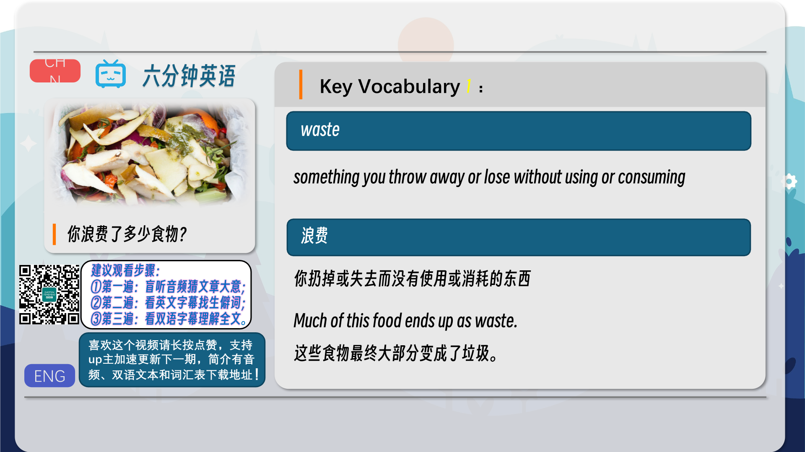
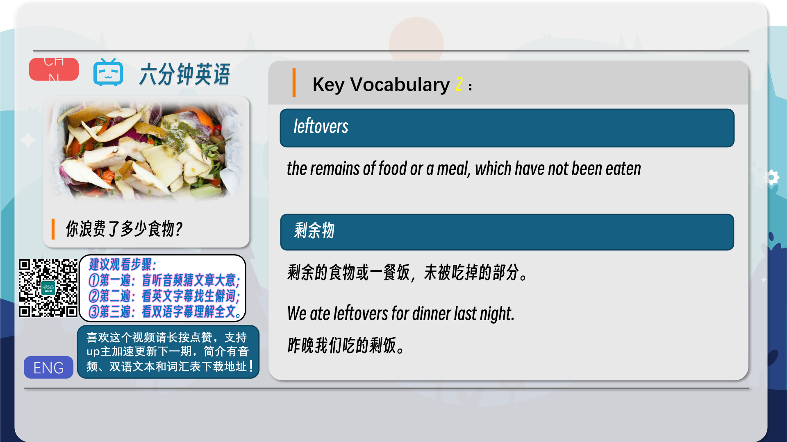
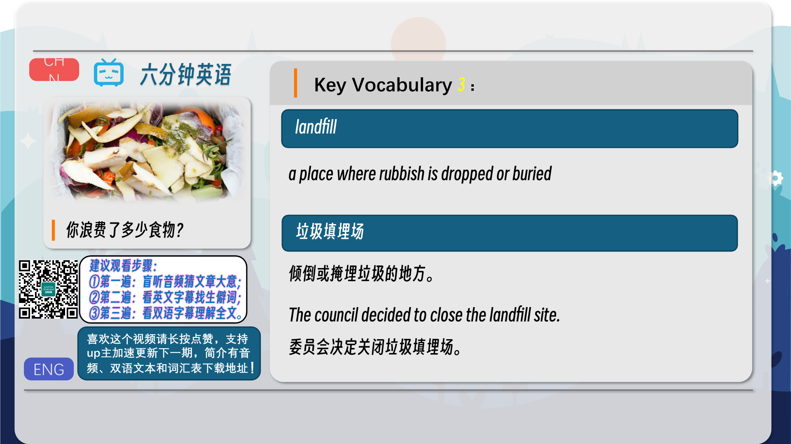
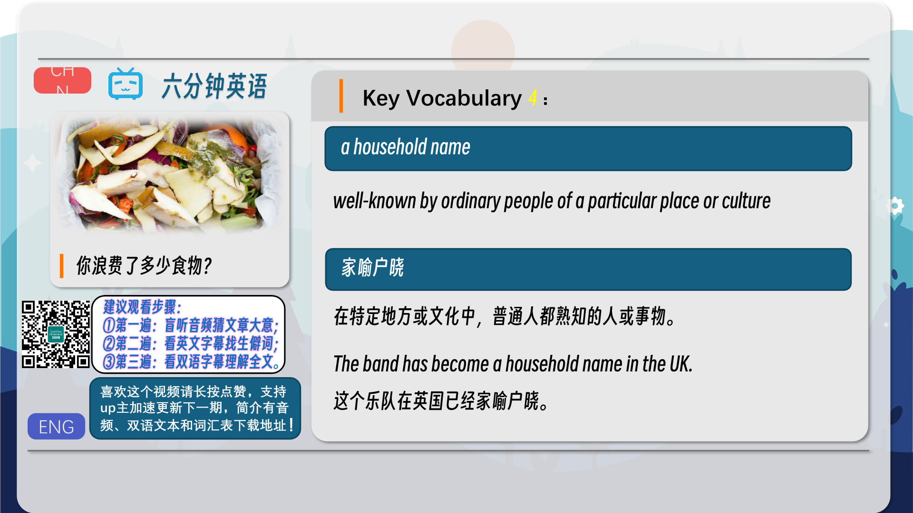
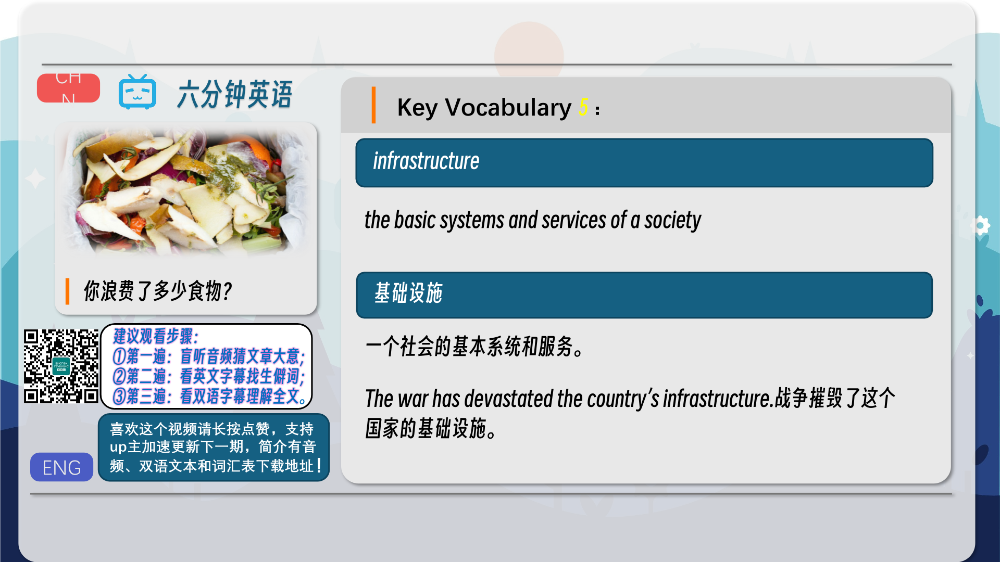
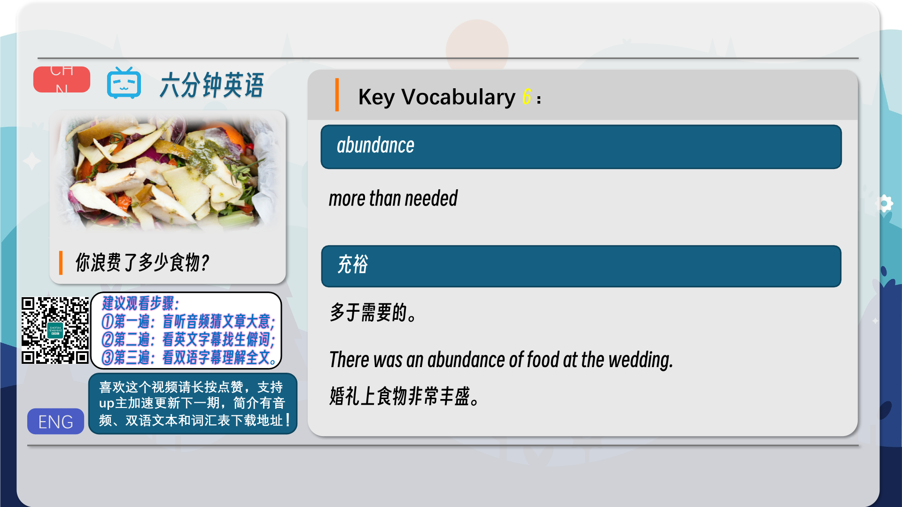
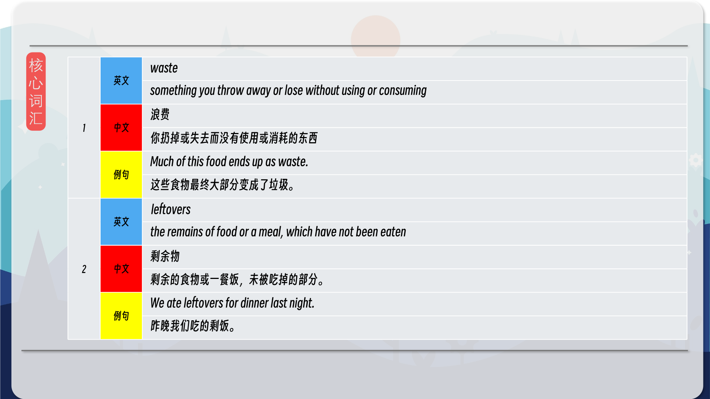
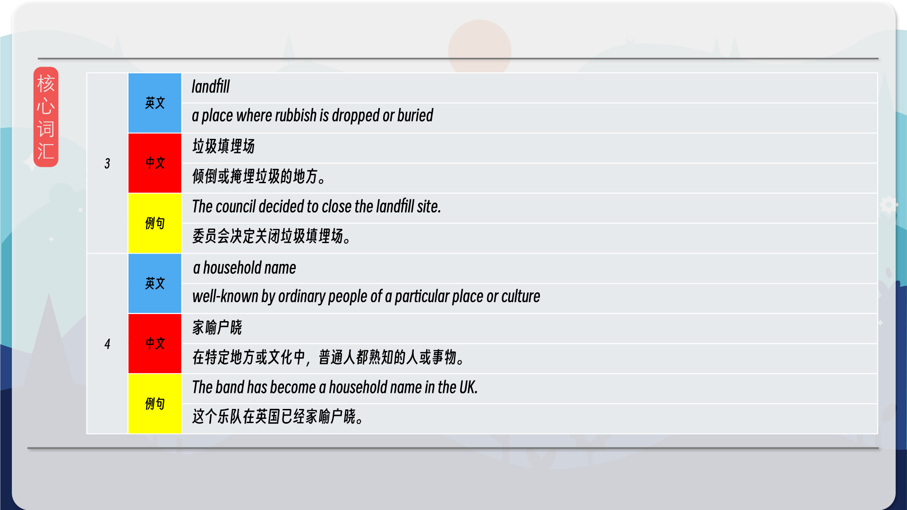
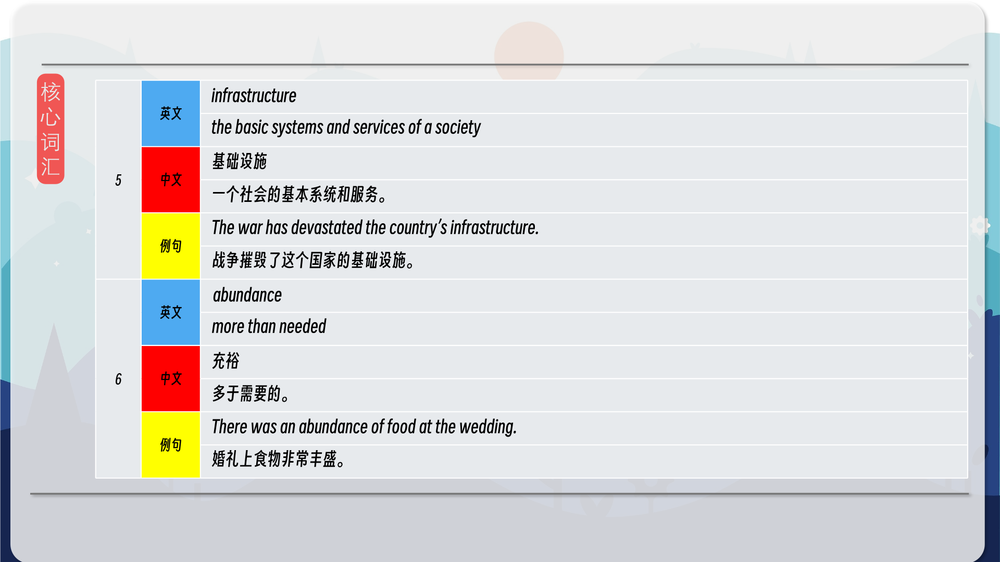
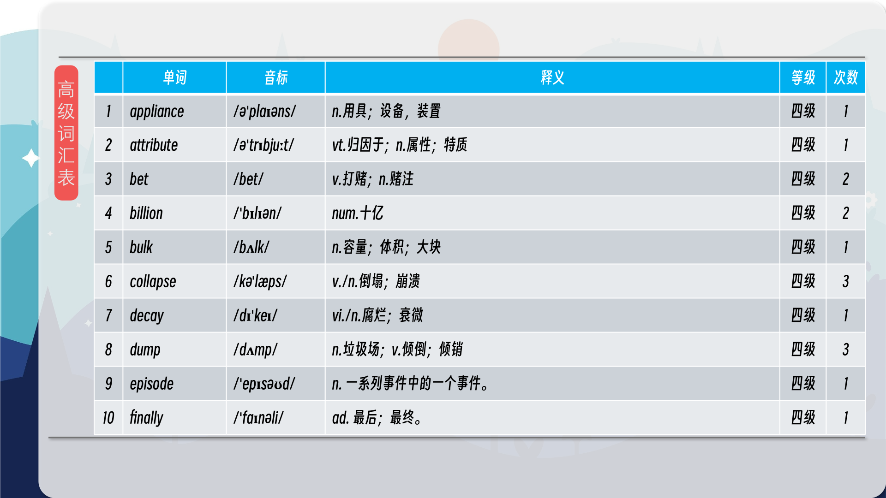
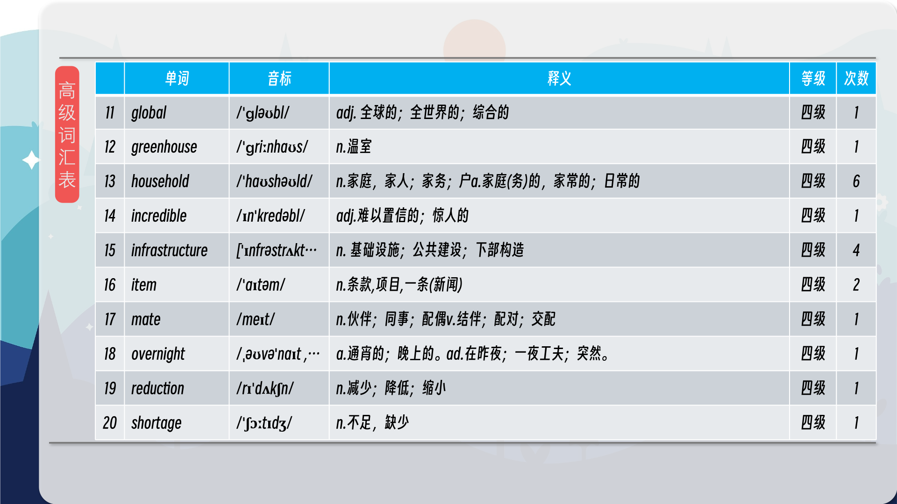
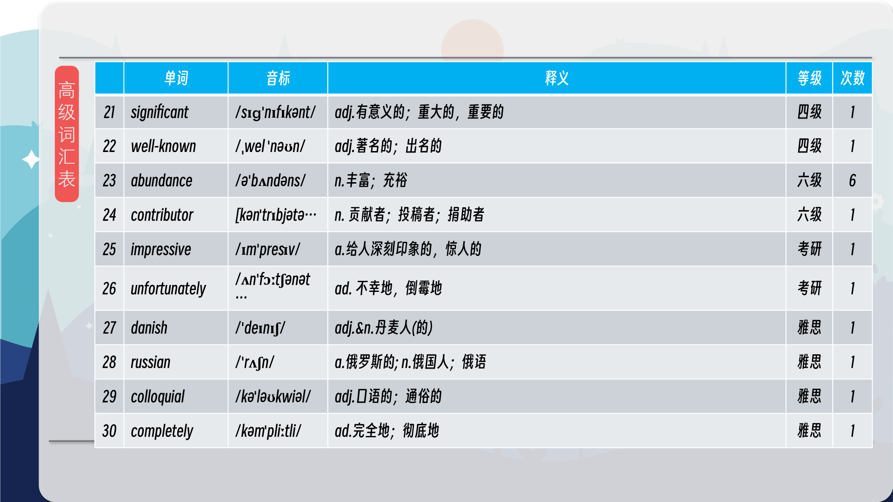
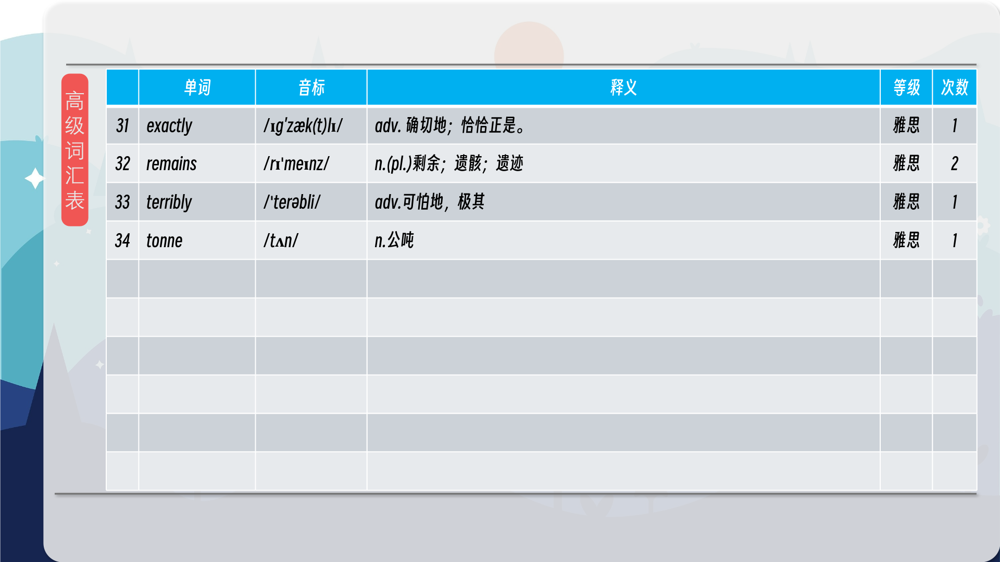

### 【核心词汇】
#### waste
something you throw away or lose without using or consuming
浪费
你扔掉或失去而没有使用或消耗的东西
Much of this food ends up as waste.
这些食物最终大部分变成了垃圾。
#### leftovers
the remains of food or a meal, which have not been eaten
剩余物
剩余的食物或一餐饭，未被吃掉的部分。
We ate leftovers for dinner last night.
昨晚我们吃的剩饭。
#### landfill
a place where rubbish is dropped or buried
垃圾填埋场
倾倒或掩埋垃圾的地方。
The council decided to close the landfill site.
委员会决定关闭垃圾填埋场。
#### a household name
well-known by ordinary people of a particular place or culture
家喻户晓
在特定地方或文化中，普通人都熟知的人或事物。
The band has become a household name in the UK.
这个乐队在英国已经家喻户晓。
#### infrastructure
the basic systems and services of a society
基础设施
一个社会的基本系统和服务。
The war has devastated the country’s infrastructure.
战争摧毁了这个国家的基础设施。
#### abundance
more than needed
充裕
多于需要的。
There was an abundance of food at the wedding.
婚礼上食物非常丰盛。

在公众号里输入6位数字，获取【对话音频、英文文本、中文翻译、核心词汇和高级词汇表】电子档，6位数字【暗号】在文章的最后一张图片，如【220728】，表示22年7月28日这一期。公众号没有的文章说明还没有制作相关资料。年度合集在B站【六分钟英语】工房获取，每年共计300+文档，感谢支持！