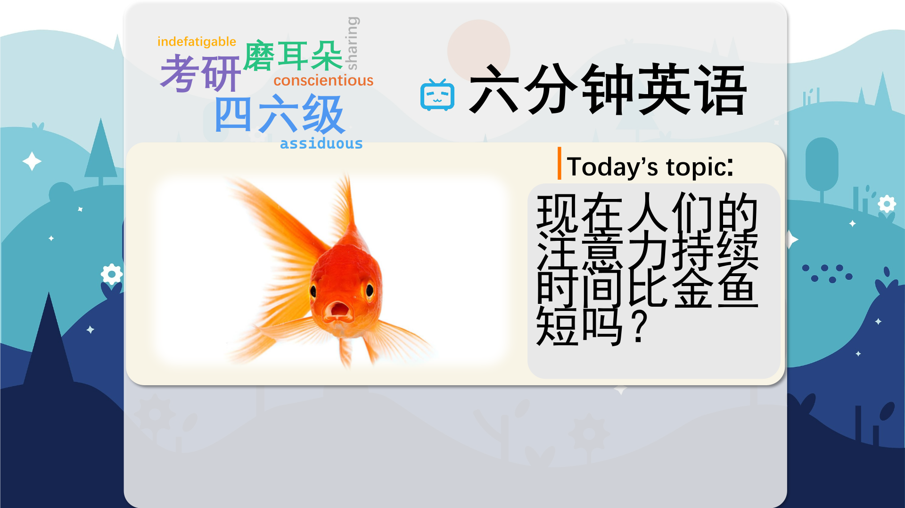

### 【英文脚本】
Neil
Hello and welcome to 6 Minute English – the programme where we bring you an interesting topic and six items of vocabulary. I'm Neil.
 
Catherine
And I'm Catherine. Now, this programme is six minutes long.
 
Neil
Yes. It's 6 Minute English!
 
Catherine
And we have a challenge for everyone – can you stay focused for the full six minutes?
 
Neil
Sounds easy? Maybe not, because today we're talking about our attention spans: are they shrinking?
 
Catherine
That's right, so we're asking today: is the length of time we can focus on something – that's our attention span – actually getting shorter? Now, one study says that – in fact, it claims the human attention span is now shorter than that of a goldfish.
 
Neil
Can that be true? Smartphones, the internet, social media – these all certainly do take up a lot of our attention. But how much? How long do we look at our mobile phones for in a day, on average? Is it… a) around 30 minutes, b) around two and a half hours, or c) over three hours?
 
Catherine
I tend to be quite busy, but I know some people are really addicted to their mobile phones so I'm going to say around two and a half hours - that's answer 'b'.
 
Neil
OK, so, a report released by Microsoft said the average human attention span in 2000 was 12 seconds. Since then it's fallen to just eight seconds.
 
Catherine
Right, and that's a massive change in a very short time. Now, the year 2000 was just before the boom in digital media and smartphones, so many think they're to blame for all these distractions – now, distractions are things which take away our focus or attention.
 
Neil
Yes. And we mentioned goldfish earlier – goldfish reportedly have an attention span of nine seconds. That's one more than phone-obsessed humans with a mere eight seconds!
 
Catherine
And there's a phrase in English – we say ‘to have the attention span of a goldfish'. Or ‘the memory of a goldfish'. So these poor… poor gold goldfish, Neil.
 
Neil
Yes, they get a bad press, don't they? That's a phrase which means ‘criticism' – especially criticism in the media and especially in newspapers – or the ‘press', as we call it.
 
Catherine
So – is it really true than humans are now even more easily distracted than fish?
 
Neil
Well, BBC radio programme More or Less recently investigated this claim.
 
Catherine
That's right. And they found out a couple of things. Firstly – they couldn't find evidence of the research that Microsoft quoted in their report. In other words, the programme couldn't find scientific evidence that our attention spans are in fact shrinking.
 
Neil
And secondly – the psychologist they spoke to said there are problems with the idea of measuring attention spans in the first place. It's a term that's widely used, but it's not very scientific.
 
Catherine
Sounds fishy.
 
Neil
Yes. Fishy means ‘suspicious', by the way. Sorry, goldfish. Again.
 
Catherine
So, are we humans in fact more easily distracted than before? More or Less asked Dr Gemma Briggs, a psychologist at the Open University, if human beings are less able to focus these days.
 
Dr Gemma Briggs, Psychology lecturer, Open University
It's all down to the individual; it's all down to how you choose to apply your attention. So attention-switching ability may well have developed in recent years, in the age of the smartphone and the internet. But because someone's distracted by their smartphone or wanting to quickly Google something, it doesn't mean that they then don't have the ability to control and sustain their attention when they carry out another task.
 
Neil
So she says we're not necessarily more easily distracted. Instead, we may actually be better at switching our attention quickly between different tasks.
 
Catherine
That's right. She's really saying we can multitask better than before. And that means we can focus on many different tasks, each for a shorter period of time.
 
Neil
She said: “It's all down to how you choose to apply your attention.” Let's just highlight that phrase down to. Here, it means ‘depends on'. It all depends on how you choose to apply your attention.
 
Catherine
So – maybe our attention spans aren't getting shorter, we just choose to look at our phones a lot more.
 
Neil
Which reminds me today's question. I asked you how long on average we spend looking at our phones, and you said?
 
Catherine
Well, my attention span is not that short that I can't remember that I said two and a half hours.
 
Neil
And the answer – if you believe the research – is 2.42 hours per day so, pretty good guess there, Catherine.
 
Catherine
Thank you.
 
Neil
That comes from Chicago-based research firm Dscout. And what about this: the group they surveyed touched their mobiles over 2,600 times a day. Do you touch your phone 2,600 times a day, Catherine?
 
Catherine
I try not to, what about you?
 
Neil
It's probably more than that to be honest. Now, I'm sure everyone wants to get back to touching their phones – or maybe they're even touching them now as they listen – but either way, let's have a review of today's phrases.
 
Catherine
OK, so first we had attention span – that's the length of time we can focus on something. And mine is definitely shorter than it used to be… Neil? Neil?
 
Neil
Sorry – I just got distracted there by a message on my phone. Apologies.
 
Catherine
That's alright. So, next up we had a bad press. Goldfish get a bad press. Social media gets a bad press. And this means they all get criticism in the media.
 
Neil
And we had fishy. If something's fishy, it's suspicious.
 
Catherine
And we had multitask. To multitask is to do several things at once.
 
Neil
Then we had down to. Here it means ‘depends on', though it can mean other things in other contexts. You could say, it's all down to the context!
 
Catherine
And that's our quick review, and our programme for today. So, did you stay focused all the way through? Or were you distracted?
 
Neil
If you're looking for distractions – may I recommend our Facebook, Twitter, Instagram and YouTube pages?
 
Both
Goodbye.
 

### 【中英文双语脚本】
Neil(尼尔)
Hello and welcome to 6 Minute English – the programme where we bring you an interesting topic and six items of vocabulary. I'm Neil.
您好，欢迎来到六分钟英语 - 我们为您带来一个有趣的话题和六项词汇。我是 Neil。

Catherine(凯瑟琳)
And I'm Catherine. Now, this programme is six minutes long.
我是 Catherine。现在，这个节目时长为六分钟。

Neil(尼尔)
Yes. It's 6 Minute English!
是的。这是六分钟英语！

Catherine(凯瑟琳)
And we have a challenge for everyone – can you stay focused for the full six minutes?
我们向每个人提出了一个挑战 - 您能否在整整六分钟内保持专注？

Neil(尼尔)
Sounds easy? Maybe not, because today we're talking about our attention spans: are they shrinking?
听起来很容易？也许不是，因为今天我们谈论的是我们的注意力持续时间：它们是否在缩小？

Catherine(凯瑟琳)
That's right, so we're asking today: is the length of time we can focus on something – that's our attention span – actually getting shorter? Now, one study says that – in fact, it claims the human attention span is now shorter than that of a goldfish.
没错，所以我们今天要问的是：我们可以专注于某件事的时间长度 —— 即我们的注意力持续时间 —— 真的变短了吗？现在，一项研究表明 —— 事实上，它声称人类的注意力持续时间现在比金鱼还短。

Neil(尼尔)
Can that be true? Smartphones, the internet, social media – these all certainly do take up a lot of our attention. But how much? How long do we look at our mobile phones for in a day, on average? Is it… a) around 30 minutes, b) around two and a half hours, or c) over three hours?
这是真的吗？智能手机、互联网、社交媒体 —— 这些肯定都占据了我们的很多注意力。但多少呢？我们平均一天看手机多长时间？是吗。。。a） 大约 30 分钟，b） 大约两个半小时，还是 c） 超过 3 小时？

Catherine(凯瑟琳)
I tend to be quite busy, but I know some people are really addicted to their mobile phones so I'm going to say around two and a half hours - that's answer 'b'.
我通常很忙，但我知道有些人真的沉迷于他们的手机，所以我要说大约两个半小时 - 这就是答案 'b'。

Neil(尼尔)
OK, so, a report released by Microsoft said the average human attention span in 2000 was 12 seconds. Since then it's fallen to just eight seconds.
好的，那么，Microsoft 发布的一份报告称，2000 年人类的平均注意力持续时间为 12 秒。从那时起，它下降到只有 8 秒。

Catherine(凯瑟琳)
Right, and that's a massive change in a very short time. Now, the year 2000 was just before the boom in digital media and smartphones, so many think they're to blame for all these distractions – now, distractions are things which take away our focus or attention.
是的，这是在很短的时间内发生的巨大变化。现在，2000 年正好是数字媒体和智能手机繁荣之前，因此许多人认为所有这些干扰都应该归咎于他们 —— 现在，干扰是夺走我们注意力或注意力的事情。

Neil(尼尔)
Yes. And we mentioned goldfish earlier – goldfish reportedly have an attention span of nine seconds. That's one more than phone-obsessed humans with a mere eight seconds!
是的。我们之前提到了金鱼 —— 据报道，金鱼的注意力持续时间为 9 秒。这比痴迷于手机的人类仅仅 8 秒多了 1 秒！

Catherine(凯瑟琳)
And there's a phrase in English – we say ‘to have the attention span of a goldfish'. Or ‘the memory of a goldfish'. So these poor… poor gold goldfish, Neil.
英语中有一句话 —— 我们说 'to have the attention span of a goldfish'。或“金鱼的记忆”。所以这些可怜的......可怜的金鱼，尼尔。

Neil(尼尔)
Yes, they get a bad press, don't they? That's a phrase which means ‘criticism' – especially criticism in the media and especially in newspapers – or the ‘press', as we call it.
是的，他们受到了不好的报道，不是吗？这个短语的意思是“批评” —— 尤其是媒体和报纸上的批评 —— 或者我们称之为“新闻”。

Catherine(凯瑟琳)
So – is it really true than humans are now even more easily distracted than fish?
那么 —— 人类现在真的比鱼更容易分心吗？

Neil(尼尔)
Well, BBC radio programme More or Less recently investigated this claim.
好吧，BBC 广播节目 More or Less 最近调查了这一说法。

Catherine(凯瑟琳)
That's right. And they found out a couple of things. Firstly – they couldn't find evidence of the research that Microsoft quoted in their report. In other words, the programme couldn't find scientific evidence that our attention spans are in fact shrinking.
没错。他们发现了几件事。首先 - 他们找不到 Microsoft 在其报告中引用的研究的证据。换句话说，该计划找不到科学证据证明我们的注意力持续时间实际上正在缩小。

Neil(尼尔)
And secondly – the psychologist they spoke to said there are problems with the idea of measuring attention spans in the first place. It's a term that's widely used, but it's not very scientific.
其次 —— 他们采访的心理学家说，首先测量注意力持续时间的想法存在问题。这是一个被广泛使用的术语，但它不是很科学。

Catherine(凯瑟琳)
Sounds fishy.
听起来很可疑。

Neil(尼尔)
Yes. Fishy means ‘suspicious', by the way. Sorry, goldfish. Again.
是的。顺便说一句，Fishy 的意思是“可疑的”。对不起，金鱼。再。

Catherine(凯瑟琳)
So, are we humans in fact more easily distracted than before? More or Less asked Dr Gemma Briggs, a psychologist at the Open University, if human beings are less able to focus these days.
那么，我们人类实际上是否比以前更容易分心呢？或多或少地问了开放大学的心理学家杰玛·布里格斯（Gemma Briggs）博士，如今人类是否不太能集中注意力。

Dr Gemma Briggs, Psychology lecturer, Open University(GemmaBriggs博士，开放大学心理学讲师)
It's all down to the individual; it's all down to how you choose to apply your attention. So attention-switching ability may well have developed in recent years, in the age of the smartphone and the internet. But because someone's distracted by their smartphone or wanting to quickly Google something, it doesn't mean that they then don't have the ability to control and sustain their attention when they carry out another task.
这一切都取决于个人；这完全取决于您选择如何应用注意力。因此，注意力切换能力很可能是在近年来，在智能手机和互联网时代发展起来的。但是，因为有人被智能手机分散了注意力或想快速用谷歌搜索某事，这并不意味着他们在执行另一项任务时没有能力和维持注意力的能力。

Neil(尼尔)
So she says we're not necessarily more easily distracted. Instead, we may actually be better at switching our attention quickly between different tasks.
所以她说我们不一定更容易分心。相反，我们实际上可能更擅长在不同任务之间快速切换注意力。

Catherine(凯瑟琳)
That's right. She's really saying we can multitask better than before. And that means we can focus on many different tasks, each for a shorter period of time.
没错。她真的是在说我们可以比以前更好地同时处理多项任务。这意味着我们可以专注于许多不同的任务，每项任务的时间更短。

Neil(尼尔)
She said: “It's all down to how you choose to apply your attention.” Let's just highlight that phrase down to. Here, it means ‘depends on'. It all depends on how you choose to apply your attention.
她说：“这完全取决于你选择如何集中注意力。让我们把这句话具体强调一下。在这里，它的意思是 'depends on'。这完全取决于您选择如何应用注意力。

Catherine(凯瑟琳)
So – maybe our attention spans aren't getting shorter, we just choose to look at our phones a lot more.
所以 - 也许我们的注意力持续时间并没有变短，我们只是选择更多地看手机。

Neil(尼尔)
Which reminds me today's question. I asked you how long on average we spend looking at our phones, and you said?
这让我想起了今天的问题。我问你，我们平均花多长时间看手机，你说？

Catherine(凯瑟琳)
Well, my attention span is not that short that I can't remember that I said two and a half hours.
嗯，我的注意力持续时间并没有短到我记不清我说的是两个半小时。

Neil(尼尔)
And the answer – if you believe the research – is 2.42 hours per day so, pretty good guess there, Catherine.
答案 - 如果你相信这项研究 - 是每天 2.42 小时，所以，猜得不错，凯瑟琳。

Catherine(凯瑟琳)
Thank you.
谢谢。

Neil(尼尔)
That comes from Chicago-based research firm Dscout. And what about this: the group they surveyed touched their mobiles over 2,600 times a day. Do you touch your phone 2,600 times a day, Catherine?
该数据来自总部位于芝加哥的研究公司 Dscout。那么呢：他们调查的群体每天触摸他们的手机超过 2,600 次。Catherine 先生，您每天触摸手机 2,600 次吗？

Catherine(凯瑟琳)
I try not to, what about you?
我尽量不这样做，你呢？

Neil(尼尔)
It's probably more than that to be honest. Now, I'm sure everyone wants to get back to touching their phones – or maybe they're even touching them now as they listen – but either way, let's have a review of today's phrases.
老实说，这可能不止于此。现在，我敢肯定每个人都想重新触摸他们的手机 —— 或者他们现在甚至在听手机时触摸它们 —— 但无论哪种方式，让我们回顾一下今天的短语。

Catherine(凯瑟琳)
OK, so first we had attention span – that's the length of time we can focus on something. And mine is definitely shorter than it used to be… Neil? Neil?
好的，首先我们有了注意力持续时间 —— 这是我们可以专注于某件事的时间长度。而且我的肯定比以前矮了......尼尔？尼尔？

Neil(尼尔)
Sorry – I just got distracted there by a message on my phone. Apologies.
抱歉 - 我刚刚被手机上的消息分散了注意力。道歉。

Catherine(凯瑟琳)
That's alright. So, next up we had a bad press. Goldfish get a bad press. Social media gets a bad press. And this means they all get criticism in the media.
没关系。所以，接下来我们遇到了一个糟糕的新闻。金鱼受到了不好的报道。社交媒体受到了负面报道。这意味着他们都会受到媒体的批评。

Neil(尼尔)
And we had fishy. If something's fishy, it's suspicious.
我们吃了鱼。如果有什么可疑之处，那就是可疑的。

Catherine(凯瑟琳)
And we had multitask. To multitask is to do several things at once.
而且我们有多任务。多任务处理是指同时做几件事。

Neil(尼尔)
Then we had down to. Here it means ‘depends on', though it can mean other things in other contexts. You could say, it's all down to the context!
然后我们不得不开始。在这里，它的意思是 'depends on'，尽管在其他上下文中它可以表示其他事物。你可以说，这一切都取决于上下文！

Catherine(凯瑟琳)
And that's our quick review, and our programme for today. So, did you stay focused all the way through? Or were you distracted?
这就是我们的快速回顾，也是我们今天的计划。那么，你是否一直保持专注？还是你分心了？

Neil(尼尔)
If you're looking for distractions – may I recommend our Facebook, Twitter, Instagram and YouTube pages?
如果您正在寻找分散注意力的信息 - 我可以推荐我们的 Facebook、Twitter、Instagram 和 YouTube 页面吗？

Both(双)
Goodbye.
再见。

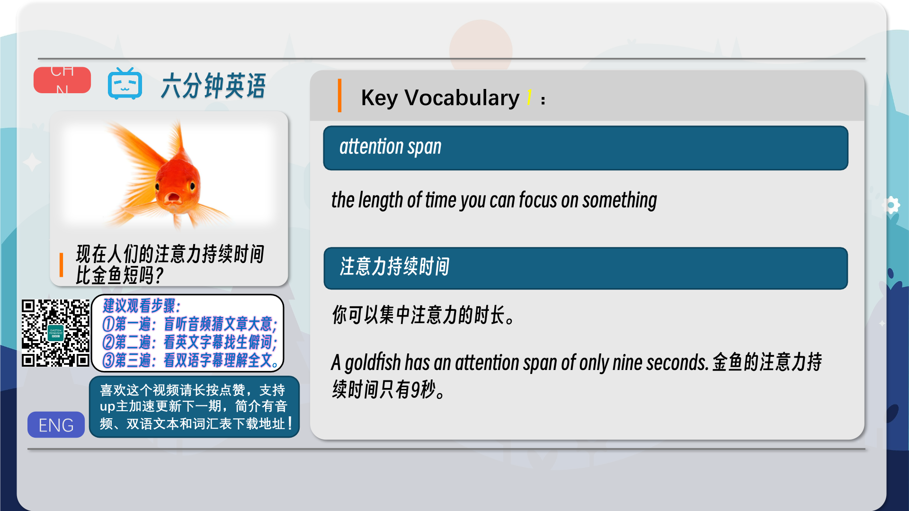
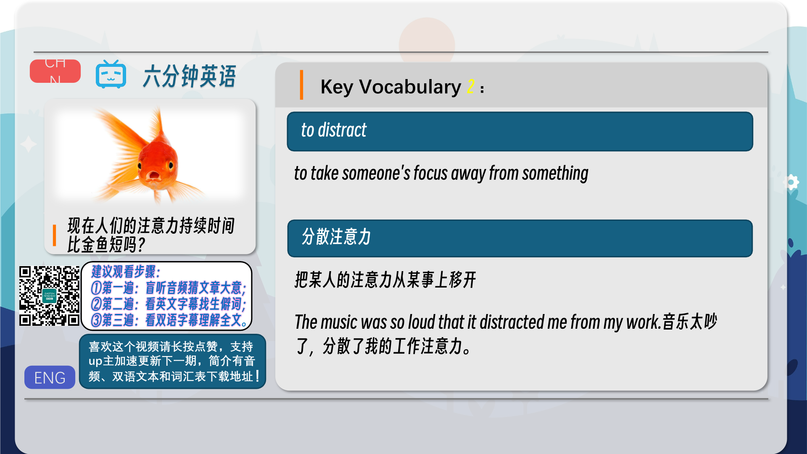
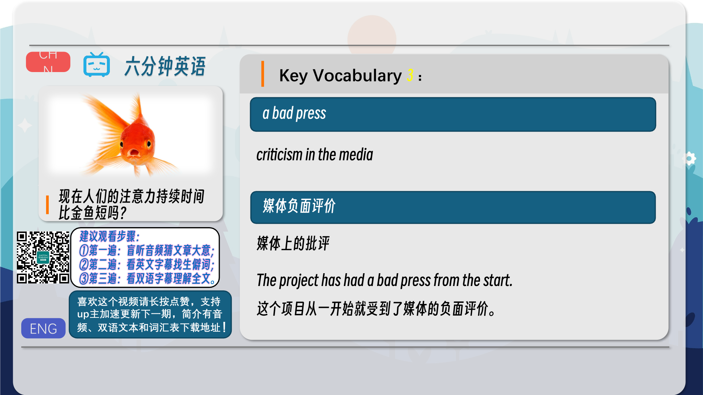
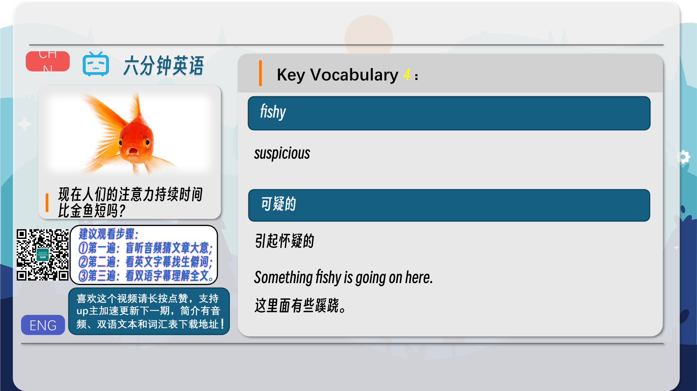

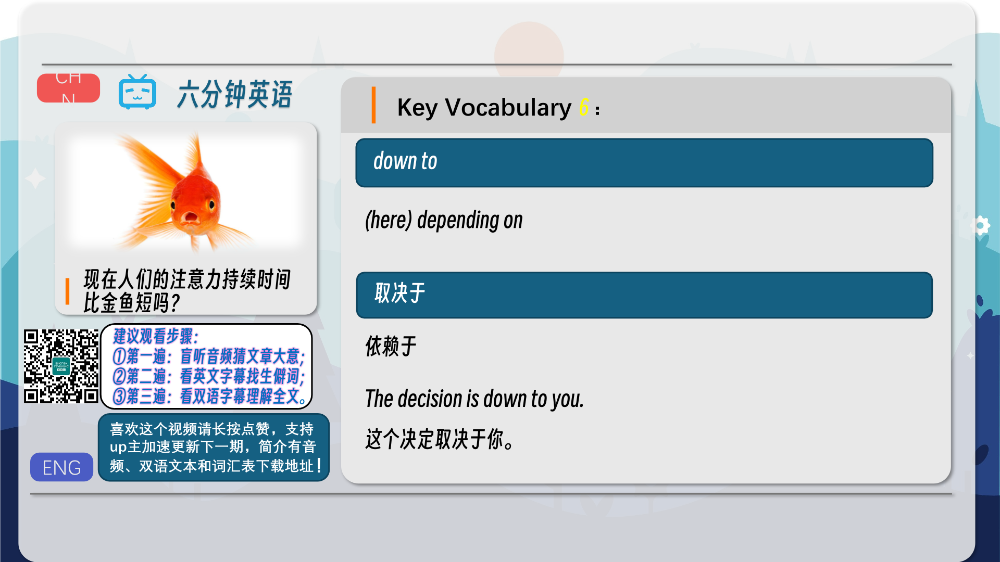
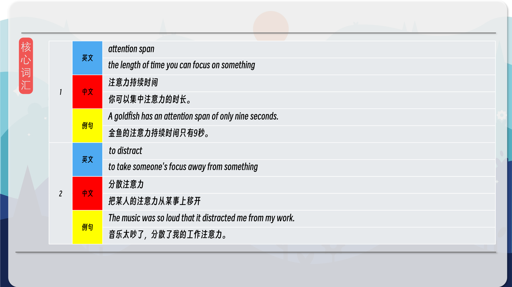
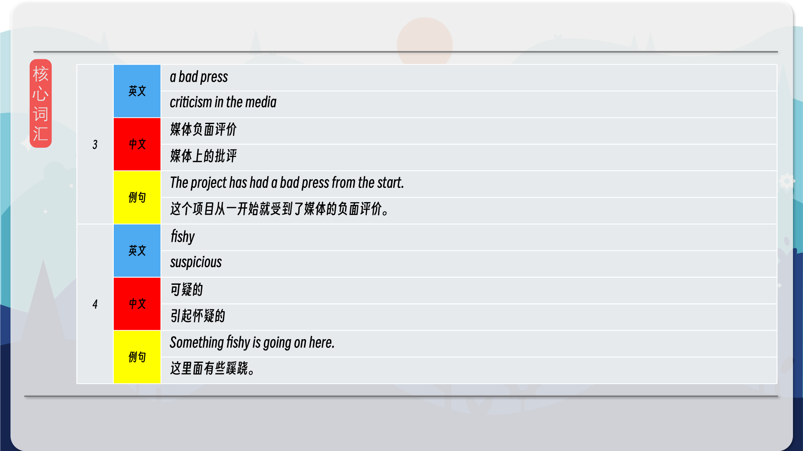
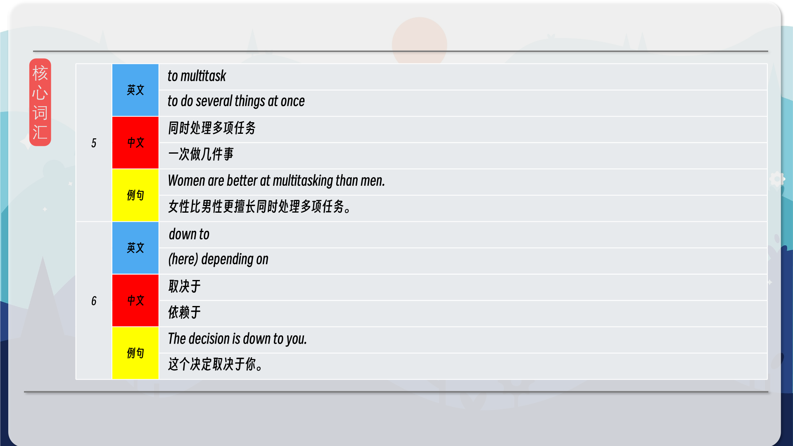
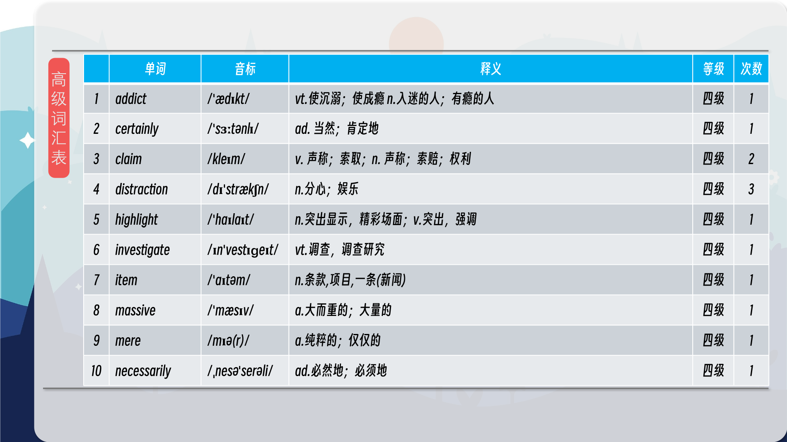
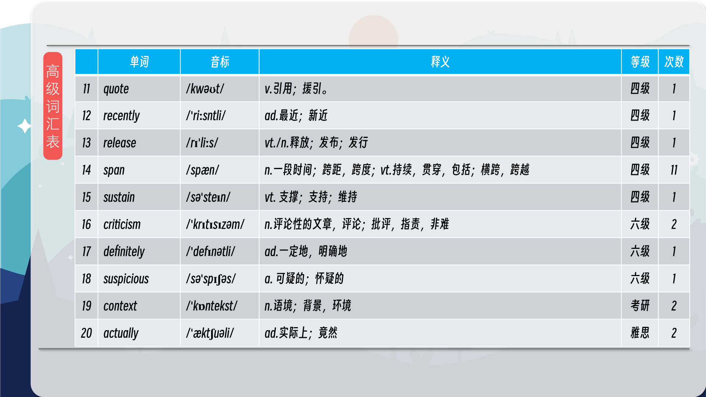
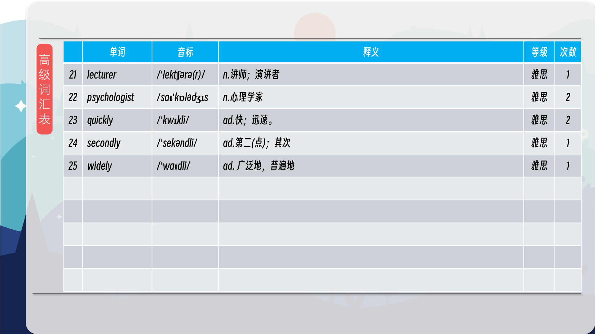

### 【核心词汇】
#### attention span
the length of time you can focus on something
注意力持续时间
你可以集中注意力的时长。
A goldfish has an attention span of only nine seconds.
金鱼的注意力持续时间只有9秒。
#### to distract
to take someone's focus away from something
分散注意力
把某人的注意力从某事上移开
The music was so loud that it distracted me from my work.
音乐太吵了，分散了我的工作注意力。
#### a bad press
criticism in the media
媒体负面评价
媒体上的批评
The project has had a bad press from the start.
这个项目从一开始就受到了媒体的负面评价。
#### fishy
suspicious
可疑的
引起怀疑的
Something fishy is going on here.
这里面有些蹊跷。
#### to multitask
to do several things at once
同时处理多项任务
一次做几件事
Women are better at multitasking than men.
女性比男性更擅长同时处理多项任务。
#### down to
(here) depending on
取决于
依赖于
The decision is down to you.
这个决定取决于你。

在公众号里输入6位数字，获取【对话音频、英文文本、中文翻译、核心词汇和高级词汇表】电子档，6位数字【暗号】在文章的最后一张图片，如【220728】，表示22年7月28日这一期。公众号没有的文章说明还没有制作相关资料。年度合集在B站【六分钟英语】工房获取，每年共计300+文档，感谢支持！