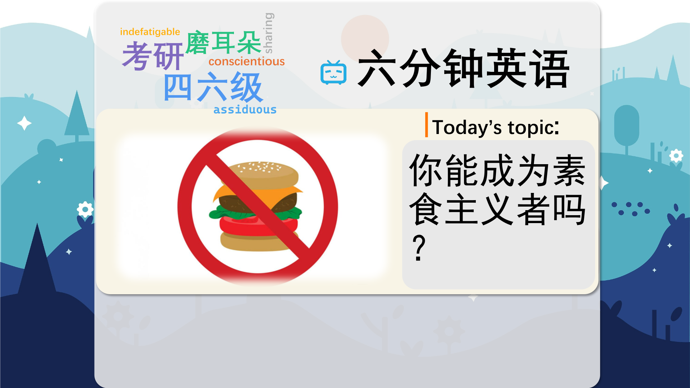

### 【英文脚本】
Neil
Hello and welcome to 6 Minute English – the programme where we bring you an interesting topic and six items of vocabulary. I'm Neil.
 
Catherine
And I'm Catherine.
 
Neil
Now, if you want to fight climate change – what can you do?
 
Catherine
Well, you can use less electricity…
 
Neil
Or stop driving…
 
Catherine
But scientists believe there's another behaviour which has an even bigger impact on the planet, and that is what you eat.
 
Neil
We're talking about meat here. If people cut out meat and animal products from their diets – harmful emissions could be reduced by 70%. That's according to research from Oxford University.
 
Catherine
Now emissions are the gases produced by an activity or living thing – so we could talk about factory emissions or farming emissions.
 
Neil
And if you eat no meat or animal products you're what we call 'vegan'. More and more people around the world are going vegan. And today's question: which of these celebrities is vegan? Is it… a) Brad Pitt, b) Jennifer Lopez or c) Miley Cyrus?
 
Catherine
And I'm going to go for…c) Miley Cyrus.
 
Neil
Well, we'll find out at the end of the programme. Now, before we go much further, why don't we find out a bit more about exactly what it means to be vegan?
 
Catherine
Here's Tom Kuehnel from the Vegan Society in the UK.
 
Tom Kuehnel, Vegan Society
Veganism is a way of living which excludes, as far as is possible and practicable, all forms of exploitation and cruelty to animals. So that's for food, clothing or any other purpose. So we just don't want to use or abuse animals. And we feel like there, you know, there are plenty of alternatives in this day and age. It's never been easier to be vegan.
 
Neil
Of course, he says that avoiding cruelty to animals is what it's all about, but that doesn't just mean food. If you're a true vegan, then clothing from animals is also out - no more leather shoes!
 
Catherine
But he feels that it's easier than ever before to become vegan – and uses a nice phrase: "in this day and age".
 
Neil
Yes. It means 'these days', or 'in the present time' – and is often used to highlight a contrast with a previous time.
 
Catherine
So, many people go vegan for ethical reasons. Now ethical is a useful word, it means 'relating to moral beliefs', so if you become vegan for ethical reasons, you do it because you think it's wrong to eat or use animal products.
 
Neil
Others go vegan because of environmental considerations, as we looked at earlier. Rearing livestock – that means animals like cows and pigs – produces a lot of harmful methane gas. Now, let's just say the animals themselves produce a lot of it from their bodies. The other major reason to choose veganism…
 
Catherine
Veganism – now, that's the noun for the diet.
 
Neil
… is because they believe it is healthier.
 
Catherine
In the research from Oxford University we mentioned earlier, scientists found that 8 million deaths per year could be avoided if the world went vegan.
 
Neil
Now, that's human deaths. They claim that half of this figure would be because we no longer eat red meat, and the other half would be due to eating more healthy fruit and vegetables – as well as fewer people being overweight.
 
Catherine
And they say that this would have an economic impact too. They suggest that up to $1,000bn a year would be saved due to reduced healthcare costs and increased productivity at work - because fewer people would get sick.
 
Neil
So, if it's all so simple – why don't we all go vegan tomorrow?
 
Catherine
Well, meat-eating is an important part of most cultures – not everyone wants to change.
 
Neil
And millions of people worldwide raise livestock for a living.
 
Catherine
So these jobs would disappear. Now, with up to a third of the planet estimated to be arid – which means dry and unable to support crops - people living in these regions rely on livestock, so people for example like the Berbers in the Sahara region.
 
Neil
Without animal farming they would be forced to abandon traditional nomadic lifestyles – that's where they move from place to place - and settle in cities.
 
Catherine
And for many people, well, they just like eating meat and dairy.
 
Neil
We asked you about well-known vegans: which of these is vegan? a) Brad Pitt, b) Jennifer Lopez or c) Miley Cyrus?
 
Catherine
And I said it was Miley Cyrus.
 
Neil
Well, you're kind of half right, Catherine. In fact, both Brad Pitt and Miley Cyrus are vegan. Jennifer Lopez used to be, but has since started eating meat again, apparently.
 
Catherine
Now, why don't we wrap up by looking at today's vocabulary one more time?
 
Neil
Well – we started with emissions: gases produced by something or an activity such as digestion. Livestock emissions for example – are gases produced by animals.
 
Catherine
We can also add a word that describes a kind of emissions, like methane emissions or greenhouse gas emissions.
 
Neil
Next up we had in this day and age – which means 'these days'.
 
Catherine
I still can't believe you still don't have a smartphone in this day and age, Neil.
 
Neil
Well, maybe I just object to smartphones for ethical reasons!
 
Catherine
So you have for moral reasons to smartphones?
 
Neil
Yeah, for me it's important to understand the conditions of the workers in the factory where the smartphone is made.
 
Catherine
That's fair enough then. But, Neil, you haven't become vegan yet for ethical reasons, have you?
 
Neil
You've got me there – I admire veganism but I still like cheese too much to do it! Veganism is the noun.
 
Catherine
That's right. So two more words to go – we have arid and livestock. Arid describes land that is too dry to support many crops or plants.
 
Neil
But arid regions can sometimes support livestock – livestock means farm animals. If you think of the 'stock' as being the assets of a business, then animals are 'living' or 'live' stock.
 
Catherine
And that brings us to the end of today's programme. Join us on our Facebook, Twitter, Instagram and YouTube pages for lots more! Let us know what you think of veganism!
 
Neil
Bye for now.
 
Catherine
Bye!
 

### 【中英文双语脚本】
Neil(尼尔)
Hello and welcome to 6 Minute English – the programme where we bring you an interesting topic and six items of vocabulary. I'm Neil.
您好，欢迎来到六分钟英语 - 我们为您带来一个有趣的话题和六项词汇。我是 Neil。

Catherine(凯瑟琳)
And I'm Catherine.
我是 Catherine。

Neil(尼尔)
Now, if you want to fight climate change – what can you do?
现在，如果您想应对气候变化 – 您能做些什么？

Catherine(凯瑟琳)
Well, you can use less electricity…
嗯，你可以用更少的电......

Neil(尼尔)
Or stop driving…
或者停止驾驶......

Catherine(凯瑟琳)
But scientists believe there's another behaviour which has an even bigger impact on the planet, and that is what you eat.
但科学家们认为，还有另一种行为对地球的影响更大，那就是你吃的东西。

Neil(尼尔)
We're talking about meat here. If people cut out meat and animal products from their diets – harmful emissions could be reduced by 70%. That's according to research from Oxford University.
我们在这里谈论的是肉类。如果人们从饮食中不吃肉类和动物产品，有害排放可以减少 70%。这是根据牛津大学的研究得出的。

Catherine(凯瑟琳)
Now emissions are the gases produced by an activity or living thing – so we could talk about factory emissions or farming emissions.
现在，排放是活动或生物产生的气体 —— 所以我们可以谈论工厂排放或农业排放。

Neil(尼尔)
And if you eat no meat or animal products you're what we call 'vegan'. More and more people around the world are going vegan. And today's question: which of these celebrities is vegan? Is it… a) Brad Pitt, b) Jennifer Lopez or c) Miley Cyrus?
如果您不吃肉类或动物产品，您就是我们所说的“素食主义者”。世界各地越来越多的人开始吃纯素。今天的问题是：这些名人中哪些是纯素的？是吗。。。a） 布拉德·皮特，b） 詹妮弗·洛佩兹或 c） 麦莉·赛勒斯？

Catherine(凯瑟琳)
And I'm going to go for…c) Miley Cyrus.
我要去......c） 麦莉·赛勒斯。

Neil(尼尔)
Well, we'll find out at the end of the programme. Now, before we go much further, why don't we find out a bit more about exactly what it means to be vegan?
好吧，我们将在节目结束时找到答案。现在，在我们进一步讨论之前，我们为什么不更多地了解纯素的确切含义呢？

Catherine(凯瑟琳)
Here's Tom Kuehnel from the Vegan Society in the UK.
这是来自英国素食协会的 Tom Kuehnel。

Tom Kuehnel, Vegan Society(汤姆·库内尔，素食协会)
Veganism is a way of living which excludes, as far as is possible and practicable, all forms of exploitation and cruelty to animals. So that's for food, clothing or any other purpose. So we just don't want to use or abuse animals. And we feel like there, you know, there are plenty of alternatives in this day and age. It's never been easier to be vegan.
纯素主义是一种生活方式，它尽可能地排除一切形式的剥削和虐待动物。所以那是为了食物、衣服或任何其他目的。所以我们只是不想使用或虐待动物。我们觉得，你知道，这个时代有很多选择。成为纯素从未如此简单。

Neil(尼尔)
Of course, he says that avoiding cruelty to animals is what it's all about, but that doesn't just mean food. If you're a true vegan, then clothing from animals is also out - no more leather shoes!
当然，他说避免虐待动物就是它的全部意义所在，但这不仅仅意味着食物。如果您是真正的素食主义者，那么动物的服装也已经过时了 - 不再有皮鞋！

Catherine(凯瑟琳)
But he feels that it's easier than ever before to become vegan – and uses a nice phrase: "in this day and age".
但他觉得成为纯素者比以往任何时候都容易 —— 并用了一个好词：“在这个时代”。

Neil(尼尔)
Yes. It means 'these days', or 'in the present time' – and is often used to highlight a contrast with a previous time.
是的。它的意思是“这些日子”或“在现在” —— 通常用于突出与以前的对比。

Catherine(凯瑟琳)
So, many people go vegan for ethical reasons. Now ethical is a useful word, it means 'relating to moral beliefs', so if you become vegan for ethical reasons, you do it because you think it's wrong to eat or use animal products.
因此，许多人出于道德原因成为素食主义者。现在道德是一个有用的词，它的意思是“与道德信仰有关”，所以如果你出于道德原因成为纯素者，你这样做是因为你认为吃或使用动物产品是错误的。

Neil(尼尔)
Others go vegan because of environmental considerations, as we looked at earlier. Rearing livestock – that means animals like cows and pigs – produces a lot of harmful methane gas. Now, let's just say the animals themselves produce a lot of it from their bodies. The other major reason to choose veganism…
正如我们之前看到的，其他人出于环境考虑而成为素食主义者。饲养牲畜（即牛和猪等动物）会产生大量有害的甲烷气体。现在，我们只能说动物自己从他们的身体中产生了很多 IT。选择素食主义的另一个主要原因......

Catherine(凯瑟琳)
Veganism – now, that's the noun for the diet.
素食主义 – 现在，这是饮食的名词。

Neil(尼尔)
… is because they believe it is healthier.
…是因为他们认为它更健康。

Catherine(凯瑟琳)
In the research from Oxford University we mentioned earlier, scientists found that 8 million deaths per year could be avoided if the world went vegan.
在我们之前提到的牛津大学研究中，科学家们发现，如果世界实行纯素，每年可以避免 800 万人死亡。

Neil(尼尔)
Now, that's human deaths. They claim that half of this figure would be because we no longer eat red meat, and the other half would be due to eating more healthy fruit and vegetables – as well as fewer people being overweight.
现在，那是人类死亡。他们声称，这个数字的一半是因为我们不再吃红肉，另一半是由于吃了更多健康的水果和蔬菜 —— 以及更少的超重者。

Catherine(凯瑟琳)
And they say that this would have an economic impact too. They suggest that up to $1,000bn a year would be saved due to reduced healthcare costs and increased productivity at work - because fewer people would get sick.
他们说，这也会产生经济影响。他们建议，由于降低医疗保健成本和提高工作效率，每年将节省高达 10000 亿美元 —— 因为生病的人数减少了。

Neil(尼尔)
So, if it's all so simple – why don't we all go vegan tomorrow?
那么，如果一切都这么简单 —— 为什么我们明天不都成为纯素呢？

Catherine(凯瑟琳)
Well, meat-eating is an important part of most cultures – not everyone wants to change.
嗯，吃肉是大多数文化的重要组成部分 —— 不是每个人都想改变。

Neil(尼尔)
And millions of people worldwide raise livestock for a living.
全世界有数百万人以饲养牲畜为生。

Catherine(凯瑟琳)
So these jobs would disappear. Now, with up to a third of the planet estimated to be arid – which means dry and unable to support crops - people living in these regions rely on livestock, so people for example like the Berbers in the Sahara region.
所以这些工作会消失。现在，据估计，地球上有多达三分之一的土地是干旱的，这意味着干旱且无法维持农作物的生长，生活在这些地区的人们依赖畜牧业，例如撒哈拉地区的柏柏尔人。

Neil(尼尔)
Without animal farming they would be forced to abandon traditional nomadic lifestyles – that's where they move from place to place - and settle in cities.
如果没有畜牧业，他们将被迫放弃传统的游牧生活方式 —— 那是他们从一个地方迁移到另一个地方的地方 —— 并在城市定居。

Catherine(凯瑟琳)
And for many people, well, they just like eating meat and dairy.
对许多人来说，他们就是喜欢吃肉和奶制品。

Neil(尼尔)
We asked you about well-known vegans: which of these is vegan? a) Brad Pitt, b) Jennifer Lopez or c) Miley Cyrus?
我们询问了您有关知名素食主义者的信息：哪些是素食主义者？a） 布拉德·皮特，b） 詹妮弗·洛佩兹或 c） 麦莉·赛勒斯？

Catherine(凯瑟琳)
And I said it was Miley Cyrus.
我说是麦莉·赛勒斯。

Neil(尼尔)
Well, you're kind of half right, Catherine. In fact, both Brad Pitt and Miley Cyrus are vegan. Jennifer Lopez used to be, but has since started eating meat again, apparently.
嗯，你说对了一半，Catherine。事实上，布拉德·皮特和麦莉·赛勒斯都是素食主义者。詹妮弗·洛佩兹 （Jennifer Lopez） 曾经是，但显然后来又开始吃肉了。

Catherine(凯瑟琳)
Now, why don't we wrap up by looking at today's vocabulary one more time?
现在，我们为什么不再看一遍今天的词汇呢？

Neil(尼尔)
Well – we started with emissions: gases produced by something or an activity such as digestion. Livestock emissions for example – are gases produced by animals.
嗯 - 我们从排放开始：由某物或活动（如消化）产生的气体。例如，牲畜排放物是动物产生的气体。

Catherine(凯瑟琳)
We can also add a word that describes a kind of emissions, like methane emissions or greenhouse gas emissions.
我们还可以添加一个描述某种排放的词，例如甲烷排放或温室气体排放。

Neil(尼尔)
Next up we had in this day and age – which means 'these days'.
接下来我们在这个时代 —— 意思是“这些日子”。

Catherine(凯瑟琳)
I still can't believe you still don't have a smartphone in this day and age, Neil.
我仍然不敢相信你在这个时代仍然没有智能手机，尼尔。

Neil(尼尔)
Well, maybe I just object to smartphones for ethical reasons!
好吧，也许我只是出于道德原因反对智能手机！

Catherine(凯瑟琳)
So you have for moral reasons to smartphones?
所以你有出于道德原因对智能手机吗？

Neil(尼尔)
Yeah, for me it's important to understand the conditions of the workers in the factory where the smartphone is made.
是的，对我来说，了解智能手机生产工厂中工人的条件很重要。

Catherine(凯瑟琳)
That's fair enough then. But, Neil, you haven't become vegan yet for ethical reasons, have you?
这很公平。但是，尼尔，出于道德原因，你还没有成为纯素者，对吧？

Neil(尼尔)
You've got me there – I admire veganism but I still like cheese too much to do it! Veganism is the noun.
你明白了 - 我钦佩素食主义，但我仍然太喜欢奶酪了！素食主义是名词。

Catherine(凯瑟琳)
That's right. So two more words to go – we have arid and livestock. Arid describes land that is too dry to support many crops or plants.
没错。所以还有两个词要说 —— 我们有干旱和牲畜。干旱是指过于干燥而无法种植许多农作物或植物的土地。

Neil(尼尔)
But arid regions can sometimes support livestock – livestock means farm animals. If you think of the 'stock' as being the assets of a business, then animals are 'living' or 'live' stock.
但干旱地区有时可以养活畜牧业 —— 畜牧业是指农场动物。如果您将“存量”视为企业的资产，那么动物就是“活的”或“活的”存量。

Catherine(凯瑟琳)
And that brings us to the end of today's programme. Join us on our Facebook, Twitter, Instagram and YouTube pages for lots more! Let us know what you think of veganism!
今天的节目到此结束。加入我们的 Facebook、Twitter、Instagram 和 YouTube 页面，了解更多信息！让我们知道您对素食主义的看法！

Neil(尼尔)
Bye for now.
再见。

Catherine(凯瑟琳)
Bye!
再见！

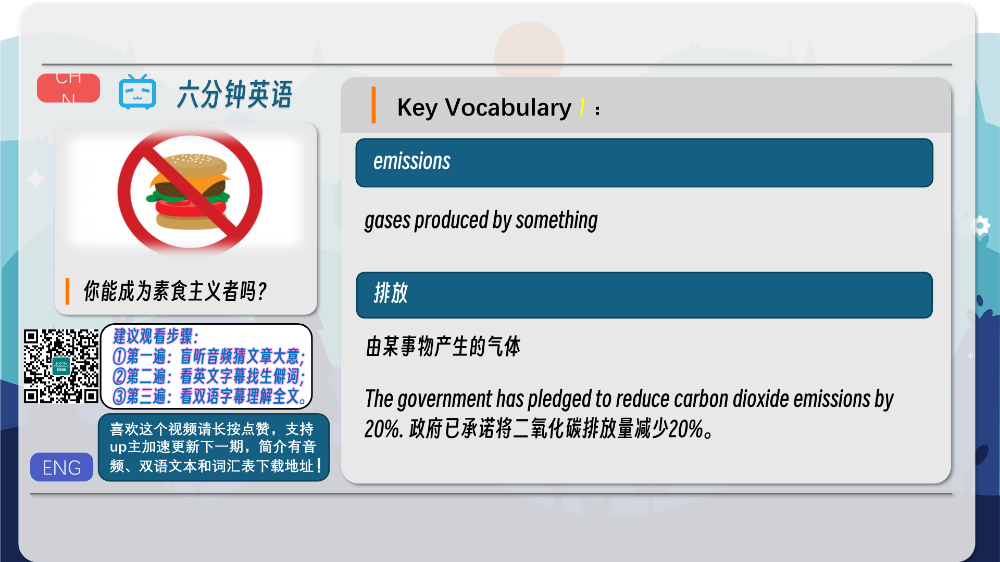
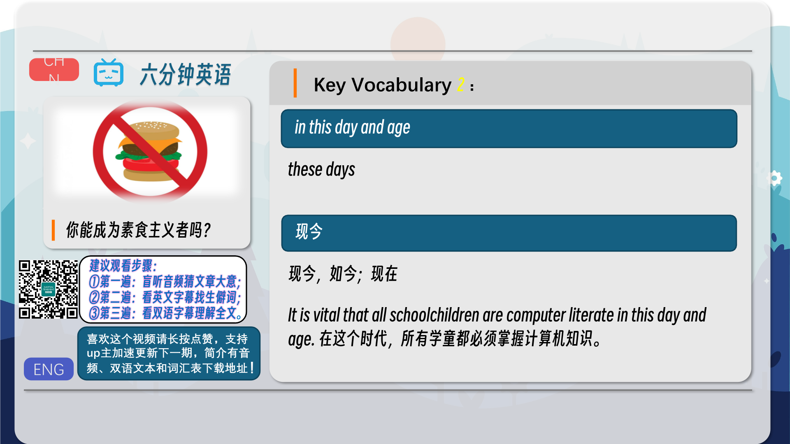
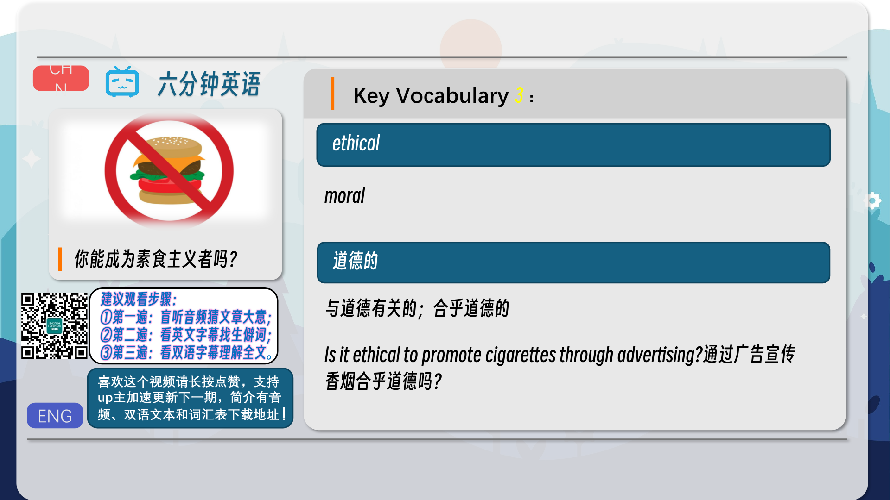
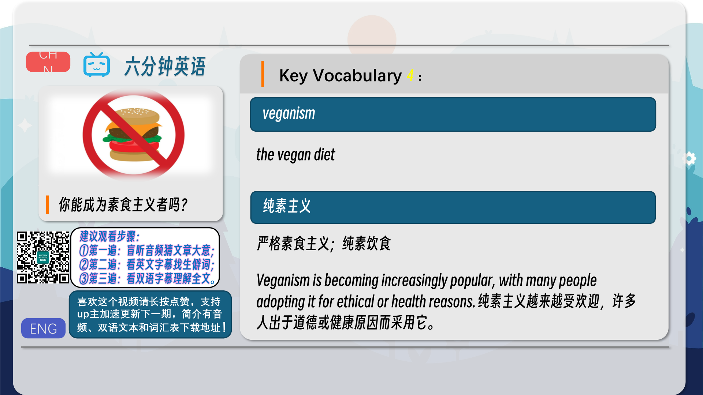
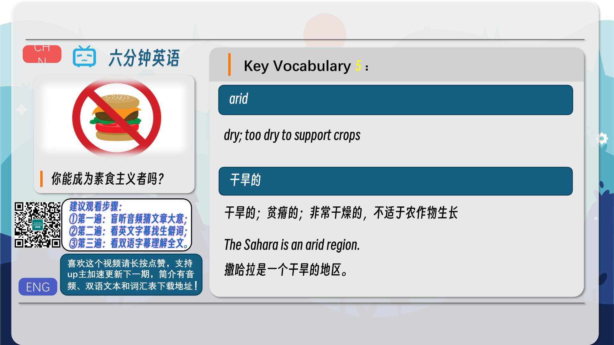
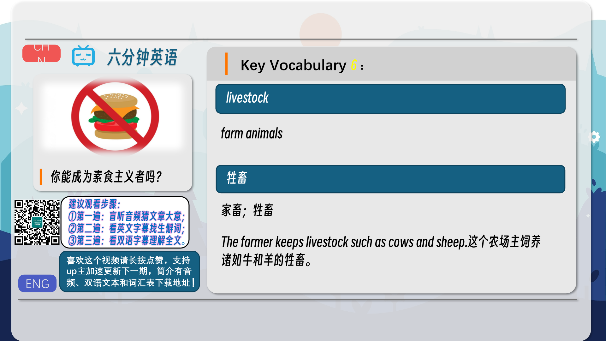
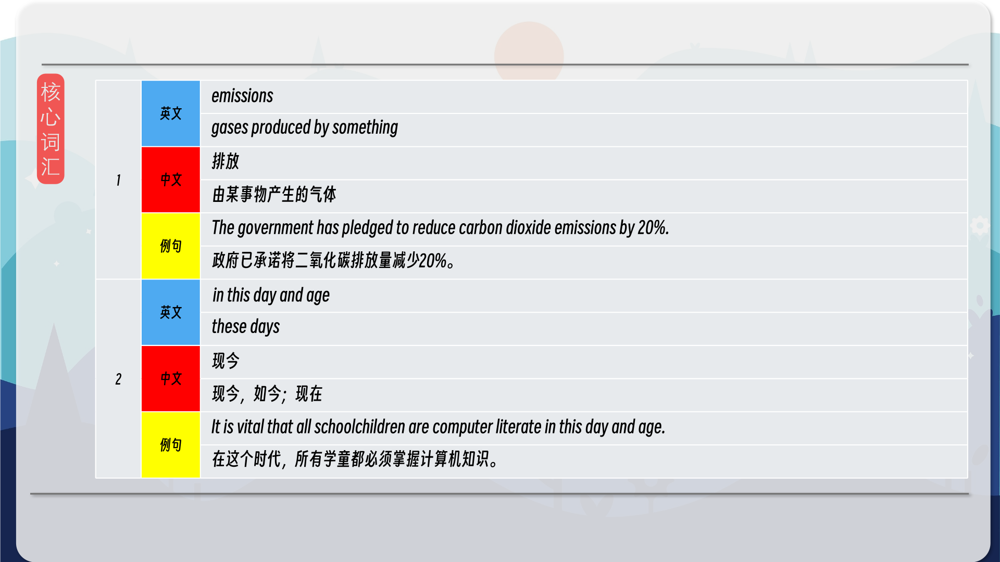
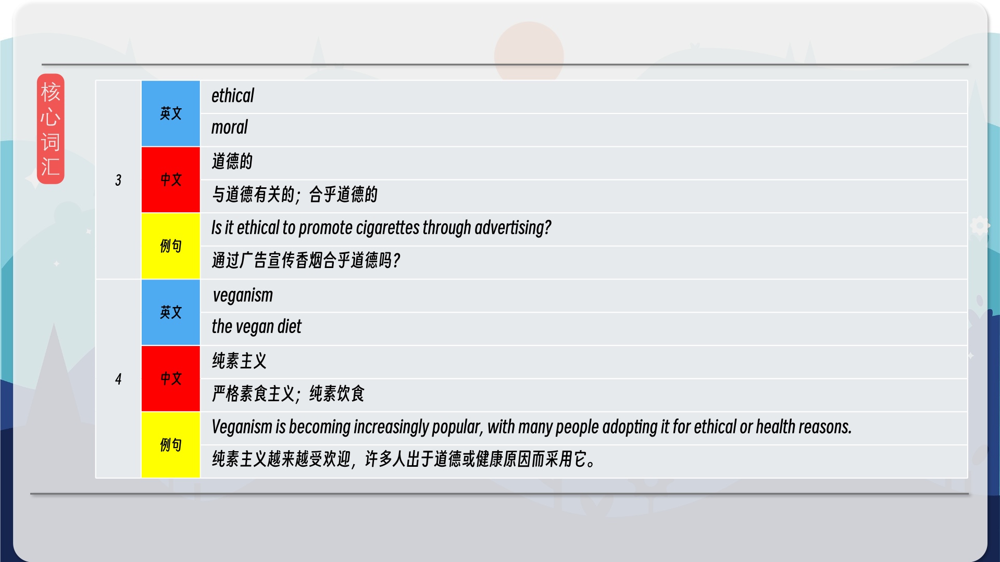
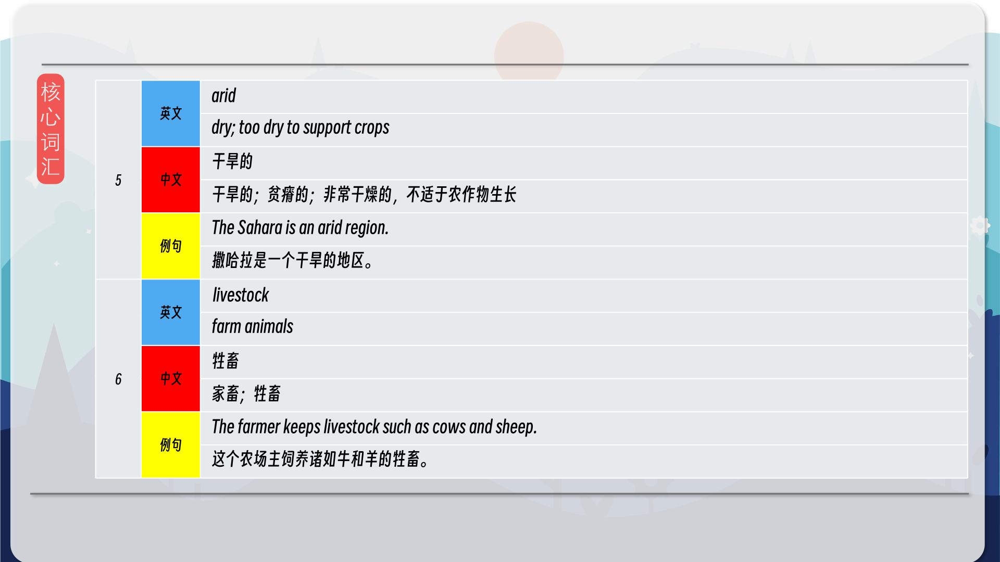
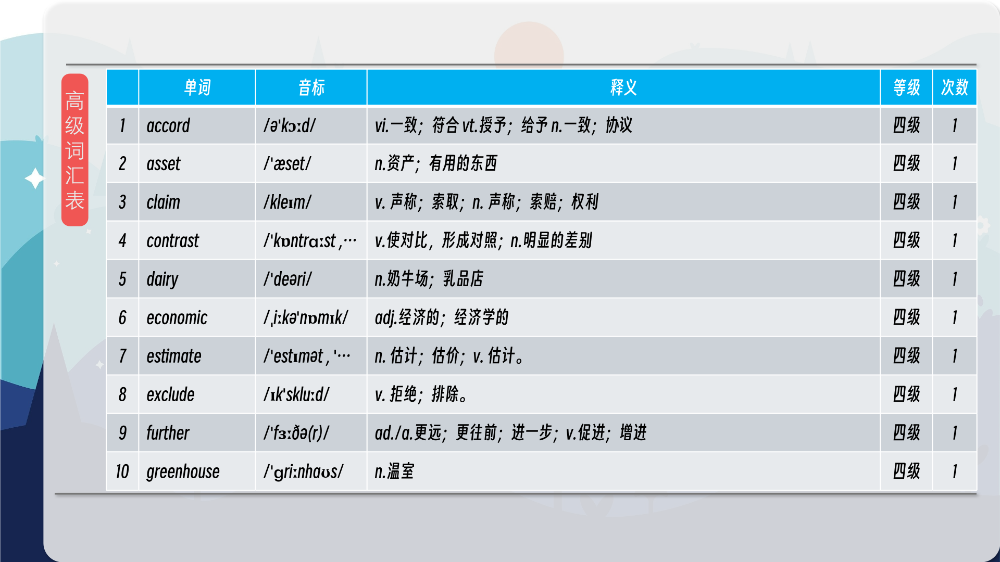
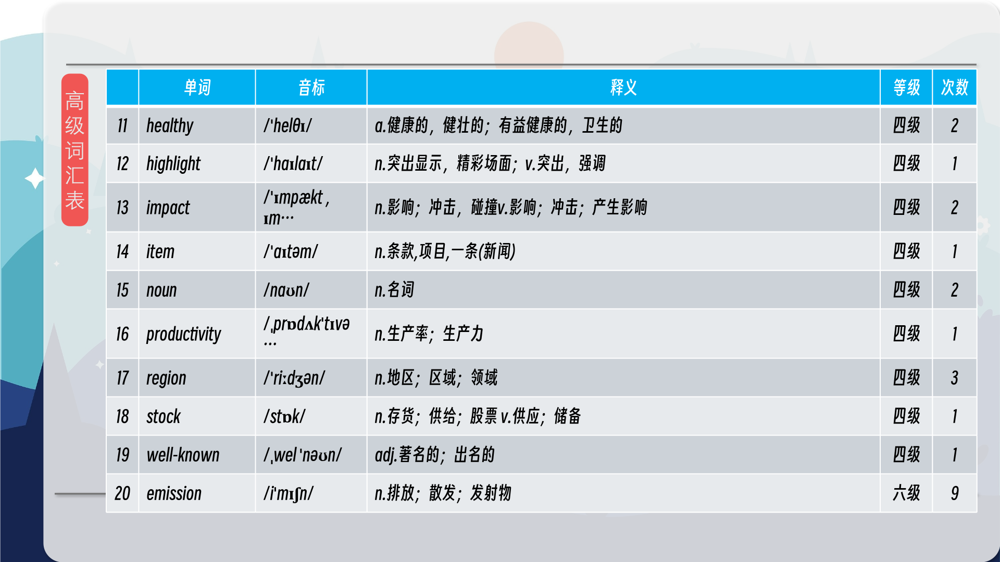
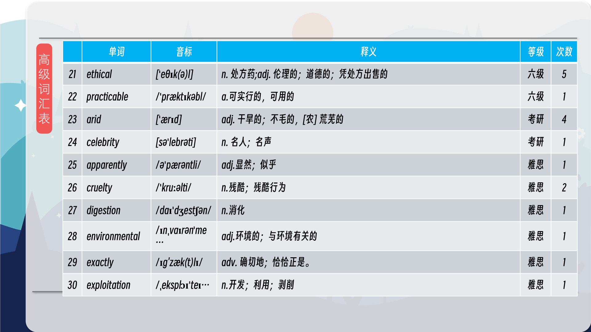
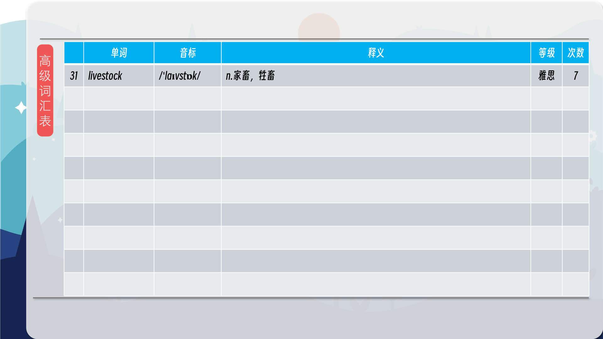

### 【核心词汇】
#### emissions
gases produced by something
排放
由某事物产生的气体
The government has pledged to reduce carbon dioxide emissions by 20%.
政府已承诺将二氧化碳排放量减少20%。
#### in this day and age
these days
现今
现今，如今；现在
It is vital that all schoolchildren are computer literate in this day and age.
在这个时代，所有学童都必须掌握计算机知识。
#### ethical
moral
道德的
与道德有关的；合乎道德的
Is it ethical to promote cigarettes through advertising?
通过广告宣传香烟合乎道德吗？
#### veganism
the vegan diet
纯素主义
严格素食主义；纯素饮食
Veganism is becoming increasingly popular, with many people adopting it for ethical or health reasons.
纯素主义越来越受欢迎，许多人出于道德或健康原因而采用它。
#### arid
dry; too dry to support crops
干旱的
干旱的；贫瘠的；非常干燥的，不适于农作物生长
The Sahara is an arid region.
撒哈拉是一个干旱的地区。
#### livestock
farm animals
牲畜
家畜；牲畜
The farmer keeps livestock such as cows and sheep.
这个农场主饲养诸如牛和羊的牲畜。

在公众号里输入6位数字，获取【对话音频、英文文本、中文翻译、核心词汇和高级词汇表】电子档，6位数字【暗号】在文章的最后一张图片，如【220728】，表示22年7月28日这一期。公众号没有的文章说明还没有制作相关资料。年度合集在B站【六分钟英语】工房获取，每年共计300+文档，感谢支持！