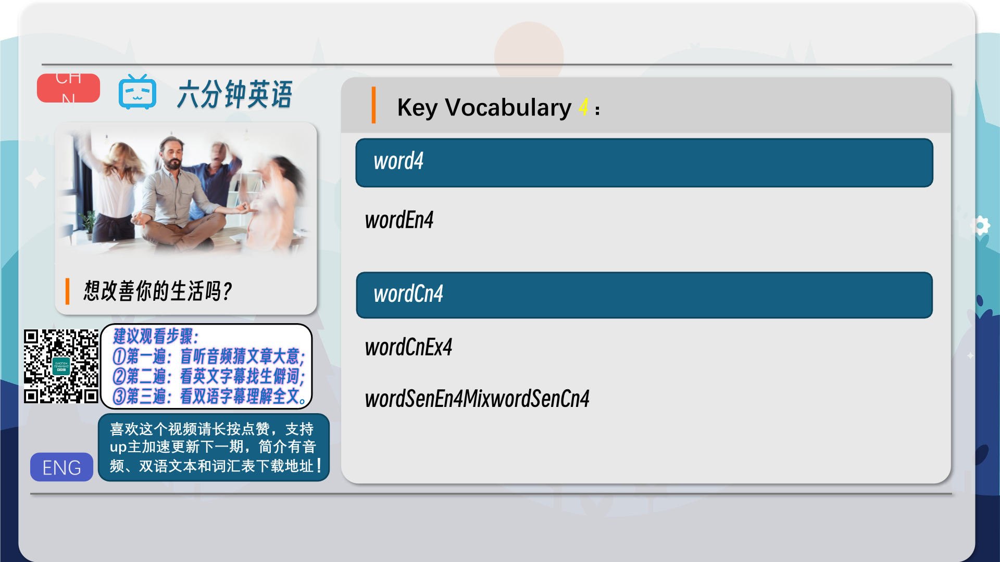
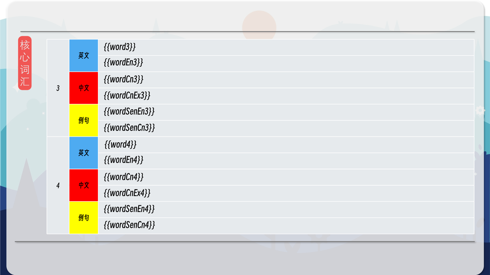
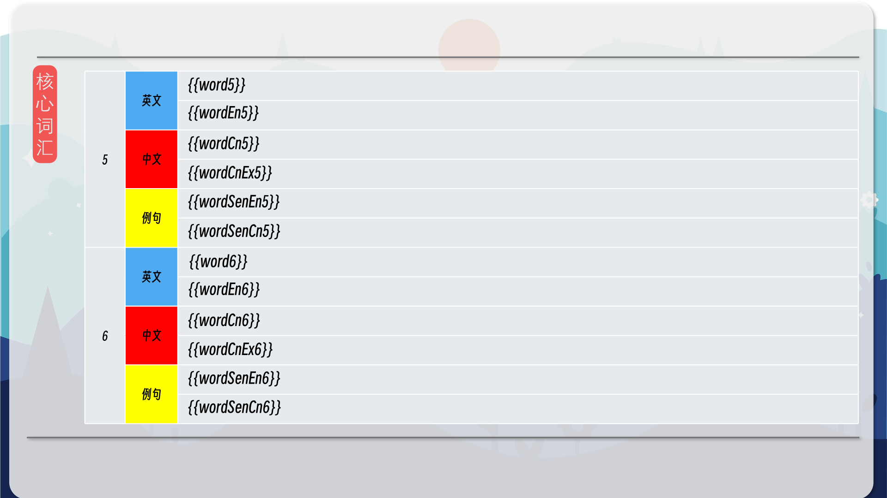
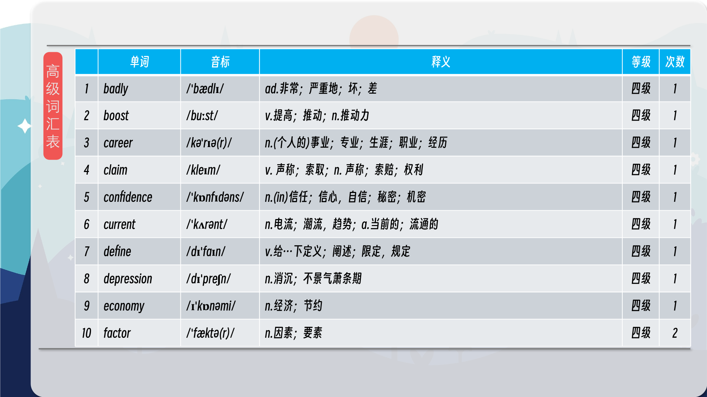
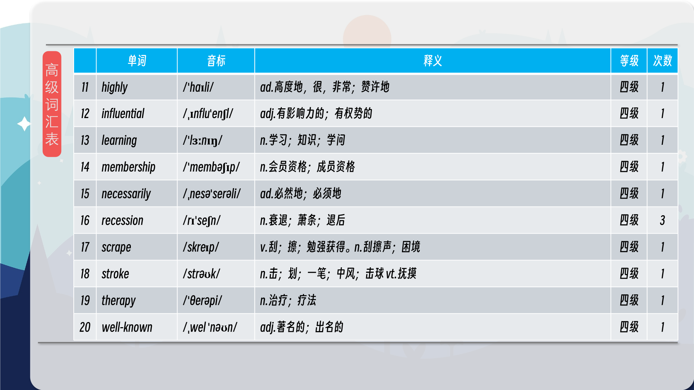
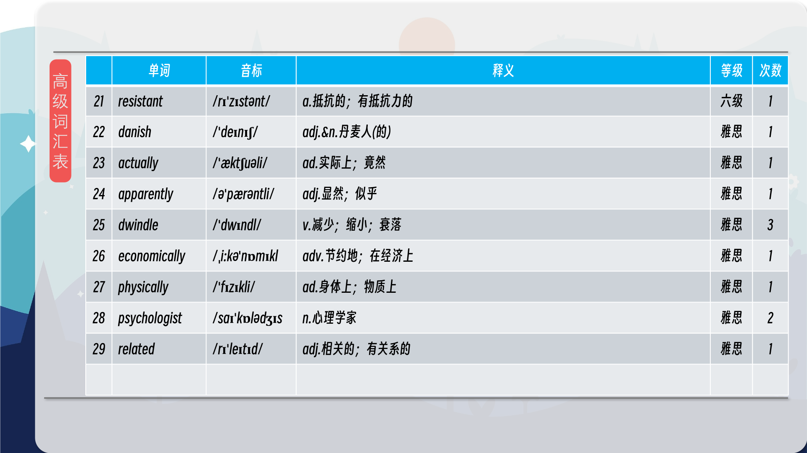

### 【英文脚本】
Neil
Welcome to 6 Minute English. I'm Neil, and today we're going to improve ourselves.
 
Rob
Haha, how could we possibly get any better? I'm Rob, and yes, today's topic is self-help – and the self-help industry.
 
Neil
What do we mean by self-help? Well, it means trying to improve yourself – psychologically, economically or in other ways – without seeking official help.
 
Rob
For example, bookshops these days are full of titles which claim to boost your self- confidence, your wealth, your love life… or your career!
 
Neil
Yes, in just seven days! There's a clear demand for this kind of thing – the self-help industry is worth $10bn in the US alone.
 
Rob
That's a lot. That includes things like gym memberships, diet plans and life coaching apps.
 
Neil
We'll be looking at why. But first, the self-help industry has been around for a long time. Which of these well-known books was published first? a) How to Win Friends and Influence People b) Think and Grow Rich c) The Law of Attraction
 
Rob
Mmm. I could do with some help here. I'll go with the first one – How to Win Friends and Influence People.
 
Neil
OK, well before we go further, let's take a trip inside a bookshop in Manchester to find out which self-help books are selling well.
 
Rob
Let's listen to Emma Marshall, a manager at Waterstones bookshop. What's popular now?
 
Emma Marshall, Assistant Manager, Waterstones
At the moment we're in the tidying up, getting rid of things trend. But before that we saw colouring in, which became a huge thing. It's kind of dwindling now, because these sorts of trends come in and then they go. Like last year we saw 'hygge', which is the Danish art of living well, apparently. So we're taking from all sorts of cultures. And so I think the trend right now is about slowing down in your life.
 
Neil
Emma says there are a couple of trends right now. A trend, here, means something new which is popular for a period of time.
 
Rob
Yes, so she mentioned tidying up and getting rid of things. Would you buy a book about tidying up, Neil?
 
Neil
I'd be more likely to buy a book about it than actually tidy up! She also mentioned a current trend about slowing down in our lives.
 
Rob
I can agree with that! And previous trends included colouring-in – these books have black and white outline pictures that you fill in with colours.
 
Neil
I used to do that as a child. Very therapeutic!
 
Rob
Therapeutic – making you feel more relaxed and less anxious – it's related to the word therapy…
 
Neil
Although the colouring-in trend is dwindling - it's becoming weaker. They're selling fewer colouring-in books.
 
Rob
So – trends come and go, but the industry is going from strength to strength.
 
Neil
To go from strength to strength means to remain strong, or get even stronger! Why?
 
Rob
Dr Jennifer Wild, a psychologist from Oxford University, believes that the internet is a big factor.
 
Neil
We've got used to searching for solutions online, and now these solutions even include how to fix or improve our lives.
 
Rob
And psychologist Caroline Beaton, writing on Forbes.com, said she believes that millennials are a big factor.
 
Neil
How do we define the term 'millennial'? Also known as Generation Y – are people born between the mid-1980s and early 2000s. It's a common term in the news – often because people born in this time in the West are seen to have certain characteristics.
 
Rob
They're sometimes described as lazy and obsessed with themselves – and while that's not necessarily true, Caroline Beaton says millennials are highly self-critical.
 
Neil
Self-critical – they are aware of their own faults – which also means they're more likely to spend time on money on self-help. She says they spend twice as much as Generation Xers. Generation X refers to people born between the late 60s and around 1980.
 
Rob
And one more possible reason why the self-help industry does well: it's very resistant to recessions. When the economy does badly – as we say it goes into recession – people are perhaps even more likely to reach for self-help to improve their situation.
 
Neil
So there we are. Now, let's go back to another recession – the Great Depression of the 1930s in America – and to my question about which self-help book was published first?
 
Rob
Well – I said a) How to Win Friends and Influence People.
 
Neil
In fact – two of these books were published in the late 1930s, How to Win Friends and Influence People, by Dale Carnegie, was first in 1936. It has since sold over 30 million copies. Think and grow rich, by Napoleon Hill, was published in 1937, and is believed to have sold over 100 million copies!
 
Rob
That's a lot of self-help. Wow – have you read either of them?
 
Neil
I haven't read either of them but, perhaps, I should
 
Rob
Well, before we rush home and improve ourselves, let's improve our vocabularies.
 
Neil
Of course – today we had: self-help - the activity of improving yourself – physically, mentally or in other ways – often through courses and books.
 
Rob
There are lots of trends in the self-help industry. And we also see trends in fashion, in music, in popular culture… Like the trend for men to grow beards.
 
Neil
Are you talking about me? Anyway, I think the beard trend is dwindling. It's getting smaller, less influential.
 
Rob
Really? I stroke my beard here. I think it's very therapeutic. It makes me relax and feel good.
 
Neil
Maybe you're right. What about our next phrase – to go from strength to strength?
 
Rob
You could say a business is going from strength to strength if it's earning a lot of money.
 
Neil
Indeed. And what about our term for young people – millennial. Are you a millennial, Rob?
 
Rob
Didn't quite scraped in there. I'm still a Generation X. But I do like to think I'm in touch with what millennials do. Which includes – having lots of different social media accounts.
 
Neil
Just like us – do look up BBC Learning English on Facebook, Twitter, Instagram and YouTube.
 
Rob
And good luck with your self-improvement!
 
Both
Bye!
 

### 【中英文双语脚本】
Neil(尼尔)
Welcome to 6 Minute English. I'm Neil, and today we're going to improve ourselves.
欢迎来到 6 Minute English。我是 Neil，今天我们要提高自己。

Rob(罗伯)
Haha, how could we possibly get any better? I'm Rob, and yes, today's topic is self-help – and the self-help industry.
哈哈，我们怎么可能变得更好呢？我是 罗伯，是的，今天的主题是自助 - 以及自助行业。

Neil(尼尔)
What do we mean by self-help? Well, it means trying to improve yourself – psychologically, economically or in other ways – without seeking official help.
我们所说的自助是什么意思？嗯，这意味着尝试在心理上、经济上或其他方面提高自己，而不寻求官方帮助。

Rob(罗伯)
For example, bookshops these days are full of titles which claim to boost your self- confidence, your wealth, your love life… or your career!
例如，如今的书店里到处都是声称可以提高你的自信、财富、爱情生活的书......或者你的职业生涯！

Neil(尼尔)
Yes, in just seven days! There's a clear demand for this kind of thing – the self-help industry is worth $10bn in the US alone.
是的，仅用了 7 天！对这种东西的需求是明显的 —— 仅在美国，自助行业就价值 100 亿美元。

Rob(罗伯)
That's a lot. That includes things like gym memberships, diet plans and life coaching apps.
这很多。这包括健身房会员资格、饮食计划和生活教练应用程序等。

Neil(尼尔)
We'll be looking at why. But first, the self-help industry has been around for a long time. Which of these well-known books was published first? a) How to Win Friends and Influence People b) Think and Grow Rich c) The Law of Attraction
我们将看看原因。但首先，自助行业已经存在了很长时间。这些知名书籍中哪一本是先出版的？a） 如何赢得朋友和影响他人 b） 思考并致富 c） 吸引力法则

Rob(罗伯)
Mmm. I could do with some help here. I'll go with the first one – How to Win Friends and Influence People.
嗯，我可以在这里帮忙。我将选择第一个 – 如何赢得朋友和影响他人。

Neil(尼尔)
OK, well before we go further, let's take a trip inside a bookshop in Manchester to find out which self-help books are selling well.
好的，在我们进一步讨论之前，让我们走进曼彻斯特的一家书店，看看哪些自助书籍卖得好。

Rob(罗伯)
Let's listen to Emma Marshall, a manager at Waterstones bookshop. What's popular now?
让我们听听 Waterstones 书店的经理 Emma Marshall 的话。现在流行什么？

Emma Marshall, Assistant Manager, Waterstones(EmmaMarshall，Waterstones助理经理)
At the moment we're in the tidying up, getting rid of things trend. But before that we saw colouring in, which became a huge thing. It's kind of dwindling now, because these sorts of trends come in and then they go. Like last year we saw 'hygge', which is the Danish art of living well, apparently. So we're taking from all sorts of cultures. And so I think the trend right now is about slowing down in your life.
目前，我们正处于整理、摆脱事物的趋势中。但在那之前，我们看到了着色，这成为一件大事。现在它有点减少，因为这些趋势来了又走了。和去年一样，我们看到了“hygge”，这显然是丹麦人追求美好生活的艺术。所以我们从各种文化中汲取灵感。所以我认为现在的趋势是放慢你的生活。

Neil(尼尔)
Emma says there are a couple of trends right now. A trend, here, means something new which is popular for a period of time.
Emma 说，现在有几个趋势。这里的趋势是指在一段时间内流行的新事物。

Rob(罗伯)
Yes, so she mentioned tidying up and getting rid of things. Would you buy a book about tidying up, Neil?
是的，所以她提到了整理和扔掉东西。你会买一本关于整理的书吗，尼尔？

Neil(尼尔)
I'd be more likely to buy a book about it than actually tidy up! She also mentioned a current trend about slowing down in our lives.
我更有可能买一本关于它的书，而不是真正整理！她还提到了我们生活中放慢脚步的当前趋势。

Rob(罗伯)
I can agree with that! And previous trends included colouring-in – these books have black and white outline pictures that you fill in with colours.
我同意这一点！以前的趋势包括填色 —— 这些书有黑白轮廓图片，你可以用颜色填充。

Neil(尼尔)
I used to do that as a child. Very therapeutic!
我小时候曾经这样做过。非常有治疗作用！

Rob(罗伯)
Therapeutic – making you feel more relaxed and less anxious – it's related to the word therapy…
治疗性 – 让您感觉更放松，不那么焦虑 – 它与 therapy 这个词有关......

Neil(尼尔)
Although the colouring-in trend is dwindling - it's becoming weaker. They're selling fewer colouring-in books.
尽管着色趋势正在减少 - 但它变得越来越弱。他们卖的填色书越来越少。

Rob(罗伯)
So – trends come and go, but the industry is going from strength to strength.
所以 - 趋势来来去去，但这个行业正在不断发展壮大。

Neil(尼尔)
To go from strength to strength means to remain strong, or get even stronger! Why?
To go more to strong 的意思是保持强大，或者变得更强大！为什么？

Rob(罗伯)
Dr Jennifer Wild, a psychologist from Oxford University, believes that the internet is a big factor.
牛津大学的心理学家詹妮弗·怀尔德博士认为，互联网是一个重要因素。

Neil(尼尔)
We've got used to searching for solutions online, and now these solutions even include how to fix or improve our lives.
我们已经习惯于在网上寻找解决方案，现在这些解决方案甚至包括如何修复或改善我们的生活。

Rob(罗伯)
And psychologist Caroline Beaton, writing on Forbes.com, said she believes that millennials are a big factor.
心理学家卡罗琳·比顿 （Caroline Beaton） 在 Forbes.com 上撰文表示，她认为千禧一代是一个重要因素。

Neil(尼尔)
How do we define the term 'millennial'? Also known as Generation Y – are people born between the mid-1980s and early 2000s. It's a common term in the news – often because people born in this time in the West are seen to have certain characteristics.
我们如何定义“千禧一代”一词？也称为 Y 世代 – 出生于 1980 年代中期至 2000 年代初的人。这是新闻中的一个常见术语 —— 通常是因为出生在西方这个时期的人被认为具有某些特征。

Rob(罗伯)
They're sometimes described as lazy and obsessed with themselves – and while that's not necessarily true, Caroline Beaton says millennials are highly self-critical.
他们有时被描述为懒惰和沉迷于自己 —— 虽然这不一定是真的，但 Caroline Beaton 表示，千禧一代非常自我批评。

Neil(尼尔)
Self-critical – they are aware of their own faults – which also means they're more likely to spend time on money on self-help. She says they spend twice as much as Generation Xers. Generation X refers to people born between the late 60s and around 1980.
自我批评 – 他们意识到自己的错误 – 这也意味着他们更有可能将时间花在金钱上进行自助。她说，他们的支出是 X 一代的两倍。X 世代是指 60 年代末至 1980 年左右出生的人。

Rob(罗伯)
And one more possible reason why the self-help industry does well: it's very resistant to recessions. When the economy does badly – as we say it goes into recession – people are perhaps even more likely to reach for self-help to improve their situation.
自助行业表现良好的另一个可能原因是：它对经济衰退的抵抗力很强。当经济表现不佳时 —— 正如我们所说的，它陷入衰退 —— 人们可能更有可能寻求自助来改善他们的处境。

Neil(尼尔)
So there we are. Now, let's go back to another recession – the Great Depression of the 1930s in America – and to my question about which self-help book was published first?
所以我们就是这样。现在，让我们回到另一场经济衰退 —— 1930 年代的美国大萧条 —— 以及我关于哪本自助书先出版的问题？

Rob(罗伯)
Well – I said a) How to Win Friends and Influence People.
嗯 - 我说的是 a） 如何赢得朋友和影响人们。

Neil(尼尔)
In fact – two of these books were published in the late 1930s, How to Win Friends and Influence People, by Dale Carnegie, was first in 1936. It has since sold over 30 million copies. Think and grow rich, by Napoleon Hill, was published in 1937, and is believed to have sold over 100 million copies!
事实上 —— 其中两本书是在 1930 年代后期出版的，戴尔·卡内基 （Dale Carnegie） 的《如何赢得朋友和影响他人》于 1936 年首次出版。此后，它已售出超过 3000 万份。拿破仑·希尔 （Napoleon Hill） 的《思考与致富》于 1937 年出版，据信已售出超过 1 亿册！

Rob(罗伯)
That's a lot of self-help. Wow – have you read either of them?
这是很多自助。哇 - 你读过它们中的任何一个吗？

Neil(尼尔)
I haven't read either of them but, perhaps, I should
我没有读过它们中的任何一个，但也许我应该读

Rob(罗伯)
Well, before we rush home and improve ourselves, let's improve our vocabularies.
好吧，在我们匆忙回家提高自己之前，让我们提高我们的词汇量。

Neil(尼尔)
Of course – today we had: self-help - the activity of improving yourself – physically, mentally or in other ways – often through courses and books.
当然 - 今天我们有： 自助 - 提高自己的活动 - 身体、精神或其他方式 - 通常通过课程和书籍。

Rob(罗伯)
There are lots of trends in the self-help industry. And we also see trends in fashion, in music, in popular culture… Like the trend for men to grow beards.
自助行业有很多趋势。我们还看到了时尚、音乐、流行文化的趋势......就像男人留胡子的趋势一样。

Neil(尼尔)
Are you talking about me? Anyway, I think the beard trend is dwindling. It's getting smaller, less influential.
你说的是我吗？无论如何，我认为胡须趋势正在减少。它变得越来越小，影响力越来越小。

Rob(罗伯)
Really? I stroke my beard here. I think it's very therapeutic. It makes me relax and feel good.
真？我抚摸着这里的胡须。我认为这非常有治疗作用。它让我放松，感觉很好。

Neil(尼尔)
Maybe you're right. What about our next phrase – to go from strength to strength?
也许你是对的。我们的下一句话 – 不断壮大呢？

Rob(罗伯)
You could say a business is going from strength to strength if it's earning a lot of money.
如果一家企业赚了很多钱，你可以说它正在不断发展壮大。

Neil(尼尔)
Indeed. And what about our term for young people – millennial. Are you a millennial, Rob?
事实上。那么我们对年轻人的称呼 —— 千禧一代呢？罗伯，你是千禧一代吗？

Rob(罗伯)
Didn't quite scraped in there. I'm still a Generation X. But I do like to think I'm in touch with what millennials do. Which includes – having lots of different social media accounts.
没有完全在那里刮擦。我仍然是 X 世代。但我确实喜欢认为我与千禧一代的工作有联系。这包括 - 拥有许多不同的社交媒体帐户。

Neil(尼尔)
Just like us – do look up BBC Learning English on Facebook, Twitter, Instagram and YouTube.
就像我们一样 - 请在 Facebook、Twitter、Instagram 和 YouTube 上查找 BBC Learning English。

Rob(罗伯)
And good luck with your self-improvement!
祝你自我提升好运！

Both(双)
Bye!
再见！

### 【核心词汇】
#### self-help
trying to improve yourself without the help of professionals
自助
试图在没有专业人士帮助的情况下提升自己
寻求自我改进（尤指不借助专业帮助）的行为
She enrolled in a self-help course to try to cope with her depression.
#### 她报名参加了一个自助课程，试图应对她的抑郁症。
trend
something new which is popular for a period
趋势
在一段时间内流行的新事物
（时尚、潮流）一时的流行
#### The trend is towards smaller families.
趋势是家庭规模越来越小。
to dwindle
to become fewer or weaker
减少
变少或变弱
#### Her savings dwindled to almost nothing.
她的存款减少到几乎一文不名。
therapeutic
relaxing; making you feel less anxious
治疗性的
令人放松的；让你感觉不那么焦虑的
#### The therapeutic benefits of gardening are well known.
园艺的治疗益处是众所周知的。
to go from strength to strength
to become more successful over time
蒸蒸日上
随着时间的推移变得更加成功
#### The business has gone from strength to strength since he took over.
自从他接管以来，这项业务一直在蒸蒸日上。
millennial
someone born between the mid-1980s and early 2000s
千禧一代
出生于 20 世纪 80 年代中期至 21 世纪初的人
#### Millennials have grown up in a digital world.
千禧一代在数字世界中长大。

在公众号里输入6位数字，获取【对话音频、英文文本、中文翻译、核心词汇和高级词汇表】电子档，6位数字【暗号】在文章的最后一张图片，如【220728】，表示22年7月28日这一期。公众号没有的文章说明还没有制作相关资料。年度合集在B站【六分钟英语】工房获取，每年共计300+文档，感谢支持！