### 【英文脚本】
Neil
Welcome to 6 Minute English, the programme where we bring you an interesting topic and six useful words or phrases. I’m Neil.
 
Dan
And I’m Dan. Today we’re talking about one of the last mysteries of science. No, not if the universe will keep expanding forever, but this: how do cats and dogs find their way home over long distances?
 
Neil
We hear incredible stories of lost pets travelling tens and even hundreds of miles home – but scientists struggle to explain how they do it.
 
Dan
We’ll hear the view of one scientist today. But before that – I have to ask an important question: Neil, are you a cat person or a dog person?
 
Neil
Oh, that's easy – I'm a cat person, for sure. Dogs are just a… well, they are hard work, aren't they?
 
Dan
If you say you are ‘a cat person’ it means you prefer cats. ‘A coffee person’ prefers coffee. A ‘something’ person likes or prefers that thing, often over another thing.
 
Neil
Back to the topic, I’m a cat person. But can you answer this, Dan? Recently, a cat called Omar made headlines for being, possibly, the world’s longest cat. How long is Omar? Is it… a) 120 cm b) 80 cm Or c) 180 cm
 
Dan
I'm gonna say c) 180 cm.
 
Neil
Now, from long cats to long-distance cats. Scientists were scratching their heads a couple of years ago when a lost cat called Holly travelled 200 miles to get home. How did it do it?
 
Dan
We say you ‘scratch your head’ when you are confused about something. There are a few theories about how cats and dogs navigate – but we don’t yet have the full answer.
 
Neil
Well, both cats and dogs have an extremely powerful sense of smell, of course. Smells are like signposts – they let you know where you are. Visual landmarks also play a role, just as they do with humans. A landmark is something very easily recognised – a big building or mountain for example.
 
Dan
And what about this one: magnets are pieces of metal which attract certain other kinds of metal - for example, iron or steel. The Earth itself has a magnetic force.
 
Neil
Birds use it to help them navigate over thousands of miles – it tells them where north is. It’s thought they have some iron in their beaks.
 
Dan
But some scientists think mammals also have this capability.
 
Neil
So we have a few ideas – smell, landmarks, magnetic forces – but can we explain how one kitty travelled over 200 miles by itself back to its home?
 
Dan
Let’s hear from cat and dog expert Dr John Bradshaw. How do cats build up the maps in their heads?
 
Dr John Bradshaw, School of Veterinary Sciences, University of Bristol
What they do when they are in a new territory is explore it in a very systematic way. So they will go out in ever-increasing circles, they'll literally construct a mental map in their heads. And so a cat that’s lost its territory probably does the same thing. They’ll rely on the idea that if they go out in ever-increasing circles or rectangles then eventually they'll either come across the territory or they’ll come across a smell carried on the wind of the territory that they used to live in and then be able to go home.
 
Dan
Cats have a systematic approach – which means they use a system. Which is: first they walk around their area in a small circle, then a bigger one and then a bigger one – until they have a strong mental map of the place.
 
Neil
Yes – a mental map is a map in your head – stored in your memory. And the area cats explore – their home area - is called their territory. Cats are territorial – which means their territory is very important to them.
 
Dan
Having a map is great, but what happens when a cat gets lost? Dr Bradshaw says that again, it moves around in bigger and bigger circles, until it finds a clue – which is a landmark or a smell – that tells it where it is. Well, that’s the theory. Though Dr Bradshaw says we really still don’t have enough data – that's enough information about this.
 
Neil
When there is a scientific breakthrough - we’ll bring it to you in 6 Minute English, I hope. For now, let’s content ourselves with Omar, possibly, the world’s longest cat. How long, Dan?
 
Dan
I said 180 cm.
 
Neil
Omar measures 120 cm – that’s over two thirds of my height – and weighs a heavy 14 kg.
 
Dan
Well, one thing, Neil, if Omar ever got lost, he’d be found in no time.
 
Neil
He’s a landmark in himself! Which reminds me – let’s run through today’s words again. If you’re a cat person, you prefer cats. If you’re an evening person – you prefer evenings.
 
Dan
I’ve always thought you were a kind person, Neil.
 
Neil
Nice of you to say, but we only use the phrase with nouns, not adjectives!
 
Dan
Indeed. We don’t want the listeners to be scratching their heads.
 
Neil
No, we can’t confuse them! So let’s explain the next one clearly – a landmark is something easily recognisable that lets you know where you are. The bridges in London are landmarks.
 
Dan
And can we say the parks are magnets in summer? A magnet is a piece of metal that attracts iron and steel – but we can also use the word more widely to describe things that attract other things. Two more words: territory is a noun – the area of land that an animal considers to be its own.
 
Neil
Animals who feel this strongly are described as territorial. Humans can be too – about land or subjects they feel they own or control.
 
Dan
And finally systematic: the adjective from system. We can talk about a systematic approach, a systematic solution, a systematic study…
 
Neil
And we have systematically worked our way through all of today’s words!
 
Dan
Very good! Which means – it’s time mention our own online territory – our website and social media pages.
 
Neil
Check us out on Facebook, Twitter, Instagram and YouTube, and of course bbclearningenglish.com!
 
Dan
Bye bye for now.
 
Neil
Goodbye!
 

### 【中英文双语脚本】
Neil(尼尔)
Welcome to 6 Minute English, the programme where we bring you an interesting topic and six useful words or phrases. I’m Neil.
欢迎来到六分钟英语，我们为您带来一个有趣的话题和六个有用的单词或短语。我是 Neil。

Dan(担)
And I’m Dan. Today we’re talking about one of the last mysteries of science. No, not if the universe will keep expanding forever, but this: how do cats and dogs find their way home over long distances?
我是 Dan。今天我们谈论的是科学的最后一个谜团。不，不是宇宙会永远膨胀，而是：猫和狗是如何长途跋涉找到回家的路的？

Neil(尼尔)
We hear incredible stories of lost pets travelling tens and even hundreds of miles home – but scientists struggle to explain how they do it.
我们听说过走失的宠物长途跋涉数十英里甚至数百英里回家的令人难以置信的故事 —— 但科学家们很难解释他们是如何做到的。

Dan(担)
We’ll hear the view of one scientist today. But before that – I have to ask an important question: Neil, are you a cat person or a dog person?
我们今天将听到一位科学家的观点。但在此之前 —— 我必须问一个重要的问题：Neil，你是爱猫还是爱狗？

Neil(尼尔)
Oh, that's easy – I'm a cat person, for sure. Dogs are just a… well, they are hard work, aren't they?
哦，这很容易 —— 我肯定是一个喜欢猫的人。狗只是一种......嗯，他们很辛苦，不是吗？

Dan(担)
If you say you are ‘a cat person’ it means you prefer cats. ‘A coffee person’ prefers coffee. A ‘something’ person likes or prefers that thing, often over another thing.
如果你说你是 “爱猫的人”，那就意味着你更喜欢猫。“咖啡人”更喜欢咖啡。一个 “某物 ”的人喜欢或更喜欢那件事，通常是而不是另一件事。

Neil(尼尔)
Back to the topic, I’m a cat person. But can you answer this, Dan? Recently, a cat called Omar made headlines for being, possibly, the world’s longest cat. How long is Omar? Is it… a) 120 cm b) 80 cm Or c) 180 cm
回到主题，我是一个爱猫的人。但你能回答这个问题吗，Dan？最近，一只名叫 Omar 的猫成为头条新闻，因为它可能是世界上最长的猫。奥马尔多长时间？是吗。。。a） 120 厘米 b） 80 厘米 或 c） 180 厘米

Dan(担)
I'm gonna say c) 180 cm.
我要说 c） 180 厘米。

Neil(尼尔)
Now, from long cats to long-distance cats. Scientists were scratching their heads a couple of years ago when a lost cat called Holly travelled 200 miles to get home. How did it do it?
现在，从长猫到远距离猫。几年前，一只名叫 Holly 的迷路猫走了 200 英里才回家，科学家们们都在摸不着头脑。它是怎么做到的呢？

Dan(担)
We say you ‘scratch your head’ when you are confused about something. There are a few theories about how cats and dogs navigate – but we don’t yet have the full answer.
我们说，当你对某件事感到困惑时，你会 “挠头”。关于猫和狗如何导航，有一些理论 —— 但我们还没有完整的答案。

Neil(尼尔)
Well, both cats and dogs have an extremely powerful sense of smell, of course. Smells are like signposts – they let you know where you are. Visual landmarks also play a role, just as they do with humans. A landmark is something very easily recognised – a big building or mountain for example.
嗯，当然，猫和狗都有非常强大的嗅觉。气味就像路标 —— 它们让您知道自己在哪里。视觉地标也发挥着作用，就像它们对人类的作用一样。地标是很容易识别的东西 —— 例如一座大建筑或山脉。

Dan(担)
And what about this one: magnets are pieces of metal which attract certain other kinds of metal - for example, iron or steel. The Earth itself has a magnetic force.
那么这个呢：磁铁是吸引某些其他种类金属（例如铁或钢）的金属片。地球本身就有磁力。

Neil(尼尔)
Birds use it to help them navigate over thousands of miles – it tells them where north is. It’s thought they have some iron in their beaks.
鸟类用它来帮助他们导航数千英里 —— 它告诉它们北方在哪里。人们认为它们的喙里有一些铁。

Dan(担)
But some scientists think mammals also have this capability.
但一些科学家认为哺乳动物也具有这种能力。

Neil(尼尔)
So we have a few ideas – smell, landmarks, magnetic forces – but can we explain how one kitty travelled over 200 miles by itself back to its home?
所以我们有一些想法 —— 气味、地标、磁力 —— 但我们能解释一下一只小猫是如何独自旅行 200 多英里回到它的家的吗？

Dan(担)
Let’s hear from cat and dog expert Dr John Bradshaw. How do cats build up the maps in their heads?
让我们听听猫狗专家 John Bradshaw 博士的意见。猫是如何在脑海中构建地图的？

Dr John Bradshaw, School of Veterinary Sciences, University of Bristol(JohnBradshaw博士，布里斯托大学兽医科学学院)
What they do when they are in a new territory is explore it in a very systematic way. So they will go out in ever-increasing circles, they'll literally construct a mental map in their heads. And so a cat that’s lost its territory probably does the same thing. They’ll rely on the idea that if they go out in ever-increasing circles or rectangles then eventually they'll either come across the territory or they’ll come across a smell carried on the wind of the territory that they used to live in and then be able to go home.
当他们进入一个新的领域时，他们所做的就是以非常系统的方式探索它。所以他们会在不断扩大的圈子里出去，他们真的会在脑海中构建一张心理地图。因此，一只失去领地的猫可能会做同样的事情。他们会依赖这样的想法，如果他们以越来越大的圆圈或矩形出去，那么最终他们要么穿过这片领土，要么他们会遇到他们曾经居住的领土上随风飘来的气味，然后能够回家。

Dan(担)
Cats have a systematic approach – which means they use a system. Which is: first they walk around their area in a small circle, then a bigger one and then a bigger one – until they have a strong mental map of the place.
猫有一个系统的方法 —— 这意味着它们使用一个系统。也就是说：首先他们在自己的区域围成一个小圆圈，然后是一个更大的圆圈，然后是一个更大的圆圈 —— 直到他们对这个地方有一个强大的心理地图。

Neil(尼尔)
Yes – a mental map is a map in your head – stored in your memory. And the area cats explore – their home area - is called their territory. Cats are territorial – which means their territory is very important to them.
是的 – 心理地图是您脑海中的地图 – 存储在您的记忆中。猫咪探索的区域 —— 它们的家乡 —— 被称为它们的领地。猫是有领地意识的 —— 这意味着它们的领地对它们来说非常重要。

Dan(担)
Having a map is great, but what happens when a cat gets lost? Dr Bradshaw says that again, it moves around in bigger and bigger circles, until it finds a clue – which is a landmark or a smell – that tells it where it is. Well, that’s the theory. Though Dr Bradshaw says we really still don’t have enough data – that's enough information about this.
拥有地图固然很好，但猫迷路时会发生什么呢？布拉德肖博士说，它再次以越来越大的圆圈移动，直到找到一条线索 —— 一个地标或一种气味 —— 告诉它它在哪里。嗯，这就是理论。尽管 Bradshaw 博士说我们仍然没有足够的数据 —— 但这已经足够了。

Neil(尼尔)
When there is a scientific breakthrough - we’ll bring it to you in 6 Minute English, I hope. For now, let’s content ourselves with Omar, possibly, the world’s longest cat. How long, Dan?
当有科学突破时 - 我希望我们会以六分钟英语的形式为您带来。现在，让我们对 Omar 感到满意，这可能是世界上最长的猫。多长时间，丹？

Dan(担)
I said 180 cm.
我说的是 180 厘米。

Neil(尼尔)
Omar measures 120 cm – that’s over two thirds of my height – and weighs a heavy 14 kg.
Omar 身高 120 厘米，超过我身高的三分之二，体重达 14 公斤。

Dan(担)
Well, one thing, Neil, if Omar ever got lost, he’d be found in no time.
嗯，有一件事，尼尔，如果奥马尔迷路了，他很快就会被找到。

Neil(尼尔)
He’s a landmark in himself! Which reminds me – let’s run through today’s words again. If you’re a cat person, you prefer cats. If you’re an evening person – you prefer evenings.
他本身就是一个里程碑！这让我想起了 —— 让我们再来一遍今天的文字。如果你是一个爱猫的人，你更喜欢猫。如果你喜欢晚上 - 你更喜欢晚上。

Dan(担)
I’ve always thought you were a kind person, Neil.
我一直觉得你是个善良的人，尼尔。

Neil(尼尔)
Nice of you to say, but we only use the phrase with nouns, not adjectives!
你说得不错，但我们只使用带有名词的短语，而不是形容词！

Dan(担)
Indeed. We don’t want the listeners to be scratching their heads.
事实上。我们不希望听众摸不着头脑。

Neil(尼尔)
No, we can’t confuse them! So let’s explain the next one clearly – a landmark is something easily recognisable that lets you know where you are. The bridges in London are landmarks.
不，我们不能混淆他们！因此，让我们清楚地解释下一个 – 地标是易于识别的东西，可以让您知道自己在哪里。伦敦的桥梁是地标。

Dan(担)
And can we say the parks are magnets in summer? A magnet is a piece of metal that attracts iron and steel – but we can also use the word more widely to describe things that attract other things. Two more words: territory is a noun – the area of land that an animal considers to be its own.
我们能说公园在夏天是磁铁吗？磁铁是一块吸引钢铁的金属 —— 但我们也可以更广泛地使用这个词来描述吸引其他事物的事物。再说两个词：territory 是一个名词 —— 动物认为是自己的土地面积。

Neil(尼尔)
Animals who feel this strongly are described as territorial. Humans can be too – about land or subjects they feel they own or control.
强烈感受到这一点的动物被描述为领地动物。人类也可以 —— 关于他们认为自己拥有或控制的土地或主体。

Dan(担)
And finally systematic: the adjective from system. We can talk about a systematic approach, a systematic solution, a systematic study…
最后是系统性的：来自系统的形容词。我们可以谈论一种系统的方法、一个系统的解决方案、一个系统的研究......

Neil(尼尔)
And we have systematically worked our way through all of today’s words!
我们已经系统地完成了今天的所有单词！

Dan(担)
Very good! Which means – it’s time mention our own online territory – our website and social media pages.
非常好！这意味着 - 是时候提及我们自己的在线领域 - 我们的网站和社交媒体页面了。

Neil(尼尔)
Check us out on Facebook, Twitter, Instagram and YouTube, and of course bbclearningenglish.com!
在 Facebook、Twitter、Instagram 和 YouTube 上关注我们，当然还有 bbclearningenglish.com！

Dan(担)
Bye bye for now.
再见。

Neil(尼尔)
Goodbye!
再见！

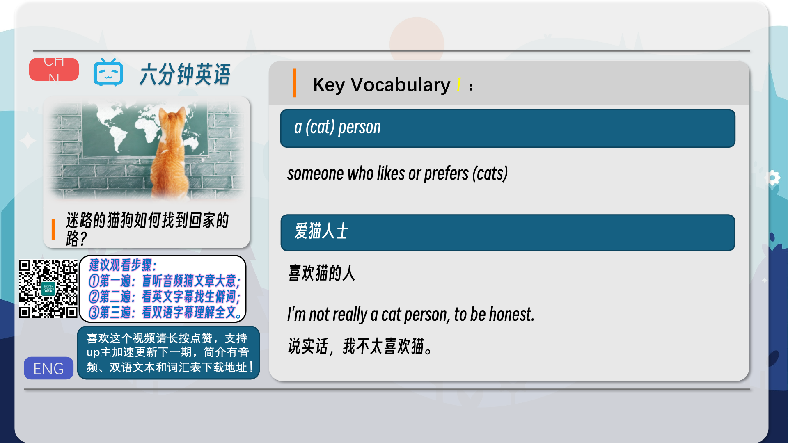
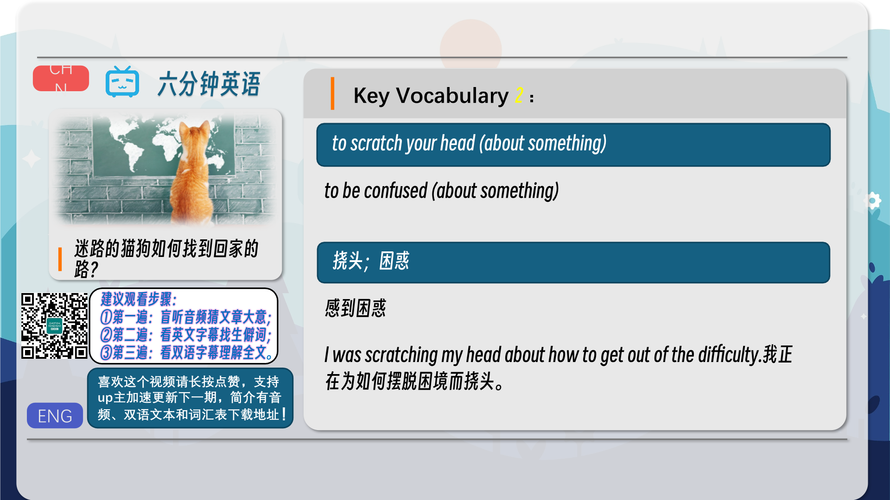
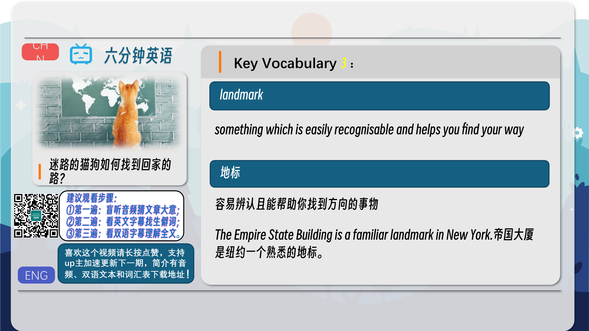
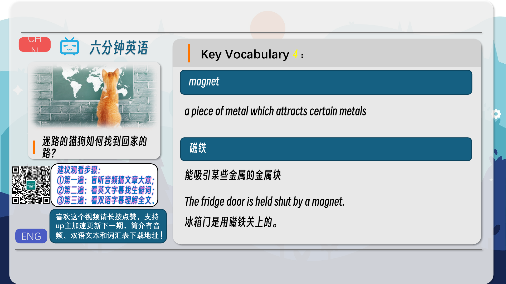
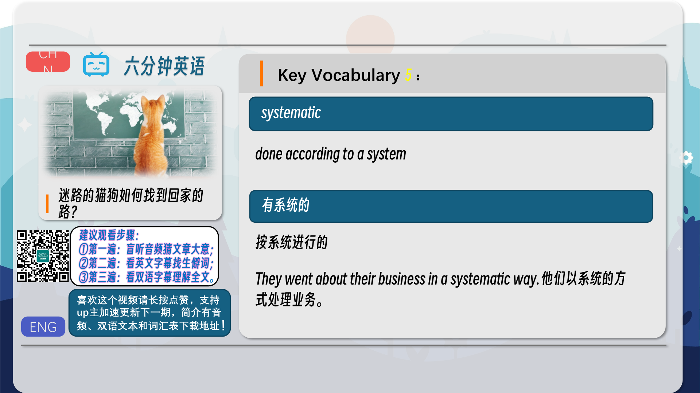
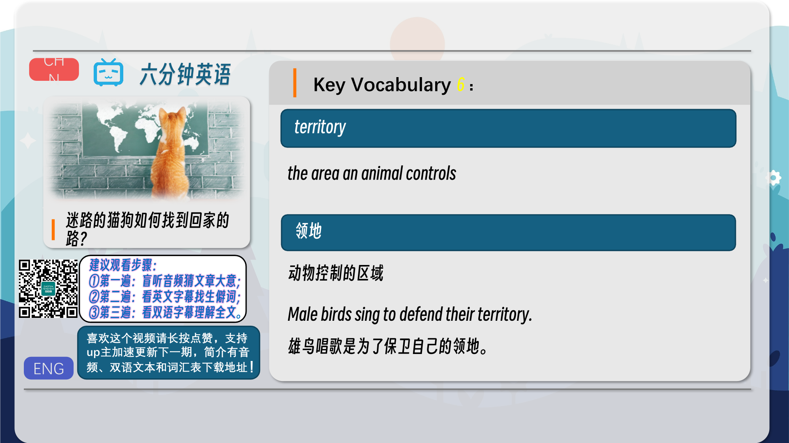
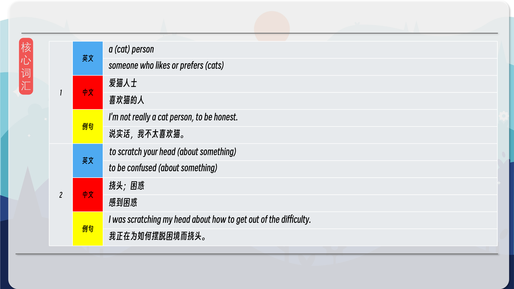
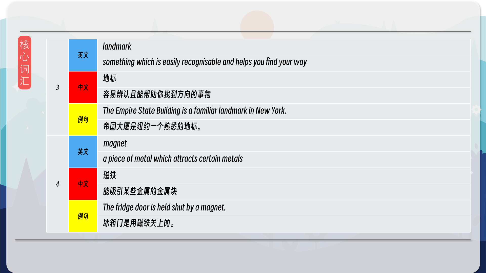
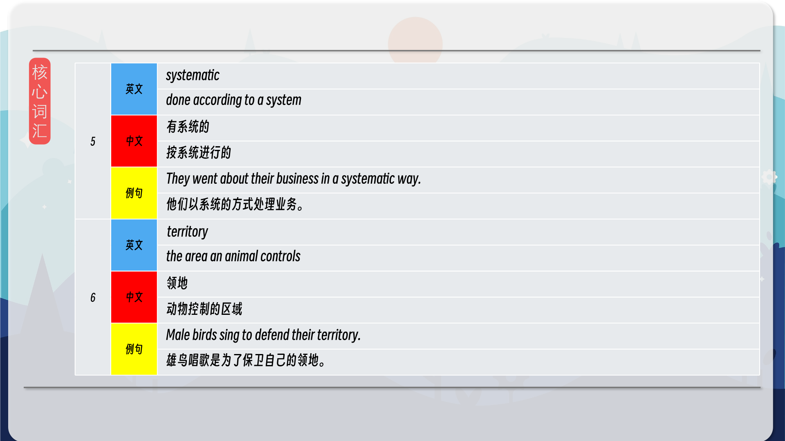

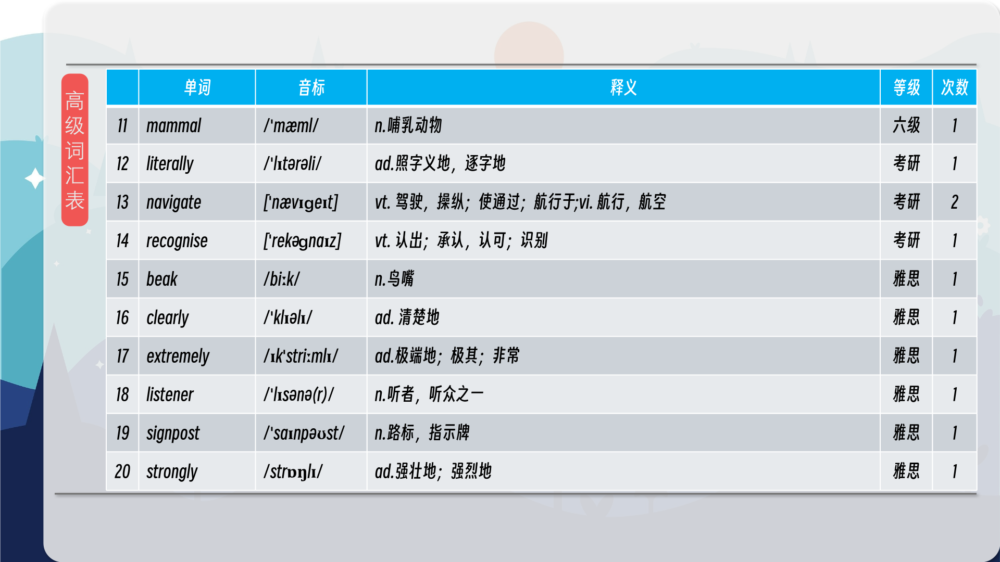
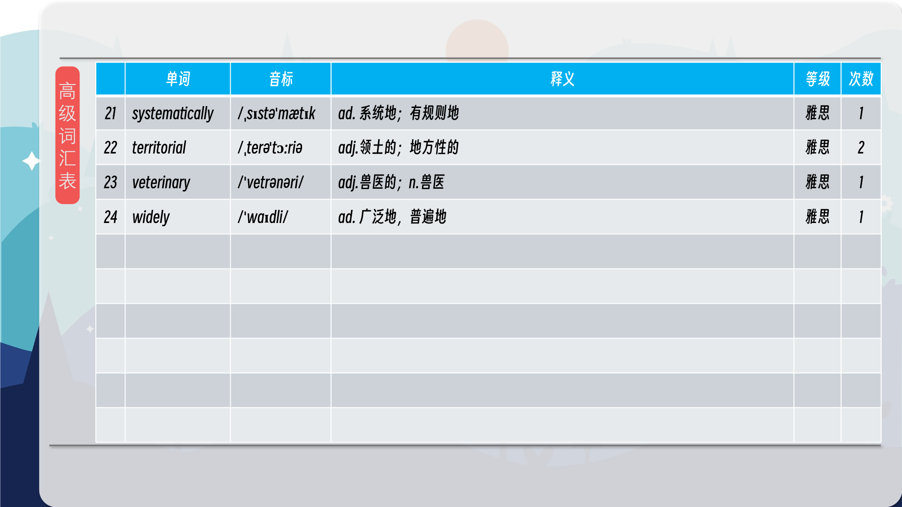

### 【核心词汇】
#### a (cat) person
someone who likes or prefers (cats)
爱猫人士
喜欢猫的人
I'm not really a cat person, to be honest.
说实话，我不太喜欢猫。
#### to scratch your head (about something)
to be confused (about something)
挠头；困惑
感到困惑
I was scratching my head about how to get out of the difficulty.
我正在为如何摆脱困境而挠头。
#### landmark
something which is easily recognisable and helps you find your way
地标
容易辨认且能帮助你找到方向的事物
The Empire State Building is a familiar landmark in New York.
帝国大厦是纽约一个熟悉的地标。
#### magnet
a piece of metal which attracts certain metals
磁铁
能吸引某些金属的金属块
The fridge door is held shut by a magnet.
冰箱门是用磁铁关上的。
#### systematic
done according to a system
有系统的
按系统进行的
They went about their business in a systematic way.
他们以系统的方式处理业务。
#### territory
the area an animal controls
领地
动物控制的区域
Male birds sing to defend their territory.
雄鸟唱歌是为了保卫自己的领地。

在公众号里输入6位数字，获取【对话音频、英文文本、中文翻译、核心词汇和高级词汇表】电子档，6位数字【暗号】在文章的最后一张图片，如【220728】，表示22年7月28日这一期。公众号没有的文章说明还没有制作相关资料。年度合集在B站【六分钟英语】工房获取，每年共计300+文档，感谢支持！