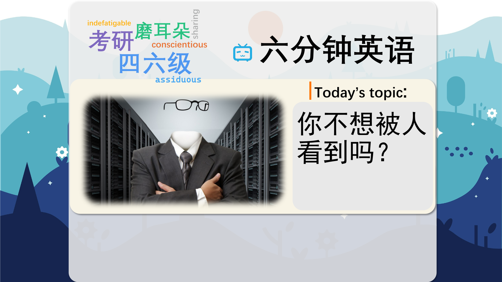
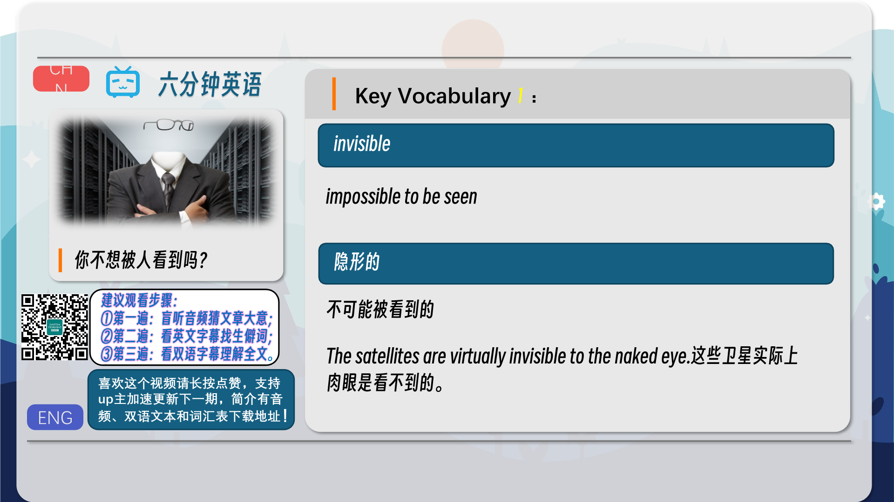
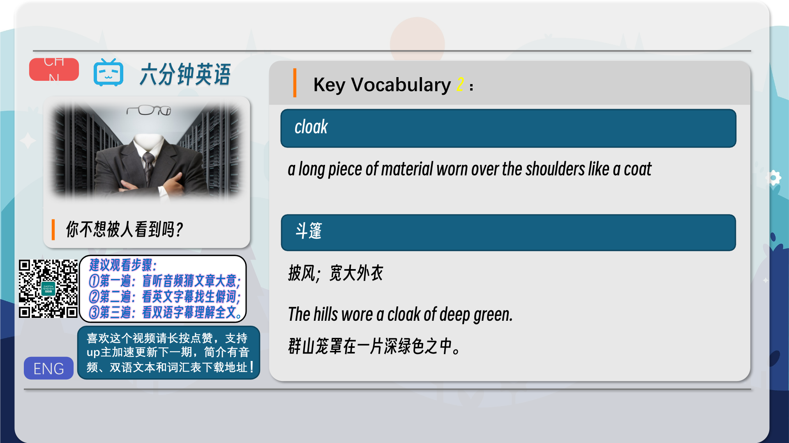
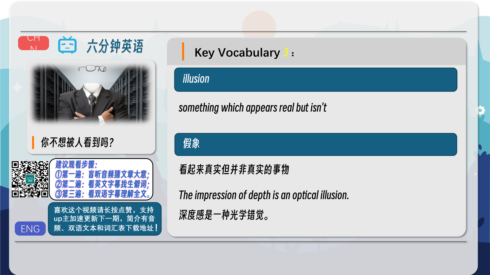
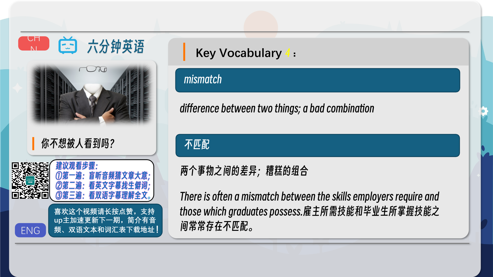
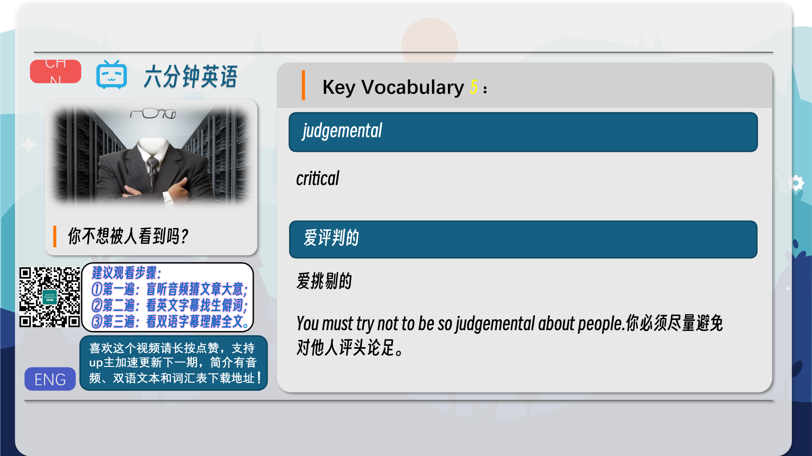
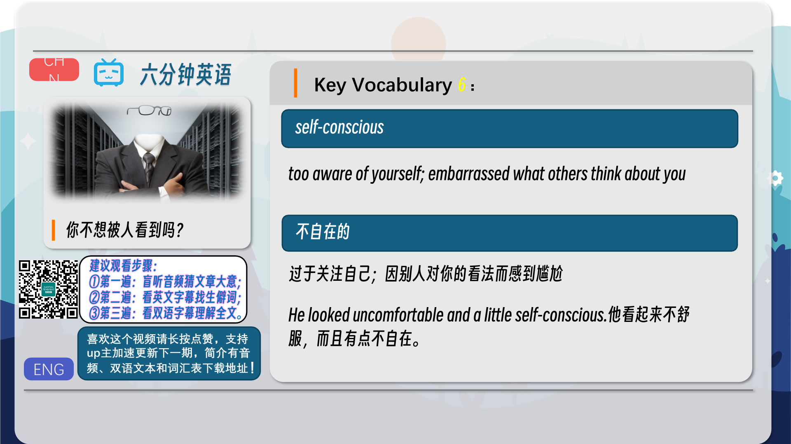
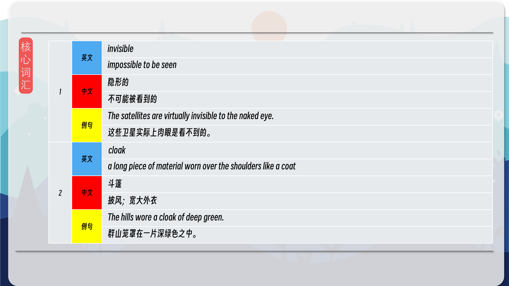
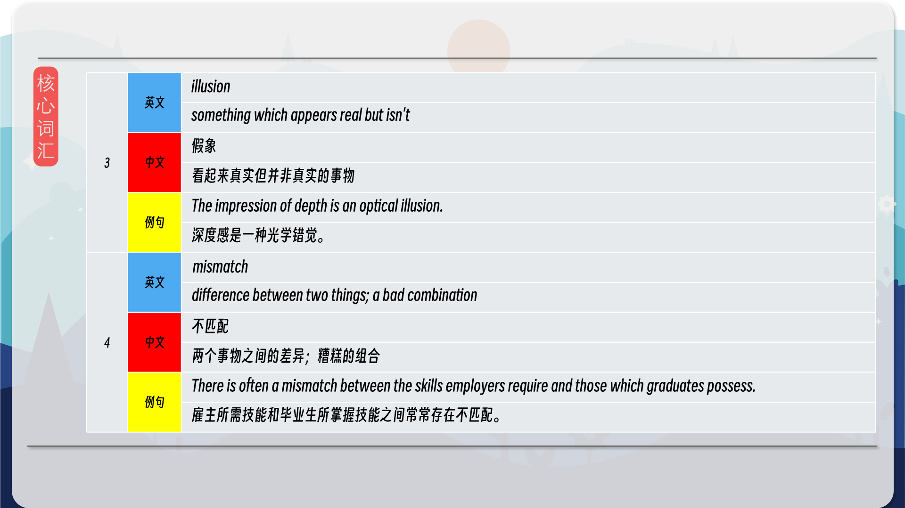
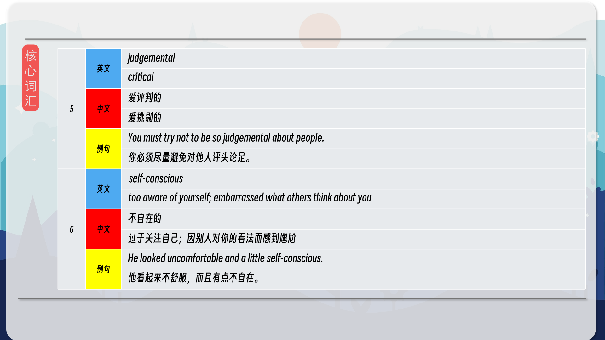

### 【英文脚本】
Neil
Welcome to 6 Minute English, the programme where we explore an interesting topic and bring you six items of useful vocabulary. I’m Neil.
 
Dan
And I’m Dan.
 
Neil
Now, Dan, have you ever wanted to become invisible?
 
Dan
Invisible – impossible to see. Of course! Who hasn’t?
 
Neil
Well how about this: most of us think we are in fact invisible, at least some of the time… We’ll be looking at the ‘invisibility cloak illusion’ in this programme.
 
Dan
Fascinating. And in that phrase we heard our first three words. Invisibility – the state of being invisible. A cloak is a long piece of material worn like a coat around the shoulders.
 
Neil
And the third word in that phrase – an illusion – is something that seems real but isn’t.
 
Dan
OK, question time. Which of these stories features an invisibility cloak? Is it… a) The Hobbit b) Harry Potter Or c) The Invisible Man
 
Neil
I know they are all connected to invisibility, but I'm gonna say…a) The Hobbit.
 
Dan
Ok – we’ll reveal the answer later on. Now, let’s hear more about this invisibility cloak illusion. What’s the theory, Neil?
 
Neil
Right – imagine you’re sitting in a crowded train. People are busy looking at phones and books, but they’re also looking at each other.
 
Dan
They’re ‘people-watching’, as we call it. Yes. Yes, I do that. I do it a lot, if I’m honest!
 
Neil
So – where does the invisibility part come in?
 
Dan
A team of scientists from Yale University did some experiments on this. Commenting on the research here is neuroscientist Dr Catherine Loveday from Westminster University. What did the Yale team find?
 
Dr Catherine Loveday, Neuroscientist, Westminster University
So this study, they asked people that, first they did a survey and they asked people sat in a canteen how much they were watching somebody, and how much they thought those people were observing them. And there was always a mismatch. People always thought they were more observational than the people who were watching them.
 
Dan
So, people think they observe others more than others watch them. Everyone thinks they aren't observed very much - it’s almost as if they’re invisible to others – or wearing an invisibility cloak!
 
Neil
And the difference between how much they are actually being watched and think they’re being watched is what she called a mismatch. It’s the difference between two things – they’re two things which don’t ‘match’.
 
Dan
In other words – it’s not true that people aren’t watching us – which is why the idea of having an invisibility cloak is just an illusion. This next bit is interesting. Two people were asked to wait in a room. Then they were each asked to make two lists: one, what they noticed about the other person; and two, what they thought the other person noticed about them.
 
Neil
So list one was always longer than list two. Not only that – but there was also an important difference in the content of the lists.
 
Dan
Let’s hear again from neuroscientist Dr Catherine Loveday. What was the difference?
 
Dr Catherine Loveday, Neuroscientist, Westminster University
When people are observing you they’re doing it in a non-judgemental, fairly empathic way – and not actually noticing the things that you’re self-conscious about. So if for example you feel self-conscious about a spot on your nose, or something that you’re wearing, that won’t be what they’re noticing. It’s a much less judgemental form of observation.
 
Neil
Right, so even if we’re feeling self-conscious about something – that means feeling extra aware of an aspect of ourselves – maybe our appearance or our clothes – we needn’t be.
 
Dan
Yes, you don’t need to feel self-conscious. People aren’t being judgemental.
 
Neil
And being judgemental means being critical.
 
Dan
That’s good news. So even though all I’m thinking about is how badly I need a haircut, the other person is probably noticing something completely different. Back to the question about the invisibility cloak. Which story is it in?
 
Neil
I said The Hobbit.
 
Dan
And it was in fact – Harry Potter. Not only does the garment make you impossible to see, it also protects you against magic spells.
 
Neil
Wow – I need one of those!
 
Dan
In The Hobbit, it’s a ring that makes you invisible, and in The Invisible Man, the main character uses chemicals to achieve the same effect.
 
Neil
Now, before we become invisible ourselves, how about we go through today’s words? Dan Marvellous. First we had invisible – which means impossible to see. You could say that stars are invisible during the day.
 
Neil
They’re only visible at night.
 
Dan
We also had cloak – who would wear a cloak? Maybe a king or a monk? Or maybe you, Neil?
 
Neil
I’m sure I could look good in a cloak – that’s a long piece of material worn over the shoulders. What about illusion?
 
Dan
Illusions appear to be true, but they’re not. It can describe an idea: you could say a politician has the illusion that everything he says is true. Then we had mismatch – which can refer to the difference between two things which perhaps should be similar: there’s a mismatch between what Michael says and what he does.
 
Neil
Who’s Michael?
 
Dan
Just an example! You could also say that Michael and Simone are an unlikely couple – they seem very different – they’re a bit of a mismatch.
 
Neil
What is it with you and Michael?! One, he doesn’t exist, and two, I think you’re being judgemental.
 
Dan
Well, I’m criticising him so, yeah, you’re right – I’m being judgemental. Perhaps I should stop. It’s just that… it's just that I’m in love with Simone myself, and I get all nervous and self-conscious when I see her.
 
Neil
You mean you become embarrassed about what she might think of you – you become self- conscious?
 
Dan
I do.
 
Neil
Even though she doesn’t exist either?
 
Dan
Well, only in my examples. Sometimes I wish I really did have an invisibility cloak.
 
Neil
Hey, hang on, Dan - where have you gone?
 
Dan
Haha – very funny, I’m still perfectly visible. Time to go – but do visit our Facebook, Twitter, Instagram and YouTube pages, and of course our website!
 
Neil
Goodbye for now.
 
Both
Bye!
 

### 【中英文双语脚本】
Neil(尼尔)
Welcome to 6 Minute English, the programme where we explore an interesting topic and bring you six items of useful vocabulary. I’m Neil.
欢迎来到六分钟英语，在这个节目中，我们将探索一个有趣的话题，并为您带来六项有用的词汇。我是 Neil。

Dan(担)
And I’m Dan.
我是 Dan。

Neil(尼尔)
Now, Dan, have you ever wanted to become invisible?
现在，Dan，你有没有想过变得隐形？

Dan(担)
Invisible – impossible to see. Of course! Who hasn’t?
看不见 – 看不见。答案是肯定的！谁没有呢？

Neil(尼尔)
Well how about this: most of us think we are in fact invisible, at least some of the time… We’ll be looking at the ‘invisibility cloak illusion’ in this programme.
那么，我们大多数人认为我们实际上是隐形的，至少在某些时候是这样......我们将在此计划中研究“隐形斗篷幻觉”。

Dan(担)
Fascinating. And in that phrase we heard our first three words. Invisibility – the state of being invisible. A cloak is a long piece of material worn like a coat around the shoulders.
迷人。在那句话中，我们听到了前三个字。隐身 – 不可见的状态。斗篷是一块长长的材料，像外套一样披在肩膀上。

Neil(尼尔)
And the third word in that phrase – an illusion – is something that seems real but isn’t.
而这句话中的第三个词 – 幻觉 – 是看似真实但并非如此的东西。

Dan(担)
OK, question time. Which of these stories features an invisibility cloak? Is it… a) The Hobbit b) Harry Potter Or c) The Invisible Man
好的，提问时间。这些故事中哪一个有隐形斗篷？是吗。。。a） 霍比特人 b） 哈利波特 或 c） 隐形人

Neil(尼尔)
I know they are all connected to invisibility, but I'm gonna say…a) The Hobbit.
我知道他们都与隐身有关，但我要说......a） 霍比特人。

Dan(担)
Ok – we’ll reveal the answer later on. Now, let’s hear more about this invisibility cloak illusion. What’s the theory, Neil?
好的 – 我们稍后会揭示答案。现在，让我们更多地了解这种隐形斗篷幻觉。理论是什么，尼尔？

Neil(尼尔)
Right – imagine you’re sitting in a crowded train. People are busy looking at phones and books, but they’re also looking at each other.
对 - 想象一下你坐在一辆拥挤的火车上。人们忙着看手机和书籍，但他们也在看着彼此。

Dan(担)
They’re ‘people-watching’, as we call it. Yes. Yes, I do that. I do it a lot, if I’m honest!
正如我们所说的，他们是 “观察人群”。是的。是的，我这样做。老实说，我经常这样做！

Neil(尼尔)
So – where does the invisibility part come in?
那么 - 隐形部分从何而来？

Dan(担)
A team of scientists from Yale University did some experiments on this. Commenting on the research here is neuroscientist Dr Catherine Loveday from Westminster University. What did the Yale team find?
耶鲁大学的一组科学家对此做了一些实验。威斯敏斯特大学的神经科学家 Catherine Loveday 博士在这里评论了这项研究。耶鲁大学团队发现了什么？

Dr Catherine Loveday, Neuroscientist, Westminster University(CatherineLoveday博士，威斯敏斯特大学神经科学家)
So this study, they asked people that, first they did a survey and they asked people sat in a canteen how much they were watching somebody, and how much they thought those people were observing them. And there was always a mismatch. People always thought they were more observational than the people who were watching them.
所以在这项研究中，他们问人们，首先他们做了一项调查，然后问坐在食堂里的人他们观察了多少人，以及他们认为这些人观察了多少。而且总是有不匹配的情况。人们总是认为他们比观察他们的人更善于观察。

Dan(担)
So, people think they observe others more than others watch them. Everyone thinks they aren't observed very much - it’s almost as if they’re invisible to others – or wearing an invisibility cloak!
因此，人们认为他们观察他人的次数多于观察他人的次数。每个人都认为他们没有被太多观察 - 几乎就像他们被别人看不见一样 - 或者穿着隐形斗篷！

Neil(尼尔)
And the difference between how much they are actually being watched and think they’re being watched is what she called a mismatch. It’s the difference between two things – they’re two things which don’t ‘match’.
他们实际被监视的程度与认为他们被监视的程度之间的差异就是她所说的不匹配。这是两件事之间的区别 —— 它们是两件不 “匹配 ”的事情。

Dan(担)
In other words – it’s not true that people aren’t watching us – which is why the idea of having an invisibility cloak is just an illusion. This next bit is interesting. Two people were asked to wait in a room. Then they were each asked to make two lists: one, what they noticed about the other person; and two, what they thought the other person noticed about them.
换句话说 —— 人们不看着我们是不是真的 —— 这就是为什么拥有隐形斗篷的想法只是一种幻觉。接下来的一点很有趣。两个人被要求在一个房间里等待。然后他们每个人都被要求列出两个清单：一个，他们注意到了另一个人的情况；第二，他们认为对方注意到了他们。

Neil(尼尔)
So list one was always longer than list two. Not only that – but there was also an important difference in the content of the lists.
所以清单 1 总是比清单 2 长。不仅如此 - 而且列表的内容也存在重要差异。

Dan(担)
Let’s hear again from neuroscientist Dr Catherine Loveday. What was the difference?
让我们再次聆听神经科学家 Catherine Loveday 博士的发言。有什么区别呢？

Dr Catherine Loveday, Neuroscientist, Westminster University(CatherineLoveday博士，威斯敏斯特大学神经科学家)
When people are observing you they’re doing it in a non-judgemental, fairly empathic way – and not actually noticing the things that you’re self-conscious about. So if for example you feel self-conscious about a spot on your nose, or something that you’re wearing, that won’t be what they’re noticing. It’s a much less judgemental form of observation.
当人们观察你时，他们是在以一种非评判、相当同理心的方式进行 —— 实际上并没有注意到你自我意识所做的事情。因此，例如，如果您对鼻子上的某个斑点或您佩戴的东西感到不自在，那他们就不会注意到。这是一种不那么评判性的观察形式。

Neil(尼尔)
Right, so even if we’re feeling self-conscious about something – that means feeling extra aware of an aspect of ourselves – maybe our appearance or our clothes – we needn’t be.
是的，所以即使我们对某件事感到不自在 —— 这意味着对自己的某个方面感到格外了解 —— 也许是我们的外表或我们的衣服 —— 我们不需要如此。

Dan(担)
Yes, you don’t need to feel self-conscious. People aren’t being judgemental.
是的，你不需要感到自我意识。人们不是在评判。

Neil(尼尔)
And being judgemental means being critical.
评判意味着批评。

Dan(担)
That’s good news. So even though all I’m thinking about is how badly I need a haircut, the other person is probably noticing something completely different. Back to the question about the invisibility cloak. Which story is it in?
这是个好消息。因此，即使我所想的只是我多么需要理发，但对方可能注意到了完全不同的东西。回到关于隐形斗篷的问题。它位于哪个故事中？

Neil(尼尔)
I said The Hobbit.
我说的是《霍比特人》。

Dan(担)
And it was in fact – Harry Potter. Not only does the garment make you impossible to see, it also protects you against magic spells.
事实上，它就是 —— 哈利波特。这件衣服不仅让您无法被看到，还可以保护您免受魔法咒语的侵害。

Neil(尼尔)
Wow – I need one of those!
哇 - 我需要其中之一！

Dan(担)
In The Hobbit, it’s a ring that makes you invisible, and in The Invisible Man, the main character uses chemicals to achieve the same effect.
在《霍比特人》中，它是一个让你隐形的戒指，而在《隐形人》中，主角使用化学物质来达到同样的效果。

Neil(尼尔)
Now, before we become invisible ourselves, how about we go through today’s words? Dan Marvellous. First we had invisible – which means impossible to see. You could say that stars are invisible during the day.
现在，在我们自己变得隐形之前，我们先回顾一下今天的文字怎么样？丹·了不起。首先，我们有 Invisible – 这意味着不可能看到。你可以说星星在白天是看不见的。

Neil(尼尔)
They’re only visible at night.
它们只在晚上可见。

Dan(担)
We also had cloak – who would wear a cloak? Maybe a king or a monk? Or maybe you, Neil?
我们还有斗篷 —— 谁会穿斗篷呢？也许是国王或僧侣？或者你，Neil？

Neil(尼尔)
I’m sure I could look good in a cloak – that’s a long piece of material worn over the shoulders. What about illusion?
我敢肯定我穿斗篷会很好看 —— 那是一件披在肩上的长材料。幻觉呢？

Dan(担)
Illusions appear to be true, but they’re not. It can describe an idea: you could say a politician has the illusion that everything he says is true. Then we had mismatch – which can refer to the difference between two things which perhaps should be similar: there’s a mismatch between what Michael says and what he does.
幻觉似乎是真的，但事实并非如此。它可以描述一个想法：你可以说一个政治家有一种错觉，认为他所说的一切都是真的。然后我们遇到了不匹配 —— 这可以指两件事之间的差异，也许应该相似：Michael 所说和他所做的事情之间存在不匹配。

Neil(尼尔)
Who’s Michael?
迈克尔是谁？

Dan(担)
Just an example! You could also say that Michael and Simone are an unlikely couple – they seem very different – they’re a bit of a mismatch.
只是一个例子！你也可以说 Michael 和 Simone 是一对不太可能的夫妇 —— 他们看起来非常不同 —— 他们有点不匹配。

Neil(尼尔)
What is it with you and Michael?! One, he doesn’t exist, and two, I think you’re being judgemental.
你和迈克尔怎么了？！第一，他不存在，第二，我认为你在评判。

Dan(担)
Well, I’m criticising him so, yeah, you’re right – I’m being judgemental. Perhaps I should stop. It’s just that… it's just that I’m in love with Simone myself, and I get all nervous and self-conscious when I see her.
嗯，我批评他，所以，是的，你是对的 —— 我是在评判。也许我应该停下来。只是。。。只是我自己也爱上了 Simone，当我看到她时，我会感到紧张和不自在。

Neil(尼尔)
You mean you become embarrassed about what she might think of you – you become self- conscious?
你的意思是你对她可能会怎么看你感到尴尬 —— 你变得自我意识？

Dan(担)
I do.
我愿意。

Neil(尼尔)
Even though she doesn’t exist either?
即使她也不存在？

Dan(担)
Well, only in my examples. Sometimes I wish I really did have an invisibility cloak.
嗯，只是在我的例子中。有时我希望我真的有一件隐形斗篷。

Neil(尼尔)
Hey, hang on, Dan - where have you gone?
嘿，等等，Dan - 你去哪儿了？

Dan(担)
Haha – very funny, I’m still perfectly visible. Time to go – but do visit our Facebook, Twitter, Instagram and YouTube pages, and of course our website!
哈哈 – 非常有趣，我仍然非常明显。是时候走了 - 但请访问我们的 Facebook、Twitter、Instagram 和 YouTube 页面，当然还有我们的网站！

Neil(尼尔)
Goodbye for now.
现在再见。

Both(双)
Bye!
再见！

### 【核心词汇】
#### invisible
impossible to be seen
隐形的
不可能被看到的
The satellites are virtually invisible to the naked eye.
这些卫星实际上肉眼是看不到的。
#### cloak
a long piece of material worn over the shoulders like a coat
斗篷
披风；宽大外衣
The hills wore a cloak of deep green.
群山笼罩在一片深绿色之中。
#### illusion
something which appears real but isn't
假象
看起来真实但并非真实的事物
The impression of depth is an optical illusion.
深度感是一种光学错觉。
#### mismatch
difference between two things; a bad combination
不匹配
两个事物之间的差异；糟糕的组合
There is often a mismatch between the skills employers require and those which graduates possess.
雇主所需技能和毕业生所掌握技能之间常常存在不匹配。
#### judgemental
critical
爱评判的
爱挑剔的
You must try not to be so judgemental about people.
你必须尽量避免对他人评头论足。
#### self-conscious
too aware of yourself; embarrassed what others think about you
不自在的
过于关注自己；因别人对你的看法而感到尴尬
He looked uncomfortable and a little self-conscious.
他看起来不舒服，而且有点不自在。

在公众号里输入6位数字，获取【对话音频、英文文本、中文翻译、核心词汇和高级词汇表】电子档，6位数字【暗号】在文章的最后一张图片，如【220728】，表示22年7月28日这一期。公众号没有的文章说明还没有制作相关资料。年度合集在B站【六分钟英语】工房获取，每年共计300+文档，感谢支持！