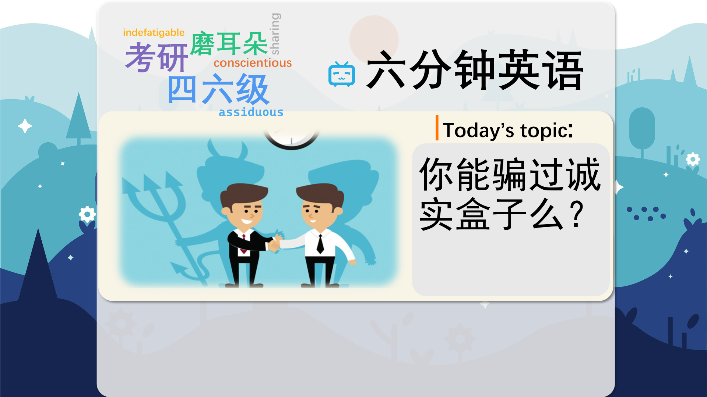

### 【英文脚本】
Neil
Hello and welcome to 6 Minute English, where we bring you an interesting topic and six items of vocabulary. I'm Neil, and joining me is Rob.
 
Rob
Hello there! And today we've got six minutes to talk about honesty and how honest people are, particularly when it comes to spending money. So Neil, what's an 'honesty box'?
 
Neil
Well, it's where you pay for something by putting money in a box, but it's up to you to put in the right amount. A small business might use this method to take money for things like parking your car or buying a newspaper because it means you don't need a sales assistant.
 
Rob
But that means people could take a newspaper or park their car without paying anything! An honesty box relies on people being honest. The adjective honest means truthful and not trying to cheat people.
 
Neil
And the noun is honesty, the quality of being truthful. Have you ever cheated an honesty box, Rob?
 
Rob
Absolutely not! I've never have!
 
Neil
Honestly?
 
Rob
Honestly! And to cheat, by the way, means to trick or deceive someone to get something you want. Honesty is the best policy, as they say
 
Neil
Which of course leads us on to our quiz.
 
Dan
The 6 minute English quiz! Who said ‘honesty is the best policy’? Was it. a) Donald Trump b) Benjamin Franklin or c) Richard Nixon?
 
Rob
Honestly, Neil! Everyone will know the answer to that.
 
Neil
But do you know the answer to that, Rob?
 
Rob
Well, I'll have an honest guess. I think it's b) Benjamin Franklin.
 
Neil
Well, you might be right, but you might not, we'll find out at the end. I did like your use of 'honestly' there, Rob. We can use the adverb 'honestly' at the beginning of a sentence to show that we're feeling irritated, for example when your co-presenter picks a quiz question that's too easy!
 
Rob
OK, OK, let's move on now and hear from Philip Graves, a psychologist, and author of the book Consumerology, who can tell us about why honesty isn't always the best policy.
 
Philip Graves, Psychologist and author of the book Consumerology
The question is not 'Are most consumers honest, the question is 'Are most people honest?', And the answer to that is 'no'. We have evolved with the capacity to be dishonest. It's part of our evolutionary psychological make up, because if we can gain an advantage over the people around us, we have a greater chance of surviving. Now what's important in that is that we also benefited from being in a social group and that was important in our evolutionary past so there is a balance to strike between the extent to which we can feather our own nest, so to speak, and the risk of being ostracised by the group.
 
Neil
A consumer is a person who buys things or services, for example, food or clothes.
 
Rob
Or the use of a parking space, or a taxi.
 
Neil
Now, if I park my car and don't pay for the parking space, I'm being dishonest, but I'm also saving money.
 
Rob
And Philip Graves says being dishonest is part of our 'psychological make up'. What does that mean?
 
Neil
Our psychological make up is the way the human mind works, the way we think.
 
Rob
And it makes sense to be dishonest if you gain an advantage through this behaviour. So when you take something without paying for it, you save money you can spend on something else.
 
Neil
So why do we place such importance on being honest then?, If we benefit from being dishonest?
 
Rob
Because it's selfish behaviour, which other members of our social group won't like. If everybody acted selfishly and dishonestly all the time, the world would be a very unpleasant place!
 
Neil
Selfish, meaning only caring about yourself and not about other people. That's a good point, Rob.
 
Rob
Yes, societies work better if people behave co-operatively, which means working together towards shared goals.
 
Neil
So honesty really is the best policy then, at least most of the time!
 
Dan
And now it's time for the answer to the quiz. Who said ‘honesty is the best policy’?
 
Neil
What do you think, Rob?
 
Rob
OK. Was it Benjamin Franklin?
 
Neil
And that was the right answer! Maybe the question was too easy! Benjamin Franklin wrote it in a book of proverbs called Poor Richard's Almanac between 1732 and 1758. Other famous quotes include 'There are no gains without pains' and 'Have you something to do tomorrow? Do it today.' OK let's follow Franklin's wise words and move right ahead with the vocabulary items we learned today.
 
Rob
First up was the adjective honest, meaning truthful and not trying to cheat people, For example, 'Neil has a very honest face'. OK, then there's  um .. honesty and honestly the noun and adverb forms. For example, erm.
 
Neil
Honestly, Rob, hurry up and do the second item!
 
Rob
OK, OK, I'm getting there! To cheat, means to behave dishonestly to get what you want.
 
Neil
My granny always used to cheat in card games. It was so annoying!
 
Rob
And I always used to cheat in spelling tests at school!
 
Neil
How dishonest, Rob! OK, number three. Consumer, a person who buys goods or services for their own personal use.
 
Rob
For example, 'I am a big consumer of chocolate bars'.
 
Neil
That's terrible English, Rob! How about, 'We asked UK consumers how much money they spent on food every month'?
 
Rob
OK, I agree that's a better example. Anyway, I never consume chocolate. Number four!
 
Neil
Psychological make up, the way our minds work. The way we think.
 
Rob
For example, 'He had the psychological make up of a serial killer.'
 
Neil
That's nasty! Moving on, selfish, caring only about yourself and not other people.
 
Rob
You only made yourself a cup of tea, that was a selfish thing to do!
 
Neil
What?
 
Rob
It was just an example. You're not selfish, Neil. You're actually the most co-operative person I know, you're happy to work with others towards a common goal.
 
Neil
Not selfish then?
 
Rob
Never selfish. Always co-operative And honest too.
 
Neil
Great. Now, I honestly recommend that listeners visit our Facebook, Twitter, Instagram and YouTube pages.
 
Rob
You can co-operate with other learners in your common goal of improving your English! Bye-bye!
 
Neil
Goodbye!
 

### 【中英文双语脚本】
Neil(尼尔)
Hello and welcome to 6 Minute English, where we bring you an interesting topic and six items of vocabulary. I'm Neil, and joining me is Rob.
您好，欢迎来到六分钟英语，我们为您带来一个有趣的话题和六个词汇。我是 Neil，加入我的是 罗伯。

Rob(罗伯)
Hello there! And today we've got six minutes to talk about honesty and how honest people are, particularly when it comes to spending money. So Neil, what's an 'honesty box'?
嗨，你好！今天我们有六分钟的时间来讨论诚实以及人们的诚实程度，尤其是在花钱方面。那么 Neil，什么是“诚实箱”？

Neil(尼尔)
Well, it's where you pay for something by putting money in a box, but it's up to you to put in the right amount. A small business might use this method to take money for things like parking your car or buying a newspaper because it means you don't need a sales assistant.
嗯，这是你通过将钱放在盒子里来支付某物的地方，但这取决于你是否投入正确的金额。小企业可能会使用这种方法来收取停车或购买报纸等费用，因为这意味着您不需要销售助理。

Rob(罗伯)
But that means people could take a newspaper or park their car without paying anything! An honesty box relies on people being honest. The adjective honest means truthful and not trying to cheat people.
但这意味着人们可以拿报纸或停车而无需支付任何费用！诚实箱依赖于人们的诚实。形容词 honest 的意思是诚实，而不是试图欺骗人们。

Neil(尼尔)
And the noun is honesty, the quality of being truthful. Have you ever cheated an honesty box, Rob?
而这个名词是诚实，诚实的品质。你有没有骗过诚实箱，罗伯？

Rob(罗伯)
Absolutely not! I've never have!
绝对不行！我从来没有过！

Neil(尼尔)
Honestly?
真诚地？

Rob(罗伯)
Honestly! And to cheat, by the way, means to trick or deceive someone to get something you want. Honesty is the best policy, as they say
真诚地！顺便说一句，to cheat 的意思是欺骗或欺骗某人以获得你想要的东西。正如他们所说，诚实是最好的政策

Neil(尼尔)
Which of course leads us on to our quiz.
这当然会引导我们进行我们的测验。

Dan(担)
The 6 minute English quiz! Who said ‘honesty is the best policy’? Was it. a) Donald Trump b) Benjamin Franklin or c) Richard Nixon?
6 分钟的英语测验！谁说“诚实是最好的政策”？是这样。a） 唐纳德·特朗普 b） 本杰明·富兰克林 或 c） 理查德·尼克松？

Rob(罗伯)
Honestly, Neil! Everyone will know the answer to that.
老实说，尼尔！每个人都会知道这个问题的答案。

Neil(尼尔)
But do you know the answer to that, Rob?
但是你知道这个问题的答案吗，罗伯？

Rob(罗伯)
Well, I'll have an honest guess. I think it's b) Benjamin Franklin.
好吧，我有一个诚实的猜测。我认为是 b） 本杰明·富兰克林。

Neil(尼尔)
Well, you might be right, but you might not, we'll find out at the end. I did like your use of 'honestly' there, Rob. We can use the adverb 'honestly' at the beginning of a sentence to show that we're feeling irritated, for example when your co-presenter picks a quiz question that's too easy!
好吧，你可能是对的，但你可能不是，我们最后会发现。我确实喜欢你在那里用的 'honestly' ，罗伯。我们可以在句子的开头使用副词 'honestly' 来表示我们感到烦躁，例如，当你的共同主持人选择一个太简单的测验问题时！

Rob(罗伯)
OK, OK, let's move on now and hear from Philip Graves, a psychologist, and author of the book Consumerology, who can tell us about why honesty isn't always the best policy.
好，好，现在让我们继续前进，听听心理学家、《消费者学》一书的作者菲利普·格雷夫斯 （Philip Graves） 的意见，他可以告诉我们为什么诚实并不总是最好的政策。

Philip Graves, Psychologist and author of the book Consumerology(菲利普·格雷夫斯（PhilipGraves），心理学家，《消费者学》一书的作者)
The question is not 'Are most consumers honest, the question is 'Are most people honest?', And the answer to that is 'no'. We have evolved with the capacity to be dishonest. It's part of our evolutionary psychological make up, because if we can gain an advantage over the people around us, we have a greater chance of surviving. Now what's important in that is that we also benefited from being in a social group and that was important in our evolutionary past so there is a balance to strike between the extent to which we can feather our own nest, so to speak, and the risk of being ostracised by the group.
问题不是 “大多数消费者诚实吗”，问题是 “大多数人诚实吗”，答案是 “不”。我们已经进化到有能力不诚实。这是我们进化心理构成的一部分，因为如果我们能获得优于周围人的优势，我们就有更大的生存机会。现在重要的是，我们也从社会群体中受益，这在我们的进化历史中很重要，因此我们可以在多大程度上保护自己的巢穴和被群体排斥的风险之间取得平衡。

Neil(尼尔)
A consumer is a person who buys things or services, for example, food or clothes.
消费者是购买物品或服务（例如食物或衣服）的人。

Rob(罗伯)
Or the use of a parking space, or a taxi.
或者使用停车位或出租车。

Neil(尼尔)
Now, if I park my car and don't pay for the parking space, I'm being dishonest, but I'm also saving money.
现在，如果我把车停好，不付停车位费，我就是不诚实的，但我也在省钱。

Rob(罗伯)
And Philip Graves says being dishonest is part of our 'psychological make up'. What does that mean?
菲利普·格雷夫斯 （Philip Graves） 说，不诚实是我们“心理构成”的一部分。那是什么意思？

Neil(尼尔)
Our psychological make up is the way the human mind works, the way we think.
我们的心理构成是人类思维的运作方式，我们的思维方式。

Rob(罗伯)
And it makes sense to be dishonest if you gain an advantage through this behaviour. So when you take something without paying for it, you save money you can spend on something else.
如果你通过这种行为获得了优势，那么不诚实是有道理的。因此，当您不付费就拿走某样东西时，您可以节省可以花在其他事情上的钱。

Neil(尼尔)
So why do we place such importance on being honest then?, If we benefit from being dishonest?
那么，如果我们从不诚实中受益，为什么我们如此重视诚实呢？

Rob(罗伯)
Because it's selfish behaviour, which other members of our social group won't like. If everybody acted selfishly and dishonestly all the time, the world would be a very unpleasant place!
因为这是自私的行为，我们社会群体的其他成员不会喜欢。如果每个人都一直自私和不诚实地行事，世界将是一个非常不愉快的地方！

Neil(尼尔)
Selfish, meaning only caring about yourself and not about other people. That's a good point, Rob.
自私，意味着只关心自己，不关心别人。这是一个很好的观点，罗伯。

Rob(罗伯)
Yes, societies work better if people behave co-operatively, which means working together towards shared goals.
是的，如果人们合作行事，社会就会更好地运作，这意味着为共同的目标共同努力。

Neil(尼尔)
So honesty really is the best policy then, at least most of the time!
所以诚实确实是最好的策略，至少在大多数时候是这样！

Dan(担)
And now it's time for the answer to the quiz. Who said ‘honesty is the best policy’?
现在是测验答案的时候了。谁说“诚实是最好的政策”？

Neil(尼尔)
What do you think, Rob?
你怎么看，罗伯？

Rob(罗伯)
OK. Was it Benjamin Franklin?
好吧，是本杰明·富兰克林吗？

Neil(尼尔)
And that was the right answer! Maybe the question was too easy! Benjamin Franklin wrote it in a book of proverbs called Poor Richard's Almanac between 1732 and 1758. Other famous quotes include 'There are no gains without pains' and 'Have you something to do tomorrow? Do it today.' OK let's follow Franklin's wise words and move right ahead with the vocabulary items we learned today.
这就是正确的答案！也许这个问题太简单了！本杰明·富兰克林 （Benjamin Franklin） 在 1732 年至 1758 年间在一本名为《穷理查德年鉴》（Poor Richard's Almanac） 的谚语书中写下了这句话。其他著名的名言包括“没有痛苦就没有收获”和“你明天有事要做吗？今天就去做。好，让我们遵循富兰克林的睿智之言，继续我们今天学到的词汇项目。

Rob(罗伯)
First up was the adjective honest, meaning truthful and not trying to cheat people, For example, 'Neil has a very honest face'. OK, then there's um .. honesty and honestly the noun and adverb forms. For example, erm.
首先是形容词 honest，意思是诚实的，不想欺骗别人，例如，“Neil 有一张非常诚实的脸”。好的，然后是嗯......诚实和诚实地 名词和副词形式。例如，erm.

Neil(尼尔)
Honestly, Rob, hurry up and do the second item!
老实说，罗伯，快点做第二项吧！

Rob(罗伯)
OK, OK, I'm getting there! To cheat, means to behave dishonestly to get what you want.
好，好，我快到了！To cheat，意思是为了得到你想要的东西而做出不诚实的行为。

Neil(尼尔)
My granny always used to cheat in card games. It was so annoying!
我奶奶以前总是在纸牌游戏中作弊。这太烦人了！

Rob(罗伯)
And I always used to cheat in spelling tests at school!
而且我以前总是在学校的拼写测试中作弊！

Neil(尼尔)
How dishonest, Rob! OK, number three. Consumer, a person who buys goods or services for their own personal use.
多么不诚实啊，罗伯！好的，第三点。消费者，购买商品或服务供自己个人使用的人。

Rob(罗伯)
For example, 'I am a big consumer of chocolate bars'.
例如，“我是巧克力棒的大消费者”。

Neil(尼尔)
That's terrible English, Rob! How about, 'We asked UK consumers how much money they spent on food every month'?
这英语太糟糕了，罗伯！“我们问英国消费者他们每个月在食品上花了多少钱”怎么样？

Rob(罗伯)
OK, I agree that's a better example. Anyway, I never consume chocolate. Number four!
好吧，我同意这是一个更好的例子。无论如何，我从不吃巧克力。第四名！

Neil(尼尔)
Psychological make up, the way our minds work. The way we think.
心理构成，我们思维的运作方式。我们的思维方式。

Rob(罗伯)
For example, 'He had the psychological make up of a serial killer.'
例如，'他有连环杀手的心理构成。

Neil(尼尔)
That's nasty! Moving on, selfish, caring only about yourself and not other people.
太讨厌了！继续前进，自私，只关心自己，不关心别人。

Rob(罗伯)
You only made yourself a cup of tea, that was a selfish thing to do!
你只是给自己泡了一杯茶，那是一件自私的事情！

Neil(尼尔)
What?
什么？

Rob(罗伯)
It was just an example. You're not selfish, Neil. You're actually the most co-operative person I know, you're happy to work with others towards a common goal.
这只是一个例子。你不自私，尼尔。你实际上是我认识的最合作的人，你很乐意与他人一起朝着共同的目标努力。

Neil(尼尔)
Not selfish then?
那不是自私吗？

Rob(罗伯)
Never selfish. Always co-operative And honest too.
永远不要自私。永远合作，也很诚实。

Neil(尼尔)
Great. Now, I honestly recommend that listeners visit our Facebook, Twitter, Instagram and YouTube pages.
伟大。现在，我真诚地建议听众访问我们的 Facebook、Twitter、Instagram 和 YouTube 页面。

Rob(罗伯)
You can co-operate with other learners in your common goal of improving your English! Bye-bye!
您可以与其他学习者合作，以实现提高英语水平的共同目标！再见！

Neil(尼尔)
Goodbye!
再见！

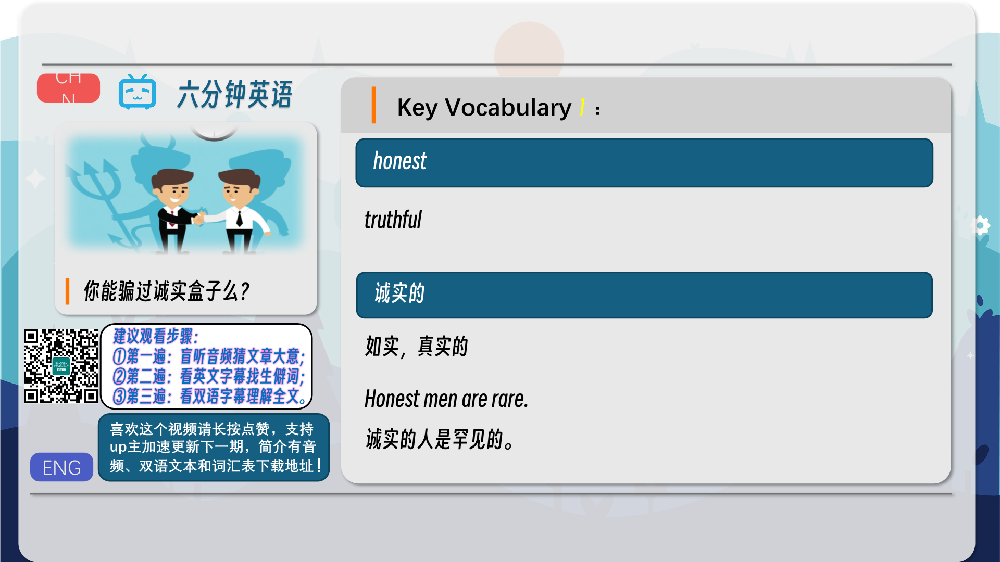

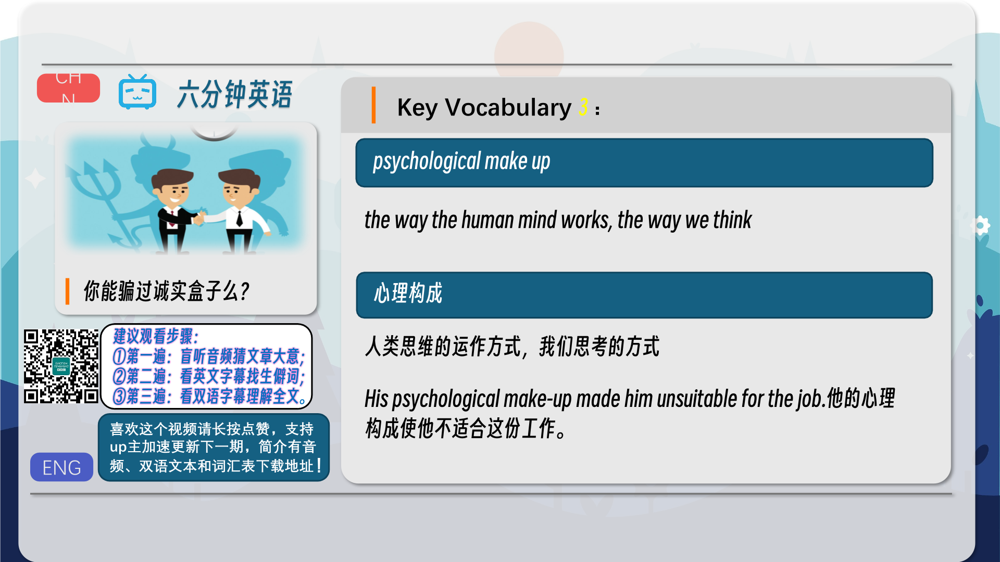
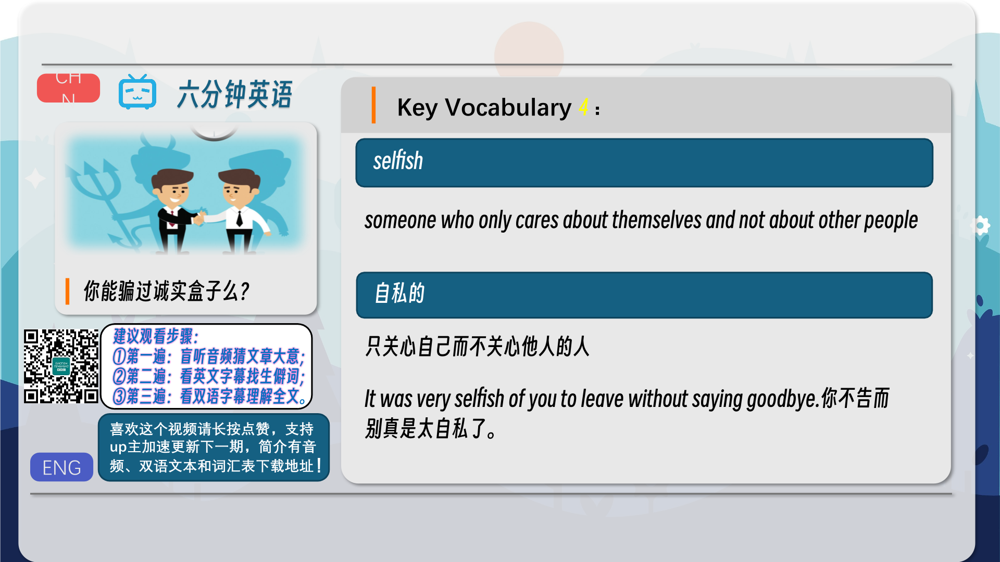
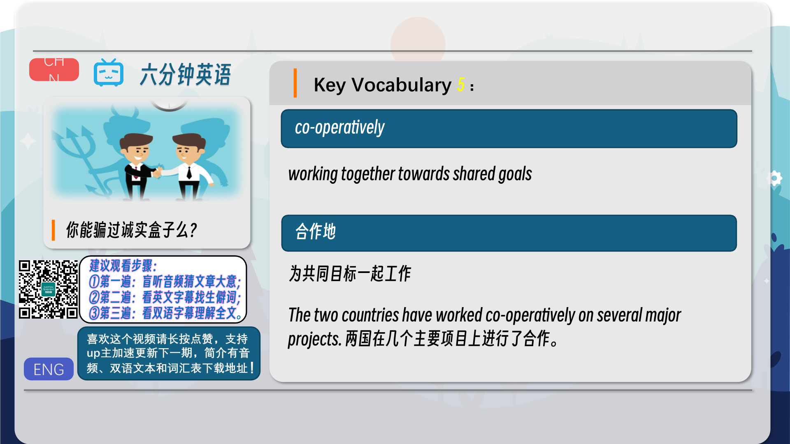
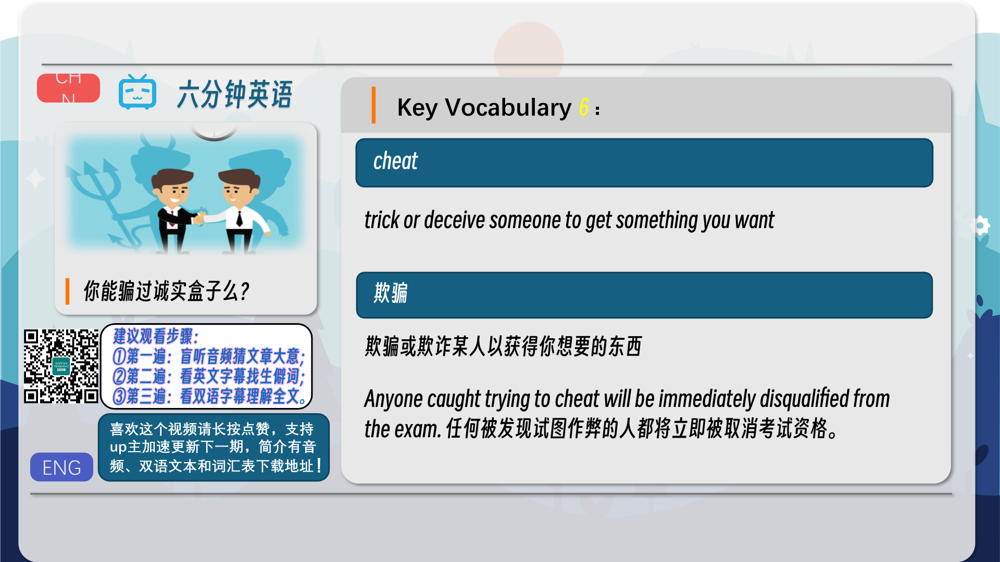
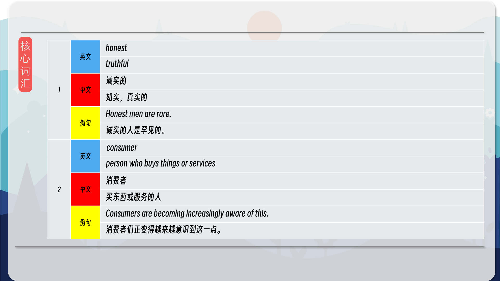
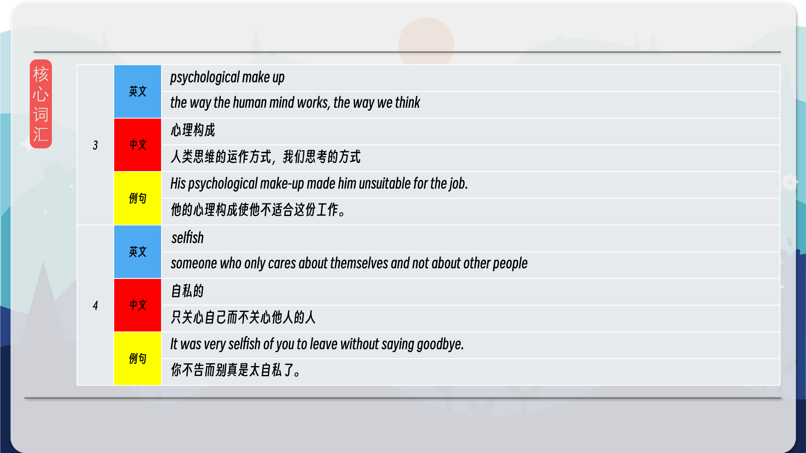
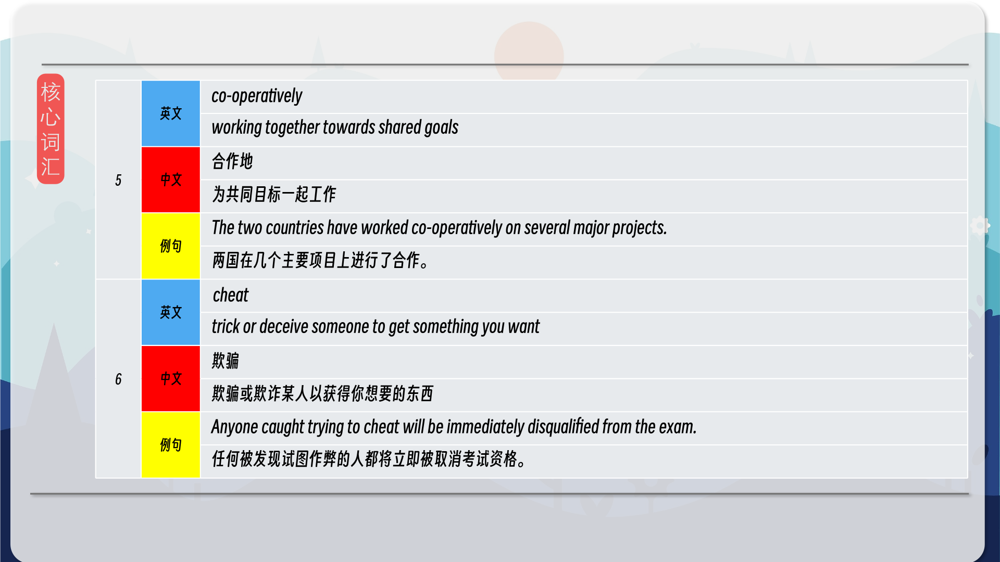
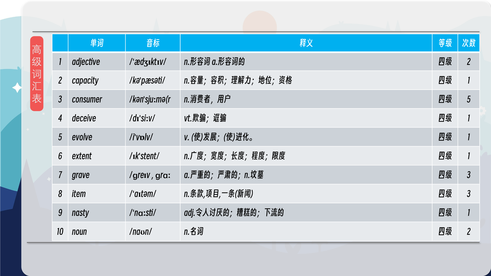
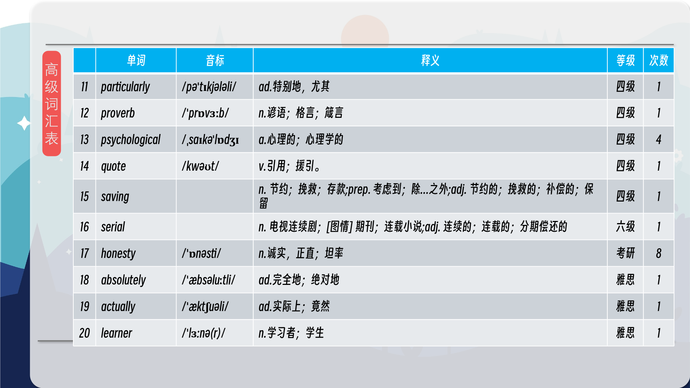
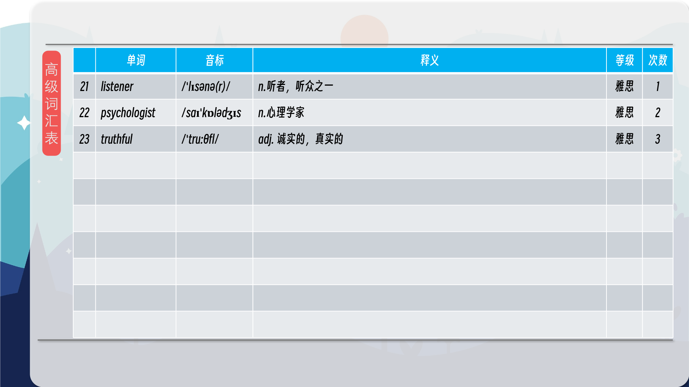
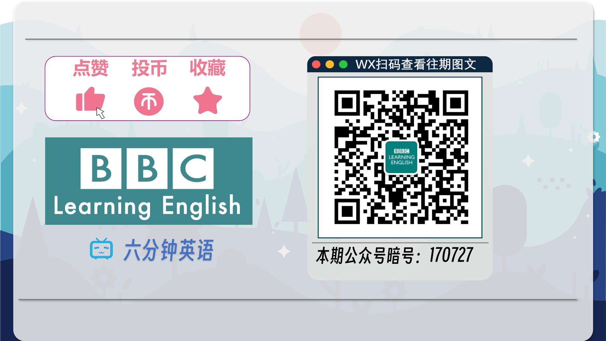

### 【核心词汇】
#### honest
truthful
诚实的
如实，真实的
Honest men are rare.
诚实的人是罕见的。
#### consumer
person who buys things or services
消费者
买东西或服务的人
Consumers are becoming increasingly aware of this.
消费者们正变得越来越意识到这一点。
#### psychological make up
the way the human mind works, the way we think
心理构成
人类思维的运作方式，我们思考的方式
His psychological make-up made him unsuitable for the job.
他的心理构成使他不适合这份工作。
#### selfish
someone who only cares about themselves and not about other people
自私的
只关心自己而不关心他人的人
It was very selfish of you to leave without saying goodbye.
你不告而别真是太自私了。
#### co-operatively
working together towards shared goals
合作地
为共同目标一起工作
The two countries have worked co-operatively on several major projects.
两国在几个主要项目上进行了合作。
#### cheat
trick or deceive someone to get something you want
欺骗
欺骗或欺诈某人以获得你想要的东西
Anyone caught trying to cheat will be immediately disqualified from the exam.
任何被发现试图作弊的人都将立即被取消考试资格。

在公众号里输入6位数字，获取【对话音频、英文文本、中文翻译、核心词汇和高级词汇表】电子档，6位数字【暗号】在文章的最后一张图片，如【220728】，表示22年7月28日这一期。公众号没有的文章说明还没有制作相关资料。年度合集在B站【六分钟英语】工房获取，每年共计300+文档，感谢支持！