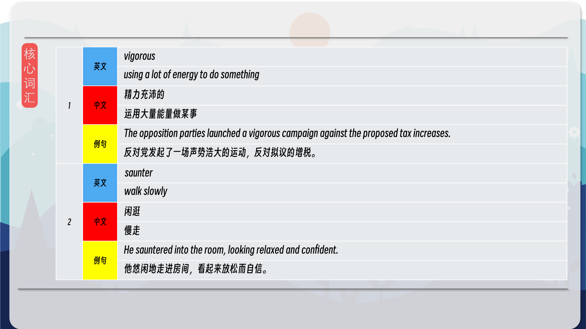
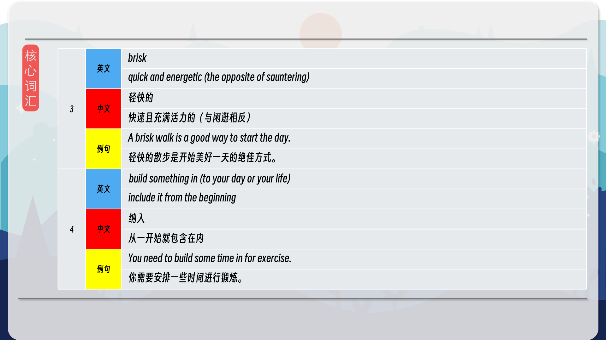
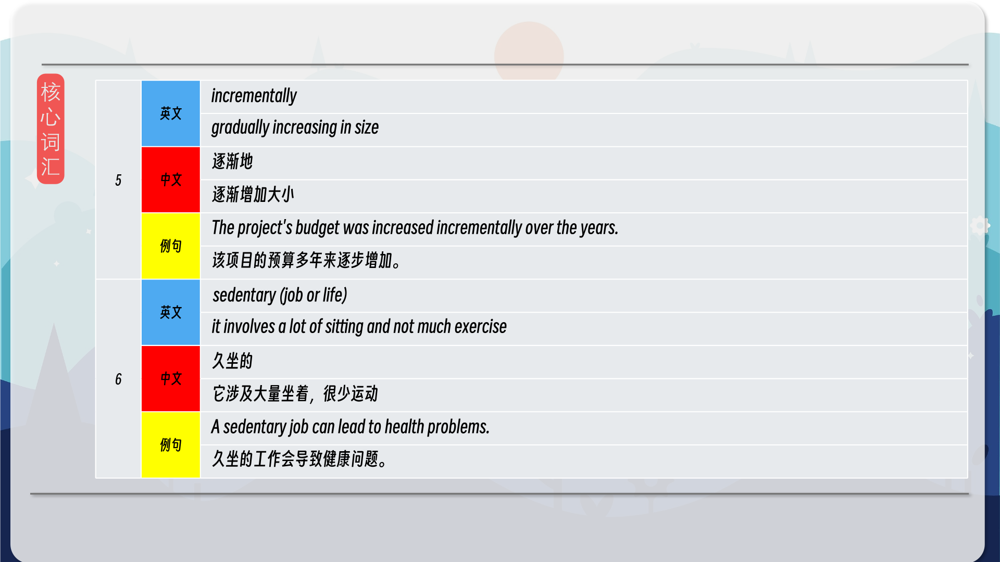
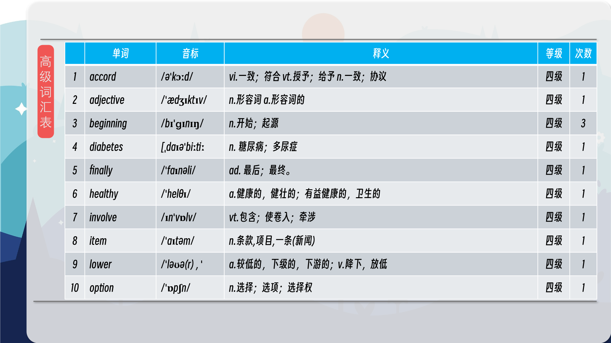
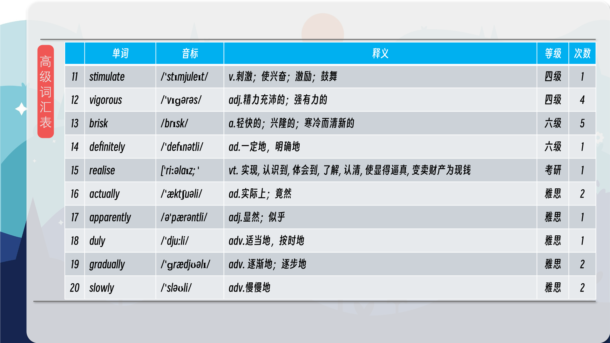
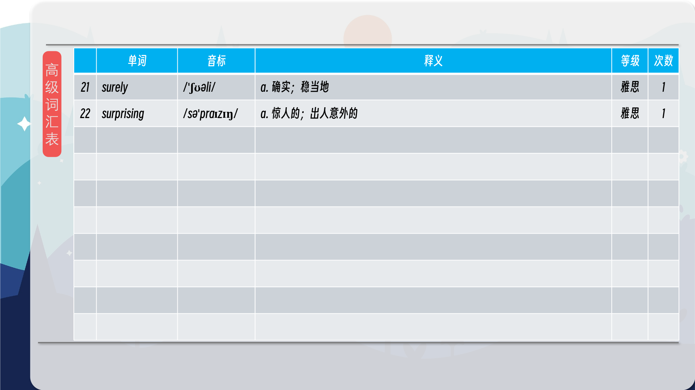

### 【英文脚本】
Neil
Hello, I’m Neil. And welcome to 6 Minute English, where we vigorously discuss a new topic and six related items of vocabulary.
 
Rob
And hello, I’m Rob. Today we’re discussing vigorous exercise, and whether adults take enough of it! Vigorous means using a lot of energy to do something.
 
Neil
So how many steps do you do in a day, Rob?
 
Rob
How many steps? How should I know, Neil?, It would be pretty hard to count them all.
 
Neil
Oh, come on! You can track steps on your phone! I do ten thousand a day, which is the magic number for keeping fit and healthy, apparently.
 
Rob
Not if you saunter, Neil, surely? Sauntering from the sofa to the fridge and back, Or from the house to the car.
 
Neil
Well I never saunter, Rob. Saunter means to walk slowly. And you’d have to make a lot of trips to the fridge to clock up ten thousand steps. To get some vigorous exercise, you need to get out and about, round the park at a brisk pace…
 
Rob
Brisk means quick and energetic, the opposite of sauntering. OK, well, perhaps you can you tell me, Neil, how many people aged between 40 and 60 do less than ten minutes brisk walking every month? Is it… a) 4%, b)14% or c) 40%?
 
Neil
I’m going to say… 4% because ten minutes is such a short amount of time!
 
Rob
Indeed. Now, I’ve got another question for you, Neil. Why is exercise so important? Because it sounds pretty boring, counting steps, going to the gym, running on a machine.
 
Neil
Well, when you exercise, you stimulate the body’s natural repair system. Your body will actually stay younger if you exercise!
 
Rob
That sounds good.
 
Neil
Exercise also lowers your risk of developing illnesses such as heart disease, cancer, and diabetes.
 
Rob
Hmm. I’m getting a bit worried now, Neil. But I don’t have enough time to do a thousand steps every day… I’m far too busy!
 
Neil
Well, Rob. Now might be a good time to listen to Julia Bradbury. She’s a TV presenter and outdoor walking enthusiast who will explain how she builds walking into her busy life.
 
Julia Bradbury, TV presenter and outdoor walking enthusiast
I will walk to meetings instead of catching a bus, or getting a taxi or a car, into meetings. And I will also, if I can’t build that into my working day, if it’s a day when I haven’t got meetings and I’m maybe at home with the kids, I will take the time, I will take my kids out with the buggy and I will definitely do 30-40 minutes at least everyday. Going to the park, going to the shops, picking up my things up en route, and really sort of building it into my life. Taking the stairs and not taking lifts, all of these kinds of little decisions can incrementally build up to create more walking time in your day.
 
Rob
So if you build something in to your day, or your life, you include it from the beginning.
 
Neil
And Julia Bradbury has built walking into her day. Even though she’s very busy too, Rob! You should learn from her!
 
Rob
So she walks instead of driving or taking the bus. And takes the stairs instead of the lift. I could do those things.
 
Neil
You could indeed, before you know it, you’d be doing ten thousand steps, because the amount of walking you do in a day builds incrementally.
 
Rob
Incrementally means gradually increasing in size. OK, well, before I think that over, perhaps I could tell you the answer to today’s quiz question?
 
Neil
OK. You asked me: How many people aged between 40 and 60 do less than ten minutes brisk walking every month? The options were: a) 4%, b) 14% or c) 40%?
 
Rob
And you said 4%. But I’m afraid it’s actually 40%. And that’s according to the Government body Public Health England here in the UK.
 
Neil
Oh dear, that’s a lot more people than I expected. But it isn’t that surprising, people in all age groups are leading more sedentary lifestyles these days. Our job is very sedentary – which means it involves a lot of sitting and not much exercise!
 
Rob
Well, I might just run on the spot while we go over the new vocabulary we’ve learned today!
 
Neil
Good plan. First up we heard ‘vigorous’, which means using a lot of energy to do something.
 
Rob
OK. “I am running vigorously on the spot!”
 
Neil
Great example! And good to see you taking some vigorous exercise! Number two – ‘saunter’, means to walk slowly in a relaxed way. “When I saw Rob, I sauntered over to say hello.”
 
Rob
Hi Neil. Number three, ‘brisk’ means quick and energetic.
 
Neil
“It’s important to take some brisk exercise every day.”
 
Rob
Yes! And I’m beginning to realise that might be true.
 
Neil
Yep! I think you've done enough jogging for today, Rob. You’ve probably done about a hundred steps.
 
Rob
Is that all? OK, number four, if you ‘build something in to something’, you include it from the beginning.
 
Neil
“It’s important to build regular exercise into your daily routine.”
 
Rob
Very good advice. Number five is ‘incrementally’ which means gradually increasing in size.
 
Neil
Incremental is the adjective. “The company has been making incremental changes to its pay structure.”
 
Rob
Does that mean we’re getting a pay rise?
 
Neil
I doubt it! And finally, number six, ‘sedentary’ means sitting a lot and not taking much exercise. For example, “It’s bad for your health to lead such a sedentary lifestyle.”
 
Rob
Duly noted, Neil! Well, it’s time to go now. But if today’s show has inspired you to step out and take more exercise, please let us know by visiting our Twitter, Facebook and YouTube pages and telling us about it!
 
Neil
Goodbye!
 
Rob
Bye bye!
 

### 【中英文双语脚本】
Neil(尼尔)
Hello, I’m Neil. And welcome to 6 Minute English, where we vigorously discuss a new topic and six related items of vocabulary.
大家好，我是 Neil。欢迎来到六分钟英语，在这里，我们将热烈讨论一个新话题和六个相关词汇项目。

Rob(罗伯)
And hello, I’m Rob. Today we’re discussing vigorous exercise, and whether adults take enough of it! Vigorous means using a lot of energy to do something.
大家好，我是 罗伯。今天我们讨论的是剧烈运动，以及成年人是否摄入足够的运动！活力意味着使用大量能量来做某事。

Neil(尼尔)
So how many steps do you do in a day, Rob?
那么，罗伯，你一天要走多少步呢？

Rob(罗伯)
How many steps? How should I know, Neil?, It would be pretty hard to count them all.
多少个步骤？我怎么知道呢，尼尔？，要把他们都数出来是相当困难的。

Neil(尼尔)
Oh, come on! You can track steps on your phone! I do ten thousand a day, which is the magic number for keeping fit and healthy, apparently.
拜托！您可以在手机上跟踪步数！我每天做一万次，这显然是保持健康的神奇数字。

Rob(罗伯)
Not if you saunter, Neil, surely? Sauntering from the sofa to the fridge and back, Or from the house to the car.
如果你闲逛的话，肯定不会，尼尔，肯定吗？从沙发漫步到冰箱再回来，或者从房子到汽车。

Neil(尼尔)
Well I never saunter, Rob. Saunter means to walk slowly. And you’d have to make a lot of trips to the fridge to clock up ten thousand steps. To get some vigorous exercise, you need to get out and about, round the park at a brisk pace…
好吧，我从不闲逛，罗伯。Saunter 的意思是慢慢走。而且你得去冰箱很多次才能走一万步。要进行一些剧烈的运动，您需要外出走动，以轻快的步伐在公园周围转一圈......

Rob(罗伯)
Brisk means quick and energetic, the opposite of sauntering. OK, well, perhaps you can you tell me, Neil, how many people aged between 40 and 60 do less than ten minutes brisk walking every month? Is it… a) 4%, b)14% or c) 40%?
轻快的意思是快速和精力充沛，与闲逛相反。好吧，好吧，也许你能告诉我，尼尔，有多少 40 到 60 岁的人每个月快走不到 10 分钟？是吗。。。a） 4%， b） 14% 还是 c） 40%？

Neil(尼尔)
I’m going to say… 4% because ten minutes is such a short amount of time!
我要说......4%，因为 10 分钟的时间太短了！

Rob(罗伯)
Indeed. Now, I’ve got another question for you, Neil. Why is exercise so important? Because it sounds pretty boring, counting steps, going to the gym, running on a machine.
事实上。现在，我还有另一个问题要问你，Neil。为什么运动如此重要？因为这听起来很无聊，数步数，去健身房，在机器上跑步。

Neil(尼尔)
Well, when you exercise, you stimulate the body’s natural repair system. Your body will actually stay younger if you exercise!
好吧，当你运动时，你会刺激身体的自然修复系统。如果你锻炼，你的身体实际上会保持年轻！

Rob(罗伯)
That sounds good.
听起来不错。

Neil(尼尔)
Exercise also lowers your risk of developing illnesses such as heart disease, cancer, and diabetes.
运动还可以降低患心脏病、癌症和糖尿病等疾病的风险。

Rob(罗伯)
Hmm. I’m getting a bit worried now, Neil. But I don’t have enough time to do a thousand steps every day… I’m far too busy!
嗯。我现在有点担心了，Neil。但我没有足够的时间每天做一千步......我太忙了！

Neil(尼尔)
Well, Rob. Now might be a good time to listen to Julia Bradbury. She’s a TV presenter and outdoor walking enthusiast who will explain how she builds walking into her busy life.
嗯，罗伯。现在可能是听听 Julia Bradbury 的好时机。她是一名电视节目主持人和户外步行爱好者，她将解释她如何将步行融入她忙碌的生活。

Julia Bradbury, TV presenter and outdoor walking enthusiast(JuliaBradbury，电视节目主持人和户外步行爱好者)
I will walk to meetings instead of catching a bus, or getting a taxi or a car, into meetings. And I will also, if I can’t build that into my working day, if it’s a day when I haven’t got meetings and I’m maybe at home with the kids, I will take the time, I will take my kids out with the buggy and I will definitely do 30-40 minutes at least everyday. Going to the park, going to the shops, picking up my things up en route, and really sort of building it into my life. Taking the stairs and not taking lifts, all of these kinds of little decisions can incrementally build up to create more walking time in your day.
我会步行去开会，而不是坐公共汽车，或者坐出租车或汽车去开会。如果我不能在我的工作日中融入这一点，如果我没有开会，也许我在家里和孩子们在一起，我也会花时间，我会带我的孩子开着婴儿车出去，我肯定会每天至少做 30-40 分钟。去公园，去商店，在路上拿我的东西，真的把它融入了我的生活。走楼梯而不是坐电梯，所有这些小决定都可以逐渐积累，从而在您的一天中创造更多的步行时间。

Rob(罗伯)
So if you build something in to your day, or your life, you include it from the beginning.
因此，如果你在你的一天或你的生活中构建了一些东西，你就从一开始就把它包括进来。

Neil(尼尔)
And Julia Bradbury has built walking into her day. Even though she’s very busy too, Rob! You should learn from her!
Julia Bradbury 已经将步行融入了她的一天。尽管她也很忙，但 罗伯！你应该向她学习！

Rob(罗伯)
So she walks instead of driving or taking the bus. And takes the stairs instead of the lift. I could do those things.
所以她走路而不是开车或乘坐公共汽车。然后走楼梯而不是电梯。我可以做那些事情。

Neil(尼尔)
You could indeed, before you know it, you’d be doing ten thousand steps, because the amount of walking you do in a day builds incrementally.
你确实可以在不知不觉中走一万步，因为你一天的步行量是逐渐增加的。

Rob(罗伯)
Incrementally means gradually increasing in size. OK, well, before I think that over, perhaps I could tell you the answer to today’s quiz question?
Incrementally 表示逐渐增加大小。好的，好吧，在我仔细考虑之前，也许我可以告诉你今天测验问题的答案？

Neil(尼尔)
OK. You asked me: How many people aged between 40 and 60 do less than ten minutes brisk walking every month? The options were: a) 4%, b) 14% or c) 40%?
还行。你问我：有多少 40 到 60 岁的人每个月快走时间少于 10 分钟？选项是：a） 4%， b） 14% 或 c） 40%？

Rob(罗伯)
And you said 4%. But I’m afraid it’s actually 40%. And that’s according to the Government body Public Health England here in the UK.
你说的是 4%。但恐怕实际上是 40%。这是根据英国政府机构英格兰公共卫生局的说法。

Neil(尼尔)
Oh dear, that’s a lot more people than I expected. But it isn’t that surprising, people in all age groups are leading more sedentary lifestyles these days. Our job is very sedentary – which means it involves a lot of sitting and not much exercise!
哦，天哪，这比我预期的要多得多。但这并不奇怪，如今所有年龄段的人都过着久坐不动的生活方式。我们的工作非常久坐不动 —— 这意味着它涉及很多坐着，没有太多运动！

Rob(罗伯)
Well, I might just run on the spot while we go over the new vocabulary we’ve learned today!
好吧，我可能会当场跑来，同时复习我们今天学到的新词汇！

Neil(尼尔)
Good plan. First up we heard ‘vigorous’, which means using a lot of energy to do something.
好计划。首先，我们听到了 'vigorous'，意思是使用大量能量来做某事。

Rob(罗伯)
OK. “I am running vigorously on the spot!”
“我在原地用力跑！”

Neil(尼尔)
Great example! And good to see you taking some vigorous exercise! Number two – ‘saunter’, means to walk slowly in a relaxed way. “When I saw Rob, I sauntered over to say hello.”
很好的例子！很高兴看到你进行一些剧烈的运动！第二名 - “saunter”，意思是以轻松的方式慢慢走。“当我看到 罗伯 时，我溜达过来打招呼。”

Rob(罗伯)
Hi Neil. Number three, ‘brisk’ means quick and energetic.
嗨，尼尔。第三，“轻快”的意思是快速和精力充沛。

Neil(尼尔)
“It’s important to take some brisk exercise every day.”
“每天进行一些轻快的运动很重要。”

Rob(罗伯)
Yes! And I’m beginning to realise that might be true.
是的！我开始意识到这可能是真的。

Neil(尼尔)
Yep! I think you've done enough jogging for today, Rob. You’ve probably done about a hundred steps.
是的！我想你今天的慢跑已经够多了，罗伯。你可能已经完成了大约 100 个步骤。

Rob(罗伯)
Is that all? OK, number four, if you ‘build something in to something’, you include it from the beginning.
就这些吗？好，第四点，如果你 “在某物中构建一些东西”，你就从一开始就包含它。

Neil(尼尔)
“It’s important to build regular exercise into your daily routine.”
“将定期锻炼融入你的日常生活很重要。”

Rob(罗伯)
Very good advice. Number five is ‘incrementally’ which means gradually increasing in size.
非常好的建议。第五个数字是 “增量 ”的，这意味着规模逐渐增加。

Neil(尼尔)
Incremental is the adjective. “The company has been making incremental changes to its pay structure.”
增量是形容词。“该公司一直在对其薪酬结构进行渐进式改变。”

Rob(罗伯)
Does that mean we’re getting a pay rise?
这是否意味着我们得到了加薪？

Neil(尼尔)
I doubt it! And finally, number six, ‘sedentary’ means sitting a lot and not taking much exercise. For example, “It’s bad for your health to lead such a sedentary lifestyle.”
我怀疑！最后，第六点，“久坐不动”是指久坐不动，不做太多运动。例如，“过这样久坐不动的生活方式对你的健康有害。

Rob(罗伯)
Duly noted, Neil! Well, it’s time to go now. But if today’s show has inspired you to step out and take more exercise, please let us know by visiting our Twitter, Facebook and YouTube pages and telling us about it!
适当地注意到了，尼尔！好吧，现在是时候出发了。但是，如果今天的节目激发了您走出去进行更多锻炼，请访问我们的 Twitter、Facebook 和 YouTube 页面并告诉我们！

Neil(尼尔)
Goodbye!
再见！

Rob(罗伯)
Bye bye!
再见！

### 【核心词汇】
#### vigorous
using a lot of energy to do something
精力充沛的
运用大量能量做某事
The opposition parties launched a vigorous campaign against the proposed tax increases.
反对党发起了一场声势浩大的运动，反对拟议的增税。
#### saunter
walk slowly
闲逛
慢走
He sauntered into the room, looking relaxed and confident.
他悠闲地走进房间，看起来放松而自信。
#### brisk
quick and energetic (the opposite of sauntering)
轻快的
快速且充满活力的（与闲逛相反）
A brisk walk is a good way to start the day.
轻快的散步是开始美好一天的绝佳方式。
#### build something in (to your day or your life)
include it from the beginning
纳入
从一开始就包含在内
You need to build some time in for exercise.
你需要安排一些时间进行锻炼。
#### incrementally
gradually increasing in size
逐渐地
逐渐增加大小
The project's budget was increased incrementally over the years.
该项目的预算多年来逐步增加。
#### sedentary (job or life)
it involves a lot of sitting and not much exercise
久坐的
它涉及大量坐着，很少运动
A sedentary job can lead to health problems.
久坐的工作会导致健康问题。

在公众号里输入6位数字，获取【对话音频、英文文本、中文翻译、核心词汇和高级词汇表】电子档，6位数字【暗号】在文章的最后一张图片，如【220728】，表示22年7月28日这一期。公众号没有的文章说明还没有制作相关资料。年度合集在B站【六分钟英语】工房获取，每年共计300+文档，感谢支持！