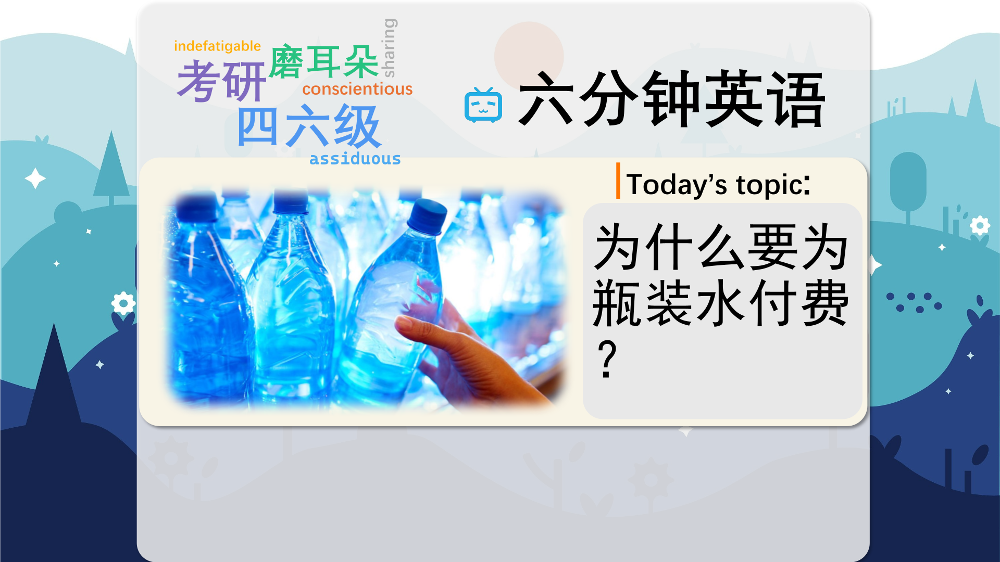

### 【英文脚本】
Rob
Welcome to 6 Minute English, where we introduce a refreshing topic and six related items of vocabulary. I'm Rob.
 
Neil
And I’m Neil. And today we’re talking about water, there’s nothing more refreshing than an ice-cold bottle of water straight out of the vending machine. Ah!
 
Rob
OK. Refreshing in this context means making you feel cool again after being hot. So has that cooled you down, Neil?
 
Neil
Yes, I feel very refreshed now, thanks.
 
Rob
Can I ask you though, why didn’t you just get a glass of water from the kitchen tap? That water is cool and refreshing too, and it’s free!
 
Neil
Well, I like this brand of bottled water better, it’s enriched with salts and minerals that are very beneficial to your health. Enriched means improving the quality of something by adding to it.
 
Rob
Enriched!! Honestly, Neil!
 
Neil
It tastes better, Rob.
 
Rob
Yeah.
 
Neil
And I’m not the only one who thinks so. For the first time in the UK, bottled water is more popular than cola. In fact, can you tell me how many litres of bottled water were sold in the UK in 2016? Was it. a) 2.9 billion litres, b) 29 million litres or c) 2.9 million litres?
 
Rob
Right. Well, I’m going to say 29 million litres.
 
Neil
OK. We’ll find out later if you got that right or wrong. But seriously, Rob, don’t you think it’s a good thing that people are choosing to buy bottled water at the supermarket rather than fizzy drinks?
 
Rob
Yes, of course. But as I said to you earlier, why don’t people just drink tap water? Let’s listen to Natalie Fee, founder of City to Sea, which campaigns against plastic pollution, and of course, bottled water causes a huge amount of that. Here’s Natalie now, talking about how drinks manufacturers have persuaded people that bottled water is better for them.
 
Natalie Fee, founder of City to Sea
They manufactured the demand for bottled water and they spent millions of pounds on adverts sort of scaring us off of tap water. The bottled water companies set out to make us believe that tap water wasn’t healthy. And yet, tap water is way more regulated than bottled water is, and in taste tests, tap water comes up trumps most times.
 
Neil
If you manufacture something you make it in large amounts in a factory. But here Natalie says the drinks companies ‘manufactured the demand for bottled water’.
 
Rob
Which means they made adverts to persuade people that tap water wasn’t healthy, and bottled water was.
 
Neil
Hmm, To scare people off, What does that mean, Rob?
 
Rob
Well, if you scare somebody off you make them go away by frightening them. So some advertisers may have suggested, for example, that tap water was unsafe to drink .
 
Neil
Whereas bottled water was safer, and tasted better too!
 
Rob
You’re catching on! However, Natalie Fee claims that tap water is more regulated than bottled water is.
 
Neil
Regulated means controlled. Natalie also says that in taste tests tap water comes up trumps. What does she mean by that?
 
Rob
Well, a taste test is where you ask people to try several very similar products without knowing which one is which, and then you grade them according to which you like the best. And if something comes up trumps, it means it produces a good result, often unexpectedly.
 
Neil
So tap water comes up trumps, eh?
 
Rob
Yup. Perhaps you should try a taste test now, Neil? It would be interesting to see if your enriched bottled water comes up trumps of not!
 
Neil
I tell you what, let’s leave that until later and hear the answer to today’s quiz question instead.
 
Rob
OK.
 
Neil
I asked you: How many litres of bottled water were sold in the UK in 2016? Was it. a) 2.9 billion litres, b) 29 million litres or c) 2.9 million litres?
 
Rob
Yeah. And I said 29 million litres.
 
Neil
And the answer is. 2.9 billion litres.
 
Rob
Wow!
 
Neil
You can buy many different brands of bottled water with a range of price tags. At the top end, there’s water from a 4,000 year-old Norwegian iceberg.
 
Rob
How much does that cost?
 
Neil
Around £80 a bottle.
 
Rob
As cheap as that? I’ll pop out and get some later. OK let’s review the words we learned today. The first one was ‘refreshing’, which means making you feel cool again after being hot.
 
Neil
“I enjoyed a refreshing cup of tea.”
 
Rob
We British like to say that, don’t we? Though I don’t understand how a hot drink can be refreshing. OK, number two, ‘enriched’, which means improving the quality of something by adding to it. For example, “Did you know that many types of breakfast cereal are enriched with vitamins and minerals, Neil?”
 
Neil
No, I didn’t, Rob. You learn something new every day. Number three is ‘manufacture’, to make something in large amounts in a factory. “This company manufactures wellington boots.”
 
Rob
“I am a wellington boot manufacturer.” That has a nice ring to it. Anyway, when you scare someone off you make them go away by frightening them. “The dog barked fiercely and scared off the two burglars.”
 
Neil
Down, Rob, down! Number five, ‘regulated’, or controlled, for example, “The sale of tobacco is tightly regulated by the government.”
 
Rob
And finally, if something ‘comes up trumps’ it produces a good result, often unexpectedly.
 
Neil
“My lottery ticket came up trumps again! I can’t believe it!”
 
Rob
You’re a lucky man, Neil. OK, it’s time to do that taste test now. If you have an opinion on bottled water or anything else, please tell us about it on our Twitter, Instagram, Facebook, or YouTube pages.
 
Neil
OK. This one definitely tastes better.
 
Rob
And how about this one?
 
Neil
Yeah, definitely.
 
Rob
That’s the tap water, Neil.
 
Neil
No, no, no. I refuse to believe it!
 

### 【中英文双语脚本】
Rob(罗伯)
Welcome to 6 Minute English, where we introduce a refreshing topic and six related items of vocabulary. I'm Rob.
欢迎来到六分钟英语，我们在这里介绍了一个令人耳目一新的话题和六个相关的词汇项目。我是 罗伯。

Neil(尼尔)
And I’m Neil. And today we’re talking about water, there’s nothing more refreshing than an ice-cold bottle of water straight out of the vending machine. Ah!
我是 Neil。今天我们谈论的是水，没有什么比直接从自动售货机里出来的一瓶冰凉的水更令人耳目一新的了。啊！

Rob(罗伯)
OK. Refreshing in this context means making you feel cool again after being hot. So has that cooled you down, Neil?
好的。在这种情况下，刷新意味着让你在热之后再次感到凉爽。那么，这让你冷静下来了吗，Neil？

Neil(尼尔)
Yes, I feel very refreshed now, thanks.
是的，我现在感觉很精神焕发，谢谢。

Rob(罗伯)
Can I ask you though, why didn’t you just get a glass of water from the kitchen tap? That water is cool and refreshing too, and it’s free!
不过，我能问你一下，你为什么不从厨房的水龙头里打一杯水呢？那水也很凉爽，很清爽，而且是免费的！

Neil(尼尔)
Well, I like this brand of bottled water better, it’s enriched with salts and minerals that are very beneficial to your health. Enriched means improving the quality of something by adding to it.
嗯，我更喜欢这个牌子的瓶装水，它富含盐和矿物质，对你的健康非常有益。丰富意味着通过添加来提高某物的质量。

Rob(罗伯)
Enriched!! Honestly, Neil!
丰富！！老实说，尼尔！

Neil(尼尔)
It tastes better, Rob.
味道更好，罗伯。

Rob(罗伯)
Yeah.
是的。

Neil(尼尔)
And I’m not the only one who thinks so. For the first time in the UK, bottled water is more popular than cola. In fact, can you tell me how many litres of bottled water were sold in the UK in 2016? Was it. a) 2.9 billion litres, b) 29 million litres or c) 2.9 million litres?
而且我不是唯一一个这么认为的人。在英国，瓶装水首次比可乐更受欢迎。事实上，您能告诉我 2016 年英国售出了多少升瓶装水吗？是这样。a） 29 亿升，b） 2900 万升还是 c） 290 万升？

Rob(罗伯)
Right. Well, I’m going to say 29 million litres.
好的。嗯，我要说的是 2900 万升。

Neil(尼尔)
OK. We’ll find out later if you got that right or wrong. But seriously, Rob, don’t you think it’s a good thing that people are choosing to buy bottled water at the supermarket rather than fizzy drinks?
还行。我们稍后会知道你是对还是错。但说真的，罗伯，你不觉得人们选择在超市买瓶装水而不是碳酸饮料是一件好事吗？

Rob(罗伯)
Yes, of course. But as I said to you earlier, why don’t people just drink tap water? Let’s listen to Natalie Fee, founder of City to Sea, which campaigns against plastic pollution, and of course, bottled water causes a huge amount of that. Here’s Natalie now, talking about how drinks manufacturers have persuaded people that bottled water is better for them.
是的，当然。但正如我之前对你说的，为什么人们不喝自来水呢？让我们听听 City to Sea 的创始人 Natalie Fee 的话，该组织致力于反对塑料污染，当然，瓶装水造成了大量塑料污染。现在是 Natalie，她谈论饮料制造商如何说服人们瓶装水对他们更好。

Natalie Fee, founder of City to Sea(NatalieFee，CitytoSea创始人)
They manufactured the demand for bottled water and they spent millions of pounds on adverts sort of scaring us off of tap water. The bottled water companies set out to make us believe that tap water wasn’t healthy. And yet, tap water is way more regulated than bottled water is, and in taste tests, tap water comes up trumps most times.
他们制造了对瓶装水的需求，并在广告上花费了数百万英镑，有点吓跑了我们自来水。瓶装水公司开始让我们相信自来水不健康。然而，自来水比瓶装水受到更多的监管，而且在口味测试中，自来水大多数时候都胜过自来水。

Neil(尼尔)
If you manufacture something you make it in large amounts in a factory. But here Natalie says the drinks companies ‘manufactured the demand for bottled water’.
如果你制造一些东西，你就在工厂里大量生产。但 Natalie 说，饮料公司“制造了对瓶装水的需求”。

Rob(罗伯)
Which means they made adverts to persuade people that tap water wasn’t healthy, and bottled water was.
这意味着他们制作广告来说服人们自来水不健康，而瓶装水是。

Neil(尼尔)
Hmm, To scare people off, What does that mean, Rob?
嗯，吓跑人们，这是什么意思，罗伯？

Rob(罗伯)
Well, if you scare somebody off you make them go away by frightening them. So some advertisers may have suggested, for example, that tap water was unsafe to drink .
好吧，如果你吓跑了某人，你就通过吓唬他们来让他们走开。因此，一些广告商可能已经暗示，例如，自来水饮用不安全。

Neil(尼尔)
Whereas bottled water was safer, and tasted better too!
而瓶装水更安全，味道也更好！

Rob(罗伯)
You’re catching on! However, Natalie Fee claims that tap water is more regulated than bottled water is.
你赶上了！然而，娜塔莉·费 （Natalie Fee） 声称，自来水比瓶装水受到更严格的监管。

Neil(尼尔)
Regulated means controlled. Natalie also says that in taste tests tap water comes up trumps. What does she mean by that?
受监管意味着受控。Natalie 还说，在口味测试中，自来水胜过。她这句话是什么意思？

Rob(罗伯)
Well, a taste test is where you ask people to try several very similar products without knowing which one is which, and then you grade them according to which you like the best. And if something comes up trumps, it means it produces a good result, often unexpectedly.
嗯，口味测试是你让人们尝试几种非常相似的产品，但不知道哪一种是哪一种，然后你根据你最喜欢的产品对它们进行分级。如果某件事胜出，那就意味着它产生了一个好的结果，通常是出乎意料的。

Neil(尼尔)
So tap water comes up trumps, eh?
所以自来水胜过一切，嗯？

Rob(罗伯)
Yup. Perhaps you should try a taste test now, Neil? It would be interesting to see if your enriched bottled water comes up trumps of not!
是的。也许你现在应该尝试一下口味测试，尼尔？看看您的浓缩瓶装水是否胜过不喝，这将是一件有趣的事情！

Neil(尼尔)
I tell you what, let’s leave that until later and hear the answer to today’s quiz question instead.
我告诉你什么，让我们把这个问题留到以后再听听今天测验问题的答案。

Rob(罗伯)
OK.
还行。

Neil(尼尔)
I asked you: How many litres of bottled water were sold in the UK in 2016? Was it. a) 2.9 billion litres, b) 29 million litres or c) 2.9 million litres?
我问你：2016 年英国售出了多少升瓶装水？是这样。a） 29 亿升，b） 2900 万升还是 c） 290 万升？

Rob(罗伯)
Yeah. And I said 29 million litres.
是的。我说的是 2900 万升。

Neil(尼尔)
And the answer is. 2.9 billion litres.
答案是。29 亿升。

Rob(罗伯)
Wow!
哇！

Neil(尼尔)
You can buy many different brands of bottled water with a range of price tags. At the top end, there’s water from a 4,000 year-old Norwegian iceberg.
您可以购买许多不同品牌的瓶装水，价格各不相同。在顶端，有来自一座 4,000 年历史的挪威冰山的水。

Rob(罗伯)
How much does that cost?
那要花多少钱？

Neil(尼尔)
Around £80 a bottle.
每瓶约 80 英镑。

Rob(罗伯)
As cheap as that? I’ll pop out and get some later. OK let’s review the words we learned today. The first one was ‘refreshing’, which means making you feel cool again after being hot.
就这么便宜？我稍后会弹出来拿一些。好，让我们回顾一下我们今天学到的单词。第一个是 “refreshing”，意思是让你在热之后再次感到凉爽。

Neil(尼尔)
“I enjoyed a refreshing cup of tea.”
“我喜欢喝一杯清爽的茶。”

Rob(罗伯)
We British like to say that, don’t we? Though I don’t understand how a hot drink can be refreshing. OK, number two, ‘enriched’, which means improving the quality of something by adding to it. For example, “Did you know that many types of breakfast cereal are enriched with vitamins and minerals, Neil?”
我们英国人喜欢这么说，不是吗？虽然我不明白热饮怎么会让人提神。好的，第二点，“丰富”，意思是通过添加来提高某物的质量。例如，“你知道很多类型的早餐麦片都富含维生素和矿物质吗，尼尔？

Neil(尼尔)
No, I didn’t, Rob. You learn something new every day. Number three is ‘manufacture’, to make something in large amounts in a factory. “This company manufactures wellington boots.”
不，我没有，罗伯。您每天都会学到新东西。第三点是“制造”，在工厂中大量生产某物。“这家公司生产惠灵顿靴。”

Rob(罗伯)
“I am a wellington boot manufacturer.” That has a nice ring to it. Anyway, when you scare someone off you make them go away by frightening them. “The dog barked fiercely and scared off the two burglars.”
“我是一家惠灵顿靴制造商。”这很不错。无论如何，当你吓跑某人时，你会通过吓唬他们来让他们走开。“狗吠叫得很猛，吓跑了两个窃贼。”

Neil(尼尔)
Down, Rob, down! Number five, ‘regulated’, or controlled, for example, “The sale of tobacco is tightly regulated by the government.”
倒下，罗伯，倒下！第五个，“受监管”或受控制，例如，“烟草销售受到政府的严格监管。

Rob(罗伯)
And finally, if something ‘comes up trumps’ it produces a good result, often unexpectedly.
最后，如果某件事 “出现胜过”，它就会产生一个好的结果，通常是出乎意料的。

Neil(尼尔)
“My lottery ticket came up trumps again! I can’t believe it!”
“我的彩票又上来了！我简直不敢相信！

Rob(罗伯)
You’re a lucky man, Neil. OK, it’s time to do that taste test now. If you have an opinion on bottled water or anything else, please tell us about it on our Twitter, Instagram, Facebook, or YouTube pages.
你真是个幸运的人，Neil。好了，现在是时候做那个口味测试了。如果您对瓶装水或其他任何事情有任何意见，请在我们的 Twitter、Instagram、Facebook 或 YouTube 页面上告诉我们。

Neil(尼尔)
OK. This one definitely tastes better.
还行。这个肯定更好吃。

Rob(罗伯)
And how about this one?
那么这个怎么样？

Neil(尼尔)
Yeah, definitely.
是的，当然。

Rob(罗伯)
That’s the tap water, Neil.
那是自来水，Neil。

Neil(尼尔)
No, no, no. I refuse to believe it!
不 不 不。我不肯相信！

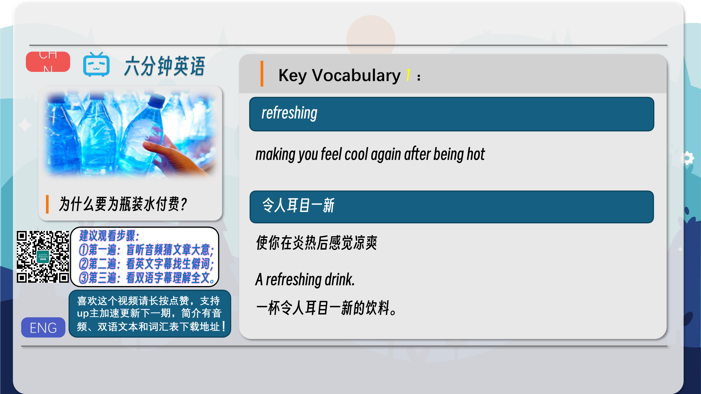
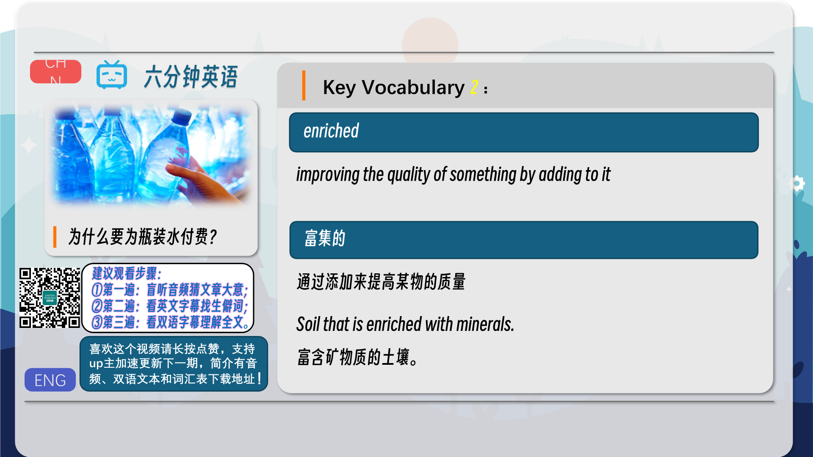
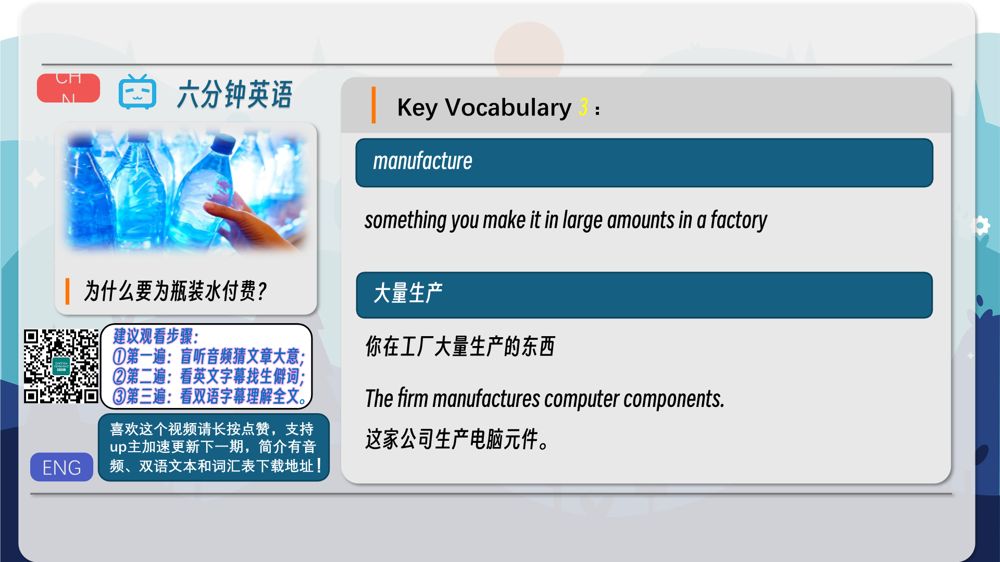

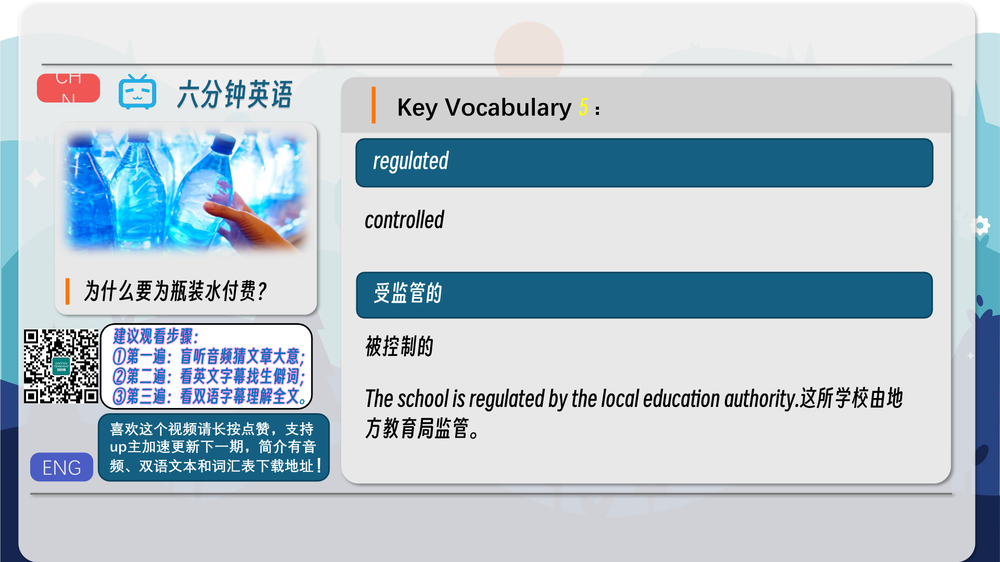
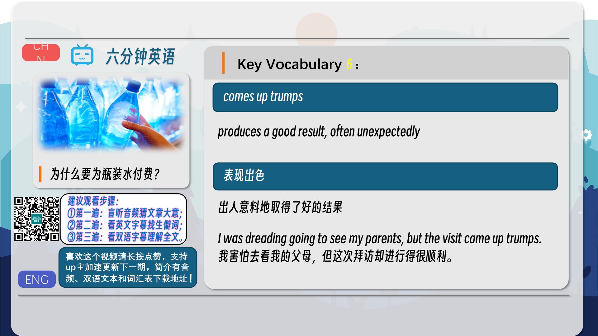
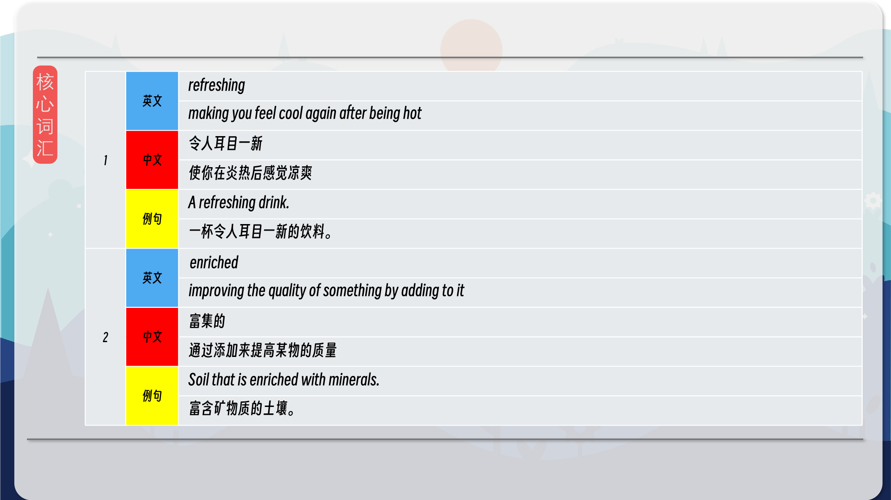
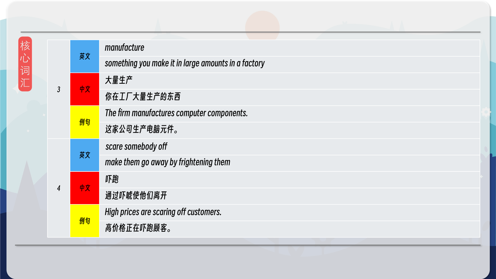
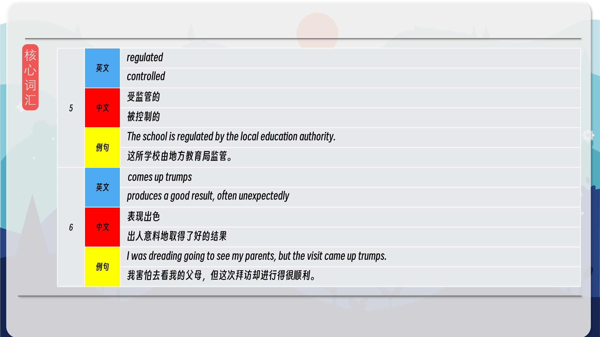
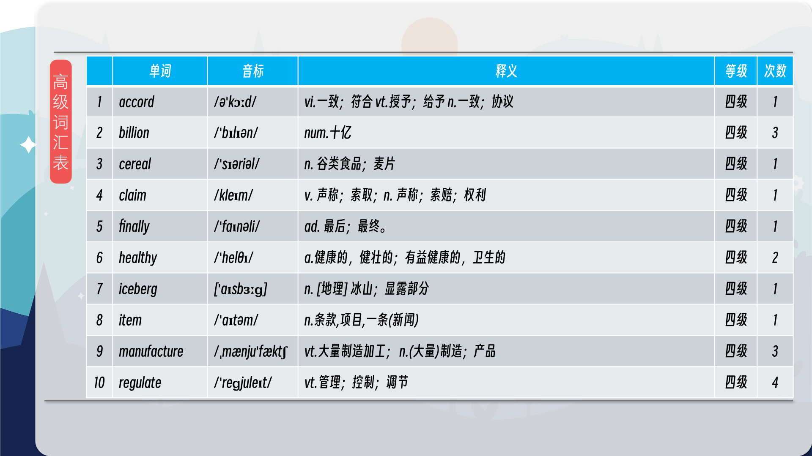
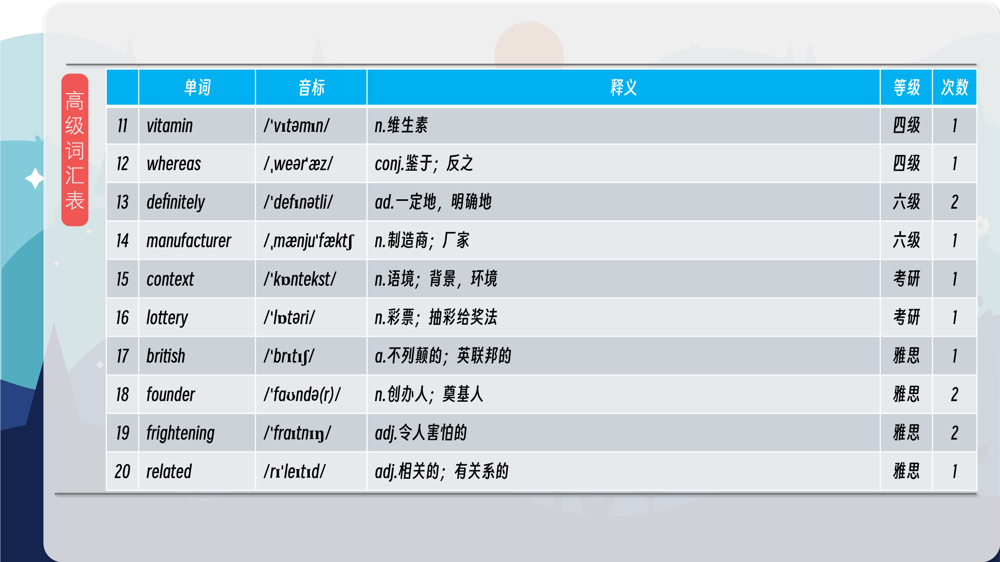
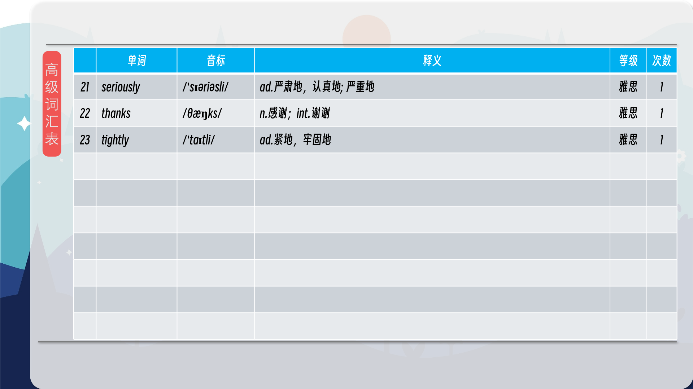
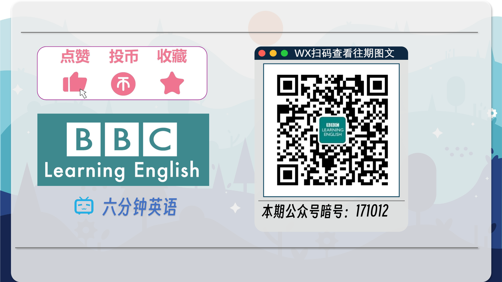

### 【核心词汇】
#### refreshing
making you feel cool again after being hot
令人耳目一新
使你在炎热后感觉凉爽
A refreshing drink.
一杯令人耳目一新的饮料。
#### enriched
improving the quality of something by adding to it
富集的
通过添加来提高某物的质量
Soil that is enriched with minerals.
富含矿物质的土壤。
#### manufacture
something you make it in large amounts in a factory
大量生产
你在工厂大量生产的东西
The firm manufactures computer components.
这家公司生产电脑元件。
#### scare somebody off
make them go away by frightening them
吓跑
通过吓唬使他们离开
High prices are scaring off customers.
高价格正在吓跑顾客。
#### regulated
controlled
受监管的
被控制的
The school is regulated by the local education authority.
这所学校由地方教育局监管。
#### comes up trumps
produces a good result, often unexpectedly
表现出色
出人意料地取得了好的结果
I was dreading going to see my parents, but the visit came up trumps.
我害怕去看我的父母，但这次拜访却进行得很顺利。

在公众号里输入6位数字，获取【对话音频、英文文本、中文翻译、核心词汇和高级词汇表】电子档，6位数字【暗号】在文章的最后一张图片，如【220728】，表示22年7月28日这一期。公众号没有的文章说明还没有制作相关资料。年度合集在B站【六分钟英语】工房获取，每年共计300+文档，感谢支持！