### 【英文脚本】
Rob
Hi, I'm Rob and welcome to 6 Minute English, where we talk about an interesting topic and six items of related vocabulary.
 
Neil
And I’m Neil… And today we’re talking about wetiquette! What’s that, Rob?
 
Rob
I have no idea!
 
Neil
Well, you won’t find wetiquette in many dictionaries, it actually means ‘swimming pool etiquette’. W-etiquette, get it? Etiquette is a set of rules for how to behave in social situations. And wetiquette is a set of dos and don’ts to keep things calm in the water.
 
Rob
Dos and don’ts are also rules telling us how to behave. So things like ‘No running by the pool’ or ‘No diving in the shallow end’. Am I right?
 
Neil
Yes and no, Rob. Those are traditional swimming pool rules. But wetiquette covers slightly different things.
 
Rob
OK, well before we get to those, I have a question for you, Neil. According to the US Water Quality and Health Council, how many people admitted to not showering before using the pool? Is it… a) 7%, b) 17% or c) 70%.
 
Neil
Well, I’m going to be optimistic and say 7%, Rob.
 
Rob
So I take it you do always take a shower before swimming, Neil?
 
Neil
Correct. Taking a quick shower is such an easy thing to do, and it stops all that horrible sweat and bacteria getting in the pool water! I can’t understand why some people don’t do it!
 
Rob
I can see it’s making you quite hot under the collar - and that means angry. Let’s listen to swimming specialist, Jenny Landreth, talking about what annoys her.
 
Jenny Landreth:
I'm very keen on my wetiquette in the pool.
 
Interviewer:
It's that thing where people can get quite cross about, which is: Do you go around clockwise or anticlockwise? Do you overtake or not?
 
Jenny Landreth:
People need a rule. We need to observe the rules of the pool and I'm very keen on that. Most other swimmers will suffer from lane rage if people are in the wrong lane of the pool. And don’t know how to observe the rules of that lane.
 
Interviewer:
Lane rage, you mean if you’re a kind of slow swimmer and you dare to go in the fast lane?
 
Jenny Landreth:
Well, I hate to say it, but it is quite often that gentlemen quite often misjudge their speed and think they’re slightly faster than they are.
 
Interviewer:
Ah! The male ego here!
 
Jenny Landreth:
They quite often don’t like it if there’s a woman swimming faster than them. So very often they’ll go in the slightly faster lane and should be gently encouraged by wetiquette to get in the correct lane.
 
Interviewer:
Know your speed.
 
Jenny Landreth:
Yes.
 
Rob
That was Jenny Landreth, a swimming specialist, talking about the things that annoy her about other people in the pool.
 
Neil
Yes. Jenny doesn't like it when people are slower that they should be for the fast lane. Older men, like you, Rob.
 
Rob
Neil, how dare you! Yes, Jenny gets 'lane rage'.
 
Neil
Lane rage! Where swimmers get hot under the collar when there’s a slow swimmer in the fast lane.
 
Rob
Swimming lanes are the vertical sections of a swimming pool that are often labelled as ‘fast’, ‘medium’, and ‘slow’. Do you know your speed, Neil?
 
Neil
Yes, I’m fast.
 
Rob
Are you sure you are not misjudging your speed? Do you think you might actually be a medium-fast swimmer?
 
Neil
To misjudge means to guess something wrongly. And our ego is the idea we have of ourselves, with regards to how important we feel we are. And to answer your question, Rob, no, I’m definitely fast.
 
Rob
Are there other things swimmers should be aware of in the pool?
 
Neil
Yes, if somebody taps your foot, it means they want to overtake you.
 
Rob
Overtaking means to pass another person travelling in the same direction because you are going faster than them.
 
Neil
I hate it when swimmers overtake me!
 
Rob
Really, Neil? Is that your male ego talking?
 
Neil
No, not at all, I just hate getting splashed.
 
Rob
I see. Well perhaps now is a good time to move on and hear the answer to today’s quiz question. Remember I asked: How many people admitted to not showering before using the pool? Is it… a) 7%, b) 17% or c) 70%?
 
Neil
I said 7% and I hope I’m right.
 
Rob
Well, I’m afraid you’re wrong, Neil. It’s actually ten times that amount, it’s 70%! The 2012 US report from Water Quality and Health Council found that around 70% of people do not shower before taking a swim in the pool, adding to the number of germs in the water.
 
Neil
Perhaps swimming pools should start fining people who don’t take a shower? That might make a difference. Now, let’s go over the words we learned today.
 
Rob
Yes, the first one is ‘dos and don’ts’, which are rules telling us how to behave in a particular situation. For example, “What are the dos and don’ts of meeting the Queen?”
 
Neil
Good question, Is the correct etiquette to call her Your Highness or Ma’am? Are there certain subjects you shouldn’t talk about?
 
Rob
Do you shake her hand or curtsy?
 
Neil
These are things you need to know, or else the Queen might get ‘hot under collar’, that’s our next word, and it means angry!
 
Rob
“Both politicians got hot under the collar and insulted each other.”
 
Neil
OK, number three is ‘lanes’, which are the vertical sections of a swimming pool that are often labelled as ‘fast’, ‘medium’, and ‘slow’.
 
Rob
“Our British Olympic gold medallist is swimming in lane one.”
 
Neil
Our next word is ‘misjudge’ which means to guess something wrongly. For example, “I’m sorry I misjudged you, Rob. Please forgive me.”
 
Rob
Oh alright then, Neil. But don’t misjudge me again OK? Next up is ‘ego’, which is our sense of how important we are.
 
Neil
“Losing the race was a huge blow to her ego.”
 
Rob
And our final word is ‘overtake’, which means to pass another person travelling in the same direction because you are going faster than them.
 
Neil
“I don’t enjoy overtaking big lorries on the motorway.”
 
Rob
Neither do I, Neil. Now one of the don’ts of this show is not talking for more than six minutes. So it’s time to say goodbye!
 
Neil
But please visit our Twitter, Facebook and YouTube pages and tell us what makes you hot under the collar!
 
Rob
And remember, you can explore our website: bbclearningenglish.com, where you'll find guides to grammar, exercises, videos and articles to read and improve your English. Bye bye!
 
Neil
Goodbye!
 

### 【中英文双语脚本】
Rob(罗伯)
Hi, I'm Rob and welcome to 6 Minute English, where we talk about an interesting topic and six items of related vocabulary.
嗨，我是 罗伯，欢迎来到六分钟英语，我们在这里讨论一个有趣的话题和六个相关词汇。

Neil(尼尔)
And I’m Neil… And today we’re talking about wetiquette! What’s that, Rob?
我是 Neil......今天我们来谈谈礼仪！那是什么，罗伯？

Rob(罗伯)
I have no idea!
我不知道！

Neil(尼尔)
Well, you won’t find wetiquette in many dictionaries, it actually means ‘swimming pool etiquette’. W-etiquette, get it? Etiquette is a set of rules for how to behave in social situations. And wetiquette is a set of dos and don’ts to keep things calm in the water.
嗯，你不会在很多词典中找到 wetiquette，它实际上是 “游泳池礼仪 ”的意思。W 礼仪，明白吗？礼仪是一套关于在社交场合如何表现的规则。Wetiquette 是一系列注意事项，以保持水中平静。

Rob(罗伯)
Dos and don’ts are also rules telling us how to behave. So things like ‘No running by the pool’ or ‘No diving in the shallow end’. Am I right?
该做什么和不该做什么也是告诉我们如何表现的规则。比如'禁止在泳池边跑步'或'禁止在浅水区潜水'。我说得对吗？

Neil(尼尔)
Yes and no, Rob. Those are traditional swimming pool rules. But wetiquette covers slightly different things.
是的，也不是，罗伯。这些是传统的游泳池规则。但 wetiquett 涵盖的内容略有不同。

Rob(罗伯)
OK, well before we get to those, I have a question for you, Neil. According to the US Water Quality and Health Council, how many people admitted to not showering before using the pool? Is it… a) 7%, b) 17% or c) 70%.
好的，在我们开始之前，我有一个问题要问你，Neil。根据美国水质与健康委员会的数据，有多少人承认在使用游泳池之前没有淋浴？是吗。。。a） 7%，b） 17% 或 c） 70%。

Neil(尼尔)
Well, I’m going to be optimistic and say 7%, Rob.
好吧，我要乐观地说 7%，罗伯。

Rob(罗伯)
So I take it you do always take a shower before swimming, Neil?
所以我认为你总是在游泳前洗个澡，尼尔？

Neil(尼尔)
Correct. Taking a quick shower is such an easy thing to do, and it stops all that horrible sweat and bacteria getting in the pool water! I can’t understand why some people don’t do it!
正确。快速淋浴是一件很容易的事情，它可以阻止所有可怕的汗水和细菌进入泳池水！我不明白为什么有些人不这样做！

Rob(罗伯)
I can see it’s making you quite hot under the collar - and that means angry. Let’s listen to swimming specialist, Jenny Landreth, talking about what annoys her.
我看得出来，你的衣领下面很热 —— 这意味着生气。让我们听听游泳专家 Jenny Landreth 谈论让她烦恼的原因。

Jenny Landreth:(珍妮·兰德雷斯：)
I'm very keen on my wetiquette in the pool.
我非常热衷于在游泳池里的礼仪。

Interviewer:(访问者：)
It's that thing where people can get quite cross about, which is: Do you go around clockwise or anticlockwise? Do you overtake or not?
这是人们可以非常困惑的地方，那就是：你是顺时针还是逆时针？你超车还是不超车？

Jenny Landreth:(珍妮·兰德雷斯：)
People need a rule. We need to observe the rules of the pool and I'm very keen on that. Most other swimmers will suffer from lane rage if people are in the wrong lane of the pool. And don’t know how to observe the rules of that lane.
人们需要一个规则。我们需要遵守泳池规则，我非常热衷于这一点。如果人们在游泳池的错误车道上，大多数其他游泳者都会遭受泳道愤怒症。并且不知道如何遵守那条车道的规则。

Interviewer:(访问者：)
Lane rage, you mean if you’re a kind of slow swimmer and you dare to go in the fast lane?
Lane rage，你的意思是如果你是一个慢速游泳者，你敢于进入快车道？

Jenny Landreth:(珍妮·兰德雷斯：)
Well, I hate to say it, but it is quite often that gentlemen quite often misjudge their speed and think they’re slightly faster than they are.
好吧，我不想这么说，但很多时候，绅士们经常误判他们的速度，认为他们比实际速度略快。

Interviewer:(访问者：)
Ah! The male ego here!
啊！这里的男性自我！

Jenny Landreth:(珍妮·兰德雷斯：)
They quite often don’t like it if there’s a woman swimming faster than them. So very often they’ll go in the slightly faster lane and should be gently encouraged by wetiquette to get in the correct lane.
他们通常不喜欢有女人游得比他们快。所以很多时候他们会走稍微快一点的车道，应该通过礼仪轻轻地鼓励他们进入正确的车道。

Interviewer:(访问者：)
Know your speed.
了解您的速度。

Jenny Landreth:(珍妮·兰德雷斯：)
Yes.
是的。

Rob(罗伯)
That was Jenny Landreth, a swimming specialist, talking about the things that annoy her about other people in the pool.
那是游泳专家珍妮·兰德雷斯 （Jenny Landreth） 谈论让她对游泳池里其他人感到恼火的事情。

Neil(尼尔)
Yes. Jenny doesn't like it when people are slower that they should be for the fast lane. Older men, like you, Rob.
是的。Jenny 不喜欢人们慢得比他们应该走快车道的慢。像你这样的年长男人，罗伯。

Rob(罗伯)
Neil, how dare you! Yes, Jenny gets 'lane rage'.
尼尔，你怎么敢！是的，Jenny 得了“车道怒症”。

Neil(尼尔)
Lane rage! Where swimmers get hot under the collar when there’s a slow swimmer in the fast lane.
车道愤怒！当快车道上有慢速游泳者时，游泳者的衣领下会很热。

Rob(罗伯)
Swimming lanes are the vertical sections of a swimming pool that are often labelled as ‘fast’, ‘medium’, and ‘slow’. Do you know your speed, Neil?
泳道是游泳池的垂直部分，通常被标记为“快速”、“中等”和“慢速”。你知道你的速度吗，尼尔？

Neil(尼尔)
Yes, I’m fast.
是的，我很快。

Rob(罗伯)
Are you sure you are not misjudging your speed? Do you think you might actually be a medium-fast swimmer?
您确定您没有误判自己的速度吗？您认为您真的可能是一名中速游泳运动员吗？

Neil(尼尔)
To misjudge means to guess something wrongly. And our ego is the idea we have of ourselves, with regards to how important we feel we are. And to answer your question, Rob, no, I’m definitely fast.
To misjudge 的意思是猜错了某事。而我们的自我就是我们对自己的想法，关于我们觉得自己有多重要。为了回答你的问题，罗伯，不，我肯定很快。

Rob(罗伯)
Are there other things swimmers should be aware of in the pool?
游泳者在游泳池中还应该注意其他事项吗？

Neil(尼尔)
Yes, if somebody taps your foot, it means they want to overtake you.
是的，如果有人轻拍你的脚，那就意味着他们想超过你。

Rob(罗伯)
Overtaking means to pass another person travelling in the same direction because you are going faster than them.
超车的意思是超过另一个朝同一方向行驶的人，因为你比他们走得更快。

Neil(尼尔)
I hate it when swimmers overtake me!
我讨厌游泳者超过我！

Rob(罗伯)
Really, Neil? Is that your male ego talking?
真的吗，尼尔？那是你的男性自我在说话吗？

Neil(尼尔)
No, not at all, I just hate getting splashed.
不，一点也不，我只是讨厌被溅到。

Rob(罗伯)
I see. Well perhaps now is a good time to move on and hear the answer to today’s quiz question. Remember I asked: How many people admitted to not showering before using the pool? Is it… a) 7%, b) 17% or c) 70%?
明白了。好吧，也许现在是继续前进并聆听今天测验问题的答案的好时机。记得我问过：有多少人承认在使用游泳池之前没有洗澡？是吗。。。a） 7%， b） 17% 还是 c） 70%？

Neil(尼尔)
I said 7% and I hope I’m right.
我说 7%，我希望我是对的。

Rob(罗伯)
Well, I’m afraid you’re wrong, Neil. It’s actually ten times that amount, it’s 70%! The 2012 US report from Water Quality and Health Council found that around 70% of people do not shower before taking a swim in the pool, adding to the number of germs in the water.
嗯，恐怕你错了，尼尔。实际上是这个数字的十倍，是 70%！水质与健康委员会 2012 年美国报告发现，大约 70% 的人在游泳池游泳前不淋浴，这增加了水中的细菌数量。

Neil(尼尔)
Perhaps swimming pools should start fining people who don’t take a shower? That might make a difference. Now, let’s go over the words we learned today.
也许游泳池应该开始对不洗澡的人处以罚款？这可能会有所作为。现在，让我们回顾一下我们今天学到的单词。

Rob(罗伯)
Yes, the first one is ‘dos and don’ts’, which are rules telling us how to behave in a particular situation. For example, “What are the dos and don’ts of meeting the Queen?”
是的，第一个是“该做和不该做”，这是告诉我们在特定情况下如何表现的规则。例如，“与女王见面的注意事项是什么？

Neil(尼尔)
Good question, Is the correct etiquette to call her Your Highness or Ma’am? Are there certain subjects you shouldn’t talk about?
好问题，称她为殿下或马是正确的礼仪吗？有没有你不应该谈论的某些话题？

Rob(罗伯)
Do you shake her hand or curtsy?
你是握手还是行屈膝礼？

Neil(尼尔)
These are things you need to know, or else the Queen might get ‘hot under collar’, that’s our next word, and it means angry!
这些是你需要知道的事情，否则女王可能会变得 “衣领下很热”，这是我们的下一个词，意思是生气！

Rob(罗伯)
“Both politicians got hot under the collar and insulted each other.”
“两位政客都发火了，互相侮辱。”

Neil(尼尔)
OK, number three is ‘lanes’, which are the vertical sections of a swimming pool that are often labelled as ‘fast’, ‘medium’, and ‘slow’.
好的，第三个是“泳道”，这是游泳池的垂直部分，通常被标记为“快”、“中”和“慢”。

Rob(罗伯)
“Our British Olympic gold medallist is swimming in lane one.”
“我们的英国奥运金牌得主在第一泳道游泳。”

Neil(尼尔)
Our next word is ‘misjudge’ which means to guess something wrongly. For example, “I’m sorry I misjudged you, Rob. Please forgive me.”
我们的下一个词是 'misjudge'，意思是猜错了。例如，“很抱歉我误判了你，罗伯。请原谅我。

Rob(罗伯)
Oh alright then, Neil. But don’t misjudge me again OK? Next up is ‘ego’, which is our sense of how important we are.
哦，好吧，尼尔。但不要再误判我了，好吗？接下来是“自我”，即我们对自己有多重要的看法。

Neil(尼尔)
“Losing the race was a huge blow to her ego.”
“输掉比赛对她的自尊心是一个巨大的打击。”

Rob(罗伯)
And our final word is ‘overtake’, which means to pass another person travelling in the same direction because you are going faster than them.
我们的最后一个词是 “overover”，意思是超过另一个朝同一方向行驶的人，因为你比他们走得更快。

Neil(尼尔)
“I don’t enjoy overtaking big lorries on the motorway.”
“我不喜欢在高速公路上超车。”

Rob(罗伯)
Neither do I, Neil. Now one of the don’ts of this show is not talking for more than six minutes. So it’s time to say goodbye!
我也没有，尼尔。现在这个节目的禁忌之一是说话时间不超过六分钟。所以，是时候说再见了！

Neil(尼尔)
But please visit our Twitter, Facebook and YouTube pages and tell us what makes you hot under the collar!
但请访问我们的 Twitter、Facebook 和 YouTube 页面，告诉我们是什么让您在衣领下炙手可热！

Rob(罗伯)
And remember, you can explore our website: bbclearningenglish.com, where you'll find guides to grammar, exercises, videos and articles to read and improve your English. Bye bye!
请记住，您可以浏览我们的网站：bbclearningenglish.com，在那里您可以找到语法指南、练习、视频和文章，以阅读和提高您的英语水平。再见！

Neil(尼尔)
Goodbye!
再见！

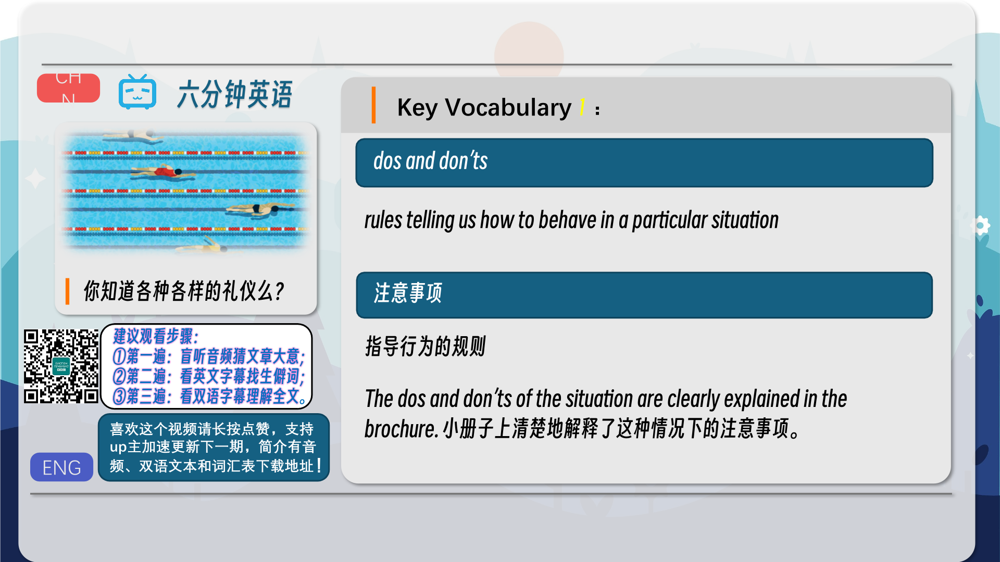
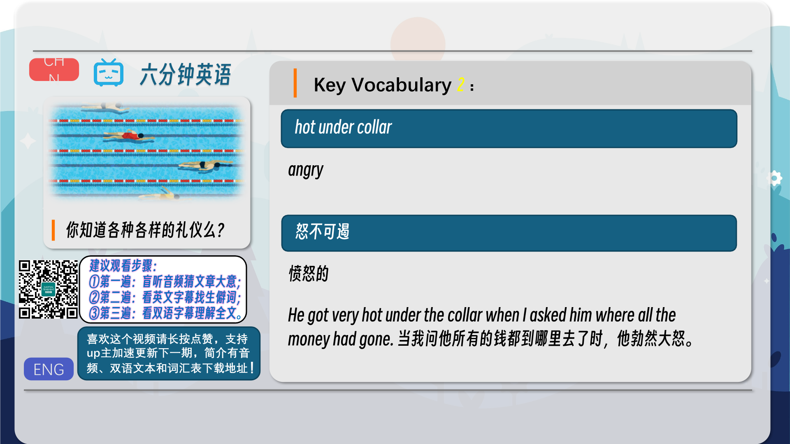
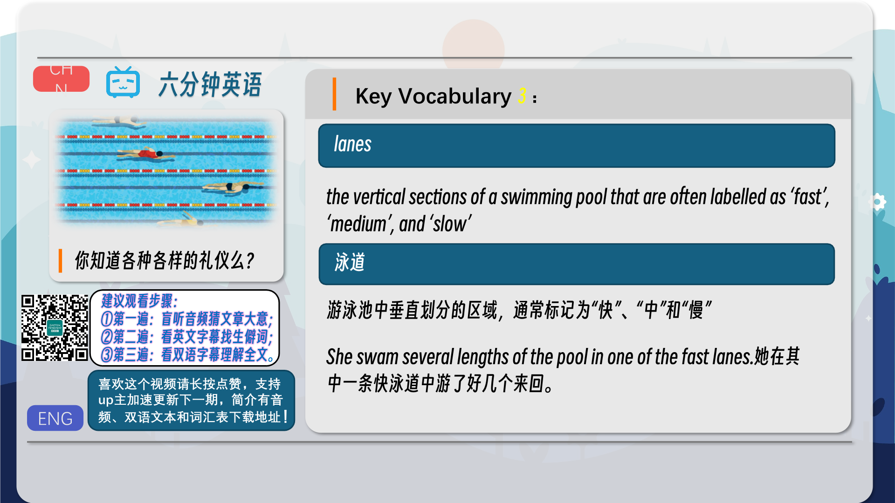
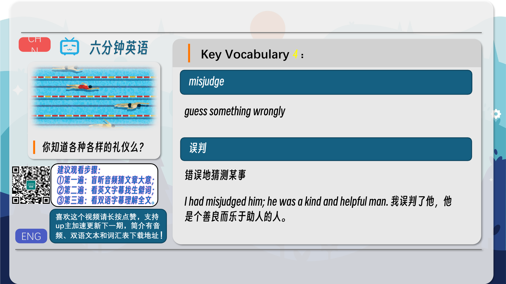
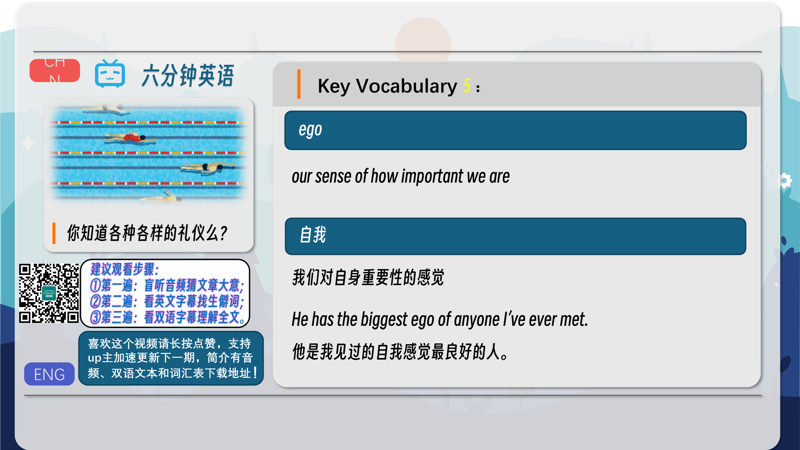
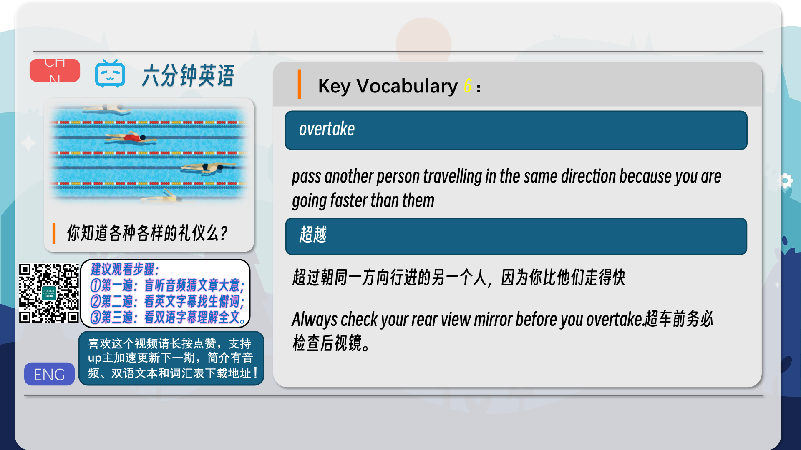
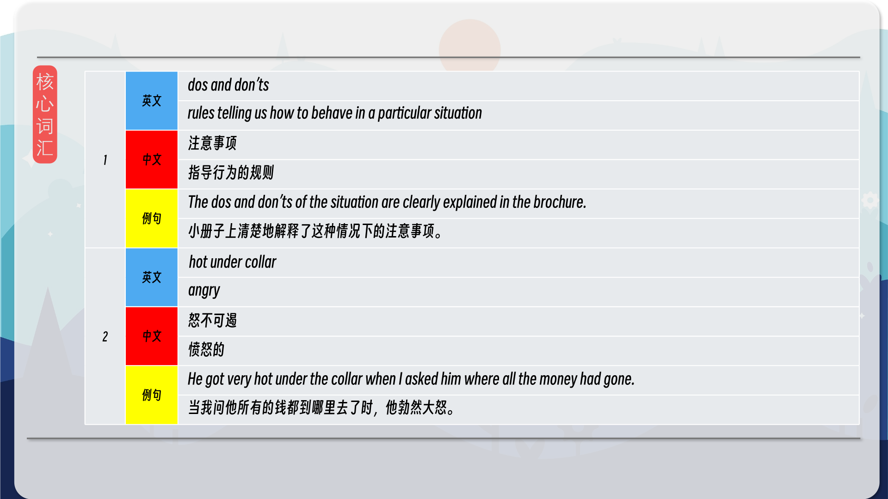
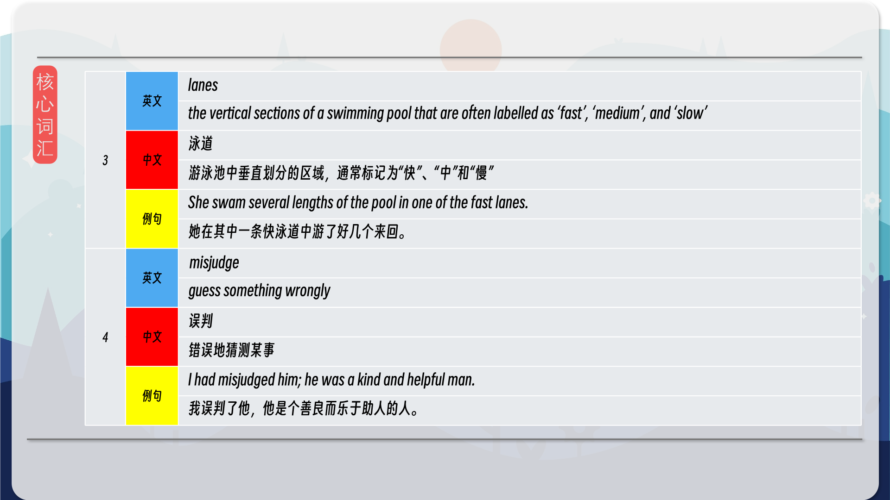
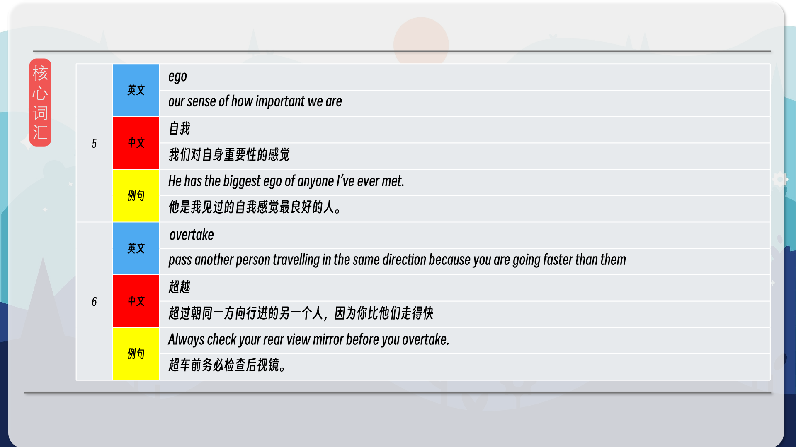
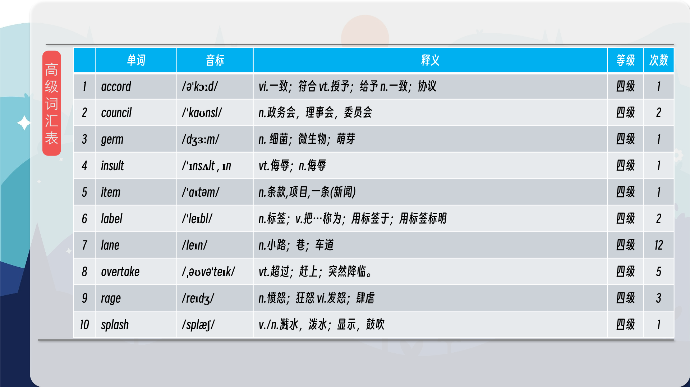
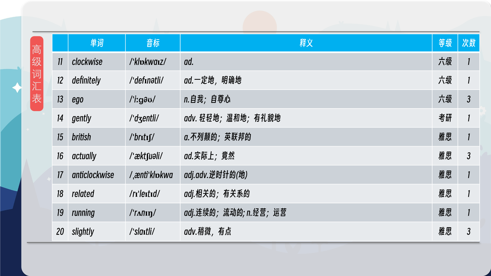
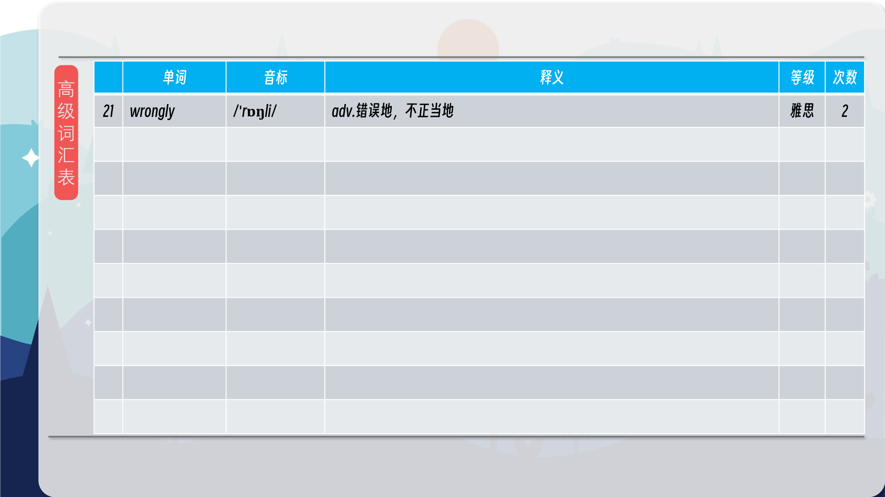

### 【核心词汇】
#### dos and don’ts
rules telling us how to behave in a particular situation
注意事项
指导行为的规则
The dos and don’ts of the situation are clearly explained in the brochure.
小册子上清楚地解释了这种情况下的注意事项。
#### hot under collar
angry
怒不可遏
愤怒的
He got very hot under the collar when I asked him where all the money had gone.
当我问他所有的钱都到哪里去了时，他勃然大怒。
#### lanes
the vertical sections of a swimming pool that are often labelled as ‘fast’, ‘medium’, and ‘slow’
泳道
游泳池中垂直划分的区域，通常标记为“快”、“中”和“慢”
She swam several lengths of the pool in one of the fast lanes.
她在其中一条快泳道中游了好几个来回。
#### misjudge
guess something wrongly
误判
错误地猜测某事
I had misjudged him; he was a kind and helpful man.
我误判了他，他是个善良而乐于助人的人。
#### ego
our sense of how important we are
自我
我们对自身重要性的感觉
He has the biggest ego of anyone I’ve ever met.
他是我见过的自我感觉最良好的人。
#### overtake
pass another person travelling in the same direction because you are going faster than them
超越
超过朝同一方向行进的另一个人，因为你比他们走得快
Always check your rear view mirror before you overtake.
超车前务必检查后视镜。

在公众号里输入6位数字，获取【对话音频、英文文本、中文翻译、核心词汇和高级词汇表】电子档，6位数字【暗号】在文章的最后一张图片，如【220728】，表示22年7月28日这一期。公众号没有的文章说明还没有制作相关资料。年度合集在B站【六分钟英语】工房获取，每年共计300+文档，感谢支持！