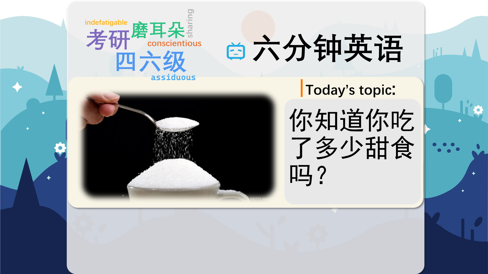

### 【英文脚本】
Rob
I’m Rob. Welcome to 6 Minute English, we’ve got a sweet topic today, and six tempting items of vocabulary.
 
Neil
Hello, I’m Neil. And we’re going to be talking about sugar, which many of us find tempting. But how much is too much, Rob?
 
Rob
I don’t know, Neil, but hopefully we’ll be finding that out. I must admit though, I have a sweet tooth, and that means I like sugary things!
 
Neil
Me too. But something I’m always seeing in the news these days is that we’re eating too much sugar. And one important factor is that sugars are sometimes hidden in processed foods.
 
Rob
Processed food is any food that has been changed in some way, by freezing it or putting it in tins, or by combining foods or adding chemicals. In fact, some of the sugars we eat are hidden in food that we think of as healthy. Such as yoghurts, low fat snacks, and fruit drinks.
 
Neil
Do you check the information on the back of food packets, Rob?, To see what’s in them?
 
Rob
Yes, I do. But it can be very confusing, there’s so much information. And I’m not always sure how much of a certain thing is bad.
 
Neil
Well, that brings me onto today’s quiz question. Can you tell me, if a food contains 5% total sugars per 100g, is it… a) high in sugar, b) low in sugar or c) somewhere in the middle?
 
Rob
I’ll say low, Neil.
 
Neil
OK. Well, we'll find out later. Some food products have colour coding on the packaging to help you understand the information, don’t they?, red for high levels of sugar, salt or fat– orange for medium, and green for low.
 
Rob
That sounds helpful. Then you can see at a glance what’s good or bad for you.
 
Neil
At a glance means with a quick look. OK, let’s listen now to BBC reporter Rajeev Gupta interviewing a man in Chester, in the UK. He’s asking him to guess how much sugar there is in a pot of fat-free yoghurt.
 
Reporter:
I've actually got a pot of yoghurt in front of me. This says 'fat-free' on it and it's been marketed as being quite healthy. If I was to say how much sugar is in here, what would you say as… say is the quantity of the tub?
 
Interviewee:
I’d probably think maybe a couple of teaspoonfuls, you know, it’s quite surprising how much is sugars in all these products, isn’t there?
 
Reporter:
Well, there’s about a third of this yoghurt pot is actually sugar.
 
Interviewee:
To be honest, that’s quite amazing, that. I would never have thought a third of that would have been sugar just by looking at it. And it does say it’s fat-free.
 
Neil
So the yoghurt is fat-free, which means it doesn’t contain any fat. And the man guessed there might be two teaspoons of sugar in the yoghurt.
 
Rob
That’s right. And if something is sugar-free then it doesn’t contain any sugar. But in this case, a third of the yoghurt’s content was sugar. That, to me, sounds like an awful lot, even for someone with a sweet tooth like me!
 
Neil
OK, well, let’s listen to Dr Gunter Kuhnle. He’s a Nutritional Biochemist at Reading University.
 
Dr Gunter Kuhnle, nutritional biochemist at Reading University, UK
One problem we see, nutritionists, is sort of this focusing on any individual foods, at one time it was that fat has to be avoided at all costs, now it seems to go towards sugar and sugar is demonised and people link it to drugs and so on. I think this is the wrong way forward. Individuals, yes, you should have a balanced diet. It is important also to enjoy your food and not do this extreme focusing on one side or one aspect and individual nutrients.
 
Rob
So if you avoid something at all costs you do everything you can to avoid it. And demonise means to make someone or something seem very bad.
 
Neil
Dr Kuhnle thinks that totally cutting out one type of food like this, whether it’s fat or sugar, is wrong. He thinks we should eat a balanced diet, and enjoy our food.
 
Rob
That sounds very sensible. Now, how about telling us the answer to today’s quiz question, Neil?
 
Neil
Thanks for reminding me, Rob. I asked: if food contains 5% total sugars per 100g, is it… a) high in sugar, b) low in sugar or c) somewhere in the middle? You said low… and you were… right! Well done!
 
Rob
Thank you.
 
Neil
If foods contain more than 22.5% total sugars per 100g they are classified as high.
 
Rob
And I guess that between 5 and 22.5% they are somewhere in the middle.
 
Neil
Correct! OK, shall we go over the words we heard today?
 
Rob
Yep. First up, if you have a ‘sweet tooth’ it means you like sugary things. For example, ‘My little nephew has a sweet tooth. He eats far too many biscuits and sweets.’
 
Neil
His dentist won’t be pleased! Number two, ‘processed food’ is any food that has been
 
changed in some way, by freezing it or putting it in tins, or by combining foods or adding
chemicals.
 
Rob
For example, ‘The meat in sausages is highly processed.’
 
Neil
Oh dear, I didn’t know that. I’m a big fan of sausages!
 
Rob
Number three, ‘at a glance’, means with a quick look.
 
Neil
For example, ‘I could tell at a glance that I wouldn’t like the food at that restaurant.’
 
Rob
‘Fat-free’ means without any fat in it. For example, ‘I bought this yoghurt because it says fat- free on the label.’
 
Neil
Aha, but did you realise that a third of it was sugar! Moving on, If you avoid something ‘at all costs’ you do everything you can to avoid it. For example, ‘I wanted to win the game at all costs.’
 
Rob
I didn’t know you were so competitive, Neil! And finally, ‘demonise’, means to make someone or something seem very bad.
 
Neil
‘Politicians shouldn’t demonise their opponents.’
 
Rob
They often do though, don’t they? OK. Well, that’s all we have time for on today’s show. But please check out our Instagram, Twitter, Facebook and YouTube pages.
 
Neil
Join us again soon! Meanwhile, visit our website: bbclearningenglish.com, where you'll find guides to grammar, exercises, videos and articles to read and improve your English. Goodbye!
 
Rob
Bye!
 

### 【中英文双语脚本】
Rob(罗伯)
I’m Rob. Welcome to 6 Minute English, we’ve got a sweet topic today, and six tempting items of vocabulary.
我是 罗伯。欢迎来到六分钟英语，我们今天有一个甜蜜的话题，以及六个诱人的词汇。

Neil(尼尔)
Hello, I’m Neil. And we’re going to be talking about sugar, which many of us find tempting. But how much is too much, Rob?
大家好，我是 Neil。我们将讨论糖，我们中的许多人都觉得它很诱人。但是多少才算太多呢，罗伯？

Rob(罗伯)
I don’t know, Neil, but hopefully we’ll be finding that out. I must admit though, I have a sweet tooth, and that means I like sugary things!
我不知道，Neil，但希望我们能找出来。不过我必须承认，我爱吃甜食，这意味着我喜欢含糖的东西！

Neil(尼尔)
Me too. But something I’m always seeing in the news these days is that we’re eating too much sugar. And one important factor is that sugars are sometimes hidden in processed foods.
我也是。但这些天我总是在新闻中看到的一点是，我们吃了太多的糖。一个重要因素是糖有时隐藏在加工食品中。

Rob(罗伯)
Processed food is any food that has been changed in some way, by freezing it or putting it in tins, or by combining foods or adding chemicals. In fact, some of the sugars we eat are hidden in food that we think of as healthy. Such as yoghurts, low fat snacks, and fruit drinks.
加工食品是指通过冷冻或放入罐头、混合食物或添加化学品而以某种方式改变的任何食物。事实上，我们吃的一些糖分隐藏在我们认为健康的食物中。如酸奶、低脂零食和果汁饮料。

Neil(尼尔)
Do you check the information on the back of food packets, Rob?, To see what’s in them?
你检查食品包背面的信息吗，罗伯？，看看里面有什么？

Rob(罗伯)
Yes, I do. But it can be very confusing, there’s so much information. And I’m not always sure how much of a certain thing is bad.
是的，我愿意。但这可能非常令人困惑，因为信息太多了。而且我并不总是确定某件事有多少是坏的。

Neil(尼尔)
Well, that brings me onto today’s quiz question. Can you tell me, if a food contains 5% total sugars per 100g, is it… a) high in sugar, b) low in sugar or c) somewhere in the middle?
好吧，这让我进入了今天的测验问题。你能告诉我，如果一种食物每 5 克含有 100% 的总糖，是不是......a） 高糖，b） 低糖或 c） 介于两者之间？

Rob(罗伯)
I’ll say low, Neil.
我说低，尼尔。

Neil(尼尔)
OK. Well, we'll find out later. Some food products have colour coding on the packaging to help you understand the information, don’t they?, red for high levels of sugar, salt or fat– orange for medium, and green for low.
还行。好吧，我们稍后会知道。一些食品的包装上有颜色编码，以帮助您理解信息，不是吗？红色表示糖、盐或脂肪含量高 —— 橙色表示中等，绿色表示低。

Rob(罗伯)
That sounds helpful. Then you can see at a glance what’s good or bad for you.
这听起来很有帮助。然后，您可以一目了然地看到什么对您有利或有害。

Neil(尼尔)
At a glance means with a quick look. OK, let’s listen now to BBC reporter Rajeev Gupta interviewing a man in Chester, in the UK. He’s asking him to guess how much sugar there is in a pot of fat-free yoghurt.
一目了然意味着快速浏览。好，现在让我们听听 BBC 记者 Rajeev Gupta 在英国切斯特采访一名男子。他让他猜猜一罐无脂酸奶里有多少糖。

Reporter:(记者：)
I've actually got a pot of yoghurt in front of me. This says 'fat-free' on it and it's been marketed as being quite healthy. If I was to say how much sugar is in here, what would you say as… say is the quantity of the tub?
实际上，我面前有一罐酸奶。上面写着“无脂肪”，它被宣传为非常健康。如果我要说这里有多少糖，你会怎么说......比如说浴缸的数量是多少？

Interviewee:(应聘者：)
I’d probably think maybe a couple of teaspoonfuls, you know, it’s quite surprising how much is sugars in all these products, isn’t there?
我可能会想也许是几茶匙，你知道，所有这些产品中的糖含量都令人惊讶，不是吗？

Reporter:(记者：)
Well, there’s about a third of this yoghurt pot is actually sugar.
嗯，这个酸奶罐里大约有三分之一实际上是糖。

Interviewee:(应聘者：)
To be honest, that’s quite amazing, that. I would never have thought a third of that would have been sugar just by looking at it. And it does say it’s fat-free.
老实说，这真是太神奇了。我从来没有想过其中的三分之一会是糖。它确实说它是无脂肪的。

Neil(尼尔)
So the yoghurt is fat-free, which means it doesn’t contain any fat. And the man guessed there might be two teaspoons of sugar in the yoghurt.
所以酸奶不含脂肪，这意味着它不含任何脂肪。那个人猜酸奶里可能有两茶匙的糖。

Rob(罗伯)
That’s right. And if something is sugar-free then it doesn’t contain any sugar. But in this case, a third of the yoghurt’s content was sugar. That, to me, sounds like an awful lot, even for someone with a sweet tooth like me!
没错。如果某样东西不含糖，那么它就不含任何糖。但在这种情况下，酸奶中三分之一的成分是糖。对我来说，这听起来很可怕，即使对于像我这样爱吃甜食的人来说也是如此！

Neil(尼尔)
OK, well, let’s listen to Dr Gunter Kuhnle. He’s a Nutritional Biochemist at Reading University.
好，好，让我们听听 Gunter Kuhnle 博士的演讲。他是雷丁大学的营养生物化学家。

Dr Gunter Kuhnle, nutritional biochemist at Reading University, UK(GunterKuhnle博士，英国雷丁大学营养生物化学家)
One problem we see, nutritionists, is sort of this focusing on any individual foods, at one time it was that fat has to be avoided at all costs, now it seems to go towards sugar and sugar is demonised and people link it to drugs and so on. I think this is the wrong way forward. Individuals, yes, you should have a balanced diet. It is important also to enjoy your food and not do this extreme focusing on one side or one aspect and individual nutrients.
营养学家看到的一个问题是，这种关注任何单独的食物，曾经是必须不惜一切代价避免脂肪，现在它似乎转向了糖，糖被妖魔化了，人们将其与药物等联系起来。我认为这是错误的前进方向。个人，是的，你应该有均衡的饮食。享受你的食物也很重要，不要做这种极端的事情，只关注一侧或一个方面以及个别营养物质。

Rob(罗伯)
So if you avoid something at all costs you do everything you can to avoid it. And demonise means to make someone or something seem very bad.
因此，如果你不惜一切代价避免某件事，你就会尽一切可能避免它。而 demonise 的意思是让某人或某事看起来非常糟糕。

Neil(尼尔)
Dr Kuhnle thinks that totally cutting out one type of food like this, whether it’s fat or sugar, is wrong. He thinks we should eat a balanced diet, and enjoy our food.
Kuhnle 博士认为，完全戒掉这样的一种食物，无论是脂肪还是糖，都是错误的。他认为我们应该均衡饮食，享受我们的食物。

Rob(罗伯)
That sounds very sensible. Now, how about telling us the answer to today’s quiz question, Neil?
这听起来很合理。现在，告诉我们今天测验问题的答案怎么样，Neil？

Neil(尼尔)
Thanks for reminding me, Rob. I asked: if food contains 5% total sugars per 100g, is it… a) high in sugar, b) low in sugar or c) somewhere in the middle? You said low… and you were… right! Well done!
谢谢你提醒我，罗伯。我问：如果食物每 5 克含有 100% 的总糖，是不是......a） 高糖，b） 低糖或 c） 介于两者之间？你说的低......而你是......右！干的好！

Rob(罗伯)
Thank you.
谢谢。

Neil(尼尔)
If foods contain more than 22.5% total sugars per 100g they are classified as high.
如果每 22.5 克食物的总糖含量超过 100%，则被归类为高糖。

Rob(罗伯)
And I guess that between 5 and 22.5% they are somewhere in the middle.
我猜在 5% 到 22.5% 之间，他们介于两者之间。

Neil(尼尔)
Correct! OK, shall we go over the words we heard today?
正确！好，我们来回顾一下我们今天听到的词吗？

Rob(罗伯)
Yep. First up, if you have a ‘sweet tooth’ it means you like sugary things. For example, ‘My little nephew has a sweet tooth. He eats far too many biscuits and sweets.’
是的。首先，如果你“爱吃甜食”，这意味着你喜欢含糖的东西。例如，'我的小侄子爱吃甜食。他吃了太多的饼干和糖果。

Neil(尼尔)
His dentist won’t be pleased! Number two, ‘processed food’ is any food that has been
他的牙医不会高兴的！第二，“加工食品”是指任何已经

changed in some way, by freezing it or putting it in tins, or by combining foods or adding(以某种方式改变，通过冷冻或放入罐头，或通过混合食物或添加)
chemicals.
化学药品。

Rob(罗伯)
For example, ‘The meat in sausages is highly processed.’
例如，'香肠中的肉是高度加工的。

Neil(尼尔)
Oh dear, I didn’t know that. I’m a big fan of sausages!
哦，天哪，我不知道。我是香肠的忠实粉丝！

Rob(罗伯)
Number three, ‘at a glance’, means with a quick look.
第三个数字，“一目了然”，意思是快速浏览。

Neil(尼尔)
For example, ‘I could tell at a glance that I wouldn’t like the food at that restaurant.’
例如，“我一眼就能看出我不喜欢那家餐厅的食物。

Rob(罗伯)
‘Fat-free’ means without any fat in it. For example, ‘I bought this yoghurt because it says fat- free on the label.’
“无脂肪”意味着不含任何脂肪。例如，“我买了这个酸奶，因为它在标签上写着 Fat- free。

Neil(尼尔)
Aha, but did you realise that a third of it was sugar! Moving on, If you avoid something ‘at all costs’ you do everything you can to avoid it. For example, ‘I wanted to win the game at all costs.’
啊哈，但你有没有意识到其中三分之一是糖！继续前进，如果你 “不惜一切代价 ”避免某件事，你就会尽一切可能避免它。例如，'我想不惜一切代价赢得比赛。

Rob(罗伯)
I didn’t know you were so competitive, Neil! And finally, ‘demonise’, means to make someone or something seem very bad.
我不知道你这么好胜，尼尔！最后，“demonise”的意思是让某人或某事看起来非常糟糕。

Neil(尼尔)
‘Politicians shouldn’t demonise their opponents.’
“政客不应该妖魔化他们的对手。”

Rob(罗伯)
They often do though, don’t they? OK. Well, that’s all we have time for on today’s show. But please check out our Instagram, Twitter, Facebook and YouTube pages.
不过他们经常这样做，不是吗？还行。好了，这就是我们今天节目的全部时间。但请查看我们的 Instagram、Twitter、Facebook 和 YouTube 页面。

Neil(尼尔)
Join us again soon! Meanwhile, visit our website: bbclearningenglish.com, where you'll find guides to grammar, exercises, videos and articles to read and improve your English. Goodbye!
很快再次加入我们！同时，请访问我们的网站：bbclearningenglish.com，在那里您可以找到语法指南、练习、视频和文章，以阅读和提高您的英语水平。再见！

Rob(罗伯)
Bye!
再见！

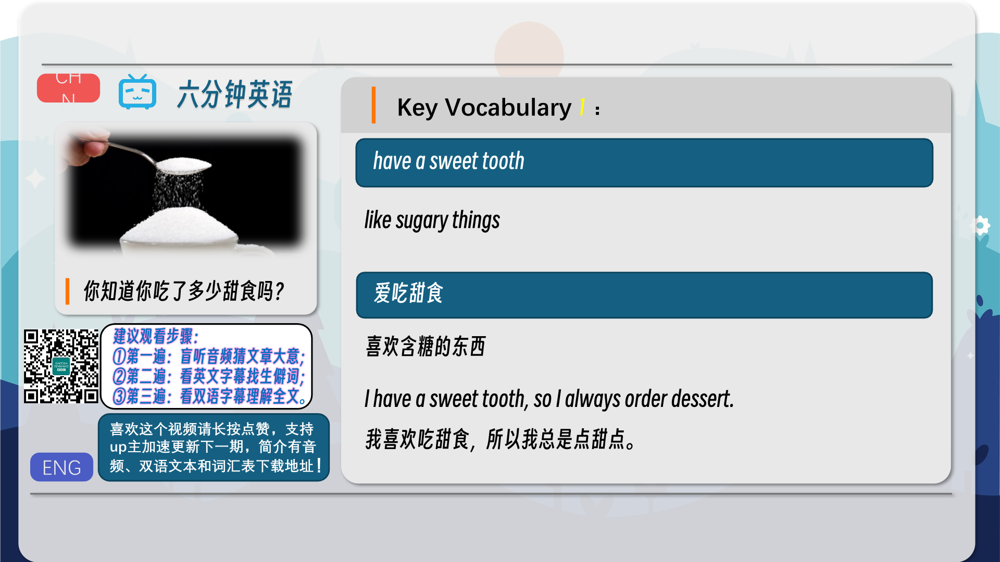
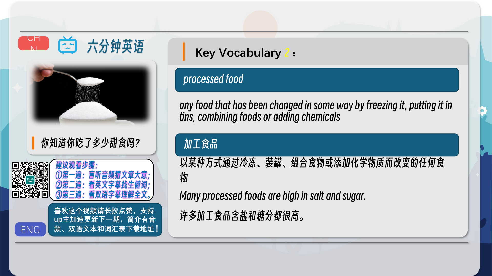
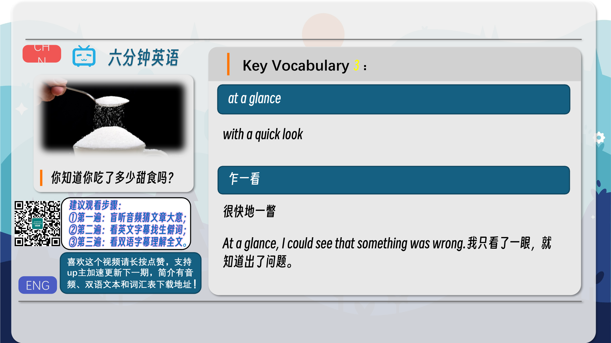
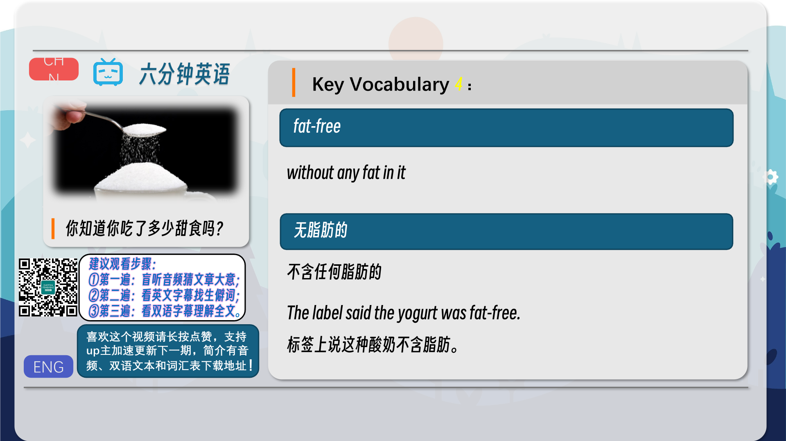
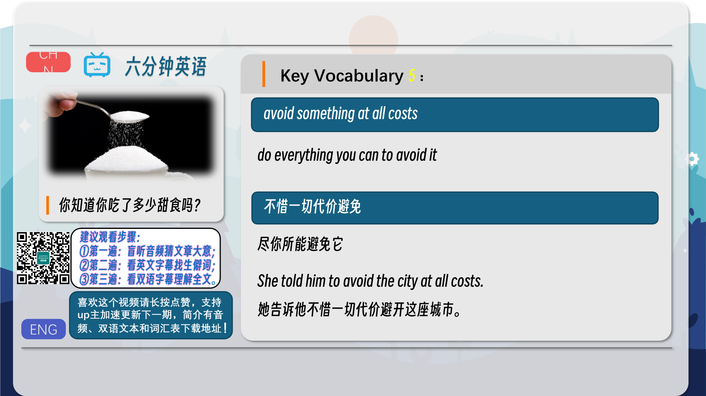

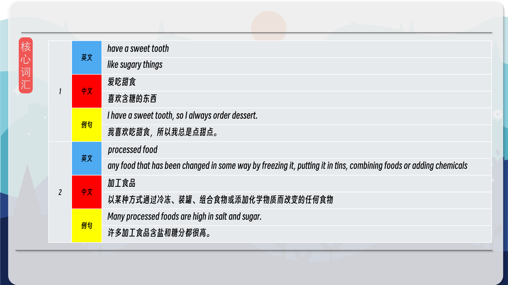
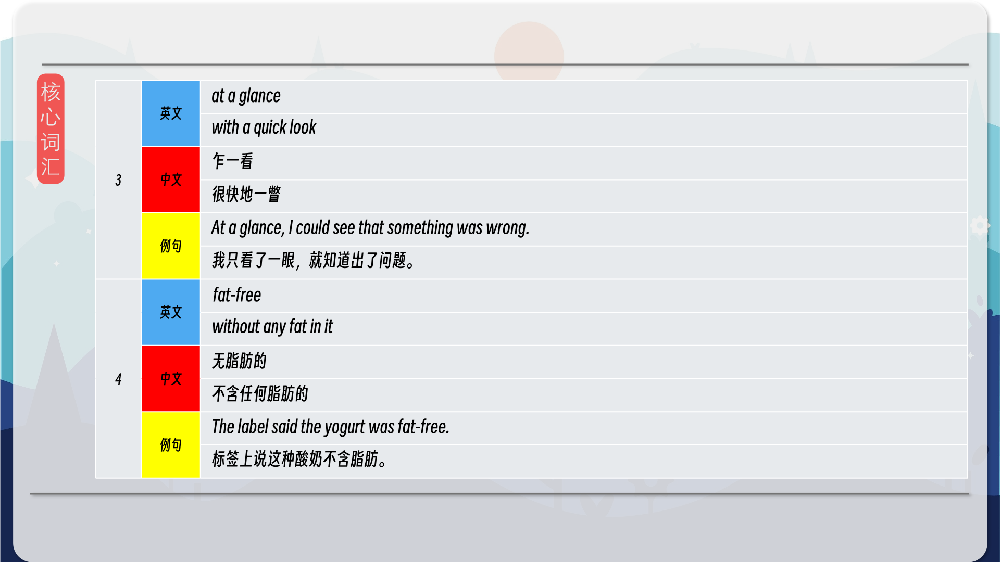
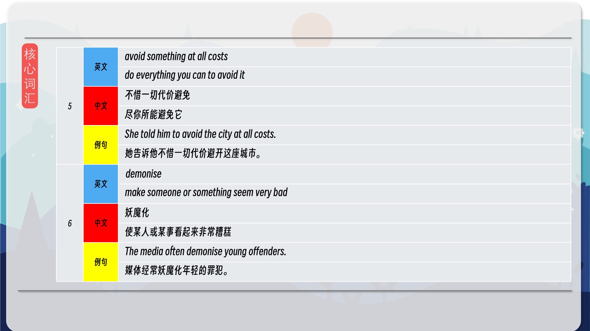
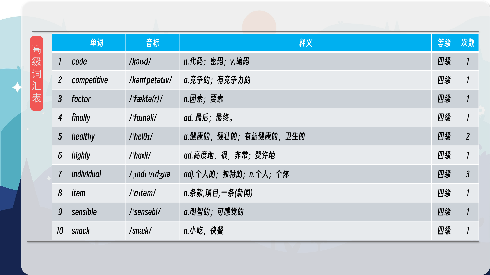
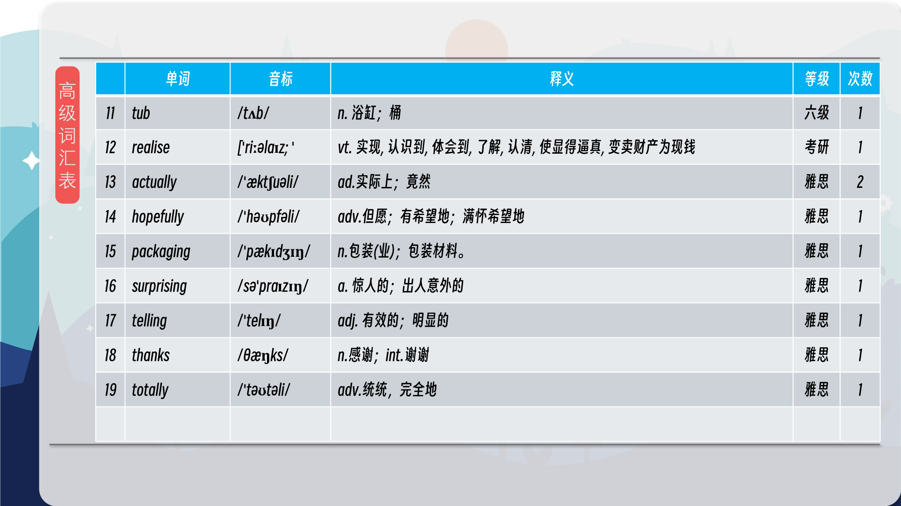

### 【核心词汇】
#### have a sweet tooth
like sugary things
爱吃甜食
喜欢含糖的东西
I have a sweet tooth, so I always order dessert.
我喜欢吃甜食，所以我总是点甜点。
#### processed food
any food that has been changed in some way by freezing it, putting it in tins, combining foods or adding chemicals
加工食品
以某种方式通过冷冻、装罐、组合食物或添加化学物质而改变的任何食物
Many processed foods are high in salt and sugar.
许多加工食品含盐和糖分都很高。
#### at a glance
with a quick look
乍一看
很快地一瞥
At a glance, I could see that something was wrong.
我只看了一眼，就知道出了问题。
#### fat-free
without any fat in it
无脂肪的
不含任何脂肪的
The label said the yogurt was fat-free.
标签上说这种酸奶不含脂肪。
#### avoid something at all costs
do everything you can to avoid it
不惜一切代价避免
尽你所能避免它
She told him to avoid the city at all costs.
她告诉他不惜一切代价避开这座城市。
#### demonise
make someone or something seem very bad
妖魔化
使某人或某事看起来非常糟糕
The media often demonise young offenders.
媒体经常妖魔化年轻的罪犯。

在公众号里输入6位数字，获取【对话音频、英文文本、中文翻译、核心词汇和高级词汇表】电子档，6位数字【暗号】在文章的最后一张图片，如【220728】，表示22年7月28日这一期。公众号没有的文章说明还没有制作相关资料。年度合集在B站【六分钟英语】工房获取，每年共计300+文档，感谢支持！