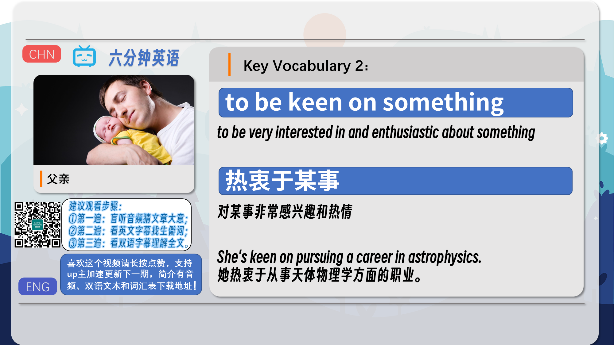
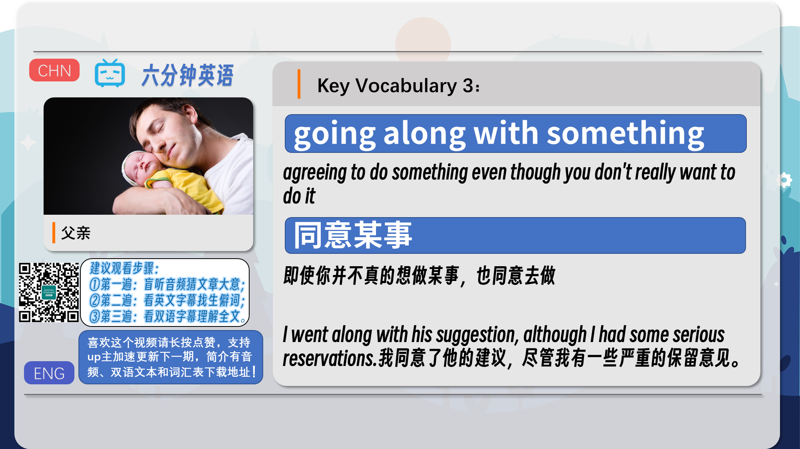
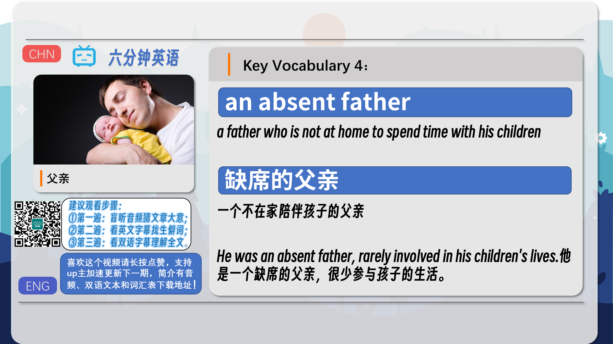
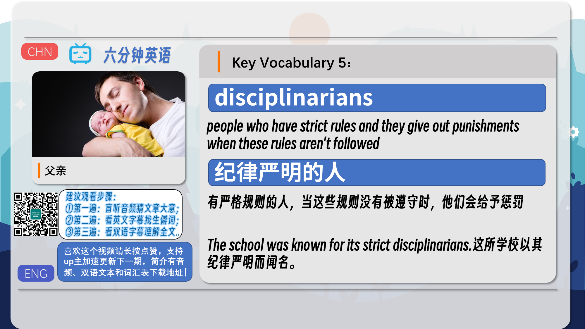
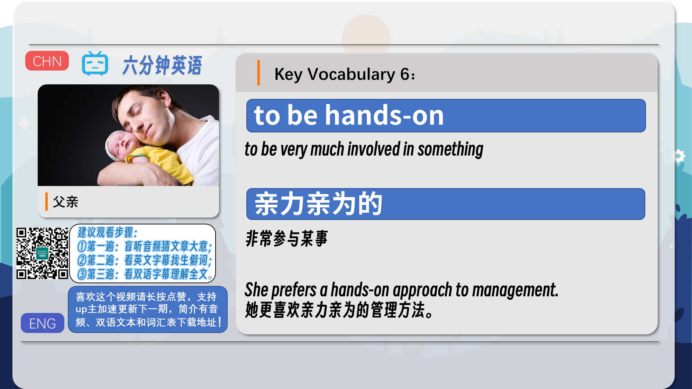
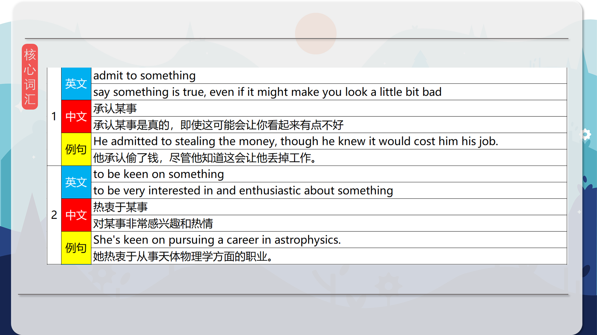
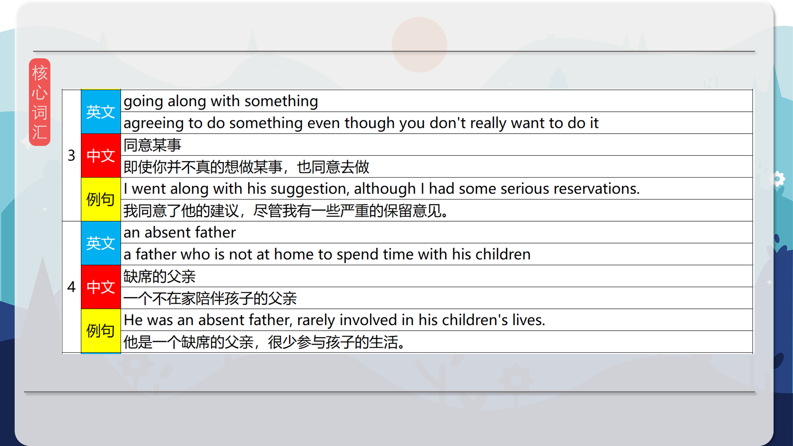
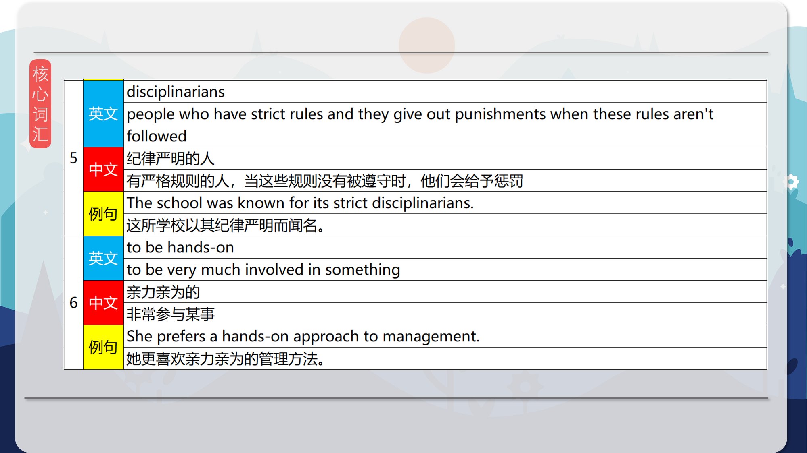
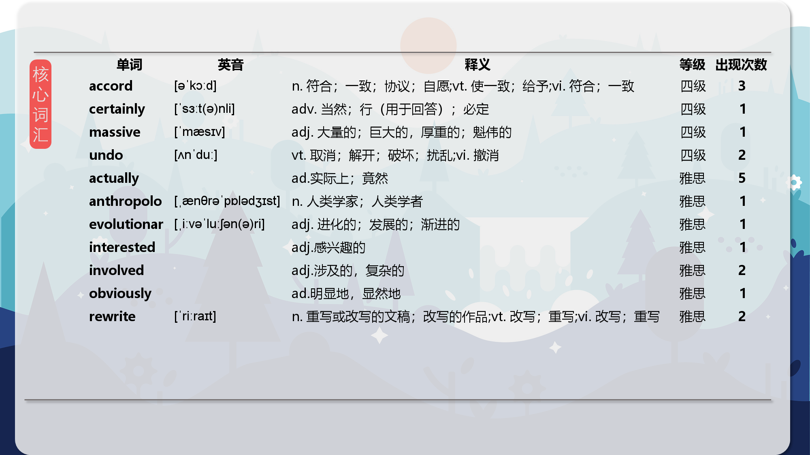

### 【英文脚本】
Catherine
Hello and welcome to 6 Minute English, I'm Catherine.

Neil
And I'm Neil.

Catherine
Now, Neil, you're a dad, aren't you?

Neil
I am a dad. How did you know? Is it the grey hair in my beard? Is it the wrinkles around the eyes?

Catherine
I thought that was just your age.

Neil
Well, yes, maybe. In today's programme we're going to be talking about fathers and how being a father has changed over the years. But before we hear more about this topic, our question for the day. According to recent research in the UK, what percentage of men are present when their children are born? Is it… a) 55%; b) 75% c) 95% What do you think?

Catherine
I think a lot of men these days like to see their children born. It's not culturally inappropriate so I'm going to go for 95%.

Neil
Well, we'll find out if you're right at the end of the programme. Now, Dr Anna Machin is an evolutionary anthropologist. She studies, among other things, how human behaviour has changed and is changing. She's written a book called The Life of Dad. She's been studying new fathers and spoke about her research on the BBC's Woman's Hour programme. She asked why men want to become fathers. She starts by saying that there are lots of reasons but how many does she mention in her answer?

Dr Anna Machin
There's lots of different reasons why men want to be fathers ... for some of them it's just a stage in life they've reached. They've got the house, they've got the job, now it's time to have a family. Sometimes they admit that actually they're not that keen, but their partner wants a baby, so they're kinda going along with it. And a reasonable number actually say they do it because they want to undo what their father did to them, so rewrite history in relation to fathers and the experience of fathering, to be a better father than their father was.

Neil
How many reasons does she mention?

Catherine
She mentioned three reasons. The first was that it was that time in life – the guys had a home and a job and having children was the thing to do next.

Neil
Another reason was that it was what their partners wanted, even if they weren't that keen themselves. If you're not keen on something it means you are 'not enthusiastic about it', it's not really something you want to do, but because it's what their partner wants they agree to it, or as Dr Machin said, they're going along with it.

Catherine
Yes, going along with something, is a phrase that means 'agreeing to do' something even though you don't really want to do it. It's interesting that Dr Machin said that some men admit to this. To admit to something is to say or agree that something is true even if you're perhaps ashamed of it or you don't want it to be true.

Neil
There was one more reason she mentioned and that was that some men become parents because they want to be a better father than their own father had been. Let’s listen again.

Dr Anna Machin
There's lots of different reasons why men want to be fathers ... for some of them it's just a stage in life they've reached. They've got the house, they've got the job, now it's time to have a family. Sometimes they admit that actually they're not that keen, but their partner wants a baby, so they're kinda going along with it. And a reasonable number actually say they do it because they want to undo what their father did to them, so rewrite history in relation to fathers and the experience of fathering, to be a better father than their father was.

Neil
So what is it about some father's own dads that they didn't like? Here's Dr Machin again.

Dr Anna Machin
Well, in some cases, you know, the father would be neglectful, some fathers were absent and others they just felt they were a very, I suppose, we'd say a 1950s father so distant, disciplinarian not actually involved in their children's daily life and certainly not involved in their care. So today's generation fathers, even in the 10 years that I've been studying dads we've seen a massive evolution in how hands-on fathers are.

Neil
She talks there about some negative characteristics associated with dads in the past. She suggests that some fathers didn't have a very close relationship with their sons, they were absent which means they weren't at home a lot and 'didn't spend time' with their children.

Catherine
Yes, and some fathers were seen as a disciplinarian. That describes someone whose main communication with their children was to give them strict rules and tell them off or punish them if they did something wrong.

Neil
These days, according to Dr Machin, fathers are much more hands-on. This phrase means they are 'much more involved' with their children and share bringing up their children with their partners.

Catherine
And talking of sharing, Neil, come on – it's time to know the answer to today's question.

Neil
Yes indeed. According to recent research in the UK, what is the percentage of fathers who are there when their children are born? Was it 55%, 75% or 95%?

Catherine
And I said a very optimistic 95%.

Neil
Being optimistic is good obviously because you are correct.

Catherine
That's fantastic!

Neil
And now, for something else fantastic, our review of today's vocabulary…

Catherine
We started off with admit to for when you say something is true, even if it might make you look a little bit bad. And before we go on I have to admit, Neil, that it was me who ate your biscuit.

Neil
Which one?

Catherine
The one that you left on the desk.

Neil
That's all right. I wasn't really keen on it anyway. It had been on the floor.

Catherine
What? Yuck!

Neil
Yeah, well, it serves you right! And to be keen on something is our next phrase, meaning 'being very interested in and enthusiastic about' something.

Catherine
Then we had to go along with something. This is when you agree to do something even if you are not keen on it.

Neil
An absent father is one who is not at home to spend time with his children.

Catherine
And some fathers are disciplinarians. They have strict rules and they give out punishments but these days more fathers are hands-on which means they are 'very much involved' in looking after and bringing up their children.

Neil
Well, that's all we have time for today. Join us again next time and remember you can find us on Instagram, Facebook, Twitter, YouTube and of course our website bbclearningenglish.com. See you soon. Goodbye!

Catherine
Bye!

### 【中英文双语脚本】
Catherine(凯瑟 琳)
Hello and welcome to 6 Minute English, I'm Catherine.
您好，欢迎来到六分钟 English，我是 Catherine。

Neil(尼尔)
And I'm Neil.
我是 Neil。

Catherine(凯瑟 琳)
Now, Neil, you're a dad, aren't you?
现在，尼尔，你已经当爸爸了，不是吗？

Neil(尼尔)
I am a dad. How did you know? Is it the grey hair in my beard? Is it the wrinkles around the eyes?
我当爸爸了。你怎么知道的？是我胡须上的白发吗？是眼睛周围的皱纹吗？

Catherine(凯瑟 琳)
I thought that was just your age.
我以为那只是你的年龄。

Neil(尼尔)
Well, yes, maybe. In today's programme we're going to be talking about fathers and how being a father has changed over the years. But before we hear more about this topic, our question for the day. According to recent research in the UK, what percentage of men are present when their children are born? Is it… a) 55%; b) 75% c) 95% What do you think?
嗯，是的，也许吧。在今天的节目中，我们将讨论父亲以及这些年来成为父亲的变化。但在我们听到更多关于这个话题的信息之前，我们今天的问题。根据英国最近的研究，当孩子出生时，男性在场的百分比是多少？是吗。。。a） 55%；b） 75% c） 95% 你怎么看？

Catherine(凯瑟 琳)
I think a lot of men these days like to see their children born. It's not culturally inappropriate so I'm going to go for 95%.
我认为现在很多男人都喜欢看到他们的孩子出生。这在文化上并不合适，所以我会追求 95%。

Neil(尼尔)
Well, we'll find out if you're right at the end of the programme. Now, Dr Anna Machin is an evolutionary anthropologist. She studies, among other things, how human behaviour has changed and is changing. She's written a book called The Life of Dad. She's been studying new fathers and spoke about her research on the BBC's Woman's Hour programme. She asked why men want to become fathers. She starts by saying that there are lots of reasons but how many does she mention in her answer?
好吧，我们会在节目结束时了解您是否正确。现在，Anna Machin 博士是一位进化人类学家。她研究人类行为如何变化以及正在发生变化。她写了一本书，叫《爸爸的生活》。她一直在研究新爸爸，并在 BBC 的 Woman's Hour 节目中谈到了她的研究。她问为什么男人想成为父亲。她首先说有很多原因，但她在回答中提到了多少？

Dr Anna Machin(Anna Machin 博士)
There's lots of different reasons why men want to be fathers ... for some of them it's just a stage in life they've reached. They've got the house, they've got the job, now it's time to have a family. Sometimes they admit that actually they're not that keen, but their partner wants a baby, so they're kinda going along with it. And a reasonable number actually say they do it because they want to undo what their father did to them, so rewrite history in relation to fathers and the experience of fathering, to be a better father than their father was.
男人想当爸爸的原因有很多......对他们中的一些人来说，这只是他们已经到达的人生阶段。他们有房子，有工作，现在是组建家庭的时候了。有时他们承认实际上他们并不那么热衷，但他们的伴侣想要一个孩子，所以他们有点同意。有相当多的人实际上说他们这样做是因为他们想撤销父亲对他们所做的一切，所以改写与父亲和父亲经历有关的历史，成为比他们父亲更好的父亲。

Neil(尼尔)
How many reasons does she mention?
她提到了多少个原因？

Catherine(凯瑟 琳)
She mentioned three reasons. The first was that it was that time in life – the guys had a home and a job and having children was the thing to do next.
她提到了三个原因。首先是那是人生中的那个时期 —— 伙计们有家和工作，生孩子是接下来要做的事情。

Neil(尼尔)
Another reason was that it was what their partners wanted, even if they weren't that keen themselves. If you're not keen on something it means you are 'not enthusiastic about it', it's not really something you want to do, but because it's what their partner wants they agree to it, or as Dr Machin said, they're going along with it.
另一个原因是这是他们的合作伙伴想要的，即使他们自己并不那么热衷。如果你对某件事不热衷，那就意味着你 “对它不热衷”，这不是你真正想做的事情，但因为这是他们的伴侣想要的，所以他们同意了，或者正如 Machin 博士所说，他们同意了。

Catherine(凯瑟 琳)
Yes, going along with something, is a phrase that means 'agreeing to do' something even though you don't really want to do it. It's interesting that Dr Machin said that some men admit to this. To admit to something is to say or agree that something is true even if you're perhaps ashamed of it or you don't want it to be true.
是的，顺从某事是一个短语，意思是“同意做”某事，即使你并不是真的想做。有趣的是，Machin 博士说，一些男性承认这一点。承认某事就是说或同意某件事是真的，即使你可能为此感到羞耻或你不希望它是真的。

Neil(尼尔)
There was one more reason she mentioned and that was that some men become parents because they want to be a better father than their own father had been. Let’s listen again.
她还提到了一个原因，那就是一些男人成为父母是因为他们想成为一个比自己的父亲更好的父亲。让我们再听一遍。

Dr Anna Machin(Anna Machin 博士)
There's lots of different reasons why men want to be fathers ... for some of them it's just a stage in life they've reached. They've got the house, they've got the job, now it's time to have a family. Sometimes they admit that actually they're not that keen, but their partner wants a baby, so they're kinda going along with it. And a reasonable number actually say they do it because they want to undo what their father did to them, so rewrite history in relation to fathers and the experience of fathering, to be a better father than their father was.
男人想当爸爸的原因有很多......对他们中的一些人来说，这只是他们已经到达的人生阶段。他们有房子，有工作，现在是组建家庭的时候了。有时他们承认实际上他们并不那么热衷，但他们的伴侣想要一个孩子，所以他们有点同意。有相当多的人实际上说他们这样做是因为他们想撤销父亲对他们所做的一切，所以改写与父亲和父亲经历有关的历史，成为比他们父亲更好的父亲。

Neil(尼尔)
So what is it about some father's own dads that they didn't like? Here's Dr Machin again.
那么，他们不喜欢一些父亲自己的爸爸的什么呢？又是 Machin 博士。

Dr Anna Machin(Anna Machin 博士)
Well, in some cases, you know, the father would be neglectful, some fathers were absent and others they just felt they were a very, I suppose, we'd say a 1950s father so distant, disciplinarian not actually involved in their children's daily life and certainly not involved in their care. So today's generation fathers, even in the 10 years that I've been studying dads we've seen a massive evolution in how hands-on fathers are.
嗯，在某些情况下，你知道，父亲会疏忽大意，有些父亲缺席，而另一些父亲只是觉得自己非常，我想，我们会说一个 1950 年代的父亲如此疏远，管教者实际上没有参与孩子的日常生活，当然也没有参与他们的照顾。所以，今天的一代父亲，即使在我研究父亲的 10 年里，我们也看到了父亲亲力亲为的方式发生了巨大的变化。

Neil(尼尔)
She talks there about some negative characteristics associated with dads in the past. She suggests that some fathers didn't have a very close relationship with their sons, they were absent which means they weren't at home a lot and 'didn't spend time' with their children.
她在那里谈到了过去与父亲相关的一些负面特征。她认为，一些父亲与儿子的关系不是很密切，他们不在，这意味着他们不经常在家，并且“没有花时间”陪伴孩子。

Catherine(凯瑟 琳)
Yes, and some fathers were seen as a disciplinarian. That describes someone whose main communication with their children was to give them strict rules and tell them off or punish them if they did something wrong.
是的，有些父亲被视为管教者。这描述了一个人与孩子的主要沟通是给他们严格的规则，如果他们做错了什么，就会责备他们或惩罚他们。

Neil(尼尔)
These days, according to Dr Machin, fathers are much more hands-on. This phrase means they are 'much more involved' with their children and share bringing up their children with their partners.
根据 Machin 博士的说法，如今，父亲们更加亲力亲为。这句话的意思是他们“更多地参与”自己的孩子，并与伴侣共同抚养孩子。

Catherine(凯瑟 琳)
And talking of sharing, Neil, come on – it's time to know the answer to today's question.
说到分享，Neil，来吧 —— 是时候知道今天问题的答案了。

Neil(尼尔)
Yes indeed. According to recent research in the UK, what is the percentage of fathers who are there when their children are born? Was it 55%, 75% or 95%?
确实是的。根据英国最近的研究，孩子出生时在场的父亲的百分比是多少？是 55%、75% 还是 95%？

Catherine(凯瑟 琳)
And I said a very optimistic 95%.
我说非常乐观的 95%。

Neil(尼尔)
Being optimistic is good obviously because you are correct.
乐观显然是好的，因为你是对的。

Catherine(凯瑟 琳)
That's fantastic!
太棒了！

Neil(尼尔)
And now, for something else fantastic, our review of today's vocabulary…
现在，为了另一个很棒的事情，我们对今天词汇的回顾......

Catherine(凯瑟 琳)
We started off with admit to for when you say something is true, even if it might make you look a little bit bad. And before we go on I have to admit, Neil, that it was me who ate your biscuit.
我们首先承认你说某件事是真的，即使它可能会让你看起来有点糟糕。在我们继续之前，我不得不承认，尼尔，是我吃了你的饼干。

Neil(尼尔)
Which one?
哪一个？

Catherine(凯瑟 琳)
The one that you left on the desk.
你留在桌子上的那个。

Neil(尼尔)
That's all right. I wasn't really keen on it anyway. It had been on the floor.
没关系。反正我并不是很热衷于它。它一直在地板上。

Catherine(凯瑟 琳)
What? Yuck!
什么？呸！

Neil(尼尔)
Yeah, well, it serves you right! And to be keen on something is our next phrase, meaning 'being very interested in and enthusiastic about' something.
是的，嗯，它为您服务！而 to be keen on something 是我们的下一个短语，意思是 “对某事非常感兴趣和热情”。

Catherine(凯瑟 琳)
Then we had to go along with something. This is when you agree to do something even if you are not keen on it.
然后我们不得不接受一些事情。这是你同意做某事的时候，即使你并不热衷于它。

Neil(尼尔)
An absent father is one who is not at home to spend time with his children.
缺席的父亲是指不在家陪伴孩子的父亲。

Catherine(凯瑟 琳)
And some fathers are disciplinarians. They have strict rules and they give out punishments but these days more fathers are hands-on which means they are 'very much involved' in looking after and bringing up their children.
有些父亲是管教者。他们有严格的规定，他们给予惩罚，但现在越来越多的父亲亲力亲为，这意味着他们“非常参与”照顾和抚养孩子。

Neil(尼尔)
Well, that's all we have time for today. Join us again next time and remember you can find us on Instagram, Facebook, Twitter, YouTube and of course our website bbclearningenglish.com. See you soon. Goodbye!
好了，我们今天的时间就这么多了。下次再次加入我们，请记住您可以在 Instagram、Facebook、Twitter、YouTube 上找到我们，当然还有我们的网站 bbclearningenglish.com。一会见。再见！

Catherine(凯瑟 琳)
Bye!
再见！

### 【核心词汇】
#### admit to something
say something is true, even if it might make you look a little bit bad
承认某事
承认某事是真的，即使这可能会让你看起来有点不好
He admitted to stealing the money, though he knew it would cost him his job.
他承认偷了钱，尽管他知道这会让他丢掉工作。
#### to be keen on something
to be very interested in and enthusiastic about something
热衷于某事
对某事非常感兴趣和热情
She's keen on pursuing a career in astrophysics.
她热衷于从事天体物理学方面的职业。
#### going along with something
agreeing to do something even though you don't really want to do it
同意某事
即使你并不真的想做某事，也同意去做
I went along with his suggestion, although I had some serious reservations.
我同意了他的建议，尽管我有一些严重的保留意见。
#### an absent father
a father who is not at home to spend time with his children
缺席的父亲
一个不在家陪伴孩子的父亲
He was an absent father, rarely involved in his children's lives.
他是一个缺席的父亲，很少参与孩子的生活。
#### disciplinarians
people who have strict rules and they give out punishments when these rules aren't followed
纪律严明的人
有严格规则的人，当这些规则没有被遵守时，他们会给予惩罚
The school was known for its strict disciplinarians.
这所学校以其纪律严明而闻名。
#### to be hands-on
to be very much involved in something
亲力亲为的
非常参与某事
She prefers a hands-on approach to management.
她更喜欢亲力亲为的管理方法。

在公众号里输入6位数字，获取【对话音频、英文文本、中文翻译、核心词汇和高级词汇表】电子档，6位数字【暗号】在文章的最后一张图片，如【220728】，表示22年7月28日这一期。公众号没有的文章说明还没有制作相关资料。年度合集在B站【六分钟英语】工房获取，每年共计300+文档，感谢支持！