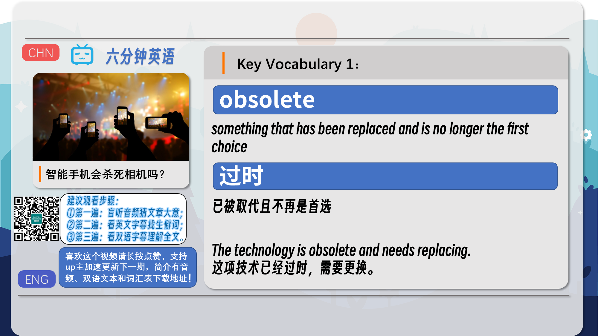
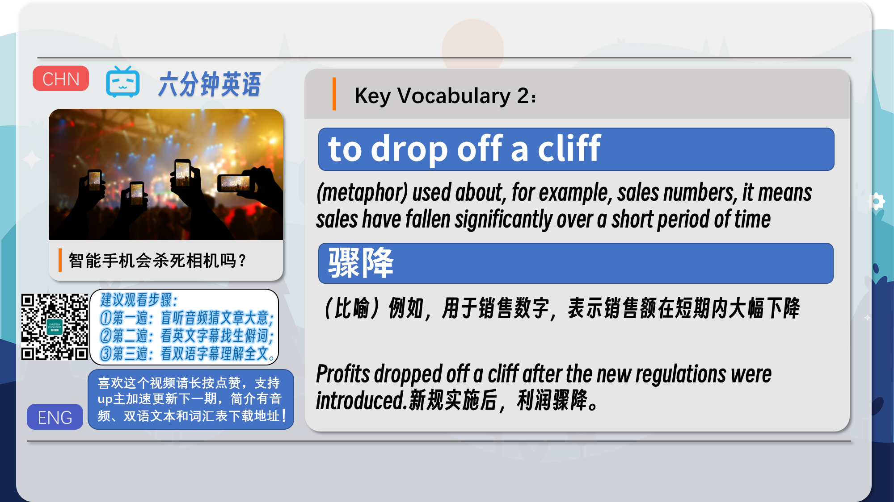
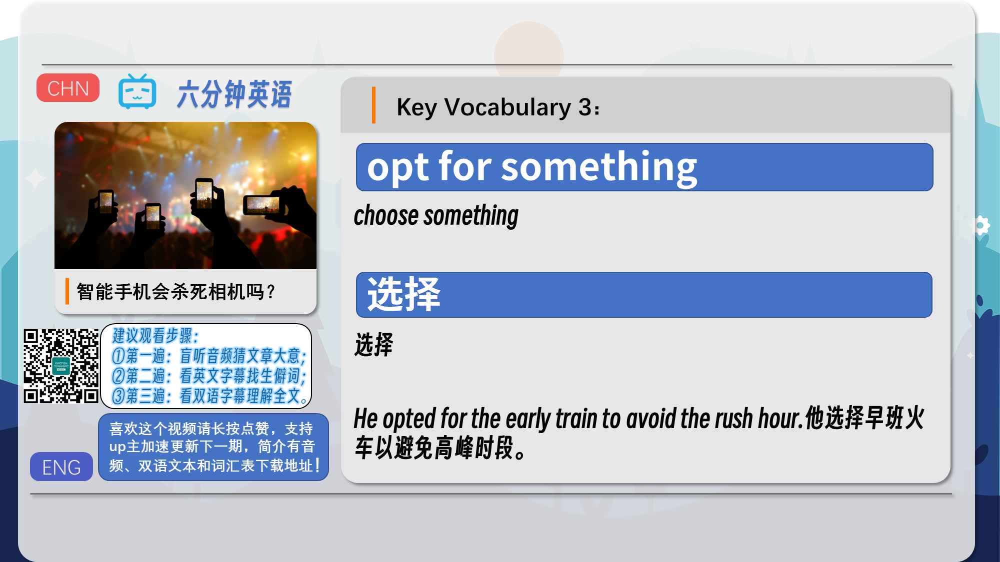
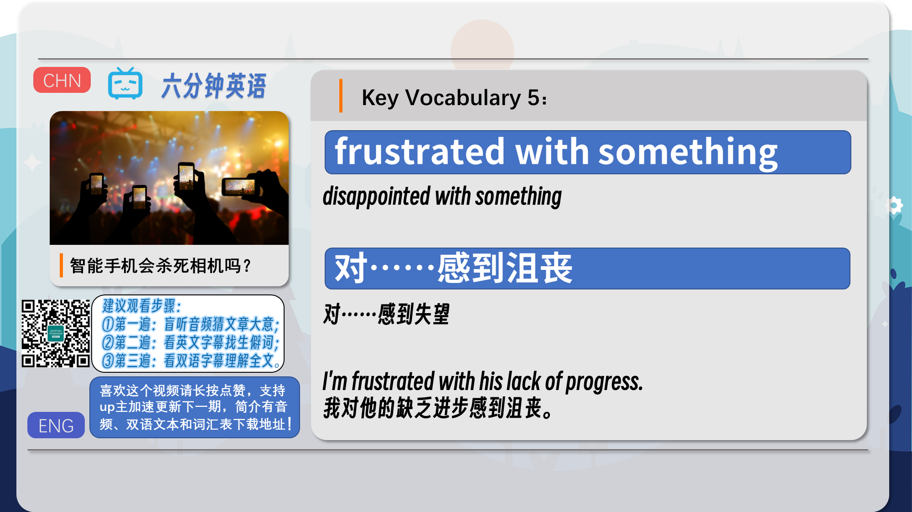
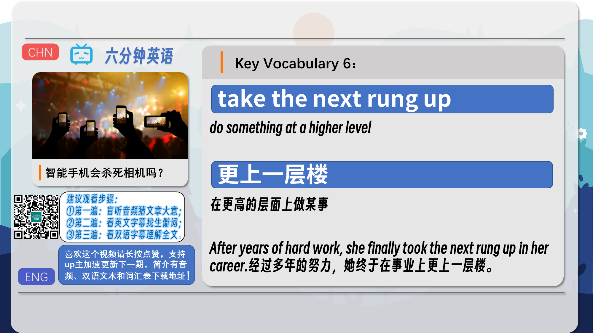
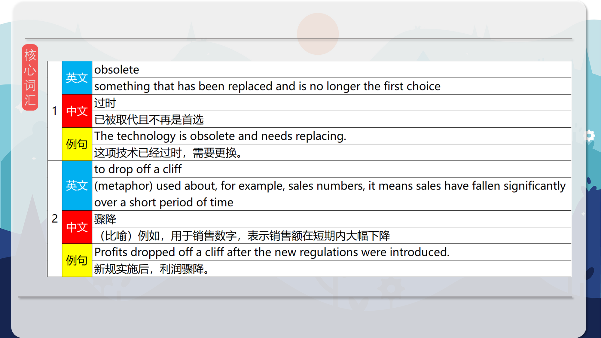
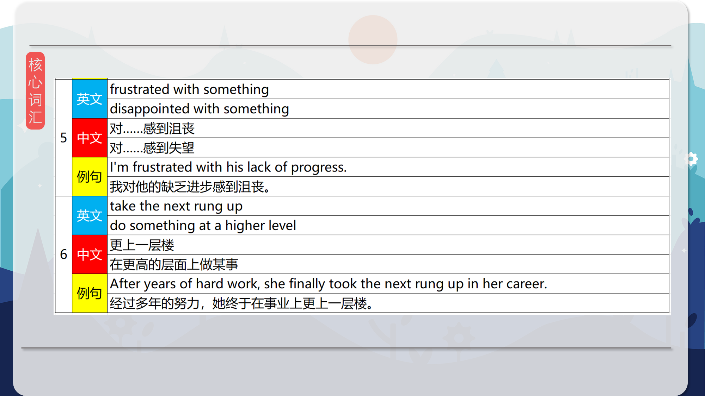
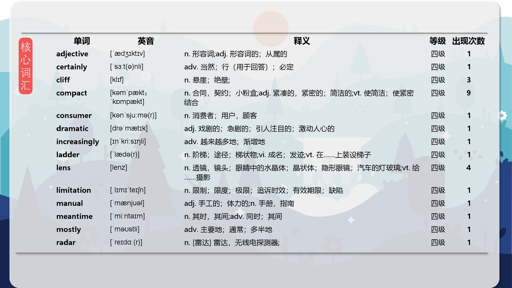
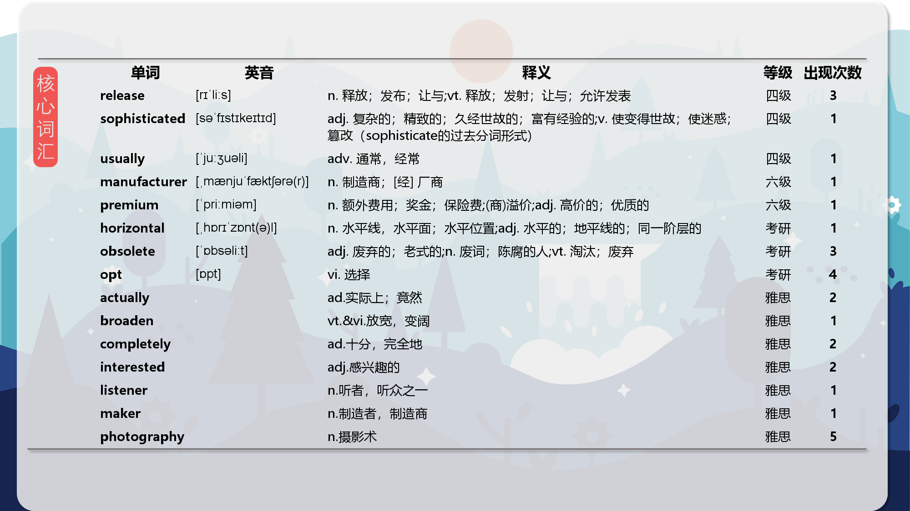

### 【英文脚本】
Neil
Hello and welcome to 6 Minute English. I'm Neil.

Catherine
And I'm Catherine. Hello!

Neil
Now, Catherine, say cheese.

Catherine
Cheeeese.

Neil
Thank you, a little souvenir of our time together.

Catherine
Let's have a look… Hang on a minute. You just took a selfie, I wasn't even in the picture.

Neil
Ah, well, that's the magic of the smartphone, two cameras! You know, that's not something you can do with a traditional camera. I mean, do you even have a separate camera these days?

Catherine
I do actually. It's in a cupboard somewhere at home.

Neil
Well, that is the topic of this programme. Have traditional cameras been completely replaced by smartphones, or to put it another way, have cameras been made obsolete by the smartphone?

Catherine
Interesting question. But before we get into this topic, how about a question for our listeners?

Neil
Of course. We are certainly in the digital age of photography but when was the first digital camera phone released? Was it: a) 2000; b) 2004 or c) 2007? What do you think?

Catherine
Well, I actually know this one, so I'm going to be fair and keep it to myself.

Neil
OK, well, listen out for the answer at the end of the programme. There are different kinds of cameras available today. There are compact cameras, which are small and mostly automatic and usually come with a fixed lens.

Catherine
That's right. And then there are SLRs and DSLRs which are bigger, and you can change the lenses on these cameras and they allow for a lot of manual control.

Neil
And there are also mirrorless cameras, which are a cross between compact cameras and DSLRs. They are small like a compact camera but you can also use the same lenses on them that you can use on DSLRs.

Catherine
And of course, there are the cameras on smartphones, and these are convenient and they're becoming increasingly sophisticated.

Neil
Phil Hall is the editor of Tech Radar magazine. He was asked on the BBC programme You and Yours if he thought smartphones would make other cameras obsolete. What is his opinion?

Phil Hall
I don't think so. I think while compact camera sales have really sort of dropped off a cliff, it's the lower end, cheap compacts where people have opted for a smartphone and I think manufacturers are looking at the more higher end premium cameras, high-end compacts, DSLRs, which are the ones you can attach lenses to, mirrorless cameras. So, the market's changing. And I don't think there'll be a time soon, yet, that… the smartphone will take over the camera completely.

Neil
So does Phil think smartphones will kill the camera?

Catherine
In a word, no. He does say that sales of cheap compact cameras have dropped off a cliff. This rather dramatic expression describes a very big fall in sales.

Neil
This is because the kind of consumers who would choose a compact camera are now opting for the camera on their smartphone. When you opt for something you choose it rather than something else.

Catherine
For people who want a quick, easy to use and convenient way to take reasonable quality photos, compact cameras used to be the best choice – but now it's the smartphone.

Neil
So camera makers are now moving to the more high-end market, the DSLRs and mirrorless cameras. So who is still buying these more expensive cameras? Here's Phil Hall again.

Phil Hall
I think it's… some of it is people who are picking up a smartphone and sort of getting into photography that way and that's a really great first step into photography and I think people are probably, sometimes, getting a bit frustrated with the quality once they sort of start pushing their creative skills and then looking to see what's the next rung up so it's people wanting to broaden their creative skills a bit.

Neil
Who does he say might be buying cameras?

Catherine
He says that people who are getting into photography might get frustrated with the quality of smartphones.

Neil
Getting into something means becoming very interested in it.

Catherine
And if you are frustrated with something it means you are disappointed with it. You are not happy with it.

Neil
So people who have got into photography with a smartphone but are frustrated with its limitations and want to be more creative are going to the next level. They are moving up, they are, as Phil said taking 'the next rung up'.

Catherine
Now, a rung is the horizontal step of a ladder, so the expression taking the next rung up is a way to describe doing something at a higher level.

Neil
Now, talking of higher levels, did you get this week's quiz question right? The question was: When was the first phone with a digital camera released? Was it 2000, 2004 or 2007? The first phone with a digital camera was released in 2000. Now, to take us up to the end of the programme, let's look at the vocabulary again.

Catherine
First we had the adjective obsolete which describes something that has been replaced and is no longer the first choice.

Neil
When the expression to drop off a cliff is used about, for example, sales numbers, it means sales have fallen significantly over a short period of time.

Catherine
To opt for something means to choose something and when you become very interested in an activity you can say that you get into it.

Neil
If you are trying to do something and you can't do it because you don't have the skill or the equipment you are using is not right or not good enough, you can become frustrated.

Catherine
And developing your skills to a higher level can be described as taking the next rung up.

Neil
Right, that's all from us from us in this programme. Do join us again next time and don't forget that in the meantime you can find us on Instagram, Facebook, Twitter, YouTube and of course our website bbclearningenglish.com. See you soon. Goodbye.

Catherine
Bye!

### 【中英文双语脚本】
Neil(尼尔)
Hello and welcome to 6 Minute English. I'm Neil.
您好，欢迎来到 6 Minute English。我是 Neil。

Catherine(凯瑟 琳)
And I'm Catherine. Hello!
我是 Catherine。你好！

Neil(尼尔)
Now, Catherine, say cheese.
现在，凯瑟琳，说奶酪。

Catherine(凯瑟 琳)
Cheeeese.
Cheeeese 的。

Neil(尼尔)
Thank you, a little souvenir of our time together.
谢谢你，我们在一起的时光的小纪念品。

Catherine(凯瑟 琳)
Let's have a look… Hang on a minute. You just took a selfie, I wasn't even in the picture.
让我们来看看......等一下。你只是拍了一张自拍，我甚至不在照片里。

Neil(尼尔)
Ah, well, that's the magic of the smartphone, two cameras! You know, that's not something you can do with a traditional camera. I mean, do you even have a separate camera these days?
啊，嗯，这就是智能手机的魔力，两个摄像头！你知道，这不是传统相机可以做到的。我的意思是，你现在有单独的相机吗？

Catherine(凯瑟 琳)
I do actually. It's in a cupboard somewhere at home.
我实际上是这样做的。它在家里某个地方的橱柜里。

Neil(尼尔)
Well, that is the topic of this programme. Have traditional cameras been completely replaced by smartphones, or to put it another way, have cameras been made obsolete by the smartphone?
嗯，这就是这个节目的主题。传统相机是否已完全被智能手机取代，或者换句话说，智能手机是否已经过时了？

Catherine(凯瑟 琳)
Interesting question. But before we get into this topic, how about a question for our listeners?
有趣的问题。但在我们进入这个话题之前，我们先向听众提出一个问题吗？

Neil(尼尔)
Of course. We are certainly in the digital age of photography but when was the first digital camera phone released? Was it: a) 2000; b) 2004 or c) 2007? What do you think?
答案是肯定的。我们当然处于摄影的数字时代，但第一款数码照相手机是什么时候发布的呢？是：a） 2000 年；b） 2004 年还是 c） 2007 年？你觉得怎么样？

Catherine(凯瑟 琳)
Well, I actually know this one, so I'm going to be fair and keep it to myself.
嗯，我其实知道这个，所以我要公平地说，把它留给自己。

Neil(尼尔)
OK, well, listen out for the answer at the end of the programme. There are different kinds of cameras available today. There are compact cameras, which are small and mostly automatic and usually come with a fixed lens.
好，好吧，请听节目结束时的答案。今天有不同种类的相机可用。有紧凑型相机，它们很小，大部分是自动的，通常带有固定镜头。

Catherine(凯瑟 琳)
That's right. And then there are SLRs and DSLRs which are bigger, and you can change the lenses on these cameras and they allow for a lot of manual control.
没错。然后是更大的 SLR 和 DSLR，您可以更换这些相机的镜头，它们允许进行大量手动控制。

Neil(尼尔)
And there are also mirrorless cameras, which are a cross between compact cameras and DSLRs. They are small like a compact camera but you can also use the same lenses on them that you can use on DSLRs.
还有无反光镜相机，它是紧凑型相机和数码单反相机的交叉。它们像紧凑型相机一样小，但您也可以在它们上使用与数码单反相机相同的镜头。

Catherine(凯瑟 琳)
And of course, there are the cameras on smartphones, and these are convenient and they're becoming increasingly sophisticated.
当然，智能手机上也有摄像头，这些摄像头很方便，而且它们变得越来越复杂。

Neil(尼尔)
Phil Hall is the editor of Tech Radar magazine. He was asked on the BBC programme You and Yours if he thought smartphones would make other cameras obsolete. What is his opinion?
Phil Hall 是 Tech Radar 杂志的编辑。在 BBC 节目 You and Yours 中，有人问他是否认为智能手机会让其他相机过时。他怎么看呢？

Phil Hall(菲尔·霍尔)
I don't think so. I think while compact camera sales have really sort of dropped off a cliff, it's the lower end, cheap compacts where people have opted for a smartphone and I think manufacturers are looking at the more higher end premium cameras, high-end compacts, DSLRs, which are the ones you can attach lenses to, mirrorless cameras. So, the market's changing. And I don't think there'll be a time soon, yet, that… the smartphone will take over the camera completely.
我不这么认为。我认为，虽然紧凑型相机的销量确实有所下降，但人们选择了智能手机，而低端、廉价的紧凑型相机则选择了智能手机，我认为制造商正在关注更高端的高端相机、高端紧凑型相机、数码单反相机，这些相机是可以安装镜头的相机，无反光镜相机。所以，市场正在发生变化。而且我认为不会很快出现......智能手机将完全接管相机。

Neil(尼尔)
So does Phil think smartphones will kill the camera?
那么 Phil 认为智能手机会杀死相机吗？

Catherine(凯瑟 琳)
In a word, no. He does say that sales of cheap compact cameras have dropped off a cliff. This rather dramatic expression describes a very big fall in sales.
一句话，没有。他确实说过，廉价紧凑型相机的销量已经急剧下降。这个相当戏剧性的表达描述了销售额的大幅下降。

Neil(尼尔)
This is because the kind of consumers who would choose a compact camera are now opting for the camera on their smartphone. When you opt for something you choose it rather than something else.
这是因为选择紧凑型相机的那种消费者现在正在选择智能手机上的相机。当你选择某样东西时，你自己选择了它，而不是其他东西。

Catherine(凯瑟 琳)
For people who want a quick, easy to use and convenient way to take reasonable quality photos, compact cameras used to be the best choice – but now it's the smartphone.
对于想要以快速、易于使用和方便的方式拍摄质量合理的照片的人来说，紧凑型相机曾经是最佳选择 —— 但现在它是智能手机。

Neil(尼尔)
So camera makers are now moving to the more high-end market, the DSLRs and mirrorless cameras. So who is still buying these more expensive cameras? Here's Phil Hall again.
因此，相机制造商现在正在转向更高端的市场，即 DSLR 和无反光镜相机。那么谁还在购买这些更昂贵的相机呢？又是 Phil Hall。

Phil Hall(菲尔·霍尔)
I think it's… some of it is people who are picking up a smartphone and sort of getting into photography that way and that's a really great first step into photography and I think people are probably, sometimes, getting a bit frustrated with the quality once they sort of start pushing their creative skills and then looking to see what's the next rung up so it's people wanting to broaden their creative skills a bit.
我认为这是......其中一些人拿起智能手机，以这种方式进入摄影领域，这是进入摄影界的非常好的第一步，我认为人们有时可能会对质量感到有点沮丧，一旦他们开始提高自己的创意技能，然后看看下一步会发生什么，所以人们想要拓宽他们的创意技能。

Neil(尼尔)
Who does he say might be buying cameras?
他说谁可能会购买相机？

Catherine(凯瑟 琳)
He says that people who are getting into photography might get frustrated with the quality of smartphones.
他说，从事摄影的人可能会对智能手机的质量感到沮丧。

Neil(尼尔)
Getting into something means becoming very interested in it.
进入某样东西意味着对它非常感兴趣。

Catherine(凯瑟 琳)
And if you are frustrated with something it means you are disappointed with it. You are not happy with it.
如果你对某件事感到沮丧，那就意味着你对它感到失望。你对它不满意。

Neil(尼尔)
So people who have got into photography with a smartphone but are frustrated with its limitations and want to be more creative are going to the next level. They are moving up, they are, as Phil said taking 'the next rung up'.
因此，那些使用智能手机开始摄影但对其局限性感到沮丧并希望更具创意的人将更上一层楼。他们正在上升，正如 Phil 所说，他们正在迈出“下一个梯级”。

Catherine(凯瑟 琳)
Now, a rung is the horizontal step of a ladder, so the expression taking the next rung up is a way to describe doing something at a higher level.
现在，梯级是梯子的水平台阶，所以 takes the next rung up 这句话是描述在更高层次上做某事的一种方式。

Neil(尼尔)
Now, talking of higher levels, did you get this week's quiz question right? The question was: When was the first phone with a digital camera released? Was it 2000, 2004 or 2007? The first phone with a digital camera was released in 2000. Now, to take us up to the end of the programme, let's look at the vocabulary again.
现在，说到更高级别，你对本周的测验问题理解正确吗？问题是：第一款带有数码相机的手机是什么时候发布的？是 2000 年、2004 年还是 2007 年？第一款带有数码相机的手机于 2000 年发布。现在，为了带我们进入节目的结尾，让我们再次看一下词汇。

Catherine(凯瑟 琳)
First we had the adjective obsolete which describes something that has been replaced and is no longer the first choice.
首先，我们有形容词 obsolete，它描述了已被替换且不再是首选的事物。

Neil(尼尔)
When the expression to drop off a cliff is used about, for example, sales numbers, it means sales have fallen significantly over a short period of time.
例如，当 drop off a cliff 一词用于销售数字时，表示销售额在短时间内大幅下降。

Catherine(凯瑟 琳)
To opt for something means to choose something and when you become very interested in an activity you can say that you get into it.
To choose for something 意味着选择某事，当你对一项活动非常感兴趣时，你可以说你进入了它。

Neil(尼尔)
If you are trying to do something and you can't do it because you don't have the skill or the equipment you are using is not right or not good enough, you can become frustrated.
如果你正在尝试做某事但因为你没有技能或你使用的设备不正确或不够好而无法做到，你可能会感到沮丧。

Catherine(凯瑟 琳)
And developing your skills to a higher level can be described as taking the next rung up.
将您的技能发展到更高的水平可以被描述为更上一层楼。

Neil(尼尔)
Right, that's all from us from us in this programme. Do join us again next time and don't forget that in the meantime you can find us on Instagram, Facebook, Twitter, YouTube and of course our website bbclearningenglish.com. See you soon. Goodbye.
好的，这就是我们在这个计划中的全部内容。下次请再次加入我们，不要忘记在此期间您可以在 Instagram、Facebook、Twitter、YouTube 上找到我们，当然还有我们的网站 bbclearningenglish.com。一会见。再见。

Catherine(凯瑟 琳)
Bye!
再见！

### 【核心词汇】
#### obsolete
something that has been replaced and is no longer the first choice
过时
已被取代且不再是首选
The technology is obsolete and needs replacing.
这项技术已经过时，需要更换。
#### to drop off a cliff
(metaphor) used about, for example, sales numbers, it means sales have fallen significantly over a short period of time
骤降
（比喻）例如，用于销售数字，表示销售额在短期内大幅下降
Profits dropped off a cliff after the new regulations were introduced.
新规实施后，利润骤降。
#### opt for something
choose something
选择
选择
He opted for the early train to avoid the rush hour.
他选择早班火车以避免高峰时段。
#### get into something
become very interested in an activity
对……感兴趣
对某项活动产生浓厚兴趣
She's recently got into yoga and attends classes three times a week.
她最近迷上了瑜伽，每周上三次课。
#### frustrated with something
disappointed with something
对……感到沮丧
对……感到失望
I'm frustrated with his lack of progress.
我对他的缺乏进步感到沮丧。
#### take the next rung up
do something at a higher level
更上一层楼
在更高的层面上做某事
After years of hard work, she finally took the next rung up in her career.
经过多年的努力，她终于在事业上更上一层楼。

在公众号里输入6位数字，获取【对话音频、英文文本、中文翻译、核心词汇和高级词汇表】电子档，6位数字【暗号】在文章的最后一张图片，如【220728】，表示22年7月28日这一期。公众号没有的文章说明还没有制作相关资料。年度合集在B站【六分钟英语】工房获取，每年共计300+文档，感谢支持！