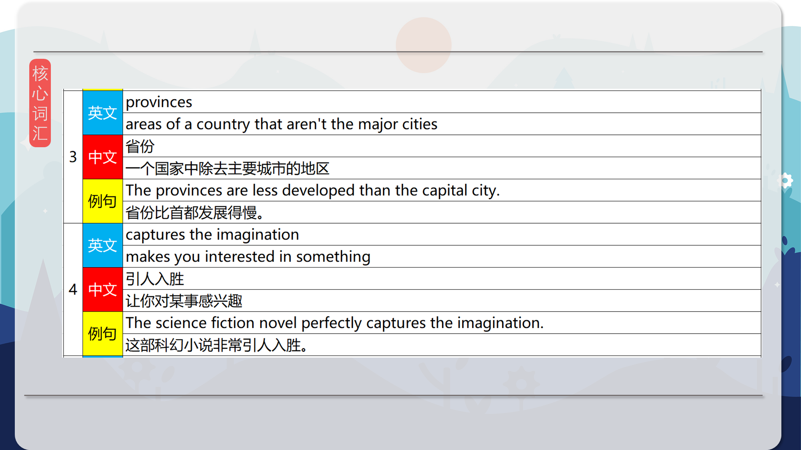
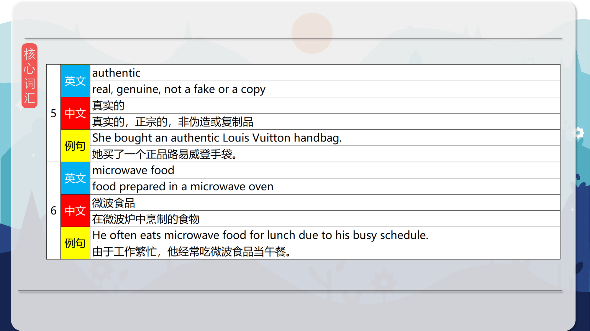

### 【英文脚本】
Neil
Hello. Welcome to 6 Minute English, I'm Neil.

Rob
And I'm Rob.

Neil
Now Rob, you like your food, don't you?

Rob
Oh yes, yum yum, food! One of my favourite things.

Neil
And what do you think of street food?

Rob
I love street food. There are some great places in London where you can find delicious foods from all over the world, cooked in front of you in market stalls on the street.

Neil
It's quite new though, isn't it - not really a British tradition.

Rob
I guess not, but it seems to be much more popular these days.

Neil
Well our topic today is street food, but before we tuck into that, here is today's question. Recently archaeologists in Jordan discovered what they believe is the oldest remains of bread. How old is this bread? Is it… a) 18,000 years old; b) 14,000 years old, or c) 5,500 years old? What do you think?

Rob
I don't know - but what I do know is, I wouldn't really want to try a sandwich made from that bread!

Neil
Mmm, it might be a bit mouldy.

Rob
Yes! Anyway, I'm going to have a guess and say c) 5,500 years old.

Neil
Right, we will find out the answer later in the programme. Mark Laurie is from the Nationwide Caterers Association. He is an expert in the business of street food in the UK. He appeared on BBC radio's The Food Programme and was asked how the business of street food has changed in recent years. In his answer he talks about the areas where there is most growth in street food. What are those areas?

Mark Laurie
It's been phenomenal the growth in street food, it's really taken off, it's really become quite mainstream. Part of the cultural fabric of the country really, or it's beginning to be, certainly in the bigger cities and increasingly in the sort of provinces, if you like.

Neil
So where does he say the popularity of street food is growing?

Rob
He says that it's in the bigger cities and also in the provinces. The provinces is a word which means the parts of a country outside of the cities.

Neil
So essentially, he's saying it's getting more popular everywhere.

Rob
Exactly. In fact he says the growth is phenomenal. This means he thinks the growth is spectacular, really big.

Neil
Yes he says that it's really taken off. Taken off is one of those phrasal verbs that can be used in many different ways. In this sense, when something takes off it means it becomes successful and popular.

Rob
You know, street food isn't really something you associate with Britain. Perhaps it's the climate or British food - so street food is something that we are now getting used to and enjoying more. In fact Mark says that it's now becoming mainstream. This means that is no longer something that it's seen as being unusual or different. It's becoming an accepted part of the everyday eating experience.

Neil
Well, let’s listen again to Mark Laurie talking about the growth of street food in the UK.

Mark Laurie
It's been phenomenal the growth in street food, it's really taken off, it's really become quite mainstream. Part of the cultural fabric of the country really, or it's beginning to be, certainly in the bigger cities and increasingly in the sort of provinces, if you like.

Neil
Mark Laurie goes on to talk about why street food has become popular. What kind of food does he say it's not like?

Mark Laurie
Yeah, it's just really captured the imagination of the public. It's honest food, it's authentic food and it's people that you can trust making it. It's not some microwave food or whatever that you might get in your local pub.

Neil
So street food is many things, but what isn't it?

Rob
Well he says that it's not like food you might get in some pubs. That food, he says, may be some microwave food. Which is food prepared in a microwave oven.

Neil
You know I quite like a microwave meal now and then and I reheat my leftovers in the microwave.

Rob
But I guess if you were paying for a nice meal you wouldn't expect reheated leftovers! I think the point he is making is that in many places the food you are served is not freshly made. It may be pre-prepared and finished off in a microwave. Street food, he says, is authentic.

Neil
Yes, authentic. It's real, fresh and cooked right in front of you and if it's food from a particular country it's probably being prepared by people from that culture.

Rob
He also says that this has captured the imagination of the public. It's something that the public have experienced and thought - 'Yep, you know, I like this, this is a great idea.'.

Neil
Well, all this talk of food is making me hungry, so let's get the answer to the quiz and review today's vocabulary before we head off and grab a bite to eat. We asked about the age of bread discovered by archaeologists in Jordan. Was it a) 18,000 years old, b) 14,000 years or c) 5,500 years?

Rob
Mmm, and I said it was c) 5,500 years.

Neil
And I'm afraid it's a lot mouldier than that. The answer was 14,000 years.

Rob
Very tasty I'm sure.

Neil
Yes! Right then, the vocabulary. We started off with the adjective phenomenal to describe something that is amazing, remarkable and extraordinary.

Rob
Then we had to take off, a phrasal verb which means to become popular. Street food has really taken off in the UK: it's become really popular.

Neil
And not just in the cities but also in the provinces, which is a noun to describe areas of a country that aren't the major cities.

Rob
Something which captures the imagination is something which makes you interested and not just for a short time.

Neil
And one thing which has captured the imagination of the British public is authentic street food. Something authentic is real, it's genuine, it's not a fake or a copy.

Rob
And finally we had microwave food, food prepared in a microwave oven. And that kind of food is not seen by some as authentic.

Neil
Well, it's time to eat, so that's all we have time for today. Join us again next time and remember you can find us on Instagram, Facebook, Twitter, YouTube and of course on our website bbclearningenglish.com. See you soon, bye.

Rob
Bye!

### 【中英文双语脚本】
Neil(尼尔)
Hello. Welcome to 6 Minute English, I'm Neil.
你好。欢迎来到六分钟 English，我是 Neil。

Rob(罗伯)
And I'm Rob.
我是 罗伯。

Neil(尼尔)
Now Rob, you like your food, don't you?
现在 罗伯，你喜欢你的食物，不是吗？

Rob(罗伯)
Oh yes, yum yum, food! One of my favourite things.
哦，对了，好吃，美食！我最喜欢的事情之一。

Neil(尼尔)
And what do you think of street food?
你觉得街头小吃怎么样？

Rob(罗伯)
I love street food. There are some great places in London where you can find delicious foods from all over the world, cooked in front of you in market stalls on the street.
我喜欢街头小吃。伦敦有一些很棒的地方，你可以在那里找到来自世界各地的美味佳肴，这些食物在街上的市场摊位上烹制而成。

Neil(尼尔)
It's quite new though, isn't it - not really a British tradition.
不过，这很新，不是吗 - 并不是真正的英国传统。

Rob(罗伯)
I guess not, but it seems to be much more popular these days.
我猜不是，但最近它似乎更受欢迎了。

Neil(尼尔)
Well our topic today is street food, but before we tuck into that, here is today's question. Recently archaeologists in Jordan discovered what they believe is the oldest remains of bread. How old is this bread? Is it… a) 18,000 years old; b) 14,000 years old, or c) 5,500 years old? What do you think?
我们今天的主题是街头小吃，但在我们深入讨论之前，这里是今天的问题。最近，约旦的考古学家发现了他们认为是最古老的面包遗骸。这面包有多少年了？是吗。。。a） 18,000 年；b） 14,000 年，还是 c） 5,500 年？你觉得怎么样？

Rob(罗伯)
I don't know - but what I do know is, I wouldn't really want to try a sandwich made from that bread!
我不知道 - 但我所知道的是，我真的不想尝试用这种面包做的三明治！

Neil(尼尔)
Mmm, it might be a bit mouldy.
嗯，它可能有点发霉。

Rob(罗伯)
Yes! Anyway, I'm going to have a guess and say c) 5,500 years old.
是的！无论如何，我要猜一下，然后说 c） 5,500 岁。

Neil(尼尔)
Right, we will find out the answer later in the programme. Mark Laurie is from the Nationwide Caterers Association. He is an expert in the business of street food in the UK. He appeared on BBC radio's The Food Programme and was asked how the business of street food has changed in recent years. In his answer he talks about the areas where there is most growth in street food. What are those areas?
好的，我们将在稍后的节目中找到答案。Mark Laurie 来自全国餐饮业协会。他是英国街头食品业务的专家。他出现在 BBC 电台的 The Food Programme 上，并被问及近年来街头食品业务发生了怎样的变化。在他的回答中，他谈到了街头食品增长最快的地区。这些区域是什么？

Mark Laurie(马克·劳里)
It's been phenomenal the growth in street food, it's really taken off, it's really become quite mainstream. Part of the cultural fabric of the country really, or it's beginning to be, certainly in the bigger cities and increasingly in the sort of provinces, if you like.
街头食品的增长非常惊人，它真的起飞了，它真的成为了相当主流。这个国家文化结构的一部分，真的，或者说它开始成为，肯定是在大城市，而且如果你愿意的话，越来越多地出现在那种省份。

Neil(尼尔)
So where does he say the popularity of street food is growing?
那么，他认为街头食品的受欢迎程度在哪里增长呢？

Rob(罗伯)
He says that it's in the bigger cities and also in the provinces. The provinces is a word which means the parts of a country outside of the cities.
他说，在大城市和外省都有。省是一个词，意思是城市以外的国家部分。

Neil(尼尔)
So essentially, he's saying it's getting more popular everywhere.
所以从本质上讲，他是在说它在任何地方都越来越受欢迎。

Rob(罗伯)
Exactly. In fact he says the growth is phenomenal. This means he thinks the growth is spectacular, really big.
完全。事实上，他说增长是惊人的。这意味着他认为增长非常壮观，非常大。

Neil(尼尔)
Yes he says that it's really taken off. Taken off is one of those phrasal verbs that can be used in many different ways. In this sense, when something takes off it means it becomes successful and popular.
是的，他说它真的起飞了。Taken off 是可以以多种不同方式使用的短语动词之一。从这个意义上说，当某件事起飞时，意味着它变得成功和受欢迎。

Rob(罗伯)
You know, street food isn't really something you associate with Britain. Perhaps it's the climate or British food - so street food is something that we are now getting used to and enjoying more. In fact Mark says that it's now becoming mainstream. This means that is no longer something that it's seen as being unusual or different. It's becoming an accepted part of the everyday eating experience.
你知道，街头小吃并不是你真正与英国联系在一起的东西。也许是气候或英国食物 - 所以街头小吃是我们现在已经习惯并更加享受的东西。事实上，Mark 说它现在正在成为主流。这意味着它不再被视为不寻常或不同的东西。它正在成为日常饮食体验中被接受的一部分。

Neil(尼尔)
Well, let’s listen again to Mark Laurie talking about the growth of street food in the UK.
好吧，让我们再听听 Mark Laurie 谈论英国街头食品的增长。

Mark Laurie(马克·劳里)
It's been phenomenal the growth in street food, it's really taken off, it's really become quite mainstream. Part of the cultural fabric of the country really, or it's beginning to be, certainly in the bigger cities and increasingly in the sort of provinces, if you like.
街头食品的增长非常惊人，它真的起飞了，它真的成为了相当主流。这个国家文化结构的一部分，真的，或者说它开始成为，肯定是在大城市，而且如果你愿意的话，越来越多地出现在那种省份。

Neil(尼尔)
Mark Laurie goes on to talk about why street food has become popular. What kind of food does he say it's not like?
Mark Laurie 继续谈论街头食品变得流行的原因。他说这不像什么样的食物？

Mark Laurie(马克·劳里)
Yeah, it's just really captured the imagination of the public. It's honest food, it's authentic food and it's people that you can trust making it. It's not some microwave food or whatever that you might get in your local pub.
是的，它真的抓住了公众的想象力。这是诚实的食物，是正宗的食物，而且是您可以信任的人制作。它不是一些微波炉食物或任何你在当地酒吧可能买到的东西。

Neil(尼尔)
So street food is many things, but what isn't it?
所以街头小吃有很多东西，但什么不是呢？

Rob(罗伯)
Well he says that it's not like food you might get in some pubs. That food, he says, may be some microwave food. Which is food prepared in a microwave oven.
嗯，他说这不像你在一些酒吧里买到的食物。他说，那种食物可能是一些微波炉食物。这是在微波炉中准备的食物。

Neil(尼尔)
You know I quite like a microwave meal now and then and I reheat my leftovers in the microwave.
你知道我很喜欢时不时地用微波炉加热我的剩菜。

Rob(罗伯)
But I guess if you were paying for a nice meal you wouldn't expect reheated leftovers! I think the point he is making is that in many places the food you are served is not freshly made. It may be pre-prepared and finished off in a microwave. Street food, he says, is authentic.
但我想，如果你花钱吃一顿美餐，你就不会指望重新加热的剩菜了！我认为他想说的是，在许多地方，你吃到的食物不是新鲜制作的。它可以预先准备好并在微波炉中完成。他说，街头小吃是正宗的。

Neil(尼尔)
Yes, authentic. It's real, fresh and cooked right in front of you and if it's food from a particular country it's probably being prepared by people from that culture.
是的，正宗的。它是真实的、新鲜的，就在你面前烹制的，如果它是来自特定国家的食物，它可能是由来自该文化的人准备的。

Rob(罗伯)
He also says that this has captured the imagination of the public. It's something that the public have experienced and thought - 'Yep, you know, I like this, this is a great idea.'.
他还表示，这激发了公众的想象力。这是公众经历过并认为的事情 - '是的，你知道，我喜欢这个，这是一个好主意。

Neil(尼尔)
Well, all this talk of food is making me hungry, so let's get the answer to the quiz and review today's vocabulary before we head off and grab a bite to eat. We asked about the age of bread discovered by archaeologists in Jordan. Was it a) 18,000 years old, b) 14,000 years or c) 5,500 years?
好吧，所有这些关于食物的讨论都让我感到饥饿，所以让我们得到测验的答案，并在我们出发吃点东西之前复习今天的词汇。我们询问了约旦考古学家发现的面包的年代。是 a） 18,000 年，b） 14,000 年还是 c） 5,500 年？

Rob(罗伯)
Mmm, and I said it was c) 5,500 years.
嗯，我说是 c） 5,500 年。

Neil(尼尔)
And I'm afraid it's a lot mouldier than that. The answer was 14,000 years.
而且我担心它比这要霉得多。答案是 14,000 年。

Rob(罗伯)
Very tasty I'm sure.
我敢肯定，非常好吃。

Neil(尼尔)
Yes! Right then, the vocabulary. We started off with the adjective phenomenal to describe something that is amazing, remarkable and extraordinary.
是的！就在那时，词汇。我们从形容词 phenomenal 开始来描述令人惊叹、非凡和非凡的事情。

Rob(罗伯)
Then we had to take off, a phrasal verb which means to become popular. Street food has really taken off in the UK: it's become really popular.
然后我们不得不起飞，一个短语动词，意思是变得流行。街头小吃在英国真正起飞：它变得非常受欢迎。

Neil(尼尔)
And not just in the cities but also in the provinces, which is a noun to describe areas of a country that aren't the major cities.
不仅在城市，而且在省份，这是一个名词，用来描述一个国家不是主要城市的地区。

Rob(罗伯)
Something which captures the imagination is something which makes you interested and not just for a short time.
吸引想象力的东西是让你感兴趣的东西，而不仅仅是短暂的。

Neil(尼尔)
And one thing which has captured the imagination of the British public is authentic street food. Something authentic is real, it's genuine, it's not a fake or a copy.
吸引英国公众想象力的一件事是正宗的街头食品。真实的东西就是真的，它是真实的，不是假的或复制的。

Rob(罗伯)
And finally we had microwave food, food prepared in a microwave oven. And that kind of food is not seen by some as authentic.
最后我们吃了微波炉食物，在微波炉里准备的食物。而这种食物被一些人认为不是正宗的。

Neil(尼尔)
Well, it's time to eat, so that's all we have time for today. Join us again next time and remember you can find us on Instagram, Facebook, Twitter, YouTube and of course on our website bbclearningenglish.com. See you soon, bye.
好了，该吃饭了，这就是我们今天的全部时间。下次再次加入我们，请记住您可以在 Instagram、Facebook、Twitter、YouTube 上找到我们，当然还有我们的网站 bbclearningenglish.com。再见。

Rob(罗伯)
Bye!
再见！

### 【核心词汇】
#### phenomenal
something that is amazing, remarkable and extraordinary
惊人的
令人惊叹的，非凡的，不同寻常的
His phenomenal success surprised everyone.
他惊人的成功让每个人都大吃一惊。
#### to take off
to become popular
迅速走红
变得流行
The new band's music is starting to take off.
这个新乐队的音乐开始走红了。
#### provinces
areas of a country that aren't the major cities
省份
一个国家中除去主要城市的地区
The provinces are less developed than the capital city.
省份比首都发展得慢。
#### captures the imagination
makes you interested in something
引人入胜
让你对某事感兴趣
The science fiction novel perfectly captures the imagination.
这部科幻小说非常引人入胜。
#### authentic
real, genuine, not a fake or a copy
真实的
真实的，正宗的，非伪造或复制品
She bought an authentic Louis Vuitton handbag.
她买了一个正品路易威登手袋。
#### microwave food
food prepared in a microwave oven
微波食品
在微波炉中烹制的食物
He often eats microwave food for lunch due to his busy schedule.
由于工作繁忙，他经常吃微波食品当午餐。

在公众号里输入6位数字，获取【对话音频、英文文本、中文翻译、核心词汇和高级词汇表】电子档，6位数字【暗号】在文章的最后一张图片，如【220728】，表示22年7月28日这一期。公众号没有的文章说明还没有制作相关资料。年度合集在B站【六分钟英语】工房获取，每年共计300+文档，感谢支持！