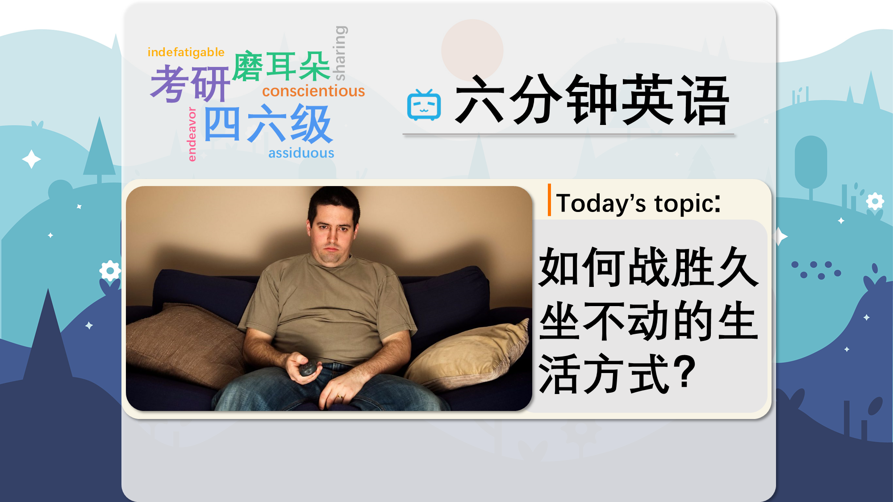

### 【英文脚本】
Catherine
Hello and welcome to 6 Minute English. I'm Catherine.

Dan
And I'm Dan.

Catherine
Now Dan, would you say you had a sedentary lifestyle at all?

Dan
If I only went to work, yes, I would have a pretty sedentary life. I sit on the tube, I sit at my desk or in the studio for most of the day. But because I know that's not good for my health, I do also like to go to the gym a couple of times a week and I'll do some exercise, like a bike ride or playing football at the weekend. So, my job is pretty sedentary, but not my life.

Catherine
Nice answer, Dan. And our topic today is about how one country in particular has been very successful in dealing with the problem of a sedentary population. But before we find out more, here is today's question. According to a recent survey, how long does the average person in the UK spend sitting down every day? Is it: a) between 6 and 7 hours; b) between 7 and 8 hours or c) between 8 and 9 hours? So, Dan, what do you think?

Dan
Based on my day, it would be between 8 and 9 hours, but I don't know if I am an average person! So I'm interested to learn the answer for myself.

Catherine
We'll find out the answer later in the programme. Now, 40 years ago Finland was perhaps the unhealthiest country in the Western world. But now, it's one of the healthiest.

Dan
Death by heart disease in Finland has fallen by 80% and life expectancy, the age at which the average person lives until, has risen by 10 years.

Catherine
How has this been achieved? This was investigated on BBC Radio 4's You and Yours programme and one of the ways Finland has improved the health of the nation is by a lot of state involvement. BBC reporter John Laurenson describes in a humorous way how this works. How does he describe someone with many health problems?

John Laurenson
If you're an exercise shirker because you're fat or old or asthmatic or chained to your computer or just plain lazy or all of those things rolled into one super-health disaster zone, they will come to you in the form perhaps, of a stern lady with a clipboard and make some firm suggestions. They won't actually drag you off your PlayStation, out of your nursing home or out of the pub but they do get quite close.

Catherine
How did he describe someone with a lot of health problems, Dan?

Dan
Well, he wasn't very complimentary, and we should emphasise that this report is quite tongue-in-cheek, which means that it's meant to be funny and shouldn't be taken seriously but he called the people with many health problems 'super-health disaster zones'.

Catherine
'Super-health disaster zones'. So what other vocabulary can we pick from what he said?

Dan
He talked about being an exercise shirker. A shirker is someone who avoids doing something usually because they are being lazy. It's also a verb, to shirk.

Catherine
Laurenson says that if you are an exercise shirker or indeed a super-health disaster zone, someone from the authorities will come and visit you. In another tongue-in-cheek description he says that this visitor might be a stern lady with a clipboard.

Dan
Stern is an adjective which means very serious and strict, someone without a sense of humour who might be quite angry. And in his description the reporter says that this stern lady will have a clipboard. It's a hard board you can attach papers to so you can write on the paper while you are moving around.

Catherine
So we have this image of an angry lady arriving at your house to tell you off for your health habits and make you live a healthier life.

Dan
But he does point out that they won't actually drag you out of your house to do exercise. However, in the report he goes on to say that there is lot of encouragement, even from school age, to eat well and take regular exercise.

Catherine
Well, before a stern lady with a clipboard comes and tells us off for not finishing on time, let's get the answer to today's quiz. According to a recent survey, how long does the average person in the UK spend sitting down every day? Is it: a) between 6 and 7 hours; b) between 7 and 8 hours or c) between 8 and 9 hours?

Dan
And I said I had no idea.

Catherine
Well, the answer was c), Dan - between 8 and 9 hours. In fact, it was 8 and a quarter hours. By comparison, in Finland, it's less than 6 hours.

Dan
I guess we are a lot more sedentary in Britain.

Catherine
And sedentary is our first word in our vocabulary review. It's an adjective used to describe a lifestyle which involves a lot of sitting and not much exercise.

Dan
And if you are very sedentary, it can lead to a lower life expectancy. Life expectancy, the age to which you are expected to live.

Catherine
Next we had the word shirker for someone who avoids doing something they don't like, usually because they are lazy. For example, an exercise shirker avoids exercise.

Dan
Something that is said tongue-in-cheek is meant to be humorous and not taken seriously.

Catherine
If you are stern though, you want to be taken seriously. It's an adjective that means serious and strict.

Dan
And finally there's clipboard. A board you attach papers to so you write on them as you walk around.

Catherine
Well, Dan, it's time for us to go and get some exercise. Join us again next time and remember you can find us on Instagram, Facebook, Twitter, YouTube and of course our website bbclearningenglish.com. See you soon, bye.

Dan
Bye!

### 【中英文双语脚本】
Catherine(凯瑟 琳)
Hello and welcome to 6 Minute English. I'm Catherine.
您好，欢迎来到 6 Minute English。我是 Catherine。

Dan(担)
And I'm Dan.
我是 Dan。

Catherine(凯瑟 琳)
Now Dan, would you say you had a sedentary lifestyle at all?
现在 Dan，你会说你有久坐不动的生活方式吗？

Dan(担)
If I only went to work, yes, I would have a pretty sedentary life. I sit on the tube, I sit at my desk or in the studio for most of the day. But because I know that's not good for my health, I do also like to go to the gym a couple of times a week and I'll do some exercise, like a bike ride or playing football at the weekend. So, my job is pretty sedentary, but not my life.
如果我只去工作，是的，我会过上久坐不动的生活。我坐在管子上，一天中的大部分时间都坐在我的办公桌前或工作室里。但因为我知道这对我的健康不利，所以我也喜欢每周去几次健身房，我会做一些运动，比如骑自行车或在周末踢足球。所以，我的工作是久坐不动的，但不是我的生活。

Catherine(凯瑟 琳)
Nice answer, Dan. And our topic today is about how one country in particular has been very successful in dealing with the problem of a sedentary population. But before we find out more, here is today's question. According to a recent survey, how long does the average person in the UK spend sitting down every day? Is it: a) between 6 and 7 hours; b) between 7 and 8 hours or c) between 8 and 9 hours? So, Dan, what do you think?
“回答得不错，丹。我们今天的主题是关于一个国家如何在处理久坐不动的人口问题方面非常成功。但在我们了解更多信息之前，这里有一个今天的问题。根据最近的一项调查，英国人平均每天坐下多长时间？是：a） 6 到 7 小时之间；b） 7 到 8 小时之间或 c） 8 到 9 小时之间？那么，Dan，你怎么看？

Dan(担)
Based on my day, it would be between 8 and 9 hours, but I don't know if I am an average person! So I'm interested to learn the answer for myself.
根据我的一天，这将在 8 到 9 小时之间，但我不知道我是否是一个普通人！所以我很想自己了解答案。

Catherine(凯瑟 琳)
We'll find out the answer later in the programme. Now, 40 years ago Finland was perhaps the unhealthiest country in the Western world. But now, it's one of the healthiest.
我们稍后会在节目中找到答案。现在，40 年前，芬兰可能是西方世界最不健康的国家。但现在，它是最健康的疫苗之一。

Dan(担)
Death by heart disease in Finland has fallen by 80% and life expectancy, the age at which the average person lives until, has risen by 10 years.
芬兰的心脏病死亡率下降了 80%，预期寿命延长了 10 年。

Catherine(凯瑟 琳)
How has this been achieved? This was investigated on BBC Radio 4's You and Yours programme and one of the ways Finland has improved the health of the nation is by a lot of state involvement. BBC reporter John Laurenson describes in a humorous way how this works. How does he describe someone with many health problems?
这是如何实现的？BBC Radio 4 的 You and Yours 节目对此进行了调查，芬兰改善国家健康的方式之一是通过大量的国家参与。BBC 记者约翰·劳伦森 以幽默的方式描述了这是如何运作的。他如何描述一个有很多健康问题的人？

John Laurenson(约翰·劳伦森)
If you're an exercise shirker because you're fat or old or asthmatic or chained to your computer or just plain lazy or all of those things rolled into one super-health disaster zone, they will come to you in the form perhaps, of a stern lady with a clipboard and make some firm suggestions. They won't actually drag you off your PlayStation, out of your nursing home or out of the pub but they do get quite close.
如果你因为肥胖、年老、哮喘、被锁在电脑前、或者只是懒惰或所有这些事情都归入一个超级健康重灾区而成为运动推卸者，他们可能会以一位拿着写字板的严厉女士的形式来找你，并提出一些坚定的建议。他们实际上不会把你从 PlayStation 上拖下来，拖出你的疗养院或酒吧，但他们确实非常接近。

Catherine(凯瑟 琳)
How did he describe someone with a lot of health problems, Dan?
丹，他是如何描述一个有很多健康问题的人的？

Dan(担)
Well, he wasn't very complimentary, and we should emphasise that this report is quite tongue-in-cheek, which means that it's meant to be funny and shouldn't be taken seriously but he called the people with many health problems 'super-health disaster zones'.
嗯，他不是很恭维，我们应该强调，这份报告相当半开玩笑，这意味着它本来就是为了搞笑，不应该被认真对待，但他称有很多健康问题的人为“超级健康灾难区”。

Catherine(凯瑟 琳)
'Super-health disaster zones'. So what other vocabulary can we pick from what he said?
“超级健康灾区”。那么，我们还可以从他所说的内容中挑选出哪些其他词汇呢？

Dan(担)
He talked about being an exercise shirker. A shirker is someone who avoids doing something usually because they are being lazy. It's also a verb, to shirk.
他谈到自己是一个运动推销者。推卸责任的人通常是因为他们懒惰而避免做某事。它也是一个动词，即 shrk。

Catherine(凯瑟 琳)
Laurenson says that if you are an exercise shirker or indeed a super-health disaster zone, someone from the authorities will come and visit you. In another tongue-in-cheek description he says that this visitor might be a stern lady with a clipboard.
劳伦森说，如果你是一个运动推销者，或者确实是一个超级健康重灾区，当局会有人来拜访你。在另一个半开玩笑的描述中，他说这位访客可能是一位拿着写字板的严厉女士。

Dan(担)
Stern is an adjective which means very serious and strict, someone without a sense of humour who might be quite angry. And in his description the reporter says that this stern lady will have a clipboard. It's a hard board you can attach papers to so you can write on the paper while you are moving around.
Stern 是一个形容词，意思是非常严肃和严格，一个没有幽默感的人可能会很生气。在他的描述中，记者说这位严厉的女士将有一个剪贴板。这是一块硬板，您可以在上面贴上纸张，这样您就可以在四处走动时在纸上写字。

Catherine(凯瑟 琳)
So we have this image of an angry lady arriving at your house to tell you off for your health habits and make you live a healthier life.
所以我们有一张生气的女士来到你家的照片，告诉你的健康习惯，让你过上更健康的生活。

Dan(担)
But he does point out that they won't actually drag you out of your house to do exercise. However, in the report he goes on to say that there is lot of encouragement, even from school age, to eat well and take regular exercise.
但他确实指出，他们实际上不会把你拖出家门去锻炼。然而，在报告中，他继续说，即使从学生时代开始，也有很多鼓励要吃得好并定期锻炼。

Catherine(凯瑟 琳)
Well, before a stern lady with a clipboard comes and tells us off for not finishing on time, let's get the answer to today's quiz. According to a recent survey, how long does the average person in the UK spend sitting down every day? Is it: a) between 6 and 7 hours; b) between 7 and 8 hours or c) between 8 and 9 hours?
好吧，在一位拿着写字板的严厉女士来告诉我们没有按时完成之前，让我们来了解今天测验的答案。根据最近的一项调查，英国人平均每天坐下多长时间？是：a） 6 到 7 小时之间；b） 7 到 8 小时之间或 c） 8 到 9 小时之间？

Dan(担)
And I said I had no idea.
我说我不知道。

Catherine(凯瑟 琳)
Well, the answer was c), Dan - between 8 and 9 hours. In fact, it was 8 and a quarter hours. By comparison, in Finland, it's less than 6 hours.
嗯，答案是 c）， Dan - 8 到 9 小时之间。事实上，那是 8 个半小时。相比之下，芬兰的车程不到 6 小时。

Dan(担)
I guess we are a lot more sedentary in Britain.
我想我们在英国久坐不动的情况要多得多。

Catherine(凯瑟 琳)
And sedentary is our first word in our vocabulary review. It's an adjective used to describe a lifestyle which involves a lot of sitting and not much exercise.
久坐是我们词汇复习中的第一个词。这是一个形容词，用于描述一种涉及大量坐着而不进行太多运动的生活方式。

Dan(担)
And if you are very sedentary, it can lead to a lower life expectancy. Life expectancy, the age to which you are expected to live.
如果你久坐不动，可能会导致预期寿命降低。预期寿命，您预计的寿命。

Catherine(凯瑟 琳)
Next we had the word shirker for someone who avoids doing something they don't like, usually because they are lazy. For example, an exercise shirker avoids exercise.
接下来，我们有 shirker 这个词，指的是那些避免做他们不喜欢的事情的人，通常是因为他们很懒惰。例如，运动的 shirker 避免运动。

Dan(担)
Something that is said tongue-in-cheek is meant to be humorous and not taken seriously.
半开玩笑地说的话是为了幽默而不是被认真对待。

Catherine(凯瑟 琳)
If you are stern though, you want to be taken seriously. It's an adjective that means serious and strict.
不过，如果你很严厉，你就会希望被认真对待。这是一个形容词，意思是严肃和严格。

Dan(担)
And finally there's clipboard. A board you attach papers to so you write on them as you walk around.
最后是剪贴板。一块你把文件贴在上面的板子，这样你就可以在走动时在上面写字。

Catherine(凯瑟 琳)
Well, Dan, it's time for us to go and get some exercise. Join us again next time and remember you can find us on Instagram, Facebook, Twitter, YouTube and of course our website bbclearningenglish.com. See you soon, bye.
好吧，Dan，我们该去锻炼一下了。下次再次加入我们，请记住您可以在 Instagram、Facebook、Twitter、YouTube 上找到我们，当然还有我们的网站 bbclearningenglish.com。再见。

Dan(担)
Bye!
再见！

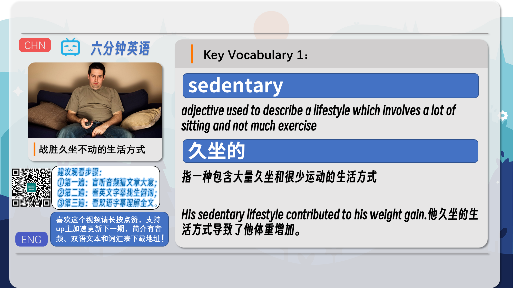
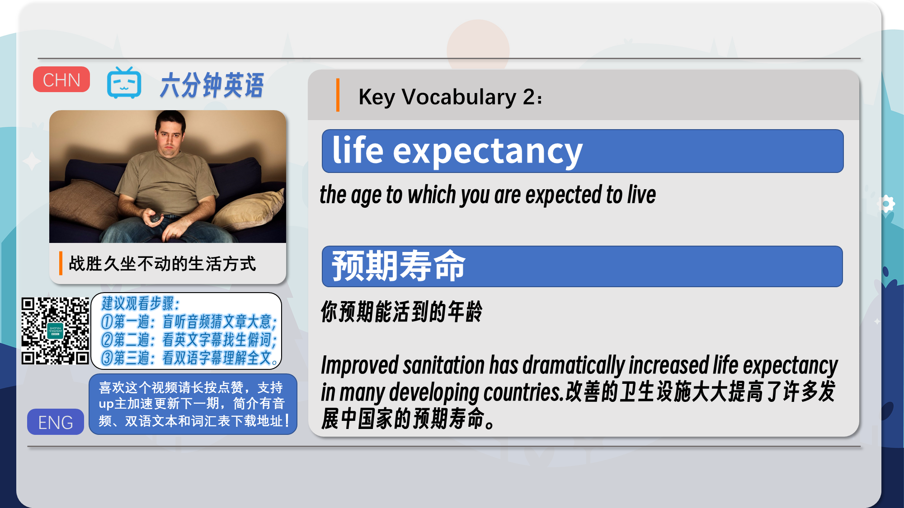
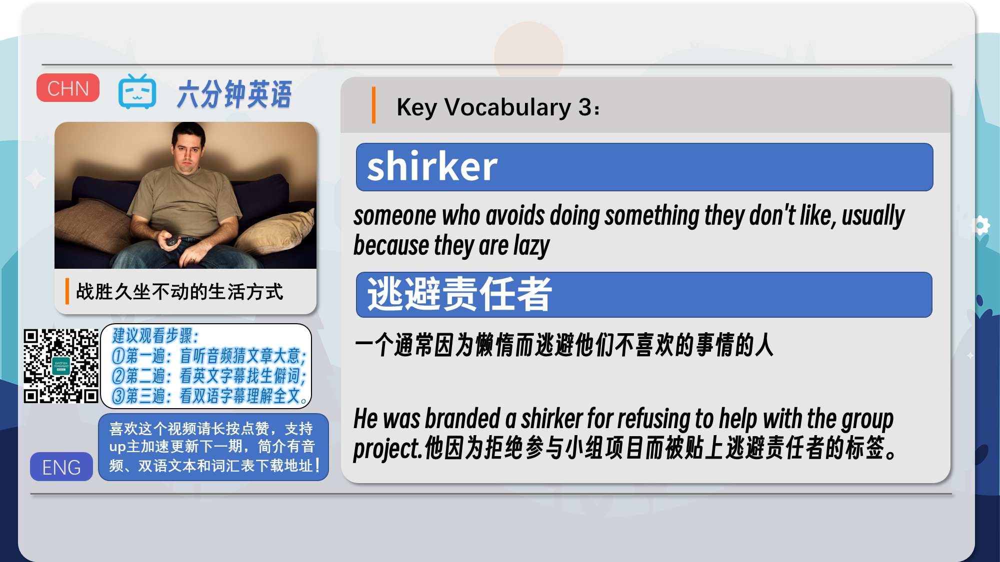
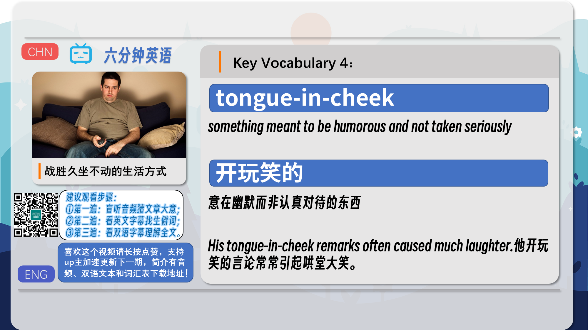
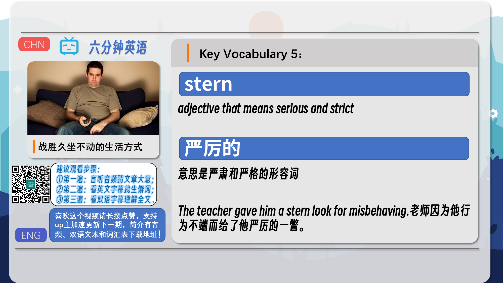
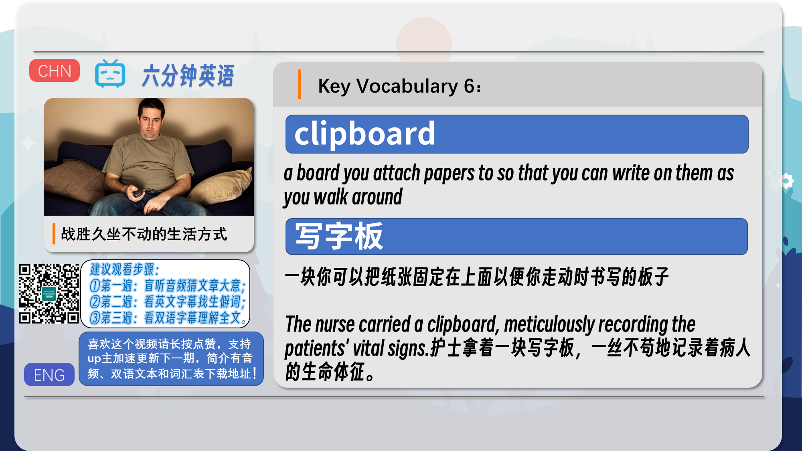
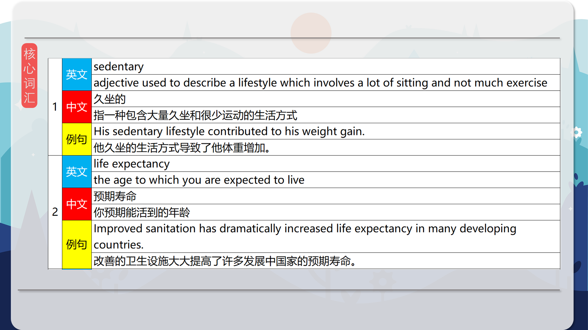
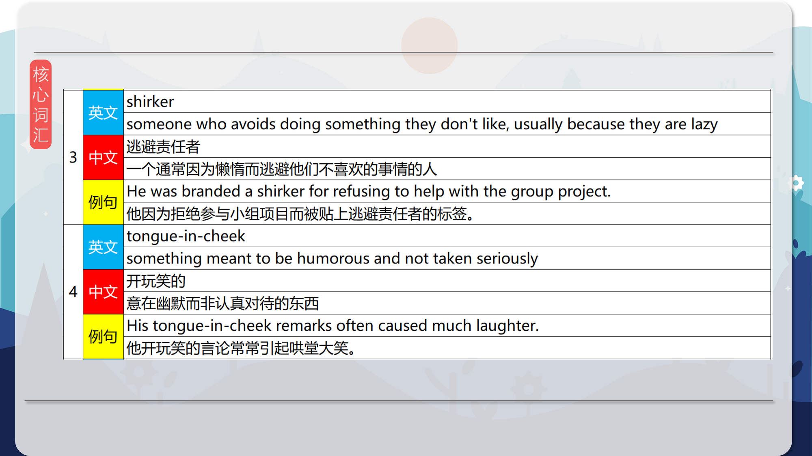
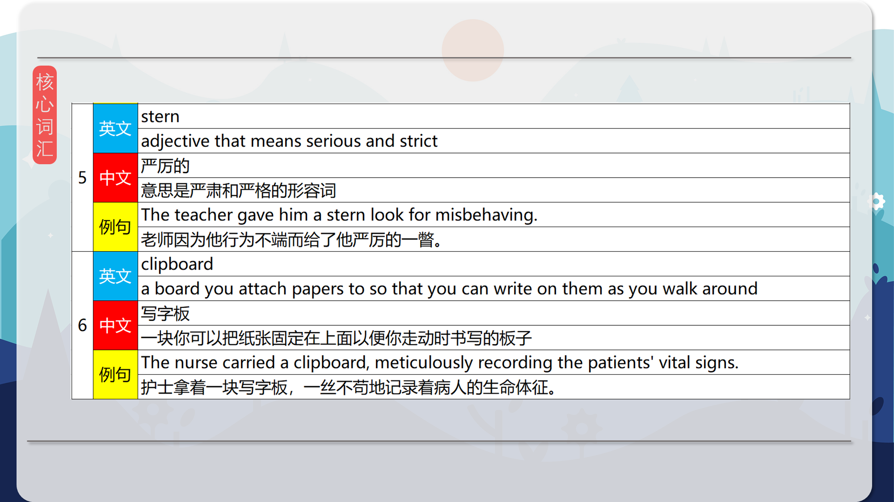
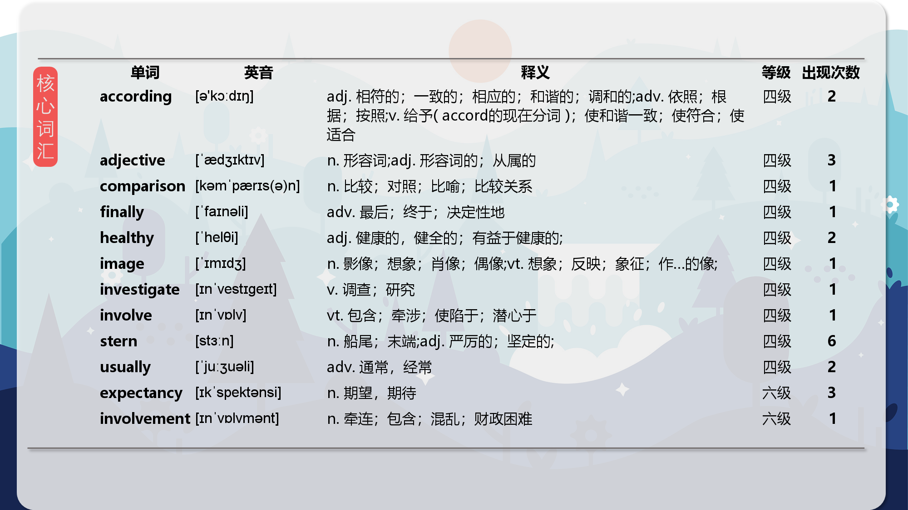
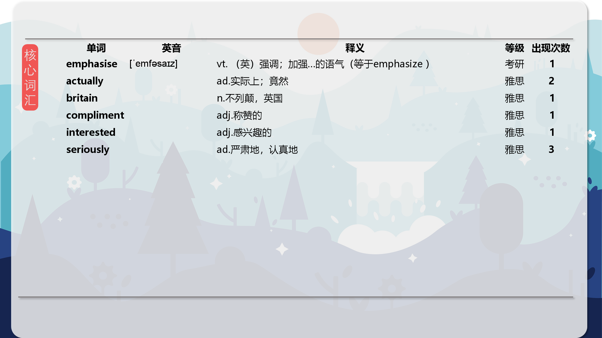

### 【核心词汇】
#### sedentary
adjective used to describe a lifestyle which involves a lot of sitting and not much exercise
久坐的
指一种包含大量久坐和很少运动的生活方式
His sedentary lifestyle contributed to his weight gain.
他久坐的生活方式导致了他体重增加。
#### life expectancy
the age to which you are expected to live
预期寿命
你预期能活到的年龄
Improved sanitation has dramatically increased life expectancy in many developing countries.
改善的卫生设施大大提高了许多发展中国家的预期寿命。
#### shirker
someone who avoids doing something they don't like, usually because they are lazy
逃避责任者
一个通常因为懒惰而逃避他们不喜欢的事情的人
He was branded a shirker for refusing to help with the group project.
他因为拒绝参与小组项目而被贴上逃避责任者的标签。
#### tongue-in-cheek
something meant to be humorous and not taken seriously
开玩笑的
意在幽默而非认真对待的东西
His tongue-in-cheek remarks often caused much laughter.
他开玩笑的言论常常引起哄堂大笑。
#### stern
adjective that means serious and strict
严厉的
意思是严肃和严格的形容词
The teacher gave him a stern look for misbehaving.
老师因为他行为不端而给了他严厉的一瞥。
#### clipboard
a board you attach papers to so that you can write on them as you walk around
写字板
一块你可以把纸张固定在上面以便你走动时书写的板子
The nurse carried a clipboard, meticulously recording the patients' vital signs.
护士拿着一块写字板，一丝不苟地记录着病人的生命体征。

在公众号里输入6位数字，获取【对话音频、英文文本、中文翻译、核心词汇和高级词汇表】电子档，6位数字【暗号】在文章的最后一张图片，如【220728】，表示22年7月28日这一期。公众号没有的文章说明还没有制作相关资料。年度合集在B站【六分钟英语】工房获取，每年共计300+文档，感谢支持！